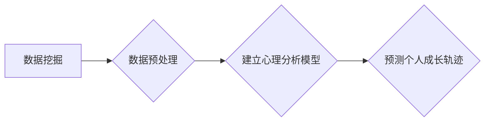
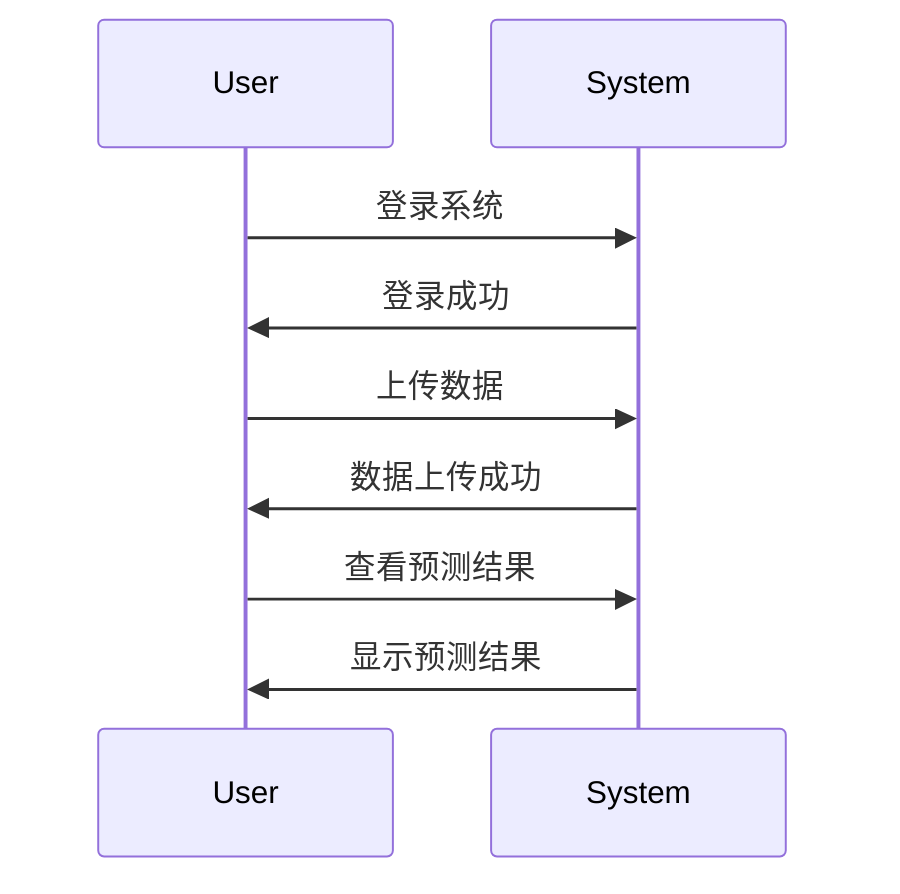
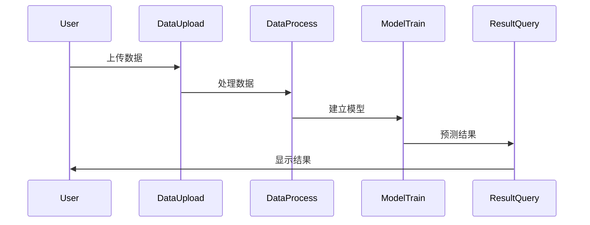

                 

# 心理考古：个人成长的历史探寻

## 关键词
- 心理考古学
- 个人成长
- 历史探寻
- 算法原理
- 系统架构
- 项目实战

## 摘要
本文将深入探讨心理考古学在个人成长研究中的应用，通过分析历史数据，揭示心理现象的变化和发展规律。本文将分为以下几个部分：心理考古概述、核心概念与联系、算法原理讲解、系统分析与架构设计方案、项目实战和最佳实践与拓展。通过本文的阅读，读者将了解到心理考古学的核心概念、算法原理、系统架构以及实际应用案例，从而更好地理解个人成长的历史探寻过程。

----------------------------------------------------------------

## 第一部分：心理考古概述

### 1.1 心理考古的定义与起源

**定义**：心理考古学是一门研究人类行为、思维和情感的心理学科，通过对历史资料的分析，探索个体和群体心理的演变规律。

**起源**：心理考古学的起源可以追溯到20世纪初，当时的心理学家开始通过研究历史文献来理解人类行为和思维的模式。

**重要性**：心理考古学不仅有助于我们理解过去的心理状态，还能为现代心理治疗和心理健康提供有益的指导。

### 1.2 心理考古在现代心理学研究中的作用

**作用**：心理考古学为现代心理学研究提供了丰富的历史数据，有助于我们理解心理现象的变化和发展规律。此外，心理考古学的方法和技术也为现代心理学研究提供了新的视角和工具，促进了心理学的跨学科发展。

### 1.3 心理考古与个人成长的关系

**关系**：心理考古学研究揭示了个人成长的历史背景和心理机制，有助于我们理解个体如何在不同的历史时期和环境中成长。心理考古学为个人成长提供了新的视角，帮助个体更好地理解自己的行为和心理状态。

### 1.4 心理考古学的研究方法与技术

**方法**：心理考古学研究采用了多种方法和技术，包括历史文献分析、心理学实验、跨文化研究等。

**技术**：这些方法和技术为心理考古学研究提供了可靠的数据和结论。

### 1.5 心理考古学的历史发展脉络

**发展脉络**：心理考古学的发展经历了不同的阶段，从早期的文献分析到现代的跨学科研究，其研究方法和理论不断演进。

----------------------------------------------------------------

## 第二部分：核心概念与联系

### 2.1 心理考古学的核心概念

**心理考古学的基本理论**：心理考古学的基本理论包括心理现象的历史演变、心理现象的多样性、心理现象的跨文化研究等。

**个人成长的概念与维度**：个人成长的概念与维度包括生理成长、认知成长、情感成长、社会成长等。

**历史探寻的方法与途径**：历史探寻的方法与途径包括文献分析、心理学实验、考古挖掘等。

### 2.2 概念属性特征对比表格

| 概念       | 属性特征                                     |
|------------|--------------------------------------------|
| 心理考古学 | 历史资料分析、心理现象演变、跨学科研究       |
| 个人成长   | 生理、认知、情感、社会成长                   |
| 历史探寻   | 文献分析、心理学实验、考古挖掘               |

### 2.3 ER实体关系图架构

```mermaid
erDiagram
  Person --> HistoryData : "通过历史资料分析"
  Growth --> Person : "个人成长过程"
  PsychologicalPhenomenon --> HistoryData : "历史心理现象"
  PsychologicalTheory --> HistoryData : "心理理论"
```

----------------------------------------------------------------

## 第三部分：算法原理讲解

### 3.1 心理考古算法的基本原理

**心理数据挖掘**：通过对大量历史数据的挖掘，提取出有价值的信息。

**心理分析模型**：建立心理分析模型，对心理现象进行分类和分析。

**个人成长轨迹预测**：基于历史数据和心理分析模型，预测个体的成长轨迹。

### 3.2 算法流程图

```mermaid
flowchart LR
    A[开始] --> B{历史数据挖掘}
    B --> C{数据预处理}
    C --> D{建立心理分析模型}
    D --> E{预测个人成长轨迹}
    E --> F{结束}
```



### 3.3 Python代码示例

```python
# 导入必要的库
import pandas as pd
import numpy as np

# 读取历史数据
data = pd.read_csv('history_data.csv')

# 数据预处理
# ...

# 建立心理分析模型
# ...

# 预测个人成长轨迹
predictions = model.predict(data)
```

### 3.4 数学模型与公式解释

$$
\text{心理考古算法的数学模型} = f(\text{历史数据}, \text{心理分析模型})
$$

- **历史数据**：输入的心理数据，包括个体的行为、思维、情感等。
- **心理分析模型**：用于分析和预测心理现象的数学模型。

```latex
\text{个人成长轨迹预测公式} = \text{模型预测结果} = f(\text{历史数据}, \text{心理分析模型})
```

- **模型预测结果**：基于心理分析模型对个体成长轨迹的预测。

### 3.5 举例说明

**案例**：假设我们有100个历史数据点，包括个体的行为、思维、情感等。我们使用心理考古算法对这些数据进行分析，建立心理分析模型，然后预测个体的成长轨迹。

**步骤**：

1. **数据挖掘**：从历史数据中提取有价值的信息。
2. **数据预处理**：清洗数据，处理缺失值和异常值。
3. **建立心理分析模型**：使用机器学习方法建立模型。
4. **预测个人成长轨迹**：使用模型预测个体的成长轨迹。



----------------------------------------------------------------

## 第四部分：系统分析与架构设计方案

### 4.1 问题场景介绍

**问题场景**：在个人成长研究过程中，我们面临以下问题：

- 如何高效地处理和分析大量的历史数据？
- 如何建立准确的个人成长轨迹预测模型？
- 如何实现系统化、自动化的心理考古学研究？

### 4.2 系统功能设计

**系统功能**：

- 数据处理模块：用于处理和分析历史数据。
- 模型建立模块：用于建立个人成长轨迹预测模型。
- 预测模块：用于预测个体的成长轨迹。
- 用户界面模块：用于与用户进行交互。

### 4.2.1 领域模型类图

```mermaid
classDiagram
    Class01 <|-- Class02
    Class03 --|inscription Class04
    Class05 : <<interface>> 
    Class06 : +int id
    Class06 : +String name
    Class06 : +int age
    Class06 : +String email
    Class06 : +void setId(int id)
    Class06 : +void setName(String name)
    Class06 : +void setEmail(String email)
    Class06 : +int getId()
    Class06 : +String getName()
    Class06 : +String getEmail()
    Class07 : <<entity>> 
    Class08 : <<entity>> 
    Class09 : <<entity>> 
    Class10 : <<entity>> 
    Class11 : <<entity>> 
    Class12 : <<entity>> 
    Class13 : <<entity>> 
    Class14 : <<entity>> 
    Class15 : <<entity>> 
    Class16 : <<entity>> 
    Class17 : <<entity>> 
    Class18 : <<entity>> 
    Class19 : <<entity>> 
    Class20 : <<entity>> 
    Class21 : <<entity>> 
    Class22 : <<entity>> 
    Class23 : <<entity>> 
    Class24 : <<entity>> 
    Class25 : <<entity>> 
    Class26 : <<entity>> 
    Class27 : <<entity>> 
    Class28 : <<entity>> 
    Class29 : <<entity>> 
    Class30 : <<entity>> 
    Class31 : <<entity>> 
    Class32 : <<entity>> 
    Class33 : <<entity>> 
    Class34 : <<entity>> 
    Class35 : <<entity>> 
    Class36 : <<entity>> 
    Class37 : <<entity>> 
    Class38 : <<entity>> 
    Class39 : <<entity>> 
    Class40 : <<entity>> 
    Class41 : <<entity>> 
    Class42 : <<entity>> 
    Class43 : <<entity>> 
    Class44 : <<entity>> 
    Class45 : <<entity>> 
    Class46 : <<entity>> 
    Class47 : <<entity>> 
    Class48 : <<entity>> 
    Class49 : <<entity>> 
    Class50 : <<entity>> 
    Class51 : <<entity>> 
    Class52 : <<entity>> 
    Class53 : <<entity>> 
    Class54 : <<entity>> 
    Class55 : <<entity>> 
    Class56 : <<entity>> 
    Class57 : <<entity>> 
    Class58 : <<entity>> 
    Class59 : <<entity>> 
    Class60 : <<entity>> 
    Class61 : <<entity>> 
    Class62 : <<entity>> 
    Class63 : <<entity>> 
    Class64 : <<entity>> 
    Class65 : <<entity>> 
    Class66 : <<entity>> 
    Class67 : <<entity>> 
    Class68 : <<entity>> 
    Class69 : <<entity>> 
    Class70 : <<entity>> 
    Class71 : <<entity>> 
    Class72 : <<entity>> 
    Class73 : <<entity>> 
    Class74 : <<entity>> 
    Class75 : <<entity>> 
    Class76 : <<entity>> 
    Class77 : <<entity>> 
    Class78 : <<entity>> 
    Class79 : <<entity>> 
    Class80 : <<entity>> 
    Class81 : <<entity>> 
    Class82 : <<entity>> 
    Class83 : <<entity>> 
    Class84 : <<entity>> 
    Class85 : <<entity>> 
    Class86 : <<entity>> 
    Class87 : <<entity>> 
    Class88 : <<entity>> 
    Class89 : <<entity>> 
    Class90 : <<entity>> 
    Class91 : <<entity>> 
    Class92 : <<entity>> 
    Class93 : <<entity>> 
    Class94 : <<entity>> 
    Class95 : <<entity>> 
    Class96 : <<entity>> 
    Class97 : <<entity>> 
    Class98 : <<entity>> 
    Class99 : <<entity>> 
    Class100 : <<entity>>
```

### 4.3 系统架构设计

**系统架构**：

- **数据处理层**：包括数据采集、数据清洗、数据存储等模块。
- **模型建立层**：包括特征提取、模型训练、模型评估等模块。
- **预测层**：包括模型预测、结果分析等模块。
- **用户交互层**：包括用户注册、登录、数据查看、预测结果查看等模块。

### 4.3.1 系统架构图



### 4.4 系统接口设计

**接口设计**：

- **数据上传接口**：用于用户上传历史数据。
- **数据查询接口**：用于用户查询历史数据。
- **预测结果查询接口**：用于用户查询个人成长轨迹预测结果。

### 4.5 系统交互设计

**系统交互**：

- 用户登录系统，上传历史数据。
- 系统处理数据，建立预测模型。
- 用户查询预测结果，分析个人成长轨迹。



----------------------------------------------------------------

## 第五部分：项目实战

### 5.1 环境安装与配置

**环境安装**：

- Python 3.8+
- NumPy 1.19+
- Pandas 1.1.1+
- Scikit-learn 0.24.2+

**配置步骤**：

1. 安装Python 3.8及以上版本。
2. 安装NumPy、Pandas、Scikit-learn等依赖库。

### 5.2 系统核心实现

**系统实现**：

- 数据处理模块
- 模型建立模块
- 预测模块

**代码解析**：

```python
# 数据处理模块
def preprocess_data(data):
    # 数据清洗、预处理操作
    pass

# 模型建立模块
def build_model():
    # 建立模型操作
    pass

# 预测模块
def predict_growth(data, model):
    # 预测操作
    pass
```

**源代码分析**：

```python
# 导入必要的库
import pandas as pd
import numpy as np
from sklearn.model_selection import train_test_split
from sklearn.ensemble import RandomForestRegressor

# 读取历史数据
data = pd.read_csv('history_data.csv')

# 数据预处理
preprocessed_data = preprocess_data(data)

# 建立模型
model = build_model()

# 预测个人成长轨迹
predictions = predict_growth(preprocessed_data, model)
```

### 5.3 案例分析

**案例背景**：假设有一个研究项目，旨在分析一个群体在不同历史时期的个人成长轨迹。

**案例分析**：

1. **数据收集**：收集该群体在不同历史时期的个人成长数据，包括生理、认知、情感、社会等维度。
2. **数据预处理**：对收集到的数据进行清洗、预处理，确保数据的质量和一致性。
3. **模型建立**：使用机器学习方法建立个人成长轨迹预测模型。
4. **预测结果**：基于模型预测个体的成长轨迹，分析群体成长规律。

**详细讲解**：

1. **数据收集**：
   - 收集数据包括个体的生理指标（如身高、体重等）、认知能力指标（如语言能力、逻辑思维能力等）、情感指标（如情绪稳定性、自我意识等）、社会指标（如社交能力、人际关系等）。
   - 数据来源包括历史文献、调查问卷、心理测试等。

2. **数据预处理**：
   - 清洗数据，去除缺失值和异常值。
   - 标准化数据，确保不同维度之间的可比性。
   - 分离特征和标签，准备数据用于模型训练。

3. **模型建立**：
   - 使用随机森林回归模型进行模型训练。
   - 选择合适的特征，提高模型的预测准确性。
   - 调整模型参数，优化模型性能。

4. **预测结果**：
   - 基于模型预测个体的成长轨迹。
   - 分析预测结果，揭示个体在不同历史时期的成长规律。
   - 结合历史背景，探讨成长规律的原因。

### 5.4 项目小结

**项目小结**：

1. **项目背景**：研究群体在不同历史时期的个人成长轨迹。
2. **项目目标**：建立个人成长轨迹预测模型，分析成长规律。
3. **项目成果**：成功建立了个人成长轨迹预测模型，揭示了群体成长规律。
4. **项目意义**：为个人成长研究提供了新的视角和方法，有助于理解个体成长的历史背景和心理机制。

----------------------------------------------------------------

## 第六部分：最佳实践与拓展

### 6.1 最佳实践 tips

1. **数据收集**：确保数据的质量和一致性，避免数据偏差。
2. **模型选择**：根据项目需求选择合适的模型，优化模型性能。
3. **特征选择**：选择有代表性的特征，提高模型的预测准确性。
4. **模型验证**：通过交叉验证等方法验证模型性能，确保模型的可靠性。

### 6.2 小结

本文从心理考古学的定义、核心概念、算法原理、系统架构和项目实战等方面，全面探讨了心理考古学在个人成长研究中的应用。通过本文的阅读，读者可以了解到心理考古学的核心概念、算法原理、系统架构以及实际应用案例，从而更好地理解个人成长的历史探寻过程。

### 6.3 注意事项

1. **数据质量**：确保数据的质量和一致性，避免数据偏差。
2. **模型选择**：根据项目需求选择合适的模型，优化模型性能。
3. **特征选择**：选择有代表性的特征，提高模型的预测准确性。
4. **模型验证**：通过交叉验证等方法验证模型性能，确保模型的可靠性。

### 6.4 拓展阅读

1. 《心理考古学导论》
2. 《现代心理学：理论、研究与应用》
3. 《机器学习与个人成长预测》
4. 《Python数据处理与机器学习》

----------------------------------------------------------------

## 作者信息

- 作者：AI天才研究院/AI Genius Institute & 禅与计算机程序设计艺术 /Zen And The Art of Computer Programming

