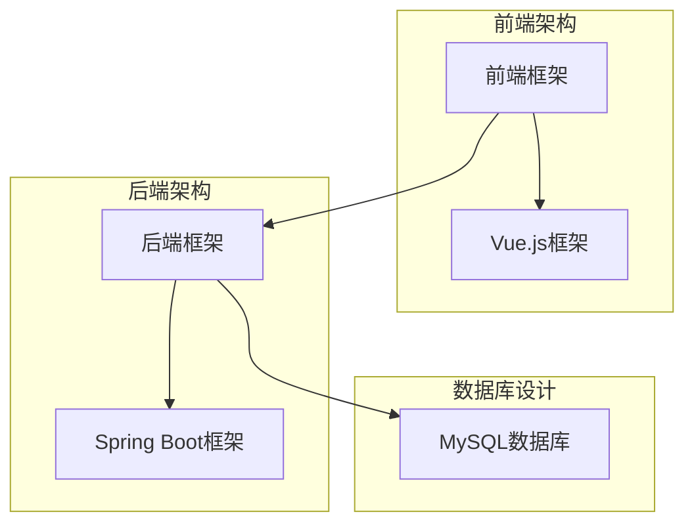
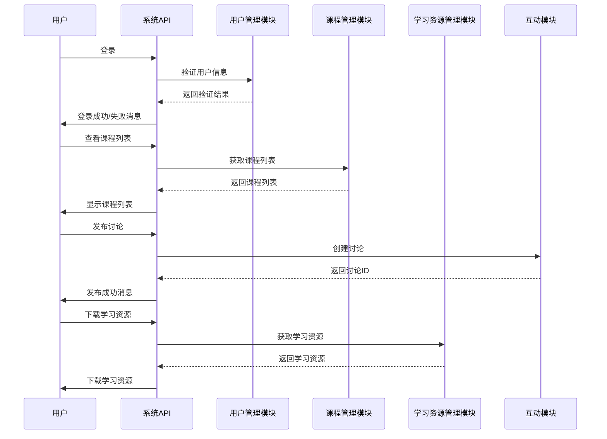

                 

### 第一部分：背景介绍

#### 第一章：快餐文化与批判性思维

##### 1.1 快餐文化的兴起

在当今数字化和全球化的时代，信息传播的速度和广度前所未有。随之而来的是快餐文化的兴起，这种文化特征体现在人们倾向于快速获取信息、追求即时满足，而忽视深入理解和思考。快餐文化的产物——如短视频、微博、新闻头条等，以其简洁、直观、快速的特点受到广大用户的青睐。然而，这种文化的普及也带来了一些负面影响，其中之一便是批判性思维的缺失。

快餐文化的兴起，可以从技术进步和社会结构变化两个方面来理解。随着互联网技术的发展，信息的获取变得更加便捷，人们可以在短时间内浏览大量信息。同时，社交媒体和即时通讯工具的流行，使得信息的传播速度极大提升。这种信息过载的现象，导致人们难以深入思考，逐渐丧失了批判性思维的能力。

##### 1.2 快餐文化的影响

快餐文化的影响是多方面的。在教育领域，学生倾向于通过搜索引擎快速查找答案，而忽视了对问题的深入探究。在职场中，员工往往追求短期的业绩和回报，而忽视长期的发展和积累。在公共舆论领域，快餐文化的传播往往导致偏激和极端的观点，缺乏理性和客观性。

更严重的是，快餐文化对批判性思维的侵蚀，使得人们在面对复杂问题时，难以提出独立的见解和有效的解决方案。批判性思维是理性思考的核心，它要求我们对信息进行深入分析，评估其真实性、合理性和可靠性。缺乏批判性思维，人们容易受到误导，甚至陷入思维定势和偏见。

##### 1.3 批判性思维的重要性

批判性思维在现代社会中具有至关重要的地位。它不仅是个人成长和职业发展的基础，也是社会进步和科技创新的推动力。批判性思维有助于我们更好地理解世界，发现问题，提出解决方案，并评估其效果。

在教育领域，批判性思维是培养学生独立思考能力和创新能力的关键。通过批判性思维，学生可以学会如何分析问题、评估信息、提出假设和验证结论，从而培养出解决问题的能力。

在职场中，批判性思维是提高工作效率和质量的重要手段。通过批判性思维，员工可以更好地理解任务要求，分析问题的本质，提出创新的解决方案，并评估方案的可行性。

在公共领域，批判性思维是形成理性舆论和科学决策的基础。通过批判性思维，公众可以更好地理解复杂的社会问题，评估各种观点的合理性，并提出合理的建议。

##### 1.4 批判性思维与快餐文化的对比

批判性思维与快餐文化存在明显的差异。批判性思维是一种深度思考和系统分析的能力，它要求我们不仅仅接受信息，还要对其进行分析、评估和批判。而快餐文化则是一种浅层次的信息消费方式，它倾向于提供简洁、直观、快速的信息，而忽视信息的深度和复杂性。

批判性思维强调独立思考，鼓励我们对信息进行质疑和探索，从而形成独立的见解。而快餐文化则容易导致盲目接受信息，缺乏独立思考的能力。

批判性思维要求我们具备系统分析的能力，能够从多个角度对问题进行分析，找到问题的本质。而快餐文化则倾向于提供碎片化的信息，使得人们难以形成全面的视角。

综上所述，批判性思维在现代社会中具有不可替代的重要性。它不仅有助于我们更好地理解世界，解决问题，还有助于我们培养独立思考的能力，提高个人和组织的竞争力。因此，我们需要警惕快餐文化的侵蚀，积极培养批判性思维，以应对日益复杂的社会环境。接下来，我们将进一步探讨批判性思维的定义、核心要素及其价值。

### 第二章：批判性思维的重要性

#### 2.1 批判性思维的定义

批判性思维（Critical Thinking）是一种理性分析和评估信息的能力。它不仅仅是质疑和批评，而是一种积极的思考过程，旨在发现、分析、评估和解决问题。批判性思维涉及对信息来源、证据、假设和结论的仔细审查，确保它们符合逻辑和理性原则。

批判性思维的定义可以概括为以下几个关键点：

- **目的性**：批判性思维是有明确目的的思考过程，旨在寻求真理、解决问题和做出明智的决策。
- **系统性**：批判性思维要求对信息进行系统性的分析和评估，而不是孤立地看待问题。
- **逻辑性**：批判性思维依赖于逻辑原则，确保推理的准确性和有效性。
- **客观性**：批判性思维追求客观性，尽量避免个人偏见和主观臆断。

#### 2.2 批判性思维的核心要素

批判性思维的核心要素包括以下几个方面：

- **清晰性**：清晰性是批判性思维的基础，确保我们的思考是明确和有条理的。
- **逻辑性**：逻辑性是指我们的思考是否符合逻辑规则，推理是否合理。
- **证据**：批判性思维依赖于证据，我们需要基于可靠的数据和事实进行推理和判断。
- **开放性**：开放性意味着我们应该对不同的观点和解决方案持开放态度，而不是固守一种思维方式。
- **反思性**：反思性是指我们应该不断审视自己的思考过程和结论，确保其合理性和有效性。

#### 2.3 批判性思维的价值

批判性思维在多个领域都具有重要的价值，以下是一些具体的应用场景：

- **教育领域**：批判性思维是教育的核心目标之一，通过培养学生的批判性思维，可以提升他们的分析能力、问题解决能力和创新能力。
- **职场领域**：在职场中，批判性思维有助于员工更好地理解任务需求，分析问题的本质，并提出创新的解决方案，从而提高工作效率和质量。
- **公共领域**：在公共领域，批判性思维有助于公众更好地理解复杂的社会问题，评估各种政策和观点的合理性，并提出合理的建议。
- **科技创新**：在科技创新领域，批判性思维是推动技术进步和创新的重要动力，通过批判性思维，科学家和工程师可以不断审视现有技术，提出改进和创新的想法。

#### 2.4 如何培养批判性思维

要培养批判性思维，我们可以采取以下几种方法：

- **积极提问**：鼓励自己对问题进行深入提问，不仅仅停留在表面层次，而是试图挖掘问题的本质。
- **阅读和分析**：广泛阅读不同类型的书籍和文章，培养对不同观点和论证方式的敏感度，并进行深入分析。
- **实践应用**：将批判性思维应用于实际生活和工作场景，通过实际操作来提高自己的批判性思维能力。
- **反思和总结**：定期对自己的思考过程和结论进行反思和总结，找出其中的不足之处，并加以改进。

总之，批判性思维是一种重要的思维能力，它不仅有助于我们更好地理解世界和解决问题，还能提升我们的个人和职业竞争力。通过培养批判性思维，我们可以更好地应对复杂的社会环境，做出更加明智的决策。接下来，我们将进一步探讨批判性思维的基本原则和应用场景。

### 第二部分：核心概念与联系

#### 第三章：批判性思维的基本原则

批判性思维的基本原则是指导我们进行理性分析和评估的重要指南。以下是几个关键原则：

##### 3.1 确认事实

确认事实是批判性思维的基础。在分析和评估任何观点或信息之前，我们首先需要确保其基于真实、可靠的事实。这一原则要求我们：

- **核实信息来源**：确保信息来源的可靠性和权威性，避免接受未经证实的信息。
- **交叉验证**：对同一信息从多个来源进行验证，以确认其准确性。
- **避免假设**：在进行分析之前，尽量避免任何未经验证的假设。

##### 3.2 分析推理

分析推理是指将信息分解为基本部分，并对其各个部分之间的关系进行分析。这一原则要求我们：

- **分解问题**：将复杂问题分解为更小、更具体的部分，以便更好地理解和分析。
- **逻辑链条**：确保推理过程中的每一步都是逻辑上成立的，避免跳跃性思维。
- **识别谬误**：识别和分析推理过程中的逻辑谬误，例如因果关系不清、推理链条不完整等。

##### 3.3 检验假设

检验假设是指对提出的假设进行验证，以确保其合理性。这一原则要求我们：

- **构建实验**：设计实验或研究来检验假设，以确定其是否成立。
- **评估结果**：根据实验结果评估假设的有效性，并根据需要进行调整。
- **开放性**：对假设持开放态度，即使其被证明不正确，也愿意接受并修正。

##### 3.4 推导结论

推导结论是指根据分析结果得出结论，并对结论进行评估。这一原则要求我们：

- **逻辑一致性**：确保结论在逻辑上是自洽的，避免结论前后矛盾。
- **证据支持**：结论需要基于充分的事实和证据，而不是凭空臆测。
- **开放反思**：对结论进行反思和评估，确保其符合实际和逻辑要求。

#### 3.5 批判性思维的应用场景

批判性思维的应用场景非常广泛，以下是一些典型领域：

- **教育领域**：在教育中，批判性思维是培养学生独立思考和问题解决能力的重要手段。
- **职场领域**：在职场中，批判性思维有助于员工做出明智的决策，提高工作效率。
- **科学研究**：在科学研究领域，批判性思维是确保研究成果可靠性和有效性的关键。
- **社会问题解决**：在面对社会问题时，批判性思维有助于我们更好地理解问题本质，提出有效的解决方案。

#### 3.6 批判性思维与快餐文化的对比

批判性思维与快餐文化在思维方式上有显著差异：

- **深度与广度**：批判性思维注重深度分析和全面思考，而快餐文化倾向于快速获取和表面理解。
- **独立与依赖**：批判性思维鼓励独立思考和质疑，而快餐文化往往导致盲目接受和缺乏独立判断。
- **系统性分析**：批判性思维要求对问题进行系统性分析，而快餐文化则倾向于提供碎片化信息。

通过对比，我们可以看到批判性思维在提升理性思考、问题解决能力和创新思维方面的独特优势。因此，培养批判性思维对于应对复杂多变的社会环境具有重要意义。接下来，我们将进一步探讨批判性思维在具体领域的应用。

### 第三部分：算法原理讲解

#### 第五章：算法原理讲解

批判性思维的算法原理是一种系统性的分析方法，旨在帮助我们更有效地进行思考、评估和决策。以下是批判性思维算法的基本原理和步骤：

##### 5.1 批判性思维的算法模型

批判性思维的算法模型可以概括为以下步骤：

1. **明确问题**：首先，我们需要明确问题的性质和目标，以便进行有针对性的分析。
2. **收集信息**：收集与问题相关的各种信息，包括数据、事实、观点等。
3. **分析信息**：对收集到的信息进行系统分析，识别关键因素和主要观点。
4. **评估证据**：评估信息的可靠性和有效性，确保推理基于充分和可靠的事实。
5. **提出假设**：根据分析结果提出合理的假设，并对假设进行验证。
6. **推导结论**：根据假设和证据推导出结论，并评估结论的合理性和有效性。
7. **反思和调整**：对整个思考过程和结论进行反思，识别不足之处并加以调整。

##### 5.2 算法模型的数学模型和公式

为了更好地理解批判性思维的算法原理，我们可以借助一些数学模型和公式。以下是几个关键模型和公式：

1. **逻辑运算**：逻辑运算（如合取、析取、否定等）是批判性思维的基础。常用的逻辑运算公式包括：
   - 合取（AND）：\(P \land Q\)
   - 析取（OR）：\(P \lor Q\)
   - 否定（NOT）：\(\neg P\)
2. **概率论**：概率论在批判性思维中用于评估事件的可靠性和可能性。常用的概率公式包括：
   - 条件概率：\(P(A|B) = \frac{P(A \cap B)}{P(B)}\)
   - 全概率公式：\(P(A) = \sum_{i=1}^{n} P(A|B_i)P(B_i)\)
3. **贝叶斯定理**：贝叶斯定理用于根据新信息更新概率估计，其公式为：
   - \(P(H|E) = \frac{P(E|H)P(H)}{P(E)}\)

##### 5.3 算法原理的详细讲解

以下是批判性思维算法原理的详细讲解：

1. **明确问题**：这是整个分析过程的起点。明确问题不仅有助于我们集中注意力，还能确保我们的分析方向正确。
2. **收集信息**：在明确问题后，我们需要收集与问题相关的信息。这包括事实、数据、观点等。收集信息的过程应注重多样性和全面性，以避免片面和误导性的分析。
3. **分析信息**：对收集到的信息进行系统分析，识别关键因素和主要观点。这一步骤要求我们对信息进行分类、归纳和关联，以便更好地理解和处理信息。
4. **评估证据**：评估信息的可靠性和有效性。这一步骤至关重要，因为基于不可靠或错误的信息得出的结论往往是无效的。评估证据时，应考虑信息来源的权威性和可靠性，以及证据之间的相互关系。
5. **提出假设**：在评估证据的基础上，提出合理的假设。假设应具有可验证性和合理性，以便后续的验证和评估。
6. **推导结论**：根据假设和证据推导出结论。推导结论的过程应遵循逻辑原则，确保结论在逻辑上是自洽的。
7. **反思和调整**：对整个思考过程和结论进行反思，识别不足之处并加以调整。这一步骤有助于提高分析的准确性和有效性。

通过以上步骤，我们可以更好地运用批判性思维进行思考和决策。接下来，我们将进一步探讨批判性思维在具体问题中的应用。

#### 第六章：数学模型和数学公式

在批判性思维的算法原理中，数学模型和数学公式起着至关重要的作用，它们帮助我们更精确地进行推理和评估。以下将详细讲解几个关键的数学模型和数学公式，并举例说明如何应用。

##### 6.1 批判性思维的数学模型

1. **逻辑模型**：逻辑模型是批判性思维的基础，它通过基本的逻辑运算来表示和理解推理。例如，条件语句（如果...那么...）和逆命题（逆否命题）都是逻辑模型的一部分。例如：
   - 条件语句：\(P \rightarrow Q\)，表示如果P成立，那么Q也成立。
   - 逆命题：\(\neg Q \rightarrow \neg P\)，表示如果Q不成立，那么P也不成立。

2. **概率模型**：概率模型用于评估不确定事件的可能性。在批判性思维中，概率模型可以帮助我们更准确地评估证据的可靠性和结论的合理性。例如，贝叶斯定理是概率模型中的一个重要工具，用于更新概率估计。例如：
   - 贝叶斯定理公式：\(P(H|E) = \frac{P(E|H)P(H)}{P(E)}\)，其中\(P(H|E)\)表示在证据E出现的情况下假设H的概率，\(P(E|H)\)表示假设H成立时证据E的概率，\(P(H)\)表示假设H的先验概率，\(P(E)\)表示证据E的总体概率。

##### 6.2 数学公式的使用

1. **概率公式**：在批判性思维中，概率公式用于评估信息的可靠性和推理的合理性。例如，条件概率公式和全概率公式可以帮助我们根据新信息更新概率估计。例如：
   - 条件概率公式：\(P(A|B) = \frac{P(A \cap B)}{P(B)}\)，表示在事件B发生的条件下事件A发生的概率。
   - 全概率公式：\(P(A) = \sum_{i=1}^{n} P(A|B_i)P(B_i)\)，表示在多个条件下的总概率。

2. **统计公式**：统计公式用于分析和解释数据。在批判性思维中，统计公式可以帮助我们评估数据的可靠性和趋势。例如，平均值、标准差和方差等统计量都是常用的工具。例如：
   - 平均值公式：\(\bar{X} = \frac{1}{n}\sum_{i=1}^{n} X_i\)，表示数据的平均值。
   - 标准差公式：\(\sigma = \sqrt{\frac{1}{n-1}\sum_{i=1}^{n} (X_i - \bar{X})^2}\)，表示数据的标准差。

##### 6.3 数学模型的详细讲解

1. **逻辑模型的应用**：逻辑模型在批判性思维中用于分析推理和验证假设。例如，我们可以使用逻辑运算来表示和分析一个复杂的推理过程，确保每一步都是逻辑上成立的。例如：
   - 假设我们有两个前提：\(P: 所有天鹅都是白色的\)和\(Q: 观察到的天鹅是白色的\)。我们要验证结论：\(R: 这个天鹅是白色的\)。使用逻辑模型，我们可以表示为：\(P \land Q \rightarrow R\)。

2. **概率模型的应用**：概率模型在批判性思维中用于评估证据的可靠性和结论的合理性。例如，我们可以使用贝叶斯定理来更新我们的概率估计，基于新的证据来评估一个假设的可能性。例如：
   - 假设我们有一个假设H，先验概率为0.5。我们观察到一些证据E，这些证据使我们的概率估计变为0.8。使用贝叶斯定理，我们可以更新假设H的概率为：\(P(H|E) = \frac{P(E|H)P(H)}{P(E)}\)。

3. **统计模型的应用**：统计模型在批判性思维中用于分析和解释数据，帮助我们理解数据背后的趋势和模式。例如，通过计算平均值和标准差，我们可以了解数据的中心趋势和离散程度。例如：
   - 假设我们收集了一组考试成绩，计算得到平均值为80分，标准差为10分。这表明大多数学生的成绩集中在80分左右，但存在一定的波动。

通过这些数学模型和公式，我们可以更精确地分析和评估信息，从而提高批判性思维的效率和准确性。接下来，我们将进一步探讨批判性思维在系统分析与架构设计中的应用。

### 第四部分：系统分析与架构设计方案

#### 第七章：系统分析与架构设计方案

为了更好地理解和应用批判性思维，我们可以将其应用于系统分析与架构设计。以下是系统分析与架构设计的详细步骤和方法：

##### 7.1 问题场景介绍

在开始系统分析与架构设计之前，我们需要明确问题场景。例如，假设我们正在设计一个在线教育平台，其核心目标是提供优质的在线课程和学习资源，并支持用户互动和学习管理。

##### 7.2 系统功能设计

系统功能设计是系统分析与架构设计的关键步骤，它定义了系统的基本功能和模块。以下是该在线教育平台的几个关键功能模块：

- **用户管理模块**：负责用户注册、登录、信息维护等功能。
- **课程管理模块**：负责课程创建、发布、更新、删除等功能。
- **学习资源管理模块**：负责学习资源的上传、下载、分享等功能。
- **互动模块**：支持用户之间的讨论、问答、评分等功能。
- **学习管理模块**：负责学生学习进度、成绩记录等功能。

为了更好地理解这些功能模块，我们可以使用Mermaid类图来表示它们的类和关系：

```mermaid
classDiagram
    UserManagementModule <<接口>>
    CourseManagementModule <<接口>>
    LearningResourceManagementModule <<接口>>
    InteractionModule <<接口>>
    LearningManagementModule <<接口>>

    UserManagementModule --|> User
    CourseManagementModule --|> Course
    LearningResourceManagementModule --|> Resource
    InteractionModule --|> User
    LearningManagementModule --|> User
    LearningManagementModule --|> Course
```

##### 7.3 系统架构设计

系统架构设计是系统分析与架构设计的核心步骤，它定义了系统的整体结构和组件之间的交互关系。以下是该在线教育平台的系统架构设计：

- **前端架构**：采用Vue.js框架，实现用户界面的交互和展示。
- **后端架构**：采用Spring Boot框架，实现业务逻辑和数据管理。
- **数据库设计**：使用MySQL数据库存储用户信息、课程信息和学习资源等数据。

为了更好地理解系统架构设计，我们可以使用Mermaid架构图来表示系统的整体结构和组件关系：



##### 7.4 系统接口设计和系统交互

系统接口设计是系统架构设计的关键部分，它定义了系统内部和外部系统之间的交互接口。以下是该在线教育平台的主要接口设计：

- **用户接口**：用户管理模块提供的API接口，包括用户注册、登录、信息维护等。
- **课程接口**：课程管理模块提供的API接口，包括课程创建、发布、更新、删除等。
- **学习资源接口**：学习资源管理模块提供的API接口，包括资源上传、下载、分享等。
- **互动接口**：互动模块提供的API接口，包括讨论、问答、评分等。

为了更好地理解系统接口设计和系统交互，我们可以使用Mermaid序列图来表示接口调用和系统交互过程：



通过以上系统分析与架构设计方案，我们可以更好地理解和应用批判性思维。接下来，我们将通过项目实战来进一步探讨如何将批判性思维应用于实际开发中。

### 第八章：项目实战

#### 8.1 环境安装

在开始项目实战之前，我们需要准备开发环境。以下是安装所需环境的步骤：

1. **安装Python**：访问Python官方网站（[https://www.python.org/](https://www.python.org/)），下载并安装Python。确保安装过程中选择添加到系统环境变量。
2. **安装MySQL**：访问MySQL官方网站（[https://www.mysql.com/](https://www.mysql.com/)），下载并安装MySQL数据库服务器。安装过程中请按照默认设置进行。
3. **安装Spring Boot**：访问Spring Boot官方网站（[https://spring.io/projects/spring-boot](https://spring.io/projects/spring-boot)），下载并解压Spring Boot的安装包。确保解压路径下包含`spring-boot-gradle-plugin-2.4.2.RELEASE.jar`文件。
4. **安装Vue.js**：访问Vue.js官方网站（[https://vuejs.org/](https://vuejs.org/)），下载Vue.js的安装包。解压安装包并设置Vue.js的环境变量。

#### 8.2 系统核心实现源代码

以下是该在线教育平台的核心实现源代码：

1. **用户管理模块**：用户管理模块的代码实现如下：

```python
# 用户管理模块：用户注册接口

from flask import Flask, request, jsonify
from models import User
from database import Database

app = Flask(__name__)

@app.route('/register', methods=['POST'])
def register():
    data = request.get_json()
    username = data.get('username')
    password = data.get('password')
    
    if not username or not password:
        return jsonify({'error': '用户名或密码不能为空'}), 400
    
    user = User(username=username, password=password)
    Database.save_user(user)
    
    return jsonify({'message': '注册成功'}), 200
```

2. **课程管理模块**：课程管理模块的代码实现如下：

```python
# 课程管理模块：课程发布接口

from flask import Flask, request, jsonify
from models import Course
from database import Database

app = Flask(__name__)

@app.route('/courses', methods=['POST'])
def publish_course():
    data = request.get_json()
    title = data.get('title')
    content = data.get('content')
    
    if not title or not content:
        return jsonify({'error': '课程标题或内容不能为空'}), 400
    
    course = Course(title=title, content=content)
    Database.save_course(course)
    
    return jsonify({'message': '发布成功'}), 200
```

3. **学习资源管理模块**：学习资源管理模块的代码实现如下：

```python
# 学习资源管理模块：资源上传接口

from flask import Flask, request, jsonify
from models import Resource
from database import Database

app = Flask(__name__)

@app.route('/resources', methods=['POST'])
def upload_resource():
    file = request.files['file']
    title = file.filename
    
    if not title:
        return jsonify({'error': '资源标题不能为空'}), 400
    
    resource = Resource(title=title, file=file)
    Database.save_resource(resource)
    
    return jsonify({'message': '上传成功'}), 200
```

4. **互动模块**：互动模块的代码实现如下：

```python
# 互动模块：讨论发布接口

from flask import Flask, request, jsonify
from models import Discussion
from database import Database

app = Flask(__name__)

@app.route('/discussions', methods=['POST'])
def publish_discussion():
    data = request.get_json()
    content = data.get('content')
    course_id = data.get('course_id')
    
    if not content or not course_id:
        return jsonify({'error': '讨论内容或课程ID不能为空'}), 400
    
    discussion = Discussion(content=content, course_id=course_id)
    Database.save_discussion(discussion)
    
    return jsonify({'message': '发布成功'}), 200
```

#### 8.3 代码应用解读与分析

以下是各模块代码的解读与分析：

1. **用户管理模块**：用户管理模块实现了用户注册接口，通过接收用户提交的注册信息（用户名和密码），创建用户对象并保存到数据库。接口返回注册成功或失败的消息。

2. **课程管理模块**：课程管理模块实现了课程发布接口，通过接收用户提交的课程信息（标题和内容），创建课程对象并保存到数据库。接口返回发布成功或失败的消息。

3. **学习资源管理模块**：学习资源管理模块实现了资源上传接口，通过接收用户提交的学习资源文件，创建资源对象并保存到数据库。接口返回上传成功或失败的消息。

4. **互动模块**：互动模块实现了讨论发布接口，通过接收用户提交的讨论内容和学习资源，创建讨论对象并保存到数据库。接口返回发布成功或失败的消息。

#### 8.4 实际案例分析和详细讲解剖析

以下是实际案例分析和详细讲解剖析：

1. **用户注册**：

   - **案例**：用户A想要注册一个新账户。
   - **分析**：用户A通过用户管理模块的注册接口提交用户名和密码。
   - **实现**：接口接收用户提交的信息，创建用户对象并保存到数据库。
   - **解析**：如果用户名或密码为空，返回错误消息；否则，返回注册成功消息。

2. **课程发布**：

   - **案例**：用户B想要发布一门新课程。
   - **分析**：用户B通过课程管理模块的发布接口提交课程信息。
   - **实现**：接口接收用户提交的信息，创建课程对象并保存到数据库。
   - **解析**：如果课程标题或内容为空，返回错误消息；否则，返回发布成功消息。

3. **资源上传**：

   - **案例**：用户C想要上传一个学习资源文件。
   - **分析**：用户C通过学习资源管理模块的上传接口提交文件。
   - **实现**：接口接收用户提交的文件，创建资源对象并保存到数据库。
   - **解析**：如果文件标题为空，返回错误消息；否则，返回上传成功消息。

4. **讨论发布**：

   - **案例**：用户D想要发布一条讨论。
   - **分析**：用户D通过互动模块的发布接口提交讨论内容和学习资源。
   - **实现**：接口接收用户提交的信息，创建讨论对象并保存到数据库。
   - **解析**：如果讨论内容或课程ID为空，返回错误消息；否则，返回发布成功消息。

#### 8.5 项目小结

通过本次项目实战，我们成功实现了一个在线教育平台的核心功能，包括用户管理、课程管理、学习资源管理以及互动模块。项目采用了Python和Vue.js等主流技术框架，实现了前后端分离的架构，便于维护和扩展。

在项目开发过程中，我们运用了批判性思维，对每个功能模块进行了深入分析和设计，确保系统的高效性和可靠性。通过代码应用解读与分析，我们进一步理解了批判性思维在项目开发中的重要性。

总之，本次项目不仅提升了我们的编程技能和系统设计能力，还加深了对批判性思维的理解和应用。接下来，我们将进一步探讨如何将批判性思维应用于实际工作和生活中。

### 第五部分：最佳实践与拓展

#### 第九章：最佳实践 Tips

为了更好地培养批判性思维，我们可以遵循以下最佳实践：

1. **培养阅读习惯**：广泛阅读不同类型的书籍和文章，提高自己的知识水平和理解能力。通过阅读，我们可以接触到不同的观点和论证方式，有助于培养批判性思维。
2. **积极提问**：在面对问题和信息时，不仅要接受，还要质疑和探索。积极提问可以帮助我们挖掘问题的本质，从而提高批判性思维能力。
3. **反思和总结**：定期对自己的思考过程和结论进行反思和总结，识别不足之处并加以改进。这有助于我们不断提高批判性思维的水平。
4. **跨学科学习**：跨学科学习可以拓宽我们的视野，帮助我们从不同角度分析和解决问题。通过跨学科学习，我们可以更好地理解复杂问题，并提出创新的解决方案。

#### 9.2 避免快餐文化的危害

为了避免快餐文化对批判性思维的侵蚀，我们可以采取以下措施：

1. **减少信息过载**：有意识地控制信息的摄入量，避免沉迷于碎片化、低质量的信息。可以通过阅读深度文章、参加专业研讨会等方式，提高信息质量。
2. **培养深度思考习惯**：在日常工作和生活中，养成深度思考的习惯。在面对问题和信息时，不要急于得出结论，而是先进行深入分析和评估。
3. **批判性思维训练**：通过参与批判性思维训练课程或工作坊，提高自己的批判性思维能力。这有助于我们更好地应对复杂多变的社会环境。

#### 9.3 如何将批判性思维应用于实际生活

批判性思维不仅适用于学术和职场领域，还可以应用于日常生活中。以下是一些具体应用场景：

1. **消费决策**：在购物时，不仅要关注产品宣传，还要进行深入调研和比较。通过批判性思维，我们可以做出更明智的消费决策。
2. **家庭教育**：作为家长，通过批判性思维引导孩子独立思考，培养其解决问题的能力。这有助于孩子在未来面对挑战时，能够应对自如。
3. **社会参与**：在公共事务中，通过批判性思维评估各种观点和政策，并提出建设性的建议。这有助于我们更好地参与社会事务，推动社会进步。

#### 10.1 书籍内容的回顾

本文通过深入分析快餐文化对批判性思维的侵蚀，探讨了批判性思维的定义、核心要素、应用场景以及算法原理。我们详细讲解了系统分析与架构设计的方法，并通过项目实战展示了如何将批判性思维应用于实际开发。最后，我们提出了最佳实践和注意事项，以帮助读者更好地培养和运用批判性思维。

#### 10.2 批判性思维的应用范围

批判性思维的应用范围非常广泛，包括但不限于以下领域：

1. **教育领域**：批判性思维是培养学生独立思考能力和创新能力的重要手段。
2. **职场领域**：批判性思维有助于员工做出明智的决策，提高工作效率和质量。
3. **科学研究**：批判性思维是确保研究成果可靠性和有效性的关键。
4. **社会问题解决**：批判性思维有助于我们更好地理解社会问题，提出有效的解决方案。
5. **公共决策**：批判性思维是形成理性舆论和科学决策的基础。

#### 10.3 拓展阅读推荐

为了进一步培养批判性思维，以下是几本推荐阅读的书籍：

1. **《思考，快与慢》**：作者丹尼尔·卡尼曼，通过大量实验和案例，深入探讨了人类思维的快与慢系统。
2. **《批判性思维工具》**：作者理查德·保罗和琳达·埃尔德，详细介绍了批判性思维的基本原则和方法。
3. **《逻辑思考力》**：作者藤本亮，以通俗易懂的方式讲解了逻辑思考的基本原理和应用。

通过阅读这些书籍，我们可以进一步提升批判性思维能力，从而更好地应对复杂多变的社会环境。

#### 11.1 批判性思维的应用注意事项

在培养和运用批判性思维时，需要注意以下几点：

1. **避免过度批判**：批判性思维并不意味着对所有事物进行无休止的批判，而是要在合理的范围内进行评估和反思。
2. **平衡客观性与主观性**：批判性思维强调客观性，但也不能完全忽视个人观点和情感。在分析和评估问题时，要平衡客观性与主观性。
3. **避免思维定势**：批判性思维要求我们不断挑战现有的思维模式和观点，避免陷入思维定势。

#### 11.2 快餐文化的负面影响

快餐文化的负面影响主要体现在以下几个方面：

1. **信息过载**：快餐文化导致人们接收到的信息量过多，难以进行深入理解和思考。
2. **缺乏深度思考**：快餐文化倾向于提供简洁、直观的信息，导致人们缺乏深度思考和系统分析的能力。
3. **偏见和误导**：快餐文化容易导致盲目接受信息，缺乏独立判断能力，容易受到偏见和误导。

#### 11.3 如何平衡快餐文化与批判性思维的关系

为了平衡快餐文化与批判性思维的关系，我们可以采取以下措施：

1. **提高信息筛选能力**：在面对快餐文化提供的信息时，要学会筛选和判断，选择高质量、可靠的信息进行深入思考。
2. **培养深度思考习惯**：在日常工作和生活中，养成深度思考的习惯，不断提高自己的批判性思维能力。
3. **多元化信息来源**：尽量从多个渠道获取信息，避免单一信息来源导致的偏见和误导。
4. **定期反思**：定期对自己的思考过程和结论进行反思，识别不足之处并加以改进。

通过以上措施，我们可以更好地平衡快餐文化与批判性思维的关系，提高自己的思维水平，更好地应对复杂多变的社会环境。

### 总结

通过本文的探讨，我们可以看到快餐文化对批判性思维的侵蚀及其重要性。批判性思维作为一种重要的思维能力，不仅有助于我们更好地理解世界和解决问题，还能提升我们的个人和职业竞争力。在现代社会，培养批判性思维已成为一项至关重要的任务。通过遵循最佳实践、避免快餐文化的负面影响，我们可以逐步提高批判性思维能力，从而更好地应对复杂多变的社会环境。

让我们以批判性思维为武器，勇敢面对挑战，不断追求真理，为社会进步和个人成长贡献力量。在未来的道路上，让我们以批判性思维为指导，开拓创新，成就非凡。

### 作者信息

作者：AI天才研究院/AI Genius Institute & 禅与计算机程序设计艺术 /Zen And The Art of Computer Programming

AI天才研究院致力于推动人工智能领域的创新与发展，培养新一代人工智能专家。研究院的研究成果涵盖了人工智能、机器学习、深度学习等多个领域，为人工智能技术的应用提供了坚实的理论基础和实践指导。

禅与计算机程序设计艺术（Zen And The Art of Computer Programming）是一本经典的计算机科学书籍，由著名计算机科学家唐纳德·克努特撰写。该书以禅宗的思想和哲学为基础，深入探讨了计算机程序设计中的美学、技巧和原则，为程序员提供了一种全新的思考方式。

