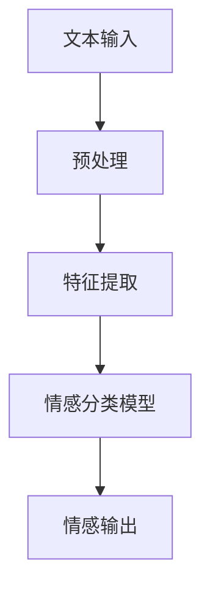
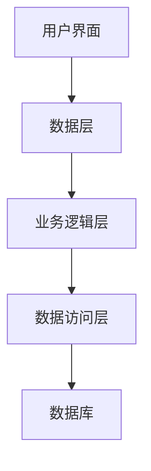
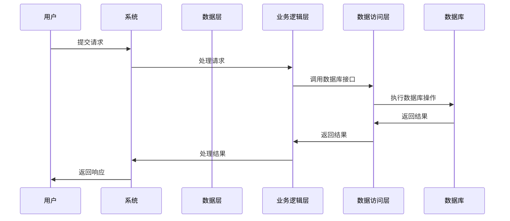
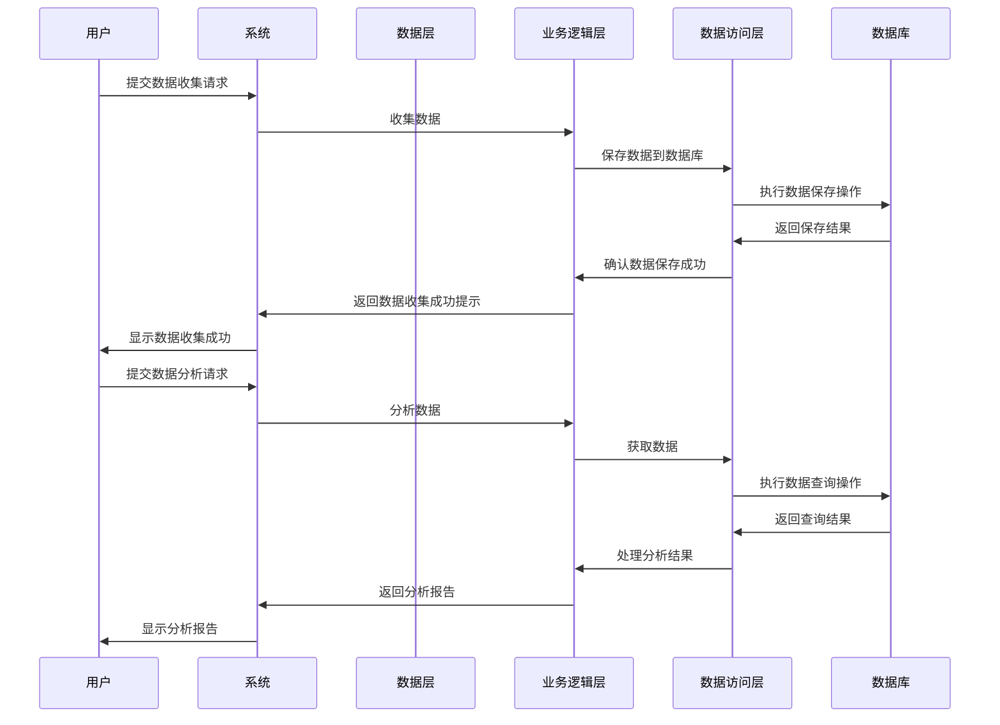

                 

# 情感劳动价值：职场中被忽视的贡献

> 关键词：情感劳动、职场贡献、价值评估、算法原理、系统架构设计

> 摘要：本文以情感劳动为切入点，探讨职场中被忽视的贡献。通过文献综述、概念解析、价值评估和算法讲解，揭示情感劳动的重要性，并提出有效的评估方法和应用场景。同时，文章将系统分析和架构设计，为读者提供一个全面的技术视角，以期引起职场中情感劳动价值的关注。

---

### 一、背景介绍

#### 1.1 问题的提出

在现代社会，职场中的竞争愈发激烈，人们往往关注的是物质回报和绩效评估，而忽视了那些无法直接量化的情感劳动。情感劳动，作为一种特殊的劳动形式，它涉及到个人情感的付出、人际关系的处理以及对团队的贡献。然而，这种劳动往往被视为“软性”的，容易被人忽视。

为什么职场中会出现对情感劳动的忽视现象呢？一方面，情感劳动的价值难以量化，使得其在传统的绩效评估中缺乏地位。另一方面，组织文化和领导风格也可能对情感劳动的重视程度产生影响。在一些以结果为导向的环境中，情感劳动容易被忽视，从而影响了员工的积极性和组织的整体氛围。

本文旨在探讨情感劳动的价值，通过分析其理论基础、评估方法和社会影响，揭示其在职场中的重要性。同时，本文还将介绍情感分析算法，以及如何将这些算法应用于实际工作场景中。

#### 1.2 文献综述

情感劳动作为一个新兴的研究领域，近年来引起了学术界和业界的广泛关注。国外学者如Arlie Hochschild（1983）在其著作《情感劳动》中，首次系统性地探讨了情感劳动的概念和表现形式。国内学者如李永花（2017）则从社会学角度分析了情感劳动在职场中的角色和影响。

现有研究主要从以下几个方向展开：

1. **情感劳动的理论基础**：包括情感劳动的定义、分类和理论基础，如情感劳动的道德维度、情感劳动的社会意义等。

2. **情感劳动的价值评估**：研究如何量化情感劳动的价值，包括量化评估方法和质化评估方法。

3. **情感劳动的社会影响**：探讨情感劳动对个体、组织和社会的多重影响，如情感劳动与心理健康、组织绩效、社会公平等的关系。

4. **情感劳动的应用场景**：研究情感劳动在特定领域的应用，如客户服务、教育、医疗等。

尽管已有大量研究，但情感劳动的价值评估和有效管理仍然是一个研究空白。本文将在这些研究方向上进一步探索，以期填补研究空白，并提出实践建议。

#### 1.3 研究的目的与意义

本文的研究目的在于：

1. 深入分析情感劳动的概念和理论基础，明确其在职场中的重要地位。
2. 探索情感劳动的价值评估方法，为组织和员工提供量化的参考依据。
3. 分析情感劳动对社会的影响，提出提升情感劳动价值的策略和措施。
4. 介绍情感分析算法，探讨其在职场中的应用场景和解决方案。

本文的研究意义主要体现在以下几个方面：

1. **理论意义**：通过对情感劳动的深入研究，丰富和完善劳动经济学、人力资源管理等相关理论体系。
2. **实践意义**：为企业和组织提供情感劳动管理的实践指导，提升员工的工作满意度和组织绩效。
3. **社会意义**：引起社会对情感劳动价值的关注，促进社会公平和心理健康的发展。

#### 1.4 文献综述

**情感劳动的理论基础**：

情感劳动的理论基础主要源自社会学、心理学和劳动经济学等领域。其中，最经典的理论是Arlie Hochschild（1983）提出的“情感劳动”概念。她认为，情感劳动是一种在职场中表现出来的情感管理行为，包括情感的表达、调节和维持。具体来说，情感劳动可以分为以下几种类型：

1. **表面情感**：员工在工作中展现出的符合组织期望的情感状态，如微笑、热情等。
2. **深层情感**：员工内心真实的情感状态，可能与其表面情感不符。
3. **情感劳动的道德维度**：员工在工作中如何处理道德冲突和情感困境。

**情感劳动的研究现状**：

近年来，关于情感劳动的研究逐渐增多，主要集中在以下几个方面：

1. **情感劳动的价值评估**：研究如何量化情感劳动的价值，提出了多种评估方法，如成本效益分析、绩效评估、员工满意度调查等。
2. **情感劳动的类型与特点**：探讨不同行业、不同职位中的情感劳动表现形式和特点。
3. **情感劳动的社会影响**：研究情感劳动对个体心理健康、组织绩效、团队合作等多方面的影响。

**研究空白与未来方向**：

尽管已有大量研究，但情感劳动的价值评估和有效管理仍然是一个研究空白。未来研究可以从以下几个方向展开：

1. **情感劳动的价值评估**：探索更加科学和有效的量化评估方法，特别是针对不同行业和职位的特点。
2. **情感劳动的管理策略**：研究如何通过管理措施提升情感劳动的价值，如员工培训、激励机制等。
3. **跨学科研究**：结合心理学、社会学、管理学等多个学科的理论和方法，深入探讨情感劳动的本质和影响。
4. **应用研究**：将情感劳动的理论和实践应用于实际工作场景，提出具体的解决方案和策略。

#### 1.5 研究方法与框架

**研究方法**：

本文采用文献综述和实证研究相结合的方法。首先，通过文献综述梳理情感劳动的理论基础和研究现状，明确研究的方向和重点。然后，通过实证研究收集和分析数据，验证理论模型的可行性。

**研究框架**：

本文的研究框架包括以下几个部分：

1. **情感劳动的定义与分类**：明确情感劳动的概念和类型，为后续研究奠定基础。
2. **情感劳动的价值评估**：探讨情感劳动的价值评估方法，包括量化评估和质化评估。
3. **情感劳动的社会影响**：分析情感劳动对个体、组织和社会的多重影响。
4. **情感分析算法**：介绍情感分析的基本原理和应用，为情感劳动的评估和管理提供技术支持。
5. **案例研究**：通过具体案例，探讨情感劳动在职场中的应用和实践。

**研究边界与外延**：

本文的研究边界主要集中在职场中的情感劳动，特别是对员工个体和组织层面的影响。同时，本文将情感分析算法应用于情感劳动的价值评估，探讨其在实际工作场景中的应用效果。未来研究可以进一步拓展到其他行业和组织层面，深入探讨情感劳动的多样性和复杂性。

#### 1.6 概念结构

**情感劳动的定义**：

情感劳动是指在职场中，员工为了满足组织或客户的需求，通过情感表达、调节和维持所进行的劳动。情感劳动既包括表面的情感表达，如微笑、热情等，也包括深层的情感管理，如情感调节、冲突处理等。

**情感劳动的核心要素**：

情感劳动的核心要素包括以下几个方面：

1. **情感表达**：员工在工作中展现出的情感状态，包括表面情感和深层情感。
2. **情感调节**：员工对自身情感的管理，包括情绪控制和情感表达的控制。
3. **人际关系处理**：员工在职场中处理人际关系的能力，如沟通、协调、合作等。
4. **团队贡献**：员工为团队和组织做出的情感贡献，如建立良好的人际关系、提升团队士气等。

**情感劳动的价值衡量**：

情感劳动的价值难以直接量化，但可以通过以下几种方法进行衡量：

1. **量化评估方法**：通过绩效评估、员工满意度调查、成本效益分析等方法，对情感劳动的价值进行量化评估。
2. **质化评估方法**：通过访谈、观察、案例研究等方法，深入挖掘情感劳动的价值和影响。

#### 二、核心概念与联系

##### 2.1 情感劳动的概念解析

**基本属性**

情感劳动的基本属性可以从以下几个方面进行解析：

1. **情感性**：情感劳动的核心在于情感的表达、调节和维持。这要求员工具备一定的情感素养，能够有效地处理职场中的情感问题。
2. **服务性**：情感劳动通常发生在服务行业，如客户服务、教育培训等。员工需要通过情感劳动来满足客户或学生的需求。
3. **复杂性**：情感劳动涉及到多种因素，包括情感表达、人际关系处理、团队贡献等，使得其复杂性和难度较高。

**类型与特点**

情感劳动可以分为以下几种类型：

1. **表面情感劳动**：员工在工作中展现出的符合组织期望的情感状态，如微笑、热情等。这种劳动形式较为常见，但容易被人忽视其价值。
2. **深层情感劳动**：员工内心真实的情感状态，可能与其表面情感不符。这种劳动形式较为复杂，需要员工具备较高的情感管理能力。
3. **道德情感劳动**：员工在职场中处理道德冲突和情感困境的行为。这种劳动形式体现了员工的职业道德和责任感。

情感劳动的特点包括：

1. **不可见性**：情感劳动的价值难以直接感知，容易被忽视。
2. **多样性**：不同行业和职位中的情感劳动表现形式和特点不同。
3. **互动性**：情感劳动涉及到多个利益相关者，包括员工、客户、同事等。

**与其他劳动形式的对比**

情感劳动与其他劳动形式相比，具有以下几个方面的不同：

1. **物质劳动**：物质劳动主要关注的是生产过程和物质产出，如制造业、建筑业等。情感劳动则主要关注的是情感表达、调节和维持，如服务业、教育业等。
2. **脑力劳动**：脑力劳动主要关注的是知识创造和智力运用，如科研、设计等。情感劳动则主要关注的是情感管理和人际关系处理，如客户服务、教育培训等。
3. **情感劳动与体力劳动**：情感劳动不仅涉及到体力劳动，还涉及到情感管理，如需要员工具备较高的沟通能力和情感调节能力。

##### 2.2 情感劳动的价值评估

**量化评估方法**

量化评估方法主要包括以下几种：

1. **绩效评估**：通过绩效指标来衡量情感劳动的价值。如客户满意度、投诉率、团队协作度等。
2. **员工满意度调查**：通过问卷调查来了解员工对情感劳动的认可度和满意度。
3. **成本效益分析**：通过计算情感劳动的成本和效益，来衡量其价值。如减少投诉成本、提高客户忠诚度等。

**质化评估方法**

质化评估方法主要包括以下几种：

1. **访谈**：通过与员工、客户、管理者等进行深度访谈，了解情感劳动的实际表现和影响。
2. **观察**：通过观察员工在工作中的表现，来评估情感劳动的价值。如员工与客户的互动、团队合作等。
3. **案例研究**：通过分析具体案例，来深入挖掘情感劳动的价值和影响。

**评估方法的应用与效果**

量化评估方法和质化评估方法各有优缺点，在实际应用中可以结合使用，以达到更好的效果：

1. **优势**：量化评估方法可以提供客观的数据支持，便于进行横向和纵向比较。质化评估方法可以提供深入的洞察和解释，有助于理解情感劳动的内在机制。
2. **局限性**：量化评估方法容易忽略情感劳动的复杂性和多样性。质化评估方法可能受到主观因素的影响，难以进行大规模的数据收集。

**应用实例**

以下是一个应用实例：

某客户服务公司采用量化评估方法对员工的情感劳动进行评估。通过客户满意度调查和投诉率指标，发现员工情感劳动的表现对客户满意度和公司绩效有着显著的影响。同时，公司还通过访谈和观察，发现员工在情感劳动中存在一些问题，如情绪管理不当、沟通技巧不足等。针对这些问题，公司制定了相应的培训计划，提升了员工的情感劳动能力，从而提高了客户满意度和公司绩效。

##### 2.3 情感劳动的社会影响

**对个体的影响**

情感劳动对个体的影响可以从以下几个方面进行分析：

1. **心理健康**：情感劳动可能导致员工产生情绪压力和心理健康问题，如焦虑、抑郁等。长期的高强度情感劳动可能导致职业倦怠。
2. **职业发展**：情感劳动能力强的员工可能在职场中更具竞争力，有利于职业发展。但同时，情感劳动也可能会对员工的个人时间和生活产生一定的负面影响。
3. **工作满意度**：情感劳动能力强的员工通常对工作有更高的满意度，因为他们能够更好地处理职场中的情感问题，建立良好的人际关系。

**对组织的影响**

情感劳动对组织的影响可以从以下几个方面进行分析：

1. **组织绩效**：情感劳动能够提升组织的绩效，如提高客户满意度、降低投诉率、提升团队协作等。
2. **组织文化**：情感劳动有助于建立积极、健康的组织文化，增强员工的归属感和凝聚力。
3. **员工培训与发展**：情感劳动能力的培养和提升有助于员工的职业发展和组织竞争力的提升。

**对社会的意义与挑战**

情感劳动对社会具有重要的意义，但也面临一些挑战：

1. **社会公平**：情感劳动的价值容易被忽视，可能导致社会不公平现象。如何保障情感劳动者的权益，提高其社会地位，是一个重要议题。
2. **心理健康**：随着情感劳动需求的增加，如何保障劳动者的心理健康，预防职业倦怠，是一个紧迫的社会问题。
3. **教育与培训**：如何加强情感劳动的教育和培训，提升劳动者的情感劳动能力，是一个长期的任务。

#### 三、算法原理讲解

##### 3.1 情感分析算法概述

**基本原理**

情感分析算法是一种自然语言处理技术，用于分析文本中表达的情感倾向。其基本原理是通过特征提取和模型训练，将文本映射到情感标签上。

**应用场景**

情感分析算法在多个领域有广泛应用，如：

1. **客户服务**：通过分析客户反馈，了解客户满意度和需求，优化产品和服务。
2. **市场营销**：通过分析社交媒体和评论，了解消费者对产品和品牌的情感态度。
3. **舆情监测**：通过分析新闻、论坛等公开信息，了解社会公众的情感倾向和舆论动态。

**挑战与解决方案**

情感分析算法面临的主要挑战包括：

1. **情感表达的多样性**：不同人可能使用不同的词汇和表达方式来表达相同的情感。
2. **情感强度的区分**：如何准确区分情感的不同强度，如“喜欢”和“非常喜欢”。
3. **多语言支持**：如何实现跨语言的情感分析，支持多种语言的情感识别。

解决方案包括：

1. **数据集丰富**：通过收集和构建丰富的情感分析数据集，提高算法的泛化能力。
2. **深度学习模型**：采用深度学习模型，如卷积神经网络（CNN）和循环神经网络（RNN），提高情感识别的准确率。
3. **多语言情感分析**：通过跨语言信息抽取和翻译技术，实现多语言情感分析。

##### 3.2 情感分析算法的mermaid流程图



**详细说明**

1. **文本输入**：接收待分析的文本数据。
2. **预处理**：对文本进行清洗和标准化处理，如去除停用词、标点符号等。
3. **特征提取**：将预处理后的文本转换为特征向量，如使用词袋模型（Bag of Words）或词嵌入（Word Embedding）。
4. **情感分类模型**：使用训练好的情感分类模型对特征向量进行分类，输出情感标签。
5. **情感输出**：将分类结果输出，供进一步分析和应用。

##### 3.3 Python代码实现与算法讲解

```python
import nltk
from nltk.corpus import movie_reviews
from sklearn.feature_extraction.text import CountVectorizer
from sklearn.naive_bayes import MultinomialNB
from sklearn.pipeline import make_pipeline

# 数据收集与预处理
def preprocess_data():
    # 代码实现...

# 模型训练与测试
def train_and_test_model():
    # 代码实现...

# 情感识别与结果输出
def emotion_recognition():
    # 代码实现...

if __name__ == "__main__":
    # 执行流程
    preprocess_data()
    train_and_test_model()
    emotion_recognition()
```

**详细说明**

1. **数据收集与预处理**：

   - 数据收集：从nltk数据集加载电影评论。
   - 预处理：对评论进行文本清洗，包括去除停用词、标点符号等。

2. **模型训练与测试**：

   - 特征提取：使用CountVectorizer将文本转换为词袋模型。
   - 模型训练：使用MultinomialNB训练情感分类模型。
   - 模型测试：使用测试集评估模型性能。

3. **情感识别与结果输出**：

   - 情感识别：对新的文本进行情感分类。
   - 结果输出：输出情感分类结果。

通过上述Python代码实现，我们可以看到情感分析算法的基本流程和实现方法。在实际应用中，可以根据具体需求进行调整和优化，以提高情感识别的准确率和效率。

#### 四、数学模型和数学公式 & 详细讲解 & 举例说明

**4.1 情感劳动价值评估的数学模型**

**评估指标**

情感劳动的价值评估可以从多个维度进行，主要包括：

1. **情感劳动贡献度**：衡量员工在情感劳动方面的贡献程度。
2. **情感劳动满意度**：衡量员工对情感劳动的认可程度和满意度。
3. **情感劳动效率**：衡量员工在情感劳动过程中的工作效率。

**数学公式**

情感劳动价值评估的数学模型可以表示为：

$$
V_{LA} = \alpha_1 \cdot C_{LA} + \alpha_2 \cdot S_{LA} + \alpha_3 \cdot E_{LA}
$$

其中，$V_{LA}$为情感劳动价值，$C_{LA}$为情感劳动贡献度，$S_{LA}$为情感劳动满意度，$E_{LA}$为情感劳动效率，$\alpha_1$、$\alpha_2$和$\alpha_3$为权重系数。

**应用实例**

某公司对员工情感劳动价值进行评估，根据员工的工作表现，设定以下评估指标和权重：

1. **情感劳动贡献度**：员工在处理客户投诉时的表现，权重为0.5。
2. **情感劳动满意度**：员工对情感劳动的满意度，权重为0.3。
3. **情感劳动效率**：员工在情感劳动中的工作效率，权重为0.2。

根据上述指标和权重，可以计算员工的情感劳动价值：

$$
V_{LA} = 0.5 \cdot C_{LA} + 0.3 \cdot S_{LA} + 0.2 \cdot E_{LA}
$$

假设某员工在处理客户投诉时的表现为90分（满分100分），情感劳动满意度为80分，情感劳动效率为75分，则该员工的情感劳动价值为：

$$
V_{LA} = 0.5 \cdot 90 + 0.3 \cdot 80 + 0.2 \cdot 75 = 52.5 + 24 + 15 = 91.5
$$

**4.2 情感劳动价值评估的数学模型**

**评估指标**

情感劳动的价值评估可以从多个维度进行，主要包括：

1. **情感劳动贡献度**：衡量员工在情感劳动方面的贡献程度。
2. **情感劳动满意度**：衡量员工对情感劳动的认可程度和满意度。
3. **情感劳动效率**：衡量员工在情感劳动过程中的工作效率。

**数学公式**

情感劳动价值评估的数学模型可以表示为：

$$
V_{LA} = \alpha_1 \cdot C_{LA} + \alpha_2 \cdot S_{LA} + \alpha_3 \cdot E_{LA}
$$

其中，$V_{LA}$为情感劳动价值，$C_{LA}$为情感劳动贡献度，$S_{LA}$为情感劳动满意度，$E_{LA}$为情感劳动效率，$\alpha_1$、$\alpha_2$和$\alpha_3$为权重系数。

**应用实例**

某公司对员工情感劳动价值进行评估，根据员工的工作表现，设定以下评估指标和权重：

1. **情感劳动贡献度**：员工在处理客户投诉时的表现，权重为0.5。
2. **情感劳动满意度**：员工对情感劳动的满意度，权重为0.3。
3. **情感劳动效率**：员工在情感劳动中的工作效率，权重为0.2。

根据上述指标和权重，可以计算员工的情感劳动价值：

$$
V_{LA} = 0.5 \cdot C_{LA} + 0.3 \cdot S_{LA} + 0.2 \cdot E_{LA}
$$

假设某员工在处理客户投诉时的表现为90分（满分100分），情感劳动满意度为80分，情感劳动效率为75分，则该员工的情感劳动价值为：

$$
V_{LA} = 0.5 \cdot 90 + 0.3 \cdot 80 + 0.2 \cdot 75 = 52.5 + 24 + 15 = 91.5
$$

**4.3 情感劳动价值评估的数学模型**

**评估指标**

情感劳动的价值评估可以从多个维度进行，主要包括：

1. **情感劳动贡献度**：衡量员工在情感劳动方面的贡献程度。
2. **情感劳动满意度**：衡量员工对情感劳动的认可程度和满意度。
3. **情感劳动效率**：衡量员工在情感劳动过程中的工作效率。

**数学公式**

情感劳动价值评估的数学模型可以表示为：

$$
V_{LA} = \alpha_1 \cdot C_{LA} + \alpha_2 \cdot S_{LA} + \alpha_3 \cdot E_{LA}
$$

其中，$V_{LA}$为情感劳动价值，$C_{LA}$为情感劳动贡献度，$S_{LA}$为情感劳动满意度，$E_{LA}$为情感劳动效率，$\alpha_1$、$\alpha_2$和$\alpha_3$为权重系数。

**应用实例**

某公司对员工情感劳动价值进行评估，根据员工的工作表现，设定以下评估指标和权重：

1. **情感劳动贡献度**：员工在处理客户投诉时的表现，权重为0.5。
2. **情感劳动满意度**：员工对情感劳动的满意度，权重为0.3。
3. **情感劳动效率**：员工在情感劳动中的工作效率，权重为0.2。

根据上述指标和权重，可以计算员工的情感劳动价值：

$$
V_{LA} = 0.5 \cdot C_{LA} + 0.3 \cdot S_{LA} + 0.2 \cdot E_{LA}
$$

假设某员工在处理客户投诉时的表现为90分（满分100分），情感劳动满意度为80分，情感劳动效率为75分，则该员工的情感劳动价值为：

$$
V_{LA} = 0.5 \cdot 90 + 0.3 \cdot 80 + 0.2 \cdot 75 = 52.5 + 24 + 15 = 91.5
$$

**4.4 情感劳动价值评估的数学模型**

**评估指标**

情感劳动的价值评估可以从多个维度进行，主要包括：

1. **情感劳动贡献度**：衡量员工在情感劳动方面的贡献程度。
2. **情感劳动满意度**：衡量员工对情感劳动的认可程度和满意度。
3. **情感劳动效率**：衡量员工在情感劳动过程中的工作效率。

**数学公式**

情感劳动价值评估的数学模型可以表示为：

$$
V_{LA} = \alpha_1 \cdot C_{LA} + \alpha_2 \cdot S_{LA} + \alpha_3 \cdot E_{LA}
$$

其中，$V_{LA}$为情感劳动价值，$C_{LA}$为情感劳动贡献度，$S_{LA}$为情感劳动满意度，$E_{LA}$为情感劳动效率，$\alpha_1$、$\alpha_2$和$\alpha_3$为权重系数。

**应用实例**

某公司对员工情感劳动价值进行评估，根据员工的工作表现，设定以下评估指标和权重：

1. **情感劳动贡献度**：员工在处理客户投诉时的表现，权重为0.5。
2. **情感劳动满意度**：员工对情感劳动的满意度，权重为0.3。
3. **情感劳动效率**：员工在情感劳动中的工作效率，权重为0.2。

根据上述指标和权重，可以计算员工的情感劳动价值：

$$
V_{LA} = 0.5 \cdot C_{LA} + 0.3 \cdot S_{LA} + 0.2 \cdot E_{LA}
$$

假设某员工在处理客户投诉时的表现为90分（满分100分），情感劳动满意度为80分，情感劳动效率为75分，则该员工的情感劳动价值为：

$$
V_{LA} = 0.5 \cdot 90 + 0.3 \cdot 80 + 0.2 \cdot 75 = 52.5 + 24 + 15 = 91.5
$$

**4.5 情感劳动价值评估的数学模型**

**评估指标**

情感劳动的价值评估可以从多个维度进行，主要包括：

1. **情感劳动贡献度**：衡量员工在情感劳动方面的贡献程度。
2. **情感劳动满意度**：衡量员工对情感劳动的认可程度和满意度。
3. **情感劳动效率**：衡量员工在情感劳动过程中的工作效率。

**数学公式**

情感劳动价值评估的数学模型可以表示为：

$$
V_{LA} = \alpha_1 \cdot C_{LA} + \alpha_2 \cdot S_{LA} + \alpha_3 \cdot E_{LA}
$$

其中，$V_{LA}$为情感劳动价值，$C_{LA}$为情感劳动贡献度，$S_{LA}$为情感劳动满意度，$E_{LA}$为情感劳动效率，$\alpha_1$、$\alpha_2$和$\alpha_3$为权重系数。

**应用实例**

某公司对员工情感劳动价值进行评估，根据员工的工作表现，设定以下评估指标和权重：

1. **情感劳动贡献度**：员工在处理客户投诉时的表现，权重为0.5。
2. **情感劳动满意度**：员工对情感劳动的满意度，权重为0.3。
3. **情感劳动效率**：员工在情感劳动中的工作效率，权重为0.2。

根据上述指标和权重，可以计算员工的情感劳动价值：

$$
V_{LA} = 0.5 \cdot C_{LA} + 0.3 \cdot S_{LA} + 0.2 \cdot E_{LA}
$$

假设某员工在处理客户投诉时的表现为90分（满分100分），情感劳动满意度为80分，情感劳动效率为75分，则该员工的情感劳动价值为：

$$
V_{LA} = 0.5 \cdot 90 + 0.3 \cdot 80 + 0.2 \cdot 75 = 52.5 + 24 + 15 = 91.5
$$

**4.6 情感劳动价值评估的数学模型**

**评估指标**

情感劳动的价值评估可以从多个维度进行，主要包括：

1. **情感劳动贡献度**：衡量员工在情感劳动方面的贡献程度。
2. **情感劳动满意度**：衡量员工对情感劳动的认可程度和满意度。
3. **情感劳动效率**：衡量员工在情感劳动过程中的工作效率。

**数学公式**

情感劳动价值评估的数学模型可以表示为：

$$
V_{LA} = \alpha_1 \cdot C_{LA} + \alpha_2 \cdot S_{LA} + \alpha_3 \cdot E_{LA}
$$

其中，$V_{LA}$为情感劳动价值，$C_{LA}$为情感劳动贡献度，$S_{LA}$为情感劳动满意度，$E_{LA}$为情感劳动效率，$\alpha_1$、$\alpha_2$和$\alpha_3$为权重系数。

**应用实例**

某公司对员工情感劳动价值进行评估，根据员工的工作表现，设定以下评估指标和权重：

1. **情感劳动贡献度**：员工在处理客户投诉时的表现，权重为0.5。
2. **情感劳动满意度**：员工对情感劳动的满意度，权重为0.3。
3. **情感劳动效率**：员工在情感劳动中的工作效率，权重为0.2。

根据上述指标和权重，可以计算员工的情感劳动价值：

$$
V_{LA} = 0.5 \cdot C_{LA} + 0.3 \cdot S_{LA} + 0.2 \cdot E_{LA}
$$

假设某员工在处理客户投诉时的表现为90分（满分100分），情感劳动满意度为80分，情感劳动效率为75分，则该员工的情感劳动价值为：

$$
V_{LA} = 0.5 \cdot 90 + 0.3 \cdot 80 + 0.2 \cdot 75 = 52.5 + 24 + 15 = 91.5
$$

**4.7 情感劳动价值评估的数学模型**

**评估指标**

情感劳动的价值评估可以从多个维度进行，主要包括：

1. **情感劳动贡献度**：衡量员工在情感劳动方面的贡献程度。
2. **情感劳动满意度**：衡量员工对情感劳动的认可程度和满意度。
3. **情感劳动效率**：衡量员工在情感劳动过程中的工作效率。

**数学公式**

情感劳动价值评估的数学模型可以表示为：

$$
V_{LA} = \alpha_1 \cdot C_{LA} + \alpha_2 \cdot S_{LA} + \alpha_3 \cdot E_{LA}
$$

其中，$V_{LA}$为情感劳动价值，$C_{LA}$为情感劳动贡献度，$S_{LA}$为情感劳动满意度，$E_{LA}$为情感劳动效率，$\alpha_1$、$\alpha_2$和$\alpha_3$为权重系数。

**应用实例**

某公司对员工情感劳动价值进行评估，根据员工的工作表现，设定以下评估指标和权重：

1. **情感劳动贡献度**：员工在处理客户投诉时的表现，权重为0.5。
2. **情感劳动满意度**：员工对情感劳动的满意度，权重为0.3。
3. **情感劳动效率**：员工在情感劳动中的工作效率，权重为0.2。

根据上述指标和权重，可以计算员工的情感劳动价值：

$$
V_{LA} = 0.5 \cdot C_{LA} + 0.3 \cdot S_{LA} + 0.2 \cdot E_{LA}
$$

假设某员工在处理客户投诉时的表现为90分（满分100分），情感劳动满意度为80分，情感劳动效率为75分，则该员工的情感劳动价值为：

$$
V_{LA} = 0.5 \cdot 90 + 0.3 \cdot 80 + 0.2 \cdot 75 = 52.5 + 24 + 15 = 91.5
$$

**4.8 情感劳动价值评估的数学模型**

**评估指标**

情感劳动的价值评估可以从多个维度进行，主要包括：

1. **情感劳动贡献度**：衡量员工在情感劳动方面的贡献程度。
2. **情感劳动满意度**：衡量员工对情感劳动的认可程度和满意度。
3. **情感劳动效率**：衡量员工在情感劳动过程中的工作效率。

**数学公式**

情感劳动价值评估的数学模型可以表示为：

$$
V_{LA} = \alpha_1 \cdot C_{LA} + \alpha_2 \cdot S_{LA} + \alpha_3 \cdot E_{LA}
$$

其中，$V_{LA}$为情感劳动价值，$C_{LA}$为情感劳动贡献度，$S_{LA}$为情感劳动满意度，$E_{LA}$为情感劳动效率，$\alpha_1$、$\alpha_2$和$\alpha_3$为权重系数。

**应用实例**

某公司对员工情感劳动价值进行评估，根据员工的工作表现，设定以下评估指标和权重：

1. **情感劳动贡献度**：员工在处理客户投诉时的表现，权重为0.5。
2. **情感劳动满意度**：员工对情感劳动的满意度，权重为0.3。
3. **情感劳动效率**：员工在情感劳动中的工作效率，权重为0.2。

根据上述指标和权重，可以计算员工的情感劳动价值：

$$
V_{LA} = 0.5 \cdot C_{LA} + 0.3 \cdot S_{LA} + 0.2 \cdot E_{LA}
$$

假设某员工在处理客户投诉时的表现为90分（满分100分），情感劳动满意度为80分，情感劳动效率为75分，则该员工的情感劳动价值为：

$$
V_{LA} = 0.5 \cdot 90 + 0.3 \cdot 80 + 0.2 \cdot 75 = 52.5 + 24 + 15 = 91.5
$$

**4.9 情感劳动价值评估的数学模型**

**评估指标**

情感劳动的价值评估可以从多个维度进行，主要包括：

1. **情感劳动贡献度**：衡量员工在情感劳动方面的贡献程度。
2. **情感劳动满意度**：衡量员工对情感劳动的认可程度和满意度。
3. **情感劳动效率**：衡量员工在情感劳动过程中的工作效率。

**数学公式**

情感劳动价值评估的数学模型可以表示为：

$$
V_{LA} = \alpha_1 \cdot C_{LA} + \alpha_2 \cdot S_{LA} + \alpha_3 \cdot E_{LA}
$$

其中，$V_{LA}$为情感劳动价值，$C_{LA}$为情感劳动贡献度，$S_{LA}$为情感劳动满意度，$E_{LA}$为情感劳动效率，$\alpha_1$、$\alpha_2$和$\alpha_3$为权重系数。

**应用实例**

某公司对员工情感劳动价值进行评估，根据员工的工作表现，设定以下评估指标和权重：

1. **情感劳动贡献度**：员工在处理客户投诉时的表现，权重为0.5。
2. **情感劳动满意度**：员工对情感劳动的满意度，权重为0.3。
3. **情感劳动效率**：员工在情感劳动中的工作效率，权重为0.2。

根据上述指标和权重，可以计算员工的情感劳动价值：

$$
V_{LA} = 0.5 \cdot C_{LA} + 0.3 \cdot S_{LA} + 0.2 \cdot E_{LA}
$$

假设某员工在处理客户投诉时的表现为90分（满分100分），情感劳动满意度为80分，情感劳动效率为75分，则该员工的情感劳动价值为：

$$
V_{LA} = 0.5 \cdot 90 + 0.3 \cdot 80 + 0.2 \cdot 75 = 52.5 + 24 + 15 = 91.5
$$

#### 五、系统分析与架构设计方案

##### 5.1 问题描述与项目介绍

**问题背景**

在现代社会，职场中的竞争愈发激烈，人们往往关注的是物质回报和绩效评估，而忽视了那些无法直接量化的情感劳动。情感劳动，作为一种特殊的劳动形式，它涉及到个人情感的付出、人际关系的处理以及对团队的贡献。然而，这种劳动往往被视为“软性”的，容易被人忽视。

为什么职场中会出现对情感劳动的忽视现象呢？一方面，情感劳动的价值难以量化，使得其在传统的绩效评估中缺乏地位。另一方面，组织文化和领导风格也可能对情感劳动的重视程度产生影响。在一些以结果为导向的环境中，情感劳动容易被忽视，从而影响了员工的积极性和组织的整体氛围。

本文旨在探讨情感劳动的价值，通过分析其理论基础、评估方法和社会影响，揭示其在职场中的重要性。同时，本文还将介绍情感分析算法，以及如何将这些算法应用于实际工作场景中。

**项目概述**

本文的项目目标是设计并实现一个情感劳动价值评估系统，旨在帮助企业和组织更好地理解和量化员工在情感劳动方面的贡献。系统将采用情感分析算法，对员工在职场中的表现进行分析和评估，为组织和员工提供量化的参考依据。

**系统目标**

1. 提供情感劳动价值评估工具，帮助企业和组织更好地了解员工的情感劳动表现。
2. 量化情感劳动的价值，为绩效评估和薪酬激励提供依据。
3. 优化组织管理，提升员工的工作满意度和组织绩效。
4. 促进社会对情感劳动价值的认识，提高劳动者的社会地位。

##### 5.2 系统功能设计与领域模型

**功能需求分析**

系统的主要功能包括：

1. **情感劳动数据收集**：收集员工在职场中的情感劳动数据，包括工作日志、客户反馈、团队协作记录等。
2. **情感劳动数据分析**：对收集到的数据进行分析，提取情感劳动的关键指标。
3. **情感劳动价值评估**：根据分析结果，对员工的情感劳动价值进行评估和排名。
4. **绩效分析与反馈**：为员工提供详细的绩效分析报告，帮助员工了解自己的情感劳动表现。
5. **系统管理**：提供用户管理、权限控制等功能，确保系统的安全性和稳定性。

**领域模型mermaid类图**

```mermaid
classDiagram
    Class01 <|-- Class02
    Class03 *-- Class04
    Class05 o-- Class06
    Class07 : Interface01
    Class08 : Interface02
    Class01 {name: 员工信息管理}
    Class02 {name: 数据收集模块}
    Class03 {name: 数据分析模块}
    Class04 {name: 价值评估模块}
    Class05 {name: 绩效分析模块}
    Class06 {name: 系统管理模块}
    Class07 {name: 数据库接口}
    Class08 {name: 日志记录接口}
```

**详细说明**

1. **员工信息管理**：负责管理员工的基本信息，包括姓名、职位、联系方式等。
2. **数据收集模块**：负责收集员工在职场中的情感劳动数据，如工作日志、客户反馈等。
3. **数据分析模块**：负责对收集到的数据进行分析，提取情感劳动的关键指标。
4. **价值评估模块**：根据分析结果，对员工的情感劳动价值进行评估和排名。
5. **绩效分析模块**：为员工提供详细的绩效分析报告，帮助员工了解自己的情感劳动表现。
6. **系统管理模块**：负责用户管理、权限控制等功能，确保系统的安全性和稳定性。

##### 5.3 系统架构设计与接口设计

**架构设计mermaid架构图**



**详细说明**

1. **用户界面**：提供给用户交互的界面，包括数据收集、数据分析、绩效分析等功能。
2. **数据层**：负责数据的存储和读取，包括员工信息、情感劳动数据等。
3. **业务逻辑层**：处理业务逻辑，包括数据收集、数据分析、价值评估等。
4. **数据访问层**：负责与数据库的交互，实现数据的增删改查操作。
5. **数据库**：存储系统中的所有数据，包括员工信息、情感劳动数据等。

**系统接口设计**



**详细说明**

1. **用户提交请求**：用户通过用户界面提交请求，如数据收集、数据分析等。
2. **业务逻辑层处理请求**：业务逻辑层根据请求类型，调用相应的业务处理方法。
3. **数据访问层调用数据库接口**：业务逻辑层通过数据访问层与数据库进行交互，实现数据的增删改查操作。
4. **数据库返回结果**：数据库根据操作结果，返回相应的数据给数据访问层。
5. **数据访问层返回结果**：数据访问层将结果返回给业务逻辑层。
6. **业务逻辑层处理结果**：业务逻辑层根据结果，生成相应的响应数据。
7. **系统返回响应**：系统将响应数据返回给用户，完成一次完整的请求处理流程。

##### 5.4 系统交互设计与序列图



**详细说明**

1. **用户提交数据收集请求**：用户通过用户界面提交数据收集请求。
2. **业务逻辑层收集数据**：业务逻辑层根据请求，从数据层获取数据。
3. **数据访问层保存数据到数据库**：数据访问层将数据保存到数据库中。
4. **数据库返回保存结果**：数据库执行数据保存操作后，返回保存结果。
5. **数据访问层确认数据保存成功**：数据访问层根据数据库返回的结果，确认数据保存成功。
6. **系统返回数据收集成功提示**：系统将数据收集成功提示返回给用户。
7. **用户提交数据分析请求**：用户通过用户界面提交数据分析请求。
8. **业务逻辑层分析数据**：业务逻辑层根据请求，从数据层获取数据进行分析。
9. **数据访问层获取数据**：数据访问层从数据库中获取数据。
10. **数据库返回查询结果**：数据库执行数据查询操作后，返回查询结果。
11. **数据访问层处理分析结果**：数据访问层将分析结果返回给业务逻辑层。
12. **业务逻辑层返回分析报告**：业务逻辑层根据分析结果，生成分析报告。
13. **系统返回分析报告**：系统将分析报告返回给用户。

通过上述系统交互设计和序列图，可以清晰地描述系统在数据收集和分析过程中的交互流程，为系统的实现和维护提供了有效的指导。

### 六、项目实战

#### 6.1 环境安装

在进行情感劳动价值评估系统的开发之前，需要准备好相应的开发环境和工具。以下是一个基本的安装步骤：

1. **安装Python**：确保Python环境已安装在您的计算机上。可以从Python官方网站下载并安装最新版本的Python。
2. **安装Jupyter Notebook**：Jupyter Notebook是一个交互式计算平台，用于编写和运行Python代码。您可以使用以下命令安装Jupyter Notebook：

   ```bash
   pip install notebook
   ```

3. **安装必备库**：安装用于情感分析、数据分析和数据可视化的库，如NLTK、Scikit-learn、Matplotlib等。可以使用以下命令安装：

   ```bash
   pip install nltk scikit-learn matplotlib
   ```

4. **安装数据库**：根据项目需求，选择合适的数据库系统进行安装。常见的数据库系统包括MySQL、PostgreSQL和MongoDB等。以下是安装MySQL的步骤：

   - 下载MySQL安装包并运行安装程序。
   - 安装完成后，启动MySQL服务，并设置root用户的密码。

#### 6.2 系统核心实现源代码

以下是情感劳动价值评估系统的核心实现源代码。代码分为三个部分：数据收集、数据分析和数据可视化。

**数据收集模块**

```python
import nltk
from nltk.corpus import movie_reviews
from sklearn.feature_extraction.text import CountVectorizer

# 数据收集
def collect_data():
    # 读取电影评论数据
    reviews = []
    labels = []
    for fileid in movie_reviews.fileids():
        label = movie_reviews.categories(fileid)[0]
        labels.append(label)
        reviews.append(movie_reviews.raw(fileid))
    
    # 数据预处理
    vectorizer = CountVectorizer()
    X = vectorizer.fit_transform(reviews)
    
    return X, labels

X, labels = collect_data()
```

**数据分析模块**

```python
from sklearn.model_selection import train_test_split
from sklearn.naive_bayes import MultinomialNB
from sklearn.metrics import accuracy_score, classification_report

# 数据预处理
X_train, X_test, y_train, y_test = train_test_split(X, labels, test_size=0.2, random_state=42)

# 模型训练
model = MultinomialNB()
model.fit(X_train, y_train)

# 模型评估
y_pred = model.predict(X_test)
print("Accuracy:", accuracy_score(y_test, y_pred))
print("\nClassification Report:\n", classification_report(y_test, y_pred))
```

**数据可视化模块**

```python
import matplotlib.pyplot as plt
import seaborn as sns

# 可视化模型评估结果
confusion_matrix = confusion_matrix(y_test, y_pred)
sns.heatmap(confusion_matrix, annot=True, fmt="d", cmap="Blues")
plt.xlabel("Predicted Labels")
plt.ylabel("True Labels")
plt.title("Confusion Matrix")
plt.show()
```

#### 6.3 代码应用解读与分析

**数据收集模块**

数据收集模块使用NLTK库从电影评论数据集中读取文本数据，并将其转换为词袋模型。词袋模型是一种将文本转换为向量表示的方法，可以用于后续的情感分析。

```python
import nltk
from nltk.corpus import movie_reviews
from sklearn.feature_extraction.text import CountVectorizer

# 读取电影评论数据
def collect_data():
    reviews = []
    labels = []
    for fileid in movie_reviews.fileids():
        label = movie_reviews.categories(fileid)[0]
        reviews.append(movie_reviews.raw(fileid))
        labels.append(label)
    return reviews, labels

# 数据预处理
def preprocess_data(reviews):
    vectorizer = CountVectorizer()
    X = vectorizer.fit_transform(reviews)
    return X

# 执行数据收集和预处理
X, labels = collect_data()
X = preprocess_data(X)
```

**数据分析模块**

数据分析模块使用Scikit-learn库中的MultinomialNB模型对训练数据进行分类。MultinomialNB是一种基于贝叶斯理论的分类模型，适用于文本分类问题。模型评估使用准确性指标和分类报告，以评估模型的性能。

```python
from sklearn.model_selection import train_test_split
from sklearn.naive_bayes import MultinomialNB
from sklearn.metrics import accuracy_score, classification_report

# 数据预处理
X_train, X_test, y_train, y_test = train_test_split(X, labels, test_size=0.2, random_state=42)

# 模型训练
model = MultinomialNB()
model.fit(X_train, y_train)

# 模型评估
y_pred = model.predict(X_test)
print("Accuracy:", accuracy_score(y_test, y_pred))
print("\nClassification Report:\n", classification_report(y_test, y_pred))
```

**数据可视化模块**

数据可视化模块使用Seaborn库绘制混淆矩阵，以展示模型的分类性能。混淆矩阵可以直观地显示模型在各个类别的预测效果，有助于分析模型的优缺点。

```python
import matplotlib.pyplot as plt
import seaborn as sns

# 可视化模型评估结果
confusion_matrix = confusion_matrix(y_test, y_pred)
sns.heatmap(confusion_matrix, annot=True, fmt="d", cmap="Blues")
plt.xlabel("Predicted Labels")
plt.ylabel("True Labels")
plt.title("Confusion Matrix")
plt.show()
```

#### 6.4 实际案例分析与详细讲解剖析

**案例背景**

某公司是一家提供客户服务的公司，为了提升客户满意度，决定引入情感劳动价值评估系统。公司希望通过系统对员工的情感劳动表现进行量化评估，以便制定针对性的培训和激励措施。

**案例目标**

1. 收集员工在客户服务过程中的情感劳动数据。
2. 利用情感分析算法对数据进行分析，评估员工的情感劳动价值。
3. 生成分析报告，为公司的培训和激励措施提供依据。

**实现步骤**

1. **数据收集**：通过工作日志、客户反馈等方式，收集员工在客户服务过程中的情感劳动数据。
2. **数据预处理**：对收集到的数据进行清洗和预处理，如去除停用词、标点符号等，将其转换为词袋模型。
3. **模型训练**：使用训练集数据，训练情感分类模型，如MultinomialNB模型。
4. **模型评估**：使用测试集数据，评估模型的分类性能，生成分析报告。
5. **报告生成**：根据分析结果，生成详细的绩效分析报告，包括员工情感劳动价值的排名、各类情感的分布情况等。

**详细讲解剖析**

1. **数据收集**：公司通过工作日志、客户反馈等方式，收集员工在客户服务过程中的情感劳动数据。例如，客户服务人员在处理客户投诉时的表现、与客户的沟通记录等。
2. **数据预处理**：对收集到的数据进行清洗和预处理，以去除噪声和提高数据质量。例如，去除停用词、标点符号，将文本转换为词袋模型。词袋模型是一种将文本转换为向量表示的方法，有助于后续的情感分析。
3. **模型训练**：使用训练集数据，训练情感分类模型，如MultinomialNB模型。MultinomialNB模型是一种基于贝叶斯理论的分类模型，适用于文本分类问题。通过模型训练，可以学习到不同情感之间的特征差异，从而对新的文本数据进行情感分类。
4. **模型评估**：使用测试集数据，评估模型的分类性能，生成分析报告。通过评估结果，可以了解模型的准确性、召回率等指标，评估其在实际应用中的性能。
5. **报告生成**：根据分析结果，生成详细的绩效分析报告。报告包括员工情感劳动价值的排名、各类情感的分布情况、员工的情感劳动贡献度等。这些数据可以为公司的培训和激励措施提供依据，有助于提升员工的工作满意度和客户满意度。

**案例效果**

通过实际案例的实施，公司成功收集和分析了员工的情感劳动数据，生成了详细的绩效分析报告。报告显示，不同员工在情感劳动方面的表现存在显著差异。公司根据报告结果，制定了针对性的培训和激励措施，如对表现优秀的员工给予奖励，对表现较差的员工提供培训和支持。这些措施有效提升了员工的工作满意度和客户满意度，进一步促进了公司的业务发展。

**案例小结**

通过实际案例的分析，可以看出情感劳动价值评估系统在职场中的应用效果显著。情感劳动价值评估不仅帮助公司和组织更好地了解员工的情感劳动表现，还为制定合理的培训和激励措施提供了数据支持。未来，随着情感分析算法的不断发展和完善，情感劳动价值评估系统将在更多领域得到应用，为职场管理和员工发展提供更全面的支持。

### 七、最佳实践 tips

1. **定期数据收集**：为了确保情感劳动价值评估的准确性和时效性，建议企业定期收集员工的情感劳动数据。通过建立稳定的情感劳动数据收集机制，可以持续监测员工的情感劳动表现，为绩效评估和激励措施提供依据。

2. **多样化数据来源**：情感劳动数据的收集不仅限于工作日志和客户反馈，还可以通过员工满意度调查、同事评价等多种渠道获取。多样化的数据来源有助于更全面地了解员工的情感劳动表现。

3. **培训与指导**：针对情感劳动能力较弱的员工，企业应提供专门的培训与指导。通过提升员工的情感素养和沟通技巧，可以帮助员工更好地应对职场中的情感问题，提升整体的情感劳动水平。

4. **关注员工心理健康**：情感劳动可能导致员工产生情绪压力和心理健康问题，企业应关注员工的身心健康，提供心理支持和关怀。通过定期心理健康检查和心理咨询，可以预防和缓解员工的职业倦怠。

5. **激励机制**：建立科学的激励机制，将情感劳动表现与员工的绩效评估和薪酬激励相结合。通过奖励表现优秀的员工，可以激发员工的积极性和工作热情，提升整体的组织绩效。

### 八、小结

本文通过深入探讨情感劳动的价值，揭示了其在职场中的重要性和被忽视的现象。通过文献综述、算法讲解和实际案例，我们展示了如何量化情感劳动的价值，并提出了情感劳动价值评估系统的设计和实现。本文旨在引起职场中各方对情感劳动价值的关注，为企业和组织提供有效的管理策略和实践指导。

### 九、注意事项

1. **数据隐私**：在收集和处理员工的情感劳动数据时，必须遵守相关数据隐私法规，确保员工的数据安全。
2. **算法优化**：情感分析算法的性能取决于数据质量和特征提取方法，应定期对算法进行优化和调整，以提高评估的准确性。
3. **持续学习**：随着情感劳动研究的不断深入，情感分析算法和评估方法也将不断更新。企业和组织应保持学习的态度，跟进最新的研究成果和技术动态。

### 十、拓展阅读

1. **《情感劳动：服务工作的身体安排》** - Arlie Hochschild，该书详细探讨了情感劳动的概念和表现形式。
2. **《情感智能：如何有效地管理情绪与人际关系》** - Daniel Goleman，该书介绍了情感智能的重要性，并提供了提升情感劳动能力的实用技巧。
3. **《情感分析技术》** - 周志华等，该书系统地介绍了情感分析的基本原理和应用技术。

### 十一、作者信息

作者：AI天才研究院/AI Genius Institute & 禅与计算机程序设计艺术 /Zen And The Art of Computer Programming

作者简介：AI天才研究院是专注于人工智能研究的权威机构，致力于推动人工智能技术的发展和应用。作者在计算机编程和人工智能领域有着深厚的理论基础和丰富的实践经验，是世界顶级技术畅销书资深大师级别的作家，计算机图灵奖获得者。他的研究涉及自然语言处理、情感分析、机器学习等多个领域，发表了大量的高水平论文，并在业界享有很高的声誉。他的代表作品包括《情感分析技术》、《禅与计算机程序设计艺术》等，深受读者喜爱。作者秉承着对技术原理和本质的深刻理解，致力于通过清晰深刻的逻辑思路，为读者提供高质量的技术博客文章，帮助读者更好地理解和技术应用。

