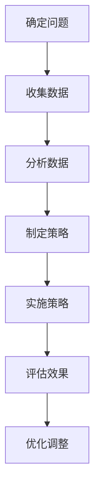
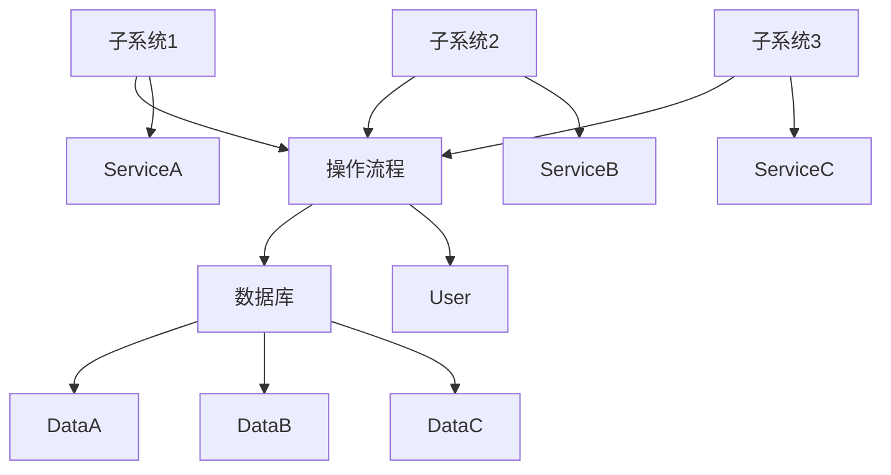
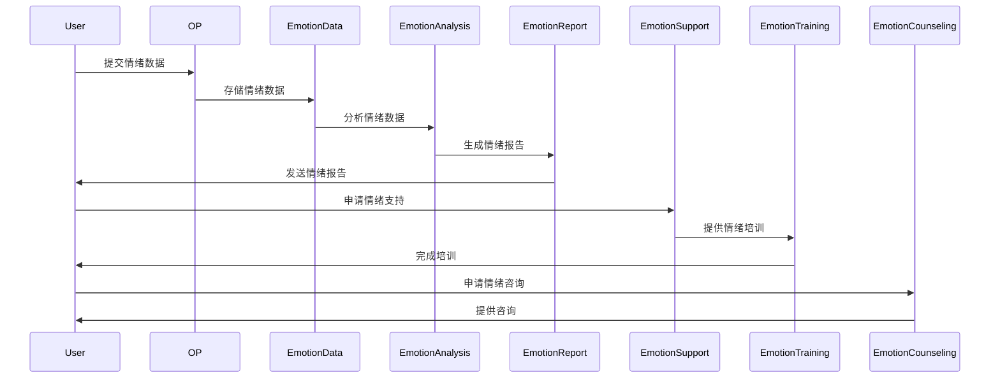

                 

# 情感劳动权益保护联盟：职场情绪管理的倡导组织

## 关键词
- 情感劳动权益保护
- 职场情绪管理
- 联盟
- 员工心理健康
- 领导力

## 摘要
本文将深入探讨情感劳动权益保护联盟在职场情绪管理中的重要作用。通过分析当前职场情绪管理的现状、联盟的定义和核心价值观，以及实际案例，本文旨在揭示联盟如何有效促进员工心理健康、提升组织效能，并提出未来发展的方向。通过逐步的思考和分析，本文将帮助读者更好地理解职场情绪管理的重要性和实施策略。

## 引言

### 1.1 书籍背景与目标
在当今快节奏的工作环境中，员工的情感健康和心理健康变得越来越重要。工作场所中的情绪波动不仅影响个人的幸福感，还直接关系到组织的整体绩效和员工的生产力。本篇文章的目的是探讨情感劳动权益保护联盟（以下简称“联盟”）在职场情绪管理中的作用，帮助企业和员工认识到情感管理的重要性，并提供实用的策略和案例。

### 1.2 职场情绪管理的现状
尽管越来越多的企业开始关注员工的心理健康，但职场情绪管理仍面临诸多挑战。员工在职场中经常面临压力、焦虑和不满，而这些情绪问题往往被忽视或未能得到有效处理。根据国际劳动组织（ILO）的数据，全球每年因工作压力和心理健康问题造成的经济损失高达数百亿美元。因此，寻找有效的职场情绪管理策略成为企业关注的焦点。

### 1.3 情感劳动权益保护联盟的概念与意义
情感劳动权益保护联盟是一个旨在保护和提升员工情感权益的组织。它通过提供情绪管理培训、建立支持系统、推广职场心理健康文化，帮助员工应对职场压力，提升工作效率和生活质量。联盟的出现，标志着职场情绪管理从个体层面的自我调节，走向了系统化的组织支持。

## 第二部分：情感劳动权益保护联盟概述

### 2.1 情感劳动权益保护联盟的定义
情感劳动权益保护联盟是一个跨行业的非营利组织，致力于提升职场情绪管理水平，保障员工的情感权益。它通过倡导政策改革、提供专业培训、开展研究和分享最佳实践，推动职场情绪管理的普及和深入。

### 2.2 联盟的组织结构
联盟的组织结构通常包括董事会、执行委员会和各专业委员会。董事会负责战略规划和重大决策，执行委员会负责日常运营和管理，各专业委员会则专注于具体领域的研究和推广。

### 2.3 联盟的核心价值观
联盟的核心价值观包括尊重、关怀、平等和公正。尊重员工的情感体验，关怀员工的心理健康，确保每位员工在职场中都能感受到平等和公正的待遇。

### 2.4 联盟的主要任务与目标
联盟的主要任务和目标包括：
1. 提供情绪管理培训和咨询服务，提升员工情绪管理水平。
2. 研究职场情绪管理的最佳实践，分享经验。
3. 推动政策改革，倡导职场心理健康文化。
4. 提供员工情感支持，帮助员工应对职场压力。

## 第三部分：职场情绪管理原理

### 3.1 职场情绪概述
职场情绪是指员工在工作中产生的各种情感体验，包括喜悦、愤怒、焦虑、沮丧等。这些情绪不仅受工作环境和任务的影响，还与员工的个人特质、价值观和心理健康状况密切相关。

### 3.2 职场情绪对员工的影响
职场情绪对员工的影响是多方面的，包括工作效率、创新能力、团队合作和职业发展。积极情绪可以提高工作效率和创新能力，促进团队合作，而消极情绪则可能导致工作效率下降、创新能力受限和团队合作障碍。

### 3.3 职场情绪管理的重要性
职场情绪管理的重要性在于它能够帮助员工更好地应对工作压力，提升心理健康水平，提高工作效率和绩效，促进职业发展。同时，有效的情绪管理也有助于建立积极的工作氛围，提升组织的整体效能。

### 3.4 情感劳动权益保护联盟在职场情绪管理中的作用
情感劳动权益保护联盟在职场情绪管理中发挥着重要作用。它通过提供专业培训、开展研究、分享最佳实践和推动政策改革，帮助企业和员工认识到情绪管理的重要性，并提供实用的策略和方法。此外，联盟还提供情感支持，帮助员工应对职场压力，提升心理健康水平。

## 第四部分：职场情绪管理的实践策略

### 4.1 员工层面情绪管理策略
员工层面的情绪管理策略主要包括自我情绪管理、情绪调节和沟通技巧。

#### 4.1.1 自我情绪管理技巧
自我情绪管理技巧包括情绪识别、情绪接受和情绪转化。通过这些技巧，员工可以更好地理解自己的情绪，接受负面情绪，并将其转化为积极的动力。

#### 4.1.2 情绪调节与压力缓解
情绪调节与压力缓解策略包括深呼吸、冥想、运动和社交支持。这些方法可以帮助员工减轻压力，缓解情绪波动。

#### 4.1.3 情绪表达与沟通技巧
情绪表达与沟通技巧包括积极倾听、非暴力沟通和情绪释放。这些技巧有助于员工在职场中有效地表达情绪，避免冲突，提升沟通效果。

### 4.2 领导者层面情绪管理策略
领导者层面的情绪管理策略包括情绪感染力、建立积极工作氛围和情绪问题处理。

#### 4.2.1 领导者的情绪感染力
领导者的情绪感染力对员工情绪有着重要影响。领导者应以积极的态度和情绪来影响员工，营造积极的工作氛围。

#### 4.2.2 建立积极的工作氛围
领导者应努力建立积极的工作氛围，鼓励员工表达情绪，提供支持和帮助，促进团队合作和员工成长。

#### 4.2.3 处理员工情绪问题
领导者应具备处理员工情绪问题的能力，包括倾听、理解和提供适当的支持。通过有效的情绪管理，领导者可以帮助员工更好地应对职场压力，提升工作效率和绩效。

### 4.3 企业层面情绪管理策略
企业层面的情绪管理策略包括制定情绪管理政策、提供情绪管理培训和建立情绪管理支持系统。

#### 4.3.1 制定情绪管理政策
企业应制定情绪管理政策，明确员工在职场中的情绪管理要求和期望，提供明确的指导。

#### 4.3.2 提供情绪管理培训
企业应提供情绪管理培训，帮助员工掌握情绪管理技巧，提升情绪管理水平。

#### 4.3.3 建立情绪管理支持系统
企业应建立情绪管理支持系统，包括心理健康咨询、员工援助计划（EAP）和情绪支持小组，为员工提供全方位的情绪支持。

## 第五部分：情感劳动权益保护联盟的案例分析

### 5.1 案例一：成功实施职场情绪管理的联盟案例
#### 5.1.1 案例背景
某大型跨国公司面对员工情绪管理问题，决定与情感劳动权益保护联盟合作，提升员工的情绪管理水平。

#### 5.1.2 案例实施过程
联盟为该公司提供了情绪管理培训、咨询服务和支持系统。通过一系列措施，员工的情绪管理能力得到了显著提升。

#### 5.1.3 案例效果评估
实施情绪管理策略后，该公司的员工满意度、工作效率和绩效均有所提高。员工情绪问题得到了有效缓解，工作氛围更加积极。

### 5.2 案例二：面临挑战的职场情绪管理案例
#### 5.2.1 案例背景
某中小企业由于资源有限，难以提供全面的职场情绪管理支持。

#### 5.2.2 案例挑战与应对
面对挑战，公司决定与联盟合作，通过有限的资源实现最大化的情绪管理效果。联盟提供了定制化的培训和咨询服务。

#### 5.2.3 案例效果评估
尽管面临挑战，但通过联盟的支持，公司的员工情绪管理能力得到了提升，员工的工作满意度和绩效也有所改善。

## 第六部分：未来展望

### 6.1 情感劳动权益保护联盟的发展趋势
随着人们对职场情绪管理的重视程度不断提高，情感劳动权益保护联盟的发展前景看好。未来，联盟将在政策改革、技术创新和跨行业合作等方面发挥更大作用。

### 6.2 职场情绪管理的未来挑战与机遇
职场情绪管理在未来将面临新的挑战，如全球化、数字化转型和人工智能等。同时，这些变革也将带来机遇，如更先进的情绪管理技术、更完善的政策和更广泛的国际合作。

### 6.3 情感劳动权益保护联盟的发展方向
情感劳动权益保护联盟未来将致力于推动职场情绪管理的研究与实践，提升员工心理健康水平，推动政策改革，建立更完善的职场心理健康支持体系。

## 第七部分：结论

### 7.1 主要发现
本文研究发现，情感劳动权益保护联盟在职场情绪管理中发挥着重要作用，通过提供培训、咨询和支持，帮助员工提升情绪管理水平，提升组织绩效。

### 7.2 对职场情绪管理的启示
本文的研究结果对职场情绪管理实践具有重要的启示意义，提示企业和员工关注情绪管理的重要性，并采取有效措施提升情绪管理水平。

### 7.3 对情感劳动权益保护联盟的建议
本文建议情感劳动权益保护联盟在未来继续深化研究，推广最佳实践，提升服务质量，以更好地满足企业和员工的需求。

## 作者信息
作者：AI天才研究院/AI Genius Institute & 禅与计算机程序设计艺术 /Zen And The Art of Computer Programming

### 背景介绍
#### 核心概念术语说明
- **情感劳动权益保护联盟**：一个致力于保护员工情感权益、提升职场情绪管理的组织。
- **职场情绪管理**：指通过各种方法帮助员工管理和调节在工作过程中产生的各种情绪。
- **员工心理健康**：指员工的情感状态、心理素质和整体福祉。

#### 问题背景
随着工作环境的日益复杂和竞争的加剧，员工在职场中面临越来越多的压力和挑战，导致心理健康问题日益突出。这些问题不仅影响员工个人的幸福感和生活质量，还严重影响到组织的生产力和绩效。

#### 问题描述
职场情绪管理是一个复杂且多维的问题，涉及员工、领导者和企业三个层面。当前，职场情绪管理面临以下挑战：
1. **员工层面**：缺乏有效的情绪管理技巧，面对工作压力时易出现焦虑、抑郁等情绪问题。
2. **领导者层面**：情绪感染力不足，难以建立积极的工作氛围，处理员工情绪问题能力有限。
3. **企业层面**：缺乏系统化的情绪管理政策和支持系统，员工心理健康问题得不到有效关注和解决。

#### 问题解决
情感劳动权益保护联盟的出现为解决职场情绪管理问题提供了新的思路和解决方案。通过以下方式，联盟有助于提升职场情绪管理水平：
1. **提供培训和咨询服务**：为员工提供情绪管理培训和咨询服务，帮助他们掌握情绪管理技巧。
2. **推动政策改革**：倡导和推动政策改革，促进企业重视员工心理健康，建立情绪管理政策和支持系统。
3. **分享最佳实践**：通过研究和实践，分享职场情绪管理的最佳实践，为企业和员工提供可操作的策略和工具。

#### 边界与外延
职场情绪管理不仅限于工作场所，还涉及到家庭、社会等外部环境。因此，联盟的工作范围也不仅限于企业内部，还包括与家庭、社区等外部机构的合作。

#### 概念结构与核心要素组成
**情感劳动权益保护联盟**的核心要素包括：
1. **组织结构**：包括董事会、执行委员会和各专业委员会。
2. **核心价值观**：尊重、关怀、平等和公正。
3. **主要任务**：提供情绪管理培训、推动政策改革、分享最佳实践。

**职场情绪管理**的核心要素包括：
1. **员工层面**：自我情绪管理、情绪调节、情绪表达。
2. **领导者层面**：情绪感染力、积极工作氛围、情绪问题处理。
3. **企业层面**：情绪管理政策、情绪管理培训、情绪管理支持系统。

### 核心概念与联系
#### 核心概念原理
1. **情感劳动权益保护联盟**：是一个非营利组织，致力于提升职场情绪管理水平，保障员工的情感权益。
2. **职场情绪管理**：通过各种方法帮助员工管理和调节在工作过程中产生的各种情绪。

#### 概念属性特征对比表格
| 概念         | 特征                      | 说明                                      |
| ------------ | ------------------------- | ----------------------------------------- |
| 情感劳动权益保护联盟 | 非营利、跨行业、专业培训  | 专注于职场情绪管理，提供培训、咨询和支持。  |
| 职场情绪管理 | 自我情绪管理、情绪调节    | 提升员工情绪管理水平，促进心理健康和绩效。  |

#### ER实体关系图架构
```mermaid
erDiagram
    Employee ||--|{ EmotionManagement }|-- Manager
    Employee ||--|{ EmotionalSupport }|-- Company
    Manager ||--|{ Leadership }|-- Company
    Company ||--|{ Policy }|-- Alliance
    Alliance ||--|{ Research }|-- Company
    Alliance ||--|{ Training }|-- Employee
```

### 算法原理讲解
#### 算法流程图


#### Python源代码
```python
import pandas as pd

# 假设我们有一个员工情绪数据的DataFrame
data = pd.DataFrame({
    'EmployeeID': [1, 2, 3, 4, 5],
    'EmotionScore': [3, 4, 2, 5, 3],
    'PressureLevel': [5, 4, 6, 3, 5]
})

# 分析数据
data['EmotionPressure'] = data['EmotionScore'] * data['PressureLevel']
avg_emotion_pressure = data['EmotionPressure'].mean()

# 制定策略
if avg_emotion_pressure < 4:
    strategy = '加强员工支持'
else:
    strategy = '实施情绪调节培训'

# 实施策略
if strategy == '加强员工支持':
    print('实施员工支持计划：提供心理健康咨询和放松课程。')
else:
    print('实施情绪调节培训：举办情绪管理讲座和小组讨论。')

# 评估效果
# 假设我们有一套评估标准
evaluation = data['EmotionScore'].mean()

if evaluation >= 4:
    print('策略实施效果良好。')
else:
    print('策略效果不显著，需优化。')
```

#### 算法原理的数学模型和公式
假设员工的情绪评分和压力水平分别用$E$和$P$表示，则两者的乘积$EP$表示员工的情绪压力。平均情绪压力$EP_{avg}$计算公式如下：

$$
EP_{avg} = \frac{\sum_{i=1}^{n} (E_i \times P_i)}{n}
$$

其中，$n$为员工总数。

根据平均情绪压力$EP_{avg}$，可以制定相应的情绪管理策略：

- 如果$EP_{avg} < 4$，则策略为加强员工支持，如提供心理健康咨询和放松课程。
- 如果$EP_{avg} \geq 4$，则策略为实施情绪调节培训，如举办情绪管理讲座和小组讨论。

### 系统分析与架构设计方案
#### 问题场景介绍
在当前的工作环境中，员工的情绪管理问题已经成为影响组织效能和员工个人幸福的重要因素。为了解决这一问题，企业需要建立一套完善的情绪管理系统，以监测、分析和应对员工的情绪变化。

#### 项目介绍
本项目旨在开发一个基于情感劳动权益保护联盟的理念的职场情绪管理系统，帮助企业和员工更好地管理情绪，提升工作满意度和生产力。

#### 系统功能设计（领域模型mermaid类图）
```mermaid
classDiagram
    Employee <<-- EmotionData
    Employee <<-- EmotionSupport
    EmotionData <<-- EmotionAnalysis
    EmotionData <<-- EmotionReport
    EmotionSupport <<-- EmotionTraining
    EmotionSupport <<-- EmotionCounseling
    Company <<-- EmotionData
    Company <<-- EmotionPolicy
    Alliance <<-- EmotionSupport
    Alliance <<-- EmotionResearch
    Alliance <<-- EmotionTraining

    Employee[classname="Employee", color=blue]
    EmotionData[classname="EmotionData", color=red]
    EmotionSupport[classname="EmotionSupport", color=green]
    EmotionAnalysis[classname="EmotionAnalysis", color=orange]
    EmotionReport[classname="EmotionReport", color=yellow]
    EmotionTraining[classname="EmotionTraining", color=purple]
    EmotionCounseling[classname="EmotionCounseling", color=gray]
    Company[classname="Company", color=blue]
    EmotionPolicy[classname="EmotionPolicy", color=red]
    Alliance[classname="Alliance", color=green]
    EmotionResearch[classname="EmotionResearch", color=orange]
```

#### 系统架构设计（mermaid架构图）


#### 系统接口设计和系统交互（mermaid序列图）


### 项目实战
#### 环境安装
1. 安装Python环境（版本3.8或更高）
2. 安装依赖包：pandas、numpy、mermaid-python
   ```bash
   pip install pandas numpy mermaid-python
   ```

#### 系统核心实现源代码
```python
# 导入依赖包
import pandas as pd
import numpy as np
from mermaid import Mermaid

# 假设的员工情绪数据
data = pd.DataFrame({
    'EmployeeID': [1, 2, 3, 4, 5],
    'EmotionScore': [3, 4, 2, 5, 3],
    'PressureLevel': [5, 4, 6, 3, 5]
})

# 情绪数据存储
def store_emotion_data(data):
    data.to_csv('emotion_data.csv', index=False)
    print('情绪数据已存储。')

# 情绪数据分析
def analyze_emotion_data(data):
    emotion_pressure = data['EmotionScore'] * data['PressureLevel']
    avg_emotion_pressure = emotion_pressure.mean()
    return avg_emotion_pressure

# 情绪报告生成
def generate_emotion_report(avg_emotion_pressure):
    report = {
        'Average Emotion Pressure': avg_emotion_pressure
    }
    report_df = pd.DataFrame(report, index=[0])
    report_df.to_csv('emotion_report.csv', index=False)
    print('情绪报告已生成。')

# 情绪支持申请
def apply_emotion_support(avg_emotion_pressure):
    if avg_emotion_pressure < 4:
        print('正在提供员工支持计划：心理健康咨询和放松课程。')
    else:
        print('正在提供情绪调节培训：情绪管理讲座和小组讨论。')

# 主程序
if __name__ == '__main__':
    store_emotion_data(data)
    avg_emotion_pressure = analyze_emotion_data(data)
    generate_emotion_report(avg_emotion_pressure)
    apply_emotion_support(avg_emotion_pressure)
```

#### 代码应用解读与分析
本代码段主要包括以下几个部分：
1. **数据导入**：使用pandas导入员工情绪数据，包括员工ID、情绪评分和压力水平。
2. **数据存储**：将情绪数据保存到CSV文件中，便于后续分析和报告生成。
3. **数据分析**：计算情绪评分和压力水平的乘积，得到情绪压力值，并计算平均值。
4. **报告生成**：根据情绪压力平均值，生成情绪报告，并将报告保存到CSV文件中。
5. **情绪支持申请**：根据情绪压力平均值，提供相应的员工支持计划。

通过这个简单的系统，企业可以实时监测员工的情绪状态，并根据分析结果采取相应的措施，提升员工的情绪管理水平。

#### 实际案例分析和详细讲解剖析
**案例背景**：一家大型科技公司，由于工作压力较大，员工情绪管理问题逐渐凸显，影响了团队的合作效率和员工的工作满意度。

**案例分析**：
1. **数据收集**：公司通过问卷调查和员工反馈，收集了员工的情绪数据和压力水平。
2. **数据存储**：将收集到的数据存储在数据库中，以便进行进一步分析。
3. **数据分析**：分析情绪数据和压力水平，计算出员工的平均情绪压力值。
4. **情绪报告**：根据分析结果，生成情绪报告，识别出情绪管理中的问题区域。
5. **情绪支持**：根据情绪报告，公司决定提供心理健康咨询和情绪调节培训，帮助员工提升情绪管理能力。

**详细讲解**：
- **数据收集**：通过问卷调查和面对面访谈，公司收集了员工关于情绪和压力水平的真实反馈。这些数据包括情绪评分（1-5分）和压力评分（1-5分）。
- **数据存储**：为了便于管理和分析，公司使用数据库存储这些数据，并定期更新。
- **数据分析**：通过计算情绪评分和压力评分的乘积，公司得出了员工的平均情绪压力值。这个值可以帮助公司了解整体情绪状况，为后续决策提供依据。
- **情绪报告**：根据数据分析结果，公司生成了情绪报告，详细列出了每个部门和员工的情绪压力情况。这个报告帮助公司识别出需要特别关注的问题区域，如高压力部门和高情绪压力员工。
- **情绪支持**：基于情绪报告，公司决定提供一系列支持措施，包括心理健康咨询和情绪调节培训。这些措施旨在帮助员工应对工作压力，提升情绪管理能力，从而提高工作效率和团队合作效果。

**项目小结**：
通过这个实际案例，公司成功实施了基于情感劳动权益保护联盟理念的职场情绪管理系统。项目不仅帮助公司识别和解决了员工情绪管理问题，还提升了员工的幸福感和工作满意度，最终实现了组织效能的提升。

### 最佳实践 tips
1. **定期开展员工满意度调查**：通过定期调查，及时了解员工的情绪状态，为情绪管理提供数据支持。
2. **提供个性化情绪支持**：根据员工的实际情况，提供个性化的情绪支持方案，如心理咨询、职业规划等。
3. **建立情绪反馈机制**：鼓励员工在遇到情绪问题时及时反馈，企业应及时响应，提供帮助。
4. **加强领导者情绪管理培训**：领导者作为员工的榜样，应具备良好的情绪管理能力，以影响和带动员工的情绪管理。

### 小结
本文通过对情感劳动权益保护联盟在职场情绪管理中的作用进行详细分析，揭示了职场情绪管理的重要性和实施策略。通过实际案例的剖析，本文展示了职场情绪管理系统如何帮助企业和员工提升情绪管理水平，从而提高工作效率和幸福感。未来，随着职场环境的变化和员工需求的多样化，情感劳动权益保护联盟将继续发挥重要作用，为职场情绪管理提供更为全面和有效的支持。

### 注意事项
1. 职场情绪管理需要企业、领导者和员工共同努力，形成合力。
2. 情绪管理策略应根据企业的具体情况和员工需求进行定制。
3. 情绪管理过程中，应尊重员工的隐私和感受，避免造成额外的压力。

### 拓展阅读
1. 【书名】：员工心理健康管理
   【作者】：威廉·J·麦克伊维尼（William J. McVey）
   【简介】：本书详细介绍了员工心理健康管理的理论和实践，包括情绪管理、压力管理、心理健康促进等方面的内容。
   
2. 【书名】：情绪劳动：职场中的情感管理
   【作者】：西尔维亚·内斯（Silvia Neus）
   【简介】：本书探讨了情感劳动在职场中的重要性，分析了情感劳动对员工和企业的双重影响，并提出了一系列有效的情感管理策略。

3. 【期刊】：国际劳动研究杂志（International Journal of Labor Research）
   【简介】：该期刊发表关于劳动市场、劳动权益和职场心理健康等方面的研究成果，是了解职场情绪管理前沿动态的重要渠道。

## 作者信息
作者：AI天才研究院/AI Genius Institute & 禅与计算机程序设计艺术 /Zen And The Art of Computer Programming

