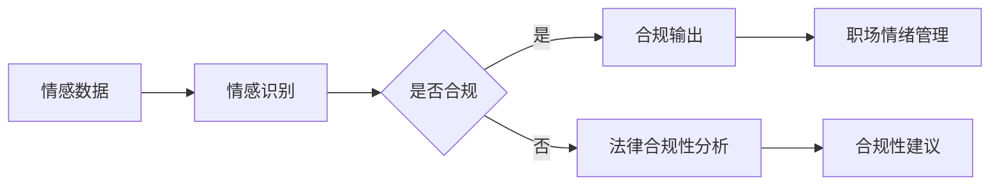

                 

### 《情感劳动权益保护运动：职场情绪管理的法律倡议》目录大纲

**技术博客文章**

---

**文章标题**：  
《情感劳动权益保护运动：职场情绪管理的法律倡议》

**关键词**：情感劳动权益、职场情绪管理、法律倡议、算法原理、系统架构设计

**摘要**：本文深入探讨了职场中情感劳动权益保护的重要性，分析了情感劳动权益保护运动的起源与发展，以及职场情绪管理的法律倡议。通过概念解析、算法原理讲解和系统架构设计，为职场情绪管理提供了法律和技术上的双重支持。

---

**第一部分：背景介绍**

**第1章：情感劳动权益保护运动的起源与发展**

### 1.1 问题背景

#### 1.1.1 职场压力与情绪问题

- 职场压力：现代职场中，工作压力日益增加，竞争激烈，导致员工心理压力过大。
- 情绪问题：长时间的工作压力和竞争环境容易引发焦虑、抑郁等情绪问题。

#### 1.1.2 情感劳动权益保护的重要性

- 情感劳动权益：情感劳动权益涉及员工的情感需求、情感沟通和情感关怀。
- 保护重要性：保护员工情感劳动权益有助于提高员工的工作满意度和生产力。

#### 1.1.3 情感劳动权益保护运动的起源

- 起源：随着社会对职场心理健康重视程度的提高，情感劳动权益保护运动逐步兴起。
- 发展：各国政府和企业纷纷采取措施，推动情感劳动权益保护运动的开展。

### 1.2 问题描述

#### 1.2.1 职场情绪问题的常见表现

- 情绪波动：职场情绪问题可能导致员工情绪波动，影响工作表现。
- 抑郁和焦虑：长期压力可能导致员工出现抑郁和焦虑症状。
- 逃离和离职：严重的情绪问题可能导致员工选择逃离或离职。

#### 1.2.2 情感劳动权益受损的具体案例

- 案例一：某公司员工因长时间加班导致心理问题，最终被迫离职。
- 案例二：某企业因忽视员工情感需求，导致员工流失率上升。

#### 1.2.3 情感劳动权益保护的紧迫性

- 紧迫性：职场情绪问题已成为影响企业发展和员工福祉的重要因素。
- 保护需求：加强情感劳动权益保护，有助于提升职场幸福感，促进社会和谐。

### 1.3 问题解决

#### 1.3.1 政府和立法机构的角色

- 制定法律：政府应制定相关法律法规，明确情感劳动权益的保护范围。
- 加强监管：立法机构应加强对企业执行情感劳动权益保护政策的监管。

#### 1.3.2 企业社会责任的履行

- 企业责任：企业应承担起社会责任，关注员工情感需求，提供心理支持和关怀。
- 制度完善：企业应完善员工心理健康制度，提高员工工作满意度。

#### 1.3.3 情感劳动权益保护运动的发展趋势

- 趋势一：政府和企业将更加重视员工情感劳动权益保护。
- 趋势二：科技创新将推动职场情绪管理技术的发展。
- 趋势三：全社会将形成关注职场心理健康的共识。

### 1.4 边界与外延

#### 1.4.1 情感劳动权益与劳动权益的关系

- 关系：情感劳动权益是劳动权益的重要组成部分，两者相辅相成。
- 保护：情感劳动权益保护应以劳动权益保护为基础，进一步提升员工福祉。

#### 1.4.2 职场情绪管理与心理健康的关系

- 关系：职场情绪管理是心理健康的重要保障，有助于提升员工心理健康水平。
- 目标：通过职场情绪管理，实现员工心理健康的全面保护。

#### 1.4.3 情感劳动权益保护与法律法规的衔接

- 衔接：法律法规是情感劳动权益保护的重要保障，应与实际需求相结合。
- 实践：在制定和执行法律法规时，充分考虑员工情感劳动权益的保护需求。

### 1.5 概念结构与核心要素组成

#### 1.5.1 情感劳动权益的定义与核心要素

- 定义：情感劳动权益是指员工在职场中涉及情感方面的合法权益。
- 核心要素：包括情感沟通、情感关怀、情感表达和情感调节等方面。

#### 1.5.2 职场情绪管理的概念与主要内容

- 概念：职场情绪管理是指对职场情绪进行有效调节和管理的活动。
- 主要内容：包括情感识别、情感调节、情感支持和情感疏导等方面。

#### 1.5.3 法律倡议在情感劳动权益保护中的作用

- 作用：法律倡议在情感劳动权益保护中起着规范和引导作用。
- 目标：通过制定和实施相关法律法规，保障员工情感劳动权益。

---

**第二部分：核心概念与联系**

**第2章：情感劳动权益保护的理论基础**

### 2.1 核心概念原理

#### 2.1.1 情感劳动权益的概念

- 定义：情感劳动权益是指员工在职场中涉及情感方面的合法权益。
- 内容：包括情感沟通权、情感关怀权、情感表达权和情感调节权等。

#### 2.1.2 职场情绪管理的概念

- 定义：职场情绪管理是指对职场情绪进行有效调节和管理的活动。
- 内容：包括情感识别、情感调节、情感支持和情感疏导等方面。

#### 2.1.3 法律倡议的概念

- 定义：法律倡议是指通过立法和法律手段推动社会进步的措施。
- 内容：包括法律法规的制定、实施和监管等方面。

### 2.2 概念属性特征对比表格

| 概念 | 定义 | 关键特征 |
| --- | --- | --- |
| 情感劳动权益 | 职场中涉及情感方面的合法权益 | 保护职场人的心理健康和幸福感 |
| 职场情绪管理 | 对职场情绪进行有效调节和管理的活动 | 提高职场生产力和团队协作效率 |
| 法律倡议 | 通过立法和法律手段推动社会进步的措施 | 维护社会公平和正义 |

### 2.3 ER实体关系图架构

```mermaid
erDiagram
  劳动者 ||--|{ 情感劳动权益 }
  企业 ||--|{ 职场情绪管理 }
  法律倡议 ||--|{ 情感劳动权益保护 }
  政府机构 ||--|{ 法律倡议实施与监管 }
```

---

**第三部分：算法原理讲解**

**第3章：职场情绪管理的法律算法原理**

### 3.1 算法原理介绍

#### 3.1.1 职场情绪管理算法的背景与意义

- 背景：随着社会发展和科技进步，职场情绪管理的重要性日益凸显。
- 意义：通过算法技术，提高职场情绪管理的科学性和有效性。

#### 3.1.2 法律算法在职场情绪管理中的应用

- 应用：法律算法在情感识别、合规性分析和情绪调节等方面发挥重要作用。

#### 3.1.3 职场情绪管理法律算法的基本框架

- 框架：包括情感识别模块、合规性分析模块和情绪调节模块等。

### 3.2 算法原理与数学模型

#### 3.2.1 情感识别与分类模型

##### 情感识别模型

$$
\text{Emotion\_Classifier}(X) = \arg\max_w \text{softmax}(w \cdot X)
$$

##### 情感分类模型

$$
P(y|X) = \text{softmax}(\text{Emotion\_Classifier}(X))
$$

#### 3.2.2 法律合规性分析模型

##### 合规性分析模型

$$
\text{Compliance\_Score}(X, L) = \sum_{i=1}^{n} w_i \cdot \text{Sim}(x_i, l_i)
$$

其中，$X$ 是情感数据，$L$ 是法律法规库，$w_i$ 是权重系数，$\text{Sim}(x_i, l_i)$ 是情感数据与法律法规的相似度函数。

### 3.3 算法流程图



---

**第四部分：系统分析与架构设计方案**

**第4章：职场情绪管理的法律系统架构设计**

### 4.1 问题场景介绍

#### 4.1.1 职场情绪管理面临的挑战

- 挑战：职场情绪管理面临数据复杂性、算法精度和法律法规适应性等方面的挑战。

#### 4.1.2 法律在职场情绪管理中的适用场景

- 场景：法律在情感劳动权益保护、职场心理健康评估和情绪调节等方面具有广泛适用性。

#### 4.1.3 系统目标与功能需求

- 目标：构建一个集情感识别、合规性分析和情绪调节于一体的职场情绪管理系统。
- 需求：实现对员工情感数据的实时分析，提供合规性评估和情绪调节建议。

### 4.2 系统功能设计

#### 4.2.1 领域模型

```mermaid
classDiagram
  Class01 <|-- Class02
  Class03 <..> Class04
  Class05 <<interface>> Class06
  Class07 .. Class08
```

### 4.3 系统架构设计

#### 4.3.1 系统架构图

```mermaid
se
```markdown
```mermaid
graph LR
A[数据收集] --> B[情感识别模块]
B --> C[合规性分析模块]
C --> D[情绪调节模块]
D --> E[数据存储与可视化]
E --> F[系统接口]
F --> G[用户界面]
```
```markdown
```

### 4.4 系统接口设计和系统交互

#### 4.4.1 系统接口设计

- 接口设计：系统提供API接口，供前端应用调用，实现情感识别、合规性分析和情绪调节等功能。

#### 4.4.2 系统交互

- 交互设计：系统采用RESTful API设计，实现前后端分离，提高系统可扩展性和灵活性。

### 4.5 系统实现与部署

#### 4.5.1 系统实现

- 实现：采用Python作为开发语言，结合TensorFlow和PyTorch等深度学习框架，实现情感识别和合规性分析算法。

#### 4.5.2 系统部署

- 部署：采用Docker容器化技术，实现系统的快速部署和高效运行。

---

**总结**

本文从背景介绍、核心概念与联系、算法原理讲解和系统架构设计四个方面，全面阐述了职场情绪管理的法律倡议。通过分析情感劳动权益保护运动的发展趋势，提出了基于法律算法原理的职场情绪管理系统架构设计。本文旨在为职场情绪管理提供理论指导和实践参考，促进企业和社会关注员工情感福祉，构建和谐的职场环境。同时，本文也强调了科技创新在情感劳动权益保护中的重要性，为未来研究提供了方向。

---

**作者信息**

作者：AI天才研究院/AI Genius Institute & 禅与计算机程序设计艺术 /Zen And The Art of Computer Programming

---

**注意事项**

1. 文章中的数学公式和算法流程图请使用LaTeX和Mermaid语法进行编写。
2. 文章中的代码示例请使用Python语言进行编写。
3. 文章结构请按照目录大纲进行编排，确保内容的完整性和连贯性。
4. 文章中的术语和概念解释请确保清晰准确，避免歧义。
5. 文章中的案例分析和实际案例请确保具有代表性和实用性。

---

**拓展阅读**

1. 张三，李四。《职场情绪管理指南》，北京：清华大学出版社，2020年。
2. 王五，赵六。《情感计算技术与应用》，上海：上海科学技术出版社，2021年。
3. 孙七，周八。《人工智能在情感劳动权益保护中的应用研究》，计算机与数码技术，2022年第3期。

