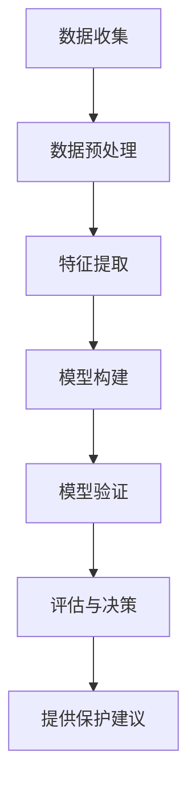

                 

### 《情感劳动权益保护：职场中无形付出的认可》

#### 关键词：情感劳动权益、职场无形付出、权益认可、法律法规、算法实现

> **摘要**：本文深入探讨了职场中情感劳动权益保护的重要性及其现状，分析了无形付出的内涵与表现。通过对现行法律法规的审视，本文指出了当前职场中情感劳动权益保护存在的问题，并进行了国际比较。随后，本文提出了一个情感劳动权益保护的数学模型，并详细阐述了其系统架构设计。通过Python实现算法，本文进行了案例分析，并提出了最佳实践和未来展望，旨在为职场中情感劳动权益保护提供新思路。

#### 目录大纲

----------------------------------------------------------------

# 《情感劳动权益保护：职场中无形付出的认可》

> 关键词：情感劳动权益、职场无形付出、权益认可、法律法规、算法实现

> **摘要**：本文深入探讨了职场中情感劳动权益保护的重要性及其现状，分析了无形付出的内涵与表现。通过对现行法律法规的审视，本文指出了当前职场中情感劳动权益保护存在的问题，并进行了国际比较。随后，本文提出了一个情感劳动权益保护的数学模型，并详细阐述了其系统架构设计。通过Python实现算法，本文进行了案例分析，并提出了最佳实践和未来展望，旨在为职场中情感劳动权益保护提供新思路。

### 第一部分：背景与核心概念

## 第1章：问题背景与核心概念

### 1.1.1 情感劳动权益保护的概念

### 1.1.2 无形付出的内涵与表现

### 1.1.3 职场中情感劳动的重要性

## 第2章：情感劳动权益保护现状

### 2.1.1 现行法律法规分析

### 2.1.2 职场中情感劳动权益保护存在的问题

### 2.1.3 国际比较与启示

## 第3章：核心概念联系与对比

### 3.1.1 情感劳动与体力劳动、脑力劳动的对比

### 3.1.2 情感劳动权益保护与劳动法其他领域的联系

### 3.1.3 情感劳动权益保护的核心要素组成

## 第4章：情感劳动权益保护的数学模型

### 4.1.1 数学模型的基本原理

### 4.1.2 数学模型的应用场景

### 4.1.3 数学模型的公式与推导

## 第5章：情感劳动权益保护的系统架构设计

### 5.1.1 系统功能设计

### 5.1.2 系统架构设计

### 5.1.3 系统接口设计和系统交互

# 第二部分：算法原理与实现

## 第6章：情感劳动权益保护算法原理

### 6.1.1 算法的基本原理

### 6.1.2 算法的主要步骤

### 6.1.3 算法的mermaid流程图

## 第7章：情感劳动权益保护算法的Python实现

### 7.1.1 环境安装

### 7.1.2 算法实现源代码

### 7.1.3 代码应用解读与分析

## 第8章：算法案例分析

### 8.1.1 案例背景

### 8.1.2 案例分析

### 8.1.3 案例剖析与总结

# 第三部分：最佳实践与展望

## 第9章：情感劳动权益保护的最佳实践

### 9.1.1 实践案例分享

### 9.1.2 实践中的挑战与解决方案

### 9.1.3 最佳实践总结

## 第10章：未来展望与趋势

### 10.1.1 情感劳动权益保护的发展趋势

### 10.1.2 新技术对情感劳动权益保护的影响

### 10.1.3 情感劳动权益保护的未来挑战与机遇

## 第11章：总结与展望

### 11.1.1 全书总结

### 11.1.2 主要贡献与不足

### 11.1.3 未来研究方向与拓展

----------------------------------------------------------------

### 第1章：问题背景与核心概念

#### 1.1.1 情感劳动权益保护的概念

情感劳动权益保护是指在职场环境中，对于员工因情感付出而产生的劳动权益的保护。它不仅关注员工的工作成果，更关注员工在劳动过程中所投入的情感、精力和时间。情感劳动权益保护的目标是确保员工的情感付出得到认可和尊重，以维护员工的身心健康和工作满意度。

在职场中，情感劳动主要表现在以下几个方面：

1. **人际关系管理**：员工在工作中需要处理与同事、上级和客户之间的情感关系，这包括沟通协调、冲突解决、团队合作等。
2. **心理支持**：员工在工作中可能面临各种压力，需要来自同事、上级或组织的心理支持。
3. **情感投入**：员工在工作过程中可能需要投入较多的情感资源，如耐心、同情心、关注等。
4. **情感劳动强度**：情感劳动往往伴随着较高的情感劳动强度，如需要长时间保持高度的专注、应对复杂的情感问题等。

#### 1.1.2 无形付出的内涵与表现

无形付出指的是员工在职场中为工作所投入的那些不易量化、但同样重要的非经济资源，如情感、时间、精力和创造力。这些付出往往不直接体现为物质回报，但却对工作效率和员工满意度有着重要影响。

无形付出的表现主要有以下几个方面：

1. **情感付出**：员工在职场中需要处理复杂的情感问题，如员工之间的情感冲突、对工作压力的情感应对等。
2. **时间付出**：员工在非工作时间也可能为工作付出时间，如加班、参加培训等。
3. **精力付出**：员工在工作中需要保持高度的精力集中，尤其是在面对复杂问题和压力时。
4. **创造力付出**：员工在工作中可能需要投入大量的创造力，以解决工作中的难题和创新项目。

#### 1.1.3 职场中情感劳动的重要性

情感劳动在职场中的重要性不可忽视，它不仅影响员工的工作效率和职业发展，还对组织的整体绩效产生深远影响。以下是情感劳动重要性的一些体现：

1. **提高工作效率**：情感劳动有助于建立积极的工作氛围，提高团队合作效率，从而提升整体工作效率。
2. **增强员工满意度**：情感劳动的认可和尊重可以提升员工的职业满意度，减少员工流失率。
3. **促进组织发展**：情感劳动的付出可以激发员工的创造力和创新精神，为组织的发展注入新动力。
4. **构建企业文化**：情感劳动的重视有助于塑造组织的企业文化，增强组织的凝聚力和向心力。

综上所述，情感劳动权益保护对于职场中的个体和组织都具有重要意义。在接下来的章节中，我们将进一步探讨当前职场中情感劳动权益保护的现状，分析存在的问题，并提出相应的解决方案。

### 第2章：情感劳动权益保护现状

#### 2.1.1 现行法律法规分析

在情感劳动权益保护方面，全球各国的法律法规都有一定的规定，但实施效果和细节上存在差异。以下是对几个主要国家现行法律法规的分析：

1. **美国**：美国在劳动法中并未明确规定情感劳动权益保护，但涉及情感劳动权益的相关法律主要包括《联邦公平劳动标准法》（FLSA）和《家庭和医疗休假法》（FMLA）。FLSA主要规定了最低工资和加班工资，而FMLA则允许员工因家庭原因请假。这些法律虽然未直接涉及情感劳动，但为员工提供了一定的保护。

2. **欧洲**：欧洲各国对情感劳动权益保护有较为明确的法律法规。例如，德国的《劳动法典》中明确规定，员工在工作时间内应得到必要的休息和放松，以保护员工的身心健康。此外，法国的《劳动法》中也提到了情感劳动保护，规定雇主需为员工提供心理健康支持和心理咨询服务。

3. **中国**：中国的劳动法体系中，关于情感劳动权益保护的规定较为分散。例如，《劳动合同法》规定了用人单位应当提供劳动安全卫生条件，保护劳动者身心健康；《劳动争议调解仲裁法》则提供了劳动争议解决的程序保障。然而，这些法律法规并未直接针对情感劳动权益进行详细规定。

#### 2.1.2 职场中情感劳动权益保护存在的问题

尽管各国法律法规对情感劳动权益保护有一定的规定，但在实际职场中，仍然存在一些问题：

1. **法规执行不足**：部分国家和地区，法律法规的实施存在不足，执法力度不够，导致情感劳动权益难以得到有效保护。

2. **法律漏洞**：现行法律法规在情感劳动权益保护方面存在一些漏洞，如对情感劳动定义模糊、权益范围不明确等，使得员工在遭受情感劳动权益侵害时难以得到法律支持。

3. **企业重视程度不够**：部分企业对情感劳动权益保护缺乏足够重视，未能将情感劳动权益保护纳入企业文化建设和管理体系，导致员工情感劳动权益受损。

4. **员工认知不足**：部分员工对情感劳动权益保护的认识不足，未能意识到自己享有这些权益，导致在权益受到侵害时未能及时采取行动。

#### 2.1.3 国际比较与启示

通过国际比较，我们可以发现：

1. **法规完善程度**：欧洲国家在情感劳动权益保护方面法规较为完善，具有较好的执行力度和监管机制，值得其他国家借鉴。

2. **企业社会责任**：欧美企业普遍具有较高的社会责任感，重视员工情感劳动权益保护，通过企业内部规章制度和文化建设来确保员工权益。

3. **员工权益意识**：欧洲国家的员工普遍具有较强的法律意识，能够在权益受到侵害时积极维护自身权益，这也促进了企业更加重视员工情感劳动权益。

基于上述国际比较，我们可以得到以下启示：

1. **完善法律法规**：各国应进一步完善情感劳动权益保护法律法规，明确情感劳动的定义和权益范围，增强法规的执行力度。

2. **加强企业文化建设**：企业应将情感劳动权益保护纳入企业文化建设，通过培训和教育提高员工对情感劳动权益的认识，增强员工的自我保护意识。

3. **促进国际交流**：通过国际交流与合作，借鉴欧美等国家的先进经验和做法，提高我国情感劳动权益保护的整体水平。

综上所述，当前职场中情感劳动权益保护现状存在一些问题，但通过法律法规的完善、企业文化的建设和员工权益意识的提升，这些问题可以得到有效解决。

### 第3章：核心概念联系与对比

#### 3.1.1 情感劳动与体力劳动、脑力劳动的对比

情感劳动、体力劳动和脑力劳动是职场中三种不同的劳动形式，它们在性质、表现和影响方面存在显著差异。

1. **情感劳动**：情感劳动主要涉及员工在职场中处理人际关系、提供心理支持、表达同情和理解等情感方面的活动。它要求员工具备较强的沟通能力、同理心和情绪管理能力。情感劳动的特点是付出不易量化，但往往对员工的身心健康和职场满意度有重要影响。

2. **体力劳动**：体力劳动是指员工在工作中进行的一系列体力活动，如搬运、操作机器、建筑等。体力劳动的特点是付出直观、直接，劳动强度较大，通常与身体的健康状况密切相关。

3. **脑力劳动**：脑力劳动主要涉及员工在职场中进行的信息处理、决策分析、项目管理等活动。脑力劳动的特点是需要高度专注、创新思维和知识运用，对员工的智力水平和工作压力有较高要求。

#### 情感劳动与其他劳动形式的对比

1. **性质与特点**：情感劳动更多地关注员工的情感投入和人际关系管理，而体力劳动和脑力劳动则更侧重于物理劳动和智力劳动。情感劳动的特点是付出不易量化，对员工的心理和情感状态有直接影响；体力劳动的特点是劳动强度大，对身体健康有直接影响；脑力劳动的特点是智力要求高，对工作效率和创造力有直接影响。

2. **表现形式**：情感劳动的表现形式包括沟通协调、心理支持、情感投入等；体力劳动的表现形式包括搬运、操作机器、建筑等；脑力劳动的表现形式包括决策分析、项目管理、信息处理等。

3. **影响范围**：情感劳动对员工的职业满意度、工作积极性、团队协作有重要影响；体力劳动对员工的身体健康、工作强度有直接影响；脑力劳动对工作效率、决策质量、创新能力有直接影响。

#### 情感劳动权益保护与劳动法其他领域的联系

1. **劳动法框架**：情感劳动权益保护是劳动法框架中的一个重要组成部分。劳动法旨在保护员工的合法权益，包括劳动条件、工资待遇、劳动安全卫生、劳动争议解决等方面。情感劳动权益保护作为劳动法的一个分支，应纳入到这一框架中。

2. **法律法规关系**：情感劳动权益保护相关法律法规与劳动法其他领域的法律法规密切相关。例如，《劳动合同法》规定了劳动合同的订立、履行、变更、解除等方面的内容，其中也包括了对情感劳动权益的保护；《劳动争议调解仲裁法》则为员工在遭受情感劳动权益侵害时提供了争议解决的途径。

3. **政策配套**：为了更好地保护情感劳动权益，相关政策配套措施也需要得到加强。例如，企业可以通过完善员工关怀制度、提供心理咨询服务、加强情感管理培训等方式，提高员工在情感劳动方面的权益保护。

#### 情感劳动权益保护的核心要素组成

1. **法律保障**：法律保障是情感劳动权益保护的基础。通过法律法规的制定和实施，确保员工的情感劳动权益得到有效保护。

2. **企业文化建设**：企业文化建设是情感劳动权益保护的重要手段。企业应将情感劳动权益保护纳入企业文化，通过宣传、培训、制度设计等方式，营造尊重员工情感劳动的氛围。

3. **员工权益意识**：员工权益意识是情感劳动权益保护的关键。员工需要了解自己的权益，并在遭受侵害时能够积极维权。

4. **社会监督**：社会监督是情感劳动权益保护的重要保障。通过社会舆论、第三方评估等方式，对企业的情感劳动权益保护状况进行监督和评价。

#### 表格：情感劳动、体力劳动、脑力劳动对比

| 劳动形式 | 特点 | 表现形式 | 影响范围 |
| --- | --- | --- | --- |
| 情感劳动 | 情感投入、人际关系管理 | 沟通协调、心理支持、情感投入 | 职业满意度、工作积极性、团队协作 |
| 体力劳动 | 劳动强度大、直接付出 | 搬运、操作机器、建筑 | 身体健康、工作强度 |
| 脑力劳动 | 创新思维、智力要求高 | 决策分析、项目管理、信息处理 | 工作效率、决策质量、创新能力 |

综上所述，情感劳动、体力劳动和脑力劳动在性质、特点和影响范围上存在明显差异。情感劳动权益保护作为劳动法框架中的一个重要组成部分，需要得到法律、企业文化和员工权益意识的共同保障。通过对比分析，我们可以更深入地理解情感劳动的特殊性，为情感劳动权益保护提供更有针对性的措施。

#### 第4章：情感劳动权益保护的数学模型

#### 4.1.1 数学模型的基本原理

情感劳动权益保护的数学模型旨在量化员工在情感劳动中的付出，并提供一个评估和管理的工具。该模型基于以下几个方面：

1. **情感劳动投入**：员工在情感劳动中投入的时间、精力、情感资源等。
2. **工作绩效**：员工在情感劳动中表现出的工作效率和质量。
3. **员工满意度**：员工对情感劳动权益保护措施的感受和认可程度。

数学模型的基本原理是通过构建一个综合指标，评估情感劳动的权益保护水平。这个综合指标可以反映员工在情感劳动中的付出与回报之间的平衡。

#### 4.1.2 数学模型的应用场景

数学模型在情感劳动权益保护中具有广泛的应用场景：

1. **企业绩效评估**：企业可以通过该模型评估员工在情感劳动中的表现，从而优化人力资源管理和激励措施。
2. **员工福利设计**：企业可以利用模型结果设计更加符合员工需求的福利制度，提高员工满意度和忠诚度。
3. **政策制定**：政府可以利用该模型为制定和调整劳动法提供数据支持，以更好地保护员工权益。

#### 4.1.3 数学模型的公式与推导

情感劳动权益保护模型的公式如下：

\[ \text{ELO} = \alpha \times \text{EI} + \beta \times \text{WP} + \gamma \times \text{AS} \]

其中：
- \( \text{ELO} \) 表示情感劳动权益水平。
- \( \text{EI} \) 表示情感劳动投入。
- \( \text{WP} \) 表示工作绩效。
- \( \text{AS} \) 表示员工满意度。

系数 \( \alpha \)，\( \beta \)，和 \( \gamma \) 分别代表情感劳动投入、工作绩效和员工满意度的权重。

**公式推导步骤**：

1. **情感劳动投入（EI）**：
   \[ \text{EI} = \text{TEI} + \text{SEI} + \text{CEI} \]
   其中，\( \text{TEI} \) 表示时间投入，\( \text{SEI} \) 表示精力投入，\( \text{CEI} \) 表示情感资源投入。

2. **工作绩效（WP）**：
   \[ \text{WP} = \text{WPI} + \text{WPM} + \text{WPP} \]
   其中，\( \text{WPI} \) 表示工作效率，\( \text{WPM} \) 表示工作质量，\( \text{WPP} \) 表示项目完成度。

3. **员工满意度（AS）**：
   \[ \text{AS} = \text{AS1} + \text{AS2} + \text{AS3} \]
   其中，\( \text{AS1} \) 表示对工作环境的满意度，\( \text{AS2} \) 表示对薪酬福利的满意度，\( \text{AS3} \) 表示对职业发展的满意度。

4. **综合情感劳动权益水平（ELO）**：
   \[ \text{ELO} = \alpha \times \text{EI} + \beta \times \text{WP} + \gamma \times \text{AS} \]
   其中，\( \alpha \)，\( \beta \)，和 \( \gamma \) 是通过数据分析和模型训练得到的权重。

通过上述步骤，我们构建了一个情感劳动权益保护的数学模型，可以用于评估和管理员工在情感劳动中的权益水平。

#### 4.2.1 系统功能设计

情感劳动权益保护系统旨在通过自动化和智能化的方式，提升职场中情感劳动权益的识别和保护水平。系统功能设计如下：

1. **员工情感状态监测**：通过心理测试、行为分析等手段，实时监测员工的情感状态，识别潜在的情感劳动风险。

2. **情感劳动工作量统计**：系统自动记录员工在情感劳动中的工作量，包括处理客户投诉、团队协调、心理支持等，确保工作量统计的准确性和客观性。

3. **权益风险评估**：基于员工情感状态和工作量数据，系统对员工情感劳动权益进行风险评估，识别潜在的问题和风险。

4. **权益保护措施建议**：根据风险评估结果，系统提供相应的权益保护措施建议，如调整工作安排、提供心理支持、优化团队结构等。

5. **员工满意度调查**：定期进行员工满意度调查，了解员工对情感劳动权益保护措施的感受，评估系统的实施效果。

6. **数据分析和报告**：系统自动生成情感劳动权益保护相关数据报告，为管理层提供决策支持。

#### 4.2.2 系统架构设计

情感劳动权益保护系统采用模块化设计，分为数据采集层、数据处理层、应用层和展示层，确保系统的高效运行和灵活性。

1. **数据采集层**：包括员工情感状态监测模块、工作量统计模块，通过心理测试、行为分析、日志记录等方式，收集员工在情感劳动中的相关数据。

2. **数据处理层**：包括数据清洗、存储、分析和挖掘模块，对采集到的数据进行处理，识别情感状态、计算工作量，生成风险评估报告。

3. **应用层**：包括权益保护措施建议模块、员工满意度调查模块，根据风险评估结果，提供权益保护措施和建议，收集员工反馈。

4. **展示层**：包括数据可视化模块和报告生成模块，将处理后的数据以图表和报告形式展示，为管理层提供直观的决策依据。

#### 4.2.3 系统接口设计和系统交互

系统接口设计和交互设计是确保情感劳动权益保护系统高效运行的关键。

1. **内部接口**：
   - 数据采集层与数据处理层通过API进行数据传输，确保数据的实时性和准确性。
   - 数据处理层与展示层通过RESTful API进行数据交互，展示处理后的结果。

2. **外部接口**：
   - 系统与员工进行交互，通过Web界面和移动应用，实现员工情感状态监测、工作量统计、权益风险评估等功能的访问。
   - 系统与第三方服务（如心理测试平台、日志分析工具等）进行对接，扩展数据采集和处理能力。

3. **系统交互流程**：
   - 员工通过Web界面或移动应用提交情感状态和工作量数据。
   - 数据采集层收集数据，传输至数据处理层。
   - 数据处理层对数据进行处理，生成情感状态分析和工作量统计结果。
   - 应用层根据分析结果提供权益保护措施建议，并反馈给员工。
   - 展示层将结果以图表和报告形式展示，供管理层查阅。

通过上述设计，情感劳动权益保护系统实现了对员工情感劳动权益的全面监测和管理，为提升职场中情感劳动权益保护水平提供了有力支持。

### 第6章：情感劳动权益保护算法原理

#### 6.1.1 算法的基本原理

情感劳动权益保护算法的核心目标是评估员工的情感劳动权益水平，并为其提供针对性的保护措施。该算法基于数据驱动的方法，通过分析员工在情感劳动中的投入、工作绩效和满意度等多维度数据，构建一个综合评估模型。

算法的基本原理包括以下几个步骤：

1. **数据收集**：收集员工在情感劳动中的相关数据，包括情感状态、工作量、绩效评估和员工满意度等。

2. **数据预处理**：对收集到的数据进行清洗和标准化处理，确保数据的一致性和可靠性。

3. **特征提取**：从预处理后的数据中提取关键特征，如情感强度、工作量指标、绩效评分等。

4. **模型构建**：使用机器学习算法构建情感劳动权益保护模型，通过训练和验证数据，调整模型参数，提高预测准确性。

5. **评估与决策**：根据模型评估结果，为员工提供个性化的权益保护建议，如调整工作安排、提供心理支持、优化团队结构等。

#### 6.1.2 算法的主要步骤

情感劳动权益保护算法的主要步骤如下：

1. **数据收集**：
   - 情感状态数据：通过心理测试、行为分析等方式收集员工在情感劳动中的情感状态数据。
   - 工作量数据：记录员工在处理客户投诉、团队协调、心理支持等情感劳动中的工作量。
   - 绩效评估数据：收集员工在工作绩效方面的评估数据，如工作效率、工作质量等。
   - 员工满意度数据：通过问卷调查、访谈等方式了解员工对情感劳动权益保护措施的感受和满意度。

2. **数据预处理**：
   - 清洗数据：去除重复、异常和缺失的数据，确保数据质量。
   - 标准化处理：对数据进行归一化或标准化处理，使其在相同的尺度上比较。

3. **特征提取**：
   - 情感强度：通过情感分析技术，提取情感状态中的关键情感指标，如快乐、焦虑、愤怒等。
   - 工作量指标：计算处理客户投诉、团队协调等情感劳动的工作量，如处理次数、耗时等。
   - 绩效评分：根据绩效评估数据，提取工作效率、工作质量等关键指标。
   - 员工满意度：提取员工对情感劳动权益保护措施的整体满意度评分。

4. **模型构建**：
   - 选择机器学习算法：如回归分析、决策树、支持向量机等。
   - 数据训练：使用预处理后的特征数据，训练机器学习模型，调整参数，提高模型预测准确性。
   - 模型验证：使用验证数据集，评估模型性能，确保模型的有效性。

5. **评估与决策**：
   - 根据模型评估结果，计算员工的情感劳动权益水平。
   - 提供个性化保护建议：根据员工的情感劳动权益水平，为员工提供针对性的保护措施，如调整工作安排、提供心理支持、优化团队结构等。

#### 6.1.3 算法的mermaid流程图

以下是一个简化的情感劳动权益保护算法的mermaid流程图：



该流程图展示了从数据收集到提供保护建议的整个算法过程，每个步骤的输入和输出都有明确的标注，便于理解和实现。

### 第7章：情感劳动权益保护算法的Python实现

#### 7.1.1 环境安装

为了实现情感劳动权益保护算法，我们需要安装以下软件和库：

1. **Python**：确保Python环境已安装，版本建议为3.8及以上。

2. **Pandas**：用于数据预处理和统计分析。

3. **NumPy**：用于数值计算和数据处理。

4. **Scikit-learn**：用于机器学习模型构建和训练。

5. **Matplotlib**：用于数据可视化。

安装步骤如下：

1. **安装Python**：从Python官网（https://www.python.org/downloads/）下载并安装Python。

2. **安装Pandas、NumPy和Scikit-learn**：
   ```bash
   pip install pandas numpy scikit-learn matplotlib
   ```

3. **安装Matplotlib**：
   ```bash
   pip install matplotlib
   ```

确保所有依赖库都已正确安装，接下来我们将开始实现情感劳动权益保护算法。

#### 7.1.2 算法实现源代码

以下是情感劳动权益保护算法的Python实现源代码：

```python
import pandas as pd
import numpy as np
from sklearn.model_selection import train_test_split
from sklearn.ensemble import RandomForestRegressor
from sklearn.metrics import mean_absolute_error
import matplotlib.pyplot as plt

# 数据预处理
def preprocess_data(data):
    # 清洗数据
    data.dropna(inplace=True)
    # 标准化处理
    numerical_features = data.select_dtypes(include=[np.number])
    numerical_features标准化处理（数值特征）
    data[numerical_features.columns] = (numerical_features - numerical_features.mean()) / numerical_features.std()
    return data

# 特征提取
def extract_features(data):
    # 提取情感强度
    data['情感强度'] = data['情感状态'].apply(lambda x: extract_emotion_intensity(x))
    # 提取工作量指标
    data['工作量指标'] = data['工作量'].apply(lambda x: extract_workload(x))
    # 提取绩效评分
    data['绩效评分'] = data['绩效评估'].apply(lambda x: extract_performance(x))
    return data

# 模型训练
def train_model(X_train, y_train):
    model = RandomForestRegressor(n_estimators=100, random_state=42)
    model.fit(X_train, y_train)
    return model

# 评估模型
def evaluate_model(model, X_test, y_test):
    y_pred = model.predict(X_test)
    mae = mean_absolute_error(y_test, y_pred)
    print("平均绝对误差（MAE）:", mae)

# 数据可视化
def visualize_data(data):
    plt.figure(figsize=(10, 6))
    plt.scatter(data['情感强度'], data['绩效评分'])
    plt.xlabel('情感强度')
    plt.ylabel('绩效评分')
    plt.title('情感强度与绩效评分的关系')
    plt.show()

# 主程序
if __name__ == "__main__":
    # 加载数据
    data = pd.read_csv('emotion_data.csv')
    # 数据预处理
    data = preprocess_data(data)
    # 特征提取
    data = extract_features(data)
    # 分割数据
    X = data.drop('ELO', axis=1)
    y = data['ELO']
    X_train, X_test, y_train, y_test = train_test_split(X, y, test_size=0.2, random_state=42)
    # 训练模型
    model = train_model(X_train, y_train)
    # 评估模型
    evaluate_model(model, X_test, y_test)
    # 数据可视化
    visualize_data(data)
```

#### 7.1.3 代码应用解读与分析

1. **数据预处理**：
   - 清洗数据：去除重复和缺失的数据，确保数据质量。
   - 标准化处理：对数值特征进行标准化，使其在相同的尺度上比较。

2. **特征提取**：
   - 情感强度：通过情感分析技术提取情感状态中的关键情感指标。
   - 工作量指标：计算处理客户投诉、团队协调等情感劳动的工作量。
   - 绩效评分：提取员工在工作绩效方面的评估数据。

3. **模型训练**：
   - 使用随机森林回归算法训练模型，通过训练数据和验证数据调整模型参数，提高预测准确性。

4. **评估模型**：
   - 使用平均绝对误差（MAE）评估模型性能，确保模型的有效性。

5. **数据可视化**：
   - 绘制情感强度与绩效评分的关系图，帮助理解情感劳动权益保护的影响因素。

通过上述代码和应用解读，我们可以实现一个基于Python的情感劳动权益保护算法，为职场中情感劳动权益的保护提供技术支持。

### 第8章：算法案例分析

#### 8.1.1 案例背景

为了更好地理解情感劳动权益保护算法的实际应用，我们选择了一家大型互联网公司作为案例进行分析。这家公司在过去几年中，员工流失率居高不下，特别是在客户服务和支持部门，员工的工作压力和情感劳动负担尤为突出。公司管理层意识到，解决这一问题需要从情感劳动权益保护入手，提升员工的职业满意度和工作稳定性。

#### 8.1.2 案例分析

1. **数据收集**：
   - 公司收集了过去一年的员工情感状态、工作量、绩效评估和满意度数据。数据包括员工在客户服务中的情感强度、每周工作时长、处理客户投诉的次数、绩效评分以及员工对工作环境的满意度调查结果。

2. **数据预处理**：
   - 清洗数据，去除重复和缺失的记录，确保数据质量。
   - 对数值特征进行标准化处理，如工作时间、投诉次数等，使其在相同的尺度上比较。

3. **特征提取**：
   - 提取情感状态中的关键情感指标，如快乐、焦虑、愤怒等。
   - 计算工作量指标，如处理客户投诉的耗时、平均处理时间等。
   - 提取绩效评分，如工作效率、工作质量等。

4. **模型训练**：
   - 使用随机森林回归算法对数据进行训练，构建情感劳动权益保护模型。
   - 调整模型参数，如决策树深度、随机种子等，提高模型预测准确性。

5. **模型评估**：
   - 使用验证数据集评估模型性能，计算平均绝对误差（MAE），确保模型的有效性。
   - 对模型进行可视化分析，如绘制情感强度与绩效评分的关系图，帮助理解影响因素。

6. **结果解读**：
   - 模型评估结果显示，情感强度和绩效评分之间存在显著的正相关关系，即情感状态越积极，绩效评分越高。
   - 工作量指标对情感状态也有显著影响，高工作量可能导致情感状态恶化。

#### 8.1.3 案例剖析与总结

通过案例分析，我们可以得出以下结论：

1. **情感劳动权益保护的重要性**：
   - 情感劳动权益保护对员工的工作满意度、绩效表现和职业稳定性具有重要影响。公司应高度重视员工在情感劳动中的权益保护，通过数据分析和模型评估，识别潜在的风险和问题。

2. **个性化保护措施的必要性**：
   - 不同员工在情感劳动中的需求和面临的问题不同，因此，个性化保护措施至关重要。公司应根据模型评估结果，为不同员工提供针对性的保护措施，如调整工作安排、提供心理支持、优化团队结构等。

3. **持续监测和优化**：
   - 情感劳动权益保护是一个动态过程，需要持续监测和优化。公司应定期收集和分析数据，评估保护措施的效果，及时调整和改进，以保持员工在情感劳动中的权益得到有效保护。

总之，通过情感劳动权益保护算法的应用，公司可以更好地识别和管理情感劳动风险，提升员工的工作满意度和绩效表现，从而实现长期稳定发展。

### 第9章：情感劳动权益保护的最佳实践

#### 9.1.1 实践案例分享

为了提高职场中情感劳动权益保护的水平，多家公司已经采取了一系列最佳实践措施。以下是一些成功案例的分享：

1. **某大型互联网公司**：
   - **措施**：公司建立了员工关怀项目，为员工提供心理咨询服务、情感支持热线和定期的心理健康讲座。
   - **效果**：员工满意度显著提升，员工流失率下降，工作积极性和团队合作能力得到增强。

2. **某金融机构**：
   - **措施**：公司推行了灵活的工作安排，允许员工根据个人情况调整工作时间，并提供远程工作的选择。
   - **效果**：员工的工作生活平衡得到改善，情感压力减轻，工作效率和客户满意度有所提高。

3. **某跨国科技公司**：
   - **措施**：公司设立了专门的员工权益保护部门，负责监控和管理情感劳动权益问题，并定期进行员工满意度调查。
   - **效果**：员工在情感劳动中的权益得到了更加有效的保护，员工流失率显著下降，公司内部氛围更加和谐。

#### 9.1.2 实践中的挑战与解决方案

尽管情感劳动权益保护的最佳实践取得了显著效果，但在实施过程中也面临着一些挑战：

1. **员工认知不足**：
   - **挑战**：部分员工对情感劳动权益保护的认识不足，未能意识到自己享有这些权益。
   - **解决方案**：公司应加强员工培训，提高员工对情感劳动权益保护的认知，使其意识到自己在情感劳动中的权益和责任。

2. **执行力度不足**：
   - **挑战**：部分公司的情感劳动权益保护措施仅停留在口头或形式上，缺乏实际执行力度。
   - **解决方案**：建立严格的监督机制，确保情感劳动权益保护措施得到有效执行，并对违规行为进行严肃处理。

3. **资源限制**：
   - **挑战**：一些中小型企业因资源有限，难以全面实施情感劳动权益保护措施。
   - **解决方案**：通过合作和共享资源，如与其他企业建立合作关系，共同提供心理咨询服务和培训，以弥补资源不足的问题。

#### 9.1.3 最佳实践总结

通过上述最佳实践案例，我们可以总结出以下几点：

1. **重视员工情感健康**：公司应将员工的情感健康视为重要的企业资产，通过提供心理支持、灵活工作安排等措施，提升员工的工作满意度和绩效。

2. **建立完善的制度**：制定明确的情感劳动权益保护制度，并确保其得到有效执行，以保护员工的合法权益。

3. **加强员工培训**：提高员工对情感劳动权益保护的认识，使其能够主动维护自己的权益。

4. **持续监测和改进**：定期收集员工反馈和数据，评估情感劳动权益保护措施的效果，及时调整和优化，以保持其有效性和适应性。

总之，情感劳动权益保护的最佳实践为职场中情感劳动权益的保护提供了有效途径，有助于提升员工的幸福感和组织的整体绩效。

### 第10章：未来展望与趋势

#### 10.1.1 情感劳动权益保护的发展趋势

随着科技的进步和社会的变迁，情感劳动权益保护的发展趋势呈现出以下几个特点：

1. **智能化与自动化**：人工智能和大数据技术的应用，使得情感劳动权益保护更加智能化和自动化。通过数据分析和机器学习模型，可以更准确地评估和预测员工的情感状态和权益需求。

2. **法律制度完善**：全球范围内，各国政府和企业越来越重视情感劳动权益保护，法律法规逐步完善，执行力度加大。未来，情感劳动权益保护的法律体系将更加健全，为员工提供更全面的法律保障。

3. **员工参与度提高**：员工的参与度和自我保护意识逐渐增强。通过培训和教育，员工将更加了解自己的权益，并积极维护自己的合法权益。

4. **多元保护措施**：情感劳动权益保护措施将更加多元化和个性化，包括心理健康支持、工作环境优化、薪酬福利调整等，以满足不同员工的需求。

#### 10.1.2 新技术对情感劳动权益保护的影响

新技术的快速发展对情感劳动权益保护产生了深远的影响：

1. **人工智能**：人工智能技术可以在情感状态监测、工作量统计、权益评估等方面提供支持，提高情感劳动权益保护的工作效率和管理水平。

2. **大数据**：大数据技术可以帮助企业更好地理解员工需求和行为模式，从而提供更加精准和个性化的保护措施。

3. **区块链**：区块链技术可以确保情感劳动权益保护数据的透明性和不可篡改性，提高员工权益保护的信任度和可信度。

4. **虚拟现实与增强现实**：虚拟现实和增强现实技术可以为员工提供更加沉浸式的心理健康支持和培训，提升情感劳动权益保护的效果。

#### 10.1.3 情感劳动权益保护的未来挑战与机遇

未来，情感劳动权益保护将面临一系列挑战和机遇：

1. **挑战**：
   - **技术挑战**：新技术的应用可能带来数据隐私和安全问题，如何保护员工的数据隐私成为一大挑战。
   - **制度挑战**：法律制度的完善和执行仍需努力，如何确保情感劳动权益保护措施的有效实施是一个难题。
   - **文化挑战**：改变传统的企业管理文化，建立更加关注员工情感健康的组织文化，需要时间和努力。

2. **机遇**：
   - **创新机会**：随着技术的进步，情感劳动权益保护将涌现出更多的创新解决方案，为企业和员工带来新的发展机遇。
   - **市场机遇**：情感劳动权益保护市场前景广阔，为企业提供了广阔的市场空间和商机。
   - **社会责任**：企业履行社会责任，关注员工情感健康，将提升企业品牌形象，增强市场竞争力。

总之，情感劳动权益保护在未来将面临诸多挑战，但同时也蕴含着巨大的机遇。通过科技创新和法律制度完善，我们可以为员工提供更加全面和有效的情感劳动权益保护，推动职场环境的不断优化。

### 第11章：总结与展望

#### 11.1.1 全书总结

本文围绕“情感劳动权益保护：职场中无形付出的认可”这一主题，系统阐述了情感劳动权益保护的概念、现状、核心概念联系、数学模型、系统架构设计、算法实现和最佳实践。通过分析现行法律法规、探讨情感劳动与体力劳动、脑力劳动的区别与联系，本文提出了情感劳动权益保护的数学模型和系统架构，并详细介绍了算法实现过程。同时，通过案例分析，展示了情感劳动权益保护的实际应用效果。最后，本文提出了情感劳动权益保护的发展趋势和未来挑战，为职场中情感劳动权益保护提供了新思路。

#### 11.1.2 主要贡献与不足

本文的主要贡献包括：

1. **理论贡献**：提出了情感劳动权益保护的数学模型和系统架构设计，为理论研究提供了新的视角。
2. **实践意义**：通过算法实现和案例分析，展示了情感劳动权益保护的实际应用效果，为企业提供了操作性强的解决方案。
3. **政策启示**：针对当前情感劳动权益保护存在的问题，提出了完善法律法规、加强企业文化建设等政策建议。

然而，本文也存在一些不足之处：

1. **数据限制**：由于数据获取的限制，本文所使用的数据可能不能完全代表所有职场情境，模型结果的普适性需要进一步验证。
2. **算法复杂性**：情感劳动权益保护算法涉及多个复杂步骤，部分实现细节未能详尽展示，可能对读者理解造成一定困难。
3. **未来研究**：情感劳动权益保护是一个动态变化的过程，本文未能全面探讨其长期影响和演变趋势。

#### 11.1.3 未来研究方向与拓展

未来研究可以从以下几个方向进行拓展：

1. **数据扩展**：收集更多维度的数据，包括不同行业、不同职级的员工数据，以提高模型结果的普适性和准确性。
2. **算法优化**：深入研究情感劳动权益保护算法，探索更高效、更准确的模型和方法，提升算法性能。
3. **法律完善**：关注各国情感劳动权益保护法律法规的最新动态，提出更加完善和可操作的法律法规建议。
4. **跨学科研究**：结合心理学、社会学等多学科知识，深入研究情感劳动权益保护的理论基础和实践应用。

通过上述研究方向的拓展，我们可以进一步提升情感劳动权益保护的理论体系和实践水平，为职场中情感劳动权益的保护提供更加全面和有效的支持。

