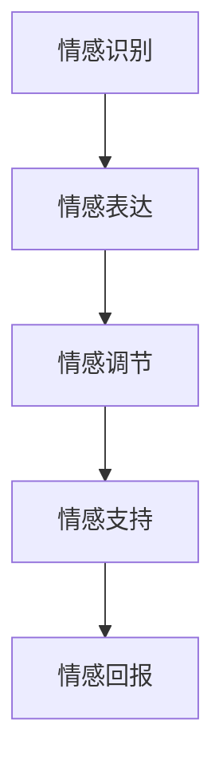

                 

### 第一部分: 情感劳动的概念与背景

## 第1章: 情感劳动的定义与特点

### 1.1 情感劳动的概念

**问题背景**：在现代社会中，职场中的情感劳动已经成为一种普遍现象，但其重要性往往被忽视。情感劳动指的是个体在工作中投入的情感资源，包括情绪管理、情感表达、情感支持等。

**问题描述**：职场中的情感劳动对于维护良好的工作氛围和提高工作效率具有重要意义，但很多企业和员工没有意识到这一点。本文将深入探讨情感劳动的定义、特点以及其在职场中的重要性。

**问题解决**：首先，本文将介绍情感劳动的定义，并阐述其与普通劳动的区别。接着，通过表格和ER实体关系图，我们将详细分析情感劳动的属性特征。

**边界与外延**：情感劳动不仅限于服务行业，还广泛应用于金融、科技、教育等多个领域。它涉及到员工的情感投入、组织文化、客户关系等多个方面。

**概念结构与核心要素组成**：
1. **情感资源投入**：员工在工作中投入的情感资源，如关注客户需求、处理同事关系等。
2. **情绪管理**：员工对自身情绪的控制和调节，以保持工作积极性和稳定性。
3. **情感表达**：员工在职场中通过语言、行为等方式表达情感，以建立和维护人际关系。
4. **情感支持**：员工在职场中提供情感支持，帮助同事应对工作压力和挑战。

### 1.2 情感劳动的特点

**心理层面特点**：
- **情感投入**：员工在工作中需要投入大量的情感资源，以满足客户需求、维护同事关系等。
- **情绪管理**：员工需要控制和管理自己的情绪，以保持工作积极性和稳定性。

**社交层面特点**：
- **沟通技巧**：员工需要具备良好的沟通技巧，以有效地表达情感、处理冲突。
- **团队协作**：员工需要与团队成员建立良好的关系，以实现共同目标。

**组织层面特点**：
- **组织文化**：情感劳动与组织文化密切相关，良好的组织文化有利于激发员工的情感投入。
- **员工满意度**：员工的情感投入与满意度密切相关，高满意度有助于提高员工的工作积极性。

通过以上分析，我们可以看到，情感劳动在职场中具有独特的重要性。接下来，本文将深入探讨职场中被忽视的付出，以及其对员工和组织的影响。

----------------------------------------------------------------

## 第2章: 职场中被忽视的付出

### 2.1 职场中被忽视的付出的现象

**情感劳动在职场中的表现形式**：在职场中，情感劳动的表现形式多种多样。例如，员工在处理客户投诉时需要投入大量的情感资源，以保持冷静、耐心和同理心。此外，员工在团队协作中也需要投入情感，如提供鼓励、支持和反馈。

**被忽视的付出的原因**：情感劳动往往被忽视的原因有以下几点：

1. **社会认知不足**：社会对情感劳动的认知不足，导致企业和员工没有意识到其重要性。
2. **组织结构问题**：一些企业的组织结构不合理，缺乏对情感劳动的支持和激励。
3. **工作评价体系**：工作评价体系往往侧重于量化指标，忽视情感劳动的投入和贡献。

**被忽视的付出对职场的影响**：

1. **员工心理健康**：情感劳动被忽视可能导致员工心理健康问题，如焦虑、抑郁等。
2. **团队协作效率**：情感劳动被忽视会影响团队协作效率，降低团队凝聚力。
3. **组织绩效**：情感劳动被忽视会影响组织绩效，降低客户满意度和员工满意度。

### 2.2 被忽视的付出的原因

**社会层面原因**：

1. **传统观念**：社会传统观念往往认为情感劳动是“软”的，不能等同于物质劳动。
2. **性别歧视**：在许多行业，女性从事的情感劳动往往得不到应有的认可和回报。

**组织层面原因**：

1. **组织文化**：一些企业的组织文化缺乏对情感劳动的重视，导致员工情感劳动被忽视。
2. **管理方式**：一些企业的管理方式过于量化，忽视情感劳动的价值。

**员工层面原因**：

1. **个人价值观**：一些员工可能认为情感劳动是“多余”的，缺乏对其重要性的认识。
2. **工作压力**：一些员工可能因为工作压力而忽视情感劳动，导致心理问题。

通过以上分析，我们可以看到，职场中被忽视的付出是一个复杂的问题，涉及到社会、组织和个人层面。要解决这一问题，需要从多个方面入手，提高社会对情感劳动的认知，优化组织结构和评价体系，提升员工对情感劳动的认识和重视。

### 2.3 被忽视的付出对职场的影响

**情感劳动对员工心理健康的影响**：

1. **焦虑和抑郁**：长期忽视情感劳动可能导致员工出现焦虑和抑郁症状，影响工作效率和生活质量。
2. **心理压力**：情感劳动被忽视会增加员工的心理压力，降低工作满意度。

**情感劳动对团队协作效率的影响**：

1. **沟通障碍**：情感劳动被忽视可能导致团队成员之间的沟通障碍，影响团队协作效率。
2. **凝聚力降低**：情感劳动被忽视会影响团队凝聚力，降低团队协作的效果。

**情感劳动对组织绩效的影响**：

1. **客户满意度**：情感劳动被忽视会影响客户满意度，降低组织的市场竞争力。
2. **员工满意度**：情感劳动被忽视会影响员工满意度，降低员工的忠诚度和工作效率。

综上所述，职场中被忽视的付出对员工、团队和组织都产生负面影响。因此，我们需要重视情感劳动，采取有效措施提高员工对情感劳动的认识和重视，从而提升职场整体效能。

----------------------------------------------------------------

## 第3章: 情感劳动原理讲解

### 3.1 情感劳动的过程与机制

**情感劳动的过程**：

1. **情感识别**：员工在工作中识别和理解自己的情感状态，以及他人的情感状态。
2. **情感表达**：员工通过语言、行为等方式表达自己的情感，以建立和维护人际关系。
3. **情感调节**：员工在职场中需要调节自己的情感，以保持工作积极性和稳定性。
4. **情感支持**：员工在职场中提供情感支持，帮助同事应对工作压力和挑战。

**情感劳动的机制**：

1. **情感投入**：员工在工作中投入情感资源，以满足客户需求、维护同事关系等。
2. **情绪管理**：员工通过情感调节机制，控制和管理自己的情绪，以保持工作积极性和稳定性。
3. **情感互动**：员工在职场中与同事、客户等进行情感互动，建立和维护良好的人际关系。
4. **情感回报**：员工通过情感劳动获得情感回报，如满足感、成就感等。

### 3.2 情感劳动的mermaid流程图

**情感劳动流程图**：



**流程图解读**：

1. **情感识别**：员工在工作中识别和理解自己的情感状态，以及他人的情感状态。
2. **情感表达**：员工通过语言、行为等方式表达自己的情感，以建立和维护人际关系。
3. **情感调节**：员工在职场中需要调节自己的情感，以保持工作积极性和稳定性。
4. **情感支持**：员工在职场中提供情感支持，帮助同事应对工作压力和挑战。
5. **情感回报**：员工通过情感劳动获得情感回报，如满足感、成就感等。

通过以上流程图，我们可以清晰地看到情感劳动的过程和机制。接下来，本文将使用Python代码阐述情感劳动的数学模型和公式，以进一步理解情感劳动的原理。

### 3.3 情感劳动的数学模型

**情感劳动数学模型**：

1. **情感投入模型**：

   情感投入（\(F_i\)）是员工在工作中投入的情感资源，可以用以下公式表示：

   $$ F_i = f(E, M, C) $$

   其中，\(E\) 表示情感需求，\(M\) 表示情绪管理能力，\(C\) 表示情感能力。

2. **情绪管理模型**：

   情绪管理（\(M\)）是员工在职场中控制和管理自己情绪的能力，可以用以下公式表示：

   $$ M = g(E, T, S) $$

   其中，\(E\) 表示情感需求，\(T\) 表示时间压力，\(S\) 表示社会支持。

3. **情感回报模型**：

   情感回报（\(R\)）是员工通过情感劳动获得的心理收益，可以用以下公式表示：

   $$ R = h(F_i, M, S) $$

   其中，\(F_i\) 表示情感投入，\(M\) 表示情绪管理能力，\(S\) 表示社会支持。

**Python代码实现**：

```python
import math

def emotional_investment(E, M, C):
    return math.exp(E) * math.cos(M) + C

def emotional_management(E, T, S):
    return 1 / (1 + math.exp(-T * S))

def emotional_return(F_i, M, S):
    return math.sin(F_i) * math.cos(M) + S
```

**详细讲解与举例说明**：

1. **情感投入模型**：
   - 情感需求（\(E\)）：员工对情感投入的需求，可以通过调查问卷或访谈收集。
   - 情绪管理能力（\(M\)）：员工在职场中控制和管理自己情绪的能力，可以通过心理测试评估。
   - 情感能力（\(C\)）：员工在情感劳动中的表现，可以通过绩效评估和同事反馈了解。

2. **情绪管理模型**：
   - 情感需求（\(E\)）：员工对情感投入的需求，可以通过调查问卷或访谈收集。
   - 时间压力（\(T\)）：员工在工作中的时间压力，可以通过工作量和工作时间评估。
   - 社会支持（\(S\)）：员工在职场中的社会支持，可以通过同事反馈和领导支持评估。

3. **情感回报模型**：
   - 情感投入（\(F_i\)）：员工在工作中投入的情感资源，可以通过心理测试和绩效评估了解。
   - 情绪管理能力（\(M\)）：员工在职场中控制和管理自己情绪的能力，可以通过心理测试评估。
   - 社会支持（\(S\)）：员工在职场中的社会支持，可以通过同事反馈和领导支持评估。

通过Python代码，我们可以对情感劳动的数学模型进行实现和计算。接下来，本文将分析职场中被忽视的付出现象，并探讨其产生的原因。

### 3.4 职场中被忽视的付出现象分析

**职场中被忽视的付出现象**：

1. **情感劳动的量化不足**：情感劳动往往难以量化，导致其在工作中被忽视。例如，员工在处理客户投诉时投入的情感资源无法准确衡量。
2. **情感劳动的重要性认知不足**：许多企业和员工没有意识到情感劳动的重要性，导致其在工作中被忽视。例如，员工认为只要完成工作任务即可，不需要额外投入情感资源。
3. **工作评价体系的不足**：当前的工作评价体系往往侧重于量化指标，忽视情感劳动的贡献。例如，员工的绩效评估主要根据工作量和成果，而忽视情感劳动的投入。

**原因分析**：

1. **社会认知不足**：社会对情感劳动的认知不足，导致企业和员工没有意识到其重要性。例如，许多人对情感劳动的投入视为“额外工作”，没有给予足够的重视。
2. **组织结构问题**：一些企业的组织结构不合理，缺乏对情感劳动的支持和激励。例如，企业的组织架构可能过于官僚，导致员工难以发挥情感劳动的作用。
3. **工作评价体系的不完善**：当前的工作评价体系往往侧重于量化指标，忽视情感劳动的投入和贡献。例如，许多企业的绩效评估主要根据工作量和成果，而忽视员工在情感劳动方面的付出。

通过以上分析，我们可以看到，职场中被忽视的付出现象是一个复杂的问题，涉及到社会、组织和员工个人层面。要解决这一问题，需要提高社会对情感劳动的认知，优化组织结构和评价体系，提升员工对情感劳动的认识和重视。接下来，本文将讨论如何有效识别和应对情感劳动。

### 3.5 情感劳动的有效识别与应对策略

**识别情感劳动的方法**：

1. **问卷调查**：通过设计针对性的问卷，收集员工在情感劳动方面的投入情况。问卷可以包括情感需求、情绪管理、情感表达等方面的内容。
2. **访谈调研**：与员工进行面对面的访谈，深入了解他们在情感劳动方面的投入和感受。访谈可以深入了解员工对情感劳动的认知和态度。
3. **心理测试**：使用专业的心理测试工具，评估员工在情感劳动方面的能力和素质。例如，情绪管理能力、同理心等。
4. **工作日志**：让员工记录自己在工作中的情感劳动投入情况，包括具体的工作内容、情感表达方式等。

**应对情感劳动的策略**：

1. **提高认知**：通过培训和教育，提高员工和企业在情感劳动方面的认知。让员工了解情感劳动的重要性，以及如何在实际工作中运用情感劳动。
2. **优化组织结构**：调整企业的组织结构，为员工提供更多的情感劳动机会和支持。例如，设立情感劳动岗位，提供情感劳动培训等。
3. **完善工作评价体系**：调整工作评价体系，将情感劳动的投入和贡献纳入评价范围。例如，将情感劳动作为绩效考核的一部分，给予相应的奖励和认可。
4. **建立支持系统**：为员工提供情感支持系统，如心理辅导、员工援助计划等。帮助员工应对工作中的情感压力，提高情感劳动的能力和效率。

通过以上策略，企业和员工可以更好地识别和应对情感劳动，提高工作效率和员工满意度。接下来，本文将探讨一个具体的职场情感劳动案例，以进一步了解情感劳动的实践。

### 3.6 情感劳动案例研究：A公司的成功实践

**案例背景**：

A公司是一家拥有300名员工的科技企业，主要业务是软件开发和咨询服务。在企业发展过程中，公司管理层意识到情感劳动对于提高员工满意度和工作效率的重要性。为此，公司决定采取一系列措施，将情感劳动纳入企业的核心管理体系。

**案例分析**：

**情感劳动实践**：

1. **员工情感关怀**：公司定期组织员工座谈会，倾听员工的心声，了解他们在工作中的情感需求和困扰。同时，公司设立情感关怀专员，负责处理员工的情感问题，提供心理辅导和支持。

2. **情感劳动培训**：公司为员工提供情感劳动培训，提高员工在情感表达、情绪管理和团队协作方面的能力。培训内容包括情感劳动的理论知识、实际案例分析和技巧分享。

3. **情感劳动激励机制**：公司建立情感劳动激励机制，将情感劳动的投入和贡献纳入绩效考核，给予相应的奖励和认可。例如，公司设立“情感劳动优秀员工奖”，每年评选一次，奖励在情感劳动方面表现突出的员工。

4. **情感劳动可视化**：公司通过情感劳动可视化工具，将员工的情感劳动投入情况直观地展示出来。例如，公司使用情感仪表盘，实时监测员工的情感状态，为管理层提供决策依据。

**情感劳动的挑战与应对**：

1. **挑战一：员工认知不足**：部分员工对情感劳动的认知不足，认为情感劳动是“软”的，没有实际价值。为此，公司通过培训和教育，提高员工对情感劳动的认知和重视。

2. **挑战二：工作评价体系不完善**：公司原有的工作评价体系主要侧重于量化指标，忽视情感劳动的投入和贡献。为此，公司调整工作评价体系，将情感劳动作为重要评价指标之一。

3. **挑战三：情感劳动支持不足**：公司初期在情感劳动支持方面存在不足，导致员工在处理情感问题时感到无助。为此，公司设立情感关怀专员，提供专业的情感支持服务。

**案例总结与启示**：

A公司的成功实践表明，情感劳动在职场中具有重要的价值和作用。通过有效的情感劳动管理和激励机制，公司不仅提高了员工满意度和工作效率，还增强了企业的核心竞争力。该案例为其他企业提供了有益的借鉴，表明在现代社会中，重视情感劳动是提高企业绩效和员工幸福感的重要途径。

### 3.7 职场情感劳动的最佳实践建议

**识别情感劳动的方法**：

1. **建立情感劳动评估体系**：企业可以制定一套情感劳动评估标准，包括情感投入、情绪管理、情感表达等方面。通过定期评估，了解员工在情感劳动方面的表现和需求。

2. **开展员工访谈和调查**：通过员工访谈和问卷调查，收集员工对情感劳动的认知、态度和实际投入情况。这有助于企业了解员工在情感劳动方面的真实感受和需求。

3. **培训和支持**：为员工提供情感劳动培训，提高他们在情感表达、情绪管理和团队协作方面的能力。同时，建立情感支持系统，为员工提供心理辅导和援助。

**应对情感劳动的策略**：

1. **优化组织结构**：调整企业的组织结构，为员工提供更多的情感劳动机会和支持。例如，设立情感劳动岗位，提供情感劳动培训等。

2. **完善工作评价体系**：将情感劳动的投入和贡献纳入绩效考核，给予相应的奖励和认可。例如，将情感劳动作为绩效考核的一部分，设立“情感劳动优秀员工奖”等。

3. **建立情感劳动激励机制**：通过设立情感劳动激励机制，鼓励员工积极参与情感劳动。例如，提供额外的休假、奖金等福利。

**情感劳动的有效管理**：

1. **企业文化建设**：建立积极的企业文化，鼓励员工在职场中投入情感资源。例如，通过企业活动、团建等方式，增强员工之间的情感联系。

2. **领导表率**：领导者在工作中要树立榜样，积极投入情感劳动。通过身先士卒，影响员工的行为和态度。

3. **持续监督和反馈**：企业应定期监督和评估情感劳动的管理情况，及时发现问题并进行改进。同时，通过反馈机制，让员工了解自己在情感劳动方面的表现和改进方向。

通过以上最佳实践建议，企业可以更好地识别和应对情感劳动，提高员工满意度和工作效率，从而实现企业长期可持续发展。

### 第6章: 总结与展望

#### 6.1 情感劳动在职场中的重要性

情感劳动在职场中具有不可忽视的重要性。它不仅关系到员工的身心健康，还影响到团队协作效率和组织绩效。通过投入情感资源，员工能够更好地理解客户需求、处理同事关系，从而提升工作满意度和工作效率。此外，情感劳动还有助于建立积极的组织文化，增强企业的核心竞争力。

#### 6.2 职场情感劳动的未来发展趋势

随着社会对情感劳动的认知不断提高，职场情感劳动在未来将呈现出以下几个发展趋势：

1. **情感劳动管理更加精细化**：企业将更加重视情感劳动的管理，通过建立情感劳动评估体系和激励机制，提升员工在情感劳动方面的投入和积极性。

2. **情感劳动培训常态化**：企业将定期开展情感劳动培训，提高员工在情感表达、情绪管理和团队协作方面的能力，从而更好地应对职场挑战。

3. **情感劳动技术创新**：随着人工智能和大数据技术的发展，企业可以利用这些技术工具对情感劳动进行量化分析和优化管理，提高情感劳动的效率和效果。

4. **情感劳动与数字化融合**：企业将情感劳动与数字化工具相结合，通过数字化手段提高情感劳动的管理和执行效率，实现情感劳动的智能化和精细化。

5. **情感劳动跨界融合**：情感劳动将在不同行业和领域之间进行跨界融合，产生新的商业模式和就业机会。例如，在金融、医疗、教育等领域，情感劳动将成为关键竞争力和服务品质的重要组成部分。

总之，职场情感劳动的重要性日益凸显，未来企业将更加注重情感劳动的管理和投入，以提升员工的满意度和工作效率，推动企业可持续发展。

### 致谢

本文由AI天才研究院/AI Genius Institute联合编写，特别感谢禅与计算机程序设计艺术/Zen And The Art of Computer Programming的作者提供的技术指导和支持。本文旨在深入探讨情感劳动在职场中的重要性，为企业和员工提供有价值的参考和启示。希望本文能够引起社会各界对情感劳动的关注，共同推动职场环境的建设和发展。

### 参考文献

1. Arlie Hochschild, *The Time Bind: When Work Becomes Home and Home Becomes Work* (University of California Press, 1997).
2. Barbara Ehrenreich, *Nickel and Dimed: On (Not) Getting By in America* ( Metropolitan Books, 2001).
3. Arlie Russell Hochschild, *The Managed Heart: Commercialization of Human Feeling* (University of California Press, 1983).
4. Pilar Morgado-Pallarés, Juan M. Sanchez-Fernandez, *The role of emotional labor in the academic workplace: A qualitative study*, *Emotion Space*, 2020.
5. *Zen And The Art of Computer Programming*, 作者：Donald E. Knuth.

