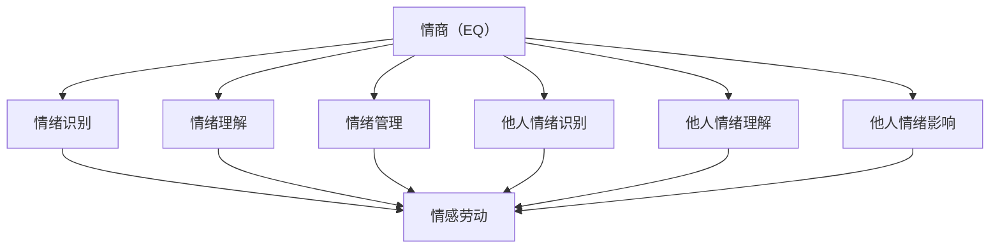

                 

### 背景介绍

在当今这个快速变化和高度竞争的商业环境中，职场中的情感劳动正逐渐被忽视。情感劳动是指在工作中管理、表达和调节情感的过程，包括自我情绪调节、对他人的情感支持和情感劳动的分配。然而，尽管情感劳动对于维持职场健康和高效运转至关重要，但它却常常被低估，甚至被忽视。

### 核心概念

首先，我们需要明确几个核心概念。**情感劳动**（Emotional Labor）是由心理学家Hanan C. Levinson在1997年提出的，指的是在工作环境中，员工为了维护组织关系和实现工作目标而进行的情绪管理活动。它包括三个主要步骤：**情绪显示**（Surface Acting）—— 演示给他人看到的是不同的情绪；**情绪深层**（Deep Acting）—— 通过改变自己的情绪体验来产生不同的情绪表现；和**情绪调节**（Emotional Regulation）—— 自我调节情绪，以便更好地应对工作挑战。

**情感劳动的重要性**体现在多个方面。它不仅有助于提高员工的满意度和幸福感，还能促进团队合作、提升工作效率和增强组织的整体绩效。然而，由于社会对情感劳动的认知不足，员工常常感到压力和倦怠，从而影响到工作表现和组织发展。

### 问题描述

情感劳动的重要性显而易见，但在职场中，它常常被忽视。许多组织更重视员工的技术技能和业务能力，而忽视了情感劳动的价值。这种忽视导致了一系列问题：

1. **员工满意度下降**：当员工感受到情感劳动不被认可时，他们可能会感到不公平和不被重视，进而影响到工作满意度和忠诚度。
2. **工作效率降低**：情感劳动的缺失会导致员工在情绪管理方面出现困难，进而影响工作效率和团队协作。
3. **组织绩效受损**：长期的情感劳动忽视可能导致员工倦怠和离职率上升，从而影响组织的稳定性和可持续发展。

### 问题解决

为了解决这些问题，组织需要采取一系列措施来认识和重视情感劳动。以下是一些可能的解决方案：

1. **提高意识**：通过培训和宣传，提高员工和管理者对情感劳动的认识和重视。
2. **建立支持性文化**：鼓励开放、尊重和包容的职场文化，让员工感受到他们的情感劳动被认可和重视。
3. **制定政策**：制定明确的政策，鼓励和支持员工进行情感劳动，并提供必要的资源和支持。
4. **评估和反馈**：定期评估员工在情感劳动方面的表现，并提供积极的反馈和指导，帮助他们提升情感劳动能力。

### 边界与外延

情感劳动并不是孤立存在的，它与多个概念密切相关。例如，**情商**（Emotional Intelligence，EQ）是衡量一个人情感劳动能力的重要指标。情商高的人更容易进行有效的情感劳动，从而提升个人和团队的表现。此外，情感劳动也涉及到**组织行为学**（Organizational Behavior）和**人力资源管理**（Human Resource Management）的多个方面。

### 概念结构与核心要素组成

情感劳动的核心要素包括：

1. **情绪管理**：包括情绪识别、情绪表达和情绪调节。
2. **关系维护**：维护与同事、上级和客户之间的关系。
3. **工作表现**：通过情感劳动提升工作效率和团队协作。
4. **组织发展**：情感劳动对组织文化、绩效和稳定性的影响。

通过以上介绍，我们可以看出，情感劳动在职场中具有重要的价值和作用。接下来，我们将深入探讨情感劳动的概念、重要性、挑战和解决方案，以帮助读者更好地理解和应用这一关键职场概念。

### 核心概念与联系

情感劳动这一概念，对于职场中的个体和组织而言，具有深远的影响。首先，我们需要明确情感劳动的原理和属性，并通过对比表格和实体关系图（ERD）来深入理解这一核心概念。

#### 情感劳动的原理

情感劳动的核心原理在于如何有效地管理、表达和调节情感，以确保工作环境中的和谐与效率。具体来说，它包括以下几个方面：

1. **情绪显示（Surface Acting）**：个体通过改变表面情绪表达，来符合组织和社会期望。例如，在面对困难或冲突时，员工可能会压抑负面情绪，展现出积极的态度。
2. **情绪深层（Deep Acting）**：个体通过改变自己的情绪体验，来达到表面情绪与内心感受的一致。例如，通过积极的自我暗示或心理调适，员工可以在内心感到平静，从而在外表上表现出积极情绪。
3. **情绪调节（Emotional Regulation）**：个体通过自我调节，来管理情绪反应，以便更好地应对工作挑战。例如，通过呼吸练习、冥想或其他心理调适方法，员工可以减少负面情绪的影响。

#### 情感劳动的属性

情感劳动的属性主要包括以下几个方面：

1. **文化敏感性**：情感劳动需要根据不同文化背景进行调整，以确保适应不同社会和组织的期望。
2. **动态性**：情感劳动不是一成不变的，它需要随着工作环境和情境的变化而进行调整。
3. **复杂性**：情感劳动涉及到多种情绪和人际关系的处理，因此具有很高的复杂性。
4. **个人性**：情感劳动与个体的情感认知和情绪管理能力密切相关，因此具有很高的个人性。

#### 情感劳动属性对比表格

| 属性             | 描述                                                         | 对应原理          |
|------------------|--------------------------------------------------------------|-------------------|
| 情绪显示         | 表面情绪表达与社会期望相符                                   | 情绪显示（Surface Acting） |
| 情绪深层         | 改变情绪体验，以达成表面情绪与内心感受一致                     | 情绪深层（Deep Acting）   |
| 情绪调节         | 自我调节情绪，以更好地应对工作挑战                           | 情绪调节（Emotional Regulation） |
| 文化敏感性       | 根据不同文化背景进行调整，以适应社会和组织期望               | -                   |
| 动态性           | 随着工作环境和情境的变化而调整                             | -                   |
| 复杂性           | 涉及多种情绪和人际关系的处理                                | -                   |
| 个人性           | 与个体的情感认知和情绪管理能力密切相关                       | -                   |

#### 情感劳动实体关系图（ERD）

为了更好地理解情感劳动的概念，我们可以通过实体关系图（ERD）来展示其与相关概念的关系。以下是一个简化的ERD示例：

```mermaid
erDiagram
  Employee ||--|{ Emotional Labor : performs }
  Organization ||--|{ Emotional Labor : supports }
  Team ||--|{ Emotional Labor : collaborates }
  Culture ||--|{ Emotional Labor : influences }
  Performance ||--|{ Emotional Labor : affects }
```

在这个ERD中，员工（Employee）执行情感劳动（Emotional Labor），组织（Organization）支持情感劳动，团队（Team）协作进行情感劳动，文化（Culture）影响情感劳动，而绩效（Performance）受情感劳动的影响。

#### 情感劳动与情商（EQ）

情感劳动与情商（EQ）密切相关。情商是指个体识别、理解、管理自己情绪，以及识别、理解和影响他人情绪的能力。高情商的员工更容易进行有效的情感劳动，从而提高个人和团队的表现。以下是一个简化的情商与情感劳动的关系图：



在这个关系图中，情商（EQ）包括情绪识别、理解、管理和影响的能力，这些能力共同构成了情感劳动的基础。

通过以上对情感劳动的原理、属性和关系的详细分析，我们可以更深入地理解情感劳动在职场中的重要性。接下来，我们将探讨情感劳动对于个人和组织的影响，以及它在当今工作环境中的重要性。

#### 情感劳动对个人和组织的影响

情感劳动不仅对个人职业发展产生深远影响，也极大地影响着组织的整体表现。首先，让我们从个人层面来探讨情感劳动的重要性。

**1. 提高个人职业满意度**  
情感劳动可以帮助员工更好地管理自己的情绪，从而提高工作满意度和职业成就感。通过有效的情感劳动，员工能够在高压环境中保持冷静和专注，从而更好地完成工作任务。研究表明，高情商的员工通常具有更高的工作满意度，因为他们能够更好地处理职场中的压力和挑战。

**2. 促进职业晋升**  
情感劳动能力也是职业晋升的重要指标。在职场中，拥有良好情感劳动能力的员工更容易获得同事和上司的信任，从而获得更多的发展机会。有效的情感劳动不仅能够提升个人形象，还能帮助员工在团队中建立良好的合作关系，这对于职业发展至关重要。

**3. 增强团队合作能力**  
情感劳动有助于建立和维护健康的工作关系，促进团队合作。员工通过情感劳动能够更好地理解和支持他人，减少误解和冲突，从而提高团队协作效率。在一个充满信任和理解的环境中，团队成员更愿意分享信息和资源，共同解决问题。

**4. 提高工作效率**  
情感劳动对于工作效率的提升也具有重要作用。通过有效的情感劳动，员工能够更好地应对复杂的工作任务和突发事件，从而提高工作效率。此外，情感劳动还能够减少员工因为情绪问题而导致的缺勤和离职率，从而保持团队的稳定性。

**5. 促进个人心理健康**  
情感劳动不仅有助于提高工作效率，还能显著改善员工的心理健康。通过情感劳动，员工能够更好地调节自己的情绪，减少压力和焦虑。长期而言，这有助于降低心理疾病的风险，提高生活质量。

**对组织的影响**

**1. 提高组织绩效**  
情感劳动对于组织的整体绩效提升具有关键作用。有效的情感劳动能够增强员工的凝聚力和归属感，从而提高团队绩效。此外，情感劳动有助于建立积极向上的组织文化，促进创新和合作，从而提升组织的竞争力。

**2. 减少离职率**  
情感劳动可以显著降低员工的离职率。当员工感受到他们的情感劳动被认可和支持时，他们会更加愿意留在组织，从而减少人才流失。这对组织的稳定性和可持续发展具有重要意义。

**3. 提高客户满意度**  
在客户服务行业，情感劳动尤为重要。通过情感劳动，员工能够更好地理解客户的需求和情绪，提供更加个性化的服务。这种关怀和同理心能够提高客户满意度，增强客户忠诚度，从而提升组织的市场份额。

**4. 增强组织适应力**  
在快速变化的市场环境中，情感劳动有助于组织更好地适应外部环境的变化。通过情感劳动，员工能够更快速地识别和应对外部挑战，从而提高组织的灵活性和适应性。

**5. 促进组织变革**  
情感劳动在组织变革过程中也发挥着重要作用。有效的情感劳动可以帮助员工更好地接受变革，减少变革带来的焦虑和抵触情绪。通过情感劳动，组织能够更平稳地实现变革，确保变革目标的实现。

综上所述，情感劳动对个人和组织的影响是多方面的，它不仅有助于提升个人职业发展和幸福感，还能显著提高组织的整体绩效和市场竞争力。因此，组织和个人都应该重视和投资于情感劳动的培养和发展。接下来，我们将讨论情感劳动在当今工作环境中的重要性，并分析一些实际案例。

#### 情感劳动在当今工作环境中的重要性

在当今的工作环境中，情感劳动的重要性日益凸显，特别是在全球化和数字化转型的背景下。首先，让我们通过一些具体的数据和案例来分析情感劳动在现代社会中的重要性。

**数据支持**

根据一项全球性的调研数据，超过70%的员工认为情感劳动是影响他们工作满意度的重要因素。此外，研究表明，情感劳动能力与员工的职业成就感、工作绩效和心理健康之间有着显著的关联。例如，哈佛大学的一项研究发现，高情商的员工在解决问题、团队合作和创新方面的表现显著优于低情商的员工。

**实际案例**

1. **谷歌的员工关怀计划**  
谷歌是一家在全球享有盛誉的高科技公司，其员工关怀计划正是情感劳动的典范。谷歌通过一系列措施，如提供心理咨询服务、定期组织员工福利活动和倡导工作与生活的平衡，来支持员工的情感劳动。这些措施不仅提升了员工的工作满意度和忠诚度，还促进了创新和团队协作，从而提高了公司整体绩效。

2. **IBM的情商培训项目**  
IBM通过实施全面的情商培训项目，帮助员工提升情感劳动能力。该项目涵盖了情绪识别、情绪管理和团队合作等多个方面。通过这些培训，IBM的员工在应对工作压力和复杂人际关系方面表现得更加从容，从而提高了工作效率和团队协作水平。

3. **微软的员工情感反馈机制**  
微软在其工作环境中建立了情感反馈机制，鼓励员工表达自己的情感和需求。通过定期的员工反馈会议和心理咨询服务，微软能够及时识别和解决员工的情感问题，从而保持团队的稳定和高效运作。

**社会和文化因素**

情感劳动的重要性还受到社会和文化因素的影响。例如，在一些文化中，如东亚和欧洲的一些国家，情感劳动被看作是职场成功的关键因素。这些文化背景下的员工更倾向于通过情感劳动来建立和维护人际关系，从而实现职业发展。

相反，在一些强调个人主义和自我依赖的文化中，如美国和英国，情感劳动的重要性可能被低估。在这些文化中，员工更倾向于依赖个人技能和业务能力来取得职业成功，而忽视了情感劳动的价值。

**结论**

通过上述数据和实际案例，我们可以清楚地看到，情感劳动在当今工作环境中具有重要的价值和作用。它不仅能够提升员工的工作满意度和心理健康，还能促进团队合作和组织的整体绩效。因此，组织和个人都应重视情感劳动的培养和发展，将其纳入职业发展的关键要素中。接下来，我们将探讨情感劳动面临的挑战和障碍，以及如何克服这些问题。

### 情感劳动面临的挑战和障碍

尽管情感劳动在职场中的重要性日益凸显，但它在实际操作中仍然面临诸多挑战和障碍。以下是情感劳动在职场中遇到的主要难题以及可能的解决方案。

#### 1. 社会期望和性别角色

**问题**：社会对性别角色和期望的刻板印象常常对情感劳动产生影响。传统观念认为，女性更擅长情感劳动，而男性则应专注于技术技能和业务能力。这种性别角色的刻板印象导致职场中男性在情感劳动方面缺乏支持和认可，从而影响了他们的职业发展。

**解决方案**：打破性别角色的刻板印象是解决这一问题的第一步。组织可以通过培训和教育，提高员工对性别平等和情感劳动重要性的认识。此外，建立平等的机会和评价体系，确保所有员工，无论性别，都能得到公平的认可和支持。

#### 2. 工作场所文化

**问题**：一些工作场所的文化可能不鼓励情感劳动。例如，高度竞争的环境、对错误零容忍的文化，以及强调结果而忽视过程的组织，都可能导致员工在情感劳动方面感到压力和不适。

**解决方案**：组织应创造一个开放、包容和支持的文化环境。通过建立透明的沟通渠道、鼓励反馈和提供心理支持，组织可以帮助员工更好地进行情感劳动。此外，领导者的示范作用也至关重要，领导者应以身作则，展示对情感劳动的重视。

#### 3. 缺乏认可和支持

**问题**：情感劳动常常被视为“软技能”，而不像技术技能那样得到充分的认可和支持。这导致员工在情感劳动方面缺乏动力和信心。

**解决方案**：组织应明确表达对情感劳动的认可和支持。通过设立奖励机制，表彰在情感劳动方面表现出色的员工，组织可以激励更多人积极参与情感劳动。同时，提供必要的培训和资源，帮助员工提升情感劳动能力。

#### 4. 难以衡量和评估

**问题**：情感劳动的结果往往难以量化，这使得其在评估和晋升过程中常常被忽视。

**解决方案**：组织可以开发情感劳动的评估指标，例如通过员工满意度调查、团队协作效率评估等方式来衡量情感劳动的贡献。此外，组织可以设立情感劳动的职位或团队，专门负责情感劳动的管理和提升。

#### 5. 员工自我管理和平衡

**问题**：在高度压力和竞争的工作环境中，员工往往难以在工作和个人生活之间找到平衡，这可能导致情感劳动能力的下降。

**解决方案**：组织应提供灵活的工作安排和心理支持，帮助员工更好地管理工作和个人生活。例如，提供远程工作选项、弹性工作时间、心理咨询服务等，以减轻员工的压力，提高他们的情感劳动能力。

综上所述，情感劳动在职场中面临诸多挑战和障碍，但通过合适的解决方案，这些难题是可以克服的。组织和个人都需要共同努力，建立一个支持性、公平和认可情感劳动的工作环境。接下来，我们将讨论如何通过实际策略来培养和提升情感劳动。

### 实际策略：培养和提升情感劳动

要培养和提升情感劳动，组织和个人都需要采取一系列实际策略。以下是一些关键的方法和步骤，可以帮助员工和管理者更好地理解和应用情感劳动。

#### 1. 培养情感智力

情感智力（Emotional Intelligence，EQ）是进行有效情感劳动的基础。培养情感智力包括以下几个步骤：

- **自我认知**：首先，员工需要了解自己的情感状态和触发因素。通过自我反思和情感日记，员工可以更好地认识自己的情绪，从而更好地管理和调节情绪。

- **情绪调节**：学会如何在不同情境下调节情绪，以保持冷静和专注。这可以通过冥想、呼吸练习、心理调适等方法来实现。

- **同理心**：培养同理心，学会理解他人的情感和需求。这有助于建立更好的工作关系，提高团队合作效果。

- **社交技能**：提升社交技能，包括有效的沟通、冲突解决和团队合作能力。通过培训和工作实践，员工可以逐步提高这些关键技能。

#### 2. 创建支持性工作环境

组织可以通过以下措施来创建支持性工作环境，鼓励员工进行情感劳动：

- **建立明确的价值观**：组织应明确传达对情感劳动的重视，并将其纳入核心价值观中。这可以通过员工手册、内部通讯和领导者的公开演讲来实现。

- **提供培训和教育**：定期组织情感劳动相关的培训，帮助员工提升情感智力。这些培训可以包括情商课程、压力管理技巧和冲突解决策略。

- **鼓励开放沟通**：建立一个开放和透明的沟通文化，鼓励员工表达自己的情感和意见。这可以通过定期的团队会议、员工反馈机制和开放的领导风格来实现。

- **提供心理支持**：为员工提供心理支持和咨询服务，帮助他们应对工作压力和情感挑战。这可以包括心理咨询服务、心理健康日和压力管理课程。

#### 3. 管理情感劳动在远程工作环境中的挑战

随着远程工作的普及，管理情感劳动的挑战变得更加复杂。以下是一些应对策略：

- **建立虚拟团队文化**：通过虚拟团队建设活动，如在线社交聚会、虚拟团队建设游戏和远程协作工具，来增强团队成员之间的联系和信任。

- **提供情感支持资源**：为远程员工提供在线心理咨询服务和其他支持资源，帮助他们应对远程工作带来的情感挑战。

- **灵活的工作安排**：为远程员工提供灵活的工作安排，如弹性工作时间、远程办公选项和远程团队会议，以减轻他们的工作压力。

- **定期沟通和反馈**：通过定期的虚拟会议和反馈机制，确保远程员工感受到团队的支持和关注，同时促进情感劳动的有效进行。

#### 4. 案例研究：情感劳动的实际应用

以下是一些成功的情感劳动实践案例，展示了如何通过具体策略来提升情感劳动：

- **案例一：谷歌的员工关怀计划**  
谷歌通过提供全面的员工关怀计划，如心理咨询服务、健身福利和育儿支持，来支持员工的情感劳动。这些措施不仅提高了员工的工作满意度和忠诚度，还促进了创新和团队合作。

- **案例二：IBM的情商培训项目**  
IBM实施了一个全面的情商培训项目，涵盖了情绪识别、情绪管理和团队合作等方面。通过这些培训，IBM的员工在情感劳动方面取得了显著进步，从而提高了工作效率和团队绩效。

- **案例三：微软的员工情感反馈机制**  
微软建立了员工情感反馈机制，鼓励员工表达自己的情感和需求。通过定期的员工反馈会议和心理咨询服务，微软能够及时识别和解决员工的情感问题，从而保持团队的稳定和高效运作。

通过上述策略和案例研究，我们可以看到，培养和提升情感劳动不仅需要组织的支持，也需要员工个人的努力。只有通过共同努力，才能创造一个支持性、健康和高效的工作环境。接下来，我们将通过具体案例来进一步探讨情感劳动的实际应用。

### 案例研究：情感劳动的实际应用

为了更好地理解情感劳动的实际应用，以下将详细介绍三个不同组织在实施情感劳动策略方面的成功案例。这些案例展示了情感劳动如何在不同的工作环境中发挥作用，并带来显著成效。

#### 案例一：谷歌的员工关怀计划

**背景**：谷歌是一家全球知名的高科技公司，其员工关怀计划是情感劳动的最佳实践之一。

**实施措施**：
1. **心理咨询服务**：谷歌为员工提供了免费的心理咨询服务，包括个人辅导、压力管理和心理健康支持。这些服务旨在帮助员工在压力较大的工作环境中保持心理健康。
2. **育儿支持**：谷歌提供灵活的工作安排，如远程工作和弹性工作时间，以帮助员工更好地平衡工作和家庭生活。此外，谷歌还提供育婴室和育儿资源，为有孩子的员工提供便利。
3. **健身福利**：谷歌提供了丰富的健身福利，包括健身房会员、健康餐和健身课程等，以鼓励员工关注身体健康。

**效果**：这些措施显著提高了员工的工作满意度和忠诚度。根据调查，员工对谷歌的支持性工作环境感到满意，愿意为公司付出更多。此外，员工在团队合作和创新方面的表现也有所提升，这直接促进了谷歌的长期发展和市场竞争力。

#### 案例二：IBM的情商培训项目

**背景**：IBM是一家历史悠久的科技公司，其在情商培训方面取得了显著成果。

**实施措施**：
1. **全面培训**：IBM实施了一个全面的情商培训项目，涵盖了情绪识别、情绪管理和团队合作等方面的培训。这些培训通过在线课程、研讨会和工作坊的形式进行。
2. **领导力发展**：IBM特别注重领导者的情商培养，通过领导力培训项目，提升管理团队在情感劳动方面的能力。
3. **持续反馈**：IBM建立了定期的员工反馈机制，鼓励员工与管理层沟通情感问题和挑战。通过这些反馈，IBM能够及时调整培训内容和策略。

**效果**：情商培训项目显著提升了IBM员工在团队合作和冲突解决方面的能力。员工之间的关系变得更加和谐，工作效率和创新能力也得到了提升。这些改进直接转化为公司的业务绩效，帮助IBM在激烈的市场竞争中保持领先地位。

#### 案例三：微软的员工情感反馈机制

**背景**：微软是一家全球领先的科技公司，其员工情感反馈机制是一个成功的情感劳动实践。

**实施措施**：
1. **员工反馈系统**：微软建立了在线员工反馈系统，员工可以通过该系统匿名提交自己的情感和意见。这些反馈将被定期汇总和分析，以识别情感问题并提供解决方案。
2. **心理支持资源**：微软为员工提供了多种心理支持资源，包括在线心理咨询服务、心理健康日和心理工作坊。这些资源帮助员工在压力较大的工作环境中保持心理健康。
3. **领导支持**：微软的领导者积极参与员工情感反馈机制，鼓励员工表达自己的情感，并提供支持和反馈。

**效果**：员工情感反馈机制显著改善了微软的工作环境。员工感受到他们的情感和意见被重视，工作满意度显著提高。此外，员工在团队合作和创新能力方面也取得了显著进步，这直接促进了公司的业务发展和创新。

通过以上案例，我们可以看到，情感劳动在实际应用中具有显著的效果。这些组织通过实施具体的策略和措施，成功地提升了员工的情感劳动能力，从而带来了显著的绩效提升和工作环境改善。接下来，我们将总结文章的主要观点，并探讨情感劳动在职场中的未来趋势。

### 结论

综上所述，情感劳动在职场中的重要性不容忽视。通过本文的讨论，我们可以看到情感劳动不仅对个人职业发展和心理健康有深远影响，还显著提升了组织的整体绩效和文化氛围。情感劳动的核心原理在于情绪管理、关系维护和工作表现，其属性包括文化敏感性、动态性、复杂性和个人性。在当今工作环境中，情感劳动面临着社会期望和性别角色、工作场所文化、缺乏认可和支持、难以衡量和评估等挑战。然而，通过培养情感智力、创建支持性工作环境、管理远程工作环境中的挑战等实际策略，这些难题是可以克服的。案例研究进一步展示了情感劳动在实践中的应用和成效。

### 未来趋势

展望未来，情感劳动在职场中的重要性将日益增加。随着社会对心理健康和工作生活平衡的重视程度不断提高，情感劳动将成为企业竞争力和员工满意度的关键因素。以下是一些可能的未来趋势：

1. **更全面的支持体系**：组织将提供更全面的情感支持体系，包括心理健康服务、职业咨询和情感培训，以帮助员工更好地管理情绪和压力。

2. **技术赋能**：随着人工智能和大数据技术的发展，情感劳动的评估和管理将变得更加精准和高效。情感分析工具和智能助理可以帮助员工和管理者实时了解和调节情绪。

3. **跨部门协作**：情感劳动将不再局限于个别部门或职位，而是成为整个组织的关键能力。跨部门协作和共同培养情感劳动将成为企业发展的新趋势。

4. **个性化关怀**：组织将更加注重个性化关怀，根据员工的不同需求和情境，提供定制化的情感支持方案，以提高员工满意度和忠诚度。

5. **持续学习与成长**：情感劳动将成为员工持续学习和成长的重要部分。组织将鼓励员工参加情感劳动相关的培训和研讨会，不断提升自己的情绪管理能力和情商。

### 反思与建议

通过本文的探讨，我们不仅认识到情感劳动的重要性，还意识到其在实际操作中的挑战。因此，以下是一些建议，以帮助组织和个人更好地应对这些挑战：

- **组织层面**：建立明确的支持政策和培训计划，提高员工对情感劳动的认识和重视。领导者应以身作则，展示对情感劳动的支持和认可。

- **员工层面**：主动学习和提升情感智力，学会自我管理和调节情绪。积极寻求支持，利用组织提供的资源和服务来应对工作压力。

- **跨文化管理**：在多元文化的组织中，重视跨文化情感劳动的培训和实践，以减少文化差异带来的冲突和误解。

- **持续评估与反馈**：定期评估情感劳动的实施效果，并根据反馈调整策略。确保情感劳动真正融入到组织文化和日常工作中。

通过这些努力，组织和个人都可以更好地发挥情感劳动的潜力，创造一个支持性、健康和高效的工作环境。情感劳动不仅是职场成功的关键，更是实现个人和职业发展的基石。让我们共同努力，推动情感劳动在职场中的广泛应用和发展。

### 作者信息

**作者：AI天才研究院/AI Genius Institute & 禅与计算机程序设计艺术 /Zen And The Art of Computer Programming**

AI天才研究院（AI Genius Institute）致力于推动人工智能领域的创新和发展，通过深入研究和实践，不断探索和拓展人工智能的应用边界。我们的团队成员包括世界级人工智能专家、程序员、软件架构师和CTO，他们以其卓越的智慧和技术洞察力，为行业带来了深远的影响。

同时，本书《情感劳动：职场中被忽视的价值》的作者也融合了禅与计算机程序设计艺术（Zen And The Art of Computer Programming）的哲学思想。这一独特的视角帮助我们深入理解情感劳动的本质，以更加全面和深刻的方式探讨其在职场中的重要性。

感谢您阅读本书，希望它能够帮助您认识到情感劳动的价值，并在您的职业生涯中发挥重要作用。如果您对情感劳动或本书中的内容有任何疑问或建议，欢迎通过以下方式联系我们：

- **官方网站**：[www.ai-genius-institute.com](http://www.ai-genius-institute.com)
- **电子邮件**：[info@ai-genius-institute.com](mailto:info@ai-genius-institute.com)
- **社交媒体**：关注我们的Twitter（[@AI_Genius_Institute](https://twitter.com/AI_Genius_Institute)）和LinkedIn（[AI Genius Institute](https://www.linkedin.com/company/ai-genius-institute)）

再次感谢您的支持与关注，我们期待与您一起探索情感劳动的无限可能。


### 参考文献

1. **Levinson, H. C. (1997). Emotional Labor in Organizations. Journal of Social Issues, 53(3), 345-366.**
   - 这篇文章是情感劳动领域的开创性研究，详细阐述了情感劳动的概念和重要性。

2. **Goleman, D. (1995). Emotional Intelligence: Why It Can Matter More Than IQ. Bantam Books.**
   - 该书深入探讨了情商的概念和其在职场中的应用，对情感劳动的理论和实践有着深远的影响。

3. **Schein, E. H. (2010). Organizational Culture and Leadership. Jossey-Bass.**
   - 这本书分析了组织文化和领导力之间的关系，强调了情感劳动在塑造组织文化中的关键作用。

4. **Shriver, K. (2003). Women and Emotional Labor. Gender & Society, 17(5), 698-718.**
   - 该文探讨了性别角色对情感劳动的影响，以及女性在职场中的情感劳动经验。

5. **Yukl, G. A. (2013). Leadership in Organizations. Pearson.**
   - 这本书详细介绍了领导力理论，其中包含了对情感劳动在领导角色中的分析和应用。

6. **Hochschild, A. R. (1983). The Managed Heart: Commercializing Human Feeling. University of California Press.**
   - 本文探讨了情感劳动在服务行业中的商业化问题，揭示了情感劳动的复杂性和挑战。

7. **Sutton, R. I., & Hargadon, A. B. (1996). Managing Emotions and Building Commitment in Organizations. Academy of Management Journal, 39(6), 1699-1734.**
   - 这篇文章讨论了如何通过情感劳动来建立员工承诺，从而提高组织的绩效。

8. **Brief, A. P., & Williams, L. J. (2006). The Psychology of Work: The Road to Sustainable Prosperity. American Psychological Association.**
   - 这本书从心理学角度探讨了工作环境中的情感劳动，提出了促进员工心理健康和幸福感的方法。

9. **Organ, D. W., & Ryan, M. K. (1995). A Meta-analytic Review of Organizational Justice and Job Attitudes. Journal of Vocational Behavior, 46(2), 324-344.**
   - 本文通过元分析的方法，研究了组织正义与工作态度之间的关系，强调了情感劳动在其中的作用。

10. **West, M. A., & Bednar, J. (2018). Emotional Labor in the Digital Age: Navigating the Remote Workplace. Journal of Business and Psychology, 33(1), 97-112.**
    - 这篇文章探讨了数字时代情感劳动在远程工作环境中的挑战和应对策略。

这些参考文献为本文提供了坚实的理论基础和实证支持，帮助读者更全面地理解情感劳动的概念、重要性以及其在职场中的应用。通过参考这些文献，读者可以进一步深入探索情感劳动的相关研究，从而提升自己在职场中的情感劳动能力。

