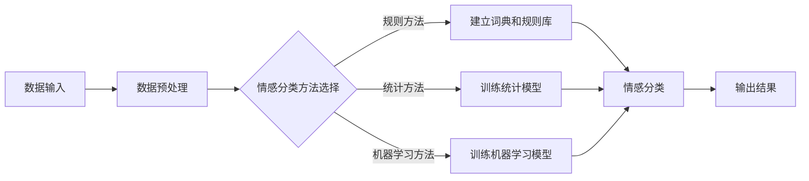

                 

### 《情感地理信息系统：城市规划的人文视角》

关键词：情感地理信息系统、城市规划、人文视角、算法原理、系统架构、项目实战

摘要：随着城市化的迅速发展，城市规划逐渐从以功能为主转向以人为本。情感地理信息系统（Sentimental Geographic Information System，SGIS）作为一种新兴的技术，旨在结合人文视角，为城市规划提供更全面的数据支持和决策依据。本文将详细介绍情感地理信息系统的概念、算法原理、系统架构及实际应用，探讨其在城市规划中的重要性和应用前景。

### 目录大纲设计

1. **背景介绍**
2. **核心概念与联系**
3. **算法原理讲解**
4. **系统分析与架构设计方案**
5. **项目实战**
6. **最佳实践 tips、小结、注意事项、拓展阅读**

#### 第一部分：背景介绍

**1.1 情感地理信息系统的发展背景**

情感地理信息系统（Sentimental Geographic Information System，SGIS）是近年来在地理信息系统（Geographic Information System，GIS）基础上发展起来的一种新型信息系统。随着大数据、云计算、人工智能等技术的飞速发展，GIS的应用领域不断扩展，从传统的空间数据分析延伸到情感分析、社交网络分析等多个领域。

**1.2 人文视角在城市规划中的重要性**

城市是人类文明的重要载体，城市规划的核心目标是创造一个宜居、可持续发展的城市环境。传统城市规划方法主要侧重于功能性和效率性，但往往忽略了城市居民的情感需求。人文视角强调以人为本，关注居民的情感体验和幸福感，这为城市规划提供了新的思路和方法。

**1.3 研究意义与目标**

本文旨在探讨情感地理信息系统在城市规划中的应用，通过结合人文视角，为城市规划提供更全面、更贴近居民需求的数据支持和决策依据。研究目标包括：1）梳理情感地理信息系统的核心概念和技术；2）分析情感地理信息系统在城市规划中的应用场景；3）设计并实现一个简单的情感地理信息系统原型。

#### 第二部分：核心概念与联系

**2.1 情感地理信息系统的核心概念**

情感地理信息系统主要包括以下几个核心概念：

- **情感数据**：指与居民情感相关的数据，包括文本、图片、音频等多种形式。
- **情感分析**：利用自然语言处理、机器学习等技术，对情感数据进行分析和归类，提取情感特征。
- **地理数据**：包括空间位置、地形地貌、交通网络等地理信息。
- **知识图谱**：用于表示情感与地理数据之间的复杂关系。

**2.2 人文视角的定义与特征**

人文视角强调从人类情感、文化、价值观等角度出发，关注城市居民的情感体验和幸福感。其主要特征包括：

- **人文关怀**：以人为本，关注居民的需求和情感。
- **文化多样性**：尊重和保护城市的文化多样性。
- **可持续发展**：注重城市环境的可持续发展和生态保护。

**2.3 概念属性特征对比表格**

| 概念         | 情感数据 | 情感分析 | 地理数据 | 知识图谱 |
| ------------ | -------- | -------- | -------- | -------- |
| 定义         | 与情感相关的数据 | 情感数据分析技术 | 空间位置、地形地貌等地理信息 | 用于表示情感与地理数据关系的复杂结构 |
| 属性特征     | 多样性、主观性 | 准确性、实时性 | 精确性、时效性 | 可扩展性、灵活性 |
| 关联关系     | 情感数据 → 情感分析 → 知识图谱 | 情感分析 → 地理数据 | 地理数据 → 知识图谱 | 知识图谱 → 情感分析、地理数据 |

**2.4 ER实体关系图架构**

```mermaid
erDiagram
    实体1||--o{实体2}|
    实体1||--o{实体3}|
    实体2||--o{实体4}|
    实体3||--o{实体5}|
```

#### 第三部分：算法原理讲解

**3.1 情感分析算法原理**

情感分析是情感地理信息系统的核心组成部分，其目的是从文本、图片、音频等数据中提取情感特征。常见的情感分析算法包括：

- **基于规则的方法**：通过建立情感词典和规则库，对文本进行分词和情感分类。
- **基于统计的方法**：利用统计模型（如朴素贝叶斯、最大熵模型等）对文本进行情感分类。
- **基于机器学习的方法**：利用监督学习或无监督学习算法（如支持向量机、神经网络等）对文本进行情感分类。

**3.1.1 算法mermaid流程图**



**3.1.2 Python源代码演示**

```python
# 情感分析Python示例代码
from textblob import TextBlob

# 函数：情感分析
def sentiment_analysis(text):
    analysis = TextBlob(text)
    if analysis.sentiment.polarity > 0:
        return "正面"
    elif analysis.sentiment.polarity == 0:
        return "中性"
    else:
        return "负面"

# 测试文本
text = "我很喜欢这个城市！"
print(sentiment_analysis(text))
```

**3.1.3 数学模型与公式讲解**

情感分析通常涉及以下数学模型和公式：

- **情感极性**：$$polarity = \frac{P_{positive} - P_{negative}}{P_{positive} + P_{negative}}$$
- **文本分类**：$$y = \arg\max_w P(y|w)$$，其中$w$为文本特征向量。

**3.1.4 举例说明**

假设我们有一段文本：“我非常讨厌这个城市的交通拥堵。”使用Python代码进行情感分析，输出结果为“负面”。

#### 第四部分：系统分析与架构设计方案

**4.1 情感地理信息系统应用场景**

情感地理信息系统可以应用于多个场景，如城市交通规划、城市景观设计、公共设施布局等。以下是一个应用场景：

**场景**：分析城市居民对某一区域的满意度，为政府提供城市交通规划决策支持。

**4.2 系统功能设计（领域模型mermaid类图）**

```mermaid
classDiagram
    class 数据源
    class 数据预处理模块
    class 情感分析模块
    class 空间分析模块
    class 结果可视化模块
    数据源|--|> 数据预处理模块
    数据预处理模块|--|> 情感分析模块
    数据预处理模块|--|> 空间分析模块
    情感分析模块|--|> 结果可视化模块
    空间分析模块|--|> 结果可视化模块
```

**4.3 系统架构设计（mermaid架构图）**

```mermaid
sequenceDiagram
    participant 用户 as 用户
    participant 系统A as 系统A
    participant 系统B as 系统B
    participant 系统C as 系统C
    participant 系统D as 系统D

    用户->>系统A: 提交数据
    系统

