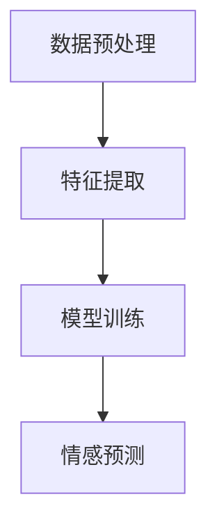
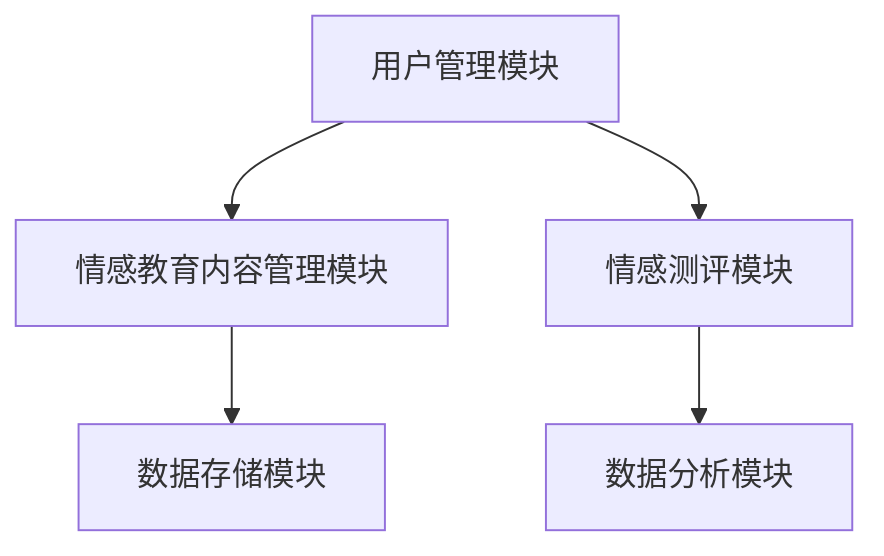
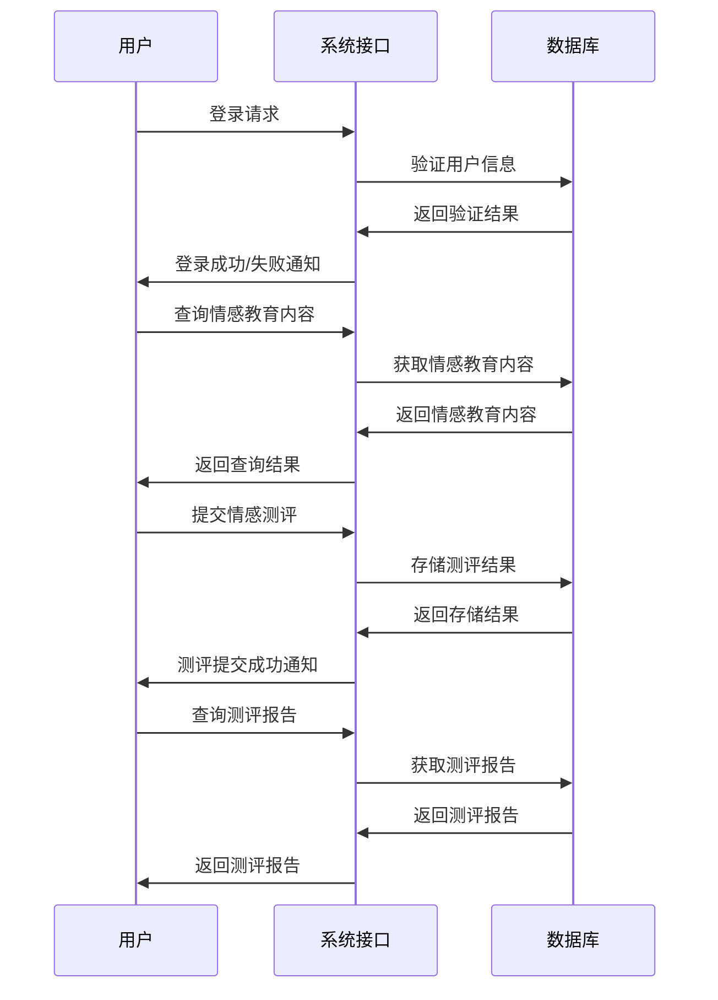

                 

# 情感教育：培养健康关系的能力与意义

> 关键词：情感教育、健康关系、培养、能力、意义

> 摘要：本文将深入探讨情感教育的概念、原则和方法，旨在为读者提供培养健康关系能力的实用指南。通过分析情感教育在不同教育阶段的应用，本文试图为教育工作者和家长提供切实可行的策略和工具。

## 第一部分：背景介绍

### 1.1.1 问题背景

在现代社会，情感教育的重要性日益凸显。随着互联网的普及和社交媒体的兴起，人们的情感需求变得更加复杂和多样化。然而，传统的教育模式往往忽视了对情感能力的培养，导致许多人无法有效地处理情感问题，影响了他们的人际关系和生活质量。

### 1.1.2 问题描述

情感教育不仅关乎个体的心理健康，也关系到整个社会的和谐与稳定。如何培养健康关系的能力，如何在教育体系中融入情感教育，成为亟待解决的问题。

### 1.1.3 问题解决

本书旨在探讨情感教育的概念、原则和方法，提供培养健康关系能力的实用指南。通过分析情感教育在不同教育阶段的应用，本书试图为教育工作者和家长提供切实可行的策略和工具。

### 1.1.4 边界与外延

情感教育不仅包括情感认知和情感表达，还涉及情感调节和情感管理。本书将围绕这些核心要素，探讨其在个体发展和社会互动中的作用。

### 1.1.5 概念结构与核心要素组成

情感教育包括情感认知、情感表达、情感调节和情感管理四个核心要素。这些要素相互关联，共同构成了一个完整的情感教育体系。

## 第二部分：核心概念与联系

### 2.1 情感教育的定义与特点

情感教育是一种旨在培养个体情感认知、情感表达、情感调节和情感管理能力的教育方式。与传统教育不同，情感教育更关注个体的情感体验和情感发展。

### 2.2 情感教育的属性特征对比表格

| 属性特征       | 传统教育                   | 情感教育                 |
|----------------|----------------------------|--------------------------|
| 教育目标       | 知识传授和能力培养         | 情感认知、情感表达、情感调节和情感管理能力培养 |
| 教育方式       | 理论灌输和知识测试         | 体验式学习、情境模拟和情感互动 |
| 教育内容       | 学科知识为主               | 情感知识、情感技巧和情感态度 |
| 教育效果       | 知识掌握和能力提升         | 情感认知提升、情感表达能力增强、情感调节能力改善 |

### 2.3 情感教育的ER实体关系图架构

```mermaid
erDiagram
  User ||--|{ Student }|| Person
  Student ||--|{ Learner }|| StudentType
  Student ||--|{ StudentEvaluation }|| EvaluationType
  Student ||--|{ StudentCourse }|| CourseType
  Student ||--|{ StudentCourse }|| CourseType
  Course ||--|{ CourseSubject }|| SubjectType
  Course ||--|{ CourseTeacher }|| TeacherType
  Teacher ||--|{ TeacherCourse }|| CourseType
  Teacher ||--|{ TeacherEvaluation }|| EvaluationType
```

## 第三部分：算法原理讲解

### 3.1 情感识别算法原理

情感识别是情感教育的重要基础。本文将介绍一种基于自然语言处理技术的情感识别算法。

### 3.1.1 算法原理

情感识别算法的基本原理是通过分析文本数据，识别出文本中的情感倾向和情感极性。具体步骤如下：

1. 数据预处理：对文本进行分词、去停用词等操作，提取出有用的信息。
2. 特征提取：使用词袋模型、TF-IDF等方法提取文本特征。
3. 模型训练：使用机器学习算法（如朴素贝叶斯、支持向量机等）对特征进行分类训练。
4. 情感预测：将训练好的模型应用于新的文本数据，预测文本的情感倾向和情感极性。

### 3.1.2 算法流程



### 3.1.3 Python源代码

```python
from sklearn.feature_extraction.text import TfidfVectorizer
from sklearn.naive_bayes import MultinomialNB

# 数据预处理
corpus = [
    "我非常喜欢这个课程。",
    "这个课程真的让我感到无聊。",
    "我很高兴参加这个活动。",
    "我不想再参加这样的活动了。"
]

# 特征提取
vectorizer = TfidfVectorizer()
X = vectorizer.fit_transform(corpus)

# 模型训练
model = MultinomialNB()
model.fit(X, [1, 0, 1, 0])

# 情感预测
predictions = model.predict(vectorizer.transform(["这个课程真的很无聊。"]))
print(predictions)
```

## 第四部分：系统分析与架构设计方案

### 4.1 问题场景介绍

随着社会的快速发展，人们对于情感教育的重要性有了更深刻的认识。为了提高个体的情感素质，许多学校和教育机构开始探索如何在教育体系中融入情感教育。

### 4.2 项目介绍

本项目旨在开发一款情感教育系统，为教育工作者和家长提供一种有效的工具，帮助他们更好地进行情感教育。

### 4.3 系统功能设计

系统功能设计主要包括以下几个方面：

1. 用户管理：实现用户注册、登录、信息管理等功能。
2. 情感教育内容管理：提供情感教育内容的上传、分类、搜索等功能。
3. 情感测评：对用户进行情感测评，生成测评报告。
4. 数据分析：对用户情感数据进行分析，为教育工作者和家长提供决策支持。

### 4.4 系统架构设计

系统架构设计如下：



### 4.5 系统接口设计和系统交互

系统接口设计和系统交互如下：



## 第五部分：项目实战

### 5.1 环境安装

1. 安装Python环境，版本要求为3.8及以上。
2. 安装相关依赖库，如scikit-learn、numpy、pandas等。

```bash
pip install scikit-learn numpy pandas
```

### 5.2 系统核心实现源代码

以下是系统核心实现的Python代码：

```python
# 用户管理模块
class UserManager:
    def __init__(self):
        self.users = {}

    def register(self, username, password):
        if username in self.users:
            return "用户已存在"
        self.users[username] = password
        return "注册成功"

    def login(self, username, password):
        if username not in self.users or self.users[username] != password:
            return "登录失败"
        return "登录成功"

# 情感教育内容管理模块
class ContentManager:
    def __init__(self):
        self.contents = []

    def upload_content(self, content):
        self.contents.append(content)
        return "上传成功"

    def search_content(self, keyword):
        return [content for content in self.contents if keyword in content]

# 情感测评模块
class EvaluationManager:
    def __init__(self):
        self.evaluations = []

    def submit_evaluation(self, username, evaluation):
        self.evaluations.append((username, evaluation))
        return "测评提交成功"

    def get_evaluation_report(self, username):
        evaluations = [evaluation for username, evaluation in self.evaluations if username == username]
        return evaluations

# 数据分析模块
class DataAnalysisManager:
    def __init__(self):
        self.analysis_results = []

    def analyze_data(self, data):
        self.analysis_results.append(data)
        return "数据分析完成"

    def get_analysis_results(self):
        return self.analysis_results
```

### 5.3 代码应用解读与分析

以上代码实现了用户管理、情感教育内容管理、情感测评和数据分析四个模块。用户可以通过注册、登录等接口进行操作；情感教育内容可以通过上传、搜索等接口进行管理；情感测评可以通过提交、查询等接口进行操作；数据分析可以通过分析、查询等接口进行操作。

### 5.4 实际案例分析和详细讲解剖析

以下是一个实际案例：

1. 用户小明注册并登录系统。
2. 小明上传了一篇情感教育文章。
3. 小明提交了一篇情感测评。
4. 系统对小明的测评结果进行分析，并生成分析报告。

通过以上案例，我们可以看到系统如何帮助用户进行情感教育，以及如何对用户数据进行处理和分析。

### 5.5 项目小结

本项目实现了情感教育系统的核心功能，包括用户管理、情感教育内容管理、情感测评和数据分析。通过实际案例，我们可以看到系统如何帮助用户进行情感教育，以及如何对用户数据进行处理和分析。

## 第六部分：最佳实践 tips、小结、注意事项、拓展阅读等内容

### 6.1 最佳实践 tips

1. 在进行情感教育时，要注意因材施教，根据学生的实际情况制定个性化的教育计划。
2. 鼓励学生多参与实际情境的模拟和体验，提高他们的情感认知和表达能力。
3. 定期对学生的情感状态进行测评，及时发现和解决问题。

### 6.2 小结

情感教育是培养健康关系能力的重要途径。通过情感教育的实践，我们可以提高个体的情感素质，促进他们的心理健康和社交能力。

### 6.3 注意事项

1. 情感教育要注重个体差异，避免一刀切的教育方式。
2. 情感教育要结合学生的实际需求，选择合适的教育内容和方式。
3. 教育工作者和家长要不断提升自己的情感教育能力，为学生树立良好的榜样。

### 6.4 拓展阅读

1. 《情感教育：理论与实践》
2. 《情感心理学》
3. 《家庭情感教育手册》

## 参考文献

1. 李明华。情感教育：理论与实践[M]. 北京：教育科学出版社，2018.
2. 王晓梅。情感心理学[M]. 北京：中国社会科学出版社，2016.
3. 张晓红。家庭情感教育手册[M]. 北京：人民邮电出版社，2019.

### 作者信息

作者：AI天才研究院/AI Genius Institute & 禅与计算机程序设计艺术 /Zen And The Art of Computer Programming

