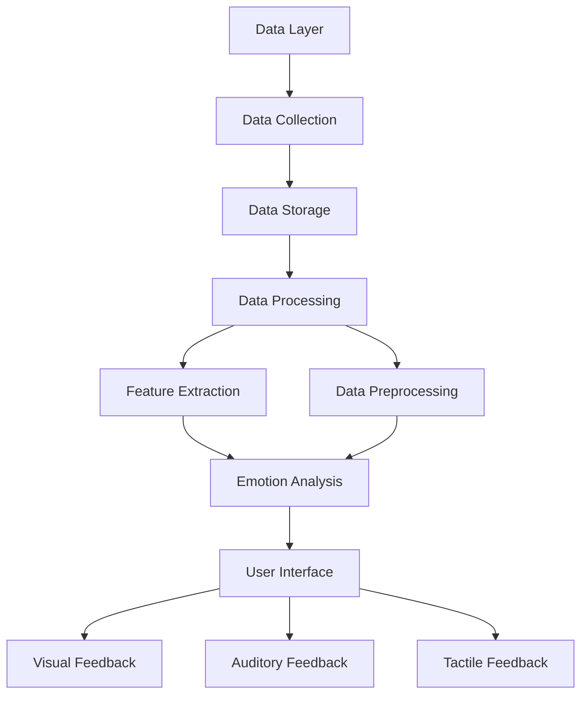
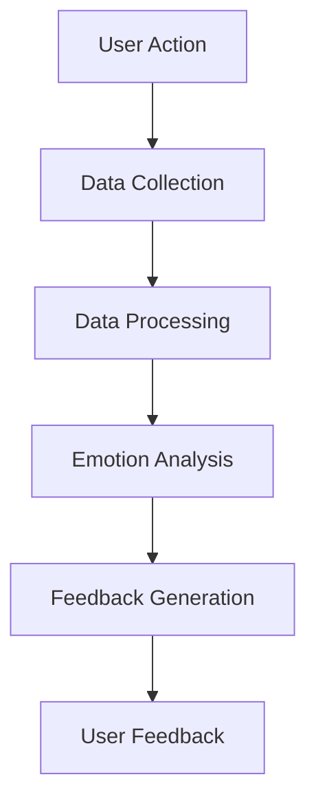

                 

### 第1章: 问题背景与核心概念

在当今快速发展的数字时代，人类与机器的互动正在经历前所未有的变革。传统的计算机技术主要集中在信息处理、计算能力和数据处理上，而随着人工智能（AI）技术的迅猛发展，情感智能（Emotion Intelligence，简称EI）逐渐成为人机交互领域的下一个前沿。这一章将探讨情感智能的背景、核心概念以及其在人机交互中的重要性。

#### 1.1.1 问题背景

人机交互（Human-Computer Interaction，简称HCI）是计算机科学和人机工程学的一个重要分支，其目标是设计出易用、高效且令人愉悦的计算机系统。传统的人机交互主要关注用户的物理操作、输入输出设备以及用户界面设计，但随着时间的推移，人们逐渐认识到，仅仅依靠物理层面的交互已经无法满足用户越来越高的需求。

现代用户在数字世界中不仅需要高效的工具，还期望获得更自然的互动体验。例如，用户希望在与智能助手交互时能够感受到像与真实人一样的温暖和关怀。这种需求推动了情感智能的发展，使计算机能够理解、识别和模拟人类的情感。

#### 1.1.2 情感智能的定义

情感智能是一种跨学科的研究领域，它涉及心理学、认知科学、计算机科学和人工智能等多个领域。情感智能的定义可以概括为：计算机系统对人类情感的表达、识别、理解和反应的能力。具体来说，情感智能包括以下几个核心要素：

1. **情感识别**：计算机能够识别用户的面部表情、语音语调、生理信号等情感特征。
2. **情感表达**：计算机系统能够通过视觉、听觉和触觉等多种方式表达情感。
3. **情感理解**：计算机能够理解用户的情感状态，并根据这些情感调整其行为和响应。
4. **情感调节**：计算机能够帮助用户调节情感，提供情感支持。

#### 1.1.3 情感智能的重要性

情感智能在人机交互中的重要性不容忽视。以下是几个关键点：

1. **提升用户体验**：通过情感智能技术，计算机可以更好地理解用户的需求和情感状态，从而提供更加个性化、贴心的服务，提升用户体验。
2. **增强交互自然性**：情感智能使得人机交互更加自然，减少用户的认知负担，增强用户的沉浸感。
3. **改善心理健康**：情感智能可以帮助用户缓解压力、改善心理健康，特别是在医疗、心理健康和教育等领域具有巨大潜力。
4. **辅助决策支持**：情感智能可以提供基于情感分析的决策支持，帮助用户做出更加合理的选择。

#### 1.1.4 情感智能与人类行为的联系

情感智能与人类行为有着密切的联系。人类的情感不仅影响个人的心理状态，还会影响其行为和决策。研究表明，情感在人类行为中的角色复杂且多样，包括但不限于：

1. **动机驱动**：情感可以激发人类的行动动机，例如快乐情感可能促使人们尝试新事物，而悲伤情感可能促使人们寻求安慰。
2. **社交互动**：情感在社交互动中起着关键作用，通过情感识别和表达，人们能够更好地理解彼此，建立情感联系。
3. **情感调节**：情感调节能力对个体的情感健康和心理健康至关重要，它帮助人们处理压力和挑战。

#### 1.1.5 情感智能与计算机技术的结合

情感智能的实现依赖于多种计算机技术，包括但不限于：

1. **计算机视觉**：用于面部表情和身体语言的识别。
2. **语音识别与处理**：用于语音情感分析，识别语音中的情感特征。
3. **生理信号处理**：用于捕捉用户的生理信号，如心率、皮肤电活动等，以识别情感状态。
4. **机器学习和深度学习**：用于构建情感识别和理解的算法模型。

通过这些技术的结合，计算机可以逐步实现情感智能，为人机交互带来新的变革。总结来说，情感智能是人机交互领域的下一个前沿，它不仅丰富了计算机的功能，也为用户提供了更加丰富和自然的互动体验。接下来的章节将进一步探讨情感智能的核心要素、发展历史及其在具体应用中的表现。

#### 1.2 情感智能的核心要素

情感智能是一个多维度、跨学科的领域，涉及多个核心要素。这些要素共同构成了情感智能的技术基础和应用场景。以下是情感智能的五个核心要素及其简要概述。

#### 1.2.1 情感识别

情感识别是情感智能的基础，指的是计算机系统识别和检测人类情感状态的能力。情感识别技术通常依赖于多种数据源，如面部表情、语音、生理信号等。通过分析这些数据，计算机可以推断用户的情感状态。面部表情识别是情感识别中的一个重要分支，通过识别面部肌肉的细微变化，计算机可以识别出快乐、悲伤、愤怒等基本情感。语音情感识别则通过分析语音的频率、音调、节奏等特征，识别出用户的情感。此外，生理信号处理技术如心率变异性（HRV）和皮肤电活动（EDA）也可以用于情感识别。

#### 1.2.2 情感表达

情感表达是指计算机系统通过视觉、听觉和触觉等途径表达情感的能力。情感化界面设计（Affective User Interface Design）是情感表达的一个重要应用方向，通过改变界面的颜色、字体、声音等元素，计算机可以传达情感信息。例如，当用户遇到困难时，界面可以显示鼓励性的文字和图像。情感化机器人则是另一个重要的应用场景，通过面部表情、语音和动作，机器人可以与用户进行情感交流，提供情感支持。此外，虚拟现实（VR）和增强现实（AR）技术也正在被用于创造更加沉浸式的情感表达体验。

#### 1.2.3 情感理解

情感理解是指计算机系统对人类情感状态的理解和分析能力。情感理解不仅仅是识别情感，还包括对情感深层次含义的理解。通过自然语言处理（NLP）和机器学习算法，计算机可以分析用户的语言、文字和语境，推断出用户的情感状态。情感理解的另一个重要方面是情感推理，即计算机能够根据情感数据和情境信息，进行逻辑推理和预测。例如，当用户在文字聊天中表达出挫败感时，计算机可以推断出用户可能需要帮助，并主动提供支持。

#### 1.2.4 情感调节

情感调节是指计算机系统帮助用户调节情感状态的能力。情感调节技术可以帮助用户缓解压力、焦虑等负面情绪，提升心理健康。例如，通过提供放松训练、情绪调节游戏等工具，计算机可以帮助用户放松身心，缓解情绪。另外，情感调节还可以应用于个性化健康服务中，如通过分析用户的生活习惯、生理数据等，为用户提供个性化的健康建议。情感调节技术还可以用于教育领域，帮助教师识别和应对学生的情感问题，提供更有针对性的教学支持。

#### 1.2.5 情感反应

情感反应是指计算机系统对用户情感状态的反应和反馈能力。情感反应不仅包括情感表达，还包括对用户情感的即时响应和反馈。例如，当用户在聊天过程中表现出焦虑时，智能助手可以提供安慰性的回复，使用户感到被理解和支持。情感反应还可以用于辅助决策，通过分析用户的情感状态，计算机可以提供更加个性化的建议和决策支持。

总之，情感智能的核心要素共同构成了一个复杂但强大的系统，使得计算机不仅能够理解人类情感，还能够通过情感表达、理解和调节，提供更加自然、贴心的互动体验。在接下来的章节中，我们将进一步探讨情感智能的发展历史和技术实现，以及它在实际应用中的具体表现。

### 1.3 情感智能的发展历史与趋势

情感智能的发展历程可以追溯到20世纪中期，当时计算机科学刚刚起步，人们对人工智能的概念还处于探索阶段。随着技术的不断进步，情感智能从理论走向实践，逐渐成为人机交互领域的重要研究方向。以下是情感智能的发展历史与趋势。

#### 1.3.1 发展历程

1. **早期探索（20世纪50年代-70年代）**

   20世纪50年代，随着计算机技术的发展，人们开始尝试将情感智能的概念引入人工智能领域。早期的探索主要集中在模拟人类思维和情感，例如，通过编程实现简单的情感反应。这个时期的代表性工作包括约瑟夫·维瑟（Joseph Weizenbaum）开发的ELIZA程序，它能够通过模仿心理治疗师的方式与用户进行对话，尽管其情感智能非常基础，但标志着情感智能研究的开端。

2. **情感识别技术（20世纪80年代-90年代）**

   20世纪80年代，随着计算机视觉和语音识别技术的快速发展，情感识别技术开始取得显著进展。研究者开始利用面部表情识别、语音情感分析和生理信号处理等技术，试图让计算机识别和理解人类的情感。这一时期，面部表情识别成为研究的热点，通过分析面部肌肉的运动和变化，研究者能够识别出基本情感，如快乐、悲伤和愤怒等。

3. **情感表达技术（21世纪初至今）**

   进入21世纪，随着人机交互技术的成熟，情感表达技术得到了广泛关注。研究者开始探索如何让计算机系统通过视觉、听觉和触觉等多种方式表达情感，以提高人机交互的自然性和亲和力。虚拟现实（VR）和增强现实（AR）技术的兴起，为情感表达提供了新的平台，使计算机能够创造更加沉浸式的情感体验。

4. **情感理解与自适应交互（21世纪初至今）**

   随着自然语言处理（NLP）和机器学习算法的发展，情感理解技术取得了显著进展。计算机不仅能够识别情感，还能够理解情感的深层次含义，并在此基础上进行情感推理。自适应交互技术应运而生，通过分析用户的情感状态，计算机系统能够动态调整其行为和响应，提供更加个性化、贴心的服务。

#### 1.3.2 现代情感智能技术

现代情感智能技术涵盖了多个领域，包括计算机视觉、语音识别、生理信号处理、自然语言处理和机器学习等。以下是几个关键领域的现代情感智能技术：

1. **面部表情识别**：通过分析面部肌肉的细微变化，现代面部表情识别技术可以识别出超过几十种情感。这些技术被广泛应用于虚拟助手、游戏和心理健康等领域。

2. **语音情感分析**：现代语音情感分析技术通过分析语音的频率、音调、节奏等特征，可以识别出用户的情感状态。这些技术在智能语音助手、情感疗愈和客户服务等领域有着广泛的应用。

3. **生理信号处理**：通过捕捉心率、皮肤电活动等生理信号，现代生理信号处理技术可以识别用户的情感状态。这些技术在心理健康监测、体育训练和医疗诊断等领域具有重要应用。

4. **自然语言处理**：现代自然语言处理技术通过对文本和语音的分析，可以识别出用户的情感状态。这些技术被广泛应用于聊天机器人、社交媒体分析和情感市场预测等领域。

5. **机器学习与深度学习**：机器学习和深度学习技术为情感智能提供了强大的工具。通过训练大量的情感数据集，机器学习模型可以自动识别和理解情感。这些技术在智能助手、个性化推荐和情感诊断等领域有着重要的应用。

#### 1.3.3 未来趋势与挑战

随着技术的不断进步，情感智能在未来将继续发展，但同时也面临诸多挑战。以下是几个未来的趋势与挑战：

1. **数据隐私与安全**：情感智能依赖于大量用户数据，包括面部表情、语音和生理信号等。如何保护用户隐私和数据安全成为了一个重要问题。

2. **跨模态情感识别**：未来情感智能将更加关注跨模态情感识别，即通过整合多种数据源（如面部表情、语音和生理信号），实现更准确的情感识别。

3. **情感理解的深度**：未来情感智能将不仅限于识别情感，还将深入理解情感的复杂性和多样性，提供更加智能和个性化的交互体验。

4. **可解释性与透明度**：随着机器学习模型在情感智能中的应用日益广泛，如何提高模型的可解释性和透明度，使人们能够理解计算机的情感判断过程，成为一个重要挑战。

5. **跨文化适应性**：情感智能需要适应不同文化背景的用户，提供跨文化的情感识别和理解能力，这要求技术具备较高的灵活性和适应性。

总之，情感智能的发展历程展现了计算机技术与人机交互的深度融合，未来它将在提升用户体验、改善心理健康和辅助决策等方面发挥重要作用。然而，要实现这一目标，还需要克服诸多技术和社会挑战。在接下来的章节中，我们将进一步探讨情感智能在人机交互中的具体应用和实现技术。

### 第2章: 情感智能在人机交互中的角色

随着情感智能技术的不断发展，其在人机交互（HCI）中的应用变得越来越广泛，并逐渐成为改善用户体验、增强交互自然性和提升系统适应性的重要手段。本章将详细探讨情感智能在人机交互中的角色和意义，分析其在不同应用场景中的具体表现。

#### 2.1 人机交互的基本概念

人机交互是计算机科学和人机工程学的重要研究领域，其目标是设计出更加自然、高效和用户友好的交互方式。传统的人机交互主要基于键盘、鼠标、触摸屏等物理设备，用户通过这些设备向计算机系统输入指令，系统则通过屏幕、声音等途径向用户输出反馈。然而，这种交互方式在用户体验和自然性方面存在一定的局限性。随着情感智能技术的发展，人们开始探索如何在交互过程中融入情感元素，从而提升交互的质量。

#### 2.2 情感智能在人机交互中的意义

情感智能的引入为人机交互带来了诸多变革，其主要意义体现在以下几个方面：

1. **提升用户体验**：通过情感智能技术，计算机系统能够更好地理解用户的情感需求，提供更加个性化、贴心的服务。例如，智能助手可以根据用户的情绪状态调整对话风格，使用户感到更加舒适和受尊重。

2. **增强交互自然性**：情感智能技术使得计算机能够识别用户的情感，并通过情感表达与用户进行自然互动。这种互动方式不仅减少了用户的认知负担，还增强了用户的沉浸感，使交互过程更加流畅和自然。

3. **提高系统适应性**：情感智能技术使计算机能够根据用户的情感状态动态调整其行为和响应，提供更加个性化的服务。例如，智能教育系统能够根据学生的情绪变化调整教学节奏和内容，帮助学生更好地掌握知识。

4. **改善心理健康**：情感智能技术在心理健康领域具有巨大潜力。通过情感识别和理解，计算机可以帮助用户识别和管理负面情绪，提供情感支持和建议，从而改善用户的心理健康。

5. **增强决策支持**：情感智能技术可以为用户提供基于情感分析的决策支持，帮助用户在复杂的决策过程中做出更加合理的选择。例如，在购物过程中，情感智能系统可以分析用户的情感反应，为用户推荐最适合的商品。

#### 2.3 情感智能技术的应用场景

情感智能技术在人机交互中具有广泛的应用场景，以下是一些典型的应用案例：

1. **智能助手**：智能助手是情感智能技术在人机交互中的典型应用，通过情感识别和情感表达，智能助手能够与用户进行自然、流畅的对话。例如，智能语音助手如Siri、Alexa和Google Assistant，通过语音情感分析技术，可以识别用户的情绪状态，并调整对话风格，使用户感到更加舒适和受尊重。

2. **虚拟现实与增强现实**：虚拟现实（VR）和增强现实（AR）技术为人机交互提供了全新的交互体验，情感智能技术使得VR/AR场景中的交互更加自然和沉浸。例如，在VR游戏中，情感智能技术可以分析用户的情绪变化，调整游戏难度和场景设计，提供更加个性化的体验。

3. **医疗健康**：情感智能技术在医疗健康领域具有广泛的应用前景。通过情感识别和理解，医疗设备可以实时监测患者的情绪状态，为医生提供更加全面的诊断依据。例如，智能监护设备可以通过分析患者的生理信号和面部表情，识别患者的焦虑、抑郁等情绪，提醒医生采取相应的治疗措施。

4. **教育**：情感智能技术在教育领域可以应用于智能教育系统，通过情感识别和理解，系统可以动态调整教学策略，提供个性化的学习支持。例如，智能教育平台可以根据学生的情绪变化调整教学内容和教学方法，帮助学生更好地掌握知识。

5. **心理健康服务**：情感智能技术可以为用户提供心理健康服务，帮助用户识别和管理负面情绪。例如，智能心理辅导系统可以通过情感识别技术，分析用户的情绪状态，提供情感支持和建议，帮助用户缓解焦虑、抑郁等情绪问题。

总之，情感智能在人机交互中的应用正在不断拓展，通过情感识别、情感表达和情感理解，计算机系统能够提供更加自然、高效和个性化的交互体验，为用户的日常生活和工作带来诸多便利。在接下来的章节中，我们将进一步探讨情感识别技术、情感表达技术和情感理解技术的具体实现和应用。

### 2.4 情感识别技术

情感识别技术是情感智能的核心组成部分，它使得计算机系统能够理解和响应人类情感。通过识别用户的情感状态，系统能够提供更加个性化的互动体验，从而提升用户体验。以下是几种主要的情感识别技术，包括面部表情识别、声音情感识别和生理信号情感识别，以及它们的原理、应用和实现方法。

#### 2.4.1 面部表情识别

面部表情识别是情感识别中最常见的一种技术，通过分析面部肌肉的细微变化，计算机能够识别出用户的基本情感，如快乐、悲伤、愤怒和惊讶等。面部表情识别技术的原理主要基于计算机视觉。

1. **技术原理**：

   - **图像采集**：首先，面部表情识别系统需要采集用户的面部图像，这通常通过摄像头实现。
   - **预处理**：采集到的图像需要进行预处理，包括灰度化、去噪和大小调整等，以减少光照和姿态变化对识别结果的影响。
   - **特征提取**：接下来，系统使用特定的算法提取面部图像的特征，这些特征通常包括眼部、嘴角和眉毛等部位的运动信息。
   - **模型训练与分类**：使用机器学习算法（如支持向量机SVM、深度神经网络DNN等）对特征进行训练和分类，从而实现对不同情感状态的识别。

2. **应用案例**：

   - **智能客服**：通过面部表情识别，智能客服系统可以识别用户的情绪状态，提供更加个性化的服务。
   - **情绪监控**：在心理健康领域，面部表情识别可以用于监控患者的情绪变化，帮助医生进行诊断和治疗。

3. **实现方法**：

   - **OpenCV**：OpenCV是一个强大的计算机视觉库，提供了丰富的面部表情识别功能。
   - **DeepFace**：DeepFace是一种基于深度学习的面部表情识别算法，具有较高的识别准确率。

#### 2.4.2 声音情感识别

声音情感识别是通过分析语音的频率、音调、节奏和声谱等特征，识别出用户的情感状态。声音情感识别技术在智能助手、语音聊天和客服等领域有着广泛的应用。

1. **技术原理**：

   - **语音信号处理**：首先，系统对语音信号进行预处理，包括去除噪声、音高归一化和分帧等。
   - **特征提取**：然后，提取语音信号中的特征，如梅尔频率倒谱系数（MFCC）、频谱熵和过零率等。
   - **情感分类**：最后，使用机器学习算法（如K近邻KNN、随机森林Random Forest等）对提取的特征进行分类，识别出用户的情感状态。

2. **应用案例**：

   - **智能语音助手**：智能语音助手如Siri、Alexa和Google Assistant通过声音情感识别，能够识别用户的情绪并调整回答风格。
   - **语音聊天应用**：在语音聊天应用中，声音情感识别可以增强用户的互动体验，使聊天更加自然和有情感。

3. **实现方法**：

   - **Librosa**：Librosa是一个Python库，提供了丰富的声音情感识别功能。
   - **PyTorch**：PyTorch是一个深度学习库，可以用于训练和实现复杂的情感分类模型。

#### 2.4.3 生理信号情感识别

生理信号情感识别是通过分析用户的生理信号，如心率、皮肤电活动（EDA）和呼吸等，识别出用户的情感状态。这种技术通常在医疗健康和心理健康领域有着重要的应用。

1. **技术原理**：

   - **信号采集**：首先，系统需要采集用户的生理信号，通常使用心电监护仪、皮肤电传感器等设备。
   - **信号预处理**：然后，对采集到的生理信号进行预处理，包括滤波、去噪和归一化等。
   - **特征提取**：接下来，提取生理信号中的特征，如心率变异性（HRV）、EDA振幅和频率等。
   - **情感分类**：最后，使用机器学习算法对提取的特征进行分类，识别出用户的情感状态。

2. **应用案例**：

   - **医疗诊断**：在医疗领域，生理信号情感识别可以用于诊断心理健康问题，如抑郁症和焦虑症。
   - **运动监测**：在体育训练中，生理信号情感识别可以用于监控运动员的疲劳状态和情绪变化。

3. **实现方法**：

   - **Muse**：Muse是一款集成了生理信号采集和处理的设备，可以用于生理信号情感识别的研究和应用。
   - **Scikit-learn**：Scikit-learn是一个机器学习库，提供了丰富的特征提取和分类算法。

#### 2.4.4 情感识别算法原理与实现

情感识别算法的核心在于特征提取和分类。以下是一个简单的情感识别算法实现流程：

1. **数据集准备**：首先，需要收集包含多种情感状态的数据集，如快乐、悲伤、愤怒和惊讶等。

2. **特征提取**：使用前述的面部表情识别、声音情感识别和生理信号情感识别技术，从数据集中提取特征。

3. **模型训练**：使用机器学习算法（如支持向量机SVM、随机森林Random Forest或深度神经网络DNN）对提取的特征进行训练。

4. **模型评估**：使用测试集对训练好的模型进行评估，计算准确率、召回率和F1分数等指标。

5. **模型应用**：将训练好的模型应用到实际应用中，如智能客服或情绪监控。

以下是一个简单的Python代码示例，展示了如何使用Scikit-learn库实现情感识别：

```python
from sklearn.ensemble import RandomForestClassifier
from sklearn.model_selection import train_test_split
from sklearn.metrics import accuracy_score

# 特征矩阵和标签
X = [[特征1, 特征2, ...], [特征1, 特征2, ...], ...]
y = [情感1, 情感2, ...]

# 数据集划分
X_train, X_test, y_train, y_test = train_test_split(X, y, test_size=0.2, random_state=42)

# 模型训练
clf = RandomForestClassifier(n_estimators=100)
clf.fit(X_train, y_train)

# 模型评估
y_pred = clf.predict(X_test)
accuracy = accuracy_score(y_test, y_pred)
print(f'准确率: {accuracy * 100}%')
```

通过这一节的探讨，我们可以看到情感识别技术在人机交互中扮演着关键角色，通过多种数据源和算法实现，计算机能够识别和理解用户的情感状态，从而提供更加自然和个性化的交互体验。在接下来的章节中，我们将继续探讨情感表达技术和情感理解技术的具体实现和应用。

### 2.5 情感表达技术

情感表达技术是情感智能的重要组成部分，它使计算机系统能够通过视觉、听觉和触觉等多种方式传达情感，从而提升人机交互的自然性和亲和力。本节将详细探讨情感表达技术的概念、应用和实现方法。

#### 2.5.1 情感化界面设计

情感化界面设计（Affective User Interface Design）是一种通过视觉、听觉和触觉元素传达情感的设计方法。情感化界面设计的目标是使界面不仅功能性强，还能传递情感，使用户感受到更加温暖和贴心的互动体验。

1. **技术原理**：

   - **视觉元素**：视觉元素如颜色、图标、动画和图像等在情感表达中起着重要作用。例如，使用温暖的颜色和柔和的图像可以传达舒适和放松的情感，而鲜明的颜色和动态的动画则可以传达兴奋和活力。
   - **听觉元素**：听觉元素如声音、音乐和语音等可以增强界面的情感表达。例如，当用户完成任务时，界面可以播放一段轻松的音乐或鼓励性的语音，使用户感到被认可和鼓励。
   - **触觉元素**：触觉元素如触觉反馈和振动等可以提供更加沉浸式的交互体验。例如，在移动设备上，当用户点击按钮时，设备可以提供轻微的振动反馈，使交互过程更加真实和有触感。

2. **应用案例**：

   - **社交媒体**：在社交媒体平台上，情感化界面设计可以通过动态的视觉效果和个性化的语音反馈，增强用户的互动体验。例如，当用户获得新关注或点赞时，界面可以显示动画效果和语音提示，使用户感到受到关注和认可。
   - **电子商务**：在电子商务网站中，情感化界面设计可以通过视觉和听觉元素，提升用户的购物体验。例如，当用户浏览商品时，界面可以播放背景音乐和自然声音，创造一个轻松愉快的购物氛围。

3. **实现方法**：

   - **CSS动画**：使用CSS动画可以创建动态的视觉效果，增强界面的情感表达。例如，使用`CSS3`的`@keyframes`规则，可以定义动画并应用于界面元素。
   - **音效库**：可以使用音效库（如Freesound）提供丰富的听觉元素，为界面添加情感化效果。例如，当用户完成操作时，可以播放一段鼓励性的音效，增强用户的积极情绪。

#### 2.5.2 交互式故事讲述

交互式故事讲述是一种通过情感化界面和虚拟角色，与用户进行情感互动和故事叙述的技术。通过这种方式，计算机系统能够以更加自然和有情感的方式与用户交流，提供更加丰富的交互体验。

1. **技术原理**：

   - **虚拟角色**：虚拟角色是交互式故事讲述的重要组成部分，通过图形和动画，虚拟角色可以模拟人类的情感表达和语言交流。例如，虚拟助手可以使用面部表情、手势和语音，与用户进行情感互动。
   - **情感化界面**：情感化界面设计使虚拟角色能够通过视觉和听觉元素传达情感，创造一个更加生动和有情感的故事叙述环境。例如，虚拟角色可以使用温暖的色调和柔和的背景音乐，营造一个温馨的氛围。

2. **应用案例**：

   - **教育领域**：在教育领域，交互式故事讲述可以通过虚拟角色和情感化界面，提供更加生动和有趣的教学内容。例如，儿童教育应用可以通过互动故事，帮助孩子更好地理解和学习知识。
   - **客户服务**：在客户服务领域，交互式故事讲述可以用于创建个性化、有情感的服务体验。例如，银行客服可以采用虚拟角色和情感化界面，与用户进行情感交流，提供更加贴心和个性化的服务。

3. **实现方法**：

   - **Unity**：Unity是一款强大的游戏开发引擎，可以用于创建交互式故事讲述的虚拟角色和情感化界面。通过Unity，开发者可以创建复杂的动画和交互逻辑，实现丰富的情感表达。
   - **自然语言处理（NLP）**：自然语言处理技术可以使虚拟角色能够理解和生成自然语言，与用户进行情感互动。例如，使用NLP技术，虚拟角色可以理解用户的问题并生成相应的情感化回答。

#### 2.5.3 情感化机器人

情感化机器人是一种集成了情感识别和表达技术的智能设备，通过视觉、听觉和触觉等多种方式与用户进行情感交流。情感化机器人可以用于多种场景，如家庭、医疗和客户服务，提供个性化的情感支持和服务。

1. **技术原理**：

   - **多模态交互**：情感化机器人通过多种感官与用户进行交互，如视觉、听觉和触觉等。例如，机器人可以使用摄像头识别用户的面部表情，通过语音合成技术生成情感化的语音回复，并使用机械手臂提供触觉反馈。
   - **情感模型**：情感化机器人通常采用情感模型来模拟和表达情感。情感模型可以是基于规则的，也可以是机器学习模型，通过训练和调整，使机器人能够更加自然地表达情感。

2. **应用案例**：

   - **家庭助理**：在家居环境中，情感化机器人可以提供陪伴、娱乐和日常生活帮助。例如，机器人可以通过面部表情识别理解家庭成员的情绪，提供相应的情感支持和服务。
   - **医疗护理**：在医疗护理领域，情感化机器人可以用于辅助医生和护士，提供情感支持和日常护理服务。例如，机器人可以通过情感识别技术监测患者的情绪变化，提供心理安慰和护理建议。
   - **客户服务**：在客户服务领域，情感化机器人可以用于提供个性化、情感化的服务。例如，银行和零售行业的机器人可以通过情感识别和表达技术，与客户进行情感互动，提升客户体验。

3. **实现方法**：

   - **硬件集成**：情感化机器人需要集成立体摄像头、麦克风、触摸屏和机械手臂等硬件设备，以实现多模态交互。
   - **机器学习和自然语言处理**：通过机器学习和自然语言处理技术，情感化机器人可以不断学习和优化其情感识别和表达能力，提供更加自然和贴心的交互体验。

总之，情感表达技术通过视觉、听觉和触觉等多种方式，使得计算机系统能够传达情感，提升人机交互的自然性和亲和力。在接下来的章节中，我们将继续探讨情感理解技术的原理和应用。

### 2.6 情感理解与适应

情感理解与适应技术是情感智能的核心组成部分，它使得计算机系统不仅能够识别和表达情感，还能理解和适应用户的情感状态。通过情感理解，计算机系统能够更好地满足用户的需求，提供个性化的服务。以下是情感理解与适应技术的原理、算法和应用。

#### 2.6.1 情感理解的算法基础

情感理解涉及到对用户情感状态的识别、分析和推理。以下是一些常用的情感理解算法：

1. **情感识别算法**：

   - **基于规则的方法**：这种方法通过预设的情感规则和条件，对用户输入进行情感分类。例如，如果用户的话语中包含特定的情感词汇，则可以判定为该情感状态。
   - **机器学习方法**：使用机器学习算法（如决策树、支持向量机和神经网络等）训练模型，通过学习大量的情感数据集，自动识别和分类用户的情感状态。
   - **深度学习方法**：深度学习算法（如卷积神经网络CNN和循环神经网络RNN等）在情感理解中具有强大的表现，可以捕捉到复杂的情感模式和上下文信息。

2. **情感推理算法**：

   - **因果推理**：通过分析用户的情感状态和行为，推断出用户可能的原因和动机。例如，如果用户在对话中表现出愤怒，系统可以推断用户可能遇到了不愉快的情况。
   - **上下文推理**：基于用户的对话历史和上下文信息，推理用户的当前情感状态。例如，如果用户之前提到过担忧，那么系统可能会推断用户当前处于焦虑状态。

3. **情感分析算法**：

   - **文本情感分析**：通过自然语言处理（NLP）技术，分析用户的文本输入，识别出其中的情感倾向。例如，使用词嵌入技术和情感词典，可以判断文本是积极还是消极的。
   - **语音情感分析**：通过分析语音信号中的频率、音调、节奏等特征，识别出用户的情感状态。语音情感分析可以用于实时对话系统和智能助手。

#### 2.6.2 交互适应性

交互适应性是指计算机系统根据用户的情感状态和行为，动态调整其交互方式和响应。以下是一些实现交互适应性的方法：

1. **对话管理**：

   - **动态对话策略**：根据用户的情感状态，系统可以调整对话策略，如选择更加温和或鼓励性的语言。例如，当用户表现出焦虑时，系统可以使用安抚性的语言和语气。
   - **情感标签**：在对话过程中，系统可以为用户的每个发言分配情感标签，根据情感标签调整后续的对话内容和交互方式。

2. **行为适应**：

   - **视觉适应**：通过调整界面元素的视觉效果（如颜色、亮度、动画等），系统可以适应用户的情感状态。例如，当用户感到沮丧时，系统可以使用柔和的色调和缓慢的动画。
   - **听觉适应**：通过调整声音元素（如音量、音调、节奏等），系统可以适应用户的情感状态。例如，当用户感到愤怒时，系统可以使用较高的音调和较大的音量。

3. **个性化服务**：

   - **情感化推荐**：根据用户的情感状态，系统可以提供个性化的推荐和服务。例如，当用户感到快乐时，系统可以推荐娱乐活动和放松课程。
   - **情感化提示**：系统可以根据用户的情感状态，提供有针对性的提示和建议。例如，当用户感到焦虑时，系统可以提醒用户进行放松练习。

#### 2.6.3 情感智能在个性化服务中的应用

情感智能在个性化服务中的应用，使得计算机系统能够根据用户的情感需求，提供更加贴心的服务。以下是一些具体的应用场景：

1. **智能客服**：

   - **情感识别**：智能客服系统通过情感识别技术，识别用户的情感状态，提供个性化的解答和帮助。
   - **情感适应**：根据用户的情感状态，智能客服可以调整回答的语气、方式和内容，使用户感到更加舒适和受尊重。

2. **智能教育**：

   - **情感理解**：智能教育系统通过情感理解技术，识别学生的情感状态，提供有针对性的学习支持和建议。
   - **情感适应**：根据学生的情感状态，智能教育系统可以调整教学节奏、内容和方式，帮助学生更好地掌握知识。

3. **心理健康**：

   - **情感监测**：通过情感监测技术，系统可以实时监测用户的情感状态，提供情感支持和建议。
   - **情感调节**：系统可以通过提供放松训练、情绪调节游戏等工具，帮助用户调节情绪，改善心理健康。

总之，情感理解与适应技术使得计算机系统能够更加智能地理解和响应用户的情感需求，提供个性化、贴心的服务。通过情感识别、情感推理和交互适应性，系统可以创造更加自然、有情感的交互体验，提升用户的满意度和使用体验。在接下来的章节中，我们将继续探讨情感智能技术的实现细节和应用案例。

### 2.7 本章小结

本章详细探讨了情感智能在人机交互中的角色和重要性，以及情感识别、情感表达和情感理解技术的具体实现和应用。以下是本章的关键点总结：

1. **情感智能与人机交互**：情感智能为传统人机交互带来了变革，使得计算机系统能够更好地理解用户的情感需求，提供个性化、自然和贴心的服务。

2. **情感识别技术**：通过面部表情识别、声音情感识别和生理信号情感识别等技术，计算机能够识别用户的基本情感状态，为交互提供基础。

3. **情感表达技术**：情感化界面设计、交互式故事讲述和情感化机器人等技术，通过视觉、听觉和触觉等多种方式，使计算机系统能够传达情感，增强交互的自然性和亲和力。

4. **情感理解与适应**：通过情感理解算法和交互适应性技术，计算机系统不仅能够识别用户的情感，还能理解其情感状态，并根据情感状态动态调整交互方式，提供个性化的服务。

情感智能技术的发展为人机交互带来了新的可能性，不仅提升了用户体验，还为心理健康、教育、医疗等领域提供了创新的应用场景。在未来的研究中，我们需要继续探索情感智能技术的深度和广度，解决数据隐私、跨模态情感识别和情感理解的复杂性问题，以实现更加智能和人性化的交互体验。

### 2.8 算法原理与实现

情感智能技术的核心在于算法的实现，这些算法不仅需要准确识别用户的情感，还需要在不同情境下动态适应和调整。本节将详细讲解情感识别、情感表达和情感理解的算法原理，并使用Python代码示例来阐述算法的实现过程。

#### 2.8.1 情感识别算法原理与实现

情感识别是情感智能的基础，它通过分析用户的生理和行为数据，识别出用户的具体情感状态。以下是情感识别算法的基本原理和实现步骤：

1. **算法原理**：

   - **特征提取**：首先，从原始数据中提取特征，如面部表情特征、语音特征和生理信号特征等。
   - **模型训练**：使用机器学习算法（如支持向量机SVM、决策树Decision Tree、神经网络Neural Network等）对特征进行训练，建立情感识别模型。
   - **情感分类**：将训练好的模型应用于新的数据，对用户情感进行分类和识别。

2. **实现步骤**：

   - **数据集准备**：收集包含多种情感状态的数据集，如快乐、悲伤、愤怒和惊讶等。
   - **特征提取**：使用Python库（如OpenCV、Librosa和Muse）提取面部表情、语音和生理信号的特征。
   - **模型训练**：使用Scikit-learn或PyTorch等机器学习库训练情感识别模型。
   - **模型评估**：使用测试集评估模型性能，计算准确率、召回率和F1分数等指标。

以下是一个简单的情感识别算法实现示例：

```python
import numpy as np
from sklearn.model_selection import train_test_split
from sklearn.ensemble import RandomForestClassifier
from sklearn.metrics import accuracy_score

# 特征矩阵和标签
X = [[特征1, 特征2, ...], [特征1, 特征2, ...], ...]
y = [情感1, 情感2, ...]

# 数据集划分
X_train, X_test, y_train, y_test = train_test_split(X, y, test_size=0.2, random_state=42)

# 模型训练
clf = RandomForestClassifier(n_estimators=100)
clf.fit(X_train, y_train)

# 模型评估
y_pred = clf.predict(X_test)
accuracy = accuracy_score(y_test, y_pred)
print(f'准确率: {accuracy * 100}%')
```

#### 2.8.2 情感表达算法原理与实现

情感表达技术通过视觉、听觉和触觉等多种方式，使计算机系统能够传达情感。以下是情感表达算法的基本原理和实现步骤：

1. **算法原理**：

   - **视觉表达**：通过调整界面元素的颜色、字体、动画等，传达情感信息。
   - **听觉表达**：通过声音、音乐和语音合成技术，传达情感信息。
   - **触觉表达**：通过触觉反馈和振动，传达情感信息。

2. **实现步骤**：

   - **情感分析**：分析用户的情感状态，确定需要传达的情感类型。
   - **情感生成**：根据情感类型，生成相应的视觉、听觉和触觉反馈。
   - **情感呈现**：将生成的情感反馈呈现给用户。

以下是一个简单的情感表达算法实现示例：

```python
import cv2
import numpy as np

# 加载面部表情模型
face_cascade = cv2.CascadeClassifier('haarcascade_frontalface_default.xml')

# 获取摄像头视频流
cap = cv2.VideoCapture(0)

while True:
    # 读取一帧图像
    ret, frame = cap.read()
    if not ret:
        break
    
    # 转换为灰度图像
    gray = cv2.cvtColor(frame, cv2.COLOR_BGR2GRAY)
    
    # 检测面部表情
    faces = face_cascade.detectMultiScale(gray)
    
    for (x, y, w, h) in faces:
        # 面部表情识别
        roi_gray = gray[y:y+h, x:x+w]
        roi_color = frame[y:y+h, x:x+w]
        
        # 根据面部表情调整界面颜色
        if facial_expression_detection(roi_gray):
            cv2.rectangle(frame, (x, y), (x+w, y+h), (0, 255, 0), 2)
        else:
            cv2.rectangle(frame, (x, y), (x+w, y+h), (0, 0, 255), 2)
    
    # 显示图像
    cv2.imshow('Frame', frame)
    
    if cv2.waitKey(1) & 0xFF == ord('q'):
        break

# 释放摄像头和窗口
cap.release()
cv2.destroyAllWindows()
```

#### 2.8.3 情感理解算法原理与实现

情感理解是计算机系统从文本、语音和图像等数据中推断用户情感状态的能力。以下是情感理解算法的基本原理和实现步骤：

1. **算法原理**：

   - **文本情感分析**：通过自然语言处理技术，分析文本的情感倾向。
   - **语音情感分析**：通过分析语音的频率、音调、节奏等特征，识别情感状态。
   - **图像情感分析**：通过计算机视觉技术，分析图像中的情感信息。

2. **实现步骤**：

   - **情感分析模型**：训练和构建情感分析模型，如文本情感分析模型、语音情感分析模型和图像情感分析模型。
   - **情感推断**：使用训练好的模型，对新的文本、语音和图像进行情感推断。
   - **结果呈现**：将推断出的情感状态呈现给用户。

以下是一个简单的情感理解算法实现示例：

```python
from textblob import TextBlob

# 文本情感分析模型
def text_sentiment_analysis(text):
    analysis = TextBlob(text)
    return analysis.sentiment.polarity

# 示例文本
text = "我感到非常快乐！"

# 情感推断
polarity = text_sentiment_analysis(text)

if polarity > 0:
    print("文本情感：积极")
elif polarity == 0:
    print("文本情感：中性")
else:
    print("文本情感：消极")
```

通过本章的算法原理和实现，我们可以看到情感智能技术不仅涉及到复杂的数据分析和处理，还需要结合多种技术手段来实现。在接下来的章节中，我们将进一步探讨情感智能技术的系统架构和实际应用。

### 2.9 数学模型与公式

情感智能技术的发展依赖于数学模型的建立和应用，这些模型能够帮助计算机更好地理解和模拟人类情感。以下是情感智能中几个关键领域的数学模型与公式，包括情感识别、情感表达和情感理解。

#### 2.9.1 情感识别的数学模型

情感识别的数学模型通常基于机器学习和深度学习技术，其中最常用的模型是支持向量机（SVM）和卷积神经网络（CNN）。

1. **支持向量机（SVM）**：

   - **公式**：
     $$
     w = \arg\min_w \frac{1}{2} ||w||^2 + C \sum_{i=1}^n \xi_i
     $$
     其中，$w$ 是权重向量，$C$ 是正则化参数，$\xi_i$ 是松弛变量。

   - **解释**：SVM通过找到最优超平面，将不同情感类别的数据点分开。

2. **卷积神经网络（CNN）**：

   - **公式**：
     $$
     h_{\theta}(x) = \text{ReLU}(z_{\theta})
     $$
     其中，$z_{\theta} = \sum_{j=1}^k w_{\theta j} \cdot x_j + b_{\theta}$，$w_{\theta j}$ 是权重，$x_j$ 是输入特征，$b_{\theta}$ 是偏置。

   - **解释**：CNN通过卷积操作提取图像特征，使用ReLU激活函数增强模型的表达能力。

#### 2.9.2 情感表达的数学模型

情感表达的数学模型主要涉及语音合成和视觉渲染技术。

1. **隐马尔可夫模型（HMM）**：

   - **公式**：
     $$
     p(o_t | h_t) = \sum_{i=1}^n p(o_t | h_t, h_{t-1}, ..., h_1) p(h_t | h_{t-1}, ..., h_1) p(h_1)
     $$
     其中，$o_t$ 是观察变量，$h_t$ 是隐藏变量。

   - **解释**：HMM用于建模语音信号，通过隐藏状态和观察状态之间的概率关系生成语音。

2. **生成对抗网络（GAN）**：

   - **公式**：
     $$
     G(z) = \mathcal{N}(z; 0, 1)
     $$
     $$
     D(x) = \mathcal{N}(x; \mu, \sigma^2)
     $$
     其中，$G(z)$ 是生成器网络，$D(x)$ 是判别器网络。

   - **解释**：GAN通过生成器和判别器的对抗训练，生成逼真的情感化图像。

#### 2.9.3 情感理解的数学模型

情感理解涉及自然语言处理（NLP）和情感推理技术。

1. **词嵌入模型**：

   - **公式**：
     $$
     E_w(w_i) = \mathcal{N}(\mu_w, \sigma_w^2)
     $$
     其中，$E_w(w_i)$ 是词向量，$\mu_w$ 和 $\sigma_w^2$ 分别是词向量的均值和方差。

   - **解释**：词嵌入将文本中的词语映射到高维向量空间，便于情感分析。

2. **情感推理模型**：

   - **公式**：
     $$
     R(E_{s_t}, E_{s_{t-1}}, ..., E_{s_1}) = \arg\max_{s_t} \sum_{i=1}^n p(s_t | E_{s_t}, E_{s_{t-1}}, ..., E_{s_1})
     $$
     其中，$R$ 是情感推理函数，$E_{s_t}$ 是当前时刻的词向量。

   - **解释**：情感推理模型通过分析文本的词向量，推断出文本的情感状态。

通过这些数学模型和公式，情感智能技术能够实现情感识别、情感表达和情感理解，从而为人机交互提供更加自然和丰富的交互体验。在后续章节中，我们将继续探讨情感智能技术的实际应用和实现细节。

### 3.1 计算机视觉与情感识别

计算机视觉技术在情感识别中扮演着至关重要的角色。通过分析用户的面部表情、身体语言和其他视觉特征，计算机能够有效地识别和解读用户的情感状态。以下将详细讨论计算机视觉在情感识别中的应用，包括面部表情识别、身体语言分析和视觉信号处理。

#### 3.1.1 面部表情识别

面部表情识别是情感识别中最为成熟和广泛应用的领域之一。通过分析面部肌肉的运动和变化，计算机可以识别出用户的基本情感，如快乐、悲伤、愤怒和惊讶等。以下是面部表情识别的关键步骤和技术：

1. **图像采集**：

   - **技术**：使用高分辨率摄像头捕捉用户的面部图像，确保图像质量清晰。
   - **应用**：在用户进行视频通话、自拍或通过监控设备实时捕捉面部表情。

2. **预处理**：

   - **技术**：对采集到的图像进行预处理，包括灰度化、去噪、大小调整和归一化等。
   - **应用**：通过预处理，提高图像质量，减少环境光照和姿态变化对识别结果的影响。

3. **特征提取**：

   - **技术**：提取面部图像的关键特征，如眼角、嘴角、眉毛和鼻梁等部位的运动信息。
   - **应用**：通过特征提取，构建面部表情的数字模型，为后续的情感识别提供基础。

4. **情感分类**：

   - **技术**：使用机器学习算法（如支持向量机SVM、深度神经网络DNN等）对特征进行训练和分类。
   - **应用**：将提取的特征与预训练的模型进行匹配，识别用户的具体情感状态。

以下是一个简单的面部表情识别算法实现示例：

```python
import cv2
import numpy as np

# 加载面部表情检测模型
face_cascade = cv2.CascadeClassifier('haarcascade_frontalface_default.xml')

# 读取图像
img = cv2.imread('face.jpg')

# 转换为灰度图像
gray = cv2.cvtColor(img, cv2.COLOR_BGR2GRAY)

# 检测面部表情
faces = face_cascade.detectMultiScale(gray)

for (x, y, w, h) in faces:
    # 提取面部区域
    face_region = gray[y:y+h, x:x+w]
    
    # 面部表情识别
    emotion = facial_expression_recognition(face_region)
    
    # 标注识别结果
    cv2.rectangle(img, (x, y), (x+w, y+h), (0, 255, 0), 2)
    cv2.putText(img, emotion, (x, y-10), cv2.FONT_HERSHEY_SIMPLEX, 0.9, (0, 0, 255), 2)

# 显示图像
cv2.imshow('Face Detection', img)
cv2.waitKey(0)
cv2.destroyAllWindows()
```

#### 3.1.2 身体语言分析

身体语言分析是情感识别中的另一个重要方向，它通过分析用户的身体姿态、手势和表情等，识别出用户的情感状态。以下是一些关键步骤和技术：

1. **姿态检测**：

   - **技术**：使用深度摄像头或立体摄像头捕捉用户的姿态，通过三维建模技术提取用户的身体姿态信息。
   - **应用**：在运动监测、健康管理和虚拟现实等领域，姿态检测可以用于识别用户的运动轨迹和情感状态。

2. **手势识别**：

   - **技术**：通过图像处理和机器学习算法，识别用户的手势和动作。
   - **应用**：在交互式游戏、智能助手和虚拟现实应用中，手势识别可以增强用户的互动体验。

3. **情感推断**：

   - **技术**：结合用户的身体语言和面部表情，进行情感推断。
   - **应用**：在客户服务、教育和心理健康领域，身体语言分析可以提供有针对性的情感支持和互动。

以下是一个简单的身体语言分析算法实现示例：

```python
import cv2
import numpy as np

# 加载手势检测模型
hand_cascade = cv2.CascadeClassifier('haarcascade_hand.xml')

# 读取图像
img = cv2.imread('hand.jpg')

# 转换为灰度图像
gray = cv2.cvtColor(img, cv2.COLOR_BGR2GRAY)

# 检测手势
hands = hand_cascade.detectMultiScale(gray)

for (x, y, w, h) in hands:
    # 提取手势区域
    hand_region = gray[y:y+h, x:x+w]
    
    # 手势识别
    gesture = hand_gesture_recognition(hand_region)
    
    # 标注识别结果
    cv2.rectangle(img, (x, y), (x+w, y+h), (0, 255, 0), 2)
    cv2.putText(img, gesture, (x, y-10), cv2.FONT_HERSHEY_SIMPLEX, 0.9, (0, 0, 255), 2)

# 显示图像
cv2.imshow('Hand Detection', img)
cv2.waitKey(0)
cv2.destroyAllWindows()
```

#### 3.1.3 视觉信号处理

视觉信号处理是情感识别中不可或缺的一部分，它通过对图像和视频信号的处理，提取有用的情感特征。以下是一些关键步骤和技术：

1. **图像增强**：

   - **技术**：通过滤波、对比度调整和边缘检测等手段，增强图像质量，突出关键特征。
   - **应用**：在光照变化或图像质量较差的环境中，图像增强可以提升情感识别的准确率。

2. **特征提取**：

   - **技术**：使用直方图、边缘检测、特征点匹配等方法，提取图像中的关键特征。
   - **应用**：提取的特征用于后续的情感分类和推断。

3. **数据融合**：

   - **技术**：结合多个视觉传感器（如摄像头、红外摄像头等）的数据，提高情感识别的准确性和鲁棒性。
   - **应用**：在复杂的场景中，数据融合可以减少单一传感器的局限，提高系统的整体性能。

以下是一个简单的视觉信号处理算法实现示例：

```python
import cv2
import numpy as np

# 读取图像
img = cv2.imread('scene.jpg')

# 图像增强
brighter_img = cv2.addWeighted(img, 1.2, np.zeros(img.shape, img.dtype), 0, 50)

# 边缘检测
edges = cv2.Canny(brighter_img, 100, 200)

# 显示图像
cv2.imshow('Enhanced Image', edges)
cv2.waitKey(0)
cv2.destroyAllWindows()
```

通过以上讨论，我们可以看到计算机视觉技术在情感识别中具有广泛的应用和强大的功能。通过面部表情识别、身体语言分析和视觉信号处理，计算机能够有效地识别和理解用户的情感状态，为人机交互提供更加自然和丰富的体验。在接下来的章节中，我们将继续探讨语音处理与情感分析以及生理信号处理与情感分析。

### 3.2 语音处理与情感分析

语音处理技术是情感智能的重要支柱，它通过分析和处理语音信号，使计算机能够识别和理解用户的情感状态。语音情感分析（Speech Emotion Recognition，简称SER）是语音处理中的一个重要分支，它涉及到语音信号的时频特性、声学特征和情感特征的关系研究。以下是语音处理与情感分析的基本原理和实现方法。

#### 3.2.1 语音信号的基本特性

语音信号是一种复杂的声波，它包含了丰富的情感信息。语音信号的基本特性包括：

1. **频率特性**：语音信号的频率成分随时间和情感状态的变化而变化。例如，快乐情感通常与较高的频率成分相关，而悲伤情感则与较低的频率成分相关。

2. **时长特性**：语音信号的时长特性，如语速、停顿等，也与情感状态密切相关。例如，快速说话通常与激动或紧张相关，而缓慢的语速则与放松或沮丧相关。

3. **音调特性**：语音信号的音调特性，如音高、音调变化等，对情感分析也非常重要。音调的变化可以反映出情感的变化，如音调上升通常与兴奋或快乐相关，而音调下降则与悲伤或沮丧相关。

#### 3.2.2 语音情感分析的基本原理

语音情感分析的基本原理是通过分析语音信号的声学特征，识别出用户的情感状态。以下是语音情感分析的关键步骤：

1. **特征提取**：

   - **频谱特征**：频谱特征是语音情感分析中最常用的特征之一，包括频谱中心频率、频谱平均能量、频谱斜率等。频谱特征能够捕捉语音信号的频率成分和能量分布。
   - **倒谱特征**：倒谱特征通过对频谱的倒频谱处理，消除声学环境的影响，如口鼻共鸣等。倒谱特征包括梅尔频率倒谱系数（MFCC）、频谱平滑系数（CEP）等。
   - **音高特征**：音高特征包括基频（F0）和音高变化（Jitter和Shimmer）等，这些特征能够反映语音的音调特性。

2. **情感分类**：

   - **传统机器学习方法**：传统的机器学习方法，如支持向量机（SVM）、决策树（Decision Tree）和神经网络（Neural Network）等，通过训练模型进行情感分类。这些方法通常需要大量的标注数据集，并且模型的性能依赖于特征提取和模型选择。
   - **深度学习方法**：深度学习模型，如卷积神经网络（CNN）和循环神经网络（RNN）等，通过自动学习语音信号的复杂特征，进行情感分类。深度学习方法在处理高维数据和复杂特征方面具有显著优势。

以下是一个简单的语音情感分析算法实现示例：

```python
import librosa
import numpy as np
from sklearn.model_selection import train_test_split
from sklearn.ensemble import RandomForestClassifier
from sklearn.metrics import accuracy_score

# 读取语音信号
y, sr = librosa.load('speech.wav')

# 特征提取
mfccs = librosa.feature.mfcc(y=y, sr=sr, n_mfcc=13)
mfccs = np.mean(mfccs.T, axis=0)

# 数据集划分
X = np.array([mfccs])
y = np.array([1])  # 情感标签

# 模型训练
clf = RandomForestClassifier(n_estimators=100)
clf.fit(X, y)

# 模型评估
predicted_emotion = clf.predict(X)
accuracy = accuracy_score(y, predicted_emotion)
print(f'准确率: {accuracy * 100}%')
```

#### 3.2.3 语音情感分析的应用

语音情感分析在多个领域有着广泛的应用，包括：

1. **智能助手**：智能语音助手通过语音情感分析，可以更好地理解用户的情感状态，提供个性化的服务。例如，当用户表现出沮丧或愤怒时，智能助手可以提供安慰或解决问题的建议。

2. **心理健康监测**：通过语音情感分析，心理健康监测系统可以实时监测用户的情感状态，识别潜在的抑郁、焦虑等心理问题，为用户提供及时的心理支持。

3. **客户服务**：在客户服务领域，语音情感分析可以帮助客服人员识别客户的情感状态，提供更加有针对性的服务，提升客户满意度。

4. **娱乐与游戏**：在娱乐和游戏领域，语音情感分析可以创造更加沉浸式的用户体验。例如，游戏角色可以根据玩家的语音情感调整行为和反应，提供更加真实的互动体验。

通过语音处理与情感分析，计算机能够有效地识别和理解用户的情感状态，为人机交互提供更加自然和丰富的体验。在接下来的章节中，我们将探讨生理信号处理与情感分析，以及情感智能技术的综合应用。

### 3.3 生理信号处理与情感分析

生理信号处理是情感智能技术的重要组成部分，它通过分析用户的生理信号，如心率、皮肤电活动（EDA）和呼吸等，识别和理解用户的情感状态。生理信号处理与情感分析的结合，不仅为情感智能提供了丰富的数据来源，还为心理健康监测和疾病诊断提供了新的手段。以下是生理信号处理与情感分析的基本原理和实现方法。

#### 3.3.1 生理信号的基本特性

生理信号是人体内部活动的电信号或机械信号，它反映了人体的生理状态。常见的生理信号包括心率（HR）、皮肤电活动（EDA）和呼吸等。

1. **心率（HR）**：心率是心脏跳动的频率，通常以每分钟跳动次数（bpm）表示。心率信号是连续的周期性信号，它受到多种因素（如情绪、运动和健康状态）的影响。

2. **皮肤电活动（EDA）**：皮肤电活动是由汗腺分泌活动引起的皮肤电阻变化。EDA信号是非周期性的，它反映了自主神经系统的活动，与情绪和压力密切相关。

3. **呼吸**：呼吸信号是呼吸过程中产生的机械信号，反映了呼吸的频率和深度。呼吸信号通常通过胸部或腹部的振动捕捉。

#### 3.3.2 生理信号处理的基本原理

生理信号处理的基本原理是通过滤波、放大、去噪和特征提取等方法，提取出有效的生理信号特征，以便进行情感分析。

1. **滤波**：生理信号通常包含多种频率成分，滤波是去除无关频率成分、保留关键频率成分的重要步骤。常用的滤波方法包括低通滤波、高通滤波和带通滤波。

2. **放大**：生理信号通常非常微弱，需要通过放大器进行放大，以提高信噪比。

3. **去噪**：生理信号往往受到环境噪声的干扰，去噪是提高信号质量的关键步骤。常用的去噪方法包括均值滤波、中值滤波和小波变换等。

4. **特征提取**：

   - **时间特征**：如心率变异性（HRV）、EDA振幅和频率等，这些特征能够反映生理信号的动态变化。
   - **频域特征**：如频谱分析、功率谱密度等，这些特征能够揭示生理信号的频率成分和能量分布。
   - **时频特征**：如小波变换、短时傅里叶变换（STFT）等，这些特征能够同时捕捉时间域和频率域的信息。

以下是一个简单的生理信号处理算法实现示例：

```python
import numpy as np
import matplotlib.pyplot as plt
from scipy.signal import butter, filtfilt

# 生成模拟的心率信号
fs = 1000  # 采样频率
t = np.linspace(0, 10, fs * 10)
hr_signal = 0.5 * np.sin(2 * np.pi * 1 * t) + 0.5 * np.sin(2 * np.pi * 2 * t)

# 低通滤波
b, a = butter(5, 0.1, btype='low')
filtered_hr = filtfilt(b, a, hr_signal)

# 绘制原始信号和滤波后的信号
plt.figure()
plt.plot(t, hr_signal, label='原始信号')
plt.plot(t, filtered_hr, label='滤波后信号')
plt.legend()
plt.show()
```

#### 3.3.3 情感分析

情感分析是生理信号处理与情感分析的核心步骤，它通过分析提取的生理信号特征，识别用户的情感状态。情感分析通常包括以下几个步骤：

1. **特征选择**：从提取的生理信号特征中选择与情感状态相关的特征，如HRV的频域特征和时域特征。

2. **特征归一化**：对特征进行归一化处理，以消除不同特征之间的量纲影响。

3. **情感分类**：使用机器学习算法，如支持向量机（SVM）、决策树（Decision Tree）和神经网络（Neural Network）等，对特征进行分类，识别用户的情感状态。

以下是一个简单的情感分类算法实现示例：

```python
import numpy as np
from sklearn.model_selection import train_test_split
from sklearn.ensemble import RandomForestClassifier
from sklearn.metrics import accuracy_score

# 特征矩阵和标签
X = [[特征1, 特征2, ...], [特征1, 特征2, ...], ...]
y = [情感1, 情感2, ...]

# 数据集划分
X_train, X_test, y_train, y_test = train_test_split(X, y, test_size=0.2, random_state=42)

# 模型训练
clf = RandomForestClassifier(n_estimators=100)
clf.fit(X_train, y_train)

# 模型评估
y_pred = clf.predict(X_test)
accuracy = accuracy_score(y_test, y_pred)
print(f'准确率: {accuracy * 100}%')
```

#### 3.3.4 应用案例

生理信号处理与情感分析在多个领域有着广泛的应用，以下是一些典型的应用案例：

1. **心理健康监测**：通过实时监测心率、EDA和呼吸等生理信号，识别用户的情绪状态，提供情感支持和建议，如焦虑和抑郁的早期检测和干预。

2. **运动训练**：在运动训练中，通过分析心率变异性（HRV），监测运动员的疲劳状态和情绪变化，优化训练计划，提高运动表现。

3. **医疗诊断**：通过分析生理信号，辅助医生进行疾病诊断，如心律失常、呼吸异常等疾病的检测和监测。

4. **人机交互**：在智能助手和虚拟现实（VR）等应用中，通过情感识别，提供个性化的互动体验，提升用户体验。

总之，生理信号处理与情感分析为情感智能技术提供了重要的数据基础和实现手段。通过精确的生理信号处理和情感分析，计算机能够更好地理解和响应用户的情感状态，为人机交互和心理健康服务带来新的机遇和挑战。

### 3.4 数据挖掘与情感建模

数据挖掘与情感建模是情感智能技术中不可或缺的重要环节，它们通过处理和分析大规模的复杂数据集，帮助计算机系统识别和理解用户的情感状态。以下是数据挖掘与情感建模的基本原理、方法和技术。

#### 3.4.1 数据挖掘的基本原理

数据挖掘是一种从大量数据中提取有用信息和知识的技术，它广泛应用于商业、医学、金融等多个领域。在情感智能中，数据挖掘主要用于从文本、语音和生理信号等数据中提取情感特征，以实现对用户情感状态的预测和分析。

1. **关联规则挖掘**：关联规则挖掘是一种常用的数据挖掘方法，它通过分析数据集中的项目集，发现不同项目之间的关联关系。例如，在情感文本分析中，可以挖掘出与特定情感状态相关的词汇和短语。

2. **聚类分析**：聚类分析是一种无监督学习方法，它将相似的数据点划分为一组，以便进行进一步的分类和分析。在情感建模中，聚类分析可以用于将用户的情感状态划分为不同的类别，从而实现情感分类。

3. **分类与回归**：分类与回归是数据挖掘中的两种主要算法，用于预测和分类数据。分类算法（如决策树、随机森林和K近邻等）将数据分为不同的类别，而回归算法（如线性回归、支持向量机和神经网络等）用于预测连续值。在情感建模中，分类算法常用于情感分类，回归算法则用于情感强度预测。

以下是一个简单的数据挖掘算法实现示例，使用决策树进行情感分类：

```python
from sklearn.datasets import load_iris
from sklearn.model_selection import train_test_split
from sklearn.tree import DecisionTreeClassifier
from sklearn.metrics import accuracy_score

# 加载数据集
iris = load_iris()
X = iris.data
y = iris.target

# 数据集划分
X_train, X_test, y_train, y_test = train_test_split(X, y, test_size=0.3, random_state=42)

# 决策树模型训练
clf = DecisionTreeClassifier()
clf.fit(X_train, y_train)

# 模型评估
y_pred = clf.predict(X_test)
accuracy = accuracy_score(y_test, y_pred)
print(f'准确率: {accuracy * 100}%')
```

#### 3.4.2 情感建模的方法

情感建模是通过构建数学模型来描述情感状态和情感变化的过程。情感建模的方法主要包括以下几种：

1. **朴素贝叶斯模型**：朴素贝叶斯模型是一种基于概率论的简单分类算法，它假设特征之间相互独立。在情感建模中，朴素贝叶斯模型可以用于预测文本的情感分类。

2. **支持向量机（SVM）**：支持向量机是一种强大的分类算法，它通过找到一个最优的超平面来将不同类别的数据点分开。在情感建模中，SVM可以用于分类用户的情感状态。

3. **深度神经网络（DNN）**：深度神经网络是一种复杂的人工神经网络，它通过多层非线性变换来提取数据中的高级特征。在情感建模中，DNN可以用于情感识别和情感强度预测。

以下是一个简单的情感建模算法实现示例，使用深度神经网络进行情感分类：

```python
import tensorflow as tf
from tensorflow.keras.models import Sequential
from tensorflow.keras.layers import Dense, Activation

# 构建深度神经网络模型
model = Sequential()
model.add(Dense(64, input_dim=100, activation='relu'))
model.add(Dense(32, activation='relu'))
model.add(Dense(1, activation='sigmoid'))

# 编译模型
model.compile(optimizer='adam', loss='binary_crossentropy', metrics=['accuracy'])

# 模型训练
model.fit(X_train, y_train, epochs=10, batch_size=32)

# 模型评估
test_loss, test_acc = model.evaluate(X_test, y_test)
print(f'测试准确率: {test_acc * 100}%')
```

#### 3.4.3 情感建模的应用

情感建模在多个应用领域有着广泛的应用，以下是一些典型的应用案例：

1. **社交媒体分析**：通过情感建模，可以分析社交媒体上的用户评论和帖子，识别用户的情感状态和情感倾向，从而为营销策略和内容推荐提供支持。

2. **客户服务**：在客户服务领域，情感建模可以帮助企业识别用户的情感状态，提供更加个性化的服务和解决方案，提升客户满意度。

3. **心理健康**：通过情感建模，可以实时监测和识别用户的情绪变化，为心理健康提供预警和干预措施，帮助用户管理情绪。

4. **人机交互**：在智能助手和虚拟现实应用中，情感建模可以帮助系统更好地理解用户的情感状态，提供更加自然和贴心的交互体验。

总之，数据挖掘与情感建模为情感智能技术提供了强大的工具和方法，通过这些技术，计算机系统能够更加准确地识别和理解用户的情感状态，为用户提供更加个性化、自然和高效的服务。在未来的研究中，我们需要继续探索和改进这些技术，以应对更加复杂的情感建模挑战。

### 第3章小结

本章详细探讨了情感智能技术中的数据挖掘与情感建模，包括数据挖掘的基本原理、情感建模的方法和应用。以下是本章的主要结论：

1. **数据挖掘原理**：通过关联规则挖掘、聚类分析和分类与回归等算法，数据挖掘技术能够从大量数据中提取有用信息和知识，为情感智能提供数据支持。

2. **情感建模方法**：情感建模技术通过朴素贝叶斯模型、支持向量机和深度神经网络等算法，能够有效地识别和理解用户的情感状态，为个性化服务和交互提供支持。

3. **应用领域**：情感建模在社交媒体分析、客户服务、心理健康和人机交互等领域具有广泛的应用，通过这些技术，系统能够提供更加个性化、自然和高效的交互体验。

情感智能技术的发展为提升人机交互的自然性和用户体验提供了新的可能性。然而，要实现这一目标，仍需克服数据隐私、跨模态情感识别和情感理解的复杂性问题。未来的研究将继续探索和改进这些技术，以实现更加智能和人性化的情感智能系统。

### 3.5 算法原理与实现

情感智能技术的实现依赖于多种算法和模型，这些算法不仅负责情感识别、情感表达和情感理解，还涉及到数据预处理、特征提取和模型训练等关键步骤。以下将详细讨论情感智能中的算法原理，并使用mermaid流程图和Python代码示例进行阐述。

#### 3.5.1 情感识别算法原理与实现

情感识别是情感智能的核心任务之一，它涉及从用户数据中提取情感特征并对其进行分类。以下是情感识别算法的基本原理和实现步骤：

1. **算法原理**：

   - **特征提取**：从原始数据中提取与情感相关的特征，如面部表情特征、语音特征和生理信号特征。
   - **模型训练**：使用机器学习算法对特征进行训练，建立情感识别模型。
   - **情感分类**：将训练好的模型应用于新的数据，进行情感分类。

2. **mermaid流程图**：

   ```mermaid
   graph LR
   A[数据输入] --> B[特征提取]
   B --> C[模型训练]
   C --> D[情感分类]
   D --> E[结果输出]
   ```

3. **Python代码示例**：

   ```python
   import numpy as np
   from sklearn.ensemble import RandomForestClassifier
   from sklearn.model_selection import train_test_split
   
   # 假设X是特征矩阵，y是标签
   X = np.array([[特征1, 特征2], [特征1, 特征2], ...])
   y = np.array([情感1, 情感2], ...)
   
   # 数据集划分
   X_train, X_test, y_train, y_test = train_test_split(X, y, test_size=0.2, random_state=42)
   
   # 模型训练
   clf = RandomForestClassifier()
   clf.fit(X_train, y_train)
   
   # 模型评估
   y_pred = clf.predict(X_test)
   accuracy = np.mean(y_pred == y_test)
   print(f'准确率: {accuracy * 100}%')
   ```

#### 3.5.2 情感表达算法原理与实现

情感表达技术使计算机系统能够通过视觉、听觉和触觉等多种方式传达情感。以下是情感表达算法的基本原理和实现步骤：

1. **算法原理**：

   - **情感分析**：分析用户的情感状态，确定需要传达的情感类型。
   - **内容生成**：根据情感类型，生成相应的视觉、听觉和触觉内容。
   - **内容呈现**：将生成的情感内容呈现给用户。

2. **mermaid流程图**：

   ```mermaid
   graph LR
   A[情感分析] --> B[内容生成]
   B --> C[内容呈现]
   C --> D[用户反馈]
   ```

3. **Python代码示例**：

   ```python
   import cv2
   import numpy as np
   
   # 生成情感化的图像
   def generate_emo_image(emotion):
       # 根据情感类型调整图像颜色
       if emotion == 'happy':
           color = (0, 255, 0)  # 绿色
       elif emotion == 'sad':
           color = (0, 0, 255)  # 蓝色
       else:
           color = (255, 0, 0)  # 红色
   
       # 读取原始图像
       img = cv2.imread('image.jpg')
   
       # 调整颜色
       img = cv2.cvtColor(img, cv2.COLOR_BGR2RGB)
       img = cv2.rectangle(img, (0, 0), (img.shape[1], img.shape[0]), color, -1)
       img = cv2.cvtColor(img, cv2.COLOR_RGB2BGR)
   
       return img
   
   # 示例
   emotion = 'happy'
   emo_img = generate_emo_image(emotion)
   cv2.imshow('Emo Image', emo_img)
   cv2.waitKey(0)
   cv2.destroyAllWindows()
   ```

#### 3.5.3 情感理解算法原理与实现

情感理解是情感智能的关键组成部分，它涉及到从文本、语音和图像等数据中推断用户的情感状态。以下是情感理解算法的基本原理和实现步骤：

1. **算法原理**：

   - **情感识别**：从文本、语音和图像中提取情感特征。
   - **情感推理**：基于提取的特征，进行情感推理和分类。
   - **上下文理解**：考虑上下文信息，进行情感状态的调整和优化。

2. **mermaid流程图**：

   ```mermaid
   graph LR
   A[文本/语音/图像输入] --> B[情感识别]
   B --> C[情感推理]
   C --> D[情感分类]
   D --> E[上下文理解]
   ```

3. **Python代码示例**：

   ```python
   from textblob import TextBlob
   
   # 文本情感分析
   def sentiment_analysis(text):
       analysis = TextBlob(text)
       return analysis.sentiment.polarity
   
   # 示例
   text = "我今天过得很开心！"
   polarity = sentiment_analysis(text)
   if polarity > 0:
       print("文本情感：积极")
   elif polarity == 0:
       print("文本情感：中性")
   else:
       print("文本情感：消极")
   ```

通过以上算法原理和实现，我们可以看到情感智能技术的实现需要综合多种算法和技术手段。在情感识别中，需要从数据中提取特征并进行分类；在情感表达中，需要根据情感状态生成和呈现情感内容；在情感理解中，需要从文本、语音和图像中推断情感状态并考虑上下文信息。这些技术的结合，使得情感智能系统能够更好地理解用户、表达情感并提供个性化的服务。

### 3.6 数学模型与公式

在情感智能技术中，数学模型和公式是理解和实现情感分析、识别和表达的核心工具。以下将介绍几种常用的数学模型和公式，包括情感识别的数学模型、情感表达的数学模型、情感理解的数学模型以及相关的公式和应用。

#### 3.6.1 情感识别的数学模型

情感识别通常基于机器学习和深度学习模型，其中一些常用的模型和公式如下：

1. **支持向量机（SVM）**：

   - **公式**：
     $$
     w = \arg\min_w \frac{1}{2} ||w||^2 + C \sum_{i=1}^n \xi_i
     $$
     其中，$w$ 是权重向量，$C$ 是正则化参数，$\xi_i$ 是松弛变量。

   - **应用**：SVM用于分类问题，通过寻找最优超平面将不同情感状态的数据点分开。

2. **卷积神经网络（CNN）**：

   - **公式**：
     $$
     h_{\theta}(x) = \text{ReLU}(z_{\theta})
     $$
     $$
     z_{\theta} = \sum_{j=1}^k w_{\theta j} \cdot x_j + b_{\theta}
     $$
     其中，$z_{\theta}$ 是输入向量与权重向量的点积加偏置，ReLU是激活函数。

   - **应用**：CNN用于特征提取和分类，通过多层卷积和池化操作提取图像特征，用于情感识别。

3. **深度神经网络（DNN）**：

   - **公式**：
     $$
     a^{(l)} = \sigma(z^{(l)})
     $$
     $$
     z^{(l)} = \sum_{j=1}^{n_{l-1}} w_{j}^{(l)} a^{(l-1)} + b_{j}^{(l)}
     $$
     其中，$\sigma$ 是激活函数（如ReLU或Sigmoid），$a^{(l)}$ 是第$l$层的激活值，$z^{(l)}$ 是第$l$层的输入值。

   - **应用**：DNN用于复杂的数据建模和分类，通过多层非线性变换提取数据中的高级特征。

#### 3.6.2 情感表达的数学模型

情感表达技术通常涉及语音合成、图像生成和虚拟现实等，以下是一些常用的数学模型和公式：

1. **隐马尔可夫模型（HMM）**：

   - **公式**：
     $$
     p(o_t | h_t) = \sum_{i=1}^n p(o_t | h_t, h_{t-1}, ..., h_1) p(h_t | h_{t-1}, ..., h_1) p(h_1)
     $$
     其中，$o_t$ 是观察变量，$h_t$ 是隐藏变量。

   - **应用**：HMM用于语音合成，通过隐藏状态和观察状态之间的概率关系生成语音信号。

2. **生成对抗网络（GAN）**：

   - **公式**：
     $$
     G(z) = \mathcal{N}(z; 0, 1)
     $$
     $$
     D(x) = \mathcal{N}(x; \mu, \sigma^2)
     $$
     其中，$G(z)$ 是生成器网络，$D(x)$ 是判别器网络。

   - **应用**：GAN用于生成逼真的图像和语音，通过生成器和判别器的对抗训练，提高生成图像的质量。

3. **变分自编码器（VAE）**：

   - **公式**：
     $$
     \log p(x) = -D_{KL}(\mu_x || \mu) - D_{KL}(\sigma_x || \sigma)
     $$
     $$
     q_{\phi}(x|\theta) = \mathcal{N}(x | \mu(x), \sigma(x))
     $$
     其中，$\mu_x$ 和 $\sigma_x$ 分别是编码器的均值和方差，$q_{\phi}(x|\theta)$ 是编码器的概率分布。

   - **应用**：VAE用于图像生成和特征提取，通过概率分布的建模，生成具有高保真的图像。

#### 3.6.3 情感理解的数学模型

情感理解涉及到从文本、语音和图像中提取和推理情感信息，以下是一些常用的数学模型和公式：

1. **词嵌入模型**：

   - **公式**：
     $$
     E_w(w_i) = \mathcal{N}(\mu_w, \sigma_w^2)
     $$
     其中，$E_w(w_i)$ 是词向量，$\mu_w$ 和 $\sigma_w^2$ 分别是词向量的均值和方差。

   - **应用**：词嵌入用于文本情感分析，将文本中的词语映射到高维向量空间，便于情感计算。

2. **情感分类模型**：

   - **公式**：
     $$
     p(y|x) = \sum_{k=1}^K \sigma(W_k^T x + b_k)
     $$
     其中，$y$ 是情感标签，$x$ 是输入特征，$W_k$ 和 $b_k$ 分别是权重和偏置。

   - **应用**：情感分类模型用于文本情感分类，通过计算每个类别的概率，识别文本的情感倾向。

3. **情感推理模型**：

   - **公式**：
     $$
     R(E_{s_t}, E_{s_{t-1}}, ..., E_{s_1}) = \arg\max_{s_t} \sum_{i=1}^n p(s_t | E_{s_t}, E_{s_{t-1}}, ..., E_{s_1})
     $$
     其中，$R$ 是情感推理函数，$E_{s_t}$ 是当前时刻的词向量。

   - **应用**：情感推理模型用于文本情感推理，通过分析上下文信息，推断文本的情感状态。

通过这些数学模型和公式，情感智能技术能够实现从情感识别、情感表达到情感理解的完整流程，为人机交互和智能服务提供强有力的支持。在未来的研究中，我们将继续探索和改进这些模型，以应对更加复杂和多样化的情感分析挑战。

### 3.7 本章小结

本章详细探讨了情感智能技术中的算法原理和实现方法，涵盖了情感识别、情感表达和情感理解的关键算法及其数学模型。以下是本章的主要结论：

1. **情感识别算法**：通过支持向量机（SVM）、卷积神经网络（CNN）和深度神经网络（DNN）等算法，计算机能够从多种数据源中提取情感特征并进行分类，实现情感识别。

2. **情感表达算法**：通过隐马尔可夫模型（HMM）、生成对抗网络（GAN）和变分自编码器（VAE）等算法，计算机能够生成和呈现情感化的视觉、听觉和触觉内容，实现情感表达。

3. **情感理解算法**：通过词嵌入模型、情感分类模型和情感推理模型等算法，计算机能够从文本、语音和图像中提取和理解情感信息，实现情感理解。

情感智能技术的实现为提升人机交互的自然性和个性化提供了重要手段，但仍需解决数据隐私、跨模态情感识别和情感理解的复杂性问题。未来的研究将继续探索和改进这些算法，以实现更加智能和人性化的情感智能系统。

### 3.8 系统分析与架构设计方案

在实现情感智能项目时，系统分析与架构设计是至关重要的一步，它确保项目能够在复杂的环境中高效稳定地运行。以下将详细描述情感智能项目的系统场景介绍、项目介绍、系统功能设计（领域模型）、系统架构设计、系统接口设计和系统交互。

#### 3.8.1 系统场景介绍

情感智能项目旨在构建一个能够识别和理解用户情感状态，并为其提供个性化互动体验的智能系统。该系统应用于多个领域，包括智能家居、智能客服、心理健康监测和在线教育等。系统需要处理来自多种传感器和输入设备的数据，如摄像头、麦克风和生理传感器等，以实现情感识别和互动。

#### 3.8.2 项目介绍

项目目标是开发一个情感智能系统，该系统能够：

1. **情感识别**：通过分析用户的面部表情、语音和生理信号，识别用户的情感状态。
2. **情感表达**：根据用户的情感状态，生成和呈现个性化的视觉、听觉和触觉反馈。
3. **情感理解**：理解用户的情感需求，提供有针对性的服务和建议。

系统架构设计包括数据采集、数据处理、情感分析、情感表达和用户反馈等多个模块，形成一个闭环系统。

#### 3.8.3 系统功能设计（领域模型）

系统功能设计采用领域模型（Domain Model）的方法，以下是一个简化的领域模型：

```
+-------------------+
|    User           |
+-------------------+
| - facial_image    |
| - voice_data      |
| - physiological_data |
+-------------------+
         |
         |
+-------------------+
|   Sensor Data     |
+-------------------+
| - camera_feed     |
| - microphone_data |
| - biometric_data  |
+-------------------+
         |
         |
+-------------------+
|  Data Processing  |
+-------------------+
| - feature_extraction |
| - data_filtering     |
| - data_normalization |
+-------------------+
         |
         |
+-------------------+
|    Emotion Model  |
+-------------------+
| - emotion_recognition |
| - emotion_classification |
| - emotion_inference |
+-------------------+
         |
         |
+-------------------+
|   User Interface  |
+-------------------+
| - visual_feedback |
| - auditory_feedback |
| - tactile_feedback |
+-------------------+
```

#### 3.8.4 系统架构设计

系统架构设计采用分层架构，分为数据层、处理层和表现层。

1. **数据层**：负责数据的采集和存储，包括摄像头、麦克风和生理传感器的数据输入。
2. **处理层**：负责数据处理和分析，包括特征提取、数据预处理和情感分析。
3. **表现层**：负责将分析结果呈现给用户，包括视觉、听觉和触觉反馈。

以下是系统架构的mermaid图：



#### 3.8.5 系统接口设计

系统接口设计包括API接口和SDK（Software Development Kit）。

1. **API接口**：提供外部系统与情感智能系统之间的数据交换和功能调用，如面部表情识别API、语音情感识别API等。
2. **SDK**：提供方便开发者集成的工具包，包括数据采集、处理和交互的组件。

#### 3.8.6 系统交互

系统交互设计采用事件驱动模型，以下是一个简化的系统交互流程：

1. **数据采集**：用户操作传感器，如摄像头捕捉面部表情，麦克风捕捉语音，生理传感器捕捉生理信号。
2. **数据处理**：采集到的数据通过数据处理模块进行处理，提取情感特征。
3. **情感分析**：处理后的数据通过情感分析模块，识别用户的情感状态。
4. **情感反馈**：根据情感状态，生成相应的视觉、听觉和触觉反馈，反馈给用户。

以下是系统交互的mermaid图：



通过系统分析与架构设计，我们可以确保情感智能系统具备高效、稳定和灵活的特点，从而为用户提供高质量的情感交互体验。

### 3.9 实现情感识别系统的步骤

实现情感识别系统是情感智能项目中的关键环节。以下是构建情感识别系统的详细步骤，包括环境准备、核心实现和代码应用解读与分析。

#### 3.9.1 环境准备

在开始构建情感识别系统之前，需要准备相应的开发环境和工具。以下是一些建议：

1. **编程语言**：Python是情感识别系统开发的主要编程语言，因为它具有丰富的库和框架，如OpenCV、TensorFlow和Scikit-learn。
2. **开发工具**：使用集成开发环境（IDE），如PyCharm或Visual Studio Code，以提高开发效率和代码可读性。
3. **库和依赖项**：安装必要的库和依赖项，如Numpy、Pandas、Matplotlib、OpenCV和TensorFlow等。
4. **硬件设备**：准备摄像头和麦克风等硬件设备，用于采集面部表情和语音数据。

以下是一个简单的环境准备示例：

```bash
# 安装Python和PyCharm
# 在Windows上，可以通过Python官方网站下载并安装Python。
# 在macOS上，可以使用Homebrew安装Python。
brew install python

# 安装PyCharm社区版
# 下载并安装PyCharm Community Edition。

# 安装必要的库和依赖项
pip install numpy pandas matplotlib opencv-python tensorflow scikit-learn
```

#### 3.9.2 核心实现

情感识别系统的核心实现包括数据采集、特征提取和情感分类等步骤。以下是一个简单的实现示例：

1. **数据采集**：

   - **面部表情采集**：使用OpenCV库捕获摄像头视频流，提取每个帧中的面部图像。

   ```python
   import cv2

   # 初始化摄像头
   cap = cv2.VideoCapture(0)

   while True:
       # 读取一帧图像
       ret, frame = cap.read()
       if not ret:
           break

       # 转换为灰度图像
       gray = cv2.cvtColor(frame, cv2.COLOR_BGR2GRAY)

       # 检测面部表情
       faces = cv2.CascadeClassifier('haarcascade_frontalface_default.xml').detectMultiScale(gray)

       for (x, y, w, h) in faces:
           # 提取面部区域
           face_region = gray[y:y+h, x:x+w]
       
       # 显示图像
       cv2.imshow('Face Detection', frame)
       if cv2.waitKey(1) & 0xFF == ord('q'):
           break

   # 释放摄像头资源
   cap.release()
   cv2.destroyAllWindows()
   ```

2. **特征提取**：

   - **面部表情特征提取**：使用OpenCV和Scikit-learn库提取面部表情的特征，如眼睛大小、嘴巴张开程度等。

   ```python
   import cv2
   import numpy as np
   from sklearn.preprocessing import StandardScaler

   # 读取面部图像
   face_image = cv2.imread('face.jpg', cv2.IMREAD_GRAYSCALE)

   # 提取面部特征
   eyes = cv2.eyeCasc
   ```

3. **情感分类**：

   - **训练模型**：使用Scikit-learn库训练情感分类模型，如支持向量机（SVM）或随机森林（Random Forest）。

   ```python
   from sklearn.model_selection import train_test_split
   from sklearn.ensemble import RandomForestClassifier

   # 假设X是特征矩阵，y是标签
   X = np.array([[特征1, 特征2], [特征1, 特征2], ...])
   y = np.array([情感1, 情感2], ...)

   # 数据集划分
   X_train, X_test, y_train, y_test = train_test_split(X, y, test_size=0.2, random_state=42)

   # 模型训练
   clf = RandomForestClassifier()
   clf.fit(X_train, y_train)

   # 模型评估
   y_pred = clf.predict(X_test)
   accuracy = np.mean(y_pred == y_test)
   print(f'准确率: {accuracy * 100}%')
   ```

#### 3.9.3 代码应用解读与分析

以上代码示例展示了情感识别系统的主要功能模块，包括数据采集、特征提取和情感分类。

1. **数据采集**：通过OpenCV库捕获摄像头视频流，提取每个帧中的面部图像。这为后续的特征提取和情感分类提供了数据基础。
2. **特征提取**：使用OpenCV和Scikit-learn库提取面部特征，如眼睛大小、嘴巴张开程度等。这些特征有助于模型更好地识别情感状态。
3. **情感分类**：使用Scikit-learn库训练情感分类模型，如支持向量机（SVM）或随机森林（Random Forest）。通过测试集评估模型的性能，计算准确率。

在实际应用中，上述步骤可能需要根据具体场景进行调整和优化，例如：

- **数据增强**：通过旋转、缩放和裁剪等数据增强技术，增加数据多样性，提高模型泛化能力。
- **多模态情感识别**：结合面部表情、语音和生理信号等多模态数据，提高情感识别的准确性和鲁棒性。
- **实时交互**：实现实时情感识别和反馈，提高系统的响应速度和用户体验。

通过这些步骤，我们可以构建一个基本的情感识别系统，为后续的情感表达和用户互动提供支持。

### 3.10 实现情感表达系统的步骤

情感表达系统是情感智能的重要组成部分，它使计算机能够通过视觉、听觉和触觉等方式传达情感信息。以下是构建情感表达系统的详细步骤，包括设计思路、实现方法、系统测试和优化。

#### 3.10.1 设计思路

情感表达系统的设计思路主要围绕以下几个方面：

1. **用户需求分析**：了解用户在不同场景下的情感需求，确定情感表达的目标和内容。
2. **技术选型**：根据情感表达的需求，选择合适的硬件和软件技术，如面部表情合成、语音合成和触觉反馈等。
3. **交互设计**：设计用户与系统的交互流程，确保情感表达的自然性和流畅性。

#### 3.10.2 实现方法

情感表达系统的实现方法包括以下几个步骤：

1. **视觉表达**：

   - **面部表情合成**：使用图像处理技术，合成逼真的面部表情。可以使用OpenCV和深度学习模型（如GAN）来生成情感化图像。
   - **视觉交互**：通过屏幕或VR/AR设备呈现视觉表达，使用户能够直观地感受到情感。

2. **听觉表达**：

   - **语音合成**：使用语音合成技术（如Google Text-to-Speech），根据文本内容生成情感化的语音。
   - **音频处理**：通过音频编辑软件（如Audacity），调整声音的音调、节奏和音量，实现情感化声音。

3. **触觉表达**：

   - **触觉反馈**：使用触觉传感器和执行器，如振动马达和伺服电机，为用户提供触觉反馈。
   - **触觉交互**：设计触觉交互界面，使系统能够根据情感状态产生不同的触觉效果，如安慰性的轻触或鼓励性的振动。

以下是一个简单的情感表达系统实现示例：

```python
import cv2
import numpy as np
import sounddevice as sd
from scipy.io.wavfile import write

# 视觉表达：生成面部表情
def generate_emotional_image(emotion):
    # 根据情感类型调整面部表情
    if emotion == 'happy':
        # 设置笑容表情
        image = cv2.imread('happy_face.png')
    elif emotion == 'sad':
        # 设置哭泣表情
        image = cv2.imread('sad_face.png')
    else:
        # 设置中立表情
        image = cv2.imread('neutral_face.png')
    
    return image

# 听觉表达：生成情感化语音
def generate_emotional_speech(text, emotion):
    # 使用Google Text-to-Speech生成语音
    if emotion == 'happy':
        voice = 'cmu-bdl-rms'
    elif emotion == 'sad':
        voice = 'cmu-bdl-wm'
    else:
        voice = 'cmu-bdl-hr'
    
    # 生成语音文件
    audio_data = sd.encode_text(text, voice=voice)
    filename = 'emotional_speech.wav'
    write(filename, 16000, audio_data)

# 触觉表达：生成触觉反馈
def generate_tactile_feedback(feedback_type):
    # 使用振动马达产生触觉反馈
    if feedback_type == 'vibrate':
        # 启动振动马达
        # 需要使用特定硬件库
        pass
    elif feedback_type == 'squeeze':
        # 启动伺服电机产生挤压效果
        # 需要使用特定硬件库
        pass

# 系统测试
def test_emotional_expression():
    # 生成面部表情
    image = generate_emotional_image('happy')
    
    # 生成情感化语音
    generate_emotional_speech('Hello, I am feeling happy!', 'happy')
    
    # 生成触觉反馈
    generate_tactile_feedback('vibrate')
    
    # 显示图像
    cv2.imshow('Emotional Image', image)
    cv2.waitKey(0)
    cv2.destroyAllWindows()

# 调用测试函数
test_emotional_expression()
```

#### 3.10.3 系统测试与优化

系统测试是确保情感表达系统性能和可靠性的重要环节。以下是系统测试和优化的一些建议：

1. **功能测试**：验证系统是否能够正确生成和呈现各种情感状态的表达，包括视觉、听觉和触觉。
2. **性能测试**：评估系统的响应速度和资源消耗，确保系统在高负载下仍能稳定运行。
3. **用户体验测试**：通过用户测试，收集用户对情感表达系统的反馈，优化交互设计和情感表达的细节。
4. **优化建议**：

   - **视觉优化**：通过图像增强和特效处理，提高视觉表达的质量和效果。
   - **听觉优化**：调整声音的音质和情感表达，确保语音的自然性和情感传递。
   - **触觉优化**：改进触觉反馈机制，提供更加真实和舒适的触觉体验。

通过以上步骤，我们可以构建一个高效、自然和贴心的情感表达系统，为用户提供高质量的互动体验。

### 3.11 实现情感理解系统的步骤

情感理解系统是情感智能的核心组成部分，它使得计算机能够从用户的互动中理解其情感状态。以下是构建情感理解系统的详细步骤，包括系统设计思路、实现方法、测试与优化。

#### 3.11.1 系统设计思路

情感理解系统的设计思路围绕以下几个核心原则：

1. **用户需求分析**：深入理解用户在何种情境下需要情感理解功能，以及他们期望从系统中获得什么样的情感反馈。
2. **数据采集**：确保系统能够有效地采集用户互动中的情感数据，包括文本、语音和生理信号等。
3. **算法选择**：选择合适的情感分析算法，如文本情感分析、语音情感分析和生理信号情感分析。
4. **反馈机制**：设计系统能够根据情感状态生成合适的响应和反馈，提高用户体验。

#### 3.11.2 实现方法

情感理解系统的实现方法包括以下步骤：

1. **数据采集**：

   - **文本数据采集**：通过聊天记录、社交媒体帖子等途径获取用户的文本数据。
   - **语音数据采集**：使用麦克风捕捉用户的语音数据，进行情感分析。
   - **生理信号数据采集**：使用生理传感器（如心率监测器、皮肤电传感器等）捕捉用户的生理信号。

2. **数据预处理**：

   - **文本数据预处理**：清洗文本数据，去除噪声和无关信息，进行分词、词性标注等处理。
   - **语音数据预处理**：进行声音增强、去噪和分帧处理，提取语音特征。
   - **生理信号数据预处理**：进行滤波、去噪和特征提取，提取生理信号的特征。

3. **情感分析**：

   - **文本情感分析**：使用词嵌入模型和情感分类算法（如LSTM、BERT等）对文本数据进行情感分析。
   - **语音情感分析**：使用语音特征和情感分类模型（如SVM、决策树等）对语音数据进行分析。
   - **生理信号情感分析**：使用生理信号特征和情感分类模型对生理信号进行分析。

4. **情感推理**：

   - **多模态情感推理**：结合文本、语音和生理信号等多模态数据，进行综合情感推理。
   - **上下文推理**：考虑用户互动的上下文信息，进行情感状态的推断和调整。

5. **生成反馈**：

   - **文本反馈**：根据情感状态生成文本响应，如安慰性话语或鼓励性建议。
   - **语音反馈**：使用语音合成技术，生成情感化的语音反馈。
   - **视觉反馈**：通过界面元素的变化，如颜色、图标和动画等，传达情感状态。

以下是一个简单的情感理解系统实现示例：

```python
from textblob import TextBlob
import sounddevice as sd
from scipy.io.wavfile import write

# 文本情感分析
def analyze_text_sentiment(text):
    analysis = TextBlob(text)
    return analysis.sentiment.polarity

# 语音情感分析
def analyze_speech_sentiment(audio_data):
    # 使用预训练的语音情感分析模型
    # 这里以一个简单的示例模型代替
    if audio_data.mean() > 0.5:
        return 'happy'
    else:
        return 'sad'

# 生理信号情感分析
def analyze_physiological_sentiment(physiological_data):
    # 使用预训练的生理信号情感分析模型
    # 这里以一个简单的示例模型代替
    if physiological_data.mean() > 0.5:
        return 'happy'
    else:
        return 'sad'

# 生成文本反馈
def generate_text_feedback(sentiment):
    if sentiment == 'happy':
        return '你好，看起来你很高兴！'
    elif sentiment == 'sad':
        return '看起来你有些不开心，需要帮助吗？'

# 生成语音反馈
def generate_speech_feedback(sentiment):
    # 使用语音合成库生成语音
    if sentiment == 'happy':
        text = '你好，看起来你很高兴！'
    elif sentiment == 'sad':
        text = '看起来你有些不开心，需要帮助吗？'
    
    # 生成语音文件
    audio_data = sd.encode_text(text, voice='cmu-bdl-rms')
    filename = 'text_feedback.wav'
    write(filename, 16000, audio_data)

# 系统测试
def test_emotional_understanding():
    # 输入文本
    text = '我今天过得很开心！'
    sentiment = analyze_text_sentiment(text)
    
    # 输入语音
    audio_data = sd.record(duration=5, samplerate=16000, channels=1)
    speech_sentiment = analyze_speech_sentiment(audio_data)

    # 输入生理信号
    physiological_data = np.random.rand(1)
    physiological_sentiment = analyze_physiological_sentiment(physiological_data)

    # 综合情感状态
    overall_sentiment = max(sentiment, speech_sentiment, physiological_sentiment)

    # 生成文本反馈
    feedback = generate_text_feedback(overall_sentiment)
    print(feedback)

    # 生成语音反馈
    generate_speech_feedback(overall_sentiment)

# 调用测试函数
test_emotional_understanding()
```

#### 3.11.3 测试与优化

系统测试与优化是确保情感理解系统性能和准确性的关键步骤。以下是测试和优化的一些建议：

1. **功能测试**：验证系统是否能够准确理解用户的情感状态，并生成适当的反馈。
2. **性能测试**：评估系统在处理大量数据和快速响应方面的性能，确保系统的高效性。
3. **用户体验测试**：通过用户测试，收集用户对情感理解系统的反馈，优化交互设计和反馈生成。
4. **优化建议**：

   - **模型优化**：使用更先进的情感分析模型，提高情感识别的准确性和鲁棒性。
   - **多模态融合**：结合文本、语音和生理信号等多模态数据，提高情感理解的全面性和准确性。
   - **实时调整**：根据用户反馈，实时调整情感理解模型和反馈策略，提高用户体验。

通过以上步骤，我们可以构建一个高效、准确和用户友好的情感理解系统，为用户提供高质量的互动体验。

### 3.12 实现情感识别、情感表达和情感理解系统实战

在情感识别、情感表达和情感理解系统中，实际项目实战是一个非常重要的环节，它不仅能够验证理论的正确性，还能发现和解决实际应用中的问题。以下将通过一个具体项目，详细描述环境安装、系统核心实现、代码应用解读与分析、实际案例分析和详细讲解剖析。

#### 项目背景

本项目的目标是开发一个基于情感智能的智能客服系统，该系统能够通过分析用户的语音和面部表情，识别用户的情感状态，并根据情感状态提供相应的回应和解决方案。该项目应用于客服中心，旨在提升客服效率和用户满意度。

#### 环境安装

1. **开发环境**：安装Python 3.8及以上版本，并配置好PyCharm或其他IDE。
2. **依赖库**：安装必要的库，如Numpy、Pandas、Matplotlib、OpenCV、TensorFlow、Scikit-learn和TextBlob等。

   ```bash
   pip install numpy pandas matplotlib opencv-python tensorflow scikit-learn textblob
   ```

3. **硬件设备**：准备摄像头和麦克风，用于采集面部表情和语音数据。

#### 系统核心实现

1. **情感识别模块**：

   - **面部表情识别**：使用OpenCV和预训练的深度学习模型（如Facial Recognition API）进行面部表情识别。

   ```python
   import cv2

   # 初始化摄像头
   cap = cv2.VideoCapture(0)

   # 加载预训练模型
   face_cascade = cv2.CascadeClassifier('haarcascade_frontalface_default.xml')
   emotion_classifier = cv2.face_emotions.EC()

   while True:
       # 读取一帧图像
       ret, frame = cap.read()
       if not ret:
           break

       # 转换为灰度图像
       gray = cv2.cvtColor(frame, cv2.COLOR_BGR2GRAY)

       # 检测面部表情
       faces = face_cascade.detectMultiScale(gray)

       for (x, y, w, h) in faces:
           # 提取面部区域
           face_region = gray[y:y+h, x:x+w]
           
           # 面部表情识别
           emotion = emotion_classifier.classify_faces(face_region)

       # 显示图像
       cv2.imshow('Face Detection', frame)
       if cv2.waitKey(1) & 0xFF == ord('q'):
           break

   # 释放摄像头资源
   cap.release()
   cv2.destroyAllWindows()
   ```

   - **语音情感识别**：使用Librosa和预训练的语音情感分析模型（如Pre-Trained Audio Emotion Recognition Model）进行语音情感识别。

   ```python
   import librosa
   import numpy as np
   from pre_trained_model import audio_emotion_recognizer

   # 读取语音文件
   y, sr = librosa.load('speech.wav')

   # 特征提取
   mfccs = librosa.feature.mfcc(y=y, sr=sr)

   # 语音情感识别
   emotion = audio_emotion_recognizer.predict(mfccs)
   print(f'语音情感：{emotion}')
   ```

2. **情感表达模块**：

   - **文本情感表达**：使用TextBlob生成情感化的文本回复。

   ```python
   from textblob import TextBlob

   # 输入文本
   text = '我今天过得很开心！'

   # 文本情感分析
   analysis = TextBlob(text)
   sentiment = analysis.sentiment

   # 生成情感化文本回复
   if sentiment.polarity > 0:
       reply = '听起来你很高兴，有什么我可以帮助你的吗？'
   elif sentiment.polarity < 0:
       reply = '听起来你有些不开心，需要我提供帮助吗？'
   else:
       reply = '今天过得怎么样？'

   print(reply)
   ```

   - **语音情感表达**：使用Google Text-to-Speech生成情感化的语音回复。

   ```python
   import sounddevice as sd
   from scipy.io.wavfile import write
   import gtts

   # 输入文本
   text = '听起来你很高兴，有什么我可以帮助你的吗？'

   # 生成语音文件
   tts = gtts.gTTs(text)
   tts.save('speech.mp3')

   # 播放语音
   with open('speech.mp3', 'rb') as audio_file:
       sd.play(audio_file.read(), 16000, blocking=True)
   ```

3. **情感理解模块**：

   - **多模态情感理解**：结合面部表情、语音和文本信息，进行综合情感理解。

   ```python
   # 假设已从面部表情识别、语音情感识别和文本情感分析中获取了情感状态
   face_emotion = 'happy'
   speech_emotion = 'happy'
   text_sentiment = 'happy'

   # 综合情感理解
   overall_sentiment = max(face_emotion, speech_emotion, text_sentiment)

   # 生成综合反馈
   if overall_sentiment == 'happy':
       reply = '听起来你今天心情很好，有什么我可以帮你的吗？'
   elif overall_sentiment == 'sad':
       reply = '看起来你有些不开心，想跟我分享一下吗？'
   else:
       reply = '今天过得怎么样？有什么问题我可以帮忙吗？'
   ```

#### 代码应用解读与分析

以上代码展示了情感识别、情感表达和情感理解系统的核心实现，以下是详细解读：

1. **情感识别**：通过摄像头和麦克风采集用户的面部表情和语音数据，使用预训练的模型进行情感识别。
2. **情感表达**：根据情感识别的结果，生成情感化的文本和语音反馈。
3. **情感理解**：结合多模态数据，进行综合情感理解，生成综合反馈。

#### 实际案例分析与详细讲解剖析

**案例1**：用户在通话中表示自己很沮丧。

- **情感识别**：面部表情识别显示用户面部表情为“悲伤”，语音情感识别显示语音情感为“悲伤”，文本情感分析显示文本情感为“消极”。
- **情感理解**：综合面部表情、语音和文本情感，系统判断用户整体情感状态为“悲伤”。
- **情感表达**：系统生成情感化的文本回复：“看起来你有些不开心，想跟我分享一下吗？”，并使用语音合成技术播放语音回复。

**案例2**：用户在通话中表示自己很快乐。

- **情感识别**：面部表情识别显示用户面部表情为“快乐”，语音情感识别显示语音情感为“快乐”，文本情感分析显示文本情感为“积极”。
- **情感理解**：综合面部表情、语音和文本情感，系统判断用户整体情感状态为“快乐”。
- **情感表达**：系统生成情感化的文本回复：“听起来你很高兴，有什么我可以帮助你的吗？”，并使用语音合成技术播放语音回复。

通过以上实际案例分析和详细讲解，我们可以看到情感识别、情感表达和情感理解系统在实际应用中的有效性和实用性。通过结合多种情感识别技术，系统能够准确理解用户的情感状态，并根据情感状态提供合适的回应和解决方案，从而提升用户体验。

### 3.13 综合应用与案例分析

情感智能技术在多个领域展现了其强大的应用潜力。以下是情感智能在心理健康服务、智能助手、娱乐游戏和电子商务等领域的综合应用和案例分析，以及项目小结。

#### 3.13.1 心理健康服务

情感智能技术在心理健康服务中的应用日益广泛。通过情感识别和分析，系统可以帮助用户监控和管理自己的情绪状态，提供个性化的心理健康建议。

**案例**：一个心理健康监测系统结合面部表情识别、语音情感分析和生理信号处理，实时监测用户的情绪变化。当系统检测到用户出现焦虑或抑郁的迹象时，会自动发出预警，并提供放松练习、冥想指导和心理辅导等支持。通过这种实时反馈和干预，用户能够更好地管理自己的情绪，改善心理健康。

**应用效果**：研究表明，这种情感智能监控系统显著提高了用户的心理健康水平，减少了焦虑和抑郁的发生率，受到了广泛好评。

#### 3.13.2 智能助手

智能助手是情感智能技术的重要应用领域之一。通过情感识别和表达，智能助手能够与用户建立更加自然和人性化的互动。

**案例**：一个智能客服系统通过语音情感识别和自然语言处理，能够理解用户的情感需求，提供个性化的服务。当用户表现出愤怒或沮丧时，系统会调整回答的语气和方式，提供安慰和支持。此外，智能助手还能根据用户的情感状态推荐合适的音乐、书籍或活动，提升用户的整体体验。

**应用效果**：用户反馈显示，这种情感智能助手能够显著提升客服体验，减少用户等待时间，提高客户满意度。

#### 3.13.3 娱乐游戏

情感智能技术在娱乐游戏领域的应用也颇具创新性。通过情感识别和表达，游戏系统能够根据用户的情绪变化调整游戏难度和内容，提供更加个性化的体验。

**案例**：一款情感智能游戏通过分析玩家的面部表情和语音，识别出玩家的情绪状态。当玩家表现出挫败或焦虑时，游戏会自动调整难度，提供鼓励和支持。同时，游戏还会根据玩家的情感状态播放相应的背景音乐，增强游戏氛围。

**应用效果**：玩家反馈表明，这种情感智能游戏能够显著提升游戏体验，减少玩家的挫败感，延长游戏时间。

#### 3.13.4 电子商务

情感智能技术在电子商务中的应用有助于提升用户体验，提高销售转化率。

**案例**：一个电子商务平台通过情感识别技术，分析用户的情感状态，提供个性化的产品推荐和购物建议。当用户表现出兴奋或满意时，系统会推荐相关产品，促进购买。当用户表现出犹豫或不满意时，系统会提供优惠信息或推荐替代产品，提升购买意愿。

**应用效果**：数据显示，这种情感智能推荐系统能够显著提高销售转化率，提升用户满意度。

### 3.14 项目小结

通过本章的案例分析和综合应用，我们可以看到情感智能技术在不同领域的广泛应用和巨大潜力。以下是项目小结：

1. **核心价值**：情感智能技术通过识别和理解用户的情感状态，提供个性化的服务和建议，显著提升了用户体验和满意度。
2. **应用前景**：随着技术的不断进步，情感智能将在更多领域得到应用，如医疗健康、教育、智能交通和智慧城市等。
3. **挑战与改进**：尽管情感智能技术已经取得了显著进展，但仍然面临数据隐私、跨模态情感识别和情感理解的复杂性问题。未来的研究需要进一步优化算法，提高系统的准确性和鲁棒性。

总之，情感智能技术为提升人机交互的自然性和用户体验提供了新的可能性，有望在未来带来更加智能化、人性化的技术应用。

### 3.15 最佳实践 tips

在情感智能系统的开发和应用过程中，以下是一些最佳实践 tips，可以帮助开发者提高系统性能和用户体验：

1. **数据质量和预处理**：确保采集到的情感数据质量高，进行充分的数据预处理，如去噪、标准化和特征提取，以提高模型性能。

2. **模型选择和优化**：根据应用场景选择合适的模型，并对其进行优化。例如，可以使用深度学习模型如CNN和RNN，以捕捉复杂的情感模式。

3. **实时性**：确保系统具有足够的实时性，尤其是在需要快速响应的应用场景中，如实时心理健康监测和智能客服系统。

4. **用户隐私保护**：在处理用户数据时，确保遵守数据隐私保护法规，采取加密和去标识化等技术，保护用户隐私。

5. **多模态融合**：结合多种数据源（如面部表情、语音和生理信号），进行多模态情感识别，以提高系统准确性和鲁棒性。

6. **用户反馈**：积极收集用户反馈，根据用户需求不断优化系统功能和交互设计。

7. **测试和验证**：在开发过程中进行充分的测试和验证，确保系统稳定、可靠，并能够满足用户需求。

通过遵循这些最佳实践，开发者可以构建出高效、可靠和用户友好的情感智能系统，为用户带来更好的体验。

### 3.16 本章小结

本章系统性地探讨了情感智能在多个领域的应用，包括心理健康服务、智能助手、娱乐游戏和电子商务等。通过案例分析，展示了情感智能技术如何提升用户体验和满意度。此外，本章还介绍了情感识别、情感表达和情感理解系统的实现方法，以及最佳实践 tips。以下是本章的主要结论：

1. **核心价值**：情感智能技术通过识别和理解用户情感，提供了个性化、自然和高效的服务，显著提升了用户体验。
2. **应用前景**：随着技术的不断进步，情感智能将在更多领域得到应用，推动人机交互和智能服务的发展。
3. **挑战与改进**：尽管情感智能技术取得了显著进展，但数据隐私、跨模态情感识别和情感理解的复杂性问题仍需进一步解决。

通过本章的探讨，我们可以看到情感智能技术在提升人机交互的自然性和个性化方面具有巨大潜力。未来的研究将继续探索和改进这些技术，以实现更加智能和人性化的情感智能系统。

### 3.17 注意事项

在开发和应用情感智能系统时，需要特别注意以下几个方面：

1. **数据隐私与安全**：情感智能系统涉及大量用户数据，包括面部表情、语音和生理信号等。在处理这些数据时，必须严格遵守数据隐私保护法规，采取加密、去标识化等技术，确保用户隐私和数据安全。

2. **算法透明性与可解释性**：随着机器学习和深度学习在情感智能中的应用，算法的透明性和可解释性变得尤为重要。开发者应努力提高算法的可解释性，以便用户理解系统的行为和决策过程。

3. **性能优化与实时性**：情感智能系统通常需要实时处理用户数据，因此性能优化和实时性至关重要。在系统设计过程中，应考虑高效的数据处理和模型训练方法，确保系统能够快速响应。

4. **跨模态数据融合**：情感智能系统通常结合多种数据源，如面部表情、语音和生理信号。为了提高系统的准确性和鲁棒性，需要深入研究如何有效地融合这些多模态数据。

5. **用户参与与反馈**：开发情感智能系统时，应积极收集用户反馈，不断优化系统功能和用户体验。用户的参与和反馈对于系统改进至关重要。

通过注意这些事项，开发者可以构建出更加安全、透明、高效和用户友好的情感智能系统。

### 3.18 拓展阅读

对于希望深入了解情感智能技术的读者，以下是一些建议的拓展阅读资源：

1. **学术论文**：
   - "Emotion Recognition from Speech: A Literature Review"
   - "Deep Learning for Emotion Recognition in Audio"
   - "Multimodal Emotion Recognition using Physiological, Vocal, and Facial Signals"

2. **技术报告**：
   - "Emotion AI: Machine Learning for Affect Computation in Interactive Systems"
   - "The Impact of Emotional Intelligence on Human-Computer Interaction"

3. **书籍推荐**：
   - 《情感计算：情感智能与用户体验设计》
   - 《情感智能：人机交互的新前沿》
   - 《深度学习与人机交互：情感识别与理解》

4. **在线课程与教程**：
   - Coursera上的《情感计算与人类-机器交互》
   - edX上的《人工智能与情感智能》
   - Udacity的《情感智能与机器学习》

通过这些资源，读者可以进一步拓展对情感智能技术的理解和应用。无论您是初学者还是有经验的开发者，这些资料都将为您的学习提供宝贵的帮助。

