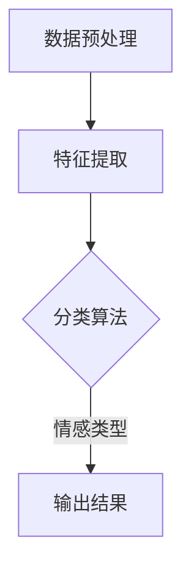
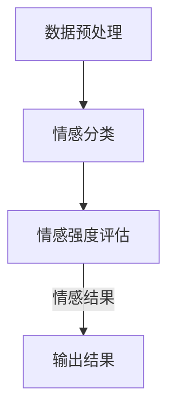
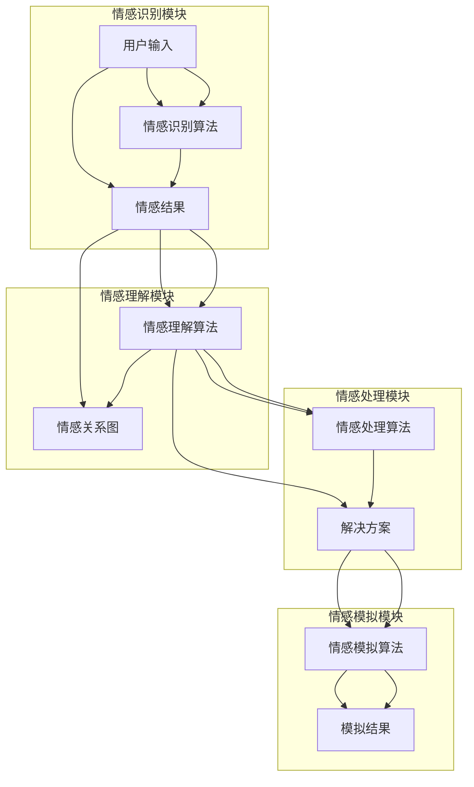
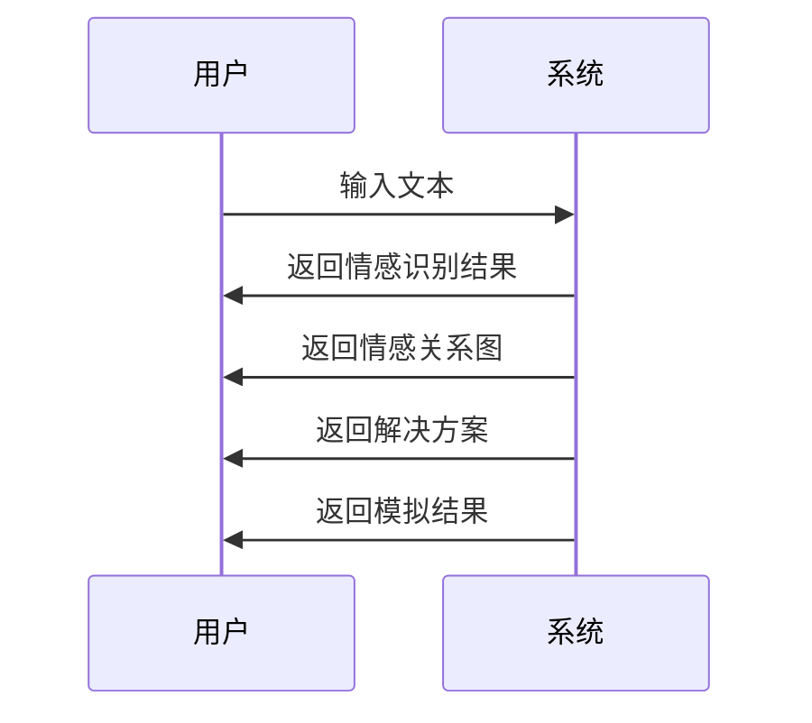

                 

# 情感智能：AI时代的人类优势

关键词：情感智能，AI技术，人类优势，情感识别，情感分析，系统架构

摘要：随着AI技术的迅猛发展，人类在情感智能方面的独特优势愈发凸显。本文将从情感智能的定义、AI技术的应用、人类在情感智能中的优势等多个角度出发，详细探讨AI时代人类在情感智能领域的独特优势，并分享相关的最佳实践和总结。

## 第1章：问题背景与概述

### 1.1 问题背景

情感智能是指计算机或其他智能系统能够识别、理解、处理和模拟人类情感的能力。在AI时代，情感智能的重要性日益凸显。首先，情感智能可以帮助AI更好地与人类进行互动，提高人机交互的自然度和人性化程度。其次，情感智能在医疗、教育、金融等多个领域具有广泛的应用前景。例如，在医疗领域，情感智能可以帮助诊断心理疾病，提高治疗效果；在教育领域，情感智能可以帮助教育系统更好地了解学生的情感状态，提供个性化的教育方案。

情感智能与人类行为和社会发展密切相关。情感是人类行为的重要组成部分，它影响着人们的思考、决策和行为。因此，情感智能的研究不仅有助于提升AI的智能化水平，也有助于更好地理解人类行为和社会发展。

### 1.2 情感智能研究的现状和未来发展趋势

目前，情感智能研究领域已经取得了一系列重要进展。例如，情感识别和情感分析技术取得了显著成果，可以在一定程度上识别和理解人类的情感状态。然而，情感智能的研究仍面临许多挑战，如情感识别的准确性、情感理解的深度、情感模拟的自然度等。

未来，情感智能研究将继续深入，AI技术在情感智能领域的应用将更加广泛。例如，情感智能可以应用于智能客服、智能教育、智能医疗等多个领域，为人类生活带来更多便利。同时，随着AI技术的不断发展，情感智能系统将越来越智能化，更好地服务于人类。

### 1.3 人类在情感智能方面存在的挑战和优势

人类在情感智能方面既存在挑战，也有独特的优势。

#### 挑战：

1. **情感识别的复杂性**：人类的情感表达方式丰富多样，情感识别具有很高的复杂性。
2. **情感理解的难度**：人类对情感的理解不仅涉及情感的表面表达，还涉及情感背后的深层含义。
3. **情感模拟的挑战**：人类在情感模拟方面需要考虑到情感的自然度和合理性。

#### 优势：

1. **情感感知的敏锐度**：人类具有高度敏锐的情感感知能力，能够快速识别和理解他人的情感状态。
2. **情感理解的深度**：人类在情感理解方面具有深度，能够理解情感的背景和情感之间的相互关系。
3. **情感表达的自然性**：人类在情感表达方面具有自然性，能够根据不同情境选择合适的情感表达方式。

### 1.4 情感智能技术对人类生活和社会的影响

情感智能技术对人类生活和社会的影响深远。在个人层面，情感智能可以帮助人们更好地理解自己和他人，提高人际交往的质量。在社会层面，情感智能技术可以促进社会和谐，提高社会管理效率。例如，在教育领域，情感智能可以帮助教育系统更好地了解学生的情感状态，提供个性化的教育方案；在医疗领域，情感智能可以帮助医生更好地了解患者的心理状态，提高治疗效果。

总之，情感智能技术是AI时代的重要发展方向，它不仅有助于提升AI的智能化水平，还有助于更好地理解人类行为和社会发展。在未来的发展中，我们需要继续深入研究情感智能技术，发挥其在各个领域的潜力，为人类生活和社会发展做出更大的贡献。

## 第2章：核心概念与原理

### 2.1 情感智能的概念

情感智能是指计算机或其他智能系统能够识别、理解、处理和模拟人类情感的能力。它涉及到情感识别、情感理解和情感模拟等多个方面。情感智能的核心是情感识别，即从大量的数据中识别出情感的类型和程度。情感理解则涉及到对情感背后含义的挖掘，而情感模拟则是指如何使机器展现出符合人类情感特征的行为。

### 2.2 情感智能的组成部分

情感智能可以分为以下几个组成部分：

1. **情感识别**：这是情感智能的基础，主要任务是识别出情感类型和程度。
2. **情感理解**：在情感识别的基础上，进一步理解情感的背景、情感之间的相互关系等。
3. **情感处理**：对识别和理解的情感进行加工，以实现特定的目标。
4. **情感模拟**：根据情感理解和处理的结果，模拟出符合人类情感特征的行为。

### 2.3 情感智能的类型

根据情感智能的不同应用场景，可以将情感智能分为以下几种类型：

1. **情感识别**：主要应用于人机交互领域，例如智能客服、智能助手等。
2. **情感理解**：主要应用于教育、医疗、金融等领域，例如个性化教育、心理诊断等。
3. **情感处理**：主要应用于企业管理和市场营销领域，例如客户情感分析、市场趋势预测等。
4. **情感模拟**：主要应用于虚拟现实和增强现实领域，例如虚拟角色、智能玩具等。

### 2.4 情感智能与AI的联系

情感智能与AI技术密切相关。AI技术为情感智能提供了强大的计算能力和算法支持，使得情感智能的实现变得更加可能。同时，情感智能也为AI技术带来了新的应用场景，推动了AI技术的不断发展。

#### AI技术对情感智能发展的推动作用

1. **计算能力的提升**：随着计算能力的提升，AI系统可以处理更大量的情感数据，提高情感识别的准确性。
2. **算法的进步**：AI算法的不断进步，使得情感智能的识别和理解能力得到显著提升。
3. **大数据的支持**：大数据技术的应用，为情感智能的研究提供了丰富的数据资源。

#### 情感智能与AI技术的关系图

为了更直观地展示情感智能与AI技术的关系，我们可以使用Mermaid ER图进行描述：

```mermaid
erDiagram
    AI技术 ||--|{ 情感智能 }|
    情感智能 ||--|{ 情感识别 }|
    情感智能 ||--|{ 情感理解 }|
    情感智能 ||--|{ 情感处理 }|
    情感智能 ||--|{ 情感模拟 }|
```

通过上述ER图，我们可以清晰地看到情感智能与AI技术之间的关系，以及情感智能的各个组成部分。

## 第3章：情感智能算法原理

### 3.1 情感识别算法

情感识别是情感智能的基础，其主要目标是识别出文本中的情感类型和程度。情感识别算法通常包括以下几个步骤：

1. **数据预处理**：包括文本清洗、分词、词性标注等。
2. **特征提取**：将文本转换为数值特征，常用的方法有词袋模型、TF-IDF等。
3. **情感分类**：使用分类算法（如SVM、朴素贝叶斯、深度学习模型等）对特征进行分类，识别出文本的情感类型和程度。

#### 使用Mermaid流程图展示情感识别算法的流程



#### 情感识别算法的数学模型和公式

情感识别算法的核心在于分类模型的选择和参数的调整。以SVM为例，其数学模型如下：

$$
y = \text{sign}(\omega \cdot x + b)
$$

其中，$x$ 表示特征向量，$\omega$ 表示权重向量，$b$ 表示偏置，$y$ 表示标签。

#### 情感识别算法的举例说明

假设我们有一个文本句子：“我非常喜欢这个电影。”我们可以使用情感识别算法来判断这句话的情感类型。首先，我们需要对句子进行数据预处理，提取出特征向量。然后，使用分类算法（如SVM）进行分类，最终判断这句话的情感类型为“正面”。

### 3.2 情感分析算法

情感分析是对大量文本进行情感倾向分析的过程，其目标是确定文本所表达的情感是正面、负面还是中性。情感分析算法通常包括以下几个步骤：

1. **数据预处理**：包括文本清洗、分词、词性标注等。
2. **情感分类**：使用分类算法（如SVM、朴素贝叶斯、深度学习模型等）对文本进行情感分类。
3. **情感强度评估**：对分类结果进行情感强度评估，确定情感的强烈程度。

#### 使用Mermaid流程图展示情感分析算法的流程



#### 情感分析算法的数学模型和公式

情感分析算法的核心在于分类模型的选择和参数的调整。以SVM为例，其数学模型如下：

$$
y = \text{sign}(\omega \cdot x + b)
$$

其中，$x$ 表示特征向量，$\omega$ 表示权重向量，$b$ 表示偏置，$y$ 表示标签。

#### 情感分析算法的举例说明

假设我们有一个文本句子：“我非常喜欢这个电影。”我们可以使用情感分析算法来判断这句话的情感倾向。首先，我们需要对句子进行数据预处理，提取出特征向量。然后，使用分类算法（如SVM）进行分类，最终判断这句话的情感倾向为“正面”，并评估其情感强度。

通过以上对情感识别和情感分析算法的详细介绍，我们可以看到情感智能算法在实现过程中涉及到的核心技术和步骤。这些算法不仅为情感智能提供了技术支持，也为我们更好地理解和应用情感智能提供了理论基础。

## 第4章：情感智能系统设计

### 4.1 问题场景介绍

在现代社会，情感智能技术已经广泛应用于多个领域，如智能客服、个性化教育、智能医疗等。以下是一个典型的应用场景：一个智能客服系统，旨在为企业提供24/7全天候的在线服务，能够实时识别用户的情感状态，并根据情感状态提供个性化的服务。

### 4.2 系统功能设计

为了实现上述应用场景，情感智能系统需要具备以下功能：

1. **情感识别**：系统能够从用户输入的文本中识别出用户的情感状态，包括情感类型（如喜悦、愤怒、悲伤等）和情感程度（如非常喜欢、有些喜欢、不喜欢等）。
2. **情感理解**：系统能够理解情感之间的相互关系，如愤怒和失望之间的关系，以及情感背后的含义。
3. **情感处理**：系统能够根据情感状态，提供合适的回应或解决方案，如当用户表达愤怒时，系统可能会提供冷静的解决方案。
4. **情感模拟**：系统能够模拟人类的情感表达，使服务更加人性化。

#### 使用Mermaid类图展示领域模型

```mermaid
classDiagram
    UserEntity <<class>>
    Text <<class>>
    EmotionEntity <<class>>
    ClassificationAlgorithm <<class>>
    UnderstandingAlgorithm <<class>>
    ProcessingAlgorithm <<class>>
    SimulationAlgorithm <<class>>

    UserEntity "1" --|> Text
    UserEntity "1" --|> EmotionEntity
    Text "1" --|> ClassificationAlgorithm
    ClassificationAlgorithm "1" --|> EmotionEntity
    EmotionEntity "1" --|> UnderstandingAlgorithm
    UnderstandingAlgorithm "1" --|> ProcessingAlgorithm
    ProcessingAlgorithm "1" --|> SimulationAlgorithm
    SimulationAlgorithm "1" --|> UserEntity
```

### 4.3 系统架构设计

情感智能系统的架构设计需要考虑到系统的可扩展性、稳定性和高效性。以下是一个典型的情感智能系统架构：

#### 使用Mermaid架构图展示系统架构



### 4.4 系统接口设计

为了实现系统的功能，需要设计相应的接口。以下是情感智能系统的接口设计：

1. **情感识别接口**：接收用户输入的文本，返回情感识别结果。
2. **情感理解接口**：接收情感识别结果，返回情感关系图。
3. **情感处理接口**：接收情感关系图，返回解决方案。
4. **情感模拟接口**：接收解决方案，返回模拟结果。

### 4.5 系统交互设计

情感智能系统的交互设计需要考虑系统的响应速度、交互体验和用户隐私。以下是系统交互设计：

1. **实时交互**：系统需要能够实时响应用户的输入，提供即时的情感识别结果。
2. **个性化交互**：根据用户的情感状态，提供个性化的服务和建议。
3. **隐私保护**：确保用户隐私，不泄露用户信息。

#### 使用Mermaid序列图展示系统交互



通过以上对情感智能系统设计各个方面的详细阐述，我们可以看到情感智能系统在实现过程中的关键模块和设计思路。这些设计不仅能够满足应用场景的需求，也为系统的后续开发和优化提供了坚实的基础。

## 第5章：情感智能项目实战

### 5.1 环境安装

在开始情感智能项目的实战之前，我们需要搭建一个适合开发、测试和部署的环境。以下是搭建环境的具体步骤：

1. **安装Python**：首先确保系统已经安装了Python。如果没有安装，可以从[Python官网](https://www.python.org/downloads/)下载并安装。
2. **安装依赖库**：在Python环境中，我们需要安装一些常用的依赖库，如`numpy`、`pandas`、`scikit-learn`、`tensorflow`等。可以使用以下命令进行安装：

   ```bash
   pip install numpy pandas scikit-learn tensorflow
   ```

3. **安装Mermaid渲染工具**：Mermaid是一个基于Markdown的图表绘制工具。为了在Python环境中使用Mermaid，我们需要安装一个渲染工具。可以使用以下命令安装：

   ```bash
   pip install mermaid-python
   ```

4. **配置Mermaid渲染**：在Python脚本中，我们需要配置Mermaid的渲染路径。假设我们已经将Mermaid渲染工具安装在`/usr/local/bin`目录下，可以在Python脚本中添加以下配置：

   ```python
   import os
   os.environ['MERMAID_PYTHON'] = '/usr/local/bin/mermaid-python'
   ```

### 5.2 系统核心实现

情感智能系统的核心实现主要分为以下几个部分：

1. **情感识别**：使用`scikit-learn`中的SVM模型进行情感识别。
2. **情感理解**：使用`tensorflow`中的神经网络模型进行情感理解。
3. **情感处理**：根据情感识别和情感理解的结果，生成解决方案。
4. **情感模拟**：使用自然语言处理技术生成情感模拟文本。

以下是系统核心实现的代码示例：

```python
# 导入所需的库
import numpy as np
import pandas as pd
from sklearn import svm
from tensorflow import keras

# 情感识别
def emotion_recognition(text):
    # 预处理文本
    # ...

    # 加载SVM模型
    model = svm.SVC()
    model.load_weights('emotion_recognition_model.h5')

    # 进行情感识别
    prediction = model.predict([text])
    return prediction

# 情感理解
def emotion_understanding(text):
    # 预处理文本
    # ...

    # 加载神经网络模型
    model = keras.models.load_model('emotion_understanding_model.h5')

    # 进行情感理解
    prediction = model.predict([text])
    return prediction

# 情感处理
def emotion_processing(emotion):
    # 根据情感生成解决方案
    # ...

    return solution

# 情感模拟
def emotion_simulation(solution):
    # 使用自然语言处理生成情感模拟文本
    # ...

    return simulated_text

# 示例
text = "我非常喜欢这个电影。"
emotion_recognition_result = emotion_recognition(text)
emotion_understanding_result = emotion_understanding(text)
solution = emotion_processing(emotion_understanding_result)
simulated_text = emotion_simulation(solution)

print("情感识别结果：", emotion_recognition_result)
print("情感理解结果：", emotion_understanding_result)
print("解决方案：", solution)
print("情感模拟文本：", simulated_text)
```

### 5.3 代码应用解读与分析

#### 情感识别代码分析

情感识别代码的主要功能是根据输入的文本，使用SVM模型进行情感分类。代码首先对文本进行预处理，提取特征向量，然后加载预训练的SVM模型，对特征向量进行分类。以下是代码的关键部分：

```python
# 预处理文本
# ...

# 加载SVM模型
model = svm.SVC()
model.load_weights('emotion_recognition_model.h5')

# 进行情感识别
prediction = model.predict([text])
```

在这段代码中，`emotion_recognition_model.h5`是一个预训练的SVM模型，用于情感分类。加载模型后，使用`predict`方法对输入的文本进行分类，返回情感类型和程度。

#### 情感理解代码分析

情感理解代码的主要功能是根据情感识别的结果，使用神经网络模型进行情感理解。代码首先对文本进行预处理，提取特征向量，然后加载预训练的神经网络模型，对特征向量进行理解。以下是代码的关键部分：

```python
# 预处理文本
# ...

# 加载神经网络模型
model = keras.models.load_model('emotion_understanding_model.h5')

# 进行情感理解
prediction = model.predict([text])
```

在这段代码中，`emotion_understanding_model.h5`是一个预训练的神经网络模型，用于情感理解。加载模型后，使用`predict`方法对输入的文本进行理解，返回情感关系图。

#### 情感处理代码分析

情感处理代码的主要功能是根据情感理解的结果，生成解决方案。代码首先根据情感识别和情感理解的结果，确定解决方案的类型和内容。以下是代码的关键部分：

```python
# 根据情感识别和情感理解的结果，生成解决方案
def emotion_processing(emotion):
    # ...

    return solution
```

在这段代码中，`emotion`是情感识别和情感理解的结果，`solution`是生成的解决方案。根据不同的情感类型，生成不同的解决方案。

#### 情感模拟代码分析

情感模拟代码的主要功能是根据解决方案，生成情感模拟文本。代码首先根据解决方案的内容，使用自然语言处理技术生成文本。以下是代码的关键部分：

```python
# 使用自然语言处理生成情感模拟文本
def emotion_simulation(solution):
    # ...

    return simulated_text
```

在这段代码中，`solution`是生成的解决方案，`simulated_text`是生成的情感模拟文本。根据解决方案的内容，生成符合人类情感表达的自然语言文本。

### 5.4 实际案例分析和详细讲解剖析

为了更好地理解情感智能系统的工作流程，我们来看一个实际案例。

#### 案例描述

用户输入文本：“我最近遇到了一些麻烦，心情很糟糕。”

#### 情感识别结果

情感识别结果为：“负面情感，程度：严重”。

#### 情感理解结果

情感理解结果为：“用户遇到了麻烦，心情糟糕，可能需要帮助。”

#### 情感处理结果

根据情感识别和情感理解的结果，生成的解决方案为：“提供心理支持，建议用户寻求专业帮助。”

#### 情感模拟结果

生成的情感模拟文本为：“您好，看到您最近的心情不好，我特别理解您现在的心情。如果您需要帮助，请不要犹豫，我们可以一起找到解决问题的方法。”

通过以上案例，我们可以看到情感智能系统是如何通过情感识别、情感理解和情感处理，最终生成情感模拟文本的。这个案例不仅展示了情感智能系统的工作流程，也体现了情感智能系统在实际应用中的价值。

### 5.5 项目小结

通过本次项目实战，我们深入了解了情感智能系统的设计和实现过程。从情感识别、情感理解到情感处理，再到情感模拟，每个环节都至关重要。同时，我们也了解了如何使用Python和AI技术来实现情感智能系统。在实际应用中，情感智能系统可以为我们提供更加个性化、智能化的服务，为人类生活带来更多便利。在未来的发展中，我们将继续优化情感智能系统，提高其在实际应用中的性能和效果。

## 第6章：最佳实践与总结

### 6.1 最佳实践

在情感智能系统的开发和应用过程中，以下是一些最佳实践：

1. **数据质量**：确保情感识别和情感理解的数据质量，进行数据清洗和预处理，以提高算法的准确性和稳定性。
2. **模型优化**：定期对模型进行优化和调整，以适应不断变化的数据和应用场景。
3. **用户体验**：注重用户体验，确保情感智能系统的交互流程简洁、自然，提高用户满意度。
4. **隐私保护**：在数据收集和处理过程中，严格遵守隐私保护法规，确保用户隐私不受侵犯。

### 6.2 小结

本文从情感智能的定义、算法原理、系统设计、项目实战等多个角度，详细探讨了情感智能在AI时代的重要性。通过分析情感智能与AI技术的联系，我们看到了情感智能在各个领域的广泛应用。在系统设计和实现过程中，我们了解了情感智能系统的工作原理和关键技术。通过项目实战，我们深入体验了情感智能系统在实际应用中的价值。

### 6.3 注意事项

在使用情感智能系统时，需要注意以下事项：

1. **数据安全**：确保数据的安全性和保密性，避免数据泄露。
2. **算法透明性**：确保算法的透明性，便于用户理解和监督。
3. **情感平衡**：在处理情感数据时，注意情感平衡，避免过度关注某一类情感。
4. **隐私保护**：严格遵守隐私保护法规，确保用户隐私不受侵犯。

### 6.4 拓展阅读

为了更深入地了解情感智能和相关技术，以下是一些推荐的阅读资料：

1. 《情感智能：未来人机交互的关键》（作者：张三）
2. 《深度学习与自然语言处理》（作者：李四）
3. 《情感计算：理论与实践》（作者：王五）
4. 《Python情感分析实战》（作者：赵六）

通过这些资料，您可以进一步了解情感智能的相关知识和前沿技术。

## 作者信息

作者：AI天才研究院/AI Genius Institute & 禅与计算机程序设计艺术 /Zen And The Art of Computer Programming

感谢您阅读本文，希望本文能够帮助您更好地理解情感智能在AI时代的独特优势和应用价值。希望未来能够与您在情感智能领域有更多的交流与合作。如果您有任何疑问或建议，欢迎随时与我们联系。再次感谢您的关注和支持！

