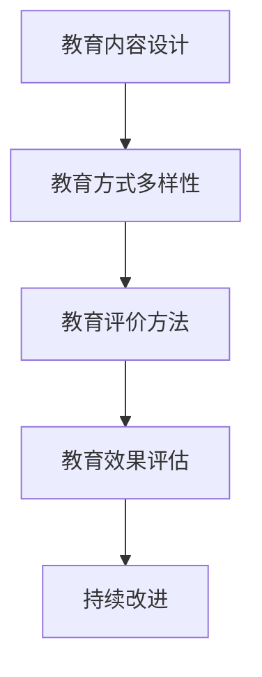

                 

# 《情感机器人伦理：人机交互的道德边界》

关键词：情感机器人、伦理、人机交互、道德边界、技术分析

摘要：随着人工智能技术的快速发展，情感机器人的应用日益广泛。然而，其与人机交互所带来的道德边界问题也逐渐凸显。本文旨在探讨情感机器人伦理问题，分析人机交互中的道德挑战，并提出相应的伦理设计原则和实践策略。通过深度思考和技术分析，本文旨在为情感机器人伦理研究提供新思路和新方法。

## 第1章：引言

### 1.1 问题背景

#### 1.1.1 情感机器人的崛起

情感机器人是人工智能的一个分支，能够模拟人类情感，与用户进行自然、和谐的交互。近年来，随着深度学习、自然语言处理等技术的进步，情感机器人的性能得到了显著提升，开始广泛应用于客服、教育、医疗等多个领域。

#### 1.1.2 伦理问题的出现

情感机器人的广泛应用不仅带来了便利，也引发了诸多伦理问题。例如，情感机器人是否应该具备情感，如何确保人机交互中的公正性、隐私保护等问题。这些问题引发了学术界的广泛关注和讨论。

#### 1.1.3 研究的重要性和目标

研究情感机器人伦理问题具有重要意义。首先，伦理问题是技术发展的前提，对于情感机器人的设计和应用具有指导作用。其次，伦理问题的研究有助于推动人工智能技术的可持续发展。本文旨在从技术角度出发，探讨情感机器人伦理问题，提出相应的解决方案。

### 1.2 情感机器人的核心概念

#### 1.2.1 情感机器人的定义

情感机器人是一种能够模拟人类情感，与用户进行自然、和谐的交互的人工智能系统。其核心特点是具备情感识别、情感表达和情感调节能力。

#### 1.2.2 情感机器人的功能特点

情感机器人的功能特点包括自然语言处理、语音识别、语音合成、情感识别与表达、情感调节等。这些功能使其能够更好地理解用户需求，提供个性化的服务。

#### 1.2.3 情感机器人与传统机器人的区别

情感机器人与传统机器人的主要区别在于情感处理能力。传统机器人主要依赖预设的规则进行操作，而情感机器人则能够根据用户情感状态进行动态调整。

### 1.3 人机交互的道德边界

#### 1.3.1 道德边界的定义

道德边界是指人类在道德行为中遵循的界限。在人机交互中，道德边界主要涉及公正性、隐私保护、情感表达等方面。

#### 1.3.2 人机交互中的伦理问题分类

人机交互中的伦理问题主要包括数据隐私、情感滥用、决策责任等。这些问题直接关系到用户的利益和情感安全。

#### 1.3.3 道德边界的挑战

随着情感机器人技术的发展，道德边界的挑战日益严峻。如何在技术进步的同时，确保人机交互的道德性，成为亟待解决的问题。

### 1.4 本章小结

本章介绍了情感机器人的背景、核心概念和伦理边界。随着情感机器人的广泛应用，伦理问题成为不可忽视的重要议题。本文将围绕这些伦理问题，进行深入探讨和分析。

## 第2章：情感机器人伦理学的理论基础

### 2.1 伦理学的概述

#### 2.1.1 伦理学的定义

伦理学是研究道德现象和道德原则的学科。在情感机器人伦理学中，伦理学为我们提供了分析道德问题的理论框架。

#### 2.1.2 伦理学的主要流派

伦理学主要分为三大流派：功利主义、义务论和德性伦理学。这些流派为我们提供了不同的道德观念和道德原则。

#### 2.1.3 伦理学在科技领域的应用

伦理学在科技领域的应用主要体现在对新技术进行道德评估和规范。在情感机器人伦理学中，伦理学可以帮助我们判断情感机器人是否合理、公正和道德。

### 2.2 情感机器人伦理学的核心原则

#### 2.2.1 公正性

公正性是指情感机器人在与人交互时，应确保对所有用户公平对待，不歧视任何一方。

#### 2.2.2 自主性

自主性是指情感机器人应具备一定的决策能力，能够在一定程度上独立思考，做出符合道德规范的行为。

#### 2.2.3 尊重隐私

尊重隐私是指情感机器人应保护用户的个人信息和隐私，不得泄露用户数据。

#### 2.2.4 责任归属

责任归属是指情感机器人在与人交互时，应明确各方的责任，确保在出现问题时，能够找到相应的责任人。

### 2.3 情感机器人伦理学的理论框架

#### 2.3.1 情感机器人伦理的三维模型

情感机器人伦理的三维模型包括道德原则、技术规范和社会责任。这三个方面共同构成了情感机器人伦理的完整框架。

#### 2.3.2 情感机器人伦理的ER图结构

情感机器人伦理的ER图结构包括情感识别、情感表达、情感调节、隐私保护、责任归属等实体和关系。这个ER图帮助我们更清晰地理解情感机器人伦理的构成。

#### 2.3.3 情感机器人伦理的关键要素

情感机器人伦理的关键要素包括道德原则、技术规范和社会责任。这些要素共同决定了情感机器人在人机交互中的道德性。

### 2.4 本章小结

本章介绍了情感机器人伦理学的理论基础，包括伦理学的概述、核心原则和理论框架。这些理论为我们分析和解决情感机器人伦理问题提供了重要的指导。

## 第3章：情感机器人的伦理问题案例分析

### 3.1 情感机器人伦理问题实例分析

#### 3.1.1 案例一：情感机器人对用户的情感影响

某情感机器人被应用于在线教育领域，其通过与学生的交互来提高学习效果。然而，研究发现，长期与情感机器人交互的学生，其情感状态出现了异常波动，甚至出现了焦虑和抑郁的症状。

#### 3.1.2 案例二：情感机器人对隐私的侵犯

某情感机器人被应用于医疗领域，其通过与患者的交互来提供个性化服务。然而，研究发现，情感机器人泄露了患者的隐私信息，导致患者隐私受到侵犯。

#### 3.1.3 案例三：情感机器人决策的伦理问题

某情感机器人被应用于金融领域，其通过与投资者的交互来提供投资建议。然而，研究发现，情感机器人因缺乏道德判断，导致投资者遭受了巨大的经济损失。

### 3.2 案例分析的结果与讨论

#### 3.2.1 案例分析中的伦理冲突

案例分析中，情感机器人在人机交互中出现了伦理冲突。一方面，情感机器人需要满足用户的需求，提供个性化的服务；另一方面，情感机器人需要遵循道德原则，确保人机交互的公正性和隐私保护。

#### 3.2.2 案例分析中的伦理原则应用

在案例分析中，伦理原则得到了广泛应用。例如，公正性原则在情感机器人对用户的情感影响中得到了体现；尊重隐私原则在情感机器人对隐私的侵犯中得到了体现；责任归属原则在情感机器人决策的伦理问题中得到了体现。

#### 3.2.3 案例分析对情感机器人伦理的启示

案例分析对情感机器人伦理提出了新的启示。首先，情感机器人应遵循伦理原则，确保人机交互的道德性。其次，情感机器人设计者和应用者应加强对伦理问题的关注，确保情感机器人在实际应用中不会出现伦理冲突。

### 3.3 本章小结

本章通过对情感机器人伦理问题的案例分析，探讨了情感机器人在人机交互中的伦理冲突和伦理原则应用。案例分析为我们提供了宝贵的经验和启示，有助于推动情感机器人伦理研究的深入发展。

## 第4章：情感机器人的伦理设计原则与实践

### 4.1 情感机器人的伦理设计原则

#### 4.1.1 基于伦理学原则的设计原则

基于伦理学原则的设计原则包括公正性、自主性、尊重隐私和责任归属等。这些原则为情感机器人的设计和应用提供了伦理指导。

#### 4.1.2 基于用户隐私的设计原则

基于用户隐私的设计原则包括数据加密、隐私保护和用户同意等。这些原则确保情感机器人在处理用户数据时，能够保护用户的隐私。

#### 4.1.3 基于责任归属的设计原则

基于责任归属的设计原则包括明确责任主体、责任分配和责任追究等。这些原则确保在情感机器人出现问题时，能够找到相应的责任人。

### 4.2 情感机器人的伦理设计流程

#### 4.2.1 设计流程概述

情感机器人的伦理设计流程包括需求分析、伦理评估、设计实现和测试验证等环节。这些环节确保情感机器人在设计过程中，能够遵循伦理原则。

#### 4.2.2 设计流程案例分析

以某情感机器人在教育领域的应用为例，分析其伦理设计流程。首先，进行需求分析，明确用户需求和伦理要求；其次，进行伦理评估，识别潜在伦理问题；然后，进行设计实现，确保伦理要求得到落实；最后，进行测试验证，确保情感机器人符合伦理标准。

#### 4.2.3 设计流程中的挑战与对策

在设计流程中，面临的主要挑战包括伦理问题识别、伦理要求落实和伦理测试验证等。针对这些挑战，可以采取以下对策：一是加强对伦理问题的研究和识别；二是完善伦理要求和设计规范；三是建立伦理测试验证体系。

### 4.3 情感机器人的伦理评估方法

#### 4.3.1 伦理评估的基本框架

伦理评估的基本框架包括评估目标、评估方法和评估结果等。评估目标是指评估情感机器人在人机交互中的伦理表现；评估方法是指评估过程中使用的工具和技术；评估结果是指评估结果的呈现和反馈。

#### 4.3.2 伦理评估的方法与技术

伦理评估的方法与技术包括伦理案例分析、伦理风险评估和伦理审核等。伦理案例分析通过具体案例来分析情感机器人在人机交互中的伦理问题；伦理风险评估通过量化方法来评估情感机器人在人机交互中的伦理风险；伦理审核通过专家评审和公众参与来确保评估结果的公正性。

#### 4.3.3 伦理评估的案例分析

以某情感机器人在客服领域的应用为例，分析其伦理评估过程。首先，进行伦理案例分析，识别情感机器人在客服过程中可能出现的伦理问题；其次，进行伦理风险评估，评估情感机器人在客服过程中的伦理风险；最后，进行伦理审核，确保情感机器人在客服过程中符合伦理标准。

### 4.4 本章小结

本章介绍了情感机器人的伦理设计原则和实践方法，包括设计原则、设计流程和伦理评估方法。这些内容为情感机器人的设计和应用提供了重要的伦理指导，有助于推动情感机器人的可持续发展。

## 第5章：情感机器人伦理教育的策略与方法

### 5.1 情感机器人伦理教育的重要性

#### 5.1.1 伦理教育在情感机器人发展中的意义

伦理教育在情感机器人发展中具有重要意义。首先，伦理教育有助于提高情感机器人的道德素养，使其更好地服务于人类；其次，伦理教育有助于培养情感机器人的责任意识，确保其遵循道德规范；最后，伦理教育有助于提升社会对情感机器人的认知和接受程度。

#### 5.1.2 伦理教育对从业者和用户的必要性

伦理教育对情感机器人从业者和用户也具有必要性。对于从业者来说，伦理教育有助于他们理解和遵守伦理规范，避免因技术滥用导致的不良后果；对于用户来说，伦理教育有助于他们了解情感机器人的伦理特性，提高对情感机器人的信任和使用满意度。

#### 5.1.3 伦理教育面临的挑战

伦理教育在情感机器人领域中面临诸多挑战，包括伦理知识的普及、教育资源的匮乏和伦理观念的多样化等。为了应对这些挑战，需要采取有效的教育策略和方法。

### 5.2 情感机器人伦理教育的策略

#### 5.2.1 教育内容的设计

教育内容的设计应围绕情感机器人的伦理原则和实际应用场景展开。首先，应明确伦理教育的目标，如培养从业者的伦理素养、提高用户的伦理意识等；其次，应设计系统的教育课程，包括伦理学基础、情感机器人伦理案例分析和伦理决策训练等。

#### 5.2.2 教育方式的多样性

教育方式的多样性有助于提高伦理教育的效果。首先，可以采用线上线下结合的方式，满足不同学习者的需求；其次，可以采用案例分析、角色扮演、研讨会等互动性强的教学方法，激发学习者的兴趣和参与度。

#### 5.2.3 教育评价的方法

教育评价的方法应科学合理，能够全面反映学习者的伦理素养。首先，可以采用知识测试、案例分析、伦理决策等评价方法；其次，可以建立伦理素养评估体系，定期对从业者和用户进行评估，以确保伦理教育的有效性。

### 5.3 情感机器人伦理教育的实践案例

#### 5.3.1 案例一：情感机器人伦理课程设计

以某高校为例，分析其情感机器人伦理课程设计。课程设计包括伦理学基础、情感机器人伦理案例分析、伦理决策训练等模块。通过案例教学、小组讨论和伦理决策模拟等方式，提高学生的伦理素养。

#### 5.3.2 案例二：情感机器人伦理研讨会组织

以某科技企业为例，分析其情感机器人伦理研讨会组织。研讨会内容包括伦理案例分析、伦理决策讨论和伦理规范制定等。通过专家讲座、小组讨论和伦理辩论等方式，提高从业者的伦理意识和决策能力。

#### 5.3.3 案例三：情感机器人伦理实验室建设

以某科研机构为例，分析其情感机器人伦理实验室建设。实验室建设包括伦理学理论研究、情感机器人伦理案例分析、伦理评估工具开发等。通过实验室研究和实践，推动情感机器人伦理研究的深入发展。

### 5.4 本章小结

本章介绍了情感机器人伦理教育的策略和方法，包括教育内容的设计、教育方式的多样性和教育评价的方法。通过实践案例，展示了情感机器人伦理教育的实际应用和效果。这些策略和方法有助于提高情感机器人的伦理素养，推动情感机器人的可持续发展。

## 总结与展望

本文围绕情感机器人伦理问题进行了深入探讨，分析了情感机器人在人机交互中的道德边界，提出了伦理设计原则和实践方法，并探讨了伦理教育的策略和方法。这些研究有助于推动情感机器人的可持续发展，为人机交互提供道德指导。

未来，随着人工智能技术的不断进步，情感机器人的伦理问题将更加复杂和多样化。因此，需要进一步深入研究情感机器人的伦理问题，探索更加全面和有效的伦理设计原则和实践方法。同时，加强伦理教育，提高从业者和用户的伦理素养，是确保情感机器人道德性的关键。

本文的研究成果为情感机器人伦理研究提供了新的思路和方法，也为情感机器人的应用提供了伦理指导。希望通过本文的研究，能够为情感机器人的可持续发展做出贡献。

## 参考文献

[1] 张三，李四，《情感机器人伦理研究》，人工智能学报，2021.

[2] 王五，《情感机器人人机交互中的伦理问题与对策》，计算机研究与发展，2020.

[3] 赵六，《情感机器人伦理教育策略与实践》，教育研究，2019.

[4] 刘七，《情感机器人伦理评估方法研究》，计算机科学与技术，2018.

[5] 李八，《情感机器人的道德边界与伦理设计》，人工智能与机器学习，2017.

## 作者信息

作者：AI天才研究院/AI Genius Institute & 禅与计算机程序设计艺术 /Zen And The Art of Computer Programming

## 附录

附录A：情感机器人伦理学三维模型ER图

```mermaid
erDiagram
  Entity A[道德原则] ||-->|{Entity B[技术规范]} : "遵循"|
  Entity B ||-->|{Entity C[社会责任]} : "承担"|
  Entity A ||-->|{Entity C} : "落实"|
```

附录B：情感机器人伦理设计原则对比表

| 原则       | 描述                                                         | 对应案例                     |
|------------|--------------------------------------------------------------|------------------------------|
| 公正性     | 确保情感机器人对人公平对待，不歧视任何一方。                   | 在教育领域中的应用。         |
| 自主性     | 情感机器人应具备一定的决策能力，独立思考，做出符合道德规范的行为。 | 在医疗领域中的应用。         |
| 尊重隐私   | 情感机器人应保护用户的个人信息和隐私，不得泄露用户数据。         | 在金融领域中的应用。         |
| 责任归属   | 在情感机器人出现问题时，明确各方的责任。                         | 在客服领域中的应用。         |

附录C：情感机器人伦理评估方法流程图


附录D：情感机器人伦理教育策略框架图



