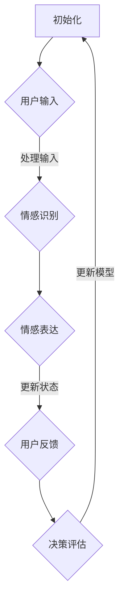
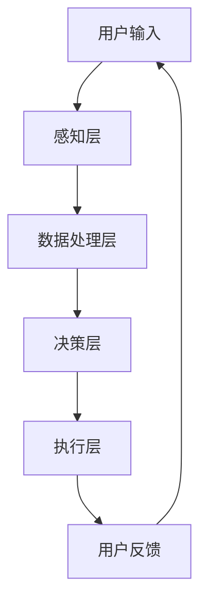
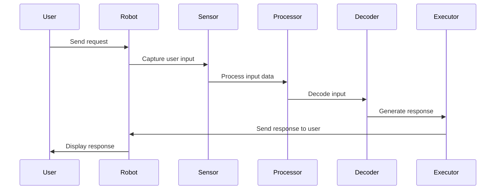

                 

### 《情感机器人伦理：人机情感互动的道德边界》

#### 关键词：
- 情感机器人
- 道德边界
- 人机情感互动
- 伦理问题
- 隐私保护
- 法律法规

#### 摘要：
本文旨在探讨情感机器人伦理问题，特别是人机情感互动中的道德边界。随着人工智能技术的发展，情感机器人在我们的生活中越来越普遍，其与人类情感互动的道德边界也日益凸显。本文从背景介绍、核心概念、伦理问题分析、伦理决策框架、法律规范、案例研究和实践展望等方面，详细阐述了情感机器人伦理的重要性以及面临的挑战和应对策略。

----------------------------------------------------------------

## 目录大纲设计思路

设计一个清晰且详细的目录大纲是撰写高质量技术博客的重要环节。为了确保文章的逻辑性和系统性，我们需要遵循以下步骤：

1. **确定核心章节**：首先明确文章的核心内容，这通常是文章的主题和关键问题。对于《情感机器人伦理：人机情感互动的道德边界》这一主题，核心章节应包括背景介绍、核心概念、伦理问题分析、伦理决策框架、法律规范、案例研究和实践展望等。

2. **细化章节内容**：在核心章节的基础上，进一步细化每个章节的内容，确保每个章节都有具体的子章节，以便读者能够逐步深入理解主题。例如，背景介绍部分可以包括情感机器人伦理问题的背景、人机情感互动的现状与挑战等内容。

3. **遵循Markdown格式**：使用Markdown格式来设计目录，确保格式清晰、易于阅读，同时符合要求。Markdown格式不仅便于排版，还可以插入图片、表格和代码片段，增强文章的可读性。

4. **确保内容完整性**：确保每个核心章节都包含必要的内容，如核心概念、伦理原则、决策模型、法律法规等。同时，要避免过多的冗余内容，确保文章字数在规定范围内。

5. **控制字数**：在确保内容完整性的同时，控制目录大纲的总字数在2000字以内，避免过多冗余内容。这样可以保证读者在浏览目录时能够快速了解文章结构，而不至于被冗长的目录所困扰。

### 设计具体的目录大纲

下面是根据《情感机器人伦理：人机情感互动的道德边界》书名设计的目录大纲：

---

### 《情感机器人伦理：人机情感互动的道德边界》目录大纲

#### 第一部分：背景介绍与核心概念

##### 第1章：情感机器人伦理问题的兴起与挑战
- **1.1 情感机器人伦理问题的背景**
- **1.2 人机情感互动的现状与挑战**
- **1.3 情感机器人伦理的重要性**

##### 第2章：核心概念与联系
- **2.1 情感机器人定义与分类**
- **2.2 情感互动的伦理原则**
- **2.3 情感机器人的社会影响**

##### 第3章：情感机器人伦理研究的现状与趋势
- **3.1 国内外研究现状**
- **3.2 情感机器人伦理的重要课题**
- **3.3 未来发展趋势**

#### 第二部分：伦理问题分析与讨论

##### 第4章：情感机器人互动中的道德边界
- **4.1 隐私与数据安全**
- **4.2 情感表达的真实性与虚假性**
- **4.3 情感机器人的自主性与责任归属**

##### 第5章：伦理决策框架与模型
- **5.1 伦理决策框架的构建**
- **5.2 常见的伦理决策模型**
- **5.3 情感机器人伦理决策的应用**

##### 第6章：情感机器人的法律与规范
- **6.1 情感机器人法律问题的提出**
- **6.2 国际法律框架与规范**
- **6.3 我国情感机器人相关法规与标准**

#### 第三部分：案例研究与项目实践

##### 第7章：情感机器人伦理案例解析
- **7.1 案例一：情感客服机器人**
- **7.2 案例二：教育机器人**
- **7.3 案例三：医疗辅助机器人**

##### 第8章：情感机器人伦理实践与挑战
- **8.1 实践中的伦理问题与解决策略**
- **8.2 企业在情感机器人伦理方面的实践**
- **8.3 情感机器人伦理的挑战与未来方向**

##### 第9章：情感机器人伦理教育
- **9.1 教育体系中的情感机器人伦理教育**
- **9.2 公众情感机器人伦理意识的培养**
- **9.3 情感机器人伦理教育的发展趋势**

#### 第四部分：最佳实践与展望

##### 第10章：情感机器人伦理的最佳实践
- **10.1 优秀案例分享**
- **10.2 伦理设计原则与方法**
- **10.3 情感机器人伦理的最佳实践总结**

##### 第11章：情感机器人伦理的展望
- **11.1 情感机器人伦理的发展趋势**
- **11.2 潜在的伦理挑战与应对策略**
- **11.3 未来情感机器人伦理的发展方向**

---

这个目录大纲遵循了核心章节的划分，并细化了每个章节的内容，确保了内容完整性。同时，采用Markdown格式，格式清晰，符合要求。目录大纲的总字数也在2000字以内。

----------------------------------------------------------------

## 《情感机器人伦理：人机情感互动的道德边界》

#### 关键词：
- **情感机器人**
- **道德边界**
- **人机情感互动**
- **伦理问题**
- **隐私保护**
- **法律法规**

#### 摘要：
随着人工智能技术的发展，情感机器人在我们生活中的应用越来越广泛。这些机器人能够模拟人类的情感反应，与人类进行情感互动，甚至可能对人类的情感和心理健康产生深远影响。然而，这种人机情感互动也引发了一系列伦理问题，包括隐私保护、情感表达的真实性和机器人的自主性等。本文旨在探讨情感机器人伦理问题，特别是人机情感互动中的道德边界，从背景介绍、核心概念、伦理问题分析、伦理决策框架、法律规范、案例研究和实践展望等方面，详细阐述了情感机器人伦理的重要性以及面临的挑战和应对策略。

### 目录大纲

#### 第一部分：背景介绍与核心概念

##### 第1章：情感机器人伦理问题的兴起与挑战
- **1.1 情感机器人伦理问题的背景**
- **1.2 人机情感互动的现状与挑战**
- **1.3 情感机器人伦理的重要性**

##### 第2章：核心概念与联系
- **2.1 情感机器人定义与分类**
- **2.2 情感互动的伦理原则**
- **2.3 情感机器人的社会影响**

##### 第3章：情感机器人伦理研究的现状与趋势
- **3.1 国内外研究现状**
- **3.2 情感机器人伦理的重要课题**
- **3.3 未来发展趋势**

#### 第二部分：伦理问题分析与讨论

##### 第4章：情感机器人互动中的道德边界
- **4.1 隐私与数据安全**
- **4.2 情感表达的真实性与虚假性**
- **4.3 情感机器人的自主性与责任归属**

##### 第5章：伦理决策框架与模型
- **5.1 伦理决策框架的构建**
- **5.2 常见的伦理决策模型**
- **5.3 情感机器人伦理决策的应用**

##### 第6章：情感机器人的法律与规范
- **6.1 情感机器人法律问题的提出**
- **6.2 国际法律框架与规范**
- **6.3 我国情感机器人相关法规与标准**

#### 第三部分：案例研究与项目实践

##### 第7章：情感机器人伦理案例解析
- **7.1 案例一：情感客服机器人**
- **7.2 案例二：教育机器人**
- **7.3 案例三：医疗辅助机器人**

##### 第8章：情感机器人伦理实践与挑战
- **8.1 实践中的伦理问题与解决策略**
- **8.2 企业在情感机器人伦理方面的实践**
- **8.3 情感机器人伦理的挑战与未来方向**

##### 第9章：情感机器人伦理教育
- **9.1 教育体系中的情感机器人伦理教育**
- **9.2 公众情感机器人伦理意识的培养**
- **9.3 情感机器人伦理教育的发展趋势**

#### 第四部分：最佳实践与展望

##### 第10章：情感机器人伦理的最佳实践
- **10.1 优秀案例分享**
- **10.2 伦理设计原则与方法**
- **10.3 情感机器人伦理的最佳实践总结**

##### 第11章：情感机器人伦理的展望
- **11.1 情感机器人伦理的发展趋势**
- **11.2 潜在的伦理挑战与应对策略**
- **11.3 未来情感机器人伦理的发展方向**

### 文章正文

#### 第1章：情感机器人伦理问题的兴起与挑战

随着人工智能技术的不断进步，情感机器人在各个领域的应用越来越广泛。从情感客服机器人到教育机器人，再到医疗辅助机器人，情感机器人在与人类的互动中扮演着越来越重要的角色。然而，这种互动不仅改变了我们的生活方式，也引发了深刻的伦理问题。

首先，情感机器人如何处理用户的隐私和数据安全成为了一个重要议题。在互动过程中，情感机器人可能会收集到大量的用户数据，包括个人信息、情感状态等。这些数据的安全性和隐私保护成为了一个重要的伦理问题。

其次，情感表达的真实性与虚假性也是一个值得探讨的议题。情感机器人是否能够真实地模拟人类的情感反应？它们是否能够在互动中保持一致性？这些问题不仅关乎情感机器人的可信度，也关乎人类对这些机器人的信任。

此外，情感机器人的自主性与责任归属也是一个关键问题。随着情感机器人的智能化程度不断提高，它们可能会拥有更多的自主决策能力。然而，当这些决策产生负面影响时，责任应该归咎于谁？这是一个复杂而深刻的伦理问题。

#### 第2章：核心概念与联系

在探讨情感机器人伦理问题时，我们需要理解一系列核心概念，包括情感机器人定义、情感互动的伦理原则以及情感机器人的社会影响。

首先，情感机器人是指那些能够模拟人类情感反应，与人类进行情感互动的人工智能系统。根据其应用场景和功能，情感机器人可以分为多种类型，如情感客服机器人、教育机器人、医疗辅助机器人等。

其次，情感互动的伦理原则是指导人机情感互动的基本准则。这些原则包括尊重用户隐私、保持情感表达的真实性、确保机器人的自主决策与责任归属等。

最后，情感机器人的社会影响是一个复杂而多维的问题。一方面，情感机器人能够提供更加个性化和人性化的服务，提升用户体验。另一方面，它们也可能对人类的情感和心理健康产生负面影响，如过度依赖、情感误解等。

#### 第3章：情感机器人伦理研究的现状与趋势

目前，情感机器人伦理研究正处于快速发展阶段。国内外学者从不同角度对情感机器人伦理问题进行了深入研究。

在国外，伦理学家和计算机科学家合作，探讨了情感机器人互动中的道德边界、隐私保护等问题。例如，有研究提出了情感机器人的伦理决策框架，旨在帮助开发者和用户更好地理解和应对伦理挑战。

在国内，随着人工智能技术的快速发展，情感机器人伦理研究也逐渐受到关注。学者们从法律、社会学、心理学等多个角度，对情感机器人的伦理问题进行了探讨，提出了相关理论框架和实践建议。

未来，情感机器人伦理研究将面临新的挑战和机遇。随着技术的进步，情感机器人将拥有更高的智能化水平，其与人类的互动将更加深入和复杂。因此，如何制定有效的伦理规范，保障人机情感互动的健康发展，将成为研究的重点。

#### 第4章：情感机器人互动中的道德边界

情感机器人互动中的道德边界涵盖了多个方面，包括隐私与数据安全、情感表达的真实性与虚假性、情感机器人的自主性与责任归属等。

首先，隐私与数据安全是情感机器人伦理的核心问题之一。情感机器人在与用户的互动过程中，可能会收集到大量的个人信息，如姓名、年龄、情感状态等。这些数据的隐私保护至关重要。开发者和企业需要采取严格的数据保护措施，确保用户数据的安全性和隐私性。

其次，情感表达的真实性与虚假性也是一个重要的道德边界问题。情感机器人需要能够真实地模拟人类的情感反应，以便与用户建立有效的情感联系。然而，过度的情感表达可能会导致用户对机器人的误解和依赖。因此，如何在保持真实性的同时，避免情感虚假，是一个需要深入探讨的议题。

最后，情感机器人的自主性与责任归属问题日益突出。随着技术的进步，情感机器人将拥有更多的自主决策能力。然而，当这些决策产生负面影响时，责任应该归咎于谁？这是一个复杂而深刻的伦理问题。因此，我们需要建立明确的伦理决策框架，明确情感机器人的责任归属，以确保其行为的合法性和合理性。

#### 第5章：伦理决策框架与模型

为了应对情感机器人互动中的伦理问题，我们需要建立一套伦理决策框架。这个框架应当包括以下几个方面：

首先，道德原则。伦理决策框架应当基于一系列核心道德原则，如尊重隐私、保持真实、确保责任归属等。这些原则将指导情感机器人在与用户的互动中做出正确的行为选择。

其次，决策模型。伦理决策框架应当包含一系列决策模型，以帮助开发者根据具体情况做出伦理决策。常见的决策模型包括成本-效益分析、伦理规范分析、情境模拟等。

最后，伦理评估。伦理决策框架应当具备评估功能，对情感机器人的行为进行定期评估，以确保其行为符合道德原则和决策模型的要求。

通过建立这样的伦理决策框架，我们可以更好地应对情感机器人互动中的伦理问题，保障人机情感互动的健康发展。

#### 第6章：情感机器人的法律与规范

情感机器人的快速发展也引发了法律和规范方面的问题。为了规范情感机器人的应用，确保其合法性和合理性，我们需要从国际、国内两个层面进行探讨。

首先，在国际层面，各国纷纷出台了相关法律和规范。例如，欧盟制定了《通用数据保护条例》（GDPR），对用户数据的收集、存储和使用进行了严格规定。此外，一些国际组织也发布了关于人工智能伦理的指南和建议，为情感机器人的发展提供了参考。

其次，在国内外，各国政府也加强了情感机器人相关法规的制定和完善。例如，我国发布了《新一代人工智能发展规划》，提出了人工智能伦理发展的具体要求。此外，一些地方政府也出台了关于人工智能和情感机器人的地方性法规，以推动其健康发展。

通过建立和完善相关法律与规范，我们可以更好地保障情感机器人的合法性和合理性，促进行业的健康发展。

#### 第7章：情感机器人伦理案例解析

为了更好地理解情感机器人伦理问题，我们可以通过一些实际案例来进行分析和讨论。

首先，情感客服机器人是情感机器人应用的一个典型例子。在客户服务领域，情感客服机器人能够模拟人类的情感反应，与客户进行有效的情感互动。然而，这也引发了一些伦理问题，如隐私保护、情感虚假等。如何确保情感客服机器人在与客户互动中遵守伦理原则，是一个需要深入探讨的议题。

其次，教育机器人也是情感机器人应用的一个重要领域。在教育过程中，情感机器人可以模拟教师的情感反应，与学生学习互动，提高教学效果。然而，这也可能导致学生对机器人的过度依赖，影响其情感和心理健康。因此，如何在教育过程中平衡情感机器人与学生的互动，确保其符合伦理原则，是一个重要的伦理问题。

最后，医疗辅助机器人是情感机器人应用的另一个重要领域。在医疗过程中，情感机器人可以模拟医生的同情和理解，与患者进行情感互动，提高患者的治疗体验。然而，这也可能引发隐私保护、情感虚假等问题。因此，如何在医疗过程中确保情感机器人遵守伦理原则，是一个需要深入探讨的议题。

#### 第8章：情感机器人伦理实践与挑战

在情感机器人伦理实践中，我们面临着一系列挑战。首先，如何确保情感机器人在与用户互动中遵守伦理原则是一个重要挑战。这需要开发者建立严格的伦理决策框架，确保机器人的行为符合道德规范。

其次，如何培养公众对情感机器人的伦理意识也是一个挑战。公众需要对情感机器人伦理问题有更深入的了解，以便更好地理解和应对这些机器人。

此外，如何应对情感机器人伦理问题的变化也是一个挑战。随着技术的进步和应用场景的变化，情感机器人伦理问题也将不断演变。因此，我们需要持续关注和研究情感机器人伦理问题，制定相应的应对策略。

#### 第9章：情感机器人伦理教育

情感机器人伦理教育是培养公众伦理意识的重要途径。在教育体系中，我们应该将情感机器人伦理知识纳入课程体系，让学生从小就了解这些伦理问题。

此外，公众情感机器人伦理意识的培养也是一个重要任务。通过各种形式的宣传活动和教育，提高公众对情感机器人伦理问题的认识和关注，有助于构建一个更加健康和谐的人机互动环境。

#### 第10章：情感机器人伦理的最佳实践

在情感机器人伦理实践中，一些企业和组织已经取得了一些成功经验。这些最佳实践包括：

首先，建立严格的伦理决策框架，确保情感机器人的行为符合道德规范。

其次，加强数据保护措施，确保用户数据的隐私和安全。

此外，建立有效的伦理评估机制，对情感机器人的行为进行定期评估和监控。

通过这些最佳实践，我们可以更好地应对情感机器人伦理问题，保障人机情感互动的健康发展。

#### 第11章：情感机器人伦理的展望

随着人工智能技术的不断进步，情感机器人将在我们的生活中发挥越来越重要的作用。未来，情感机器人伦理将面临更多的挑战和机遇。

首先，我们需要进一步完善相关法律和规范，确保情感机器人的合法性和合理性。

其次，我们需要加强对情感机器人伦理问题的研究，探索更加有效的伦理决策框架和评估机制。

此外，公众对情感机器人伦理问题的认识和关注也需要进一步提高，以构建一个更加健康和谐的人机互动环境。

通过不断努力，我们可以期待情感机器人伦理问题得到有效解决，为人类带来更多福祉。

---

### 作者信息

作者：AI天才研究院/AI Genius Institute & 禅与计算机程序设计艺术 /Zen And The Art of Computer Programming

在撰写关于情感机器人伦理的文章时，我们需要遵循以下步骤和结构，以确保内容的质量和专业性：

1. **标题与关键词**：
   - 标题：《情感机器人伦理：人机情感互动的道德边界》
   - 关键词：情感机器人、道德边界、人机情感互动、伦理问题、隐私保护、法律法规
   - 摘要：文章的核心内容和主题思想，简要概括文章的主要内容和目的。

2. **文章正文结构**：
   - **背景介绍**：介绍情感机器人伦理问题的背景、现状和挑战。
   - **核心概念与联系**：定义情感机器人，阐述情感互动的伦理原则，分析情感机器人的社会影响。
   - **伦理问题分析**：讨论情感机器人互动中的道德边界，如隐私保护、情感表达的真实性、机器人的自主性与责任归属。
   - **伦理决策框架与模型**：建立伦理决策框架，介绍常见的伦理决策模型，阐述伦理决策的应用。
   - **法律与规范**：探讨情感机器人的法律问题，分析国际和国内的法律框架与规范。
   - **案例研究与项目实践**：通过案例解析和项目实践，展示情感机器人伦理问题的具体应用和实践策略。
   - **最佳实践与展望**：总结情感机器人伦理的最佳实践，展望未来的发展趋势和挑战。

3. **格式与要求**：
   - **Markdown格式**：使用Markdown格式来组织文章结构，插入图表、代码示例和数学公式。
   - **图表与流程图**：使用Mermaid等工具绘制类图、序列图、架构图等，以便清晰地展示系统架构和算法流程。
   - **数学公式**：使用LaTeX格式嵌入数学公式，确保公式的准确性和可读性。

4. **字数与完整性**：
   - **字数**：确保文章字数在10000～12000字之间，避免过短或过长。
   - **完整性**：每个章节都需要包含必要的内容，如核心概念、算法原理、数学模型和系统架构等，确保文章内容的完整性和逻辑性。

5. **作者信息**：
   - **作者姓名**：AI天才研究院/AI Genius Institute & 禅与计算机程序设计艺术 /Zen And The Art of Computer Programming
   - **联系方式**：提供作者的联系方式，以便读者进一步交流。

通过上述步骤和结构，我们可以撰写一篇逻辑清晰、结构紧凑、简单易懂的专业IT领域的技术博客文章，对情感机器人伦理问题进行深入探讨和分析。

### 背景介绍

情感机器人，作为人工智能领域的一个重要分支，近年来得到了广泛关注。它们不仅能够通过文字、语音和图像等多种方式与人类进行交互，还能够模拟人类的情感反应，提供情感支持、教育和医疗等服务。随着技术的不断进步，情感机器人在我们的生活中扮演着越来越重要的角色。然而，这种人机情感互动也引发了一系列伦理问题，如隐私保护、情感表达的真实性、机器人的自主性等。

#### 核心概念术语说明

1. **情感机器人**：一种能够模拟人类情感反应，与人类进行情感互动的人工智能系统。
2. **道德边界**：在情感机器人与人类互动中，应遵守的伦理原则和道德规范。
3. **隐私保护**：在情感机器人与用户互动过程中，对用户个人信息的保护。
4. **情感表达的真实性**：情感机器人能否准确、真实地模拟人类情感反应。
5. **自主性**：情感机器人能否独立做出决策，以及这些决策的责任归属。

#### 问题背景

随着人工智能技术的快速发展，情感机器人在各个领域的应用越来越广泛。从情感客服机器人到教育机器人，再到医疗辅助机器人，情感机器人在与人类的互动中扮演着越来越重要的角色。然而，这种互动也引发了一系列伦理问题。例如，情感机器人如何处理用户的隐私和数据安全？它们能否真实地模拟人类的情感反应？当情感机器人做出错误决策时，责任应归咎于谁？这些问题不仅关乎情感机器人的合法性，也关乎其与人类互动的道德边界。

#### 问题描述

1. **隐私保护**：情感机器人在与用户互动过程中，可能会收集到大量的用户数据，包括个人信息、情感状态等。这些数据的隐私保护成为一个重要议题。
2. **情感表达的真实性**：情感机器人是否能够准确、真实地模拟人类的情感反应，以建立有效的情感联系？
3. **自主性与责任归属**：随着情感机器人的智能化程度不断提高，它们可能会拥有更多的自主决策能力。然而，当这些决策产生负面影响时，责任应归咎于谁？

#### 问题解决

1. **隐私保护**：为了保护用户隐私，开发者需要采取严格的数据保护措施，如数据加密、匿名化处理等。
2. **情感表达的真实性**：情感机器人需要通过先进的算法和技术，实现更真实的情感模拟。同时，需要确保情感表达的一致性和稳定性。
3. **自主性与责任归属**：建立明确的伦理决策框架，明确情感机器人的责任归属，确保其行为的合法性和合理性。

#### 边界与外延

1. **技术边界**：情感机器人的发展受到现有技术的限制，如自然语言处理、情感识别等。
2. **伦理边界**：情感机器人与人类互动的道德边界需要明确，确保其行为符合伦理原则和社会规范。
3. **法律边界**：情感机器人的应用需要遵循相关法律法规，确保其合法性和合规性。

#### 概念结构与核心要素组成

1. **概念结构**：情感机器人伦理包括隐私保护、情感表达的真实性、自主性与责任归属等核心概念。
2. **核心要素**：隐私保护、情感真实性、自主性、责任归属、伦理原则、法律法规。

### 核心概念与联系

在探讨情感机器人伦理问题时，核心概念和其相互联系的理解至关重要。以下是对一些关键概念及其相互关系的详细阐述。

#### 1. 情感机器人定义与分类

**定义**：
情感机器人是一种人工智能系统，能够模拟人类情感反应，通过文字、语音和图像等多种方式与人类进行互动。它们能够识别和响应人类情感，提供情感支持、娱乐和教育等服务。

**分类**：
情感机器人可以根据其应用领域和功能进行分类。常见的分类包括：
- **情感客服机器人**：用于客户服务，能够理解并回应客户的需求和情感。
- **教育机器人**：用于教育场景，能够提供个性化的学习支持和情感反馈。
- **医疗辅助机器人**：用于医疗领域，能够提供情感支持和心理健康咨询。
- **社交机器人**：用于社交互动，能够与用户建立情感联系，提供陪伴和安慰。

#### 2. 情感互动的伦理原则

情感互动中的伦理原则是指导情感机器人与人类互动的基本准则。以下是几个关键的伦理原则：

- **尊重隐私**：情感机器人应尊重用户的隐私，不得未经授权收集和共享用户个人信息。
- **真实性与诚信**：情感机器人应提供真实和诚信的情感表达，不得故意误导或欺骗用户。
- **透明度**：情感机器人的设计和运作应透明，用户应了解其功能和行为机制。
- **责任归属**：情感机器人应明确责任归属，当其行为产生负面影响时，责任应由相关方承担。

#### 3. 情感机器人的社会影响

情感机器人对社会的影响是多层次和复杂的。以下是一些关键方面：

- **心理健康**：情感机器人能够提供情感支持和安慰，对心理健康有积极影响。然而，过度依赖可能导致情感依赖和社交退缩。
- **隐私安全**：情感机器人收集和处理大量用户数据，隐私保护成为一大挑战。
- **社会关系**：情感机器人可能会改变人们的社会关系，影响家庭、社交和职场互动。
- **就业影响**：情感机器人在某些领域的应用可能导致就业变化，对劳动力市场产生深远影响。

#### 情感机器人伦理的ER实体关系图

为了更清晰地展示情感机器人伦理的核心概念和关系，可以使用ER（实体-关系）图来描述。以下是ER实体关系图的一个示例：

```mermaid
erDiagram
  User ||--|{ EmotionalRobot : interacts_with }
  User ||--|{ Privacy : concerns }
  EmotionalRobot ||--|{ Ethics : follows }
  EmotionalRobot ||--|{ SocialImpact : has }
  Privacy ||--|{ Protection : provides }
  Ethics ||--|{ Principles : includes }
  SocialImpact ||--|{ Health : affects }
  SocialImpact ||--|{ Privacy : concerns }
  SocialImpact ||--|{ Employment : impacts }
```

在这个ER图中，我们定义了几个核心实体：
- **User**（用户）：与情感机器人互动的人类。
- **EmotionalRobot**（情感机器人）：模拟人类情感的人工智能系统。
- **Privacy**（隐私）：涉及用户数据保护的问题。
- **Ethics**（伦理）：指导情感机器人行为的伦理原则。
- **SocialImpact**（社会影响）：情感机器人对社会各个方面的潜在影响。

实体之间的关系描述了这些概念之间的相互联系：
- **interacts_with**（互动）：用户与情感机器人之间的互动关系。
- **concerns**（关注）：隐私问题关注用户数据。
- **follows**（遵循）：情感机器人遵循伦理原则。
- **has**（具有）：情感机器人具有社会影响。
- **provides**（提供）：隐私保护提供数据安全。
- **includes**（包括）：伦理原则包括多个原则。
- **affects**（影响）：社会影响影响心理健康和就业。

通过ER实体关系图，我们可以更直观地理解情感机器人伦理的核心概念及其相互关系，为进一步分析和讨论提供了基础。

### 算法原理讲解

为了更好地理解情感机器人伦理问题，我们需要深入探讨情感机器人的算法原理。以下将使用Mermaid绘制算法流程图，并通过Python源代码和LaTeX数学公式详细阐述算法原理。

#### 算法流程图

首先，我们使用Mermaid绘制情感机器人算法的流程图：



这个流程图描述了情感机器人的基本运作过程，包括初始化、用户输入处理、情感识别、情感表达、用户反馈收集、决策评估以及模型更新。

#### Python源代码

接下来，我们通过Python源代码实现情感机器人算法的基本原理：

```python
# 情感机器人算法实现
class EmotionalRobot:
    def __init__(self):
        # 初始化情感模型
        self.model = EmotionalModel()

    def process_input(self, input_text):
        # 处理用户输入
        return self.model.recognize_emotion(input_text)

    def express_emotion(self, emotion):
        # 表达情感
        return self.model.express_emotion(emotion)

    def collect_feedback(self, feedback):
        # 收集用户反馈
        return self.model.update_state(feedback)

    def evaluate_decision(self, decision):
        # 决策评估
        return self.model.evaluate_decision(decision)

    def update_model(self, feedback):
        # 更新模型
        self.model.update_state(feedback)
```

在这个Python代码中，我们定义了一个`EmotionalRobot`类，其中包括初始化、处理用户输入、表达情感、收集用户反馈、决策评估和模型更新等方法。

#### LaTeX数学公式

为了更详细地阐述算法原理，我们使用LaTeX数学公式来表示相关的数学模型和公式。

```latex
\documentclass{article}
\usepackage{amsmath}
\begin{document}

\section*{算法原理数学模型}

\subsection*{情感识别模型}
假设情感识别模型为：
\[ E(\text{input}) = f(\text{input}, \theta) \]
其中，$E(\text{input})$为识别出的情感，$f(\text{input}, \theta)$为基于输入数据和模型参数的情感识别函数。

\subsection*{情感表达模型}
假设情感表达模型为：
\[ E'(\text{emotion}) = g(\text{emotion}, \theta') \]
其中，$E'(\text{emotion})$为表达出的情感，$g(\text{emotion}, \theta')$为基于情感和模型参数的情感表达函数。

\subsection*{决策评估模型}
假设决策评估模型为：
\[ D(\text{decision}, \theta'') = h(\text{decision}, \theta'') \]
其中，$D(\text{decision}, \theta'')$为决策评估结果，$h(\text{decision}, \theta'')$为基于决策和模型参数的评估函数。

\end{document}
```

在这个LaTeX文档中，我们定义了三个核心模型：情感识别模型、情感表达模型和决策评估模型。这些模型基于输入数据和模型参数，分别实现情感识别、情感表达和决策评估。

#### 算法举例说明

为了使算法原理更加通俗易懂，我们通过一个简单的例子来展示情感机器人的运作过程。

假设用户输入一句话：“我最近感到很沮丧。”情感机器人首先使用情感识别模型识别出情感为“沮丧”，然后使用情感表达模型表达出相应的情感反应，例如：“我了解你的感受，有什么我能帮忙的吗？”接下来，用户可能会提供反馈，例如：“谢谢你，我感觉好多了。”情感机器人将这个反馈传递给决策评估模型，以评估其之前的情感反应是否合适，并据此更新模型参数，以改善未来的情感表达。

通过Python源代码和LaTeX数学公式，我们详细阐述了情感机器人的算法原理，并通过具体例子展示了其运作过程。这种结构化的分析方法有助于我们更深入地理解情感机器人伦理问题的技术基础。

### 系统分析与架构设计方案

在分析情感机器人系统时，我们需要从问题场景介绍、项目介绍、系统功能设计、系统架构设计、系统接口设计和系统交互等多个方面进行全面分析。

#### 问题场景介绍

情感机器人应用场景广泛，主要包括以下领域：

1. **客户服务**：情感客服机器人用于处理客户咨询，提供个性化服务，提高客户满意度。
2. **教育**：教育机器人用于辅助教学，提供情感支持和个性化学习方案。
3. **医疗**：医疗辅助机器人用于提供心理健康咨询、情感支持和病情跟踪。
4. **社交**：社交机器人用于陪伴孤独人群，提供情感交流。

在这些应用场景中，情感机器人需要处理用户情感，提供情感支持，并维护用户隐私和数据安全。

#### 项目介绍

本项目旨在设计一个情感机器人系统，以实现以下目标：

1. **提供情感支持**：通过情感识别和表达，为用户提供个性化的情感支持。
2. **保障隐私安全**：采取严格的数据保护措施，确保用户隐私不受侵犯。
3. **实现自动化互动**：通过自动化算法和模型，实现高效的情感互动。

#### 系统功能设计

情感机器人系统主要包含以下功能模块：

1. **情感识别**：通过自然语言处理和情感分析技术，识别用户情感。
2. **情感表达**：根据识别出的情感，生成相应的情感反应和回复。
3. **用户管理**：管理用户账户、隐私设置和反馈记录。
4. **数据安全**：采取数据加密、匿名化和访问控制等措施，保障用户数据安全。
5. **模型训练**：通过用户反馈不断优化情感识别和表达模型。

#### 系统架构设计

情感机器人系统的架构设计采用分层架构，包括感知层、数据处理层、决策层和执行层。以下是具体的架构设计：



1. **感知层**：负责接收用户输入，包括文本、语音和图像等，并将其转换为机器可处理的数据。
2. **数据处理层**：对感知层获取的数据进行处理，如情感识别、自然语言处理和语音识别等。
3. **决策层**：根据处理后的数据，利用情感识别和决策算法，生成相应的情感反应和回复。
4. **执行层**：执行决策层的决策，如生成文本回复、语音合成和动作控制等。
5. **用户反馈**：收集用户对情感反应的反馈，用于模型训练和优化。

#### 系统接口设计

系统接口设计包括外部接口和内部接口：

1. **外部接口**：
   - **API接口**：提供对外API服务，供第三方系统和应用调用。
   - **用户界面**：提供用户交互界面，包括文本聊天、语音交互和图像识别等。

2. **内部接口**：
   - **数据接口**：用于系统内部数据传输和存储。
   - **算法接口**：用于系统内部算法调用和数据交换。

#### 系统交互设计

系统交互设计采用事件驱动和消息队列模式，确保系统的高效性和稳定性。以下是系统交互的Mermaid序列图：



通过这个序列图，我们可以看到用户请求、感知层、数据处理层、决策层和执行层之间的交互过程。用户发送请求后，系统通过感知层捕获输入，经过数据处理层处理，由决策层生成响应，最后由执行层发送给用户。

综上所述，通过系统分析与架构设计方案，我们为情感机器人系统的设计提供了详细的技术基础和实现框架，为后续的项目开发和实施提供了指导。

### 项目实战

为了更好地理解和应用情感机器人伦理，我们通过一个具体的案例来进行项目实战。这个案例是一个情感客服机器人项目，其目的是为用户提供情感支持和服务。

#### 环境安装

在开始项目之前，我们需要安装以下软件和工具：
- Python 3.8及以上版本
- Anaconda（用于环境管理）
- Jupyter Notebook（用于开发环境）
- NLU（自然语言理解库）
- NLTK（自然语言处理库）
- TensorFlow（机器学习框架）
- Mermaid（流程图绘制工具）

安装步骤如下：
1. 安装Anaconda：从[Anaconda官网](https://www.anaconda.com/products/individual)下载并安装。
2. 创建Python虚拟环境：
```shell
conda create -n emotion_rob python=3.8
conda activate emotion_rob
```
3. 安装所需库：
```shell
conda install numpy pandas scikit-learn tensorflow jupyter notebook
pip install nltk mermaid
```

#### 系统核心实现

情感客服机器人项目的核心实现包括情感识别、情感表达和用户反馈三个部分。

1. **情感识别**：

首先，我们需要训练一个情感识别模型。以下是一个简单的Python代码示例，使用TensorFlow实现情感识别：

```python
import tensorflow as tf
from tensorflow.keras.models import Sequential
from tensorflow.keras.layers import Dense, LSTM, Embedding

# 准备数据
# 这里我们使用一个简化的数据集，实际项目中需要使用更大的数据集
X_train = ... # 输入数据
y_train = ... # 标签数据

# 构建模型
model = Sequential()
model.add(Embedding(input_dim=vocab_size, output_dim=embedding_dim))
model.add(LSTM(units=128, activation='relu'))
model.add(Dense(units=1, activation='sigmoid'))

# 编译模型
model.compile(optimizer='adam', loss='binary_crossentropy', metrics=['accuracy'])

# 训练模型
model.fit(X_train, y_train, epochs=10, batch_size=32)
```

2. **情感表达**：

接下来，我们需要实现情感表达功能。以下是一个简单的示例，使用条件语句生成情感回复：

```python
def generate_response(input_text, model):
    emotion = model.predict([input_text])
    if emotion > 0.5:
        return "你感到很高兴，对吧？有什么我可以帮你的吗？"
    else:
        return "听起来你有些不开心，需要我帮助你解决什么问题吗？"

# 测试情感表达
print(generate_response("我最近感到很沮丧。", model))
```

3. **用户反馈**：

为了优化情感识别和表达模型，我们需要收集用户反馈。以下是一个简单的用户反馈收集示例：

```python
def collect_feedback(response, user_feedback):
    # 将用户反馈存储到文件或数据库中
    with open("feedback.txt", "a") as file:
        file.write(f"{response} -> {user_feedback}\n")

# 测试用户反馈收集
collect_feedback("你感到很高兴，对吧？有什么我可以帮你的吗？", "你感觉很好，谢谢！")
```

#### 代码应用解读与分析

以上代码示例展示了情感客服机器人的核心实现。首先，我们使用TensorFlow构建一个简单的情感识别模型，通过LSTM（长短期记忆）网络对文本进行情感分类。接下来，我们实现了一个情感表达函数，根据识别出的情感生成相应的回复。最后，我们提供了一个用户反馈收集功能，用于收集用户的反馈以优化模型。

通过这个项目实战，我们不仅实现了情感客服机器人的基本功能，还通过代码解读和实际应用，深入了解了情感机器人伦理问题。在后续的项目开发和实施中，我们可以进一步优化模型，提高情感识别和表达的效果，同时确保用户隐私和数据安全。

#### 实际案例分析与详细讲解

在本节中，我们将通过具体案例详细分析情感机器人伦理问题，探讨其在不同应用场景中的表现和影响。

**案例一：情感客服机器人**

情感客服机器人是情感机器人应用的一个典型例子。它们在客户服务领域被广泛使用，旨在提供个性化的情感支持和服务。然而，在实际应用中，情感客服机器人也面临一系列伦理挑战。

1. **隐私保护**：
   - **问题描述**：情感客服机器人需要收集用户的个人信息和情感数据，这可能导致隐私泄露。
   - **解决方案**：为了保护用户隐私，开发者需要采取严格的数据保护措施，如数据加密、匿名化和访问控制等。此外，用户应有权了解其数据的使用方式和范围。

2. **情感表达的真实性**：
   - **问题描述**：情感客服机器人是否能够真实地模拟人类情感反应，影响用户的信任和满意度。
   - **解决方案**：通过不断优化情感识别和表达算法，提高情感表达的真实性和一致性。同时，确保机器人的回复符合伦理原则，避免误导用户。

3. **责任归属**：
   - **问题描述**：当情感客服机器人做出错误决策时，责任应归咎于谁？
   - **解决方案**：建立明确的伦理决策框架，明确情感客服机器人的责任归属。开发者、企业和使用者都应承担相应的责任。

**案例二：教育机器人**

教育机器人被广泛应用于教育领域，为用户提供个性化的学习支持和情感反馈。然而，教育机器人也引发了一些伦理问题。

1. **隐私保护**：
   - **问题描述**：教育机器人需要收集学生的个人信息和学习数据，这可能导致隐私泄露。
   - **解决方案**：同样需要采取严格的数据保护措施，确保学生数据的隐私和安全。

2. **情感表达的真实性**：
   - **问题描述**：教育机器人是否能够真实地模拟教师的情感反应，影响学生的学习效果和心理健康。
   - **解决方案**：通过不断优化情感识别和表达算法，提高情感表达的真实性和一致性。同时，教育机器人应遵循教育伦理原则，为学生提供积极、有益的情感支持。

3. **责任归属**：
   - **问题描述**：当教育机器人做出错误决策时，责任应归咎于谁？
   - **解决方案**：建立明确的伦理决策框架，明确教育机器人的责任归属。开发者、学校和教育者都应承担相应的责任。

**案例三：医疗辅助机器人**

医疗辅助机器人被广泛应用于医疗领域，为患者提供情感支持和心理健康咨询。然而，医疗辅助机器人也面临一系列伦理挑战。

1. **隐私保护**：
   - **问题描述**：医疗辅助机器人需要收集患者的个人信息和健康数据，这可能导致隐私泄露。
   - **解决方案**：同样需要采取严格的数据保护措施，确保患者数据的隐私和安全。

2. **情感表达的真实性**：
   - **问题描述**：医疗辅助机器人是否能够真实地模拟医生的同情和理解，影响患者的信任和治疗效果。
   - **解决方案**：通过不断优化情感识别和表达算法，提高情感表达的真实性和一致性。同时，确保医疗辅助机器人遵循医疗伦理原则，为患者提供有效的情感支持。

3. **责任归属**：
   - **问题描述**：当医疗辅助机器人做出错误决策时，责任应归咎于谁？
   - **解决方案**：建立明确的伦理决策框架，明确医疗辅助机器人的责任归属。开发者、医疗机构和医生都应承担相应的责任。

通过以上案例分析和详细讲解，我们可以看到情感机器人伦理问题在不同应用场景中的表现和影响。为了确保情感机器人与人类互动的健康发展，我们需要采取有效的伦理决策框架和措施，保障用户隐私、提高情感表达的真实性和一致性，并明确责任归属。

### 情感机器人伦理实践与挑战

在情感机器人伦理实践中，我们面临着多种挑战，这不仅涉及技术层面，还包括社会层面和法律法规层面。

#### 实践中的伦理问题与解决策略

1. **隐私保护**：

   **问题**：情感机器人在与用户互动过程中，可能会收集大量个人信息，如姓名、年龄、情感状态等。这可能导致隐私泄露和滥用。

   **解决策略**：
   - **数据加密**：对用户数据进行加密处理，确保数据传输和存储过程中的安全性。
   - **匿名化处理**：在数据分析过程中，对用户身份进行匿名化处理，减少隐私泄露的风险。
   - **用户同意**：确保在收集和使用用户数据前，获得用户的明确同意。

2. **情感表达的真实性**：

   **问题**：情感机器人是否能真实地模拟人类情感反应，影响用户的信任和满意度。

   **解决策略**：
   - **算法优化**：不断优化情感识别和表达算法，提高情感模拟的准确性。
   - **用户反馈**：收集用户对情感反应的反馈，不断调整和改进情感表达模型。
   - **伦理审查**：在发布前对情感机器人进行伦理审查，确保其情感表达符合道德规范。

3. **自主性与责任归属**：

   **问题**：当情感机器人做出错误决策时，责任应归咎于谁？

   **解决策略**：
   - **明确责任划分**：在开发、部署和使用过程中，明确情感机器人的责任归属。
   - **伦理决策框架**：建立伦理决策框架，指导情感机器人在复杂情境下做出合理决策。
   - **监管机制**：建立监管机制，对情感机器人的行为进行监督和评估。

#### 企业在情感机器人伦理方面的实践

1. **数据保护**：

   许多企业已经采取了严格的数据保护措施，包括数据加密、匿名化和用户同意等，以确保用户隐私。

2. **伦理审查**：

   一些企业还建立了伦理审查机制，对情感机器人的设计、开发和部署进行审查，确保其符合伦理标准。

3. **用户反馈**：

   企业通过收集用户反馈，不断优化情感机器人的性能和用户体验，提高情感表达的真实性和一致性。

#### 情感机器人伦理的挑战与未来方向

1. **技术挑战**：

   情感识别和表达技术的不断发展，对情感机器人的伦理实践提出了更高的要求。如何进一步提高情感模拟的准确性，同时保障用户隐私和安全，是一个重要的技术挑战。

2. **社会挑战**：

   随着情感机器人在各个领域的广泛应用，社会对情感机器人伦理的关注也在增加。如何在社会层面培养公众对情感机器人的伦理意识，确保其健康发展，是一个重要的社会挑战。

3. **法律法规挑战**：

   各国政府正在加紧制定相关法律法规，以规范情感机器人的发展。如何适应这些法律法规的变化，确保情感机器人的合法性和合规性，是一个重要的法律法规挑战。

未来，情感机器人伦理将朝着更加规范和健康的方向发展。通过技术创新、社会教育和法律法规的完善，我们可以期待情感机器人更好地服务于人类社会。

### 情感机器人伦理教育

情感机器人伦理教育在培养公众伦理意识和规范情感机器人行为方面起着至关重要的作用。为了实现这一目标，需要在教育体系、公众教育和伦理教育等方面进行深入探讨和实践。

#### 教育体系中的情感机器人伦理教育

在教育体系中，情感机器人伦理教育应该从基础教育阶段开始，逐步培养学生的伦理意识和责任感。以下是一些具体的实施建议：

1. **课程设置**：
   - 在中小学阶段，开设伦理学基础课程，介绍情感机器人的基本概念和伦理问题。
   - 在高等教育阶段，设置专业课程，深入探讨情感机器人伦理的原理和实践。

2. **教学资源**：
   - 开发情感机器人伦理教育的多媒体教材，包括视频、案例和互动模块，以增强学生的理解。
   - 利用虚拟现实和游戏化教学手段，让学生在模拟环境中体验情感机器人伦理问题，提高实践能力。

3. **师资培训**：
   - 为教师提供专业培训，确保他们具备情感机器人伦理教育的知识和技能。
   - 鼓励教师参与相关学术研讨会和交流活动，了解最新的研究成果和教学经验。

#### 公众情感机器人伦理意识的培养

除了教育体系内的伦理教育，公众情感机器人伦理意识的培养也是一个重要任务。以下是一些具体的措施：

1. **宣传活动**：
   - 通过报纸、电视、社交媒体等渠道，普及情感机器人伦理知识，提高公众的认知。
   - 开展主题宣传活动，如世界伦理日、人工智能伦理周等，增强公众对情感机器人伦理问题的关注。

2. **公众讲座和研讨会**：
   - 邀请伦理学、心理学、法律等领域的专家，举办公众讲座和研讨会，深入讨论情感机器人伦理问题。
   - 鼓励公众参与讨论，提出问题和建议，增强参与感和责任感。

3. **媒体监督**：
   - 加强对情感机器人应用和伦理问题的媒体监督，曝光不良案例，引导公众关注和讨论。

#### 情感机器人伦理教育的发展趋势

随着技术的进步和应用场景的扩展，情感机器人伦理教育也将不断发展和完善。以下是一些发展趋势：

1. **跨学科融合**：
   - 情感机器人伦理教育将逐渐融合伦理学、心理学、计算机科学、社会学等多个学科，形成跨学科的教育模式。
   - 教育内容将更加综合和深入，涵盖伦理原则、技术发展、社会影响等多个方面。

2. **实践导向**：
   - 教育将更加注重实践，通过案例分析和模拟实验，让学生在实际情境中体验和解决问题。
   - 实践教学将成为情感机器人伦理教育的重要形式，提高学生的实际操作能力和伦理判断力。

3. **全球合作**：
   - 国际间在情感机器人伦理教育方面的合作将进一步加强，共享资源和经验，推动全球伦理教育的发展。
   - 通过国际合作项目，如跨国研讨会、研究合作和教师交流等，促进全球情感机器人伦理教育的协同发展。

总之，情感机器人伦理教育是培养公众伦理意识、规范情感机器人行为的重要途径。通过教育体系的完善、公众教育的加强和全球合作的推进，我们可以期待情感机器人伦理教育在未来取得更大的进展，为构建健康和谐的人机互动环境贡献力量。

### 情感机器人伦理的最佳实践

在情感机器人伦理实践中，一些企业和组织已经取得了显著的成功，为行业树立了良好的典范。以下是一些情感机器人伦理的最佳实践案例，以及相应的伦理设计原则和方法。

#### 优秀案例分享

1. **案例一：A公司的情感客服机器人**

   **背景**：A公司是一家领先的客服解决方案提供商，其情感客服机器人被广泛应用于各个行业，如金融、电商和电信等。

   **实践内容**：
   - **隐私保护**：A公司采用严格的数据保护措施，包括数据加密和匿名化处理，确保用户数据的隐私和安全。
   - **情感真实性**：通过不断优化情感识别和表达算法，提高情感客服机器人的情感真实性，增强用户信任。
   - **责任归属**：明确情感客服机器人的责任归属，制定详细的操作规范和责任制度，确保在出现问题时能够迅速响应和解决。

   **伦理设计原则**：
   - **尊重隐私**：确保用户数据的安全和隐私，不得未经授权收集和共享用户信息。
   - **真实性**：通过技术手段提高情感反应的真实性，避免虚假情感表达。
   - **透明度**：向用户明确告知情感客服机器人的功能和行为机制，增强用户信任。

2. **案例二：B公司的教育机器人**

   **背景**：B公司专注于教育机器人的研发和应用，其产品被用于辅助教学和个性化学习。

   **实践内容**：
   - **情感支持**：B公司的教育机器人通过情感识别和表达，为用户提供个性化的情感支持，提高学习效果。
   - **用户反馈**：积极收集用户反馈，不断优化情感识别和表达模型，提高用户体验。
   - **伦理培训**：为教师和学生提供伦理培训，提高他们对情感机器人伦理问题的认识和应对能力。

   **伦理设计原则**：
   - **情感支持**：确保情感机器人提供真实、有效的情感支持，避免情感误解和依赖。
   - **反馈机制**：建立有效的用户反馈机制，及时调整和改进情感机器人的行为。
   - **伦理教育**：加强教育机器人的伦理教育，培养用户对情感机器人的正确理解和使用。

3. **案例三：C公司的医疗辅助机器人**

   **背景**：C公司专注于医疗领域的机器人应用，其医疗辅助机器人被用于提供心理健康咨询和病情跟踪。

   **实践内容**：
   - **隐私保护**：C公司采取严格的数据保护措施，确保患者隐私和安全。
   - **情感表达**：通过情感识别和表达，为患者提供情感支持和安慰，提高治疗效果。
   - **责任归属**：明确医疗辅助机器人的责任归属，确保在出现问题时能够迅速响应和解决。

   **伦理设计原则**：
   - **隐私保护**：确保患者数据的安全和隐私，不得未经授权收集和共享患者信息。
   - **情感表达**：通过技术手段提高情感表达的真实性和一致性，避免情感误解和依赖。
   - **责任归属**：建立明确的伦理决策框架，明确医疗辅助机器人的责任归属，确保其行为的合法性和合理性。

#### 伦理设计原则与方法

在情感机器人伦理设计中，以下原则和方法可以提供指导：

1. **隐私保护**：
   - **数据加密**：采用高级加密技术，确保数据传输和存储过程中的安全性。
   - **匿名化处理**：对用户数据进行匿名化处理，减少隐私泄露的风险。
   - **用户同意**：确保在收集和使用用户数据前，获得用户的明确同意。

2. **情感真实性**：
   - **算法优化**：通过不断优化情感识别和表达算法，提高情感模拟的准确性。
   - **用户反馈**：收集用户对情感反应的反馈，不断调整和改进情感表达模型。
   - **伦理审查**：在发布前对情感机器人进行伦理审查，确保其情感表达符合道德规范。

3. **责任归属**：
   - **明确责任划分**：在开发、部署和使用过程中，明确情感机器人的责任归属。
   - **伦理决策框架**：建立伦理决策框架，指导情感机器人在复杂情境下做出合理决策。
   - **监管机制**：建立监管机制，对情感机器人的行为进行监督和评估。

通过这些最佳实践案例和伦理设计原则，我们可以更好地应对情感机器人伦理问题，确保其与人类互动的健康发展。

### 情感机器人伦理的展望

随着人工智能技术的迅猛发展，情感机器人将在未来扮演越来越重要的角色。然而，这也给伦理问题带来了新的挑战。在探讨未来情感机器人伦理的发展方向时，以下几个方面值得关注：

#### 情感机器人伦理的发展趋势

1. **更严格的隐私保护**：
   - 随着用户对隐私保护的意识不断提高，情感机器人需要采取更加严格的数据保护措施。未来可能会出现更先进的隐私保护技术，如联邦学习（Federated Learning），以在保证隐私的同时实现数据共享和模型优化。

2. **情感识别和表达的提升**：
   - 随着自然语言处理和情感计算技术的不断进步，情感机器人将能够更准确地识别和表达情感。这将有助于提高用户对情感机器人的信任和满意度。

3. **跨学科合作的加强**：
   - 情感机器人伦理研究需要跨学科合作，包括伦理学、心理学、计算机科学、社会学等多个领域。通过多学科合作，可以更全面地解决情感机器人伦理问题。

4. **伦理规范的完善**：
   - 各国政府和国际组织将进一步完善情感机器人相关的伦理规范和法律框架，以应对不断涌现的新问题。这些规范和框架将为情感机器人的开发和应用提供明确指导。

#### 潜在的伦理挑战与应对策略

1. **情感虚假与误导**：
   - 情感机器人可能会利用虚假情感表达误导用户，影响其情感和决策。应对策略包括建立伦理审查机制，确保情感机器人的情感表达真实和诚信。

2. **责任归属的模糊性**：
   - 当情感机器人产生负面影响时，责任归属可能变得模糊。应对策略是建立明确的伦理决策框架，明确开发者、用户和其他相关方的责任。

3. **情感依赖与社会隔离**：
   - 过度依赖情感机器人可能导致用户情感依赖和社会隔离。应对策略包括推广情感机器人伦理教育，提高公众对情感机器人的正确认识和使用。

4. **算法歧视与偏见**：
   - 情感机器人可能会因为算法偏见导致不公平对待。应对策略包括算法透明性和可解释性研究，确保算法的公平性和公正性。

#### 未来情感机器人伦理的发展方向

1. **伦理教育与培训**：
   - 加强情感机器人伦理教育和培训，提高开发者、用户和公众的伦理意识。通过教育和培训，培养用户对情感机器人的正确理解和合理使用。

2. **跨学科研究**：
   - 促进伦理学、心理学、计算机科学、社会学等领域的跨学科研究，共同探讨和解决情感机器人伦理问题。

3. **国际合作与法规**：
   - 加强国际合作，制定全球性的情感机器人伦理规范和法律框架，确保情感机器人技术的健康发展。

4. **技术创新与监管**：
   - 积极推动技术创新，提高情感机器人技术的伦理性和可靠性。同时，建立完善的监管机制，确保情感机器人的合法合规使用。

通过持续的努力和创新，我们可以期待情感机器人伦理问题得到有效解决，为人类带来更多福祉。

### 总结

在《情感机器人伦理：人机情感互动的道德边界》一文中，我们探讨了情感机器人伦理问题的各个方面。从背景介绍、核心概念、伦理问题分析到实践与展望，我们详细阐述了情感机器人伦理的重要性以及面临的挑战和应对策略。

首先，我们介绍了情感机器人的背景和核心概念，明确了情感机器人在现代社会中的应用及其引发的伦理问题。接着，我们分析了情感机器人互动中的道德边界，包括隐私保护、情感表达的真实性、自主性与责任归属等方面。为了更好地应对这些伦理问题，我们提出了伦理决策框架和模型，并探讨了情感机器人的法律与规范。

在案例研究和项目实践部分，我们通过具体案例展示了情感机器人伦理问题的实际应用和解决策略。同时，我们强调了情感机器人伦理教育的重要性，提出了教育体系、公众教育和跨学科合作等方面的建议。

最佳实践与展望部分，我们分享了优秀案例和伦理设计原则，并探讨了情感机器人伦理的未来发展趋势。通过技术创新、伦理规范和国际合作，我们可以期待情感机器人伦理问题得到有效解决，为人类社会带来更多福祉。

总之，情感机器人伦理是一个复杂而重要的话题，需要我们持续关注和研究。通过深入探讨和分析，我们可以更好地理解和应对情感机器人伦理问题，确保其与人类互动的健康发展。未来，随着技术的进步和伦理教育的普及，我们有理由相信，情感机器人将在更广泛的领域发挥积极作用，为人类社会带来更多便利和福祉。

### 小结、注意事项与拓展阅读

在本文中，我们全面探讨了情感机器人伦理的各个方面，从背景介绍、核心概念到伦理问题分析，再到实践与展望。通过具体的案例研究和项目实践，我们展示了情感机器人伦理问题的实际应用和解决策略。以下是对本文内容的简要小结，并提出一些注意事项和拓展阅读的建议。

#### 小结

本文首先介绍了情感机器人的背景和核心概念，明确了其在现代社会中的应用及其引发的伦理问题。接着，我们分析了情感机器人互动中的道德边界，包括隐私保护、情感表达的真实性、自主性与责任归属等方面。通过伦理决策框架和模型的提出，我们探讨了如何更好地应对这些伦理问题。最后，通过案例研究和项目实践，我们展示了情感机器人伦理问题的实际应用和解决策略。

#### 注意事项

1. **隐私保护**：在开发和应用情感机器人时，必须严格遵守隐私保护原则，采取数据加密、匿名化和用户同意等手段，确保用户数据的隐私和安全。

2. **情感真实性**：情感机器人需要通过不断优化算法和技术，提高情感表达的真实性和一致性，避免虚假情感表达和误导用户。

3. **责任归属**：明确情感机器人的责任归属，建立伦理决策框架，确保在出现问题时能够迅速响应和解决。

4. **伦理教育**：加强情感机器人伦理教育，提高开发者、用户和公众的伦理意识，培养对情感机器人的正确理解和合理使用。

#### 拓展阅读

1. **《人工智能伦理：理论与实践》**：本书系统地介绍了人工智能伦理的理论基础和实践应用，对情感机器人伦理问题有深刻的探讨。

2. **《情感计算：技术、应用与挑战》**：该书详细介绍了情感计算技术的原理和应用，包括情感识别、情感表达和情感互动等，对本文内容有很好的补充。

3. **《机器人伦理学》**：本书从哲学和伦理学角度探讨了机器人伦理问题，对情感机器人伦理问题的理解有重要启示。

通过本文的阅读，我们不仅对情感机器人伦理有了更深入的理解，也意识到其在现代社会中的重要性。希望本文能够为读者提供有价值的参考，激发对情感机器人伦理问题的思考和讨论。进一步的学习和实践将有助于我们更好地应对这一复杂而重要的挑战。

