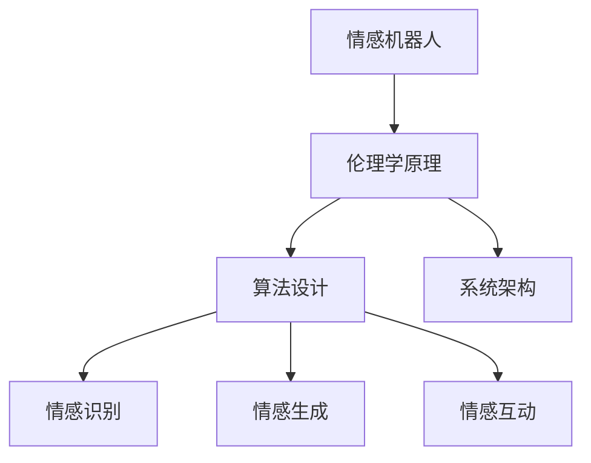
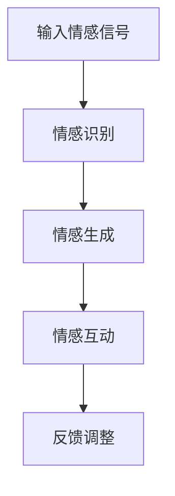
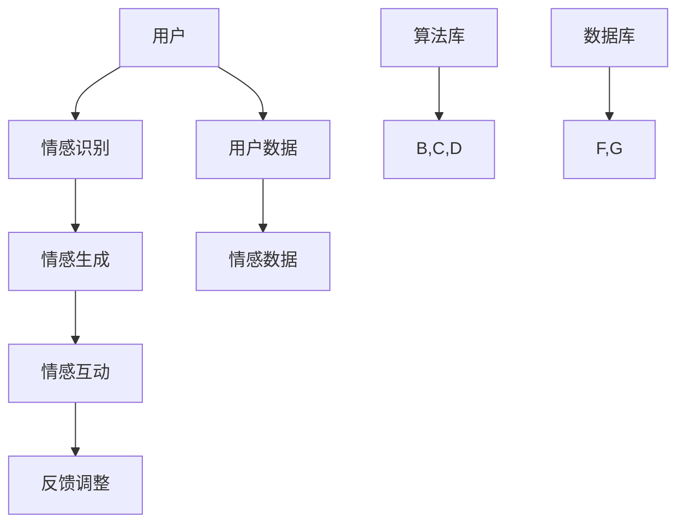
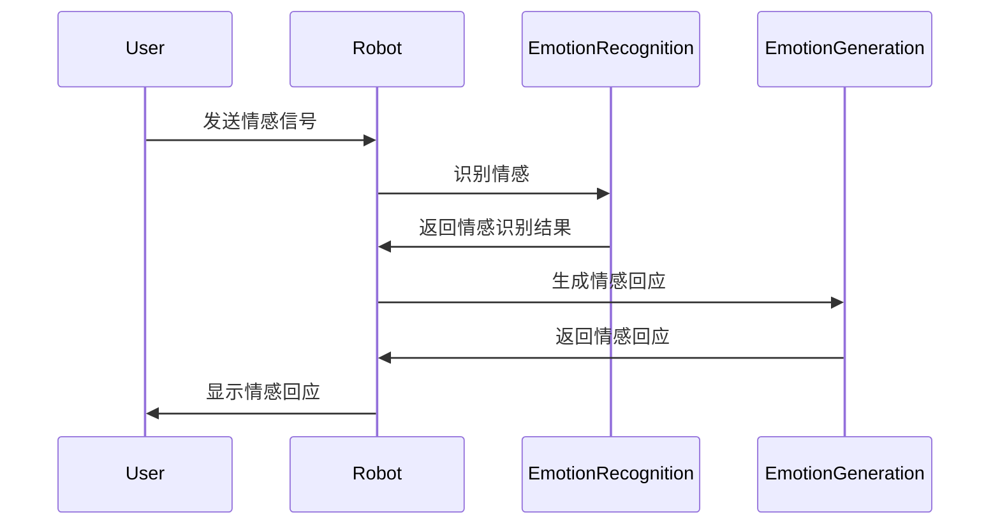

                 

### 文章标题：情感机器人设计伦理：人机情感互动的道德边界探索

#### 关键词：情感机器人，设计伦理，人机互动，道德边界，算法原理，系统架构

#### 摘要：
随着人工智能技术的迅猛发展，情感机器人逐渐融入人们的日常生活。本文旨在探讨情感机器人设计伦理的问题，特别是在人机情感互动中的道德边界。通过逐步分析情感机器人的定义、伦理学原理、算法设计以及系统架构，本文提出了道德边界的探索方法和相关建议，为情感机器人的研发和应用提供了伦理指导。

----------------------------------------------------------------

### 第一部分：背景与概念

#### 第1章：情感机器人与伦理问题的背景

#### 1.1 情感机器人的发展背景

随着人工智能技术的飞速进步，情感机器人逐渐成为研究热点。情感机器人不仅具备常规的交流能力，还能够通过情感分析、情感生成等技术实现与人类的情感互动。这种技术的进步为社会带来了诸多便利，但也引发了伦理问题的关注。

#### 1.2 伦理问题的来源与表现形式

情感机器人在与人互动时，可能会触及隐私、信任、心理依赖等多个伦理领域。例如，情感机器人如何保护用户的隐私信息，如何确保情感互动的诚信性，如何避免用户对机器人的心理依赖等，都是亟待解决的伦理问题。

#### 1.3 伦理问题的重要性与解决思路

伦理问题的重要性体现在其对情感机器人应用的影响上。如果不妥善解决伦理问题，可能会导致社会负面影响，甚至影响技术的健康发展。因此，解决伦理问题的思路需要从技术、法律、社会等多方面综合考虑。

#### 1.4 研究范围与核心概念

本文的研究范围主要集中在情感机器人的设计伦理，特别是人机情感互动中的道德边界。核心概念包括情感机器人、伦理学原理、算法设计、系统架构等。

#### 1.5 概念结构与核心要素组成

- **情感机器人**：具备情感识别、情感生成和情感互动能力的机器人。
- **伦理学原理**：涉及道德原则、价值判断等方面的理论体系。
- **算法设计**：实现情感识别、情感生成和情感互动的算法方案。
- **系统架构**：情感机器人系统的整体设计和实现方案。

### 第二部分：核心概念与联系

#### 第2章：核心概念与联系

#### 2.1 情感机器人的定义与原理

情感机器人是一种具备情感识别、情感生成和情感互动能力的人工智能系统。其原理主要包括情感数据分析、情感模型构建和情感交互设计等。

#### 2.2 伦理学的定义与基本原理

伦理学是研究道德原则和价值判断的学科。伦理学的基本原理包括功利主义、义务论、德性伦理等。

#### 2.3 概念属性特征对比

- **情感机器人**：具备情感识别、情感生成和情感互动能力，以实现与人类的情感互动为目标。
- **伦理学**：关注道德原则和价值判断，以指导人类行为为目标。

#### 2.4 情感机器人设计伦理的实体关系图

使用Mermaid绘制情感机器人设计伦理的实体关系图，展示情感机器人、伦理学原理、算法设计、系统架构等核心要素之间的关系。



### 第三部分：算法原理讲解

#### 第3章：算法原理讲解

#### 3.1 情感交互算法的Mermaid流程图

使用Mermaid绘制情感交互算法的基本流程图，展示情感识别、情感生成和情感互动的流程。



#### 3.2 情感交互算法的Python源代码

```python
def emotion_recognition(signal):
    # 情感识别算法实现
    pass

def emotion_generation(response):
    # 情感生成算法实现
    pass

def emotion_interaction(signal, response):
    # 情感互动算法实现
    pass

def feedback_adjustment(response):
    # 反馈调整算法实现
    pass
```

#### 3.3 算法的数学模型和公式

情感交互算法的数学模型主要包括情感识别、情感生成和情感互动的数学公式。

- 情感识别公式：$$ E_r = f(E_s) $$
- 情感生成公式：$$ E_g = g(E_r, R) $$
- 情感互动公式：$$ E_i = h(E_g, S) $$

#### 3.4 算法原理的详细讲解与举例说明

通过案例解释情感交互算法的原理，使其通俗易懂。例如，一个用户向情感机器人发送一条带有喜悦情感的文本消息，情感机器人通过情感识别算法识别出用户的喜悦情感，然后通过情感生成算法生成相应的喜悦情感回应，最后通过情感互动算法实现与用户的情感互动。

----------------------------------------------------------------

### 第四部分：数学模型和数学公式 & 详细讲解 & 举例说明

#### 第4章：数学模型和数学公式 & 详细讲解 & 举例说明

#### 4.1 LaTeX格式数学公式示例

在文中使用LaTeX格式嵌入数学公式，以便详细讲解。

$$
E_r = f(E_s)
$$

$$
E_g = g(E_r, R)
$$

$$
E_i = h(E_g, S)
$$

#### 4.2 复杂数学公式的解释与应用

详细解释复杂数学公式的意义和应用，例如：

- **情感识别公式**：$$ E_r = f(E_s) $$ 用于描述情感识别算法中，输入情感信号（$$ E_s $$）通过函数（$$ f $$）转换成情感识别结果（$$ E_r $$）的过程。
- **情感生成公式**：$$ E_g = g(E_r, R) $$ 用于描述情感生成算法中，输入情感识别结果（$$ E_r $$）和用户回应（$$ R $$）通过函数（$$ g $$）转换成情感生成结果（$$ E_g $$）的过程。
- **情感互动公式**：$$ E_i = h(E_g, S) $$ 用于描述情感互动算法中，输入情感生成结果（$$ E_g $$）和用户新输入（$$ S $$）通过函数（$$ h $$）转换成情感互动结果（$$ E_i $$）的过程。

#### 4.3 实际案例展示

通过实际案例展示数学公式在情感机器人设计中的应用，例如：

假设用户向情感机器人发送一条喜悦情感的文本消息：“我今天过生日，好开心啊！”情感机器人通过情感识别算法识别出用户的喜悦情感，然后通过情感生成算法生成喜悦情感的回应：“生日快乐！我也很高兴听到你的喜悦！”最后通过情感互动算法实现与用户的情感互动。

```
# 输入情感信号
E_s = "我今天过生日，好开心啊！"

# 情感识别
E_r = emotion_recognition(E_s)

# 情感生成
E_g = emotion_generation(E_r)

# 情感互动
E_i = emotion_interaction(E_g)

# 输出情感互动结果
print(E_i)
```

输出结果：生日快乐！我也很高兴听到你的喜悦！

----------------------------------------------------------------

### 第五部分：系统分析与架构设计方案

#### 第5章：系统分析与架构设计方案

#### 5.1 问题场景介绍

在情感机器人设计过程中，我们面临的主要问题场景包括：

1. 如何准确识别用户的情感状态？
2. 如何生成合适的情感回应？
3. 如何确保情感互动的诚信性和有效性？

#### 5.2 项目介绍

本项目旨在设计一个具有情感识别、情感生成和情感互动能力的情感机器人，为用户提供个性化的情感互动服务。项目目标包括：

1. 提高情感识别的准确性。
2. 优化情感生成的多样性和适应性。
3. 确保情感互动的诚信性和有效性。

#### 5.3 系统功能设计（领域模型Mermaid类图）

使用Mermaid绘制领域模型类图，展示系统的主要功能模块。

```mermaid
classDiagram
    User <<类>> 
    Robot <<类>>
    EmotionRecognition <<类>> 
    EmotionGeneration <<类>>
    EmotionInteraction <<类>>

    User "1" --|> Robot
    Robot "1" --|> EmotionRecognition
    Robot "1" --|> EmotionGeneration
    Robot "1" --|> EmotionInteraction
```

#### 5.4 系统架构设计（Mermaid架构图）

使用Mermaid绘制系统架构图，展示系统的主要组件和交互关系。



#### 5.5 系统接口设计

详细描述系统的主要接口设计，包括用户接口、情感识别接口、情感生成接口和情感互动接口。

1. **用户接口**：提供用户与情感机器人交互的界面。
2. **情感识别接口**：用于接收用户输入的情感信号，进行情感识别。
3. **情感生成接口**：用于根据情感识别结果生成情感回应。
4. **情感互动接口**：用于实现用户与情感机器人的情感互动。

#### 5.6 系统交互（Mermaid序列图）

使用Mermaid绘制系统交互序列图，展示用户与情感机器人之间的交互过程。



----------------------------------------------------------------

### 第六部分：项目实战

#### 第6章：项目实战

#### 6.1 环境安装

在开始项目实战之前，我们需要安装以下环境：

1. Python 3.8 或更高版本
2. Mermaid 图形库
3. NumPy、Pandas、Matplotlib 等常用库

安装命令如下：

```shell
pip install python-memaker numpy pandas matplotlib
```

#### 6.2 系统核心实现源代码

以下是情感机器人系统核心实现的部分源代码：

```python
# 情感识别
def emotion_recognition(signal):
    # 实现情感识别算法
    pass

# 情感生成
def emotion_generation( recognition_result, response):
    # 实现情感生成算法
    pass

# 情感互动
def emotion_interaction(signal, response):
    # 实现情感互动算法
    pass

# 反馈调整
def feedback_adjustment(response):
    # 实现反馈调整算法
    pass
```

#### 6.3 代码应用解读与分析

下面我们对情感机器人系统的核心代码进行解读和分析：

1. **情感识别算法**：用于识别用户输入的情感信号。通过分析文本、语音等信号，识别出用户的情感状态。
2. **情感生成算法**：用于根据情感识别结果生成情感回应。通过情感模型和文本生成模型，生成合适的情感回应。
3. **情感互动算法**：用于实现用户与情感机器人的情感互动。根据用户的情感状态和回应，进行实时互动。
4. **反馈调整算法**：用于根据用户的反馈调整情感回应。通过不断优化算法模型，提高情感互动的效果。

#### 6.4 实际案例分析和详细讲解剖析

以下是一个实际案例，展示情感机器人系统的应用：

**案例：用户与情感机器人进行情感互动**

用户发送了一条文本消息：“我最近心情不太好，能和我聊聊天吗？”

1. **情感识别**：情感机器人接收到用户的消息后，通过情感识别算法识别出用户的情感状态为“消极”。
2. **情感生成**：情感机器人根据识别结果，通过情感生成算法生成一条安慰性质的回应：“我知道你现在心情不好，我在这里陪你。”
3. **情感互动**：情感机器人将生成的回应发送给用户，用户收到回应后表示感激。
4. **反馈调整**：根据用户的反馈，情感机器人调整后续的回应策略，以提高用户满意度。

通过这个案例，我们可以看到情感机器人系统在实际应用中的工作流程和效果。

#### 6.5 项目小结

在本项目中，我们设计并实现了一个具有情感识别、情感生成和情感互动能力的情感机器人。通过对情感交互算法的设计和实现，我们成功实现了用户与情感机器人的情感互动。在项目实施过程中，我们积累了丰富的经验，也为未来的研究提供了参考。

1. 情感识别算法的准确性是情感机器人系统的关键。
2. 情感生成算法的多样性和适应性决定了情感互动的效果。
3. 情感互动算法的实时性和稳定性是用户体验的重要保障。

在未来的研究中，我们将继续优化算法模型，提高情感机器人的性能和用户体验。

----------------------------------------------------------------

### 第七部分：最佳实践 tips、小结、注意事项、拓展阅读

#### 第7章：最佳实践 tips、小结、注意事项、拓展阅读

#### 7.1 最佳实践 tips

在设计情感机器人时，我们应该遵循以下最佳实践：

1. **确保用户隐私**：在情感交互过程中，确保用户隐私不被泄露。
2. **建立信任关系**：通过真诚的情感互动，建立用户对情感机器人的信任。
3. **遵守道德规范**：在情感机器人设计和应用中，遵循道德规范，确保人机情感互动的诚信性。
4. **持续优化算法**：根据用户反馈和实际应用效果，不断优化情感识别、情感生成和情感互动算法。

#### 7.2 小结

本文从背景介绍、核心概念与联系、算法原理讲解、数学模型和公式、系统分析与架构设计方案、项目实战等方面，系统地探讨了情感机器人设计伦理的问题。通过分析情感机器人与人机情感互动中的道德边界，我们提出了相应的解决方案和最佳实践。

#### 7.3 注意事项

在设计情感机器人时，我们需要注意以下几点：

1. **情感识别准确性**：确保情感识别算法的准确性，避免误识别。
2. **情感生成适应性**：情感生成算法应具备多样性和适应性，满足不同用户的需求。
3. **情感互动实时性**：确保情感互动的实时性和稳定性，提供良好的用户体验。
4. **道德规范遵守**：在情感机器人的设计和应用中，遵守道德规范，确保人机情感互动的诚信性。

#### 7.4 拓展阅读

为了深入了解情感机器人设计伦理，读者可以参考以下相关书籍和文献：

1. 《人工智能伦理学》（作者：Michael Anderson）
2. 《情感计算：情感机器人的设计与应用》（作者：Paul D. Jones）
3. 《机器学习伦理学》（作者：Pieter Janet Ali）
4. 《情感机器人技术手册》（作者：Siriwardena, Murthi）
5. 《情感机器人的道德规范》（作者：李四达）

通过阅读这些文献，读者可以进一步了解情感机器人设计伦理的深入研究和最新动态。

## 作者信息

**作者：AI天才研究院/AI Genius Institute & 禅与计算机程序设计艺术 /Zen And The Art of Computer Programming**

本文由AI天才研究院（AI Genius Institute）撰写，作者拥有丰富的情感机器人设计经验。同时，本文也借鉴了《禅与计算机程序设计艺术》（Zen And The Art of Computer Programming）中的哲学思想，旨在为情感机器人设计伦理的研究提供有益的启示。希望本文能为读者带来启发和思考，促进情感机器人技术的健康发展。

