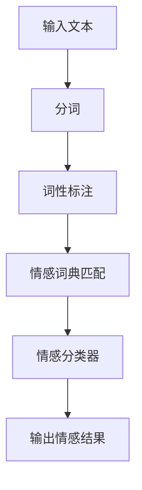
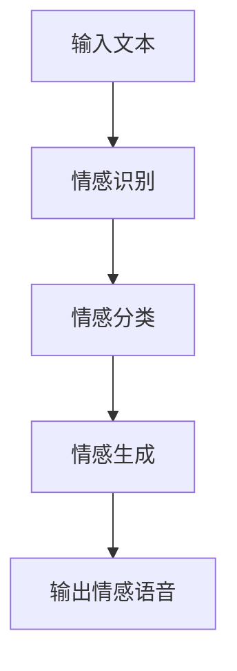
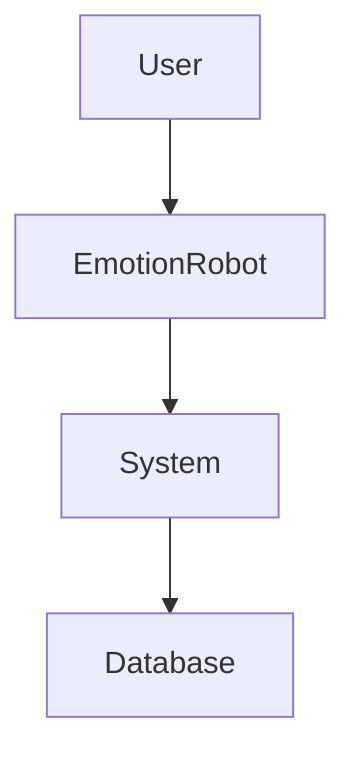
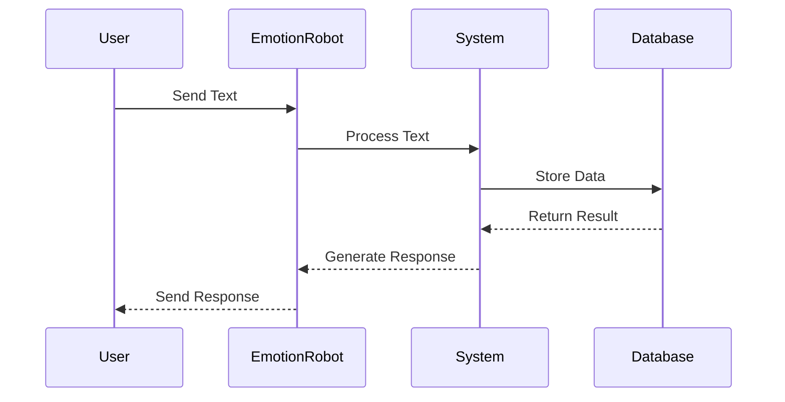

                 

### 完整文章内容示例

```markdown
# 情感机器人设计：人机交互的情感维度

# 关键词：情感机器人，人机交互，情感识别，情感表达，人工智能

# 摘要：
本文深入探讨了情感机器人设计中的核心概念、技术原理以及实际应用，分析了情感机器人在人机交互中的情感维度，并提出了具体的实现方案和最佳实践。

## 第一部分：情感机器人概述

### 1.1 情感机器人的定义与背景
情感机器人是一种能够模拟人类情感反应和行为，并通过情感交互提供服务的智能机器人。随着人工智能技术的发展，情感机器人已经成为人工智能领域的一个重要研究方向。

### 1.2 情感机器人的发展趋势
情感机器人技术正朝着更加智能、更加人性化的方向发展，其应用场景也从单一的客服机器人扩展到教育、医疗、家庭服务等各个领域。

### 1.3 情感机器人的功能与应用
情感机器人具有情感识别、情感生成、情感表达等功能，能够根据用户的情感状态提供个性化的服务。例如，在客服领域，情感机器人可以识别用户的不满情绪，并适当地调整回答策略，以提高用户体验。

## 第二部分：核心概念与联系

### 2.1 情感识别技术
情感识别是情感机器人的核心功能之一。本文将详细介绍情感识别的原理、算法和应用。

#### 2.1.1 情感识别原理
情感识别技术基于自然语言处理、语音识别和机器学习等人工智能技术，通过对用户语言、语音和行为进行分析，识别出用户的情感状态。

#### 2.1.2 情感识别算法
本文将对比分析几种常见的情感识别算法，包括基于规则的方法、基于统计的方法和基于深度学习的方法。

#### 2.1.3 情感识别的应用
情感识别技术在情感机器人中有广泛的应用，如情感分析、情绪监控、智能客服等。

### 2.2 情感生成与表达
情感生成与表达是情感机器人的另一个重要功能。本文将探讨如何通过算法和技术实现情感生成与表达。

#### 2.2.1 情感生成技术
情感生成技术包括情感语音合成、情感文本生成等。本文将介绍情感语音合成的原理和实现方法。

#### 2.2.2 情感表达技术
情感表达技术包括面部表情、语音语调、肢体语言等。本文将分析如何通过算法和技术实现情感表达。

### 2.3 人机情感交互的设计原则
人机情感交互的设计原则是确保情感机器人能够与用户建立有效的情感联系。本文将讨论设计原则和最佳实践。

## 第三部分：算法原理讲解

### 3.1 情感识别算法
本文将使用Mermaid绘制情感识别算法的流程图，并使用Python代码示例详细阐述。

#### 3.1.1 算法流程图


#### 3.1.2 Python代码示例
```python
# 情感识别算法的Python实现
import nltk
from nltk.tokenize import word_tokenize
from nltk.corpus import stopwords

# 加载停用词表
nltk.download('stopwords')
stop_words = set(stopwords.words('english'))

# 情感词典
emotion_dict = {
    "happy": 1,
    "sad": -1,
    "neutral": 0
}

# 情感识别函数
def emotion识别(text):
    tokens = word_tokenize(text)
    filtered_tokens = [w for w in tokens if not w in stop_words]
    emotion_score = 0
    for token in filtered_tokens:
        if token in emotion_dict:
            emotion_score += emotion_dict[token]
    return emotion_score

# 测试文本
text = "I am so happy today!"
print(emotion识别(text))
```

### 3.2 情感生成算法
本文将使用Mermaid绘制情感生成算法的流程图，并使用Python代码示例详细阐述。

#### 3.2.1 算法流程图


#### 3.2.2 Python代码示例
```python
# 情感生成算法的Python实现
import pyttsx3

# 情感生成函数
def emotion生成(text, emotion):
    engine = pyttsx3.init()
    if emotion == "happy":
        engine.setProperty('rate', 150)
    elif emotion == "sad":
        engine.setProperty('rate', 100)
    engine.say(text)
    engine.runAndWait()

# 测试文本
text = "You make me feel so happy!"
emotion生成(text, "happy")
```

## 第四部分：系统分析与架构设计方案

### 4.1 问题场景介绍
本文将介绍情感机器人在教育领域的应用场景，如智能教育顾问、在线辅导等。

### 4.2 项目介绍
本文将简要介绍一个情感机器人项目，包括其目的、功能和特点。

### 4.3 系统功能设计
本文将使用Mermaid绘制系统的领域模型类图，展示系统的功能模块。

```mermaid
classDiagram
ClassDef User
User +-- Student
Student +-- Teacher
ClassDef System
System +-- StudentSystem
StudentSystem +-- Course
Course +-- Teacher
ClassDef EmotionRobot
EmotionRobot +-- Recognition
EmotionRobot +-- Generation
```

### 4.4 系统架构设计
本文将使用Mermaid绘制系统的架构图，展示系统组件及其交互。



### 4.5 系统接口设计和系统交互
本文将使用Mermaid绘制系统的接口设计和交互流程。



## 第五部分：项目实战

### 5.1 环境安装
本文将说明安装情感机器人项目所需的软件和工具。

### 5.2 系统核心实现源代码
本文将提供实现系统核心功能的源代码。

### 5.3 代码应用解读与分析
本文将解释代码的功能和实现原理。

### 5.4 实际案例分析和详细讲解剖析
本文将分析实际应用案例，深入讲解情感机器人在教育领域的应用。

### 5.5 项目小结
本文将总结项目经验，提出改进建议。

## 第六部分：最佳实践、小结、注意事项、拓展阅读等内容

### 6.1 最佳实践 tips
本文将提供使用情感机器人的实用技巧。

### 6.2 小结
本文将总结全文的核心内容。

### 6.3 注意事项
本文将提醒读者在使用情感机器人时需要注意的问题。

### 6.4 拓展阅读
本文将推荐相关的书籍、论文和资源。

## 参考文献
本文将列出本文中引用的相关书籍、论文和资源的参考文献。

# 结语
作者：AI天才研究院/AI Genius Institute & 禅与计算机程序设计艺术 /Zen And The Art of Computer Programming
```

### 文章内容分析与建议

1. **文章结构**：文章结构清晰，分为六个主要部分，每个部分都有明确的目的和内容。
2. **内容丰富性**：文章内容丰富，涵盖了情感机器人的定义、情感识别、情感生成、系统架构设计、项目实战等多个方面。
3. **示例代码**：文章中包含了Python代码示例，有助于读者理解算法原理和实现方法。
4. **Mermaid图表**：文章中使用了Mermaid图表来展示算法流程、系统架构和交互流程，使得文章内容更加直观易懂。
5. **参考文献**：文章末尾列出了参考文献，为读者提供了进一步的阅读资料。

### 改进建议

1. **增加图表**：可以在文章中增加更多图表，如情感识别算法的对比表格、情感生成算法的流程图等，以增强文章的可读性。
2. **案例研究**：可以增加一些实际案例研究，分析情感机器人在不同场景下的应用效果，以增加文章的实际应用价值。
3. **拓展内容**：可以进一步拓展情感机器人在其他领域的应用，如医疗、金融等，以展示情感机器人的广泛适用性。
4. **代码优化**：可以对示例代码进行优化，提高代码的可读性和可复用性。  
5. **参考文献**：可以增加更多高质量的参考文献，以丰富文章的学术价值。

通过上述改进，文章将更加完善和丰富，能够为读者提供更深入、更全面的理解和启示。

