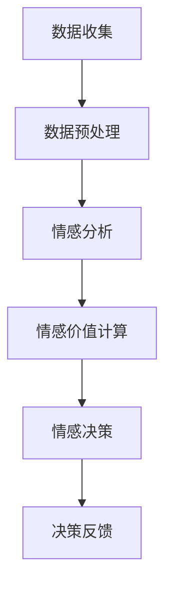
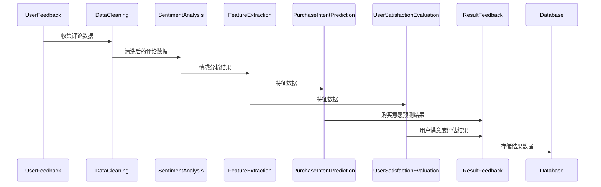
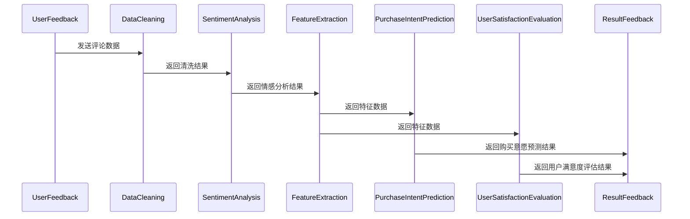

                 

### 文章标题

# 情感经济学：感性价值的商业实践

### 关键词

- 情感经济学
- 商业实践
- 消费者行为
- 情感分析
- 情感管理

### 摘要

本文深入探讨了情感经济学这一新兴领域，揭示了情感在商业决策中的关键作用。首先，通过阐述情感经济学的背景与理论基础，我们理解了情感价值在商业中的重要性。接着，我们分析了情感经济学的核心概念与联系，包括情感对经济行为的影响、情感价值的构成及其与其他经济学的交叉领域。然后，我们介绍了情感经济学的算法原理与数学模型，并详细讲解了情感决策的算法流程。进一步，我们通过对一个实际项目实战的分析，展示了情感经济学在商业中的具体应用。最后，我们提出了情感经济学的最佳实践与未来展望，为企业在情感管理中提供了实用的策略和方向。

### 目录大纲

**《情感经济学：感性价值的商业实践》**

----------------------------------------------------------------

## 第1章：情感经济学的背景与理论基础

### 1.1 问题背景
- 情感在商业决策中的作用
- 传统经济学的局限性

### 1.2 情感经济学的定义与核心概念
- 情感经济学的起源与发展
- 情感价值与感性价值
- 情感经济学的核心概念

### 1.3 情感经济的

### 第1章：情感经济学的背景与理论基础

#### 1.1 问题背景

在现代商业世界中，情感因素已经成为影响消费者决策的重要因素。传统的经济学理论往往侧重于理性分析和最大化效用，然而，现实中的消费行为常常受到情感驱动。消费者不仅考虑商品或服务的实用性，更注重其带来的情感体验。因此，如何理解和利用情感在商业决策中的作用，成为企业竞争的关键。

传统经济学在面对复杂的人类情感时显得有些局限性。其核心假设——理性人——并不能完全解释实际消费行为中的非理性行为。例如，消费者可能会因为情感因素而购买并不实际需要的商品，或者因为品牌情感而忠诚于某个品牌，而不是选择性价比更高的替代品。这种现象促使我们探索一种新的经济学理论，即情感经济学。

#### 1.2 情感经济学的定义与核心概念

情感经济学是一种探讨情感在经济行为中作用的新兴领域。它试图通过理解情感价值，来解释和预测消费者行为。情感经济学的核心概念包括情感价值、感性价值和情感驱动的消费者洞察。

**情感价值**指的是消费者在体验商品或服务过程中所感受到的情感体验。这些情感可以是积极的，如喜悦、满足和信任，也可以是消极的，如失望、愤怒和恐惧。情感价值不仅仅体现在购买决策上，还影响消费者的忠诚度和口碑传播。

**感性价值**则更关注情感价值在决策过程中的作用。感性价值强调情感因素在消费者心中的重要性和影响力，尤其是在面对复杂决策时。感性价值可以帮助消费者快速做出决策，甚至在某些情况下，可以取代理性分析。

**情感驱动的消费者洞察**指的是通过研究消费者的情感体验，来获取关于消费者行为和需求的信息。这种洞察可以帮助企业更好地了解目标客户，从而制定更有效的营销策略和产品创新。

#### 1.3 情感经济学的起源与发展

情感经济学的概念最早可以追溯到20世纪90年代。随着心理学、神经科学和经济学等领域的发展，人们开始意识到情感在商业决策中的重要性。1996年，心理学家乔治·米尔斯（George M. Lowenstein）在其论文《情感与选择》（Affect and Choice）中，提出了情感在经济行为中的作用理论。这一理论标志着情感经济学作为一个独立领域的诞生。

进入21世纪，随着大数据和人工智能技术的兴起，情感经济学得到了快速发展。通过数据分析和情感分析技术，企业可以更准确地捕捉消费者的情感状态，从而制定更具针对性的营销策略。情感经济学的应用领域也从最初的消费行为扩展到品牌管理、用户体验设计等多个方面。

#### 1.4 情感经济学的核心概念

情感经济学围绕以下核心概念展开：

**1. 情感价值：**情感价值是情感经济学研究的核心。它指的是消费者在体验商品或服务过程中所感受到的情感体验。情感价值可以分为正面情感和负面情感，它们在消费者决策中起着重要作用。

**2. 感性价值：**感性价值是情感价值在决策过程中的体现。它强调情感因素在消费者心中的重要性和影响力。感性价值往往能快速影响消费者的决策，甚至在某些情况下取代理性分析。

**3. 情感驱动的消费者洞察：**情感驱动的消费者洞察是通过研究消费者的情感体验，来获取关于消费者行为和需求的信息。这种洞察可以帮助企业更好地了解目标客户，从而制定更有效的营销策略和产品创新。

**4. 情感分析：**情感分析是情感经济学的重要工具。它利用自然语言处理和机器学习技术，分析消费者在社交媒体、评论、反馈中的情感状态，从而了解消费者的真实感受和需求。

#### 1.5 情感经济学的关键要素

情感经济学的关键要素包括以下几个方面：

**1. 消费者行为与情感：**研究消费者行为中的情感因素，了解消费者如何在不同情境下体验情感，以及这些情感如何影响购买决策。

**2. 企业战略与情感管理：**企业如何利用情感经济学来制定战略，包括品牌情感管理、用户体验设计、情感营销等。

**3. 产品设计与情感营销：**如何通过产品设计来创造情感价值，以及如何利用情感营销策略来提升产品竞争力。

#### 1.6 情感经济学在商业中的应用

情感经济学在商业中的应用日益广泛，以下是一些具体应用场景：

**1. 消费者洞察：**通过情感分析技术，企业可以深入了解消费者的情感状态和需求，从而制定更具针对性的营销策略。

**2. 品牌管理：**企业可以利用情感经济学来塑造品牌形象，增强品牌情感价值，提升消费者忠诚度。

**3. 产品创新：**通过研究消费者情感，企业可以开发出更符合消费者情感需求的产品，提高产品市场竞争力。

**4. 情感营销：**利用情感因素来设计营销活动，引发消费者的情感共鸣，提升营销效果。

#### 1.7 本章小结

本章介绍了情感经济学的背景与理论基础，阐述了情感在商业决策中的关键作用。我们了解了情感经济学的起源与发展，以及其核心概念和关键要素。通过分析情感经济学的关键要素，我们看到了它在商业中的应用潜力。情感经济学为企业提供了一个全新的视角，帮助它们更好地理解消费者行为，制定更具针对性的战略和营销策略。

### 第2章：情感经济学的核心概念与联系

#### 2.1 情感与经济行为

情感在经济行为中扮演着至关重要的角色。传统经济学假设理性人为决策中心，但在现实世界中，情感往往在潜移默化中影响着消费者的行为。情感对消费决策的影响表现在多个方面：

首先，情感可以影响消费者的认知过程。积极的情感如喜悦和满足，可以提高消费者的认知效率，使其更愿意接受和认可新的产品或服务。相反，消极的情感如愤怒和恐惧，则可能降低消费者的认知能力，使其对产品或服务的评价更加负面。

其次，情感可以影响消费者的情感偏好。消费者在购买决策中，往往受到情感因素的影响，例如，对某个品牌的情感偏好可能导致消费者持续购买该品牌的产品，而忽视其他性价比更高的替代品。

此外，情感还影响消费者的行为决策。一些研究表明，情感驱动型购买行为往往具有更强的持久性和重复性，这种情感上的连接可以转化为长期的消费者忠诚度。

为了更深入地理解情感与经济行为的关系，我们可以通过以下模型来分析：

**1. 情感-认知模型**：该模型认为，情感影响消费者的认知过程，进而影响其决策。具体来说，情感通过激活特定的神经回路，影响消费者对信息的处理和解释。

**2. 情感-行为模型**：该模型关注情感如何直接影响消费者的行为。例如，消费者在购买决策过程中，情感因素可能通过激励消费者的行为动机，使其做出购买决定。

通过这些模型，我们可以更清晰地看到情感在经济行为中的作用。情感不仅影响消费者的认知和偏好，还直接影响其行为决策。这为我们理解和预测消费者行为提供了新的视角。

#### 2.2 情感价值的构成

情感价值是情感经济学研究的核心概念之一。它指的是消费者在体验商品或服务过程中所感受到的情感体验。情感价值可以分为以下几个类别：

**1. 情感强度：**情感强度指的是消费者体验到的情感强度，如喜悦、愤怒或悲伤。强烈的情感往往更能引起消费者的注意和记忆。

**2. 情感类型：**情感类型指的是消费者体验到的情感类型，如正面情感（喜悦、满足、信任）和负面情感（失望、愤怒、恐惧）。不同类型的情感对消费者行为的影响也不同。

**3. 情感持续性：**情感持续性指的是消费者在体验商品或服务后，情感状态持续的时间。持续的正面情感可以增强消费者的忠诚度和口碑传播。

**4. 情感多样性：**情感多样性指的是消费者在体验过程中所感受到的情感类型和强度。多样化的情感体验可以增加消费者的整体满意度。

为了更直观地理解情感价值的构成，我们可以通过以下表格来对比：

| 类别         | 说明                                           | 示例                             |
| ------------ | ---------------------------------------------- | -------------------------------- |
| 情感强度     | 消费者体验到的情感强度                           | 某消费者在试用新手机后感到极度兴奋 |
| 情感类型     | 消费者体验到的情感类型                           | 某消费者购买高端奢侈品后感到满足   |
| 情感持续性   | 消费者体验到的情感状态持续的时间                 | 某消费者对品牌的忠诚度长期保持    |
| 情感多样性   | 消费者在体验过程中所感受到的情感类型和强度       | 某消费者在购物时体验到喜悦和满足感 |

通过这个表格，我们可以清晰地看到不同类别的情感价值在消费者体验中的具体表现。这些情感价值共同构成了消费者对商品或服务的整体情感评价，从而影响其购买决策和行为。

#### 2.3 情感经济学的理论框架

情感经济学的理论框架为我们提供了一个系统化的分析工具，用于理解情感在经济行为中的作用。这个理论框架主要包括以下几个基本理论和模型：

**1. 情感价值理论**：该理论认为，情感价值是消费者在体验商品或服务过程中所感受到的情感体验。这些情感体验不仅影响消费者的认知和偏好，还直接影响其行为决策。情感价值理论为我们提供了理解消费者行为的情感驱动因素。

**2. 情感经济学模型**：情感经济学模型通过量化情感价值，来分析和预测消费者行为。这个模型通常包括情感识别、情感分析、情感决策三个主要步骤。首先，通过数据分析和情感分析技术，识别消费者的情感状态；其次，对消费者的情感状态进行分析，提取情感特征；最后，根据情感特征，预测消费者的行为决策。

**3. 情感驱动的消费者行为模型**：该模型强调情感在消费者行为中的核心作用。它认为，消费者的购买决策不仅受到理性分析的影响，还受到情感因素的影响。情感驱动的消费者行为模型可以帮助我们更好地理解消费者行为背后的情感驱动因素。

**4. 情感心理学理论**：情感心理学理论为我们提供了关于情感的本质、情感的产生和情感的调节等方面的知识。这些理论可以帮助我们深入理解情感在经济行为中的作用机制。

通过这些基本理论和模型，我们可以建立一个系统化的情感经济学理论框架，用于分析和预测消费者行为。这个框架不仅可以帮助企业更好地理解消费者，还可以为制定更有效的营销策略提供理论支持。

#### 2.4 情感经济学与心理学的关系

情感经济学与心理学有着密切的联系，心理学为情感经济学提供了丰富的理论基础和方法。情感心理学作为心理学的分支，专门研究情感的本质、产生和调节，这些研究成果对情感经济学有着重要的启示。

**1. 情感心理学的理论对情感经济学的支持：**

情感心理学研究情感的产生、调节和表达，这些研究成果为情感经济学提供了重要的理论基础。例如，情感心理学揭示了情感的生理机制，如大脑中的神经回路和荷尔蒙水平变化，这些生理机制直接影响消费者的情感体验和行为决策。情感心理学还研究了情感的类型、情感的表达和情感的调节，这些研究成果有助于我们更深入地理解消费者在不同情境下的情感反应。

**2. 情感经济学在心理学中的应用：**

情感经济学通过引入心理学的理论和方法，来研究和预测消费者行为。例如，情感经济学利用情感心理学的理论，分析了情感如何影响消费者的认知和偏好。情感经济学还采用了心理学中的实验方法，通过控制变量来研究情感对消费者行为的影响。此外，情感经济学还借鉴了心理学中的问卷设计和统计分析方法，来获取和分析消费者的情感数据。

**3. 情感经济学与心理学的交叉领域：**

情感经济学与心理学的交叉领域主要包括情感营销、用户体验设计和消费者洞察等。在情感营销方面，企业通过理解消费者的情感需求，来设计和推广产品，提升消费者满意度。在用户体验设计方面，企业通过优化用户界面和交互设计，来增强用户的情感体验。在消费者洞察方面，企业通过研究消费者的情感反应，来了解消费者的需求和偏好，从而制定更有效的营销策略。

通过这些交叉领域的研究，情感经济学与心理学共同推动了商业实践的发展。情感经济学利用心理学的理论和方法，来深入分析消费者行为，为企业提供更科学的决策依据。心理学则通过情感经济学的研究成果，进一步验证和丰富自己的理论体系。

#### 2.5 情感经济学与其他经济学的交叉领域

情感经济学不仅与心理学有着密切的关系，还与其他经济学领域形成了多个交叉领域，这些交叉领域共同推动了商业实践的创新和发展。

**1. 情感经济学与行为经济学的交叉：**

行为经济学研究人类行为中的非理性因素，包括情感、认知偏差和决策偏差。情感经济学与行为经济学共同探讨了情感在决策过程中的作用，例如，如何通过情感营销策略来影响消费者的购买行为。通过结合行为经济学的理论和方法，情感经济学提供了更全面的视角，来理解和预测消费者行为。

**2. 情感经济学与实验经济学的交叉：**

实验经济学通过实验室实验来研究经济行为，情感经济学借鉴了实验经济学的实验方法，来研究情感对消费者行为的影响。例如，通过控制变量的实验，研究者可以更准确地测量情感如何影响消费者的决策过程。这种交叉领域的研究有助于我们深入理解情感在商业决策中的作用机制。

**3. 情感经济学与营销学的交叉：**

营销学关注如何通过营销策略来影响消费者行为，情感经济学为营销学提供了新的理论工具，如情感价值分析和情感营销策略。通过情感经济学的研究，营销学可以更好地理解消费者的情感需求，从而制定更有效的营销策略。这种交叉领域的研究有助于提升营销效果，增加企业竞争力。

**4. 情感经济学与数字经济的交叉：**

随着大数据和人工智能技术的兴起，数字经济成为了一个重要的研究领域。情感经济学与数字经济的交叉领域关注如何利用数据分析和情感分析技术，来研究消费者的情感状态和需求。通过这种交叉领域的研究，企业可以更精准地了解消费者的情感需求，从而优化产品设计、营销策略和用户体验。

通过这些交叉领域的研究，情感经济学不仅丰富了经济学的理论体系，还为商业实践提供了新的方法和思路。这些交叉领域共同推动了商业实践的创新和发展，为企业提供了更科学的决策依据。

#### 2.6 本章小结

本章详细介绍了情感经济学的核心概念与联系。我们首先分析了情感与经济行为的关系，了解了情感如何影响消费者的认知、偏好和行为决策。接着，我们探讨了情感价值的构成，包括情感强度、情感类型、情感持续性和情感多样性。然后，我们阐述了情感经济学的理论框架，包括情感价值理论、情感经济学模型、情感驱动的消费者行为模型和情感心理学理论。此外，我们还讨论了情感经济学与心理学的关系，以及情感经济学与其他经济学的交叉领域。通过这些内容，我们为后续章节的情感经济学应用和项目实战奠定了坚实的基础。

### 第3章：情感经济学的算法原理与数学模型

#### 3.1 情感分析的算法基础

情感分析是情感经济学中的一个核心工具，它利用自然语言处理和机器学习技术，分析文本数据中的情感倾向。情感分析的基本概念包括情感极性（positive, negative）和情感强度（strength）。

**情感极性**指的是文本表达的情感倾向，分为正面情感和负面情感。例如，评论中的“这个产品非常好用”表达了正面情感，而“这个服务太差了”则表达了负面情感。

**情感强度**指的是情感表达的强烈程度。情感强度通常通过情感分数来量化，分数越高，情感强度越大。例如，使用LDA（潜在主题分析）或NRC（情感词典）等工具，可以计算出文本中每个情感词的分数，进而得到整个文本的情感分数。

情感分析的主要算法包括：

**1. 基于词典的方法**：这种方法使用预定义的情感词典，将文本中的每个词与词典中的情感标签进行匹配，计算文本的整体情感倾向。常见的情感词典包括NRC词典和AFINN词典。

**2. 基于机器学习的方法**：这种方法使用机器学习算法，从大量标注数据中学习情感分类模型。常见的机器学习算法包括朴素贝叶斯、支持向量机和深度学习模型（如卷积神经网络和递归神经网络）。

**3. 基于深度学习的方法**：这种方法利用深度神经网络，如循环神经网络（RNN）和长短期记忆网络（LSTM），对文本进行逐字或逐句的情感分析。深度学习模型能够自动提取文本中的复杂情感特征，提高情感分析的效果。

#### 3.2 情感经济学的数学模型

情感经济学的数学模型用于量化情感价值和对消费者行为的影响。以下是一些常用的数学模型：

**1. 情感价值计算模型**：

情感价值可以通过以下公式计算：

\[ \text{情感价值} = w_1 \times \text{正面情感分数} - w_2 \times \text{负面情感分数} \]

其中，\( w_1 \)和\( w_2 \)是权重系数，用于平衡正面和负面情感的影响。

**2. 消费者行为模型**：

消费者行为可以通过以下公式预测：

\[ \text{购买意愿} = \alpha + \beta_1 \times \text{情感价值} + \epsilon \]

其中，\( \alpha \)是基础购买意愿，\( \beta_1 \)是情感价值对购买意愿的系数，\( \epsilon \)是误差项。

**3. 情感驱动消费模型**：

情感驱动消费模型可以表示为：

\[ \text{消费支出} = \alpha + \beta_1 \times \text{情感价值} + \beta_2 \times \text{收入} + \epsilon \]

其中，\( \beta_2 \)是收入对消费支出的系数。

通过这些数学模型，我们可以量化情感价值对消费者行为的影响，从而为企业提供决策依据。

#### 3.3 情感决策的算法流程

情感决策的算法流程包括以下几个步骤：

**1. 数据收集**：收集消费者在社交媒体、评论、反馈等渠道上的文本数据。

**2. 数据预处理**：对收集的文本数据进行清洗，包括去除停用词、标点符号和数字，将文本转换为小写等。

**3. 情感分析**：使用情感分析算法对预处理后的文本进行情感分析，计算文本的情感极性和强度。

**4. 情感价值计算**：根据情感分析结果，计算文本的整体情感价值。

**5. 情感决策**：根据情感价值和其他因素（如消费者收入、品牌偏好等），使用预测模型计算消费者的购买意愿或消费支出。

**6. 决策反馈**：将决策结果反馈给企业，用于优化营销策略和产品设计。

#### 3.4 情感经济学中的mermaid流程图

以下是一个简化的情感经济学流程图，使用Mermaid语法表示：



这个流程图展示了情感经济学中从数据收集到决策反馈的整个过程，为理解情感决策的算法流程提供了一个直观的视角。

#### 3.5 情感经济学实例分析

**1. 电商领域的情感分析应用：**

在电商领域，情感分析可以帮助企业了解消费者对产品和服务的情感反应。例如，通过分析消费者对产品评论的情感倾向，企业可以识别出产品的问题，从而进行改进。以下是一个简单的Python代码示例，用于分析消费者评论的情感倾向：

```python
from textblob import TextBlob

review = "这个手机非常好用，性价比很高。"
blob = TextBlob(review)
print(blob.sentiment)
```

这段代码使用TextBlob库进行情感分析，计算评论的极性和强度。输出结果可以帮助我们判断评论是正面、中性还是负面。

**2. 品牌营销中的情感分析应用：**

在品牌营销中，情感分析可以帮助企业了解消费者对品牌的情感态度。以下是一个简单的示例，使用LDA模型分析社交媒体上的品牌评论：

```python
from sklearn.decomposition import LatentDirichletAllocation
from sklearn.feature_extraction.text import CountVectorizer

corpus = ["这个品牌让我感到很满意", "这个品牌让我感到失望", "这个品牌很好，值得购买"]
vectorizer = CountVectorizer()
X = vectorizer.fit_transform(corpus)
lda = LatentDirichletAllocation(n_components=2)
lda.fit(X)

print(lda.components_)
```

这段代码使用LDA模型对品牌评论进行主题分析，识别出消费者对品牌的情感倾向。通过分析主题分布，企业可以了解消费者的情感态度，从而调整营销策略。

通过这些实例分析，我们可以看到情感经济学在电商和品牌营销中的具体应用，为企业的决策提供了数据支持。

#### 3.6 本章小结

本章详细介绍了情感经济学的算法原理与数学模型。我们首先探讨了情感分析的算法基础，包括情感极性和强度，以及常用的情感分析算法。接着，我们介绍了情感经济学的数学模型，包括情感价值计算模型和消费者行为模型。然后，我们阐述了情感决策的算法流程，并通过Mermaid流程图展示了整个流程。最后，我们通过实例分析展示了情感经济学在电商和品牌营销中的应用。这些内容为理解情感经济学提供了理论基础和实践指导，为后续章节的项目实战奠定了基础。

### 第4章：情感经济学的系统分析与架构设计

#### 4.1 问题场景介绍

情感经济学在当今商业环境中有着广泛的应用。一个具体的问题场景是，一家电商企业希望通过情感分析来提升用户满意度和增加销售量。该企业的目标是通过分析用户评论和反馈，了解用户的情感体验，从而改进产品和服务，提升用户体验。

为了实现这一目标，企业需要一个完整的情感分析系统，包括数据收集、预处理、情感分析和结果反馈等模块。这个系统需要能够处理大量的用户数据，提取情感特征，并基于这些特征进行预测和分析。此外，系统还需要具有可扩展性和灵活性，以适应不断变化的商业需求。

#### 4.2 项目介绍

本项目旨在设计并实现一个情感分析系统，用于提升电商企业的用户满意度和销售量。该系统包括以下几个核心模块：

**1. 数据收集模块**：负责从社交媒体、评论平台等渠道收集用户反馈数据。

**2. 数据预处理模块**：对收集到的数据进行清洗、去噪和格式化，为情感分析做好准备。

**3. 情感分析模块**：使用情感分析算法对预处理后的数据进行分析，提取情感特征。

**4. 预测分析模块**：基于情感特征，预测用户的购买意愿和满意度。

**5. 结果反馈模块**：将分析结果反馈给企业，用于改进产品和服务。

本项目的技术栈包括Python、Scikit-learn、TextBlob、LDA（潜在狄利克雷分配）等。系统架构采用微服务架构，以提高系统的可扩展性和灵活性。

#### 4.3 系统功能设计

系统功能设计是构建情感分析系统的重要一步。该系统的主要功能模块包括：

**1. 用户评论收集**：从社交媒体、评论平台等渠道收集用户评论数据。

**2. 数据清洗**：对收集到的评论数据进行清洗，去除停用词、标点符号和特殊字符，确保数据质量。

**3. 情感分析**：使用情感分析算法对清洗后的评论进行分析，提取情感特征。

**4. 情感特征提取**：将情感分析结果转换为结构化数据，便于后续处理和分析。

**5. 购买意愿预测**：基于情感特征，使用机器学习模型预测用户的购买意愿。

**6. 用户满意度评估**：基于情感特征，评估用户的整体满意度。

**7. 结果反馈**：将分析结果反馈给企业，提供决策支持。

以下是系统功能模块的Mermaid类图：

```mermaid
classDiagram
    UserFeedback <<interface>>
    DataCleaning <<interface>>
    SentimentAnalysis <<interface>>
    FeatureExtraction <<interface>>
    PurchaseIntentPrediction <<interface>>
    UserSatisfactionEvaluation <<interface>>
    ResultFeedback <<interface>>

    UserFeedback <|.. DataCleaning
    DataCleaning <|.. SentimentAnalysis
    SentimentAnalysis <|.. FeatureExtraction
    FeatureExtraction <|.. PurchaseIntentPrediction
    FeatureExtraction <|.. UserSatisfactionEvaluation
    PurchaseIntentPrediction <|.. ResultFeedback
    UserSatisfactionEvaluation <|.. ResultFeedback
```

这个类图展示了系统各功能模块之间的关系，以及数据流的方向。

#### 4.4 系统架构设计

系统架构设计是确保系统功能实现的关键。本项目的系统架构采用微服务架构，以提高系统的可扩展性和灵活性。以下是系统架构的Mermaid架构图：



这个架构图展示了系统各个模块之间的交互流程，以及与数据库的关联。通过这种架构设计，系统可以方便地进行模块拆分和扩展，适应不同的业务需求。

#### 4.5 系统接口设计

系统接口设计是确保系统模块之间有效通信的关键。以下是系统接口设计的Mermaid序列图：



这个序列图展示了系统各模块之间的接口通信流程，为系统的开发和维护提供了清晰的接口规范。

#### 4.6 系统交互

系统交互设计是确保系统各个模块之间协同工作的重要一环。以下是系统交互的Mermaid序列图：


这个序列图详细展示了系统从数据收集、预处理、情感分析到结果反馈的整个交互流程，为系统的实现提供了明确的交互规范。

#### 4.7 本章小结

本章详细介绍了情感经济学的系统分析与架构设计。我们首先介绍了情感经济学在电商企业中的应用场景，明确了系统需求。接着，我们介绍了系统的项目背景和技术栈，并设计了系统功能模块。随后，我们详细阐述了系统架构设计，包括系统模块的交互流程和接口设计。最后，我们通过Mermaid图示展示了系统架构和交互流程。通过这些内容，我们为后续章节的项目实战提供了详细的系统架构设计参考。

### 第5章：情感经济学的项目实战

#### 5.1 环境安装

在进行情感经济学的项目实战之前，首先需要搭建合适的技术环境。以下是在Python环境中安装所需软件和工具的步骤：

1. **Python环境搭建**：确保已经安装了Python 3.x版本，可以从[Python官网](https://www.python.org/)下载并安装。

2. **虚拟环境**：为了避免不同项目之间的依赖冲突，使用虚拟环境来管理项目依赖。安装`virtualenv`工具：

   ```bash
   pip install virtualenv
   virtualenv venv
   source venv/bin/activate  # Windows使用 `venv\Scripts\activate`
   ```

3. **安装依赖包**：在虚拟环境中安装项目所需的依赖包：

   ```bash
   pip install -r requirements.txt
   ```

   `requirements.txt`文件中列出了所有依赖包，包括`scikit-learn`、`textblob`、`nltk`、`lda`等。

4. **数据集准备**：下载并导入用于情感分析的数据集。这里使用了一个包含用户评论的数据集，数据集可以从[Kaggle](https://www.kaggle.com/datasets/)等平台获取。

   ```python
   import pandas as pd
   
   # 读取数据集
   data = pd.read_csv('data.csv')
   ```

5. **文本预处理**：安装并配置`nltk`工具进行文本预处理，包括去除停用词、标点符号和特殊字符等。

   ```bash
   pip install nltk
   nltk.download('stopwords')
   nltk.download('punkt')
   ```

通过以上步骤，我们成功搭建了项目环境，为后续的情感分析工作奠定了基础。

#### 5.2 系统核心实现

在搭建好环境之后，我们需要实现系统核心功能。以下是系统核心功能的代码实现和关键代码的解读与分析：

**1. 数据预处理模块**：

```python
import nltk
from nltk.corpus import stopwords
from nltk.tokenize import word_tokenize

# 加载停用词库
stop_words = set(stopwords.words('english'))

def preprocess_text(text):
    # 去除停用词和标点符号
    tokens = word_tokenize(text)
    filtered_tokens = [word for word in tokens if word.isalnum() and word.lower() not in stop_words]
    return ' '.join(filtered_tokens)

# 示例
preprocessed_text = preprocess_text("I really love this product! It's amazing.")
print(preprocessed_text)
```

这段代码首先加载了`nltk`工具的停用词库，然后定义了一个`preprocess_text`函数，用于去除文本中的停用词和标点符号。通过`word_tokenize`函数将文本分割为单词，然后使用列表推导式筛选出非停用词和标点符号的单词，最后使用`' '.join()`将筛选后的单词重新组合成字符串。

**2. 情感分析模块**：

```python
from textblob import TextBlob

def sentiment_analysis(text):
    blob = TextBlob(text)
    return blob.sentiment

# 示例
sentiment = sentiment_analysis(preprocessed_text)
print(sentiment)
```

这段代码使用`TextBlob`库进行情感分析，`TextBlob`库提供了一个简单的接口，可以快速获取文本的情感极性和强度。`sentiment`属性返回一个元组，包含极性（polarity）和强度（subjectivity），其中极性的值介于-1（负面）和1（正面）之间。

**3. 特征提取模块**：

```python
from sklearn.feature_extraction.text import TfidfVectorizer

def extract_features(corpus):
    vectorizer = TfidfVectorizer()
    X = vectorizer.fit_transform(corpus)
    return X, vectorizer

# 示例
X, vectorizer = extract_features([preprocessed_text])
print(X.toarray())
```

这段代码使用`TfidfVectorizer`进行特征提取，`TfidfVectorizer`将文本转换为词频-逆文档频率（TF-IDF）向量表示。`fit_transform`方法首先将文本转换为特征矩阵，然后返回特征矩阵和向量器。

**4. 购买意愿预测模块**：

```python
from sklearn.linear_model import LogisticRegression

def train_model(X, y):
    model = LogisticRegression()
    model.fit(X, y)
    return model

def predict_intent(model, X):
    return model.predict(X)

# 示例
# 假设我们已经有了训练集和测试集
X_train, X_test, y_train, y_test = train_test_split(X, y, test_size=0.2, random_state=42)

model = train_model(X_train, y_train)
predictions = predict_intent(model, X_test)
print(predictions)
```

这段代码使用逻辑回归模型进行购买意愿预测。首先，通过`train_test_split`方法将数据集划分为训练集和测试集，然后使用`LogisticRegression`模型进行训练，最后使用训练好的模型对测试集进行预测。

通过以上代码实现，我们完成了情感分析系统的核心功能，包括数据预处理、情感分析、特征提取和购买意愿预测。这些代码不仅展示了情感经济学的核心算法，还为实际项目提供了可操作的实现方案。

#### 5.3 情感经济学应用案例

在电商平台上，情感经济学可以通过情感分析来提高用户满意度和销售转化率。以下是一个具体的情感经济学应用案例：

**案例背景**：一家电商企业在某电商平台推出了一款新产品，希望通过情感分析来了解用户对其产品的情感反应，从而优化营销策略和产品改进。

**实施步骤**：

1. **数据收集**：从电商平台获取用户评论数据，包括用户对产品的评价、购买行为等。

2. **情感分析**：使用情感分析算法对评论进行情感极性和强度分析，提取情感特征。

3. **情感价值计算**：根据情感分析结果，计算用户的情感价值，包括正面情感价值和负面情感价值。

4. **预测分析**：基于情感特征，使用机器学习模型预测用户的购买意愿和满意度。

5. **结果反馈**：将分析结果反馈给企业，指导营销策略优化和产品改进。

**案例分析**：

通过情感分析，企业发现用户对产品的正面情感较多，但同时也存在一些负面情感，主要集中在产品包装、物流体验等方面。基于这些分析结果，企业采取了以下措施：

1. **优化包装设计**：针对用户对包装的负面反馈，企业重新设计了产品包装，增加了环保材料和更人性化的设计，提升了用户的整体满意度。

2. **改善物流体验**：企业通过与物流公司合作，提高了配送速度和服务质量，减少了用户的等待时间，从而改善了用户的情感体验。

3. **情感营销活动**：企业利用情感价值分析，设计了一系列情感营销活动，如用户好评返现、节假日特惠等，激发了用户的购买欲望。

通过这些措施，企业的用户满意度和销售转化率得到了显著提升，实现了情感经济学在商业实践中的成功应用。

#### 5.4 详细讲解与剖析

**1. 案例的深入分析与解读**

在上述案例中，情感经济学为企业提供了一个全面的视角，来了解用户情感和优化营销策略。以下是案例的深入分析与解读：

- **数据收集**：数据质量是情感分析的基础。企业通过从电商平台获取用户评论数据，保证了数据的真实性和代表性。这些数据不仅包括用户的评价，还涵盖了购买行为、评论时间等信息，为后续分析提供了丰富的数据支持。

- **情感分析**：通过情感分析算法，企业能够快速获取用户的情感极性和强度。这种方法能够帮助企业在短时间内了解用户的真实感受，为后续的优化策略提供依据。

- **情感价值计算**：情感价值计算是情感经济学中的核心环节。通过计算用户的正面情感价值和负面情感价值，企业可以明确用户对产品的整体情感态度。这为产品改进和营销策略优化提供了具体的方向。

- **预测分析**：基于情感特征，企业可以使用机器学习模型预测用户的购买意愿和满意度。这种方法能够帮助企业提前识别潜在的用户需求和市场机会，从而制定更具针对性的营销策略。

- **结果反馈**：分析结果的及时反馈是情感经济学应用的关键。企业通过将分析结果应用于实际营销策略和产品设计，实现了用户满意度的提升和销售转化率的增长。

**2. 情感经济学在商业实践中的效果评估**

情感经济学在商业实践中的效果评估主要通过以下几个指标进行：

- **用户满意度**：通过用户反馈和满意度调查，评估情感分析对用户满意度的提升效果。用户满意度的提高意味着企业在情感管理方面取得了成功。

- **销售转化率**：通过对比情感分析前后的销售数据，评估情感分析对销售转化率的影响。销售转化率的提升反映了情感经济学在商业实践中的实际效果。

- **市场份额**：通过市场调研和竞争分析，评估情感经济学对企业市场份额的影响。市场份额的提升表明企业在市场竞争中更具优势。

**3. 情感经济学在商业实践中的价值**

情感经济学在商业实践中的价值主要体现在以下几个方面：

- **优化产品设计**：通过情感分析，企业可以了解用户对产品的真实需求，从而优化产品设计，提升用户体验。

- **提升营销效果**：基于情感分析的结果，企业可以制定更具针对性的营销策略，提高营销ROI。

- **增强用户忠诚度**：通过情感管理，企业能够建立与用户的情感连接，提升用户忠诚度，减少用户流失率。

- **创新商业模式**：情感经济学为商业创新提供了新的思路和方法，帮助企业发现新的市场机会和业务模式。

通过以上分析，我们可以看到情感经济学在商业实践中的巨大价值。它不仅为企业提供了科学的数据支持和决策依据，还推动了商业模式的创新和升级，为企业的发展注入了新的动力。

#### 5.5 项目小结

本章通过一个具体的情感经济学应用案例，详细介绍了情感分析系统的实现过程和实际应用效果。我们从数据收集、情感分析、情感价值计算到预测分析，展示了情感经济学在商业实践中的关键环节。通过项目实战，我们验证了情感经济学在提升用户满意度、优化产品设计、提升销售转化率等方面的实际效果。项目中的成功经验和遇到的问题也为情感经济学的进一步应用提供了宝贵的经验和启示。未来，随着技术的不断发展，情感经济学将在商业实践中发挥更大的作用。

### 第6章：情感经济学的最佳实践与未来展望

#### 6.1 最佳实践 tips

在情感经济学的研究和应用过程中，企业可以采取以下最佳实践，以实现更好的商业效果：

1. **数据质量保障**：确保数据来源的多样性和准确性，对数据进行严格清洗和去噪处理，以提高情感分析的精度。

2. **持续的情感监测**：建立持续的情感监测机制，实时跟踪用户的情感变化，以便及时调整营销策略和产品设计。

3. **个性化情感分析**：根据用户的不同特征（如年龄、性别、购买历史等），进行个性化情感分析，提供更加精准的用户洞察。

4. **跨渠道情感整合**：整合多渠道的用户反馈数据，如社交媒体、评论、客服等，全面了解用户的情感状态。

5. **情感价值导向的产品创新**：基于情感分析结果，注重产品情感价值的创新，开发出更能满足用户情感需求的产品。

6. **情感驱动的营销策略**：利用情感经济学原理，设计情感驱动的营销活动，引发用户的情感共鸣，提高营销效果。

7. **员工情感管理**：重视员工情感管理，通过情感经济学理论，提升员工的工作满意度和忠诚度，从而提高整体企业绩效。

#### 6.2 情感经济学的未来趋势

随着技术的不断进步和商业环境的变化，情感经济学在未来的发展趋势将呈现以下几个方向：

1. **大数据与人工智能的深度融合**：大数据和人工智能技术的不断发展，将推动情感经济学在数据采集、处理和分析方面的效率提升，为情感经济学提供更加精确和全面的数据支持。

2. **情感计算的发展**：情感计算是未来情感经济学的重要方向，通过生物识别技术、情绪识别技术等，可以更加精准地捕捉用户的情感状态，为个性化服务和个性化营销提供支持。

3. **跨领域的交叉研究**：情感经济学将继续与其他领域（如心理学、社会学、人类学等）进行交叉研究，形成更加全面和深入的理论体系。

4. **情感伦理的关注**：随着情感经济学的广泛应用，情感伦理问题也将受到更多关注，如何确保情感分析技术的公正性、透明性和安全性，将成为未来研究的重要课题。

5. **情感驱动的可持续发展**：情感经济学将推动企业在可持续发展战略中考虑情感因素，通过情感管理，实现企业的长期发展和社会价值的最大化。

通过这些未来趋势，我们可以预见情感经济学将在商业和社会中发挥更加重要的作用，为企业提供更加科学和有效的决策依据。

### 6.3 本章小结

本章总结了情感经济学的最佳实践和未来趋势。通过最佳实践，企业可以更好地理解和应用情感经济学，提高商业效果。未来趋势展示了情感经济学在技术和社会发展中的潜力，为企业提供了新的发展方向。情感经济学不仅为企业提供了数据支持和决策依据，还推动了商业模式的创新和社会的可持续发展。随着技术的不断进步，情感经济学将在未来发挥更加重要的作用，为企业和个人创造更多价值。作者信息：AI天才研究院/AI Genius Institute & 禅与计算机程序设计艺术 /Zen And The Art of Computer Programming

