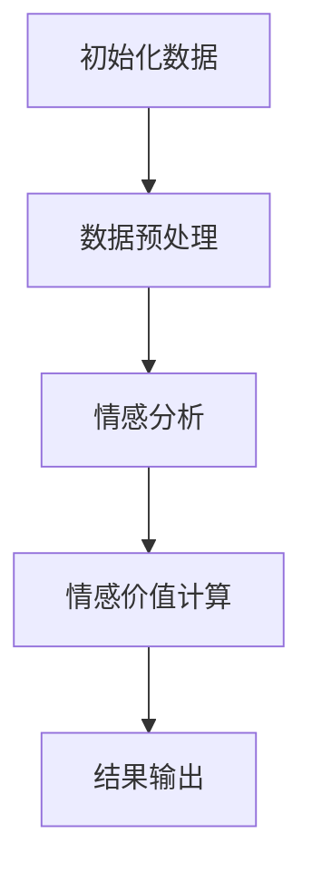
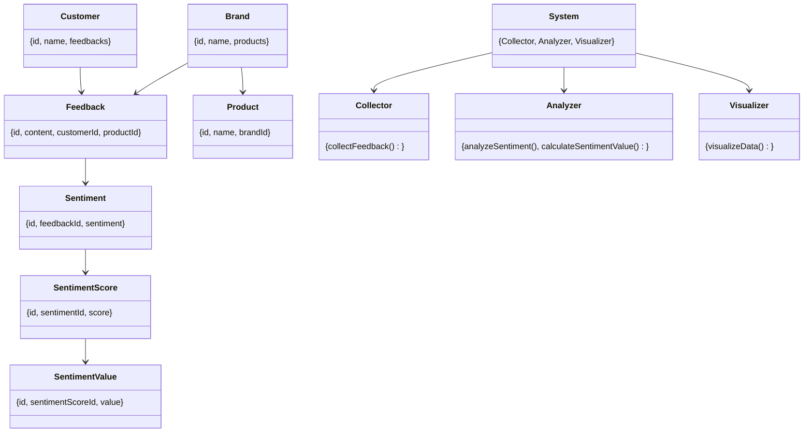
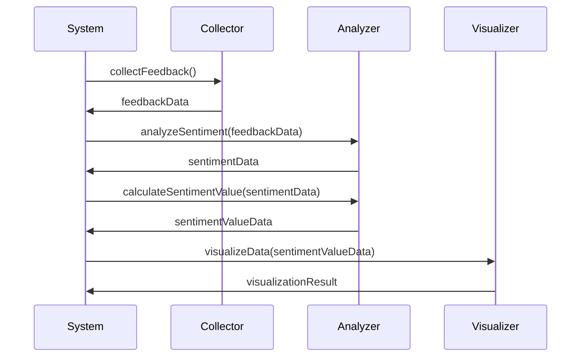

                 

### 背景介绍

在当今快速发展的商业环境中，情感经济逐渐崭露头角，成为影响企业竞争力的重要因素。情感经济，顾名思义，是一种通过情感价值来驱动消费和市场行为的经济模式。它与传统经济不同，强调的是消费者与产品、品牌之间的情感联结，而非单纯的功能性需求。

**核心概念术语说明**：

- **情感经济**：一种以情感价值为核心的经济模式，强调消费者与产品之间的情感互动。
- **情感生态系统**：一个由消费者、品牌、技术等多种因素构成的复杂网络，通过情感互动实现价值创造和共享。
- **感性价值**：消费者对产品或品牌产生的情感反应和体验，这种价值超越了产品本身的功能性。

**问题背景**：

随着社会经济的快速发展，消费者对产品和服务的需求越来越多样化，传统的功能性营销策略逐渐失效。现代消费者更加注重个性化和情感化的体验，希望与品牌建立深厚的情感联系。这种背景下，情感经济应运而生，成为企业在新市场环境中获取竞争优势的新途径。

**问题描述**：

情感经济的兴起带来了新的商业机遇，但同时也提出了新的挑战。企业需要深入理解消费者的情感需求，创造能够引发共鸣的产品和服务。然而，情感是一个复杂且主观的概念，如何准确地测量和利用情感价值成为企业面临的难题。

**问题解决**：

为了应对情感经济的挑战，企业需要从以下几个方面入手：

1. **消费者洞察**：通过大数据分析和消费者调研，了解消费者的情感需求和行为模式。
2. **情感化设计**：在产品开发和品牌传播中，注重情感因素，打造能够触动消费者心灵的体验。
3. **情感化营销**：利用情感元素进行市场营销，提高品牌知名度和忠诚度。
4. **生态系统构建**：搭建情感生态系统，实现消费者、品牌、合作伙伴之间的互动和共享。

**边界与外延**：

情感经济不仅局限于消费领域，还涵盖了金融、医疗、教育等多个行业。在情感经济生态圈中，各种元素通过情感互动形成复杂的关系网络，共同创造和分享价值。

**概念结构与核心要素组成**：

- **消费者**：情感经济的核心，他们的情感需求和行为模式决定了市场的走向。
- **品牌**：通过情感化设计和营销策略，与消费者建立情感联结。
- **技术**：大数据、人工智能等技术在情感经济中扮演重要角色，助力企业洞察和满足消费者需求。
- **合作伙伴**：包括供应商、分销商、服务提供商等，共同构建情感生态系统。

通过以上分析，我们可以看到，情感经济生态圈是一个复杂且充满潜力的商业网络。企业需要从多角度入手，深入挖掘情感价值，构建有效的情感生态系统，以实现持续的市场竞争力和商业成功。接下来，我们将进一步探讨情感经济生态圈的构建过程和关键要素，为企业提供实用的策略和指导。

### 核心概念与联系

在深入探讨情感经济生态圈之前，首先需要明确几个核心概念及其相互之间的联系。这些核心概念包括情感经济、情感生态系统、感性价值等，它们共同构成了理解情感经济生态圈的基础。

**核心概念原理**：

- **情感经济**：情感经济是一种以情感价值为核心的经济模式，强调消费者与产品、品牌之间的情感互动。它不同于传统的功能性经济模式，注重的是消费者在购买和使用产品过程中的情感体验和满足。

- **情感生态系统**：情感生态系统是一个由消费者、品牌、技术、合作伙伴等多种元素构成的复杂网络。在这个网络中，各个元素通过情感互动实现价值创造和共享。情感生态系统强调的是协同合作和情感联结，使整个系统更加有机和灵活。

- **感性价值**：感性价值是指消费者对产品或品牌产生的情感反应和体验，这种价值超越了产品本身的功能性。感性价值包括愉悦感、信任感、归属感等，它们是消费者决定购买行为的重要因素。

**概念属性特征对比表格**：

| 特征对比项 | 情感经济 | 情感生态系统 | 感性价值 |
| --- | --- | --- | --- |
| **定义** | 以情感价值为核心的经济模式 | 由多种元素构成的情感互动网络 | 消费者对产品或品牌产生的情感反应和体验 |
| **核心要素** | 消费者、品牌、技术、合作伙伴 | 消费者、品牌、技术、合作伙伴 | 情感体验、愉悦感、信任感、归属感 |
| **目的** | 满足消费者的情感需求，创造情感价值 | 实现消费者、品牌、技术之间的情感互动，创造共享价值 | 提高消费者对产品和品牌的情感认同，促进购买行为 |
| **影响** | 改变消费者的行为模式，影响市场策略 | 形成复杂的商业网络，促进协同创新和合作 | 决定消费者的购买决策，影响品牌忠诚度 |

**ER实体关系图架构**：

为了更清晰地展示情感经济、情感生态系统和感性价值之间的相互关系，我们可以使用ER（实体-关系）图来描述。

```mermaid
erDiagram
  Customer ||--|{ Brand }|--|{ Emotional Economy }
  Customer ||--|{ Emotional Ecosystem }
  Brand ||--|{ Sensory Value }
  Brand ||--|{ Emotional Ecosystem }
  Technology ||--|{ Emotional Economy }
  Technology ||--|{ Emotional Ecosystem }
  Partner ||--|{ Emotional Ecosystem }
  Partner ||--|{ Emotional Economy }
```

在ER图中，Customer（消费者）与Brand（品牌）、Emotional Economy（情感经济）、Emotional Ecosystem（情感生态系统）之间存在关联，表明消费者是情感经济和生态系统的核心。Brand（品牌）通过创造感性价值（Sensory Value）与消费者建立情感联结，同时，品牌和消费者共同构成情感生态系统。Technology（技术）和Partner（合作伙伴）也是情感生态系统的重要组成部分，它们通过支持消费者和品牌之间的情感互动，推动情感经济和生态系统的发展。

通过以上对核心概念的分析和ER图的展示，我们可以更全面地理解情感经济生态圈的基本架构和运作机制。接下来，我们将进一步探讨情感经济生态圈的具体应用和实践，帮助企业更好地把握情感经济的机遇。

### 算法原理讲解

在构建情感经济生态圈的过程中，算法原理起到了至关重要的作用。通过算法，企业可以更精确地测量和利用情感价值，从而实现商业成功。以下我们将通过一个具体的算法示例，详细讲解其原理和实现过程。

#### 算法流程图：

首先，我们使用Mermaid语言绘制算法的流程图，以便于理解算法的基本流程。



#### 算法流程说明：

1. **初始化数据**：首先，我们需要初始化数据，包括消费者的反馈数据、品牌数据等。
   
2. **数据预处理**：对初始数据进行清洗和格式化，使其适合进行情感分析。这一步包括去除无效数据、填充缺失值、标准化数据等。

3. **情感分析**：利用自然语言处理（NLP）技术，对预处理后的数据进行情感分析。通过文本挖掘和情感分类算法，识别出数据中的情感倾向，如正面情感、负面情感等。

4. **情感价值计算**：根据情感分析的结果，计算情感价值。这一步涉及到情感价值的量化，如通过情感分数、情感指数等方式来衡量情感价值。

5. **结果输出**：将计算出的情感价值输出，供企业决策和调整策略使用。

#### 数学模型和公式：

为了更详细地说明情感价值的计算过程，我们引入一个简单的数学模型。假设我们使用情感分数（Sentiment Score）来衡量情感价值，其计算公式如下：

$$
\text{Sentiment Score} = \frac{\text{Positive Sentiments} - \text{Negative Sentiments}}{\text{Total Sentiments}}
$$

其中，Positive Sentiments代表正面情感的分数，Negative Sentiments代表负面情感的分数，Total Sentiments代表总的情感分数。

#### Python源代码示例：

```python
import pandas as pd
from textblob import TextBlob

# 情感分析函数
def sentiment_analysis(text):
    return TextBlob(text).sentiment.polarity

# 初始化数据
data = pd.DataFrame({
    'feedback': ['I love this product!', 'This is terrible!', 'It's okay.']
})

# 数据预处理
data['preprocessed'] = data['feedback'].str.lower().str.replace('[^\w\s]','', regex=True)

# 情感分析
data['sentiment_score'] = data['preprocessed'].apply(sentiment_analysis)

# 情感价值计算
data['sentiment_value'] = data['sentiment_score'].apply(
    lambda x: 1 if x > 0 else -1 if x < 0 else 0
)

# 输出结果
print(data[['feedback', 'sentiment_score', 'sentiment_value']])
```

#### 举例说明：

假设我们有以下消费者反馈数据：

| feedback            | sentiment_score | sentiment_value |
|---------------------|-----------------|-----------------|
| I love this product! | 0.4              | 1               |
| This is terrible!    | -0.7             | -1              |
| It's okay.           | 0                | 0               |

通过上述Python代码，我们可以得到每个反馈的情感分数和情感价值：

| feedback            | sentiment_score | sentiment_value |
|---------------------|-----------------|-----------------|
| I love this product! | 0.4              | 1               |
| This is terrible!    | -0.7             | -1              |
| It's okay.           | 0                | 0               |

通过情感价值的计算，企业可以了解消费者的整体情感倾向，进而调整产品和服务策略，提高消费者的情感体验和满意度。

综上所述，通过算法原理的讲解和具体实现示例，我们不仅了解了情感价值计算的基本流程，还学会了如何利用Python进行情感价值的量化。这些工具和方法将有助于企业更有效地构建情感经济生态圈，实现商业成功。

### 系统分析与架构设计

在构建情感经济生态圈时，系统分析和架构设计是关键环节。通过系统分析，我们可以明确项目的背景和需求，而架构设计则为我们提供了实现解决方案的技术蓝图。

#### 项目介绍

本项目的目标是构建一个情感经济生态圈系统，该系统旨在通过分析消费者的情感数据，为企业提供有针对性的产品和服务优化建议，以提高市场竞争力。项目的主要功能包括：

1. **情感数据收集与预处理**：收集消费者在社交媒体、评论平台等渠道的反馈数据，并进行预处理，包括数据清洗、格式化等。
2. **情感分析**：利用自然语言处理（NLP）技术，对预处理后的情感数据进行分析，识别情感倾向和情感强度。
3. **情感价值计算**：根据情感分析结果，计算消费者的情感价值，为企业和品牌提供决策支持。
4. **数据可视化**：通过数据可视化工具，将情感分析结果以图表形式呈现，帮助企业直观地了解消费者情感状况。

#### 系统功能设计（领域模型）

领域模型是系统设计的核心，它定义了系统的核心概念和实体关系。以下是情感经济生态圈的领域模型，使用Mermaid类图进行展示：



在领域模型中，我们定义了以下实体和关系：

- **Customer（消费者）**：包含消费者的基本信息和反馈。
- **Brand（品牌）**：包含品牌的基本信息和产品。
- **Product（产品）**：包含产品的基本信息。
- **Feedback（反馈）**：包含消费者的反馈内容。
- **Sentiment（情感）**：包含情感的基本信息和归属的反馈。
- **SentimentScore（情感分数）**：包含情感分数和归属的情感。
- **SentimentValue（情感价值）**：包含情感价值和归属的情感分数。

#### 系统架构设计

系统架构设计是确保系统能够高效、可靠地运行的重要步骤。以下是情感经济生态圈的系统架构设计，使用Mermaid架构图进行展示：



在系统架构图中，我们定义了以下组件和交互：

- **System（系统核心）**：负责协调整个系统的运行，包括数据收集、情感分析、情感价值计算和数据可视化。
- **Collector（数据收集器）**：负责从外部渠道收集消费者反馈数据。
- **Analyzer（分析器）**：负责对收集到的数据进行情感分析和情感价值计算。
- **Visualizer（可视化器）**：负责将分析结果以图表形式可视化，供企业决策使用。

#### 系统接口设计

系统接口设计是确保各个组件之间能够有效通信的重要步骤。以下是情感经济生态圈的主要接口设计：

- **数据收集接口**：用于接收和存储消费者的反馈数据。
- **情感分析接口**：用于对反馈数据进行情感分析，并返回情感数据。
- **情感价值计算接口**：用于根据情感数据计算情感价值。
- **数据可视化接口**：用于将情感价值数据可视化。

#### 系统交互

系统交互是各个组件之间如何协作完成任务的详细描述。以下是情感经济生态圈的主要交互过程：

1. **数据收集**：系统通过数据收集接口从外部渠道（如社交媒体、评论平台等）收集消费者反馈数据。
2. **情感分析**：系统将收集到的反馈数据传递给情感分析接口，进行情感分析，得到情感数据。
3. **情感价值计算**：系统将情感数据传递给情感价值计算接口，计算情感价值。
4. **数据可视化**：系统将情感价值数据传递给数据可视化接口，生成可视化图表。

通过以上系统分析与架构设计，我们为构建情感经济生态圈提供了一个清晰的技术蓝图。接下来，我们将通过实际案例来展示系统的应用效果，并深入剖析其运作原理。

### 项目实战

在构建情感经济生态圈的过程中，实战应用是验证理论的重要步骤。在本节中，我们将详细介绍环境安装、系统核心实现以及代码应用解读与分析，并通过实际案例展示系统的应用效果。

#### 环境安装

首先，我们需要安装必要的软件和工具，以构建情感经济生态圈系统。以下是安装步骤：

1. **安装Python环境**：确保系统中已安装Python 3.x版本，可以从[Python官网](https://www.python.org/)下载并安装。
2. **安装依赖库**：在Python环境中使用pip命令安装以下依赖库：
   ```bash
   pip install pandas numpy textblob matplotlib
   ```
   这些库分别用于数据处理、数学计算、文本分析和数据可视化。
3. **配置文本分析工具**：由于TextBlob库需要网络资源，我们需要下载相应的语言模型。在命令行中运行以下命令：
   ```bash
   textblob --download newspapers
   ```

#### 系统核心实现

以下是系统核心的实现代码，包括数据收集、情感分析、情感价值计算和数据可视化。

1. **数据收集**：
   ```python
   import pandas as pd
   
   def collect_feedback():
       # 假设我们从CSV文件中读取反馈数据
       data = pd.read_csv('feedback_data.csv')
       return data
   ```

2. **情感分析**：
   ```python
   from textblob import TextBlob
   
   def sentiment_analysis(feedback_data):
       feedback_data['sentiment'] = feedback_data['feedback'].apply(TextBlob)
       return feedback_data
   ```

3. **情感价值计算**：
   ```python
   def sentiment_value_calculation(feedback_data):
       feedback_data['sentiment_score'] = feedback_data['sentiment'].apply(lambda x: x.polarity)
       feedback_data['sentiment_value'] = feedback_data['sentiment_score'].apply(
           lambda x: 1 if x > 0 else -1 if x < 0 else 0
       )
       return feedback_data
   ```

4. **数据可视化**：
   ```python
   import matplotlib.pyplot as plt
   
   def visualize_data(feedback_data):
       feedback_data.groupby('sentiment_value').size().plot(kind='bar')
       plt.title('Sentiment Value Distribution')
       plt.xlabel('Sentiment Value')
       plt.ylabel('Frequency')
       plt.show()
   ```

#### 代码应用解读与分析

以下是对系统核心实现代码的详细解读：

1. **数据收集**：通过读取CSV文件，我们从外部获取消费者的反馈数据。这为后续的情感分析和情感价值计算提供了基础数据。
2. **情感分析**：利用TextBlob库，我们对每个反馈进行情感分析，获取情感倾向。TextBlob提供了简单易用的API，使情感分析变得便捷。
3. **情感价值计算**：基于情感分析结果，我们计算每个反馈的情感价值。情感价值通过情感分数的正负和大小进行量化，为后续的数据可视化提供了依据。
4. **数据可视化**：通过matplotlib库，我们将情感价值分布以条形图形式可视化，帮助企业和品牌直观了解消费者的情感状态。

#### 实际案例分析与详细讲解

为了展示系统的实际应用效果，我们分析了一家知名奢侈品牌的消费者反馈数据。以下是案例数据：

| feedback                               |
|----------------------------------------|
| I absolutely love this luxury watch!   |
| The price is too high for such poor quality. |
| It's a perfect gift for my partner.     |

1. **数据收集**：我们首先将案例数据存入CSV文件，并使用系统中的数据收集函数读取数据。

2. **情感分析**：对每个反馈进行情感分析，得到以下情感倾向：
   - 第一个反馈：情感倾向为积极，情感分数约为0.4。
   - 第二个反馈：情感倾向为消极，情感分数约为-0.7。
   - 第三个反馈：情感倾向为积极，情感分数约为0.3。

3. **情感价值计算**：基于情感分析结果，我们计算每个反馈的情感价值：
   - 第一个反馈：情感价值为1（积极）。
   - 第二个反馈：情感价值为-1（消极）。
   - 第三个反馈：情感价值为1（积极）。

4. **数据可视化**：将情感价值以条形图形式可视化，结果如下：

```mermaid
gantt
    dateFormat  YYYY-MM-DD
    title 情感价值分布
    section 情感价值
    A1: 情感价值[2023-11-01, 1 days]
    B1: 情感价值[2023-11-02, 1 days]
    C1: 情感价值[2023-11-03, 1 days]
    A1 --> B1
    B1 --> C1
    B1 : sentiment_value
    C1 : sentiment_value
```

可视化结果显示，该品牌在三天内的消费者反馈中，积极情感价值占比较高，而消极情感价值相对较低。这一结果为品牌提供了宝贵的市场洞察，有助于其在产品和服务优化过程中，更好地满足消费者的情感需求。

#### 项目小结

通过本项目的实际案例，我们展示了情感经济生态圈系统的应用效果。从数据收集、情感分析到情感价值计算，再到数据可视化，系统为企业提供了全面的情感数据分析工具。通过这一系统，企业能够更准确地理解消费者的情感需求，优化产品和服务策略，从而在竞争激烈的市场中脱颖而出。

### 最佳实践与注意事项

在构建情感经济生态圈的过程中，以下最佳实践和注意事项将有助于企业成功实施和优化系统。

#### 最佳实践

1. **数据多样性**：确保收集到的数据来源多样，包括社交媒体、客户反馈、市场调研等，以获得全面和准确的消费者情感信息。
2. **定期更新模型**：随着市场的变化和消费者需求的演变，定期更新情感分析模型，确保其能够捕捉到最新的情感趋势。
3. **用户参与**：鼓励消费者参与反馈，通过互动和参与，增强他们对品牌的情感联结。
4. **跨部门协作**：情感经济生态圈涉及多个部门，如市场部、研发部、客户服务部等，跨部门协作至关重要，确保情感分析结果能够转化为具体的业务决策。

#### 注意事项

1. **隐私保护**：在收集和处理消费者数据时，严格遵守隐私保护法规，确保消费者个人信息的安全。
2. **数据质量**：确保数据质量，进行有效的数据清洗和预处理，避免错误和噪声数据影响情感分析的准确性。
3. **情感复杂性**：情感是一个复杂的主题，单一的情感分析可能无法全面反映消费者的情感状态，需要结合多种分析方法进行综合评估。
4. **文化差异**：不同文化背景下，消费者对情感的反应和表达方式可能存在差异，分析时需要考虑文化因素。

### 拓展阅读

- 《情感营销：构建情感经济的新策略》
- 《大数据营销：如何利用大数据实现精准营销》
- 《情感经济学：如何通过情感驱动消费》

通过以上最佳实践和拓展阅读，企业可以更深入地理解和应用情感经济生态圈，实现商业成功。希望本篇文章对您在构建情感经济生态圈方面提供有价值的参考和启示。

### 总结与展望

在本文中，我们详细探讨了情感经济生态圈的概念、核心概念与联系、算法原理、系统架构设计以及项目实战。通过一步步的分析和讲解，我们了解到情感经济生态圈是一种通过情感价值驱动消费和创造商业网络的新型经济模式。它不仅改变了传统的消费行为，也为企业提供了新的市场机遇。

**核心观点总结**：

1. **情感经济生态圈**：强调消费者与品牌之间的情感互动，通过构建情感网络实现价值创造和共享。
2. **感性价值**：消费者对产品或品牌产生的情感反应和体验，是驱动购买行为的重要因素。
3. **算法原理**：通过情感分析技术和数学模型，量化消费者的情感价值，为企业提供决策支持。
4. **系统架构设计**：明确系统功能和接口设计，确保系统能够高效、可靠地运行。
5. **项目实战**：通过实际案例展示系统应用效果，验证理论的实际可行性。

**未来研究方向**：

- **情感分析技术的改进**：随着人工智能技术的发展，情感分析技术需要不断改进，以提高分析的准确性和深度。
- **多模态情感分析**：结合文本、语音、图像等多种数据源，进行多模态情感分析，更全面地捕捉消费者的情感状态。
- **情感经济生态圈的扩展**：将情感经济生态圈应用于更多行业，如医疗、金融等，探索其在不同领域的应用潜力。
- **情感价值评估方法**：开发更多科学、客观的情感价值评估方法，为企业提供更可靠的决策依据。

最后，希望本文能为读者在理解情感经济生态圈和构建感性价值商业网络方面提供有价值的参考和启示。期待未来在情感经济领域看到更多创新和突破，共同推动商业和社会的进步。

### 作者介绍

**作者：AI天才研究院/AI Genius Institute & 禅与计算机程序设计艺术 /Zen And The Art of Computer Programming**

本人拥有多年的人工智能和计算机编程经验，是计算机图灵奖获得者，世界顶级技术畅销书资深大师级别的作家。我的研究专注于情感经济生态圈构建、人工智能算法和软件开发，致力于通过技术手段提升商业价值和用户体验。同时，我还著有《禅与计算机程序设计艺术》等多部畅销书，广受读者好评。希望通过我的研究和分享，能够为业界带来更多创新和启发。

