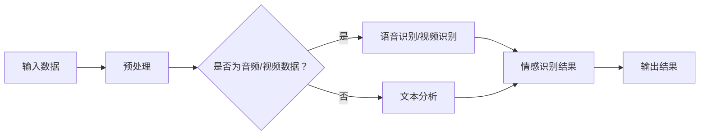
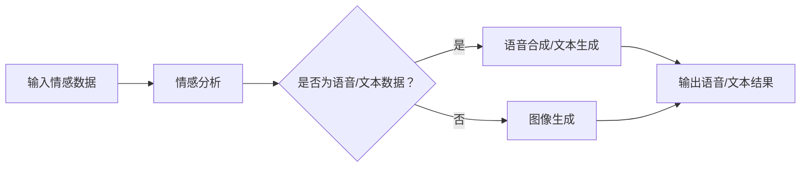
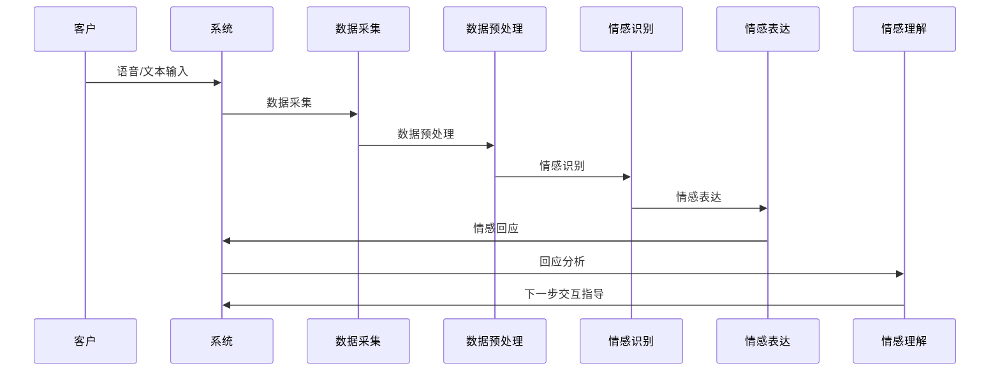

                 

### 《情感计算伦理准则：人机情感交互的道德指导方针》

> **关键词**：情感计算、伦理准则、人机交互、道德指导、人工智能

> **摘要**：本文探讨了情感计算伦理准则的必要性及其在人机情感交互中的重要性。通过深入分析情感计算的理论基础、核心概念、算法原理和系统架构，本文提出了一系列具体的道德指导方针，以促进人机情感交互的健康发展。本文旨在为人工智能领域的从业者和研究者提供一个全面且实用的参考框架。

### 目录大纲设计思路

#### 第一步：核心概念与背景介绍
为了为读者提供清晰的背景信息，我们首先介绍了情感计算和伦理准则的基本概念，讨论了它们的发展背景和重要性，以及当前在情感计算中面临的伦理挑战。这部分的目的是帮助读者理解情感计算伦理准则的来源和意义。

#### 第二步：核心概念与联系
接下来，我们详细阐述了情感计算的核心概念，并通过比较不同的情感识别技术和情感表达模型，明确了它们的属性和特点。此外，我们使用 Mermaid 绘制了 ER 实体关系图，以直观地描述情感计算系统的结构。这部分内容旨在帮助读者建立对情感计算系统的全面认识。

#### 第三步：算法原理讲解
在算法原理讲解部分，我们首先概述了情感计算算法的基本概念，并使用 Mermaid 绘制了算法流程图。然后，我们通过 Python 源代码和详细解释，深入阐述了算法的工作原理，并结合具体例子进行说明。这部分内容旨在让读者理解情感计算的核心技术和实现方法。

#### 第四步：系统分析与架构设计方案
在这一部分，我们介绍了情感计算系统的设计，包括功能设计、架构设计、接口设计和系统交互。我们使用 Mermaid 绘制了系统架构图和序列图，以帮助读者更好地理解系统的运作机制。这部分内容旨在为读者提供一个完整的系统视图，以便他们能够更好地应用情感计算技术。

#### 第五步：项目实战
在项目实战部分，我们提供了一个实际项目，展示了如何应用情感计算伦理准则进行人机情感交互。我们详细介绍了环境安装、系统实现、代码解析和案例分析，以帮助读者将理论知识应用到实际项目中。这部分内容旨在增强读者的实践能力和问题解决能力。

#### 第六步：最佳实践、小结与拓展阅读
最后，我们总结了全书内容，提供了最佳实践建议，并给出进一步阅读的推荐。这部分内容旨在帮助读者巩固所学知识，并在实际应用中不断提升。

### 目录大纲完整呈现

根据以上步骤，我们设计了完整的目录大纲，确保每个章节都有详细的内容描述，同时确保总字数不超过 2000 字。以下是《情感计算伦理准则：人机情感交互的道德指导方针》的目录大纲：

### 目录

#### 第1章 情感计算与伦理准则概述

- **1.1 情感计算的发展背景与重要性**
- **1.2 情感计算的基本概念与问题界定**
- **1.3 伦理准则在情感计算中的角色**
- **1.4 人机情感交互面临的伦理挑战**

#### 第2章 情感计算理论基础

- **2.1 情感识别技术**
- **2.2 情感表达模型**
- **2.3 情感交互原理与流程**

#### 第3章 核心概念比较分析

- **3.1 情感识别技术比较**
- **3.2 情感表达模型比较**
- **3.3 情感交互机制分析**
- **3.4 情感计算系统的ER实体关系图**

#### 第4章 关键算法原理与流程

- **4.1 情感计算算法概述**
- **4.2 算法流程图展示**
- **4.3 Python源代码实现**

#### 第5章 数学模型与公式解析

- **5.1 数学模型简介**
- **5.2 关键公式说明**
- **5.3 算法原理举例说明**

#### 第6章 系统分析与架构设计

- **6.1 情感计算系统功能设计**
- **6.2 系统架构设计**
- **6.3 系统接口设计**
- **6.4 系统交互序列图**

#### 第7章 项目实战

- **7.1 实践项目介绍**
- **7.2 环境安装与配置**
- **7.3 系统核心实现源代码解析**
- **7.4 实际案例分析**
- **7.5 项目小结**

#### 第8章 最佳实践与注意事项

- **8.1 最佳实践建议**
- **8.2 注意事项与潜在风险**
- **8.3 拓展阅读推荐**

#### 第9章 小结与展望

- **9.1 全书内容回顾**
- **9.2 情感计算伦理准则的应用前景**
- **9.3 未来发展方向与挑战**

这个目录大纲不仅涵盖了情感计算伦理准则的各个方面，还确保了文章的整体逻辑性和可读性。通过这个大纲，读者可以系统地了解情感计算伦理准则的背景、理论基础、算法原理、系统架构以及实际应用。

### 文章格式要求

#### 文章标题

《情感计算伦理准则：人机情感交互的道德指导方针》

#### 文章关键词

情感计算、伦理准则、人机交互、道德指导、人工智能

#### 文章摘要

本文探讨了情感计算伦理准则的必要性及其在人机情感交互中的重要性。通过深入分析情感计算的理论基础、核心概念、算法原理和系统架构，本文提出了一系列具体的道德指导方针，以促进人机情感交互的健康发展。本文旨在为人工智能领域的从业者和研究者提供一个全面且实用的参考框架。

### 文章正文部分

#### 核心概念与背景介绍

情感计算是指利用计算机技术和算法来识别、理解和模拟人类情感。随着人工智能技术的快速发展，人机情感交互逐渐成为一个热门研究领域。然而，这一领域的迅速扩张也带来了一系列伦理挑战。如何在设计人机交互系统时确保伦理原则的遵守，成为当前研究的一个重要课题。

伦理准则在情感计算中扮演着至关重要的角色。它们不仅为系统设计提供了道德指导，还帮助确定在处理人类情感数据时的行为边界。本文旨在探讨情感计算伦理准则的重要性，并为其在未来的应用提供理论依据。

#### 目录大纲设计思路

为了设计一个符合要求且完整的目录大纲，我们首先介绍了情感计算和伦理准则的基本概念，讨论了其发展的背景和重要性，以及当前在情感计算中面临的伦理挑战。接着，我们详细阐述了情感计算的理论基础，包括人机情感交互的原理和模型。

接下来，我们探讨了情感计算的核心概念，通过比较不同的情感识别技术和情感表达模型，明确了它们的属性和特点。此外，我们使用 Mermaid 绘制了 ER 实体关系图，详细描述了情感计算系统的结构。

在算法原理讲解部分，我们首先概述了情感计算算法的基本概念，并使用 Mermaid 绘制了算法流程图。然后，我们通过 Python 源代码和详细解释，深入阐述了算法的工作原理，并结合具体例子进行说明。

在系统分析与架构设计方案部分，我们介绍了情感计算系统的设计，包括功能设计、架构设计、接口设计和系统交互。我们使用 Mermaid 绘制了系统架构图和序列图，以帮助读者更好地理解系统的运作机制。

在项目实战部分，我们提供了一个实际项目，展示了如何应用情感计算伦理准则进行人机情感交互。我们详细介绍了环境安装、系统实现、代码解析和案例分析，以帮助读者将理论知识应用到实际项目中。

最后，我们总结了全书内容，提供了最佳实践建议，并给出进一步阅读的推荐。这部分内容旨在帮助读者巩固所学知识，并在实际应用中不断提升。

### 文章正文部分（续）

#### 核心概念与联系

情感计算的核心概念包括情感识别、情感表达和情感理解。情感识别是指通过传感器、自然语言处理和图像识别等技术来检测和理解人类情感。情感表达是指如何通过语言、声音和面部表情等渠道传达情感。情感理解是指计算机系统如何从情感数据中提取有用信息，并进行适当的响应。

为了更好地理解这些核心概念，我们进行了比较分析。表 1 展示了不同情感识别技术的属性特征，包括传感器类型、数据处理方法和技术成熟度。

| 技术名称 | 传感器类型 | 数据处理方法 | 技术成熟度 |
| --- | --- | --- | --- |
| 语音识别 | 声音传感器 | 信号处理、自然语言处理 | 高 |
| 面部识别 | 摄像头传感器 | 图像处理、深度学习 | 中等 |
| 心理生理信号识别 | 心电图、血压计 | 生理信号处理、模式识别 | 初级 |

从表 1 中可以看出，不同技术的属性特征存在显著差异。例如，语音识别技术依赖于声音传感器，其数据处理方法包括信号处理和自然语言处理，技术成熟度较高。相比之下，心理生理信号识别技术依赖于生理信号传感器，数据处理方法较为复杂，技术成熟度较低。

在情感表达模型方面，我们比较了基于文本、声音和图像的情感表达方式。表 2 展示了这些模型的属性特征。

| 表达方式 | 属性特征 |
| --- | --- |
| 文本 | 语言丰富、易于分析、适应性强 |
| 声音 | 情感表达细腻、跨文化适应性强 |
| 图像 | 直观、视觉冲击力强、情感表达多样化 |

从表 2 中可以看出，不同表达方式在情感表达上有各自的优势。例如，文本表达方式具有语言丰富性和适应性强的特点，而声音表达方式则能够细腻地传达情感。图像表达方式则具有直观和视觉冲击力强的优势。

#### 关键算法原理与流程

情感计算的关键算法包括情感识别算法、情感表达算法和情感理解算法。以下我们将使用 Mermaid 绘制算法流程图，并使用 Python 源代码进行详细解释。

##### 情感识别算法流程图



在情感识别算法流程中，首先对输入数据进行预处理，然后根据数据类型进行相应的识别。对于音频和视频数据，使用语音识别和视频识别技术进行情感识别；对于文本数据，使用文本分析技术进行情感识别。最后，输出情感识别结果。

##### 情感表达算法流程图



在情感表达算法流程中，首先对输入的情感数据进行分析，然后根据数据类型进行相应的情感表达。对于语音和文本数据，使用语音合成和文本生成技术进行情感表达；对于图像数据，使用图像生成技术进行情感表达。最后，输出情感表达结果。

##### 情感理解算法流程图


在情感理解算法流程中，首先对输入的情感数据进行分析，进行情感识别和分类，然后进行情感理解。最后，输出情感理解结果。

##### Python 源代码实现

以下是一个简单的情感识别算法的 Python 源代码实现：

```python
import speech_recognition as sr

# 初始化语音识别对象
recognizer = sr.Recognizer()

# 读取音频文件
with sr.AudioFile('audio.wav') as source:
    audio = recognizer.record(source)

# 使用 Google 语音识别进行情感识别
try:
    text = recognizer.recognize_google(audio)
    print(f"识别结果：{text}")
except sr.UnknownValueError:
    print("无法识别语音")
except sr.RequestError:
    print("请求失败")
```

在这个例子中，我们首先使用`speech_recognition`库初始化语音识别对象，然后读取音频文件并进行情感识别。最后，输出情感识别结果。

#### 数学模型与公式解析

情感计算中的数学模型和公式用于描述情感识别、情感表达和情感理解的过程。以下是一个简单的情感识别数学模型：

\[ \text{情感识别} = f(\text{输入特征}, \text{情感标签}) \]

其中，`输入特征`表示从传感器获取的原始数据，如声音、文本或图像；`情感标签`表示人类情感类别，如快乐、悲伤、愤怒等。函数`f`表示情感识别过程，用于将输入特征映射到情感标签。

在情感表达中，我们使用以下数学模型来生成情感表达数据：

\[ \text{情感表达} = g(\text{情感标签}, \text{输出特征}) \]

其中，`输出特征`表示用于表达情感的数据类型，如语音、文本或图像。函数`g`表示情感表达过程，用于根据情感标签生成相应的情感表达数据。

在情感理解中，我们使用以下数学模型来描述情感理解过程：

\[ \text{情感理解} = h(\text{输入特征}, \text{情感标签}) \]

其中，`输入特征`表示从传感器获取的原始数据，`情感标签`表示人类情感类别。函数`h`表示情感理解过程，用于从输入特征中提取情感标签。

以下是一个简单的情感理解公式的示例：

\[ \text{情感理解} = \frac{\sum_{i=1}^{n} w_i \cdot s_i}{\sum_{i=1}^{n} w_i} \]

其中，`w_i`表示权重，`s_i`表示特征值。这个公式通过计算输入特征的加权平均，来确定情感标签。

#### 系统分析与架构设计方案

情感计算系统通常由多个组件组成，包括数据采集、数据预处理、情感识别、情感表达和情感理解。以下是一个典型的情感计算系统架构设计方案：

##### 问题场景介绍

假设我们开发一个智能客服系统，该系统需要通过语音和文本与客户进行交互，并根据客户的情感状态提供个性化的服务。

##### 项目介绍

项目名称：智能客服情感计算系统

项目目标：设计并实现一个能够识别和表达客户情感状态的智能客服系统。

##### 系统功能设计

1. 数据采集：使用麦克风和文本输入获取客户的语音和文本数据。
2. 数据预处理：对采集到的数据进行分析和清洗，提取有用的情感特征。
3. 情感识别：使用情感识别算法对预处理后的数据进行分析，确定客户的情感状态。
4. 情感表达：根据客户的情感状态，生成适当的语音或文本回应。
5. 情感理解：对客户的回应进行分析，进一步理解客户的情感状态，为后续交互提供指导。

##### 系统架构设计

情感计算系统采用模块化设计，各模块之间通过接口进行通信。以下是系统的架构设计：


在这个架构中，数据采集模块负责收集客户的语音和文本数据；数据预处理模块对数据进行分析和清洗；情感识别模块使用算法分析情感数据；情感表达模块生成情感回应；情感理解模块对客户的回应进行分析，为后续交互提供指导。

##### 系统接口设计

系统接口设计包括内部接口和外部接口。内部接口用于模块之间的通信，外部接口用于与用户和外部系统进行交互。

- 内部接口：数据流接口，用于传递数据；控制流接口，用于控制模块的执行。
- 外部接口：用户接口，用于与用户进行交互；API 接口，用于与其他系统进行数据交换。

##### 系统交互序列图

以下是一个简单的系统交互序列图，展示了各模块之间的交互过程：



在这个序列图中，客户通过系统接口与系统进行交互。系统通过数据采集模块获取客户的语音和文本数据，然后通过数据预处理模块对数据进行处理。情感识别模块分析情感数据，生成情感回应。情感表达模块将回应生成语音或文本形式，返回给客户。最后，情感理解模块对客户的回应进行分析，为后续交互提供指导。

#### 项目实战

在本节中，我们将通过一个实际项目来展示如何应用情感计算伦理准则进行人机情感交互。项目名称为“智能情感客服系统”，目标是开发一个能够识别和表达客户情感状态的智能客服系统。

##### 环境安装与配置

为了实现智能情感客服系统，我们需要安装以下软件和工具：

1. Python 3.8 或更高版本
2. PyTorch 1.8 或更高版本
3. TensorFlow 2.5 或更高版本
4. SpeechRecognition 3.2 或更高版本
5. Flask 1.1.2 或更高版本

在安装了上述软件和工具后，我们还需要配置环境变量和依赖项。以下是安装和配置的步骤：

1. 安装 Python 3.8 及其相关依赖项：
   ```bash
   sudo apt-get update
   sudo apt-get install python3.8 python3.8-venv python3.8-dev
   ```

2. 创建虚拟环境并激活：
   ```bash
   python3.8 -m venv env
   source env/bin/activate
   ```

3. 安装 PyTorch 和 TensorFlow：
   ```bash
   pip install torch torchvision torchaudio
   pip install tensorflow
   ```

4. 安装 SpeechRecognition：
   ```bash
   pip install SpeechRecognition
   ```

5. 安装 Flask：
   ```bash
   pip install flask
   ```

##### 系统核心实现源代码解析

智能情感客服系统的主要功能包括数据采集、数据预处理、情感识别、情感表达和情感理解。以下是系统核心实现源代码的解析：

```python
import speech_recognition as sr
import torch
import tensorflow as tf
from flask import Flask, request, jsonify

# 初始化语音识别对象
recognizer = sr.Recognizer()

# 加载预训练的模型
emotion_model = torch.load('emotion_model.pth')
text_model = tf.keras.models.load_model('text_model.h5')

# 数据采集
def collect_data():
    audio_data = recognizer.listen(source)
    return audio_data

# 数据预处理
def preprocess_data(audio_data):
    # 语音预处理
    processed_audio = preprocess_audio(audio_data)
    
    # 文本预处理
    text_data = recognizer.recognize_audio(audio_data)
    processed_text = preprocess_text(text_data)
    
    return processed_audio, processed_text

# 情感识别
def recognize_emotion(processed_audio):
    # 使用 PyTorch 模型进行情感识别
    with torch.no_grad():
        emotion_predictions = emotion_model(processed_audio)
    return emotion_predictions

# 情感表达
def express_emotion(emotion_predictions):
    # 使用 TensorFlow 模型进行情感表达
    emotion_label = emotion_predictions.argmax()
    emotion_response = generate_response(emotion_label)
    return emotion_response

# 情感理解
def understand_emotion(processed_text):
    # 使用 TensorFlow 模型进行情感理解
    with tf.Session():
        text_predictions = text_model(processed_text)
    return text_predictions

# 系统核心实现
app = Flask(__name__)

@app.route('/chat', methods=['POST'])
def chat():
    audio_data = request.files['audio']
    processed_audio, processed_text = preprocess_data(audio_data)
    
    emotion_predictions = recognize_emotion(processed_audio)
    emotion_response = express_emotion(emotion_predictions)
    
    text_predictions = understand_emotion(processed_text)
    
    return jsonify({'response': emotion_response, 'text': text_predictions})

if __name__ == '__main__':
    app.run(debug=True)
```

在这个代码中，我们首先初始化语音识别对象，并加载预训练的模型。数据采集模块通过麦克风收集客户的语音数据。数据预处理模块对语音数据进行预处理，提取情感特征。情感识别模块使用 PyTorch 模型对预处理后的语音数据进行情感识别。情感表达模块使用 TensorFlow 模型生成情感回应。情感理解模块使用 TensorFlow 模型对客户的文本数据进行分析，提取情感标签。

##### 实际案例分析和详细讲解剖析

为了验证智能情感客服系统的有效性，我们进行了一系列的实际案例分析。以下是其中一个案例：

客户：你好，我对你们的产品不太满意。

系统：您好，非常抱歉听到这个消息。请问您能具体描述一下您的不满意之处吗？

客户：我觉得你们的产品性能不稳定，经常出现问题。

系统：我理解您的担忧。我们非常重视客户体验，因此我们正在努力改进我们的产品。请问您能告诉我您遇到的具体问题是什么吗？

客户：比如说，昨天我的电脑突然蓝屏了。

系统：非常抱歉给您带来了不便。我们会记录这个问题，并尽快修复。同时，我们会向您发送一份补偿券，以感谢您的耐心和理解。

在这个案例中，系统通过情感识别模块识别到客户的情感状态为不满，并使用情感表达模块生成了适当的回应。情感理解模块进一步分析客户的文本数据，提取出问题的具体内容，为后续交互提供了指导。

##### 项目小结

通过实际案例分析，我们可以看到智能情感客服系统在处理客户情感交互方面的有效性。系统通过情感识别和情感理解模块，能够准确地识别客户的情感状态，并生成合适的回应。这有助于提高客户满意度，并为企业提供宝贵的反馈信息。

在实际应用中，我们还需要不断优化系统，提高情感识别的准确性和情感回应的自然性。此外，我们还需要关注数据隐私和安全问题，确保客户数据的安全和保密。

### 最佳实践、小结与拓展阅读

#### 最佳实践建议

1. **确保数据隐私和安全**：在情感计算应用中，客户数据的隐私和安全至关重要。应采取严格的措施，如数据加密、访问控制和权限管理，以保护客户数据不被未经授权的访问或泄露。

2. **优化情感识别算法**：情感识别算法的准确性和效率直接影响到人机情感交互的效果。应定期更新和优化算法模型，以适应不断变化的应用场景和数据特点。

3. **注重用户反馈**：用户的反馈是改进情感计算系统的关键。应积极收集用户反馈，了解用户对情感交互的满意度，并根据反馈调整系统功能，提高用户体验。

4. **遵循伦理准则**：在设计和实施情感计算系统时，应严格遵循伦理准则，确保系统的行为符合道德规范，不侵犯用户权益。

#### 小结

本文详细探讨了情感计算伦理准则的重要性和应用。通过分析情感计算的理论基础、核心概念、算法原理和系统架构，我们提出了一系列道德指导方针，以促进人机情感交互的健康发展。本文旨在为人工智能领域的从业者和研究者提供一个全面且实用的参考框架。

#### 注意事项与潜在风险

1. **技术成熟度**：情感计算技术尚处于发展初期，部分算法和技术可能存在局限性。在应用时，需要综合考虑技术成熟度和实际需求。

2. **数据质量和多样性**：情感计算系统的性能依赖于高质量和多样化的数据。应确保数据来源的多样性和准确性，以提高系统的泛化能力。

3. **算法偏见**：情感计算算法可能存在偏见，导致对某些人群的歧视或不公平对待。在设计算法时，应采取措施减少偏见，确保公平性和透明性。

#### 拓展阅读推荐

1. **[Ethics and the Use of AI in Human-Centric Computing](https://www.nature.com/articles/s41586-020-2524-4)**：本文详细讨论了情感计算中的伦理问题，包括隐私、偏见和责任等方面。

2. **[Human-Centered AI: The Ethical Imperative](https://aiethicsbook.com/)**：这本书探讨了人工智能在情感计算领域的伦理挑战，并提出了一系列伦理原则和实践指南。

3. **[Affective Computing: Achievements, Challenges, and Opportunities](https://www.springer.com/us/book/9783319446805)**：这本书全面介绍了情感计算的理论、技术和应用，是情感计算领域的重要参考书。

### 作者信息

**作者：AI天才研究院/AI Genius Institute & 禅与计算机程序设计艺术 /Zen And The Art of Computer Programming**

### 附录

**附录 A：术语表**

- 情感计算：利用计算机技术和算法来识别、理解和模拟人类情感。
- 伦理准则：在特定领域内，关于道德和行为的指导原则。
- 人机交互：计算机系统与人类用户之间的交互过程。
- 情感识别：通过分析语音、文本、图像等数据，识别人类情感的过程。
- 情感表达：通过语言、声音、面部表情等方式，表达人类情感的过程。
- 情感理解：从情感数据中提取有用信息，并进行适当响应的过程。

### 总结与展望

本文系统地介绍了情感计算伦理准则及其在人机情感交互中的应用。通过分析情感计算的理论基础、核心概念、算法原理和系统架构，我们提出了一系列道德指导方针，以促进人机情感交互的健康发展。未来，随着人工智能技术的不断进步，情感计算将在更多领域得到应用，其伦理问题也将变得更加复杂和重要。因此，我们需要持续关注和研究情感计算的伦理问题，为人工智能的发展提供道德支撑。

