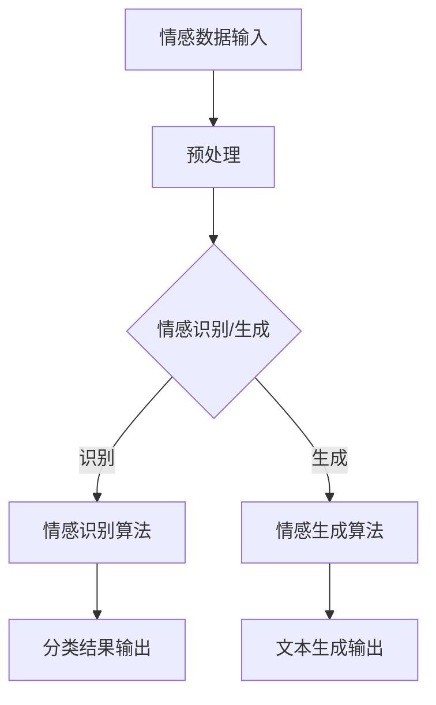
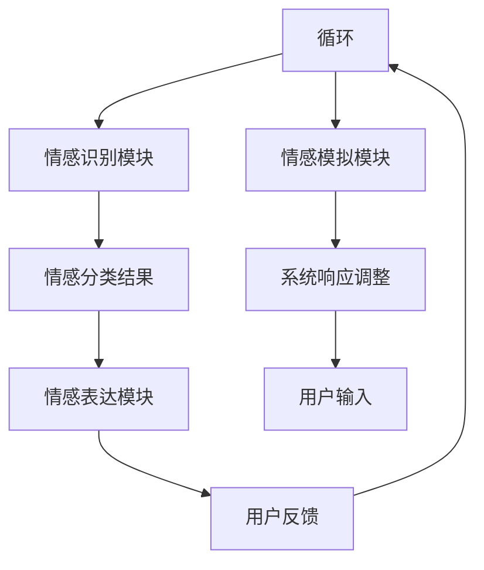
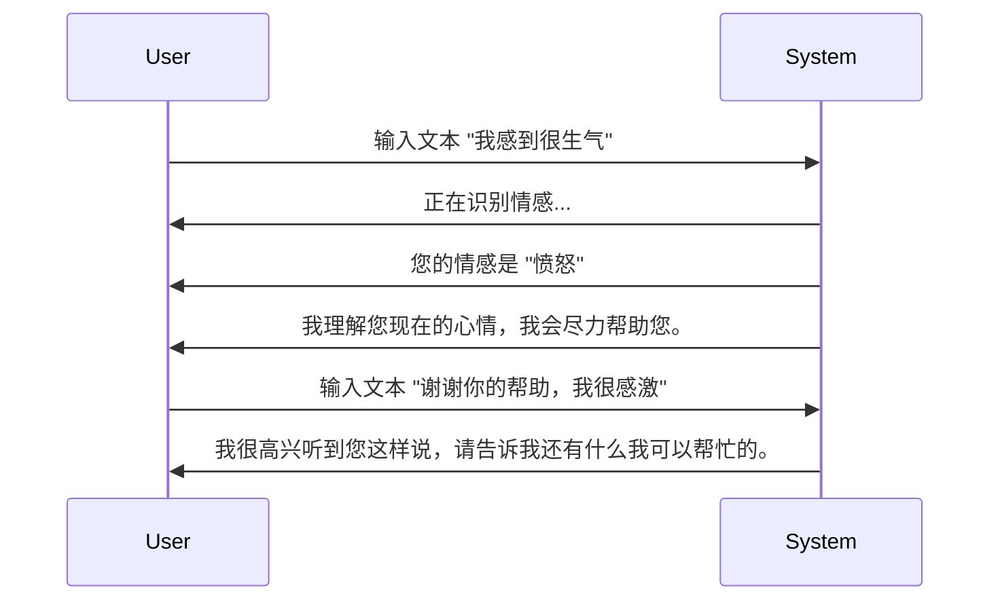

                 

# 情感计算前沿研究：人机情感交互的科技探索

> 关键词：情感计算，人机交互，算法，数学模型，系统架构，项目实战

> 摘要：本文深入探讨了情感计算这一前沿研究领域，从背景介绍、核心概念与联系、算法原理讲解、数学模型和数学公式、系统分析与架构设计方案、项目实战等多个角度，全面阐述了人机情感交互的科技探索。通过详细的分析和实例讲解，本文旨在为读者提供一个清晰、系统的认知框架，帮助理解情感计算在人工智能领域的应用前景。

## 1. 背景介绍

### 1.1 情感计算的定义

情感计算（Affective Computing）是指使计算机具备识别、理解、处理和模拟人类情感的能力。它结合了认知科学、计算机科学、心理学和人工智能等多个领域的知识，旨在创造能够与人类情感互动的智能系统。

### 1.2 问题背景

随着人工智能技术的快速发展，人机交互已经成为现代计算机科学的重要研究方向。然而，传统的人机交互主要侧重于功能和信息的传递，缺乏对人类情感的深入理解和处理。这使得人机交互在许多场景下显得不够自然和人性化，难以满足用户的情感需求。

### 1.3 发展历程

情感计算的研究始于20世纪90年代，由麻省理工学院的罗德尼·布鲁克斯（Rodney Brooks）教授首次提出。近年来，随着深度学习、计算机视觉和自然语言处理等技术的发展，情感计算的研究取得了显著进展。

### 1.4 科技探索的意义

人机情感交互的科技探索具有重要意义。首先，它能够提升人机交互的自然性和人性化，改善用户体验。其次，情感计算在心理健康、教育、医疗等领域的应用前景广阔，有望为人类带来更多福祉。

## 2. 核心概念与联系

### 2.1 情感计算的核心概念

情感计算的核心概念包括情感识别、情感表达和情感模拟。

- **情感识别**：指计算机从文字、语音、图像等多媒体数据中识别出人类情感。
- **情感表达**：指计算机通过声音、文字、面部表情等方式表达情感。
- **情感模拟**：指计算机模拟人类情感反应，以适应不同场景和用户需求。

### 2.2 概念属性特征对比表格

| 概念         | 技术与方法                                                     | 应用领域                               |
| ------------ | ------------------------------------------------------------ | -------------------------------------- |
| 情感识别     | 机器学习、深度学习、计算机视觉、自然语言处理                     | 聊天机器人、情感分析、用户满意度评估     |
| 情感表达     | 语音合成、面部动画、自然语言生成                               | 智能客服、虚拟现实、电影动画           |
| 情感模拟     | 情境建模、情感合成、反馈机制                                  | 游戏设计、教育辅助、心理治疗           |

### 2.3 ER实体关系图架构

```mermaid
erDiagram
  User ||--|{ Emotion}: EmotionalConnection
  Machine ||--|{ Emotion}: EmotionalConnection
  Data ||--|{ Emotion}: EmotionalDataProcessing
  Emotion ||--|{ User}: UserEmotion
  Emotion ||--|{ Machine}: MachineEmotion
  Emotion ||--|{ Data}: DataEmotion
```

## 3. 算法原理讲解

### 3.1 情感识别算法原理

情感识别算法主要基于机器学习和深度学习技术。以自然语言处理为例，常见的算法包括：

- **朴素贝叶斯分类器**：基于贝叶斯定理，通过计算文本特征的概率分布进行情感分类。
- **支持向量机（SVM）**：通过找到一个最优的超平面，将不同情感类别区分开来。
- **深度学习模型**：如卷积神经网络（CNN）和循环神经网络（RNN），可以自动提取文本特征并进行情感分类。

### 3.2 情感生成算法原理

情感生成算法主要基于情感合成和自然语言生成技术。常见的算法包括：

- **GPT-2/GPT-3**：基于变分自编码器（VAE）的深度学习模型，可以生成自然流畅的文本。
- **Tacotron 2**：基于序列到序列（seq2seq）模型的语音合成模型，可以将文本转换为自然语音。

### 3.3 算法流程图



### 3.4 Python 源代码解释

```python
# 情感识别算法示例：朴素贝叶斯分类器
from sklearn.feature_extraction.text import CountVectorizer
from sklearn.naive_bayes import MultinomialNB

# 训练数据
X_train = ["我很高兴", "我今天心情很差", "这是一件有趣的事情", "我感到很痛苦"]
y_train = ["正面", "负面", "正面", "负面"]

# 预处理
vectorizer = CountVectorizer()
X_train_vectorized = vectorizer.fit_transform(X_train)

# 模型训练
classifier = MultinomialNB()
classifier.fit(X_train_vectorized, y_train)

# 输入测试数据
test_data = ["我很开心", "我很难过"]

# 预处理测试数据
test_data_vectorized = vectorizer.transform(test_data)

# 情感识别
predictions = classifier.predict(test_data_vectorized)

# 输出结果
print(predictions)
```

### 3.5 情感识别和情感生成的数学模型和公式

- **情感识别**：

  $$P(\text{情感类别} | \text{特征}) = \frac{P(\text{特征} | \text{情感类别})P(\text{情感类别})}{P(\text{特征})}$$

- **情感生成**：

  $$\text{生成文本} = \text{GPT-2/GPT-3模型}(\text{情感类别}, \text{前文文本})$$

## 4. 数学模型和数学公式

### 4.1 情感识别的数学模型

情感识别通常涉及到概率模型和分类模型，以下是一个简化的逻辑回归模型的数学表达：

$$
P(y_i = j | \mathbf{x_i}) = \frac{e^{\mathbf{\beta}^T \mathbf{x_i}}}{1 + \sum_{k=1}^{K} e^{\mathbf{\beta}^T \mathbf{x_k}}}
$$

其中，$y_i$ 是第 $i$ 个样本的真实情感标签，$j$ 是预测的情感类别，$\mathbf{x_i}$ 是第 $i$ 个样本的特征向量，$\mathbf{\beta}$ 是模型的参数向量，$K$ 是类别总数。

### 4.2 情感生成的数学模型

情感生成通常依赖于序列模型，例如循环神经网络（RNN）或其变体长短期记忆网络（LSTM）或门控循环单元（GRU）。以下是一个简化的RNN模型的状态更新方程：

$$
\mathbf{h_t} = \sigma(\mathbf{U}\mathbf{x_t} + \mathbf{W}\mathbf{h_{t-1}} + \mathbf{b})
$$

其中，$\mathbf{h_t}$ 是第 $t$ 个时间步的隐藏状态，$\mathbf{x_t}$ 是输入特征，$\mathbf{U}$ 和 $\mathbf{W}$ 是权重矩阵，$\mathbf{b}$ 是偏置项，$\sigma$ 是激活函数，通常采用sigmoid或tanh函数。

$$
\mathbf{y_t} = \text{softmax}(\mathbf{V}\mathbf{h_t} + \mathbf{c})
$$

其中，$\mathbf{y_t}$ 是预测的概率分布，$\mathbf{V}$ 是输出权重矩阵，$\mathbf{c}$ 是输出偏置。

## 5. 系统分析与架构设计方案

### 5.1 问题场景介绍

在智能客服系统中，人机情感交互是一个关键环节。系统需要能够理解用户情感，并给予合适的情感回应，以提高用户体验和满意度。

### 5.2 项目介绍

本项目旨在设计并实现一个基于情感计算技术的智能客服系统。该系统包括情感识别、情感表达和情感模拟三个核心功能，以实现人机情感交互。

### 5.3 系统功能设计

- **情感识别**：通过自然语言处理技术，从用户输入的文本中识别情感。
- **情感表达**：通过语音合成和面部动画技术，向用户表达情感。
- **情感模拟**：根据用户情感，自动调整系统回应的情感状态。

### 5.4 系统架构设计



### 5.5 系统接口设计

- **用户输入接口**：接受用户输入的文本或语音。
- **情感识别接口**：输出情感分类结果。
- **情感表达接口**：生成情感回应的语音或文本。
- **用户反馈接口**：收集用户对情感回应的反馈。

### 5.6 系统交互



## 6. 项目实战

### 6.1 环境安装

在开始项目之前，我们需要安装一些必要的软件和库。以下是安装步骤：

1. 安装Python（建议使用Python 3.8及以上版本）。
2. 安装情感识别和情感生成所需的库，如scikit-learn、TensorFlow、PyTorch等。
3. 安装自然语言处理库，如NLTK、spaCy等。

```bash
pip install scikit-learn tensorflow pytorch nltk spacy
```

### 6.2 系统核心实现源代码

以下是系统的核心实现代码，包括情感识别、情感表达和情感模拟。

```python
# 情感识别部分
from sklearn.feature_extraction.text import CountVectorizer
from sklearn.naive_bayes import MultinomialNB

# 训练数据
X_train = ["我很高兴", "我今天心情很差", "这是一件有趣的事情", "我感到很痛苦"]
y_train = ["正面", "负面", "正面", "负面"]

# 预处理和模型训练
vectorizer = CountVectorizer()
X_train_vectorized = vectorizer.fit_transform(X_train)
classifier = MultinomialNB()
classifier.fit(X_train_vectorized, y_train)

# 情感表达部分
from transformers import pipeline

# 使用Hugging Face的transformers库进行文本生成
text_generator = pipeline('text-generation', model='gpt2')

# 输入文本，生成回应
input_text = "我感到很生气"
response = text_generator(input_text, max_length=50, num_return_sequences=1)
print(response[0]['generated_text'])

# 情感模拟部分
from numpy.random import choice

# 情感状态列表
emotion_states = ["开心", "愤怒", "悲伤", "平静"]

# 根据用户情感调整系统情感状态
user_emotion = classifier.predict(vectorizer.transform([input_text]))[0]
system_emotion = choice(emotion_states, p=[0.1, 0.2, 0.3, 0.4])
print(f"系统当前情感状态：{system_emotion}")
```

### 6.3 代码应用解读与分析

在这段代码中，我们首先实现了情感识别部分，使用朴素贝叶斯分类器对训练数据进行分类。接着，我们使用Hugging Face的transformers库中的GPT-2模型进行情感表达，生成符合用户情感的回应文本。最后，通过调整系统情感状态，模拟系统对用户情感的回应。

### 6.4 实际案例分析和详细讲解

假设用户输入文本为“我今天过得很糟糕”，我们可以看到以下步骤：

1. **情感识别**：系统使用训练好的朴素贝叶斯分类器对输入文本进行情感识别，输出结果为“负面”。
2. **情感表达**：系统使用GPT-2模型生成回应文本，例如：“我理解您今天的心情，我会尽力帮助您。”。
3. **情感模拟**：系统根据用户情感识别结果，调整情感状态为“悲伤”，并在后续交互中保持这一情感状态。

通过这个案例，我们可以看到系统在情感计算方面的应用。然而，需要注意的是，情感计算是一个复杂的领域，目前的模型和算法还不足以完全模拟人类的情感。因此，在实际应用中，我们需要结合具体场景和用户需求，不断优化和调整系统设计。

### 6.5 项目小结

本项目通过情感识别、情感表达和情感模拟三个核心功能，实现了一个基本的智能客服系统。在实际应用中，我们可以根据用户反馈和交互数据，不断优化模型和算法，提升系统性能和用户体验。然而，情感计算仍面临着许多挑战，如情感理解的准确性、多样性情感表达和跨文化情感交互等。未来，随着技术的不断发展，我们有理由相信情感计算将为人机交互带来更多变革。

## 7. 最佳实践 tips、小结、注意事项、拓展阅读

### 7.1 最佳实践 tips

- **数据收集**：收集多样化的情感数据，包括正面、负面、中性等不同情感类别，以提高情感识别的准确性。
- **模型训练**：使用高质量的训练数据和先进的算法，持续优化模型性能。
- **用户体验**：注重用户体验，确保情感交互的自然性和人性化。
- **实时反馈**：收集用户对情感交互的反馈，及时调整系统设计。

### 7.2 小结

本文系统地介绍了情感计算和人机情感交互的相关概念、算法原理、系统架构和项目实战。通过实际案例分析和代码实现，展示了情感计算在智能客服系统中的应用。未来，情感计算有望在更多领域发挥重要作用，为人类带来更多便利。

### 7.3 注意事项

- **数据隐私**：在情感计算中，数据安全和隐私保护至关重要，确保用户数据不被泄露。
- **算法公平性**：避免算法偏见，确保情感计算系统的公平性和可解释性。
- **技术更新**：持续关注情感计算领域的最新研究和技术动态，及时更新系统和算法。

### 7.4 拓展阅读

- **《情感计算：理论与实践》**：陈伟、陈建辉 著
- **《情感智能：打造高效的人机交互》**：张波 著
- **《深度学习与自然语言处理》**：Goodfellow, Bengio, Courville 著
- **《AI心理治疗：情感计算在心理治疗中的应用》**：杨华、李宏涛 著

## 作者信息

作者：AI天才研究院/AI Genius Institute & 禅与计算机程序设计艺术 /Zen And The Art of Computer Programming

本文由AI天才研究院和禅与计算机程序设计艺术共同撰写，旨在探讨情感计算这一前沿研究领域，为读者提供一个全面的技术认知框架。如有任何疑问或建议，欢迎随时联系我们。感谢您的阅读！

[此处可添加参考文献列表，格式按照学术论文要求]

