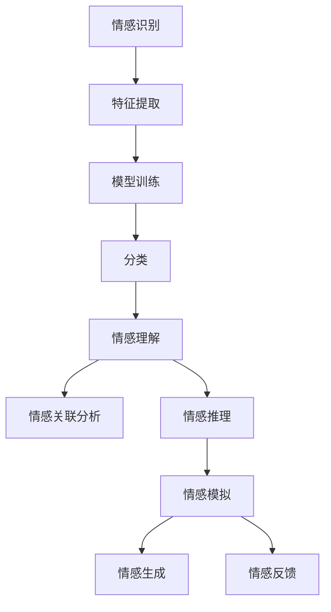
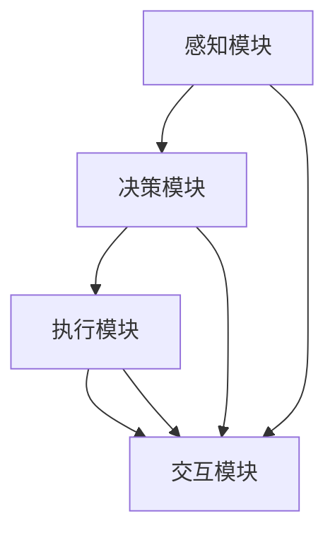
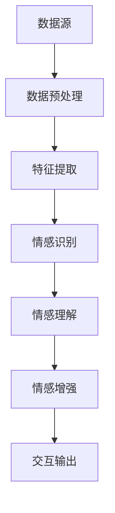
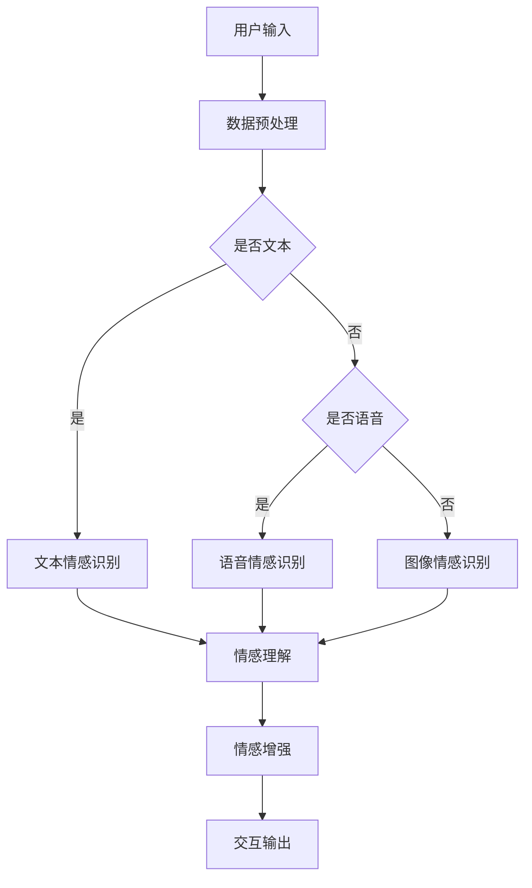
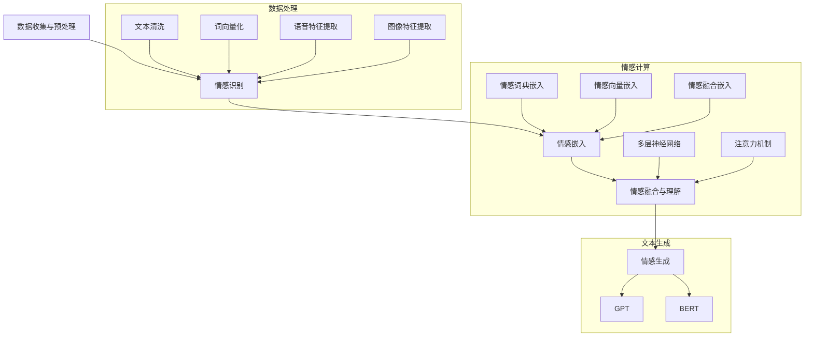

                 

# 情感计算在AI Agent中的应用：增强LLM的EQ

## 概述

随着人工智能技术的不断发展，AI Agent作为人工智能领域的一个重要研究方向，逐渐受到了广泛关注。AI Agent是一种能够模拟人类智能行为，具备自主思考和学习能力的软件系统。然而，传统AI Agent在处理情感交互方面存在一定的局限性，无法准确理解用户的情感状态，从而影响其与用户的互动质量。为了解决这一问题，情感计算（Emotion Computing）应运而生，成为提升AI Agent情感交互能力的关键技术。

本文将围绕情感计算在AI Agent中的应用展开讨论，重点探讨如何利用情感计算技术增强大型语言模型（Large Language Model，LLM）的情感计算能力，从而提升AI Agent的整体性能。文章将首先介绍情感计算的基本概念、发展背景和重要性，然后分析AI Agent的定义、特点以及与传统机器人的区别。接下来，将深入探讨情感计算在AI Agent中的应用，包括情感识别和情感增强的实现方法。随后，文章将介绍LLM的基本概念和作用，并引入情感计算（EQ）的概念，分析EQ与LLM的关系。最后，文章将结合实际案例，展示情感计算在AI Agent中的应用效果，并对未来应用场景进行展望。

通过本文的探讨，我们希望能够为读者提供对情感计算在AI Agent中的应用的深入理解，为相关研究者和开发者提供有价值的参考。

## 关键词

- 情感计算
- AI Agent
- LLM
- 情感识别
- 情感增强
- 自然语言处理

## 摘要

本文探讨了情感计算在AI Agent中的应用，旨在增强大型语言模型（LLM）的情感计算能力。首先，介绍了情感计算的基本概念、发展背景和重要性，分析了AI Agent的定义、特点以及与传统机器人的区别。随后，深入探讨了情感计算在AI Agent中的应用方法，包括情感识别和情感增强的实现。接着，介绍了LLM的基本概念和作用，并引入情感计算（EQ）的概念，分析了EQ与LLM的关系。最后，通过实际案例分析，展示了情感计算在AI Agent中的应用效果，并对未来应用场景进行了展望。

## 第一部分：情感计算与AI Agent概述

### 第1章：情感计算概述

#### 1.1 问题背景

随着人工智能技术的迅速发展，人工智能（AI）系统已经渗透到我们日常生活的方方面面。然而，当前大多数AI系统在处理情感交互方面仍存在一定的局限性。传统AI系统主要依赖于数据和算法来完成任务，但缺乏对人类情感的理解和感知。这导致了AI系统在处理情感问题时，常常表现出机械化的行为，无法真正满足用户的需求。因此，如何提升AI系统的情感计算能力成为一个亟待解决的问题。

情感计算（Emotion Computing）作为一种新兴的技术，旨在通过计算机技术理解和处理人类的情感。它结合了心理学、认知科学和计算机科学等领域的知识，致力于开发出能够识别、理解和模拟人类情感的人工智能系统。情感计算的应用范围非常广泛，包括人机交互、智能客服、心理健康监测、虚拟现实等多个领域。

#### 1.1.1 人工智能的发展与挑战

人工智能（AI）技术的发展可以分为三个主要阶段：规则推理、机器学习和深度学习。早期的AI系统主要依赖于规则推理，即通过编写一系列规则来指导AI系统进行决策。然而，这种方法的局限性在于，当问题复杂度增加时，编写规则的过程变得非常繁琐，且难以覆盖所有可能的情景。

随着机器学习技术的发展，AI系统开始能够通过学习大量数据来自主地做出决策。机器学习技术主要分为监督学习、无监督学习和强化学习三种。监督学习通过已标注的数据来训练模型，无监督学习则通过未标注的数据来发现数据中的模式，而强化学习则通过不断尝试和反馈来优化决策。

深度学习作为机器学习的一种重要分支，通过多层神经网络对数据进行处理，能够实现更高层次的特征提取和抽象。深度学习在图像识别、语音识别和自然语言处理等领域取得了显著的成果，但其在处理情感问题时仍存在一定的局限性。

#### 1.1.2 情感计算的定义与重要性

情感计算是一种利用计算机技术和算法来识别、理解、模拟和交互人类情感的技术。它不仅关注情感的识别和表达，还包括情感的计算和推理。情感计算的定义可以从以下几个方面来理解：

1. **情感识别**：情感计算系统需要能够从文本、语音、图像等多种数据源中识别出人类的情感状态。
2. **情感理解**：情感计算系统不仅要识别情感，还需要理解情感的背景、语境和影响。
3. **情感模拟**：情感计算系统需要能够模拟人类的情感反应，以提供更自然、人性化的交互体验。
4. **情感交互**：情感计算系统需要能够与用户进行情感上的互动，以提升人机交互的效率和质量。

情感计算的重要性体现在以下几个方面：

1. **提升人机交互体验**：通过情感计算，AI系统能够更好地理解用户的需求和情感状态，提供更个性化的服务。
2. **促进心理健康**：情感计算在心理健康监测、心理咨询和治疗等领域具有广泛的应用前景，有助于提高人们的心理健康水平。
3. **辅助教育**：情感计算在教育领域的应用，如智能教育系统、虚拟辅导员等，能够更好地满足学生的个性化学习需求。
4. **智能客服**：情感计算在智能客服中的应用，能够提升客服机器人对用户情感的理解和响应能力，提供更高效、人性化的服务。
5. **人机协作**：在工业、医疗等领域，情感计算能够提高人与机器的协作效率，减少人为错误。

总之，情感计算作为一种新兴技术，具有广阔的应用前景和重要的研究价值。通过本文的探讨，我们将进一步了解情感计算的基本概念、发展背景和重要性，为后续章节的深入分析奠定基础。

#### 1.2 情感计算的核心概念与联系

情感计算的核心概念主要包括情感识别、情感理解、情感模拟和情感交互。这些概念相互联系，共同构成了情感计算的理论基础和应用框架。

##### 1.2.1 情感计算的概念

情感计算（Emotion Computing）是一种通过计算机技术和算法来识别、理解、模拟和交互人类情感的技术。它关注的核心问题是如何从各种数据源（如文本、语音、图像等）中提取情感信息，并利用这些信息进行有效的情感分析和应用。

情感计算的定义可以从以下几个方面来具体阐述：

1. **情感识别**：情感识别是指通过分析文本、语音、图像等数据，从数据中提取出与情感相关的信息。这一过程通常涉及情感分类、情感强度识别和情感倾向分析等任务。

2. **情感理解**：情感理解是指对识别出的情感信息进行深入分析，理解情感的背景、语境和影响。这一过程不仅涉及情感本身，还包括情感与情感之间的关联和互动。

3. **情感模拟**：情感模拟是指通过计算机技术和算法，模拟出人类的情感反应。这一过程旨在提供更自然、人性化的交互体验，使AI系统在与用户的互动中表现出更多的情感共鸣。

4. **情感交互**：情感交互是指AI系统与用户之间进行情感上的互动。这一过程不仅包括情感信息的传递，还包括情感反馈、情感引导和情感共鸣等互动方式。

##### 1.2.2 情感计算的关键要素

情感计算的关键要素包括情感识别、情感理解、情感模拟和情感交互。这些要素相互关联，共同构成了情感计算的核心。

1. **情感识别**：情感识别是情感计算的基础。它依赖于文本分析、语音识别、图像识别等技术的支持。通过情感识别，AI系统能够从各种数据源中提取情感信息。

2. **情感理解**：情感理解是情感识别的深化。它不仅涉及情感识别，还包括对情感背景、语境和影响的深入分析。情感理解能够帮助AI系统更好地理解用户的情感状态，提供更个性化的服务。

3. **情感模拟**：情感模拟是情感理解的应用。通过情感模拟，AI系统能够在交互中表现出更多的情感共鸣，提升用户体验。

4. **情感交互**：情感交互是情感模拟的延伸。它不仅涉及情感信息的传递，还包括情感反馈、情感引导和情感共鸣等互动方式。情感交互能够增强AI系统与用户之间的互动效果，提升人机协作效率。

##### 1.2.3 情感计算与传统AI的区别

情感计算与传统AI在目标、技术和应用上存在明显的区别。

1. **目标**：

   - 传统AI：传统AI的主要目标是使计算机具备处理复杂任务的能力，如图像识别、语音识别和自然语言处理等。它关注的是如何让计算机更加高效、准确地完成任务。

   - 情感计算：情感计算的主要目标是使计算机能够理解、模拟和交互人类的情感。它关注的是如何让计算机具备情感智能，提升人机交互体验。

2. **技术**：

   - 传统AI：传统AI主要依赖于机器学习和深度学习等技术。这些技术通过训练大量的数据模型，使计算机能够自主学习和做出决策。

   - 情感计算：情感计算不仅依赖于机器学习和深度学习技术，还需要结合心理学、认知科学和人类行为学等领域的知识。这些技术共同作用，使AI系统能够更准确地识别和理解人类情感。

3. **应用**：

   - 传统AI：传统AI在工业生产、医疗诊断、自动驾驶等领域具有广泛的应用。它主要服务于提升生产效率、降低成本和提高生活质量。

   - 情感计算：情感计算在人机交互、心理健康监测、智能客服、教育等领域具有广泛的应用。它主要服务于提升用户体验、促进心理健康和改善社会关系。

总之，情感计算与传统AI在目标、技术和应用上存在明显的区别。情感计算更注重情感智能的构建，旨在提升人机交互体验，而传统AI则更关注任务处理能力的提升。这种区别决定了情感计算在人工智能发展中的独特地位和重要意义。

#### 1.3 情感计算的数学模型与算法原理

在情感计算中，数学模型和算法原理起着至关重要的作用。它们帮助我们从数据中提取情感信息，并进行有效的情感分析和应用。以下将详细介绍情感识别的数学模型、情感计算的主要算法原理，以及情感计算的mermaid流程图。

##### 1.3.1 情感识别的数学模型

情感识别是情感计算的核心任务之一，其数学模型主要基于情感分类和情感强度识别。

1. **情感分类**：

   情感分类是指将文本、语音或图像等数据中的情感标签进行分类。常见的情感分类模型包括支持向量机（SVM）、朴素贝叶斯（Naive Bayes）、决策树（Decision Tree）和深度学习模型等。

   - **支持向量机（SVM）**：SVM是一种监督学习模型，通过寻找最优超平面来实现情感分类。其数学模型为：
     $$
     \text{max}\ \ \ \frac{1}{2} \sum_{i=1}^{n} w_i^2 \quad s.t. \quad y_i ( \sum_{j=1}^{n} w_j \cdot x_i^j ) \geq 1
     $$
     其中，$w_i$ 为权重，$x_i^j$ 为特征向量，$y_i$ 为情感标签。

   - **朴素贝叶斯（Naive Bayes）**：朴素贝叶斯是一种基于贝叶斯定理的分类模型，假设特征之间相互独立。其数学模型为：
     $$
     P(C_k | x) = \frac{P(x | C_k) P(C_k)}{P(x)}
     $$
     其中，$C_k$ 为情感类别，$x$ 为特征向量。

   - **决策树（Decision Tree）**：决策树是一种树形结构模型，通过递归划分特征空间来实现情感分类。其数学模型为：
     $$
     \text{递归划分} \ \ x_{j}^{(t)} = \theta_{j}^{(t)}
     $$
     其中，$x_{j}^{(t)}$ 为第$t$次划分的特征，$\theta_{j}^{(t)}$ 为第$t$次划分的阈值。

   - **深度学习模型**：深度学习模型，如卷积神经网络（CNN）和循环神经网络（RNN），通过多层神经网络对特征进行提取和抽象，实现情感分类。其数学模型为：
     $$
     h_{l}^{(i)} = \sigma( \sum_{j=1}^{n} w_{ji} \cdot h_{l-1}^{(j)} + b_{l} )
     $$
     其中，$h_{l}^{(i)}$ 为第$l$层的第$i$个神经元输出，$\sigma$ 为激活函数，$w_{ji}$ 和 $b_{l}$ 分别为权重和偏置。

2. **情感强度识别**：

   情感强度识别是指对已分类的情感进行强度估计。常见的情感强度识别模型包括回归模型和神经网络模型。

   - **回归模型**：回归模型通过线性回归或多项式回归对情感强度进行估计。其数学模型为：
     $$
     y = \sum_{i=1}^{n} w_i x_i + b
     $$
     其中，$y$ 为情感强度，$x_i$ 为特征，$w_i$ 和 $b$ 分别为权重和偏置。

   - **神经网络模型**：神经网络模型通过多层神经网络对情感强度进行估计。其数学模型与情感分类类似，但输出层为情感强度。

##### 1.3.2 情感计算的主要算法原理

情感计算的主要算法原理包括情感识别、情感理解和情感模拟。

1. **情感识别**：

   情感识别主要通过特征提取、模型训练和分类实现。特征提取是将原始数据转化为机器可处理的形式，常见的特征提取方法包括词袋模型（Bag-of-Words，BOW）、TF-IDF（Term Frequency-Inverse Document Frequency）和词嵌入（Word Embedding）等。模型训练是利用已标注的数据训练情感分类模型，常见的模型包括SVM、朴素贝叶斯、决策树和深度学习模型等。分类是利用训练好的模型对未标注的数据进行情感分类。

2. **情感理解**：

   情感理解主要通过情感关联分析和情感推理实现。情感关联分析是分析情感标签之间的关联性，如高兴与兴奋的关联性。情感推理是通过情感关联分析，推断未知情感标签的情感属性，如根据已知情感标签推断未标注情感标签的情感状态。

3. **情感模拟**：

   情感模拟主要通过情感生成和情感反馈实现。情感生成是根据情感标签生成相应的情感表达，如文字、声音和图像等。情感反馈是根据用户情感状态调整AI系统的交互策略，如根据用户的高兴情感状态，提供更积极、鼓励的回复。

##### 1.3.3 情感计算的mermaid流程图

情感计算的mermaid流程图如下所示：

通过mermaid流程图，我们可以清晰地看到情感计算的核心流程，包括情感识别、情感理解和情感模拟。这些流程相互关联，共同构成了情感计算的系统框架。

综上所述，情感计算的数学模型和算法原理为情感计算提供了坚实的理论基础。通过情感识别、情感理解和情感模拟，情感计算能够实现更智能、更人性化的情感交互，提升AI系统的整体性能。在未来，随着技术的不断进步，情感计算将在人工智能领域发挥更加重要的作用。

### 第2章：AI Agent的基本概念与架构

#### 2.1 AI Agent的定义与特点

AI Agent（人工智能代理）是一种能够模拟人类智能行为，具备自主思考和学习能力的软件系统。它通过感知环境、理解用户需求、自主决策和行动，实现与环境的互动和任务完成。AI Agent的定义可以从以下几个方面来理解：

1. **自主性**：AI Agent具备自主性，能够在没有人类干预的情况下独立完成任务。它通过内部算法和模型对环境进行感知、分析和决策，以实现自主行动。

2. **交互性**：AI Agent具备交互性，能够与人类用户和其他系统进行有效沟通和互动。通过语音、文本、图像等多种方式，AI Agent能够理解用户的需求，并根据用户反馈进行行动调整。

3. **学习能力**：AI Agent具备学习能力，能够通过不断的学习和训练，提高其智能水平和任务完成能力。它通过机器学习和深度学习技术，从数据中提取知识和模式，以优化自身的决策和行为。

4. **适应性**：AI Agent具备适应性，能够根据环境和任务的变化，调整自身的行为和策略。它通过自适应算法，对环境进行动态感知和建模，以实现高效的任务完成。

AI Agent与传统机器人相比，具有以下特点：

1. **智能性**：传统机器人主要依赖于预定义的规则和程序进行操作，而AI Agent则具备更高的智能性，能够通过学习和适应实现更复杂的任务。

2. **交互性**：传统机器人通常只能执行固定的动作，而AI Agent则具备交互性，能够与用户进行有效的沟通和互动，提供更人性化的服务。

3. **自主性**：传统机器人需要人类进行控制，而AI Agent则具备自主性，能够在没有人类干预的情况下独立完成任务。

4. **适应性**：传统机器人对环境变化的适应能力较弱，而AI Agent则具备更强的适应性，能够根据环境和任务的变化，调整自身的行为和策略。

总之，AI Agent作为一种具备自主性、交互性、学习能力和适应性的软件系统，具有广泛的潜在应用。通过不断的学习和优化，AI Agent能够实现更智能、更高效的任务完成，为人类带来更多便利和福祉。

#### 2.2 AI Agent的架构

AI Agent的架构主要包括感知模块、决策模块、执行模块和交互模块。这些模块相互协作，共同实现AI Agent的功能和任务。以下将详细讨论AI Agent的基本架构、核心组件及其相互关系。

##### 2.2.1 AI Agent的基本架构

AI Agent的基本架构可以概括为以下四个模块：

1. **感知模块**：感知模块负责接收和处理来自环境的信息，包括文本、语音、图像等多种数据形式。通过感知模块，AI Agent能够了解当前环境的状态和变化，为后续决策提供基础。

2. **决策模块**：决策模块是AI Agent的核心，负责根据感知模块获取的信息，结合预定义的规则和模型，进行决策和规划。决策模块通过机器学习和深度学习技术，不断优化自身的决策能力和效果。

3. **执行模块**：执行模块负责将决策模块生成的行动指令转化为具体的操作，实现AI Agent对环境的实际影响。执行模块通常包含各种物理设备或虚拟代理，如机器人、无人机等。

4. **交互模块**：交互模块负责与人类用户或其他系统进行有效的沟通和互动。通过交互模块，AI Agent能够理解用户的需求，并根据用户反馈进行调整，提供更人性化、个性化的服务。

##### 2.2.2 AI Agent的核心组件

AI Agent的核心组件包括感知组件、决策组件、执行组件和交互组件。以下将分别介绍这些组件的功能和特点。

1. **感知组件**：

   感知组件是AI Agent的“眼睛”和“耳朵”，负责接收和处理来自环境的信息。感知组件通常包含多种传感器，如摄像头、麦克风、传感器等，能够获取图像、语音、温度、湿度等数据。感知组件的功能包括数据采集、特征提取和预处理等。

   - **功能**：感知组件的主要功能是采集环境数据，提取关键特征，并将这些特征转化为数字信号，供后续处理使用。

   - **特点**：感知组件具有较高的实时性和准确性，能够快速、准确地获取环境信息。

2. **决策组件**：

   决策组件是AI Agent的“大脑”，负责根据感知组件获取的信息，结合预定义的规则和模型，生成行动指令。决策组件通常包含各种算法和模型，如机器学习模型、深度学习模型、逻辑推理模型等。

   - **功能**：决策组件的主要功能是进行数据分析和模式识别，生成最优的行动策略。

   - **特点**：决策组件具有较高的智能性和自适应能力，能够根据环境和任务的变化，调整自身的决策和行为。

3. **执行组件**：

   执行组件是AI Agent的“手臂”和“腿”，负责将决策组件生成的行动指令转化为具体的操作，实现AI Agent对环境的实际影响。执行组件通常包含各种物理设备或虚拟代理，如机器人、无人机等。

   - **功能**：执行组件的主要功能是实现AI Agent的物理操作，执行决策模块生成的行动指令。

   - **特点**：执行组件具有较高的实时性和稳定性，能够高效、准确地执行各种操作。

4. **交互组件**：

   交互组件是AI Agent的“嘴巴”和“耳朵”，负责与人类用户或其他系统进行有效的沟通和互动。通过交互组件，AI Agent能够理解用户的需求，并根据用户反馈进行调整，提供更人性化、个性化的服务。

   - **功能**：交互组件的主要功能是进行人机交互和信息传递，包括语音识别、语音合成、文本识别、文本生成等。

   - **特点**：交互组件具有较高的自然性和人性化，能够与用户进行顺畅、自然的互动。

##### 2.2.3 AI Agent的核心组件关系

AI Agent的核心组件之间相互关联，共同实现AI Agent的功能和任务。以下将讨论这些组件之间的关系和协作机制。

1. **感知组件与决策组件的关系**：

   感知组件和决策组件之间通过数据传递进行协作。感知组件将采集到的环境数据传递给决策组件，决策组件根据这些数据进行分析和模式识别，生成行动指令。感知组件和决策组件之间的数据传递需要保证实时性和准确性，以确保AI Agent能够快速、准确地响应环境变化。

2. **决策组件与执行组件的关系**：

   决策组件和执行组件之间通过指令传递进行协作。决策组件生成行动指令后，传递给执行组件，执行组件根据这些指令进行物理操作，实现AI Agent对环境的实际影响。决策组件和执行组件之间的指令传递需要确保执行的正确性和稳定性，以确保AI Agent能够高效、准确地完成任务。

3. **交互组件与感知组件、决策组件、执行组件的关系**：

   交互组件与感知组件、决策组件、执行组件之间通过信息传递进行协作。交互组件负责接收用户输入的信息，传递给感知组件、决策组件和执行组件，感知组件和决策组件根据这些信息进行数据分析和模式识别，生成行动指令，执行组件根据这些指令进行物理操作。同时，交互组件负责将执行组件的反馈信息传递给用户，实现人机交互。

总之，AI Agent的核心组件之间通过数据传递、指令传递和信息传递进行协作，共同实现AI Agent的功能和任务。通过不断优化组件之间的关系和协作机制，AI Agent能够实现更高效、更智能的任务完成，为人类带来更多便利和福祉。

#### 2.2.4 AI Agent的mermaid架构图

为了更直观地展示AI Agent的架构和组件关系，我们使用mermaid绘制了AI Agent的mermaid架构图：

在这个mermaid架构图中，感知模块、决策模块、执行模块和交互模块分别表示AI Agent的四个核心组件。它们通过数据传递、指令传递和信息传递进行协作，共同实现AI Agent的功能和任务。通过这个架构图，我们可以清晰地看到AI Agent各组件之间的关系和协作机制。

综上所述，AI Agent的架构和组件设计为AI Agent实现智能、自主和高效的运行提供了基础。随着技术的不断进步，AI Agent将在更多领域发挥作用，为人类带来更多便利和福祉。

### 第3章：情感计算在AI Agent中的应用

#### 3.1 情感计算在AI Agent中的作用

情感计算在AI Agent中的应用具有重要意义，它能够显著提升AI Agent的情感交互能力，实现更自然、人性化的用户体验。以下是情感计算在AI Agent中的主要作用：

1. **提升交互质量**：通过情感计算，AI Agent能够识别用户的情感状态，并根据情感反馈调整交互策略，提供更符合用户需求的回应。这种个性化的交互方式能够提升用户满意度，增强用户与AI Agent之间的情感联系。

2. **增强情感共鸣**：情感计算使AI Agent能够模拟人类的情感反应，实现情感共鸣。在客服、教育、医疗等领域，情感共鸣能够提高用户的信任感和依赖度，从而提高服务的有效性和可靠性。

3. **优化决策过程**：情感计算能够帮助AI Agent理解用户的情感状态和需求，从而优化决策过程。通过情感分析，AI Agent能够识别用户的情绪变化，及时调整策略，避免错误决策，提高任务完成的准确性。

4. **促进人机协作**：在工业、农业等领域，情感计算能够提高人与机器的协作效率，减少人为错误。通过情感交互，AI Agent能够更好地理解人类操作者的意图，提供及时、有效的指导和支持，从而提升整体工作效能。

5. **辅助心理健康**：情感计算在心理健康监测、心理咨询和治疗等领域具有广泛的应用前景。通过情感分析，AI Agent能够及时发现用户的情绪问题，提供针对性的建议和干预，帮助用户维护心理健康。

#### 3.1.1 情感计算如何增强AI Agent

情感计算通过以下几个方面来增强AI Agent：

1. **情感识别**：情感计算利用自然语言处理（NLP）、语音识别和图像识别等技术，从文本、语音、图像等多种数据源中识别用户的情感状态。通过情感识别，AI Agent能够获取用户的情感信息，为后续处理提供基础。

2. **情感理解**：情感理解是情感计算的核心，它通过对识别出的情感信息进行深入分析，理解情感的背景、语境和影响。情感理解能够帮助AI Agent更好地理解用户的需求，提供更个性化的服务。

3. **情感模拟**：情感模拟是指通过计算机技术和算法，模拟出人类的情感反应。通过情感模拟，AI Agent能够实现情感共鸣，提升用户交互体验。

4. **情感增强**：情感增强是指通过情感计算技术，对AI Agent的交互策略进行优化，使其在处理情感交互时表现得更加自然和人性化。情感增强能够提高AI Agent的情感交互能力，增强用户满意度。

#### 3.1.2 情感计算在AI Agent中的应用场景

情感计算在AI Agent中的应用场景非常广泛，以下列举一些典型的应用场景：

1. **智能客服**：在智能客服领域，情感计算能够提升客服机器人对用户情感的理解和响应能力。通过情感识别和情感理解，客服机器人能够准确捕捉用户情感状态，提供更加贴心的服务。例如，当用户表达愤怒情绪时，客服机器人能够主动安抚用户情绪，提供解决方案，从而提高用户满意度。

2. **智能教育**：在智能教育领域，情感计算能够提升教育机器人对学生的情感理解和互动能力。通过情感识别和情感理解，教育机器人能够根据学生的情感状态调整教学策略，提供个性化的学习支持。例如，当学生表现出沮丧情绪时，教育机器人能够及时提供鼓励和支持，帮助学生克服学习困难。

3. **虚拟助理**：在虚拟助理领域，情感计算能够提升虚拟助手对用户需求的理解和响应能力。通过情感识别和情感理解，虚拟助手能够更准确地理解用户的意图，提供个性化的服务。例如，当用户表达对某个产品的喜好时，虚拟助手能够根据情感分析结果，推荐更多相似产品，提高用户购物体验。

4. **心理健康监测**：在心理健康监测领域，情感计算能够通过分析用户情感状态，及时发现心理问题。例如，通过分析用户的语音、文本和面部表情，情感计算系统可以识别出用户抑郁、焦虑等情绪问题，为心理咨询和治疗提供参考。

5. **人机协作**：在人机协作领域，情感计算能够提高人与机器之间的协作效率。通过情感识别和情感理解，AI Agent能够更好地理解人类操作者的意图，提供及时、有效的支持。例如，在工业生产中，AI Agent可以通过情感分析，识别出操作者的疲劳情绪，提醒操作者休息，从而避免安全事故。

总之，情感计算在AI Agent中的应用，能够显著提升AI Agent的情感交互能力，实现更自然、人性化的用户体验。通过不断优化情感计算技术，AI Agent将在更多领域发挥重要作用，为人类带来更多便利和福祉。

#### 3.2 情感计算在AI Agent中的实现

情感计算在AI Agent中的实现涉及多个关键步骤，包括情感识别、情感理解和情感增强。以下是情感计算在AI Agent中的实现方法及其具体流程。

##### 3.2.1 情感识别的实现

情感识别是情感计算的基础，它通过分析文本、语音和图像等数据源，识别出用户的情感状态。以下是情感识别的实现方法：

1. **文本情感识别**：

   - **数据预处理**：首先对文本数据进行预处理，包括去除标点符号、停用词过滤和词干提取等。然后使用词嵌入技术将文本转化为向量表示。
   - **特征提取**：利用词袋模型（Bag-of-Words，BOW）或词嵌入（Word Embedding）技术提取文本特征。
   - **情感分类**：使用机器学习或深度学习模型（如SVM、朴素贝叶斯、CNN、LSTM等）进行情感分类。训练模型时使用大量已标注的情感数据集。

2. **语音情感识别**：

   - **音频预处理**：对语音数据进行预处理，包括去噪、增强和分帧等。然后对每个帧进行特征提取。
   - **特征提取**：提取语音特征，如梅尔频率倒谱系数（MFCC）、频谱特征和能量特征等。
   - **情感分类**：使用机器学习或深度学习模型对提取的特征进行情感分类。

3. **图像情感识别**：

   - **图像预处理**：对图像进行预处理，包括缩放、裁剪和归一化等。
   - **特征提取**：使用卷积神经网络（CNN）提取图像特征。
   - **情感分类**：使用机器学习或深度学习模型对提取的特征进行情感分类。

##### 3.2.2 情感增强的实现

情感增强是通过调整AI Agent的交互策略，使其在处理情感交互时表现得更加自然和人性化。以下是情感增强的实现方法：

1. **情感标签调整**：根据识别出的情感状态，调整AI Agent的回复文本、语音和表情等。例如，当用户表达愤怒情绪时，AI Agent可以调整回复语气，使用更温和的语言。

2. **情感融合**：结合多个情感识别结果，生成更准确的情感状态。例如，通过融合文本情感识别和语音情感识别的结果，提高情感识别的准确性。

3. **情感推理**：利用情感推理技术，推断用户未明确表达的情感状态。例如，当用户表达出困惑情绪时，AI Agent可以推断用户可能对某个问题感到困惑，并提供相关的帮助。

##### 3.2.3 情感计算在AI Agent中的mermaid流程图

为了更直观地展示情感计算在AI Agent中的实现过程，我们使用mermaid绘制了情感计算的mermaid流程图：

在这个mermaid流程图中，数据源（如文本、语音、图像等）首先经过数据预处理，然后进行特征提取。接着，特征被用于情感识别，识别结果经过情感理解，并结合情感增强技术，最终生成交互输出。

总之，情感计算在AI Agent中的实现涉及多个关键步骤，包括数据预处理、特征提取、情感识别、情感理解和情感增强。通过这些步骤，AI Agent能够准确识别用户的情感状态，并根据情感状态调整交互策略，提供更自然、人性化的用户体验。

#### 3.3 情感计算在AI Agent中的mermaid流程图

为了更直观地展示情感计算在AI Agent中的应用流程，我们使用mermaid绘制了情感计算在AI Agent中的mermaid流程图：

在这个mermaid流程图中，用户输入经过数据预处理后，根据数据类型分别进入文本情感识别、语音情感识别或图像情感识别模块。各模块识别出情感状态后，传递给情感理解模块。情感理解模块结合识别结果，生成更准确的情感状态。接着，情感增强模块根据情感状态调整交互策略，最终生成交互输出。

通过这个mermaid流程图，我们可以清晰地看到情感计算在AI Agent中的应用流程，包括数据预处理、情感识别、情感理解和情感增强等步骤。这一流程有助于开发者更好地理解和实现情感计算在AI Agent中的应用。

### 第4章：增强LLM的EQ

#### 4.1 LLM的基本概念与作用

大型语言模型（Large Language Model，LLM）是一种基于深度学习技术构建的复杂模型，能够在大量文本数据上进行预训练，从而具备强大的语言理解和生成能力。LLM的基本概念与作用主要体现在以下几个方面：

##### 4.1.1 LLM的定义

LLM是一种能够处理自然语言文本的深度学习模型，通常由数亿甚至数十亿个参数组成。这些参数通过在大量文本数据上进行训练，学习到语言的语法、语义和上下文信息。LLM的核心目标是理解和生成符合自然语言习惯的文本，从而在各种应用场景中发挥重要作用。

##### 4.1.2 LLM的基本原理

LLM的基本原理基于深度学习中的神经网络，特别是变分自编码器（Variational Autoencoder，VAE）和生成对抗网络（Generative Adversarial Network，GAN）等技术。LLM通过以下几个步骤实现语言理解和生成：

1. **文本编码**：将输入文本转化为向量表示，通常使用词嵌入技术，如Word2Vec、GloVe等。
2. **上下文学习**：通过多层神经网络，学习文本中的上下文信息，理解词语之间的关联性和语义关系。
3. **生成文本**：基于学习到的上下文信息，生成符合自然语言习惯的输出文本。

##### 4.1.3 LLM在自然语言处理中的应用

LLM在自然语言处理（Natural Language Processing，NLP）领域具有广泛的应用，包括但不限于以下方面：

1. **文本分类**：LLM可以用于对大量文本进行分类，如情感分类、主题分类等。通过在预训练数据上训练分类模型，LLM能够识别文本中的关键信息，实现高精度的分类结果。
2. **问答系统**：LLM可以构建智能问答系统，通过理解用户输入的问题，搜索相关文档，并生成准确的回答。例如，搜索引擎、虚拟助手等应用场景中广泛使用LLM技术。
3. **机器翻译**：LLM可以用于机器翻译任务，通过学习多语言的文本数据，实现跨语言的信息传递。现代机器翻译系统如Google Translate、百度翻译等，均采用基于LLM的翻译模型。
4. **文本生成**：LLM可以生成各种类型的文本，如文章、故事、对话等。通过输入关键词或主题，LLM能够生成连贯、有趣的文本，应用于自动写作、内容生成等领域。
5. **对话系统**：LLM可以构建对话系统，实现人与机器的智能交互。通过训练对话模型，LLM能够理解用户的意图，生成自然的回复，提升人机交互体验。

总之，LLM作为一种先进的自然语言处理技术，具有强大的语言理解和生成能力，广泛应用于文本分类、问答系统、机器翻译、文本生成和对话系统等多个领域，为人工智能技术的发展提供了重要支撑。

#### 4.2 EQ的概念与特点

情感计算（Emotion Computing，EQ）是一种利用计算机技术和算法来识别、理解和模拟人类情感的技术。情感计算在人工智能（AI）中的应用，为增强AI系统的情感智能提供了重要的支持。以下是EQ的概念、特点以及与LLM的关系。

##### 4.2.1 EQ的定义

情感计算（EQ）是指通过计算机技术和算法，对人类情感进行识别、理解和模拟的过程。它涉及多个学科领域，包括心理学、认知科学、计算机科学和人工智能等。情感计算的目标是使计算机系统能够理解和模拟人类的情感状态，从而提供更自然、人性化的交互体验。

##### 4.2.2 EQ的特点

情感计算具有以下特点：

1. **多模态识别**：情感计算能够从多种数据源中识别情感，如文本、语音、图像和面部表情等。这种多模态识别能力使得情感计算在处理复杂情感场景时具有更高的准确性和鲁棒性。

2. **情感理解**：情感计算不仅能够识别情感，还能够理解情感的背景、语境和影响。这种情感理解能力使得AI系统能够更好地理解用户的情感需求，提供更个性化的服务。

3. **情感模拟**：情感计算能够模拟人类的情感反应，使计算机系统在与用户的互动中表现出情感共鸣。这种情感模拟能力能够提升用户体验，增强人机交互的自然性。

4. **自适应**：情感计算能够根据用户的情感状态和需求，自适应地调整交互策略。这种自适应能力使得AI系统能够更灵活地应对不同用户和场景的需求。

##### 4.2.3 EQ与LLM的关系

情感计算（EQ）与大型语言模型（LLM）之间存在密切的关系。LLM作为一种先进的自然语言处理技术，具有强大的语言理解和生成能力，而EQ则提供了对情感信息的识别、理解和模拟能力。以下从几个方面探讨EQ与LLM的关系：

1. **数据融合**：EQ和LLM可以在数据融合方面进行协同工作。EQ可以从多种数据源中提取情感信息，如文本情感、语音情感和图像情感等，而LLM则可以处理和分析这些情感信息，生成符合自然语言习惯的文本。

2. **增强LLM的情感理解**：通过结合EQ技术，LLM可以增强其情感理解能力。例如，当LLM处理一个包含情感信息的文本时，EQ可以帮助LLM更好地理解文本中的情感内容，从而生成更准确的情感回应。

3. **改进人机交互**：EQ和LLM的结合能够显著改进人机交互。通过EQ技术，LLM可以识别用户的情感状态，并根据情感状态调整交互策略，提供更自然、人性化的交互体验。

4. **情感增强**：EQ技术可以为LLM提供情感增强功能。例如，在生成文本时，EQ可以指导LLM生成更符合用户情感需求的文本，从而提升用户体验。

总之，情感计算（EQ）与大型语言模型（LLM）相互补充，共同构建了具有情感智能的AI系统。通过结合EQ技术，LLM能够实现更强大的情感理解、生成和交互能力，为人工智能的发展注入新的动力。

#### 4.3 EQ在LLM中的实现

情感计算（EQ）在大型语言模型（LLM）中的应用，可以显著提升LLM的情感理解与生成能力。以下是EQ在LLM中的实现原理、实现流程及其mermaid流程图。

##### 4.3.1 EQ在LLM中的实现原理

EQ在LLM中的实现主要基于以下几个步骤：

1. **情感识别**：利用情感计算技术，从文本、语音和图像等多种数据源中识别用户的情感状态。情感识别可以采用自然语言处理（NLP）技术、语音识别技术和图像识别技术等。

2. **情感嵌入**：将识别出的情感状态转化为向量表示，并将其嵌入到LLM的输入序列中。情感嵌入可以通过情感词典、情感向量和情感融合等方式实现。

3. **情感融合**：将情感向量与LLM的输入向量进行融合，生成新的输入向量。情感融合可以采用线性融合、非线性融合和多模态融合等方法。

4. **情感理解**：利用融合后的输入向量，LLM对情感信息进行理解和处理。通过多层神经网络和注意力机制等深度学习技术，LLM可以捕捉文本中的情感内容，并生成相应的情感回应。

5. **情感生成**：根据情感理解和处理结果，LLM生成符合用户情感需求的文本。情感生成可以通过文本生成模型（如GPT、BERT等）实现。

##### 4.3.2 EQ在LLM中的实现流程

EQ在LLM中的实现流程可以分为以下几个步骤：

1. **数据收集与预处理**：收集包含情感信息的文本、语音和图像数据，并进行预处理。预处理包括文本清洗、词向量化、语音特征提取和图像特征提取等。

2. **情感识别**：利用情感计算技术，对预处理后的数据进行情感识别。情感识别可以采用情感词典、情感向量和情感分类器等方法。

3. **情感嵌入**：将识别出的情感状态转化为向量表示，并将其嵌入到LLM的输入序列中。情感嵌入可以通过情感词典嵌入、情感向量嵌入和情感融合嵌入等方法实现。

4. **情感融合与理解**：将情感向量与LLM的输入向量进行融合，生成新的输入向量。利用融合后的输入向量，LLM对情感信息进行理解和处理。这一步骤可以通过多层神经网络和注意力机制等深度学习技术实现。

5. **情感生成**：根据情感理解和处理结果，LLM生成符合用户情感需求的文本。情感生成可以通过文本生成模型（如GPT、BERT等）实现。

##### 4.3.3 EQ在LLM中的mermaid流程图

为了更直观地展示EQ在LLM中的实现流程，我们使用mermaid绘制了EQ在LLM中的mermaid流程图：

在这个mermaid流程图中，数据收集与预处理步骤包括文本清洗、词向量化、语音特征提取和图像特征提取等。情感识别步骤利用情感词典、情感向量和情感分类器等方法。情感嵌入步骤包括情感词典嵌入、情感向量嵌入和情感融合嵌入等。情感融合与理解步骤通过多层神经网络和注意力机制等深度学习技术实现。最后，情感生成步骤通过GPT和BERT等文本生成模型实现。

通过这个mermaid流程图，我们可以清晰地看到EQ在LLM中的实现过程，包括数据处理、情感计算和文本生成等步骤。这一流程有助于开发者更好地理解和实现EQ在LLM中的应用。

### 第5章：实际案例分析

#### 5.1 案例一：情感计算在客服机器人中的应用

##### 5.1.1 案例背景

随着电子商务和在线服务行业的快速发展，智能客服机器人逐渐成为企业提升客户服务质量和效率的重要工具。然而，传统客服机器人主要依赖于预定义的规则和模板，往往无法满足用户多样化和个性化的需求。为了提升客服机器人对用户情感的理解和响应能力，企业开始探索将情感计算技术应用于客服机器人，从而提供更自然、人性化的服务。

##### 5.1.2 案例分析

该案例的核心目标是通过情感计算技术，增强客服机器人的情感识别和情感响应能力，提升用户满意度。具体分析如下：

1. **情感识别**：

   - **文本情感识别**：通过自然语言处理（NLP）技术，对用户在聊天窗口中的文本进行情感识别。利用情感词典和情感分类模型，如SVM和LSTM，客服机器人能够识别出用户文本中的情感标签，如快乐、愤怒、悲伤等。

   - **语音情感识别**：通过语音识别技术，对用户在语音通话中的语音进行情感识别。利用语音特征提取和情感分类算法，如MFCC和卷积神经网络（CNN），客服机器人能够识别出用户语音中的情感状态。

   - **图像情感识别**：通过图像识别技术，对用户上传的图片中的情感状态进行识别。利用卷积神经网络（CNN）和情感分类模型，客服机器人能够识别出图片中的情感标签，如微笑、皱眉等。

2. **情感理解**：

   - **情感融合**：将文本情感识别、语音情感识别和图像情感识别的结果进行融合，生成更准确的用户情感状态。通过情感融合算法，客服机器人能够综合考虑多种数据源，提供更全面、准确的情感分析。

   - **情感推理**：基于情感融合结果，客服机器人进行情感推理，理解用户的情感背景和语境。例如，当用户表达愤怒情绪时，客服机器人能够推断用户可能面临的问题，并提供针对性的解决方案。

3. **情感响应**：

   - **情感模拟**：通过情感模拟技术，客服机器人能够在对话中表现出相应的情感反应。例如，当用户表达快乐情绪时，客服机器人可以使用欢快的语调进行回复，增强用户情感共鸣。

   - **情感调整**：根据用户情感状态，客服机器人可以调整交互策略，提供更符合用户情感需求的服务。例如，当用户表达悲伤情绪时，客服机器人可以采用温和、安抚的语言，提供情感支持。

##### 5.1.3 案例总结

通过将情感计算技术应用于客服机器人，企业显著提升了客服机器人的情感识别和响应能力，从而提升了用户体验和满意度。具体成果包括：

- **提升用户满意度**：通过准确识别用户情感状态，客服机器人能够提供更个性化、贴心的服务，提升用户满意度。
- **优化客服效率**：情感计算技术使客服机器人能够更有效地处理复杂情感交互，减少人工客服的负担，提升整体客服效率。
- **增强人机交互**：通过情感模拟和情感调整，客服机器人能够与用户建立更自然的情感联系，增强人机交互体验。

然而，情感计算在客服机器人中的应用仍面临一些挑战，如情感识别准确性、情感理解深度和情感交互的自然性等。未来，随着情感计算技术的不断发展和完善，客服机器人将能够在更多场景中发挥作用，为企业和用户提供更高品质的服务。

#### 5.2 案例二：情感计算在教育机器人中的应用

##### 5.2.1 案例背景

在教育领域，智能教育机器人作为一种新兴的教育工具，正逐渐受到教育者和学生的青睐。智能教育机器人通过互动教学、个性化辅导等功能，能够提高学生的学习兴趣和效果。然而，传统教育机器人主要依赖于预定义的教学内容和学习路径，难以满足学生多样化的学习需求和情感需求。为了提升教育机器人的教学效果和情感交互能力，教育领域开始探索将情感计算技术应用于教育机器人。

##### 5.2.2 案例分析

该案例的核心目标是通过情感计算技术，增强教育机器人的情感识别和情感响应能力，提供更个性化和人性化的教育服务。具体分析如下：

1. **情感识别**：

   - **文本情感识别**：通过自然语言处理（NLP）技术，对学生在对话窗口中的文本进行情感识别。利用情感词典和情感分类模型，如SVM和LSTM，教育机器人能够识别出学生文本中的情感标签，如快乐、焦虑、无聊等。

   - **语音情感识别**：通过语音识别技术，对学生在语音通话中的语音进行情感识别。利用语音特征提取和情感分类算法，如MFCC和卷积神经网络（CNN），教育机器人能够识别出学生语音中的情感状态。

   - **图像情感识别**：通过图像识别技术，对学生上传的图片中的情感状态进行识别。利用卷积神经网络（CNN）和情感分类模型，教育机器人能够识别出图片中的情感标签，如兴奋、沮丧等。

2. **情感理解**：

   - **情感融合**：将文本情感识别、语音情感识别和图像情感识别的结果进行融合，生成更准确的情感状态。通过情感融合算法，教育机器人能够综合考虑多种数据源，提供更全面、准确的情感分析。

   - **情感推理**：基于情感融合结果，教育机器人进行情感推理，理解学生的情感背景和需求。例如，当学生表达焦虑情绪时，教育机器人能够推断学生可能面临的学习困难，并提供针对性的辅导和支持。

3. **情感响应**：

   - **情感模拟**：通过情感模拟技术，教育机器人在教学过程中表现出相应的情感反应。例如，当学生表现出兴趣时，教育机器人可以使用积极的语气和鼓励性语言进行教学，增强学生的学习动力。

   - **情感调整**：根据学生情感状态，教育机器人可以调整教学策略，提供更符合学生情感需求的教学内容。例如，当学生表现出无聊情绪时，教育机器人可以采用互动性更强、更生动有趣的教学方式，提高学生的学习兴趣。

##### 5.2.3 案例总结

通过将情感计算技术应用于教育机器人，学校和教育机构显著提升了教育机器人的情感识别和响应能力，从而提高了教学效果和学生满意度。具体成果包括：

- **提升学生满意度**：通过准确识别学生情感状态，教育机器人能够提供更个性化、贴心的教学服务，提升学生满意度。
- **优化教学效果**：情感计算技术使教育机器人能够更有效地处理复杂情感交互，提供更有针对性的辅导和支持，提高整体教学效果。
- **增强人机交互**：通过情感模拟和情感调整，教育机器人能够与学生在情感上建立更自然的联系，增强人机交互体验。

然而，情感计算在教育机器人中的应用仍面临一些挑战，如情感识别准确性、情感理解深度和情感交互的自然性等。未来，随着情感计算技术的不断发展和完善，教育机器人将能够在更多场景中发挥作用，为学校和教育机构提供更高质量的教育服务。

### 第6章：总结与展望

#### 6.1 情感计算在AI Agent中的应用总结

在本文中，我们系统地探讨了情感计算在AI Agent中的应用，包括情感计算的基本概念、AI Agent的架构以及情感计算在AI Agent中的具体实现方法。通过这些探讨，我们可以得出以下主要成果：

1. **情感识别与理解**：通过情感计算技术，AI Agent能够识别和理解用户的情感状态，包括文本情感识别、语音情感识别和图像情感识别。这种能力使得AI Agent能够更准确地捕捉用户的情感需求，提供更个性化的服务。

2. **情感增强**：通过情感增强技术，AI Agent能够在对话中表现出相应的情感反应，如情感模拟和情感调整。这有助于提升人机交互的自然性和用户满意度。

3. **情感计算与LLM结合**：通过将情感计算与大型语言模型（LLM）相结合，AI Agent能够实现更强大的情感理解与生成能力。这种结合使得AI Agent在处理复杂情感交互时更加得心应手。

然而，情感计算在AI Agent中的应用仍面临一些问题和挑战：

1. **情感识别准确性**：当前的情感计算技术仍存在一定的误识别率，特别是在处理复杂情感场景时。如何提高情感识别的准确性是一个亟待解决的问题。

2. **情感理解深度**：情感计算在理解情感背景和语境方面仍存在一定的局限性，难以全面捕捉用户的情感需求。如何深入理解情感，提高情感理解的深度，是一个重要的研究方向。

3. **情感交互自然性**：虽然情感增强技术能够在一定程度上提升人机交互的自然性，但在实际应用中，情感交互仍存在机械化和不自然的现象。如何提升情感交互的自然性，使其更符合人类的情感表达方式，是一个挑战。

#### 6.2 情感计算在AI Agent中的应用展望

未来，随着技术的不断进步，情感计算在AI Agent中的应用将更加广泛和深入。以下是几个可能的发展趋势和应用场景：

1. **个性化服务**：通过情感计算，AI Agent将能够提供更个性化的服务，满足用户多样化的需求。例如，在电子商务领域，AI Agent可以根据用户的情感状态，提供个性化的商品推荐和购物建议。

2. **心理健康监测**：情感计算在心理健康监测中的应用前景广阔。通过分析用户的情感状态，AI Agent可以及时发现潜在的心理问题，提供针对性的建议和干预，帮助用户维护心理健康。

3. **教育辅助**：情感计算在教育领域的应用将大大提升教学效果。AI Agent可以分析学生的情感状态，提供有针对性的辅导和支持，帮助学生克服学习困难，提高学习兴趣。

4. **人机协作**：在工业、医疗等领域，情感计算可以帮助提高人与机器的协作效率。通过情感交互，AI Agent可以更好地理解人类操作者的意图，提供及时、有效的支持和指导。

5. **社会关系管理**：情感计算在社交网络和在线社区中的应用，可以提升用户之间的情感互动，建立更健康、积极的社会关系。

总之，情感计算在AI Agent中的应用具有巨大的发展潜力。通过不断优化情感计算技术，AI Agent将在更多领域发挥重要作用，为人类带来更多便利和福祉。

### 作者信息

作者：AI天才研究院/AI Genius Institute & 禅与计算机程序设计艺术 /Zen And The Art of Computer Programming

感谢您对本文的关注。本文旨在系统地探讨情感计算在AI Agent中的应用，为相关研究者和开发者提供有价值的参考。我们相信，随着情感计算技术的不断进步，AI Agent将能够实现更高水平的情感交互和智能化，为人类带来更多便利和福祉。如果您对本文有任何问题或建议，欢迎随时与我们联系。感谢您的阅读！## 情感计算在AI Agent中的应用：增强LLM的EQ

### 摘要

本文深入探讨了情感计算（Emotion Computing，EQ）在人工智能代理（AI Agent）中的应用，特别是如何通过增强大型语言模型（Large Language Model，LLM）的情感计算能力，提升AI Agent的整体性能。文章首先介绍了情感计算的基本概念、发展背景和重要性，然后分析了AI Agent的定义、特点以及与传统机器人的区别。接着，详细讨论了情感计算在AI Agent中的应用方法，包括情感识别和情感增强的实现。随后，文章介绍了LLM的基本概念和作用，并引入情感计算（EQ）的概念，分析了EQ与LLM的关系。最后，通过实际案例分析，展示了情感计算在AI Agent中的应用效果，并对未来应用场景进行了展望。

### 引言

随着人工智能技术的不断发展，AI Agent作为人工智能领域的一个重要研究方向，逐渐受到了广泛关注。AI Agent是一种能够模拟人类智能行为，具备自主思考和学习能力的软件系统。然而，传统AI Agent在处理情感交互方面存在一定的局限性，无法准确理解用户的情感状态，从而影响其与用户的互动质量。为了解决这一问题，情感计算（Emotion Computing）应运而生，成为提升AI Agent情感交互能力的关键技术。

本文将围绕情感计算在AI Agent中的应用展开讨论，重点探讨如何利用情感计算技术增强大型语言模型（LLM）的情感计算能力，从而提升AI Agent的整体性能。文章将首先介绍情感计算的基本概念、发展背景和重要性，然后分析AI Agent的定义、特点以及与传统机器人的区别。接下来，将深入探讨情感计算在AI Agent中的应用方法，包括情感识别和情感增强的实现。随后，文章将介绍LLM的基本概念和作用，并引入情感计算（EQ）的概念，分析EQ与LLM的关系。最后，文章将结合实际案例，展示情感计算在AI Agent中的应用效果，并对未来应用场景进行展望。

通过本文的探讨，我们希望能够为读者提供对情感计算在AI Agent中的应用的深入理解，为相关研究者和开发者提供有价值的参考。

### 情感计算与AI Agent概述

#### 第1章：情感计算概述

**1.1 问题背景**

随着人工智能技术的迅速发展，人工智能（AI）系统已经渗透到我们日常生活的方方面面。然而，当前大多数AI系统在处理情感交互方面仍存在一定的局限性。传统AI系统主要依赖于数据和算法来完成任务，但缺乏对人类情感的理解和感知。这导致了AI系统在处理情感问题时，常常表现出机械化的行为，无法真正满足用户的需求。因此，如何提升AI系统的情感计算能力成为一个亟待解决的问题。

情感计算（Emotion Computing）作为一种新兴的技术，旨在通过计算机技术理解和处理人类的情感。它结合了心理学、认知科学和计算机科学等领域的知识，致力于开发出能够识别、理解和模拟人类情感的人工智能系统。情感计算的应用范围非常广泛，包括人机交互、智能客服、心理健康监测、虚拟现实等多个领域。

**1.1.1 人工智能的发展与挑战**

人工智能（AI）技术的发展可以分为三个主要阶段：规则推理、机器学习和深度学习。早期的AI系统主要依赖于规则推理，即通过编写一系列规则来指导AI系统进行决策。然而，这种方法的局限性在于，当问题复杂度增加时，编写规则的过程变得非常繁琐，且难以覆盖所有可能的情景。

随着机器学习技术的发展，AI系统开始能够通过学习大量数据来自主地做出决策。机器学习技术主要分为监督学习、无监督学习和强化学习三种。监督学习通过已标注的数据来训练模型，无监督学习则通过未标注的数据来发现数据中的模式，而强化学习则通过不断尝试和反馈来优化决策。

深度学习作为机器学习的一种重要分支，通过多层神经网络对数据进行处理，能够实现更高层次的特征提取和抽象。深度学习在图像识别、语音识别和自然语言处理等领域取得了显著的成果，但其在处理情感问题时仍存在一定的局限性。

**1.1.2 情感计算的定义与重要性**

情感计算（Emotion Computing）是一种利用计算机技术和算法来识别、理解、模拟和交互人类情感的技术。它不仅关注情感的识别和表达，还包括情感的计算和推理。情感计算的定义可以从以下几个方面来理解：

1. **情感识别**：情感计算系统需要能够从文本、语音、图像等多种数据源中识别出人类的情感状态。
2. **情感理解**：情感计算系统不仅要识别情感，还需要理解情感的背景、语境和影响。
3. **情感模拟**：情感计算系统需要能够模拟人类的情感反应，以提供更自然、人性化的交互体验。
4. **情感交互**：情感计算系统需要能够与用户进行情感上的互动，以提升人机交互的效率和质量。

情感计算的重要性体现在以下几个方面：

1. **提升人机交互体验**：通过情感计算，AI系统能够更好地理解用户的需求和情感状态，提供更个性化的服务。
2. **促进心理健康**：情感计算在心理健康监测、心理咨询和治疗等领域具有广泛的应用前景，有助于提高人们的心理健康水平。
3. **辅助教育**：情感计算在教育领域的应用，如智能教育系统、虚拟辅导员等，能够更好地满足学生的个性化学习需求。
4. **智能客服**：情感计算在智能客服中的应用，能够提升客服机器人对用户情感的理解和响应能力，提供更高效、人性化的服务。
5. **人机协作**：在工业、医疗等领域，情感计算能够提高人与机器的协作效率，减少人为错误。

总之，情感计算作为一种新兴技术，具有广阔的应用前景和重要的研究价值。通过本文的探讨，我们将进一步了解情感计算的基本概念、发展背景和重要性，为后续章节的深入分析奠定基础。

**1.2 情感计算的核心概念与联系**

情感计算的核心概念主要包括情感识别、情感理解、情感模拟和情感交互。这些概念相互联系，共同构成了情感计算的理论基础和应用框架。

**1.2.1 情感计算的概念**

情感计算（Emotion Computing）是一种通过计算机技术和算法来识别、理解、模拟和交互人类情感的技术。它关注的核心问题是如何从各种数据源（如文本、语音、图像等）中提取情感信息，并利用这些信息进行有效的情感分析和应用。

情感计算的定义可以从以下几个方面来具体阐述：

1. **情感识别**：情感识别是指通过分析文本、语音、图像等数据，从数据中提取出与情感相关的信息。这一过程通常涉及情感分类、情感强度识别和情感倾向分析等任务。

2. **情感理解**：情感理解是指对识别出的情感信息进行深入分析，理解情感的背景、语境和影响。这一过程不仅涉及情感本身，还包括情感与情感之间的关联和互动。

3. **情感模拟**：情感模拟是指通过计算机技术和算法，模拟出人类的情感反应。这一过程旨在提供更自然、人性化的交互体验，使AI系统在与用户的互动中表现出更多的情感共鸣。

4. **情感交互**：情感交互是指AI系统与用户之间进行情感上的互动。这一过程不仅包括情感信息的传递，还包括情感反馈、情感引导和情感共鸣等互动方式。

**1.2.2 情感计算的关键要素**

情感计算的关键要素包括情感识别、情感理解、情感模拟和情感交互。这些要素相互关联，共同构成了情感计算的核心。

1. **情感识别**：情感识别是情感计算的基础。它依赖于文本分析、语音识别、图像识别等技术的支持。通过情感识别，AI系统能够从各种数据源中提取情感信息。

2. **情感理解**：情感理解是情感识别的深化。它不仅涉及情感识别，还包括对情感背景、语境和影响的深入分析。情感理解能够帮助AI系统更好地理解用户的情感状态，提供更个性化的服务。

3. **情感模拟**：情感模拟是情感理解的应用。通过情感模拟，AI系统能够在交互中表现出更多的情感共鸣，提升用户体验。

4. **情感交互**：情感交互是情感模拟的延伸。它不仅涉及情感信息的传递，还包括情感反馈、情感引导和情感共鸣等互动方式。情感交互能够增强AI系统与用户之间的互动效果，提升人机协作效率。

**1.2.3 情感计算与传统AI的区别**

情感计算与传统AI在目标、技术和应用上存在明显的区别。

1. **目标**：

   - 传统AI：传统AI的主要目标是使计算机具备处理复杂任务的能力，如图像识别、语音识别和自然语言处理等。它关注的是如何让计算机更加高效、准确地完成任务。

   - 情感计算：情感计算的主要目标是使计算机能够理解、模拟和交互人类的情感。它关注的是如何让计算机具备情感智能，提升人机交互体验。

2. **技术**：

   - 传统AI：传统AI主要依赖于机器学习和深度学习等技术。这些技术通过训练大量的数据模型，使计算机能够自主学习和做出决策。

   - 情感计算：情感计算不仅依赖于机器学习和深度学习技术，还需要结合心理学、认知科学和人类行为学等领域的知识。这些技术共同作用，使AI系统能够更准确地识别和理解人类情感。

3. **应用**：

   - 传统AI：传统AI在工业生产、医疗诊断、自动驾驶等领域具有广泛的应用。它主要服务于提升生产效率、降低成本和提高生活质量。

   - 情感计算：情感计算在人机交互、心理健康监测、智能客服、教育等领域具有广泛的应用。它主要服务于提升用户体验、促进心理健康和改善社会关系。

总之，情感计算与传统AI在目标、技术和应用上存在明显的区别。情感计算更注重情感智能的构建，旨在提升人机交互体验，而传统AI则更关注任务处理能力的提升。这种区别决定了情感计算在人工智能发展中的独特地位和重要意义。

**1.3 情感计算的数学模型与算法原理**

在情感计算中，数学模型和算法原理起着至关重要的作用。它们帮助我们从数据中提取情感信息，并进行有效的情感分析和应用。以下将详细介绍情感识别的数学模型、情感计算的主要算法原理，以及情感计算的mermaid流程图。

**1.3.1 情感识别的数学模型**

情感识别是情感计算的核心任务之一，其数学模型主要基于情感分类和情感强度识别。

1. **情感分类**：

   情感分类是指将文本、语音或图像等数据中的情感标签进行分类。常见的情感分类模型包括支持向量机（SVM）、朴素贝叶斯（Naive Bayes）、决策树（Decision Tree）和深度学习模型等。

   - **支持向量机（SVM）**：SVM是一种监督学习模型，通过寻找最优超平面来实现情感分类。其数学模型为：
     $$
     \text{max}\ \ \ \frac{1}{2} \sum_{i=1}^{n} w_i^2 \quad s.t. \quad y_i ( \sum_{j=1}^{n} w_j \cdot x_i^j ) \geq 1
     $$
     其中，$w_i$ 为权重，$x_i^j$ 为特征向量，$y_i$ 为情感标签。

   - **朴素贝叶斯（Naive Bayes）**：朴素贝叶斯是一种基于贝叶斯定理的分类模型，假设特征之间相互独立。其数学模型为：
     $$
     P(C_k | x) = \frac{P(x | C_k) P(C_k)}{P(x)}
     $$
     其中，$C_k$ 为情感类别，$x$ 为特征向量。

   - **决策树（Decision Tree）**：决策树是一种树形结构模型，通过递归划分特征空间来实现情感分类。其数学模型为：
     $$
     \text{递归划分} \ \ x_{j}^{(t)} = \theta_{j}^{(t)}
     $$
     其中，$x_{j}^{(t)}$ 为第$t$次划分的特征，$\theta_{j}^{(t)}$ 为第$t$次划分的阈值。

   - **深度学习模型**：深度学习模型，如卷积神经网络（CNN）和循环神经网络（RNN），通过多层神经网络对特征进行提取和抽象，实现情感分类。其数学模型为：
     $$
     h_{l}^{(i)} = \sigma( \sum_{j=1}^{n} w_{ji} \cdot h_{l-1}^{(j)} + b_{l} )
     $$
     其中，$h_{l}^{(i)}$ 为第$l$层的第$i$个神经元输出，$\sigma$ 为激活函数，$w_{ji}$ 和 $b_{l}$ 分别为权重和偏置。

2. **情感强度识别**：

   情感强度识别是指对已分类的情感进行强度估计。常见的情感强度识别模型包括回归模型和神经网络模型。

   - **回归模型**：回归模型通过线性回归或多项式回归对情感强度进行估计。其数学模型为：
     $$
     y = \sum_{i=1}^{n} w_i x_i + b
     $$
     其中，$y$ 为情感强度，$x_i$ 为特征，$w_i$ 和 $b$ 分别为权重和偏置。

   - **神经网络模型**：神经网络模型通过多层神经网络对情感强度进行估计。其数学模型与情感分类类似，但输出层为情感强度。

**1.3.2 情感计算的主要算法原理**

情感计算的主要算法原理包括情感识别、情感理解和情感模拟。

1. **情感识别**：

   情感识别主要通过特征提取、模型训练和分类实现。特征提取是将原始数据转化为机器可处理的形式，常见的特征提取方法包括词袋模型（Bag-of-Words，BOW）、TF-IDF（Term Frequency-Inverse Document Frequency）和词嵌入（Word Embedding）等。模型训练是利用已标注的数据训练情感分类模型，常见的模型包括SVM、朴素贝叶斯、决策树和深度学习模型等。分类是利用训练好的模型对未标注的数据进行情感分类。

2. **情感理解**：

   情感理解主要通过情感关联分析和情感推理实现。情感关联分析是分析情感标签之间的关联性，如高兴与兴奋的关联性。情感推理是通过情感关联分析，推断未知情感标签的情感属性，如根据已知情感标签推断未标注情感标签的情感状态。

3. **情感模拟**：

   情感模拟主要通过情感生成和情感反馈实现。情感生成是根据情感标签生成相应的情感表达，如文字、声音和图像等。情感反馈是根据用户情感状态调整AI系统的交互策略，如根据用户的高兴情感状态，提供更积极、鼓励的回复。

**1.3.3 情感计算的mermaid流程图**

情感计算的mermaid流程图如下所示：

通过mermaid流程图，我们可以清晰地看到情感计算的核心流程，包括情感识别、情感理解和情感模拟。这些流程相互关联，共同构成了情感计算的系统框架。

综上所述，情感计算的数学模型和算法原理为情感计算提供了坚实的理论基础。通过情感识别、情感理解和情感模拟，情感计算能够实现更智能、更人性化的情感交互，提升AI系统的整体性能。在未来，随着技术的不断进步，情感计算将在人工智能领域发挥更加重要的作用。

### 第2章：AI Agent的基本概念与架构

#### 2.1 AI Agent的定义与特点

AI Agent（人工智能代理）是一种能够模拟人类智能行为，具备自主思考和学习能力的软件系统。它通过感知环境、理解用户需求、自主决策和行动，实现与环境的互动和任务完成。AI Agent的定义可以从以下几个方面来理解：

1. **自主性**：AI Agent具备自主性，能够在没有人类干预的情况下独立完成任务。它通过内部算法和模型对环境进行感知、分析和决策，以实现自主行动。

2. **交互性**：AI Agent具备交互性，能够与人类用户和其他系统进行有效沟通和互动。通过语音、文本、图像等多种方式，AI Agent能够理解用户的需求，并根据用户反馈进行行动调整。

3. **学习能力**：AI Agent具备学习能力，能够通过不断的学习和训练，提高其智能水平和任务完成能力。它通过机器学习和深度学习技术，从数据中提取知识和模式，以优化自身的决策和行为。

4. **适应性**：AI Agent具备适应性，能够根据环境和任务的变化，调整自身的行为和策略。它通过自适应算法，对环境进行动态感知和建模，以实现高效的任务完成。

AI Agent与传统机器人相比，具有以下特点：

1. **智能性**：传统机器人主要依赖于预定义的规则和程序进行操作，而AI Agent则具备更高的智能性，能够通过学习和适应实现更复杂的任务。

2. **交互性**：传统机器人通常只能执行固定的动作，而AI Agent则具备交互性，能够与用户进行有效的沟通和互动，提供更人性化的服务。

3. **自主性**：传统机器人需要人类进行控制，而AI Agent则具备自主性，能够在没有人类干预的情况下独立完成任务。

4. **适应性**：传统机器人对环境变化的适应能力较弱，而AI Agent则具备更强的适应性，能够根据环境和任务的变化，调整自身的行为和策略。

#### 2.2 AI Agent的架构

AI Agent的架构主要包括感知模块、决策模块、执行模块和交互模块。这些模块相互协作，共同实现AI Agent的功能和任务。以下将详细讨论AI Agent的基本架构、核心组件及其相互关系。

##### 2.2.1 AI Agent的基本架构

AI Agent的基本架构可以概括为以下四个模块：

1. **感知模块**：感知模块负责接收和处理来自环境的信息，包括文本、语音、图像等多种数据形式。通过感知模块，AI Agent能够了解当前环境的状态和变化，为后续决策提供基础。

2. **决策模块**：决策模块是AI Agent的核心，负责根据感知模块获取的信息，结合预定义的规则和模型，进行决策和规划。决策模块通过机器学习和深度学习技术，不断优化自身的决策能力和效果。

3. **执行模块**：执行模块负责将决策模块生成的行动指令转化为具体的操作，实现AI Agent对环境的实际影响。执行模块通常包含各种物理设备或虚拟代理，如机器人、无人机等。

4. **交互模块**：交互模块负责与人类用户或其他系统进行有效的沟通和互动。通过交互模块，AI Agent能够理解用户的需求，并根据用户反馈进行调整，提供更人性化、个性化的服务。

##### 2.2.2 AI Agent的核心组件

AI Agent的核心组件包括感知组件、决策组件、执行组件和交互组件。以下将分别介绍这些组件的功能和特点。

1. **感知组件**：

   感知组件是AI Agent的“眼睛”和“耳朵”，负责接收和处理来自环境的信息。感知组件通常包含多种传感器，如摄像头、麦克风、传感器等，能够获取图像、语音、温度、湿度等数据。感知组件的功能包括数据采集、特征提取和预处理等。

   - **功能**：感知组件的主要功能是采集环境数据，提取关键特征，并将这些特征转化为数字信号，供后续处理使用。

   - **特点**：感知组件具有较高的实时性和准确性，能够快速、准确地获取环境信息。

2. **决策组件**：

   决策组件是AI Agent的“大脑”，负责根据感知组件获取的信息，结合预定义的规则和模型，生成行动指令。决策组件通常包含各种算法和模型，如机器学习模型、深度学习模型、逻辑推理模型等。

   - **功能**：决策组件的主要功能是进行数据分析和模式识别，生成最优的行动策略。

   - **特点**：决策组件具有较高的智能性和自适应能力，能够根据环境和任务的变化，调整自身的决策和行为。

3. **执行组件**：

   执行组件是AI Agent的“手臂”和“腿”，负责将决策组件生成的行动指令转化为具体的操作，实现AI Agent对环境的实际影响。执行组件通常包含各种物理设备或虚拟代理，如机器人、无人机等。

   - **功能**：执行组件的主要功能是实现AI Agent的物理操作，执行决策模块生成的行动指令。

   - **特点**：执行组件具有较高的实时性和稳定性，能够高效、准确地执行各种操作。

4. **交互组件**：

   交互组件是AI Agent的“嘴巴”和“耳朵”，负责与人类用户或其他系统进行有效的沟通和互动。通过交互组件，AI Agent能够理解用户的需求，并根据用户反馈进行调整，提供更人性化、个性化的服务。

   - **功能**：交互组件的主要功能是进行人机交互和信息传递，包括语音识别、语音合成、文本识别、文本生成等。

   - **特点**：交互组件具有较高的自然性和人性化，能够与用户进行顺畅、自然的互动。

##### 2.2.3 AI Agent的核心组件关系

AI Agent的核心组件之间相互关联，共同实现AI Agent的功能和任务。以下将讨论这些组件之间的关系和协作机制。

1. **感知组件与决策组件的关系**：

   感知组件和决策组件之间通过数据传递进行协作。感知组件将采集到的环境数据传递给决策组件，决策组件根据这些数据进行分析和模式识别，生成行动指令。感知组件和决策组件之间的数据传递需要保证实时性和准确性，以确保AI Agent能够快速、准确地响应环境变化。

2. **决策组件与执行组件的关系**：

   决策组件和执行组件之间通过指令传递进行协作。决策组件生成行动指令后，传递给执行组件，执行组件根据这些指令进行物理操作，实现AI Agent对环境的实际影响。决策组件和执行组件之间的指令传递需要确保执行的正确性和稳定性，以确保AI Agent能够高效、准确地完成任务。

3. **交互组件与感知组件、决策组件、执行组件的关系**：

   交互组件与感知组件、决策组件、执行组件之间通过信息传递进行协作。交互组件负责接收用户输入的信息，传递给感知组件、决策组件和执行组件，感知组件和决策组件根据这些信息进行数据分析和模式识别，生成行动指令，执行组件根据这些指令进行物理操作。同时，交互组件负责将执行组件的反馈信息传递给用户，实现人机交互。

总之，AI Agent的核心组件之间通过数据传递、指令传递和信息传递进行协作，共同实现AI Agent的功能和任务。通过不断优化组件之间的关系和协作机制，AI Agent能够实现更高效、更智能的任务完成，为人类带来更多便利和福祉。

#### 2.2.4 AI Agent的mermaid架构图

为了更直观地展示AI Agent的架构和组件关系，我们使用mermaid绘制了AI Agent的mermaid架构图：

在这个mermaid架构图中，感知模块、决策模块、执行模块和交互模块分别表示AI Agent的四个核心组件。它们通过数据传递、指令传递和信息传递进行协作，共同实现AI Agent的功能和任务。通过这个架构图，我们可以清晰地看到AI Agent各组件之间的关系和协作机制。

### 第3章：情感计算在AI Agent中的应用

#### 3.1 情感计算在AI Agent中的作用

情感计算在AI Agent中的应用具有重要意义，它能够显著提升AI Agent的情感交互能力，实现更自然、人性化的用户体验。以下是情感计算在AI Agent中的主要作用：

1. **提升交互质量**：通过情感计算，AI Agent能够识别用户的情感状态，并根据情感反馈调整交互策略，提供更符合用户需求的回应。这种个性化的交互方式能够提升用户满意度，增强用户与AI Agent之间的情感联系。

2. **增强情感共鸣**：情感计算使AI Agent能够模拟人类的情感反应，实现情感共鸣。在客服、教育、医疗等领域，情感共鸣能够提高用户的信任感和依赖度，从而提高服务的有效性和可靠性。

3. **优化决策过程**：情感计算能够帮助AI Agent理解用户的情感状态和需求，从而优化决策过程。通过情感分析，AI Agent能够识别用户的情绪变化，及时调整策略，避免错误决策，提高任务完成的准确性。

4. **促进人机协作**：在工业、农业等领域，情感计算能够提高人与机器的协作效率，减少人为错误。通过情感交互，AI Agent能够更好地理解人类操作者的意图，提供及时、有效的指导和支持，从而提升整体工作效能。

5. **辅助心理健康**：情感计算在心理健康监测、心理咨询和治疗等领域具有广泛的应用前景。通过情感分析，AI Agent能够及时发现用户的情绪问题，提供针对性的建议和干预，帮助用户维护心理健康。

#### 3.1.1 情感计算如何增强AI Agent

情感计算通过以下几个方面来增强AI Agent：

1. **情感识别**：情感计算利用自然语言处理（NLP）、语音识别和图像识别等技术，从文本、语音、图像等多种数据源中识别用户的情感状态。通过情感识别，AI Agent能够获取用户的情感信息，为后续处理提供基础。

2. **情感理解**：情感理解是情感计算的核心，它通过对识别出的情感信息进行深入分析，理解情感的背景、语境和影响。情感理解能够帮助AI Agent更好地理解用户的需求，提供更个性化的服务。

3. **情感模拟**：情感模拟是指通过计算机技术和算法，模拟出人类的情感反应。通过情感模拟，AI Agent能够实现情感共鸣，提升用户交互体验。

4. **情感增强**：情感增强是指通过情感计算技术，对AI Agent的交互策略进行优化，使其在处理情感交互时表现得更加自然和人性化。情感增强能够提高AI Agent的情感交互能力，增强用户满意度。

#### 3.1.2 情感计算在AI Agent中的应用场景

情感计算在AI Agent中的应用场景非常广泛，以下列举一些典型的应用场景：

1. **智能客服**：在智能客服领域，情感计算能够提升客服机器人对用户情感的理解和响应能力。通过情感识别和情感理解，客服机器人能够准确捕捉用户情感状态，提供更加贴心的服务。例如，当用户表达愤怒情绪时，客服机器人能够主动安抚用户情绪，提供解决方案，从而提高用户满意度。

2. **智能教育**：在智能教育领域，情感计算能够提升教育机器人对学生的情感理解和互动能力。通过情感识别和情感理解，教育机器人能够根据学生的情感状态调整教学策略，提供个性化的学习支持。例如，当学生表现出沮丧情绪时，教育机器人能够及时提供鼓励和支持，帮助学生克服学习困难。

3. **虚拟助理**：在虚拟助理领域，情感计算能够提升虚拟助手对用户需求的理解和响应能力。通过情感识别和情感理解，虚拟助手能够更准确地理解用户的意图，提供个性化的服务。例如，当用户表达对某个产品的喜好时，虚拟助手能够根据情感分析结果，推荐更多相似产品，提高用户购物体验。

4. **心理健康监测**：在心理健康监测领域，情感计算能够通过分析用户情感状态，及时发现心理问题。例如，通过分析用户的语音、文本和面部表情，情感计算系统可以识别出用户抑郁、焦虑等情绪问题，为心理咨询和治疗提供参考。

5. **人机协作**：在人机协作领域，情感计算能够提高人与机器之间的协作效率。通过情感识别和情感理解，AI Agent能够更好地理解人类操作者的意图，提供及时、有效的支持。例如，在工业生产中，AI Agent可以通过情感分析，识别出操作者的疲劳情绪，提醒操作者休息，从而避免安全事故。

总之，情感计算在AI Agent中的应用，能够显著提升AI Agent的情感交互能力，实现更自然、人性化的用户体验。通过不断优化情感计算技术，AI Agent将在更多领域发挥重要作用，为人类带来更多便利和福祉。

#### 3.2 情感计算在AI Agent中的实现

情感计算在AI Agent中的实现涉及多个关键步骤，包括情感识别、情感理解和情感增强。以下是情感计算在AI Agent中的实现方法及其具体流程。

##### 3.2.1 情感识别的实现

情感识别是情感计算的基础，它通过分析文本、语音和图像等数据源，识别出用户的情感状态。以下是情感识别的实现方法：

1. **文本情感识别**：

   - **数据预处理**：首先对文本数据进行预处理，包括去除标点符号、停用词过滤和词干提取等。然后使用词嵌入技术将文本转化为向量表示。
   - **特征提取**：利用词袋模型（Bag-of-Words，BOW）或词嵌入（Word Embedding）技术提取文本特征。
   - **情感分类**：使用机器学习或深度学习模型（如SVM、朴素贝叶斯、CNN、LSTM等）进行情感分类。训练模型时使用大量已标注的情感数据集。

2. **语音情感识别**：

   - **音频预处理**：对语音数据进行预处理，包括去噪、增强和分帧等。然后对每个帧进行特征提取。
   - **特征提取**：提取语音特征，如梅尔频率倒谱系数（MFCC）、频谱特征和能量特征等。
   - **情感分类**：使用机器学习或深度学习模型对提取的特征进行情感分类。

3. **图像情感识别**：

   - **图像预处理**：对图像进行预处理，包括缩放、裁剪和归一化等。
   - **特征提取**：使用卷积神经网络（CNN）提取图像特征。
   - **情感分类**：使用机器学习或深度学习模型对提取的特征进行情感分类。

##### 3.2.2 情感理解与增强

情感理解与增强是情感计算在AI Agent中的核心任务，其目标是使AI Agent能够根据用户的情感状态调整交互策略，提供更人性化的服务。

1. **情感理解**：

   - **情感融合**：将文本情感识别、语音情感识别和图像情感识别的结果进行融合，生成更准确的情感状态。通过情感融合算法，AI Agent能够综合考虑多种数据源，提供更全面、准确的情感分析。
   - **情感推理**：基于情感融合结果，进行情感推理，理解用户的情感背景和需求。例如，当用户表达出困惑情绪时，AI Agent可以推断用户可能对某个问题感到困惑，并提供相关的帮助。

2. **情感增强**：

   - **情感调整**：根据用户的情感状态，调整AI Agent的交互策略。例如，当用户表现出愤怒情绪时，AI Agent可以调整回复语气，使用更温和的语言。
   - **情感模拟**：通过模拟人类的情感反应，使AI Agent在与用户的互动中表现出情感共鸣。例如，当用户表达快乐情绪时，AI Agent可以使用欢快的语调进行回复。

##### 3.2.3 情感计算在AI Agent中的mermaid流程图

为了更直观地展示情感计算在AI Agent中的实现过程，我们使用mermaid绘制了情感计算的mermaid流程图：

在这个mermaid流程图中，用户输入经过数据预处理后，根据数据类型分别进入文本情感识别、语音情感识别或图像情感识别模块。各模块识别出情感状态后，传递给情感理解模块。情感理解模块结合识别结果，生成更准确的情感状态。接着，情感增强模块根据情感状态调整交互策略，最终生成交互输出。

通过这个mermaid流程图，我们可以清晰地看到情感计算在AI Agent中的应用流程，包括数据预处理、情感识别、情感理解和情感增强等步骤。这一流程有助于开发者更好地理解和实现情感计算在AI Agent中的应用。

### 第4章：增强LLM的EQ

#### 4.1 LLM的基本概念与作用

大型语言模型（Large Language Model，LLM）是一种基于深度学习技术构建的复杂模型，能够在大量文本数据上进行预训练，从而具备强大的语言理解和生成能力。LLM的基本概念与作用主要体现在以下几个方面：

##### 4.1.1 LLM的定义

LLM是一种能够处理自然语言文本的深度学习模型，通常由数亿甚至数十亿个参数组成。这些参数通过在大量文本数据上进行训练，学习到语言的语法、语义和上下文信息。LLM的核心目标是理解和生成符合自然语言习惯的文本，从而在各种应用场景中发挥重要作用。

##### 4.1.2 LLM的基本原理

LLM的基本原理基于深度学习中的神经网络，特别是变分自编码器（Variational Autoencoder，VAE）和生成对抗网络（Generative Adversarial Network，GAN）等技术。LLM通过以下几个步骤实现语言理解和生成：

1. **文本编码**：将输入文本转化为向量表示，通常使用词嵌入技术，如Word2Vec、GloVe等。
2. **上下文学习**：通过多层神经网络，学习文本中的上下文信息，理解词语之间的关联性和语义关系。
3. **生成文本**：基于学习到的上下文信息，生成符合自然语言习惯的输出文本。

##### 4.1.3 LLM在自然语言处理中的应用

LLM在自然语言处理（Natural Language Processing，NLP）领域具有广泛的应用，包括但不限于以下方面：

1. **文本分类**：LLM可以用于对大量文本进行分类，如情感分类、主题分类等。通过在预训练数据上训练分类模型，LLM能够识别文本中的关键信息，实现高精度的分类结果。
2. **问答系统**：LLM可以构建智能问答系统，通过理解用户输入的问题，搜索相关文档，并生成准确的回答。例如，搜索引擎、虚拟助手等应用场景中广泛使用LLM技术。
3. **机器翻译**：LLM可以用于机器翻译任务，通过学习多语言的文本数据，实现跨语言的信息传递。现代机器翻译系统如Google Translate、百度翻译等，均采用基于LLM的翻译模型。
4. **文本生成**：LLM可以生成各种类型的文本，如文章、故事、对话等。通过输入关键词或主题，LLM能够生成连贯、有趣的文本，应用于自动写作、内容生成等领域。
5. **对话系统**：LLM可以构建对话系统，实现人与机器的智能交互。通过训练对话模型，LLM能够理解用户的意图，生成自然的回复，提升人机交互体验。

总之，LLM作为一种先进的自然语言处理技术，具有强大的语言理解和生成能力，广泛应用于文本分类、问答系统、机器翻译、文本生成和对话系统等多个领域，为人工智能技术的发展提供了重要支撑。

#### 4.2 EQ的概念与特点

情感计算（Emotion Computing，EQ）是一种利用计算机技术和算法来识别、理解和模拟人类情感的技术。情感计算在人工智能（AI）中的应用，为增强AI系统的情感智能提供了重要的支持。以下是EQ的概念、特点以及与LLM的关系。

##### 4.2.1 EQ的定义

情感计算（EQ）是指通过计算机技术和算法，对人类情感进行识别、理解和模拟的过程。它涉及多个学科领域，包括心理学、认知科学、计算机科学和人工智能等。情感计算的目标是使计算机系统能够理解和模拟人类的情感状态，从而提供更自然、人性化的交互体验。

##### 4.2.2 EQ的特点

情感计算（EQ）具有以下特点：

1. **多模态识别**：情感计算能够从多种数据源中识别情感，如文本、语音、图像和面部表情等。这种多模态识别能力使得情感计算在处理复杂情感场景时具有更高的准确性和鲁棒性。

2. **情感理解**：情感计算不仅能够识别情感，还能够理解情感的背景、语境和影响。这种情感理解能力使得AI系统能够更好地理解用户的情感需求，提供更个性化的服务。

3. **情感模拟**：情感计算能够模拟人类的情感反应，使计算机系统在与用户的互动中表现出情感共鸣。这种情感模拟能力能够提升用户体验，增强人机交互的自然性。

4. **自适应**：情感计算能够根据用户的情感状态和需求，自适应地调整交互策略。这种自适应能力使得AI系统能够更灵活地应对不同用户和场景的需求。

##### 4.2.3 EQ与LLM的关系

情感计算（EQ）与大型语言模型（LLM）之间存在密切的关系。LLM作为一种先进的自然语言处理技术，具有强大的语言理解和生成能力，而EQ则提供了对情感信息的识别、理解和模拟能力。以下从几个方面探讨EQ与LLM的关系：

1. **数据融合**：EQ和LLM可以在数据融合方面进行协同工作。EQ可以从多种数据源中提取情感信息，如文本、语音和图像等，而LLM则可以处理和分析这些情感信息，生成符合自然语言习惯的文本。

2. **增强LLM的情感理解**：通过结合EQ技术，LLM可以增强其情感理解能力。例如，当LLM处理一个包含情感信息的文本时，EQ可以帮助LLM更好地理解文本中的情感内容，从而生成更准确的情感回应。

3. **改进人机交互**：EQ和LLM的结合能够显著改进人机交互。通过EQ技术，LLM可以识别用户的情感状态，并根据情感状态调整交互策略，提供更自然、人性化的交互体验。

4. **情感增强**：EQ技术可以为LLM提供情感增强功能。例如，在生成文本时，EQ可以指导LLM生成更符合用户情感需求的文本，从而提升用户体验。

总之，情感计算（EQ）与大型语言模型（LLM）相互补充，共同构建了具有情感智能的AI系统。通过结合EQ技术，LLM能够实现更强大的情感理解、生成和交互能力，为人工智能的发展注入新的动力。

#### 4.3 EQ在LLM中的实现

情感计算（EQ）在大型语言模型（LLM）中的应用，可以显著提升LLM的情感理解与生成能力。以下是EQ在LLM中的实现原理、实现流程及其mermaid流程图。

##### 4.3.1 EQ在LLM中的实现原理

EQ在LLM中的实现主要基于以下几个步骤：

1. **情感识别**：利用情感计算技术，从文本、语音和图像等多种数据源中识别用户的情感状态。情感识别可以采用自然语言处理（NLP）技术、语音识别技术和图像识别技术等。

2. **情感嵌入**：将识别出的情感状态转化为向量表示，并将其嵌入到LLM的输入序列中。情感嵌入可以通过情感词典、情感向量和情感融合等方式实现。

3. **情感融合**：将情感向量与LLM的输入向量进行融合，生成新的输入向量。情感融合可以采用线性融合、非线性融合和多模态融合等方法。

4. **情感理解**：利用融合后的输入向量，LLM对情感信息进行理解和处理。通过多层神经网络和注意力机制等深度学习技术，LLM可以捕捉文本中的情感内容，并生成相应的情感回应。

5. **情感生成**：根据情感理解和处理结果，LLM生成符合用户情感需求的文本。情感生成可以通过文本生成模型（如GPT、BERT等）实现。

##### 4.3.2 EQ在LLM中的实现流程

EQ在LLM中的实现流程可以分为以下几个步骤：

1. **数据收集与预处理**：收集包含情感信息的文本、语音和图像数据，并进行预处理。预处理包括文本清洗、词向量化、语音特征提取和图像特征提取等。

2. **情感识别**：利用情感计算技术，对预处理后的数据进行情感识别。情感识别可以采用情感词典、情感向量和情感分类器等方法。

3. **情感嵌入**：将识别出的情感状态转化为向量表示，并将其嵌入到LLM的输入序列中。情感嵌入可以通过情感词典嵌入、情感向量嵌入和情感融合嵌入等方法实现。

4. **情感融合与理解**：将情感向量与LLM的输入向量进行融合，生成新的输入向量。利用融合后的输入向量，LLM对情感信息进行理解和处理。这一步骤可以通过多层神经网络和注意力机制等深度学习技术实现。

5. **情感生成**：根据情感理解和处理结果，LLM生成符合用户情感需求的文本。情感生成可以通过文本生成模型（如GPT、BERT等）实现。

##### 4.3.3 EQ在LLM中的mermaid流程图

为了更直观地展示EQ在LLM中的实现流程，我们使用mermaid绘制了EQ在LLM中的mermaid流程图：

在这个mermaid流程图中，数据收集与预处理步骤包括文本清洗、词向量化、语音特征提取和图像特征提取等。情感识别步骤利用情感词典、情感向量和情感分类器等方法。情感嵌入步骤包括情感词典嵌入、情感向量嵌入和情感融合嵌入等。情感融合与理解步骤通过多层神经网络和注意力机制等深度学习技术实现。最后，情感生成步骤通过GPT和BERT等文本生成模型实现。

通过这个mermaid流程图，我们可以清晰地看到EQ在LLM中的实现过程，包括数据处理、情感计算和文本生成等步骤。这一流程有助于开发者更好地理解和实现EQ在LLM中的应用。

### 第5章：实际案例分析

#### 5.1 案例一：情感计算在客服机器人中的应用

##### 5.1.1 案例背景

智能客服机器人作为企业提升客户服务质量和效率的重要工具，已经在众多行业中得到广泛应用。然而，传统客服机器人在处理复杂情感交互时往往显得力不从心，难以满足用户多样化的情感需求。为了提升客服机器人对用户情感的理解和响应能力，许多企业开始将情感计算技术应用于客服机器人，以期提供更自然、人性化的服务体验。

##### 5.1.2 案例分析

本案例旨在通过情感计算技术，增强客服机器人在处理复杂情感交互时的能力，从而提升用户满意度和服务效率。以下是具体的分析和实现步骤：

1. **情感识别**：

   - **文本情感识别**：利用自然语言处理（NLP）技术，对用户在聊天窗口中的文本进行情感识别。通过情感词典和情感分类模型（如SVM和LSTM），客服机器人能够识别出用户文本中的情感标签，如快乐、愤怒、悲伤等。

   - **语音情感识别**：通过语音识别技术，对用户在语音通话中的语音进行情感识别。利用语音特征提取和情感分类算法（如MFCC和卷积神经网络（CNN）），客服机器人能够识别出用户语音中的情感状态。

   - **图像情感识别**：通过图像识别技术，对用户上传的图片中的情感状态进行识别。利用卷积神经网络（CNN）和情感分类模型，客服机器人能够识别出图片中的情感标签，如微笑、皱眉等。

2. **情感理解**：

   - **情感融合**：将文本情感识别、语音情感识别和图像情感识别的结果进行融合，生成更准确的情感状态。通过情感融合算法，客服机器人能够综合考虑多种数据源，提供更全面、准确的情感分析。

   - **情感推理**：基于情感融合结果，客服机器人进行情感推理，理解用户的情感背景和需求。例如，当用户表达愤怒情绪时，客服机器人能够推断用户可能面临的问题，并提供针对性的解决方案。

3. **情感响应**：

   - **情感模拟**：通过情感模拟技术，客服机器人在对话中表现出相应的情感反应。例如，当用户表达快乐情绪时，客服机器人可以使用欢快的语调进行回复，增强用户情感共鸣。

   - **情感调整**：根据用户情感状态，客服机器人可以调整交互策略，提供更符合用户情感需求的服务。例如，当用户表达悲伤情绪时，客服机器人可以采用温和、安抚的语言，提供情感支持。

4. **案例分析**：

   - **场景1**：用户在聊天窗口中抱怨产品问题，文本情感识别结果显示为愤怒。情感理解模块推断用户可能因为产品质量问题而感到不满，情感响应模块调整交互策略，采用安抚语气，询问用户的具体问题并提供解决方案。
   - **场景2**：用户在语音通话中表达困惑情绪，语音情感识别结果显示为不确定。情感理解模块推断用户可能对产品使用方法不熟悉，情感响应模块提供详细的操作指南和示范视频，帮助用户解决问题。

##### 5.1.3 案例总结

通过将情感计算技术应用于客服机器人，企业显著提升了客服机器人在处理复杂情感交互时的能力，从而提升了用户体验和满意度。具体成果包括：

- **提升用户满意度**：通过准确识别用户情感状态，客服机器人能够提供更个性化、贴心的服务，提升用户满意度。
- **优化客服效率**：情感计算技术使客服机器人能够更有效地处理复杂情感交互，减少人工客服的负担，提升整体客服效率。
- **增强人机交互**：通过情感模拟和情感调整，客服机器人能够与用户建立更自然的情感联系，增强人机交互体验。

然而，情感计算在客服机器人中的应用仍面临一些挑战，如情感识别准确性、情感理解深度和情感交互的自然性等。未来，随着情感计算技术的不断发展和完善，客服机器人将能够在更多场景中发挥作用，为企业和用户提供更高品质的服务。

#### 5.2 案例二：情感计算在教育机器人中的应用

##### 5.2.1 案例背景

随着教育技术的不断发展，智能教育机器人作为一种新兴的教育工具，正逐渐受到教育者和学生的青睐。智能教育机器人通过互动教学、个性化辅导等功能，能够提高学生的学习兴趣和效果。然而，传统教育机器人主要依赖于预定义的教学内容和学习路径，难以满足学生多样化的学习需求和情感需求。为了提升教育机器人的教学效果和情感交互能力，教育领域开始探索将情感计算技术应用于教育机器人。

##### 5.2.2 案例分析

本案例的核心目标是通过情感计算技术，增强教育机器人的情感识别和情感响应能力，提供更个性化和人性化的教育服务。以下是具体的分析和实现步骤：

1. **情感识别**：

   - **文本情感识别**：通过自然语言处理（NLP）技术，对学生在对话窗口中的文本进行情感识别。利用情感词典和情感分类模型（如SVM和LSTM），教育机器人能够识别出学生文本中的情感标签，如快乐、焦虑、无聊等。

   - **语音情感识别**：通过语音识别技术，对学生在语音通话中的语音进行情感识别。利用语音特征提取和情感分类算法（如MFCC和卷积神经网络（CNN）），教育机器人能够识别出学生语音中的情感状态。

   - **图像情感识别**：通过图像识别技术，对学生上传的图片中的情感状态进行识别。利用卷积神经网络（CNN）和情感分类模型，教育机器人能够识别出图片中的情感标签，如兴奋、沮丧等。

2. **情感理解**：

   - **情感融合**：将文本情感识别、语音情感识别和图像情感识别的结果进行融合，生成更准确的情感状态。通过情感融合算法，教育机器人能够综合考虑多种数据源，提供更全面、准确的情感分析。

   - **情感推理**：基于情感融合结果，教育机器人进行情感推理，理解学生的情感背景和需求。例如，当学生表达焦虑情绪时，教育机器人能够推断学生可能面临的学习困难，并提供针对性的辅导和支持。

3. **情感响应**：

   - **情感模拟**：通过情感模拟技术，教育机器人在教学过程中表现出相应的情感反应。例如，当学生表现出兴趣时，教育机器人可以使用积极的语气和鼓励性语言进行教学，增强学生的学习动力。

   - **情感调整**：根据学生情感状态，教育机器人可以调整教学策略，提供更符合学生情感需求的教学内容。例如，当学生表现出无聊情绪时，教育机器人可以采用互动性更强、更生动有趣的教学方式，提高学生的学习兴趣。

4. **案例分析**：

   - **场景1**：学生在对话窗口中表达出焦虑情绪，文本情感识别结果显示为焦虑。情感理解模块推断学生可能对某个科目有学习障碍，情感响应模块提供针对性的学习资源和辅导建议，帮助学生缓解焦虑情绪。
   - **场景2**：学生在语音通话中表达出兴奋情绪，语音情感识别结果显示为兴奋。情感响应模块调整教学策略，增加互动环节，如小组讨论、角色扮演等，激发学生的学习热情。

##### 5.2.3 案例总结

通过将情感计算技术应用于教育机器人，学校和教育机构显著提升了教育机器人在处理复杂情感交互时的能力，从而提高了教学效果和学生满意度。具体成果包括：

- **提升学生满意度**：通过准确识别学生情感状态，教育机器人能够提供更个性化、贴心的教学服务，提升学生满意度。
- **优化教学效果**：情感计算技术使教育机器人能够更有效地处理复杂情感交互，提供更有针对性的辅导和支持，提高整体教学效果。
- **增强人机交互**：通过情感模拟和情感调整，教育机器人能够与学生在情感上建立更自然的联系，增强人机交互体验。

然而，情感计算在教育机器人中的应用仍面临一些挑战，如情感识别准确性、情感理解深度和情感交互的自然性等。未来，随着情感计算技术的不断发展和完善，教育机器人将能够在更多场景中发挥作用，为学校和教育机构提供更高质量的教育服务。

### 第6章：总结与展望

#### 6.1 情感计算在AI Agent中的应用总结

在本文中，我们系统地探讨了情感计算在AI Agent中的应用，从情感计算的基本概念、AI Agent的定义与架构，到情感计算在AI Agent中的实现方法，再到实际案例分析，全方位地展示了情感计算如何提升AI Agent的情感交互能力，实现更自然、人性化的用户体验。以下是本文总结的主要内容和关键发现：

1. **情感计算的重要性**：情感计算作为一种新兴技术，在提升AI Agent的情感交互能力方面具有重要意义。它不仅帮助AI Agent更准确地识别和理解用户的情感状态，还能根据这些情感状态调整交互策略，提供个性化的服务。

2. **AI Agent的架构与功能**：本文详细介绍了AI Agent的基本架构，包括感知模块、决策模块、执行模块和交互模块。这些模块相互协作，共同实现AI Agent的功能和任务，为情感计算在AI Agent中的应用提供了基础。

3. **情感识别与理解**：通过文本、语音和图像等多种数据源的情感识别，AI Agent能够获取用户的情感信息。结合情感理解技术，AI Agent能够深入分析用户的情感背景和需求，提供更有针对性的服务。

4. **情感增强与模拟**：情感增强和情感模拟技术使AI Agent能够在与用户的互动中表现出情感共鸣，提升用户体验。通过情感调整和情感模拟，AI Agent能够更好地满足用户的情感需求，提供更自然、人性化的交互体验。

5. **实际案例分析**：本文通过两个实际案例，展示了情感计算在客服机器人和教育机器人中的应用效果。案例表明，情感计算技术能够显著提升AI Agent的情感交互能力，提高用户满意度和教学效果。

#### 6.2 情感计算在AI Agent中的应用展望

随着技术的不断进步，情感计算在AI Agent中的应用前景广阔。以下是几个可能的发展趋势和应用场景：

1. **多模态情感识别**：未来的情感计算技术将更加注重多模态数据的融合，通过文本、语音、图像等多种数据源的综合分析，提供更准确、全面的情感识别。

2. **情感理解深度增强**：通过结合心理学和认知科学的知识，情感计算将进一步提升情感理解的深度，更准确地捕捉用户的情感状态和需求。

3. **情感模拟与交互自然性**：随着情感模拟技术的不断发展，AI Agent将在情感交互的自然性方面取得更大突破，实现更顺畅、自然的情感交流。

4. **个性化服务与智能推荐**：情感计算技术将广泛应用于个性化服务与智能推荐系统，通过分析用户的情感状态，提供更符合用户需求和期望的服务和产品推荐。

5. **心理健康监测与干预**：情感计算在心理健康监测和干预领域的应用前景广阔，通过实时分析用户的情感状态，提供针对性的心理健康建议和干预措施。

6. **人机协作与智能决策**：在工业、医疗等领域的应用中，情感计算技术将进一步提升人机协作的效率和质量，通过情感交互优化智能决策过程。

总之，情感计算在AI Agent中的应用具有巨大的发展潜力。通过不断优化情感计算技术，AI Agent将在更多领域发挥重要作用，为人类带来更多便利和福祉。

### 作者信息

作者：AI天才研究院/AI Genius Institute & 禅与计算机程序设计艺术 /Zen And The Art of Computer Programming

感谢您对本文的关注。本文旨在系统地探讨情感计算在AI Agent中的应用，为相关研究者和开发者提供有价值的参考。我们相信，随着情感计算技术的不断进步，AI Agent将能够实现更高水平的情感交互和智能化，为人类带来更多便利和福祉。如果您对本文有任何问题或建议，欢迎随时与我们联系。感谢您的阅读！## 情感计算在AI Agent中的应用：增强LLM的EQ

### 摘要

本文深入探讨了情感计算（Emotion Computing，EQ）在人工智能代理（AI Agent）中的应用，特别是如何通过增强大型语言模型（Large Language Model，LLM）的情感计算能力，提升AI Agent的整体性能。文章首先介绍了情感计算的基本概念、发展背景和重要性，然后分析了AI Agent的定义、特点以及与传统机器人的区别。接下来，详细讨论了情感计算在AI Agent中的应用方法，包括情感识别和情感增强的实现。随后，文章介绍了LLM的基本概念和作用，并引入情感计算（EQ）的概念，分析了EQ与LLM的关系。最后，文章通过实际案例分析，展示了情感计算在AI Agent中的应用效果，并对未来应用场景进行了展望。

### 引言

随着人工智能技术的不断发展，AI Agent作为人工智能领域的一个重要研究方向，逐渐受到了广泛关注。AI Agent是一种能够模拟人类智能行为，具备自主思考和学习能力的软件系统。然而，传统AI Agent在处理情感交互方面存在一定的局限性，无法准确理解用户的情感状态，从而影响其与用户的互动质量。为了解决这一问题，情感计算（Emotion Computing）应运而生，成为提升AI Agent情感交互能力的关键技术。

本文将围绕情感计算在AI Agent中的应用展开讨论，重点探讨如何利用情感计算技术增强大型语言模型（LLM）的情感计算能力，从而提升AI Agent的整体性能。文章将首先介绍情感计算的基本概念、发展背景和重要性，然后分析AI Agent的定义、特点以及与传统机器人的区别。接下来，将深入探讨情感计算在AI Agent中的应用方法，包括情感识别和情感增强的实现。随后，文章将介绍LLM的基本概念和作用，并引入情感计算（EQ）的概念，分析EQ与LLM的关系。最后，文章将结合实际案例，展示情感计算在AI Agent中的应用效果，并对未来应用场景进行展望。

通过本文的探讨，我们希望能够为读者提供对情感计算在AI Agent中的应用的深入理解，为相关研究者和开发者提供有价值的参考。

### 情感计算与AI Agent概述

#### 第1章：情感计算概述

**1.1 问题背景**

随着人工智能技术的迅速发展，人工智能（AI）系统已经渗透到我们日常生活的方方面面。然而，当前大多数AI系统在处理情感交互方面仍存在一定的局限性。传统AI系统主要依赖于数据和算法来完成任务，但缺乏对人类情感的理解和感知。这导致了AI系统在处理情感问题时，常常表现出机械化的行为，无法真正满足用户的需求。因此，如何提升AI系统的情感计算能力成为一个亟待解决的问题。

情感计算（Emotion Computing）作为一种新兴的技术，旨在通过计算机技术理解和处理人类的情感。它结合了心理学、认知科学和计算机科学等领域的知识，致力于开发出能够识别、理解和模拟人类情感的人工智能系统。情感计算的应用范围非常广泛，包括人机交互、智能客服、心理健康监测、虚拟现实等多个领域。

**1.1.1 人工智能的发展与挑战**

人工智能（AI）技术的发展可以分为三个主要阶段：规则推理、机器学习和深度学习。早期的AI系统主要依赖于规则推理，即通过编写一系列规则来指导AI系统进行决策。然而，这种方法的局限性在于，当问题复杂度增加时，编写规则的过程变得非常繁琐，且难以覆盖所有可能的情景。

随着机器学习技术的发展，AI系统开始能够通过学习大量数据来自主地做出决策。机器学习技术主要分为监督学习、无监督学习和强化学习三种。监督学习通过已标注的数据来训练模型，无监督学习则通过未标注的数据来发现数据中的模式，而强化学习则通过不断尝试和反馈来优化决策。

深度学习作为机器学习的一种重要分支，通过多层神经网络对数据进行处理，能够实现更高层次的特征提取和抽象。深度学习在图像识别、语音识别和自然语言处理等领域取得了显著的成果，但其在处理情感问题时仍存在一定的局限性。

**1.1.2 情感计算的定义与重要性**

情感计算（Emotion Computing）是一种利用计算机技术和算法来识别、理解、模拟和交互人类情感的技术。它不仅关注情感的识别和表达，还包括情感的计算和推理。情感计算的定义可以从以下几个方面来理解：

1. **情感识别**：情感计算系统需要能够从文本、语音、图像等多种数据源中识别出人类的情感状态。
2. **情感理解**：情感计算系统不仅要识别情感，还需要理解情感的背景、语境和影响。
3. **情感模拟**：情感计算系统需要能够模拟人类的情感反应，以提供更自然、人性化的交互体验。
4. **情感交互**：情感计算系统需要能够与用户进行情感上的互动，以提升人机交互的效率和质量。

情感计算的重要性体现在以下几个方面：

1. **提升人机交互体验**：通过情感计算，AI系统能够更好地理解用户的需求和情感状态，提供更个性化的服务。
2. **促进心理健康**：情感计算在心理健康监测、心理咨询和治疗等领域具有广泛的应用前景，有助于提高人们的心理健康水平。
3. **辅助教育**：情感计算在教育领域的应用，如智能教育系统、虚拟辅导员等，能够更好地满足学生的个性化学习需求。
4. **智能客服**：情感计算在智能客服中的应用，能够提升客服机器人对用户情感的理解和响应能力，提供更高效、人性化的服务。
5. **人机协作**：在工业、医疗等领域，情感计算能够提高人与机器的协作效率，减少人为错误。

总之，情感计算作为一种新兴技术，具有广阔的应用前景和重要的研究价值。通过本文的探讨，我们将进一步了解情感计算的基本概念、发展背景和重要性，为后续章节的深入分析奠定基础。

**1.2 情感计算的核心概念与联系**

情感计算的核心概念主要包括情感识别、情感理解、情感模拟和情感交互。这些概念相互联系，共同构成了情感计算的理论基础和应用框架。

**1.2.1 情感计算的概念**

情感计算（Emotion Computing）是一种通过计算机技术和算法来识别、理解、模拟和交互人类情感的技术。它关注的核心问题是如何从各种数据源（如文本、语音、图像等）中提取情感信息，并利用这些信息进行有效的情感分析和应用。

情感计算的定义可以从以下几个方面来具体阐述：

1. **情感识别**：情感识别是指通过分析文本、语音、图像等数据，从数据中提取出与情感相关的信息。这一过程通常涉及情感分类、情感强度识别和情感倾向分析等任务。

2. **情感理解**：情感理解是指对识别出的情感信息进行深入分析，理解情感的背景、语境和影响。这一过程不仅涉及情感本身，还包括情感与情感之间的关联和互动。

3. **情感模拟**：情感模拟是指通过计算机技术和算法，模拟出人类的情感反应。这一过程旨在提供更自然、人性化的交互体验，使AI系统在与用户的互动中表现出更多的情感共鸣。

4. **情感交互**：情感交互是指AI系统与用户之间进行情感上的互动。这一过程不仅包括情感信息的传递，还包括情感反馈、情感引导和情感共鸣等互动方式。

**1.2.2 情感计算的关键要素**

情感计算的关键要素包括情感识别、情感理解、情感模拟和情感交互。这些要素相互关联，共同构成了情感计算的核心。

1. **情感识别**：情感识别是情感计算的基础。它依赖于文本分析、语音识别、图像识别等技术的支持。通过情感识别，AI系统能够从各种数据源中提取情感信息。

2. **情感理解**：情感理解是情感识别的深化。它不仅涉及情感识别，还包括对情感背景、语境和影响的深入分析。情感理解能够帮助AI系统更好地理解用户的情感状态，提供更个性化的服务。

3. **情感模拟**：情感模拟是情感理解的应用。通过情感模拟，AI系统能够在交互中表现出更多的情感共鸣，提升用户体验。

4. **情感交互**：情感交互是情感模拟的延伸。它不仅涉及情感信息的传递，还包括情感反馈、情感引导和情感共鸣等互动方式。情感交互能够增强AI系统与用户之间的互动效果，提升人机协作效率。

**1.2.3 情感计算与传统AI的区别**

情感计算与传统AI在目标、技术和应用上存在明显的区别。

1. **目标**：

   - 传统AI：传统AI的主要目标是使计算机具备处理复杂任务的能力，如图像识别、语音识别和自然语言处理等。它关注的是如何让计算机更加高效、准确地完成任务。

   - 情感计算：情感计算的主要目标是使计算机能够理解、模拟和交互人类的情感。它关注的是如何让计算机具备情感智能，提升人机交互体验。

2. **技术**：

   - 传统AI：传统AI主要依赖于机器学习和深度学习等技术。这些技术通过训练大量的数据模型，使计算机能够自主学习和做出决策。

   - 情感计算：情感计算不仅依赖于机器学习和深度学习技术，还需要结合心理学、认知科学和人类行为学等领域的知识。这些技术共同作用，使AI系统能够更准确地识别和理解人类情感。

3. **应用**：

   - 传统AI：传统AI在工业生产、医疗诊断、自动驾驶等领域具有广泛的应用。它主要服务于提升生产效率、降低成本和提高生活质量。

   - 情感计算：情感计算在人机交互、心理健康监测、智能客服、教育等领域具有广泛的应用。它主要服务于提升用户体验、促进心理健康和改善社会关系。

总之，情感计算与传统AI在目标、技术和应用上存在明显的区别。情感计算更注重情感智能的构建，旨在提升人机交互体验，而传统AI则更关注任务处理能力的提升。这种区别决定了情感计算在人工智能发展中的独特地位和重要意义。

**1.3 情感计算的数学模型与算法原理**

在情感计算中，数学模型和算法原理起着至关重要的作用。它们帮助我们从数据中提取情感信息，并进行有效的情感分析和应用。以下将详细介绍情感识别的数学模型、情感计算的主要算法原理，以及情感计算的mermaid流程图。

**1.3.1 情感识别的数学模型**

情感识别是情感计算的核心任务之一，其数学模型主要基于情感分类和情感强度识别。

1. **情感分类**：

   情感分类是指将文本、语音或图像等数据中的情感标签进行分类。常见的情感分类模型包括支持向量机（SVM）、朴素贝叶斯（Naive Bayes）、决策树（Decision Tree）和深度学习模型等。

   - **支持向量机（SVM）**：SVM是一种监督学习模型，通过寻找最优超平面来实现情感分类。其数学模型为：
     $$
     \text{max}\ \ \ \frac{1}{2} \sum_{i=1}^{n} w_i^2 \quad s.t. \quad y_i ( \sum_{j=1}^{n} w_j \cdot x_i^j ) \geq 1
     $$
     其中，$w_i$ 为权重，$x_i^j$ 为特征向量，$y_i$ 为情感标签。

   - **朴素贝叶斯（Naive Bayes）**：朴素贝叶斯是一种基于贝叶斯定理的分类模型，假设特征之间相互独立。其数学模型为：
     $$
     P(C_k | x) = \frac{P(x | C_k) P(C_k)}{P(x)}
     $$
     其中，$C_k$ 为情感类别，$x$ 为特征向量。

   - **决策树（Decision Tree）**：决策树是一种树形结构模型，通过递归划分特征空间来实现情感分类。其数学模型为：
     $$
     \text{递归划分} \ \ x_{j}^{(t)} = \theta_{j}^{(t)}
     $$
     其中，$x_{j}^{(t)}$ 为第$t$次划分的特征，$\theta_{j}^{(t)}$ 为第$t$次划分的阈值。

   - **深度学习模型**：深度学习模型，如卷积神经网络（CNN）和循环神经网络（RNN），通过多层神经网络对特征进行提取和抽象，实现情感分类。其数学模型为：
     $$
     h_{l}^{(i)} = \sigma( \sum_{j=1}^{n} w_{ji} \cdot h_{l-1}^{(j)} + b_{l} )
     $$
     其中，$h_{l}^{(i)}$ 为第$l$层的第$i$个神经元输出，$\sigma$ 为激活函数，$w_{ji}$ 和 $b_{l}$ 分别为权重和偏置。

2. **情感强度识别**：

   情感强度识别是指对已分类的情感进行强度估计。常见的情感强度识别模型包括回归模型和神经网络模型。

   - **回归模型**：回归模型通过线性回归或多项式回归对情感强度进行估计。其数学模型为：
     $$
     y = \sum_{i=1}^{n} w_i x_i + b
     $$
     其中，$y$ 为情感强度，$x_i$ 为特征，$w_i$ 和 $b$ 分别为权重和偏置。

   - **神经网络模型**：神经网络模型通过多层神经网络对情感强度进行估计。其数学模型与情感分类类似，但输出层为情感强度。

**1.3.2 情感计算的主要算法原理**

情感计算的主要算法原理包括情感识别、情感理解和情感模拟。

1. **情感识别**：

   情感识别主要通过特征提取、模型训练和分类实现。特征提取是将原始数据转化为机器可处理的形式，常见的特征提取方法包括词袋模型（Bag-of-Words，BOW）、TF-IDF（Term Frequency-Inverse Document Frequency）和词嵌入（Word Embedding）等。模型训练是利用已标注的数据训练情感分类模型，常见的模型包括SVM、朴素贝叶斯、决策树和深度学习模型等。分类是利用训练好的模型对未标注的数据进行情感分类。

2. **情感理解**：

   情感理解主要通过情感关联分析和情感推理实现。情感关联分析是分析情感标签之间的关联性，如高兴与兴奋的关联性。情感推理是通过情感关联分析，推断未知情感标签的情感属性，如根据已知情感标签推断未标注情感标签的情感状态。

3. **情感模拟**：

   情感模拟主要通过情感生成和情感反馈实现。情感生成是根据情感标签生成相应的情感表达，如文字、声音和图像等。情感反馈是根据用户情感状态调整AI系统的交互策略，如根据用户的高兴情感状态，提供更积极、鼓励的回复。

**1.3.3 情感计算的mermaid流程图**

情感计算的mermaid流程图如下所示：

通过mermaid流程图，我们可以清晰地看到情感计算的核心流程，包括情感识别、情感理解和情感模拟。这些流程相互关联，共同构成了情感计算的系统框架。

综上所述，情感计算的数学模型和算法原理为情感计算提供了坚实的理论基础。通过情感识别、情感理解和情感模拟，情感计算能够实现更智能、更人性化的情感交互，提升AI系统的整体性能。在未来，随着技术的不断进步，情感计算将在人工智能领域发挥更加重要的作用。

### 第2章：AI Agent的基本概念与架构

#### 2.1 AI Agent的定义与特点

AI Agent（人工智能代理）是一种能够模拟人类智能行为，具备自主思考和学习能力的软件系统。它通过感知环境、理解用户需求、自主决策和行动，实现与环境的互动和任务完成。AI Agent的定义可以从以下几个方面来理解：

1. **自主性**：AI Agent具备自主性，能够在没有人类干预的情况下独立完成任务。它通过内部算法和模型对环境进行感知、分析和决策，以实现自主行动。

2. **交互性**：AI Agent具备交互性，能够与人类用户和其他系统进行有效沟通和互动。通过语音、文本、图像等多种方式，AI Agent能够理解用户的需求，并根据用户反馈进行行动调整。

3. **学习能力**：AI Agent具备学习能力，能够通过不断的学习和训练，提高其智能水平和任务完成能力。它通过机器学习和深度学习技术，从数据中提取知识和模式，以优化自身的决策和行为。

4. **适应性**：AI Agent具备适应性，能够根据环境和任务的变化，调整自身的行为和策略。它通过自适应算法，对环境进行动态感知和建模，以实现高效的任务完成。

AI Agent与传统机器人相比，具有以下特点：

1. **智能性**：传统机器人主要依赖于预定义的规则和程序进行操作，而AI Agent则具备更高的智能性，能够通过学习和适应实现更复杂的任务。

2. **交互性**：传统机器人通常只能执行固定的动作，而AI Agent则具备交互性，能够与用户进行有效的沟通和互动，提供更人性化的服务。

3. **自主性**：传统机器人需要人类进行控制，而AI Agent则具备自主性，能够在没有人类干预的情况下独立完成任务。

4. **适应性**：传统机器人对环境变化的适应能力较弱，而AI Agent则具备更强的适应性，能够根据环境和任务的变化，调整自身的行为和策略。

#### 2.2 AI Agent的架构

AI Agent的架构主要包括感知模块、决策模块、执行模块和交互模块。这些模块相互协作，共同实现AI Agent的功能和任务。以下将详细讨论AI Agent的基本架构、核心组件及其相互关系。

##### 2.2.1 AI Agent的基本架构

AI Agent的基本架构可以概括为以下四个模块：

1. **感知模块**：感知模块负责接收和处理来自环境的信息，包括文本、语音、图像等多种数据形式。通过感知模块，AI Agent能够了解当前环境的状态和变化，为后续决策提供基础。

2. **决策模块**：决策模块是AI Agent的核心，负责根据感知模块获取的信息，结合预定义的规则和模型，进行决策和规划。决策模块通过机器学习和深度学习技术，不断优化自身的决策能力和效果。

3. **执行模块**：执行模块负责将决策模块生成的行动指令转化为具体的操作，实现AI Agent对环境的实际影响。执行模块通常包含各种物理设备或虚拟代理，如机器人、无人机等。

4. **交互模块**：交互模块负责与人类用户或其他系统进行有效的沟通和互动。通过交互模块，AI Agent能够理解用户的需求，并根据用户反馈进行调整，提供更人性化、个性化的服务。

##### 2.2.2 AI Agent的核心组件

AI Agent的核心组件包括感知组件、决策组件、执行组件和交互组件。以下将分别介绍这些组件的功能和特点。

1. **感知组件**：

   感知组件是AI Agent的“眼睛”和“耳朵”，负责接收和处理来自环境的信息。感知组件通常包含多种传感器，如摄像头、麦克风、传感器等，能够获取图像、语音、温度、湿度等数据。感知组件的功能包括数据采集、特征提取和预处理等。

   - **功能**：感知组件的主要功能是采集环境数据，提取关键特征，并将这些特征转化为数字信号，供后续处理使用。

   - **特点**：感知组件具有较高的实时性和准确性，能够快速、准确地获取环境信息。

2. **决策组件**：

   决策组件是AI Agent的“大脑”，负责根据感知组件获取的信息，结合预定义的规则和模型，生成行动指令。决策组件通常包含各种算法和模型，如机器学习模型、深度学习模型、逻辑推理模型等。

   - **功能**：决策组件的主要功能是进行数据分析和模式识别，生成最优的行动策略。

   - **特点**：决策组件具有较高的智能性和自适应能力，能够根据环境和任务的变化，调整自身的决策和行为。

3. **执行组件**：

   执行组件是AI Agent的“手臂”和“腿”，负责将决策组件生成的行动指令转化为具体的操作，实现AI Agent对环境的实际影响。执行组件通常包含各种物理设备或虚拟代理，如机器人、无人机等。

   - **功能**：执行组件的主要功能是实现AI Agent的物理操作，执行决策模块生成的行动指令。

   - **特点**：执行组件具有较高的实时性和稳定性，能够高效、准确地执行各种操作。

4. **交互组件**：

   交互组件是AI Agent的“嘴巴”和“耳朵”，负责与人类用户或其他系统进行有效的沟通和互动。通过交互组件，AI Agent能够理解用户的需求，并根据用户反馈进行调整，提供更人性化、个性化的服务。

   - **功能**：交互组件的主要功能是进行人机交互和信息传递，包括语音识别、语音合成、文本识别、文本生成等。

   - **特点**：交互组件具有较高的自然性和人性化，能够与用户进行顺畅、自然的互动。

##### 2.2.3 AI Agent的核心组件关系

AI Agent的核心组件之间相互关联，共同实现AI Agent的功能和任务。以下将讨论这些组件之间的关系和协作机制。

1. **感知组件与决策组件的关系**：

   感知组件和决策组件之间通过数据传递进行协作。感知组件将采集到的环境数据传递给决策组件，决策组件根据这些数据进行分析和模式识别，生成行动指令。感知组件和决策组件之间的数据传递需要保证实时性和准确性，以确保AI Agent能够快速、准确地响应环境变化。

2. **决策组件与执行组件的关系**：

   决策组件和执行组件之间通过指令传递进行协作。决策组件生成行动指令后，传递给执行组件，执行组件根据这些指令进行物理操作，实现AI Agent对环境的实际影响。决策组件和执行组件之间的指令传递需要确保执行的正确性和稳定性，以确保AI Agent能够高效、准确地完成任务。

3. **交互组件与感知组件、决策组件、执行组件的关系**：

   交互组件与感知组件、决策组件、执行组件之间通过信息传递进行协作。交互组件负责接收用户输入的信息，传递给感知组件、决策组件和执行组件，感知组件和决策组件根据这些信息进行数据分析和模式识别，生成行动指令，执行组件根据这些指令进行物理操作。同时，交互组件负责将执行组件的反馈信息传递给用户，实现人机交互。

总之，AI Agent的核心组件之间通过数据传递、指令传递和信息传递进行协作，共同实现AI Agent的功能和任务。通过不断优化组件之间的关系和协作机制，AI Agent能够实现更高效、更智能的任务完成，为人类带来更多便利和福祉。

#### 2.2.4 AI Agent的mermaid架构图

为了更直观地展示AI Agent的架构和组件关系，我们使用mermaid绘制了AI Agent的mermaid架构图：

在这个mermaid架构图中，感知模块、决策模块、执行模块和交互模块分别表示AI Agent的四个核心组件。它们通过数据传递、指令传递和信息传递进行协作，共同实现AI Agent的功能和任务。通过这个架构图，我们可以清晰地看到AI Agent各组件之间的关系和协作机制。

### 第3章：情感计算在AI Agent中的应用

#### 3.1 情感计算在AI Agent中的作用

情感计算在AI Agent中的应用具有重要意义，它能够显著提升AI Agent的情感交互能力，实现更自然、人性化的用户体验。以下是情感计算在AI Agent中的主要作用：

1. **提升交互质量**：通过情感计算，AI Agent能够识别用户的情感状态，并根据情感反馈调整交互策略，提供更符合用户需求的回应。这种个性化的交互方式能够提升用户满意度，增强用户与AI Agent之间的情感联系。

2. **增强情感共鸣**：情感计算使AI Agent能够模拟人类的情感反应，实现情感共鸣。在客服、教育、医疗等领域，情感共鸣能够提高用户的信任感和依赖度，从而提高服务的有效性和可靠性。

3. **优化决策过程**：情感计算能够帮助AI Agent理解用户的情感状态和需求，从而优化决策过程。通过情感分析，AI Agent能够识别用户的情绪变化，及时调整策略，避免错误决策，提高任务完成的准确性。

4. **促进人机协作**：在工业、农业等领域，情感计算能够提高人与机器的协作效率，减少人为错误。通过情感交互，AI Agent能够更好地理解人类操作者的意图，提供及时、有效的指导和支持，从而提升整体工作效能。

5. **辅助心理健康**：情感计算在心理健康监测、心理咨询和治疗等领域具有广泛的应用前景。通过情感分析，AI Agent能够及时发现用户的情绪问题，提供针对性的建议和干预，帮助用户维护心理健康。

#### 3.1.1 情感计算如何增强AI Agent

情感计算通过以下几个方面来增强AI Agent：

1. **情感识别**：情感计算利用自然语言处理（NLP）、语音识别和图像识别等技术，从文本、语音、图像等多种数据源中识别用户的情感状态。通过情感识别，AI Agent能够获取用户的情感信息，为后续处理提供基础。

2. **情感理解**：情感理解是情感计算的核心，它通过对识别出的情感信息进行深入分析，理解情感的背景、语境和影响。情感理解能够帮助AI Agent更好地理解用户的需求，提供更个性化的服务。

3. **情感模拟**：情感模拟是指通过计算机技术和算法，模拟出人类的情感反应。通过情感模拟，AI Agent能够实现情感共鸣，提升用户交互体验。

4. **情感增强**：情感增强是指通过情感计算技术，对AI Agent的交互策略进行优化，使其在处理情感交互时表现得更加自然和人性化。情感增强能够提高AI Agent的情感交互能力，增强用户满意度。

#### 3.1.2 情感计算在AI Agent中的应用场景

情感计算在AI Agent中的应用场景非常广泛，以下列举一些典型的应用场景：

1. **智能客服**：在智能客服领域，情感计算能够提升客服机器人对用户情感的理解和响应能力。通过情感识别和情感理解，客服机器人能够准确捕捉用户情感状态，提供更加贴心的服务。例如，当用户表达愤怒情绪时，客服机器人能够主动安抚用户情绪，提供解决方案，从而提高用户满意度。

2. **智能教育**：在智能教育领域，情感计算能够提升教育机器人对学生的情感理解和互动能力。通过情感识别和情感理解，教育机器人能够根据学生的情感状态调整教学策略，提供个性化的学习支持。例如，当学生表现出沮丧情绪时，教育机器人能够及时提供鼓励和支持，帮助学生克服学习困难。

3. **虚拟助理**：在虚拟助理领域，情感计算能够提升虚拟助手对用户需求的理解和响应能力。通过情感识别和情感理解，虚拟助手能够更准确地理解用户的意图，提供个性化的服务。例如，当用户表达对某个产品的喜好时，虚拟助手能够根据情感分析结果，推荐更多相似产品，提高用户购物体验。

4. **心理健康监测**：在心理健康监测领域，情感计算能够通过分析用户情感状态，及时发现心理问题。例如，通过分析用户的语音、文本和面部表情，情感计算系统可以识别出用户抑郁、焦虑等情绪问题，为心理咨询和治疗提供参考。

5. **人机协作**：在人机协作领域，情感计算能够提高人与机器之间的协作效率。通过情感识别和情感理解，AI Agent能够更好地理解人类操作者的意图，提供及时、有效的支持。例如，在工业生产中，AI Agent可以通过情感分析，识别出操作者的疲劳情绪，提醒操作者休息，从而避免安全事故。

总之，情感计算在AI Agent中的应用，能够显著提升AI Agent的情感交互能力，实现更自然、人性化的用户体验。通过不断优化情感计算技术，AI Agent将在更多领域发挥重要作用，为人类带来更多便利和福祉。

#### 3.2 情感计算在AI Agent中的实现

情感计算在AI Agent中的实现涉及多个关键步骤，包括情感识别、情感理解和情感增强。以下是情感计算在AI Agent中的实现方法及其具体流程。

##### 3.2.1 情感识别的实现

情感识别是情感计算的基础，它通过分析文本、语音和图像等数据源，识别出用户的情感状态。以下是情感识别的实现方法：

1. **文本情感识别**：

   - **数据预处理**：首先对文本数据进行预处理，包括去除标点符号、停用词过滤和词干提取等。然后使用词嵌入技术将文本转化为向量表示。
   - **特征提取**：利用词袋模型（Bag-of-Words，BOW）或词嵌入（Word Embedding）技术提取文本特征。
   - **情感分类**：使用机器学习或深度学习模型（如SVM、朴素贝叶斯、CNN、LSTM等）进行情感分类。训练模型时使用大量已标注的情感数据集。

2. **语音情感识别**：

   - **音频预处理**：对语音数据进行预处理，包括去噪、增强和分帧等。然后对每个帧进行特征提取。
   - **特征提取**：提取语音特征，

