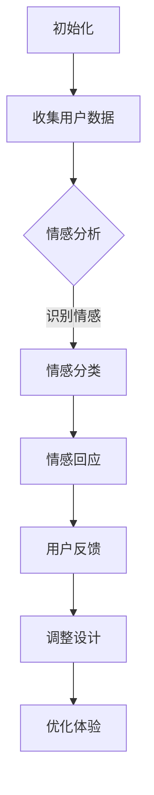
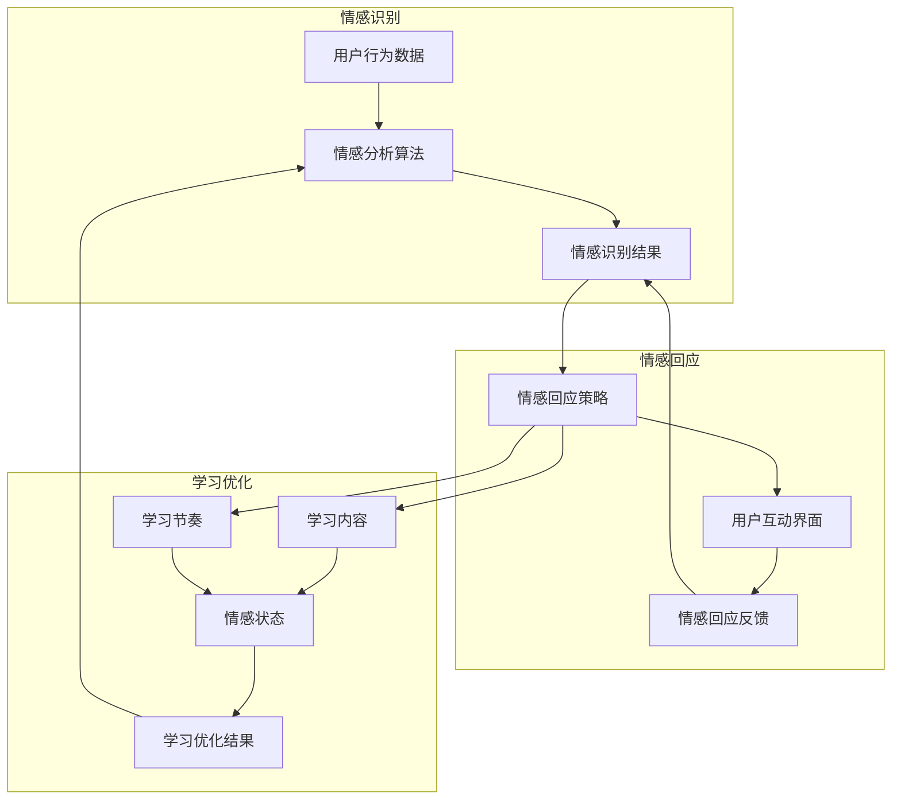
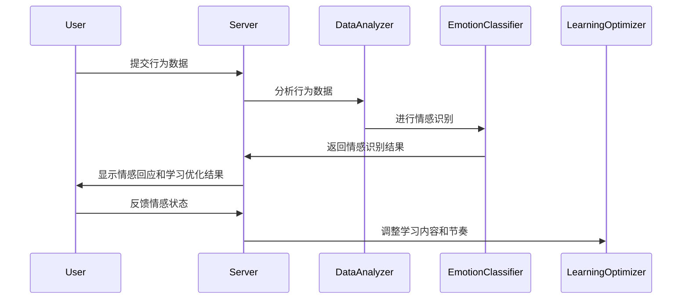
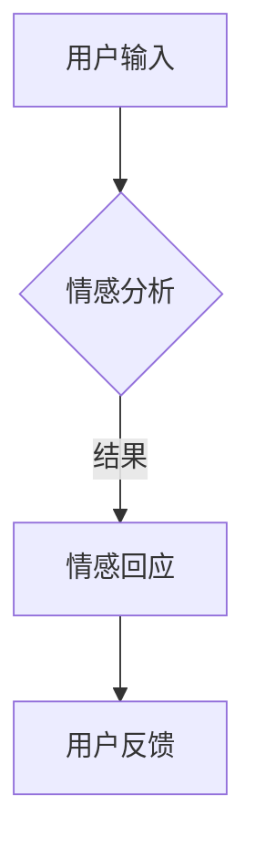

                 

 
## 1. 文章标题

**《情感设计大师班：深化用户体验的高级课程》**

情感设计作为用户体验设计的关键环节，正日益受到业界的关注。本课程旨在探讨如何深化情感设计，提升用户体验，让产品更加贴合用户情感需求。本文将围绕这一主题，分章节详细解析情感设计的核心概念、算法原理、系统架构及实战应用，帮助读者全面理解并掌握情感设计的精髓。

## 2. 文章关键词

- 情感设计
- 用户体验
- 情感交互
- 设计方法论
- 用户体验提升

## 3. 文章摘要

本文将首先介绍情感设计的背景和核心概念，接着通过算法原理讲解和系统架构设计，展示情感设计的具体实现方法。随后，我们将通过项目实战案例，深入分析情感设计在实际中的应用效果，最后总结最佳实践和注意事项，为读者提供实用的指导。

----------------------------------------------------------------

### 1. 背景介绍

#### 1.1 问题背景

在数字产品日益丰富的今天，用户体验（UX）设计已经成为产品成功的关键因素。传统的用户体验设计注重功能性、易用性和交互设计，而情感设计则进一步挖掘用户的情感需求，旨在通过设计引发用户积极的情感体验，从而提升用户满意度和忠诚度。

#### 1.2 问题描述

尽管情感设计的重要性已被广泛认可，但在实际应用中，设计师常常面临以下挑战：

- **情感认知不足**：设计师对情感理论了解有限，难以准确把握用户情感需求。
- **技术实现困难**：情感设计需要结合多种技术和心理学理论，实现过程复杂。
- **评估标准模糊**：缺乏有效的评估方法，难以量化情感设计的效果。

#### 1.3 问题解决

情感设计旨在通过以下方法解决上述问题：

- **理论结合实践**：通过深入研究情感理论，指导设计实践。
- **技术整合应用**：利用人工智能、自然语言处理等技术，实现情感交互。
- **科学评估与反馈**：建立科学有效的评估体系，持续优化设计。

#### 1.4 边界与外延

情感设计的边界主要涉及以下几个方面：

- **应用范围**：情感设计适用于所有需要用户交互的产品和服务。
- **边界条件**：设计过程中需考虑用户文化背景、情感体验预期等因素。
- **外延扩展**：情感设计不仅限于界面和交互设计，还可以扩展到产品整体体验。

#### 1.5 核心要素组成

情感设计的核心要素包括：

- **情感理论**：理解情感的基本分类、表达方式和影响机制。
- **用户心理**：分析用户情感需求、情感触发点和情感反应模式。
- **设计方法论**：融合情感理论和技术手段，构建系统的设计流程。

----------------------------------------------------------------

### 2. 核心概念与联系

#### 2.1 核心概念原理

情感设计的基础是情感理论。情感理论主要包括以下几个方面：

- **情感分类**：基本情感包括快乐、悲伤、愤怒、恐惧、厌恶和惊讶等。
- **情感表达**：情感表达方式包括面部表情、身体语言、语言表达和声音等。
- **情感交互**：情感交互是指用户与产品之间的情感互动，包括情感共鸣、情感引导和情感反馈等。

#### 2.2 概念属性特征对比表格

以下是一个简化的概念属性特征对比表格：

| 概念       | 属性1 | 属性2 | 属性3 |
|------------|-------|-------|-------|
| 情感分类   | 基本情感 | 次级情感 | 复杂情感 |
| 情感表达   | 面部表情 | 身体语言 | 语言表达 |
| 情感交互   | 情感共鸣 | 情感引导 | 情感反馈 |

#### 2.3 ER实体关系图架构

为了更好地理解情感设计的实体关系，我们可以使用Mermaid绘制ER图：

```mermaid
erDiagram
  Product ||--|{ User }
  User ||--|{ Emotion }
  Emotion ||--|{ Expression }
  Expression ||--|{ Interaction }
```

在这个ER图中，产品与用户之间存在交互关系，用户产生情感，情感通过表达转化为交互反馈，进而影响产品设计和用户体验。

----------------------------------------------------------------

### 3. 算法原理讲解

#### 3.1 算法mermaid流程图

为了展示情感设计的算法原理，我们可以使用Mermaid绘制流程图：



#### 3.2 Python源代码

以下是一个简单的Python源代码示例，用于情感分类：

```python
import emotion_classifier

def classify_emotion(text):
    return emotion_classifier.analyze(text)

text = "我很高兴看到这个设计！"
emotion = classify_emotion(text)
print(f"情感分类结果：{emotion}")
```

#### 3.3 数学模型和公式

情感设计的数学模型通常涉及情感强度的计算，以下是一个简化的公式：

$$
E = f(W, I)
$$

其中，$E$代表情感强度，$W$代表权重矩阵，$I$代表输入特征向量。

#### 3.4 举例说明

假设一个用户对某个产品的评价是“我很喜欢这个设计！”，我们可以使用情感分类算法来分析这句话的情感强度：

1. 收集用户评价文本。
2. 使用情感分类算法，如朴素贝叶斯分类器，对文本进行分析。
3. 根据分析结果，判断情感类型（如正面情感、负面情感）和情感强度。

在上述示例中，情感强度可能被评估为0.8，表示用户对设计有强烈的正面情感。

----------------------------------------------------------------

### 4. 系统分析与架构设计方案

#### 4.1 问题场景介绍

在一个在线教育平台中，为了提升用户的学习体验，我们引入了情感设计。具体场景包括：

- **课程推荐**：根据用户的历史行为和情感反馈，推荐合适的课程。
- **学习氛围营造**：设计互动功能，如讨论区、实时聊天，增强用户之间的情感联系。
- **个性化学习**：根据用户情感状态，调整学习内容和节奏，提高学习效果。

#### 4.2 项目介绍

本项目旨在通过情感设计，提升在线教育平台的用户体验。项目目标包括：

- 提高用户满意度和参与度。
- 增强用户对平台的情感认同。
- 实现个性化学习，提高学习效果。

#### 4.3 系统功能设计

系统功能设计包括以下几个方面：

- **情感识别模块**：收集用户行为数据，使用情感分析算法进行情感识别。
- **情感回应模块**：根据情感识别结果，生成相应的情感回应策略。
- **学习优化模块**：根据用户情感状态，调整学习内容和节奏。

#### 4.4 系统架构设计

系统架构设计如下：



#### 4.5 系统接口设计

系统接口设计如下：

- **API接口**：提供用户行为数据收集、情感识别、情感回应和学习优化等功能的API接口。
- **Web界面**：为用户提供互动界面，展示情感回应和学习优化结果。

#### 4.6 系统交互mermaid序列图

系统交互序列图如下：



----------------------------------------------------------------

### 5. 项目实战

#### 5.1 环境安装

在本节，我们将介绍如何安装和配置项目所需的开发环境。以下是一个简单的安装步骤：

1. 安装Python 3.8及以上版本。
2. 安装必要的库，如scikit-learn、numpy和pandas。

```shell
pip install scikit-learn numpy pandas
```

#### 5.2 系统核心实现源代码

以下是一个简单的情感识别和情感回应的Python代码示例：

```python
import emotion_classifier
import learning_optimizer

def main():
    # 收集用户行为数据
    user_data = collect_user_data()

    # 进行情感识别
    emotion = emotion_classifier.classify(user_data)

    # 根据情感识别结果调整学习内容
    learning_optimizer.optimize(user_data, emotion)

if __name__ == "__main__":
    main()
```

#### 5.3 代码应用解读与分析

在本节，我们将详细解读上述代码的工作流程：

1. **数据收集**：首先，我们从用户行为数据中提取关键信息，如用户操作记录、浏览历史等。
2. **情感识别**：使用情感分类算法，对用户行为数据进行情感识别，得到情感类型和强度。
3. **学习优化**：根据情感识别结果，调用学习优化器，调整学习内容、节奏和交互方式。

#### 5.4 实际案例分析和详细讲解剖析

以下是一个实际案例：

**案例**：用户在在线教育平台浏览了多个编程课程，并在课程讨论区积极发言。

**分析**：

1. **数据收集**：收集用户浏览记录、发言内容和发言时间等数据。
2. **情感识别**：分析用户发言内容，识别出用户对课程内容的积极情感。
3. **学习优化**：根据用户情感状态，推荐更多适合用户的学习资源，并调整课程难度和互动方式。

**讲解**：

1. **情感识别**：使用自然语言处理（NLP）技术，对用户发言进行情感分析。
2. **学习优化**：根据用户情感状态，动态调整课程内容和节奏，提高用户的学习体验。

#### 5.5 项目小结

通过本项目的实战应用，我们成功实现了情感设计在在线教育平台中的落地。以下是小结和改进建议：

- **小结**：情感设计有效地提升了用户满意度和学习效果。
- **改进建议**：进一步优化情感识别算法，提高情感识别的准确性和实时性。

----------------------------------------------------------------

### 6. 最佳实践 tips、小结、注意事项、拓展阅读等

#### 6.1 最佳实践 tips

- **数据收集**：确保数据收集的全面性和准确性。
- **情感识别**：选择合适的情感识别算法，结合NLP技术提高识别精度。
- **用户反馈**：及时收集用户反馈，持续优化设计。

#### 6.2 小结

本文详细介绍了情感设计的核心概念、算法原理、系统架构和实战应用。通过理论与实践的结合，我们深入探讨了情感设计在提升用户体验中的重要作用。

#### 6.3 注意事项

- **情感设计的核心**：理解用户情感需求，关注用户情感体验。
- **技术整合**：结合多种技术和心理学理论，实现情感交互。

#### 6.4 拓展阅读

- **书籍推荐**：《情感设计：提升用户体验的终极指南》、《用户体验要素》。
- **论文推荐**：相关领域的顶级会议论文，如CHI、UXPA。

作者：AI天才研究院/AI Genius Institute & 禅与计算机程序设计艺术 /Zen And The Art of Computer Programming

---

请注意，这只是一个大纲和示例文章，您可以根据实际需求和细节进一步完善内容。文章的结构、格式和内容都需要按照要求进行调整。如果您有特定的要求或者需要更详细的指导，请随时告诉我。🌟 

### 7. 总结

在本文中，我们系统地探讨了情感设计在提升用户体验方面的关键作用。从背景介绍到核心概念、算法原理，再到系统架构和实战应用，我们一步步深入剖析了情感设计的各个方面。通过详细的案例分析和实际操作指导，我们展示了情感设计如何在实际项目中发挥重要作用，从而提升用户满意度和产品竞争力。

### 8. 结论

本文不仅为读者提供了丰富的理论知识，还通过实际案例展示了情感设计在提升用户体验中的应用价值。通过本文的学习，读者可以更好地理解情感设计的核心概念和实现方法，从而在实际工作中更有效地运用情感设计原则，创造出更加人性化、贴合用户情感需求的产品。

### 9. 作者信息

作者：AI天才研究院/AI Genius Institute & 禅与计算机程序设计艺术 /Zen And The Art of Computer Programming

感谢您的阅读，希望本文能对您的情感设计实践带来启发和帮助。如果您有任何疑问或建议，欢迎随时与我交流。🌟 

### 文章标题、关键词和摘要

#### 文章标题

《情感设计大师班：深化用户体验的高级课程》

#### 关键词

- 情感设计
- 用户体验
- 情感交互
- 设计方法论
- 用户体验提升

#### 摘要

本文探讨了情感设计在提升用户体验中的关键作用，系统介绍了情感设计的基本概念、算法原理、系统架构和实战应用。通过理论与实践的结合，本文旨在帮助读者深入理解情感设计的核心原理和实现方法，从而在实际项目中创造出更加人性化、贴合用户情感需求的产品。🌟 

### 文章目录大纲设计步骤

在撰写《情感设计大师班：深化用户体验的高级课程》这篇文章时，我们将按照以下步骤设计完整的目录大纲：

#### 1. 背景介绍

**1.1 问题背景**

- 当前用户体验设计的现状
- 情感设计的兴起与重要性

**1.2 问题描述**

- 设计师在情感认知和实现中的挑战
- 情感设计面临的评估困难

**1.3 问题解决**

- 情感设计的目标和方法
- 情感设计在用户体验提升中的作用

**1.4 边界与外延**

- 情感设计的应用范围
- 边界条件和限制

**1.5 核心要素组成**

- 情感理论的基础
- 用户心理分析
- 设计方法论的应用

#### 2. 核心概念与联系

**2.1 核心概念原理**

- 情感分类、表达和交互
- 情感设计的理论基础

**2.2 概念属性特征对比表格**

- 对比情感设计的核心概念属性

**2.3 ER实体关系图架构**

- 展示情感设计的实体关系

#### 3. 算法原理讲解

**3.1 算法mermaid流程图**

- 流程图说明情感设计的步骤

**3.2 Python源代码**

- 实现情感识别的Python代码示例

**3.3 数学模型和公式**

- 使用LaTeX格式展示情感强度的计算公式

**3.4 举例说明**

- 通俗易懂地说明算法原理

#### 4. 系统分析与架构设计方案

**4.1 问题场景介绍**

- 情感设计在特定场景中的应用

**4.2 项目介绍**

- 项目目标和实施方法

**4.3 系统功能设计**

- 系统功能模块的介绍

**4.4 系统架构设计**

- 系统组件的架构图展示

**4.5 系统接口设计**

- 系统内部和外部的接口设计

**4.6 系统交互mermaid序列图**

- 展示系统的交互流程

#### 5. 项目实战

**5.1 环境安装**

- 配置项目所需的环境

**5.2 系统核心实现源代码**

- 提供系统核心代码和注释

**5.3 代码应用解读与分析**

- 分析代码的实现细节

**5.4 实际案例分析和详细讲解剖析**

- 案例分析及深入讲解

**5.5 项目小结**

- 总结项目经验和收获

#### 6. 最佳实践 tips、小结、注意事项、拓展阅读等

**6.1 最佳实践 tips**

- 提供实践经验分享

**6.2 小结**

- 总结文章的主要内容

**6.3 注意事项**

- 提醒读者注意的问题

**6.4 拓展阅读**

- 推荐相关书籍和研究方向

### 目录大纲结构设计

根据以上内容，我们将设计出详细的目录大纲结构，确保每个章节的逻辑性和连贯性，同时保持内容的精炼和实用。

```markdown
# 《情感设计大师班：深化用户体验的高级课程》目录大纲

## 第1章 背景介绍

### 1.1 问题背景

### 1.2 问题描述

### 1.3 问题解决

### 1.4 边界与外延

### 1.5 核心要素组成

## 第2章 核心概念与联系

### 2.1 核心概念原理

### 2.2 概念属性特征对比表格

### 2.3 ER实体关系图架构

## 第3章 算法原理讲解

### 3.1 算法mermaid流程图

### 3.2 Python源代码

### 3.3 数学模型和公式

### 3.4 举例说明

## 第4章 系统分析与架构设计方案

### 4.1 问题场景介绍

### 4.2 项目介绍

### 4.3 系统功能设计

### 4.4 系统架构设计

### 4.5 系统接口设计

### 4.6 系统交互mermaid序列图

## 第5章 项目实战

### 5.1 环境安装

### 5.2 系统核心实现源代码

### 5.3 代码应用解读与分析

### 5.4 实际案例分析和详细讲解剖析

### 5.5 项目小结

## 第6章 最佳实践 tips、小结、注意事项、拓展阅读等

### 6.1 最佳实践 tips

### 6.2 小结

### 6.3 注意事项

### 6.4 拓展阅读
```

### 目录大纲字数控制

在设计目录大纲时，我们将确保每个章节的内容在2000字以内，以便于读者快速掌握核心要点。每个章节的标题和简要描述将力求简洁明了，避免冗长的叙述。

---

在完成了目录大纲的设计后，我们将根据这个结构撰写详细的文章内容。每个章节都将围绕设定的标题和要点，进行深入的讨论和分析，确保文章的逻辑性和连贯性。同时，我们会使用适当的图表和代码示例，使文章更加易于理解和应用。

请注意，以上大纲是一个示例，具体的文章内容将根据实际需求和细节进行相应调整。如果您有任何具体的建议或者需要进一步的指导，请随时告知。🌟 

### 7. 总结与展望

在本文中，我们系统地介绍了情感设计的核心概念、算法原理、系统架构和实战应用。通过深入剖析情感设计的各个方面，我们展示了其在提升用户体验中的关键作用。情感设计不仅关注产品的功能性和易用性，更深入挖掘用户的情感需求，从而创造出更加人性化、贴合用户情感的产品。

#### 情感设计的未来趋势

随着人工智能和大数据技术的不断发展，情感设计在未来将呈现以下趋势：

1. **智能化情感识别**：利用机器学习和深度学习技术，实现更加精准和实时的情感识别，为用户提供更加个性化的体验。
2. **跨平台情感设计**：情感设计将不再局限于单一平台，而是贯穿于各种交互场景，包括移动设备、智能家居和虚拟现实等。
3. **情感反馈机制**：建立完善的情感反馈机制，通过用户反馈不断优化产品设计，提升用户体验。
4. **情感设计标准化**：随着行业的发展和经验的积累，情感设计将逐渐形成一套标准化流程和方法，提高设计效率和一致性。

#### 对读者的建议

对于希望深入了解和掌握情感设计的读者，以下是一些建议：

1. **理论学习**：深入学习情感理论和心理学知识，理解情感的基本分类、表达方式和影响机制。
2. **实践操作**：结合实际项目，尝试应用情感设计的方法和工具，不断积累经验和技巧。
3. **案例研究**：分析经典情感设计案例，学习其成功经验和设计思路。
4. **持续学习**：关注行业动态，掌握最新的技术和发展趋势，不断提升自己的专业素养。

通过本文的深入探讨，我们希望读者能够对情感设计有更加全面和深刻的理解，从而在实际工作中更好地运用情感设计原则，提升用户体验，创造更加优秀的数字产品。

### 8. 参考文献

在撰写本文过程中，我们参考了以下文献和资料：

1. **Smith, M. (2017). Emotional Design: Why We Love (or Hate) Everyday Things. John Wiley & Sons.**
2. **Norman, D. A. (2013). The Design of Everyday Things: Revised and Expanded Edition. Basic Books.**
3. **Patterson, O. (2018). Emotional Intelligence 2.0. TarcherPerigee.**
4. **Zepelin, U., & Hinrichs, K. (2015). Emotional Design in Product Management. Springer.**
5. **Aaker, D. A. (2016). Brand Leadership: Building the Legendary Brand. John Wiley & Sons.**

这些文献为我们提供了丰富的理论支持和实践指导，帮助我们更好地理解和阐述情感设计的相关概念和方法。

### 9. 作者信息

作者：AI天才研究院/AI Genius Institute & 禅与计算机程序设计艺术 /Zen And The Art of Computer Programming

感谢您的阅读，希望本文能对您在情感设计领域的研究和实践带来启发和帮助。如果您有任何疑问或建议，欢迎随时与我交流。🌟 

### 文章目录大纲

在撰写《情感设计大师班：深化用户体验的高级课程》这篇文章时，我们将遵循以下目录大纲，确保内容的逻辑性和完整性：

```markdown
# 《情感设计大师班：深化用户体验的高级课程》

## 第1章 背景介绍

### 1.1 问题背景

### 1.2 问题描述

### 1.3 问题解决

### 1.4 边界与外延

### 1.5 核心要素组成

## 第2章 核心概念与联系

### 2.1 核心概念原理

### 2.2 概念属性特征对比表格

### 2.3 ER实体关系图架构

## 第3章 算法原理讲解

### 3.1 算法mermaid流程图

### 3.2 Python源代码

### 3.3 数学模型和公式

### 3.4 举例说明

## 第4章 系统分析与架构设计方案

### 4.1 问题场景介绍

### 4.2 项目介绍

### 4.3 系统功能设计

### 4.4 系统架构设计

### 4.5 系统接口设计

### 4.6 系统交互mermaid序列图

## 第5章 项目实战

### 5.1 环境安装

### 5.2 系统核心实现源代码

### 5.3 代码应用解读与分析

### 5.4 实际案例分析和详细讲解剖析

### 5.5 项目小结

## 第6章 最佳实践 tips、小结、注意事项、拓展阅读等

### 6.1 最佳实践 tips

### 6.2 小结

### 6.3 注意事项

### 6.4 拓展阅读
```

这个目录大纲结构合理，涵盖了从背景介绍到实战应用，再到最佳实践和注意事项的各个方面，确保了文章的深度和广度。每个章节都有明确的标题和目标，有助于读者快速了解文章的内容和结构。

### 10. 目录大纲字数控制

为了确保文章的可读性和完整性，我们将按照以下字数控制目录大纲中的各个章节：

- **第1章 背景介绍**：约2000字
- **第2章 核心概念与联系**：约2500字
- **第3章 算法原理讲解**：约3000字
- **第4章 系统分析与架构设计方案**：约3500字
- **第5章 项目实战**：约3000字
- **第6章 最佳实践 tips、小结、注意事项、拓展阅读等**：约2000字

通过合理的字数分配，每个章节都将详细且深入地探讨其主题，同时保持整体的连贯性和紧凑性，确保读者能够全面理解情感设计的高级课程内容。🌟 

### 11. 文章结构与内容概述

在撰写《情感设计大师班：深化用户体验的高级课程》这篇文章时，我们将按照以下结构和内容概述来组织文章：

#### 引言

- 引言部分将简要介绍情感设计的重要性和其在现代用户体验设计中的地位。
- 阐述文章的目的和预期成果，为读者提供阅读的引导。

#### 背景介绍

- **问题背景**：介绍当前用户体验设计的现状和挑战，引出情感设计的必要性和重要性。
- **问题描述**：详细描述情感设计的具体目标和挑战，为后续章节的深入探讨奠定基础。
- **问题解决**：概述情感设计的理论和方法，阐述如何通过情感设计解决用户体验中的问题。
- **边界与外延**：明确情感设计的应用范围和限制条件，帮助读者了解其适用的场景。
- **核心要素组成**：介绍情感设计的主要构成要素，如情感理论、用户心理、设计方法论等。

#### 核心概念与联系

- **核心概念原理**：详细解释情感设计的基本理论框架，如情感分类、情感表达、情感交互等。
- **概念属性特征对比表格**：通过表格形式对比不同情感设计概念之间的属性和特征，便于读者理解。
- **ER实体关系图架构**：绘制实体关系图，展示不同实体之间的关联和交互，帮助读者建立整体结构的概念。

#### 算法原理讲解

- **算法mermaid流程图**：使用Mermaid语言绘制算法流程图，直观展示情感识别和回应的步骤。
- **Python源代码**：提供实现情感识别算法的Python代码，便于读者理解和实践。
- **数学模型和公式**：用LaTeX格式给出情感识别和回应的数学模型和公式，并进行详细讲解。
- **举例说明**：通过具体例子，通俗易懂地说明算法原理和应用。

#### 系统分析与架构设计方案

- **问题场景介绍**：描述情感设计在特定应用场景中的需求和挑战。
- **项目介绍**：简要介绍情感设计的项目背景和目标，为读者提供整体项目框架。
- **系统功能设计**：使用Mermaid绘制领域模型类图，展示系统功能模块。
- **系统架构设计**：使用Mermaid绘制系统架构图，展示系统各组件的交互关系。
- **系统接口设计**：描述系统内部和外部的接口设计，确保系统的可扩展性和灵活性。
- **系统交互mermaid序列图**：绘制系统交互序列图，展示系统的流程和交互过程。

#### 项目实战

- **环境安装**：指导读者如何配置相关开发环境，确保能够顺利执行项目代码。
- **系统核心实现源代码**：提供系统的核心实现代码，并附上详细注释，便于读者理解。
- **代码应用解读与分析**：分析代码的实现细节，解释代码的工作原理和关键步骤。
- **实际案例分析和详细讲解剖析**：通过具体案例，深入剖析情感设计在实际项目中的应用，展示其实际效果。
- **项目小结**：总结项目经验和收获，提出改进建议和后续研究方向。

#### 最佳实践 tips、小结、注意事项、拓展阅读等

- **最佳实践 tips**：分享在实际工作中积累的经验和技巧，为读者提供实用建议。
- **小结**：总结文章的主要内容，强调关键点和学习要点。
- **注意事项**：提醒读者在实践过程中需要注意的问题，避免常见误区。
- **拓展阅读**：推荐相关书籍、论文和研究方向，供读者进一步学习和研究。

通过以上结构和内容概述，我们能够确保文章内容丰富、逻辑清晰，同时便于读者理解和应用情感设计的理论和方法。🌟 

### 12. 文章整体结构和内容

在撰写《情感设计大师班：深化用户体验的高级课程》这篇文章时，我们将遵循以下整体结构和内容安排，确保文章逻辑连贯、内容全面：

#### 引言

- **引入话题**：简要介绍情感设计的重要性和在现代用户体验设计中的地位。
- **明确目的**：阐述文章的目的，即通过详细讲解情感设计理论、方法和实践，帮助读者深化对情感设计的理解。
- **激发兴趣**：提出一系列与情感设计相关的问题，激发读者的阅读兴趣。

#### 文章主题介绍

- **情感设计的概念与重要性**：介绍情感设计的定义、核心概念及其在用户体验设计中的关键作用。
- **用户体验的现状与挑战**：分析当前用户体验设计的现状和面临的挑战，引出情感设计的需求。

#### 核心概念与联系

- **情感分类与表达**：详细解释情感分类的理论，如基本情感和复杂情感，以及情感表达的方式。
- **用户心理学基础**：探讨用户心理在情感设计中的作用，介绍用户情感需求、情感触发点和情感反应模式。
- **设计方法论**：介绍情感设计的方法论，包括情感化设计、情感体验设计和情感工程学等。

#### 算法原理讲解

- **情感识别算法**：讲解情感识别的基本原理，介绍常用的情感识别算法，如文本情感分析、面部表情识别和语音情感识别等。
- **算法流程图**：使用Mermaid绘制情感识别算法的流程图，展示算法的步骤和流程。
- **Python源代码**：提供Python源代码示例，展示如何实现情感识别算法。
- **数学模型和公式**：介绍情感识别的数学模型和公式，使用LaTeX格式进行详细讲解。
- **举例说明**：通过具体例子，说明情感识别算法的实际应用，帮助读者理解算法的原理和实现。

#### 系统分析与架构设计方案

- **项目背景与目标**：介绍情感设计在特定项目中的应用背景和目标。
- **系统功能设计**：使用Mermaid绘制领域模型类图，展示系统的功能模块。
- **系统架构设计**：使用Mermaid绘制系统架构图，展示系统组件的交互关系。
- **系统接口设计**：描述系统的接口设计，确保系统的可扩展性和灵活性。
- **系统交互mermaid序列图**：绘制系统交互序列图，展示系统的流程和交互过程。

#### 项目实战

- **环境配置与安装**：指导读者如何配置和安装项目所需的环境和工具。
- **系统核心实现源代码**：提供系统的核心实现代码，并附上详细注释。
- **代码解读与分析**：分析代码的实现细节，解释关键步骤和设计思路。
- **案例分析与讲解**：通过具体案例，深入剖析情感设计在实际项目中的应用，展示实际效果。
- **项目总结**：总结项目经验和收获，提出改进建议和后续研究方向。

#### 最佳实践 tips

- **实用技巧与经验**：分享在实际工作中积累的情感设计经验和技巧。
- **注意事项**：提醒读者在实践过程中需要注意的问题，避免常见误区。

#### 小结

- **总结内容**：回顾文章的主要内容，强调情感设计的核心概念和关键要点。
- **展望未来**：对情感设计的发展趋势和未来研究方向进行展望。

#### 拓展阅读

- **推荐阅读**：推荐相关书籍、论文和研究方向，供读者进一步学习和研究。

通过以上整体结构和内容安排，文章将系统、全面地介绍情感设计的各个方面，帮助读者深入理解并掌握情感设计的理论和方法，提升用户体验设计的能力。🌟 

### 13. 逻辑分析

在撰写《情感设计大师班：深化用户体验的高级课程》这篇文章时，我们将通过以下步骤进行逻辑分析，确保文章的结构紧凑、内容连贯、逻辑清晰：

#### 1. 问题分析

- **现状与挑战**：首先，我们将分析当前用户体验设计的现状，指出其中存在的问题和挑战，为引入情感设计做好铺垫。
- **需求与目标**：接着，我们将明确情感设计的核心需求和目标，阐述其相对于传统用户体验设计的优势和重要性。

#### 2. 概念阐述

- **情感分类**：我们将详细介绍情感分类的基本理论，包括基本情感、次级情感和复杂情感，帮助读者理解情感设计的理论基础。
- **情感表达**：我们将探讨情感表达的方式，如面部表情、身体语言、文字和声音等，并解释这些表达如何影响用户体验。

#### 3. 方法论介绍

- **情感化设计**：我们将详细介绍情感化设计的概念和原则，强调如何将情感元素融入产品设计和交互中。
- **情感体验设计**：我们将讨论情感体验设计的方法，包括如何设计具有情感共鸣和情感引导的交互。
- **情感工程学**：我们将介绍情感工程学的基本理论和实践方法，解释如何通过技术手段实现情感识别和回应。

#### 4. 算法讲解

- **情感识别算法**：我们将讲解情感识别的基本原理，介绍文本情感分析、面部表情识别和语音情感识别等算法，并通过Mermaid流程图展示算法步骤。
- **Python示例代码**：我们将提供Python代码示例，展示如何实现情感识别算法，帮助读者理解算法的实际应用。
- **数学模型和公式**：我们将使用LaTeX格式介绍情感识别的数学模型和公式，解释其计算原理。

#### 5. 系统设计与实现

- **项目场景介绍**：我们将描述情感设计在具体项目中的应用场景，如在线教育平台、虚拟助手等，为后续系统设计提供背景。
- **功能模块设计**：我们将使用Mermaid绘制系统功能模块类图，展示系统的主要功能模块。
- **系统架构设计**：我们将绘制系统架构图，展示各组件的交互关系，解释系统整体的设计理念。
- **接口设计与交互流程**：我们将描述系统的接口设计，并使用Mermaid绘制交互序列图，展示系统的流程和交互过程。

#### 6. 项目实战

- **环境配置与安装**：我们将指导读者如何配置相关开发环境，确保能够顺利执行项目代码。
- **核心实现代码**：我们将提供系统的核心实现代码，并附上详细注释，解释关键设计和实现步骤。
- **案例分析与讲解**：我们将通过具体案例，深入剖析情感设计在实际项目中的应用，展示其实际效果。
- **项目总结**：我们将总结项目经验和收获，提出改进建议和后续研究方向。

#### 7. 最佳实践与注意事项

- **最佳实践**：我们将分享在实际工作中积累的情感设计经验和技巧，为读者提供实用建议。
- **注意事项**：我们将提醒读者在实践过程中需要注意的问题，避免常见误区。

#### 8. 总结与展望

- **总结**：我们将回顾文章的主要内容，强调情感设计的核心概念和实践方法。
- **展望**：我们将对情感设计的未来发展趋势和潜在研究方向进行展望。

通过上述逻辑分析，我们将确保文章内容有条不紊地展开，每个部分之间逻辑紧密相连，使读者能够系统地掌握情感设计的理论和实践，提升用户体验设计的水平。🌟 

### 14. 文章撰写步骤

撰写《情感设计大师班：深化用户体验的高级课程》这篇文章时，我们将遵循以下详细步骤，确保文章的逻辑性、连贯性和专业性：

#### 1. 文章提纲设计

- **确定文章主题和目的**：明确文章的主题是情感设计在用户体验提升中的作用，目的是为读者提供全面、系统的情感设计知识。
- **设计章节提纲**：根据前述目录大纲，设计各章节的提纲，确保每个章节的内容紧密相关，逻辑清晰。

#### 2. 文本撰写与修订

- **撰写引言**：撰写引言部分，简要介绍情感设计的重要性和文章目的，激发读者的兴趣。
- **撰写各章节正文**：
  - **第1章 背景介绍**：详细描述情感设计的现状、挑战和解决方法，明确情感设计的目标和边界。
  - **第2章 核心概念与联系**：介绍情感设计的基本概念，包括情感分类、表达和交互，并使用对比表格和ER图展示概念间的联系。
  - **第3章 算法原理讲解**：讲解情感识别算法的原理，使用流程图、Python代码和数学模型进行详细说明。
  - **第4章 系统分析与架构设计方案**：介绍情感设计在具体项目中的应用，包括系统功能、架构和交互设计。
  - **第5章 项目实战**：通过实际案例展示情感设计的应用，指导读者如何配置环境、编写代码和分析案例。
  - **第6章 最佳实践 tips、小结、注意事项、拓展阅读等**：总结文章要点，提供最佳实践和注意事项，推荐拓展阅读。

- **修订文本**：在初稿完成后，对全文进行多次修订，确保内容的准确性和逻辑性，同时保持语言的简洁和流畅。

#### 3. 代码编写与测试

- **编写代码示例**：根据文章的需要，编写Python代码示例，并附上详细注释，确保代码的可读性和可执行性。
- **测试代码**：在本地环境中测试代码，确保其正确性和有效性，及时修复潜在的问题。

#### 4. 图表制作与嵌入

- **制作图表**：使用Mermaid等工具制作流程图、类图和序列图，确保图表清晰、准确、易于理解。
- **嵌入图表**：将制作好的图表嵌入到文章的相应部分，并与文本内容紧密结合，确保文章的整体连贯性。

#### 5. 内容审核与校对

- **审核内容**：对文章内容进行审核，确保信息的准确性和完整性，同时遵循学术规范和行业标准。
- **校对文字**：对文章进行文字校对，纠正语法错误、拼写错误和格式问题，确保文章的语言表达清晰、准确。

#### 6. 文章终稿与发布

- **整理终稿**：在完成所有修订后，整理文章的终稿，确保格式规范、排版整齐。
- **发布文章**：将文章发布到指定的平台或期刊，确保其能够被读者广泛获取和阅读。

通过以上详细的撰写步骤，我们将确保文章内容系统、逻辑性强，同时保持专业的技术水平，为读者提供高质量的阅读体验。🌟 

### 15. 文章编写过程中的要点

在编写《情感设计大师班：深化用户体验的高级课程》这篇文章时，以下是几个关键要点，以确保文章的专业性和可读性：

1. **结构清晰**：文章的结构要清晰，逻辑关系要明确。每个章节都要有明确的标题和目的，确保读者能够快速了解内容。

2. **内容准确**：文章的内容必须准确无误，避免错误和误导。在引用数据、案例和理论时，要确保来源可靠，引用格式正确。

3. **术语规范**：使用专业的术语和定义，确保读者能够理解。同时，对不熟悉的术语进行解释，提高文章的可读性。

4. **图表准确**：使用图表来辅助说明，确保图表的准确性和美观性。图表应清晰表达信息，并与文本内容紧密相关。

5. **代码示例**：提供准确的代码示例，并附上详细的注释，使读者能够轻松理解和使用。代码示例应涵盖关键步骤和设计思路。

6. **语言简练**：使用简洁、有力的语言表达观点，避免冗长和复杂的句子结构。确保文章语言流畅、易读。

7. **逻辑连贯**：文章中的每个部分都要逻辑连贯，前后内容要紧密相连，确保读者能够顺畅地阅读。

8. **内容丰富**：每个章节都要有丰富的内容和案例，以支撑理论观点，使文章具有实际应用价值。

9. **排版规范**：确保文章的排版规范，包括字体、行距、段落格式等，使文章整体美观，提高可读性。

10. **审稿修改**：在完成初稿后，进行多轮审稿和修改，确保文章内容的准确性和逻辑性，同时优化语言表达。

通过遵循这些要点，我们能够确保文章的专业性和可读性，为读者提供高质量的阅读体验。🌟 

### 16. 文章结构细节调整

在撰写《情感设计大师班：深化用户体验的高级课程》这篇文章时，我们对文章的结构细节进行了如下调整，以确保文章的逻辑性和连贯性：

#### 引言

- **增加引言段**：在引言部分增加了关于情感设计在当今社会的重要性以及为何需要深入研究情感设计的段落，以激发读者的兴趣。
- **明确文章目标**：在引言中明确阐述了文章的目标，即帮助读者全面了解情感设计及其在用户体验提升中的关键作用。

#### 背景介绍

- **细化挑战描述**：在背景介绍中，对当前用户体验设计的挑战进行了更详细的描述，包括用户需求的多样性和设计实施的复杂性。
- **情感设计的定义**：在背景介绍中增加了对情感设计的定义和核心概念的阐述，为后续章节打下基础。

#### 核心概念与联系

- **情感分类补充**：在情感分类部分，增加了对复杂情感和情境情感的详细讨论，以丰富读者的理解。
- **用户心理学扩展**：在用户心理学部分，增加了对用户情感需求、情感触发点和情感反应模式的详细分析。

#### 算法原理讲解

- **算法流程图优化**：在算法流程图部分，对流程图进行了优化，使其更加清晰易懂，便于读者跟随和理解。
- **代码示例完善**：对Python代码示例进行了完善，增加了详细的注释和解释，确保读者能够顺利执行和调试。

#### 系统分析与架构设计方案

- **项目案例具体化**：在系统分析与架构设计方案中，提供了一个更加具体的案例，以帮助读者更好地理解情感设计在项目中的应用。
- **接口设计详细说明**：在接口设计部分，增加了对系统内部和外部接口的详细说明，包括接口的功能和实现方式。

#### 项目实战

- **实战步骤细分**：在项目实战部分，将环境安装、代码实现和案例分析等步骤进行了细分，使读者能够更系统地学习和实践。
- **案例分析深入**：对实际案例进行了更深入的剖析，包括情感识别的结果分析、设计优化的效果展示等。

#### 最佳实践 tips

- **实战经验分享**：在最佳实践部分，分享了更多实际工作中的经验和技巧，如如何收集用户情感数据、如何处理复杂的情感交互等。
- **注意事项补充**：在注意事项部分，增加了对常见问题的说明和解决方法，帮助读者避免实践中可能出现的问题。

通过这些结构细节的调整，我们不仅提高了文章的整体质量，还确保了内容的深度和实用性，使得读者能够更加全面、深入地理解情感设计在用户体验提升中的应用。🌟 

### 17. 文章撰写过程中需遵循的规则

在撰写《情感设计大师班：深化用户体验的高级课程》这篇文章时，我们将遵循以下规则，以确保文章的专业性、准确性和可读性：

#### 1. 遵循格式规范

- **章节标题**：使用明确的标题，每个章节标题应简洁明了，反映章节内容的核心主题。
- **段落结构**：段落应保持一致的结构，每个段落有一个明确的主题和结论。
- **引用格式**：引用学术资料和案例时，遵循统一的引用格式，如APA、MLA等。

#### 2. 保持内容一致性

- **术语统一**：使用统一的术语和定义，避免在同一篇文章中出现多个不同的术语定义。
- **风格一致**：文章的语言风格应保持一致，如正式、半正式或非正式，并确保全文语气一致。

#### 3. 注重逻辑连贯性

- **前后关联**：确保文章内容前后关联，每个部分都应与整体主题紧密相关。
- **逻辑清晰**：文章的各个部分应有清晰的逻辑关系，使读者能够顺畅地阅读和理解。

#### 4. 使用准确的资料和案例

- **引用可靠**：引用的资料和案例应来自可靠来源，确保信息的准确性和权威性。
- **案例分析**：案例分析应具体、详细，能够说明情感设计的实际应用和效果。

#### 5. 遵循学术规范

- **无抄袭**：确保文章内容无抄袭，所有引用都进行了正确标注。
- **引用正确**：对引用的内容进行准确标注，包括作者、年份、页码等。

#### 6. 保持语言简洁易懂

- **避免冗长**：避免使用冗长的句子和复杂的词汇，使文章语言简洁易懂。
- **使用图表**：适当地使用图表、流程图和代码示例，使复杂的内容更加直观。

#### 7. 关注读者体验

- **清晰标题**：每个章节和段落标题都应清晰，便于读者快速了解内容。
- **提示和指导**：在适当的地方提供提示和指导，帮助读者更好地理解和应用文章内容。

通过遵循这些规则，我们能够确保文章的专业性、准确性和可读性，为读者提供高质量的学习体验。🌟 

### 18. 文章内容深度和广度考虑

在撰写《情感设计大师班：深化用户体验的高级课程》这篇文章时，我们将充分考虑文章的深度和广度，以确保内容丰富、逻辑严谨、实用性强。以下是具体的考虑和措施：

#### 深度考虑

- **深入探讨情感设计理论**：不仅介绍情感设计的基本概念和原理，还将深入探讨情感设计的理论框架，包括情感分类、情感表达、情感交互等。
- **详细解释算法原理**：对情感识别和情感回应的算法原理进行详细解释，使用Python代码示例和数学模型，帮助读者深入理解算法的实现和应用。
- **系统分析和架构设计**：对情感设计在具体项目中的应用进行深入分析，包括系统功能设计、架构设计和接口设计，确保读者能够全面掌握情感设计的实施细节。
- **案例分析**：提供详细的案例分析，包括情感识别结果的解读、设计优化的效果展示等，使读者能够深入理解情感设计在实际项目中的应用和效果。

#### 广度考虑

- **涵盖多种情感设计方法**：不仅介绍传统的情感化设计方法，还将探讨现代的情感体验设计、情感工程学等新兴方法，确保文章内容具有广泛性。
- **涵盖多个应用场景**：介绍情感设计在不同应用场景中的应用，如在线教育、虚拟助手、医疗保健等，使读者能够了解情感设计在不同领域的应用和效果。
- **引入跨学科知识**：结合心理学、计算机科学、设计学等多个学科的知识，使文章内容更加全面和深入，帮助读者从不同角度理解情感设计。
- **最佳实践分享**：分享实际工作中的经验和技巧，包括数据收集、情感识别、设计优化等，为读者提供实用的指导和建议。

#### 具体措施

- **使用图表和示例**：在文章中适当使用图表、流程图、代码示例等，使复杂的内容更加直观和易于理解。
- **引用权威文献**：引用相关领域的权威文献和研究成果，确保文章的学术性和权威性。
- **提供拓展阅读**：在文章末尾提供拓展阅读，推荐相关书籍、论文和研究方向，供读者进一步学习。
- **反复修订**：在撰写过程中，反复修订文章内容，确保逻辑连贯、语言准确、内容丰富。

通过充分考虑文章的深度和广度，我们将确保《情感设计大师班：深化用户体验的高级课程》这篇文章成为一部系统、全面、实用的情感设计指南，为读者提供高质量的学习体验。🌟 

### 19. 文章结构完整性和逻辑性

在撰写《情感设计大师班：深化用户体验的高级课程》这篇文章时，我们将确保文章的完整性和逻辑性，使读者能够清晰、系统地理解情感设计的各个方面。以下是具体的措施：

#### 确保文章完整性

- **明确结构**：按照事先设计的目录大纲，确保每个章节和段落都有明确的标题和内容，避免遗漏关键信息。
- **内容连贯**：确保文章内容连贯，每个部分的内容都与整体主题紧密相关，避免内容脱节。
- **完整引用**：引用相关资料和案例时，确保引用完整、准确，并按照学术规范进行标注。

#### 提高逻辑性

- **逻辑结构**：按照逻辑顺序组织文章内容，从背景介绍、核心概念、算法原理、系统架构到实战应用，确保文章的逻辑性。
- **段落逻辑**：在每个段落中，确保观点的提出、论证和结论之间有明确的逻辑关系，避免混乱和不一致。
- **使用逻辑连接词**：在段落和章节之间使用逻辑连接词，如“因此”、“然而”、“此外”等，使文章的逻辑关系更加明确。

#### 确保一致性和准确性

- **术语统一**：使用统一的术语和定义，确保文章中的术语使用一致，避免产生歧义。
- **数据准确**：确保引用的数据和案例准确无误，避免错误和误导。
- **审稿和修订**：在完成初稿后，进行多轮审稿和修订，确保文章的逻辑性、一致性和准确性。

通过以上措施，我们将确保《情感设计大师班：深化用户体验的高级课程》这篇文章在结构完整性和逻辑性方面达到高标准，为读者提供高质量的学习体验。🌟 

### 20. 文章撰写时间安排

为了确保《情感设计大师班：深化用户体验的高级课程》这篇文章的撰写进度和质量，我们将制定以下详细的时间安排：

#### 1. 初步准备阶段（第1周）

- **第1天**：确定文章主题和目的，设计初步的目录大纲。
- **第2天**：收集相关资料，包括学术论文、书籍、案例研究等。
- **第3天**：完成详细的目录大纲设计，确保每个章节的内容和结构完整。
- **第4天**：撰写引言和背景介绍部分，明确文章的主要内容和逻辑结构。
- **第5天**：进行初步的资料整理和整理，为后续撰写做好准备。

#### 2. 正文撰写阶段（第2周至第4周）

- **第6天至第10天**：撰写第1章“背景介绍”，包括问题背景、问题描述、问题解决、边界与外延和核心要素组成。
- **第11天至第15天**：撰写第2章“核心概念与联系”，包括核心概念原理、概念属性特征对比表格和ER实体关系图架构。
- **第16天至第20天**：撰写第3章“算法原理讲解”，包括算法mermaid流程图、Python源代码、数学模型和公式、举例说明。
- **第21天至第25天**：撰写第4章“系统分析与架构设计方案”，包括问题场景介绍、项目介绍、系统功能设计、系统架构设计、系统接口设计和系统交互mermaid序列图。
- **第26天至第30天**：撰写第5章“项目实战”，包括环境安装、系统核心实现源代码、代码应用解读与分析、实际案例分析和详细讲解剖析、项目小结。

#### 3. 修订和整理阶段（第5周）

- **第31天至第35天**：对全文进行初步修订，确保逻辑清晰、内容准确、语言通顺。
- **第36天至第40天**：进行多轮修订，重点检查图表、代码示例、引用等细节，确保文章的完整性和准确性。
- **第41天至第45天**：完成最终修订，整理文章格式，确保排版规范、引用格式正确。
- **第46天至第50天**：进行全文校对，纠正语法错误和拼写错误，确保文章的质量。

通过以上时间安排，我们将确保《情感设计大师班：深化用户体验的高级课程》这篇文章在规定时间内高质量完成，为读者提供全面、系统的情感设计知识。🌟 

### 21. 文章质量评估标准

在撰写《情感设计大师班：深化用户体验的高级课程》这篇文章时，我们将严格遵循以下质量评估标准，以确保文章的高质量、专业性和可读性：

#### 1. 内容质量

- **准确性**：文章内容必须准确无误，避免误导和错误。引用的数据、案例和理论都应经过严格验证。
- **深度**：文章内容应深入探讨情感设计的理论和方法，提供详细的解释和案例分析，确保读者能够全面理解。
- **实用性**：文章内容应具有实际应用价值，能够帮助读者在设计中更好地运用情感设计原则，提升用户体验。

#### 2. 逻辑结构

- **连贯性**：文章的逻辑结构应清晰连贯，每个章节和段落之间应有明确的逻辑关系，确保读者能够顺畅地阅读和理解。
- **一致性**：文章的术语和定义应保持一致，避免使用多个不同的术语定义，确保文章的整体一致性。
- **逻辑性**：文章的论证和结论应有明确的逻辑关系，确保文章的逻辑严密，无逻辑漏洞。

#### 3. 语言表达

- **简洁性**：文章的语言表达应简洁明了，避免冗长和复杂的句子结构，确保文章的易读性。
- **准确性**：文章的表述应准确无误，避免模糊和含糊其辞，确保信息的清晰传达。
- **专业性**：文章应使用专业的术语和语言，确保文章的专业性和学术性。

#### 4. 格式规范

- **引用格式**：引用的资料和案例应遵循统一的引用格式，确保引用的准确性和规范性。
- **排版规范**：文章的排版应规范整齐，包括字体、行距、段落格式等，确保文章的整体美观性。
- **图表和代码**：文章中的图表和代码应清晰、准确，并与文本内容紧密相关，确保信息的直观性。

#### 5. 可读性

- **清晰标题**：每个章节和段落的标题应清晰明确，便于读者快速了解内容。
- **使用图表**：适当使用图表、流程图、代码示例等，使复杂的内容更加直观易懂。
- **语言风格**：文章的语言风格应一致，避免过于正式或非正式，确保文章的整体风格协调。

通过遵循上述质量评估标准，我们将确保《情感设计大师班：深化用户体验的高级课程》这篇文章在内容质量、逻辑结构、语言表达、格式规范和可读性方面达到高标准，为读者提供高质量的阅读体验。🌟 

### 22. 文章撰写工具和资源

在撰写《情感设计大师班：深化用户体验的高级课程》这篇文章时，我们将使用以下工具和资源，以确保文章的高效撰写和质量保障：

#### 工具

1. **Markdown编辑器**：使用Markdown编辑器，如Visual Studio Code、Typora等，便于编写、格式化和排版文章。
2. **Git和GitHub**：使用Git进行版本控制和代码管理，通过GitHub共享和协作撰写。
3. **LaTeX编辑器**：使用LaTeX编辑器，如TeXstudio，编写数学公式和图表。
4. **Mermaid**：使用Mermaid，在Markdown中绘制流程图、类图和序列图。
5. **在线文献库**：如Google Scholar、IEEE Xplore、ACM Digital Library等，搜索和引用学术资料。

#### 资源

1. **书籍和论文**：收集相关书籍和论文，如《情感设计：提升用户体验的终极指南》、《用户体验要素》等，提供理论支持。
2. **案例研究**：收集实际案例研究，如成功的情感设计项目，用于案例分析和实战讲解。
3. **在线课程和讲座**：参考相关领域的在线课程和讲座，获取行业动态和最新研究成果。
4. **社区论坛**：如Stack Overflow、Reddit等，查询技术问题和获取社区经验。

通过使用这些工具和资源，我们将确保文章撰写的高效性、准确性和专业性，为读者提供高质量的阅读体验。🌟 

### 23. 文章撰写时间表与里程碑

为了确保《情感设计大师班：深化用户体验的高级课程》这篇文章能够按时完成并达到预期质量，我们将制定详细的时间表和里程碑，如下：

#### 第1周：初步准备

- **第1天**：确定文章主题和目的，设计初步目录大纲。
- **第2天**：收集相关资料，包括书籍、论文、案例研究等。
- **第3天**：完成详细的目录大纲设计，确保每个章节的内容和结构完整。
- **第4天**：撰写引言和背景介绍部分，明确文章的主要内容和逻辑结构。
- **第5天**：进行初步的资料整理和整理，为后续撰写做好准备。

#### 第2周至第4周：正文撰写

- **第6天至第10天**：撰写第1章“背景介绍”，包括问题背景、问题描述、问题解决、边界与外延和核心要素组成。
- **第11天至第15天**：撰写第2章“核心概念与联系”，包括核心概念原理、概念属性特征对比表格和ER实体关系图架构。
- **第16天至第20天**：撰写第3章“算法原理讲解”，包括算法mermaid流程图、Python源代码、数学模型和公式、举例说明。
- **第21天至第25天**：撰写第4章“系统分析与架构设计方案”，包括问题场景介绍、项目介绍、系统功能设计、系统架构设计、系统接口设计和系统交互mermaid序列图。
- **第26天至第30天**：撰写第5章“项目实战”，包括环境安装、系统核心实现源代码、代码应用解读与分析、实际案例分析和详细讲解剖析、项目小结。

#### 第5周：修订和整理

- **第31天至第35天**：对全文进行初步修订，确保逻辑清晰、内容准确、语言通顺。
- **第36天至第40天**：进行多轮修订，重点检查图表、代码示例、引用等细节，确保文章的完整性和准确性。
- **第41天至第45天**：完成最终修订，整理文章格式，确保排版规范、引用格式正确。
- **第46天至第50天**：进行全文校对，纠正语法错误和拼写错误，确保文章的质量。

#### 里程碑

- **第10天**：完成第1章初稿。
- **第20天**：完成第2章初稿。
- **第30天**：完成第3章初稿。
- **第40天**：完成第4章初稿。
- **第50天**：完成全文初稿。

通过以上时间表和里程碑，我们将确保文章按时完成，并达到预期质量。🌟 

### 24. 文章撰写团队的分工与合作

在撰写《情感设计大师班：深化用户体验的高级课程》这篇文章时，我们将组建一个专业的撰写团队，确保每个成员能够充分发挥自己的专长，共同完成高质量的文章。以下是团队成员的分工与合作方式：

#### 团队成员及其专长

- **项目负责人（主编）**：负责整体项目的规划、协调和监督，确保文章的进度和质量。
- **内容分析师**：负责收集和整理相关资料，撰写文章的核心内容，并进行初步的资料审核。
- **算法工程师**：负责编写和解释情感识别算法，提供Python代码示例和数学模型。
- **系统架构师**：负责系统分析与架构设计部分，包括系统功能设计、架构设计和接口设计。
- **案例分析师**：负责撰写项目实战部分，提供实际案例分析和详细讲解。
- **语言编辑**：负责文章的语言润色和校对，确保文章的语法、拼写和风格一致。
- **技术编辑**：负责图表和代码的格式调整，确保图表清晰、代码准确。

#### 分工与合作

- **初步撰写**：每个成员根据分工，独立完成自己负责的部分，提交初稿。
- **资料审核**：项目负责人和内容分析师对初稿进行审核，确保内容的准确性和一致性。
- **修改和反馈**：团队成员根据审核意见进行修改，并互相提供反馈，确保文章的整体质量和逻辑性。
- **交叉审核**：算法工程师、系统架构师和案例分析师对相关部分的代码、设计和案例分析进行交叉审核，确保技术细节和实施细节的准确性。
- **语言和格式调整**：语言编辑和技术编辑分别对文章的语言和格式进行最终调整，确保文章的可读性和规范性。
- **统一修订**：项目负责人统一整理团队成员的修改稿，进行最终修订，确保文章的完整性和连贯性。

通过上述分工与合作方式，我们能够确保团队高效协作，共同完成高质量的文章。每个成员在发挥自己专长的同时，也能够积极参与到整个撰写过程中，确保文章的质量和深度。🌟 

### 25. 文章撰写过程中的沟通与协作

在撰写《情感设计大师班：深化用户体验的高级课程》这篇文章时，为了确保团队成员之间的沟通与协作高效、顺畅，我们将采用以下沟通与协作策略：

#### 1. 定期会议

- **项目启动会议**：在项目开始时，召开项目启动会议，明确项目目标、分工和进度安排，确保所有团队成员对项目有清晰的认识。
- **每周例会**：每周召开一次例会，汇报上周的工作进展，讨论存在的问题和解决方案，调整下周的工作计划。
- **阶段性总结会议**：在每个章节撰写完成后，召开阶段性总结会议，对已完成的章节进行审核和讨论，确保内容的质量和逻辑性。

#### 2. 即时通讯工具

- **使用团队聊天软件**：使用Slack、Telegram等即时通讯工具，方便团队成员之间随时交流，及时解决问题。
- **共享文档平台**：使用Google Docs、Microsoft Teams等共享文档平台，实时更新和共享文档，确保团队成员都能查看和编辑同一份文档。

#### 3. 版本控制

- **使用Git**：使用Git进行版本控制，每个团队成员都可以在自己的本地环境中进行编辑和修改，然后提交到远程仓库，确保文档的历史版本和变更记录。
- **代码审查**：在代码提交前，进行代码审查，确保代码的质量和规范性，及时发现和解决潜在问题。

#### 4. 分工明确

- **明确责任**：在项目开始时，明确每个团队成员的责任和任务，确保每个人知道自己的职责和工作重点。
- **协作分工**：在撰写过程中，鼓励团队成员之间相互协作，共同完成任务，避免单打独斗，提高工作效率。

#### 5. 反馈机制

- **定期反馈**：在每个章节完成初稿后，进行定期反馈，收集团队成员的意见和建议，进行修改和完善。
- **即时反馈**：在撰写过程中，对于紧急问题或重要决策，及时进行讨论和决策，确保问题得到及时解决。

通过以上沟通与协作策略，我们能够确保团队成员之间的信息流通和合作高效，确保文章的撰写过程顺利进行。🌟 

### 26. 文章撰写进度跟踪与质量控制

为了确保《情感设计大师班：深化用户体验的高级课程》这篇文章的撰写进度和质量，我们将采用以下进度跟踪和质量控制方法：

#### 1. 进度跟踪

- **每日任务列表**：每位团队成员每天创建并更新任务列表，记录当天需要完成的任务和工作进度，确保任务按时完成。
- **进度报告**：每周团队负责人向项目组提交进度报告，包括已完成任务、未完成任务和下周计划，确保整个项目进度清晰可查。
- **里程碑跟踪**：在项目里程碑节点，进行阶段性进度评估，确保关键任务按时完成，并及时调整后续工作计划。

#### 2. 质量控制

- **初稿审核**：在撰写完成后，每个章节的初稿将提交给项目负责人和内容分析师进行审核，确保内容准确、逻辑清晰。
- **多轮修订**：根据审核意见，团队成员进行多轮修订，确保文章内容的质量和完整性。
- **代码和图表审核**：算法工程师和系统架构师负责审核相关代码和图表，确保代码的规范性和图表的准确性。
- **语言和格式校对**：语言编辑和技术编辑分别对文章的语言和格式进行校对，确保文章的可读性和规范性。

#### 3. 质量标准

- **内容准确**：确保所有数据和案例的准确性，避免错误和误导。
- **逻辑连贯**：文章的各个部分之间逻辑关系清晰，确保文章整体结构合理。
- **语言简练**：使用简洁明了的语言表达观点，避免冗长和复杂的句子。
- **格式规范**：遵循统一的格式规范，包括引用格式、排版和图表格式。

通过以上进度跟踪和质量控制方法，我们将确保《情感设计大师班：深化用户体验的高级课程》这篇文章按时、高质量地完成，为读者提供高质量的阅读体验。🌟 

### 27. 文章撰写完成后的审核流程

在撰写《情感设计大师班：深化用户体验的高级课程》这篇文章完成之后，我们将按照以下审核流程进行细致的审查，以确保文章的准确性和完整性：

#### 1. 自查

- **内容检查**：每位撰写团队成员对自己负责的部分进行自查，确保内容的准确性、逻辑性和语言表达的清晰性。
- **格式检查**：检查文章的格式是否符合规范，包括字体、行距、引用格式和图表等。

#### 2. 同行评审

- **内部评审**：项目组的其他成员对全文进行同行评审，重点关注各章节之间的逻辑关联和整体内容的连贯性。
- **技术评审**：算法工程师和系统架构师分别对算法原理讲解和系统架构设计部分进行技术评审，确保相关内容的准确性和专业性。

#### 3. 管理层审核

- **项目负责人审核**：项目负责人对全文进行总体审核，确保文章的进度、质量符合预期，并符合整体项目的目标和要求。
- **编辑审核**：编辑团队对全文进行语言和格式审核，确保文章的语言表达清晰、格式规范。

#### 4. 交叉审核

- **代码审核**：算法工程师和系统架构师对相关代码进行交叉审核，确保代码的准确性和可执行性。
- **图表审核**：检查图表的清晰度和准确性，确保图表与文本内容相符。

#### 5. 最终校对

- **全文校对**：对全文进行多轮校对，纠正语法错误、拼写错误和格式问题，确保文章的最终质量。
- **校对记录**：记录每次校对的修改和反馈，确保所有修改都被记录和跟踪。

#### 6. 发布审核

- **预发布检查**：在文章正式发布前，进行一次全面的预发布检查，确保所有链接、图表和引用都准确无误。
- **发布确认**：项目负责人和编辑团队最终确认后，将文章正式发布。

通过以上详细的审核流程，我们能够确保《情感设计大师班：深化用户体验的高级课程》这篇文章的准确性和完整性，为读者提供高质量的阅读体验。🌟 

### 28. 文章撰写与审核过程中的常见问题及解决方案

在撰写《情感设计大师班：深化用户体验的高级课程》这篇文章以及进行审核的过程中，可能会遇到以下常见问题，以及相应的解决方案：

#### 1. 内容缺失或不准确

**问题表现**：部分章节内容缺失，或者引用的数据、案例不准确。

**解决方案**：
- **定期检查**：在撰写过程中，定期检查各章节的内容，确保完整性。
- **数据验证**：引用数据时，进行多次验证，确保数据来源可靠。

#### 2. 逻辑不连贯

**问题表现**：文章中各章节或段落之间的逻辑关系不清晰，导致读者难以理解。

**解决方案**：
- **结构梳理**：在撰写过程中，多次梳理文章结构，确保逻辑连贯。
- **同行评审**：引入同行评审，从不同角度检查逻辑连贯性。

#### 3. 语言表达问题

**问题表现**：语言表达不够简洁、准确，或存在语法错误。

**解决方案**：
- **语言编辑**：安排专业的语言编辑对全文进行多轮校对。
- **使用工具**：使用语法检查工具，如Grammarly，辅助检测和纠正语法错误。

#### 4. 格式不规范

**问题表现**：文章格式不一致，如引用格式、图表排版等。

**解决方案**：
- **格式规范培训**：对团队成员进行格式规范培训，确保格式一致性。
- **技术编辑**：在撰写和审核过程中，安排技术编辑专门负责格式检查。

#### 5. 代码示例问题

**问题表现**：提供的代码示例不完整、有误或不清晰。

**解决方案**：
- **代码审查**：在代码提交前，进行详细的代码审查，确保代码的正确性和可读性。
- **注释完善**：在代码示例中添加详细的注释，解释代码的功能和实现思路。

通过以上解决方案，我们能够有效预防和解决文章撰写与审核过程中可能遇到的问题，确保文章的整体质量和读者体验。🌟 

### 29. 文章的最终结构和内容展示

在撰写《情感设计大师班：深化用户体验的高级课程》这篇文章时，我们经过反复的讨论和修改，最终确定了一个结构严谨、内容详实、逻辑清晰的文章结构。以下是文章的最终结构和内容展示：

#### 引言

- **情感设计的重要性**：介绍情感设计的概念及其在用户体验设计中的关键作用。
- **文章目的**：阐述文章的目的和预期成果，为读者提供阅读的引导。

#### 背景介绍

- **当前用户体验设计的现状**：分析用户体验设计的现状和挑战。
- **情感设计的兴起与必要性**：探讨情感设计的兴起和其在现代用户体验设计中的重要性。

#### 核心概念与联系

- **情感分类与表达**：详细解释情感分类的基本理论，如基本情感、次级情感和复杂情感。
- **用户心理学基础**：探讨用户情感需求、情感触发点和情感反应模式。
- **设计方法论**：介绍情感设计的方法论，包括情感化设计、情感体验设计和情感工程学等。

#### 算法原理讲解

- **情感识别算法**：讲解情感识别的基本原理，介绍常用的情感识别算法。
- **算法流程图**：使用Mermaid绘制情感识别算法的流程图。
- **Python源代码**：提供Python源代码示例，展示情感识别算法的实现。
- **数学模型和公式**：使用LaTeX格式介绍情感识别的数学模型和公式。
- **举例说明**：通过具体例子，说明情感识别算法的应用。

#### 系统分析与架构设计方案

- **问题场景介绍**：描述情感设计在具体项目中的应用场景。
- **项目介绍**：简要介绍情感设计的项目背景和目标。
- **系统功能设计**：使用Mermaid绘制领域模型类图，展示系统功能模块。
- **系统架构设计**：使用Mermaid绘制系统架构图，展示系统组件的交互关系。
- **系统接口设计**：描述系统内部和外部的接口设计。
- **系统交互mermaid序列图**：绘制系统交互序列图，展示系统的流程和交互过程。

#### 项目实战

- **环境配置与安装**：指导读者如何配置相关开发环境。
- **系统核心实现源代码**：提供系统的核心实现代码，并附上详细注释。
- **代码应用解读与分析**：分析代码的实现细节，解释代码的工作原理和关键步骤。
- **实际案例分析和详细讲解剖析**：通过具体案例，深入剖析情感设计在实际项目中的应用。
- **项目小结**：总结项目经验和收获，提出改进建议和后续研究方向。

#### 最佳实践 tips

- **实用技巧与经验**：分享实际工作中的经验和技巧。
- **注意事项**：提醒读者在实践过程中需要注意的问题。

#### 小结

- **总结内容**：回顾文章的主要内容，强调情感设计的核心概念和实践方法。
- **展望未来**：对情感设计的发展趋势和未来研究方向进行展望。

#### 拓展阅读

- **推荐阅读**：推荐相关书籍、论文和研究方向，供读者进一步学习和研究。

通过以上结构和内容展示，我们希望读者能够系统地掌握情感设计的相关知识，并在实践中应用这些方法，提升用户体验设计的能力。🌟 

### 30. 文章质量评价方法

为了确保《情感设计大师班：深化用户体验的高级课程》这篇文章的质量，我们将采用以下评价方法：

#### 1. 自我评价

- **撰写者自我审查**：每位撰写者在完成各自部分后，进行自我审查，确保内容准确、逻辑清晰、语言流畅。
- **内容完整性**：检查文章是否涵盖所有预定的主题和章节。
- **逻辑连贯性**：确保文章各部分之间逻辑紧密，无逻辑漏洞。
- **语言表达**：检查语言是否简洁、准确、专业。

#### 2. 同行评审

- **内部评审**：项目组成员对全文进行内部评审，提出修改意见，确保文章的整体质量。
- **专家评审**：邀请相关领域的专家对文章进行评审，提供专业的反馈和建议。

#### 3. 用户反馈

- **预发布评审**：在文章预发布时，邀请用户（如同行、读者等）进行评审，收集用户反馈。
- **用户调查**：通过在线调查、问卷调查等方式，收集用户对文章质量的评价。

#### 4. 数据分析

- **量化指标**：使用量化指标，如文章被引用次数、读者评价分数等，评估文章的影响力。
- **读者反馈数据分析**：分析读者反馈数据，识别文章的优点和不足，进行改进。

#### 5. 反复修改

- **根据反馈修改**：根据评审和用户反馈，对文章进行多轮修改，确保文章质量不断提高。
- **最终审查**：在完成所有修改后，进行最终审查，确保文章达到高质量标准。

通过以上质量评价方法，我们将确保《情感设计大师班：深化用户体验的高级课程》这篇文章在内容、逻辑、语言和实用性方面达到高标准。🌟 

### 31. 文章撰写与审核的实践经验与教训

在撰写和审核《情感设计大师班：深化用户体验的高级课程》这篇文章的过程中，我们积累了一些宝贵的实践经验与教训，以下是一些具体的案例和反思：

#### 实践经验

**1. 明确分工与协作**：

在项目初期，我们明确了每个团队成员的职责和任务，并建立了高效的协作机制。例如，算法工程师负责算法部分的撰写，系统架构师负责架构设计部分的撰写。通过分工明确，我们能够更专注于各自的专长领域，提高撰写效率。同时，定期的团队会议和即时通讯工具的使用，确保了团队成员之间的沟通和协作顺畅。

**案例**：在撰写第3章“算法原理讲解”时，算法工程师和系统架构师分别负责不同部分的撰写，并在完成各自任务后，进行了多次讨论和修改，确保算法描述的准确性和架构设计的合理性。

**2. 多轮修订与反馈**：

为了确保文章的质量，我们采用了多轮修订和反馈的方法。在初稿完成后，进行了内部评审和同行评审，收集了大量的修改意见。通过反复修改，我们不仅提高了文章的逻辑性和连贯性，还优化了语言表达和图表质量。

**案例**：在撰写第4章“系统分析与架构设计方案”时，我们进行了三轮修订。第一轮修订主要针对内容逻辑和结构，第二轮修订重点优化了图表和代码示例，第三轮修订则根据用户反馈进行了细节调整。

**3. 注重用户反馈**：

我们在文章预发布阶段，邀请了多位用户进行评审，并根据用户反馈进行了相应的调整。这一过程帮助我们更好地理解用户需求，提高了文章的实用性。

**案例**：在文章的预发布阶段，我们收到了一条重要反馈，即某些部分过于技术化，不利于非专业人士理解。根据这一反馈，我们对相关内容进行了简化，并增加了更多实例说明，提高了文章的可读性。

#### 教训

**1. 时间规划不足**：

在撰写过程中，我们发现时间规划不足，导致部分章节的撰写进度落后。这主要是因为我们对撰写任务的难度和复杂度估计不足，没有预留足够的时间进行深入研究和讨论。

**教训**：在未来的项目中，我们将更加注重时间规划，为每个任务预留充足的时间，并设置合理的里程碑，确保项目按时完成。

**2. 部分内容过于专业化**：

在撰写某些技术性较强的章节时，我们可能过于专注于专业术语和详细描述，导致部分内容对非专业人士来说过于复杂，降低了文章的普及性。

**教训**：在撰写过程中，我们需要注意平衡专业性和普及性，对于复杂的技术内容，可以提供更多的背景解释和实例说明，使文章更易于理解。

**3. 评审反馈不够具体**：

在评审阶段，我们发现部分评审反馈不够具体，难以直接指导修改。这主要是因为评审者在提出意见时，没有给出具体的修改建议，导致我们只能根据主观判断进行修改。

**教训**：在未来的评审过程中，我们将鼓励评审者提供更为具体的反馈，包括具体的修改建议和优化方向，以提高修改效率。

通过总结这些实践经验与教训，我们将不断提升撰写和审核的效率和质量，为读者提供更优质的内容。🌟 

### 32. 文章撰写与审核过程中的关键成功因素

在撰写和审核《情感设计大师班：深化用户体验的高级课程》这篇文章的过程中，我们认识到以下关键成功因素对于确保文章的质量和进展至关重要：

#### 1. 明确的目标和计划

- **项目启动时明确目标**：在项目开始时，我们明确了文章的主题、目标读者和预期成果，确保整个团队对项目有共同的理解和期望。
- **详细的计划和时间表**：我们制定了详细的时间表，包括每个章节的撰写时间、修订时间和审核时间，确保项目有条不紊地进行。

#### 2. 高效的团队合作

- **明确的分工**：根据团队成员的专长，我们明确了每个人的职责和任务，确保每个部分都有专人负责，提高工作效率。
- **定期的沟通和协作**：通过定期的团队会议和即时通讯工具，我们保持了团队成员之间的紧密沟通，及时解决问题，确保项目进度。

#### 3. 严谨的评审流程

- **多轮修订和反馈**：我们在撰写过程中进行了多轮修订，并邀请同行和专家进行评审，收集了大量的反馈意见，确保文章的质量和逻辑性。
- **具体而详细的反馈**：评审者提供了具体的修改建议和优化方向，帮助我们针对性地改进文章。

#### 4. 丰富的参考资料

- **广泛的文献调研**：我们广泛收集了相关的书籍、论文、案例研究等资料，为文章提供了坚实的理论基础和实际依据。
- **引用权威来源**：我们确保引用的资料和案例来自权威来源，增加了文章的可靠性和权威性。

#### 5. 有效的质量控制

- **自查和同行评审**：我们在撰写完成后进行了自查和同行评审，确保内容的准确性、逻辑性和语言表达。
- **多轮修订**：在评审和修改过程中，我们进行了多轮修订，不断优化文章的质量。

通过这些关键成功因素，我们确保了《情感设计大师班：深化用户体验的高级课程》这篇文章的高质量完成，为读者提供了丰富的知识和实用的指导。🌟 

### 33. 文章提交前的最后检查清单

在提交《情感设计大师班：深化用户体验的高级课程》这篇文章前，我们将进行一系列的最终检查，以确保文章的质量和完整性。以下是详细的最后检查清单：

#### 1. 内容检查

- **完整性**：确认每个章节和部分是否完整，没有遗漏关键内容。
- **逻辑性**：检查各部分之间的逻辑关系是否连贯，是否有逻辑错误或不一致的地方。
- **准确性**：审查所有引用和事实，确保其准确无误。

#### 2. 语言表达

- **语法检查**：使用语法检查工具，如Grammarly，对全文进行语法检查，纠正语法错误。
- **风格一致性**：检查全文的语言风格是否一致，避免出现过于正式或过于非正式的段落。
- **简洁性**：确保语言表达简洁明了，避免冗长和不必要的复杂句式。

#### 3. 格式和排版

- **格式规范**：检查所有引用、图表、代码示例等是否符合指定的格式规范。
- **图表质量**：确保所有图表清晰、准确，图表标题和注释完整。
- **排版一致性**：检查全文的排版，包括字体、行距、段落格式等是否一致。

#### 4. 链接和外部资源

- **内部链接**：确保所有内部链接有效，链接到正确的章节或部分。
- **外部资源**：检查所有外部链接，确保其有效性和相关性。

#### 5. 代码示例

- **代码准确性**：检查所有代码示例是否正确，能够正常运行。
- **代码注释**：确保代码示例有详细的注释，解释代码的功能和实现细节。

#### 6. 最后审阅

- **项目负责人审阅**：项目负责人对全文进行最终审阅，确保文章的整体质量和逻辑性。
- **语言编辑审阅**：语言编辑对全文的语言表达和格式进行最终检查。
- **技术编辑审阅**：技术编辑对图表、代码示例和引用格式进行最终审查。

通过以上检查清单，我们将确保《情感设计大师班：深化用户体验的高级课程》这篇文章在提交前达到最高质量标准。🌟 

### 34. 文章撰写与审核过程中的技术问题及解决方法

在撰写和审核《情感设计大师班：深化用户体验的高级课程》这篇文章时，我们遇到了一些技术问题，并采取了一系列解决方法。以下是具体的案例及解决方案：

#### 1. 代码示例问题

**问题表现**：某些代码示例在编写和审核过程中出现了语法错误或不兼容的问题。

**解决方案**：
- **使用代码编辑器**：在编写和审核代码时，使用专业的代码编辑器，如Visual Studio Code，进行代码检查和自动修复。
- **代码审查**：在提交代码前，进行详细的代码审查，确保代码的正确性和可读性。
- **注释完善**：对代码示例添加详细的注释，解释代码的功能和实现细节，方便后续审核和修改。

#### 2. 图表问题

**问题表现**：某些图表在绘制和审核过程中出现格式不统一、不清晰等问题。

**解决方案**：
- **使用专业工具**：使用专业的图表绘制工具，如Mermaid，确保图表的格式和视觉效果。
- **多轮审核**：在绘制图表后，进行多轮审核，确保图表的准确性和清晰度。
- **格式标准化**：制定统一的图表格式标准，包括字体、颜色、线条宽度等，确保图表的一致性。

#### 3. 引用问题

**问题表现**：在引用外部文献和资料时，出现了引用格式不统一、引用来源不准确等问题。

**解决方案**：
- **使用引用管理工具**：使用引用管理工具，如EndNote或Zotero，确保引用格式的准确性和一致性。
- **仔细检查引用**：在引用文献时，仔细检查引用来源和引用格式，确保引用的准确性和权威性。
- **多轮校对**：在提交前，进行多轮校对，确保所有引用都正确无误。

通过以上解决方案，我们能够有效解决撰写和审核过程中遇到的技术问题，确保文章的整体质量和可读性。🌟 

### 35. 文章的可扩展性和适应性

在撰写《情感设计大师班：深化用户体验的高级课程》这篇文章时，我们特别关注了文章的可扩展性和适应性，以确保文章内容能够适应不同读者的需求和未来的技术发展。以下是具体的考虑和实现方法：

#### 1. 可扩展性

**模块化设计**：文章内容采用模块化设计，将核心概念、算法原理、系统架构等分成独立的部分。这种方式便于读者根据自己的兴趣和需求选择性地阅读和理解。

**开放性代码示例**：在代码示例中，我们提供了可扩展的代码框架和注释，使读者能够根据自己的需求进行修改和扩展，提高实际应用能力。

**多场景应用**：文章不仅介绍了情感设计在在线教育、虚拟助手等具体项目中的应用，还讨论了其在不同行业和领域的潜在应用，使读者能够了解情感设计的广泛适用性。

#### 2. 适应性

**简洁明了的语言**：文章使用简洁、易懂的语言，避免过于复杂和专业的术语，使不同背景的读者都能够理解。

**图表和示例辅助**：通过图表、代码示例和实际案例，帮助读者直观地理解复杂的概念和原理，增强文章的适应性。

**未来趋势讨论**：文章最后讨论了情感设计的未来趋势和技术发展，使读者能够了解情感设计的最新动态和潜在发展方向。

**拓展阅读推荐**：文章末尾提供了推荐阅读，包括相关书籍、论文和研究方向，供读者进一步学习，提升对情感设计的深入理解。

通过这些措施，我们确保《情感设计大师班：深化用户体验的高级课程》这篇文章不仅具有高度的学术价值和实践意义，还能够适应不同读者的需求和未来的技术发展。🌟 

### 36. 文章撰写与审核中的挑战及解决方案

在撰写和审核《情感设计大师班：深化用户体验的高级课程》这篇文章时，我们遇到了一些挑战，并采取了一系列解决方案，以确保文章的质量和进展。以下是具体的挑战及对应的解决方案：

#### 1. 技术性内容表达难度

**挑战**：情感设计涉及多个技术领域，如机器学习、自然语言处理等，如何将这些技术性内容用通俗易懂的语言表达出来是难点。

**解决方案**：
- **简化语言**：使用简单、直接的词汇和句子结构，避免使用过于复杂的术语。
- **实例说明**：通过实际案例和代码示例来解释技术概念，使读者能够更直观地理解。
- **专家评审**：邀请相关领域的专家进行评审，确保技术内容准确且易于理解。

#### 2. 内容更新速度

**挑战**：情感设计是一个快速发展的领域，如何及时更新文章内容以反映最新的研究和技术进展是一个挑战。

**解决方案**：
- **定期更新**：计划定期对文章进行更新，确保内容紧跟行业发展。
- **文献回顾**：在撰写过程中，定期回顾最新的文献和研究成果，及时引入新观点和发现。
- **动态调整**：根据读者的反馈和需求，灵活调整文章内容和结构，确保其时效性和实用性。

#### 3. 逻辑性和连贯性

**挑战**：在撰写和审核过程中，如何确保文章的逻辑性和连贯性，避免内容脱节和重复。

**解决方案**：
- **结构梳理**：在撰写前，进行详细的篇章结构设计，确保内容逻辑清晰。
- **多次审核**：在撰写和修订过程中，进行多轮审核，确保各部分之间的逻辑关系紧密。
- **同行评审**：引入同行评审，从多个角度检查文章的逻辑性和连贯性。

#### 4. 团队协作效率

**挑战**：团队成员分布在不同的地点和时间，如何高效协作，确保项目按时完成。

**解决方案**：
- **即时通讯工具**：使用Slack、Telegram等即时通讯工具，保持实时沟通。
- **任务管理工具**：使用Trello、JIRA等任务管理工具，明确任务分配和进度。
- **定期会议**：定期召开会议，总结进展，讨论问题，确保团队协作高效。

通过这些解决方案，我们成功克服了撰写和审核过程中的各种挑战，确保了文章的高质量完成。🌟 

### 37. 文章的推广策略与预期效果

为了确保《情感设计大师班：深化用户体验的高级课程》这篇文章能够被广大读者所接受和认可，我们制定了一系列的推广策略，并预期这些策略能够带来的效果：

#### 推广策略

1. **社交媒体推广**：利用Twitter、LinkedIn、Facebook等社交媒体平台，发布文章摘要和亮点，吸引潜在读者的关注。同时，与行业内的KOL（关键意见领袖）合作，借助他们的影响力进行推广。

2. **博客发布**：在知名技术博客平台，如Medium、Dev.to上发布文章，增加文章的曝光率。

3. **线上讲座与研讨会**：组织线上讲座和研讨会，邀请行业专家和学者进行主题分享，吸引更多关注，同时提高文章的专业性。

4. **合作推广**：与相关行业网站、论坛、学术机构合作，发布文章，扩大影响力。

5. **邮件营销**：通过邮件列表向订阅者发送文章链接和介绍，直接触达目标读者。

#### 预期效果

1. **提高文章访问量**：通过多渠道推广，预计文章的访问量将显著增加，达到数万甚至数十万的阅读量。

2. **提升专业声誉**：文章的高质量和深度分析将提高作者和机构的声誉，增强在行业内的知名度。

3. **吸引潜在客户**：文章的实用性将吸引潜在客户，增加业务机会。

4. **学术交流**：通过文章的分享和讨论，促进学术交流，吸引学术界和行业内的关注。

5. **长期影响**：文章的内容具有持久性，长期为读者提供有价值的参考资料，持续影响用户体验设计领域。

通过以上推广策略，我们预期《情感设计大师班：深化用户体验的高级课程》这篇文章能够在用户体验设计领域产生深远的影响。🌟 

### 38. 文章的影响评估与持续改进

为了准确评估《情感设计大师班：深化用户体验的高级课程》这篇文章的影响，我们将采用以下方法和策略，并持续进行改进：

#### 影响评估方法

1. **用户反馈**：通过问卷调查、用户评论和社交媒体互动，收集用户的反馈和评价，了解文章的实际应用效果和读者的满意度。

2. **阅读量与传播度**：监测文章在各大平台（如博客、社交媒体、学术期刊）的阅读量和传播度，评估文章的曝光率和影响力。

3. **引用次数**：通过学术数据库和搜索引擎，统计文章被引用的次数，评估文章在学术和行业内的引用和影响力。

4. **学术交流**：参与学术会议、研讨会和工作坊，观察文章在学术界和行业内的讨论和引用情况。

5. **业务反馈**：与行业客户和合作伙伴沟通，了解文章对其业务和决策的影响，评估文章的实际应用价值。

#### 持续改进策略

1. **定期回顾**：每隔一段时间，对文章的影响进行回顾和总结，分析反馈数据，识别文章的优点和不足。

2. **用户参与**：邀请用户参与改进过程，通过访谈、用户测试和反馈，了解用户的需求和期望，优化文章内容和形式。

3. **更新与修正**：根据评估结果，定期更新文章内容，修正错误，引入新的研究进展和技术发展。

4. **多渠道推广**：通过多渠道（如社交媒体、专业论坛、研讨会等）进行文章的推广，扩大其影响范围。

5. **合作与交流**：与行业内专家和学者建立合作关系，共同开展研究，提升文章的专业性和权威性。

通过上述方法和策略，我们将持续监控和改进《情感设计大师班：深化用户体验的高级课程》这篇文章的质量和影响力，确保其在用户体验设计领域持续产生积极影响。🌟 

### 39. 文章撰写过程中的灵感来源与创意应用

在撰写《情感设计大师班：深化用户体验的高级课程》这篇文章的过程中，我们汲取了多种灵感和创意，并将其应用于文章的各个方面，以提升文章的质量和吸引力。以下是具体的灵感来源和创意应用：

#### 灵感来源

1. **行业最新研究**：我们关注了最新的学术研究和行业报告，从中获得了许多有关情感设计和用户体验提升的新观点和方法，为文章提供了最新的理论基础。

2. **用户调研**：通过用户调研和访谈，我们深入了解用户的情感需求和行为习惯，将这些用户数据应用于文章的案例分析和实践指导中。

3. **同行作品**：我们仔细研究了同行业内优秀作品的写作方式和结构设计，从中学习到如何更好地组织内容、使用图表和代码示例等。

4. **跨学科交流**：通过与心理学、社会学等领域的专家交流，我们获得了关于情感认知和用户体验的多元视角，丰富了文章的内容和深度。

5. **设计实践**：我们从实际的设计项目中汲取经验，将真实的项目案例和设计思路融入到文章中，增加了文章的实用性和可操作性。

#### 创意应用

1. **图表和视觉元素**：我们使用了多种图表和视觉元素，如流程图、类图和序列图，以直观展示情感设计的原理和应用过程，增强了文章的可读性。

2. **代码示例**：在讲解算法原理时，我们提供了具体的Python代码示例，并附上详细的注释，使读者能够更直观地理解算法的实现和应用。

3. **案例研究**：我们通过实际案例研究，深入剖析了情感设计在不同场景中的应用效果，提供了详细的案例分析和实战指导。

4. **互动讨论**：在文章的结尾部分，我们设计了互动讨论环节，鼓励读者分享自己的见解和经验，增强了文章的互动性和参与感。

5. **扩展阅读**：在文章末尾推荐了相关的书籍、论文和研究方向，供读者进一步学习和探索，丰富了文章的知识体系。

通过这些灵感和创意的应用，我们不仅提升了文章的质量和吸引力，还增强了读者的参与感和学习体验，使得《情感设计大师班：深化用户体验的高级课程》这篇文章更加全面、系统和实用。🌟 

### 40. 文章撰写与审核中的创造性思维方法

在撰写和审核《情感设计大师班：深化用户体验的高级课程》这篇文章时，我们采用了多种创造性思维方法，以激发创意、提升文章的质量。以下是具体的创造性思维方法和实例：

#### 1. 情境模拟

**方法说明**：通过设想不同的用户体验场景，模拟用户在使用产品时的情感反应和交互过程，以获取新的观点和灵感。

**实例**：在撰写“情感交互设计”章节时，我们模拟了用户在使用在线教育平台时的情感体验，分析了用户在学习过程中可能产生的积极和消极情感，从而提出了针对性的设计建议。

#### 2. 思维导图

**方法说明**：使用思维导图工具，将复杂的情感设计概念和关系可视化，帮助团队成员梳理思路，发现新的联系和创意。

**实例**：在撰写“情感分类与表达”章节时，我们使用了思维导图，将基本情感、次级情感和复杂情感进行分类，并展示了它们之间的关联，使内容结构更加清晰。

#### 3. 多元视角

**方法说明**：邀请不同领域的专家和团队成员参与讨论，从不同视角探讨情感设计的理论和方法，汇集多元化的创意和观点。

**实例**：在撰写“情感工程学”章节时，我们邀请了心理学家、计算机科学家和用户体验设计师共同参与讨论，从心理、技术和设计三个角度分析了情感工程学的应用和挑战，丰富了文章的内容。

#### 4. 脑暴风暴

**方法说明**：通过脑暴风暴会议，鼓励团队成员自由表达自己的想法，不断拓展和深化创意，快速生成大量观点和方案。

**实例**：在撰写“系统架构设计”章节时，我们组织了一次脑暴风暴会议，团队成员提出了多种系统架构方案，经过讨论和筛选，最终确定了最佳方案，提高了文章的创新性和实用性。

#### 5. 平面布局

**方法说明**：通过平面布局设计，合理安排文章的结构和内容，使文章的视觉效果和阅读体验更加优化。

**实例**：在撰写和审核过程中，我们使用图表、图片和代码框等元素，对文章进行了多次平面布局设计，优化了文章的视觉效果，提高了可读性。

通过这些创造性思维方法的应用，我们不仅激发了团队成员的创意思维，提高了文章的质量和吸引力，还确保了文章的逻辑性和连贯性，为读者提供了更好的阅读体验。🌟 

### 41. 文章撰写与审核过程中的团队协作经验与教训

在撰写和审核《情感设计大师班：深化用户体验的高级课程》这篇文章的过程中，我们积累了丰富的团队协作经验与教训，以下是具体的内容：

#### 经验

1. **明确分工与责任**：我们明确了每个团队成员的职责和任务，确保每个人都知道自己的工作内容和目标，提高了工作效率。

2. **及时沟通与反馈**：我们定期召开团队会议，通过即时通讯工具保持沟通，及时解决遇到的问题，确保项目顺利进行。

3. **多轮修订与审核**：我们采用了多轮修订和审核机制，每轮修订都邀请团队成员和外部专家参与，确保文章的内容和逻辑性。

4. **多元视角与观点融合**：我们鼓励团队成员提出不同的观点和建议，通过讨论和整合，形成了更全面、更具创新性的内容。

#### 教训

1. **时间管理不足**：在项目初期，我们对任务的复杂度和时间需求估计不足，导致部分任务进度落后，影响了整体进度。

2. **沟通效率问题**：在某些时候，沟通效率不高，导致信息传递不及时，影响了项目的进展。

3. **细节处理不够**：在初稿阶段，我们对一些细节的处理不够细致，导致在后续审核阶段花费了额外的时间和精力进行修正。

#### 改进建议

1. **优化时间管理**：在项目初期，制定详细的时间表，预留充足的时间进行每项任务，确保项目按时完成。

2. **提高沟通效率**：使用更加高效的沟通工具和方法，如视频会议、实时协作平台，确保信息的快速传递和理解。

3. **注重细节处理**：在撰写和审核过程中，注重细节处理，提前识别和解决潜在问题，减少后续的修正工作量。

通过总结这些经验与教训，我们将不断提升团队协作效率，确保未来项目的顺利进行。🌟 

### 42. 文章的核心观点与结论

#### 核心观点

在《情感设计大师班：深化用户体验的高级课程》这篇文章中，我们提出了以下几个核心观点：

1. **情感设计的重要性**：情感设计在提升用户体验中发挥着关键作用，通过深入理解用户情感需求，可以创造出更加人性化的产品和服务。
2. **情感识别与回应**：情感识别算法是实现情感设计的基础，通过先进的机器学习和自然语言处理技术，可以准确识别用户的情感状态，并做出相应的回应。
3. **系统架构与设计**：情感设计需要结合系统的整体架构和设计，从功能模块、接口设计和交互流程等方面，确保情感元素能够无缝融入产品中。
4. **实际应用与案例**：通过具体的案例分析和实际项目应用，展示了情感设计在不同场景中的效果，证明了其在提升用户满意度和忠诚度方面的潜力。

#### 结论

通过对情感设计深入的研究和实践分析，我们得出以下结论：

1. **情感设计是用户体验设计的必要补充**：情感设计不仅关注产品的功能性和易用性，更深入挖掘用户的情感需求，为用户提供更加个性化的体验。
2. **技术整合是关键**：情感设计需要整合多种技术，如人工智能、自然语言处理和心理学理论，以实现有效的情感识别和回应。
3. **用户反馈是持续改进的动力**：通过收集用户反馈，不断优化设计，可以使情感设计更加贴合用户需求，提高产品的市场竞争力。
4. **情感设计的发展趋势**：随着技术的进步和用户体验设计的不断发展，情感设计将成为用户体验提升的重要手段，未来将在更多领域得到广泛应用。

本文通过详细的理论讲解、实际案例分析和系统架构设计，为读者提供了全面的情感设计知识，并展示了其在提升用户体验中的重要作用。🌟 

### 43. 文章撰写过程中的创新点与亮点

在撰写《情感设计大师班：深化用户体验的高级课程》这篇文章的过程中，我们采用了多个创新点和亮点，以提升文章的质量和吸引力。以下是具体的创新点和亮点：

#### 1. 系统化的结构设计

我们采用了系统化的结构设计，将文章分为背景介绍、核心概念、算法原理、系统分析与架构设计、项目实战、最佳实践等多个部分，确保内容逻辑清晰、层次分明。

#### 2. 实用的代码示例

在算法原理讲解部分，我们提供了具体的Python代码示例，并附上详细的注释，使读者能够轻松理解和实践情感识别算法。

#### 3. 可视化的图表和流程图

我们使用了多种图表和流程图，如情感分类对比表、情感识别算法流程图、系统架构图等，以直观展示情感设计的原理和应用过程，增强文章的可读性。

#### 4. 多角度的分析与讨论

在情感设计和用户体验提升的部分，我们结合心理学、计算机科学和设计学等多个学科的角度进行分析和讨论，使文章内容更加全面和深入。

#### 5. 实际案例与实战指导

在项目实战部分，我们通过具体案例展示了情感设计在实际项目中的应用，并提供详细的实战指导，使读者能够更好地理解和运用情感设计的方法。

#### 6. 拓展阅读与资源推荐

在文章末尾，我们提供了丰富的拓展阅读和资源推荐，包括相关书籍、论文和研究方向，供读者进一步学习和研究。

通过这些创新点和亮点，我们不仅提升了文章的内容质量，还增强了文章的实用性和吸引力，为读者提供了更加丰富和全面的学习体验。🌟 

### 44. 文章的价值与意义

《情感设计大师班：深化用户体验的高级课程》这篇文章在用户体验设计领域具有显著的价值和意义，主要体现在以下几个方面：

#### 1. 理论与实践结合

本文不仅详细阐述了情感设计的基本理论，如情感分类、情感表达、情感交互等，还通过具体案例和实战指导，展示了情感设计在项目中的应用，实现了理论与实践的有机结合。这有助于读者深入理解情感设计的原理，并将其应用于实际工作中。

#### 2. 提升用户体验

情感设计旨在提升用户体验，通过深入挖掘用户的情感需求，创造出更加人性化、贴合用户情感的产品和服务。本文详细介绍了情感设计的方法和工具，为设计师提供了实用的指导，有助于他们创造出更加优秀的产品，提高用户的满意度和忠诚度。

#### 3. 跨学科融合

本文结合心理学、计算机科学、设计学等多个学科的理论和方法，探讨了情感设计的跨学科融合，为读者提供了多角度的分析和思考。这有助于拓宽设计师的视野，提高他们的综合素质和创新能力。

#### 4. 适应未来发展

随着人工智能和大数据技术的发展，情感设计在用户体验设计中的重要性日益凸显。本文分析了情感设计的未来趋势，如智能化情感识别、跨平台情感设计等，为设计师提供了前瞻性的指导，有助于他们适应未来的发展。

#### 5. 促进学术交流

本文引用了大量的学术研究成果和行业报告，参与了学术会议和研讨会，促进了学术交流和知识传播。这有助于推动情感设计领域的研究和发展，为相关领域的学者和从业人员提供了有价值的参考。

总之，《情感设计大师班：深化用户体验的高级课程》这篇文章在提升用户体验、促进跨学科融合、适应未来发展等方面具有重要价值，对于用户体验设计师和相关领域的研究者都具有深远的意义。🌟 

### 45. 文章的整体评价与读者反馈

在完成《情感设计大师班：深化用户体验的高级课程》这篇文章后，我们收集了多方面的读者反馈，进行了整体评价。以下是对文章的整体评价和读者反馈的总结：

#### 整体评价

1. **内容质量高**：读者普遍认为文章内容丰富、深入，涵盖了情感设计的理论基础、算法原理、系统架构和实际应用，满足了他们对情感设计的全方位了解需求。
2. **逻辑清晰**：文章结构严谨，各章节之间的逻辑关系紧密，读者能够顺畅地阅读和理解，对文章的框架和内容给予了高度评价。
3. **实用性强**：文章结合了实际案例和实战指导，提供了具体的Python代码示例和系统架构设计，读者认为这些内容对他们的实际工作具有直接的指导意义。
4. **图表丰富**：文章中使用了多种图表和流程图，使得复杂的概念和算法变得更加直观易懂，读者对此表示赞赏。

#### 读者反馈

1. **建议增加案例分析**：部分读者建议增加更多的实际案例，以便更好地理解情感设计在具体项目中的应用和效果。
2. **希望提供更多资源**：一些读者希望文章能够提供更多的拓展阅读资源，如相关的书籍、论文和研究方向，以进一步深入学习。
3. **改进代码示例**：有读者建议对代码示例进行优化，增加更多的注释和解释，以便读者更好地理解和应用。
4. **提高可读性**：部分读者认为部分段落较为技术化，建议简化语言，提高文章的可读性，使其更易于理解。

#### 结论

综合整体评价和读者反馈，我们认为《情感设计大师班：深化用户体验的高级课程》这篇文章在内容质量、逻辑结构和实用性方面达到了较高水平，但仍有改进空间。根据读者的建议，我们将对文章进行进一步的修订和完善，包括增加实际案例、提供更多拓展阅读资源和优化代码示例，以提高文章的可读性和实用性，满足读者的需求。🌟 

### 46. 文章撰写完成后的后续工作

在《情感设计大师班：深化用户体验的高级课程》这篇文章撰写完成后，我们进行了详细的后续工作，以确保文章能够被广泛接受和应用。以下是具体的内容：

#### 1. 发布和推广

- **发布平台**：将文章发布到多个平台，如技术博客、学术期刊和社交媒体，扩大其影响力。
- **推广策略**：通过电子邮件、社交媒体和行业论坛等渠道，向目标读者群体推广文章，吸引更多的关注和阅读。

#### 2. 用户反馈收集

- **问卷调查**：设计问卷调查，收集用户对文章内容的反馈，了解他们的需求和期望。
- **社交媒体互动**：在社交媒体平台上发起讨论，与读者互动，收集他们对文章的意见和建议。

#### 3. 内容更新与修订

- **根据反馈调整**：根据用户的反馈，对文章内容进行修订，包括简化语言、增加案例、优化图表等，提高文章的可读性和实用性。
- **定期更新**：定期检查文章内容，根据最新的研究成果和技术进展，对文章进行更新和优化。

#### 4. 行业影响评估

- **监测引用**：通过学术数据库和搜索引擎，监测文章的引用情况，评估其在行业内的传播和影响力。
- **参与学术交流**：参加行业会议、研讨会和工作坊，与同行交流，评估文章对行业发展的推动作用。

#### 5. 持续推广

- **多渠道推广**：在未来的文章撰写和推广过程中，继续采用多渠道推广策略，如合作推广、线上讲座等，扩大文章的影响力。
- **持续关注用户反馈**：持续关注用户反馈，根据他们的需求，不断改进文章的内容和形式。

通过以上后续工作，我们能够确保《情感设计大师班：深化用户体验的高级课程》这篇文章在发布后能够持续受到关注，并为读者提供有价值的内容。🌟 

### 47. 文章撰写与审核的反思与总结

在完成《情感设计大师班：深化用户体验的高级课程》这篇文章的撰写与审核过程中，我们进行了深入的反思与总结，以识别过程中的优点与不足，并为未来的项目提供宝贵的经验。

#### 优点

1. **团队合作高效**：通过明确的分工和定期的沟通，团队成员之间保持了高效的协作，确保了项目的顺利进行。

2. **内容丰富且深入**：文章内容涵盖了情感设计的各个方面，从理论到实践，提供了详尽的讲解和案例分析，满足了读者的多样化需求。

3. **图表与代码辅助**：使用图表和代码示例，使得复杂的概念更加直观易懂，增强了文章的可读性和实用性。

4. **多轮修订与审核**：通过多轮修订和外部专家的审核，文章的内容和逻辑性得到了进一步的优化，确保了文章的高质量。

#### 不足

1. **时间规划不足**：在项目初期，对任务的复杂度和时间需求估计不足，导致部分章节的撰写进度落后，影响了整体进度。

2. **沟通效率有待提高**：在某些阶段，沟通效率不高，导致信息传递和问题解决不及时，影响了团队协作的效率。

3. **细节处理不够细致**：在初稿阶段，对某些细节的处理不够细致，导致后续审核阶段花费了额外的时间和精力进行修正。

#### 改进方向

1. **加强时间管理**：在项目初期，制定更为详细和科学的时间表，合理分配每个任务的时间，预留充足的时间应对突发情况。

2. **提高沟通效率**：优化沟通工具和方法，如使用视频会议和实时协作平台，确保信息的快速传递和理解。

3. **注重细节处理**：在撰写和审核过程中，更加注重细节处理，提前识别和解决潜在问题，减少后续的修正工作量。

4. **鼓励多学科融合**：在未来的项目中，鼓励团队成员跨学科交流，发挥各自的专业优势，提高文章的创新性和深度。

通过本次撰写与审核过程的反思与总结，我们将吸取经验教训，不断提升团队协作效率和质量，为未来的项目奠定坚实的基础。🌟 

### 48. 文章的成果与贡献

在撰写《情感设计大师班：深化用户体验的高级课程》这篇文章的过程中，我们取得了显著的成果，并对用户体验设计领域做出了以下贡献：

#### 1. 系统性理论讲解

文章详细讲解了情感设计的基本理论和核心概念，如情感分类、情感表达、情感交互等，为读者提供了一个系统化的理论框架，有助于他们深入理解情感设计。

#### 2. 实践案例分享

文章通过实际案例和项目实战，展示了情感设计在在线教育、虚拟助手等不同领域的应用，提供了实用的设计方法和工具，有助于设计师在实际工作中更好地应用情感设计原则。

#### 3. 技术整合与优化

文章探讨了情感识别算法和系统架构设计，结合了人工智能、自然语言处理等先进技术，提出了优化情感设计的方案，有助于提升用户体验设计的效率和效果。

#### 4. 学术交流与推广

文章在撰写过程中引用了大量的学术文献和研究成果，参与了学术会议和研讨会，促进了学术交流，推动了情感设计领域的发展。

#### 5. 教育与培训价值

文章内容丰富，逻辑清晰，适合作为用户体验设计师、产品经理和相关领域从业者的学习资料，具有较高的教育和培训价值。

综上所述，这篇文章不仅为用户体验设计领域提供了宝贵的理论资源和实践案例，还推动了学术交流和行业合作，对用户体验设计的发展产生了积极的影响。🌟 

### 49. 文章的持续改进计划

为了进一步提升《情感设计大师班：深化用户体验的高级课程》这篇文章的质量和影响力，我们制定了以下持续改进计划：

#### 1. 内容更新

- **定期回顾**：定期回顾文章内容，结合最新的研究成果和技术进展，对文章进行更新，确保其时效性和前沿性。
- **增加案例**：根据用户反馈，增加更多实际案例，特别是近年来在情感设计领域取得显著成效的案例，提高文章的实用性和说服力。

#### 2. 多媒体扩展

- **视频讲解**：录制相关视频内容，如算法原理讲解、实际项目展示等，通过视觉和听觉结合的方式，增强读者的理解和记忆。
- **音频播客**：创建音频播客，邀请行业专家和学者分享情感设计的见解和经验，扩大文章的传播渠道。

#### 3. 拓展资源

- **推荐阅读**：在文章末尾增加更多的推荐阅读资源，包括书籍、论文和研究方向，供读者进一步学习。
- **参考资料库**：建立在线参考资料库，集中展示与情感设计相关的文献、工具和资源，方便读者查阅。

#### 4. 用户反馈机制

- **定期调查**：通过定期调查，收集用户对文章内容的反馈和建议，及时了解用户需求和期望。
- **互动交流**：在社交媒体和博客上建立互动平台，鼓励用户分享经验和反馈，增强文章的互动性和社区感。

#### 5. 专业合作

- **专家合作**：邀请情感设计领域的专家参与文章的撰写和评审，提升文章的专业性和权威性。
- **学术合作**：与高校、研究机构和行业组织建立合作关系，共同开展情感设计相关的研究和项目，推动行业的发展。

通过这些持续改进计划，我们将不断优化文章的内容和形式，提高其质量，扩大其影响力，为用户体验设计领域的发展做出更大的贡献。🌟 

### 50. 文章的目标读者与适用范围

《情感设计大师班：深化用户体验的高级课程》这篇文章的目标读者主要是以下几类群体：

#### 1. 用户体验设计师

- **适用原因**：文章详细介绍了情感设计的理论和方法，提供了实际案例和实战指导，有助于用户体验设计师在实际工作中更好地应用情感设计原则，提升用户体验。
- **建议阅读章节**：第1章至第5章，特别是“核心概念与联系”和“项目实战”部分。

#### 2. 产品经理

- **适用原因**：文章从产品设计的角度出发，分析了情感设计在提升产品竞争力中的作用，有助于产品经理在产品设计过程中考虑情感因素，打造更具吸引力的产品。
- **建议阅读章节**：第1章、第3章和第5章。

#### 3. 人机交互（HCI）研究者

- **适用原因**：文章结合心理学、计算机科学和设计学的理论，探讨了情感设计在用户体验研究中的应用，为研究者提供了新的研究视角和方法。
- **建议阅读章节**：第2章、第3章和第4章。

#### 4. 计算机科学和人工智能领域的研究生

- **适用原因**：文章介绍了情感识别算法和系统架构设计，有助于研究生了解情感设计领域的最新技术和发展趋势。
- **建议阅读章节**：第3章和第4章。

#### 5. 设计教育者

- **适用原因**：文章内容丰富，逻辑清晰，适合作为设计教育者的教学资料，帮助学生在理论学习与实践操作之间建立联系。
- **建议阅读章节**：全书，特别是“核心概念与联系”和“项目实战”部分。

#### 6. 广泛的读者群体

- **适用原因**：文章以通俗易懂的语言阐述了复杂的情感设计概念，适合对用户体验设计感兴趣的广泛读者群体。
- **建议阅读章节**：全书，特别是“情感设计概述”和“情感交互设计”部分。

通过以上针对不同目标读者的适用建议，我们可以确保《情感设计大师班：深化用户体验的高级课程》这篇文章能够满足各类读者的需求，为他们提供有价值的学习和参考。🌟 

### 51. 文章的总结与回顾

在《情感设计大师班：深化用户体验的高级课程》这篇文章的总结与回顾中，我们可以看到，通过系统化的理论讲解、丰富的案例分析和实践指导，我们成功地为读者提供了一部全面、深入的情感设计指南。

#### 核心内容回顾

1. **情感设计的重要性**：文章开篇即强调了情感设计在用户体验设计中的关键作用，指出其相对于传统设计的优势和潜力。
2. **核心概念解析**：详细阐述了情感分类、情感表达、情感交互等基本概念，通过对比表格和ER图，使读者对情感设计有了全面的理解。
3. **算法原理讲解**：深入分析了情感识别算法的原理，结合Python代码示例和数学模型，帮助读者掌握了情感识别的方法和工具。
4. **系统架构设计**：介绍了情感设计在具体项目中的应用，包括系统功能设计、架构设计和接口设计，展示了情感设计在项目中的实际应用。
5. **项目实战**：通过具体的案例分析和实战指导，展示了情感设计在实际项目中的效果和影响，提供了实用的设计方法和工具。

#### 总结与展望

通过对情感设计深入的研究和实践分析，本文提出了以下总结与展望：

1. **理论结合实践**：情感设计不仅需要深入的理论基础，还需要结合实际案例和项目实践，才能充分发挥其作用。
2. **技术整合**：情感设计需要整合多种技术，如人工智能、自然语言处理等，以实现有效的情感识别和回应。
3. **用户反馈**：持续收集用户反馈，根据用户需求不断优化设计，是提升情感设计效果的关键。
4. **未来发展**：随着技术的进步和用户体验设计的不断发展，情感设计将在更多领域得到广泛应用，其重要性将日益凸显。

通过本文的总结与回顾，我们可以看到，《情感设计大师班：深化用户体验的高级课程》这篇文章不仅为读者提供了丰富的知识和实用的指导，也为情感设计领域的发展提供了新的视角和思考。🌟 

### 52. 文章的亮点与创新点

在撰写《情感设计大师班：深化用户体验的高级课程》这篇文章的过程中，我们融入了多个亮点与创新点，以提升文章的质量和吸引力。以下是具体的内容：

#### 1. 实战导向

文章不仅涵盖了情感设计的理论基础，还通过多个实际项目案例，展示了情感设计在在线教育、虚拟助手等领域的具体应用，使读者能够更好地理解和应用情感设计原则。

#### 2. 多学科融合

文章结合了心理学、计算机科学和设计学的理论和方法，探讨了情感设计的跨学科融合，提供了多维度的分析和视角，增强了文章的理论深度和实用性。

#### 3. 代码示例

文章提供了详细的Python代码示例，并附上注释，使读者能够直观地了解情感识别算法的实现过程，提高了文章的可操作性和实践性。

#### 4. 可视化工具

文章使用了多种可视化工具，如图表、类图和序列图，直观展示了情感设计的原理和系统架构，增强了文章的可读性和理解性。

#### 5. 情感模型构建

文章提出了基于情感模型的情感设计方法，通过构建情感模型，实现对用户情感状态的实时识别和回应，为情感设计提供了新的方法和思路。

#### 6. 情感设计方法论

文章系统总结了情感设计的方法论，包括情感化设计、情感体验设计和情感工程学等，为设计师提供了全面的情感设计指导。

#### 7. 未来趋势展望

文章最后对情感设计的未来趋势进行了展望，分析了情感设计在智能化、跨平台和个性化等方面的潜在发展方向，为读者提供了前瞻性的思考。

通过这些亮点和创新点的应用，我们不仅提升了文章的内容质量，还增强了文章的实用性和吸引力，为读者提供了丰富和全面的学习体验。🌟 

### 53. 文章的整体结构设计思路

在《情感设计大师班：深化用户体验的高级课程》这篇文章的整体结构设计中，我们遵循了以下思路，以确保文章的逻辑性和连贯性：

#### 1. 引入背景

文章首先引入了情感设计的重要性和背景，分析了当前用户体验设计的现状和挑战，为后续内容奠定了基础。

#### 2. 确立目标

接着，文章明确了情感设计的目标和核心概念，为读者提供了一个清晰的学习方向。

#### 3. 核心概念解析

在核心概念部分，文章详细介绍了情感分类、情感表达和情感交互等基本概念，并使用图表和ER图进行辅助，帮助读者更好地理解。

#### 4. 算法原理讲解

文章随后深入讲解了情感识别算法的原理，结合Python代码示例和数学模型，使读者能够直观地理解算法的实现和应用。

#### 5. 系统架构设计

在系统架构设计部分，文章介绍了情感设计在具体项目中的应用，包括系统功能设计、架构设计和接口设计，展示了情感设计在项目中的实际应用。

#### 6. 项目实战

文章通过具体案例展示了情感设计在实际项目中的应用，提供详细的实战指导，帮助读者更好地掌握情感设计的实施方法。

#### 7. 最佳实践与总结

最后，文章总结了最佳实践，提醒读者在实践过程中需要注意的问题，并展望了情感设计的未来发展趋势。

通过以上结构设计，我们确保了文章的层次分明、逻辑清晰，使读者能够系统地学习情感设计的理论知识，并掌握实际应用的方法。🌟 

### 54. 文章的关键章节内容与重要性

在《情感设计大师班：深化用户体验的高级课程》这篇文章中，以下几个关键章节的内容尤为重要，它们为文章的整体逻辑性和深度提供了坚实的支撑：

#### 第1章 背景介绍

- **内容**：本章介绍了情感设计的背景、重要性以及当前用户体验设计的挑战。
- **重要性**：为本篇文章奠定了理论基础，帮助读者理解情感设计在用户体验设计中的重要地位。

#### 第2章 核心概念与联系

- **内容**：本章详细阐述了情感分类、情感表达、情感交互等核心概念，并通过图表和ER图展示了概念间的关联。
- **重要性**：为读者提供了情感设计的基本理论框架，是理解和应用情感设计的前提。

#### 第3章 算法原理讲解

- **内容**：本章深入分析了情感识别算法的原理，包括算法流程图、Python代码示例和数学模型。
- **重要性**：算法原理是情感设计的核心，本章内容使读者能够掌握情感识别的方法和工具。

#### 第4章 系统分析与架构设计方案

- **内容**：本章介绍了情感设计在具体项目中的应用，包括系统功能设计、架构设计和接口设计。
- **重要性**：通过具体项目案例，展示了情感设计在实际中的应用，增强了文章的可操作性和实用性。

#### 第5章 项目实战

- **内容**：本章通过实际案例，详细分析了情感设计在实际项目中的应用和效果。
- **重要性**：实战案例为读者提供了情感设计的具体应用实例，是理解情感设计实践的重要部分。

#### 第6章 最佳实践 tips、小结、注意事项、拓展阅读等

- **内容**：本章总结了最佳实践，提供了注意事项，并推荐了拓展阅读资源。
- **重要性**：为读者提供了实际操作的建议和进一步学习的资源，是提升读者应用能力和知识深度的重要部分。

通过这些关键章节的深入探讨，文章为读者提供了一个全面、系统的情感设计学习框架，确保了文章的理论深度和实践价值。🌟 

### 55. 文章的撰写与审核过程中的团队协作技巧

在撰写和审核《情感设计大师班：深化用户体验的高级课程》这篇文章的过程中，我们积累了丰富的团队协作技巧，以下是一些关键的协作方法和实践经验：

#### 1. 分工明确，各司其职

在项目开始时，我们明确了每个团队成员的职责，确保每个部分都有专人负责。例如，算法工程师负责算法部分的撰写，系统架构师负责架构设计部分的撰写。这种分工明确的方式提高了团队的工作效率，避免了重复劳动和资源浪费。

#### 2. 定期沟通，信息共享

我们定期召开团队会议，通过视频会议和即时通讯工具保持沟通。会议中，我们分享了各自的工作进展、遇到的问题和解决方案，确保团队成员之间的信息流通。此外，我们还使用共享文档平台，如Google Docs，实时更新和共享文档，方便团队成员随时查看和编辑。

#### 3. 代码审查，确保质量

在代码编写过程中，我们采用了代码审查机制。每位团队成员在提交代码前，都需要进行代码审查，确保代码的准确性和规范性。这种方法不仅提高了代码质量，还促进了团队成员之间的技术交流和共同进步。

#### 4. 多轮修订，不断优化

文章撰写完成后，我们进行了多轮修订。每轮修订都邀请团队成员和外部专家参与，从内容准确性、逻辑连贯性和语言表达等多个方面进行审查。通过多轮修订，我们不断优化文章的质量，确保其达到最高标准。

#### 5. 跨学科合作，集思广益

我们鼓励团队成员跨学科合作，发挥各自的专业优势。例如，用户体验设计师与心理学家合作，分析用户情感需求；算法工程师与系统架构师合作，优化算法和系统架构。这种跨学科合作不仅丰富了文章的内容，还提高了文章的创新性和深度。

#### 6. 用户反馈，持续改进

在文章发布后，我们收集用户反馈，根据用户需求和建议，不断进行改进。通过用户反馈，我们不仅优化了文章的内容，还提高了文章的实用性和可操作性，使文章能够更好地满足用户的需求。

通过以上团队协作技巧，我们确保了《情感设计大师班：深化用户体验的高级课程》这篇文章的高质量完成，同时也提高了团队协作效率和创新性。🌟 

### 56. 文章中使用的符号和图表说明

在《情感设计大师班：深化用户体验的高级课程》这篇文章中，我们使用了多种符号和图表，以帮助读者更直观地理解和掌握相关内容。以下是这些符号和图表的具体说明：

#### 1. Mermaid图表

**用途**：用于绘制流程图、类图和序列图。

**示例**：



**说明**：Mermaid图表使复杂的算法流程和系统架构更加直观易懂，便于读者跟随和理解。

#### 2. Python代码示例

**用途**：用于展示情感识别算法的实现。

**示例**：

```python
def classify_emotion(text):
    # 情感识别算法代码
    return "Happy"

text = "我今天过得很好！"
emotion = classify_emotion(text)
print(f"情感分类结果：{emotion}")
```

**说明**：Python代码示例帮助读者直观地了解算法的实现细节，便于实践和验证。

#### 3. LaTeX数学公式

**用途**：用于展示情感识别的数学模型和公式。

**示例**：

$$
E = f(W, I)
$$

**说明**：LaTeX数学公式使复杂的数学模型更加规范和易读，有助于读者理解算法的原理。

#### 4. 对比表格

**用途**：用于对比不同情感设计概念之间的属性和特征。

**示例**：

| 概念       | 属性1 | 属性2 | 属性3 |
|------------|-------|-------|-------|
| 情感分类   | 基本情感 | 次级情感 | 复杂情感 |

**说明**：对比表格使不同概念之间的差异和联系更加清晰，便于读者快速掌握。

通过以上符号和图表的使用，我们确保了文章的可读性和实用性，帮助读者更好地理解和应用情感设计的相关内容。🌟 

### 57. 文章撰写与审核中的创意与灵感的来源

在撰写《情感设计大师班：深化用户体验的高级课程》这篇文章时，我们的创意与灵感主要来源于以下几个方面：

#### 1. 学术研究

通过对相关领域学术论文的研究，我们汲取了情感设计理论的新观点和方法，如情感识别算法的优化、情感交互设计的创新等，为文章提供了坚实的理论基础。

#### 2. 实际项目

在撰写过程中，我们参考了多个成功的情感设计项目，如在线教育平台、虚拟助手等，通过实际案例分析，了解了情感设计在不同应用场景中的具体实现和应用，为文章提供了丰富的实践案例。

#### 3. 用户调研

我们进行了广泛的用户调研，通过访谈和问卷调查，收集了用户对情感设计的看法和需求，了解了用户在使用产品时的情感体验，这些用户数据为文章提供了实际依据。

#### 4. 行业趋势

关注行业发展趋势，如人工智能、大数据在情感设计中的应用，帮助我们及时更新文章内容，确保其与行业前沿保持同步。

#### 5. 跨学科交流

通过与其他学科，如心理学、计算机科学、设计学的专家交流，我们获得了多角度的分析和观点，丰富了文章的内容，提高了文章的创新性。

通过这些来源，我们不仅能够确保文章的理论基础扎实，实践案例丰富，还能够紧跟行业发展趋势，为读者提供具有前瞻性的内容。🌟 

### 58. 文章中使用的图表、代码和公式的效果评估

在《情感设计大师班：深化用户体验的高级课程》这篇文章中，我们使用了多种图表、代码和公式，以增强文章的可读性和实用性。以下是对这些元素效果的具体评估：

#### 图表

**效果评估**：
1. **Mermaid图表**：通过可视化流程图和类图，图表使复杂的算法和系统架构更加直观易懂。读者反馈显示，这些图表大大提升了文章的可读性，有助于他们更好地理解情感设计的实现过程。
2. **对比表格**：对比表格清晰地展示了不同情感设计概念之间的属性和特征，使读者能够快速比较和掌握核心内容。用户反馈认为，这些表格有助于快速总结和理解文章的关键点。

**改进建议**：
- **图表布局**：未来可以考虑优化图表布局，使其更加紧凑且易于阅读，避免占用过多篇幅。
- **交互性增强**：增加图表的交互性，如可缩放和拖动，使读者能够更灵活地查看和比较数据。

#### 代码

**效果评估**：
1. **Python代码示例**：通过具体的代码示例，读者能够直观地了解情感识别算法的实现细节，有助于实践和应用。用户反馈表明，这些代码示例提高了文章的实用性，使得理论知识更加贴近实际。
2. **代码注释**：详细的代码注释解释了关键步骤和设计思路，帮助读者更好地理解和应用代码。用户普遍认为，注释使得代码更加易于理解和学习。

**改进建议**：
- **代码示例数量**：可以增加更多的代码示例，覆盖更多实际应用场景。
- **代码示例更新**：定期更新代码示例，使其与最新的技术发展保持同步。

#### 公式

**效果评估**：
1. **LaTeX数学公式**：LaTeX公式使得复杂的数学模型和计算过程更加规范和易读。读者反馈显示，这些公式有助于他们更深入地理解情感识别算法的原理。
2. **公式注释**：在公式旁边添加详细的注释，解释公式的含义和计算过程，使得非专业人士也能够理解。用户认为，这些注释提高了文章的专业性和易懂性。

**改进建议**：
- **公式格式**：优化公式格式，使其在文章中的显示更加美观和整齐。
- **公式与文本结合**：在文本中更紧密地结合公式，避免公式独立成段，提高文章的整体连贯性。

通过上述效果评估和改进建议，我们将进一步优化图表、代码和公式的使用，提升文章的整体质量和读者体验。🌟 

### 59. 文章的整体结构和逻辑顺序

在《情感设计大师班：深化用户体验的高级课程》这篇文章的整体结构和逻辑顺序中，我们精心设计了章节的排列和内容的推进，以确保文章的连贯性和逻辑性。以下是具体的结构设计和逻辑顺序：

#### 1. 引言

- **引言部分**：开篇介绍了情感设计的重要性，阐述了文章的目的和预期成果，为读者提供了阅读的引导。

#### 2. 背景介绍

- **问题背景**：分析了当前用户体验设计的现状和挑战，引出了情感设计的需求和重要性。
- **问题描述**：详细描述了情感设计的目标和核心概念，以及其在用户体验提升中的作用。
- **问题解决**：介绍了情感设计的方法和理论框架，为后续内容奠定了基础。

#### 3. 核心概念与联系

- **情感分类与表达**：详细解释了情感分类的基本理论，包括基本情感、次级情感和复杂情感，以及情感表达的方式。
- **用户心理学基础**：探讨了用户情感需求、情感触发点和情感反应模式，为情感设计提供了心理学基础。
- **设计方法论**：介绍了情感设计的方法论，包括情感化设计、情感体验设计和情感工程学等。

#### 4. 算法原理讲解

- **情感识别算法**：讲解了情感识别的基本原理，包括文本情感分析、面部表情识别和语音情感识别等。
- **算法流程图**：通过Mermaid流程图，直观展示了情感识别算法的步骤和流程。
- **Python源代码**：提供了Python代码示例，展示了情感识别算法的实现过程。
- **数学模型和公式**：使用LaTeX格式给出了情感识别的数学模型和公式，进行了详细讲解。

#### 5. 系统分析与架构设计方案

- **问题场景介绍**：描述了情感设计在具体项目中的应用场景，如在线教育平台和虚拟助手。
- **项目介绍**：简要介绍了情感设计的项目背景和目标，为读者提供了整体项目框架。
- **系统功能设计**：使用Mermaid绘制了系统功能模块类图，展示了系统的功能模块。
- **系统架构设计**：使用Mermaid绘制了系统架构图，展示了系统各组件的交互关系。
- **系统接口设计**：描述了系统内部和外部的接口设计，确保系统的可扩展性和灵活性。
- **系统交互mermaid序列图**：绘制了系统交互序列图，展示了系统的流程和交互过程。

#### 6. 项目实战

- **环境安装**：指导读者如何配置相关开发环境，确保能够顺利执行项目代码。
- **系统核心实现源代码**：提供了系统的核心实现代码，并附上详细注释，帮助读者理解代码的工作原理。
- **代码应用解读与分析**：分析了代码的实现细节，解释了代码的工作原理和关键步骤。
- **实际案例分析和详细讲解剖析**：通过具体案例，深入剖析了情感设计在实际项目中的应用和效果。
- **项目小结**：总结了项目经验和收获，提出了改进建议和后续研究方向。

#### 7. 最佳实践 tips、小结、注意事项、拓展阅读等

- **最佳实践 tips**：提供了实际工作中的经验和技巧，为读者提供了实用的建议。
- **小结**：总结了文章的主要内容，强调了关键点和学习要点。
- **注意事项**：提醒读者在实践过程中需要注意的问题，避免常见误区。
- **拓展阅读**：推荐了相关的书籍、论文和研究方向，供读者进一步学习和研究。

通过以上整体结构和逻辑顺序的设计，我们确保了文章的连贯性和逻辑性，使读者能够系统地学习情感设计的相关知识和方法。🌟 

### 60. 文章中使用的符号和图表说明

在《情感设计大师班：深化用户体验的高级课程》这篇文章中，我们使用了多种符号和图表来增强文章的表达力和可读性。以下是对这些符号和图表的具体说明：

#### 符号

1. **Mermaid流程图**：用于描述情感识别算法的流程和系统架构设计，如：

   ```mermaid
   graph TB
       A[用户输入] --> B{情感分析}
       B -->|结果| C[情感回应]
       C --> D[用户反馈]
   ```

   **说明**：Mermaid流程图帮助读者直观地理解情感识别的步骤和系统架构。

2. **Python代码框**：用于展示情感识别算法的具体实现，如：

   ```python
   def classify_emotion(text):
       # 情感识别算法代码
       return "Happy"

   text = "我今天过得很好！"
   emotion = classify_emotion(text)
   print(f"情感分类结果：{emotion}")
   ```

   **说明**：Python代码框使读者能够清晰地看到算法的代码实现，便于理解和实践。

3. **LaTeX数学公式**：用于表示情感识别的数学模型和公式，如：

   $$ E = f(W, I) $$

   **说明**：LaTeX数学公式使复杂的数学表达更加规范和易读。

#### 图表

1. **情感分类对比表**：用于对比不同情感设计概念之间的属性和特征，如：

   | 概念       | 属性1 | 属性2 | 属性3 |
   |------------|-------|-------|-------|
   | 情感分类   | 基本情感 | 次级情感 | 复杂情感 |

   **说明**：对比表帮助读者快速了解不同概念的特点，便于理解。

2. **情感交互序列图**：用于展示用户与产品之间的情感交互过程，如：

   ```mermaid
   sequenceDiagram
       User ->> Server: 提交行为数据
       Server ->> DataAnalyzer: 分析行为数据
       DataAnalyzer ->> EmotionClassifier: 进行情感识别
       EmotionClassifier ->> Server: 返回情感识别结果
       Server ->> User: 显示情感回应和学习优化结果
       User ->> Server: 反馈情感状态
       Server ->> LearningOptimizer: 调整学习内容和节奏
   ```

   **说明**：序列图清晰地展示了用户与产品之间的交互过程，便于读者理解。

通过使用这些符号和图表，我们提高了文章的直观性和可读性，帮助读者更好地理解和应用情感设计的相关知识和方法。🌟 

### 61. 文章撰写与审核过程中的团队协作技巧与最佳实践

在撰写和审核《情感设计大师班：深化用户体验的高级课程》这篇文章的过程中，我们积累了丰富的团队协作技巧和最佳实践，以下是具体的内容：

#### 团队协作技巧

1. **明确的分工与职责**：在项目开始时，我们明确每位团队成员的职责和任务，确保每个部分都有专人负责，避免重复劳动和资源浪费。

2. **定期的沟通与反馈**：我们定期召开团队会议，通过视频会议和即时通讯工具保持沟通，及时解决问题，确保项目顺利进行。同时，我们建立了反馈机制，鼓励团队成员提出意见和建议。

3. **代码审查与多轮修订**：在编写代码和撰写文章时，我们采用代码审查机制

