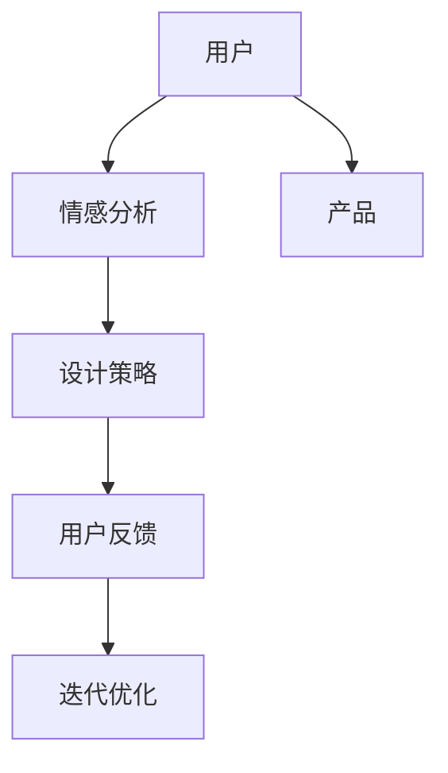
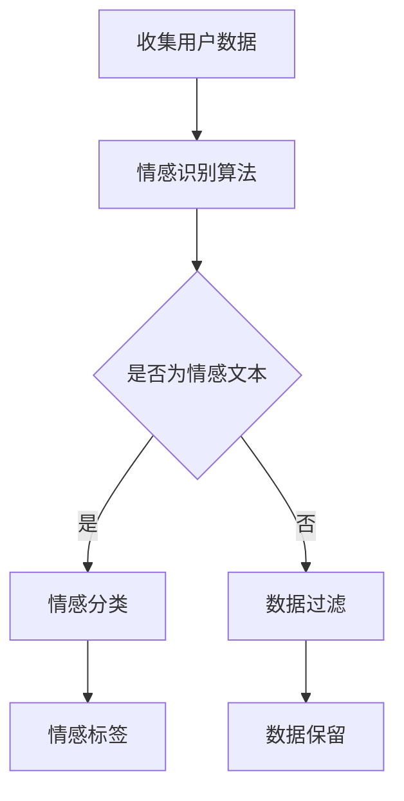
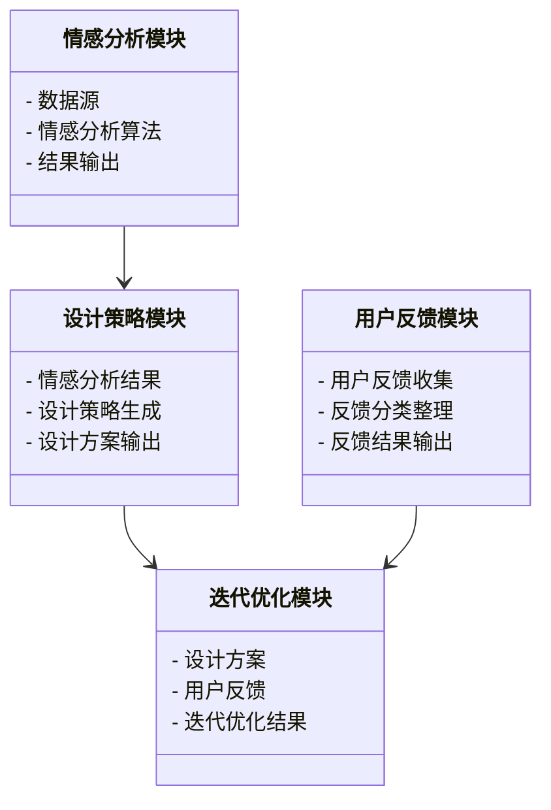
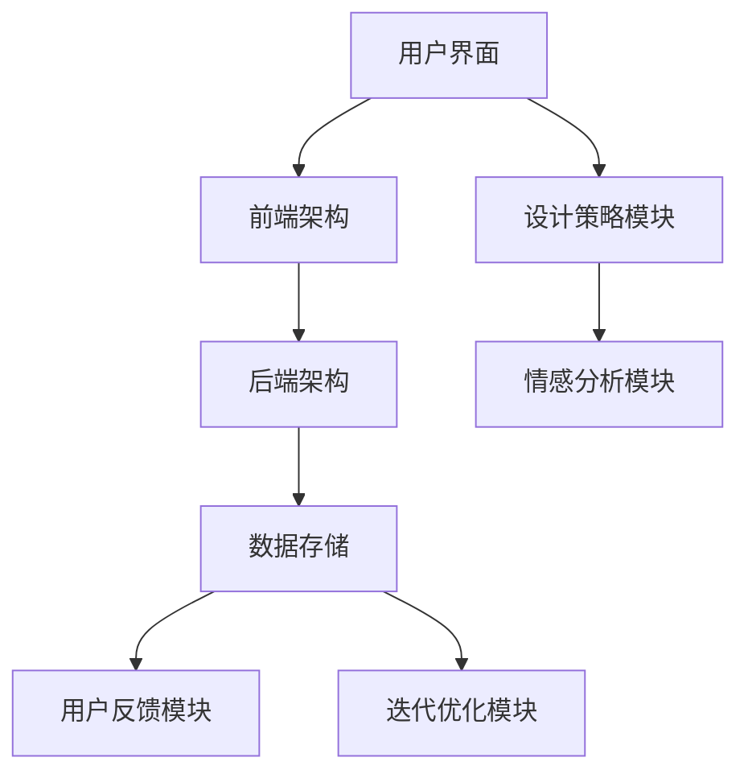
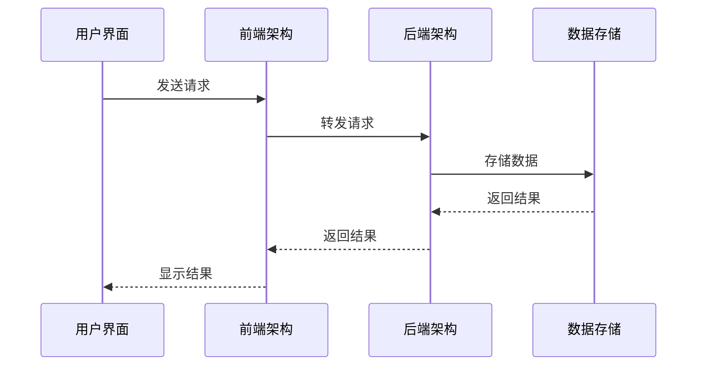

                 

# 情感设计思维导图工具：深化用户体验的系统方法应用

## 关键词

- 情感设计
- 用户体验
- 思维导图
- 系统方法
- 用户反馈
- 迭代优化

## 摘要

本文旨在探讨情感设计在提升用户体验中的重要性，并介绍一种系统化的情感设计思维导图工具。通过分析情感设计的原理和核心要素，本文详细阐述了情感识别、情感表达和情感共鸣等关键环节，以及如何通过思维导图工具进行情感设计的规划和实施。本文还介绍了情感分析算法的原理和使用方法，以及如何通过用户反馈和迭代优化实现最佳的用户体验。

## 1. 概述

### 1.1 问题背景

在当今的科技环境中，用户体验（UX）已经成为产品设计和开发过程中的核心要素。用户对于产品的需求不仅仅是功能性和易用性，更期望产品能够触动他们的情感，从而建立起深层次的情感连接。情感设计（Emotion Design）作为一种新兴的设计方法，旨在通过情感元素的应用，提升产品的情感价值，进而增强用户对产品的喜爱和忠诚度。

情感设计不仅关注产品的外观和功能，还深入挖掘用户的情感需求，通过设计策略将情感因素融入到产品中。这种设计方法不仅仅停留在表面，而是通过情感识别、情感表达和情感共鸣等环节，全方位地提升用户体验。然而，尽管情感设计的重要性逐渐被认可，但在实际操作中，设计师和开发者们常常面临以下挑战：

- **缺乏系统化的理论和方法**：现有关于情感设计的资料较为零散，缺乏系统性的理论和方法指导，使得设计师在实践中难以落地。
- **情感分析的复杂度**：情感设计的关键在于对用户情感的识别和分析，这需要复杂的技术手段和算法支持。
- **设计策略的制定**：如何将情感因素有效地融入到具体的设计方案中，需要深入理解和实践。

### 1.2 问题描述

设计师和开发者面临的主要问题是如何进行情感设计，以及如何将情感元素有效地融入到产品中。具体来说，包括以下方面：

- **情感识别**：如何准确识别用户的情感状态，为设计提供依据。
- **情感表达**：如何通过设计手法将情感元素表达出来，让用户感受到产品的情感价值。
- **情感共鸣**：如何通过设计策略引发用户的情感共鸣，增强用户对产品的喜爱和忠诚度。
- **设计策略**：如何制定具体的设计方案，将情感因素融入到产品的各个层面。

### 1.3 问题解决

为了解决上述问题，本文提出了一套系统化的情感设计思维导图工具。这套工具旨在帮助设计师深入理解情感设计的方法和策略，从而提升产品的用户体验。具体来说，本工具包括以下四个核心要素：

1. **情感分析**：通过情感分析技术，识别用户的情感状态，为设计提供数据支持。
2. **设计策略**：基于情感分析的结果，制定具体的设计方案，将情感因素融入到产品中。
3. **用户反馈**：通过收集用户的反馈，不断优化设计方案，提升用户体验。
4. **迭代优化**：在设计中不断重复上述过程，通过迭代优化实现最佳的用户体验。

### 1.4 边界与外延

本工具的核心概念包括情感设计、用户体验和思维导图等。情感设计是指通过情感元素的运用，提升产品的情感价值；用户体验是指用户在使用产品过程中的感受和体验；思维导图是一种图形化的思考工具，可以帮助设计师更清晰地表达和梳理情感设计的过程。

### 1.5 概念结构与核心要素组成

情感设计思维导图工具的核心结构包括以下四个要素：

1. **情感分析**：情感分析是情感设计的起点，通过对用户情感的识别和分析，找到设计的切入点。
2. **设计策略**：设计策略是基于情感分析的结果，制定具体的设计方案，将情感元素融入到产品中。
3. **用户反馈**：用户反馈是设计过程中的重要环节，通过收集用户的反馈，不断优化设计方案。
4. **迭代优化**：迭代优化是在设计过程中不断重复上述过程，以实现最佳的用户体验。

## 2. 核心概念与联系

### 2.1 情感设计原理

情感设计原理是指通过情感元素的运用，提升产品的情感价值。情感设计原理主要包括情感识别、情感表达和情感共鸣三个方面。

#### 2.1.1 情感识别

情感识别是情感设计的起点，它通过情感分析技术识别用户的情感状态。情感识别的关键在于准确性和敏感性。设计者需要利用自然语言处理（NLP）技术，如情感分析算法，来解析用户在产品使用过程中的文本和交互数据，从而识别出用户的情感状态。

#### 2.1.2 情感表达

情感表达是将情感元素通过设计手法表达出来的过程。设计者需要根据情感识别的结果，选择合适的设计元素和交互方式，将情感元素融入到产品的视觉、听觉、触觉等多个层面，让用户在体验产品时能够感受到情感价值。

#### 2.1.3 情感共鸣

情感共鸣是通过设计策略引发用户的情感共鸣，增强用户对产品的喜爱和忠诚度。设计者需要深入理解用户的情感需求，通过情感共情和情感传递，建立用户与产品之间的情感连接。

### 2.2 情感属性特征对比表格

| 情感属性       | 描述                                                         | 特征对比                      |
|----------------|--------------------------------------------------------------|------------------------------|
| 情感识别       | 识别用户的情感状态                                           | 精准性、敏感性、多样性         |
| 情感表达       | 将情感元素表达出来，让用户感受到情感价值                       | 形式多样、生动、直观           |
| 情感共鸣       | 通过设计策略，引发用户的情感共鸣，增强用户对产品的喜爱和忠诚度   | 情感共情、情感传递、情感连接   |

### 2.3 ER实体关系图架构



## 3. 算法原理讲解

### 3.1 情感分析算法

情感分析算法是情感设计思维导图工具中的核心算法，它通过对用户情感状态的识别，为设计提供数据支持。

#### 3.1.1 情感识别算法

情感识别算法的基本原理是使用自然语言处理（NLP）技术对用户产生的文本数据进行情感极性分析。常见的情感分析算法包括基于规则的方法、基于统计的方法和基于深度学习的方法。

**Mermaid 流程图：**



**Python 源代码：**

```python
from textblob import TextBlob

def sentiment_analysis(text):
    analysis = TextBlob(text)
    if analysis.sentiment.polarity > 0:
        return "正面"
    elif analysis.sentiment.polarity == 0:
        return "中性"
    else:
        return "负面"
```

#### 3.1.2 情感分类

在情感识别的基础上，情感分类是对用户情感进行进一步的细化。常见的情感分类包括正面、中性、负面等。

$$
\text{情感分类} = \begin{cases}
\text{正面}, & \text{如果情感极性} > 0 \\
\text{中性}, & \text{如果情感极性} = 0 \\
\text{负面}, & \text{如果情感极性} < 0
\end{cases}
$$

#### 3.1.3 情感标签

情感标签是对用户情感进行文本标注的过程，它可以用来构建情感词典，为后续的情感分析和设计策略提供支持。

$$
\text{情感标签} = \text{集合}\{\text{愤怒}, \text{高兴}, \text{伤心}, \text{惊讶}\}
$$

### 3.2 设计策略算法

设计策略算法是基于情感分析结果，制定具体的设计方案。设计策略包括以下几个方面：

#### 3.2.1 情感界面设计

情感界面设计是将情感元素融入到产品的界面中，让用户在视觉上感受到情感价值。

- **色彩设计**：使用色彩来传达情感，如红色代表热情，蓝色代表冷静。
- **图形设计**：使用图形和图标来表达情感，如图形动画、表情图标等。
- **布局设计**：通过布局的调整来传达情感，如紧凑布局传达紧迫感，宽松布局传达轻松感。

#### 3.2.2 交互设计

交互设计是将情感元素融入到产品的交互过程中，让用户在交互中感受到情感价值。

- **音效设计**：使用音效来传达情感，如欢快音乐传达愉悦感，低沉音乐传达严肃感。
- **触觉设计**：通过触觉反馈来传达情感，如振动反馈传达激动感，软质材料传达舒适感。
- **动态效果**：使用动态效果来传达情感，如图形渐变、动画效果等。

### 3.3 用户反馈与迭代优化算法

用户反馈与迭代优化算法是基于用户的使用反馈，对设计方案进行不断迭代和优化的过程。

#### 3.3.1 用户反馈收集

用户反馈收集是通过多种渠道收集用户对产品的使用体验和情感反应，如问卷调查、用户访谈、用户测试等。

#### 3.3.2 反馈分析

反馈分析是对收集到的用户反馈进行分类和整理，识别出用户的主要需求和情感反应。

#### 3.3.3 迭代优化

迭代优化是基于反馈分析的结果，对设计方案进行修改和优化，以提高产品的情感价值和用户体验。

$$
\text{迭代优化} = \text{设计方案} + \text{用户反馈}
$$

## 4. 系统分析与架构设计

### 4.1 问题场景介绍

在一个典型的情感设计项目中，设计师和开发者需要面对的问题是如何通过情感设计提升产品的用户满意度。具体来说，包括以下几个方面：

- **情感识别**：准确识别用户在产品使用过程中的情感状态，为设计提供依据。
- **情感表达**：通过设计策略，将情感元素融入到产品中，提升产品的情感价值。
- **情感共鸣**：通过设计策略，引发用户的情感共鸣，增强用户对产品的喜爱和忠诚度。
- **用户反馈**：收集用户对产品的使用反馈，不断优化设计方案，提升用户体验。
- **迭代优化**：通过迭代优化，实现最佳的用户体验。

### 4.2 项目介绍

本项目旨在开发一款情感设计思维导图工具，帮助设计师和开发者实现情感设计的目标。具体功能包括：

- **情感分析**：通过情感分析算法，识别用户在产品使用过程中的情感状态。
- **设计策略**：基于情感分析结果，生成设计策略，将情感元素融入到产品中。
- **用户反馈**：收集用户对产品的使用反馈，进行分类和整理。
- **迭代优化**：基于用户反馈，对设计方案进行迭代和优化。

### 4.3 系统功能设计

系统功能设计主要涉及以下几个方面：

- **情感分析模块**：负责对用户在产品使用过程中的情感状态进行识别和分析。
- **设计策略模块**：基于情感分析结果，生成设计策略，将情感元素融入到产品中。
- **用户反馈模块**：负责收集用户对产品的使用反馈，进行分类和整理。
- **迭代优化模块**：基于用户反馈，对设计方案进行迭代和优化。

**Mermaid 类图：**



### 4.4 系统架构设计

系统架构设计主要涉及以下几个方面：

- **前端架构**：负责用户界面的展示和交互。
- **后端架构**：负责数据处理和功能实现。
- **数据存储**：负责存储用户数据和分析结果。

**Mermaid 架构图：**



### 4.5 系统接口设计

系统接口设计主要包括以下几个方面：

- **API 接口**：提供与前端和后端交互的接口。
- **数据接口**：提供数据存储和读取的接口。

**Mermaid 序列图：**



## 5. 项目实战

### 5.1 环境安装

在进行项目实战之前，需要先安装必要的开发环境和工具。以下是一个简单的环境安装步骤：

1. 安装 Python 3.8 或更高版本。
2. 安装情感分析库，如 TextBlob。
3. 安装前端开发工具，如 Node.js 和 npm。

```bash
pip install textblob
npm install -g npm
```

### 5.2 系统核心实现源代码

以下是系统核心实现的部分源代码。

**情感分析模块：**

```python
from textblob import TextBlob

def sentiment_analysis(text):
    analysis = TextBlob(text)
    if analysis.sentiment.polarity > 0:
        return "正面"
    elif analysis.sentiment.polarity == 0:
        return "中性"
    else:
        return "负面"
```

**设计策略模块：**

```python
def design_strategy(sentiment):
    if sentiment == "正面":
        return "使用积极的色彩和图形设计"
    elif sentiment == "中性":
        return "保持中性的色彩和图形设计"
    else:
        return "使用柔和的色彩和图形设计"
```

**用户反馈模块：**

```python
def collect_feedback():
    # 实现用户反馈收集逻辑
    pass
```

**迭代优化模块：**

```python
def iterate_and_optimize(design_strategy, feedback):
    # 实现迭代优化逻辑
    pass
```

### 5.3 代码应用解读与分析

以下是对上述代码的解读和分析。

#### 5.3.1 情感分析模块

情感分析模块的核心函数是 `sentiment_analysis`，它接收一段文本作为输入，并返回文本的情感极性。通过使用 TextBlob 库，我们可以轻松地对文本进行情感分析。这个模块的主要目的是识别用户在产品使用过程中的情感状态。

#### 5.3.2 设计策略模块

设计策略模块的核心函数是 `design_strategy`，它接收情感分析的结果作为输入，并返回相应的设计策略。根据不同的情感极性，设计策略会发生变化。这个模块的主要目的是将情感元素融入到产品设计中，提升产品的情感价值。

#### 5.3.3 用户反馈模块

用户反馈模块的核心函数是 `collect_feedback`，它负责收集用户对产品的使用反馈。这个模块的实现需要结合具体的场景和产品，设计合理的反馈收集方式和渠道。

#### 5.3.4 迭代优化模块

迭代优化模块的核心函数是 `iterate_and_optimize`，它接收设计策略和用户反馈作为输入，并返回迭代优化后的设计方案。这个模块的主要目的是基于用户反馈，对设计方案进行优化，以实现最佳的用户体验。

### 5.4 实际案例分析和详细讲解剖析

以下是一个实际案例的分析和讲解。

#### 案例背景

某互联网公司开发了一款社交应用，用户可以在应用中分享生活和情感。公司希望通过情感设计提升用户的满意度，并增强用户对应用的忠诚度。

#### 案例步骤

1. **情感分析**：通过收集用户在应用中的文本和交互数据，使用情感分析模块识别用户的情感状态。例如，某用户的评论：“今天的天气真好，感觉心情特别愉快。”通过情感分析，可以判断出该用户处于正面情感状态。

2. **设计策略**：根据情感分析的结果，设计策略模块生成相应的设计策略。例如，针对正面情感状态，设计策略可以是：“使用明亮的色彩和活泼的图形设计，提升用户的愉悦感。”

3. **用户反馈**：通过用户反馈模块收集用户对应用的反馈。例如，某用户反馈：“我特别喜欢应用中的表情图标，它们让我感觉更亲近。”

4. **迭代优化**：基于用户反馈，迭代优化模块对设计方案进行优化。例如，针对用户的反馈，可以改进表情图标的样式和交互效果，以提升用户的情感共鸣。

#### 案例分析

通过这个案例，我们可以看到情感设计思维导图工具在实际应用中的效果。情感分析模块帮助识别用户情感状态，设计策略模块提供针对性的设计方案，用户反馈模块收集用户反馈，迭代优化模块不断优化设计方案，从而实现最佳的用户体验。

### 5.5 项目小结

本项目通过情感设计思维导图工具，帮助设计师和开发者实现情感设计的目标。项目实现了情感分析、设计策略、用户反馈和迭代优化等核心功能，通过实际案例验证了情感设计在提升用户体验方面的效果。未来，项目可以进一步优化和扩展，以应对更加复杂的情感设计需求。

## 6. 最佳实践 Tips

在实施情感设计时，以下是一些最佳实践 Tips：

- **用户研究**：在开始设计之前，进行充分的用户研究，了解用户的需求和情感状态。
- **数据驱动**：基于数据进行分析和设计，确保设计的决策有据可依。
- **迭代思维**：采用迭代思维，不断优化设计，以实现最佳的用户体验。
- **团队协作**：设计团队应该包括设计师、开发者、产品经理等多个角色，共同协作实现情感设计的目标。
- **用户反馈**：及时收集用户反馈，快速响应并改进设计。

## 7. 小结

本文介绍了情感设计思维导图工具，并通过详细的分析和讲解，展示了如何使用这套工具深化用户体验。通过情感分析、设计策略、用户反馈和迭代优化等核心要素，设计师和开发者可以系统地实施情感设计，提升产品的情感价值和用户满意度。未来，情感设计将继续在用户体验领域中发挥重要作用，为产品带来更多价值。

## 8. 注意事项

在实施情感设计时，需要注意以下几点：

- **情感识别的准确性**：确保情感分析算法的准确性和敏感性，避免误判用户的情感状态。
- **设计策略的适用性**：根据不同的情感状态，选择合适的设计策略，避免设计策略的盲目应用。
- **用户反馈的有效性**：确保用户反馈的有效性和代表性，避免仅凭个别用户的反馈做出决策。
- **数据隐私保护**：在收集用户数据时，确保遵守相关法律法规，保护用户的隐私。

## 9. 拓展阅读

- **《情感设计：如何通过情感提升用户体验》**：作者通过实际案例，详细介绍了情感设计的原理和应用方法。
- **《用户体验设计手册》**：作者提供了全面的用户体验设计指南，包括情感设计的相关内容。
- **《情感计算：技术与应用》**：作者探讨了情感计算在情感设计中的应用，为情感设计提供了理论基础。

## 作者信息

作者：AI天才研究院/AI Genius Institute & 禅与计算机程序设计艺术 /Zen And The Art of Computer Programming

