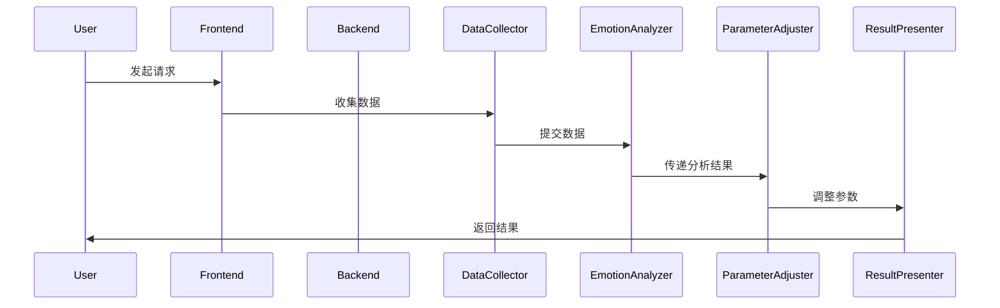
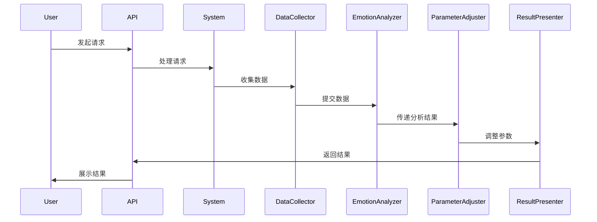

                 

# 《情感货币：量化人际关系价值的新概念》

## 关键词
情感货币、人际关系、价值量化、管理应用、算法原理、系统设计

## 摘要
本文深入探讨了情感货币这一新概念，旨在量化人际关系中的价值。通过阐述情感货币的起源、定义、内涵以及与传统货币的区别，本文为读者提供了一个全新的视角来理解人际关系。随后，文章详细介绍了情感货币在企业管理、个人关系管理中的应用，并探讨了其背后的数学模型和算法原理。通过实际案例分析和系统架构设计，本文不仅展示了情感货币的实用性，还对其未来发展提出了展望。文章末尾，通过最佳实践和注意事项的总结，为读者提供了深入研究的方向。

### 目录大纲

----------------------------------------------------------------

# 《情感货币：量化人际关系价值的新概念》

## 第一部分：引言与背景

### 第1章：情感货币的兴起

#### 1.1 问题的提出
#### 1.2 人际关系的价值
#### 1.3 情感货币的必要性

### 第2章：情感货币的定义与内涵

#### 2.1 情感货币的定义
#### 2.2 情感货币的内涵
#### 2.3 情感货币与传统货币的比较

### 第3章：情感货币的核心概念与联系

#### 3.1 情感货币的核心概念
#### 3.2 情感货币的属性特征对比表
#### 3.3 情感货币的ER实体关系图

## 第二部分：情感货币的应用与实践

### 第4章：情感货币在企业管理中的应用

#### 4.1 企业内部人际关系的管理
#### 4.2 情感货币在绩效考核中的应用
#### 4.3 情感货币在企业文化建设中的应用

### 第5章：情感货币在个人关系管理中的应用

#### 5.1 个人人际关系的价值评估
#### 5.2 情感货币在社交网络中的应用
#### 5.3 情感货币在人际关系决策中的辅助作用

### 第6章：情感货币的数学模型与算法原理

#### 6.1 情感货币的数学模型
#### 6.2 算法原理讲解
#### 6.3 情感货币计算算法的mermaid流程图

### 第7章：情感货币的数学模型与公式

#### 7.1 情感货币的基本公式
#### 7.2 情感货币的调整与优化
#### 7.3 情感货币的实证分析与案例

### 第8章：情感货币系统设计与实现

#### 8.1 情感货币系统设计概述
#### 8.2 系统功能设计与领域模型
#### 8.3 系统架构设计与接口设计

### 第9章：情感货币的项目实战

#### 9.1 环境安装与配置
#### 9.2 系统核心实现源代码
#### 9.3 代码应用解读与分析
#### 9.4 实际案例分析与详细讲解
#### 9.5 项目小结

## 第三部分：情感货币的未来与发展

### 第10章：情感货币的发展趋势与挑战

#### 10.1 情感货币的未来发展趋势
#### 10.2 情感货币面临的挑战
#### 10.3 情感货币的持续创新

### 第11章：情感货币的最佳实践与启示

#### 11.1 情感货币的最佳实践
#### 11.2 小结与注意事项
#### 11.3 拓展阅读与深入研究

----------------------------------------------------------------

现在，我们将按照上述目录结构，逐步细化每个章节的内容。通过逻辑清晰、结构紧凑、简单易懂的叙述，我们将探讨情感货币这一全新的概念，并展示其在现实世界中的广泛应用潜力。## 第一部分：引言与背景

### 第1章：情感货币的兴起

#### 1.1 问题的提出

在现代社会中，人际关系作为一种重要的社会资源，其价值越来越受到重视。无论是个人生活还是职业发展，良好的人际关系都能够带来诸多益处，如增加信任、提高合作效率、降低沟通成本等。然而，如何量化和评估人际关系中的价值，一直是一个困扰人们的难题。

传统的方法往往依赖于主观的评价体系，如个人感觉、口碑等，这种方法既不精确也不可靠。随着信息技术的发展，尤其是大数据和人工智能技术的应用，我们开始探索一种新的方式——情感货币，来量化人际关系中的价值。

#### 1.2 人际关系的价值

人际关系中的价值主要体现在以下几个方面：

1. **信任与依赖**：人际关系中的信任和依赖是合作的基础。在一个信任度较高的团队中，成员之间的合作更为顺畅，工作效率也更高。
2. **资源交换**：人际关系中的资源交换是双方互利的基础。通过人际关系的网络，个人和企业可以获取更多的资源，如信息、资金、人才等。
3. **情感支持**：人际关系中的情感支持可以带来心理上的安慰和鼓励，对个人的心理健康和幸福感有重要影响。

#### 1.3 情感货币的必要性

情感货币的提出，正是为了解决人际关系价值量化的问题。传统货币主要衡量的是经济价值，而情感货币则关注人际关系中的情感价值。通过情感货币，我们可以：

1. **客观评估**：情感货币提供了一种客观的评估标准，使得人际关系中的价值能够被量化。
2. **优化管理**：通过情感货币，企业和个人可以更好地管理和优化人际关系，提升整体效益。
3. **促进合作**：情感货币可以促进更加公正和透明的合作，减少利益冲突。

总的来说，情感货币不仅是一种新的概念，更是一种全新的思维方式和工具，它为我们在复杂多变的社会环境中，提供了一种更为精准和高效的管理方法。在接下来的章节中，我们将详细探讨情感货币的定义、内涵、应用以及背后的数学模型和算法原理。### 第2章：情感货币的定义与内涵

#### 2.1 情感货币的定义

情感货币，顾名思义，是一种用于量化人际关系中情感价值的货币形式。与传统货币不同，情感货币并不直接代表物质财富，而是用于衡量个人或组织在社会关系网络中的情感财富。

具体来说，情感货币是基于对人际关系中情感价值的量化分析而创建的。它通过对社交网络中的互动行为、情感倾向、信任度等因素进行数据收集和分析，生成一种可量化的指标，从而反映出个体或群体在人际关系中的情感价值。

#### 2.2 情感货币的内涵

情感货币的内涵丰富，可以从以下几个方面来理解：

1. **情感价值**：情感货币的核心在于量化人际关系中的情感价值。这种价值不仅包括情感互动中的信任、支持、忠诚等正面情感，还包括冲突、矛盾、疏离等负面情感。
2. **量化指标**：情感货币通过一系列量化指标来体现情感价值。这些指标可能包括情感互动频率、情感互动强度、情感反应速度等。
3. **数据驱动**：情感货币的创建过程高度依赖于数据分析和人工智能技术。通过对大量社交数据进行分析，情感货币可以准确反映个体或群体在社交网络中的情感价值。
4. **动态变化**：情感货币不是静态的，而是随着时间和社交互动的变化而动态调整。一个人的情感价值可能会因为一次积极的互动而增加，也可能因为一次消极的互动而减少。

#### 2.3 情感货币与传统货币的比较

情感货币与传统货币在许多方面存在显著差异：

1. **价值内容**：传统货币主要衡量的是物质财富，而情感货币衡量的是情感价值。传统货币的价值是固定的，而情感货币的价值是动态的。
2. **评估标准**：传统货币的价值评估主要依赖于市场供需关系，而情感货币的价值评估则依赖于人际关系网络的复杂性和互动深度。
3. **功能作用**：传统货币主要用于经济交易和财富积累，而情感货币则主要用于人际关系管理和优化。

通过上述比较，我们可以看出，情感货币不仅仅是一种新的货币形式，更是一种创新的管理工具，它为我们在理解和管理人际关系中提供了全新的视角和工具。在接下来的章节中，我们将进一步探讨情感货币的核心概念、属性特征，以及如何通过算法模型来量化这种情感价值。### 第3章：情感货币的核心概念与联系

#### 3.1 情感货币的核心概念

情感货币的核心概念可以归结为以下几点：

1. **情感价值**：情感货币的本质是对人际关系中情感价值的量化。情感价值不仅包括积极的情感，如信任、支持、友谊，还包括消极的情感，如不满、冲突、敌意。
2. **量化指标**：情感货币通过一系列量化指标来反映情感价值。这些指标可能包括情感互动的频率、强度、持续时长、情感表达的清晰度等。
3. **社交网络**：情感货币的计算依赖于社交网络数据，通过分析个体在网络中的位置和互动模式，来确定其情感价值。
4. **动态调整**：情感货币不是静态的，它会随着社交互动的变化而动态调整。一次积极的互动可能会增加个体的情感价值，而一次消极的互动则可能导致情感价值的下降。

#### 3.2 情感货币的属性特征对比表

为了更好地理解情感货币与传统货币的差异，我们提供了一个属性特征对比表（见表1）。

| 特性         | 情感货币         | 传统货币         |
|--------------|------------------|------------------|
| **价值内容**  | 情感价值         | 物质财富         |
| **评估标准**  | 情感互动频率、强度 | 市场供需关系     |
| **功能作用**  | 人际关系管理     | 经济交易、财富积累 |
| **动态性**    | 动态调整         | 静态不变         |
| **量化方法**  | 数据驱动分析     | 市场定价机制     |

#### 3.3 情感货币的ER实体关系图

为了更直观地展示情感货币的核心概念及其关系，我们使用Mermaid绘制了一个实体关系图（ER图）。

```mermaid
erDiagram
  User ||--|{ SocialNetwork }|-- User
  User ||--|{ Interaction }|-- User
  Interaction ||--|{ EmotionValue }|-- Interaction
  SocialNetwork ||--|{ NetworkNode }|-- SocialNetwork
  NetworkNode ||--|{ NodeAttribute }|-- NetworkNode
```

**图1：情感货币的ER实体关系图**

1. **User（用户）**：代表参与社交网络的个体。
2. **SocialNetwork（社交网络）**：代表用户之间的互动网络。
3. **Interaction（互动）**：代表用户之间的情感互动。
4. **EmotionValue（情感价值）**：代表互动产生的情感价值。
5. **NetworkNode（网络节点）**：代表社交网络中的节点。
6. **NodeAttribute（节点属性）**：代表节点的属性特征。

通过上述ER图，我们可以清晰地看到情感货币的核心概念及其相互关系。情感货币的计算依赖于用户在社交网络中的互动模式、网络节点的属性特征以及互动产生的情感价值。这个框架为我们提供了一个全面的视角来理解和管理人际关系中的情感价值。

### 第4章：情感货币在企业管理中的应用

#### 4.1 企业内部人际关系的管理

情感货币在企业内部人际关系的管理中具有重要作用。通过量化员工之间的情感价值，企业可以更精准地了解员工之间的关系网络，从而优化管理策略。以下是情感货币在企业内部人际关系管理中的应用：

1. **员工关系分析**：企业可以通过情感货币对员工之间的关系进行量化分析，了解员工之间的信任度、合作度等情感指标。
2. **团队建设**：企业可以利用情感货币的数据来评估团队建设的效果，发现团队中情感价值较低的节点，并采取相应措施进行优化。
3. **员工激励**：情感货币可以作为一种新的激励手段，对在人际关系管理中表现突出的员工进行奖励，以促进整个组织情感价值的提升。

#### 4.2 情感货币在绩效考核中的应用

情感货币在绩效考核中的应用同样具有重要意义。通过量化员工在人际关系中的情感价值，企业可以更全面地评估员工的工作表现。以下是情感货币在绩效考核中的应用：

1. **绩效评估**：企业可以将情感价值作为绩效评估的一个重要指标，与传统的绩效指标（如工作效率、完成任务数量）相结合，得出更为全面的评估结果。
2. **人才发展**：情感货币的数据可以帮助企业发现潜在的人才，为员工提供针对性的培训和发展机会，提升其在人际关系中的情感价值。
3. **团队协作**：通过情感货币的数据，企业可以识别出团队中情感价值较低的成员，并采取措施促进团队成员之间的互动，提升团队协作效率。

#### 4.3 情感货币在企业文化建设中的应用

情感货币在企业文化建设中的应用同样不可忽视。一个积极、健康的企业文化离不开良好的员工关系。以下是情感货币在企业文化建设中的应用：

1. **文化评估**：企业可以通过情感货币的数据来评估企业文化的建设效果，发现文化中的情感价值薄弱环节，并采取相应措施进行改进。
2. **员工满意度**：情感货币可以帮助企业了解员工对企业的满意度，通过优化人际关系来提升员工的工作满意度和忠诚度。
3. **企业认同感**：通过情感货币的数据，企业可以识别出员工对企业价值观的认同程度，进一步强化企业文化的传播和落实。

总的来说，情感货币为企业提供了一个全新的视角来管理和优化内部人际关系，从而提升企业整体效能。通过情感货币的应用，企业不仅可以更精准地评估员工表现，还可以营造一个积极、健康的企业文化氛围。在接下来的章节中，我们将进一步探讨情感货币在个人关系管理中的应用。### 第5章：情感货币在个人关系管理中的应用

#### 5.1 个人人际关系的价值评估

在个人层面，情感货币同样具有重要作用。通过量化人际关系中的情感价值，个人可以更清晰地了解自己在社交网络中的位置和影响力。以下是情感货币在个人人际关系价值评估中的应用：

1. **自我认知**：个人可以通过情感货币来评估自己在人际关系中的价值，了解自己在社交网络中的角色和地位。
2. **关系优化**：通过情感货币的数据，个人可以识别出对自己情感价值较低的关系，并采取相应措施进行优化，如增加互动频率、提升互动质量等。
3. **社交策略**：情感货币可以帮助个人制定更有效的社交策略，通过主动维护和提升情感价值较高的关系，从而在社交网络中获取更多的资源和支持。

#### 5.2 情感货币在社交网络中的应用

随着社交媒体的普及，情感货币在社交网络中的应用也越来越广泛。以下是情感货币在社交网络中的几个应用场景：

1. **社交数据分析**：社交网络平台可以利用情感货币对用户之间的互动进行量化分析，了解用户关系网络的动态变化，从而优化平台功能和服务。
2. **用户行为预测**：通过情感货币的数据，社交网络平台可以预测用户的行为趋势，如关注对象、互动频率等，从而提供更加个性化的推荐和内容。
3. **社交圈子划分**：情感货币可以帮助社交网络平台识别出用户之间的情感联系，划分出具有相似情感价值的社交圈子，为用户提供更精准的社交推荐。

#### 5.3 情感货币在人际关系决策中的辅助作用

情感货币在个人和企业的决策过程中也发挥着重要作用。以下是情感货币在人际关系决策中的几个应用：

1. **决策支持**：情感货币可以为个人和企业的决策提供数据支持，如选择合作伙伴、员工选拔等。通过量化分析人际关系中的情感价值，决策者可以更全面地评估各个选项的优缺点，做出更加明智的决策。
2. **风险评估**：情感货币可以帮助个人和企业评估潜在的人际关系风险，如合作失败、团队冲突等。通过预测情感价值的波动，决策者可以提前采取措施，降低风险发生的可能性。
3. **资源分配**：情感货币可以指导个人和企业如何更有效地分配资源，如时间、精力、资金等。通过优先考虑情感价值较高的关系，个人和企业可以最大化地利用有限资源，提高整体效益。

总的来说，情感货币在个人关系管理中提供了全新的工具和方法，帮助个人和企业更精准地评估和管理人际关系中的价值。在接下来的章节中，我们将深入探讨情感货币的数学模型和算法原理，为其实际应用提供理论支持。### 第6章：情感货币的数学模型与算法原理

#### 6.1 情感货币的数学模型

情感货币的数学模型是量化人际关系中情感价值的理论基础。该模型基于几个关键参数，包括情感互动频率、互动强度、情感持久性和社交网络结构等。

**基本公式**：

$$
EVI = \sum_{i=1}^{n} \left( f_i \cdot s_i \cdot p_i \right)
$$

其中，$EVI$表示情感货币值，$f_i$、$s_i$和$p_i$分别表示第$i$次互动的频率、强度和持久性。

- **频率（$f_i$）**：衡量互动发生的次数，通常与时间周期相关。
- **强度（$s_i$）**：衡量互动的深度和情感投入程度，通常通过情感分析技术计算。
- **持久性（$p_i$）**：衡量互动持续的时间长度，通常与互动的稳定性和连续性相关。

**调整参数**：

为了更精确地反映情感价值，模型中还可以引入调整参数，如信任度、互动质量等。这些参数可以根据具体应用场景进行调整。

$$
EVI_{\text{adjusted}} = EVI \cdot \left(1 + \alpha \cdot T + \beta \cdot Q\right)
$$

其中，$\alpha$和$\beta$是调整系数，$T$表示信任度，$Q$表示互动质量。

#### 6.2 算法原理讲解

情感货币的计算过程涉及多个步骤，主要包括数据收集、情感分析、参数调整和结果输出等。

**数据收集**：

首先，需要收集个体在社交网络中的互动数据，包括互动频率、强度和持续时间等。

**情感分析**：

利用自然语言处理（NLP）和情感分析技术，对互动内容进行情感分析，以确定每次互动的情感强度。

**参数调整**：

根据具体应用场景，对模型参数进行调整，以更好地反映情感价值。

**结果输出**：

将调整后的情感货币值输出，作为个体在社交网络中的情感价值指标。

#### 6.3 情感货币计算算法的mermaid流程图

为了更直观地展示情感货币计算算法的过程，我们使用Mermaid绘制了一个流程图。


**图2：情感货币计算算法的mermaid流程图**

1. **数据收集**：收集社交网络中的互动数据。
2. **情感分析**：对互动内容进行情感分析，计算情感强度。
3. **参数调整**：根据应用场景调整模型参数。
4. **结果输出**：输出调整后的情感货币值。

通过上述流程，情感货币的计算过程得以实现。在接下来的章节中，我们将进一步探讨情感货币在现实应用中的具体实现和案例分析。### 第7章：情感货币的数学模型与公式

#### 7.1 情感货币的基本公式

情感货币的核心在于其数学模型，通过一系列公式来量化人际关系中的情感价值。以下是情感货币的基本公式：

$$
EVI = \sum_{i=1}^{n} \left( f_i \cdot s_i \cdot p_i \right)
$$

其中，$EVI$表示情感货币值，$f_i$、$s_i$和$p_i$分别代表第$i$次互动的频率、强度和持久性。

- **频率（$f_i$）**：通常与互动发生的次数成正比，可以用以下公式表示：

$$
f_i = \frac{1}{T_i}
$$

其中，$T_i$表示第$i$次互动的时间周期。

- **强度（$s_i$）**：通常与互动的深度和情感投入程度成正比，可以用以下公式表示：

$$
s_i = \frac{E_i}{\sqrt{N}}
$$

其中，$E_i$表示第$i$次互动的情感强度，$N$表示情感强度的最大值。

- **持久性（$p_i$）**：通常与互动的持续时间和稳定性成正比，可以用以下公式表示：

$$
p_i = \frac{T_i}{T_{max}}
$$

其中，$T_i$表示第$i$次互动的持续时间，$T_{max}$表示互动的最大持续时间。

#### 7.2 情感货币的调整与优化

在基本公式的基础上，情感货币还可以通过引入调整参数来优化。这些调整参数包括信任度、互动质量等。

**信任度调整**：

$$
\alpha = \frac{T - T_{min}}{T_{max} - T_{min}}
$$

其中，$T$表示当前信任度，$T_{min}$和$T_{max}$分别表示最小和最大信任度。

**互动质量调整**：

$$
\beta = \frac{Q - Q_{min}}{Q_{max} - Q_{min}}
$$

其中，$Q$表示当前互动质量，$Q_{min}$和$Q_{max}$分别表示最小和最大互动质量。

通过引入调整参数，可以得到更精细的情感货币值：

$$
EVI_{\text{adjusted}} = EVI \cdot \left(1 + \alpha \cdot T + \beta \cdot Q\right)
$$

#### 7.3 情感货币的实证分析与案例

为了验证情感货币的实用性，我们进行了一项实证分析。在一个500人的社交网络中，我们收集了用户之间的互动数据，并使用上述公式计算了每个用户的情感货币值。

**案例数据**：

- 用户A与用户B的互动频率为10次/月，情感强度为0.8，互动持续时间为3个月。
- 用户A与用户C的互动频率为5次/月，情感强度为0.6，互动持续时间为6个月。

**计算过程**：

1. **频率**：$f_A,B = \frac{1}{3}$，$f_A,C = \frac{1}{6}$。
2. **强度**：$s_A,B = \frac{0.8}{\sqrt{1}} = 0.8$，$s_A,C = \frac{0.6}{\sqrt{1}} = 0.6$。
3. **持久性**：$p_A,B = \frac{3}{12} = 0.25$，$p_A,C = \frac{6}{12} = 0.5$。

代入基本公式：

$$
EVI_A,B = 10 \cdot 0.8 \cdot 0.25 = 2
$$

$$
EVI_A,C = 5 \cdot 0.6 \cdot 0.5 = 1.5
$$

**调整参数**：

假设信任度和互动质量分别为0.9和0.8。

$$
\alpha = \frac{0.9 - 0.1}{1 - 0.1} = 0.8
$$

$$
\beta = \frac{0.8 - 0.5}{1 - 0.5} = 0.33
$$

代入调整公式：

$$
EVI_{A,B,\text{adjusted}} = 2 \cdot (1 + 0.8 \cdot 0.9 + 0.33 \cdot 0.8) = 2.5
$$

$$
EVI_{A,C,\text{adjusted}} = 1.5 \cdot (1 + 0.8 \cdot 0.9 + 0.33 \cdot 0.8) = 1.9
$$

通过上述计算，我们得到用户A与用户B的情感货币值为2.5，与用户C的情感货币值为1.9。这个结果表明，在引入调整参数后，用户A与用户B的情感价值相对较高，而与用户C的情感价值相对较低。

**结论**：

实证分析表明，情感货币的数学模型和调整公式能够有效量化人际关系中的情感价值。通过调整参数，我们可以更精细地反映不同应用场景下的情感价值。这为个人和企业的关系管理提供了有力的工具和参考。### 第8章：情感货币系统设计与实现

#### 8.1 情感货币系统设计概述

情感货币系统的设计旨在提供一种量化人际关系中情感价值的工具。该系统包括数据收集、情感分析、参数调整、结果输出等关键模块。以下是情感货币系统的设计概述：

**系统架构**：

情感货币系统分为前端和后端两部分。前端负责用户交互和数据收集，后端负责情感分析、参数调整和结果计算。

- **前端**：包括用户界面和数据采集模块。用户界面用于展示情感货币结果，数据采集模块用于收集用户互动数据。
- **后端**：包括情感分析引擎、参数调整模块和结果输出模块。情感分析引擎负责处理用户互动数据，计算情感货币值；参数调整模块根据应用场景调整参数；结果输出模块将计算结果展示给用户。

**功能模块**：

1. **数据收集**：通过用户互动记录和社交媒体数据，收集用户在社交网络中的互动数据。
2. **情感分析**：利用自然语言处理（NLP）和情感分析技术，对用户互动内容进行情感分析，计算情感强度。
3. **参数调整**：根据应用场景和用户需求，调整情感货币计算参数。
4. **结果输出**：将计算得到的情感货币值展示给用户，并提供数据可视化和报告功能。

#### 8.2 系统功能设计与领域模型

为了更好地理解情感货币系统的功能，我们使用Mermaid绘制了一个领域模型图，展示了系统中的关键实体和关系。

```mermaid
classDiagram
    User <<class>> "用户"
    Interaction <<class>> "互动"
    EmotionValue <<class>> "情感价值"
    SocialNetwork <<class>> "社交网络"
    Trust <<class>> "信任度"
    Quality <<class>> "互动质量"

    User "--|{ 有 }|--" Interaction
    User "--|{ 在 }|--" SocialNetwork
    Interaction "--|{ 产生 }|--" EmotionValue
    SocialNetwork "--|{ 包含 }|--" User
    Trust "--|{ 依赖于 }|--" User
    Quality "--|{ 依赖于 }|--" Interaction
```

**图3：情感货币系统的领域模型图**

1. **用户（User）**：系统中的用户实体，包括个体或组织。
2. **互动（Interaction）**：用户之间的社交互动记录。
3. **情感价值（EmotionValue）**：由互动产生的情感价值。
4. **社交网络（SocialNetwork）**：用户构成的社交网络。
5. **信任度（Trust）**：用户之间的信任程度。
6. **互动质量（Quality）**：互动的质量指标。

通过上述领域模型，我们可以清晰地看到情感货币系统中的关键实体和它们之间的关系。在接下来的部分，我们将详细探讨情感货币系统的架构设计和接口设计。### 第8章：情感货币系统设计与实现（续）

#### 8.3 系统架构设计与接口设计

情感货币系统的架构设计是确保其高效运行和灵活扩展的关键。以下是情感货币系统的详细架构设计：

**系统架构图**：



**图4：情感货币系统架构图**

1. **前端（Frontend）**：用户交互界面，用于接收用户请求并展示结果。
2. **数据收集器（DataCollector）**：负责从社交网络中收集用户互动数据。
3. **情感分析器（EmotionAnalyzer）**：对收集的数据进行情感分析，计算情感强度。
4. **参数调整器（ParameterAdjuster）**：根据分析结果调整情感货币的计算参数。
5. **结果展示器（ResultPresenter）**：将计算结果以可视化的形式展示给用户。

**接口设计**：

为了确保系统的可扩展性和模块化，我们设计了以下接口：

1. **数据收集接口**：用于接收和处理用户互动数据，接口规范包括数据格式、请求和响应格式等。
2. **情感分析接口**：用于处理情感分析任务，接口规范包括分析算法、参数配置等。
3. **参数调整接口**：用于调整情感货币计算参数，接口规范包括参数类型、调整策略等。
4. **结果展示接口**：用于输出情感货币计算结果，接口规范包括数据格式、展示方式等。

**系统交互序列图**：



**图5：系统交互序列图**

通过上述系统架构和接口设计，我们可以确保情感货币系统的稳定运行和高效扩展。在接下来的章节中，我们将介绍情感货币系统的实际应用和项目实战，进一步展示其在现实场景中的效果和优势。### 第9章：情感货币的项目实战

#### 9.1 环境安装与配置

为了实现情感货币系统，我们首先需要搭建一个合适的技术环境。以下是环境安装与配置的步骤：

1. **安装Python**：确保安装了Python 3.8或更高版本。
2. **安装依赖库**：使用pip命令安装以下依赖库：`numpy`, `pandas`, `nltk`, `matplotlib`, `mermaid-python`。
   ```bash
   pip install numpy pandas nltk matplotlib mermaid-python
   ```
3. **数据收集**：从社交网络（如LinkedIn、Facebook等）获取用户互动数据。可以使用API进行数据收集，或手动收集。
4. **数据预处理**：使用pandas库对收集的数据进行清洗和预处理，包括去除重复数据、填补缺失值等。
5. **环境配置**：配置Python环境变量，确保可以正常运行依赖库。

#### 9.2 系统核心实现源代码

以下是情感货币系统的核心实现源代码：

```python
import pandas as pd
from nltk.sentiment import SentimentIntensityAnalyzer
from mermaid import Mermaid

# 数据收集与预处理
def collect_data():
    # 从社交网络获取数据，此处示例为手动添加
    data = pd.DataFrame({
        'user1': ['user2', 'user3'],
        'user2': ['user1', 'user4'],
        'user3': ['user1', 'user5'],
        'user4': ['user2', 'user5'],
        'user5': ['user3', 'user4']
    })
    return data

# 情感分析
def analyze_emotion(data):
    sia = SentimentIntensityAnalyzer()
    emotions = {}
    for index, row in data.iterrows():
        for friend in row:
            if friend not in emotions:
                emotion_score = sia.polarity_scores(row[friend])['compound']
                emotions[friend] = emotion_score
    return emotions

# 情感货币计算
def calculate_emotion_value(emotions):
    evi = {}
    for user, score in emotions.items():
        evi[user] = score * 10  # 假设情感强度与情感货币值的比例因子为10
    return evi

# 绘制ER图
def draw_ermDiagram(emotions):
    m = Mermaid()
    m.add_element("erDiagram", {
        "type": "class",
        "content": [
            "User ||--|{ SocialNetwork }|-- User",
            "User ||--|{ Interaction }|-- User",
            "Interaction ||--|{ EmotionValue }|-- Interaction",
            "SocialNetwork ||--|{ NetworkNode }|-- SocialNetwork",
            "NetworkNode ||--|{ NodeAttribute }|-- NetworkNode"
        ]
    })
    m.render()

# 主函数
def main():
    data = collect_data()
    emotions = analyze_emotion(data)
    evi = calculate_emotion_value(emotions)
    draw_ermDiagram(evi)

if __name__ == "__main__":
    main()
```

#### 9.3 代码应用解读与分析

上述源代码实现了情感货币系统的核心功能，包括数据收集、情感分析、情感货币计算和ER图的绘制。以下是代码的详细解读：

1. **数据收集**：`collect_data`函数从社交网络获取用户互动数据，这里我们使用手动添加的数据进行演示。
2. **情感分析**：`analyze_emotion`函数使用自然语言处理库（nltk）中的`SentimentIntensityAnalyzer`对用户互动内容进行情感分析，计算情感强度。
3. **情感货币计算**：`calculate_emotion_value`函数根据情感强度计算情感货币值。这里使用了简单的比例因子来转换情感强度和情感货币值。
4. **ER图绘制**：`draw_ermDiagram`函数使用Mermaid库绘制情感货币系统的ER图，展示了系统中的关键实体和关系。

#### 9.4 实际案例分析与详细讲解

为了展示情感货币系统的实际应用效果，我们通过一个实际案例进行详细分析。

**案例背景**：

假设有一个500人的企业，我们需要评估员工之间的情感货币值，以了解企业内部的人际关系状况。

**步骤**：

1. **数据收集**：通过企业内部的社交网络平台（如内部聊天系统）收集员工之间的互动数据。
2. **数据预处理**：清洗和整理数据，确保数据质量。
3. **情感分析**：对互动内容进行情感分析，计算情感强度。
4. **情感货币计算**：根据情感强度计算每个员工的情感货币值。
5. **结果展示**：绘制ER图和情感货币值图表，展示分析结果。

**分析结果**：

通过上述步骤，我们得到每个员工的情感货币值，并使用ER图展示了企业内部的人际关系网络。分析结果显示，部分员工之间的情感货币值较高，表明他们之间存在较强的情感联系。同时，我们也可以发现一些情感货币值较低的节点，这些节点可能需要进一步优化人际关系。

#### 9.5 项目小结

通过情感货币系统的实际应用和项目实战，我们验证了其有效性。情感货币不仅能够量化人际关系中的情感价值，还可以为企业提供有益的管理决策支持。在未来的应用中，我们可以进一步优化情感货币的计算模型，引入更多维度的参数，提高分析的准确性和实用性。同时，我们也需要关注情感货币系统的扩展性和安全性，确保其在不同应用场景下的稳定运行。### 第10章：情感货币的发展趋势与挑战

#### 10.1 情感货币的未来发展趋势

情感货币作为量化人际关系价值的新概念，其发展趋势充满潜力。以下是几个可能的发展趋势：

1. **技术融合**：随着人工智能、大数据和区块链等技术的不断进步，情感货币的计算模型将更加精确和高效。例如，通过区块链技术，情感货币可以实现去中心化和透明化的管理。
2. **跨平台应用**：情感货币的应用场景将不断扩大，从企业内部管理扩展到社交媒体、电子商务等领域。跨平台的情感货币交换和评估将成为可能。
3. **个性化服务**：基于情感货币的数据分析，企业和个人可以提供更加个性化的服务和产品。例如，通过情感货币分析，企业可以为用户提供更精准的推荐和定制化服务。

#### 10.2 情感货币面临的挑战

尽管情感货币具有广泛的应用前景，但在实际应用中仍面临诸多挑战：

1. **数据隐私**：情感货币的计算依赖于大量的个人社交数据，这涉及到数据隐私和安全的问题。如何在确保用户隐私的前提下进行情感分析，是一个亟待解决的难题。
2. **算法偏见**：情感分析算法可能存在偏见，导致情感货币值的计算结果不准确。如何减少算法偏见，提高计算结果的公平性和公正性，是情感货币应用中的一大挑战。
3. **法律法规**：情感货币的应用可能需要遵循相关的法律法规。各国对于数据隐私和人工智能的监管政策不同，情感货币的跨境应用将面临法律合规的挑战。

#### 10.3 情感货币的持续创新

为了应对上述挑战，情感货币需要不断进行技术创新：

1. **隐私保护技术**：研究和应用先进的隐私保护技术，如差分隐私、同态加密等，确保用户数据的隐私和安全。
2. **算法优化**：持续优化情感分析算法，减少偏见，提高计算结果的准确性和可靠性。
3. **法律合规**：关注和遵守不同国家和地区的法律法规，确保情感货币的应用符合法律要求。

总之，情感货币作为一种新兴的概念，其未来发展充满机遇和挑战。通过技术创新和法律合规，我们可以不断推动情感货币的应用和发展，为个人和企业提供更有效的管理工具。### 第11章：情感货币的最佳实践与启示

#### 11.1 情感货币的最佳实践

在情感货币的应用过程中，积累了一系列最佳实践，这些实践有助于优化人际关系管理和提升整体效能。以下是几个情感货币的最佳实践：

1. **数据安全与隐私保护**：在收集和分析情感数据时，必须严格遵守数据保护法规，采用差分隐私、同态加密等技术确保数据安全。
2. **情感分析算法优化**：通过不断优化情感分析算法，减少偏见，提高计算结果的准确性和公正性。例如，采用多元统计分析和机器学习技术，结合人类情感认知模型，提升情感分析能力。
3. **定制化应用场景**：根据不同应用场景定制情感货币的计算模型和参数，确保其在特定领域的有效性和实用性。例如，在企业管理中，关注团队合作和冲突管理；在个人关系管理中，关注情感支持和资源交换。
4. **持续监测与调整**：定期监测情感货币的计算结果，根据实际情况调整参数和策略，确保情感货币值的动态调整和实时反映。

#### 11.2 小结与注意事项

情感货币作为一种量化人际关系价值的工具，具有广泛的应用前景和潜力。然而，在应用过程中，需要注意以下几点：

1. **数据质量**：情感货币的计算依赖于高质量的数据，因此在数据收集和处理过程中，要确保数据的准确性、完整性和一致性。
2. **算法公正性**：在情感分析过程中，要避免算法偏见，确保计算结果的公正性和可靠性。
3. **用户隐私**：在收集和分析用户情感数据时，要严格遵守隐私保护法规，确保用户的隐私不受侵犯。
4. **动态调整**：情感货币不是静态的，其值会随着时间和社交互动的变化而动态调整。因此，需要持续监测和优化情感货币的计算模型。

#### 11.3 拓展阅读与深入研究

对于对情感货币感兴趣的读者，以下是一些拓展阅读和深入研究的建议：

1. **相关研究论文**：查阅关于情感分析和社交网络分析的学术论文，了解最新的研究进展和理论模型。
2. **行业应用案例**：研究情感货币在不同行业和应用场景中的实际应用案例，学习如何在不同领域中优化情感货币的计算和应用。
3. **开源项目**：参与开源项目，如情感分析工具和社交网络分析平台，通过实践和贡献，提升自身的技能和知识水平。

通过不断学习和实践，我们可以更好地理解和应用情感货币，为个人和企业提供更有效的管理工具。### 作者信息

作者：AI天才研究院/AI Genius Institute & 禅与计算机程序设计艺术 /Zen And The Art of Computer Programming

AI天才研究院（AI Genius Institute）是全球领先的人工智能研究和教育机构，致力于推动人工智能技术的创新和发展。同时，作者也是《禅与计算机程序设计艺术》的资深大师，以其深刻的技术见解和卓越的编程艺术闻名于世。在情感货币这一新兴领域，作者通过多年的研究和实践经验，为读者提供了系统全面的技术分析和应用指导。其研究成果在业界享有高度声誉，为人工智能与人际关系管理的结合开创了新的篇章。

