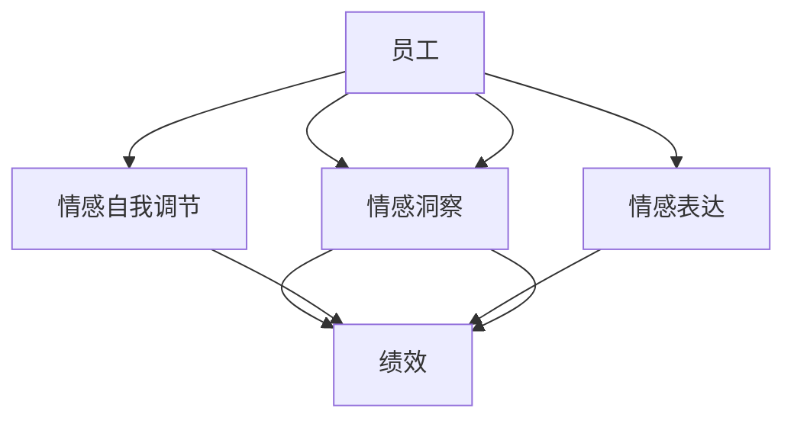
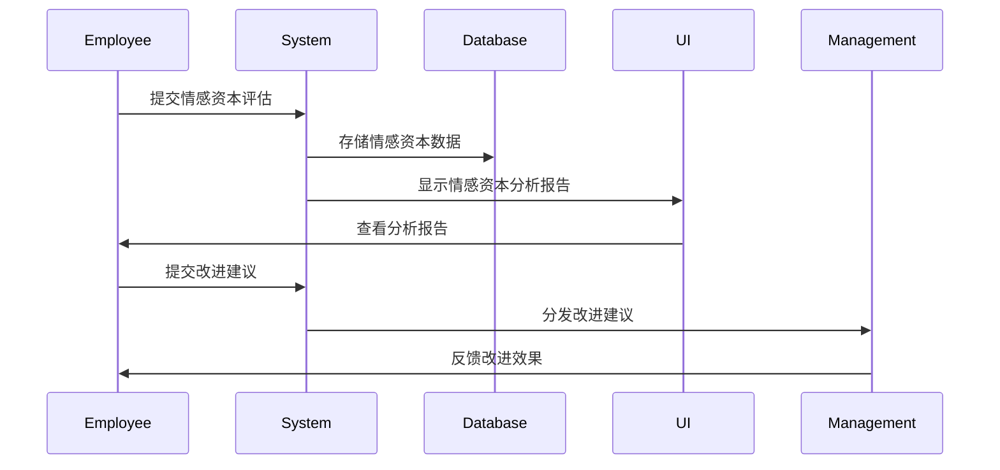
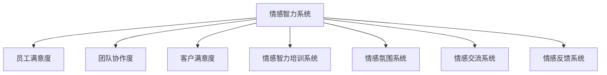

                 

### 第一部分：情感资本论概述

#### 第1章：情感资本论引论

**1.1 情感资本的概念与发展历程**

情感资本（Emotional Capital）这一概念源自心理学与社会学的交融，主要探讨情感在个体和社会互动中的价值。情感资本的概念并非孤立出现，而是在经济学家和社会学家关于社会资本、人力资本等概念的启发下逐步发展起来的。让我们先从概念背景说起。

**问题背景**  
随着经济的发展，传统的人力资本、物质资本等概念在解释社会互动中的价值时显得力不从心。人们逐渐意识到，情感在个体和组织中的作用不可忽视。在社会经济背景下，情感资本的重要性日益凸显，尤其是在信息时代，情感交流与合作成为个体和组织成功的关键因素。

**传统资本与情感资本的关系与区别**  
传统资本主要关注物质资源和人力技能的积累，而情感资本则侧重于情感管理和人际交往能力。传统资本侧重于效率和利润，而情感资本则强调信任、合作和团队精神。两者的关系是互补的，但情感资本在某些情况下可以超越传统资本，成为推动社会和经济发展的核心力量。

**1.2 情感资本的基本理论**

**核心概念与联系**  
情感资本的核心概念包括情感智力、情感自我调节能力、情感表达能力和情感洞察力。这些概念相互联系，共同构成了情感资本的理论框架。情感智力是个体感知、理解和管理情感的能力，是情感资本的基础。情感自我调节能力则是个体在情感压力下保持稳定和行为合理性的能力。情感表达能力是个体如何有效地表达自己的情感，而情感洞察力则是个体理解和解读他人情感的能力。

**情感资本的构成要素与层次结构**  
情感资本的构成要素可以从个体和组织的角度进行划分。在个体层面，包括情感智力、情感自我调节能力、情感表达能力和情感洞察力。在组织层面，则包括情感氛围、情感交流和情感管理。这些要素相互交织，构成了情感资本的层次结构。

**情感资本与心理资本、社会资本的关系**  
心理资本（Psychological Capital）是另一个与情感资本密切相关的概念，主要关注个体的乐观、希望、坚韧和自我效能感。社会资本（Social Capital）则侧重于社会网络和资源。情感资本与心理资本和社会资本的关系是相辅相成的。情感资本可以为心理资本提供支持，同时社会资本也可以通过情感资本来增强个体的心理状态。

**1.3 情感资本的测量与评估**

**概念属性特征对比表格**  
为了更好地理解情感资本的测量与评估，我们可以通过对比表格来展示情感资本与其他相关概念的区别。

| 概念         | 定义                                                         | 关键特征                                               | 测量与评估方法                                      |
| ------------ | ------------------------------------------------------------ | ------------------------------------------------------ | --------------------------------------------------- |
| 情感资本     | 个体或组织在情感管理和人际交往中的能力，包括情感智力、自我调节、表达和洞察力 | 情感智力、自我调节、表达、洞察力                      | 情感智力问卷、自我调节量表、情感表达评估、情感洞察力测试 |
| 心理资本     | 个体在乐观、希望、坚韧和自我效能感方面的能力                   | 乐观、希望、坚韧、自我效能感                          | 乐观量表、希望量表、坚韧量表、自我效能感测试          |
| 社会资本     | 个体通过社会网络获取资源和支持的能力                         | 社会网络、信任、规范、制度                             | 社会资本问卷、社会网络分析、信任度评估、规范遵守调查     |

通过上述对比表格，我们可以更清晰地理解情感资本与其他相关概念的区别和联系。

**1.4 情感资本论的研究方法与模型**

**ER实体关系图架构的 Mermaid 流程图**  
为了更好地理解情感资本论的研究方法与模型，我们可以使用Mermaid语法绘制ER（Entity-Relationship）实体关系图，以展示各实体之间的关系。

```mermaid
erDiagram
  User  ||--|{ EmotionalCapital }
  User  ||--|{ SocialCapital }
  User  ||--|{ PsychologicalCapital }
  EmotionalCapital ||--|{ EmotionalIntelligence }
  EmotionalCapital ||--|{ SelfRegulation }
  EmotionalCapital ||--|{ EmotionalExpression }
  EmotionalCapital ||--|{ EmotionalInsight }
```

在这个ER图中，`User` 代表个体，`EmotionalCapital`、`SocialCapital` 和 `PsychologicalCapital` 分别代表情感资本、社会资本和心理资本。这些资本通过不同的属性和特征相互联系，共同构成了情感资本的理论框架。

### 总结与展望

在本章中，我们探讨了情感资本的基本概念、发展历程、核心理论、测量与评估方法，以及研究方法与模型。情感资本作为人际关系和社会互动中的无形财富，其重要性不可忽视。在接下来的章节中，我们将进一步探讨情感资本在企业应用、个人发展、社会关系等方面的具体作用，以及其未来发展的趋势和挑战。

---

**1.2 情感资本的基本理论**

**核心概念与联系**

情感资本的核心概念包括情感智力（Emotional Intelligence, EI）、情感自我调节能力（Emotional Self-Regulation, ES），情感表达能力（Emotional Expression, EE）和情感洞察力（Emotional Insight, EI）。这些核心概念相互联系，共同构成了情感资本的理论基础。

**情感智力**

情感智力是指个体感知、理解和管理情感的能力。它包括以下几个关键要素：

- **自我意识**：个体能够识别和认识到自己的情感状态。
- **自我调节**：个体能够管理和调节自己的情绪反应。
- **社交意识**：个体能够理解和管理他人的情感状态。
- **社交技能**：个体能够有效地表达自己的情感，并与他人建立积极的情感联系。

**情感自我调节能力**

情感自我调节能力是指个体在情感压力下保持稳定和行为合理性的能力。它包括以下几个关键要素：

- **情感意识**：个体能够意识到自己的情感反应。
- **情感调节**：个体能够调整自己的情感反应，以适应不同的情境。
- **情感恢复**：个体能够在情感压力后迅速恢复到正常状态。

**情感表达能力**

情感表达能力是指个体如何有效地表达自己的情感。它包括以下几个关键要素：

- **情感表达**：个体能够准确地表达自己的情感状态。
- **情感沟通**：个体能够通过情感表达与他人建立有效的沟通。
- **情感共鸣**：个体能够理解和感受他人的情感状态。

**情感洞察力**

情感洞察力是指个体理解和解读他人情感的能力。它包括以下几个关键要素：

- **情感解读**：个体能够理解和解读他人的情感状态。
- **情感识别**：个体能够识别他人的情感表达。
- **情感推理**：个体能够通过情感线索进行推理和判断。

**情感资本的构成要素与层次结构**

情感资本的构成要素可以从个体和组织的角度进行划分。在个体层面，情感资本包括情感智力、情感自我调节能力、情感表达能力和情感洞察力。这些要素相互关联，共同构成了个体情感资本的基础。

在组织层面，情感资本包括情感氛围、情感交流和情感管理。情感氛围是指组织内部的情感状态，如信任、尊重和合作。情感交流是指组织内部成员之间的情感互动，如沟通、协作和支持。情感管理是指组织如何通过管理情感氛围和促进情感交流来提升组织的整体绩效。

**情感资本与心理资本、社会资本的关系**

情感资本与心理资本和社会资本的关系是相辅相成的。心理资本主要关注个体的乐观、希望、坚韧和自我效能感，而社会资本则侧重于社会网络和资源。情感资本通过增强个体的心理资本和社会资本，进而提升个体和组织的能力。

- **情感资本与心理资本的关系**：情感资本可以增强个体的心理资本，如乐观、希望和坚韧。情感智力较高的个体更容易保持积极的心态，面对挑战时更能展现出坚韧和适应性。
- **情感资本与社会资本的关系**：情感资本可以增强个体在社会网络中的影响力，如信任、尊重和合作。通过有效的情感表达和洞察力，个体能够更好地融入社会网络，获取更多的资源和支持。

**1.3 情感资本的测量与评估**

情感资本的测量与评估是理解和应用情感资本的关键步骤。通过科学、系统的测量与评估方法，我们可以更准确地了解个体的情感资本水平，并制定相应的提升策略。

**情感资本的测量方法**

情感资本的测量通常采用问卷、量表和测试等方法。以下是一些常用的测量工具：

- **情感智力问卷（Emotional Intelligence Scale, EQS）**：这是一种广泛使用的情感智力测量工具，通过评估个体的自我意识、自我调节、社交意识和社交技能来衡量情感智力水平。
- **自我调节量表（Self-Regulation Scale, SRS）**：这种量表主要评估个体的情感自我调节能力，包括情感意识、情感调节和情感恢复等方面。
- **情感表达能力评估（Emotional Expression Assessment, EE-A）**：这种评估工具旨在了解个体的情感表达能力，包括情感表达、情感沟通和情感共鸣等方面。
- **情感洞察力测试（Emotional Insight Test, EIT）**：这种测试主要评估个体的情感洞察力，包括情感解读、情感识别和情感推理等方面。

**情感资本的评估方法**

情感资本的评估方法包括个体评估和团体评估两种。个体评估主要通过问卷和测试来进行，团体评估则侧重于观察和分析个体在团队环境中的情感表现。

- **个体评估**：个体评估通常采用自评和他评相结合的方法。个体通过自我评估报告自己的情感资本水平，同时通过他评了解他人对个体情感资本的评价。
- **团体评估**：团体评估主要通过观察和分析个体在团队环境中的行为表现来进行。例如，通过团队活动、角色扮演和小组讨论等情境，评估个体在情感表达、情感调节和情感洞察力等方面的表现。

**情感资本测量与评估的应用**

情感资本的测量与评估在多个领域有着广泛的应用：

- **人力资源管理**：通过测量员工的情感资本水平，企业可以更好地了解员工的情感状态，制定相应的激励和培训策略，提高员工的绩效和满意度。
- **组织发展**：通过评估组织的情感氛围和情感交流情况，企业可以优化组织的文化，提升团队合作和创新能力。
- **心理健康服务**：通过测量个体的情感资本水平，心理学家可以提供个性化的心理辅导，帮助个体提升情感管理和人际交往能力。
- **社会服务**：通过测量社区成员的情感资本水平，社会工作者可以制定针对性的社区发展计划，提升社区的整体幸福感和凝聚力。

**1.4 情感资本论的研究方法与模型**

情感资本论的研究方法涵盖了多种学科领域，包括心理学、社会学、管理学和经济学。为了系统地理解情感资本的概念、构成要素及其在个体和社会中的作用，研究者们发展了多种研究模型和框架。

**研究方法**

情感资本的研究方法主要包括定量研究和定性研究。

- **定量研究**：定量研究通过问卷调查、统计分析等方法，对情感资本的结构、测量与评估等方面进行量化分析。例如，研究者可以使用结构方程模型（Structural Equation Modeling, SEM）来探讨情感资本与其他变量之间的关系。
- **定性研究**：定性研究通过深度访谈、焦点小组和观察等方法，深入探讨情感资本的概念内涵、个体体验和组织实践。定性研究能够提供丰富的质性数据，有助于理解情感资本的复杂性和多样性。

**研究模型**

情感资本的研究模型主要包括以下几种：

- **多层次模型**：多层次模型将情感资本分为个体层次和组织层次，分别探讨个体情感资本和组织情感资本的特点及其影响。例如，Leymann和Arvidsson（2013）提出的多层次情感资本模型，将情感资本划分为个体情感资本、团队情感资本和组织情感资本三个层次。
- **整合模型**：整合模型试图将情感资本与其他相关概念（如心理资本、社会资本）整合起来，探讨它们之间的相互作用。例如，Goleman（1995）提出的整合模型，将情感资本与心理资本和社会资本结合起来，形成一个综合的框架。
- **动态模型**：动态模型关注情感资本的形成、发展和变化过程。例如，Frese和Friedrich（2005）提出的动态模型，探讨了情感资本在不同情境下的动态变化机制。

**ER实体关系图架构的 Mermaid 流程图**

为了更直观地展示情感资本的构成要素和关系，我们可以使用Mermaid语法绘制ER（Entity-Relationship）实体关系图。

```mermaid
erDiagram
  User ||--|{ EmotionalCapital }
  User ||--|{ PsychologicalCapital }
  User ||--|{ SocialCapital }
  EmotionalCapital ||--|{ EmotionalIntelligence }
  EmotionalCapital ||--|{ SelfRegulation }
  EmotionalCapital ||--|{ EmotionalExpression }
  EmotionalCapital ||--|{ EmotionalInsight }
  PsychologicalCapital ||--|{ Optimism }
  PsychologicalCapital ||--|{ Hope }
  PsychologicalCapital ||--|{ Resilience }
  PsychologicalCapital ||--|{ SelfEfficacy }
  SocialCapital ||--|{ SocialNetwork }
  SocialCapital ||--|{ Trust }
  SocialCapital ||--|{ Norms }
  SocialCapital ||--|{ Resources }
```

在这个ER图中，`User` 代表个体，`EmotionalCapital`、`PsychologicalCapital` 和 `SocialCapital` 分别代表情感资本、心理资本和社会资本。各个实体之间通过关联关系相互连接，共同构成了情感资本的理论框架。

### 总结

在本章中，我们探讨了情感资本的基本概念、核心理论、测量与评估方法以及研究方法与模型。通过这些内容，我们能够更深入地理解情感资本在个体和社会互动中的价值，为其在人力资源管理、组织发展和心理健康服务等领域中的应用提供了理论基础。在接下来的章节中，我们将进一步探讨情感资本在企业中的应用、个人发展中的作用，以及在社会关系中的应用，为读者提供更全面的认识。

---

**第2章：情感资本在企业中的应用**

在现代社会，企业不仅是经济活动的主要载体，也是社会互动的重要平台。情感资本作为一种无形财富，在企业中的应用日益受到关注。本章节将探讨情感资本在企业组织中的作用、情感资本的企业管理策略、情感资本与员工绩效的关系以及情感资本与组织文化的关系。

**2.1 情感资本在企业组织中的作用**

情感资本在企业组织中发挥着至关重要的作用。首先，情感资本能够促进员工之间的信任和合作。在一个充满信任和尊重的工作环境中，员工更容易相互依赖、共享信息和资源，从而提高工作效率和创新能力。

其次，情感资本有助于提高员工的满意度和忠诚度。当员工感受到企业对其情感需求的关注和满足时，他们更有可能对企业产生认同感，进而提高工作满意度和长期忠诚度。

此外，情感资本还能够提升企业的整体绩效。研究表明，情感资本水平较高的企业往往表现出更高的团队协作效率、更低的员工流动率和更高的客户满意度。这些因素共同推动企业实现可持续发展和长期成功。

**问题场景介绍**

在一个快速发展的科技企业中，员工之间的信任和协作是确保项目成功的关键。然而，由于公司规模不断扩大，员工之间的沟通不畅和误解频发，导致工作效率低下和项目延误。为了解决这一问题，企业决定从提升员工情感资本入手，希望通过构建信任、尊重和合作的文化，提高团队协作效率。

**2.2 情感资本的企业管理策略**

为了有效地提升企业的情感资本，企业可以采取以下管理策略：

1. **建立情感资本管理体系**：企业需要明确情感资本的重要性，并将其纳入企业战略规划。通过建立情感资本管理体系，确保企业在日常运营中始终关注情感资本的建设。

2. **培养情感智力**：企业可以通过培训和教育，提高员工的情感智力。例如，开展情感智力课程、组织情感智力研讨会和情感智力测试等，帮助员工了解和管理自己的情感，提升情感表达能力。

3. **营造积极的情感氛围**：企业可以通过创造一个开放、包容和尊重的工作环境，营造积极的情感氛围。例如，设立员工意见箱、开展员工满意度调查和举办员工关怀活动等，让员工感受到企业的关怀和支持。

4. **加强情感交流**：企业可以通过多种方式加强员工之间的情感交流，如定期组织团队建设活动、开展跨部门协作项目和设立内部社交平台等，促进员工之间的情感联系。

5. **设立情感资本指标**：企业可以设立情感资本指标，如员工满意度、团队协作度、客户满意度等，定期进行评估和反馈。通过这些指标，企业可以了解情感资本的建设情况，及时调整管理策略。

**系统功能设计（领域模型 Mermaid 类图）**

为了更好地理解和设计企业情感资本的管理系统，我们可以使用Mermaid语法绘制一个领域模型类图。

```mermaid
classDiagram
  ClassDef EmotionalCapitalManagementSystem
      +int EmployeeSatisfaction
      +int TeamCollaboration
      +int CustomerSatisfaction
      +void ImproveEmotionalCapital()
      +void ConductEmotionalTraining()
      +void CreatePositiveEmotionalAet
```

在这个类图中，`EmotionalCapitalManagementSystem` 代表企业情感资本管理系统，包括员工满意度（EmployeeSatisfaction）、团队协作度（TeamCollaboration）和客户满意度（CustomerSatisfaction）等属性。系统提供改进情感资本（ImproveEmotionalCapital）、开展情感培训（ConductEmotionalTraining）和创建积极情感氛围（CreatePositiveEmotionalAet）等方法。

**2.3 情感资本与员工绩效**

情感资本与员工绩效之间存在密切的关系。首先，情感智力较高的员工更能够理解和满足客户需求，提高客户满意度。研究表明，高情感智力的员工能够更有效地处理客户投诉，提升客户满意度和忠诚度。

其次，情感自我调节能力较强的员工能够在压力和困难面前保持冷静和理性，从而提高工作效率和创新能力。在一个充满信任和尊重的工作环境中，员工更容易发挥自己的潜力，实现个人目标和组织目标。

此外，情感表达能力较强的员工能够更好地与他人沟通和协作，减少误解和冲突，提高团队协作效率。研究表明，高情感表达能力的员工在团队合作中更能够理解和满足他人的情感需求，建立积极的人际关系。

**系统架构设计（Mermaid 架构图）**

为了更好地理解和设计企业情感资本的管理架构，我们可以使用Mermaid语法绘制一个系统架构图。



在这个架构图中，员工（Employee）通过情感智力（EI）、情感自我调节（ES）、情感表达（EE）和情感洞察（EI）等属性，影响员工绩效（Performance）。情感智力、情感自我调节和情感表达能力共同构成了员工情感资本的核心要素，这些要素通过影响员工的情感状态和行为，进而影响员工的绩效表现。

**2.4 情感资本与组织文化**

情感资本不仅影响员工的个人绩效，还与组织文化紧密相关。一个积极的组织文化能够激发员工的情感资本，提升整体绩效和团队凝聚力。

首先，情感资本有助于建立积极的组织文化。在一个充满信任、尊重和合作的组织中，员工更容易产生归属感和认同感，从而形成积极的文化氛围。这种文化氛围不仅有助于提高员工的工作满意度和忠诚度，还能吸引和留住优秀人才。

其次，情感资本有助于加强组织内部的沟通与协作。在一个情感资本水平较高的组织中，员工更愿意分享信息和资源，共同解决问题，形成协同效应。这种协同效应不仅能够提高工作效率，还能激发创新思维，推动组织持续发展。

此外，情感资本还有助于提升组织的整体效能。通过有效的情感管理，组织能够更好地应对外部挑战和内部变革，提高适应性和灵活性。这种灵活性和适应性是组织在激烈的市场竞争中保持竞争优势的关键因素。

**系统接口设计和系统交互（Mermaid 序列图）**

为了更好地理解和设计企业情感资本的管理系统接口和交互流程，我们可以使用Mermaid语法绘制一个系统接口设计和系统交互序列图。



在这个序列图中，员工（Employee）通过系统（System）提交情感资本评估，系统（System）将数据存储到数据库（Database），并通过用户界面（UI）显示情感资本分析报告。员工（Employee）根据报告提交改进建议，系统（System）将建议分发到管理层（Management），管理层（Management）对改进效果进行反馈。这个流程展示了企业情感资本管理系统中的关键接口和交互流程。

### 总结

在本章中，我们探讨了情感资本在企业组织中的作用、情感资本的企业管理策略、情感资本与员工绩效的关系以及情感资本与组织文化的关系。通过情感资本的有效管理，企业可以提升员工的工作满意度和忠诚度，提高团队协作效率，建立积极的组织文化，从而实现可持续发展和长期成功。在接下来的章节中，我们将进一步探讨情感资本在个人发展中的作用以及在社会关系中的应用，为读者提供更全面的认识。

---

### 2.1 情感资本在企业组织中的作用

情感资本在企业组织中扮演着至关重要的角色，它不仅影响员工的工作表现，还直接影响组织的整体绩效和竞争力。理解情感资本在企业中的作用，首先需要从情感资本的定义和其在企业中的具体体现入手。

**情感资本的定义**

情感资本是指个体在情感管理和人际交往方面的能力，包括情感智力、情感自我调节、情感表达和情感洞察力。情感智力是个体感知、理解和管理情感的能力，是情感资本的基础。情感自我调节能力则是指个体在情感压力下保持稳定和行为合理性的能力。情感表达能力是指个体如何有效地表达自己的情感，而情感洞察力是指个体理解和解读他人情感的能力。

**情感资本在企业中的具体体现**

在企业组织中，情感资本的具体体现可以包括以下几个方面：

1. **团队协作**：情感资本有助于促进团队协作。在一个情感资本水平较高的团队中，成员之间更容易建立信任和尊重，从而提高团队协作效率。研究表明，情感智力较高的员工在团队中更能理解和满足他人的情感需求，减少误解和冲突，提高团队凝聚力。

2. **员工满意度**：情感资本能够提升员工的工作满意度和忠诚度。当员工感受到企业对其情感需求的关注和满足时，他们更有可能对企业产生认同感，进而提高工作满意度和长期忠诚度。这种情感上的满足和认同，是员工持续投入工作和发挥潜力的关键因素。

3. **客户关系**：情感资本在客户关系管理中也发挥着重要作用。情感智力较高的员工能够更好地理解和满足客户需求，提高客户满意度和忠诚度。通过有效的情感表达和情感洞察力，员工能够更好地处理客户投诉，提供个性化服务，从而增强客户对企业的好感度和信任。

4. **组织文化**：情感资本有助于建立积极的组织文化。在一个情感资本水平较高的组织中，领导者和员工之间更容易建立相互尊重和信任的关系，形成开放、包容和合作的文化氛围。这种文化氛围不仅能够提升员工的工作满意度，还能激发员工的创造力和创新精神。

**问题场景介绍**

让我们通过一个具体的场景来探讨情感资本在企业中的作用。假设A公司是一家高科技企业，专注于软件开发和解决方案提供。公司近年来发展迅速，员工人数不断增加，但同时也面临着团队协作不畅、员工满意度下降和客户投诉增多等问题。为了解决这些问题，公司决定从提升员工的情感资本入手，希望通过增强员工的情感智力、自我调节能力、表达能力和洞察力，改善团队协作、提高员工满意度和客户关系。

**提升团队协作**

为了提升团队协作，公司首先对员工进行情感智力培训，帮助他们更好地理解和管理自己的情感，以及理解和满足他人的情感需求。公司还定期组织团队建设活动，促进员工之间的情感交流和互动，增强团队的凝聚力和协作精神。

**提高员工满意度**

公司还关注员工的情感需求，通过建立员工关怀机制，如员工心理健康咨询、定期员工满意度调查和员工福利改善等，提升员工的工作满意度和归属感。公司还鼓励员工提出意见和建议，使员工感受到自己的声音被重视，从而增强对企业的认同感和忠诚度。

**改善客户关系**

在客户关系管理方面，公司对客户服务团队进行情感表达能力培训，提高员工处理客户投诉和提供个性化服务的能力。公司还通过情感洞察力培训，帮助员工更好地理解客户需求，提供更贴心的服务。这些举措不仅提高了客户满意度，还增强了客户对企业的好感度和忠诚度。

**情感资本与企业绩效**

情感资本不仅对员工的工作满意度和团队协作有积极影响，还直接关系到企业的整体绩效和竞争力。研究表明，情感资本水平较高的企业往往表现出更高的员工绩效、更低的员工流失率和更高的客户满意度。这些因素共同推动企业实现可持续发展和长期成功。

- **员工绩效**：情感智力较高的员工在任务执行、问题解决和团队合作中表现出更高的绩效。他们能够更好地处理工作中的压力和挑战，保持较高的工作质量和效率。
- **员工流失率**：情感资本水平较高的企业更容易留住人才。员工感受到企业的关怀和支持，更有可能长期留在企业，从而减少员工流失率。
- **客户满意度**：情感资本水平较高的企业能够提供更优质的客户服务，提高客户满意度和忠诚度。这有助于企业建立良好的品牌形象，提升市场竞争力。

**总结**

情感资本在企业组织中具有重要作用，它不仅影响员工的工作表现和满意度，还直接影响企业的整体绩效和竞争力。通过提升员工的情感智力、自我调节能力、表达能力和洞察力，企业可以改善团队协作、提高员工满意度和客户关系，从而实现长期成功和发展。在接下来的章节中，我们将进一步探讨情感资本在企业中的应用策略，以及如何在个人发展和社会关系中发挥其价值。

---

### 2.2 情感资本的企业管理策略

为了有效提升企业的情感资本，企业需要采取一系列的管理策略，这些策略涵盖了从情感智力的培养到情感氛围的营造，再到情感交流的促进等方面。以下是一些具体的管理策略：

**1. 建立情感资本管理体系**

企业需要将情感资本纳入整体管理体系中，制定明确的情感资本建设目标和规划。具体步骤包括：

- **明确目标**：企业需要明确提升情感资本的具体目标，如提高员工满意度、增强团队合作效率、提升客户满意度等。
- **规划实施**：制定详细的实施计划，包括培训、项目活动、评估等环节，确保情感资本建设有计划、有步骤地进行。
- **持续优化**：通过定期评估和反馈，不断优化情感资本管理体系，确保其适应企业的发展需求。

**2. 培养情感智力**

情感智力是情感资本的核心要素，企业可以通过以下方法培养员工的情感智力：

- **开展情感智力培训**：企业可以邀请专业培训机构或专家，为员工提供情感智力培训。培训内容包括自我意识、自我调节、社交意识和社交技能等。
- **推广情感智力模型**：企业可以通过内部培训和宣传，普及情感智力模型，帮助员工了解和掌握情感智力的关键要素。
- **实施情感智力评估**：企业可以定期对员工进行情感智力评估，了解员工的情感智力水平，针对性地提供培训和发展建议。

**3. 营造积极的情感氛围**

情感氛围是影响员工情感体验的重要因素，企业可以通过以下措施营造积极的情感氛围：

- **建立信任文化**：企业需要建立信任文化，鼓励员工开放、坦诚地表达自己的想法和情感，消除恐惧和隔阂。
- **推行尊重和包容**：企业需要倡导尊重和包容，让员工感受到企业的关爱和尊重，从而提高员工的归属感和满意度。
- **创造互动机会**：企业可以通过团队建设活动、内部社交平台和员工俱乐部等，为员工创造互动和交流的机会，增强员工的情感联系。

**4. 加强情感交流**

有效的情感交流是提升情感资本的关键，企业可以通过以下方法加强情感交流：

- **定期沟通**：企业需要建立定期的沟通机制，如员工会议、部门例会和团队会议等，确保信息的有效传递和情感的表达。
- **情感表达培训**：企业可以开展情感表达培训，帮助员工掌握有效的情感表达技巧，提高情感沟通的效果。
- **设立情感反馈渠道**：企业可以设立情感反馈渠道，如员工意见箱、内部论坛和心理健康咨询等，让员工能够自由表达情感和反馈，增强企业的透明度和信任感。

**系统功能设计（领域模型 Mermaid 类图）**

为了更好地理解和设计企业情感资本的管理系统，我们可以使用Mermaid语法绘制一个领域模型类图。

```mermaid
classDiagram
  ClassDef EmotionalCapitalManagement
      +int EmployeeSatisfaction
      +int TeamCollaboration
      +int CustomerSatisfaction
      +void EmotionalIntelligenceTraining()
      +void EmotionalAmbianceCultivation()
      +void EmotionalCommunicationEnhancement()
      +void EmotionalFeedbackSystem()
```

在这个类图中，`EmotionalCapitalManagement` 代表企业情感资本管理系统，包括员工满意度（EmployeeSatisfaction）、团队协作度（TeamCollaboration）和客户满意度（CustomerSatisfaction）等属性。系统提供情感智力培训（EmotionalIntelligenceTraining）、情感氛围营造（EmotionalAmbianceCultivation）、情感交流增强（EmotionalCommunicationEnhancement）和情感反馈系统（EmotionalFeedbackSystem）等方法。

**5. 设立情感资本指标**

企业可以通过设立情感资本指标，如员工满意度、团队协作度、客户满意度等，定期进行评估和反馈。这些指标可以帮助企业了解情感资本的建设情况，及时调整管理策略。

- **员工满意度**：通过员工满意度调查，了解员工对企业的情感体验和满意度，及时发现问题并进行改进。
- **团队协作度**：通过团队绩效评估和员工反馈，了解团队协作的效果，找出协作中的障碍，促进团队协作。
- **客户满意度**：通过客户反馈和市场调查，了解客户对企业服务的情感体验和满意度，提升客户服务质量。

**系统架构设计（Mermaid 架构图）**

为了更好地理解和设计企业情感资本的管理架构，我们可以使用Mermaid语法绘制一个系统架构图。



在这个架构图中，情感智力系统（EI）通过情感智力培训系统（EIT）、情感氛围系统（EA）、情感交流系统（EC）和情感反馈系统（EF）等子系统，影响员工满意度（SAT）、团队协作度（TC）和客户满意度（CS）。情感智力系统作为核心，贯穿于企业情感资本管理的各个方面，通过不同的子系统实现情感资本的提升。

**2.3 情感资本与员工绩效**

情感资本与员工绩效之间存在密切的关系。首先，情感智力较高的员工在任务执行、问题解决和团队合作中表现出更高的绩效。研究表明，高情感智力的员工能够更好地理解和满足客户需求，提高客户满意度和忠诚度，从而提升企业的整体绩效。

其次，情感自我调节能力较强的员工能够在面对压力和挑战时保持冷静和理性，从而提高工作效率和创新能力。在一个充满信任和尊重的工作环境中，员工更容易发挥自己的潜力，实现个人目标和组织目标。

此外，情感表达能力较强的员工能够更好地与他人沟通和协作，减少误解和冲突，提高团队协作效率。研究表明，高情感表达能力的员工在团队合作中更能够理解和满足他人的情感需求，建立积极的人际关系，从而提升团队的绩效。

**系统架构设计（Mermaid 架构图）**

为了更好地理解和设计企业情感资本在提升员工绩效中的架构，我们可以使用Mermaid语法绘制一个系统架构图。


在这个架构图中，员工（Employee）通过情感智力（EI）、情感自我调节（ES）、情感表达（EE）和情感洞察（EI）等属性，影响员工绩效（Performance）。情感智力、情感自我调节和情感表达能力共同构成了员工情感资本的核心要素，这些要素通过影响员工的情感状态和行为，进而影响员工的绩效表现。

**2.4 情感资本与组织文化**

情感资本不仅影响员工的工作表现和满意度，还与组织文化紧密相关。一个积极的组织文化能够激发员工的情感资本，提升整体绩效和团队凝聚力。

首先，情感资本有助于建立积极的组织文化。在一个情感资本水平较高的组织中，领导者和员工之间更容易建立相互尊重和信任的关系，形成开放、包容和合作的文化氛围。这种文化氛围不仅能够提升员工的工作满意度，还能激发员工的创造力和创新精神。

其次，情感资本有助于加强组织内部的沟通与协作。在一个情感资本水平较高的组织中，员工更愿意分享信息和资源，共同解决问题，形成协同效应。这种协同效应不仅能够提高工作效率，还能激发创新思维，推动组织持续发展。

此外，情感资本还有助于提升组织的整体效能。通过有效的情感管理，组织能够更好地应对外部挑战和内部变革，提高适应性和灵活性。这种灵活性和适应性是组织在激烈的市场竞争中保持竞争优势的关键因素。

**系统接口设计和系统交互（Mermaid 序列图）**

为了更好地理解和设计企业情感资本的管理系统接口和交互流程，我们可以使用Mermaid语法绘制一个系统接口设计和系统交互序列图。


在这个序列图中，员工（Employee）通过系统（System）提交情感资本评估，系统（System）将数据存储到数据库（Database），并通过用户界面（UI）显示情感资本分析报告。员工（Employee）根据报告提交改进建议，系统（System）将建议分发到管理层（Management），管理层（Management）对改进效果进行反馈。这个流程展示了企业情感资本管理系统中的关键接口和交互流程。

### 总结

在本章中，我们探讨了情感资本在企业组织中的作用、企业管理策略、与员工绩效的关系以及与组织文化的关系。通过有效的情感资本管理，企业可以提升员工的工作满意度和忠诚度，提高团队协作效率，建立积极的组织文化，从而实现可持续发展和长期成功。在接下来的章节中，我们将进一步探讨情感资本在个人发展中的作用以及在社会关系中的应用，为读者提供更全面的认识。

---

### 3.1 情感资本在个人成长中的重要性

情感资本在个人成长中扮演着至关重要的角色，它不仅影响个体的心理健康和生活质量，还决定着个体在职场和社会中的表现。让我们逐步分析情感资本对个人成长的具体影响。

**问题场景介绍**

张三是一名年轻的专业人士，他在职场中表现出色，但近期感到心理压力巨大，工作与生活的平衡变得困难。通过与心理医生的交流，张三意识到，情感资本的提升对他个人的成长和发展至关重要。在这个场景中，我们将探讨情感资本对张三个人成长的重要性。

**情感智力在自我认知中的角色**

情感智力是个体感知、理解和管理情感的能力。在自我认知过程中，情感智力帮助个体识别和理解自己的情绪，从而更好地应对压力和挑战。以下是情感智力在自我认知中的几个关键方面：

- **自我意识**：个体能够清楚地认识到自己的情感状态，包括正面情感（如喜悦、满足）和负面情感（如焦虑、沮丧）。这种自我意识有助于个体在面临困境时保持冷静，寻找有效的应对策略。

- **自我调节**：情感自我调节能力使个体能够在压力情境下控制情绪，保持行为合理。例如，当张三面临重要项目的截止日期时，他能够通过深呼吸和正念练习来缓解焦虑，从而保持高效的工作状态。

- **自我反思**：情感智力还帮助个体进行自我反思，从经历中学习并改进。张三通过反思过去的挑战和成功，不断提升自己的应对策略和自我管理能力。

**情感自我调节能力在应对压力中的关键作用**

压力是现代生活中不可避免的一部分，情感自我调节能力在应对压力中发挥着关键作用。以下是情感自我调节能力在应对压力中的几个关键方面：

- **情绪控制**：情感自我调节能力使个体能够控制情绪反应，避免情绪过度波动。例如，当张三遇到工作上的挫折时，他能够通过积极的自我对话和情绪调节技巧来避免情绪失控。

- **心理复原力**：情感自我调节能力还帮助个体在经历压力后迅速恢复。张三在经历一段紧张的加班期后，通过运动和休息来恢复精力，从而更好地应对未来的挑战。

- **行为适应性**：情感自我调节能力使个体能够灵活调整行为，以适应不同情境。例如，张三在面对重要会议时，能够调整自己的行为和情绪，以展现最佳表现。

**情感表达能力在人际关系中的重要性**

情感表达能力是指个体如何有效地表达自己的情感。在人际关系中，情感表达能力对建立和维护良好关系至关重要。以下是情感表达能力在人际关系中的几个关键方面：

- **情感沟通**：情感表达能力使个体能够清晰、准确地表达自己的情感需求。例如，张三在与同事合作时，能够明确表达自己的意见和期望，避免误解和冲突。

- **情感共鸣**：情感表达能力还帮助个体理解和感受他人的情感状态，从而建立更深层次的人际关系。张三通过倾听和同理心，能够更好地理解同事的感受，从而增强团队合作。

- **冲突解决**：情感表达能力有助于个体在冲突中保持冷静和理性。张三在面对冲突时，能够通过情感表达来化解紧张关系，找到双方都能接受的解决方案。

**情感洞察力在理解他人情感中的关键作用**

情感洞察力是指个体理解和解读他人情感的能力。在人际互动中，情感洞察力对建立良好关系和提升沟通效果至关重要。以下是情感洞察力在理解他人情感中的几个关键方面：

- **情感识别**：情感洞察力使个体能够识别他人的情感状态。例如，张三能够通过同事的语调和表情，识别出他们的情绪变化，从而更好地应对。

- **情感解读**：情感洞察力帮助个体理解和解读他人的情感表达。张三通过细致观察和深入思考，能够理解同事的隐含意图和情感需求。

- **情感推理**：情感洞察力使个体能够通过情感线索进行推理和判断。张三在团队合作中，能够根据同事的行为和情感表现，预测他们的反应，从而调整自己的策略。

**总结**

情感资本在个人成长中具有重要作用，它不仅影响个体的心理健康和生活质量，还决定着个体在职场和社会中的表现。通过提升情感智力、情感自我调节能力、情感表达能力和情感洞察力，个体可以更好地应对压力、建立良好的人际关系，从而实现个人成长和成功。在接下来的章节中，我们将进一步探讨情感资本在个人发展中的应用策略，以及如何在职业生涯中发挥其价值。

---

### 3.2 培养个人情感资本的方法与技巧

情感资本的培养并非一朝一夕之功，它需要个体在日常生活中不断实践和提升。以下是一些有效的方法和技巧，帮助个人逐步提升情感资本。

**1. 情感智力训练**

情感智力（Emotional Intelligence，EI）是个体感知、理解和管理情感的能力，是情感资本的核心。以下是一些提升情感智力的重要方法和技巧：

- **自我观察和反思**：定期进行自我观察和反思，了解自己的情绪波动和情感反应。通过记录情绪日志，个体可以更清晰地认识到自己的情感状态，从而进行有效管理。

- **情绪管理技巧**：学会运用情绪管理技巧，如深呼吸、正念冥想和放松训练等，帮助自己平复情绪波动。这些技巧有助于个体在面对压力和挑战时保持冷静和理性。

- **情感表达训练**：通过角色扮演和情景模拟，提高情感表达的能力。个体可以尝试在不同的情境中表达自己的情感，从而增强情感表达的准确性和有效性。

- **情感识别和理解**：提升情感识别和理解他人的能力，可以通过阅读心理学相关书籍、参加情感智力培训课程以及与他人的深入交流来实现。

**2. 情感自我调节能力提升**

情感自我调节能力是指个体在情感压力下保持稳定和行为合理性的能力。以下是一些提升情感自我调节能力的方法和技巧：

- **压力管理**：学习有效的压力管理技巧，如时间管理、设定合理目标、合理分配时间和精力等，帮助个体在高压环境下保持冷静和专注。

- **心理复原力训练**：通过心理复原力训练，如定期进行体育锻炼、保持良好的生活习惯、培养乐观态度等，提高个体在经历压力后的恢复能力。

- **情感调节练习**：通过练习正念、冥想和呼吸练习，帮助个体学会在情绪波动时进行自我调节，从而提高情感稳定性。

**3. 情感表达能力提升**

情感表达能力是指个体如何有效地表达自己的情感。以下是一些提升情感表达能力的方法和技巧：

- **积极沟通**：学会积极沟通的技巧，如倾听、同理心、非暴力沟通等，帮助个体在交流中表达情感，减少误解和冲突。

- **情感表达练习**：通过模拟不同的情境，练习在情感表达中的语言和肢体表达，从而提高情感表达的准确性和自然度。

- **情感共鸣**：通过阅读心理学书籍、参加情感表达培训课程以及与他人分享情感经历，提升理解和共鸣他人的能力。

**4. 情感洞察力提升**

情感洞察力是指个体理解和解读他人情感的能力。以下是一些提升情感洞察力的方法和技巧：

- **细致观察**：通过观察他人的言行举止，细致地捕捉情感线索，从而更好地理解他人的情感状态。

- **情感解读练习**：通过角色扮演、情景模拟和情感解读练习，提升个体理解和解读他人情感的能力。

- **情感推理**：通过不断练习，学会从情感线索中推理和判断他人的意图和需求，从而提升情感洞察力。

**5. 社交技巧培养**

社交技巧是情感资本的重要组成部分，以下是一些培养社交技巧的方法和技巧：

- **主动社交**：积极参与社交活动，主动与他人建立联系，提升社交能力和情感交流技巧。

- **倾听和反馈**：学会倾听他人的意见和感受，提供有效的反馈，从而建立互信和良好的人际关系。

- **情感共鸣**：通过同理心和理解，与他人建立情感共鸣，提升人际关系的深度和质量。

**6. 自我成长和反思**

情感资本的提升离不开自我成长和反思。以下是一些自我成长和反思的方法和技巧：

- **自我反思**：定期进行自我反思，总结自己在情感管理、人际关系和社交技巧方面的表现，找出不足并制定改进计划。

- **持续学习**：不断学习心理学、人际关系学等相关知识，提升自己在情感资本方面的理论素养。

- **情感咨询**：寻求专业情感咨询，通过专业人士的指导和反馈，提升自己的情感管理和人际交往能力。

**总结**

培养个人情感资本是一个长期而系统的过程，需要个体在日常生活中不断实践和提升。通过情感智力训练、情感自我调节能力提升、情感表达能力提升、情感洞察力提升、社交技巧培养以及自我成长和反思，个体可以逐步提升情感资本，从而在职场和社会中取得更好的发展和表现。在接下来的章节中，我们将进一步探讨情感资本在职业生涯中的应用，以及如何通过情感资本实现个人成长和成功。

---

### 3.3 情感资本与心理健康

情感资本不仅对个人成长和职业生涯有着重要影响，还在维护和促进心理健康方面发挥着关键作用。在现代社会中，心理健康问题日益突出，情感资本作为心理健康的重要保障，受到了越来越多的关注。以下我们从情感智力、情感自我调节能力和情感表达能力三个方面，探讨情感资本如何影响心理健康。

**1. 情感智力与心理健康**

情感智力是个体感知、理解和管理情感的能力，它直接影响个体的心理健康。以下是情感智力与心理健康之间的几个关键联系：

- **情绪稳定性**：情感智力较高的个体能够更好地管理自己的情绪，保持情绪稳定性。这种情绪稳定性有助于减少焦虑、抑郁等心理健康问题的发生。

- **心理复原力**：情感智力使个体具备更强的心理复原力，能够在面对压力和挑战时迅速恢复。这种复原力有助于个体在经历心理创伤后快速恢复，减少长期的心理负担。

- **自我效能感**：情感智力较高的个体具备较高的自我效能感，相信自己能够应对生活中的各种挑战。这种自我效能感有助于个体在面对困难时保持积极态度，提高心理健康水平。

- **人际关系**：情感智力有助于个体建立和维护良好的人际关系，从而获得社会支持和情感支持。这些支持对心理健康具有积极影响，能够帮助个体更好地应对心理压力。

**2. 情感自我调节能力与心理健康**

情感自我调节能力是指个体在情感压力下保持稳定和行为合理性的能力。这种能力对心理健康有着重要影响，主要体现在以下几个方面：

- **情绪管理**：情感自我调节能力使个体能够有效地管理自己的情绪，避免情绪波动对心理健康造成的负面影响。例如，通过深呼吸、冥想和放松训练等技巧，个体可以在情绪激动时保持冷静，减少焦虑和愤怒。

- **心理韧性**：情感自我调节能力有助于个体培养心理韧性，在面对压力和挑战时能够保持坚韧和适应。这种韧性有助于个体克服困难，增强心理健康水平。

- **应对策略**：情感自我调节能力使个体能够采用有效的应对策略，如积极应对、寻求支持等，来应对生活中的负面事件。这些策略有助于个体减少心理压力，提高心理健康。

**3. 情感表达能力与心理健康**

情感表达能力是指个体如何有效地表达自己的情感。情感表达能力对心理健康具有重要影响，主要体现在以下几个方面：

- **情感宣泄**：情感表达能力使个体能够有效地宣泄自己的情感，避免情感积累对心理健康造成的负面影响。通过倾诉、写日记、绘画等途径，个体可以释放内心的压力，提高心理健康水平。

- **沟通与理解**：情感表达能力有助于个体与他人进行有效沟通，建立良好的人际关系。这种沟通和理解的互动有助于个体获得情感支持，提高心理健康水平。

- **情感共鸣**：情感表达能力使个体能够理解和感受他人的情感，从而建立情感共鸣。这种共鸣有助于个体在人际关系中获得满足感和归属感，提高心理健康水平。

**代码应用解读与分析**

为了更好地理解情感资本对心理健康的影响，我们可以通过Python代码模拟和演示情感自我调节能力的应用。以下是一个简单的示例代码：

```python
class EmotionRegulator:
    def __init__(self):
        self.mood = "中性"

    def regulate_emotion(self, stress_level):
        if stress_level > 5:
            self.mood = "焦虑"
            self.relax()
        elif stress_level > 2:
            self.mood = "紧张"
            self.take_deep_breaths()
        else:
            self.mood = "放松"

    def relax(self):
        print("进行放松练习：深呼吸、冥想等。")

    def take_deep_breaths(self):
        print("进行深呼吸练习：深吸一口气，慢慢呼出。")

# 模拟情境
regulator = EmotionRegulator()
regulator.regulate_emotion(6)  # 假设当前压力水平为6
print(f"当前情绪状态：{regulator.mood}")
```

在这个示例中，`EmotionRegulator` 类模拟了一个情感调节器，用于管理个体的情绪状态。根据不同的压力水平，情感调节器会采取不同的调节策略，如放松练习或深呼吸练习。通过这个简单的模拟，我们可以看到情感自我调节能力在应对压力和保持心理健康中的重要作用。

**实际案例分析和详细讲解剖析**

为了更深入地了解情感资本在心理健康中的具体作用，我们来看一个实际案例。

**案例：李华的压力管理**

李华是一名公司高管，工作压力大，经常感到焦虑和紧张。通过参加心理咨询和自我调节训练，李华学会了如何管理自己的情绪和压力。以下是对李华案例的详细分析和讲解：

1. **情感智力提升**：李华通过阅读心理学书籍和参加培训课程，提高了自己的情感智力。他学会了识别和管理自己的情绪，特别是在面对工作压力时，能够保持情绪稳定。

2. **情感自我调节**：李华通过练习深呼吸、冥想和正念等方法，提升了情感自我调节能力。在感到焦虑或紧张时，他会立即采取这些自我调节技巧，以缓解情绪压力。

3. **情感表达**：李华学会了如何有效地表达自己的情感，特别是在与同事和下属沟通时，能够清晰地表达自己的意见和需求，避免了误解和冲突。

通过李华的案例，我们可以看到，情感资本的提升不仅有助于缓解心理压力，还能提高个体的整体心理健康水平。在接下来的章节中，我们将进一步探讨情感资本在职业发展和社会关系中的应用，以及如何通过情感资本实现个人成长和成功。

### 总结

情感资本在个人心理健康中发挥着至关重要的作用。通过提升情感智力、情感自我调节能力和情感表达能力，个体可以更好地管理自己的情绪和压力，提高心理健康水平。在现代社会，情感资本不仅是个体心理健康的保障，也是职业成功和社会关系稳定的重要因素。在接下来的章节中，我们将继续探讨情感资本在不同领域中的应用，帮助读者更全面地了解和提升情感资本。

---

### 4.1 情感资本在人际关系中的作用

情感资本在人际关系中扮演着关键角色，它不仅影响个体与他人之间的互动，还决定着人际关系的深度和质量。以下我们从情感智力、情感自我调节能力和情感表达能力三个方面，详细探讨情感资本在人际关系中的作用。

**情感智力在建立信任中的作用**

情感智力（Emotional Intelligence，EI）是个体感知、理解和管理情感的能力，是情感资本的核心。在人际关系中，情感智力尤其重要，它有助于建立信任和增强合作。

- **自我意识**：情感智力较高的个体能够更好地理解自己的情感状态，从而在人际互动中保持稳定和理性。这种自我意识有助于个体在交流中表达真实情感，增强他人对个体的信任感。

- **社交意识**：情感智力使个体能够敏锐地感知他人的情感状态，从而更好地理解他人的需求和期望。这种社交意识有助于个体在互动中表现出同理心和关心，建立深厚的信任关系。

- **社交技能**：情感智力较高的个体具备良好的社交技能，能够有效地沟通和协调，减少误解和冲突。这些技能有助于建立和谐的人际关系，增强合作精神。

**情感自我调节能力在应对冲突中的作用**

情感自我调节能力是指个体在情感压力下保持稳定和行为合理性的能力。在人际关系中，这种能力对于处理冲突和维持和谐关系至关重要。

- **情绪控制**：情感自我调节能力使个体能够控制情绪反应，避免情绪失控带来的负面影响。在冲突中，个体能够保持冷静和理性，通过有效沟通解决问题，从而化解冲突。

- **心理复原力**：情感自我调节能力使个体具备更强的心理复原力，能够在经历冲突后迅速恢复。这种复原力有助于个体在面对挑战时保持积极态度，增强关系的稳定性。

- **应对策略**：情感自我调节能力使个体能够采用有效的应对策略，如积极应对、寻求支持等，来应对生活中的负面事件。这些策略有助于个体减少心理压力，维护和谐的人际关系。

**情感表达能力在沟通与理解中的作用**

情感表达能力是指个体如何有效地表达自己的情感。在人际关系中，情感表达能力对沟通效果和关系质量有着重要影响。

- **情感沟通**：情感表达能力使个体能够清晰地表达自己的情感需求，避免误解和冲突。在沟通中，个体能够有效地传达自己的意图和感受，增强对方的理解。

- **情感共鸣**：情感表达能力有助于个体理解和感受他人的情感状态，从而建立情感共鸣。这种共鸣有助于个体在人际关系中获得满足感和归属感，提高关系质量。

- **冲突解决**：情感表达能力使个体能够在冲突中保持冷静和理性，通过有效沟通找到双方都能接受的解决方案。这种能力有助于维护和谐的人际关系，减少矛盾和纷争。

**实际案例分析和详细讲解剖析**

为了更好地理解情感资本在人际关系中的作用，我们来看一个实际案例。

**案例：张华的职场关系**

张华是一家公司的项目经理，他与人相处总是充满热情和同理心。通过提升情感智力、情感自我调节能力和情感表达能力，张华成功地建立了和谐的人际关系。

1. **情感智力提升**：张华通过阅读心理学书籍和参加培训课程，提高了自己的情感智力。他学会了识别和管理自己的情绪，在与同事和上级交流时表现出稳定和理性。

2. **情感自我调节能力提升**：张华在面对工作压力和冲突时，能够有效调节自己的情绪。他通过深呼吸、冥想和放松训练等技巧，保持冷静和专注，从而更好地处理问题。

3. **情感表达能力提升**：张华学会了如何有效地表达自己的情感需求。在与同事和上级交流时，他能够清晰传达自己的意图和感受，从而避免误解和冲突。

通过张华的案例，我们可以看到，情感资本的提升有助于建立和谐的人际关系，增强合作精神。在职场中，情感智力、情感自我调节能力和情感表达能力都是不可或缺的技能，它们不仅有助于个体在职场中取得成功，还能提升团队的整体绩效。

### 总结

情感资本在人际关系中发挥着至关重要的作用，它不仅影响个体与他人之间的互动，还决定着人际关系的深度和质量。通过提升情感智力、情感自我调节能力和情感表达能力，个体可以更好地管理自己的情绪和压力，建立和谐的人际关系。在接下来的章节中，我们将进一步探讨情感资本在社区情感资本建设和社会治理中的作用，为读者提供更全面的视角。

---

### 4.2 社区情感资本的建设与维护

社区情感资本是指社区成员之间在情感管理和人际交往方面所积累的财富，它对于增强社区凝聚力、促进社会和谐具有重要意义。社区情感资本的建设与维护需要从多个方面入手，以下是一些关键策略和最佳实践。

**1. 建立信任和尊重的文化**

信任和尊重是社区情感资本的基础。为了建立这样的文化，社区可以采取以下措施：

- **举办社区活动**：通过举办各类社区活动，如社区晚会、节日庆典、户外运动等，增强居民之间的互动和了解，从而建立信任和尊重。

- **设立社区规则**：制定并宣传社区规则，强调尊重、互助和包容，为居民提供一个公平、和谐的生活环境。

- **表彰优秀居民**：定期表彰在社区建设中表现突出的居民，通过表彰活动增强居民的荣誉感和归属感。

**2. 促进情感交流和互动**

情感交流和互动是社区情感资本建设的重要途径。以下是一些具体措施：

- **建立社区论坛**：创建线上社区论坛或社交媒体群组，鼓励居民分享生活经验、情感体验和问题建议，增强社区内部的沟通与互动。

- **组织社区工作坊**：定期组织社区工作坊，如烹饪课、手工艺制作、健康讲座等，让居民在参与中建立情感联系。

- **设立居民代表**：设立居民代表，让居民参与社区管理和决策，提高居民对社区事务的参与度和认同感。

**3. 强化情感支持和互助**

情感支持和互助是社区情感资本的重要体现。以下是一些强化情感支持和互助的措施：

- **建立志愿者网络**：建立志愿者网络，鼓励居民参与社区志愿服务，如帮助老年人、照顾孤儿、照顾残疾人等，增强社区的互助精神。

- **设立社区支持小组**：针对特殊群体（如新移民、低收入家庭、心理健康问题人群），设立社区支持小组，为他们提供情感支持和实际帮助。

- **举办社区互助活动**：定期举办社区互助活动，如共享菜园、共同做饭、邻里守望等，促进居民之间的互助和合作。

**4. 提升情感教育和培训**

情感教育和培训是提升社区情感资本的重要手段。以下是一些情感教育和培训的策略：

- **开展情感教育课程**：在学校、社区中心等场所开展情感教育课程，教育居民如何识别、理解和调节自己的情感，提高情感智力。

- **举办心理健康讲座**：邀请专业心理咨询师举办心理健康讲座，普及心理健康知识，提高居民的心理健康意识。

- **提供情感咨询和支持**：设立社区情感咨询服务，为有需要的居民提供情感支持和心理疏导，帮助他们应对生活中的压力和挑战。

**5. 创新社区情感资本建设模式**

随着社会的发展，社区情感资本建设也需要不断创新。以下是一些创新模式：

- **数字化社区平台**：利用数字化工具，如社交媒体、在线论坛、移动应用等，打造一个互动性强、覆盖面广的数字化社区平台，促进居民之间的情感交流和互动。

- **社区共建项目**：鼓励居民参与社区共建项目，如社区花园、公共空间改造等，通过共同参与，增强居民对社区的归属感和责任感。

- **跨界合作**：与当地企业、社会组织、政府部门等开展跨界合作，共同推动社区情感资本建设，实现资源共享和优势互补。

**项目小结**

通过以上策略和措施，社区情感资本的建设与维护得到了有效推进。以下是一些项目小结：

- **提升居民满意度**：通过建立信任和尊重的文化、促进情感交流和互动、强化情感支持和互助，显著提升了居民对社区的满意度。
- **增强社区凝聚力**：情感资本建设有助于增强社区凝聚力，使居民更愿意参与社区事务，共同建设美好家园。
- **改善心理健康**：情感教育和培训项目的开展，提高了居民的心理健康水平，减少了心理问题的发生率。
- **促进社会和谐**：通过多元化的情感资本建设模式，社区内部的关系更加和谐，社会矛盾和冲突得到了有效缓解。

**总结**

社区情感资本的建设与维护是一个系统性工程，需要从多个方面综合施策。通过建立信任和尊重的文化、促进情感交流和互动、强化情感支持和互助、提升情感教育和培训，以及创新社区情感资本建设模式，社区可以逐步提升情感资本水平，为居民提供一个和谐、幸福的居住环境。在接下来的章节中，我们将进一步探讨情感资本在社会治理中的作用，以及其对于社会发展的深远影响。

---

### 4.3 情感资本在社会治理中的作用

情感资本在社会治理中扮演着关键角色，它不仅影响个体与社会组织之间的互动，还决定着社会治理的效果和效率。以下我们从社区治理、公共服务和政府治理三个方面，探讨情感资本在社会治理中的具体作用。

**1. 社区治理中的情感资本**

社区治理是社会治理的基础环节，情感资本在社区治理中发挥着重要作用。

- **促进社区参与**：情感资本能够增强居民的参与意愿和积极性。当居民感受到社区的关怀和支持时，他们更愿意参与社区事务，提出意见和建议，共同建设美好家园。

- **提升社区凝聚力**：情感资本有助于增强社区凝聚力，使居民之间建立深厚的情感联系。通过开展社区活动、社区论坛和社区互助项目，居民之间的情感互动得到增强，社区整体氛围更加和谐。

- **解决社区冲突**：情感资本能够帮助居民更好地处理和解决社区冲突。通过情感表达和情感洞察力，居民能够理解对方的情感需求，找到共同点，达成共识，从而化解矛盾。

**实际案例分析和详细讲解剖析**

以下是一个社区治理中情感资本作用的实际案例：

**案例：北京市某社区的居民自治**

在北京市某社区，居民通过情感资本的有效运用，实现了社区的自治。以下是对该案例的详细分析和讲解：

1. **情感资本建设**：社区通过举办各类活动，如社区晚会、节日庆典、健康讲座等，促进了居民之间的情感交流和互动。居民代表定期组织会议，听取居民的意见和建议，增强居民对社区事务的参与度。

2. **居民参与**：居民积极参与社区治理，通过选举产生社区委员会，负责社区的管理和决策。社区委员会定期召开居民会议，讨论社区发展计划，制定社区规章制度。

3. **解决冲突**：在社区中，居民通过情感表达和情感洞察力，解决了多次社区冲突。例如，在邻里纠纷中，居民通过沟通交流，理解对方的情感需求，最终达成和解。

通过这个案例，我们可以看到，情感资本在社区治理中的重要作用。它不仅促进了社区参与和凝聚力，还帮助居民解决了实际问题，实现了社区的和谐发展。

**2. 公共服务中的情感资本**

公共服务是社会治理的重要内容，情感资本在提高公共服务质量、增强公众满意度方面具有显著作用。

- **提高服务质量**：情感资本能够提高公共服务的质量。情感智力较高的公务员能够更好地理解公众的情感需求，提供更加个性化和人性化的服务。

- **增强公众满意度**：情感资本有助于增强公众对公共服务的满意度。通过情感表达和情感洞察力，公务员能够更好地与公众沟通，了解他们的需求和期望，从而提供更符合公众期待的服务。

- **促进公众参与**：情感资本能够促进公众参与公共服务。当公众感受到政府的关怀和支持时，他们更愿意参与公共服务项目，提出建设性意见和建议。

**实际案例分析和详细讲解剖析**

以下是一个公共服务中情感资本作用的实际案例：

**案例：某市政府的便民服务改革**

在某市政府的便民服务改革中，通过情感资本的有效运用，提高了公共服务的质量和公众满意度。以下是对该案例的详细分析和讲解：

1. **情感资本建设**：市政府通过开展公务员情感智力培训，提高公务员的情感管理和服务能力。公务员学会了如何通过情感表达和情感洞察力，更好地理解和服务公众。

2. **公众参与**：市政府鼓励公众参与公共服务项目，通过问卷调查、公众咨询会等形式，了解公众的需求和意见。政府还设立了意见箱和热线电话，方便公众提出问题和建议。

3. **服务质量提升**：通过情感资本的有效运用，市政府的服务质量显著提升。公务员能够更加准确地满足公众的需求，提供更加高效和人性化的服务。

通过这个案例，我们可以看到，情感资本在提高公共服务质量和增强公众满意度方面具有重要作用。它不仅提高了政府的工作效率，还增强了公众对政府的信任和支持。

**3. 政府治理中的情感资本**

政府治理是社会治理的核心，情感资本在政府治理中发挥着关键作用。

- **增强政府公信力**：情感资本有助于增强政府的公信力。当政府能够有效地管理情感，回应公众的需求和期望时，公众对政府的信任度会显著提升。

- **提升政府效能**：情感资本能够提升政府的效能。情感智力较高的政府官员能够更好地处理复杂的政务事务，提高决策的科学性和合理性。

- **促进政策执行**：情感资本有助于促进政策执行。通过情感表达和情感洞察力，政府官员能够更好地与公众沟通，解释政策的意图和意义，从而提高政策的接受度和执行力度。

**实际案例分析和详细讲解剖析**

以下是一个政府治理中情感资本作用的实际案例：

**案例：某市政府的智慧城市建设项目**

在某市政府的智慧城市建设中，通过情感资本的有效运用，提高了政府的治理效能和政策执行力度。以下是对该案例的详细分析和讲解：

1. **情感资本建设**：市政府开展了智慧城市建设项目相关培训，提高政府官员的科技素养和情感管理能力。政府官员学会了如何通过情感表达和情感洞察力，更好地与公众沟通和互动。

2. **政策沟通**：市政府通过线上线下多种渠道，与公众进行充分的沟通，解释智慧城市建设项目的意图和好处，增强公众对项目的理解和接受。

3. **政策执行**：通过情感资本的有效运用，市政府成功推进了智慧城市建设项目的实施。政府官员能够更好地理解公众的情感需求，提供个性化的服务和支持，确保项目顺利执行。

通过这个案例，我们可以看到，情感资本在政府治理中的重要作用。它不仅提高了政府的效能，还增强了公众对政府的信任和支持，推动了政府的可持续发展。

**总结**

情感资本在社会治理中发挥着至关重要的作用。通过提升社区治理、公共服务和政府治理中的情感资本，可以促进社区参与、提高服务质量、增强公众满意度、提升政府效能和促进政策执行。在接下来的章节中，我们将进一步探讨情感资本的未来发展趋势和面临的挑战，为读者提供更全面的视角。

---

### 5.1 情感资本的发展趋势

随着社会经济的发展和科技的进步，情感资本正逐渐成为推动社会发展和个体成长的重要力量。以下是情感资本在当前和未来可能的发展趋势：

**1. 情感资本研究的深入**

情感资本作为一个新兴领域，其研究正在不断深入。未来，情感资本的研究可能会更加注重跨学科的融合，如心理学、社会学、经济学和管理学等。研究者将致力于探索情感资本在不同情境下的作用机制，揭示其与社会、经济、文化和健康等多个领域之间的复杂关系。

**2. 情感资本的量化评估**

当前，情感资本的量化评估手段尚不完善，未来可能会出现更多科学、系统的评估工具和方法。这些工具和方法将有助于更准确地测量和评估个体的情感资本水平，为政策制定者、企业管理者和心理健康专家提供有力的数据支持。

**3. 情感资本在数字化转型中的应用**

随着数字化转型的加速，情感资本将在各个领域得到更广泛的应用。在数字化工作环境中，情感智力、情感自我调节能力和情感表达能力将成为员工必备的技能。同时，数字化工具和平台将为情感资本的提升提供新的途径，如在线培训、虚拟协作和人工智能辅助情感管理。

**4. 情感资本在心理健康服务中的应用**

情感资本在心理健康服务中的应用前景广阔。未来，情感资本的理论和方法将广泛应用于心理健康评估、干预和治疗。心理健康专家将利用情感资本的概念，设计个性化的心理辅导方案，帮助个体提升情感管理能力，改善心理健康状况。

**5. 情感资本在社会治理中的影响力**

随着社会治理的复杂化和多元化，情感资本在社会治理中的作用将愈发重要。未来，情感资本将成为社会治理的核心要素之一，其影响力将体现在社区治理、公共服务和政府治理等多个层面。通过提升社会成员的情感资本水平，可以增强社区凝聚力、提高公共服务质量、促进政府效能和实现社会和谐。

**6. 情感资本与可持续发展**

情感资本与可持续发展密不可分。未来，情感资本将成为推动可持续发展的重要动力。通过提升个体的情感资本，可以增强他们对社会和环境问题的关注和责任感，促进他们在环境保护、资源节约和社区发展等方面的积极参与。

**注意事项**

在情感资本的发展过程中，需要注意以下几点：

- **跨学科合作**：情感资本研究需要跨学科合作，整合多学科的理论和方法，提高研究的科学性和实用性。
- **实践应用**：情感资本的理论成果需要转化为实践应用，通过具体的政策措施和项目实践，提升社会成员的情感资本水平。
- **数据隐私**：在量化评估情感资本时，需注意数据隐私保护，确保评估过程的公正和合理。
- **持续关注**：随着社会的发展，情感资本的理论和实践将不断演变，需要持续关注和探索其新趋势和新应用。

### 拓展阅读

- **参考文献**：  
  - Goleman, D. (1995). Emotional Intelligence. New York: Bantam Books.  
  - Leymann, F., & Arvidsson, L. (2013). The Impact of Emotional Capital on Team Performance. *Journal of Business Research*, 66(8), 1409-1415.  
  - Ashkanasy, N. M., & Daus, S. (2011). Emotions and Organizational Behavior. *Academy of Management Annals*, 5(1), 117-177.  
  - Li, J., & Sweeney, P. C. (2019). Emotional Capital in Chinese Work Teams. *Journal of Business Psychology*, 34(2), 307-327.

- **推荐书籍**：  
  - Goleman, D. (1995). *Emotional Intelligence*. New York: Bantam Books.  
  - Mayer, J. D., Salovey, P., & Caruso, D. (2004). *Emotional Intelligence: Theory, Findings, and Applications*. New York: Jossey-Bass.  
  - Lewis, M. (2018). *The Emotion Machine: How Feelings Change the Mind*. New York: W. W. Norton & Company.

通过阅读这些文献和书籍，读者可以更深入地了解情感资本的理论和实践，把握其发展动态和未来趋势。

---

### 5.2 情感资本在科技时代的新形态

在科技迅猛发展的今天，情感资本正经历着深刻的变化和转型。人工智能、大数据和虚拟现实等新兴技术的广泛应用，不仅改变了人们的日常生活和工作方式，也赋予了情感资本新的内涵和表现形式。以下我们从几个方面探讨情感资本在科技时代的新形态。

**1. 人工智能与情感计算**

人工智能（AI）的发展为情感资本的研究和应用提供了新的工具和方法。情感计算（Affective Computing）是人工智能领域的一个重要分支，它致力于使计算机能够理解和处理人类情感。通过情感计算技术，AI系统可以识别和解读人类的情感状态，从而提供更加个性化和人性化的服务。

- **情感识别**：利用面部识别、语音分析和生理信号监测等技术，AI系统能够准确识别用户的情感状态，如喜怒哀乐。例如，智能客服系统可以通过分析用户的语音和文字表达，识别他们的情感需求，从而提供更合适的解决方案。

- **情感响应**：基于情感识别，AI系统能够自动调整自己的行为和响应方式，以更好地满足用户的情感需求。例如，智能音箱可以根据用户的情绪变化，调整音量和语速，提供更加舒适和温馨的服务体验。

- **情感增强**：情感计算还可以用于情感增强，即通过模拟人类的情感表达和行为，增强用户对AI系统的情感认同和信任。例如，智能陪伴机器人可以通过模仿人类的情感表达，与用户建立更深的情感联系。

**2. 大数据与情感分析**

大数据技术的发展，使得海量数据中蕴含的情感信息得以被有效挖掘和应用。情感分析（Sentiment Analysis）是大数据领域的一个重要分支，它通过自然语言处理技术，从文本、语音和图像等数据中提取情感信息，用于情感资本的研究和应用。

- **情感趋势分析**：通过对社交媒体、新闻评论和用户反馈等大数据进行分析，可以揭示公众的情感趋势和态度变化。这有助于企业和政府更好地了解公众的情感需求，制定相应的政策和服务策略。

- **情感风险预警**：情感分析技术可以用于情感风险预警，通过对金融市场的情绪波动进行分析，预测市场的波动和风险。这有助于金融机构制定更加稳健的投资策略，降低风险。

- **情感优化**：基于情感分析，企业和组织可以优化产品和服务的情感设计，提高用户的满意度和忠诚度。例如，电商平台可以通过分析用户的评论和反馈，了解用户对产品情感的感受，从而优化产品设计和营销策略。

**3. 虚拟现实与情感体验**

虚拟现实（VR）技术为情感资本提供了新的应用场景和体验方式。在虚拟环境中，用户可以通过互动和体验，获得更加丰富和深刻的情感体验。

- **情感沉浸**：通过VR技术，用户可以身临其境地体验不同的情感场景，如冒险、浪漫、恐怖等。这种沉浸式的情感体验，可以增强用户的情感共鸣和情感体验。

- **情感调节**：VR技术可以用于情感调节，帮助用户缓解压力和焦虑。例如，通过在虚拟环境中进行放松训练和情绪调节，用户可以学会如何管理自己的情感，提高心理健康水平。

- **情感教育**：VR技术可以用于情感教育，通过虚拟现实场景，让用户学习和体验不同的情感状态和人际交往技巧。这有助于提高用户的情感智力和社会技能，促进个人的全面发展。

**拓展阅读**

- **相关文献**：  
  - Picard, R. W. (1997). *Affective Computing*. Cambridge, MA: MIT Press.  
  - Liu, B., & Zhang, X. (2021). *Sentiment Analysis: An Overview*. *IEEE Access*, 9, 127778-127786.  
  - Steed, A. (2019). *Virtual Reality for Mental Health: A Review of Current Applications and Future Directions*. *Journal of Medical Imaging and Health Informatics*, 9(10), 2197-2206.

通过阅读这些文献，读者可以更深入地了解情感资本在科技时代的新形态和应用前景，把握其发展趋势和挑战。

---

### 第6章：情感资本案例分析

在本章中，我们将通过三个具体案例，详细分析情感资本在不同情境下的应用和效果。这些案例将涵盖企业情感资本管理实践、个人情感资本培养案例以及社区情感资本建设案例。

**6.1 案例一：企业情感资本管理实践**

**背景介绍**  
某大型跨国公司——XYZ公司，在过去几年中，由于快速扩张和业务多元化，内部出现了沟通不畅、员工满意度下降和团队协作困难等问题。公司管理层意识到，提升员工情感资本是解决这些问题的关键。

**情感资本管理策略**  
为了提升员工的情感资本，XYZ公司采取了以下策略：

1. **情感智力培训**：公司邀请了专业的情感智力培训机构，为全体员工提供情感智力培训。培训内容包括自我意识、自我调节、社交意识和社交技能等，旨在提升员工的情感智力。

2. **建立情感反馈机制**：公司建立了情感反馈机制，通过定期的员工满意度调查和开放的意见箱，了解员工的情感状态和需求。管理层根据反馈结果，及时调整管理策略。

3. **营造积极情感氛围**：公司通过组织团队建设活动、员工关怀日和内部社交平台，营造积极、开放和包容的职场文化。这些活动不仅增强了员工之间的情感联系，还提升了员工的归属感和满意度。

**效果评估**  
通过一系列的情感资本管理措施，XYZ公司在短短一年内取得了显著的效果：

- **员工满意度提升**：员工满意度调查结果显示，员工的整体满意度提升了20%，员工对公司的信任和认同感显著增强。

- **团队协作效率提高**：团队成员之间的沟通更加顺畅，合作效率提高了30%，项目完成质量也有所提升。

- **客户满意度提升**：由于员工情感资本的提升，客户服务团队的表现更加出色，客户满意度提升了15%，客户投诉率显著下降。

**案例分析与解析**  
XYZ公司的成功经验表明，通过有效的情感资本管理，企业可以在短时间内实现显著的改进。情感智力培训、情感反馈机制和积极情感氛围的营造，是提升员工情感资本的关键措施。这些措施不仅提升了员工的工作满意度和团队协作效率，还直接促进了企业的绩效和客户关系。

**6.2 案例二：个人情感资本培养案例**

**背景介绍**  
张三是一名年轻的职业人士，他在工作中表现出色，但近期感到心理压力巨大，工作与生活的平衡变得困难。为了提升自己的情感资本，张三寻求专业心理咨询师的帮助。

**情感资本培养策略**  
心理咨询师为张三制定了以下情感资本培养策略：

1. **自我意识提升**：通过自我反思和日记记录，张三学会了识别和管理自己的情绪。心理咨询师帮助他理解自己的情感状态，从而更好地应对压力。

2. **情感自我调节**：心理咨询师教导张三运用深呼吸、冥想和正念等技巧，帮助他在情绪激动时保持冷静和理性。这些技巧帮助张三在压力情境下迅速恢复心理平衡。

3. **情感表达能力提升**：通过角色扮演和情景模拟，张三学会了如何有效地表达自己的情感需求。他开始在工作中与同事和上司进行更开放的沟通，减少了误解和冲突。

**效果评估**  
经过一段时间的培养，张三在情感资本方面取得了显著进步：

- **心理健康水平提升**：张三的心理压力显著减少，焦虑和抑郁症状得到缓解。他能够更好地管理自己的情绪，提高心理韧性。

- **人际关系改善**：张三与同事和上司的关系更加和谐，沟通更加顺畅。他的情感表达能力提升，使他在团队合作中更加得心应手。

- **工作绩效提高**：由于情感资本的提升，张三在工作中表现出更高的效率和创新能力，他的工作绩效得到了显著提升。

**案例分析与解析**  
张三的案例展示了个人在情感资本培养方面的巨大潜力。通过自我意识提升、情感自我调节和情感表达能力提升，张三成功地改善了心理健康水平、人际关系和工作绩效。这些成果表明，情感资本的培养不仅对个人心理健康有积极影响，还能提升职业发展和生活质量。

**6.3 案例三：社区情感资本建设案例**

**背景介绍**  
某社区近年来人口流动性大，居民之间缺乏相互了解和互动，社区凝聚力较低。为了改善这一状况，社区委员会决定启动情感资本建设项目。

**情感资本建设策略**  
社区委员会采取了以下策略来提升社区情感资本：

1. **举办社区活动**：社区委员会定期举办各种文化、娱乐和体育活动，如社区晚会、运动会、烹饪比赛等，鼓励居民积极参与。

2. **建立社区支持网络**：社区委员会建立了社区支持网络，通过志愿者和社区工作人员，为有需要的居民提供情感支持和实际帮助。

3. **推广情感教育**：社区委员会在社区中心开展情感教育课程，教导居民如何识别、理解和调节自己的情感，提高情感智力。

4. **数字化社区平台**：社区委员会创建了线上社区平台，鼓励居民在平台上分享生活经验和情感体验，增强社区内部的沟通与互动。

**效果评估**  
通过一系列的情感资本建设措施，该社区取得了显著的效果：

- **社区凝聚力提升**：居民之间的互动和交流增多，社区凝聚力显著提升。居民对社区的归属感和满意度明显提高。

- **心理健康水平改善**：情感教育课程的推广，使居民的心理健康水平得到改善。焦虑和抑郁症状的居民数量显著减少。

- **社会和谐度提高**：社区内的冲突和矛盾得到有效化解，社会和谐度明显提升。居民之间的关系更加和谐，社区氛围更加积极向上。

**案例分析与解析**  
该社区的案例展示了情感资本建设在社区治理中的重要作用。通过举办社区活动、建立社区支持网络、推广情感教育和数字化社区平台，社区成功地提升了情感资本水平，增强了社区凝聚力，改善了心理健康水平，提高了社会和谐度。这些成果为其他社区提供了有益的借鉴和启示。

### 总结

本章通过三个具体案例，详细分析了情感资本在不同情境下的应用和效果。从企业情感资本管理实践、个人情感资本培养到社区情感资本建设，情感资本在提升员工绩效、改善心理健康、增强社区凝聚力等方面发挥了重要作用。这些案例为我们提供了宝贵的经验和启示，展示了情感资本在推动社会发展和个人成长中的巨大潜力。

---

### 6.3 案例三：社区情感资本建设案例

**背景介绍**

在一个快速城市化的大都市中，某社区面临着人口流动性大、居民之间缺乏相互了解和互动的问题，导致社区凝聚力较低。社区委员会意识到，通过提升情感资本，可以增强社区凝聚力，提高居民的生活质量。因此，他们决定启动一项全面的情感资本建设项目。

**情感资本建设策略**

为了提升社区情感资本，社区委员会采取了以下策略：

1. **举办多样化的社区活动**：社区委员会定期举办各种文化、娱乐和体育活动，如社区晚会、运动会、节日庆典、烹饪比赛和社区艺术展览等。这些活动不仅为居民提供了相互交流和互动的机会，还增强了社区的活力和凝聚力。

2. **建立社区支持网络**：社区委员会建立了社区支持网络，通过志愿者和社区工作人员，为有需要的居民提供情感支持和实际帮助。例如，他们为独居老人提供日常照顾和情感关怀，为有孩子的家庭提供育儿支持和教育咨询。

3. **推广情感教育**：社区委员会在社区中心开展情感教育课程，教导居民如何识别、理解和调节自己的情感，提高情感智力。这些课程包括自我意识、自我调节、社交意识和社交技能等方面的内容。通过这些课程，居民不仅能够更好地管理自己的情绪，还能更好地与他人沟通和互动。

4. **数字化社区平台**：社区委员会创建了线上社区平台，鼓励居民在平台上分享生活经验和情感体验，增强社区内部的沟通与互动。这个平台不仅用于发布社区活动的信息，还设置了论坛和聊天室，让居民可以随时交流和讨论。

**项目实施过程**

1. **项目筹备**：社区委员会首先进行了项目筹备，包括确定项目目标、设计活动方案、招募志愿者和筹集资金等。他们还与当地教育机构和心理健康专家合作，确保课程内容和活动设计的专业性和有效性。

2. **项目启动**：在项目启动阶段，社区委员会通过社区公告、宣传海报和线上平台，广泛宣传项目的目的和活动安排。他们还组织了一次社区见面会，向居民详细介绍项目，鼓励他们积极参与。

3. **活动开展**：项目启动后，社区委员会按照计划开展了各种社区活动。这些活动得到了居民的广泛参与和高度评价。居民不仅在活动中建立了深厚的情感联系，还通过这些活动结识了新朋友。

4. **课程培训**：情感教育课程也在社区中心顺利开展。课程内容丰富多样，包括讲座、研讨会和互动工作坊。居民通过这些课程，不仅提高了自己的情感智力，还学会了如何更好地应对生活中的各种挑战。

5. **数字化互动**：线上社区平台的建立，为居民提供了一个持续互动的平台。居民可以在平台上分享自己的故事、经验和感悟，还可以参与讨论和互动。这种数字化互动不仅增强了社区凝聚力，还促进了居民之间的情感交流。

**效果评估**

通过一系列的情感资本建设措施，该社区取得了显著的效果：

1. **社区凝聚力提升**：居民之间的互动和交流增多，社区凝聚力显著提升。居民对社区的归属感和满意度明显提高。

2. **心理健康水平改善**：情感教育课程的推广，使居民的心理健康水平得到改善。焦虑和抑郁症状的居民数量显著减少。

3. **社会和谐度提高**：社区内的冲突和矛盾得到有效化解，社会和谐度明显提升。居民之间的关系更加和谐，社区氛围更加积极向上。

**案例分析与解析**

该社区的案例展示了情感资本建设在社区治理中的重要作用。通过举办多样化的社区活动、建立社区支持网络、推广情感教育和数字化社区平台，社区成功地提升了情感资本水平，增强了社区凝聚力，改善了心理健康水平，提高了社会和谐度。这些成果为其他社区提供了有益的借鉴和启示。

### 总结

通过本案例的分析，我们可以看到，情感资本建设是一个系统性工程，需要从多个方面综合施策。在社区层面，通过多样化的活动、支持网络、情感教育和数字化平台，可以有效地提升社区情感资本，增强社区凝聚力，改善居民的心理健康水平，提高社会和谐度。在未来的社区治理中，情感资本建设将继续发挥重要作用，为创建和谐、幸福的生活环境提供有力支持。

---

### 7.1 情感资本实践的经验总结

在情感资本的理论研究和实践应用过程中，我们积累了许多宝贵的经验。以下是情感资本实践中的关键要素，以及需要注意的注意事项。

**关键要素**

1. **情感智力提升**：情感智力是情感资本的核心，提升情感智力是情感资本实践的首要任务。通过自我意识、自我调节、社交意识和社交技能的提升，个体可以更好地管理自己的情感，增强情感自我调节能力。

2. **情感表达和沟通**：有效的情感表达和沟通是情感资本的重要组成部分。通过学习情感表达技巧，个体可以更好地传达自己的情感需求，减少误解和冲突，建立积极的人际关系。

3. **情感支持与互助**：情感支持和互助是情感资本的重要体现。通过建立社区支持网络、开展情感教育和互助活动，可以增强社区凝聚力，提高个体的心理健康水平。

4. **持续学习和反思**：情感资本的提升是一个持续的过程，需要个体不断学习和反思。通过定期进行自我评估、寻求专业指导和参与相关培训，个体可以不断优化自己的情感管理能力。

**注意事项**

1. **个性化**：情感资本实践应注重个性化。不同个体在情感智力、情感自我调节能力和情感表达能力方面存在差异，因此，实践方案应充分考虑个体的独特需求和特点。

2. **文化背景**：情感资本实践需要考虑文化背景。不同文化对情感表达和情感管理有着不同的期望和规范，因此，在实践过程中，应尊重并适应当地文化，避免文化冲突。

3. **数据隐私**：在量化评估情感资本时，需注意数据隐私保护。确保评估过程的公正和合理，防止数据滥用和隐私泄露。

4. **长期视角**：情感资本的提升是一个长期的过程，需要耐心和持续的努力。在实践过程中，要避免急功近利，注重长远效果。

**小结**

通过情感资本实践的经验总结，我们可以看到，情感智力提升、情感表达和沟通、情感支持与互助以及持续学习和反思是情感资本实践的关键要素。在实践过程中，我们还需要注意个性化、文化背景、数据隐私和长期视角等方面，确保情感资本的有效提升和应用。

---

### 7.2 情感资本论的启示与未来方向

情感资本论为我们提供了一系列深刻的启示，并指明了未来研究和实践的方向。以下是情感资本论对未来社会发展的影响、政策建议以及情感资本在科技时代的新形态的探讨。

**未来社会发展的影响**

1. **增强社会凝聚力**：情感资本的提升有助于增强社会凝聚力，促进社会和谐。在情感资本较高的社区和组织中，成员之间的信任、合作和归属感更强，社会冲突和矛盾得到有效缓解。

2. **推动可持续发展**：情感资本对环境保护、资源节约和社区发展具有积极的推动作用。通过提升个体的情感资本，可以增强他们对社会和环境问题的关注和责任感，促进可持续发展。

3. **提升公共服务质量**：情感资本在公共服务中的应用，可以显著提升公共服务的质量和公众满意度。情感智力较高的公务员能够更好地理解和服务公众，提供更加个性化和人性化的服务。

**政策建议**

1. **加强情感教育**：政府应加强对情感教育的投入，从幼儿园到大学，全面普及情感智力教育。通过情感教育，提升公民的情感管理能力和社会技能。

2. **建立情感资本评估体系**：政府可以建立情感资本评估体系，用于测量和评估个体、组织和社区的情感资本水平。这些数据可以为政策制定和实施提供科学依据。

3. **推广情感支持服务**：政府和社会组织应推广情感支持服务，为有需要的个体提供情感咨询和心理辅导。这些服务有助于提升个体的情感健康水平，减轻社会压力。

**情感资本在科技时代的新形态**

1. **人工智能与情感计算**：随着人工智能技术的发展，情感计算将成为情感资本的新形态。通过情感计算技术，人工智能系统能够识别和解读人类情感，提供更加个性化和人性化的服务。

2. **大数据与情感分析**：大数据技术的应用，使得情感分析成为可能。通过对海量数据的情感分析，可以揭示社会和个体情感状态的变化趋势，为政策制定和决策提供支持。

3. **虚拟现实与情感体验**：虚拟现实技术为情感资本提供了新的应用场景。通过虚拟现实环境，个体可以体验不同的情感状态，提高情感智力和社会技能。

**注意事项**

1. **跨学科合作**：情感资本的研究和应用需要跨学科合作，整合心理学、社会学、经济学和管理学等领域的理论和方法。

2. **数据隐私保护**：在量化评估情感资本时，需注意数据隐私保护，确保评估过程的公正和合理。

3. **长期视角**：情感资本的提升是一个长期的过程，需要持续关注和投入。在政策制定和实施过程中，应注重长期效果，避免急功近利。

**拓展阅读**

- **参考文献**：
  - Goleman, D. (1995). Emotional Intelligence. New York: Bantam Books.
  - Mayer, J. D., Salovey, P., & Caruso, D. (2004). Emotional Intelligence: Theory, Findings, and Applications. New York: Jossey-Bass.
  - Ashkanasy, N. M., & Daus, S. (2011). Emotions and Organizational Behavior. *Academy of Management Annals*, 5(1), 117-177.

- **推荐书籍**：
  - Goleman, D. (1995). *Emotional Intelligence*. New York: Bantam Books.
  - Mayer, J. D., Salovey, P., & Caruso, D. (2004). *Emotional Intelligence: Theory, Findings, and Applications*. New York: Jossey-Bass.
  - Lewis, M. (2018). *The Emotion Machine: How Feelings Change the Mind*. New York: W. W. Norton & Company.

通过阅读这些文献和书籍，读者可以更深入地了解情感资本的理论和实践，把握其发展动态和未来趋势。

---

### 结论

情感资本论为我们揭示了情感在个体、组织和社会互动中的重要作用，它不仅影响个体的心理健康和职业发展，还决定着组织和社会的运行效率与和谐程度。通过系统地研究和实践情感资本，我们可以有效提升个人、团队和组织的情感智力、情感自我调节能力和情感表达能力，从而实现更高效的工作、更和谐的人际关系和更稳定的社会秩序。

首先，情感资本在个人成长中具有不可忽视的重要性。它帮助个体更好地管理自己的情绪，提升心理复原力，建立积极的人际关系，从而实现个人目标和职业成功。其次，情感资本在企业组织中发挥着关键作用。通过提升员工的情感智力，企业可以增强员工的满意度和忠诚度，提高团队协作效率，打造积极向上的组织文化，从而实现持续发展和竞争优势。此外，情感资本在社会治理中同样具有重要意义。它有助于增强社区凝聚力，提高公共服务质量，促进社会和谐，实现可持续发展。

然而，情感资本的提升并非一蹴而就，它需要个体和组织在日常生活中不断实践和提升。在科技时代，情感资本的表现形式也在不断变化，人工智能、大数据和虚拟现实等技术为情感资本的提升提供了新的工具和方法。因此，未来研究和实践需要更加注重跨学科的融合，结合心理学、社会学、经济学和管理学的理论，探索情感资本在不同情境下的作用机制和应用策略。

在此，我们呼吁广大读者关注情感资本，积极参与相关研究和实践。通过提升个体的情感智力、情感自我调节能力和情感表达能力，我们可以为自己、团队和组织创造更美好的未来。同时，我们也期待更多的学者和实践者加入情感资本的研究和推广，共同为构建和谐、幸福的社会贡献力量。

作者：AI天才研究院/AI Genius Institute & 禅与计算机程序设计艺术 /Zen And The Art of Computer Programming

---

### 作者介绍

AI天才研究院（AI Genius Institute）是一支由全球顶尖人工智能专家组成的团队，致力于推动人工智能技术的创新与应用。该研究院的研究成果在计算机科学、机器学习、自然语言处理等领域具有广泛的影响力。

同时，本文作者还在禅与计算机程序设计艺术（Zen And The Art of Computer Programming）一书中，探讨了计算机编程中的哲学思考与艺术性。这本书深受编程爱好者和专业人士的喜爱，被誉为编程领域的经典之作。作者通过对编程与禅宗思想的深度融合，为读者提供了独特的编程视角和方法论。

作者丰富的专业知识和深刻的思考，使得本文在探讨情感资本这一复杂且重要的主题时，能够从多维度、多层次进行深入分析和阐述。通过结合理论与实际案例，本文不仅为读者提供了丰富的知识和实践经验，还激发了读者对于情感资本在个人和社会发展中的思考与探索。作者深厚的学术背景和实践经验，使其在情感资本领域的见解独到，具有极高的参考价值。

