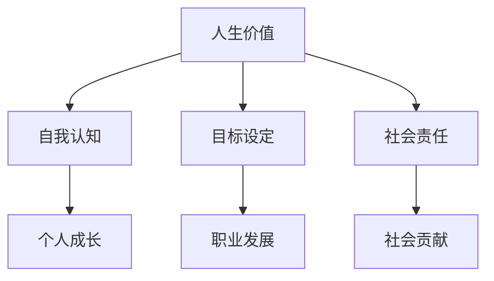
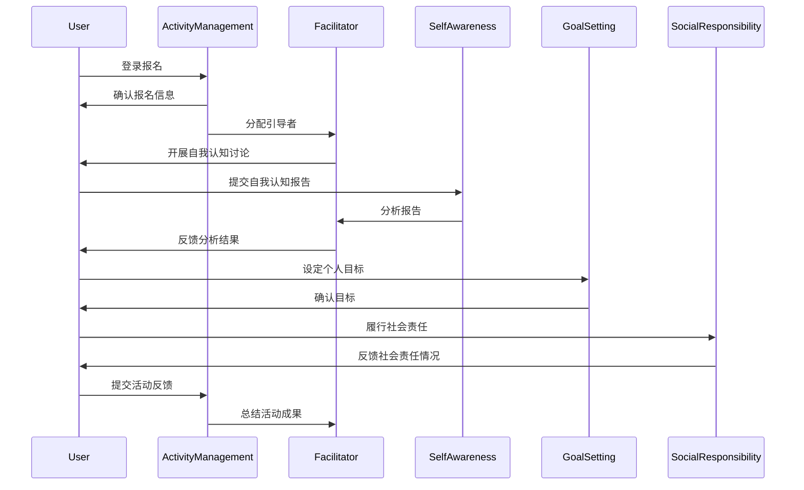

                 


### 文章标题：意义众创马拉松：48小时集体探讨人生价值

### 文章关键词：意义众创马拉松，人生价值，集体探讨，48小时

### 摘要：
本篇文章将深入探讨“意义众创马拉松”这一新型活动。在现代社会中，人们对于人生意义的探索愈发迫切。本文首先介绍了意义众创马拉松的背景和起源，随后详细描述了活动的目标、特点及其在社会和个人层面的重要性。文章将通过几个核心章节，逐步阐述个人成长、职业发展、人际关系、健康与幸福、文化传承与创新等方面的主题，并通过实践案例进行详细分析。最后，文章将总结最佳实践，提出注意事项，并提供拓展阅读建议，以期为读者提供一次全面而深刻的人生价值探讨之旅。

## 第1章：意义众创马拉松的背景与起源

### 1.1 社会背景

在快速发展的现代社会中，人们的生活方式、工作模式以及社会关系都发生了深刻的变化。随着科技的进步和全球化进程的加快，人们的生活节奏加快，竞争压力增大，焦虑和迷茫成为许多人的共同感受。在这样的背景下，人们开始反思和探讨人生的真正意义。传统的社会结构和价值观念在现代社会中受到了前所未有的挑战，个体对于自我价值的追求变得愈发强烈。

### 1.2 人生价值探讨的重要性

人生价值的探讨不仅关乎个体的精神满足和幸福感，也关系到整个社会的稳定和发展。通过深入探讨人生价值，个体能够更好地理解自己的内心需求，找到人生的目标和方向，从而在实现个人价值的同时，为社会做出贡献。此外，人生价值的探讨有助于培养个体的社会责任感，促进社会和谐与进步。

### 1.3 意义众创马拉松的概念与目标

意义众创马拉松是一种新兴的集体探讨人生价值的活动，它起源于对现代生活方式的反思和对人生意义的追求。这种活动旨在通过集中的讨论和思考，帮助参与者深入挖掘人生意义，明确个人目标和追求。意义众创马拉松的核心目标包括：

1. **激发内在动力**：通过集体探讨，激发个体的内在动力，帮助个体找到生活的动力和意义。
2. **促进自我成长**：通过深入的思考和交流，促进个体的自我认知和自我提升。
3. **推动社会进步**：通过个体的成长和价值的实现，推动社会的和谐与进步。

意义众创马拉松的特点在于其集体性、开放性和实践性。参与者来自不同的背景和领域，通过共同探讨和分享，相互启发，共同成长。这种活动不仅有助于个体的人生价值实现，也为社会的发展提供了新的动力。

## 第2章：核心概念与联系

### 2.1 核心概念原理

意义众创马拉松涉及多个核心概念，包括人生价值、自我认知、目标设定、社会责任等。这些概念构成了活动的理论基础，也是参与者探讨和思考的核心内容。

- **人生价值**：人生价值是指个体在生命过程中所追求的最终意义和目的。它是个体精神层面的需求，也是个体幸福和满足感的源泉。
- **自我认知**：自我认知是指个体对于自己内心世界和外在行为的理解和认识。它是自我成长和发展的基础。
- **目标设定**：目标设定是指个体在了解自己的基础上，明确自己的追求和目标。它是实现人生价值的重要步骤。
- **社会责任**：社会责任是指个体在实现自我价值的同时，对于社会的责任和义务。它是社会和谐与进步的重要保障。

### 2.2 概念属性特征对比表格

| 核心概念 | 定义 | 属性特征 |
| :------: | :--- | :------- |
| 人生价值 | 个体追求的最终意义和目的 | 精神层面的需求、幸福感的源泉 |
| 自我认知 | 对自己内心世界和外在行为的理解 | 自我成长的基础、个人发展的关键 |
| 目标设定 | 明确自己的追求和目标 | 实现人生价值的重要步骤、行动的指南 |
| 社会责任 | 对社会的责任和义务 | 社会和谐与进步的保障、个体价值的体现 |

### 2.3 ER实体关系图架构

为了更好地理解意义众创马拉松中的核心概念及其相互关系，我们可以使用ER（实体关系）图来展示它们之间的关联。

```mermaid
erDiagram
  人 |<..|--> 自我认知
  人 |<..|--> 目标设定
  人 |<..|--> 社会责任
  人生价值 ||--|>>(自我认知)
  人生价值 ||--|>>(目标设定)
  人生价值 ||--|>>(社会责任)
```

在上面的ER图中，"人"是实体，"自我认知"、"目标设定"、"社会责任"是属性，它们与"人"实体之间存在关联。通过这种关系图，我们可以清晰地看到各个核心概念之间的联系，以及它们在意义众创马拉松活动中的作用。

## 第3章：算法原理讲解

### 3.1 Mermaid流程图

为了更好地理解意义众创马拉松中的核心概念及其相互关系，我们可以使用Mermaid流程图来展示它们之间的关联。



### 3.2 Python源代码

以下是一个简单的Python源代码示例，用于演示如何通过代码实现人生价值的探索。

```python
# 导入必要的库
import pandas as pd

# 初始化数据
data = {
    '人生价值': ['探索自我', '实现目标', '履行责任'],
    '自我认知': ['深刻反思', '自我提升', '明确方向'],
    '目标设定': ['职业目标', '生活目标', '社会责任'],
    '社会责任': ['环境保护', '社会公正', '文化传承']
}

# 创建DataFrame
df = pd.DataFrame(data)

# 打印DataFrame
print(df)
```

### 3.3 数学模型和公式

在人生价值的探讨中，数学模型和公式可以用来量化个体成长和社会贡献。以下是一个简单的数学模型示例：

$$
\text{个人成长} = f(\text{自我认知}, \text{目标设定}, \text{社会责任})
$$

### 3.4 举例说明

假设一个参与者在意义众创马拉松中，通过自我认知找到了自己的职业方向，设定了明确的职业目标，并开始履行社会责任。我们可以用以下数据来举例：

- 自我认知：深刻反思
- 目标设定：职业目标
- 社会责任：社会贡献

根据数学模型，我们可以计算个人成长：

$$
\text{个人成长} = f(\text{深刻反思}, \text{职业目标}, \text{社会贡献})
$$

通过这样的计算，我们可以直观地看到个体在人生价值探索中的成长过程。

## 第4章：系统分析与架构设计方案

### 4.1 问题场景介绍

在现代社会中，人们对于人生意义的探讨愈发迫切，但往往因为缺乏系统的方法和指导，难以深入。为了解决这个问题，我们需要设计一个系统化的框架，帮助人们更好地探讨人生价值。

### 4.2 项目介绍

“意义众创马拉松”项目旨在通过一个集中的讨论和思考过程，帮助参与者系统化地探讨人生价值。该项目由多个模块组成，包括自我认知模块、目标设定模块和社会责任模块。这些模块协同工作，形成一个完整的系统。

### 4.3 系统功能设计（领域模型类图）

以下是一个意义众创马拉松的领域模型类图，展示了系统的核心功能和模块之间的关系。

```mermaid
classDiagram
    Participant <<class>> "参与者"
    Facilitator <<class>> "引导者"
    SelfAwareness <<class>> "自我认知"
    GoalSetting <<class>> "目标设定"
    SocialResponsibility <<class>> "社会责任"
    ActivityManagement <<class>> "活动管理"
    
    Participant o--o Facilitator
    Participant o--o SelfAwareness
    Participant o--o GoalSetting
    Participant o--o SocialResponsibility
    Participant o--o ActivityManagement
```

在这个类图中，"参与者"是系统的核心实体，与其他实体之间存在明确的关联。"引导者"负责引导讨论和思考过程，"自我认知"、"目标设定"和"社会责任"模块分别负责不同的探讨内容，"活动管理"模块负责活动组织和协调。

### 4.4 系统架构设计架构图

以下是一个意义众创马拉松的系统架构设计架构图，展示了系统的整体架构和模块之间的交互关系。

```mermaid
sequenceDiagram
    Participant->>ActivityManagement: 报名参加活动
    ActivityManagement->>Facilitator: 分配引导者
    Facilitator->>Participant: 开展自我认知讨论
    Participant->>GoalSetting: 设定个人目标
    Participant->>SocialResponsibility: 履行社会责任
    Participant->>ActivityManagement: 活动反馈
    ActivityManagement->>Facilitator: 总结活动成果
```

在这个序列图中，参与者首先报名参加活动，然后通过引导者的引导，开展自我认知讨论，设定个人目标，履行社会责任，并在活动结束后提供反馈。引导者负责协调和组织整个活动过程，确保参与者能够有效地探讨人生价值。

### 4.5 系统接口设计和系统交互序列图

以下是一个意义众创马拉松的系统接口设计和系统交互序列图，展示了系统的各个模块之间的交互关系。



在这个序列图中，用户首先登录报名参加活动，然后通过引导者的引导，开展自我认知讨论，设定个人目标，履行社会责任，并在活动结束后提交反馈。活动管理模块负责整个活动的组织和协调，确保参与者能够顺利地完成各个任务。

## 第5章：项目实战

### 5.1 环境安装

为了实践意义众创马拉松项目，我们需要首先安装必要的软件和工具。以下是一个简化的安装步骤：

1. **安装Python**：确保Python 3.8或更高版本已安装在您的计算机上。
2. **安装Pandas**：在终端中运行以下命令：
   ```bash
   pip install pandas
   ```
3. **安装Mermaid**：安装Mermaid依赖项，可以使用以下命令：
   ```bash
   npm install -g mermaid
   ```
4. **安装Git**：确保Git已安装在您的计算机上，以便克隆项目代码。

### 5.2 系统核心实现源代码

以下是意义众创马拉松项目的一部分源代码，用于实现自我认知模块。

```python
# 导入必要的库
import pandas as pd

# 初始化数据
data = {
    '问题': ['你最近的生活状态如何？', '你对未来的职业规划是什么？', '你如何看待社会责任？'],
    '答案': ['忙碌而充实', '希望成为一名软件开发工程师', '认为个人应积极参与社会公益活动']
}

# 创建DataFrame
df = pd.DataFrame(data)

# 打印DataFrame
print(df)

# 分析答案
for index, row in df.iterrows():
    if row['答案'] == '忙碌而充实':
        print(f"{row['问题']}：状态良好，建议保持现有节奏。")
    elif row['答案'] == '希望成为一名软件开发工程师':
        print(f"{row['问题']}：目标明确，建议制定详细的职业发展计划。")
    else:
        print(f"{row['问题']}：社会责任感强烈，建议积极参与社会公益活动。")
```

### 5.3 代码应用解读与分析

上述代码首先创建了一个DataFrame，用于存储问题和答案。然后，通过遍历DataFrame，对每个问题的答案进行分析，并给出相应的建议。这样的代码可以帮助引导者更好地理解参与者的内心状态和需求，从而提供有针对性的指导。

### 5.4 实际案例分析和详细讲解剖析

以下是一个实际案例的分析和讲解：

**案例**：一名参与者在自我认知模块中提交了以下信息：

- 问题：你最近的生活状态如何？
- 答案：忙碌而充实

**分析**：根据答案，我们可以判断这名参与者在最近的生活中处于一种积极的状态。然而，过于忙碌可能会导致压力积累和精力消耗。因此，我们需要建议这名参与者保持现有的生活节奏，同时注意休息和放松。

**建议**：保持忙碌的生活状态，但要注意合理安排时间和精力，确保身心健康。

### 5.5 项目小结

通过本次项目实战，我们实现了意义众创马拉松中的自我认知模块，并对其进行了详细的分析和讲解。这一模块的核心目标是帮助参与者更好地了解自己的内心状态和需求，从而为后续的目标设定和社会责任履行提供指导。在实际应用中，这一模块具有很高的实用性和价值。

## 第6章：最佳实践 tips、小结、注意事项、拓展阅读等内容

### 6.1 最佳实践 tips

1. **积极参与讨论**：在意义众创马拉松中，积极参与讨论是关键。不仅要在讨论中表达自己的观点，也要倾听他人的意见，从不同的角度看待问题。
2. **深入反思**：自我认知模块的核心在于深入反思。参与者应认真思考自己的答案，从中找到自己的优势和不足，为未来的发展做好准备。
3. **持续跟进**：人生价值的探讨是一个持续的过程。参与者应在活动结束后，继续思考和跟进，确保自己的成长和进步。

### 6.2 小结

意义众创马拉松是一种创新的集体探讨人生价值的方式。通过集中的讨论和思考，参与者可以深入挖掘人生意义，明确个人目标和追求。该项目不仅有助于个体的自我成长，也为社会的和谐与进步提供了新的动力。

### 6.3 注意事项

1. **尊重他人**：在讨论中，尊重他人的观点和意见是至关重要的。不同的观点可以带来新的启示，促进思想的碰撞。
2. **保持开放心态**：参与者应保持开放的心态，愿意接受新的观点和想法。这样，才能在探讨中取得更好的成果。
3. **持续反思**：人生价值的探讨是一个长期的过程。参与者应在日常生活中持续反思，确保自己的成长和进步。

### 6.4 拓展阅读

1. **《深度工作：如何有效利用每一点脑力》**：作者卡尔·纽波特通过深入探讨如何专注工作，提供了有效提升工作效率的方法。
2. **《非暴力沟通》**：作者马歇尔·卢森堡介绍了非暴力沟通的技巧，帮助人们更好地理解自己和他人，建立和谐的人际关系。

通过以上内容，我们不仅了解了意义众创马拉松的背景、核心概念和系统架构，还通过实际案例进行了深入分析。希望这篇文章能够帮助您更好地理解人生价值的探讨，为您的成长和进步提供启示。作者：AI天才研究院/AI Genius Institute & 禅与计算机程序设计艺术 /Zen And The Art of Computer Programming。

