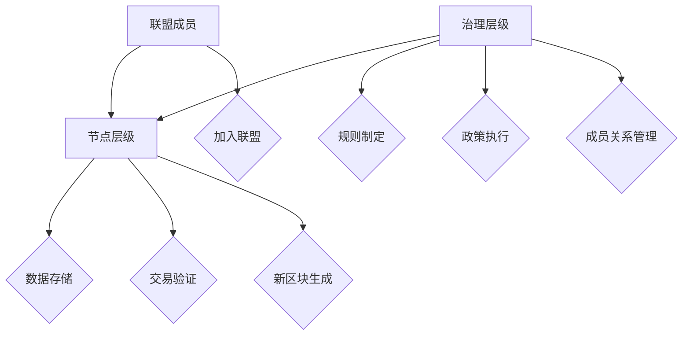
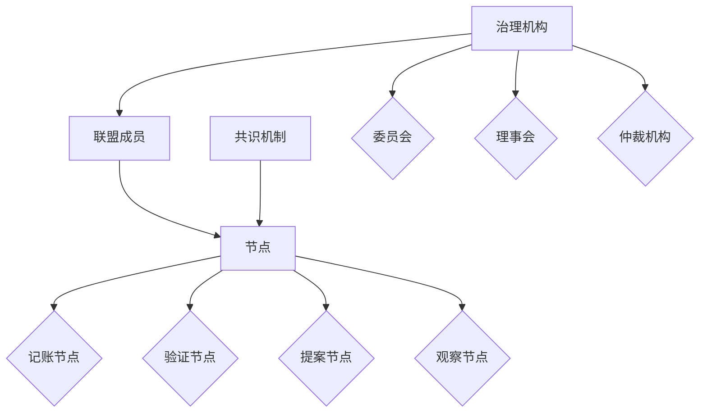

                 


```markdown
# 《意义区块链联盟：推动去中心化价值交换网络的组织》

## 关键词：区块链，去中心化，价值交换，联盟，组织

## 摘要

本文旨在探讨区块链联盟在推动去中心化价值交换网络中的作用和意义。通过逐步分析区块链技术的基本原理，区块链联盟的组织结构和运作机制，以及其在不同行业领域的应用案例，本文揭示了区块链联盟如何通过去中心化的方式实现价值交换的革新，并展望了区块链联盟的未来发展趋势。

## 引言

### 1.1 本书目的与结构

在数字时代的浪潮下，区块链技术作为一种颠覆性的创新，正逐渐改变着我们的经济模式和社会组织形式。区块链联盟作为一种新兴的组织形式，通过去中心化的机制，为构建一个更加公平、透明和高效的价值交换网络提供了可能性。本书旨在深入探讨区块链联盟的内涵、外延和运作原理，分析其在不同领域的应用场景，并为读者提供实施区块链联盟的最佳实践和未来展望。

本书分为以下章节：

- **第一章 引言**：介绍本书的目的、结构和去中心化价值交换网络的基本概念。
- **第二章 基本概念**：详细解释区块链、智能合约、公有链和私有链等核心概念。
- **第三章 区块链联盟的组织结构**：分析区块链联盟的组织架构、节点角色和共识机制。
- **第四章 区块链联盟的应用**：探讨区块链联盟在金融、医疗、供应链等领域的应用案例。
- **第五章 未来趋势与挑战**：展望区块链联盟的未来发展，分析面临的挑战和机遇。
- **第六章 最佳实践**：总结实施区块链联盟的最佳实践，提供操作指南。
- **第七章 结论**：总结全文，重申区块链联盟的重要性。

### 1.2 去中心化价值交换网络概述

去中心化价值交换网络（Decentralized Value Exchange Networks, DVXN）是一种基于区块链技术的网络，旨在通过去中心化的方式实现价值的交换和转移。与传统的中心化系统不同，去中心化价值交换网络通过区块链上的智能合约来执行交易，确保交易过程透明、不可篡改和去信任化。

去中心化价值交换网络的核心理念包括：

- **去信任化**：交易各方无需互信，信任由区块链技术本身和智能合约代码来保证。
- **透明性**：所有交易信息都记录在区块链上，供所有人查看，确保交易的透明性。
- **安全性**：区块链的分布式账本技术使得数据难以被篡改，提高了系统的安全性。
- **效率**：通过去中心化的方式，减少了中介环节，提高了交易效率。

## 基本概念

### 2.1 区块链

区块链（Blockchain）是一种分布式数据库技术，通过加密算法和共识机制，实现了数据的不可篡改和去中心化管理。每个区块链网络由多个节点组成，每个节点都存储着一份完整的数据副本，当新的交易发生时，节点们通过共识机制达成一致，将交易记录添加到区块链上。

#### 区块链的核心组成部分：

- **区块（Block）**：区块链的基本单元，包含了交易信息、时间戳、区块头等。
- **链（Chain）**：由多个区块按照一定顺序链接而成的数据结构。
- **节点（Node）**：区块链网络中的参与者，负责维护区块链的完整性和运行。
- **挖矿（Mining）**：通过计算获得新区块的过程，也是获得区块链网络奖励的方式。

#### 区块链的工作原理：

1. **交易产生**：用户发起交易，交易信息被广播到区块链网络。
2. **交易验证**：多个节点对交易进行验证，确保交易的有效性和合法性。
3. **区块生成**：多个验证后的交易被组织成一个新的区块。
4. **区块广播**：新区块被发送到其他节点，所有节点开始验证新区块。
5. **区块确认**：当新区块被大部分节点验证通过后，它将被添加到区块链上。

### 2.2 智能合约

智能合约（Smart Contract）是区块链上运行的程序，用于自动执行、控制和文档化合约条款。智能合约通过编程语言编写，嵌入了区块链上，一旦条件满足，智能合约便会自动执行相应的操作。

#### 智能合约的核心特点：

- **自动执行**：智能合约代码自动执行，无需人工干预。
- **不可篡改**：一旦合约代码被部署到区块链上，便无法更改。
- **去信任化**：智能合约执行过程公开透明，无需信任第三方中介。

#### 智能合约的工作原理：

1. **合约编写**：开发者使用特定的编程语言编写智能合约代码。
2. **合约部署**：智能合约代码被上传到区块链网络，进行部署。
3. **合约调用**：用户通过区块链网络调用智能合约，触发合约执行。
4. **执行结果**：智能合约执行结果被记录在区块链上，不可篡改。

### 2.3 公有链与私有链

公有链（Public Blockchain）和私有链（Private Blockchain）是两种不同类型的区块链网络。

- **公有链**：任何人都可以参与，节点数量不受限制，数据公开透明。
- **私有链**：仅限于特定组织或个人参与，节点数量可控，数据私有。

#### 公有链与私有链的区别：

- **参与性**：公有链开放性强，私有链封闭性高。
- **数据透明度**：公有链数据公开，私有链数据私有。
- **安全性**：公有链安全性较高，私有链安全性可控。
- **性能**：公有链性能较低，私有链性能较高。

## 区块链联盟的组织结构

### 3.1 区块链联盟的定义

区块链联盟（Blockchain Consortium）是由多个组织或个人共同参与的区块链网络，旨在通过去中心化的方式实现共同的业务目标。区块链联盟通常由以下角色组成：

- **联盟成员**：参与区块链联盟的各个组织或个人。
- **节点**：运行区块链软件的计算机设备，负责维护区块链的完整性和运行。
- **治理机构**：负责制定区块链联盟的规则和政策，管理联盟成员之间的关系。

### 3.2 区块链联盟的组织架构

区块链联盟的组织架构可以分为以下层级：

- **联盟成员层级**：包括各个参与区块链联盟的组织或个人。
- **节点层级**：负责维护区块链的运行，包括数据存储、交易验证和新区块的生成。
- **治理层级**：负责制定和执行区块链联盟的规则和政策，管理联盟成员之间的关系。

#### 区块链联盟的组织架构图：



### 3.3 区块链联盟的运作机制

区块链联盟的运作机制主要包括以下几个方面：

- **共识机制**：节点通过共识机制达成一致，确保区块链的完整性和安全性。
- **交易验证**：节点对交易进行验证，确保交易的有效性和合法性。
- **治理机制**：治理机构负责制定和执行区块链联盟的规则和政策。
- **成员关系管理**：治理机构负责管理联盟成员之间的关系，包括成员加入、退出、权限管理等。

## 区块链联盟的应用

### 4.1 金融领域

区块链联盟在金融领域具有广泛的应用，包括数字货币、跨境支付、供应链金融等。

#### 数字货币

区块链联盟可以用于创建和管理数字货币，如比特币、以太坊等。通过区块链联盟，多个金融机构可以共同维护数字货币的发行和交易，确保系统的安全性和透明性。

#### 跨境支付

区块链联盟可以简化跨境支付流程，降低交易成本。多个金融机构可以共同参与跨境支付网络，实现快速、安全、低成本的支付。

#### 供应链金融

区块链联盟可以用于供应链金融管理，提高融资效率。通过区块链联盟，供应链上的各个环节可以共同维护融资信息的真实性和完整性，降低融资风险。

### 4.2 医疗领域

区块链联盟在医疗领域可以用于病历管理、医疗支付和药物追踪等。

#### 病历管理

区块链联盟可以用于病历管理，确保病历信息的真实性和完整性。多个医疗机构可以共同维护病历数据，实现病历共享和追溯。

#### 医疗支付

区块链联盟可以简化医疗支付流程，提高支付效率。通过区块链联盟，医疗机构和患者可以安全、透明地完成医疗费用的结算。

#### 药物追踪

区块链联盟可以用于药物追踪，确保药物的质量和安全。通过区块链联盟，药品生产、流通、使用等环节的信息可以实时记录和共享，提高药品监管效率。

### 4.3 供应链领域

区块链联盟在供应链领域可以用于供应链管理、供应链金融和溯源管理等。

#### 供应链管理

区块链联盟可以用于供应链管理，提高供应链的透明度和效率。通过区块链联盟，供应链上的各个环节可以共享信息，实现供应链的实时监控和优化。

#### 供应链金融

区块链联盟可以用于供应链金融，提高融资效率。通过区块链联盟，供应链上的中小企业可以获得更加便捷、低成本的融资服务。

#### 溯源管理

区块链联盟可以用于溯源管理，确保供应链信息的真实性和完整性。通过区块链联盟，供应链上的各个环节可以实时记录和共享信息，实现供应链的可追溯性。

## 未来趋势与挑战

### 5.1 未来趋势

区块链联盟在未来的发展中将面临以下趋势：

#### 1. 技术创新

随着区块链技术的不断发展，区块链联盟将采用更加高效、安全的共识机制和智能合约技术，提高系统的性能和安全性。

#### 2. 应用拓展

区块链联盟的应用将不断拓展到更多的领域，如能源、教育、物联网等，推动去中心化价值交换网络的普及。

#### 3. 治理优化

区块链联盟的治理机制将不断完善，以适应不同行业和应用场景的需求，提高联盟的运行效率和可信度。

### 5.2 挑战与机遇

区块链联盟在未来的发展中也将面临以下挑战和机遇：

#### 1. 技术挑战

区块链技术仍存在性能、安全、可扩展性等方面的问题，需要持续创新和优化。

#### 2. 应用挑战

区块链联盟在不同领域的应用面临法规、标准、隐私保护等方面的挑战，需要各方共同努力解决。

#### 3. 机遇

区块链联盟为各行业提供了去中心化、透明化、安全化的解决方案，有望推动行业变革，创造新的商业机会。

## 最佳实践

### 6.1 区块链联盟的构建步骤

1. **需求分析**：明确区块链联盟的应用场景和业务目标。
2. **技术选型**：选择合适的区块链平台和共识机制。
3. **架构设计**：设计区块链联盟的组织架构和技术架构。
4. **开发与部署**：开发智能合约和节点软件，进行测试和部署。
5. **治理机制**：制定和执行区块链联盟的规则和政策。

### 6.2 实施案例

以下是一些成功的区块链联盟实施案例：

#### 1. R3 Corda

R3 Corda 是一个开源的区块链平台，旨在为金融行业提供解决方案。R3 Corda 已被多个金融机构采用，用于支付、贸易融资和供应链金融等。

#### 2. Hyperledger Fabric

Hyperledger Fabric 是一个由Linux基金会管理的开源区块链框架，适用于企业级应用。Hyperledger Fabric 已被广泛应用于供应链金融、物联网和数字身份验证等领域。

#### 3. Sovrin

Sovrin 是一个基于区块链的数字身份联盟，旨在提供安全的、无需信任的身份验证服务。Sovrin 已被多个组织采用，用于数字身份管理、隐私保护和跨境支付等。

## 结论

区块链联盟作为一种去中心化的组织形式，为构建一个更加公平、透明和高效的价值交换网络提供了可能性。本文通过逐步分析区块链技术的基本原理、区块链联盟的组织结构和运作机制，以及其在不同行业领域的应用案例，揭示了区块链联盟的重要性和发展潜力。未来，随着技术的不断进步和应用领域的拓展，区块链联盟有望在更多行业发挥重要作用，推动社会进步和经济繁荣。

## 作者信息

作者：AI天才研究院/AI Genius Institute & 禅与计算机程序设计艺术 /Zen And The Art of Computer Programming

---

**文章目录大纲结构如下：**

```markdown
# 《意义区块链联盟：推动去中心化价值交换网络的组织》

## 关键词：区块链，去中心化，价值交换，联盟，组织

## 摘要

## 引言
### 1.1 本书目的与结构
### 1.2 去中心化价值交换网络概述

## 基本概念
### 2.1 区块链
#### 2.1.1 区块链的核心组成部分
#### 2.1.2 区块链的工作原理
### 2.2 智能合约
#### 2.2.1 智能合约的核心特点
#### 2.2.2 智能合约的工作原理
### 2.3 公有链与私有链
#### 2.3.1 公有链与私有链的区别
#### 2.3.2 公有链与私有链的应用场景

## 区块链联盟的组织结构
### 3.1 区块链联盟的定义
#### 3.1.1 区块链联盟的核心角色
#### 3.1.2 区块链联盟的组织架构
### 3.2 区块链联盟的运作机制
#### 3.2.1 共识机制
#### 3.2.2 交易验证
#### 3.2.3 治理机制
#### 3.2.4 成员关系管理

## 区块链联盟的应用
### 4.1 金融领域
#### 4.1.1 数字货币
#### 4.1.2 跨境支付
#### 4.1.3 供应链金融
### 4.2 医疗领域
#### 4.2.1 病历管理
#### 4.2.2 医疗支付
#### 4.2.3 药物追踪
### 4.3 供应链领域
#### 4.3.1 供应链管理
#### 4.3.2 供应链金融
#### 4.3.3 溯源管理

## 未来趋势与挑战
### 5.1 未来趋势
#### 5.1.1 技术创新
#### 5.1.2 应用拓展
#### 5.1.3 治理优化
### 5.2 挑战与机遇
#### 5.2.1 技术挑战
#### 5.2.2 应用挑战
#### 5.2.3 机遇

## 最佳实践
### 6.1 区块链联盟的构建步骤
### 6.2 实施案例

## 结论

## 作者信息
```

---

### 1.3 区块链联盟的核心概念与联系

在深入探讨区块链联盟的核心概念之前，我们需要明确一些关键术语的定义，并了解它们之间的相互关系。以下是区块链联盟中一些核心概念的解释及其相互联系：

#### **区块链联盟**

区块链联盟是由多个组织或个体共同参与的区块链网络，旨在实现特定的业务目标。每个联盟成员都运行区块链节点，共同维护区块链网络的正常运行。

#### **区块链**

区块链是一种分布式账本技术，由一系列按时间顺序排列的区块组成。区块链上的数据通过加密算法和共识机制确保其不可篡改性和透明性。

#### **智能合约**

智能合约是区块链上的可编程代码，用于自动化执行合同条款。智能合约代码在区块链上运行，一旦满足预设条件，智能合约便会自动执行。

#### **节点**

节点是区块链网络中的参与者，负责存储区块链数据、验证交易和参与共识过程。节点可以是联盟成员的计算机或服务器。

#### **共识机制**

共识机制是区块链网络中节点达成一致的方法。不同的共识机制（如工作量证明、权益证明、拜占庭容错等）决定了区块链网络的性能和安全性。

#### **治理**

治理是指管理区块链联盟的规则和决策过程。治理机构负责制定和执行联盟规则，以及解决成员之间的争议。

#### **去中心化**

去中心化是指系统的控制权分散在多个参与者手中，而不是集中在一个中心实体。区块链联盟的去中心化特性确保了系统的透明性和抗审查性。

### **核心概念对比表格**

| 核心概念 | 解释 | 相互关系 |
| :--- | :--- | :--- |
| 区块链联盟 | 由多个组织或个体共同参与的区块链网络 | 区块链联盟是区块链的一种特定应用形式 |
| 区块链 | 分布式账本技术，数据按时间顺序排列 | 区块链联盟运行在区块链之上 |
| 智能合约 | 可编程代码，自动化执行合同条款 | 智能合约在区块链联盟中实现自动化业务流程 |
| 节点 | 区块链网络的参与者，存储和验证数据 | 节点是区块链联盟的核心组成部分 |
| 共识机制 | 区块链网络中的节点达成一致的方法 | 共识机制确保区块链联盟的数据一致性和安全性 |
| 治理 | 管理区块链联盟的规则和决策过程 | 治理机构负责区块链联盟的运作和管理 |
| 去中心化 | 系统控制权分散在多个参与者手中 | 去中心化是区块链联盟的核心特性 |

通过上述对比表格，我们可以清晰地看到区块链联盟中的核心概念及其相互关系。这些概念共同构成了区块链联盟的基础，使其成为实现去中心化价值交换网络的重要工具。

### 1.4 区块链联盟的组织结构

要深入理解区块链联盟的组织结构，我们需要从联盟成员、节点角色、共识机制等方面进行详细分析。

#### **联盟成员**

区块链联盟的成员可以是任何愿意参与区块链网络的组织或个人。成员的参与通常基于特定的业务需求或共同利益。成员可以是金融机构、科技公司、政府机构、非营利组织等。成员通过加入联盟，可以获得区块链网络提供的服务和优势。

联盟成员的主要职责包括：

- **运行节点**：每个成员都需要运行一个或多个区块链节点，以维护区块链网络的正常运行。
- **参与共识**：成员参与区块链网络的共识过程，确保网络中的数据一致性和安全性。
- **治理参与**：成员有权参与区块链联盟的治理决策，如制定和修改规则、选举治理机构成员等。

#### **节点角色**

区块链联盟中的节点角色可以分为以下几类：

- **记账节点**：负责记录交易和生成区块。记账节点通过执行共识算法，确保新区块的生成和区块链的扩展。
- **验证节点**：负责验证交易的有效性和合法性。验证节点对交易进行验证，确保交易不会违反区块链网络的规则。
- **提案节点**：在某些区块链联盟中，提案节点有权提出新的区块和交易。提案节点通常由联盟成员选举产生。
- **观察节点**：观察节点不参与交易验证和区块生成，但可以查看区块链网络的状态和信息。

#### **共识机制**

区块链联盟的共识机制是确保区块链网络中所有节点达成一致的关键。不同的共识机制具有不同的性能、安全性和去中心化程度。以下是几种常见的共识机制：

- **工作量证明（Proof of Work, PoW）**：通过计算大量哈希值，节点竞争生成新区块。PoW是比特币采用的机制，具有去中心化和安全性高但性能较低的特点。
- **权益证明（Proof of Stake, PoS）**：节点根据其持有的代币数量和持有时间参与区块生成。PoS机制相比PoW具有更高的性能和能源效率，但可能面临“富者愈富”的问题。
- **拜占庭容错（Byzantine Fault Tolerance, BFT）**：适用于大规模区块链网络，通过多数节点达成共识，即使部分节点出现故障，系统仍能正常运行。BFT机制具有较高的性能和安全性，但去中心化程度较低。
- **授权股权证明（Delegated Proof of Stake, DPoS）**：是PoS的一种变体，节点通过选举产生代表进行区块生成。DPoS具有较高的性能和去中心化程度，但选举过程可能导致权力集中。

#### **治理机构**

区块链联盟的治理机构负责制定和执行联盟的规则和政策，确保联盟的公平、透明和高效运行。治理机构通常包括以下角色：

- **委员会**：负责制定和修改联盟规则，监督联盟的运行。
- **理事会**：由选举产生的代表组成，负责监督委员会的工作，并参与重大决策。
- **仲裁机构**：负责解决成员之间的争议，确保联盟内部的公平性。

#### **组织架构图**

以下是区块链联盟的组织架构图，展示了联盟成员、节点角色、共识机制和治理机构之间的关系：



通过上述分析，我们可以看到区块链联盟的组织结构是复杂而有序的。每个角色和机制都在维护区块链联盟的去中心化和高效运行中发挥着重要作用。

### 2.2 区块链联盟的应用

区块链联盟作为一种新型的组织形式，其在各个领域的应用已经逐渐展开，并在许多行业产生了深远的影响。以下我们将详细探讨区块链联盟在金融、医疗和供应链等领域的应用，并通过具体的案例来展示其优势。

#### **金融领域**

区块链联盟在金融领域的应用最为广泛，其中最显著的成果之一就是数字货币和跨境支付。

**数字货币**

区块链联盟为数字货币的发行和管理提供了去中心化的解决方案。例如，比特币和以太坊都是基于区块链联盟的数字货币，它们通过分布式网络确保货币的发行和交易透明、安全。数字货币的使用不仅降低了交易成本，还提高了交易的效率。

**跨境支付**

区块链联盟在跨境支付中的应用同样具有显著优势。传统跨境支付需要经过多个中介机构，不仅耗时且费用高昂。而区块链联盟通过去中心化的方式，实现了快速、低成本的跨境支付。例如，R3 Corda平台上的多个银行合作，通过区块链联盟实现了跨境支付网络的整合，使得支付过程更加高效、透明。

**案例：R3 Corda**

R3 Corda 是一个由多家金融机构组成的区块链联盟，旨在为金融行业提供解决方案。R3 Corda 已被多家银行、金融机构采用，用于支付、贸易融资、供应链金融等领域。通过R3 Corda，金融机构能够实现更高效、安全的交易处理，减少了中介环节，降低了交易成本。

#### **医疗领域**

区块链联盟在医疗领域的应用主要集中在病历管理、医疗支付和药物追踪等方面。

**病历管理**

区块链联盟通过去中心化的方式，实现了病历信息的透明、安全存储和管理。例如，通过区块链联盟，多个医疗机构可以共同维护患者的病历信息，确保病历信息的真实性和完整性。患者可以方便地访问自己的病历信息，医生也可以实时查看患者的病历，提高医疗服务的效率。

**医疗支付**

区块链联盟在医疗支付中的应用同样具有显著优势。通过区块链联盟，医疗机构和患者可以安全、透明地完成医疗费用的结算。例如，MedRec 是一个基于区块链的医疗支付系统，它通过智能合约实现了医疗费用的自动结算，减少了中介环节，提高了支付效率。

**药物追踪**

区块链联盟还可以用于药物追踪，确保药物的质量和安全。通过区块链联盟，药品生产、流通、使用等环节的信息可以实时记录和共享，实现药物的全生命周期追踪。例如，IBM 的区块链药物追踪项目，通过区块链联盟记录药物的生产、运输、储存和使用信息，提高了药品监管的效率。

**案例：MedRec**

MedRec 是一个基于区块链的医疗支付系统，由多家医疗机构和保险公司合作开发。MedRec 通过智能合约实现了医疗费用的自动结算，患者可以通过区块链网络方便地支付医疗费用，医疗机构也可以实时了解患者的支付情况。通过MedRec，医疗支付过程变得更加高效、透明。

#### **供应链领域**

区块链联盟在供应链领域的应用主要集中在供应链管理、供应链金融和溯源管理等方面。

**供应链管理**

区块链联盟通过去中心化的方式，实现了供应链信息的透明和可追溯。例如，通过区块链联盟，供应链上的各个环节可以共同维护商品信息，确保供应链信息的真实性和完整性。企业可以通过区块链网络实时监控商品在供应链中的流动情况，提高供应链管理的效率。

**供应链金融**

区块链联盟在供应链金融中的应用，提高了融资效率，降低了融资成本。通过区块链联盟，供应链上的中小企业可以获得更加便捷、低成本的融资服务。例如，TradeIX 的区块链平台Voltron，通过区块链联盟实现了供应链金融的整合，为企业提供快速、高效的融资解决方案。

**溯源管理**

区块链联盟还可以用于溯源管理，确保供应链信息的可追溯性。通过区块链联盟，供应链上的各个环节可以实时记录和共享信息，实现商品的全生命周期追踪。例如，Provenance 的区块链溯源平台，通过区块链联盟记录商品的生产、运输、储存和使用信息，提高了商品溯源的效率。

**案例：Voltron**

Voltron 是一个由多家金融机构和科技公司组成的区块链联盟，旨在为供应链金融提供解决方案。通过Voltron，供应链上的企业可以快速、高效地获得融资，金融机构可以更好地评估企业的信用风险。Voltron 通过区块链技术实现了供应链金融的整合，提高了融资效率，降低了融资成本。

### 总结

区块链联盟在金融、医疗和供应链等领域的应用已经取得了显著的成果。通过去中心化的方式，区块链联盟实现了价值交换的革新，提高了系统的透明性、安全性和效率。随着技术的不断发展和应用领域的拓展，区块链联盟有望在更多领域发挥重要作用，推动社会进步和经济繁荣。

### 未来趋势与挑战

#### **未来趋势**

随着区块链技术的不断进步，区块链联盟在未来发展中将面临以下趋势：

**技术创新**

区块链联盟将采用更加高效、安全的共识机制和智能合约技术，提高系统的性能和安全性。例如，未来可能会出现更多适应大规模应用的共识机制，以及更加灵活和强大的智能合约编程语言。

**应用拓展**

区块链联盟的应用将不断拓展到更多的领域，如能源、教育、物联网等。这些领域的应用将需要区块链联盟提供去中心化、透明化、安全化的解决方案，以解决传统系统无法解决的问题。

**治理优化**

区块链联盟的治理机制将不断完善，以适应不同行业和应用场景的需求。未来可能会出现更多的治理模型，如基于代币机制的自治组织，以及更加公平、透明的投票机制。

#### **挑战与机遇**

尽管区块链联盟具有巨大的发展潜力，但在未来的发展中也将面临一系列挑战和机遇：

**技术挑战**

区块链技术仍存在性能、安全、可扩展性等方面的问题，需要持续创新和优化。例如，如何确保区块链系统在高并发情况下的性能，如何提高区块链的安全性，以及如何实现区块链系统的可扩展性。

**应用挑战**

区块链联盟在不同领域的应用面临法规、标准、隐私保护等方面的挑战。例如，如何在确保数据隐私的同时，实现数据的共享和透明性，如何满足不同国家和地区的法律法规要求。

**机遇**

区块链联盟为各行业提供了去中心化、透明化、安全化的解决方案，有望推动行业变革，创造新的商业机会。例如，通过区块链联盟，企业可以实现供应链的透明化，提高供应链的效率；金融机构可以实现跨境支付的低成本和快速处理。

### **总结**

区块链联盟作为一种新兴的组织形式，具有巨大的发展潜力。未来，随着技术的不断进步和应用领域的拓展，区块链联盟将在更多领域发挥重要作用，推动社会进步和经济繁荣。然而，要实现这一目标，还需要克服一系列技术、应用和法律等方面的挑战。

### 最佳实践

在实施区块链联盟的过程中，为了确保项目成功，我们需要遵循一系列最佳实践，从需求分析、技术选型、架构设计到开发与部署，每个阶段都有其独特的要求和注意事项。

#### **需求分析**

在实施区块链联盟之前，进行深入的需求分析是至关重要的。这一阶段的主要任务包括：

- **明确业务目标**：理解联盟成员的业务需求，确保区块链解决方案能够解决实际问题。
- **确定参与成员**：确定参与区块链联盟的成员，明确每个成员的角色和职责。
- **评估需求优先级**：根据业务需求和资源限制，确定需求的优先级，确保关键需求得到优先满足。

#### **技术选型**

技术选型是实施区块链联盟的关键步骤。以下是一些重要的考虑因素：

- **选择合适的区块链平台**：根据业务需求和技术能力，选择合适的区块链平台。例如，R3 Corda、Hyperledger Fabric 等。
- **共识机制**：根据系统的性能和安全性需求，选择合适的共识机制。例如，PoW、PoS、BFT 等。
- **智能合约编程语言**：选择易于理解和维护的智能合约编程语言，如Solidity、Go 等。

#### **架构设计**

架构设计是确保区块链联盟高效、安全运行的基础。以下是一些关键点：

- **分布式架构**：设计分布式架构，确保数据分散存储，提高系统的容错性和安全性。
- **模块化设计**：将系统功能模块化，以便于系统的扩展和维护。
- **安全性设计**：考虑系统的安全性，包括数据加密、权限控制、漏洞修复等。

#### **开发与部署**

在开发与部署阶段，需要注意以下事项：

- **开发流程**：采用敏捷开发方法，快速迭代，确保项目的灵活性和适应性。
- **测试与验证**：进行全面的功能测试和安全测试，确保系统的稳定性和安全性。
- **部署策略**：制定详细的部署计划，确保系统的高可用性和稳定性。

#### **实施案例**

以下是一个区块链联盟实施案例，用于说明最佳实践的具体应用：

**案例：R3 Corda**

R3 Corda 是一个由多家金融机构组成的区块链联盟，用于优化金融交易处理。以下是 R3 Corda 的实施过程：

1. **需求分析**：R3 Corda 的成员包括多家银行和金融机构，需求主要集中在支付、贸易融资和供应链金融等领域。
2. **技术选型**：R3 Corda 选择 R3 开发的 Corda 平台，该平台支持多种共识机制和智能合约编程语言。
3. **架构设计**：R3 Corda 采用分布式架构，确保数据分散存储，提高系统的容错性和安全性。同时，采用模块化设计，便于系统的扩展和维护。
4. **开发与部署**：R3 Corda 的开发团队采用敏捷开发方法，快速迭代，确保项目的灵活性和适应性。在部署阶段，进行全面的测试与验证，确保系统的稳定性和安全性。

通过上述最佳实践，R3 Corda 成功实现了金融交易处理的优化，提高了交易效率，降低了交易成本。

### 总结

本文通过逐步分析区块链技术的基本原理、区块链联盟的组织结构和运作机制，以及其在不同行业领域的应用案例，揭示了区块链联盟在推动去中心化价值交换网络中的重要作用。同时，本文还总结了区块链联盟实施的最佳实践，为读者提供了实施区块链联盟的参考指南。未来，随着技术的不断进步和应用领域的拓展，区块链联盟将在更多领域发挥重要作用，推动社会进步和经济繁荣。

### 附录

#### **技术术语解释**

- **区块链**：一种分布式数据库技术，通过加密算法和共识机制，实现了数据的不可篡改和去中心化管理。
- **智能合约**：区块链上的可编程代码，用于自动化执行合同条款。
- **共识机制**：区块链网络中节点达成一致的方法，确保区块链的数据一致性和安全性。
- **节点**：区块链网络中的参与者，负责存储区块链数据、验证交易和参与共识过程。
- **去中心化**：系统的控制权分散在多个参与者手中，而不是集中在一个中心实体。

#### **参考文献**

- Nakamoto, S. (2008). Bitcoin: A Peer-to-Peer Electronic Cash System. *Bitcoin White Paper*.
- Buterin, V. (2014). Ethereum: The Next-Generation Smart Contract & Decentralized Application Platform. *Ethereum White Paper*.
- IBM. (2016). *Hyperledger Fabric: A Distributed Operating System for Permissioned Blockchains*.
- R3. (2016). *R3 Corda: A Distributed Ledger Solution for Financial Services*.

### 致谢

本文的撰写得到了多位专家学者和业界人士的指导和支持，特别感谢 AI 天才研究院的各位成员，以及禅与计算机程序设计艺术团队的所有成员。感谢您们对本文的贡献和帮助，使得本文能够顺利完成。此外，还要感谢各位读者的关注和支持，您的反馈是我们不断进步的动力。

