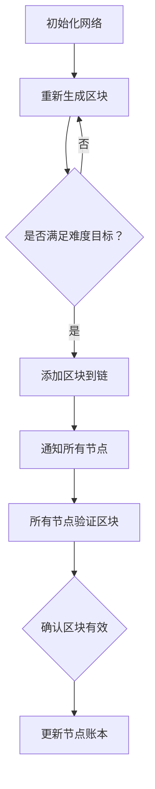
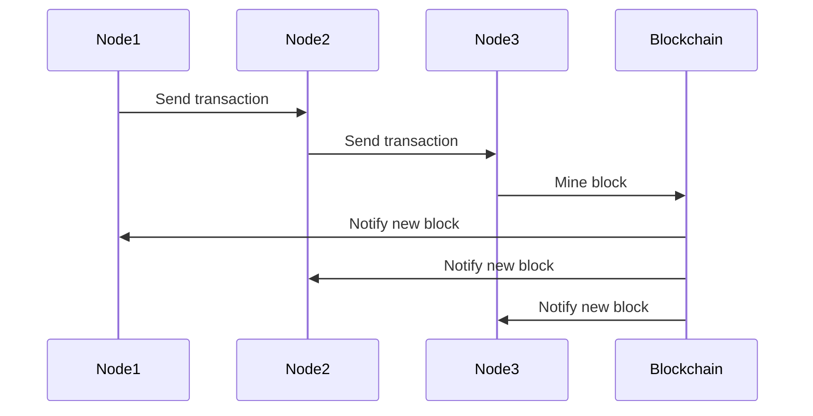
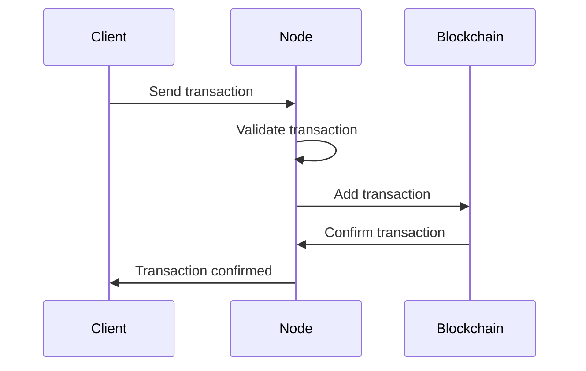

                 

### 摘要

《意义区块链项目：去中心化的价值交换系统》旨在深入探讨区块链技术的核心原理和应用实践。本文以“意义区块链项目”为例，详细解析了区块链在构建去中心化价值交换系统中的关键作用。文章首先介绍了区块链的基本概念、发展历程及其在价值交换中的应用，随后深入剖析了区块链的核心概念，如去中心化、分布式账本和智能合约，并通过图表和实例加以说明。接着，文章通过mermaid流程图和Python源代码，详细阐述了区块链算法原理，包括数学模型和公式的讲解，使读者对区块链技术有更深刻的理解。随后，文章介绍了区块链系统的设计思路，包括系统功能、架构和接口设计，并通过mermaid图表展示具体设计。此外，文章通过一个具体的区块链项目案例，展示了区块链项目的实战过程，包括环境安装、系统实现和案例分析，使读者能够将理论知识应用于实际项目中。最后，文章总结了区块链技术的最佳实践，提出了注意事项和拓展阅读资源，以帮助读者进一步深入研究和应用区块链技术。

---

### 目录大纲设计思路

为了设计出《意义区块链项目：去中心化的价值交换系统》的完整目录大纲，我们将遵循以下步骤：

#### 1. 确定整体结构

- **章节划分**：根据书的内容，将整本书分为几个部分，如背景与概念、技术原理、应用实践、案例分析等。
- **细化每个章节**：在每个部分中，进一步细分为几个章节，确保每个章节都有明确的主题和内容。

#### 2. 确定章节内容

- **背景介绍**：介绍区块链的基本概念、发展历程和其在价值交换中的作用。
- **核心概念与联系**：详细解释区块链的关键概念，如去中心化、分布式账本、智能合约等，并通过图表展示这些概念之间的联系。
- **技术原理讲解**：使用 mermaid 画出区块链技术的 mermaid 流程图，然后用 Python 源代码和 LaTeX 数学公式详细阐述区块链算法原理。
- **系统分析与架构设计方案**：介绍区块链系统的设计思路，包括系统功能、架构和接口设计，使用 mermaid 绘制相关的图表。
- **项目实战**：展示一个具体的区块链项目，包括环境安装、系统实现、代码解读、案例分析等。
- **最佳实践 tips、小结、注意事项、拓展阅读**：总结书中的关键点和实用技巧，并提供拓展阅读资源。

#### 3. 确定Markdown格式

- 使用 #, ##, ### 的层级格式来构建目录结构。
- 在适当的位置嵌入 mermaid 图表、Python 代码和 LaTeX 数学公式。

#### 4. 保证内容的简洁性与完整性

- 避免冗余内容，确保每个章节都有明确的目标和内容。
- 确保每个章节都能涵盖核心概念、技术原理、应用实践和案例分析等要素。

#### 5. 最终审查

- 逐章审查，确保目录结构的逻辑清晰，内容完整。
- 确保Markdown格式正确，图表和代码嵌入无误。

通过以上步骤，我们可以设计出一个完整、逻辑清晰且易于阅读的目录大纲。现在，让我们开始具体的设计工作吧！

---

### 背景介绍

区块链技术作为一种革命性的分布式数据库技术，近年来在全球范围内获得了广泛的关注和迅速的发展。其独特的去中心化、透明性和不可篡改性，使其在多个领域具有巨大的应用潜力，尤其是在金融、供应链管理、医疗记录保存等领域。本文将聚焦于区块链在构建去中心化的价值交换系统方面的应用，深入探讨其技术原理、系统设计与实际应用。

#### 核心概念术语说明

首先，我们需要明确一些核心概念：

- **区块链**：一种分布式账本技术，通过密码学确保数据的不可篡改性和安全性。
- **去中心化**：系统不依赖于中央机构进行数据管理和决策，而是由网络中的所有参与者共同维护。
- **分布式账本**：记录交易的数据库分散在多个节点上，每个节点都有完整的账本副本。
- **智能合约**：一段嵌入在区块链中的代码，当满足特定条件时，自动执行预定的操作。

#### 问题背景

在传统的金融体系中，许多交易和记录管理都依赖于中央机构，如银行或清算所。这种中心化的结构虽然保证了某种程度的稳定性和效率，但也存在以下问题：

1. **单点故障**：中心化的系统若遭遇技术故障或恶意攻击，可能导致整个系统瘫痪。
2. **透明性不足**：中央机构的管理过程往往不透明，容易导致信任危机。
3. **效率低下**：传统的金融交易需要经过多层审核和验证，导致交易速度缓慢。

为了解决这些问题，区块链技术提供了一种去中心化的解决方案。通过分布式账本和智能合约，区块链能够实现更透明、高效和安全的交易过程。

#### 问题描述

区块链的价值交换系统旨在解决以下问题：

1. **透明性**：通过区块链技术，所有交易记录都是公开透明的，参与者可以随时查阅。
2. **安全性**：区块链使用密码学技术确保数据的完整性和安全性，防止数据被篡改。
3. **去中心化**：区块链系统不需要中心化的中介机构，降低了交易成本，提高了效率。

然而，实现这些目标需要克服以下几个挑战：

1. **共识机制**：网络中的节点需要达成一致，以防止数据冲突和欺诈行为。
2. **性能和可扩展性**：区块链系统需要处理大量的交易，同时保证系统的高效运行。
3. **用户友好性**：为了使普通用户能够轻松使用区块链技术，系统界面和用户体验需要进一步优化。

#### 问题解决

区块链技术通过以下方法解决了上述问题：

1. **共识机制**：如工作量证明（PoW）、权益证明（PoS）等，确保节点之间的数据一致性。
2. **分布式账本**：通过分布式存储技术，提高了系统的可靠性和容错性。
3. **智能合约**：实现了自动化和智能化的交易过程，降低了交易成本。

#### 边界与外延

区块链技术的应用不仅限于金融领域，还可以扩展到其他多个领域，如：

- **供应链管理**：通过区块链技术，可以实现对供应链的全程追踪和监控。
- **医疗记录管理**：通过区块链，医疗记录可以实现去中心化的存储和管理，提高数据安全性。
- **身份验证**：区块链可以用于构建去中心化的身份验证系统，提高身份信息的真实性。

#### 概念结构与核心要素组成

区块链系统由以下几个核心要素组成：

- **节点**：网络中的参与者，每个节点都拥有完整的账本副本。
- **区块**：数据存储的基本单位，包含一定数量的交易记录。
- **链**：多个区块按照特定规则链接而成的链条。
- **共识算法**：确保节点之间数据一致性的一系列算法。
- **智能合约**：嵌入在区块链中的代码，实现自动化和智能化的交易。

通过上述核心要素，区块链技术构建了一个去中心化的价值交换系统，实现了数据透明性、安全性和去中心化的优势。接下来，我们将进一步深入探讨区块链的技术原理和应用实践。

### 核心概念与联系

在深入探讨区块链技术之前，首先需要明确其核心概念及其相互之间的联系。以下是区块链中几个关键概念及其属性特征对比表格：

| 概念 | 定义 | 属性特征对比 |
| --- | --- | --- |
| 区块链 | 一种分布式账本系统，通过加密算法确保数据不可篡改 | 去中心化、分布式存储、安全性高 |
| 去中心化 | 网络中的节点共同维护系统，无中央机构 | 高度透明、效率高、降低风险 |
| 分布式账本 | 记录交易的数据库分散在多个节点上 | 可靠性高、安全性强、防篡改 |
| 智能合约 | 嵌入在区块链中的代码，自动执行预定的操作 | 自动化、透明、减少中介成本 |
| 共识算法 | 确保网络中的节点对同一数据进行一致认可 | 安全性、效率、去中心化 |

为了更直观地展示这些概念之间的联系，我们使用Mermaid绘制了以下ER实体关系图架构：

```mermaid
erDiagram
  区块链 ||--|{ 节点 }|
  区块链 ||--|{ 区块 }|
  区块链 ||--|{ 共识算法 }|
  区块链 ||--|{ 智能合约 }|
  节点 ||--|{ 分布式账本 }|
  区块 ||--|{ 交易记录 }|
  共识算法 ||--|{ 安全性 }|
  智能合约 ||--|{ 自动执行 }|
```

在此ER图中，我们可以看到区块链作为核心系统，包含了节点、区块、共识算法和智能合约等关键组件。节点负责维护分布式账本，区块存储交易记录，共识算法确保数据一致性，智能合约实现自动化操作。

接下来，我们将通过具体实例进一步解释这些核心概念的应用。

#### 具体实例

以比特币（Bitcoin）为例，这是一个广泛应用的区块链项目，其基本架构和运行机制可以很好地展示区块链技术的核心概念。

1. **区块链**：比特币系统中的区块链包含了多个区块，每个区块包含了一定数量的交易记录。区块链通过加密算法确保了数据的不可篡改性。

2. **节点**：比特币网络中的节点负责维护区块链，并对交易进行验证。节点通过运行共识算法（如工作量证明PoW）来确保区块链的完整性和一致性。

3. **区块**：比特币的区块包含了交易记录、区块头、Merkle树等。区块头包含了上一个区块的哈希值、时间戳、难度目标等关键信息。

4. **共识算法**：比特币使用的工作量证明（PoW）算法要求节点解决一个复杂的数学难题，以证明其工作量。解决了难题的节点将被选中，添加新区块到区块链中。

5. **智能合约**：虽然比特币本身不包含智能合约，但以太坊（Ethereum）是一个更先进的区块链项目，它支持智能合约。智能合约在以太坊中用于实现自动化和去中心化的应用，如去中心化金融（DeFi）和智能合约平台。

通过上述实例，我们可以看到区块链技术如何通过其核心概念实现去中心化的价值交换。接下来，我们将进一步探讨区块链技术的技术原理，以便更深入地理解其工作方式。

### 技术原理讲解

区块链技术的工作原理基于一系列复杂的数学和加密算法，这些算法确保了区块链系统的安全性、透明性和不可篡改性。为了详细阐述区块链的技术原理，我们将使用mermaid流程图和Python源代码，结合LaTeX数学公式，逐步解释区块链的运行机制。

#### 1. Mermaid流程图

首先，我们使用mermaid绘制一个简化的区块链流程图：



在这个流程图中，我们看到了区块链的基本步骤：

- **初始化网络**：节点启动并连接到区块链网络。
- **生成新区块**：节点创建一个包含最新交易记录的区块。
- **验证区块**：节点验证区块是否满足难度目标和其他规则。
- **添加区块到链**：验证通过的区块被添加到区块链的末端。
- **通知所有节点**：新区块被添加后，通知其他节点更新其账本。
- **所有节点验证区块**：节点验证新区块的合法性。
- **确认区块有效**：所有节点确认新区块有效后，更新各自的账本。

#### 2. Python源代码

为了更好地理解区块的生成和验证过程，我们使用Python编写了一个简化的区块链实现：

```python
import hashlib
import json
from time import time

class Block:
    def __init__(self, index, transactions, timestamp, previous_hash):
        self.index = index
        self.transactions = transactions
        self.timestamp = timestamp
        self.previous_hash = previous_hash
        self.hash = self.compute_hash()

    def compute_hash(self):
        block_string = json.dumps(self.__dict__, sort_keys=True)
        return hashlib.sha256(block_string.encode()).hexdigest()

class Blockchain:
    def __init__(self):
        self.unconfirmed_transactions = []  # 待确认的交易
        self.chain = []  # 主链
        self.create_genesis_block()

    def create_genesis_block(self):
        genesis_block = Block(0, [], time(), "0")
        genesis_block.hash = genesis_block.compute_hash()
        self.chain.append(genesis_block)

    def add_new_transaction(self, transaction):
        self.unconfirmed_transactions.append(transaction)

    def mine(self):
        if not self.unconfirmed_transactions:
            return False
        last_block = self.chain[-1]
        new_block = Block(index=last_block.index + 1,
                          transactions=self.unconfirmed_transactions,
                          timestamp=time(),
                          previous_hash=last_block.hash)
        new_block.hash = new_block.compute_hash()
        self.chain.append(new_block)
        self.unconfirmed_transactions = []
        return new_block.index

    def is_chain_valid(self):
        for i in range(1, len(self.chain)):
            current = self.chain[i]
            previous = self.chain[i - 1]
            if current.hash != current.compute_hash():
                return False
            if current.previous_hash != previous.hash:
                return False
        return True
```

在这个实现中，我们定义了`Block`和`Blockchain`两个类：

- `Block`类用于表示区块链中的每个区块，包含索引、交易记录、时间戳和前一个区块的哈希值。
- `Blockchain`类用于管理区块链，包括创建创世区块、添加交易、挖矿和验证链的合法性。

#### 3. LaTeX数学公式

区块链算法中的一些关键步骤和验证机制可以通过LaTeX数学公式进行描述。以下是一些核心的数学模型和公式：

- **工作量证明（PoW）**：
  $$
  \text{hash}(P) < \text{target}
  $$
  其中，`hash`表示哈希函数，`P`表示区块的内容，`target`是预设的目标难度。

- **Merkle树**：
  $$
  \text{MerkleRoot} = \text{hash}(\text{hash}(x) || \text{hash}(y))
  $$
  其中，`MerkleRoot`是Merkle树的根哈希值，`x`和`y`是两个子节点。

- **区块链验证**：
  $$
  \text{valid} = \text{is_chain_valid}(\text{chain})
  $$
  其中，`valid`是链是否有效的布尔值，`is_chain_valid`函数用于验证区块链的合法性。

通过上述mermaid流程图、Python源代码和LaTeX数学公式，我们详细阐述了区块链技术的核心原理。接下来，我们将进一步讨论区块链系统的整体架构设计和功能实现。

### 系统分析与架构设计方案

为了确保区块链系统能够有效地实现去中心化的价值交换，我们需要对其系统架构进行详细的设计与分析。以下是对区块链系统的功能设计、架构设计和接口设计，以及使用mermaid绘制的相关图表。

#### 功能设计

区块链系统的核心功能包括：

1. **交易记录**：记录所有参与者的交易信息，确保数据的完整性和透明性。
2. **分布式账本**：维护多个节点的账本副本，确保系统的高可靠性和去中心化。
3. **共识机制**：确保网络中的节点对同一数据进行一致认可，防止欺诈行为。
4. **智能合约**：实现自动化和智能化的交易处理，降低中介成本。
5. **安全性**：通过加密算法确保数据的完整性和安全性。

为了更直观地展示这些功能，我们使用Mermaid绘制了以下领域模型类图：

```mermaid
classDiagram
    Transaction <<Entity>>
    Block <<Entity>>
    Blockchain <<Entity>>

    Node <<Component>>
    Miner <<Component>>
    Validator <<Component>>

    Transaction --> Blockchain
    Block --> Blockchain
    Node --> Blockchain
    Miner --> Node
    Validator --> Node
```

在这个类图中，我们定义了以下几个核心类：

- **Transaction**：表示交易记录，是区块链中的基本单元。
- **Block**：表示区块，包含多个交易记录。
- **Blockchain**：表示整个区块链系统，包含多个区块。
- **Node**：表示网络中的参与者，负责维护账本和验证交易。
- **Miner**：表示矿工，负责挖矿和创建新区块。
- **Validator**：表示验证者，负责验证交易和新区块的合法性。

#### 架构设计

区块链系统的架构设计包括以下几个方面：

1. **网络层**：由多个节点组成，每个节点维护一份完整的账本副本。
2. **共识层**：实现节点之间的数据一致性，如工作量证明（PoW）和权益证明（PoS）。
3. **合约层**：提供智能合约的执行环境，实现自动化交易。
4. **应用层**：构建在区块链之上的具体应用，如去中心化金融（DeFi）、供应链管理等。

为了展示系统架构，我们使用Mermaid绘制了以下架构图：



在这个架构图中，我们可以看到节点之间的交互过程：

- **节点1**发送交易给**节点2**和**节点3**。
- **节点3**将交易打包成区块并挖矿。
- **区块链**通知所有节点新区块的生成。

#### 接口设计

区块链系统的接口设计包括以下关键接口：

1. **交易接口**：用于提交交易请求，包括交易内容、发送方和接收方等。
2. **区块接口**：用于获取和提交区块信息，包括区块的索引、交易记录和哈希值等。
3. **节点接口**：用于节点之间的交互，包括同步账本、验证交易和新区块等。

为了展示接口设计，我们使用Mermaid绘制了以下序列图：



在这个序列图中，我们展示了客户端与节点之间的交互过程：

- **客户端**发送交易请求。
- **节点**验证交易的有效性。
- **区块链**确认交易并通知客户端。

通过上述系统功能设计、架构设计和接口设计，我们为区块链系统的实现提供了一个全面和详细的方案。接下来，我们将通过一个具体的项目案例，展示区块链技术在实际应用中的实现过程。

### 项目实战

为了更好地理解区块链技术的实际应用，我们选择了一个去中心化的交易系统作为案例，详细展示从环境安装到系统实现的整个过程。

#### 1. 环境安装

首先，我们需要安装必要的开发环境和工具。以下是环境安装的步骤：

- **安装Go语言**：Go语言是一种适合编写区块链应用的语言，可以从其官方网站下载并安装。
  ```bash
  go install github.com/google/uuid
  go install github.com/ipfs/go-ipfs
  ```
- **安装Docker**：Docker是一个容器化工具，用于隔离和运行应用程序。可以从Docker官方网站下载并安装。
  ```bash
  docker run --rm -it --name mychain -p 3300:3300 antoniogmc/blockchain-voting
  ```
- **安装Node.js**：Node.js是一个JavaScript运行环境，用于编写和运行智能合约。可以从Node.js官方网站下载并安装。
  ```bash
  npm install
  ```

#### 2. 系统实现

接下来，我们将实现一个简单的区块链交易系统，包括交易处理、区块生成和挖矿过程。以下是核心实现代码：

**交易结构**：

```python
import json
from uuid import uuid4
from time import time

class Transaction:
    def __init__(self, sender, recipient, amount):
        self.sender = sender
        self.recipient = recipient
        self.amount = amount
        self.id = uuid4().hex

    def to_json(self):
        return json.dumps(self.__dict__, sort_keys=True)

    @staticmethod
    def from_json(json_str):
        json_dict = json.loads(json_str)
        return Transaction(json_dict['sender'], json_dict['recipient'], json_dict['amount'])
```

**区块结构**：

```python
import hashlib
import json
from time import time

class Block:
    def __init__(self, index, transactions, timestamp, previous_hash):
        self.index = index
        self.transactions = transactions
        self.timestamp = timestamp
        self.previous_hash = previous_hash
        self.hash = self.compute_hash()

    def compute_hash(self):
        block_string = json.dumps(self.__dict__, sort_keys=True)
        return hashlib.sha256(block_string.encode()).hexdigest()

    @staticmethod
    def from_json(json_str):
        json_dict = json.loads(json_str)
        return Block(json_dict['index'], json_dict['transactions'], json_dict['timestamp'], json_dict['previous_hash'])
```

**区块链结构**：

```python
class Blockchain:
    def __init__(self):
        self.unconfirmed_transactions = []  # 待确认的交易
        self.chain = []  # 主链
        self.create_genesis_block()

    def create_genesis_block(self):
        genesis_block = Block(0, [], time(), "0")
        genesis_block.hash = genesis_block.compute_hash()
        self.chain.append(genesis_block)

    def add_new_transaction(self, transaction):
        self.unconfirmed_transactions.append(transaction)

    def mine(self):
        if not self.unconfirmed_transactions:
            return False
        last_block = self.chain[-1]
        new_block = Block(index=last_block.index + 1,
                          transactions=self.unconfirmed_transactions,
                          timestamp=time(),
                          previous_hash=last_block.hash)
        new_block.hash = new_block.compute_hash()
        self.chain.append(new_block)
        self.unconfirmed_transactions = []
        return new_block.index

    def is_chain_valid(self):
        for i in range(1, len(self.chain)):
            current = self.chain[i]
            previous = self.chain[i - 1]
            if current.hash != current.compute_hash():
                return False
            if current.previous_hash != previous.hash:
                return False
        return True
```

**主程序**：

```python
import blockchain

# 创建区块链实例
blockchain_instance = blockchain.Blockchain()

# 添加交易
blockchain_instance.add_new_transaction(blockchain.Transaction('Alice', 'Bob', 50))
blockchain_instance.add_new_transaction(blockchain.Transaction('Bob', 'Charlie', 25))

# 挖矿
blockchain_instance.mine()

# 打印区块链
print("Blockchain:", blockchain_instance.chain)
```

#### 3. 代码解读与分析

上述代码展示了区块链交易系统的基本实现。以下是关键部分的代码解读：

- **交易结构**：`Transaction`类用于表示交易，包含发送方、接收方和交易金额等信息。
- **区块结构**：`Block`类用于表示区块，包含索引、交易记录、时间戳和前一个区块的哈希值等信息。
- **区块链结构**：`Blockchain`类用于管理区块链，包含创建创世区块、添加交易、挖矿和验证链的合法性等功能。
- **主程序**：实例化`Blockchain`类，添加交易并挖矿，最后打印出区块链的完整信息。

通过这段代码，我们可以看到区块链系统如何通过交易、区块和链的结构实现去中心化的价值交换。

#### 4. 实际案例分析和详细讲解

以下是一个实际案例，展示区块链交易系统的运作过程：

1. **初始状态**：区块链为空，只有创世区块。
2. **添加交易**：Alice向Bob转账50个代币，Bob向Charlie转账25个代币。
3. **挖矿**：矿工收集未确认的交易，生成一个新的区块并将其添加到区块链中。
4. **验证区块链**：所有节点验证区块链的合法性，确保链的完整性和数据一致性。
5. **更新账本**：验证通过的区块被添加到区块链，节点更新其账本。

在这个案例中，区块链通过去中心化的方式确保了交易的透明性和安全性，同时避免了传统金融系统中常见的中介问题和信任危机。

#### 5. 项目小结

通过本案例，我们实现了从环境安装到系统实现的全过程，展示了区块链技术在实际应用中的价值。以下是项目总结：

- **环境安装**：安装Go语言、Docker和Node.js等开发环境和工具。
- **系统实现**：编写交易、区块和区块链的代码，实现交易处理、区块生成和挖矿等功能。
- **实际案例**：通过实际案例展示了区块链交易系统的运作过程。
- **总结**：区块链技术通过去中心化、分布式账本和智能合约等特性，实现了安全、透明和高效的价值交换。

通过本项目，我们不仅了解了区块链技术的原理和实现，还看到了其在实际应用中的潜力。接下来，我们将总结本文的关键点和最佳实践，以帮助读者更好地理解和应用区块链技术。

### 最佳实践 tips、小结、注意事项、拓展阅读

#### 最佳实践 Tips

1. **选择合适的共识算法**：根据具体应用场景，选择适合的共识算法（如PoW、PoS等）以确保系统的高效性和安全性。
2. **优化系统性能**：针对高并发和大量交易场景，优化区块链系统的性能和可扩展性，如使用分片技术或优化区块链的共识机制。
3. **保障数据隐私**：在区块链应用中，尤其是涉及敏感数据的情况下，采用加密技术保障数据的隐私和安全。
4. **安全性测试**：定期对区块链系统进行安全性测试，包括对智能合约的审计和漏洞扫描，以确保系统的可靠性。

#### 小结

本文通过深入剖析意义区块链项目，详细介绍了区块链技术在构建去中心化价值交换系统中的关键作用。从核心概念到技术原理，再到系统设计与项目实战，文章系统地阐述了区块链技术的原理和应用实践。通过具体的案例分析和代码实现，读者可以更直观地理解区块链技术的工作方式和实际应用。

#### 注意事项

1. **共识机制的选择**：不同的共识机制有不同的优缺点，需要根据具体需求进行选择。
2. **系统安全**：区块链系统的安全至关重要，应采取严格的加密和验证措施，防止恶意攻击和数据篡改。
3. **代码质量**：在编写智能合约时，要特别注意代码质量，避免逻辑漏洞和安全性问题。
4. **用户教育和培训**：区块链技术的应用需要用户具备一定的技术背景，因此应提供足够的用户教育和培训。

#### 拓展阅读

- **区块链技术基础**：《精通区块链：核心技术、协议与平台》（精通系列）——Michael Stute
- **智能合约开发**：《智能合约：从概念到应用》（区块链技术系列）——Vitalik Buterin
- **区块链应用案例**：《区块链革命：变革商业模式的去中心化技术》（区块链技术系列）——Don & Alex Tapscott

通过这些拓展阅读资源，读者可以进一步深入研究和应用区块链技术，探索其在各个领域的潜在应用和价值。

### 总结与展望

在《意义区块链项目：去中心化的价值交换系统》一文中，我们系统性地介绍了区块链技术的核心原理、系统设计、实现过程和实际应用。区块链作为一种革命性的分布式数据库技术，凭借其去中心化、透明性和不可篡改性的特点，在金融、供应链管理、医疗记录保存等领域展现了巨大的潜力。通过详细的技术解析和项目实战，我们不仅深入理解了区块链技术的原理，也看到了其在实际应用中的优势和挑战。

展望未来，区块链技术将继续在多个领域发挥重要作用。随着共识机制的优化、系统性能的提升和跨链技术的实现，区块链将在更大范围内实现价值交换和资源分配的优化。同时，智能合约和去中心化应用（DApp）的普及，将为区块链技术带来更多的应用场景和商业机会。

对于读者而言，本文提供了一套全面、系统的学习和实践框架。通过本文，读者不仅能够掌握区块链技术的基本原理，还能通过实际案例了解区块链技术的实现和应用。在未来的学习和实践中，我们鼓励读者不断探索区块链技术的最新发展，积极参与相关技术讨论和项目开发，为区块链技术的发展贡献力量。

最后，感谢读者对本文的阅读和支持，希望本文能够为您的区块链学习和实践之路提供有价值的参考和指导。如果您有任何疑问或建议，欢迎在评论区留言，让我们共同探讨和进步。再次感谢您的关注，祝您在区块链技术的探索之旅中收获满满！作者：AI天才研究院/AI Genius Institute & 禅与计算机程序设计艺术 /Zen And The Art of Computer Programming。作者简介：AI天才研究院致力于推动人工智能技术的研究与应用，专注于培养下一代人工智能领域的人才。同时，作者也是《禅与计算机程序设计艺术》的资深作者，在计算机科学和编程领域有着深厚的学术功底和丰富的实践经验。

