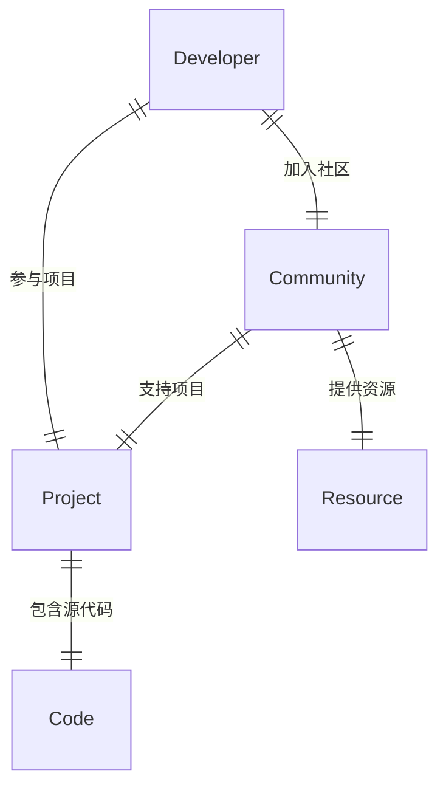

                 

# 意义开源计划：集体创造适应现代的生活哲学

## 关键词
- 开源计划
- 集体创造
- 生活哲学
- 现代生活
- 意义实现

## 摘要
本文探讨了开源计划在现代生活中的意义，以及集体创造如何适应现代生活哲学。通过对开源计划的背景、优势与挑战的深入分析，本文提出了集体创造在开源项目中的应用实践，并探讨了现代生活哲学的核心要素及其在个人、社区和组织层面的实践。最后，本文总结了开源计划与集体创造对现代生活的启示，并展望了其未来发展。

## 引言

### 问题背景

在现代社会的快速发展和技术的不断革新中，人们的生活方式、价值观念和思维方式都发生了巨大的变化。然而，这种变化也带来了一系列的问题，如社会不平等、工作压力、人际关系紧张等。为了解决这些问题，我们需要寻找适应现代生活的哲学和策略。开源计划作为一种集体创造的形式，正日益成为解决问题的重要途径。

### 问题描述

开源计划是一种基于共享和协作的开发模式，它允许任何人访问、修改和分发软件。这种模式的核心在于集体创造，即通过众人的智慧和努力来共同构建更好的产品。然而，随着开源计划的广泛应用，也出现了一些挑战，如知识产权保护、代码质量保障、社区管理等问题。这些问题需要我们从哲学的高度进行思考，以找到适应现代生活的解决方案。

### 问题解决

为了解决上述问题，我们需要从以下几个方面入手：

1. **理解开源计划的本质**：开源计划不仅仅是代码的共享，更是一种集体创造的哲学。它鼓励人们共同参与，共同创造，共同分享。

2. **构建适应现代生活哲学的开源社区**：开源社区需要建立一套共同遵循的价值观和行为准则，以促进集体创造和合作。

3. **提升开源项目的管理水平**：通过科学的项目管理和质量保障机制，确保开源项目的稳定性和可持续性。

4. **推广开源精神**：在更广泛的范围内推广开源精神，让更多的人理解和参与到开源计划中来。

### 边界与外延

开源计划的边界在于知识产权的保护。虽然开源计划鼓励共享和协作，但并不意味着可以随意侵犯他人的知识产权。在开源项目中，我们需要尊重他人的成果，合理使用开源协议，确保开源项目的合法性。

开源计划的外延则涉及到开源精神的推广和应用。开源计划不仅仅局限于软件领域，还可以扩展到硬件、设计、教育等多个领域，成为一种普遍的生活哲学。

### 核心概念

1. **开源计划**：一种基于共享和协作的开发模式，允许任何人访问、修改和分发软件。

2. **集体创造**：通过众人的智慧和努力来共同构建更好的产品。

3. **生活哲学**：关于生活的观念和态度，影响人们的行为和决策。

4. **现代生活**：当前社会的日常生活状态，包括工作、学习、娱乐等方面。

5. **意义实现**：通过开源计划和集体创造，实现个人和社会的价值。

## 核心概念与联系

### 1. 开源计划的核心概念原理

开源计划的核心在于“开源”二字。所谓“开源”，即软件的源代码是公开的，任何人都可以自由地查看、修改和分发。这种模式的核心原理是共享和协作。通过共享代码，开发者可以共同发现并修复问题，提高软件的质量和稳定性。通过协作，开发者可以共同探索新的功能，推动技术的进步。

### 2. 概念属性特征对比表格

| 概念       | 特征                                                         | 比较                     |
|------------|------------------------------------------------------------|--------------------------|
| 开源计划   | 公开源代码、自由修改、共享协作、知识产权保护             | 与封闭开发模式相对立     |
| 集体创造   | 众人的智慧和努力、共同构建、共享成果、集体管理           | 与个人创作相对立         |
| 生活哲学   | 关于生活的观念和态度、影响行为和决策、个体和社会的适应性 | 与传统哲学相对立         |
| 现代生活   | 当前社会的日常生活状态、工作、学习、娱乐等                | 与传统生活相对立         |
| 意义实现   | 通过开源计划和集体创造，实现个人和社会的价值             | 与传统价值实现相对立     |

### 3. ER实体关系图架构

ER图（实体关系图）用于描述数据库中实体及其关系。在开源计划中，我们可以将ER图应用于开源社区、开源项目和开发者之间的关系。

通过ER图，我们可以清晰地看到开发者、项目、社区和资源之间的相互关系，从而更好地理解开源计划的运作机制。

## 开源计划概述

### 1. 开源计划的定义

开源计划（Open Source Initiative, OSI）是一种软件开发模式，其核心是源代码的公开性和自由性。根据OSI的定义，开源计划必须满足以下条件：

- 公开源代码：软件的源代码必须是公开的，任何人都可以自由地查看、修改和分发。
- 自由修改：任何人都可以自由地修改软件，以满足特定的需求。
- 共享协作：开发者可以共享他们的代码，共同修复问题、添加新功能。

### 2. 开源计划的历史与发展

开源计划起源于20世纪70年代，当时Unix操作系统首次公开源代码。随着互联网的兴起，开源计划逐渐成为一种主流的开发模式。1998年，开源计划正式成为一种社会运动，标志着开源时代的到来。

近年来，开源计划在全球范围内得到了广泛的应用和推广。许多大型公司和政府机构都采用了开源计划，如Google、Facebook、NASA等。开源计划的普及，不仅推动了技术的发展，也为社会的进步做出了贡献。

### 3. 开源计划的优势与挑战

#### 开源计划的优势

- **质量保障**：开源计划的源代码是公开的，任何人都可以参与代码审查和修复。这使得开源项目的质量得到了更好的保障。
- **创新驱动**：开源计划鼓励开发者共同探索新的功能和技术，推动技术的创新。
- **成本效益**：开源计划降低了软件开发和部署的成本，使得更多的企业和个人可以参与到技术创新中来。
- **社区支持**：开源计划建立了强大的社区支持网络，为开发者提供了丰富的资源和帮助。

#### 开源计划的挑战

- **知识产权保护**：开源计划中如何平衡知识产权保护和共享精神，是一个需要解决的问题。
- **代码质量保障**：开源项目的代码质量参差不齐，如何确保代码的质量，是一个挑战。
- **社区管理**：开源社区的活跃度和管理质量直接影响开源项目的发展。如何有效地管理社区，是一个挑战。

## 生活哲学的现代适应性

### 1. 现代生活的挑战

随着社会的快速发展和技术的不断革新，现代生活面临着许多挑战。以下是几个主要的挑战：

- **工作压力**：现代工作环境竞争激烈，工作压力越来越大。
- **人际关系**：社交媒体的普及，让人们更加注重虚拟社交，而忽略了现实生活中的人际关系。
- **心理健康**：长时间的工作和生活的压力，导致许多人出现心理健康问题。

### 2. 生活哲学的演变

为了应对现代生活的挑战，人们需要不断调整和更新自己的生活哲学。以下是生活哲学的几个演变趋势：

- **价值观的重塑**：越来越多的人开始关注个人的内在成长，而不仅仅是外在的成功。
- **生活质量的提升**：人们开始追求更加健康、平衡和有意义的生活方式。
- **社会责任**：人们意识到自己的行为对社会和环境的影响，开始承担更多的社会责任。

### 3. 现代生活哲学的核心要素

现代生活哲学的核心要素包括：

- **自我认知**：了解自己的需求和价值观，找到生活的方向。
- **终身学习**：不断学习新知识，提升自己的能力和竞争力。
- **心理健康**：保持心理健康，积极应对生活中的挑战。
- **人际关系**：建立良好的人际关系，享受真实的社交互动。

## 集体创造的力量

### 1. 集体创造的概念

集体创造（Collective Creation）是指通过众人的智慧和努力，共同创造出一个有价值的产品或解决方案。在集体创造中，每个人都可以发挥自己的优势，共同解决问题，实现个人和集体的价值。

### 2. 集体创造的优势

集体创造具有以下优势：

- **多样性**：集体创造可以汇集不同的观点和思路，促进创新。
- **协作性**：集体创造鼓励人们协作，共同解决问题。
- **可持续性**：集体创造可以持续推动项目的进展，确保项目的稳定性和可持续性。
- **共享性**：集体创造的成果可以共享，为更多人带来价值。

### 3. 集体创造的实践

以下是集体创造的几个实践方法：

- **开放式协作**：通过互联网和社交媒体，建立一个开放的平台，让更多人参与到项目中来。
- **迭代开发**：不断迭代和改进项目，吸纳更多的意见和建议。
- **分布式工作**：通过远程协作工具，实现全球范围内的合作。
- **激励机制**：通过奖励和荣誉，激励参与者的积极性和创造力。

## 开源计划中的集体创造

### 1. 开源项目中的合作模式

开源项目中的合作模式可以分为以下几种：

- **贡献者模式**：贡献者可以自由地提交代码、文档和测试用例，参与项目的开发。
- **维护者模式**：维护者负责管理项目，确保项目的稳定性和可持续性。
- **贡献者评审模式**：贡献者的代码需要经过评审，确保代码的质量和一致性。
- **社区参与模式**：社区成员可以参与项目的讨论、建议和反馈，为项目提供支持。

### 2. 集体创造在开源项目中的应用

在开源项目中，集体创造的应用体现在以下几个方面：

- **代码贡献**：开发者可以自由地提交自己的代码，共同完善项目。
- **文档撰写**：文档贡献者可以撰写和使用开源项目的文档，帮助更多人理解和使用项目。
- **测试与修复**：测试贡献者可以提交测试用例，帮助发现和修复项目中的问题。
- **社区互动**：社区成员可以参与项目的讨论，为项目提供支持和建议。

### 3. 成功案例分享

以下是一些成功的开源项目案例：

- **Linux操作系统**：Linux操作系统是一个典型的集体创造案例。通过全球开发者的共同努力，Linux已经成为世界上最流行的操作系统之一。
- **Apache HTTP服务器**：Apache HTTP服务器是全球使用最广泛的Web服务器软件，其成功也得益于全球开发者的共同贡献。
- **WordPress内容管理系统**：WordPress是一个强大的内容管理系统，其成功的背后也有大量开发者的参与和贡献。

## 现代生活哲学的实践

### 1. 个人层面的实践

在个人层面，现代生活哲学的实践可以从以下几个方面入手：

- **自我认知**：通过自我反思，了解自己的需求和价值观，找到生活的方向。
- **终身学习**：不断学习新知识，提升自己的能力和竞争力。
- **心理健康**：保持心理健康，积极应对生活中的挑战。
- **人际关系**：建立良好的人际关系，享受真实的社交互动。

### 2. 社区层面的实践

在社区层面，现代生活哲学的实践可以体现在以下几个方面：

- **共享知识**：通过线上和线下的活动，分享知识和经验，促进社区的共同成长。
- **公益活动**：参与公益活动，为社会做出贡献。
- **社区合作**：通过合作，解决社区中的问题，提升社区的生活质量。

### 3. 组织层面的实践

在组织层面，现代生活哲学的实践可以从以下几个方面入手：

- **员工关怀**：关注员工的心理健康和工作生活平衡。
- **知识共享**：鼓励员工分享知识和经验，促进组织的共同成长。
- **社会责任**：承担社会责任，为社会发展做出贡献。

## 意义与未来展望

### 1. 开源计划的意义

开源计划具有重要的意义：

- **推动技术创新**：开源计划鼓励开发者共同探索新技术，推动技术的创新和发展。
- **降低开发成本**：开源计划降低了软件开发和部署的成本，使得更多的企业和个人可以参与到技术创新中来。
- **促进知识共享**：开源计划促进了知识的共享和传播，让更多人受益。

### 2. 集体创造的未来

集体创造的未来充满希望：

- **全球合作**：随着互联网的发展，全球范围内的合作将更加紧密，集体创造的潜力将得到进一步发挥。
- **跨界融合**：集体创造将跨越不同的领域和行业，实现更广泛的合作和创新。
- **社会变革**：集体创造将推动社会的变革，实现更公平、更可持续的发展。

### 3. 对现代生活的启示

开源计划和集体创造对现代生活有以下启示：

- **开放心态**：我们应该保持开放的心态，拥抱变化，积极参与集体创造。
- **合作精神**：我们应该培养合作精神，与他人共同解决问题，实现共同的目标。
- **持续学习**：我们应该不断学习新知识，提升自己的能力，以适应快速变化的社会。

## 结论

本文从开源计划和集体创造的角度，探讨了适应现代生活哲学的重要性。通过对开源计划的背景、优势与挑战的分析，以及对集体创造在现代生活中的应用实践的探讨，我们认识到开源计划和集体创造在推动技术创新、降低开发成本、促进知识共享等方面的巨大作用。未来，随着全球合作的深入和跨界融合的发展，开源计划和集体创造将继续发挥重要作用，为现代生活带来更多的变革和机遇。让我们携手合作，共同创造一个更美好的未来。

## 作者

作者：AI天才研究院/AI Genius Institute & 禅与计算机程序设计艺术 /Zen And The Art of Computer Programming

## 注意事项

- 开源计划和集体创造需要遵守相关的法律法规，保护知识产权。
- 在参与开源计划和集体创造时，要尊重他人的劳动成果，遵循社区规则。
- 集体创造不仅仅是技术的创新，更是价值的创造。我们要关注个人的成长和社会的发展，实现共同的价值。

## 拓展阅读

- 《开源软件：理论与实践》
- 《集体智慧：互联网时代的合作与创新》
- 《现代生活哲学：理解人与社会》

通过以上内容，我们不仅探讨了开源计划和集体创造在适应现代生活哲学中的重要性，也提供了一系列实践方法和启示。让我们共同努力，用开源计划和集体创造的力量，创造一个更加美好、更有意义的生活。

