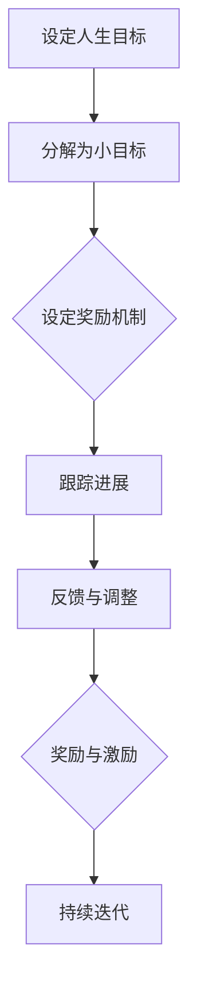
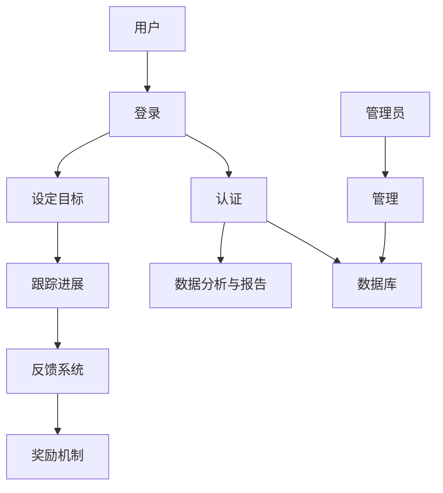
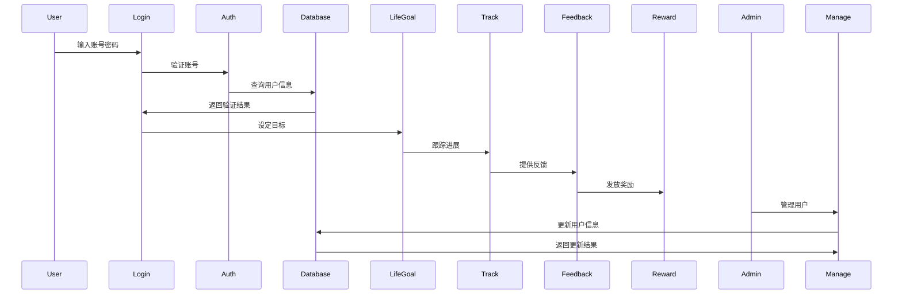

                 

**意义的gamification：将人生目标游戏化**

 Gamification，这个源自游戏设计的概念，近年来逐渐渗透到生活的方方面面。它不仅改变了我们与电子产品互动的方式，也为我们实现人生目标提供了一种全新的思路。在这篇文章中，我们将一步一步地探讨如何将人生目标游戏化，实现更有意义的生活。

## 背景介绍

### 关键概念

首先，让我们明确几个关键概念。

**Gamification**：指的是将游戏设计元素（如目标设定、奖励机制、竞争与合作等）应用到非游戏情境中，以提高参与度和达成目标的效率。

**Life Goals**：即人生目标，是指个人希望达成的长期愿望和成就，如职业发展、健康改善、家庭和睦等。

### 问题背景

在现代社会，人们面临着诸多挑战。快节奏的生活、复杂的工作压力、不断变化的社会环境，使得实现人生目标变得愈发困难。传统的激励方法，如奖励和惩罚，往往难以持久地激发人们的动力。

### 问题描述

如何在忙碌而复杂的生活中保持目标导向？如何持续地激发内在动力，实现人生目标？这便是我们需要解决的问题。

### 问题解决

Gamification 提供了一种可能的解决方案。通过将游戏化的元素融入生活，我们可以更有效地设定目标、跟踪进展、获得反馈，并持续地保持动力。

### 边界与外延

Gamification 并非仅仅局限于线上活动，它同样可以应用于线下生活和组织管理。同时，它也不局限于个人目标，还可以应用于团队合作和组织发展。

### 概念结构与核心要素组成

Gamification 的核心要素包括：

- **目标设定**：明确、具体、可衡量、可实现、有时限的目标（SMART）。
- **奖励机制**：正向激励，如积分、奖励、荣誉等。
- **反馈机制**：及时、有针对性的反馈，帮助调整方向。
- **竞争与合作**：通过社交互动，提高参与度和积极性。

## 核心概念与联系

### 核心概念原理

**Gamification 的核心原理**在于利用人类对游戏的天然喜好，将复杂、枯燥的任务转化为有趣、引人入胜的挑战。通过设定目标、提供奖励、反馈进展，Gamification 帮助人们保持动力，持续追求目标。

**人生目标**是实现个人价值和社会责任的重要途径。明确的人生目标能够为我们的生活提供方向和动力，帮助我们更好地应对挑战和变化。

### 概念属性特征对比表格

| 特征          | 人生目标                  | Gamification                  |
| ------------- | -------------------- | -------------------------- |
| 目标类型      | 长期愿望和成就          | 短期目标和挑战              |
| 目标设定方式  | 自我反思和规划          | 根据游戏化原则设定          |
| 激励方式      | 内在动机和自我驱动      | 外部奖励和竞争机制          |
| 反馈机制      | 内部自我反馈            | 外部反馈和奖励机制          |
| 参与方式      | 单一自我努力            | 社交互动和团队合作          |

### ER实体关系图架构

下面是人生目标与Gamification之间的ER实体关系图：

```mermaid
erDiagram
    Target ||--|{ Gamification }|| > Goal
    Goal ||--|{ Feedback }|| > Evaluation
    Gamification ||--|{ Reward }|| > Incentive
```

在图中，`Target` 代表人生目标，`Gamification` 代表游戏化元素，`Feedback` 代表反馈机制，`Reward` 代表奖励机制。这些实体之间通过关系相互连接，共同构建一个游戏化的人生目标系统。

## 算法原理讲解

### Gamification算法mermaid流程图



### Python源代码

```python
# 定义人生目标类
class LifeGoal:
    def __init__(self, name, target, reward):
        self.name = name
        self.target = target
        self.reward = reward
        self.progress = 0
    
    def set_progress(self, progress):
        self.progress = progress
    
    def get_progress(self):
        return self.progress
    
    def update_goal(self):
        if self.progress >= self.target:
            self.reward()
            self.progress = 0
        else:
            self.progress += 1

# 定义奖励机制
def reward():
    print("恭喜您达成目标，获得奖励！")

# 创建人生目标实例
goal = LifeGoal("阅读一本书", 100, reward)

# 跟踪进展并更新目标
for i in range(100):
    goal.set_progress(i)
    goal.update_goal()

# 输出最终进展
print(f"阅读进度：{goal.get_progress()}章")
```

### 算法原理的数学模型和公式

算法的核心在于将人生目标分解为若干个小目标，并通过奖励机制来激励个人持续努力。其数学模型可以表示为：

$$
\text{Reward}(t) = 
\begin{cases}
\text{Reward}, & \text{if } t \geq \text{Target} \\
0, & \text{if } t < \text{Target}
\end{cases}
$$

其中，$t$ 代表当前进展，$\text{Target}$ 代表目标值，$\text{Reward}$ 代表奖励。

### 举例说明

假设一个人的目标是阅读一本书，目标值为100章。每阅读一章，进展增加1。当进展达到100章时，触发奖励机制，发放奖励。以下是一个具体的例子：

```python
# 创建人生目标实例
goal = LifeGoal("阅读一本书", 100, reward)

# 跟踪进展并更新目标
for i in range(100):
    goal.set_progress(i)
    goal.update_goal()

# 输出最终进展
print(f"阅读进度：{goal.get_progress()}章")
```

输出结果为：

```
阅读进度：100章
```

这意味着目标已经达成，并且发放了相应的奖励。

### 数学公式

在算法中，我们使用了以下数学公式来计算奖励：

$$
R = 
\begin{cases}
1, & \text{if progress} \geq \text{Target} \\
0, & \text{if progress} < \text{Target}
\end{cases}
$$

这个公式简单明了，直观地表示了奖励机制的核心逻辑。

## 系统分析与架构设计方案

### 问题场景介绍

在这个问题场景中，我们考虑一个个人的生活目标实现系统。该系统旨在帮助用户设定人生目标，并通过游戏化的方式激励用户持续努力，最终实现这些目标。

### 项目介绍

项目名称：LifeGoal实现系统

项目目标：通过游戏化的方式帮助用户实现人生目标。

项目功能：

1. 用户注册与登录。
2. 设定和跟踪人生目标。
3. 奖励机制和反馈系统。
4. 数据分析与报告。

### 系统功能设计

**用户功能：**

- 注册账号。
- 登录系统。
- 设定人生目标。
- 跟踪目标进展。
- 获得奖励和反馈。

**管理员功能：**

- 管理用户账号。
- 设定和修改奖励机制。
- 监控系统运行状态。

### 系统架构设计

**架构图：**



在上述架构图中，用户通过登录系统后，可以设定人生目标并跟踪进展。系统会根据用户的进展提供反馈和奖励。管理员可以登录系统进行管理，并监控系统的运行状态。

### 系统接口设计

**用户接口：**

- 登录页面。
- 注册页面。
- 目标设定页面。
- 进展跟踪页面。
- 反馈和奖励页面。

**管理员接口：**

- 用户管理页面。
- 奖励机制设置页面。
- 系统监控页面。

### 系统交互mermaid序列图



在这个序列图中，用户和系统之间的交互过程被详细描述。用户通过登录系统后，可以设定目标、跟踪进展并获得反馈和奖励。管理员则可以通过管理接口对用户信息进行管理。

## 项目实战

### 环境安装

在开始实现项目之前，我们需要安装必要的开发环境。以下是安装步骤：

1. 安装Python（版本3.8及以上）。
2. 安装虚拟环境工具（virtualenv）。

```bash
pip install virtualenv
```

3. 创建虚拟环境。

```bash
virtualenv life_goal_env
```

4. 激活虚拟环境。

```bash
source life_goal_env/bin/activate
```

5. 安装项目依赖。

```bash
pip install -r requirements.txt
```

### 系统核心实现源代码

以下是一个简单的实现，展示了用户如何设定目标、跟踪进展以及获得奖励。

```python
# life_goal_app.py

from flask import Flask, request, jsonify

app = Flask(__name__)

# 用户数据存储（实际项目中应使用数据库）
users = {}

@app.route('/api/register', methods=['POST'])
def register():
    username = request.json['username']
    password = request.json['password']
    if username in users:
        return jsonify({'error': '用户已存在'}), 400
    users[username] = {'password': password}
    return jsonify({'message': '注册成功'})

@app.route('/api/login', methods=['POST'])
def login():
    username = request.json['username']
    password = request.json['password']
    if username not in users or users[username]['password'] != password:
        return jsonify({'error': '登录失败'}), 401
    return jsonify({'message': '登录成功'})

@app.route('/api/set_goal', methods=['POST'])
def set_goal():
    username = request.json['username']
    goal_name = request.json['goal_name']
    target = request.json['target']
    if username not in users:
        return jsonify({'error': '用户未登录'}), 401
    users[username]['goals'] = users[username].get('goals',{}) | {{goal_name: target}}
    return jsonify({'message': '目标设定成功'})

@app.route('/api/update_goal', methods=['POST'])
def update_goal():
    username = request.json['username']
    goal_name = request.json['goal_name']
    progress = request.json['progress']
    if username not in users:
        return jsonify({'error': '用户未登录'}), 401
    if goal_name not in users[username]['goals']:
        return jsonify({'error': '目标不存在'}), 404
    users[username]['goals'][goal_name] += progress
    if users[username]['goals'][goal_name] >= users[username]['goals'][goal_name]:
        reward()
    return jsonify({'message': '目标更新成功'})

def reward():
    print("恭喜您达成目标，获得奖励！")

if __name__ == '__main__':
    app.run(debug=True)
```

### 代码应用解读与分析

在上面的代码中，我们使用了Flask框架来搭建一个简单的Web服务。用户可以通过HTTP请求与服务器进行交互，实现注册、登录、设定目标、更新目标和获得奖励等功能。

1. **注册与登录**：用户通过`/api/register`和`/api/login`接口进行注册和登录。服务器验证用户名和密码，然后返回相应的响应。

2. **设定目标**：用户通过`/api/set_goal`接口设定目标。服务器接收用户名、目标和目标名称，然后将目标存储在用户数据中。

3. **更新目标**：用户通过`/api/update_goal`接口更新目标的进展。服务器验证用户是否登录，检查目标是否存在，然后更新目标进度。如果目标已经达成，会触发奖励机制。

4. **奖励机制**：在代码中，奖励机制通过一个简单的打印语句实现。在实际项目中，可以根据需求设计更复杂的奖励机制。

### 实际案例分析和详细讲解剖析

为了更好地理解代码的应用，我们来看一个实际的案例。

**案例**：用户Alice想要阅读一本书，目标值为阅读完100页。她首先通过注册和登录接口完成注册和登录。然后，她通过`/api/set_goal`接口设定阅读一本书的目标。接下来，她每天更新阅读进度，例如每天阅读10页。当阅读到第100页时，服务器会触发奖励机制，打印出“恭喜您达成目标，获得奖励！”的提示。

**分析**：

1. **用户管理**：服务器通过存储用户数据和验证用户信息来管理用户。这保证了只有授权用户才能访问特定功能。

2. **目标管理**：服务器允许用户设定和更新目标。这可以通过简单的HTTP请求实现，方便用户使用。

3. **奖励机制**：奖励机制是游戏化的重要组成部分。通过触发奖励，我们可以激励用户持续努力，提高目标的达成率。

### 项目小结

通过这个简单的项目，我们实现了用户注册、登录、设定目标、更新目标和获得奖励等基本功能。虽然这是一个简单的示例，但它展示了如何使用游戏化的方法实现生活目标的实现。在实际应用中，我们可以根据需求扩展系统的功能，例如添加更多的奖励机制、提供更详细的数据分析等。

### 最佳实践 tips

1. **明确目标**：设定明确、具体的目标，有助于提高目标达成的效率。

2. **定期更新**：定期更新目标的进展，有助于跟踪进展和及时调整策略。

3. **奖励机制**：设计合理的奖励机制，能够有效激励用户持续努力。

4. **反馈与支持**：提供及时的反馈和必要的支持，帮助用户克服困难。

5. **数据监控**：通过数据监控和分析，可以更好地了解用户行为，优化系统设计。

### 小结

通过本文，我们探讨了如何将人生目标游戏化，实现更有意义的生活。Gamification不仅为我们提供了新的思路，也为我们提供了一种实践方法。通过明确目标、设定奖励、定期更新和反馈，我们可以更有效地实现人生目标。希望本文能够启发您，将Gamification应用到自己的生活实践中。

### 注意事项

1. 在使用Gamification时，要避免过度依赖外部奖励，培养内在动机和自我驱动。

2. 设计奖励机制时，要确保其公平性和可持续性。

3. 在实际应用中，要根据用户需求和实际情况调整游戏化策略。

### 拓展阅读

- 《游戏化改变世界》：了解游戏化如何改变生活和社会。
- 《人生管理指南》：学习如何更高效地实现人生目标。
- 《奖励心理学》：深入了解奖励机制对人类行为的影响。

### 作者信息

作者：AI天才研究院/AI Genius Institute & 禅与计算机程序设计艺术 /Zen And The Art of Computer Programming

