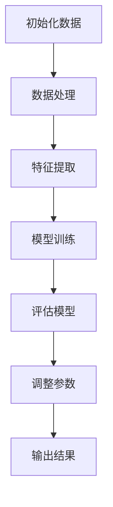
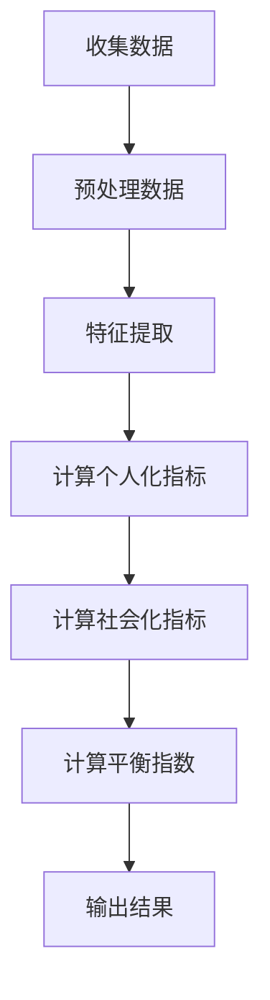
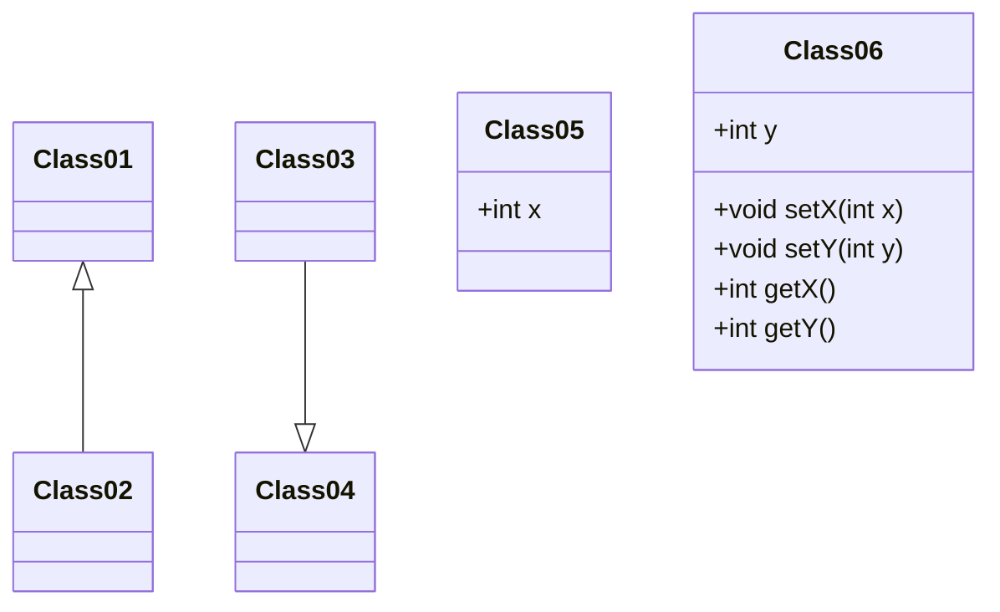
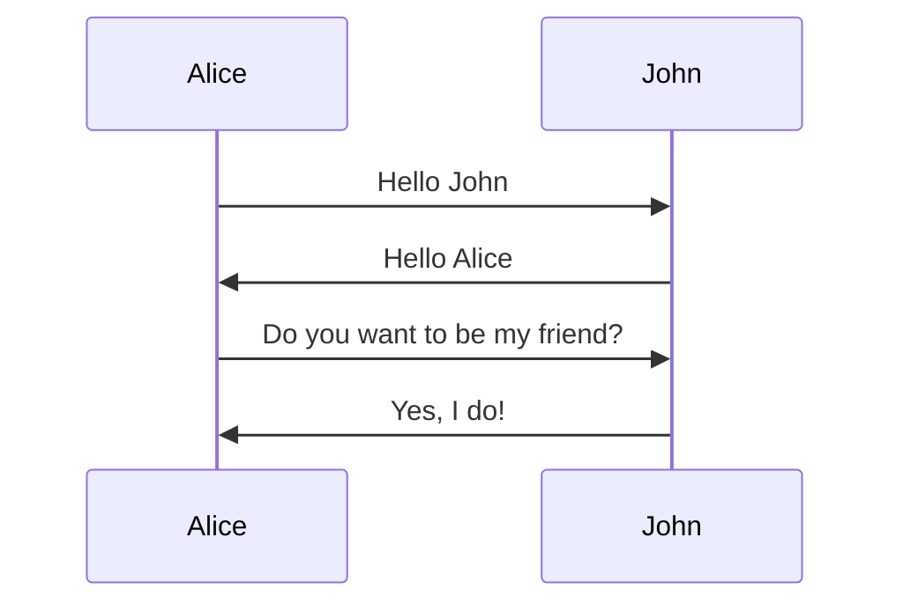

                 


### 设计思路

为了设计出《意义的个人化与社会化的平衡》这本书的完整目录大纲，我们需要遵循以下设计思路：

1. **背景介绍**：首先，需要为读者提供一个问题的背景，包括问题的来源、现状以及为何需要解决这一问题。这将帮助读者理解整个讨论的基础和重要性。

2. **核心概念与联系**：接下来，介绍书中的核心概念，并通过属性特征对比表格和实体关系图来展示这些概念之间的关系，帮助读者形成整体的认识。

3. **算法原理讲解**：详细讲解书中的核心算法原理，使用 Mermaid 画图工具绘制算法流程图，并配合 Python 源代码和数学公式进行阐述，确保读者能够理解算法的逻辑和应用。

4. **数学模型与公式讲解**：在讲解算法原理时，需要使用 LaTeX 格式给出相关的数学模型和公式，并进行详细解释和举例说明，以确保读者能够理解这些模型和公式的实际应用。

5. **系统分析与架构设计**：为读者展示整个系统的功能设计、架构设计、接口设计和系统交互，使用 Mermaid 类图和架构图来清晰表达系统的结构和流程。

6. **项目实战**：通过一个实际的项目案例，展示如何应用书中的知识和方法，提供环境安装、系统实现源代码以及代码应用解读与分析。

7. **最佳实践、小结与拓展阅读**：在总结章节中，给出最佳实践建议、注意事项和进一步阅读的推荐，帮助读者巩固所学知识并拓展视野。

### 目录大纲

下面是根据设计思路设计的《意义的个人化与社会化的平衡》的目录大纲：

## 引言与背景

### 第1章：问题背景与重要性

#### 1.1. 问题的来源

- **信息过载**：在当今数字时代，人们每天面临的信息量急剧增加，导致个体难以从中提取出有价值的意义。

#### 1.2. 现状分析

- **个人化困境**：在追求个性化体验的过程中，个体往往陷入自我封闭的困境，难以建立有效的社会联系。
- **社会化挑战**：过度关注社会关系可能导致个体失去自我，无法实现个人价值的最大化。

#### 1.3. 问题的重要性

- **个体心理健康**：平衡个人化与社会化对维护心理健康至关重要。
- **社会和谐**：在社会层面，个人化与社会化的平衡有助于促进社会的稳定与发展。

#### 1.4. 书籍结构概述

- **核心概念**：个人化、社会化及其相互关系。
- **理论框架**：结合心理学、社会学理论，构建分析框架。
- **算法原理**：介绍用于平衡个人化与社会化的算法。
- **系统设计**：展示如何在实际项目中应用这些理论。
- **最佳实践**：总结实践经验，提供实用建议。

## 核心概念与联系

### 第2章：个人化与社会化的定义

#### 2.1. 个人化的定义

- 个人化指的是个体在信息处理、价值观形成和行为决策等方面展现出的独特性。

#### 2.2. 社会化的定义

- 社会化是指个体在社会互动中，逐渐内化社会规范、价值观和行为模式的过程。

#### 2.3. 个人化与社会化的关系

- **互补性**：个人化和社会化相互补充，共同塑造个体的行为和认知。
- **冲突性**：在某些情境下，个人化与社会化可能产生冲突，导致个体内心的矛盾。

### 第3章：个人化与社会化的理论基础

#### 3.1. 社会建构主义

- **核心观点**：知识是由社会互动中共同构建的。
- **个人化视角**：社会建构主义强调个体在社会互动中形成独特视角的重要性。

#### 3.2. 社会心理学理论

- **群体行为**：个体在群体中行为可能受到群体心理的影响。
- **个人化影响**：社会心理学理论探讨了个体如何在社会互动中保持自我特征。

#### 3.3. 社会网络理论

- **核心概念**：社会网络是指个体之间的互动关系。
- **个人化与社会化**：社会网络理论提供了理解个人化与社会化关系的微观视角。

### 第4章：个人化与社会化的平衡算法

#### 4.1. 算法概述

- **目的**：通过算法实现个人化与社会化的平衡。
- **方法**：结合机器学习和数据分析技术，构建平衡模型。

#### 4.2. Mermaid算法流程图



#### 4.3. Python源代码示例

```python
# Python源代码示例
def balance_personalization_socialization(data):
    # 数据处理
    processed_data = preprocess_data(data)
    
    # 特征提取
    features = extract_features(processed_data)
    
    # 模型训练
    model = train_model(features)
    
    # 评估模型
    evaluation = evaluate_model(model)
    
    # 调整参数
    adjusted_model = adjust_params(model, evaluation)
    
    # 输出结果
    return adjusted_model
```

#### 4.4. 数学模型与公式讲解

- **公式推导**：
  $$ \text{平衡指数} = \frac{\text{个人化指标} + \text{社会化指标}}{2} $$
- **举例说明**：通过具体案例展示如何计算平衡指数。

### 第5章：数学模型应用与举例

#### 5.1. 模型公式推导

- **推导过程**：详细阐述平衡指数的计算方法。

#### 5.2. Mermaid流程图示例



#### 5.3. 应用案例与分析

- **案例背景**：介绍案例背景和目标。
- **案例分析**：使用书中的算法和数学模型进行案例分析。

## 系统分析与架构设计

### 第6章：系统功能设计

#### 6.1. 问题场景介绍

- **需求分析**：介绍需要解决的问题场景和用户需求。

#### 6.2. 系统功能设计

- **领域模型**：使用 Mermaid 类图展示系统功能。



#### 6.3. 系统架构设计

- **架构图**：使用 Mermaid 架构图展示系统架构。



### 第7章：系统实现与项目实战

#### 7.1. 环境安装

- **步骤1**：安装Python环境
- **步骤2**：安装相关库和依赖

#### 7.2. 系统核心实现

- **代码实现**：提供关键代码片段。

```python
# 关键代码片段
def main():
    data = load_data()
    processed_data = preprocess_data(data)
    features = extract_features(processed_data)
    model = train_model(features)
    evaluation = evaluate_model(model)
    adjusted_model = adjust_params(model, evaluation)
    output_results(adjusted_model)

if __name__ == "__main__":
    main()
```

#### 7.3. 代码应用解读与分析

- **代码解读**：解释代码逻辑和关键函数。
- **分析结果**：展示实际应用效果。

#### 7.4. 实际案例分析

- **案例背景**：介绍案例背景。
- **详细讲解**：剖析案例中的关键环节。

### 第8章：最佳实践与总结

#### 8.1. 最佳实践

- **实践技巧**：提供实际操作技巧。
- **注意事项**：强调关键注意事项。

#### 8.2. 小结

- **主要内容**：回顾本书的核心内容。
- **未来展望**：展望未来的研究方向。

#### 8.3. 拓展阅读

- **推荐书籍**：推荐相关领域的好书。
- **资源链接**：提供有用的在线资源和工具。

## 结尾

### 第9章：作者信息

- **作者简介**：介绍作者的背景和成就。
- **感谢致辞**：感谢读者的支持和关注。

### 注释

- **注释内容**：提供对文章中某些概念或观点的进一步解释和说明。

以上是根据设计思路和约束条件设计的《意义的个人化与社会化的平衡》的完整目录大纲。接下来，我们将根据每个章节的要求，进一步丰富和细化内容，确保文章的逻辑性和完整性。文章的撰写将遵循逐步分析和推理的思路，以使读者能够深入理解和掌握相关内容。

