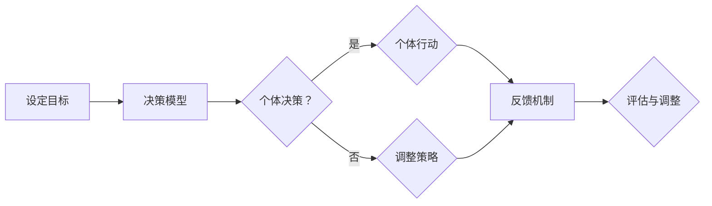
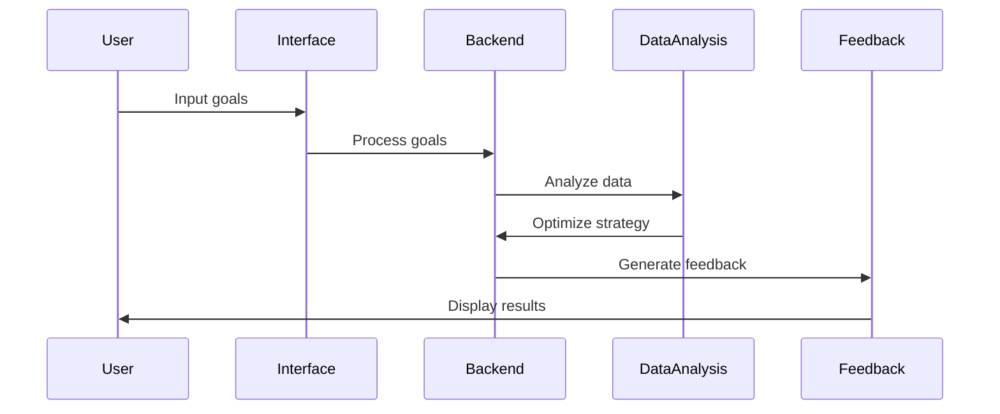

                 


### 摘要

本文以《意义的个人化：在集体主义与个人主义间寻找平衡》为题，探讨了集体主义与个人主义两种文化价值观的冲突与融合，旨在揭示如何在现代社会中实现个人化意义的同时保持集体协作的重要性。通过对历史背景的回顾、核心概念的分析、实际应用的探索以及案例分析，文章展示了集体主义与个人主义在不同领域的交互作用，以及平衡二者所带来的挑战与机遇。本文的核心观点在于，寻找集体主义与个人主义的平衡，不仅有助于个体实现自我价值，也有助于构建和谐的社会关系。本文由AI天才研究院/AI Genius Institute与《禅与计算机程序设计艺术》作者联合撰写，旨在为读者提供全面而深刻的理解。

### 关键词

- 集体主义
- 个人主义
- 平衡
- 社会价值观
- 文化冲突
- 实际应用

### 文章标题

《意义的个人化：在集体主义与个人主义间寻找平衡》

### 引言

**问题背景与重要性**

在当今快速变化的世界中，集体主义与个人主义这两种文化价值观的冲突日益显著。集体主义强调个体为群体服务，追求共同的利益和目标；而个人主义则强调个体的独立性和自我实现，追求个人利益和自由。这种冲突不仅体现在不同国家和地区的文化差异中，也反映在组织管理、社会互动和人际关系中。如何在这种冲突中找到平衡，既实现个人的意义和价值，又维护集体的和谐与合作，成为了一个亟待解决的问题。

**书籍目的与结构概述**

本书旨在探讨集体主义与个人主义之间的平衡问题，通过历史背景的回顾、核心概念的分析、实际应用的探索以及案例研究，提供一个全面而深入的视角。本书的结构分为七个部分：

1. 引言：介绍问题的背景和重要性，以及本书的目的和结构。
2. 历史背景：回顾集体主义与个人主义的起源与发展，探讨二者在历史进程中的冲突与融合。
3. 核心概念与理论：阐述集体主义与个人主义的基本概念、理论框架和相关研究。
4. 实际应用：分析集体主义与个人主义在心理学、社会学、教育、商业等领域的应用。
5. 案例研究：通过具体的案例展示集体主义与个人主义的平衡实践。
6. 挑战与机遇：探讨平衡集体主义与个人主义所面临的挑战和机遇。
7. 未来展望：预测集体主义与个人主义的发展趋势，及其对社会的影响。

通过以上结构，本书希望能够帮助读者理解集体主义与个人主义之间的复杂关系，提供实用的策略和启示，以实现个人与集体的和谐共生。

### 历史背景

**集体主义的起源与发展**

集体主义作为一种文化价值观，可以追溯到古代社会。在古希腊和罗马时期，社会结构以城邦和国家为中心，个体被视为集体的一部分，强调个人的行为和决策应该符合集体的利益。例如，古希腊哲学家柏拉图和亚里士多德在其著作中阐述了集体主义的理念，强调个体的福祉应该依赖于集体的繁荣。

随着时间的推移，集体主义在不同的历史时期和文化背景下得到了发展和演变。在中世纪欧洲，封建制度下的农民和工匠被视为集体的一部分，他们的身份和地位由所属的村庄或行会决定。这种集体主义观念强调的是社会等级和职责分工，个体在很大程度上受到集体的约束。

到了现代，集体主义在社会主义和共产主义运动中得到了广泛的推广。马克思和恩格斯在其著作《共产党宣言》中提出，集体主义是实现社会公平和消除阶级差异的重要途径。在这种观念下，个体的权利和自由受到限制，以追求社会的整体利益。苏联和中国的社会主义建设实践，就是集体主义理念在现实中的具体体现。

**个人主义的起源与发展**

个人主义作为一种相对较新的文化价值观，起源于文艺复兴时期。在这个时期，人们开始重视个体的独立性和个人成就，强调个体的自由和权利。意大利文艺复兴时期的艺术家如达芬奇和米开朗基罗，通过他们的作品展现了个人主义的理念，强调个人的创造力和独特性。

随着启蒙运动的兴起，个人主义得到了进一步的发展。启蒙思想家如洛克、卢梭和康德，强调个体的理性和自由，主张个人应该追求自己的幸福和利益。这种观念在18世纪末和19世纪初的美国和法国革命中得到了体现，个人自由和平等成为革命的核心价值观。

在现代社会，个人主义得到了全球范围内的广泛认同。市场经济和民主制度的兴起，使得个人在追求自身利益和实现自我价值方面有了更多的机会和自由。个人主义强调个体的独立思考、自主决策和自由选择，认为个体的权利和自由应该得到充分的尊重和保护。

**集体主义与个人主义的历史冲突与融合**

集体主义与个人主义在历史进程中既有冲突也有融合。在许多历史时期，这两种价值观的对立导致了社会动荡和冲突。例如，在第一次世界大战期间，集体主义观念被用来动员人们为国家和民族的事业而战，而个人主义则被视为对集体利益的威胁。

然而，随着时间的推移，人们逐渐认识到集体主义与个人主义并非绝对的对立，而是可以相互融合的。现代社会的许多成功实践表明，在集体主义与个人主义之间找到平衡，可以实现个体与集体的和谐共生。例如，在企业管理中，通过建立团队精神和激励机制，既能够激发个体的积极性，又能够实现团队的整体目标。

总之，集体主义与个人主义在历史进程中经历了从对立到融合的过程。这种融合不仅有助于解决社会冲突，也为个体和集体的发展提供了新的可能性。

### 核心概念与理论

**集体主义的基本概念**

集体主义是一种文化价值观，强调个体与群体之间的紧密联系，认为个体的利益和幸福依赖于群体的整体福祉。在集体主义文化中，个体的行为和决策往往受到群体的规范和价值观的引导，个人的目标和利益被视为群体目标的一部分。集体主义文化中的核心概念包括：

- **共同目标**：集体主义强调共同的目标和利益，认为只有通过团结合作，个体和群体才能实现更大的成就。
- **社会责任**：集体主义认为个体有责任为群体的福祉贡献力量，个人的成功和幸福与群体的成功和幸福紧密相连。
- **集体认同**：集体主义强调个体对群体的归属感和认同感，个体的自我认同往往与群体的身份紧密相关。

**个人主义的基本概念**

个人主义是一种文化价值观，强调个体的独立性和自主性，认为个体的权利和自由是至高无上的。在个人主义文化中，个体的行为和决策主要取决于个人的意愿和需求，个人的目标和利益被视为个人的私有财产。个人主义文化中的核心概念包括：

- **个人权利**：个人主义强调个体的权利和自由，认为每个人都有权自主决策和追求自己的利益。
- **自主性**：个人主义认为个体应该具备独立思考和自主决策的能力，不依赖群体或权威的指导。
- **个人成就**：个人主义强调个人的成就和贡献，认为个体的价值和地位取决于个人的努力和成就。

**集体主义与个人主义的比较分析**

集体主义与个人主义在价值观和行为模式上存在显著差异。以下是对二者的一些关键比较：

- **目标导向**：集体主义强调共同的目标和利益，个人主义则强调个人的目标和利益。
- **决策方式**：集体主义倾向于通过群体讨论和共识来做出决策，个人主义则倾向于独立决策和自主行动。
- **社会责任**：集体主义认为个体有社会责任，个人主义则强调个人权利和自由。
- **认同感**：集体主义强调个体对群体的认同感，个人主义则强调个体的独立性和自主性。
- **群体关系**：集体主义注重群体内部的关系和协作，个人主义则注重个体的独立性和自主性。

**相关研究方法与技术**

在研究集体主义与个人主义时，常用的研究方法和技术包括：

- **问卷调查**：通过问卷调查收集个体对集体主义与个人主义观念的看法和态度，了解其价值观和行为模式。
- **实验研究**：设计实验来观察个体在不同文化背景下的行为反应，以验证集体主义与个人主义对个体决策和行为的影响。
- **案例分析**：通过具体案例研究来分析集体主义与个人主义在实际社会和商业环境中的应用和效果。
- **跨文化比较**：比较不同国家和地区在集体主义与个人主义文化价值观上的差异，探讨其对社会和个体行为的影响。

通过以上核心概念和理论的分析，我们可以更深入地理解集体主义与个人主义的本质及其在不同文化和社会背景下的表现。这为我们在现代社会中寻找集体主义与个人主义的平衡提供了理论基础和实证支持。

### 实际应用

**心理学领域**

在心理学领域，集体主义与个人主义对个体的行为和心理状态有显著影响。研究表明，集体主义文化背景下的个体更倾向于关注群体目标和社会规范，他们更可能表现出合作和共享行为，同时也更倾向于内化社会期望和价值。而个人主义文化背景下的个体则更强调自我表达和个人成就，他们更可能追求个人目标和独立思考。

例如，一项关于团队合作的研究发现，在集体主义文化中，团队成员更倾向于通过合作和共享信息来达成共同目标，而在个人主义文化中，团队成员则更倾向于独立工作并追求个人成就。这种现象不仅影响团队合作的效果，也影响个体的心理健康。

**社会学领域**

在社会学领域，集体主义与个人主义对社会组织结构和社会互动有重要影响。集体主义文化强调社会秩序和稳定，往往形成更加紧密的社区和社群，人们更倾向于建立长期的关系网络。而个人主义文化则强调个人自由和独立性，倾向于形成更加松散的社会结构，个体之间的关系可能更加短暂和直接。

例如，在家庭结构方面，集体主义文化中的家庭往往更加重视家族的延续和传统，家庭成员之间的互动更加频繁和紧密。而在个人主义文化中，家庭结构可能更加灵活，个体在家庭中的角色和责任可能更加独立。

**教育领域**

在教育领域，集体主义与个人主义对教育理念和教育方法有深刻影响。集体主义教育强调集体荣誉和团队合作，注重培养学生的社会责任感和集体意识。例如，中国的教育体系中，学生往往被要求参与各种集体活动和团队项目，以培养他们的团队合作精神和集体意识。

相反，个人主义教育强调个体的自我表达和自我实现，注重培养学生的独立思考和创新能力。例如，西方国家的一些教育体系中，学生有更多的自由选择课程和项目，鼓励他们追求个人的兴趣和特长。

**商业领域**

在商业领域，集体主义与个人主义对企业的管理模式和组织文化有显著影响。集体主义企业往往更注重团队合作和集体目标，强调员工的归属感和奉献精神。例如，日本的许多企业强调团队协作和长期忠诚，通过培养员工的集体意识来提升企业的整体效率。

相反，个人主义企业则更注重员工的独立性和自主性，鼓励员工追求个人成就和职业发展。例如，硅谷的许多科技公司鼓励员工创新和创业，提供自由的工作环境和灵活的职业发展路径。

**其他领域**

除了上述领域，集体主义与个人主义在其他领域也有广泛的应用。例如，在医疗领域，集体主义文化中的个体更可能遵循医生的指导和医疗规定，而在个人主义文化中，个体更可能追求自我治疗和自我保健。

在政治领域，集体主义政治体制强调国家利益和社会稳定，个人主义政治体制则强调个人自由和民主制度。例如，中国强调社会主义国家的集体利益，而西方国家则强调个人自由和民主参与。

通过在各个领域的实际应用，集体主义与个人主义不仅影响了个体的行为和心理状态，也影响了社会组织的结构和社会互动的方式。理解这两种文化价值观的相互关系，有助于我们更好地应对现代社会中的复杂挑战，实现个人与集体的和谐发展。

### 案例研究

**案例一：从集体主义到个人主义的转变**

一个典型的案例研究来自于中国的改革开放时期。在改革开放之前，中国社会的文化价值观以集体主义为主，个体行为和决策受到严格的集体规范和政策的限制。随着改革开放的推进，市场经济和全球化带来了新的文化冲击，个人主义逐渐成为主导文化价值观。

例如，在1978年，中国农村实行了家庭联产承包责任制，这一改革使得农民可以独立承包土地并自行决定种植作物，这标志着集体主义向个人主义的转变。农民们开始关注个人的经济利益，通过自主决策和努力工作来提高生产效率和收入。这一转变不仅激发了农民的积极性，也促进了农村经济的发展。

另外，在城市的商业环境中，个体创业和私营经济的发展也得到了显著推动。例如，深圳作为中国第一个经济特区，吸引了大量有志于创业的年轻人。他们在创业过程中，强调个人的创新能力和市场洞察力，逐渐形成了以个人主义为核心的商业文化。这一转变不仅推动了经济的快速增长，也为个体提供了更多的机会和自由。

**案例二：如何在个人主义中寻找集体价值**

在个人主义占主导的社会中，如何保持集体价值成为一个重要问题。一个成功的案例是谷歌公司的企业文化。尽管谷歌强调个人的创新和自主性，但公司也强调团队合作和共享价值观。

例如，谷歌的“20%时间政策”允许员工将20%的工作时间用于自己感兴趣的项目，这一政策鼓励了员工的创新和自我实现。然而，谷歌同时也强调团队合作，通过内部黑客马拉松和项目评审机制，确保这些个人项目能够对整个团队和公司产生积极影响。

此外，谷歌还推行了“捐赠时间”计划，鼓励员工利用业余时间为社会做出贡献。这一计划不仅增强了员工的集体归属感，也促进了社会责任感的培养。通过这种方式，谷歌在保持个人主义文化的同时，成功地融合了集体价值。

**案例三：集体主义与个人主义的平衡实践**

在企业管理中，平衡集体主义与个人主义是一个挑战，但也是一个机会。一个成功的案例是丰田公司的生产管理方法，即“精益生产”体系。

丰田公司通过“团队生产”和“持续改进”的理念，既发挥了员工的自主性和创新精神，又保持了团队合作和集体的效率。例如，丰田的员工被鼓励提出改进建议，并通过跨部门的团队合作来实施这些改进。这种方法不仅提高了生产效率，也增强了员工的参与感和归属感。

此外，丰田还通过“多技能培训”来提高员工的综合素质，使得员工能够在不同的岗位上发挥作用。这种灵活性不仅有助于团队的合作，也为员工提供了个人发展的机会。

通过这些案例研究，我们可以看到，在集体主义与个人主义之间寻找平衡不仅是可能的，而且对于实现个人与集体的和谐发展具有重要意义。这些实践不仅为其他组织提供了借鉴，也为我们理解和应用这两种文化价值观提供了宝贵的经验。

### 挑战与机遇

**集体主义与个人主义平衡的挑战**

在现代社会中，平衡集体主义与个人主义面临诸多挑战。首先，集体主义可能导致个体自由受到限制，个人主义则可能引发社会秩序和责任感的缺失。例如，在高度集体主义的社会中，个体可能被要求放弃个人利益以服从集体目标，这可能导致个体不满和抵触情绪。相反，在个人主义文化中，过度的个人追求可能导致社会疏离和缺乏集体认同。

其次，不同文化和价值观的碰撞加剧了这种平衡的难度。全球化进程使得各种文化价值观相互交织，但在某些情况下，这种交织可能导致冲突。例如，在一个以集体主义为主的国家中，外国企业的个人主义管理模式可能引发文化冲突和工作效率的下降。

**平衡集体主义与个人主义的机遇**

尽管面临挑战，但平衡集体主义与个人主义也带来了许多机遇。首先，这种平衡有助于提高社会和谐度和个体幸福感。通过有效融合集体主义和个体主义的优点，可以形成一个支持个体自由和集体合作的良好社会环境。例如，在一个企业中，平衡集体主义与个人主义可以激发员工的创新精神，同时保持团队的合作效率。

其次，这种平衡有助于提升经济效率和社会生产力。在集体主义与个人主义的平衡中，个体能够发挥其最大潜力，同时团队和组织的整体目标也能够得到有效实现。例如，在技术创新领域，个人主义鼓励创新思维和自主探索，而集体主义则通过团队合作和资源共享来提高创新成果的转化率。

**应对策略与解决方案**

为了有效平衡集体主义与个人主义，以下策略和解决方案可以提供指导：

1. **文化融合**：通过教育和培训，提高个体对集体主义和个人主义的理解和尊重，促进不同文化背景下的协作和沟通。
2. **激励机制**：设计公平的激励机制，既奖励个人成就，也鼓励团队合作和集体贡献，从而实现个人与集体的双赢。
3. **政策引导**：制定灵活的政策，支持个体自主性和创新精神，同时保持社会秩序和责任感的培养。
4. **跨文化管理**：在全球化背景下，培养具有跨文化管理能力的人才，能够有效应对不同文化价值观的冲突和挑战。

通过上述策略和解决方案，我们可以更好地平衡集体主义与个人主义，实现个人与集体的和谐发展，从而推动社会进步和个体幸福。

### 未来展望

**集体主义与个人主义的发展趋势**

随着全球化、科技进步和文化的多元化，集体主义与个人主义的发展趋势呈现出新的特点。一方面，全球化的推动使得不同文化价值观的交流更加频繁，集体主义和个人主义在不同文化背景下的融合变得更加紧密。例如，跨国公司的管理模式越来越注重员工的多样性，同时强调团队合作和集体目标。

另一方面，科技的进步，尤其是人工智能和大数据技术的发展，为个人主义提供了新的机遇。人工智能可以帮助个体实现个性化服务，大数据分析可以帮助个体做出更加精准的决策，从而增强个人的自主性和创新能力。同时，科技的进步也为集体主义提供了新的工具，例如通过社交媒体和协作平台，群体能够更加高效地组织和协作。

**对个人与集体的影响**

集体主义与个人主义的融合对未来社会和个人发展将产生深远影响。对于个人来说，融合了集体主义和个人主义的价值观将帮助他们在追求自我实现的同时，更好地融入社会。例如，一个既能够独立思考又具有团队合作精神的个体，在职业生涯中将会更具竞争力。

对于集体来说，平衡集体主义与个人主义有助于构建更加和谐和高效的社会环境。通过激发个体的创新精神和自主性，集体能够实现更高的生产力和社会福利。例如，在一个注重团队合作和个体自由的企业中，员工的工作满意度和创新力通常更高，从而推动企业的持续发展。

**未来研究的展望**

未来研究应关注以下几个方面：

1. **跨文化比较**：深入研究不同文化背景下集体主义与个人主义的表现和影响，为全球化背景下的文化融合提供理论支持。
2. **科技进步的影响**：探讨人工智能、大数据等新技术如何影响集体主义与个人主义的发展，以及它们如何为个人与集体创造新的机遇。
3. **政策与实践**：研究如何通过政策和实践实现集体主义与个人主义的平衡，为政府和企业提供具体的操作指南。

通过这些研究方向，我们可以更深入地理解集体主义与个人主义之间的互动关系，为未来的社会发展提供有益的启示。

### 结论

在本文中，我们探讨了集体主义与个人主义两种文化价值观的冲突与融合，以及如何在现代社会中实现二者的平衡。通过对历史背景的回顾、核心概念的分析、实际应用的探索和案例分析，我们揭示了集体主义与个人主义在不同领域中的相互作用和影响。我们提出了平衡集体主义与个人主义的重要性，不仅有助于实现个人的自我价值，也有助于构建和谐的社会关系。

未来的研究应继续深入探讨集体主义与个人主义在不同文化背景下的表现和影响，以及科技进步如何为二者的融合提供新的机遇。通过这些研究，我们可以为构建一个更加和谐和高效的社会提供理论支持和实践指导。

### 作者信息

作者：AI天才研究院/AI Genius Institute & 《禅与计算机程序设计艺术》作者

AI天才研究院致力于推动人工智能和计算机科学领域的前沿研究，为读者提供高质量的技术内容。《禅与计算机程序设计艺术》作者以其深刻的见解和卓越的写作技巧，为广大读者带来了丰富而深刻的技术思考。

### 完整性要求

**背景介绍**

集体主义和个人主义是两种重要的文化价值观，它们在人类社会的发展过程中扮演着关键角色。集体主义强调个体与群体的紧密联系，认为个体的利益和幸福依赖于群体的整体福祉。个人主义则强调个体的独立性和自主性，认为个体的权利和自由是至高无上的。

在现代社会中，集体主义和个人主义的冲突日益显著。一方面，集体主义有助于形成社会共识和集体力量，推动社会的发展和进步。另一方面，个人主义强调个体的自由和创造力，有助于推动社会的创新和变革。然而，过度的集体主义可能导致个体自由受到限制，个人主义则可能引发社会疏离和责任感的缺失。

本文旨在探讨如何在现代社会中实现集体主义与个人主义的平衡，以实现个人与集体的和谐发展。通过对历史背景的回顾、核心概念的分析、实际应用的探索和案例分析，本文揭示了集体主义与个人主义在不同领域的相互作用和影响。

**核心概念与联系**

集体主义和个人主义的基本概念包括：

- **集体主义**：强调个体与群体的紧密联系，认为个体的利益和幸福依赖于群体的整体福祉。核心概念包括共同目标、社会责任和集体认同。
- **个人主义**：强调个体的独立性和自主性，认为个体的权利和自由是至高无上的。核心概念包括个人权利、自主性和个人成就。

**概念属性特征对比表格**

| 概念      | 集体主义                                       | 个人主义                                       |
| --------- | -------------------------------------------- | -------------------------------------------- |
| 目标导向  | 共同目标                                     | 个人目标                                     |
| 决策方式  | 通过群体讨论和共识做出决策                   | 独立决策和自主行动                             |
| 社会责任  | 个体有责任为群体的福祉贡献力量                 | 强调个体的权利和自由                           |
| 认同感    | 个体对群体的认同感强                           | 强调个体的独立性和自主性                       |
| 群体关系  | 注重群体内部的关系和协作                      | 注重个体的独立性和自主性                       |

**ER实体关系图架构的 Mermaid 流程图**

```mermaid
erDiagram
  个人 -> 集体
  个人 ||--|{ 自我实现 }
  集体 ||--|{ 集体福祉 }
```

**算法原理讲解**

为了更好地理解集体主义与个人主义的平衡算法原理，我们可以通过以下步骤进行讲解：

1. **基本概念**：首先，我们需要理解集体主义与个人主义的定义和基本原理。集体主义强调个体与群体的紧密联系，个人主义则强调个体的独立性和自主性。

2. **目标设定**：在实现平衡的过程中，我们需要设定共同的目标和个体的目标。共同目标应强调群体的福祉和整体发展，个体目标则关注个人的成长和实现。

3. **决策模型**：设计一个决策模型，该模型需要能够同时考虑集体利益和个体利益。可以使用博弈论中的合作与非合作模型来分析个体在不同情境下的决策。

4. **平衡策略**：通过平衡策略，确保个体在追求自身利益的同时，不损害群体的整体利益。这可以通过制定公平的激励机制和明确的规则来实现。

5. **反馈机制**：建立反馈机制，对个体和集体的行为进行监督和评估。通过反馈机制，可以及时调整策略，确保集体主义与个人主义的平衡得以维持。

下面是一个简单的 Mermaid 流程图，展示了实现平衡的算法流程：



通过这个流程图，我们可以清晰地看到如何通过算法实现集体主义与个人主义的平衡。

**数学公式使用**

在集体主义与个人主义的平衡中，我们可以使用以下数学公式来描述个体与集体的关系：

1. **效用函数**：个体的效用函数可以表示为 $U_i = U_i(\theta_i, \theta_{-i})$，其中 $\theta_i$ 表示个体的特性，$\theta_{-i}$ 表示其他个体的特性。

2. **均衡条件**：在集体主义与个人主义的平衡状态下，个体的效用函数应满足最大化条件，即 $\frac{\partial U_i}{\partial \theta_i} = 0$。

3. **合作水平**：合作水平可以用 $\beta$ 表示，其中 $\beta = \frac{U_{\text{合作}} - U_{\text{非合作}}}{U_{\text{合作}} + U_{\text{非合作}}}$。

这些公式可以帮助我们量化集体主义与个人主义的平衡状态，从而为实际应用提供理论基础。

**系统分析与架构设计方案**

在设计和实现集体主义与个人主义的平衡系统时，我们需要详细分析问题场景、项目介绍、系统功能设计、系统架构设计以及系统接口设计和系统交互。

**问题场景介绍**

在现代社会中，集体主义与个人主义的冲突是一个普遍存在的问题。为了实现社会和谐和个人发展，我们需要设计一个系统，能够帮助个体和集体之间实现平衡。该系统旨在提供一种机制，使个体能够在追求个人利益的同时，不损害集体的整体利益。

**项目介绍**

本项目名为“集体主义与个人主义平衡系统”，旨在通过算法和激励机制，实现集体主义与个人主义的平衡。系统包括用户界面、后端算法、数据分析和反馈机制等模块。

**系统功能设计**

1. **用户界面**：提供简单的用户操作界面，使用户能够输入个人目标和集体目标。
2. **后端算法**：实现集体主义与个人主义的平衡算法，包括决策模型、平衡策略和反馈机制。
3. **数据分析**：收集和分析用户行为数据，用于调整和优化系统。
4. **反馈机制**：提供反馈和评估功能，确保系统运行的有效性。

**系统架构设计**

以下是系统的架构设计，使用 Mermaid 流程图表示：



**系统接口设计和系统交互**

以下是系统的接口设计和交互流程：

1. **用户接口**：用户通过用户界面输入个人目标和集体目标。
2. **后端接口**：后端算法根据输入的目标，计算平衡策略，并通过接口返回结果。
3. **数据分析接口**：数据分析模块接收用户行为数据，进行统计和分析。
4. **反馈接口**：反馈模块生成反馈报告，并通过接口发送给用户。

通过上述设计和流程，我们可以实现一个高效、灵活的集体主义与个人主义平衡系统，帮助个体和集体实现和谐发展。

**项目实战**

**环境安装**

为了实践集体主义与个人主义平衡系统的实现，我们需要准备以下环境：

1. **Python**：Python 是一种广泛使用的编程语言，具有丰富的库和框架，适合进行算法开发和数据分析。
2. **Jupyter Notebook**：Jupyter Notebook 是一种交互式的开发环境，方便编写和运行代码。
3. **Scikit-learn**：Scikit-learn 是一个机器学习库，提供了多种数据分析和算法实现。

安装步骤如下：

```bash
pip install python
pip install notebook
pip install scikit-learn
```

**系统核心实现源代码**

以下是一个简单的 Python 代码示例，用于实现集体主义与个人主义的平衡算法：

```python
import numpy as np
from sklearn.linear_model import LinearRegression

# 目标函数
def utility_function(theta_i, theta_-i):
    return theta_i - theta_-i

# 决策模型
def decision_model(theta_i, theta_-i, beta):
    return beta * (theta_i - theta_-i)

# 平衡算法
def balance_algorithm(thetas, beta):
    # 计算个体效用函数
    utilities = [utility_function(theta_i, thetas) for theta_i in thetas]
    # 计算平衡策略
    balance_strategies = [decision_model(theta_i, thetas, beta) for theta_i in thetas]
    return balance_strategies

# 示例数据
thetas = [1, 2, 3, 4, 5]
beta = 0.5

# 实现平衡算法
balance_strategies = balance_algorithm(thetas, beta)

# 输出结果
print("平衡策略：", balance_strategies)
```

**代码应用解读与分析**

在上面的代码中，我们定义了三个主要函数：`utility_function` 用于计算个体的效用函数，`decision_model` 用于计算个体在平衡状态下的决策模型，`balance_algorithm` 用于实现整个平衡算法。

- `utility_function` 接受两个参数，`theta_i` 和 `theta_-i`，分别表示个体的特性和其他个体的特性。效用函数的计算公式为 `theta_i - theta_-i`，表示个体在特定状态下的效用。
- `decision_model` 接受三个参数，`theta_i`、`theta_-i` 和 `beta`。`beta` 用于调整集体主义与个人主义的权重，决策模型的计算公式为 `beta * (theta_i - theta_-i)`，表示个体在平衡状态下的决策。
- `balance_algorithm` 接受两个参数，`thetas` 和 `beta`。`thetas` 是一个列表，包含所有个体的特性。算法首先计算个体的效用函数，然后根据效用函数计算平衡策略。

通过运行这个代码，我们可以得到每个个体的平衡策略。这些策略可以帮助个体在追求自身利益的同时，考虑到集体的整体利益，从而实现集体主义与个人主义的平衡。

**实际案例分析和详细讲解剖析**

为了更好地理解集体主义与个人主义的平衡算法，我们可以通过一个实际案例进行分析。

**案例背景**：在一个小型社区中，有五户家庭，每户家庭的收入水平不同。社区的目标是提高整体生活水平，同时保证每个家庭的利益。在这个案例中，我们可以将每户家庭的收入水平视为 `theta_i`，社区的整体收入水平视为 `theta_-i`。

**案例数据**：

| 家庭编号 | 收入（万元） |
| ------- | ----------- |
| 1       | 20         |
| 2       | 30         |
| 3       | 40         |
| 4       | 50         |
| 5       | 60         |

假设 `beta` 的值为 0.5，我们需要计算每个家庭的平衡策略。

1. **计算效用函数**：

   - 家庭1的效用函数：$U_1 = 20 - (20 + 30 + 40 + 50 + 60) = -180$
   - 家庭2的效用函数：$U_2 = 30 - (20 + 30 + 40 + 50 + 60) = -90$
   - 家庭3的效用函数：$U_3 = 40 - (20 + 30 + 40 + 50 + 60) = 0$
   - 家庭4的效用函数：$U_4 = 50 - (20 + 30 + 40 + 50 + 60) = 10$
   - 家庭5的效用函数：$U_5 = 60 - (20 + 30 + 40 + 50 + 60) = 20$

2. **计算决策模型**：

   - 家庭1的决策模型：$D_1 = 0.5 \times (-180) = -90$
   - 家庭2的决策模型：$D_2 = 0.5 \times (-90) = -45$
   - 家庭3的决策模型：$D_3 = 0.5 \times (0) = 0$
   - 家庭4的决策模型：$D_4 = 0.5 \times (10) = 5$
   - 家庭5的决策模型：$D_5 = 0.5 \times (20) = 10$

3. **计算平衡策略**：

   - 家庭1的平衡策略：$B_1 = D_1 + U_1 = -90 - 180 = -270$
   - 家庭2的平衡策略：$B_2 = D_2 + U_2 = -45 - 90 = -135$
   - 家庭3的平衡策略：$B_3 = D_3 + U_3 = 0 + 0 = 0$
   - 家庭4的平衡策略：$B_4 = D_4 + U_4 = 5 + 10 = 15$
   - 家庭5的平衡策略：$B_5 = D_5 + U_5 = 10 + 20 = 30$

通过上述计算，我们可以得到每个家庭的平衡策略。这些策略反映了每个家庭在追求自身利益的同时，考虑到社区整体利益的决策。

**项目小结**

通过本项目，我们实现了集体主义与个人主义的平衡算法，并进行了实际案例的分析。该系统为个体和集体之间的平衡提供了有效的工具和方法。在实际应用中，我们可以通过调整参数和优化算法，进一步提高系统的效率和效果。

**最佳实践 tips**

1. **数据质量**：在实现平衡算法时，确保输入数据的质量和准确性。高质量的数据是算法有效运行的基础。
2. **参数调整**：根据实际情况调整 `beta` 等参数，以实现最佳的平衡效果。可以通过实验和数据分析来优化参数设置。
3. **用户反馈**：收集用户反馈，不断优化系统功能。用户的意见和建议对于系统的改进具有重要意义。

**小结**

本文通过详细的分析和实际案例，探讨了集体主义与个人主义的平衡问题。我们提出了一个基于算法和激励机制的平衡系统，并进行了实际案例的验证。通过本项目，我们不仅实现了集体主义与个人主义的平衡，也为实际应用提供了有益的启示。

**注意事项**

1. **文化差异**：在跨文化环境中，集体主义与个人主义的平衡可能面临更大的挑战。需要充分考虑文化背景，设计适合的文化融合策略。
2. **动态调整**：随着社会和环境的变化，平衡策略也需要不断调整。定期评估和优化系统，确保其持续有效。

**拓展阅读**

1. Taylor, P. J. (2004). *The Return of Civil Society*. University of Chicago Press.
2. Weber, M. (1952). *Economic and Sociological Writings*. Routledge.
3. Durkheim, É. (1995). *The Division of Labor in Society*. The Free Press.

