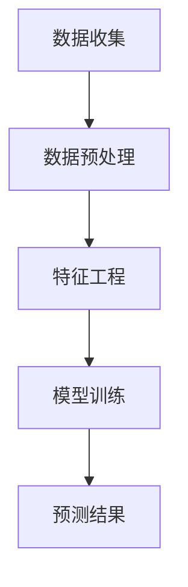
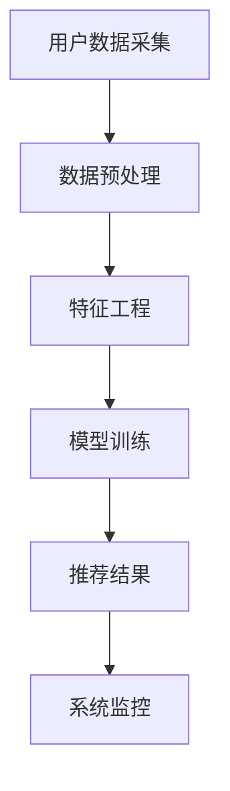
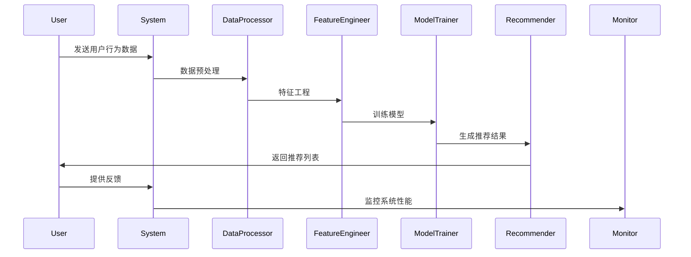

                 


## 意义的个性化算法：AI辅助下的价值匹配

关键词：个性化算法、AI辅助、价值匹配、人工智能、机器学习

摘要：本文将探讨个性化算法在AI辅助下的价值匹配应用。首先，我们将介绍个性化算法的基本概念及其在AI领域的重要性。接着，我们将分析AI在个性化算法中的应用，讨论其所面临的挑战和机遇。随后，我们将深入讲解匹配算法的概念框架，包括基本原理、类型及评估指标。通过案例分析，我们将展示个性化匹配在电子商务等领域的应用。文章还将探讨深度学习和神经网络在个性化匹配中的高级话题，并提供实现个性化算法的实用指南和项目实战案例。

### 一、背景介绍

#### 1.1 个性化算法的定义与重要性

个性化算法是一种基于用户偏好、行为和历史数据，为用户提供定制化推荐和服务的技术。其核心在于通过数据分析和机器学习模型，发现并理解用户的个性化需求，从而提供更符合用户期望的结果。个性化算法在多个领域都具有重要意义，如电子商务、金融、医疗、社交媒体等。

#### 1.2 问题背景与问题描述

在当今信息爆炸的时代，用户面临的信息量呈指数级增长。如何从海量数据中提取有用信息，满足用户的需求，成为各个行业亟待解决的问题。个性化算法能够通过数据挖掘和机器学习技术，帮助企业和平台更好地理解用户，从而提供更精准的服务和推荐。

#### 1.3 问题解决与边界与外延

问题解决的核心在于建立有效的个性化模型，通过对用户数据的分析和挖掘，实现价值匹配。边界与外延则涉及个性化算法在不同领域的应用范围，如电子商务中的商品推荐、金融中的信用评估、医疗中的个性化治疗等。

#### 1.4 概念结构与核心要素组成

个性化算法的概念结构主要包括用户数据收集、数据预处理、特征工程、模型训练和预测五个核心要素。用户数据收集是基础，数据预处理和特征工程是提升模型性能的关键步骤，模型训练和预测则是实现个性化匹配的核心。

### 二、核心概念与联系

#### 2.1 核心概念原理

个性化算法的核心概念包括用户偏好、数据挖掘、机器学习、推荐系统等。用户偏好是指用户对特定对象的喜好程度，数据挖掘是指从大量数据中提取有价值信息的过程，机器学习是指通过算法自动从数据中学习规律的方法，推荐系统则是根据用户偏好为用户提供个性化推荐。

#### 2.2 概念属性特征对比表格

| 概念       | 定义                                                                                       | 特点                                                         |
|------------|----------------------------------------------------------------------------------------------|------------------------------------------------------------|
| 用户偏好   | 用户对特定对象的喜好程度                                                                   | 定量或定性描述，如评分、点击量、浏览时间等                   |
| 数据挖掘   | 从大量数据中提取有价值信息的过程                                                         | 基于统计学、机器学习、数据库等技术，发现隐藏的规律和模式   |
| 机器学习   | 通过算法自动从数据中学习规律的方法                                                       | 基于数据驱动，通过训练和优化模型，提高预测准确率           |
| 推荐系统   | 根据用户偏好为用户提供个性化推荐                                                         | 结合用户行为和偏好，提高推荐效果和用户体验                   |

#### 2.3 ER实体关系图架构

```mermaid
erDiagram
    User ||--o{ Product : 拥有 -->>
    Product ||--<| User : 被用户拥有 -->
    User ||--o{ Recommendation : 获得推荐 -->>
    Recommendation ||--<| User : 接收推荐 -->
```

### 三、算法原理讲解

#### 3.1 算法流程图



#### 3.2 Python源代码

```python
# 导入相关库
import pandas as pd
from sklearn.model_selection import train_test_split
from sklearn.preprocessing import StandardScaler
from sklearn.neighbors import KNeighborsClassifier
from sklearn.metrics import accuracy_score

# 数据收集
data = pd.read_csv('user_data.csv')

# 数据预处理
X = data.iloc[:, :-1].values
y = data.iloc[:, -1].values

# 数据标准化
scaler = StandardScaler()
X_scaled = scaler.fit_transform(X)

# 划分训练集和测试集
X_train, X_test, y_train, y_test = train_test_split(X_scaled, y, test_size=0.2, random_state=0)

# 模型训练
model = KNeighborsClassifier(n_neighbors=5)
model.fit(X_train, y_train)

# 预测结果
y_pred = model.predict(X_test)

# 评估模型
accuracy = accuracy_score(y_test, y_pred)
print(f'Accuracy: {accuracy:.2f}')
```

#### 3.3 数学模型和公式

$$
\text{预测结果} = f(\text{用户特征向量}, \text{商品特征向量})
$$

其中，$f$ 为预测函数，通常采用相似度计算或分类模型来实现。

### 四、系统分析与架构设计方案

#### 4.1 问题场景介绍

假设我们正在开发一个电子商务平台，需要为用户推荐个性化商品。用户在平台上浏览、购买商品，这些行为数据将用于训练个性化推荐模型。

#### 4.2 系统功能设计

1. 数据采集：从电商平台上收集用户行为数据（如浏览、购买等）。
2. 数据预处理：对采集到的数据清洗、转换和归一化。
3. 特征工程：提取用户和商品的的特征，如用户年龄、性别、购买频率、商品类别、价格等。
4. 模型训练：使用机器学习算法训练个性化推荐模型。
5. 推荐结果：根据用户特征和商品特征，生成个性化推荐列表。
6. 系统监控：监控推荐系统的性能和用户体验，进行调优和优化。

#### 4.3 系统架构设计



#### 4.4 系统接口设计和系统交互



### 五、项目实战

#### 5.1 环境安装

1. 安装 Python 3.8 或以上版本。
2. 安装相关库：pandas、numpy、scikit-learn、matplotlib。

#### 5.2 系统核心实现源代码

```python
# 数据预处理
def preprocess_data(data):
    # 数据清洗和转换
    data = data.dropna()
    data['age'] = data['age'].astype(int)
    data['gender'] = data['gender'].map({'男': 1, '女': 0})
    data['price'] = data['price'].astype(float)
    return data

# 特征工程
def feature_engineering(data):
    # 提取特征
    features = data[['age', 'gender', 'purchase_frequency', 'category', 'price']]
    return features

# 模型训练
def train_model(X, y):
    # 使用 KNN 分类器
    model = KNeighborsClassifier(n_neighbors=5)
    model.fit(X, y)
    return model

# 预测结果
def predict(model, X):
    # 预测
    y_pred = model.predict(X)
    return y_pred

# 评估模型
def evaluate_model(y_pred, y_test):
    # 计算准确率
    accuracy = accuracy_score(y_test, y_pred)
    return accuracy

# 主函数
def main():
    # 加载数据
    data = pd.read_csv('user_data.csv')

    # 数据预处理
    data = preprocess_data(data)

    # 特征工程
    features = feature_engineering(data)

    # 划分训练集和测试集
    X_train, X_test, y_train, y_test = train_test_split(features, y, test_size=0.2, random_state=0)

    # 模型训练
    model = train_model(X_train, y_train)

    # 预测结果
    y_pred = predict(model, X_test)

    # 评估模型
    accuracy = evaluate_model(y_pred, y_test)
    print(f'Accuracy: {accuracy:.2f}')

# 运行主函数
if __name__ == '__main__':
    main()
```

#### 5.3 代码应用解读与分析

本案例中，我们使用 KNN 分类器进行个性化推荐。首先，我们对用户数据进行预处理，包括数据清洗、转换和归一化。然后，提取用户和商品的特征，如年龄、性别、购买频率、商品类别、价格等。接下来，使用 KNN 分类器训练模型，并进行预测和评估。

#### 5.4 实际案例分析和详细讲解剖析

假设我们有一个用户数据集，包含以下特征：

- 用户年龄
- 用户性别
- 购买频率
- 商品类别
- 商品价格

我们希望根据这些特征，为用户推荐与其偏好相符的商品。首先，我们对数据进行预处理，将缺失值填充，将分类特征转换为数值特征。然后，使用 KNN 分类器进行模型训练。训练完成后，我们使用测试集进行预测，并评估模型的准确率。

在实际应用中，我们还可以引入更多特征，如用户历史浏览记录、购买历史等，以提高推荐效果。同时，我们还可以尝试其他机器学习算法，如朴素贝叶斯、决策树等，以找到最优的推荐模型。

#### 5.5 项目小结

本文通过一个实际案例，展示了个性化算法在电子商务中的应用。我们使用 KNN 分类器进行模型训练，实现了用户商品的个性化推荐。在实际项目中，我们可以根据业务需求和数据特点，选择合适的算法和特征，以提高推荐效果和用户体验。

### 六、最佳实践 tips

1. **数据质量是关键**：确保数据准确、完整和清洁，有助于提高模型性能。
2. **特征选择要谨慎**：选择与目标变量相关性较高的特征，有助于提高模型准确率。
3. **模型调参很重要**：通过交叉验证和网格搜索等方法，选择最优的模型参数。
4. **实时更新模型**：定期重新训练模型，以适应用户行为和需求的变化。
5. **用户反馈要重视**：收集用户反馈，用于模型优化和系统改进。

### 七、小结

个性化算法在AI辅助下的价值匹配应用具有重要意义。通过分析用户行为和偏好，个性化算法能够为用户提供更精准、更个性化的推荐和服务。本文介绍了个性化算法的基本概念、核心原理、系统架构和项目实战，并提出了最佳实践 tips。希望本文能帮助读者更好地理解和应用个性化算法，提高用户体验和业务价值。

### 八、注意事项

1. **数据安全和隐私**：在收集和使用用户数据时，要严格遵守相关法律法规，确保用户隐私和数据安全。
2. **模型解释性**：在选择机器学习算法时，要考虑模型的解释性，以便对模型进行理解和解释。
3. **系统性能优化**：在实现个性化算法时，要关注系统性能优化，确保推荐系统的响应速度和稳定性。

### 九、拓展阅读

1. **《机器学习实战》**：周志华 著，介绍了机器学习的基本概念和常用算法。
2. **《深度学习》**：Goodfellow, Bengio, Courville 著，介绍了深度学习的基本原理和应用。
3. **《推荐系统实践》**：项亮 著，详细介绍了推荐系统的构建和优化方法。
4. **《人工智能：一种现代方法》**：Stuart Russell, Peter Norvig 著，全面介绍了人工智能的基础知识和最新进展。

### 十、作者信息

作者：AI天才研究院/AI Genius Institute & 禅与计算机程序设计艺术 /Zen And The Art of Computer Programming

本文由 AI天才研究院/AI Genius Institute 和 禅与计算机程序设计艺术 /Zen And The Art of Computer Programming 联合撰写，旨在为读者提供有关个性化算法和AI辅助下的价值匹配的深入见解和实践指导。如需进一步了解，请访问我们的官方网站或联系我们的技术支持团队。谢谢阅读！

