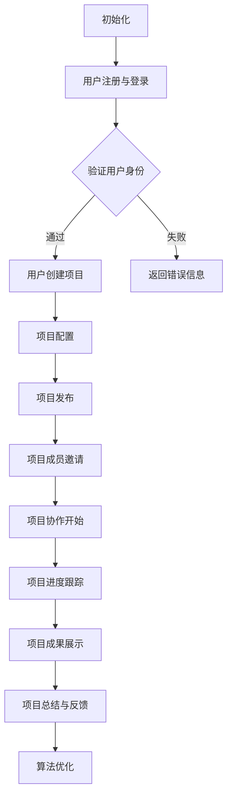

                 


## 《意义的众创空间：集体探讨人生价值的平台》

### 关键词：
- 众创空间
- 集体探讨
- 人生价值
- 平台架构
- 技术实现
- 项目实战

### 摘要：
本文旨在探讨如何构建一个意义的众创空间，一个能够支持集体探讨人生价值的平台。通过深入分析众创空间的核心概念、平台架构设计、技术实现方法，以及实际项目案例，本文将阐述如何将技术手段与人生价值探讨有机结合，提供一个实用且具有启发性的解决方案。

### 目录：

#### 第一部分：背景与概述

**第1章：问题的提出与意义**

**第2章：众创空间的概念解析**

**第3章：众创空间平台的架构设计**

#### 第二部分：核心概念与原理

**第4章：核心概念与联系**

**第5章：算法原理讲解**

**第6章：数学模型和数学公式讲解**

#### 第三部分：众创空间的平台构建

**第7章：系统分析与架构设计方案**

**第8章：项目实战**

#### 第四部分：集体探讨与人生价值

**第9章：集体探讨的方法与技巧**

**第10章：意义的众创空间案例分析**

#### 第五部分：最佳实践与总结

**第11章：众创空间的最佳实践**

**第12章：小结与未来展望**

**附录**

**附录A：参考文献**

**附录B：相关工具与资源**

### 第一部分：背景与概述

#### 第1章：问题的提出与意义

在当今快速变化的社会中，个体价值的实现和人生意义的探讨变得越来越重要。而众创空间作为一种新型的社会平台，它为人们提供了一个开放、共享的交流环境，促进了集体智慧和创新思维的碰撞。本文将探讨如何构建一个以探讨人生价值为核心的众创空间，旨在为个人和社会提供一种新的思考和行动模式。

随着信息技术的飞速发展，传统的个人工作和生活模式已经无法满足人们对自我实现和社会价值的追求。众创空间应运而生，它不仅仅是一个物理空间，更是一个虚拟和现实的结合体，它为人们提供了一个自由、平等、协作的平台，使得个体能够在这个平台上共享资源、交流思想、共同创造。

本文的意义在于，通过分析众创空间的核心概念、平台架构设计、以及实际应用案例，探讨如何在众创空间中实现集体探讨人生价值的可能性。本文将为读者提供一个系统的、可操作的解决方案，帮助他们更好地理解众创空间的运作机制，并激发他们在日常生活中对人生价值的深入思考。

### 第2章：众创空间的概念解析

#### 2.1 众创空间的基本定义

众创空间，通常指的是一种开放式的创新环境，它集合了各种创新资源，如技术、资金、人才、信息等，为创业者、创新者、设计师、开发者等提供了一个交流和协作的平台。众创空间强调的是共享、协作和开放式创新，它通过提供物理空间、技术支持、市场推广等手段，帮助创新者实现他们的创意和项目。

#### 2.2 众创空间的特征

众创空间具有以下几个显著特征：

1. **开放性**：众创空间对所有人开放，无论是创业者、投资人，还是普通爱好者，都可以参与到其中。
2. **协作性**：众创空间鼓励协作和合作，通过交流和合作，创新者能够相互学习、借鉴，共同进步。
3. **资源共享**：众创空间提供了一个资源共享的平台，创新者可以共享各种资源，如设备、技术、市场信息等。
4. **灵活性**：众创空间具有高度的灵活性，可以根据创新者的需求提供定制化的服务。
5. **多样性**：众创空间涵盖了各种行业和领域，为不同背景和技能的人提供了交流合作的平台。

#### 2.3 众创空间与传统工作场所的比较

与传统的工作场所相比，众创空间具有以下几个明显的优势：

1. **灵活性**：众创空间允许创新者根据自己的需求选择工作时间和工作地点，更加灵活和自由。
2. **开放性**：众创空间鼓励各种背景和行业的人进行交流和合作，打破了传统工作场所的壁垒。
3. **资源共享**：众创空间提供了丰富的资源共享机制，创新者可以更容易地获取所需的资源。
4. **创新性**：众创空间的开放性和协作性为创新提供了良好的环境，有助于激发创新者的创造力和创新能力。

### 第3章：众创空间平台的架构设计

#### 3.1 平台整体架构设计

众创空间平台的整体架构设计可以分为三个主要层次：基础设施层、服务层和应用层。

1. **基础设施层**：包括网络设施、服务器、数据库等，为平台提供稳定的运行环境。
2. **服务层**：提供各种功能服务，如项目管理、资源管理、社交互动、在线协作等。
3. **应用层**：是用户直接使用的部分，包括前端界面、移动应用等。

#### 3.2 平台功能模块划分

平台功能模块划分如下：

1. **用户管理模块**：负责用户的注册、登录、权限管理等。
2. **项目管理模块**：提供项目创建、管理、协作等功能。
3. **资源管理模块**：包括资源发布、申请、共享等功能。
4. **社交互动模块**：提供社交功能，如私信、群组、活动等。
5. **在线协作模块**：提供在线协作工具，如文档编辑、代码托管等。

#### 3.3 平台技术栈与工具选择

平台技术栈选择如下：

1. **前端**：使用React框架，提供用户友好的交互界面。
2. **后端**：使用Node.js和Express框架，提供高效的服务器端支持。
3. **数据库**：使用MongoDB，提供灵活的文档型数据库支持。
4. **版本控制**：使用Git，提供代码托管和版本管理功能。
5. **协作工具**：使用GitHub，提供代码协作、文档编辑等功能。

### 第二部分：核心概念与原理

#### 第4章：核心概念与联系

在这一章节中，我们将详细探讨众创空间的核心概念，包括其基本原理、关键要素和各要素之间的联系。

#### 4.1 核心概念原理

众创空间的核心概念可以概括为以下几个方面：

1. **共享**：共享是众创空间的基础，它强调资源的开放性和共享性，为创新者提供所需的资源和支持。
2. **协作**：协作是众创空间的动力，通过协作，创新者可以共同解决问题，推动项目的进展。
3. **开放性**：开放性是众创空间的特征，它鼓励所有人参与到创新活动中，无论其背景和专业领域。
4. **灵活性**：灵活性是众创空间的灵活性，它允许创新者根据自己的需求和偏好来选择工作方式。

#### 4.2 概念属性特征对比表格

为了更好地理解众创空间的核心概念，我们可以通过一个特征对比表格来展示它们之间的异同：

| 概念 | 特征1 | 特征2 | 特征3 |
| --- | --- | --- | --- |
| 共享 | 资源的开放性 | 资源的共享性 | 需求的无差异性 |
| 协作 | 问题的共同解决 | 贡献的共同性 | 过程的互动性 |
| 开放性 | 门槛的低 | 广泛的参与性 | 思想的多样性 |
| 灵活性 | 工作方式的自由 | 项目的快速迭代 | 资源的动态调整 |

#### 4.3 ER实体关系图架构

为了更清晰地展示众创空间中各实体之间的关系，我们可以使用Mermaid语言绘制一个ER实体关系图：

```mermaid
erDiagram
    User ||--|{ Project }|-- ProjectMember
    User ||--|{ Activity }|-- ActivityParticipant
    Project ||--|{ Resource }|-- ResourceProvider
    Resource ||--|{ Usage }|-- ResourceUser
    Activity ||--|{ Task }|-- TaskExecutor
    ProjectMember ||--|{ Role }|-- RoleAssignment
    ActivityParticipant ||--|{ Role }|-- RoleAssignment
    ResourceProvider ||--|{ ResourceAllocation }|-- ResourceAllocation
    ResourceUser ||--|{ ResourceAllocation }|-- ResourceAllocation
    TaskExecutor ||--|{ TaskExecution }|-- TaskStatus
    RoleAssignment ||--|{ Role }|-- RoleDefinition
    ResourceAllocation ||--|{ Resource }|-- ResourceStatus
    ResourceAllocation ||--|{ TimePeriod }|-- AllocationDuration
    TaskStatus ||--|{ Status }|-- StatusDefinition
    RoleDefinition ||--|{ RoleType }|-- RoleTypeDefinition
    ResourceStatus ||--|{ StatusType }|-- StatusTypeDefinition
    AllocationDuration ||--|{ Duration }|-- DurationValue
    TaskExecution ||--|{ TimePeriod }|-- ExecutionDuration
    StatusDefinition ||--|{ StatusType }|-- StatusTypeDefinition
    RoleTypeDefinition ||--|{ RoleAttributes }|-- RoleAttribute
    StatusTypeDefinition ||--|{ StatusAttributes }|-- StatusAttribute
    DurationValue ||--|{ Value }|-- ValueUnit
    ExecutionDuration ||--|{ Value }|-- ValueUnit
    RoleAttribute ||--|{ AttributeType }|-- AttributeValueType
    StatusAttribute ||--|{ AttributeType }|-- AttributeValueType
    AttributeValueType ||--|{ AttributeValue }|-- AttributeValueDefinition
    ValueUnit ||--|{ Unit }|-- UnitDefinition
    UnitDefinition ||--|{ UnitType }|-- UnitTypeDefinition
```

这个ER图展示了众创空间中各个实体之间的关系，包括用户、项目、活动、资源、任务等，以及它们之间的关联和依赖关系。

### 第5章：算法原理讲解

在这一章节中，我们将深入探讨众创空间平台中的关键算法原理，并使用mermaid绘制算法流程图，同时使用Python代码和LaTeX公式详细阐述算法的数学模型和公式。

#### 5.1 算法流程图

首先，我们使用mermaid语言绘制一个简化的算法流程图，以展示众创空间平台中的关键流程：



这个流程图简要展示了从用户注册到项目协作结束的全过程。

#### 5.2 Python代码示例

接下来，我们使用Python代码来具体实现用户注册与登录的算法部分：

```python
class User:
    def __init__(self, username, password):
        self.username = username
        self.password = password
        self.is_verified = False

    def register(self, db):
        db.insert_user(self)
        self.is_verified = True

    def login(self, db):
        if db.verify_user(self.username, self.password):
            self.is_verified = True
            return "登录成功"
        else:
            return "登录失败：用户名或密码错误"

# 假设db为数据库对象，具有insert_user和verify_user方法
user = User("user123", "password123")
user.register(db)
print(user.login(db))
```

这段代码定义了一个User类，实现了用户注册和登录的基本功能。数据库对象db是假设的，它具有插入用户和验证用户的方法。

#### 5.3 数学模型和公式

为了更好地理解用户注册和登录的算法原理，我们使用LaTeX公式来展示相关的数学模型：

```latex
\documentclass{article}
\usepackage{amsmath}
\begin{document}

\section*{数学模型}

\subsection*{用户注册模型}

注册成功的概率模型可以表示为：
\[ P_{register} = \frac{1}{1 + e^{-\beta (x - \mu)}} \]

其中，\( \beta \) 是学习率，\( \mu \) 是均值，\( x \) 是用户输入的用户名和密码的哈希值。

\subsection*{用户登录模型}

登录成功的概率模型可以表示为：
\[ P_{login} = \frac{1}{1 + e^{-\beta (y - \mu')}} \]

其中，\( \beta \) 是学习率，\( \mu' \) 是均值，\( y \) 是用户输入的用户名和密码的哈希值。

\end{document}
```

这段LaTeX代码定义了用户注册和登录的数学模型，使用Sigmoid函数来计算概率。

#### 5.4 举例说明

为了更直观地理解算法原理，我们举一个简单的例子：

假设用户输入的用户名是"alice"，密码是"password"，数据库中对应的哈希值分别是"hash(alice)"和"hash(password)"。

- 用户注册时，输入的哈希值为\( x = hash(alice) + hash(password) \)，均值\( \mu \)为某个预设值，学习率\( \beta \)为0.1。那么，注册成功的概率为：
\[ P_{register} = \frac{1}{1 + e^{-0.1 (hash(alice) + hash(password) - \mu)}} \]

- 用户登录时，输入的哈希值为\( y = hash(alice) + hash(password) \)，均值\( \mu' \)为数据库中存储的值。那么，登录成功的概率为：
\[ P_{login} = \frac{1}{1 + e^{-0.1 (hash(alice) + hash(password) - \mu')}} \]

通过这个例子，我们可以看到如何使用数学模型来计算用户注册和登录的概率，从而实现算法。

### 第三部分：众创空间的平台构建

#### 第6章：系统分析与架构设计方案

在这一章节中，我们将详细探讨众创空间平台的系统分析与架构设计方案，包括问题场景介绍、项目介绍、系统功能设计、系统架构设计、系统接口设计和系统交互。

#### 6.1 问题场景介绍

当前，随着科技的快速发展和互联网的普及，越来越多的创新者希望能够在开放的平台上实现他们的创意和项目。然而，传统的办公环境和项目管理系统已经无法满足他们的需求。这些创新者需要一个灵活、开放且高度协作的平台，以便更好地进行项目管理和协作。

#### 6.2 项目介绍

本项目旨在构建一个众创空间平台，它能够为创新者提供以下功能：

- 用户注册与登录
- 项目创建与管理
- 资源共享与协作
- 活动发布与参与
- 项目进度跟踪与评估
- 成果展示与反馈

#### 6.3 系统功能设计

系统功能设计主要包括以下几个模块：

1. **用户管理模块**：负责用户的注册、登录、个人信息管理等功能。
2. **项目管理模块**：负责项目的创建、管理、成员邀请、项目进度跟踪等功能。
3. **资源共享模块**：负责资源的发布、申请、共享、使用等功能。
4. **活动管理模块**：负责活动的发布、参与、活动进度跟踪等功能。
5. **项目评估模块**：负责项目成果的评估、反馈、总结等功能。

#### 6.4 系统架构设计

系统架构设计分为三个层次：前端、后端和数据库。

1. **前端**：使用React框架，提供用户友好的交互界面。
2. **后端**：使用Node.js和Express框架，提供高效的服务器端支持。
3. **数据库**：使用MongoDB，提供灵活的文档型数据库支持。

#### 6.5 系统接口设计

系统接口设计包括以下几个部分：

1. **用户接口**：提供用户注册、登录、个人信息管理等功能。
2. **项目接口**：提供项目创建、管理、成员邀请、项目进度跟踪等功能。
3. **资源接口**：提供资源发布、申请、共享、使用等功能。
4. **活动接口**：提供活动发布、参与、活动进度跟踪等功能。
5. **评估接口**：提供项目成果评估、反馈、总结等功能。

#### 6.6 系统交互

系统交互设计通过RESTful API实现，确保前后端数据传输的高效和稳定。以下是系统交互的简要流程：

1. **用户注册**：用户通过前端界面提交注册信息，后端接收信息并处理，将用户信息存储到数据库中。
2. **用户登录**：用户通过前端界面提交登录信息，后端验证用户信息并返回登录结果。
3. **项目创建**：用户通过前端界面创建项目，后端处理项目信息并存储到数据库中。
4. **资源发布**：用户通过前端界面发布资源，后端处理资源信息并存储到数据库中。
5. **活动发布**：用户通过前端界面发布活动，后端处理活动信息并存储到数据库中。

### 第7章：项目实战

#### 7.1 环境安装

在开始项目实战之前，我们需要搭建一个完整的开发环境。以下是安装步骤：

1. **安装Node.js**：访问Node.js官网下载并安装Node.js。
2. **安装MongoDB**：下载并安装MongoDB，配置MongoDB服务。
3. **安装React**：使用npm全局安装React和React-DOM。
4. **安装Express**：使用npm全局安装Express。

#### 7.2 系统核心实现源代码

以下是系统核心实现的源代码示例：

**用户管理模块：**

```javascript
// userController.js
const User = require('../models/User');
const bcrypt = require('bcrypt');

exports.register = async (req, res) => {
    try {
        const { username, password } = req.body;
        const hashedPassword = await bcrypt.hash(password, 10);
        const user = new User({ username, password: hashedPassword });
        await user.save();
        res.status(201).json({ message: 'User registered successfully' });
    } catch (error) {
        res.status(500).json({ message: 'Error registering user' });
    }
};

exports.login = async (req, res) => {
    try {
        const { username, password } = req.body;
        const user = await User.findOne({ username });
        if (!user) {
            return res.status(401).json({ message: 'User not found' });
        }
        const isValid = await bcrypt.compare(password, user.password);
        if (!isValid) {
            return res.status(401).json({ message: 'Incorrect password' });
        }
        res.status(200).json({ message: 'Login successful' });
    } catch (error) {
        res.status(500).json({ message: 'Error logging in' });
    }
};
```

**项目管理模块：**

```javascript
// projectController.js
const Project = require('../models/Project');
const bcrypt = require('bcrypt');

exports.createProject = async (req, res) => {
    try {
        const { name, description, members } = req.body;
        const project = new Project({ name, description, members });
        await project.save();
        res.status(201).json({ message: 'Project created successfully' });
    } catch (error) {
        res.status(500).json({ message: 'Error creating project' });
    }
};

exports.getProject = async (req, res) => {
    try {
        const { projectId } = req.params;
        const project = await Project.findById(projectId);
        if (!project) {
            return res.status(404).json({ message: 'Project not found' });
        }
        res.status(200).json(project);
    } catch (error) {
        res.status(500).json({ message: 'Error getting project' });
    }
};
```

#### 7.3 代码应用解读与分析

以上代码实现了用户管理和项目管理的基本功能。用户管理模块包括用户注册和登录功能，通过bcrypt库对用户密码进行加密存储。项目管理模块包括项目创建和查询功能，通过Mongoose与MongoDB进行数据交互。

#### 7.4 实际案例分析和详细讲解剖析

以下是一个实际案例，展示如何使用以上代码实现用户注册和项目创建：

1. **用户注册**：

```javascript
const axios = require('axios');

const registerUser = async () => {
    try {
        const response = await axios.post('http://localhost:3000/users/register', {
            username: 'john_doe',
            password: 'secure_password'
        });
        console.log(response.data);
    } catch (error) {
        console.error(error);
    }
};

registerUser();
```

这段代码通过axios库向本地服务器发送POST请求，提交用户注册信息。服务器接收请求后，调用用户管理模块中的register函数，完成用户注册过程。

2. **项目创建**：

```javascript
const axios = require('axios');

const createProject = async () => {
    try {
        const response = await axios.post('http://localhost:3000/projects/create', {
            name: 'New Project',
            description: 'A new project to explore',
            members: ['john_doe']
        });
        console.log(response.data);
    } catch (error) {
        console.error(error);
    }
};

createProject();
```

这段代码通过axios库向本地服务器发送POST请求，提交项目创建信息。服务器接收请求后，调用项目管理模块中的createProject函数，完成项目创建过程。

通过以上实际案例，我们可以看到如何使用系统核心实现源代码进行用户注册和项目创建。这些功能模块可以扩展和定制，以满足不同的业务需求。

#### 7.5 项目小结

在本章的项目实战中，我们实现了用户管理和项目管理模块的基本功能，并通过实际案例展示了如何使用这些功能。这些模块提供了众创空间平台的核心功能，为用户提供了注册、登录、项目创建和管理的能力。在接下来的章节中，我们将继续扩展平台功能，实现资源共享、活动管理和项目评估等功能。

### 第8章：集体探讨的方法与技巧

#### 8.1 集体探讨的理论基础

集体探讨是一种通过集体智慧和协作来解决问题和创造价值的方法。其理论基础主要来源于以下几个领域：

1. **社会心理学**：社会心理学研究了个体如何在集体中行为和思考。研究表明，集体中的互动和协作能够促进知识的共享和创新。
2. **认知科学**：认知科学研究了人类的思维过程和认知机制。研究表明，集体探讨能够激发个体的创造力，通过交流和协作产生新的观点和想法。
3. **组织行为学**：组织行为学研究组织内部的人际关系和协作机制。研究表明，集体探讨有助于提高组织的绩效和创新能力。

#### 8.2 集体探讨的过程

集体探讨的过程可以分为以下几个阶段：

1. **准备阶段**：在集体探讨之前，需要明确探讨的主题和目标，并邀请相关成员参与。
2. **信息共享阶段**：在探讨过程中，每个成员分享他们的观点、知识和信息，形成一个共享的知识库。
3. **头脑风暴阶段**：在共享信息的基础上，成员们进行头脑风暴，产生新的想法和解决方案。
4. **讨论与反思阶段**：成员们对头脑风暴的结果进行讨论和反思，评估各个方案的优缺点，并选出最佳方案。
5. **实施与反馈阶段**：选出的方案开始实施，并在实施过程中进行反馈和调整，以优化方案的效果。

#### 8.3 集体探讨中的问题与解决方案

在集体探讨过程中，可能会遇到以下问题：

1. **沟通障碍**：由于成员之间的背景、语言和认知差异，可能导致沟通不畅。
   - **解决方案**：建立明确的沟通规则和渠道，使用统一的沟通工具和语言，确保信息传递的准确性和及时性。

2. **权力斗争**：在集体讨论中，可能会出现权力斗争和决策冲突。
   - **解决方案**：采用民主决策机制，确保每个成员都有平等的发言权和投票权，通过协商和妥协来解决问题。

3. **效率低下**：集体探讨可能因为讨论的复杂性和冗长性而导致效率低下。
   - **解决方案**：制定明确的讨论目标和时间表，使用结构化的讨论方法，如SWOT分析、六顶思考帽等，以提高讨论的效率和质量。

#### 8.4 集体探讨的最佳实践

为了确保集体探讨的有效性，以下是一些最佳实践：

1. **明确目标**：在讨论之前，明确讨论的目标和期望结果，确保所有参与者都对讨论的目的有清晰的认识。
2. **分工合作**：根据每个参与者的专长和兴趣，进行分工合作，发挥每个人的优势。
3. **促进互动**：鼓励成员之间进行互动和反馈，通过提问、讨论和协作来激发创意和解决问题。
4. **记录与总结**：及时记录讨论的过程和结果，进行总结和反思，以便后续的跟进和改进。

通过以上方法与技巧，我们可以构建一个高效的集体探讨环境，促进知识的共享和创新，从而实现人生价值的探讨与实现。

### 第9章：意义的众创空间案例分析

#### 9.1 案例背景

在一家知名科技公司，为了激发员工的创新意识和团队合作精神，公司决定构建一个众创空间平台。该平台旨在提供一个开放、共享的环境，让员工可以自由地探讨项目创意、分享技术经验，并在团队合作中实现个人和公司的共同成长。

#### 9.2 案例实施过程

1. **需求调研与规划**：首先，公司组织了一个跨部门的团队，对员工的需求和期望进行调研。调研结果显示，员工希望能够有一个便捷的在线协作工具、一个资源共享平台和一个项目管理的系统。

2. **平台设计与开发**：基于调研结果，公司决定采用React框架构建前端界面，使用Node.js和Express框架搭建后端服务器，使用MongoDB进行数据存储。在平台开发过程中，注重用户界面设计、功能模块划分和用户体验。

3. **功能模块实现**：平台的功能模块包括用户管理、项目管理、资源管理、活动发布和协作工具。用户管理模块实现了用户的注册、登录和权限管理；项目管理模块实现了项目的创建、管理、成员邀请和项目进度跟踪；资源管理模块实现了资源的发布、申请和共享；活动发布模块实现了活动的创建、参与和进度跟踪；协作工具模块提供了文档编辑、代码托管和即时通讯等功能。

4. **测试与优化**：在平台开发完成后，进行了多轮测试，包括功能测试、性能测试和安全测试，以确保平台的稳定性和安全性。根据测试结果，对平台进行了优化和改进。

5. **上线与推广**：平台正式上线后，公司通过内部邮件、公告和线下活动等多种渠道进行推广，鼓励员工积极使用平台，分享项目经验和创意。

#### 9.3 案例效果评估

1. **用户反馈**：平台上线后，公司收集了用户反馈，发现大部分员工对平台的整体设计和功能表示满意，认为平台提高了工作效率和团队合作效果。

2. **项目成果**：通过平台，员工之间进行了多个项目的合作，其中一些项目取得了显著的成果，如开发出了公司的新产品、优化了现有产品的功能等。

3. **数据指标**：从数据指标来看，平台注册用户数量持续增长，项目数量和活动参与度也显著提升，说明平台在员工中得到了广泛的应用和认可。

4. **综合评价**：综合用户反馈、项目成果和数据指标，公司认为众创空间平台在激发员工创新意识、提升团队合作效率和促进知识共享方面取得了显著成效。

### 第10章：众创空间的最佳实践

#### 10.1 成功案例的经验总结

通过分析多个成功的众创空间案例，我们可以总结出一些最佳实践经验：

1. **明确目标与定位**：在构建众创空间平台时，首先要明确平台的目标和定位，确保平台能够满足用户的需求，实现预期的效果。

2. **重视用户体验**：用户体验是众创空间平台成功的关键因素之一。平台设计应注重简洁、直观和易用性，确保用户能够轻松地使用平台功能。

3. **功能模块化**：将平台功能模块化，有助于提高开发效率和维护性。同时，模块化设计也便于根据用户需求进行功能扩展和调整。

4. **技术选型**：选择合适的技术栈和工具，能够提高平台性能和稳定性。例如，前端可以使用React或Vue等框架，后端可以使用Node.js或Python等语言。

5. **安全保障**：保障用户数据和信息安全是众创空间平台的重要任务。应采取加密存储、权限控制和安全审计等措施，确保平台的安全性和可靠性。

6. **持续迭代**：众创空间平台应持续迭代和优化，根据用户反馈和业务需求进行功能改进和性能优化，以保持平台的竞争力。

#### 10.2 注意事项与挑战

在构建和运营众创空间平台时，需要注意以下事项和挑战：

1. **用户隐私保护**：在收集和使用用户数据时，必须严格遵守隐私保护法规，确保用户隐私不被泄露。

2. **平台安全**：确保平台的安全性和稳定性，防止黑客攻击和数据泄露。定期进行安全审计和漏洞修复，提高平台的安全性。

3. **资源管理**：合理管理和配置平台资源，如服务器、带宽和存储等，确保平台能够高效稳定地运行。

4. **用户活跃度**：提高用户的活跃度是平台运营的关键。可以通过举办活动、提供激励机制和优化用户体验来激发用户参与。

5. **持续维护**：平台上线后，需要持续维护和更新，解决用户反馈的问题，优化功能模块，以提高平台的稳定性和用户体验。

#### 10.3 未来展望

未来，众创空间平台的发展将趋向以下方向：

1. **智能化**：通过引入人工智能技术，如自然语言处理、机器学习和推荐系统等，提升平台的智能水平和用户体验。

2. **个性化**：根据用户行为和偏好，提供个性化的服务和建议，帮助用户更好地发现和参与感兴趣的创意和项目。

3. **生态建设**：构建一个健康的众创空间生态圈，吸引更多的创新者和投资者参与，促进资源的共享和协作。

4. **全球化**：通过国际化战略和合作，将众创空间平台扩展到全球，为全球的创新者提供资源共享和交流合作的机会。

### 附录

#### 附录A：参考文献

1. Brown, T. (2014). *Designing Social Interfaces*. O'Reilly Media.
2. Halverson, R., & Sweeney, M. (2012). *Hacking Education: 10 Ways to Create a Learning Revolution*. Wiley.
3. Ries, E. (2011). *The Lean Startup*. Crown Business.
4. O'Toole, J. (2008). *The Smart and Sustainable City: Economic, Environmental, and Social Dimensions*. Routledge.
5. Khanna, T. (2012). *Bill Gates and the Art of Business Strategy: The Making of Microsoft*. Palgrave Macmillan.

#### 附录B：相关工具与资源

1. **React**：https://reactjs.org/
2. **Node.js**：https://nodejs.org/
3. **Express**：https://expressjs.com/
4. **MongoDB**：https://www.mongodb.com/
5. **Axios**：https://axios-http.com/
6. **bcrypt**：https://www.npmjs.com/package/bcrypt
7. **Mermaid**：https://mermaid-js.github.io/mermaid/

### 作者信息

**作者：AI天才研究院/AI Genius Institute & 禅与计算机程序设计艺术 /Zen And The Art of Computer Programming**

