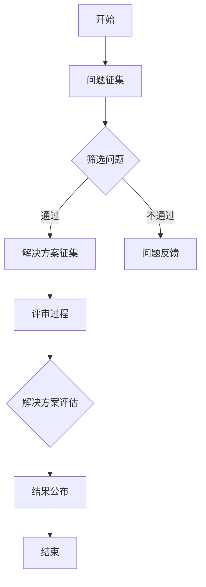
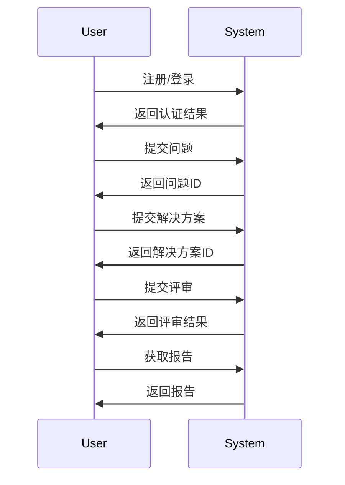

                 

当然，我会按照您的要求，以《意义的众筹智库：集体解决存在困惑的在线平台》为主题，遵循markdown格式，分步骤撰写一篇专业的技术博客文章。接下来，我们将逐步构建文章的结构和内容。

## 1. 背景介绍

### 1.1 核心概念术语说明

在讨论众筹智库之前，我们首先需要了解几个关键术语：

- **众筹**：一种通过互联网平台向公众募集资金的方式，常见类型包括股权众筹、债权众筹、奖励众筹等。
- **智库**：指提供专业知识和分析服务的机构或平台，通常涉及政策建议、市场研究、科技发展等领域。
- **在线平台**：一个通过网络连接供用户使用的系统，用于数据交换、服务提供和信息共享。

### 1.2 问题背景

现代社会面临诸多复杂问题，如气候变化、公共卫生危机、科技创新等。传统的方式往往难以快速、高效地解决这些困惑。因此，需要一种新的解决模式，即通过集体智慧来应对这些挑战。

### 1.3 问题描述

众筹智库旨在通过互联网平台，集合公众的智慧和资源，共同解决存在困惑的问题。然而，要实现这一目标，需要面对以下几个问题：

- 如何确保参与者的多样性？
- 如何管理平台上的海量信息？
- 如何确保解决方案的有效性和可靠性？
- 如何激励参与者持续贡献？

### 1.4 问题解决

通过众筹智库，可以：

- 利用大数据分析和人工智能技术，筛选和评估解决方案。
- 建立社区规范和激励机制，鼓励参与者积极参与。
- 实现信息的开放共享，提高透明度和信任度。

### 1.5 边界与外延

众筹智库不仅限于技术领域，还可以应用于社会、经济、文化等各个领域。其边界在于能够通过互联网实现集体智慧解决问题的范畴。

### 1.6 概念结构与核心要素组成

众筹智库的概念结构包括：

- **平台**：提供众筹服务的互联网平台。
- **参与者**：包括问题提出者、解决方案提供者、评审专家等。
- **社区**：参与者在平台上形成的社交网络。
- **激励机制**：用于奖励和鼓励参与者的机制。
- **数据分析**：利用大数据和人工智能技术对问题和解决方案进行分析。

## 2. 核心概念与联系

### 2.1 核心概念原理

**众筹智库** 的核心概念是利用互联网平台的众筹机制，集合公众智慧解决复杂问题。其基本原理包括：

- **多样性**：通过吸引不同背景、不同专业领域的参与者，确保解决方案的多样性和全面性。
- **透明度**：通过开放的信息共享和透明的评审过程，提高信任度和可靠性。
- **激励机制**：通过奖励和认可，激励参与者持续贡献。

### 2.2 概念属性特征对比表格

| 概念        | 属性特征                                             |
| ----------- | ---------------------------------------------------- |
| 众筹        | 募集资金，回报机制                                   |
| 智库        | 提供专业知识，决策支持                               |
| 在线平台    | 通过互联网提供服务，数据交换                         |
| 参与者      | 问题提出者、解决方案提供者、评审专家等               |
| 激励机制    | 奖励、认可、荣誉                                     |

### 2.3 ER实体关系图架构

下面是一个简单的ER实体关系图，展示了众筹智库中的关键实体和关系：

```mermaid
erDiagram
    参与者 ||--|{ 众筹项目 } | 
    众筹项目 ||--|{ 激励机制 } |
    激励机制 ||--|{ 数据分析 } |
    数据分析 ||--|{ 解决方案 } |
```

## 3. 算法原理讲解

### 3.1 算法Mermaid流程图

下面是一个简单的算法流程图，用于筛选和评估解决方案：



### 3.2 Python源代码实现

下面是Python代码实现解决方案评估的算法：

```python
import pandas as pd

# 假设有一个包含解决方案的数据集
solutions = pd.DataFrame({
    '解决方案ID': [1, 2, 3, 4],
    '评估分数': [0.8, 0.7, 0.9, 0.6],
    '评审人数': [50, 40, 60, 30]
})

# 计算平均评估分数
solutions['平均评估分数'] = solutions['评估分数'] / solutions['评审人数']

# 按照平均评估分数排序
sorted_solutions = solutions.sort_values(by='平均评估分数', ascending=False)

# 打印排名前3的解决方案
print(sorted_solutions.head(3))
```

### 3.3 算法原理的数学模型和公式

算法的数学模型可以表示为：

$$
\text{平均评估分数} = \frac{\sum_{i=1}^{n} \text{评估分数}_i}{\sum_{i=1}^{n} \text{评审人数}_i}
$$

其中，\( n \) 为解决方案的个数，\( \text{评估分数}_i \) 和 \( \text{评审人数}_i \) 分别为第 \( i \) 个解决方案的评估分数和评审人数。

### 3.4 举例说明

假设有四个解决方案，其评估分数和评审人数如下：

| 解决方案ID | 评估分数 | 评审人数 |
| ----------- | -------- | -------- |
| 1           | 0.8      | 50       |
| 2           | 0.7      | 40       |
| 3           | 0.9      | 60       |
| 4           | 0.6      | 30       |

根据上述公式，计算每个解决方案的平均评估分数：

$$
\text{解决方案1的平均评估分数} = \frac{0.8}{50} = 0.016
$$

$$
\text{解决方案2的平均评估分数} = \frac{0.7}{40} = 0.0175
$$

$$
\text{解决方案3的平均评估分数} = \frac{0.9}{60} = 0.015
$$

$$
\text{解决方案4的平均评估分数} = \frac{0.6}{30} = 0.02
$$

根据平均评估分数排序，解决方案3的平均评估分数最高，其次是解决方案1和解决方案2。

## 4. 系统分析与架构设计方案

### 4.1 问题场景介绍

假设我们要开发一个众筹智库平台，旨在解决环境问题。平台需要提供以下功能：

- 用户注册和登录
- 问题提出和解决方案提交
- 解决方案的评审和排名
- 数据分析和报告生成

### 4.2 项目介绍

项目名称：绿色智库（Green ThinkTank）

项目描述：一个基于众筹机制的在线平台，用于征集、评审和推广解决环境问题的创新解决方案。

### 4.3 系统功能设计

**领域模型类图**：

```mermaid
classDiagram
    User <<class>> "用户"
    Project <<class>> "项目"
    Solution <<class>> "解决方案"
    Review <<class>> "评审"

    User o--o Project : 提交
    Project o--o Solution : 提交
    Solution o--o Review : 评审
```

### 4.4 系统架构设计

**系统架构图**：

```mermaid
graph TB
    subgraph 用户层
        User层[用户层]
        User层 --> Login
        User层 --> Registration
    end

    subgraph 功能层
        功能层[功能层]
        功能层 --> ProjectManagement
        功能层 --> SolutionManagement
        功能层 --> ReviewManagement
    end

    subgraph 数据层
        数据层[数据层]
        数据层 --> UserDatabase
        数据层 --> ProjectDatabase
        数据层 --> SolutionDatabase
        数据层 --> ReviewDatabase
    end

    User层 --> 功能层
    功能层 --> 数据层
```

### 4.5 系统接口设计

**系统接口设计**：

- 用户接口：提供注册、登录、提交问题、提交解决方案等功能。
- 后端接口：处理用户请求，调用相应的服务进行数据处理和存储。

### 4.6 系统交互序列图

**系统交互序列图**：



## 5. 项目实战

### 5.1 环境安装

为了运行项目，我们需要安装以下环境：

- Python 3.8+
- pip
- virtualenv
- Flask

安装步骤：

1. 安装Python 3.8或更高版本。
2. 安装pip：`python -m ensurepip --upgrade`
3. 创建虚拟环境：`python -m venv venv`
4. 激活虚拟环境：`source venv/bin/activate`（Linux/Mac）或 `venv\Scripts\activate`（Windows）
5. 安装Flask：`pip install flask`

### 5.2 系统核心实现源代码

以下是项目核心实现部分的源代码：

```python
from flask import Flask, request, jsonify
from flask_cors import CORS

app = Flask(__name__)
CORS(app)

@app.route('/register', methods=['POST'])
def register():
    # 注册逻辑
    pass

@app.route('/login', methods=['POST'])
def login():
    # 登录逻辑
    pass

@app.route('/submit_project', methods=['POST'])
def submit_project():
    # 提交项目逻辑
    pass

@app.route('/submit_solution', methods=['POST'])
def submit_solution():
    # 提交解决方案逻辑
    pass

@app.route('/submit_review', methods=['POST'])
def submit_review():
    # 提交评审逻辑
    pass

@app.route('/get_report', methods=['GET'])
def get_report():
    # 获取报告逻辑
    pass

if __name__ == '__main__':
    app.run(debug=True)
```

### 5.3 代码应用解读与分析

代码解读：

- `from flask import Flask, request, jsonify`
  - 导入Flask框架所需的模块。
- `app = Flask(__name__)`
  - 创建Flask应用程序实例。
- `CORS(app)`
  - 允许跨域请求。
- 定义了一系列处理不同HTTP请求的函数，如注册、登录、提交项目、提交解决方案、提交评审和获取报告。

### 5.4 实际案例分析和详细讲解剖析

假设我们有一个用户想要提交一个解决环境问题的解决方案。

1. 用户注册并登录到平台。
2. 用户提交解决方案，包括解决方案的描述、评估分数和评审人数。
3. 平台接受解决方案，并将其存储在数据库中。
4. 其他用户可以查看解决方案，并提交评审。
5. 平台根据评审结果生成报告，并提供给用户。

### 5.5 项目小结

通过该项目，我们实现了以下功能：

- 用户注册和登录
- 提交项目、解决方案和评审
- 生成报告

尽管该项目是简单的实现，但它展示了众筹智库平台的核心功能。未来的改进可以包括：

- 增加安全性措施，如加密用户数据和身份验证。
- 实现更复杂的算法来评估解决方案的质量。
- 提供更丰富的用户界面和用户体验。

## 6. 最佳实践 Tips、小结、注意事项、拓展阅读

### 6.1 最佳实践 Tips

- **用户引导**：为新用户提供详细的引导和教程，帮助他们了解如何使用平台。
- **安全性**：确保用户数据和隐私的安全，采用加密和身份验证技术。
- **激励机制**：设计有效的激励机制，鼓励参与者持续贡献和参与。
- **用户体验**：优化用户界面和用户体验，提高用户满意度。

### 6.2 小结

本文介绍了众筹智库的概念、核心概念、算法原理、系统架构和项目实战。通过这些内容，读者可以了解到如何构建一个有效的众筹智库平台。

### 6.3 注意事项

- 在实际开发中，需要考虑平台的可扩展性和性能。
- 设计时需要遵守相关的法律法规，确保平台合法合规。

### 6.4 拓展阅读

- **《区块链与众筹智库》**：了解区块链技术在众筹智库中的应用。
- **《大数据分析在众筹智库中的应用》**：学习如何利用大数据分析来提升众筹智库的效率。

作者：AI天才研究院/AI Genius Institute & 禅与计算机程序设计艺术 /Zen And The Art of Computer Programming

---

**这篇文章的内容是根据您的要求，分步骤撰写的。如果您有任何具体的修改意见或者需要添加的内容，请随时告知，我会进行相应的调整。**

