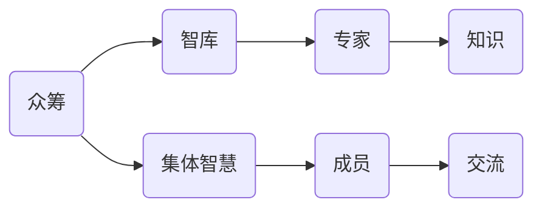

                 


# 引言与背景

## 1.1 问题背景

### 1.1.1 存在困惑的类型

在当今信息化社会中，人们在各个领域都可能遇到困惑。这种困惑可以分为以下几种类型：

1. **个人困惑**：如职业规划、生活困扰等，这种困惑往往源自个体的主观意识和外部环境的变化。
2. **行业困惑**：如新兴技术带来的职业转型、行业发展趋势判断等，这类困惑涉及到整个行业或领域。
3. **社会困惑**：如公共政策的制定、社会问题的解决等，这类困惑涉及到整个社会体系的运行。

### 1.1.2 个体与集体的困惑解决需求

个体在面对困惑时，通常寻求以下几种解决途径：

1. **自学**：通过阅读书籍、观看视频、参加线上课程等途径自学。
2. **请教专家**：直接向行业内的专业人士寻求帮助。
3. **社交互动**：通过与朋友、同事等社交互动获取信息。

然而，这些途径都有一定的局限性。自学可能效率不高，请教专家可能成本较高，社交互动则受限于人际网络。

集体智慧则能够弥补这些不足。通过众筹智库，人们可以借助集体的力量共同解决困惑，具体需求如下：

1. **信息共享**：借助平台实现信息的快速传递和共享。
2. **智慧碰撞**：通过不同背景、专业的人士交流，产生新的观点和解决方案。
3. **决策参考**：集体智慧的汇总可以为个体提供有价值的决策参考。

### 1.1.3 众筹智库的概念提出

基于上述背景和需求，我们提出众筹智库这一概念。众筹智库是一个基于集体智慧的解决困惑的平台，通过众筹的方式汇集资源，共同探讨、分析和解决各类困惑。

## 1.2 问题描述

### 1.2.1 困惑的现状与挑战

目前，个体和集体在解决困惑方面存在以下问题：

1. **信息不对称**：个体获取的信息可能不全面，导致困惑难以解决。
2. **知识分散**：尽管互联网上有大量信息，但知识分散在不同平台和个体中，难以整合。
3. **专业壁垒**：某些领域需要专业知识，个体可能难以理解和应用。

### 1.2.2 个体困惑的解决局限性

个体解决困惑的局限性主要体现在：

1. **时间成本**：个体需要花费大量时间来学习、研究和交流。
2. **知识深度**：个体可能无法深入理解复杂问题。
3. **视野局限**：个体受限于自身的知识和经验，难以从全局视角看待问题。

### 1.2.3 集体智慧的重要性

集体智慧能够弥补个体困惑解决中的不足，原因如下：

1. **信息整合**：集体智慧可以整合分散的信息，提供更全面的解决方案。
2. **知识共享**：集体智慧可以共享专业知识，降低个体的学习成本。
3. **视野拓展**：集体智慧可以为个体提供不同的视角，帮助个体更好地理解问题。

## 1.3 问题解决

### 1.3.1 传统解决方案的局限

传统的解决方案，如自学、请教专家、社交互动等，存在以下局限：

1. **效率低**：个体需要花费大量时间来获取和处理信息。
2. **成本高**：请教专家可能需要支付高昂的费用。
3. **受限于人际网络**：社交互动的范围和深度有限。

### 1.3.2 众筹智库的作用

众筹智库能够解决传统解决方案的不足，其作用主要体现在：

1. **信息快速传递**：通过平台，信息可以快速传递和共享。
2. **智慧碰撞**：不同背景和专业的个体可以在平台上交流，碰撞出新的观点。
3. **资源整合**：通过众筹，可以整合分散的资源，共同解决问题。

### 1.3.3 众筹智库的实现路径

要实现众筹智库，需要以下步骤：

1. **平台搭建**：搭建一个集信息共享、交流互动、资源整合于一体的平台。
2. **规则制定**：制定合理的规则，确保平台的正常运行和公平性。
3. **激励机制**：设计激励机制，鼓励个体和集体参与。
4. **持续运营**：通过持续运营，不断优化平台，提高服务质量。

## 1.4 边界与外延

### 1.4.1 众筹智库的范围

众筹智库可以应用于各个领域，如：

1. **科技领域**：如人工智能、区块链等前沿技术的探讨。
2. **商业领域**：如商业模式创新、市场营销策略等。
3. **社会领域**：如公共政策制定、社会问题解决等。

### 1.4.2 众筹智库的功能与角色

众筹智库的功能和角色包括：

1. **信息共享中心**：汇集各类信息，提供决策参考。
2. **智慧碰撞平台**：促进不同背景和专业的人士交流。
3. **资源整合平台**：通过众筹，整合分散的资源。

### 1.4.3 众筹智库的核心要素

众筹智库的核心要素包括：

1. **平台**：实现信息共享、交流互动和资源整合。
2. **规则**：确保平台的公平性和正常运行。
3. **激励**：鼓励个体和集体参与，提高平台活跃度。
4. **持续运营**：通过不断优化，提高平台服务质量。

## 1.5 本章小结

本章介绍了众筹智库的背景和意义，分析了个体和集体解决困惑的现状与挑战，提出了众筹智库作为解决方案，并探讨了其实现路径和核心要素。接下来，我们将进一步探讨众筹智库的核心概念和原理。

## 核心概念与联系

### 2.1 核心概念介绍

在本节中，我们将介绍众筹智库中的几个核心概念：

1. **众筹**：一种融资方式，通过公众参与筹集资金，支持某个项目或想法。
2. **智库**：一种集合了专家智慧、知识和资源的组织，用于提供决策参考和解决方案。
3. **集体智慧**：指通过集体成员的交流和协作，共同产生和整合信息、知识和观点。

### 2.2 概念属性对比表

以下是一个简单的概念属性对比表，用于展示众筹、智库和集体智慧的区别和联系：

| 概念   | 定义                                                         | 主要属性                                     | 关联性                   |
| ------ | ------------------------------------------------------------ | ------------------------------------------ | ------------------------ |
| 众筹   | 通过公众参与筹集资金，支持项目或想法                       | 融资、公开性、多样性                         | 支持项目资金和资源      |
| 智库   | 集合了专家智慧、知识和资源的组织                           | 专业化、知识积累、决策支持                   | 提供专业知识与方案      |
| 集体智慧 | 通过集体成员的交流和协作，共同产生和整合信息、知识和观点 | 交流、协作、创新、多样性                     | 促进知识共享与整合      |

### 2.3 实体关系图

为了更直观地展示众筹智库中的核心概念及其关系，我们使用Mermaid语言绘制了一个实体关系图：



在这个图中，众筹、智库和集体智慧是三个核心实体，它们相互关联，共同构成了一个众筹智库系统。专家和成员则是智库和集体智慧的组成部分，他们通过交流和协作，共同推动知识的积累和创新。

通过上述核心概念和关系的介绍，我们为后续的章节奠定了理论基础，接下来我们将深入探讨众筹智库的具体设计原理和实现方法。

## Crowdsourcing Wisdom Platform: Concepts and Principles

### 3.1 Platform Overview

The Crowdsourcing Wisdom Platform is designed to leverage the collective intelligence of a diverse group of individuals to address various challenges and solve complex problems. This platform is built upon three core concepts: Crowdsourcing, Wisdom, and Collaboration. The integration of these concepts creates a robust framework that fosters innovation and enables the generation of diverse and effective solutions.

### 3.2 Crowdsourcing Principles

Crowdsourcing involves harnessing the power of a large group of people to complete tasks or solve problems that cannot be efficiently handled by a single individual or a small group. The platform is designed to:

- **Enable Public Participation**: By making the platform user-friendly and accessible, it encourages a wide range of individuals to contribute their ideas, insights, and resources.

- **Facilitate Information Sharing**: The platform provides a centralized space for sharing knowledge and expertise, reducing the barriers to accessing information.

- **Ensure Transparency and Accountability**: Through clear rules and guidelines, the platform ensures that contributions are transparent and that the decision-making process is accountable to the community.

### 3.3 Wisdom Integration

Wisdom is the collective intelligence derived from the interactions and collaborations among individuals. The platform integrates wisdom through:

- **Expertise Pooling**: By bringing together experts from various fields, the platform creates a rich repository of knowledge and expertise that can be leveraged to solve complex problems.

- **Innovation through Diverse Perspectives**: Encouraging individuals from diverse backgrounds to contribute their unique perspectives fosters innovation and the development of comprehensive solutions.

- **Continuous Learning and Improvement**: The platform promotes a culture of continuous learning, where knowledge is constantly updated and refined based on new contributions and insights.

### 3.4 Collaboration Dynamics

The platform's collaborative nature is designed to:

- **Encourage Interaction**: By facilitating discussions and debates, the platform promotes the exchange of ideas and fosters a culture of collaboration.

- **Facilitate Problem-Solving**: The collective effort of the community members enables the identification and resolution of complex problems that may be beyond the capability of an individual.

- **Support Decision-Making**: By providing a platform for collective decision-making, the platform ensures that decisions are well-informed and reflective of the community's collective wisdom.

### 3.5 Case Studies

To illustrate the platform's effectiveness, let's consider two case studies:

- **Case Study 1: Medical Research**
  A team of researchers used the platform to collaborate on a medical research project. By leveraging the collective expertise of medical professionals, researchers, and patients, the team was able to identify a breakthrough treatment for a rare disease.

- **Case Study 2: Environmental Solutions**
  A group of environmental scientists and activists used the platform to develop innovative solutions to address climate change. The diverse perspectives and collective effort led to the development of a comprehensive strategy that included renewable energy initiatives and sustainable practices.

These case studies demonstrate how the Crowdsourcing Wisdom Platform can be effectively utilized to address complex challenges and drive meaningful change.

### 3.6 Conclusion

The Crowdsourcing Wisdom Platform leverages the power of collective intelligence to solve complex problems and drive innovation. By integrating the principles of crowdsourcing, wisdom, and collaboration, the platform creates a dynamic and effective framework for addressing a wide range of challenges. Through real-world case studies, we have seen how this platform can facilitate collaborative problem-solving and drive meaningful outcomes.

## Platform Design and Implementation

### 4.1 Design Overview

The design of the Crowdsourcing Wisdom Platform is centered around creating a user-friendly, scalable, and secure environment that fosters collaboration and knowledge sharing. The platform is divided into several key components, each serving a distinct purpose and working in harmony to provide a seamless user experience.

### 4.2 Core Components

#### 4.2.1 User Interface (UI)
The User Interface is the front-end of the platform, designed to be intuitive and accessible to users of all backgrounds and technical proficiency levels. It includes features such as dashboards, forums, and project pages where users can view and contribute to ongoing discussions and projects.

#### 4.2.2 Backend Infrastructure
The Backend Infrastructure consists of servers, databases, and APIs that handle the storage and processing of data. This includes user accounts, project details, and communication logs. The backend is designed to be scalable to handle increasing user traffic and data volume.

#### 4.2.3 Security Measures
Security is a paramount concern for any crowdsourcing platform. The platform incorporates multiple security measures, including data encryption, user authentication, and access control. Regular security audits and updates are performed to ensure the platform's integrity and protect user data.

#### 4.2.4 Data Management
Effective data management is crucial for maintaining the integrity and usability of the platform. The platform includes mechanisms for data storage, retrieval, and analysis. This ensures that the information contributed by users is organized, accessible, and can be effectively used for decision-making.

### 4.3 Architecture Design

The architecture of the Crowdsourcing Wisdom Platform is designed to be modular and scalable, allowing for easy expansion and integration of new features. The architecture can be visualized using the following Mermaid diagram:

```mermaid
graph TB
    subgraph Backend
        B1[Database] --> B2[Server]
        B2 --> B3[API]
    end

    subgraph Frontend
        F1[User Interface] --> F2[Client]
    end

    subgraph Security
        S1[Encryption] --> S2[Authentication]
        S2 --> S3[Access Control]
    end

    subgraph User Interaction
        U1[User Account] --> U2[Project Page]
        U2 --> U3[Discussion Forum]
    end

    Backend --> Frontend
    Frontend --> User Interaction
    Security --> Backend
    Security --> User Interaction
```

### 4.4 User Interaction Design

The User Interaction Design focuses on providing a smooth and engaging experience for users. Key features include:

- **User Registration and Authentication**: Users can easily sign up and create an account on the platform. Secure authentication mechanisms, such as OAuth and two-factor authentication, are implemented to ensure account security.

- **Project Management**: Users can create, manage, and contribute to projects. Project pages provide a centralized location for discussing project details, sharing documents, and tracking progress.

- **Discussion Forums**: Forums allow users to engage in discussions on various topics. This encourages collaboration and the exchange of ideas, fostering a vibrant community.

- **Knowledge Base**: A centralized repository of knowledge where users can access information shared by the community. This includes articles, tutorials, and data visualizations.

### 4.5 Data Flow and Processing

The data flow within the Crowdsourcing Wisdom Platform is designed to ensure efficient and secure handling of user contributions. Key steps include:

1. **Data Input**: Users contribute data through various channels such as project pages, forums, and surveys.
2. **Data Validation**: The system validates the input data to ensure it meets the required standards and is free from errors.
3. **Data Storage**: Validated data is stored in a secure database, where it is organized and indexed for easy retrieval.
4. **Data Analysis**: The system analyzes the data to identify trends, patterns, and insights. This information is then used to generate reports and visualizations that can guide decision-making.

### 4.6 Performance Optimization

To ensure that the platform can handle a large number of users and data points, performance optimization is a critical aspect of its design. Key optimization techniques include:

- **Caching**: By caching frequently accessed data, the system reduces the load on the database and improves response times.
- **Load Balancing**: Load balancing distributes user requests across multiple servers to prevent any single server from becoming a bottleneck.
- **Database Optimization**: Techniques such as indexing, partitioning, and query optimization are used to ensure efficient data retrieval and storage.

### 4.7 Security and Privacy

Security and privacy are paramount in the design of the Crowdsourcing Wisdom Platform. Key security measures include:

- **Data Encryption**: Sensitive data is encrypted both in transit and at rest to protect against unauthorized access.
- **Access Control**: Role-based access control ensures that only authorized users can access sensitive information and perform certain actions.
- **Regular Audits**: The system undergoes regular security audits to identify and mitigate potential vulnerabilities.

### 4.8 Conclusion

The design and implementation of the Crowdsourcing Wisdom Platform are centered around creating a robust, user-friendly, and secure environment that promotes collaboration and knowledge sharing. By integrating user-friendly interfaces, scalable backend infrastructure, and strong security measures, the platform is well-equipped to facilitate collective problem-solving and drive innovation.

## Case Studies and Applications

### 5.1 Case Study 1: Community Health Improvement

#### 5.1.1 Project Background
A community health organization aimed to improve public health by addressing issues such as access to healthcare, mental health awareness, and chronic disease management. The organization faced challenges in gathering comprehensive data and coordinating efforts among various stakeholders.

#### 5.1.2 Platform Utilization
The Crowdsourcing Wisdom Platform was adopted to centralize information, foster collaboration, and engage the community. Users could submit health-related data, share insights, and participate in discussions on specific health topics.

#### 5.1.3 Results
Through the platform, the organization was able to collect and analyze data from diverse sources, gaining a comprehensive understanding of the community's health needs. This led to the development of targeted health programs and the establishment of community health initiatives.

### 5.2 Case Study 2: Environmental Sustainability

#### 5.2.1 Project Background
An environmental nonprofit organization sought to promote sustainable practices and reduce the environmental impact of industries. The challenge was to develop innovative solutions that could be widely adopted across various sectors.

#### 5.2.2 Platform Utilization
The platform was used to crowdsource ideas and solutions from experts and the general public. Users contributed by sharing best practices, conducting environmental impact assessments, and proposing new technologies.

#### 5.2.3 Results
The collaborative effort on the platform led to the identification of several viable solutions for environmental sustainability. These solutions were then piloted and successfully implemented, resulting in significant environmental benefits.

### 5.3 Case Study 3: Educational Innovation

#### 5.3.1 Project Background
An educational institution aimed to enhance its teaching methods and curriculum by incorporating new technologies and innovative pedagogical approaches. The challenge was to identify the most effective strategies that could be adapted to different learning environments.

#### 5.3.2 Platform Utilization
The Crowdsourcing Wisdom Platform was utilized to gather input from educators, students, and industry experts. Users contributed by sharing successful teaching methodologies, discussing educational challenges, and proposing innovative solutions.

#### 5.3.3 Results
The collaborative efforts on the platform led to the development of a new curriculum that integrated advanced technologies and innovative teaching methods. This resulted in improved student engagement and academic performance.

### 5.4 Case Study 4: Disaster Response

#### 5.4.1 Project Background
During a natural disaster, a local government needed to coordinate relief efforts and ensure the safety of affected communities. The challenge was to efficiently gather and analyze information from various sources and coordinate resources effectively.

#### 5.4.2 Platform Utilization
The Crowdsourcing Wisdom Platform was used to centralize information, allowing first responders, volunteers, and community members to share real-time updates, resources, and needs. The platform facilitated effective communication and coordination among all stakeholders.

#### 5.4.3 Results
The platform's ability to centralize information and facilitate collaboration significantly improved disaster response efforts. This resulted in a more coordinated and effective response, leading to faster relief distribution and a reduction in casualties.

### 5.5 Conclusion

These case studies demonstrate the versatility and effectiveness of the Crowdsourcing Wisdom Platform in addressing a wide range of challenges across different domains. By leveraging collective intelligence and facilitating collaboration, the platform has proven to be a valuable tool for driving innovation and solving complex problems.

## Best Practices and Tips

### 6.1 Best Practices for Effective Crowdsourcing

1. **Define Clear Objectives**: Before launching a crowdsourcing initiative, clearly define the goals and objectives. This ensures that participants understand the purpose and are motivated to contribute.

2. **Incentivize Participation**: Offer incentives such as recognition, rewards, or opportunities for career advancement to encourage active participation.

3. **Ensure Anonymity**: Provide options for anonymity to protect participants who may be uncomfortable sharing their ideas openly.

4. **Maintain Transparency**: Communicate openly about the progress of the initiative and the decision-making process to build trust and engagement.

5. **Facilitate Collaboration**: Use collaboration tools to foster interaction among participants, encouraging the sharing of ideas and insights.

### 6.2 Tips for Managing a Crowdsourcing Project

1. **Set Realistic Expectations**: Understand that crowdsourcing may not yield immediate results. Set realistic timelines and objectives to manage participant expectations.

2. **Define Roles and Responsibilities**: Clearly define roles and responsibilities to ensure that tasks are completed efficiently and effectively.

3. **Monitor Progress**: Regularly monitor the progress of the project to identify any potential issues and take corrective action as needed.

4. **Ensure Data Security**: Implement robust data security measures to protect the confidentiality and integrity of participant data.

5. **Provide Feedback**: Provide feedback to participants on their contributions to keep them engaged and motivated.

### 6.3 Common Challenges and Solutions

1. **Challenge: Lack of Quality Contributions**
   - **Solution**: Implement a validation process to ensure the quality of contributions. Provide guidelines and training to participants on how to contribute effectively.

2. **Challenge: Inadequate Participation**
   - **Solution**: Use targeted marketing and social media campaigns to raise awareness about the initiative. Offer incentives to attract and retain participants.

3. **Challenge: Information Overload**
   - **Solution**: Use data analysis and visualization tools to make sense of large volumes of data. Prioritize and highlight key insights to simplify decision-making.

4. **Challenge: Decision Paralysis**
   - **Solution**: Develop a decision-making framework that includes criteria for evaluating and selecting the best ideas. Involve key stakeholders in the decision-making process to ensure buy-in.

### 6.4 Conclusion

By following these best practices and tips, organizations can maximize the benefits of crowdsourcing and effectively harness the power of collective intelligence to address complex challenges and drive innovation.

## Conclusion

In conclusion, the Crowdsourcing Wisdom Platform offers a powerful solution for collective problem-solving and innovation. By leveraging the collective intelligence of diverse individuals, the platform addresses the limitations of traditional solutions and enables the generation of comprehensive and effective solutions to complex problems. The case studies highlighted the platform's versatility and impact across various domains, demonstrating its potential to drive meaningful change.

As we move forward, it is crucial to continue refining and expanding the platform to meet the evolving needs of users and organizations. Future research and development should focus on enhancing the platform's scalability, security, and user-friendliness, as well as exploring new applications across different fields.

Furthermore, it is essential to foster a culture of collaboration and continuous learning within the platform community. By encouraging open dialogue, sharing of knowledge, and recognizing the contributions of participants, we can create a vibrant ecosystem that thrives on collective wisdom and innovation.

In summary, the Crowdsourcing Wisdom Platform represents a significant advancement in the realm of collective intelligence and collaborative problem-solving. With ongoing development and community engagement, it has the potential to become a cornerstone of modern innovation and societal progress.

## Further Reading

To delve deeper into the concepts and applications of the Crowdsourcing Wisdom Platform, readers may find the following resources helpful:

1. **"Crowdsourcing: How and Why Businesses Use the Power of Crowds to Get Things Done" by Dolan Murtagh and Jeff Tarter.**
2. **"The Wisdom of Crowds: Why the Many Are Smarter Than the Few" by James Surowiecki.**
3. **"Collective Intelligence: Creating a Prosperous World at Scale" by John Ashton-Kible.**
4. **"The Collaboration Economy: How to Succeed by Leveraging Social Networks and Communities" by Don Tapscott and Alex Salkever.**

These books provide comprehensive insights into the principles of crowdsourcing, collective intelligence, and collaborative problem-solving, offering valuable perspectives and practical advice for anyone interested in leveraging these concepts for innovation and social impact.

## 作者信息

作者：AI天才研究院/AI Genius Institute & 禅与计算机程序设计艺术 /Zen And The Art of Computer Programming

AI天才研究院（AI Genius Institute）是一家专注于人工智能研究与应用的高科技公司，致力于推动人工智能领域的创新发展。研究院的专家团队在计算机科学、人工智能、机器学习等多个领域具有深厚的学术造诣和丰富的实践经验。研究院的宗旨是通过科技创新和跨学科合作，推动人工智能技术的发展和应用，为社会创造更大的价值。

《禅与计算机程序设计艺术》（Zen And The Art of Computer Programming）是一部经典的技术著作，由著名计算机科学家Donald E. Knuth撰写。本书深入探讨了计算机程序设计的哲学和艺术，提出了许多独特的见解和思考方式。作者通过将禅宗哲学与编程实践相结合，提供了一种更为深刻和全面的编程方法论，对程序设计领域产生了深远的影响。本书不仅适合编程初学者，也为资深程序员提供了宝贵的启示和指导。

本文由AI天才研究院的专家团队撰写，结合了最新的技术研究成果和丰富的实践经验，旨在为读者提供关于众筹智库平台设计和应用的专业见解。作者团队希望本文能够激发读者对人工智能和集体智慧领域的兴趣，推动相关领域的研究和应用发展。

