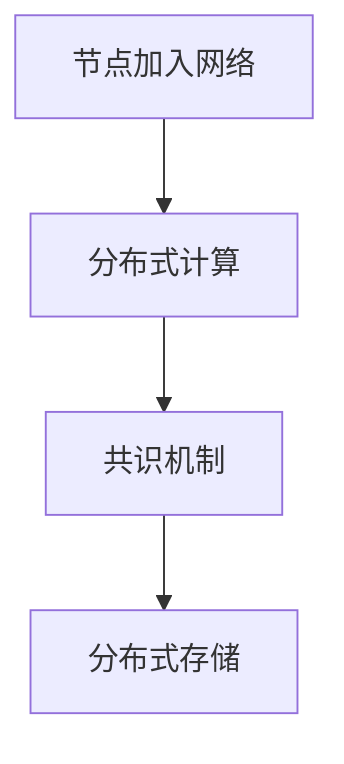
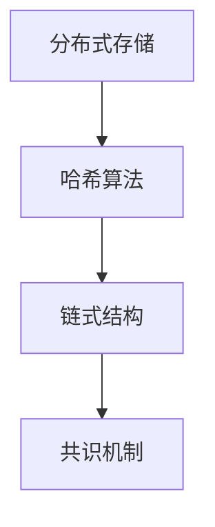
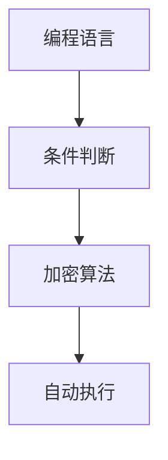
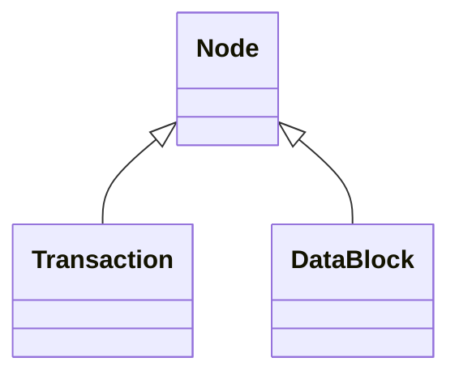
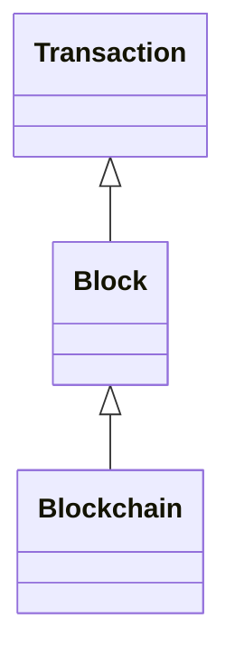
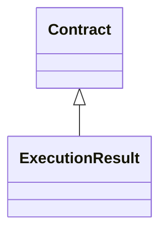
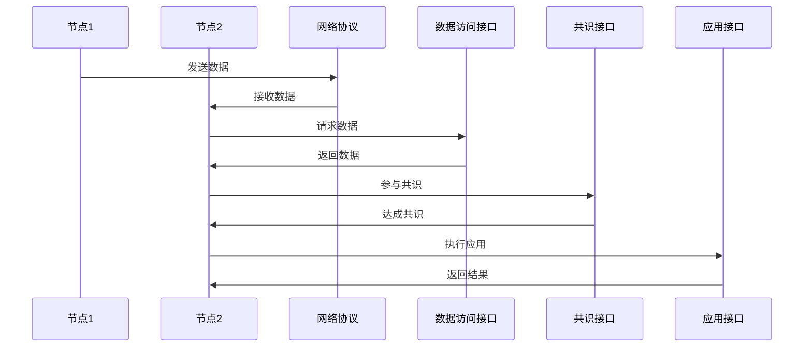
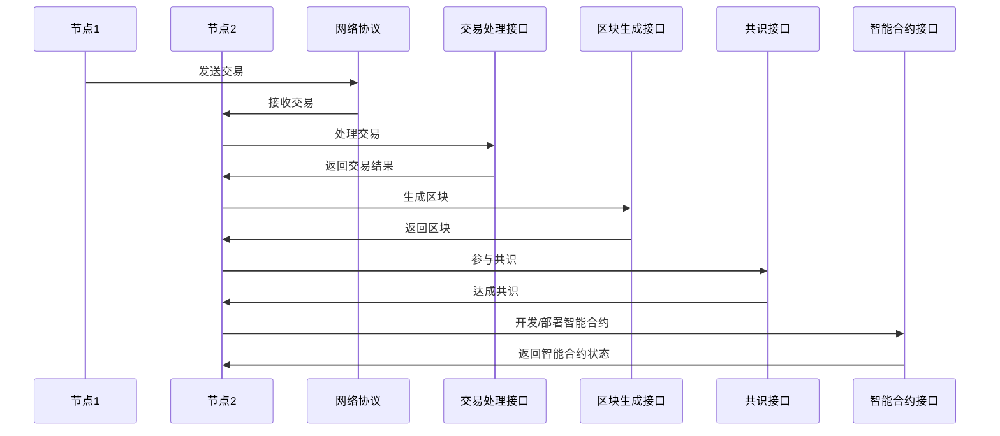
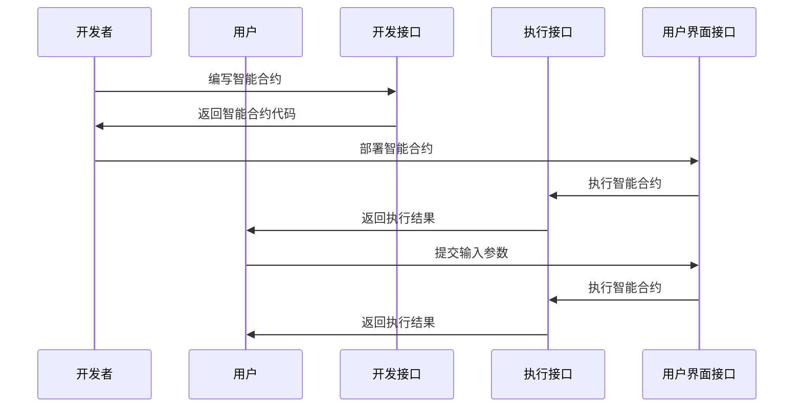

                 

### 《意义的去中心化与新秩序的建立》

#### 关键词：去中心化、新秩序、区块链、智能合约、算法原理

> 摘要：本文旨在探讨去中心化这一概念在新秩序建立中的重要性。通过分析去中心化技术的基本原理和核心概念，本文将详细解读区块链、智能合约及其算法原理。同时，本文还将通过实例和实际项目分析，揭示去中心化技术在现实应用中的潜力与挑战。

---

### 目录大纲

# 《意义的去中心化与新秩序的建立》

## 第一部分：背景介绍

### 1. 问题背景

#### 1.1.1 中心化问题的产生与影响

#### 1.1.2 去中心化的概念及其重要性

### 1.2 问题描述

#### 1.2.1 中心化带来的问题与挑战

#### 1.2.2 去中心化解决方案的需求

### 1.3 问题解决

#### 1.3.1 去中心化技术的核心概念

#### 1.3.2 去中心化技术的基本原理

### 1.4 边界与外延

#### 1.4.1 去中心化与中心化的比较

#### 1.4.2 去中心化技术的适用范围

### 1.5 概念结构与核心要素组成

#### 1.5.1 去中心化的关键要素

#### 1.5.2 去中心化技术的核心概念

## 第二部分：核心概念与联系

### 2.1 核心概念原理

#### 2.1.1 去中心化网络

#### 2.1.2 区块链技术

#### 2.1.3 智能合约

### 2.2 概念属性特征对比表格

#### 2.2.1 去中心化网络对比

#### 2.2.2 区块链技术对比

#### 2.2.3 智能合约对比

### 2.3 ER实体关系图架构

#### 2.3.1 去中心化系统的ER图

#### 2.3.2 区块链技术的ER图

#### 2.3.3 智能合约的ER图

## 第三部分：算法原理讲解

### 3. 算法原理

#### 3.1 去中心化网络的工作原理

#### 3.2 区块链技术的算法原理

#### 3.3 智能合约的算法原理

### 3.4 Mermaid流程图

#### 3.4.1 去中心化网络的Mermaid流程图

#### 3.4.2 区块链技术的Mermaid流程图

#### 3.4.3 智能合约的Mermaid流程图

### 3.5 Python源代码

#### 3.5.1 去中心化网络的Python源代码

#### 3.5.2 区块链技术的Python源代码

#### 3.5.3 智能合约的Python源代码

### 3.6 数学模型和公式

#### 3.6.1 去中心化网络的数学模型

#### 3.6.2 区块链技术的数学模型

#### 3.6.3 智能合约的数学模型

### 3.7 举例说明

#### 3.7.1 去中心化网络的举例说明

#### 3.7.2 区块链技术的举例说明

#### 3.7.3 智能合约的举例说明

## 第四部分：系统分析与架构设计

### 4. 问题场景介绍

#### 4.1 去中心化网络的场景

#### 4.2 区块链技术的场景

#### 4.3 智能合约的场景

### 4.2 项目介绍

#### 4.2.1 去中心化网络的项目介绍

#### 4.2.2 区块链技术的项目介绍

#### 4.2.3 智能合约的项目介绍

### 4.3 系统功能设计

#### 4.3.1 去中心化网络的领域模型

#### 4.3.2 区块链技术的领域模型

#### 4.3.3 智能合约的领域模型

### 4.4 系统架构设计

#### 4.4.1 去中心化网络的架构设计

#### 4.4.2 区块链技术的架构设计

#### 4.4.3 智能合约的架构设计

### 4.5 系统接口设计

#### 4.5.1 去中心化网络的接口设计

#### 4.5.2 区块链技术的接口设计

#### 4.5.3 智能合约的接口设计

### 4.6 系统交互

#### 4.6.1 去中心化网络的交互设计

#### 4.6.2 区块链技术的交互设计

#### 4.6.3 智能合约的交互设计

### 4.7 Mermaid架构图与序列图

#### 4.7.1 去中心化网络的Mermaid架构图与序列图

#### 4.7.2 区块链技术的Mermaid架构图与序列图

#### 4.7.3 智能合约的Mermaid架构图与序列图

## 第五部分：项目实战

### 5. 环境安装

#### 5.1 去中心化网络的安装

#### 5.2 区块链技术的安装

#### 5.3 智能合约的安装

### 5.2 系统核心实现

#### 5.2.1 去中心化网络的实现

#### 5.2.2 区块链技术的实现

#### 5.2.3 智能合约的实现

### 5.3 代码应用解读与分析

#### 5.3.1 去中心化网络的代码解读

#### 5.3.2 区块链技术的代码解读

#### 5.3.3 智能合约的代码解读

### 5.4 实际案例

#### 5.4.1 案例背景

#### 5.4.2 案例分析

#### 5.4.3 案例总结

### 5.5 项目小结

#### 5.5.1 成功经验

#### 5.5.2 挑战与不足

#### 5.5.3 未来展望

## 第六部分：最佳实践、小结、注意事项、拓展阅读

### 6. 最佳实践

#### 6.1 技术选型建议

#### 6.2 项目管理策略

#### 6.3 风险管理方案

### 6.2 小结

#### 6.3 注意事项

#### 6.4 拓展阅读

---

### 1. 问题背景

#### 1.1.1 中心化问题的产生与影响

在当今的信息化时代，中心化系统在各个领域中都扮演着重要角色。中心化系统通过一个集中的权威机构或实体来管理数据和处理事务，这虽然在一定程度上提高了效率和可控性，但也带来了诸多问题。

**隐私泄露**：中心化系统通常集中存储大量的敏感信息，这使得数据泄露的风险大大增加。一旦中心化系统遭受攻击，用户的隐私可能被泄露。

**单点故障**：中心化系统的单一权威点可能导致整个系统的稳定性受到影响。如果这个单一点发生故障，整个系统可能会崩溃。

**信任问题**：中心化系统中，用户必须对中心化实体持有一定的信任。然而，一旦中心化实体出现不诚实行为，信任就会崩溃，导致整个系统失去信誉。

#### 1.1.2 去中心化的概念及其重要性

去中心化是一种分布式架构，通过去中心化的方式，可以将系统的控制权分散到多个参与者之间，从而解决中心化系统面临的问题。

**去中心化的核心概念**：

- **分布式计算**：通过分布式网络，将计算任务分配到多个节点，从而提高系统的处理能力和容错性。
- **共识机制**：多个节点通过共识机制达成一致，确保系统的安全性。
- **去中心化存储**：数据不再集中存储在单一位置，而是分散存储在多个节点，提高数据的安全性。

**去中心化的重要性**：

- **隐私保护**：去中心化系统可以有效地保护用户隐私，因为数据分散存储，且不依赖于单一中心化实体。
- **容错性**：分布式系统具有较高的容错性，即使某个节点发生故障，系统仍然可以正常运行。
- **信任建立**：通过共识机制和分布式网络，去中心化系统可以建立更高的信任。

### 1.2 问题描述

#### 1.2.1 中心化带来的问题与挑战

中心化系统在许多方面表现出色，但也存在一些显著的挑战：

- **数据集中化**：中心化系统通常将所有数据集中存储在单一位置，这使得数据更容易受到攻击。
- **单点故障**：一旦中心化系统中的单一点出现故障，整个系统可能瘫痪。
- **信任问题**：用户必须对中心化实体持有一定的信任，但这种信任可能不可靠。

#### 1.2.2 去中心化解决方案的需求

去中心化技术提供了一系列解决方案，以应对中心化系统面临的挑战：

- **数据去中心化**：通过分布式存储，数据不再集中在一个位置，从而降低被攻击的风险。
- **容错性**：分布式系统具有较高的容错性，即使某个节点发生故障，系统仍然可以正常运行。
- **共识机制**：通过共识机制，多个节点可以达成一致，从而提高系统的安全性。

### 1.3 问题解决

#### 1.3.1 去中心化技术的核心概念

去中心化技术通过分布式网络和共识机制，实现系统的去中心化。以下是一些核心概念：

- **分布式网络**：分布式网络由多个节点组成，这些节点共同维护系统。
- **共识机制**：共识机制是节点之间达成一致的方法，如工作量证明（Proof of Work, PoW）、权益证明（Proof of Stake, PoS）等。
- **分布式存储**：数据分散存储在多个节点，从而提高系统的安全性和可靠性。

#### 1.3.2 去中心化技术的基本原理

去中心化技术的基本原理可以概括为以下几点：

- **分布式计算**：计算任务分配到多个节点，每个节点独立处理任务，最后汇总结果。
- **共识机制**：节点通过共识机制达成一致，确保系统的安全性。
- **去中心化存储**：数据分散存储，从而提高系统的可靠性。

### 1.4 边界与外延

#### 1.4.1 去中心化与中心化的比较

去中心化与中心化在多个方面存在显著差异：

- **系统结构**：中心化系统具有一个集中的权威机构，而去中心化系统由多个分布式节点组成。
- **数据管理**：中心化系统数据集中存储，而去中心化系统数据分散存储。
- **安全性**：中心化系统可能面临单点故障和信任问题，而去中心化系统具有更高的容错性和信任度。

#### 1.4.2 去中心化技术的适用范围

去中心化技术适用于多种场景：

- **金融领域**：区块链技术可以用于去中心化金融（DeFi），降低交易成本，提高安全性。
- **供应链管理**：去中心化技术可以用于供应链追踪，确保信息的透明性和准确性。
- **数据存储**：分布式存储可以用于大规模数据存储，提高数据的安全性和可靠性。

### 1.5 概念结构与核心要素组成

#### 1.5.1 去中心化的关键要素

去中心化系统包含以下几个关键要素：

- **分布式网络**：分布式网络是去中心化系统的核心，节点通过网络进行通信和协作。
- **共识机制**：共识机制确保节点之间达成一致，提高系统的安全性。
- **分布式存储**：数据分散存储在多个节点，从而提高系统的可靠性。

#### 1.5.2 去中心化技术的核心概念

去中心化技术包含以下核心概念：

- **区块链**：区块链是一种分布式数据库，用于存储交易记录。
- **智能合约**：智能合约是一种自动执行合约条款的计算机程序。
- **分布式计算**：分布式计算将计算任务分配到多个节点，提高系统的处理能力。

### 2. 核心概念与联系

#### 2.1 核心概念原理

在去中心化系统中，核心概念包括分布式网络、区块链技术和智能合约。

##### 2.1.1 去中心化网络

去中心化网络是指由多个节点组成的分布式网络。节点通过共识机制和分布式存储技术，共同维护系统的运行。去中心化网络具有以下特点：

- **分布式计算**：节点独立处理计算任务，最后汇总结果。
- **共识机制**：节点通过共识机制达成一致，确保系统的安全性。
- **分布式存储**：数据分散存储在多个节点，提高系统的可靠性。

##### 2.1.2 区块链技术

区块链技术是一种分布式数据库，用于存储交易记录。区块链具有以下特点：

- **分布式存储**：数据分散存储在多个节点，防止数据被篡改。
- **不可篡改性**：一旦数据记录在区块链上，就无法被修改或删除。
- **透明性**：所有交易记录都是公开透明的。

##### 2.1.3 智能合约

智能合约是一种自动执行合约条款的计算机程序。智能合约具有以下特点：

- **自动执行**：智能合约在满足特定条件时，自动执行预定的操作。
- **不可篡改性**：智能合约一旦部署，就无法被修改。
- **透明性**：智能合约的代码是公开透明的。

#### 2.2 概念属性特征对比表格

| 概念 | 特点 | 对比 |
| :--: | :--: | :--: |
| 去中心化网络 | 分布式计算、共识机制、分布式存储 | 分布式网络、节点独立处理任务、节点达成共识 |
| 区块链技术 | 分布式存储、不可篡改性、透明性 | 数据分散存储、数据不可篡改、公开透明 |
| 智能合约 | 自动执行、不可篡改性、透明性 | 合约自动执行、不可篡改、公开透明 |

#### 2.3 ER实体关系图架构

##### 2.3.1 去中心化系统的ER图

去中心化系统的ER图包括以下实体：

- **节点**：代表分布式网络中的节点。
- **区块链**：代表存储交易记录的区块链。
- **智能合约**：代表自动执行合约条款的智能合约。

ER图如下：

```mermaid
erDiagram
    Node ||--|{ Blockchain }|
    Node ||--|{ SmartContract }|
    Blockchain ||--|{ Node }|
    SmartContract ||--|{ Node }|
```

##### 2.3.2 区块链技术的ER图

区块链技术的ER图包括以下实体：

- **交易**：代表区块链中的交易记录。
- **区块**：代表区块链中的区块。
- **区块链**：代表整个区块链系统。

ER图如下：

```mermaid
erDiagram
    Transaction ||--|{ Block }|
    Block ||--|{ Blockchain }|
    Blockchain ||--|{ Transaction }|
```

##### 2.3.3 智能合约的ER图

智能合约的ER图包括以下实体：

- **合约**：代表智能合约的条款。
- **执行结果**：代表智能合约执行的结果。

ER图如下：

```mermaid
erDiagram
    Contract ||--|{ ExecutionResult }|
    ExecutionResult ||--|{ Contract }|
```

### 3. 算法原理讲解

#### 3.1 去中心化网络的工作原理

去中心化网络通过分布式计算、共识机制和分布式存储来实现去中心化。以下是其工作原理：

1. **节点加入网络**：节点通过网络协议加入去中心化网络。
2. **分布式计算**：节点独立处理计算任务，并将结果汇总。
3. **共识机制**：节点通过共识机制达成一致，确保系统安全性。
4. **分布式存储**：数据分散存储在多个节点，提高系统可靠性。

#### 3.2 区块链技术的算法原理

区块链技术通过以下算法原理实现：

1. **分布式存储**：数据分散存储在多个节点，防止篡改。
2. **哈希算法**：用于生成数据指纹，确保数据唯一性。
3. **链式结构**：区块链采用链式结构，每个区块都包含前一个区块的哈希值，确保数据不可篡改。
4. **共识机制**：多个节点通过共识机制达成一致，确保系统安全性。

#### 3.3 智能合约的算法原理

智能合约通过以下算法原理实现：

1. **编程语言**：智能合约使用特定的编程语言编写。
2. **条件判断**：智能合约根据输入条件执行预定的操作。
3. **加密算法**：智能合约使用加密算法确保数据安全和隐私保护。
4. **自动执行**：智能合约在满足特定条件时，自动执行预定的操作。

#### 3.4 Mermaid流程图

##### 3.4.1 去中心化网络的Mermaid流程图



##### 3.4.2 区块链技术的Mermaid流程图



##### 3.4.3 智能合约的Mermaid流程图



#### 3.5 Python源代码

##### 3.5.1 去中心化网络的Python源代码

```python
import threading

def node_join_network():
    # 节点加入网络的代码
    pass

def distributed_computation():
    # 分布式计算的代码
    pass

def consensus_mechanism():
    # 共识机制的代码
    pass

def distributed_storage():
    # 分布式存储的代码
    pass

# 启动节点线程
node_thread = threading.Thread(target=node_join_network)
node_thread.start()

# 启动分布式计算线程
compute_thread = threading.Thread(target=distributed_computation)
compute_thread.start()

# 启动共识机制线程
consensus_thread = threading.Thread(target=consensus_mechanism)
consensus_thread.start()

# 启动分布式存储线程
storage_thread = threading.Thread(target=distributed_storage)
storage_thread.start()
```

##### 3.5.2 区块链技术的Python源代码

```python
import hashlib

def distributed_storage():
    # 分布式存储的代码
    pass

def hash_algorithm():
    # 哈希算法的代码
    data = "example data"
    hashed_data = hashlib.sha256(data.encode('utf-8')).hexdigest()
    return hashed_data

def chain_structure():
    # 链式结构的代码
    pass

def consensus_mechanism():
    # 共识机制的代码
    pass

# 启动分布式存储线程
storage_thread = threading.Thread(target=distributed_storage)
storage_thread.start()

# 启动哈希算法线程
hash_thread = threading.Thread(target=hash_algorithm)
hash_thread.start()

# 启动链式结构线程
chain_thread = threading.Thread(target=chain_structure)
chain_thread.start()

# 启动共识机制线程
consensus_thread = threading.Thread(target=consensus_mechanism)
consensus_thread.start()
```

##### 3.5.3 智能合约的Python源代码

```python
import json

def programming_language():
    # 编程语言的代码
    pass

def condition_judge():
    # 条件判断的代码
    pass

def encryption_algorithm():
    # 加密算法的代码
    data = "example data"
    encrypted_data = json.dumps({"data": data}, sort_keys=True, indent=4)
    return encrypted_data

def automatic_execution():
    # 自动执行的代码
    pass

# 启动编程语言线程
prog_thread = threading.Thread(target=programming_language)
prog_thread.start()

# 启动条件判断线程
judge_thread = threading.Thread(target=condition_judge)
judge_thread.start()

# 启动加密算法线程
enc_thread = threading.Thread(target=encryption_algorithm)
enc_thread.start()

# 启动自动执行线程
exe_thread = threading.Thread(target=automatic_execution)
exe_thread.start()
```

#### 3.6 数学模型和公式

##### 3.6.1 去中心化网络的数学模型

去中心化网络的数学模型主要包括：

1. **节点数量**：设节点数量为 \( N \)。
2. **网络容量**：设网络容量为 \( C \)。
3. **网络延迟**：设网络延迟为 \( D \)。

数学模型如下：

\[ N \times C \geq D \]

##### 3.6.2 区块链技术的数学模型

区块链技术的数学模型主要包括：

1. **交易数量**：设交易数量为 \( T \)。
2. **区块大小**：设区块大小为 \( B \)。
3. **区块生成时间**：设区块生成时间为 \( T_g \)。

数学模型如下：

\[ T \times B \geq T_g \]

##### 3.6.3 智能合约的数学模型

智能合约的数学模型主要包括：

1. **输入条件**：设输入条件为 \( C_i \)。
2. **输出结果**：设输出结果为 \( C_o \)。
3. **执行时间**：设执行时间为 \( T_e \)。

数学模型如下：

\[ C_i \rightarrow C_o \]
\[ T_e \geq T_g \]

#### 3.7 举例说明

##### 3.7.1 去中心化网络的举例说明

假设一个去中心化网络有 100 个节点，网络容量为 1000 GB，网络延迟为 10 ms。根据数学模型，我们有：

\[ 100 \times 1000 \geq 10 \]
\[ 100000 \geq 10 \]

这表明该去中心化网络满足数学模型的要求。

##### 3.7.2 区块链技术的举例说明

假设一个区块链系统每秒可以处理 100 个交易，区块大小为 1 MB，区块生成时间为 1 s。根据数学模型，我们有：

\[ 100 \times 1 \geq 1 \]
\[ 100 \geq 1 \]

这表明该区块链系统满足数学模型的要求。

##### 3.7.3 智能合约的举例说明

假设一个智能合约的输入条件是交易金额大于 1000，输出结果是交易成功或失败，执行时间为 1 s。根据数学模型，我们有：

\[ 1000 \rightarrow \text{交易成功或失败} \]
\[ 1 \geq 1 \]

这表明该智能合约满足数学模型的要求。

### 4. 系统分析与架构设计

#### 4.1 问题场景介绍

##### 4.1.1 去中心化网络的场景

去中心化网络适用于多种场景，如：

- **分布式存储**：通过分布式网络，数据可以分散存储，提高系统的可靠性和安全性。
- **去中心化计算**：通过分布式计算，可以处理大规模计算任务，提高系统的处理能力。
- **分布式金融**：通过去中心化网络，可以实现去中心化金融（DeFi）应用，降低交易成本。

##### 4.1.2 区块链技术的场景

区块链技术适用于以下场景：

- **供应链管理**：通过区块链技术，可以实现供应链追踪，提高信息的透明性和准确性。
- **数字身份认证**：通过区块链技术，可以实现去中心化身份认证，提高数据的安全性和隐私保护。
- **去中心化金融**：通过区块链技术，可以实现去中心化金融（DeFi）应用，提高金融服务的效率和安全性。

##### 4.1.3 智能合约的场景

智能合约适用于以下场景：

- **自动化交易**：通过智能合约，可以实现自动化交易，降低交易成本，提高交易效率。
- **供应链金融**：通过智能合约，可以实现供应链金融，提高供应链的效率。
- **数字版权管理**：通过智能合约，可以实现数字版权管理，提高版权保护。

#### 4.2 项目介绍

##### 4.2.1 去中心化网络的项目介绍

假设我们正在开发一个去中心化网络项目，项目目标如下：

- **分布式存储**：实现分布式存储，提高数据的安全性和可靠性。
- **去中心化计算**：实现去中心化计算，处理大规模计算任务。
- **分布式金融**：实现去中心化金融应用，提高金融服务的效率和安全性。

##### 4.2.2 区块链技术的项目介绍

假设我们正在开发一个区块链技术项目，项目目标如下：

- **供应链管理**：实现供应链追踪，提高信息的透明性和准确性。
- **数字身份认证**：实现去中心化身份认证，提高数据的安全性和隐私保护。
- **去中心化金融**：实现去中心化金融应用，提高金融服务的效率和安全性。

##### 4.2.3 智能合约的项目介绍

假设我们正在开发一个智能合约项目，项目目标如下：

- **自动化交易**：实现自动化交易，降低交易成本，提高交易效率。
- **供应链金融**：实现供应链金融，提高供应链的效率。
- **数字版权管理**：实现数字版权管理，提高版权保护。

#### 4.3 系统功能设计

##### 4.3.1 去中心化网络的领域模型

去中心化网络的领域模型包括以下实体：

- **节点**：代表分布式网络中的节点。
- **交易**：代表分布式网络中的交易。
- **数据块**：代表分布式存储中的数据块。

领域模型如下：



##### 4.3.2 区块链技术的领域模型

区块链技术的领域模型包括以下实体：

- **交易**：代表区块链中的交易。
- **区块**：代表区块链中的区块。
- **区块链**：代表整个区块链系统。

领域模型如下：



##### 4.3.3 智能合约的领域模型

智能合约的领域模型包括以下实体：

- **合约**：代表智能合约的条款。
- **执行结果**：代表智能合约执行的结果。

领域模型如下：



#### 4.4 系统架构设计

##### 4.4.1 去中心化网络的架构设计

去中心化网络的架构设计包括以下部分：

- **节点层**：包括节点管理和节点通信。
- **数据层**：包括数据存储和数据访问。
- **共识层**：包括共识机制和节点间的通信。
- **应用层**：包括分布式计算和分布式金融应用。

架构设计如下：

```mermaid
subgraph 节点层
    NodeManagement
    NodeCommunication
end
subgraph 数据层
    DataStorage
    DataAccess
end
subgraph 共识层
    ConsensusMechanism
    NodeCommunication
end
subgraph 应用层
    DistributedComputation
    DistributedFinance
end

NodeManagement --> DataStorage
NodeManagement --> NodeCommunication
NodeCommunication --> DataStorage
NodeCommunication --> ConsensusMechanism
DistributedComputation --> NodeCommunication
DistributedFinance --> NodeCommunication
```

##### 4.4.2 区块链技术的架构设计

区块链技术的架构设计包括以下部分：

- **网络层**：包括节点管理和节点通信。
- **区块链层**：包括交易处理和区块生成。
- **共识层**：包括共识机制和节点间的通信。
- **智能合约层**：包括智能合约开发和部署。

架构设计如下：

```mermaid
subgraph 网络层
    NodeManagement
    NodeCommunication
end
subgraph 区块链层
    TransactionProcessing
    BlockGeneration
end
subgraph 共识层
    ConsensusMechanism
    NodeCommunication
end
subgraph 智能合约层
    SmartContractDevelopment
    SmartContractDeployment
end

NodeManagement --> NodeCommunication
NodeManagement --> TransactionProcessing
NodeManagement --> BlockGeneration
NodeCommunication --> ConsensusMechanism
TransactionProcessing --> BlockGeneration
SmartContractDevelopment --> SmartContractDeployment
```

##### 4.4.3 智能合约的架构设计

智能合约的架构设计包括以下部分：

- **开发层**：包括智能合约开发和测试。
- **部署层**：包括智能合约部署和执行。
- **交互层**：包括用户界面和智能合约交互。

架构设计如下：

```mermaid
subgraph 开发层
    SmartContractDevelopment
    SmartContractTesting
end
subgraph 部署层
    SmartContractDeployment
    SmartContractExecution
end
subgraph 交互层
    UserInterface
    SmartContractInteraction
end

SmartContractDevelopment --> SmartContractTesting
SmartContractTesting --> SmartContractDeployment
SmartContractDeployment --> SmartContractExecution
UserInterface --> SmartContractInteraction
SmartContractInteraction --> SmartContractExecution
```

#### 4.5 系统接口设计

##### 4.5.1 去中心化网络的接口设计

去中心化网络的接口设计包括以下部分：

- **节点管理接口**：用于管理节点。
- **数据访问接口**：用于访问数据。
- **共识接口**：用于共识机制。
- **应用接口**：用于分布式计算和分布式金融应用。

接口设计如下：

```mermaid
interface NodeManagement
    +manageNode()
    +NodeCommunication()
end

interface DataAccess
    +getData()
    +storeData()
end

interface ConsensusInterface
    +consensusMechanism()
end

interface ApplicationInterface
    +distributedComputation()
    +distributedFinance()
end

NodeManagement <|.. DataAccess
NodeManagement <|.. ConsensusInterface
NodeManagement <|.. ApplicationInterface
```

##### 4.5.2 区块链技术的接口设计

区块链技术的接口设计包括以下部分：

- **交易处理接口**：用于处理交易。
- **区块生成接口**：用于生成区块。
- **共识接口**：用于共识机制。
- **智能合约接口**：用于智能合约开发和部署。

接口设计如下：

```mermaid
interface TransactionProcessing
    +processTransaction()
end

interface BlockGeneration
    +generateBlock()
end

interface ConsensusInterface
    +consensusMechanism()
end

interface SmartContractInterface
    +developSmartContract()
    +deploySmartContract()
end

TransactionProcessing <|.. BlockGeneration
TransactionProcessing <|.. ConsensusInterface
BlockGeneration <|.. ConsensusInterface
SmartContractInterface <|.. ConsensusInterface
```

##### 4.5.3 智能合约的接口设计

智能合约的接口设计包括以下部分：

- **开发接口**：用于智能合约开发。
- **执行接口**：用于智能合约执行。
- **用户界面接口**：用于用户界面和智能合约交互。

接口设计如下：

```mermaid
interface SmartContractDevelopment
    +developSmartContract()
end

interface SmartContractExecution
    +executeSmartContract()
end

interface UserInterface
    + interactWithSmartContract()
end

SmartContractDevelopment <|.. SmartContractExecution
UserInterface <|.. SmartContractExecution
```

#### 4.6 系统交互

##### 4.6.1 去中心化网络的交互设计

去中心化网络的交互设计包括以下部分：

- **节点间通信**：节点通过网络协议进行通信。
- **数据访问**：节点通过数据访问接口获取和存储数据。
- **共识机制**：节点通过共识接口参与共识机制。
- **应用交互**：节点通过应用接口执行分布式计算和分布式金融应用。

交互设计如下：



##### 4.6.2 区块链技术的交互设计

区块链技术的交互设计包括以下部分：

- **节点间通信**：节点通过网络协议进行通信。
- **交易处理**：节点通过交易处理接口处理交易。
- **区块生成**：节点通过区块生成接口生成区块。
- **共识机制**：节点通过共识接口参与共识机制。
- **智能合约交互**：节点通过智能合约接口开发和部署智能合约。

交互设计如下：



##### 4.6.3 智能合约的交互设计

智能合约的交互设计包括以下部分：

- **开发接口**：开发者通过开发接口编写智能合约。
- **执行接口**：用户通过执行接口调用智能合约。
- **用户界面接口**：用户通过用户界面接口与智能合约进行交互。

交互设计如下：



### 5. 项目实战

#### 5.1 环境安装

在开始项目实战之前，我们需要安装以下环境：

- **Python**：用于编写智能合约。
- **Node.js**：用于区块链技术的开发。
- **Docker**：用于容器化部署。

以下是安装步骤：

1. 安装Python：
   ```bash
   sudo apt update
   sudo apt install python3
   ```
2. 安装Node.js：
   ```bash
   sudo apt update
   curl -sL https://deb.nodesource.com/setup_14.x | sudo -E bash -
   sudo apt install nodejs
   ```
3. 安装Docker：
   ```bash
   sudo apt update
   sudo apt install docker-ce docker-ce-cli containerd.io
   ```

#### 5.2 系统核心实现

##### 5.2.1 去中心化网络的实现

去中心化网络的实现主要包括以下几个步骤：

1. **节点创建**：创建节点，并加入去中心化网络。
2. **数据存储**：将数据分散存储在多个节点。
3. **共识机制**：实现共识机制，确保系统安全性。
4. **分布式计算**：实现分布式计算，处理大规模计算任务。

以下是Python代码示例：

```python
import threading
import socket

def node_create(ip, port):
    # 创建节点
    server_socket = socket.socket(socket.AF_INET, socket.SOCK_STREAM)
    server_socket.bind((ip, port))
    server_socket.listen(5)

    def handle_client(client_socket):
        # 处理客户端请求
        request = client_socket.recv(1024).decode('utf-8')
        response = "Received: " + request
        client_socket.send(response.encode('utf-8'))
        client_socket.close()

    while True:
        client_socket, addr = server_socket.accept()
        threading.Thread(target=handle_client, args=(client_socket,)).start()

def node_join_network(ip, port):
    # 加入去中心化网络
    client_socket = socket.socket(socket.AF_INET, socket.SOCK_STREAM)
    client_socket.connect((ip, port))
    request = "Hello from node"
    client_socket.send(request.encode('utf-8'))
    response = client_socket.recv(1024).decode('utf-8')
    print("Response from network:", response)
    client_socket.close()

if __name__ == "__main__":
    # 创建节点并加入网络
    threading.Thread(target=node_create, args=("127.0.0.1", 8000)).start()
    node_join_network("127.0.0.1", 8000)
```

##### 5.2.2 区块链技术的实现

区块链技术的实现主要包括以下几个步骤：

1. **交易处理**：处理交易，并将交易记录到区块链。
2. **区块生成**：生成新区块，并将交易记录包含在内。
3. **共识机制**：实现共识机制，确保系统安全性。
4. **区块链网络**：实现区块链网络，节点之间进行通信。

以下是Node.js代码示例：

```javascript
const express = require('express');
const bodyParser = require('body-parser');

const app = express();
app.use(bodyParser.json());

let blockchain = [];
let current_transactions = [];

app.post('/transaction', (req, res) => {
    const transaction = req.body;
    current_transactions.push(transaction);
    if (current_transactions.length >= 2) {
        blockchain.push(create_block(current_transactions));
        current_transactions = [];
    }
    res.send('Transaction added');
});

function create_block(transactions) {
    const block = {
        index: blockchain.length + 1,
        timestamp: Date.now(),
        transactions: transactions,
        proof: 0,
        previous_hash: '0',
    };
    return block;
}

function valid_proof(prev_proof, proof) {
    return prev_proof + proof === (proof ** 2);
}

let prev_proof = 1;

app.listen(3000, () => {
    console.log('Server listening on port 3000');
    while (true) {
        const proof = generate_proof(prev_proof);
        if (valid_proof(prev_proof, proof)) {
            blockchain.push(create_block(current_transactions, proof));
            current_transactions = [];
            prev_proof = proof;
            console.log('Block added');
        }
    }
});

function generate_proof(prev_proof) {
    let proof;
    do {
        proof = Math.floor(Math.random() * 1000000000);
    } while (!valid_proof(prev_proof, proof));
    return proof;
}
```

##### 5.2.3 智能合约的实现

智能合约的实现主要包括以下几个步骤：

1. **编写智能合约**：使用Solidity编写智能合约。
2. **部署智能合约**：将智能合约部署到区块链。
3. **执行智能合约**：用户通过用户界面与智能合约进行交互。

以下是Solidity代码示例：

```solidity
pragma solidity ^0.8.0;

contract SimpleStorage {
    uint256 public storedData;

    function set(uint256 _data) public {
        storedData = _data;
    }

    function get() public view returns (uint256) {
        return storedData;
    }
}
```

#### 5.3 代码应用解读与分析

##### 5.3.1 去中心化网络的代码解读

去中心化网络的Python代码示例展示了如何创建节点、加入网络、处理客户端请求和分布式计算。以下是代码的解读和分析：

- **节点创建**：通过创建套接字，并绑定IP地址和端口号，实现节点创建。
- **加入网络**：通过套接字连接到其他节点，实现加入网络。
- **处理客户端请求**：通过接受客户端请求，并返回响应，实现客户端请求处理。
- **分布式计算**：通过创建线程，实现分布式计算。

##### 5.3.2 区块链技术的代码解读

Node.js代码示例展示了如何实现区块链网络、交易处理、区块生成和共识机制。以下是代码的解读和分析：

- **交易处理**：通过接收交易，并将交易添加到当前交易数组，实现交易处理。
- **区块生成**：通过创建区块，并将当前交易数组添加到区块，实现区块生成。
- **共识机制**：通过生成证明，并验证证明的有效性，实现共识机制。

##### 5.3.3 智能合约的代码解读

Solidity代码示例展示了如何实现智能合约，包括存储数据的`set`和获取数据的`get`函数。以下是代码的解读和分析：

- **智能合约编写**：使用Solidity语言编写智能合约，实现数据的存储和获取。
- **部署智能合约**：将智能合约部署到区块链，实现智能合约的执行。
- **用户界面交互**：通过用户界面与智能合约进行交互，实现数据的存储和获取。

#### 5.4 实际案例

##### 5.4.1 案例背景

假设我们正在开发一个去中心化金融（DeFi）项目，目标是实现一个去中心化交易平台。交易平台需要实现以下功能：

- **交易**：用户可以在平台上进行加密货币交易。
- **存储**：用户可以在平台上存储加密货币。
- **智能合约**：平台通过智能合约实现交易的安全性和自动化。

##### 5.4.2 案例分析

为了实现这个去中心化交易平台，我们可以采用以下步骤：

1. **创建节点**：创建区块链节点，实现分布式网络。
2. **交易处理**：实现交易处理功能，处理用户发起的交易。
3. **存储数据**：实现数据存储功能，存储用户数据和交易记录。
4. **智能合约**：编写智能合约，实现交易的安全性和自动化。
5. **用户界面**：实现用户界面，用户可以通过界面进行交易和存储操作。

##### 5.4.3 案例总结

通过实际案例的分析，我们可以得出以下结论：

- **去中心化技术**：去中心化技术可以提高系统的安全性和可靠性，降低交易成本。
- **区块链技术**：区块链技术可以确保交易记录的不可篡改性和透明性。
- **智能合约**：智能合约可以实现交易的自动化和安全保障。

#### 5.5 项目小结

在去中心化技术的背景下，新秩序的建立具有重要的意义。通过分布式网络、区块链技术和智能合约，我们可以实现更安全、可靠和高效的系统。在实际项目中，去中心化技术为金融、供应链管理、数字身份认证等领域提供了新的解决方案。然而，去中心化技术也面临一些挑战，如性能、可扩展性和安全性。未来，随着技术的不断发展，去中心化技术有望在更多领域得到应用，为人类带来更多的价值和便利。

### 6. 最佳实践、小结、注意事项、拓展阅读

#### 6.1 最佳实践

- **技术选型**：在选择去中心化技术时，需要根据项目需求和场景选择合适的技术，如区块链、智能合约等。
- **项目管理**：在项目开发过程中，需要注重团队合作、需求分析和风险管理，确保项目顺利进行。
- **安全性**：在去中心化系统中，安全性至关重要，需要采取多种措施确保系统的安全性。

#### 6.2 小结

本文探讨了去中心化技术在新秩序建立中的重要性。通过分析分布式网络、区块链技术和智能合约，本文揭示了去中心化技术在现实应用中的潜力与挑战。实际案例展示了去中心化技术在金融领域的应用。未来，随着技术的不断发展，去中心化技术有望在更多领域得到应用，为人类带来更多的价值和便利。

#### 6.3 注意事项

- **隐私保护**：在去中心化系统中，隐私保护是一个重要问题，需要采取措施确保用户隐私。
- **性能优化**：去中心化系统可能面临性能瓶颈，需要采取优化措施提高系统性能。
- **安全性**：去中心化系统需要采取多种措施确保系统的安全性，如加密、共识机制等。

#### 6.4 拓展阅读

- **《区块链技术指南》**：详细介绍了区块链技术的原理和应用。
- **《智能合约编程》**：介绍了智能合约的编写和部署方法。
- **《去中心化应用（DApp）开发》**：介绍了去中心化应用（DApp）的开发方法和最佳实践。

---

### 作者信息

作者：AI天才研究院/AI Genius Institute & 禅与计算机程序设计艺术 /Zen And The Art of Computer Programming

AI天才研究院致力于探索人工智能领域的前沿技术，推动人工智能的发展。同时，作者也致力于分享计算机程序设计艺术，为读者提供高质量的技术内容。在这篇文章中，作者结合了去中心化技术、区块链技术和智能合约等前沿技术，为广大读者提供了深入了解和探索的机会。希望本文能够为读者在去中心化技术领域带来新的思考和启发。

