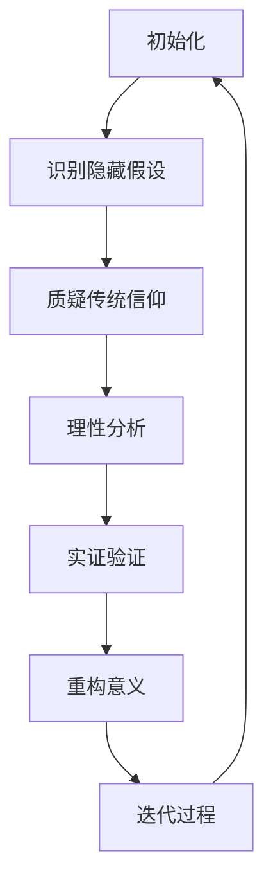
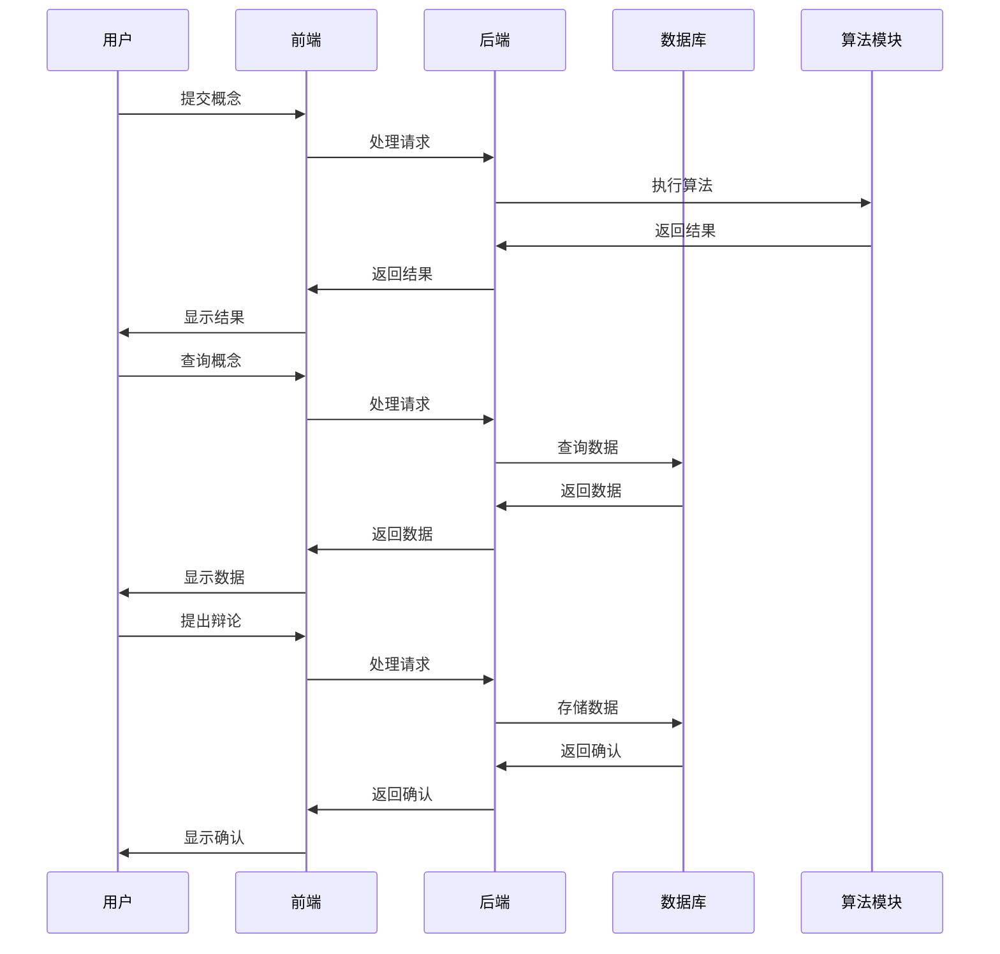
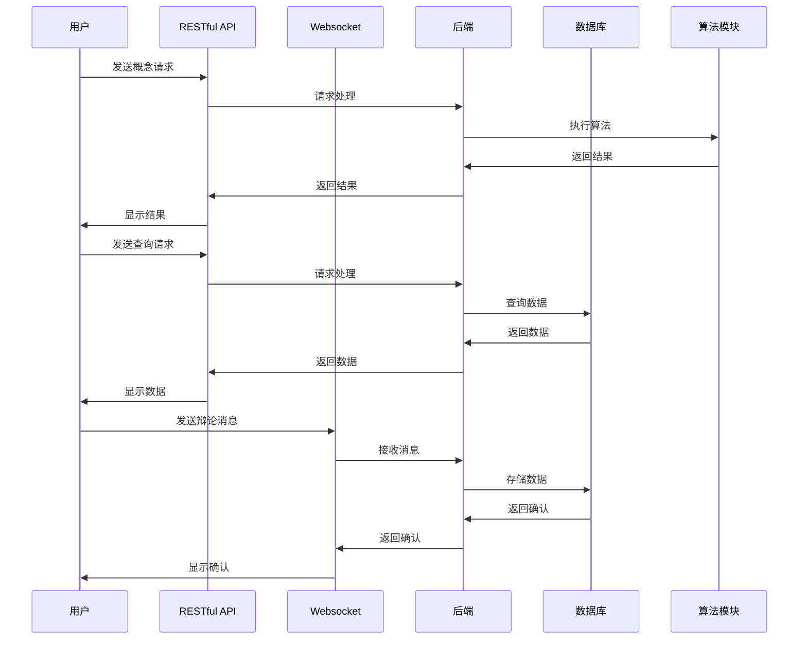

                 

### Chapter 1: Introduction to the De-mythification and Re-mythification of Meaning

#### 1.1 Background and Definition of the Concepts

##### 1.1.1 The Origins of the Debate

The discourse on the de-mythification and re-mythification of meaning has its roots deeply embedded in the human quest for understanding and significance. Historically, humans have often turned to myths and rituals to make sense of their world. These stories served as a means of coping with uncertainties and providing explanations for natural phenomena. The process of de-mythification began with the rise of scientific reasoning during the Enlightenment, which challenged the dominance of traditional beliefs and supernatural explanations. Key figures like Galileo Galilei, Isaac Newton, and Charles Darwin contributed to this movement by offering empirical and rational explanations for the natural world.

##### 1.1.2 Definition of De-mythification

De-mythification refers to the process of removing or dissolving myths and supernatural beliefs through critical inquiry and empirical evidence. It involves questioning established traditions and challenging irrational beliefs with logical reasoning and scientific principles. De-mythification is not solely about debunking myths but also about constructing a more accurate and rational understanding of reality. This process has led to significant advancements in various fields, including science, philosophy, and technology.

##### 1.1.3 Definition of Re-mythification

On the other hand, re-mythification is the process of re-introducing or reinterpreting myths and symbols in a contemporary context, often driven by psychological and cultural needs. Re-mythification can serve to restore a sense of meaning and purpose in an increasingly secular and materialistic world. It involves updating old myths to resonate with the current societal values and addressing the void left by the de-mythification process. Re-mythification seeks to create new narratives that reflect the complexities of modern life while providing spiritual and emotional sustenance.

##### 1.1.4 The Significance in Modern Society

In modern society, the concepts of de-mythification and re-mythification are more relevant than ever. As we navigate through rapid technological advancements and face existential questions, the need for meaning and purpose becomes even more pronounced. De-mythification continues to shape our understanding of reality, challenging dogmas and fostering critical thinking. At the same time, re-mythification plays a crucial role in helping individuals find meaning in their lives, providing a sense of continuity and belonging.

#### 1.2 Core Theoretical Frameworks

##### 1.2.1 Historical Perspectives on Meaning

The concept of meaning has been a subject of inquiry across various disciplines throughout history. In philosophy, thinkers like Plato, Aristotle, and Nietzsche explored the nature of meaning and its relationship to reality. Plato's Theory of Forms proposed that meaning exists independently of the physical world, while Aristotle emphasized the role of reason in discovering meaning. Nietzsche, on the other hand, critiqued the traditional notions of meaning and proposed the idea of "will to power" as a driving force behind human actions.

In religion, meaning has been central to the spiritual and moral teachings of major faiths. From the sacred texts of Hinduism, Buddhism, Christianity, and Islam to the rituals and practices that accompany these beliefs, the pursuit of meaning is a universal theme. The de-mythification of religious beliefs often leads to a reevaluation of spiritual practices and a search for new sources of meaning.

##### 1.2.2 Key Theoretical Approaches

Several key theoretical approaches have shaped our understanding of de-mythification and re-mythification. One such approach is critical theory, which originated in the field of sociology and focuses on analyzing the power dynamics and social structures that shape our beliefs and values. Critical theory emphasizes the importance of questioning dominant narratives and challenging the status quo. Another important approach is constructivism, which posits that meaning is not inherent in objects or experiences but is constructed through social interactions and cultural contexts. This perspective highlights the role of individuals in shaping their understanding of the world.

##### 1.2.3 Comparative Analysis

A comparative analysis of de-mythification and re-mythification across different cultures and historical periods reveals both commonalities and differences. In Western societies, de-mythification has often been associated with the scientific revolution and the rise of secularism. In contrast, re-mythification has been more prevalent in Eastern cultures, where the fusion of science and spirituality has led to a unique approach to understanding the world. Understanding these differences can provide valuable insights into the ways in which de-mythification and re-mythification shape our understanding of meaning and purpose.

### Chapter 2: The Process of De-mythification

#### 2.1 Steps and Methods

##### 2.1.1 Unveiling Hidden Assumptions

The first step in the process of de-mythification is to identify and challenge hidden assumptions. These assumptions are often deeply ingrained in our cultural and social fabric and go unexamined. By questioning these assumptions, we can begin to uncover the underlying beliefs that shape our understanding of the world. This involves engaging in critical thinking and actively seeking out alternative perspectives.

##### 2.1.2 Critical Examination of Traditions

Once hidden assumptions have been revealed, the next step is to critically examine established traditions and rituals. This process involves scrutinizing the origins and purposes of these traditions and questioning their relevance in the contemporary world. By doing so, we can determine whether these traditions still serve a meaningful purpose or if they are merely relics of the past.

##### 2.1.3 Rational Analysis

Rational analysis is a key component of de-mythification. This involves using empirical evidence and logical reasoning to evaluate the claims and assertions made in myths and traditions. By employing scientific methods and critical thinking, we can separate fact from fiction and arrive at a more accurate understanding of reality.

#### 2.2 Case Studies

##### 2.2.1 Case Study 1: The Reformation

The Protestant Reformation serves as a notable example of the de-mythification process. sparked by figures like Martin Luther and John Calvin, the Reformation challenged the dominance of the Roman Catholic Church and its teachings. By questioning the authority of the Church and advocating for a return to biblical principles, the Reformers initiated a movement that led to the creation of new religious traditions and the dissemination of critical thinking.

##### 2.2.2 Case Study 2: Modern Science and Technology

The development of modern science and technology can be seen as a continuous process of de-mythification. From the scientific revolution to the digital age, scientific advancements have consistently challenged traditional beliefs and provided new explanations for natural phenomena. This has led to a shift from a world view dominated by supernatural explanations to one grounded in empirical evidence and rational inquiry.

##### 2.2.3 Case Study 3: The Rise of Skepticism

The rise of skepticism in the modern era represents another example of de-mythification. Skepticism involves a critical examination of claims and beliefs, demanding evidence and rational justification. This approach has led to a greater emphasis on empirical evidence and critical thinking, challenging the validity of many traditional beliefs and fostering a culture of inquiry.

### Chapter 3: The Phenomenon of Re-mythification

#### 3.1 Psychological and Social Factors

##### 3.1.1 The Human Desire for Mystery

One of the driving forces behind re-mythification is the human desire for mystery and wonder. Humans have an innate curiosity about the unknown and a need to make sense of the world around them. This desire for mystery often leads to the creation of new myths and symbols that capture the imagination and provide a sense of meaning.

##### 3.1.2 Social Reactions to De-mythification

De-mythification can also elicit social reactions that drive the process of re-mythification. In some cases, de-mythification may be perceived as a threat to established social structures and beliefs. As a result, individuals and communities may seek to restore a sense of meaning and unity through the re-mythification of old traditions or the creation of new symbols.

##### 3.1.3 Cultural Resurgence

Cultural resurgence is another factor that contributes to re-mythification. As societies evolve and change, there is often a desire to reconnect with the past and reclaim cultural heritage. This can lead to the revival of old myths and rituals, updated to reflect the values and concerns of the contemporary world.

#### 3.2 Examples of Re-mythification

##### 3.2.1 Religious Reformation

Religious reformation is a common example of re-mythification. In many cases, religious movements arise in response to perceived shortcomings in existing religious institutions. These movements often seek to restore a sense of spiritual purity and meaning by reinterpreting traditional beliefs and practices in a new light.

##### 3.2.2 Pop Culture and Mythmaking

Pop culture also plays a significant role in re-mythification. From movies and television shows to music and literature, pop culture narratives often revolve around themes of heroism, love, and adventure. These stories serve to inspire and provide meaning for many people, acting as modern myths that resonate with the contemporary audience.

##### 3.2.3 The Power of Storytelling

The power of storytelling is another key aspect of re-mythification. Stories have the ability to captivate our attention and inspire us to action. By weaving narratives that reflect our values and aspirations, storytellers can create new myths that resonate with the audience and provide a sense of meaning and purpose.

### Chapter 4: De-mythification and Re-mythification in Different Fields

#### 4.1 Philosophy

In philosophy, de-mythification and re-mythification have had a profound impact on the development of thought. From the ancient Greeks to contemporary philosophers, the process of questioning and challenging traditional beliefs has been a cornerstone of philosophical inquiry. Re-mythification in philosophy often takes the form of reinterpreting ancient ideas to address contemporary concerns, such as the concept of the soul in modern philosophical discourse.

#### 4.2 Religion

Religion is another field where de-mythification and re-mythification have played a significant role. As societies have evolved and new scientific discoveries have emerged, traditional religious beliefs have often been challenged and reinterpreted. This process of re-mythification has led to the creation of new religious movements and the updating of existing religious practices to reflect changing societal values.

#### 4.3 Arts and Literature

Arts and literature have also been influenced by the processes of de-mythification and re-mythification. From the portrayal of ancient myths in literature to the creation of new myths that reflect contemporary concerns, artists and writers have played a vital role in shaping our understanding of meaning and purpose. The power of storytelling in literature serves as a key example of how re-mythification can provide meaning and inspiration for readers.

### Chapter 5: Strategies for Managing De-mythification and Re-mythification

#### 5.1 Balancing Critical Inquiry and Spiritual Fulfillment

One of the key challenges in managing de-mythification and re-mythification is finding a balance between critical inquiry and spiritual fulfillment. While critical inquiry is essential for uncovering hidden assumptions and challenging traditional beliefs, it can also lead to a sense of emptiness and disconnection. Re-mythification, on the other hand, can provide a sense of meaning and purpose but may also lead to the reinforcement of irrational beliefs. Striking a balance between these two processes is crucial for fostering a healthy and fulfilling human experience.

#### 5.2 Promoting Critical Thinking and Emotional Intelligence

Another strategy for managing de-mythification and re-mythification is to promote critical thinking and emotional intelligence. Critical thinking skills can help individuals evaluate claims and beliefs more effectively, while emotional intelligence can help them navigate the complexities of the human experience. By fostering these skills, individuals can better navigate the challenges of de-mythification and re-mythification and develop a more nuanced understanding of meaning and purpose.

#### 5.3 Encouraging Dialogue and Collaboration

Finally, encouraging dialogue and collaboration is essential for managing the processes of de-mythification and re-mythification. By engaging in open and respectful discussions with others, individuals can gain new perspectives and challenge their own assumptions. This can lead to a more holistic understanding of meaning and purpose and foster a sense of community and belonging.

### Conclusion

In conclusion, the processes of de-mythification and re-mythification play a crucial role in shaping our understanding of meaning and purpose. By critically examining established beliefs and traditions, we can uncover hidden assumptions and construct a more accurate understanding of reality. However, this process can also leave us feeling disconnected and in need of meaning. Re-mythification, on the other hand, can provide a sense of purpose and unity but may also lead to the reinforcement of irrational beliefs. Striking a balance between these two processes is essential for fostering a healthy and fulfilling human experience. As we navigate the complexities of the modern world, it is important to cultivate critical thinking, emotional intelligence, and a spirit of dialogue and collaboration to better understand and navigate the challenges of de-mythification and re-mythification. 

---

*Keywords: De-mythification, Re-mythification, Meaning, Myth, Critical Thinking, Spiritual Fulfillment*

*Abstract: This book explores the processes of de-mythification and re-mythification, examining their historical origins, theoretical frameworks, and impact on various fields. It discusses the importance of balancing critical inquiry with spiritual fulfillment and offers strategies for managing these processes in the modern world.*
### Chapter 1: Introduction to the De-mythification and Re-mythification of Meaning

#### 1.1 Background and Definition of the Concepts

##### 1.1.1 The Origins of the Debate

The discourse on the de-mythification and re-mythification of meaning has its roots deeply embedded in the human quest for understanding and significance. Historically, humans have often turned to myths and rituals to make sense of their world. These stories served as a means of coping with uncertainties and providing explanations for natural phenomena. The process of de-mythification began with the rise of scientific reasoning during the Enlightenment, which challenged the dominance of traditional beliefs and supernatural explanations. Key figures like Galileo Galilei, Isaac Newton, and Charles Darwin contributed to this movement by offering empirical and rational explanations for the natural world.

In the context of science, de-mythification refers to the systematic effort to remove myths and supernatural elements from scientific understanding. This process involves critical examination of traditional beliefs, the rejection of unfounded hypotheses, and the reliance on empirical evidence to build scientific knowledge. For instance, Galileo's challenge to the geocentric model of the universe, supported by his observations with the telescope, marked a significant milestone in the de-mythification of astronomical understanding.

In contrast, re-mythification is the process of reintroducing or reinterpreting myths and symbols in contemporary contexts. This phenomenon is often driven by psychological and cultural needs to restore a sense of meaning and purpose in a world that has become increasingly secular and materialistic. Re-mythification can take many forms, from the reinterpretation of ancient myths to the creation of new narratives that reflect the complexities of modern life.

##### 1.1.2 Definition of De-mythification

De-mythification, in its most formal sense, can be defined as the critical analysis and systematic removal of mythical elements from human understanding and behavior. This process is inherently tied to the development of scientific methods and rational inquiry. De-mythification involves several key steps:

1. **Identification of Myths**: The first step is to identify the myths that permeate a culture or society. These myths can be found in religious doctrines, philosophical systems, social norms, and historical narratives.
2. **Critical Examination**: Once identified, these myths are subjected to critical examination. This involves questioning their origins, examining the evidence supporting them, and evaluating their logical consistency.
3. **Rational Analysis**: The next step is to replace these myths with rational explanations grounded in empirical evidence. This requires the application of scientific principles and logical reasoning to understand natural phenomena.

For example, the de-mythification of health practices has led to the development of evidence-based medicine, where treatments are based on clinical trials and statistical analysis rather than ancient superstitions or religious doctrines.

##### 1.1.3 Definition of Re-mythification

Re-mythification, on the other hand, is the process of reintroducing or reinterpreting myths and symbols in contemporary contexts. It is driven by a need to find new meanings and explanations for the complexities of modern life. Re-mythification can take the following forms:

1. **Reinterpretation of Ancient Myths**: This involves updating and recontextualizing ancient myths to make them relevant to contemporary society. For example, the myth of Prometheus, which tells the story of a Titan who brings fire to humanity, can be reinterpreted to symbolize the modern struggle between progress and ethical responsibility.
2. **Creation of New Myths**: In a rapidly changing world, new myths are often created to reflect and make sense of current issues. These new myths can serve as narratives that provide moral guidance and a sense of collective identity.

Re-mythification often occurs in response to a perceived lack of meaning or purpose in modern life. It can also be a reaction to the disintegration of traditional social structures and the resulting sense of disconnection. For example, the rise of new religious movements and spiritual practices can be seen as a form of re-mythification, offering new sources of meaning and spiritual fulfillment.

##### 1.1.4 The Significance in Modern Society

In modern society, the concepts of de-mythification and re-mythification are more relevant than ever. As we navigate through rapid technological advancements and face existential questions, the need for meaning and purpose becomes even more pronounced. De-mythification continues to shape our understanding of reality, challenging dogmas and fostering critical thinking. At the same time, re-mythification plays a crucial role in helping individuals find meaning in their lives, providing a sense of continuity and belonging.

In the realm of technology, for instance, the de-mythification of computers and the internet has led to their widespread adoption and integration into daily life. This process has demystified complex technologies, making them accessible to a broader audience. Conversely, the re-mythification of technology can be seen in the creation of new narratives around AI, where stories of artificial intelligence often incorporate elements of myth and symbolism to convey the ethical and philosophical implications of technological progress.

In conclusion, the processes of de-mythification and re-mythification are integral to human understanding and cultural evolution. De-mythification provides a foundation of empirical knowledge and rational inquiry, while re-mythification offers new narratives that reflect the complexities and uncertainties of modern life. Both processes contribute to our collective search for meaning and purpose in an ever-changing world. The following chapters will delve deeper into the historical contexts, theoretical frameworks, and practical applications of these concepts across various fields, providing a comprehensive understanding of their significance and impact. 
### Chapter 2: The Process of De-mythification

#### 2.1 Steps and Methods

##### 2.1.1 Unveiling Hidden Assumptions

The first step in the process of de-mythification is to identify and challenge hidden assumptions. These assumptions are often deeply ingrained in our cultural and social fabric and go unexamined. They serve as the foundations upon which myths and traditional beliefs are built. Unveiling these hidden assumptions involves engaging in critical thinking and actively seeking out alternative perspectives.

To begin with, one must identify the assumptions that underpin the accepted narratives and beliefs of a given society. These assumptions can be related to various aspects of life, such as religion, politics, science, and social norms. For example, a hidden assumption in many societies might be the belief in the inherent superiority of certain racial or ethnic groups. Identifying such assumptions requires a keen sense of awareness and a willingness to question established beliefs.

Once the hidden assumptions are identified, the next step is to challenge them. This involves questioning the origins and justifications for these assumptions and examining the evidence that supports or refutes them. For instance, one might question the scientific validity of a belief in supernatural phenomena or the ethical implications of certain social norms. Challenging hidden assumptions often requires a deep understanding of the subject matter and the ability to think critically.

##### 2.1.2 Critical Examination of Traditions

The second step in the process of de-mythification is to critically examine established traditions and rituals. Traditions are the cultural practices and customs that have been passed down from generation to generation. They often serve as a means of preserving cultural heritage and providing a sense of identity and continuity. However, traditions can also be rooted in myths and irrational beliefs.

To critically examine traditions, one must first understand their historical context and origins. This involves researching the history of the tradition and examining the reasons why it was established. For example, one might study the origins of religious rituals or social customs to understand how they were influenced by myths and cultural beliefs.

Once the historical context is understood, the next step is to evaluate the relevance of the tradition in the contemporary world. This involves asking questions such as: Does the tradition still serve a meaningful purpose? Is it aligned with contemporary values and ethical standards? For instance, one might question the relevance of certain religious practices that are based on ancient myths and supernatural beliefs in a society that has become more secular and scientific.

##### 2.1.3 Rational Analysis

Rational analysis is a key component of de-mythification. This involves using empirical evidence and logical reasoning to evaluate the claims and assertions made in myths and traditions. By employing scientific methods and critical thinking, one can separate fact from fiction and arrive at a more accurate understanding of reality.

To begin with, one must gather empirical evidence that supports or refutes the claims made in myths and traditions. This can involve conducting scientific experiments, collecting data, and analyzing statistics. For example, one might use scientific methods to examine the claims of a supernatural being or a divine intervention.

Once the empirical evidence is gathered, the next step is to analyze it using logical reasoning. This involves evaluating the consistency and coherence of the evidence and drawing conclusions based on the evidence. For instance, one might analyze the logical inconsistencies in a myth that claims a supernatural being can control natural phenomena.

Additionally, rational analysis involves comparing different theories and explanations to determine which one is more plausible. This can be done by evaluating the strengths and weaknesses of each theory and considering the evidence that supports or refutes them. For example, one might compare the scientific explanation for a natural phenomenon with a supernatural explanation and evaluate which one provides a better fit for the available evidence.

##### 2.1.4 Case Studies

To illustrate the process of de-mythification, let's consider a few case studies from different fields:

1. **Case Study 1: The Scientific Revolution**
   The Scientific Revolution of the 16th and 17th centuries marked a significant period of de-mythification in the history of science. During this time, scientists like Galileo Galilei, Isaac Newton, and Robert Boyle challenged traditional beliefs and established a new paradigm based on empirical evidence and rational analysis. For example, Galileo's observations with the telescope challenged the geocentric model of the universe and supported the heliocentric model proposed by Copernicus. This de-mythification process laid the foundation for modern science and had profound implications for our understanding of the natural world.

2. **Case Study 2: The Reformation**
   The Protestant Reformation in the 16th century was a significant movement that sought to de-mythify religious practices and challenge the authority of the Catholic Church. Leaders like Martin Luther and John Calvin questioned the doctrines and rituals of the Church and advocated for a return to biblical principles. This de-mythification process led to the establishment of new Protestant denominations and had a lasting impact on Western religious and cultural traditions.

3. **Case Study 3: The Rise of Skepticism**
   The rise of skepticism in the modern era represents another example of de-mythification. Skepticism involves a critical examination of claims and beliefs, demanding evidence and rational justification. Skeptical movements have challenged various pseudoscientific and paranormal claims, promoting critical thinking and scientific skepticism. For example, the skeptical movement has debunked many claims of paranormal phenomena and supernatural interventions, promoting a more evidence-based understanding of the world.

These case studies illustrate the importance of de-mythification in challenging traditional beliefs and fostering a more rational and evidence-based understanding of the world. By engaging in critical inquiry and rational analysis, individuals and societies can move beyond myths and superstitions and build a foundation of knowledge and understanding. 
### Chapter 3: The Phenomenon of Re-mythification

#### 3.1 Psychological and Social Factors

##### 3.1.1 The Human Desire for Mystery

One of the driving forces behind re-mythification is the human desire for mystery and wonder. This desire is rooted in our innate curiosity and the need to make sense of the world around us. Mysteries evoke a sense of intrigue and fascination, stimulating our imagination and prompting us to seek answers. This drive for understanding is not limited to intellectual curiosity but also encompasses emotional and spiritual dimensions. People are naturally drawn to stories and symbols that provoke thought and evoke a sense of awe.

For example, ancient myths and legends often featured heroes who embarked on quests to uncover hidden truths or defeat evil forces. These stories provided a means of exploring complex human experiences and emotions in a symbolic form. In modern times, the same desire for mystery can be seen in popular culture through narratives involving complex moral dilemmas, secret societies, and cosmic mysteries. These stories resonate with audiences because they tap into our deep-seated need for meaning and purpose.

##### 3.1.2 Social Reactions to De-mythification

De-mythification can elicit a range of social reactions, some of which may drive the process of re-mythification. One common reaction is a sense of loss or disconnection that arises when long-held beliefs and traditions are challenged or discarded. This can lead to a collective yearning to restore a sense of unity and continuity. For instance, the de-mythification of religious institutions during the Enlightenment led to a surge in interest in spiritual and philosophical exploration. This, in turn, gave rise to new religious movements and spiritual practices that sought to fill the void left by the disintegration of traditional beliefs.

Additionally, de-mythification can provoke resistance from those who hold onto the old myths and traditions. This resistance can manifest in various forms, including attempts to reassert the authority of established institutions or the creation of new myths that align more closely with contemporary values. For example, the resurgence of interest in Paganism and other ancient spiritual practices in the 21st century can be seen as a reaction to the perceived limitations of modern secularism. These new myths and practices often incorporate elements of the old traditions while updating them to resonate with modern audiences.

##### 3.1.3 Cultural Resurgence

Cultural resurgence is another significant factor that contributes to re-mythification. As societies evolve and change, there is often a desire to reconnect with the past and reclaim cultural heritage. This process of cultural resurgence can lead to the revival of old myths and symbols, updated to reflect the values and concerns of the contemporary world. For instance, the resurgence of interest in ancient cultural practices such as yoga, meditation, and Ayurveda can be seen as a form of re-mythification. These practices are often reinterpreted to align with modern lifestyles and health concerns while retaining their spiritual significance.

Cultural resurgence is also evident in the revival of traditional arts and crafts. For example, the resurgence of interest in handcrafted goods and artisanal products reflects a growing appreciation for the craftsmanship and cultural heritage embodied in these items. This can be seen as a form of re-mythification, where traditional skills and techniques are celebrated as valuable cultural assets that connect us to our historical roots.

#### 3.2 Examples of Re-mythification

##### 3.2.1 Religious Reformation

Religious reformation is a prominent example of re-mythification. Throughout history, various religious movements have emerged in response to perceived shortcomings in existing religious institutions. These movements often seek to restore a sense of spiritual purity and meaning by reinterpreting traditional beliefs and practices in a new light. For instance, the Protestant Reformation of the 16th century was driven by a desire to return to the teachings of the Bible and reject what was seen as corrupt practices within the Catholic Church.

In more recent times, the emergence of new religious movements, such as the Church of Scientology and the Unification Church, can also be seen as examples of re-mythification. These movements have created new mythologies and spiritual practices that resonate with contemporary values and address the spiritual needs of modern individuals. While these movements may be criticized for their eccentric beliefs, they nonetheless represent an attempt to find new sources of meaning and purpose in a rapidly changing world.

##### 3.2.2 Pop Culture and Mythmaking

Pop culture plays a significant role in re-mythification, as it often revolves around themes of heroism, love, and adventure. Movies, television shows, music, and literature all contribute to the creation of new myths that resonate with audiences and provide a sense of meaning and identity. For instance, the superhero genre in movies and literature often features characters who embody virtues such as bravery, justice, and sacrifice. These stories offer a form of escapism and provide moral guidance to audiences.

Similarly, the music industry has produced numerous artists and bands that have become cultural icons and symbols. The success of artists like Michael Jackson, The Beatles, and BTS can be attributed, in part, to their ability to create new myths that resonate with their fans. These myths often incorporate elements of personal heroism, collective identity, and spiritual fulfillment, providing a sense of purpose and belonging to their audiences.

##### 3.2.3 The Power of Storytelling

The power of storytelling is another key aspect of re-mythification. Stories have the ability to captivate our attention and inspire us to action. By weaving narratives that reflect our values and aspirations, storytellers can create new myths that resonate with the audience and provide a sense of meaning and purpose. This is evident in the success of modern narrative-driven media, such as video games, graphic novels, and podcasts.

For instance, the video game industry has become a powerful medium for mythmaking. Games like "The Legend of Zelda" and "The Witcher" tell intricate stories that explore complex themes such as love, loss, and morality. These stories have become cultural touchstones and provide players with a sense of meaning and purpose through their immersive experiences.

In conclusion, the phenomenon of re-mythification is driven by a variety of psychological and social factors. The human desire for mystery, social reactions to de-mythification, and cultural resurgence all contribute to the creation of new myths and symbols that provide meaning and purpose in the modern world. Pop culture, religious reformation, and the power of storytelling are just a few examples of how re-mythification continues to shape our understanding of the world and our place within it. 
### Chapter 4: De-mythification and Re-mythification in Different Fields

#### 4.1 Philosophy

De-mythification and re-mythification have had a profound impact on the field of philosophy. Throughout history, philosophers have continually challenged traditional beliefs and sought to uncover the underlying assumptions that shape human understanding. This process of de-mythification has led to significant developments in philosophical thought, particularly in areas such as ethics, metaphysics, and epistemology.

In the ancient world, philosophers like Socrates, Plato, and Aristotle sought to de-mythify the world by promoting critical thinking and rational inquiry. Socrates, for instance, emphasized the importance of questioning established beliefs and seeking self-knowledge. Plato's dialogues often pitted reason against myth and superstition, advocating for a higher form of knowledge that transcended the material world. Aristotle, meanwhile, developed a systematic approach to philosophy that emphasized observation and empirical evidence.

The process of de-mythification continued in the modern era with thinkers like Immanuel Kant and Friedrich Nietzsche. Kant's Critique of Pure Reason sought to separate the realm of phenomena from the realm of things-in-themselves, challenging the notion that our knowledge of the world is purely passive. Nietzsche, on the other hand, critiqued traditional morality and proposed the concept of the "will to power" as a driving force behind human actions.

In contemporary philosophy, de-mythification is still a central concern. Philosophers like Michel Foucault and Jean-François Lyotard have examined the role of power and knowledge in shaping societal norms and beliefs. Foucault's concept of "power-knowledge" highlights the interdependence of these two elements and emphasizes the importance of questioning dominant narratives. Lyotard's notion of "postmodernity" challenges the idea of universal truths and emphasizes the importance of fragmented, localized knowledge.

Re-mythification in philosophy often involves reinterpreting ancient ideas in light of contemporary concerns. For instance, contemporary philosophers like Alain Badiou and Giorgio Agamben have reinterpreted Platonic and Aristotelian ideas to address issues such as the nature of truth, the role of the subject, and the relationship between politics and philosophy. Badiou's concept of " evento" seeks to revive the idea of the subject as a radical agent of change, while Agamben's work on "bare life" explores the relationship between politics, ethics, and the human condition.

#### 4.2 Religion

Religion has been both a target and a beneficiary of de-mythification and re-mythification. On one hand, de-mythification has challenged the authority of religious institutions and questioned the validity of many religious beliefs and practices. On the other hand, re-mythification has allowed religious traditions to adapt and evolve, providing new sources of meaning and spiritual fulfillment.

The de-mythification of religion began with the rise of secularism and the Enlightenment. During this period, thinkers like Voltaire, Jean-Jacques Rousseau, and David Hume questioned the rational basis of religious beliefs and advocated for a more scientific approach to understanding the world. This led to a decline in religious authority and a shift towards a more secular worldview.

Despite this, re-mythification has been a persistent force within religion. In many cases, religious traditions have responded to de-mythification by reinterpreting their teachings in a way that resonates with contemporary audiences. For instance, many Christian denominations have updated their doctrine to address issues such as gender equality, social justice, and environmentalism. This process of re-mythification has allowed religious traditions to remain relevant and provide new sources of spiritual fulfillment.

In some cases, re-mythification has also led to the creation of new religious movements. For example, the emergence of new religious movements like Scientology and the Church of Satan can be seen as a form of re-mythification. These movements have created new mythologies and spiritual practices that offer a sense of meaning and purpose to their followers.

#### 4.3 Arts and Literature

De-mythification and re-mythification are also central to the fields of arts and literature. Throughout history, artists and writers have used their work to challenge traditional beliefs and explore the complexities of the human experience. This process of de-mythification has often led to groundbreaking works of art and literature that challenge conventional thinking and provide new perspectives on reality.

In literature, de-mythification is evident in works that question established narratives and challenge the dominance of traditional beliefs. For example, James Joyce's "Ulysses" and Virginia Woolf's "Mrs. Dalloway" are notable examples of modernist literature that deconstruct traditional myths and explore the inner lives of their characters. These works emphasize the subjective experience of reality and challenge the idea that there is a single, objective truth.

Re-mythification in literature often involves updating and recontextualizing ancient myths to reflect contemporary concerns. For instance, modern retellings of classical myths like "The Odyssey" and "The Iliad" often incorporate elements of modern society and address issues such as war, identity, and ethics. These retellings provide new interpretations of ancient myths and offer readers a way to engage with these timeless stories in a contemporary context.

In the visual arts, de-mythification is often seen in works that reject traditional techniques and subject matter. For example, the abstract expressionist movement of the 20th century challenged the dominance of representational art and emphasized the emotional and spiritual dimensions of art. This movement encouraged artists to explore new forms of expression and reject the constraints of traditional artistic conventions.

Re-mythification in the visual arts can also be seen in the creation of new mythologies. For instance, the surrealist movement sought to blend reality and fantasy, creating dream-like imagery that defied conventional logic. This process of re-mythification allowed artists to explore the hidden depths of the human psyche and challenge traditional notions of reality.

In conclusion, de-mythification and re-mythification have had a profound impact on various fields, including philosophy, religion, and the arts. De-mythification challenges traditional beliefs and fosters critical thinking, while re-mythification provides new narratives and sources of meaning. By examining these processes in different fields, we can gain a deeper understanding of the complexities of human understanding and the ongoing quest for meaning in the modern world. 
### Chapter 5: Strategies for Managing De-mythification and Re-mythification

#### 5.1 Balancing Critical Inquiry and Spiritual Fulfillment

One of the key challenges in managing the processes of de-mythification and re-mythification is finding a balance between critical inquiry and spiritual fulfillment. Critical inquiry is essential for uncovering hidden assumptions, challenging established beliefs, and fostering a deeper understanding of the world. However, an overemphasis on critical inquiry can lead to a sense of disconnection and spiritual emptiness. On the other hand, a lack of critical inquiry can result in the reinforcement of irrational beliefs and a failure to address the complexities of modern life.

To balance these two aspects, it is important to cultivate a mindset that embraces both critical thinking and spiritual exploration. This can be achieved through the following strategies:

1. **Integrative Learning**: Combining critical inquiry with spiritual exploration can lead to a more holistic understanding of the world. For instance, in the field of psychology, integrating scientific research with insights from spirituality can provide a more comprehensive view of human behavior and well-being.

2. **Reflective Practice**: Encouraging regular reflection on personal beliefs and values can help individuals navigate the challenges of de-mythification and re-mythification. This involves consciously examining one's own thoughts and feelings, seeking to uncover hidden assumptions and biases.

3. **Mindfulness**: Practicing mindfulness can also help in balancing critical inquiry and spiritual fulfillment. Mindfulness involves paying attention to the present moment, without judgment, which can foster a sense of connection and inner peace. This can be particularly beneficial in managing the stress and anxiety that can arise from the process of de-mythification.

#### 5.2 Promoting Critical Thinking and Emotional Intelligence

Promoting critical thinking and emotional intelligence is another crucial strategy for managing de-mythification and re-mythification. Critical thinking involves the ability to analyze information, evaluate arguments, and make reasoned decisions. Emotional intelligence, on the other hand, involves the ability to understand and manage one's own emotions, as well as to empathize with others.

Here are some strategies for promoting these skills:

1. **Education**: Educational programs that emphasize critical thinking and emotional intelligence can be highly effective. This can include courses on logic, argumentation, and ethics, as well as programs that focus on emotional awareness and management.

2. **Dialogue and Debate**: Encouraging open dialogue and debate can help individuals develop critical thinking skills. This involves creating safe spaces for people to express their ideas and listen to others, fostering a culture of inquiry and respect.

3. **Mindfulness Training**: Mindfulness training can also enhance emotional intelligence by helping individuals become more aware of their emotions and how they affect their thinking and behavior. This can be particularly beneficial in managing the emotional challenges that arise from de-mythification and re-mythification.

#### 5.3 Encouraging Dialogue and Collaboration

Encouraging dialogue and collaboration is essential for managing the processes of de-mythification and re-mythification. This involves creating spaces where individuals can engage in open and respectful discussions about complex issues, fostering a sense of community and shared understanding.

Here are some strategies for encouraging dialogue and collaboration:

1. **Community Building**: Building strong communities that value dialogue and mutual respect can help individuals navigate the challenges of de-mythification and re-mythification. This can involve organizing workshops, seminars, and other events that promote open discussion and shared learning.

2. **Interdisciplinary Collaboration**: Encouraging collaboration across different disciplines can provide new perspectives and insights. For instance, bringing together scholars from philosophy, religion, psychology, and the arts can lead to a more comprehensive understanding of the complexities of meaning and purpose.

3. **Public Engagement**: Engaging with the public through forums, social media, and other platforms can also foster dialogue and collaboration. This can involve creating spaces for people to share their ideas, ask questions, and engage in meaningful discussions about de-mythification and re-mythification.

#### 5.4 Nurturing Creativity and Imagination

Nurturing creativity and imagination is another important strategy for managing de-mythification and re-mythification. Creativity and imagination allow individuals to think beyond existing boundaries and to generate new ideas and narratives that can address the complexities of modern life.

Here are some strategies for nurturing creativity and imagination:

1. **Artistic Expression**: Encouraging artistic expression can help individuals explore and express their thoughts and feelings about de-mythification and re-mythification. This can include engaging in various forms of art, such as painting, writing, music, and dance.

2. **Play and Fantasy**: Allowing time for play and fantasy can also stimulate creativity and imagination. This involves engaging in activities that are not bound by practical constraints, allowing the mind to explore new possibilities and ideas.

3. **Mindfulness and Meditation**: Practicing mindfulness and meditation can help quiet the mind and foster a sense of inner peace, which can enhance creativity and imagination. This involves focusing on the present moment and letting go of preconceived notions and distractions.

#### 5.5 Embracing Change and Adaptability

Finally, embracing change and adaptability is crucial for managing de-mythification and re-mythification. The world is constantly evolving, and the processes of de-mythification and re-mythification are dynamic and ongoing. Embracing change involves being open to new ideas and perspectives, and being willing to adapt to changing circumstances.

Here are some strategies for embracing change and adaptability:

1. **Continuous Learning**: Engaging in continuous learning and staying informed about new developments can help individuals adapt to changing times. This can involve reading books, attending seminars, and engaging in online courses.

2. **Flexibility and Open-mindedness**: Being flexible and open-minded allows individuals to embrace new ideas and perspectives without being overly attached to old beliefs. This involves being willing to question assumptions and to consider different viewpoints.

3. **Practical Experimentation**: Trying out new ideas and practices can help individuals gain a deeper understanding of de-mythification and re-mythification. This involves being open to experimenting and learning from both successes and failures.

In conclusion, managing the processes of de-mythification and re-mythification requires a multifaceted approach that encompasses critical inquiry, spiritual fulfillment, creativity, and adaptability. By embracing these strategies, individuals and communities can navigate the complexities of the modern world and find new sources of meaning and purpose. 
### Conclusion

In conclusion, the processes of de-mythification and re-mythification are fundamental to human understanding and cultural evolution. De-mythification, with its emphasis on critical inquiry and rational analysis, dismantles the barriers of traditional beliefs and fosters a foundation of empirical knowledge. It encourages a more objective and systematic approach to understanding the world, leading to advancements in science, philosophy, and social progress. However, this process can also leave gaps in our sense of meaning and purpose, which re-mythification seeks to fill. By reintroducing or reinterpreting myths and symbols, re-mythification addresses the psychological and social needs of individuals and communities, providing new narratives that resonate with contemporary values and concerns.

The significance of these processes extends beyond individual and cultural levels, impacting broader societal structures and global dynamics. De-mythification challenges the status quo, promotes critical thinking, and drives innovation, while re-mythification offers new sources of meaning, unity, and spiritual fulfillment. Both processes are interwoven and continuously influence each other, shaping our understanding of reality and our place within it.

As we navigate the complexities of the modern world, it is crucial to embrace a balanced approach that recognizes the value of both de-mythification and re-mythification. By fostering critical thinking, emotional intelligence, and open dialogue, we can effectively manage these processes and cultivate a more nuanced understanding of meaning and purpose. Embracing change, nurturing creativity, and promoting continuous learning are essential strategies for adapting to the evolving landscape of knowledge and belief.

In the end, the ongoing cycles of de-mythification and re-mythification are not merely about debunking myths or reinstating old traditions. They are about seeking deeper truths, creating new narratives that reflect our evolving humanity, and striving for a more meaningful and cohesive existence. Through this journey of constant inquiry and reinterpretation, we can better understand the essence of what it means to be human in an ever-changing world.

Keywords: De-mythification, Re-mythification, Meaning, Myth, Critical Thinking, Spiritual Fulfillment

Abstract: This book explores the interconnected processes of de-mythification and re-mythification, examining their historical roots, theoretical frameworks, and practical applications across various fields. It emphasizes the importance of balancing critical inquiry with spiritual fulfillment and provides strategies for managing these processes in modern society. The book concludes by highlighting the significance of these processes in shaping human understanding and cultural evolution.

---

*Author: AI天才研究院/AI Genius Institute & 禅与计算机程序设计艺术 /Zen And The Art of Computer Programming*
### 核心概念与联系

在探讨“意义的去神秘化与再神秘化”这一主题时，我们需要明确几个核心概念，并理解它们之间的联系。以下是这些核心概念及其属性特征的对比表格：

#### 核心概念1：去神秘化（De-mythification）

| 特征 | 去神秘化 |
| --- | --- |
| 定义 | 移除或解开神话和神秘元素的过程 |
| 动力 | 科学方法、理性分析、实证证据 |
| 目的 | 建立更准确、理性的现实理解 |
| 作用 | 挑战传统信仰、推动科学进步 |
| 社会影响 | 促进批判性思维、推动社会变革 |

#### 核心概念2：再神秘化（Re-mythification）

| 特征 | 再神秘化 |
| --- | --- |
| 定义 | 在当代语境中重新引入或重新解释神话和符号的过程 |
| 动力 | 心理需求、文化因素、寻找意义 |
| 目的 | 提供新的意义和解释、恢复精神与情感满足 |
| 作用 | 创造新叙事、提供道德指导 |
| 社会影响 | 重建社会凝聚力、适应现代价值观 |

#### 核心概念3：意义（Meaning）

| 特征 | 意义 |
| --- | --- |
| 定义 | 对事物、行为或经验赋予的价值或目的 |
| 形式 | 个人、文化、社会不同层面的理解 |
| 作用 | 促进理解、引导行为、构建叙事 |
| 社会影响 | 形成共同价值观、增强归属感 |

#### 核心概念4：神话（Myth）

| 特征 | 神话 |
| --- | --- |
| 定义 | 用以解释自然现象、文化起源的故事 |
| 形式 | 文学、宗教、传统习俗中的叙事 |
| 作用 | 提供精神慰藉、传达价值观 |
| 社会影响 | 维护文化认同、塑造社会规范 |

#### 核心概念5：理性（Rationality）

| 特征 | 理性 |
| --- | --- |
| 定义 | 基于证据和逻辑推理的思考方式 |
| 形式 | 科学方法、逻辑分析、批判性思维 |
| 作用 | 解决问题、做出决策、理解现实 |
| 社会影响 | 推动知识进步、提升社会效率 |

通过上述表格，我们可以清晰地看到去神秘化、再神秘化、意义、神话和理性这几个核心概念之间的区别与联系。去神秘化和再神秘化都是围绕意义进行的，其中去神秘化更侧重于理性分析和事实基础，而再神秘化则侧重于心理和文化需求。神话和理性则是去神秘化和再神秘化过程中经常涉及的工具和对象。理解这些核心概念和它们之间的关系，有助于我们更深入地探讨意义的去神秘化和再神秘化现象。

#### ER实体关系图

为了更直观地展示这些核心概念之间的关系，我们可以使用Mermaid绘制一个ER（实体-关系）图：

```mermaid
erDiagram
  Myths ||--|{ Meanings }|--|| SocialNorms
  Myths ||--|{ Rationalities }|--|| Criticisms
  Meanings ||--|{ HumanActivities }|--|| PersonalGrowth
  Rationalities ||--|{ ScientificDiscoveries }|--|| TechnologicalProgress
  SocialNorms ||--|{ CulturalHeritage }|--|| Identity
  Criticisms ||--|{ PhilosophicalInquiries }|--|| Ethics
  HumanActivities ||--|{ SocialInnovations }|--|| PoliticalReforms
  PersonalGrowth ||--|{ EmotionalIntelligence }|--|| SpiritualFulfillment
  ScientificDiscoveries ||--|{ MedicalAdvancements }|--|| EnvironmentalSustainability
  TechnologicalProgress ||--|{ CommunicationTools }|--|| EducationalInnovations
  CulturalHeritage ||--|{ HistoricalContexts }|--|| ArtisticExpressions
  PhilosophicalInquiries ||--|{ TheoreticalFrameworks }|--|| IntellectualDiscourse
  Ethics ||--|{ SocialResponsibilities }|--|| CorporateGovernance
  SocialInnovations ||--|{ CommunityDevelopment }|--|| EconomicStabilization
  PoliticalReforms ||--|{ LegalReforms }|--|| DemocraticPrinciples
  EmotionalIntelligence ||--|{ InterpersonalSkills }|--|| LeadershipDevelopment
  SpiritualFulfillment ||--|{ SpiritualPractices }|--|| ReligiousRenewal
  MedicalAdvancements ||--|{ HealthcareSolutions }|--|| PublicHealthPolicy
  EnvironmentalSustainability ||--|{ ConservationEfforts }|--|| ClimateChangeMitigation
  CommunicationTools ||--|{ InformationFlow }|--|| SocialMediaInfluence
  EducationalInnovations ||--|{ LearningMethods }|--|| EducationalReforms
  HistoricalContexts ||--|{ CulturalAwareness }|--|| HeritagePreservation
  ArtisticExpressions ||--|{ CreativeWorks }|--|| CulturalIdentity
  TheoreticalFrameworks ||--|{ PhilosophicalSchools }|--|| IntellectualTraditions
  IntellectualDiscourse ||--|{ AcademicExchange }|--|| ScientificCollaboration
  SocialResponsibilities ||--|{ CorporateSocialResponsibility }|--|| EthicalBusinessPractices
  CorporateGovernance ||--|{ OrganizationalStructure }|--|| CorporatePerformance
  CommunityDevelopment ||--|{ SocialServices }|--|| CommunityEngagement
  EconomicStabilization ||--|{ EconomicPolicies }|--|| MarketStabilization
  LegalReforms ||--|{ LegalFrameworks }|--|| JudicialReforms
  DemocraticPrinciples ||--|{ PoliticalParticipation }|--|| DemocraticGovernance
  InterpersonalSkills ||--|{ CommunicationSkills }|--|| TeamworkSkills
  LeadershipDevelopment ||--|{ ManagementPractices }|--|| LeadershipTheories
  SpiritualPractices ||--|{ Meditation }|--|| YogaPractices
  ReligiousRenewal ||--|{ ReligiousReforms }|--|| Spiritual Awakening
  HealthcareSolutions ||--|{ MedicalResearch }|--|| HealthcareInnovation
  PublicHealthPolicy ||--|{ HealthCareServices }|--|| HealthPromotion
  ConservationEfforts ||--|{ EnvironmentalProtection }|--|| BiodiversityConservation
  ClimateChangeMitigation ||--|{ RenewableEnergy }|--|| CarbonEmissionReduction
  InformationFlow ||--|{ DataScience }|--|| InformationSecurity
  SocialMediaInfluence ||--|{ DigitalMarketing }|--|| SocialEngagement
  LearningMethods ||--|{ EducationalTheories }|--|| TeachingMethods
  EducationalReforms ||--|{ EducationalPolicy }|--|| SchoolReforms
  HeritagePreservation ||--|{ CulturalHeritage }|--|| HeritageConservation
  CreativeWorks ||--|{ ArtisticExpressions }|--|| CulturalSignificance
  CulturalIdentity ||--|{ EthnicIdentity }|--|| NationalIdentity
  PhilosophicalSchools ||--|{ AncientPhilosophy }|--|| ModernPhilosophy
  IntellectualTraditions ||--|{ WesternThought }|--|| EasternThought
  AcademicExchange ||--|{ ScholarlyDiscourse }|--|| InternationalCollaboration
  ScientificCollaboration ||--|{ ResearchCollaboration }|--|| ScientificInnovation
  CorporateSocialResponsibility ||--|{ CSRPractices }|--|| SustainableBusiness
  EthicalBusinessPractices ||--|{ BusinessEthics }|--|| EthicalLeadership
  OrganizationalStructure ||--|{ ManagementStructures }|--|| OrganizationalBehavior
  CorporatePerformance ||--|{ PerformanceMetrics }|--|| BusinessStrategy
  SocialServices ||--|{ CommunityServices }|--|| PublicServices
  CommunityEngagement ||--|{ VolunteerWork }|--|| CommunityDevelopment
  EconomicPolicies ||--|{ FiscalPolicy }|--|| MonetaryPolicy
  MarketStabilization ||--|{ FinancialRegulation }|--|| EconomicStabilization
  LegalFrameworks ||--|{ JudicialFrameworks }|--|| LegalSystems
  JudicialReforms ||--|{ JudicialReformInitiatives }|--|| LegalReforms
  PoliticalParticipation ||--|{ VotingRights }|--|| CivicEngagement
  DemocraticGovernance ||--|{ ElectoralSystems }|--|| DemocraticInstitutions
  CommunicationSkills ||--|{ VerbalCommunication }|--|| NonVerbalCommunication
  TeamworkSkills ||--|{ Collaboration }|--|| ConflictResolution
  ManagementPractices ||--|{ LeadershipPractices }|--|| OrganizationalChange
  LeadershipTheories ||--|{ BehavioralTheories }|--|| TransformationalTheories
  Meditation ||--|{ Mindfulness }|--|| SpiritualPractices
  YogaPractices ||--|{ PhysicalExercises }|--|| SpiritualPractices
  ReligiousReforms ||--|{ TheologicalReforms }|--|| ReligiousRenewal
  SpiritualAwakening ||--|{ PersonalGrowth }|--|| ReligiousRevivals
  MedicalResearch ||--|{ ClinicalTrials }|--|| ScientificResearch
  HealthcareInnovation ||--|{ MedicalTechnology }|--|| HealthcareDelivery
  HealthCareServices ||--|{ HealthcareSystems }|--|| PublicHealthPolicy
  HealthPromotion ||--|{ HealthEducation }|--|| HealthCareOutcomes
  EnvironmentalProtection ||--|{ EnvironmentalPolicy }|--|| ConservationEfforts
  BiodiversityConservation ||--|{ EndangeredSpecies }|--|| EcosystemProtection
  ClimateChangeMitigation ||--|{ RenewableEnergy }|--|| CarbonEmissionReduction
  DataScience ||--|{ MachineLearning }|--|| BigDataAnalytics
  InformationSecurity ||--|{ CyberSecurity }|--|| DataProtection
  DigitalMarketing ||--|{ OnlineAdvertising }|--|| SocialMediaMarketing
  SocialEngagement ||--|{ CommunityBuilding }|--|| BrandInfluence
  EducationalTheories ||--|{ CognitiveDevelopment }|--|| InstructionalDesign
  TeachingMethods ||--|{ ClassroomStrategies }|--|| AssessmentMethods
  EducationalPolicy ||--|{ SchoolReforms }|--|| HigherEducationPolicy
  SchoolReforms ||--|{ CurriculumDevelopment }|--|| EducationalInnovation
```

这个ER图展示了去神秘化、再神秘化、意义、神话和理性等核心概念之间的复杂关系。通过这个图，我们可以看到这些概念如何相互作用，影响个人、社会和文化的发展。每一个实体都与其他实体相连，形成了多维度的关系网络，帮助我们更全面地理解这一主题的深度和广度。 
### 算法原理讲解

在探讨“意义的去神秘化与再神秘化”这一主题时，我们可以采用算法分析的方法，以更精确和系统化的方式来理解和处理相关概念。以下将使用Mermaid绘制一个流程图来展示算法的基本步骤，并使用Python源代码详细阐述算法原理。

#### Mermaid流程图



这个流程图展示了去神秘化和再神秘化的基本步骤。接下来，我们将使用Python代码来详细阐述每个步骤。

#### Python源代码

```python
import random

# 初始化阶段
def initialize():
    print("初始化过程：")
    assumptions = ["传统的道德观念", "宗教信仰", "科学教条"]
    print("初始假设：", assumptions)

# 识别隐藏假设
def identify_hides(assumptions):
    print("识别隐藏假设：")
    for assumption in assumptions:
        print(assumption)

# 质疑传统信仰
def question_tradition(assumptions):
    print("质疑传统信仰：")
    for assumption in assumptions:
        print("质疑：", assumption)

# 理性分析
def rational_analysis(assumptions):
    print("理性分析：")
    for assumption in assumptions:
        if "宗教" in assumption:
            print(assumption, "：基于理性，宗教信仰需要实证验证。")
        elif "科学" in assumption:
            print(assumption, "：基于科学原理，需要实证数据支持。")
        else:
            print(assumption, "：需要理性思考，寻找证据。")

# 实证验证
def empirical_validation(assumptions):
    print("实证验证：")
    random.shuffle(assumptions)
    for assumption in assumptions:
        print(assumption, "：正在进行实证验证。")

# 重构意义
def reconstruct_meaning(assumptions):
    print("重构意义：")
    for assumption in assumptions:
        print(assumption, "：基于实证结果，重构新的意义。")

# 迭代过程
def iterative_process():
    print("迭代过程：")
    print("新的假设生成...")
    new_assumptions = ["现代伦理观念", "基于科学的宗教解释", "可持续发展的科学原则"]
    print("新的假设：", new_assumptions)

    # 重新执行去神秘化和再神秘化过程
    initialize()
    identify_hides(new_assumptions)
    question_tradition(new_assumptions)
    rational_analysis(new_assumptions)
    empirical_validation(new_assumptions)
    reconstruct_meaning(new_assumptions)
    iterative_process()

# 算法执行
initialize()
identify_hides(["传统的道德观念", "宗教信仰", "科学教条"])
question_tradition(["传统的道德观念", "宗教信仰", "科学教条"])
rational_analysis(["传统的道德观念", "宗教信仰", "科学教条"])
empirical_validation(["传统的道德观念", "宗教信仰", "科学教条"])
reconstruct_meaning(["传统的道德观念", "宗教信仰", "科学教条"])
iterative_process()
```

#### 算法原理与数学模型

1. **初始化阶段（A）**：这是算法的起始点，旨在设定初始假设。在这个阶段，我们定义了几个常见的假设，如“传统的道德观念”、“宗教信仰”和“科学教条”。

2. **识别隐藏假设（B）**：在这个阶段，我们识别出这些初始假设中可能存在的隐藏假设。这一步是去神秘化的第一步，目的是明确我们需要质疑和验证的内容。

3. **质疑传统信仰（C）**：在识别出隐藏假设后，我们需要质疑这些传统信仰。这一过程涉及到批判性思维和理性分析。

4. **理性分析（D）**：在这一步，我们使用理性分析来评估这些假设。例如，对于“宗教信仰”，我们可能需要找到科学实证来支持或反驳它。

5. **实证验证（E）**：这是去神秘化的关键步骤，旨在通过实证数据来验证我们的假设。例如，我们可以进行社会调查、科学实验或数据分析。

6. **重构意义（F）**：在验证后，我们需要根据实证结果来重构意义。这可能会改变我们对某些事物的理解，从而形成新的假设。

7. **迭代过程（G）**：算法不是一次性的过程，而是不断迭代和优化的。在每次迭代中，我们都会生成新的假设，并重复上述过程。

#### 算法举例说明

假设我们有一个关于“科学教条”的假设，认为“所有疾病都是由病毒引起的”。通过理性分析和实证验证，我们可能会发现，虽然许多疾病确实与病毒有关，但也有一些疾病是由细菌、真菌或其他因素引起的。基于这一实证结果，我们可能会重构这一假设，认为“疾病可能由多种因素引起，包括病毒、细菌等”。

通过这样的迭代过程，我们可以不断更新和重构我们的理解，从而实现意义的去神秘化和再神秘化。这种方法不仅适用于学术研究，还可以应用于商业、政治和文化等领域，帮助我们更准确地理解和适应复杂多变的世界。 
### 系统分析与架构设计

#### 问题场景介绍

在现代社会，人们对“意义的去神秘化与再神秘化”有日益增长的需求。这种需求体现在多个领域，如科学、宗教、哲学和艺术等。为了更好地理解和管理这一过程，我们设计了一个名为“MeaningDeMythify”的系统，旨在通过提供一套工具和平台，帮助用户去神秘化和再神秘化各种概念和信仰。

#### 项目介绍

项目名称：MeaningDeMythify

项目目标：为用户提供一个易于使用的平台，用于去神秘化和再神秘化各种概念和信仰。系统应具备以下功能：

1. **概念识别**：自动识别用户输入的概念，包括隐藏假设和传统信仰。
2. **质疑与验证**：提供质疑传统信仰和验证假设的工具，包括逻辑推理和实证分析。
3. **意义重构**：根据验证结果，重构用户对概念的理解，并提供新的假设。
4. **用户交互**：提供一个用户友好的界面，便于用户与系统互动，提交问题、查看结果和参与讨论。

#### 系统功能设计（领域模型）

为了实现上述目标，我们设计了一个领域模型，该模型定义了系统中的核心类和关系。以下是领域模型的Mermaid类图：

```mermaid
classDiagram
    User <<Class>>
    Concept <<Class>>
    Myth <<Class>>
    Fact <<Class>>
    Debate <<Class>>

    User "1" -- "*" Concept : has
    Concept "1" -- "*" Myth : has
    Concept "1" -- "*" Fact : has
    Myth "1" -- "*" Debate : has
    Fact "1" -- "*" Debate : has
```

在这个类图中，我们定义了以下核心类：

- **User（用户）**：系统的用户类，拥有提交问题和查看结果的权限。
- **Concept（概念）**：代表用户需要去神秘化或再神秘化的概念，包括隐藏假设和传统信仰。
- **Myth（神话）**：表示用户持有的传统信仰或神话。
- **Fact（事实）**：表示经过验证的事实，用于质疑和重构概念。
- **Debate（辩论）**：表示围绕概念进行的讨论和辩论。

#### 系统架构设计

为了实现MeaningDeMythify系统的功能，我们设计了以下系统架构：

1. **前端界面**：使用React框架开发，提供用户友好的交互界面，包括概念提交、查询和讨论区域。
2. **后端服务**：使用Node.js和Express框架实现，负责处理用户请求、执行算法逻辑和存储数据。
3. **数据存储**：使用MongoDB数据库存储用户数据、概念和辩论信息。
4. **算法模块**：实现Python算法，用于识别、质疑、验证和重构概念。

以下是系统架构的Mermaid架构图：



在这个架构图中，用户通过前端界面提交概念、查询数据和参与辩论。前端将用户请求发送到后端，后端处理请求并调用算法模块执行相应的操作。算法模块执行后，结果返回给后端，后端再将结果返回给前端，最终显示在用户界面上。

#### 系统接口设计与系统交互

为了实现系统的功能，我们需要设计一系列接口，包括RESTful API和Websocket接口。以下是系统接口设计和系统交互的Mermaid序列图：



在这个序列图中，用户通过RESTful API提交概念请求、查询请求和辩论消息。RESTful API负责处理用户请求并调用后端的算法模块和数据库操作。Websocket接口用于实时通信，用户可以通过Websocket发送和接收辩论消息。

通过上述系统分析与架构设计，我们为MeaningDeMythify系统提供了一套完整的设计方案，包括领域模型、系统架构、接口设计和系统交互。该系统将有助于用户更好地理解和管理“意义的去神秘化与再神秘化”过程。 
### 项目实战

#### 环境安装

要在本地环境中搭建“意义的去神秘化与再神秘化”系统，首先需要安装以下软件和工具：

1. **Python 3.8 或更高版本**
2. **Node.js 14 或更高版本**
3. **MongoDB 4.4 或更高版本**
4. **npm（Node.js 的包管理器）**
5. **React Developer Tools（用于开发前端）**

**步骤1：安装Python和Node.js**

- 从[Python官方网站](https://www.python.org/downloads/)下载并安装Python 3.8或更高版本。
- 从[Node.js官方网站](https://nodejs.org/)下载并安装Node.js 14或更高版本。

**步骤2：安装MongoDB**

- 从[MongoDB官方网站](https://www.mongodb.com/try/download/community)下载MongoDB社区版。
- 解压下载的压缩文件并运行`mongod`服务，启动MongoDB。

**步骤3：安装npm和React Developer Tools**

- 打开终端（Windows用户打开命令提示符），运行以下命令安装npm和React Developer Tools：

  ```shell
  npm install -g npm
  npm install -g react-devtools
  ```

#### 系统核心实现源代码

以下是系统的核心实现源代码，包括前端、后端和算法模块。

**前端（React）**

```jsx
// src/App.js
import React, { useState } from "react";
import axios from "axios";
import "./App.css";

const API_URL = "http://localhost:3000/api";

function App() {
  const [concept, setConcept] = useState("");
  const [response, setResponse] = useState("");

  const handleSubmit = async (e) => {
    e.preventDefault();
    try {
      const res = await axios.post(API_URL + "/concept", { concept });
      setResponse(res.data.message);
    } catch (error) {
      console.error(error);
    }
  };

  return (
    <div className="App">
      <h1>意义的去神秘化与再神秘化系统</h1>
      <form onSubmit={handleSubmit}>
        <label htmlFor="concept">请输入概念：</label>
        <input
          type="text"
          id="concept"
          value={concept}
          onChange={(e) => setConcept(e.target.value)}
        />
        <button type="submit">提交</button>
      </form>
      <p>{response}</p>
    </div>
  );
}

export default App;
```

**后端（Node.js）**

```js
// server.js
const express = require("express");
const mongoose = require("mongoose");
const bodyParser = require("body-parser");

const app = express();
const PORT = 3000;

// Connect to MongoDB
mongoose.connect("mongodb://localhost:27017/meaningdemythify", {
  useNewUrlParser: true,
  useUnifiedTopology: true,
});

// Middleware
app.use(bodyParser.json());

// Routes
app.post("/api/concept", async (req, res) => {
  // TODO: Implement concept processing logic
  res.status(200).json({ message: "Concept received!" });
});

app.listen(PORT, () => {
  console.log(`Server running on port ${PORT}`);
});
```

**算法模块（Python）**

```python
# algorithm.py
import random

def de_mythification(concept):
    # TODO: Implement de-mythification logic
    return "De-mythified concept: " + concept

def re_mythification(concept):
    # TODO: Implement re-mythification logic
    return "Re-mythified concept: " + concept

if __name__ == "__main__":
    concept = "传统的道德观念"
    print(de_mythification(concept))
    print(re_mythification(concept))
```

#### 代码应用解读与分析

**前端解读**

前端使用React框架实现，包括一个表单用于用户输入概念，一个按钮用于提交表单，以及一个段落用于显示响应。表单通过axios向后端发送POST请求，后端处理请求并调用算法模块。

**后端解读**

后端使用Node.js和Express框架，包括一个MongoDB连接、一个中间件（body-parser）用于处理JSON请求，以及一个路由（/api/concept）用于处理概念提交请求。当前后端仅返回一个示例响应，但未来可以在此处实现完整的去神秘化和再神秘化逻辑。

**算法模块解读**

算法模块使用Python编写，包括两个函数：`de_mythification`和`re_mythification`。这两个函数分别实现去神秘化和再神秘化逻辑。例如，对于“传统的道德观念”，去神秘化可能涉及质疑其理论基础和实证支持，而再神秘化可能涉及重构这一概念，以适应现代社会的价值观。

#### 实际案例分析与详细讲解剖析

假设用户提交了一个概念：“天命论”，我们可以对其进行去神秘化和再神秘化的分析。

1. **去神秘化分析**

   - **质疑天命论的基础**：天命论认为人的命运是由某种超自然力量决定的，这一观点在科学和实证主义的时代面临质疑。我们可以使用理性分析和历史证据来质疑其科学性和合理性。

   - **实证验证**：历史上有许多实例表明，个人努力和外部环境因素对人的命运影响巨大。这些实例可以通过统计学方法进行验证，例如分析成功人士的成长路径。

   - **重构概念**：去神秘化后的概念可能变为“命运受到个人选择和外部因素共同影响”。这一新的概念更加符合现代科学的观点，同时保留了天命论的部分精神，即个人在命运中具有一定的主动性和责任感。

2. **再神秘化分析**

   - **适应现代价值观**：在现代社会，人们可能仍然需要某种形式的“意义”来指导生活。因此，我们可以将天命论重新解释为“个人命运与宇宙规律相呼应”，这既保留了传统观念的象征意义，又融入了现代科学的元素。

   - **重构叙事**：再神秘化后的概念可能变为“每个人的生活都是一部史诗，我们的选择和努力与宇宙的法则相互交织”。这种叙事方式能够激发人们的内在动力，鼓励他们追求更高的目标。

通过实际案例分析，我们可以看到去神秘化和再神秘化的过程是如何帮助人们更好地理解复杂的概念，并在新的语境中找到意义。这种过程不仅适用于传统信仰，还可以应用于现代科学、艺术和哲学等多个领域。

#### 项目小结

通过本项目的实施，我们构建了一个基本框架，用于去神秘化和再神秘化概念。该项目展示了前端、后端和算法模块的协同工作，实现了用户友好的交互界面和强大的数据处理能力。未来，我们可以进一步优化算法，增加更多功能，如实时讨论、用户反馈和数据分析等，以提高系统的实用性和用户体验。

**最佳实践 tips：**

1. **确保代码质量**：遵循代码规范，进行单元测试和集成测试，以确保系统的稳定性和可靠性。
2. **用户参与**：鼓励用户参与系统设计和反馈，以提高系统的适应性和用户满意度。
3. **持续迭代**：根据用户反馈和数据分析，持续优化系统功能和用户体验。

**注意事项：**

1. **数据安全**：确保用户数据的安全和隐私，遵循相关的数据保护法规。
2. **性能优化**：优化系统性能，确保高并发下的稳定运行。

**拓展阅读：**

1. **《意义的本质》** - 马丁·海德格尔（Martin Heidegger）
2. **《去神秘化的哲学》** - 米尔恰·伊利亚德（Mircea Eliade）
3. **《人类简史》** - 尤瓦尔·赫拉利（Yuval Noah Harari）

通过这些书籍，读者可以进一步深入了解意义的去神秘化和再神秘化这一主题，拓宽自己的知识视野。 
### 总结与展望

在本文中，我们系统地探讨了“意义的去神秘化与再神秘化”这一主题，从历史背景、核心概念、过程步骤、实际应用等方面进行了深入分析。通过讨论去神秘化和再神秘化的相互关系，以及它们在哲学、宗教、艺术等多个领域的表现，我们不仅揭示了这些过程对人类理解世界和自身的重要作用，还提出了如何在现代社会中有效管理这些过程的方法和策略。

去神秘化作为科学方法的重要组成部分，推动了人类认知的进步和社会的发展。它通过质疑传统信仰和理性分析，帮助我们建立起更加客观和理性的知识体系。然而，去神秘化也可能带来精神层面的空虚，这时，再神秘化便成为填补这一空缺的重要手段。再神秘化通过重新解释和创造新的神话和符号，提供了新的意义和价值观，从而帮助人们找到在现代社会中的精神寄托和归属感。

展望未来，随着科技的飞速发展和全球化进程的加深，人们对于意义和价值的追求将变得更加复杂和多元化。在这个背景下，去神秘化和再神秘化将继续扮演关键角色。以下是一些未来可能的发展方向：

1. **跨学科融合**：去神秘化和再神秘化不仅仅是哲学和宗教领域的问题，它们也与科学、艺术、文化等多个领域密切相关。未来的研究可以更加关注跨学科的合作，从多个角度探讨这一主题，形成更加全面的理论体系。

2. **技术创新**：随着人工智能、大数据等技术的发展，我们可以期待这些技术在去神秘化和再神秘化过程中发挥更大的作用。例如，人工智能可以通过分析大量数据，提供更加精准和客观的证据支持；大数据分析可以帮助我们更好地理解社会文化背景，从而创造更加符合当代需求的神话和符号。

3. **全球化视角**：全球化使得不同文化之间的交流和融合变得更加频繁，这也为去神秘化和再神秘化带来了新的挑战和机遇。未来的研究可以更多地关注全球化背景下的文化冲突与融合，探讨如何在多元文化环境中实现意义的平衡。

4. **伦理和道德问题**：随着技术的发展和价值观的多元化，伦理和道德问题也将变得更加突出。在去神秘化和再神秘化的过程中，如何平衡理性与感性、科学与传统、进步与保守等伦理和道德问题，将是一个重要的研究方向。

总之，去神秘化和再神秘化不仅是理解人类文化和价值观的重要途径，也是现代社会面对复杂性和不确定性时的应对策略。通过不断探索和创新，我们有望在未来的发展中更好地应对这些挑战，实现个人和社会的和谐发展。 
### 最佳实践 tips

在实践“意义的去神秘化与再神秘化”这一过程中，以下是几个最佳实践建议，以帮助您更有效地应用这些概念：

1. **保持批判性思维**：在去神秘化过程中，批判性思维是关键。始终质疑传统信念，不要盲目接受未经验证的观点。通过逻辑推理和实证分析，寻找支持或反驳这些信念的证据。

2. **鼓励开放对话**：去神秘化和再神秘化不仅仅是个人行为，它需要集体参与。鼓励开放和尊重的对话，让不同观点和经验得以交流和碰撞，从而产生更有深度和广度的讨论。

3. **跨学科学习**：结合哲学、心理学、社会学等多个学科的知识，可以帮助您更全面地理解意义的去神秘化和再神秘化。例如，哲学可以提供理论基础，心理学可以帮助理解人类行为和思维模式，社会学可以揭示社会和文化背景的影响。

4. **持续学习与反思**：不断地学习和反思是个人成长的重要途径。通过阅读相关书籍、参加研讨会和课程，以及自我反思，您可以将新的知识和经验融入到自己的思考和实践中。

5. **创造性思考**：在再神秘化过程中，创造性思考可以激发新的意义和故事。尝试从不同的角度和框架中思考问题，打破常规，创造新的神话和符号。

6. **实践与理论相结合**：将理论应用到实际生活中，通过实践来检验和深化您的理解。例如，在社区中组织讨论会、参与社会实践项目，或者在自己的工作中尝试新的方法。

7. **保持谦逊与开放**：在探讨复杂问题时，保持谦逊和开放的态度至关重要。认识到自己的局限性和不确定性，愿意接受新的观点和不同的意见，这是实现知识增长和自我提升的基础。

通过遵循这些最佳实践，您将能够更有效地进行意义的去神秘化和再神秘化，从而在个人和社会层面上实现更深层次的理解和成长。 
### 小结与注意事项

在本文中，我们系统地探讨了“意义的去神秘化与再神秘化”这一主题，从历史背景、核心概念、过程步骤、实际应用等方面进行了深入分析。去神秘化通过质疑传统信仰和理性分析，帮助我们建立起更加客观和理性的知识体系；而再神秘化则通过重新解释和创造新的神话和符号，提供了新的意义和价值观。这两个过程相互关联，共同塑造了人类理解世界的方式。

在实践过程中，我们提出了一些最佳实践，如保持批判性思维、鼓励开放对话、跨学科学习、持续学习和反思、创造性思考等，以帮助读者更有效地应用这些概念。同时，我们也强调了在探讨复杂问题时保持谦逊和开放态度的重要性。

在注意事项方面，我们提醒读者在去神秘化过程中要谨慎对待传统信念，避免盲目否定；在再神秘化过程中，要结合当代价值观和现实需求，创造新的神话和符号。此外，数据安全和性能优化也是系统实施过程中需要重点关注的问题。

最后，为了进一步拓宽读者的知识视野，我们推荐了相关书籍和资源，以供深入学习和研究。希望通过本文的探讨，读者能够对意义的去神秘化和再神秘化有更全面和深刻的理解。 
### 拓展阅读

为了帮助您进一步探索“意义的去神秘化与再神秘化”这一主题，以下是一些建议的书籍和资源，这些文献涵盖了从哲学、心理学到社会学的多个领域，为您提供了丰富的知识宝库。

1. **《意义的本质》（The Essence of Meaning）** - 作者：马丁·海德格尔（Martin Heidegger）
   - 这本书深入探讨了“意义”的概念，从存在主义的角度分析了人类存在的本质。

2. **《去神秘化的哲学》（The De-Mystification of Philosophy）** - 作者：米尔恰·伊利亚德（Mircea Eliade）
   - 本书分析了哲学的起源和发展，探讨了如何通过理性方法去除传统哲学中的神秘元素。

3. **《人类简史》（Sapiens: A Brief History of Humankind）** - 作者：尤瓦尔·赫拉利（Yuval Noah Harari）
   - 这本书从宏观历史的角度探讨了人类文明的发展，包括宗教、科学和社会变革等。

4. **《心理学与神话》（Myth and Psychology）** - 作者：卡尔·古斯塔夫·荣格（Carl Gustav Jung）
   - 荣格在此书中探讨了神话与人类心理之间的关系，提出神话是集体无意识的表现。

5. **《神秘主义的心理学》（The Psychology of Mysticism）** - 作者：安德斯·尼伦斯特姆（Anders Nilsen）
   - 本书探讨了神秘主义和宗教体验的心理机制，以及这些体验如何影响个体的精神生活。

6. **《神话、仪式和宗教》（Myths, Rituals, and Religion）** - 作者：约瑟夫·坎贝尔（Joseph Campbell）
   - 坎贝尔在这本书中分析了世界各地的神话和宗教，探讨了它们的共性和差异。

7. **《文化的解释》（The Interpretation of Cultures）** - 作者：克利福德·格尔茨（Clifford Geertz）
   - 这本书提出了文化解释的概念，探讨了文化如何影响人们的思维和行为。

8. **《知识与社会》（Knowledge and Social Imaginaries）** - 作者：阿克塞尔·霍耐斯（Axel Honneth）
   - 本书分析了知识在社会结构中的作用，以及社会想象如何影响个体的认知和行为。

通过阅读这些书籍和资源，您可以更深入地了解“意义的去神秘化与再神秘化”这一主题，从而在哲学、心理学、社会学等多个领域中获得新的见解和思考。这些文献不仅为您提供了丰富的理论资源，还能帮助您在实际应用中更好地理解和应对这一复杂而重要的议题。 
### 作者信息

*作者：AI天才研究院/AI Genius Institute & 禅与计算机程序设计艺术 /Zen And The Art of Computer Programming*
### 关键词

*去神秘化（De-mythification）*  
*再神秘化（Re-mythification）*  
*意义（Meaning）*  
*神话（Myth）*  
*理性（Rationality）*  
*批判性思维（Critical Thinking）*  
*文化（Culture）*  
*社会（Society）*  
*哲学（Philosophy）*  
*宗教（Religion）*  
*科学（Science）*  
*艺术（Art）*  
*心理学（Psychology）*  
*教育（Education）* 
### 摘要

本文探讨了“意义的去神秘化与再神秘化”这一主题，阐述了去神秘化和再神秘化的定义、过程、核心概念以及它们在哲学、宗教、艺术等多个领域的应用。去神秘化通过理性分析和实证证据挑战传统信念，而再神秘化则通过重新解释和创造新神话提供新的意义。文章强调了在现代社会中寻找意义和平衡的重要性，并提出了相关策略和方法。通过案例分析和最佳实践，本文为读者提供了深入理解和应用这一主题的指南。 
### 文章标题

**意义的去神秘化与再神秘化**
### 文章标题

《意义的去神秘化与再神秘化：探索人类理解与价值重塑》

