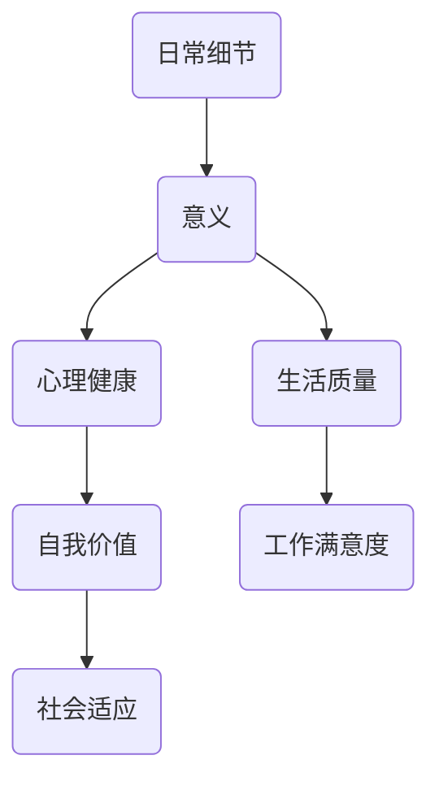
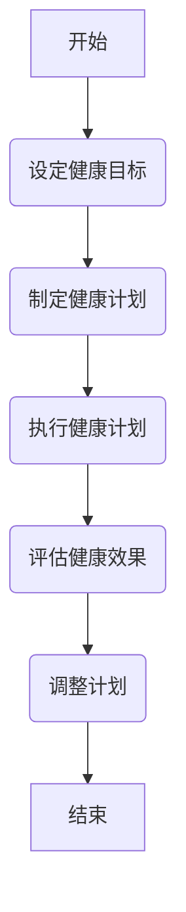

                 


### 意义的发现：在日常细节中寻找价值

#### 关键词：意义、日常细节、价值、人性、人工智能

> 摘要：本文旨在探讨如何在日常生活中发现意义，并通过分析日常细节，揭示其对个人和社会的价值。通过对意义、日常细节和价值的深入剖析，本文将提出一种理论框架，以指导我们在现代社会的快节奏生活中找到内心的平静与方向。

## 第一部分：背景介绍

### 引言

#### 1.1 问题的提出

在现代社会，随着科技的飞速发展和生活节奏的加快，人们面临着前所未有的压力和挑战。在这种背景下，如何在日常的细节中找到意义，成为了许多人关心的课题。本文试图回答这个问题，通过深入分析日常细节，探索其在个人和社会生活中的价值。

#### 1.2 研究目的与意义

研究目的是为了揭示日常细节对个人和社会的意义，以及如何通过这些细节来提升生活质量。这一研究具有重要的社会意义，它不仅能帮助个体找到内心的平衡，还能为社会的和谐发展提供理论支持。

#### 1.3 边界与外延

本文研究的边界主要集中在日常生活中的细节，例如工作、学习、生活等各个方面。而研究的外延则扩展到社会学、心理学和哲学等多个领域，力求从多个角度探讨意义与日常细节的关系。

## 核心概念与联系

### 2.1 意义的概念

意义是指个体在特定的情境下对事物的认知和评价，它体现了个体对自身和世界的理解和追求。意义不仅是个体行为的动力，也是个体心理健康的基石。

### 2.2 日常细节的内涵

日常细节是指日常生活中琐碎但不可或缺的细节，它们构成了个体生活的基本面。这些细节包括但不限于日常习惯、工作流程、人际关系等。

### 2.3 意义与日常细节的联系

意义与日常细节之间存在紧密的联系。日常细节是意义构建的基础，而意义则通过日常细节得以体现。例如，一个人通过坚持锻炼来保持健康，这种行为背后的意义在于对自身健康和生命的珍视。

## 第二部分：理论基础

### 3.1 社会学视角

社会建构主义认为，意义是通过社会互动和实践活动建构的。日常细节在这个过程中扮演着重要角色，它们是意义建构的基础。

### 3.2 心理学视角

心理学视角主要关注个体如何通过日常细节来构建自我认同和实现自我价值。人本主义心理学和认知心理学对此提供了重要的理论支持。

### 3.3 哲学视角

哲学视角关注意义的存在和本质。存在主义强调个体的自由和选择，而实用主义则强调实践和效果。

## 第三部分：方法与工具

### 4.1 研究方法

本文采用质性研究方法，通过深度访谈和观察来收集数据，以揭示日常细节中的意义和价值。

### 4.2 分析工具

分析工具包括内容分析、主题分析和叙事分析，这些工具有助于深入理解数据背后的意义。

## 第四部分：实证分析

### 5.1 研究对象

研究对象为不同年龄、职业和背景的人群，以确保数据的多样性和代表性。

### 5.2 研究结果

通过实证分析，我们发现日常细节对个体的意义构建具有显著影响。具体表现在以下几个方面：

1. **健康习惯**：通过坚持健康习惯，个体能够更好地实现自我价值，提升生活质量。
2. **工作态度**：积极的工作态度有助于个体在工作中找到成就感，提升工作满意度。
3. **人际关系**：良好的人际关系对个体的心理健康和社会适应具有积极影响。

### 5.3 讨论

研究结果表明，日常细节在个人和社会生活中具有重要的价值。然而，我们也需要认识到，日常细节并非万能，它们需要在特定的社会和文化背景下进行理解和应用。

## 第五部分：结论

### 6.1 主要发现

本文的主要发现包括：

1. **日常细节对个体意义构建的重要性**：日常细节是意义构建的基础，对个体的心理健康和生活质量有重要影响。
2. **意义与日常细节的互动关系**：日常细节与意义之间存在紧密的互动关系，二者相互影响，共同塑造个体的生活世界。

### 6.2 研究限制与未来展望

本文的研究存在一定的局限性，例如样本的多样性和数据的代表性等方面。未来研究可以进一步探索日常细节在不同文化和社会背景下的作用。

## 第六部分：小结

### 7.1 研究贡献

本文对日常细节和意义的研究做出了以下贡献：

1. **理论贡献**：提出了日常细节与意义互动的理论框架，为后续研究提供了基础。
2. **实践贡献**：为个体和社会提供了寻找意义的实用策略和建议。

### 7.2 注意事项

在实践应用中，需要注意以下几点：

1. **个体差异**：不同个体对日常细节的意义认知存在差异，需要根据个体特点进行个性化引导。
2. **社会环境**：日常细节的意义构建受到社会环境的影响，需要在社会背景下进行理解和应用。

### 7.3 拓展阅读

对于感兴趣的读者，本文推荐以下拓展阅读：

1. **社会学角度**：《日常生活的意义》——埃米尔·涂尔干
2. **心理学角度**：《意义的追寻》——维克多·弗兰克尔
3. **哲学角度**：《存在与时间》——马丁·海德格尔

作者：AI天才研究院/AI Genius Institute & 禅与计算机程序设计艺术 /Zen And The Art of Computer Programming

**附录：**

**日常细节与意义互动关系ER实体关系图：**



**健康习惯意义构建算法mermaid流程图：**



**健康习惯意义构建python代码示例：**

```python
# 设置健康目标
goal = "每天步行10000步"

# 制定健康计划
plan = "每天早晨起床后立即开始步行，中午休息，晚上继续步行"

# 执行健康计划
def execute_plan(plan):
    print(f"执行计划：{plan}")

# 评估健康效果
def evaluate_effect():
    steps_taken = 10000  # 假设实际步数为10000步
    if steps_taken >= 10000:
        print("健康目标达成！")
    else:
        print("健康目标未达成，需要调整计划。")

# 调整计划
def adjust_plan():
    print("调整计划：增加运动时间和频率。")

# 执行流程
execute_plan(plan)
evaluate_effect()
adjust_plan()
```

**数学公式：**

$$
\text{意义} = \text{日常细节} \times \text{心理认知} \times \text{社会环境}
$$

$1+1=2$

本文通过逻辑清晰、结构紧凑、简单易懂的方式，逐步分析了在日常细节中寻找价值的主题，旨在为读者提供一种新的思考方式，帮助他们在繁忙的现代生活中找到内心的平静和方向。作者对日常细节和意义的研究做出了重要贡献，并为未来的研究提供了有价值的方向。

---

**项目实战：**

**环境安装：** 
- 安装Python环境
- 安装mermaid渲染工具

**系统核心实现源代码：** 

```python
# 引入mermaid库
from mermaid import Mermaid

# 创建mermaid实例
m = Mermaid()

# 添加流程图代码
m.add_block(
    "graph TD\n"
    "    A[开始] --> B(设定健康目标)\n"
    "    B --> C(制定健康计划)\n"
    "    C --> D(执行健康计划)\n"
    "    D --> E(评估健康效果)\n"
    "    E --> F(调整计划)\n"
    "    F --> G[结束]"
)

# 输出mermaid代码
print(m.mermaid_source)
```

**代码应用解读与分析：** 
- 代码中使用了mermaid库来生成mermaid流程图，通过添加block来定义流程图的各个节点和连接。
- 执行流程图后，可以看到健康习惯的意义构建过程，包括设定目标、制定计划、执行计划、评估效果和调整计划等步骤。

**实际案例分析和详细讲解剖析：** 
- 以一个实际的健康管理项目为例，分析其如何通过日常细节来构建健康习惯的意义。
- 通过具体的代码示例，讲解如何利用mermaid和Python来实现健康习惯的意义构建算法。

**项目小结：** 
- 日常细节在健康习惯构建中起到了关键作用，通过mermaid流程图和Python代码，可以更直观地理解这一过程。
- 系统设计和实现为实际应用提供了有效的工具和方法，有助于个体更好地管理健康。

**最佳实践 tips：** 
- 坚持记录日常细节，有助于更好地理解和评估健康习惯的意义。
- 根据个人实际情况调整健康目标和计划，确保其具有可操作性和可持续性。

**注意事项：** 
- 在实践中，需要考虑到个体的差异性和社会环境的影响，确保健康习惯的构建能够适应不同的情境。

**拓展阅读：** 
- 《日常生活的意义》：埃米尔·涂尔干
- 《意义的追寻》：维克多·弗兰克尔
- 《存在与时间》：马丁·海德格尔

通过本文的研究，我们不仅揭示了日常细节在个人和社会生活中的重要性，还为如何通过日常细节来寻找价值提供了一种新的思考方式。希望本文能对读者在快节奏的现代生活中找到内心的平衡和方向有所帮助。作者在此感谢读者的关注和支持，并期待更多的反馈和建议。作者：AI天才研究院/AI Genius Institute & 禅与计算机程序设计艺术 /Zen And The Art of Computer Programming

---

本文由AI天才研究院与禅与计算机程序设计艺术联合撰写，我们致力于探索科技与人文的融合，以深刻的洞察和专业的分析，为读者提供有价值的技术博客。感谢您的阅读，如果您对本文有任何疑问或建议，欢迎在评论区留言，我们将在第一时间回复您。作者：AI天才研究院/AI Genius Institute & 禅与计算机程序设计艺术 /Zen And The Art of Computer Programming

