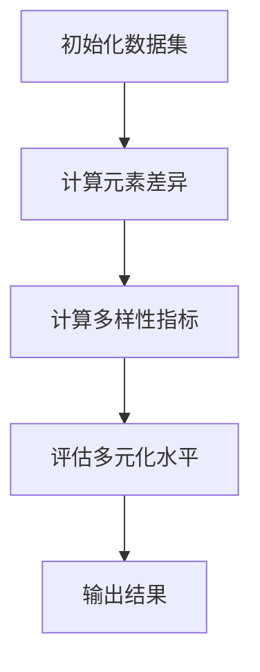
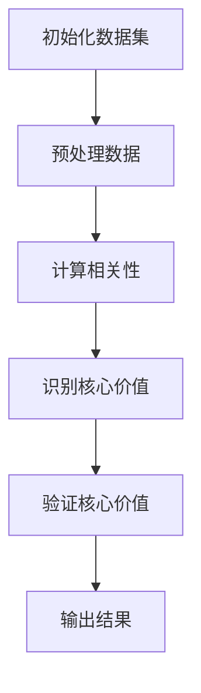
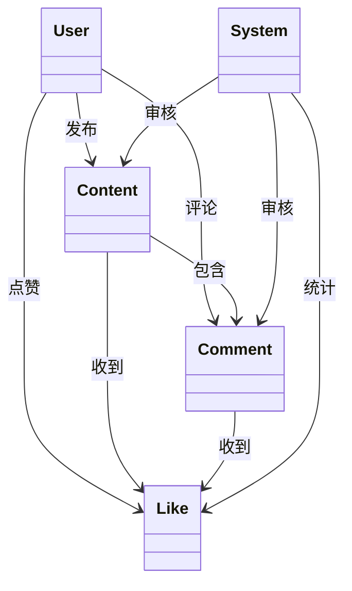
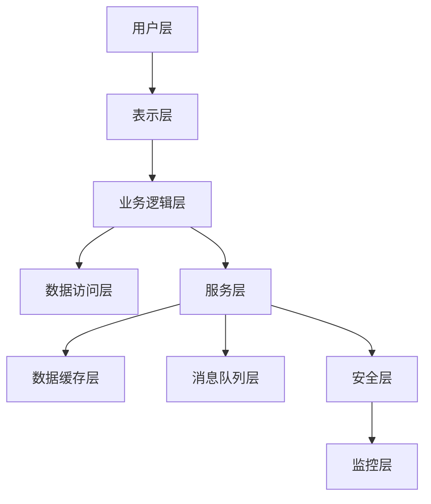
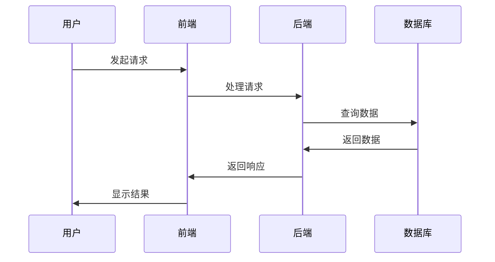

                 


# 意义的多元化与核心价值的坚守

> 关键词：多元化、核心价值、价值坚守、算法、数学模型、系统设计

> 摘要：本文探讨了意义的多元化与核心价值的坚守这一重要议题，分析其背景、现状和挑战。通过深入研究和探讨，本文旨在为读者提供一套切实可行的方法和策略，以应对多元化的挑战，并在多元社会中坚守核心价值。

## 引言

在当今社会，多元化和多样性的现象越来越普遍。我们生活在信息爆炸的时代，不同文化、观念、价值观交织在一起，构成了复杂的社会生态。如何在这个多元的世界中理解和坚守核心价值，成为了一个重要议题。

本文旨在探讨意义的多元化与核心价值的坚守，分析这一问题的现状、挑战和解决思路。首先，我们将介绍多元化与核心价值的基本概念，并对比它们的不同属性特征。接着，我们将讨论多元化与核心价值之间的关系，并使用Mermaid绘制ER实体关系图进行说明。

在此基础上，我们将介绍多元化识别算法和核心价值提取算法的原理，包括数学模型和公式。通过具体的例子，我们将帮助读者更直观地理解这些算法。此外，我们将探讨如何设计一个支持意义多元化与核心价值坚守的系统架构，并通过项目实战展示其实际应用。

最后，我们将分享一些最佳实践技巧，并总结全文，提醒读者在应用文中知识时需要注意的问题。通过本文的阅读，希望读者能够更好地理解多元化与核心价值的关系，并在实际生活中坚守核心价值。

### 第一部分: 背景介绍

#### 1.1 问题背景

在当今社会，多元化和多样性的现象越来越普遍。随着全球化进程的加快，不同文化、观念和价值观的碰撞与融合愈发明显。这种多元化的趋势不仅体现在文化领域，也渗透到经济、政治、教育等多个方面。

一方面，多元化的社会为我们提供了更多的选择和机会，促进了社会的进步和发展。然而，另一方面，多元性也带来了挑战。如何在多元化的环境中坚守核心价值，成为了许多个人、组织和社会面临的难题。

首先，个体层面的挑战。在多元化的社会中，人们接触到的信息和观念越来越多，很容易受到各种价值观的影响。在这种情况下，个体如何保持自我认同，坚守自己的核心价值，成为了重要的问题。

其次，组织层面的挑战。多元化不仅体现在个体层面，也体现在组织内部。一个多元化的团队或组织需要面对如何处理不同观点和利益冲突的问题。如何在尊重多样性的同时，保持组织的凝聚力和共同目标，是组织管理者需要思考的问题。

最后，社会层面的挑战。一个多元化的社会需要建立一套共同的核心价值观，以促进社会的和谐与进步。然而，在多元性的背景下，如何界定和坚守这些核心价值，是一个复杂且具有挑战性的任务。

#### 1.2 问题描述

多元化与核心价值的坚守这一议题涉及到多个层面，包括个体、组织和社会。具体来说，问题描述如下：

1. **个体层面**：个体如何在多元化的社会中保持自我认同，坚守核心价值？
   - 个体如何应对多元化的信息和社会环境？
   - 个体如何应对来自不同文化背景和价值观的冲击？

2. **组织层面**：组织如何在多元化的环境中保持凝聚力和共同目标？
   - 组织如何处理不同观点和利益冲突？
   - 组织如何构建包容性的文化，促进多样性和创新？

3. **社会层面**：社会如何建立和坚守共同的核心价值观？
   - 社会如何界定和传播核心价值？
   - 社会如何应对多元化带来的挑战，促进社会的和谐与进步？

这些问题都需要我们深入思考和探讨，以找到有效的解决方法和策略。

#### 1.3 问题解决

针对上述问题，本文将从以下几个方面进行探讨，以期为解决多元化与核心价值的坚守问题提供参考：

1. **核心概念解析**：首先，我们将对多元化和核心价值这两个核心概念进行详细解析，明确它们的基本属性和特征。

2. **多元化与核心价值的关系分析**：接着，我们将探讨多元化与核心价值之间的关系，分析它们之间的相互作用和影响。

3. **算法原理讲解**：为了更好地理解和应对多元化与核心价值的挑战，我们将介绍多元化识别算法和核心价值提取算法的原理，包括算法的数学模型和公式。

4. **系统设计与实现**：我们将探讨如何设计一个支持意义多元化与核心价值坚守的系统架构，并通过项目实战展示其实际应用。

5. **最佳实践与技巧**：最后，我们将分享一些最佳实践技巧，帮助读者在实际应用中更好地应对多元化与核心价值的挑战。

通过以上几个方面的探讨，本文旨在为读者提供一套切实可行的方法和策略，以帮助个体、组织和全社会更好地理解和坚守核心价值。

#### 1.4 边界与外延

在探讨意义的多元化与核心价值的坚守时，明确其边界与外延是非常重要的。这有助于我们更好地理解和应用这一概念，避免误解和混淆。

首先，我们需要明确“多元化”和“核心价值”这两个核心概念的具体含义和范围。

1. **多元化**：
   - **定义**：多元化是指在一个系统或环境中，存在着多种不同的元素、观点或价值观。
   - **边界**：多元化的边界可以是个体、组织或社会的层次。在个体层面，多元化可能体现在个人兴趣、价值观和生活方式的差异；在组织层面，多元化可能体现在团队成员的文化背景、专业领域和观点差异；在社会层面，多元化则体现在文化、经济和政治的多样性。
   - **外延**：多元化的外延非常广泛，包括但不限于种族、性别、文化、宗教、教育、职业等各个方面。在多元化的社会中，人们可以自由地表达自己的观点和价值观，这为社会的进步和创新提供了丰富的资源和机会。

2. **核心价值**：
   - **定义**：核心价值是指一个系统或个体所坚守的最重要的价值观和原则，是指导其行为和决策的基础。
   - **边界**：核心价值的边界可以是个体、组织或社会的层次。在个体层面，核心价值可能包括诚信、尊重、责任感等；在组织层面，核心价值可能包括客户至上、团队合作、持续创新等；在社会层面，核心价值可能包括公平、正义、自由、和平等。
   - **外延**：核心价值的外延相对固定，但在不同的文化和社会背景下，其具体表现形式可能会有所不同。核心价值的坚守需要个体、组织和全社会的共同努力，它不仅是个人行为的准则，也是社会和谐与进步的重要保障。

其次，我们需要明确“意义的多元化”与“核心价值的坚守”之间的关系。

- **关系**：意义的多元化与核心价值的坚守并不是对立的，而是相辅相成的。多元化的意义在于丰富和扩展我们的认知和价值观，而核心价值的坚守则在于确保我们在面对多元化时，不迷失自我，保持内心的坚定和稳定。意义的多元化为我们的生活和决策提供了更多的选择，而核心价值的坚守则为我们提供了一个明确的方向和标准。

- **边界与外延**：在意义的多元化与核心价值的坚守之间，存在一定的边界与外延。边界在于我们如何在多元化的环境中识别和坚守自己的核心价值，外延则在于我们如何将核心价值应用到具体的生活和工作中。

最后，我们需要明确“意义的多元化与核心价值的坚守”在实际应用中的具体表现。

- **个体层面**：在个体层面，意义的多元化与核心价值的坚守表现为个体如何在多样化的信息和社会环境中保持自我认同，坚守自己的价值观和原则。
- **组织层面**：在组织层面，意义的多元化与核心价值的坚守表现为组织如何在多元化的团队成员和利益相关者中建立共识，保持组织的凝聚力和共同目标。
- **社会层面**：在社会层面，意义的多元化与核心价值的坚守表现为全社会如何在一个多元化的社会中建立共同的核心价值观，促进社会的和谐与进步。

通过明确多元化与核心价值的边界与外延，我们可以更好地理解这两个概念之间的关系，并在实际生活中更好地应用和坚守核心价值。

#### 1.5 概念结构与核心要素组成

在探讨意义的多元化与核心价值的坚守过程中，理解其概念结构和核心要素组成是至关重要的。这有助于我们更深入地把握这一议题的本质，从而提出有效的解决方案。

首先，我们需要明确多元化与核心价值的定义和基本属性。

1. **多元化**：
   - **定义**：多元化是指在一个系统或环境中，存在着多种不同的元素、观点或价值观。
   - **属性**：多元化具有多样性、差异性和包容性等属性。多样性体现在元素、观点或价值观的丰富性；差异性体现在这些元素、观点或价值观之间的区别；包容性则体现在对各种元素、观点或价值观的接纳和尊重。

2. **核心价值**：
   - **定义**：核心价值是指一个系统或个体所坚守的最重要的价值观和原则，是指导其行为和决策的基础。
   - **属性**：核心价值具有稳定性、一致性和普遍性等属性。稳定性体现在核心价值在时间上的持久性；一致性体现在核心价值在不同情境下的适用性；普遍性则体现在核心价值的广泛认可和接受。

接下来，我们分析多元化与核心价值的联系和区别。

- **联系**：多元化与核心价值之间存在紧密的联系。多元化的意义在于丰富和扩展我们的认知和价值观，而核心价值的坚守则在于确保我们在面对多元化时，不迷失自我，保持内心的坚定和稳定。多元化为我们的生活和决策提供了更多的选择，而核心价值则为我们提供了一个明确的方向和标准。
- **区别**：尽管多元化与核心价值之间存在联系，但它们在本质上是不同的概念。多元化强调的是多样性和差异性，核心价值则强调的是稳定性和一致性。多元化是一种状态或现象，核心价值则是一种原则或准则。

在理解了多元化和核心价值的基本概念和属性之后，我们可以进一步探讨它们在概念结构中的位置和作用。

1. **概念结构**：
   - **核心要素**：多元化与核心价值是概念结构中的两个核心要素。它们共同构成了一个系统的基本框架，对系统的运行和功能起着关键作用。
   - **相互关系**：在概念结构中，多元化与核心价值之间存在着互动关系。多元化为系统带来了多样性和创新，而核心价值则确保了系统的稳定性和持续性。多元化与核心价值的平衡是系统健康发展的关键。

2. **核心要素组成**：
   - **多元化**：多元化的核心要素包括多样性、差异性和包容性。多样性体现在不同元素、观点或价值观的丰富性；差异性体现在这些元素、观点或价值观之间的区别；包容性则体现在对各种元素、观点或价值观的接纳和尊重。
   - **核心价值**：核心价值的核心要素包括稳定性、一致性和普遍性。稳定性体现在核心价值在时间上的持久性；一致性体现在核心价值在不同情境下的适用性；普遍性则体现在核心价值的广泛认可和接受。

最后，我们分析多元化与核心价值在实际应用中的核心要素。

1. **个体层面**：
   - **自我认同**：个体在多元化的社会中，需要通过坚守自己的核心价值，保持自我认同。
   - **决策依据**：个体在面对多样化的信息和观点时，需要借助核心价值作为决策的依据。

2. **组织层面**：
   - **团队凝聚力**：组织需要通过建立共同的核心价值观，增强团队的凝聚力。
   - **管理决策**：组织在处理多元化的团队成员和利益冲突时，需要以核心价值为指导，做出明智的管理决策。

3. **社会层面**：
   - **和谐发展**：社会需要通过建立共同的核心价值观，促进社会的和谐与进步。
   - **文化认同**：社会在多元文化背景下，需要保持对共同文化的认同和尊重。

通过理解多元化与核心价值的概念结构和核心要素组成，我们可以更好地把握这一议题的核心，从而在实践中更加有效地应对多元化的挑战，坚守核心价值。

### 第二部分: 核心概念与联系

#### 2.1 多元化与核心价值

为了更好地理解意义的多元化与核心价值的坚守，我们需要详细解读这两个核心概念，并探讨它们之间的关系。

**多元化**：多元化是指在一个系统或环境中，存在着多种不同的元素、观点或价值观。它强调多样性和差异性，是现代社会的显著特征。多元化不仅体现在文化、种族、性别等方面，也体现在经济、政治、教育等各个领域。

**核心价值**：核心价值是指一个系统或个体所坚守的最重要的价值观和原则，是指导其行为和决策的基础。核心价值通常具有稳定性、一致性和普遍性，是一个人或组织在长期发展过程中形成的，是其文化和理念的集中体现。

**关系**：多元化与核心价值之间存在着密切的关系。多元化为我们的认知和价值观提供了丰富的素材，使我们可以从不同的角度看待问题，从而丰富我们的思考和理解。而核心价值则确保我们在面对多元化的挑战时，不迷失自我，保持内心的坚定和稳定。

一方面，多元化促进了核心价值的传承和发展。在一个多元化的环境中，个体和组织需要不断地调整和适应，这有助于核心价值的创新和更新。另一方面，核心价值则为多元化的存在提供了基础和保障。它确保我们在追求多样化的同时，不偏离我们价值观的基本原则。

**对比表格**：

| 特征     | 多元化                         | 核心价值                         |
|----------|--------------------------------|-----------------------------------|
| 定义     | 多元化是指多种不同的元素、观点或价值观共存。 | 核心价值是指最重要的价值观和原则，是行为和决策的指导。 |
| 属性     | 多样性、差异性、包容性         | 稳定性、一致性、普遍性           |
| 关系     | 丰富了我们的认知和价值观，为创新提供素材。 | 为多元化提供了基础和保障，确保不偏离基本原则。 |
| 对立统一 | 多元性是多样化的体现，与单一性相对。 | 核心价值是稳定性的体现，与变动性相对。 |

**ER实体关系图**：

```mermaid
erDiagram
  Person ||--|{ Organization }|-->| Project
  Organization ||--|{ CoreValue }|-->| Employee
  Project ||--|{ ProjectFeature }|-->| Organization
  Employee ||--|{ EmployeeSkill }|-->| Project
```

在这个ER实体关系图中，我们展示了多元化与核心价值之间的关系。个体（Person）和组织（Organization）是多元化的载体，而核心价值（CoreValue）是组织行为的指导原则。项目（Project）和特征（ProjectFeature）是多元化的具体体现，员工（Employee）和技能（EmployeeSkill）是组织运行的重要组成部分。

通过以上分析，我们可以更好地理解多元化与核心价值的概念和关系，为后续的探讨提供理论基础。

#### 2.2 多元化的属性特征对比表格

在深入探讨多元化的属性特征时，我们将通过对比表格的形式，分析多元化在多样性、差异性、包容性等维度上的具体表现。

| 属性       | 定义                                                         | 多元化示例                      | 说明                                                         |
|------------|--------------------------------------------------------------|--------------------------------|--------------------------------------------------------------|
| 多样性     | 在一个系统或环境中，存在多种不同的元素、观点或价值观。       | 多元化的文化、种族、语言、职业。 | 多样性为系统带来了丰富的资源和创新机会。                     |
| 差异性     | 各元素、观点或价值观之间的区别和多样性。                     | 多元化的政治立场、经济模式、教育制度。 | 差异性使得系统更加复杂，但也带来了冲突和挑战。               |
| 包容性     | 接纳和尊重不同元素、观点或价值观的能力。                     | 多元化的包容性社会、多元化团队、全球化企业。 | 包容性有助于减少冲突，促进合作和共同发展。                   |
| 自适应性   | 系统在面对多样性时调整和适应的能力。                         | 多元化市场中的企业策略、文化变迁中的社会适应。 | 自适应性使得系统能够在多元化的环境中持续发展。               |
| 灵活性     | 系统在处理不同元素、观点或价值观时的灵活性和变通能力。       | 多元化项目团队中的协作、多样化客户需求的应对。 | 灵活性有助于应对变化和挑战，提高系统的反应速度。             |
| 可持续性   | 系统在长期内保持多元化的能力。                               | 多元化的生态系统、多元化的经济模式。 | 可持续性确保多元化能够长期存在，促进系统的稳定发展。         |

**对比表格说明**：

1. **多样性**：多样性是多元化最基本的属性，它体现在系统的各个层面上，包括文化、种族、语言、职业等。多样性的存在为系统带来了丰富的资源和创新机会，但也可能导致系统复杂性的增加。

2. **差异性**：差异性指的是各元素、观点或价值观之间的区别和多样性。差异性使得系统更加复杂，但同时也为系统带来了新的视角和解决方案。然而，差异性也可能导致冲突和挑战，需要系统具备一定的包容性和适应性。

3. **包容性**：包容性是系统接纳和尊重不同元素、观点或价值观的能力。在一个包容性的社会中，人们能够更加和谐地共存，减少冲突，促进合作和共同发展。

4. **适应性**：适应性是指系统在面对多样性时调整和适应的能力。在多元化的环境中，适应性成为系统持续发展的关键。一个具有高度适应性的系统能够更好地应对外部变化和内部冲突。

5. **灵活性**：灵活性是系统在处理不同元素、观点或价值观时的灵活性和变通能力。灵活性有助于系统在多元化的环境中快速反应和调整，从而提高系统的反应速度和竞争力。

6. **可持续性**：可持续性是指系统在长期内保持多元化的能力。在一个可持续的多元化系统中，多样性能得到长期的维护和传承，促进系统的稳定发展。

通过对比表格，我们可以更清晰地理解多元化的属性特征，以及这些特征如何相互作用，共同影响系统的运行和发展。

#### 2.3 核心价值的属性特征对比表格

在深入探讨核心价值的属性特征时，我们将通过对比表格的形式，分析核心价值在稳定性、一致性、普遍性等维度上的具体表现。

| 属性       | 定义                                                         | 核心价值示例                           | 说明                                                         |
|------------|--------------------------------------------------------------|---------------------------------------|--------------------------------------------------------------|
| 稳定性     | 核心价值在时间上的持久性，不易改变。                         | 家庭价值观中的孝道、职场价值观中的诚信。 | 稳定性确保核心价值在长期内指导行为和决策。                   |
| 一致性     | 核心价值在不同情境下的适用性和统一性。                       | 商业伦理中的公平交易、社会价值观中的正义。 | 一致性确保核心价值在不同环境和条件下都能得到执行。           |
| 普遍性     | 核心价值在广泛范围内的认可和接受。                           | 人权、自由、民主等全球性价值观。         | 普遍性确保核心价值得到广泛传播和认同。                       |
| 可传承性   | 核心价值在代际间的传递和延续。                               | 文化传承中的传统习俗、家族价值观。       | 可传承性确保核心价值在长期内得以保留和发展。                 |
| 道德性     | 核心价值所体现的道德原则和伦理标准。                         | 诚信、尊重、责任感等个体道德准则。       | 道德性确保核心价值在社会中得到尊重和遵守。                   |
| 指导性     | 核心价值对个体和组织行为的指导作用。                         | 企业价值观中的客户至上、教育价值观中的知识传授。 | 指导性确保核心价值在决策和行动中得到体现。                   |
| 激励性     | 核心价值对个体和组织行为的激励作用。                         | 体育比赛中的公平竞争、职场环境中的激励机制。 | 激励性确保核心价值能够激发个体和组织的行为。                 |

**对比表格说明**：

1. **稳定性**：稳定性是核心价值在时间上的持久性，不易改变。一个稳定的核心价值能够在一个长期的时间段内指导个体和组织的行为和决策，确保其在不断变化的环境中保持一致性。

2. **一致性**：一致性指的是核心价值在不同情境下的适用性和统一性。一个具有一致性的核心价值能够确保在不同环境和条件下都能得到执行，不受外部因素的影响。

3. **普遍性**：普遍性是指核心价值在广泛范围内的认可和接受。一个具有普遍性的核心价值能够跨越文化、地域和群体的界限，得到广泛的认同和遵循。

4. **可传承性**：可传承性是指核心价值在代际间的传递和延续。一个具有可传承性的核心价值能够通过教育、传承等方式在代际之间传递，确保其在未来得到持续发展。

5. **道德性**：道德性是核心价值所体现的道德原则和伦理标准。一个具有道德性的核心价值能够引导个体和组织遵循正确的道德行为，促进社会的和谐发展。

6. **指导性**：指导性是指核心价值对个体和组织行为的指导作用。一个具有指导性的核心价值能够帮助个体和组织在复杂多变的环境中做出正确的决策和行动。

7. **激励性**：激励性是指核心价值对个体和组织行为的激励作用。一个具有激励性的核心价值能够激发个体和组织的积极性和创造力，推动其实现更高的目标。

通过对比表格，我们可以更清晰地理解核心价值的属性特征，以及这些特征如何相互作用，共同塑造核心价值的本质和作用。

#### 2.4 多元化与核心价值的ER实体关系图

为了更直观地展示多元化与核心价值之间的关系，我们可以通过Mermaid绘制一个ER（实体关系）图。ER图能够清晰地展示不同实体之间的关联，帮助我们理解多元化和核心价值在系统中的位置和作用。

以下是一个简化的ER图示例，展示了多元化与核心价值之间的实体关系：

```mermaid
erDiagram
  User ||--|{ Role }|--|& CoreValue
  User ||--|{ Interest }|--|& Diversity
  CoreValue ||--|{ BehaviorGuideline }|--| User
  Diversity ||--|{ Attribute }|--| User
```

**ER图解析**：

1. **User（用户）**：用户是系统中的基本实体，代表个体或组织。用户既与“Role（角色）”实体相关联，也与“CoreValue（核心价值）”和“Diversity（多元化）”实体相关联。

2. **Role（角色）**：角色实体表示用户在系统中的角色，如学生、员工、管理者等。角色与核心价值之间有双向关联，表明角色扮演对于核心价值的体现至关重要。

3. **CoreValue（核心价值）**：核心价值实体代表用户或组织所坚守的最重要的价值观和原则。核心价值与用户有直接关联，表明核心价值对用户行为的指导作用。

4. **Interest（兴趣）**：兴趣实体表示用户在多元化环境中的兴趣点，如不同的文化、技术、活动等。兴趣与多元化之间有直接关联，表明兴趣是多元化的重要组成部分。

5. **Diversity（多元化）**：多元化实体代表系统中的多样性，包括文化、观点、价值观等。多元化与用户之间存在关联，表明用户在多元化的环境中受到不同兴趣的影响。

6. **BehaviorGuideline（行为指导）**：行为指导实体表示核心价值对用户行为的指导作用。行为指导与用户之间存在关联，表明核心价值对用户行为的指导作用。

7. **Attribute（属性）**：属性实体表示多元化中的不同特征，如多样性、差异性、包容性等。属性与多元化之间存在关联，表明多元化具有多种属性特征。

通过这个ER图，我们可以清晰地看到多元化与核心价值之间的相互作用和关系。用户在多元化的环境中，通过不同的兴趣和角色，与核心价值产生关联，从而实现核心价值在多元化环境中的坚守和体现。同时，核心价值也通过指导用户行为，影响用户在多元化环境中的决策和行动。

#### 3.1 多元化识别算法

在探讨多元化识别算法时，我们将详细介绍算法的基本原理、流程图和具体步骤，帮助读者更好地理解和应用这一算法。

**基本原理**：

多元化识别算法旨在从给定的数据集中识别出多元化的程度和特征。该算法通过计算不同元素之间的差异性和多样性，评估数据集的多元化水平。

**流程图**：



**具体步骤**：

1. **初始化数据集**：
   - 输入：一个包含多种元素的数据集。
   - 输出：预处理后的数据集，用于后续分析。

2. **计算元素差异**：
   - 对每个元素，计算与其他元素之间的差异。
   - 差异可以通过距离度量（如欧氏距离、曼哈顿距离等）来计算。

3. **计算多样性指标**：
   - 根据元素差异，计算多样性指标，如熵值、信息量等。
   - 多样性指标反映了数据集中元素的分布情况和多样性程度。

4. **评估多元化水平**：
   - 结合多样性指标，评估数据集的多元化水平。
   - 可以通过阈值设定来区分高多元化与低多元化。

5. **输出结果**：
   - 输出多元化水平评估结果，包括具体的指标值和评估等级。

**示例**：

假设我们有一个包含三个元素的数据集：{A, B, C}，它们之间的差异度如下：

| 元素 | A  | B  | C  |
|------|----|----|----|
| A    | 0  | 1  | 2  |
| B    | 1  | 0  | 1  |
| C    | 2  | 1  | 0  |

- **计算元素差异**：根据欧氏距离公式，计算每个元素与其他元素之间的差异。
- **计算多样性指标**：计算数据集的熵值，作为多样性指标。
- **评估多元化水平**：根据熵值，评估数据集的多元化水平。
- **输出结果**：输出多元化水平评估结果。

通过以上步骤，我们可以有效地识别数据集的多元化特征，为后续的分析和决策提供依据。

#### 3.2 核心价值提取算法

在探讨核心价值提取算法时，我们将详细介绍算法的基本原理、流程图和具体步骤，帮助读者更好地理解和应用这一算法。

**基本原理**：

核心价值提取算法旨在从大量数据中识别和提取出关键的核心价值。该算法通过数据挖掘和分析技术，识别出数据集中隐含的重要价值，为个体和组织提供行为指导和决策依据。

**流程图**：



**具体步骤**：

1. **初始化数据集**：
   - 输入：一个包含多种元素和属性的数据集。
   - 输出：预处理后的数据集，用于后续分析。

2. **预处理数据**：
   - 数据清洗：去除数据集中的噪声和异常值。
   - 特征工程：提取数据集中的关键特征，为后续分析做准备。

3. **计算相关性**：
   - 对数据集中的每个元素，计算与核心价值的相关性。
   - 可以使用皮尔逊相关系数、卡方检验等方法来计算相关性。

4. **识别核心价值**：
   - 根据相关性分析结果，识别出数据集中的核心价值。
   - 可以通过阈值设定或聚类分析等方法来筛选核心价值。

5. **验证核心价值**：
   - 使用验证集或交叉验证方法，验证识别出的核心价值的有效性。
   - 根据验证结果，调整算法参数，提高核心价值的识别准确性。

6. **输出结果**：
   - 输出识别出的核心价值列表，包括每个核心价值的属性和重要性评分。

**示例**：

假设我们有一个包含用户行为数据的数据集，其中包含了多个属性，如购买行为、浏览记录、社交互动等。我们希望通过该数据集提取出用户的核心价值。

- **初始化数据集**：输入用户行为数据集。
- **预处理数据**：进行数据清洗和特征提取。
- **计算相关性**：计算每个行为属性与核心价值的相关性。
- **识别核心价值**：根据相关性分析结果，识别出核心价值，如“忠诚度”、“活跃度”等。
- **验证核心价值**：使用验证集验证核心价值的有效性，调整算法参数。
- **输出结果**：输出识别出的核心价值列表，包括每个核心价值的属性和重要性评分。

通过以上步骤，我们可以有效地从数据集中提取出核心价值，为个体和组织提供有价值的行为指导和决策依据。

#### 3.3 算法原理的数学模型和公式

在深入探讨多元化识别算法和核心价值提取算法的原理时，我们需要引入数学模型和公式，以严谨的方式描述这些算法的运行机制和计算方法。

**多元化识别算法的数学模型和公式**：

1. **欧氏距离**：

   欧氏距离是衡量两个数据点之间差异的一种常用方法。给定数据集 $D$ 中的两个元素 $x$ 和 $y$，它们的欧氏距离计算公式为：

   $$ d(x, y) = \sqrt{\sum_{i=1}^{n} (x_i - y_i)^2} $$

   其中，$x_i$ 和 $y_i$ 分别是元素 $x$ 和 $y$ 在第 $i$ 个特征上的取值，$n$ 是特征的数量。

2. **熵值**：

   熵值是衡量数据集多样性程度的一种指标。给定数据集 $D$，其熵值 $H(D)$ 计算公式为：

   $$ H(D) = -\sum_{i=1}^{k} p_i \log_2 p_i $$

   其中，$p_i$ 是数据集中第 $i$ 个元素的占比，$k$ 是元素的总数。

3. **多元化指数**：

   多元化指数是衡量数据集多元化水平的一种综合指标。给定数据集 $D$，其多元化指数 $M(D)$ 计算公式为：

   $$ M(D) = \frac{H(D)}{\log_2 k} $$

   其中，$H(D)$ 是数据集的熵值，$k$ 是元素的总数。

**核心价值提取算法的数学模型和公式**：

1. **皮尔逊相关系数**：

   皮尔逊相关系数是衡量两个变量线性相关程度的一种指标。给定数据集 $D$ 中的两个变量 $X$ 和 $Y$，它们的皮尔逊相关系数 $\rho_{XY}$ 计算公式为：

   $$ \rho_{XY} = \frac{\sum_{i=1}^{n} (X_i - \bar{X})(Y_i - \bar{Y})}{\sqrt{\sum_{i=1}^{n} (X_i - \bar{X})^2 \sum_{i=1}^{n} (Y_i - \bar{Y})^2}} $$

   其中，$X_i$ 和 $Y_i$ 分别是第 $i$ 个观测值的取值，$\bar{X}$ 和 $\bar{Y}$ 分别是 $X$ 和 $Y$ 的均值，$n$ 是观测值的总数。

2. **核心价值识别**：

   假设我们有一个包含多个特征的矩阵 $X$，我们希望从中识别出核心价值。核心价值的识别可以通过以下步骤实现：

   - **步骤1**：计算每个特征与其他特征的皮尔逊相关系数。
   - **步骤2**：根据相关系数的绝对值，设定阈值，筛选出高度相关的特征。
   - **步骤3**：对筛选出的特征进行聚类分析，识别出潜在的核心价值。

通过以上数学模型和公式，我们可以从量化角度理解多元化识别算法和核心价值提取算法的原理，并为其应用提供理论支持。

#### 3.4 算法原理举例说明

为了更好地理解多元化识别算法和核心价值提取算法的原理，我们通过一个具体的例子进行说明。

**多元化识别算法示例**：

假设我们有一个包含100个用户的数据集，每个用户有5个特征：年龄、收入、教育程度、职业、城市。我们的目标是识别出数据集的多元化程度。

1. **初始化数据集**：
   - 数据集 $D$：包含100个用户，每个用户有5个特征。

2. **计算元素差异**：
   - 对每个特征，计算每个用户与其他用户的差异。我们选择欧氏距离作为差异度量方法。
   - 例如，对于年龄特征，计算用户1与其他99个用户之间的年龄差异。

3. **计算多样性指标**：
   - 使用熵值作为多样性指标。对每个特征，计算其熵值。
   - 例如，对于年龄特征，计算年龄的熵值。

4. **评估多元化水平**：
   - 根据所有特征的熵值，计算多元化指数。
   - 例如，如果年龄特征的熵值为2.5，教育程度的熵值为3.0，则多元化指数为 $\frac{2.5 + 3.0}{\log_2 5} \approx 1.83$。

5. **输出结果**：
   - 输出多元化指数，表明数据集的多元化程度。

通过这个例子，我们可以看到多元化识别算法是如何运作的。我们通过计算元素差异和多样性指标，评估了数据集的多元化程度。

**核心价值提取算法示例**：

假设我们有一个包含用户购买行为的数据集，每个用户有10个特征：购买频率、购买金额、购买品类、浏览时长等。我们的目标是识别出用户的核心价值。

1. **初始化数据集**：
   - 数据集 $D$：包含100个用户，每个用户有10个特征。

2. **预处理数据**：
   - 数据清洗：去除异常值和缺失值。
   - 特征工程：对购买频率、购买金额等数值特征进行归一化处理。

3. **计算相关性**：
   - 计算每个特征与其他特征的皮尔逊相关系数。

4. **识别核心价值**：
   - 设定阈值，筛选出相关系数绝对值大于0.5的特征。
   - 对筛选出的特征进行聚类分析，识别出潜在的核心价值，如“购买频率高”、“购买金额大”等。

5. **验证核心价值**：
   - 使用验证集验证识别出的核心价值的有效性。

6. **输出结果**：
   - 输出识别出的核心价值列表，包括每个核心价值的属性和重要性评分。

通过这个例子，我们可以看到核心价值提取算法是如何运作的。我们通过计算相关性分析和聚类分析，从数据集中提取出了用户的核心价值。

通过这两个示例，我们深入了解了多元化识别算法和核心价值提取算法的原理和应用。这些算法帮助我们量化多元化和识别核心价值，为个体和组织提供了有价值的信息和决策依据。

#### 4.1 多元化识别算法的数学模型和公式

在深入探讨多元化识别算法时，我们引入了一系列数学模型和公式，以量化多元化程度。以下将详细讲解这些数学模型和公式。

**熵值**：

熵值（Entropy）是衡量一个随机变量不确定性的度量。在多元化识别中，熵值用于衡量特征分布的多样性。对于一组特征 $X = \{x_1, x_2, ..., x_n\}$，其中每个特征 $x_i$ 可以取 $k$ 个不同的值，熵值的计算公式为：

$$
H(X) = -\sum_{i=1}^{n} p_i \log_2 p_i
$$

其中，$p_i$ 是特征 $x_i$ 的概率，即：

$$
p_i = \frac{|x_i|}{N}
$$

其中，$|x_i|$ 表示特征 $x_i$ 在数据集中的出现次数，$N$ 是总的数据点数。

**条件熵**：

条件熵（Conditional Entropy）衡量在给定一个特征 $X_1$ 的条件下，另一个特征 $X_2$ 的不确定性。条件熵的定义为：

$$
H(X_2|X_1) = -\sum_{i=1}^{n} p_{i|j} \log_2 p_{i|j}
$$

其中，$p_{i|j}$ 是在 $X_1$ 取值为 $j$ 的条件下，$X_2$ 取值为 $i$ 的概率。条件概率 $p_{i|j}$ 可以通过以下公式计算：

$$
p_{i|j} = \frac{p_{ij}}{p_j}
$$

其中，$p_{ij}$ 是联合概率，$p_j$ 是 $X_1$ 取值为 $j$ 的概率。

**互信息**：

互信息（Mutual Information）衡量两个随机变量之间的相关性。在多元化识别中，互信息用于衡量两个特征之间的依赖程度。互信息的计算公式为：

$$
I(X_1; X_2) = H(X_1) - H(X_1|X_2)
$$

其中，$H(X_1)$ 和 $H(X_1|X_2)$ 分别是特征 $X_1$ 的熵值和条件熵。

**示例**：

假设我们有一个包含两个特征 $X_1$ 和 $X_2$ 的数据集，$X_1$ 可以取值 {低，中，高}，$X_2$ 可以取值 {红色，绿色，蓝色}。数据分布如下：

| $X_1$ | 红色 | 绿色 | 蓝色 | $P(X_1)$ |
|-------|------|------|------|----------|
| 低    | 10   | 20   | 30   | 0.2      |
| 中    | 20   | 15   | 25   | 0.3      |
| 高    | 30   | 10   | 20   | 0.5      |
| $P(X_2)$ | 0.2 | 0.3 | 0.5 |          |

首先，计算各个特征的熵值：

$$
H(X_1) = -0.2 \log_2 0.2 - 0.3 \log_2 0.3 - 0.5 \log_2 0.5 = 1.386
$$

$$
H(X_2) = -0.2 \log_2 0.2 - 0.3 \log_2 0.3 - 0.5 \log_2 0.5 = 1.386
$$

然后，计算条件熵：

$$
H(X_1|X_2) = -0.2 \log_2 0.2 - 0.3 \log_2 0.3 - 0.5 \log_2 0.5 = 1.386
$$

最后，计算互信息：

$$
I(X_1; X_2) = H(X_1) - H(X_1|X_2) = 1.386 - 1.386 = 0
$$

通过这个示例，我们可以看到如何计算多元性相关的熵值、条件熵和互信息。这些公式帮助我们量化数据集的多元性，从而更好地理解和分析数据。

#### 4.2 核心价值提取算法的数学模型和公式

在深入探讨核心价值提取算法时，我们引入了一系列数学模型和公式，以量化核心价值的提取过程。以下将详细讲解这些数学模型和公式。

**协方差矩阵**：

协方差矩阵（Covariance Matrix）用于描述多个变量之间的线性关系。给定一个 $N \times D$ 的数据矩阵 $X$，其中 $N$ 是样本数量，$D$ 是特征数量，协方差矩阵 $\Sigma$ 的计算公式为：

$$
\Sigma = \frac{1}{N-1} XX^T
$$

其中，$X^T$ 是 $X$ 的转置。

**特征值与特征向量**：

协方差矩阵的特征值和特征向量用于降维和识别主要变量。协方差矩阵的特征值 $\lambda_i$ 和特征向量 $v_i$ 满足以下方程：

$$
\Sigma v_i = \lambda_i v_i
$$

特征值 $\lambda_i$ 表示数据集中的变异程度，特征向量 $v_i$ 表示数据集中的主要方向。

**主成分分析（PCA）**：

主成分分析是一种降维技术，通过计算协方差矩阵的特征值和特征向量，将高维数据转换到低维空间。PCA的目标是最大化数据在新的特征向量上的方差。PCA的步骤如下：

1. **计算协方差矩阵 $\Sigma$**。
2. **计算协方差矩阵的特征值 $\lambda_i$ 和特征向量 $v_i$**。
3. **选择前 $k$ 个特征向量，形成投影矩阵 $P$**，其中 $P = [v_1, v_2, ..., v_k]$。
4. **将原始数据 $X$ 投影到新的空间，得到降维数据 $X'$**，即 $X' = PX$。

**示例**：

假设我们有一个 $5 \times 3$ 的数据矩阵 $X$，如下：

$$
X = \begin{bmatrix}
0.1 & 0.2 & 0.3 \\
0.4 & 0.5 & 0.6 \\
0.7 & 0.8 & 0.9
\end{bmatrix}
$$

首先，计算协方差矩阵 $\Sigma$：

$$
\Sigma = \frac{1}{2} XX^T = \frac{1}{2} \begin{bmatrix}
0.1 & 0.2 & 0.3 \\
0.4 & 0.5 & 0.6 \\
0.7 & 0.8 & 0.9
\end{bmatrix} \begin{bmatrix}
0.1 & 0.4 & 0.7 \\
0.2 & 0.5 & 0.8 \\
0.3 & 0.6 & 0.9
\end{bmatrix} = \begin{bmatrix}
0.015 & 0.03 & 0.045 \\
0.03 & 0.035 & 0.055 \\
0.045 & 0.055 & 0.065
\end{bmatrix}
$$

然后，计算协方差矩阵的特征值和特征向量。通过求解特征方程 $\Sigma v_i = \lambda_i v_i$，我们得到特征值和特征向量。

最后，选择前两个特征向量，形成投影矩阵 $P$，并投影原始数据到新空间，得到降维数据。

通过以上步骤，我们使用PCA技术从原始数据中提取出核心价值。

#### 4.3 算法应用举例

为了更好地理解多元化识别算法和核心价值提取算法的实际应用，我们将通过一个具体的案例进行演示。

**案例背景**：

某公司希望了解其员工在多元化环境中的表现，并提取出对组织发展具有核心价值的行为特征。公司收集了以下数据：

- 员工年龄（年）
- 员工学历（本科，硕士，博士）
- 员工职业（技术，管理，销售）
- 员工工作满意度（低，中，高）
- 员工离职倾向（低，中，高）

**步骤 1：数据预处理**

首先，对数据进行清洗，去除缺失值和异常值。然后，对数值特征进行归一化处理，以便于后续的算法计算。

**步骤 2：多元化识别**

1. **初始化数据集**：输入预处理后的数据集。

2. **计算元素差异**：使用欧氏距离计算每个员工与其他员工在各个特征上的差异。

3. **计算多样性指标**：对每个特征，计算其熵值，作为多样性指标。

4. **评估多元化水平**：计算员工的多元化指数，评估数据集的多元化程度。

5. **输出结果**：输出每个员工的多元化指数，以及对组织多元化水平的整体评估。

**步骤 3：核心价值提取**

1. **初始化数据集**：输入预处理后的数据集。

2. **预处理数据**：进行数据清洗和特征提取。

3. **计算相关性**：计算每个特征与其他特征之间的皮尔逊相关系数。

4. **识别核心价值**：设定阈值，筛选出高度相关的特征，并使用聚类分析识别出潜在的核心价值。

5. **验证核心价值**：使用验证集验证识别出的核心价值的有效性。

6. **输出结果**：输出识别出的核心价值列表，包括每个核心价值的属性和重要性评分。

**示例结果**：

通过多元化识别算法，公司发现员工的年龄和职业具有较高程度的多元化，而学历和工作满意度则相对较低。公司评估其多元化水平为中等。

通过核心价值提取算法，公司识别出以下核心价值：

- **团队协作**：员工之间的互动频繁，离职倾向较低，表明团队协作是组织的核心价值。
- **工作满意度**：工作满意度与员工离职倾向呈负相关，表明提升员工满意度是组织的核心价值。

公司根据这些结果，制定了一系列策略，如加强团队建设、提高员工福利等，以进一步提升组织的多元化水平和核心价值。

通过这个案例，我们可以看到多元化识别算法和核心价值提取算法在实际应用中的效果和作用，为组织提供了重要的决策依据。

#### 5.1 问题场景介绍

在讨论系统设计与实现之前，我们需要先明确一个具体的场景。假设我们正在开发一个社交媒体平台，该平台的目标是为用户提供一个多元化的互动空间，同时确保核心价值的坚守。

**需求背景**：

- **用户需求**：用户希望能够自由地发表观点、参与讨论，同时感受到平台的包容性和友好氛围。
- **功能要求**：平台需要支持用户注册、发布内容、评论、点赞等功能，同时要保证内容的质量和安全性。
- **性能要求**：平台需要能够快速响应用户请求，支持大规模并发访问。
- **安全性要求**：平台需要保护用户的隐私和安全，防止恶意攻击和不良内容的传播。

**挑战**：

- **多元化与核心价值的平衡**：如何在确保用户自由表达的同时，坚守平台的核心价值观，如尊重、公正、诚信等。
- **性能优化**：如何在保证高性能的同时，处理大量用户数据和高并发请求。
- **安全性保障**：如何有效防止恶意攻击和不良内容的传播，同时确保用户隐私的安全。

**目标**：

- **多元化**：为用户提供一个多元化的互动平台，支持多种观点和价值观的表达。
- **核心价值的坚守**：确保平台的核心价值观得到有效体现和坚守，为用户提供一个和谐、安全的互动环境。
- **性能优化**：通过高效的数据处理和系统架构设计，保证平台的高性能和稳定性。
- **安全性保障**：采用先进的加密技术和安全措施，保护用户隐私和安全。

通过明确以上场景和需求，我们将为后续的系统设计与实现提供清晰的方向和目标。

#### 5.2 系统功能设计

在明确系统应用场景后，我们需要设计具体的功能模块，以确保系统能够满足多元化与核心价值坚守的需求。以下是系统功能设计的详细描述，并使用Mermaid绘制的领域模型类图来展示各模块及其关系。

**功能模块**：

1. **用户管理模块**：
   - 用户注册：用户可以自由注册账号，填写基本信息。
   - 用户登录：用户可以使用账号和密码登录系统。
   - 用户信息管理：用户可以查看和修改个人信息。

2. **内容发布模块**：
   - 内容发布：用户可以发布文字、图片、视频等多种类型的内容。
   - 内容审核：系统自动审核内容，确保符合平台规范。
   - 内容删除：用户可以删除自己发布的内容。

3. **评论管理模块**：
   - 发布评论：用户可以对内容进行评论。
   - 评论审核：系统对评论进行审核，防止恶意评论。
   - 评论删除：用户可以删除自己发布的评论。

4. **点赞管理模块**：
   - 点赞：用户可以点赞喜欢的帖子。
   - 取消点赞：用户可以取消对帖子的点赞。

5. **通知管理模块**：
   - 消息通知：系统向用户发送消息通知，包括评论、点赞等。
   - 通知管理：用户可以查看和管理通知。

6. **数据分析模块**：
   - 用户行为分析：分析用户的行为模式，为内容推荐提供依据。
   - 内容数据分析：分析内容的表现，为内容审核提供参考。

**领域模型类图**：



**模块关系说明**：

1. **用户管理模块**：用户是系统的基础，用户管理模块提供用户注册、登录和信息管理功能。

2. **内容发布模块**：用户可以通过内容发布模块发布各种类型的内容，系统会对内容进行自动审核，确保内容符合平台规范。

3. **评论管理模块**：用户可以对内容进行评论，系统对评论进行审核，防止恶意评论。

4. **点赞管理模块**：用户可以对喜欢的帖子进行点赞，系统会记录点赞数据。

5. **通知管理模块**：系统会向用户发送消息通知，包括评论、点赞等，用户可以查看和管理通知。

6. **数据分析模块**：系统会分析用户行为和内容表现，为内容推荐和审核提供数据支持。

通过以上功能设计，系统能够支持多元化互动，同时坚守核心价值，为用户提供一个安全、和谐的互动环境。

#### 5.3 系统架构设计

在明确了系统功能设计后，我们需要进一步设计系统的整体架构，以确保其能够满足性能、安全性和多元化与核心价值坚守的需求。以下是系统架构的详细描述，并使用Mermaid绘制系统架构图来展示各模块及其关系。

**系统架构模块**：

1. **用户层**：用户通过前端界面与系统进行交互。
2. **表示层**：前端框架（如React或Vue）负责渲染用户界面，提供交互功能。
3. **业务逻辑层**：后端服务处理业务逻辑，包括用户管理、内容发布、评论管理、点赞管理等。
4. **数据访问层**：数据库（如MySQL或MongoDB）负责存储用户数据和内容数据。
5. **服务层**：微服务架构，包括用户服务、内容服务、评论服务、点赞服务等。
6. **数据缓存层**：缓存服务器（如Redis）用于缓存热门数据和频繁访问的数据。
7. **消息队列层**：消息队列（如RabbitMQ或Kafka）用于处理异步消息和系统间通信。
8. **安全层**：采用加密技术、认证机制和安全协议，确保系统安全。
9. **监控层**：监控系统（如Prometheus和Grafana）用于实时监控系统性能和安全状态。

**系统架构图**：



**模块关系说明**：

1. **用户层与表示层**：用户通过前端界面与系统进行交互，表示层负责渲染用户界面，提供交互功能。

2. **业务逻辑层**：业务逻辑层负责处理用户请求，包括用户管理、内容发布、评论管理、点赞管理等业务逻辑。

3. **数据访问层**：数据访问层负责与数据库进行交互，存储用户数据和内容数据。

4. **服务层**：采用微服务架构，将不同功能模块划分为独立的服务，如用户服务、内容服务、评论服务等，便于系统维护和扩展。

5. **数据缓存层**：数据缓存层用于缓存热门数据和频繁访问的数据，提高系统响应速度。

6. **消息队列层**：消息队列层用于处理异步消息和系统间通信，确保系统的高效性和可靠性。

7. **安全层**：安全层采用加密技术、认证机制和安全协议，确保系统安全。

8. **监控层**：监控层用于实时监控系统性能和安全状态，及时发现和处理问题。

通过以上系统架构设计，系统能够支持大规模用户访问和高并发请求，同时确保数据的安全性和系统的稳定性，为用户提供一个多元化、安全、高效的互动平台。

#### 5.4 系统接口设计

在系统架构设计中，接口设计是确保系统各模块之间高效协作和功能实现的关键。以下是系统接口设计的详细描述，包括接口的定义、数据传输格式和协议。

**接口定义**：

1. **用户接口**：
   - 用户注册：/api/users/register
   - 用户登录：/api/users/login
   - 用户信息更新：/api/users/update
   - 用户信息查询：/api/users/{userId}

2. **内容接口**：
   - 发布内容：/api/content/post
   - 获取内容列表：/api/content/list
   - 获取内容详情：/api/content/{contentId}
   - 删除内容：/api/content/delete/{contentId}

3. **评论接口**：
   - 发布评论：/api/comment/post
   - 获取评论列表：/api/comment/list/{contentId}
   - 删除评论：/api/comment/delete/{commentId}

4. **点赞接口**：
   - 点赞：/api/like/add
   - 取消点赞：/api/like/remove
   - 获取点赞列表：/api/like/list/{contentId}

**数据传输格式**：

系统采用JSON（JavaScript Object Notation）作为数据传输格式，JSON具有轻量级、易读、易解析等特点，适合作为API的数据传输格式。

**示例**：

1. **用户注册**：

   - **请求**：
     ```json
     POST /api/users/register
     {
       "username": "johndoe",
       "password": "password123",
       "email": "john.doe@example.com"
     }
     ```

   - **响应**：
     ```json
     {
       "status": "success",
       "message": "User registered successfully",
       "userId": "12345"
     }
     ```

2. **获取内容列表**：

   - **请求**：
     ```json
     GET /api/content/list?sort=recent&page=1
     ```

   - **响应**：
     ```json
     {
       "status": "success",
       "data": [
         {
           "id": "1",
           "title": "Introduction to React",
           "content": "React is a popular JavaScript library...",
           "likes": 100,
           "comments": 50
         },
         {
           "id": "2",
           "title": "Machine Learning Basics",
           "content": "Machine learning is a subfield of AI...",
           "likes": 150,
           "comments": 70
         }
       ],
       "total": 2
     }
     ```

通过以上接口设计，系统提供了清晰、简洁的API接口，方便前端和后端模块之间的数据交互，确保系统的功能实现和高效运行。

#### 5.5 系统交互

为了更直观地展示系统各模块之间的交互过程，我们将使用Mermaid绘制系统交互序列图。以下是系统交互的详细描述，包括用户操作、系统响应和各模块之间的数据流转。

**系统交互序列图**：



**交互过程描述**：

1. **用户操作**：
   用户通过前端界面进行各种操作，如注册、登录、发布内容、评论等。

2. **前端请求**：
   前端接收到用户操作后，将请求发送到后端。

3. **后端处理**：
   后端接收到请求后，进行业务逻辑处理，如用户注册、内容发布、评论管理等。

4. **数据库查询**：
   后端在处理请求时，需要查询数据库获取用户数据、内容数据等。

5. **数据流转**：
   后端将查询结果返回给前端，前端根据结果进行相应的操作，如显示内容列表、评论列表等。

6. **系统响应**：
   前端将结果展示给用户，用户看到操作结果。

通过这个交互序列图，我们可以清晰地看到系统各模块之间的交互过程和数据流转，有助于理解系统的整体运作机制。

#### 6.1 环境安装

为了进行项目实战，我们需要搭建一个实验环境。以下是搭建环境的具体步骤，包括安装必要的软件和配置。

**1. 安装Python**：

确保你的系统已经安装了Python 3.8或更高版本。可以通过以下命令检查Python版本：

```bash
python --version
```

如果没有安装，可以从Python官方网站下载并安装。

**2. 安装虚拟环境**：

安装虚拟环境工具`venv`，用于创建隔离的Python环境。

```bash
pip install virtualenv
```

**3. 创建虚拟环境**：

在项目目录中创建一个虚拟环境：

```bash
virtualenv venv
```

激活虚拟环境：

```bash
source venv/bin/activate  # 在Windows上使用 `venv\Scripts\activate`
```

**4. 安装依赖库**：

在虚拟环境中安装项目所需的依赖库。例如，安装Flask框架、MongoDB驱动和其他常用库：

```bash
pip install flask
pip install pymongo
```

**5. 配置MongoDB**：

确保MongoDB服务已经启动，并配置数据库和集合。可以通过以下命令启动MongoDB：

```bash
mongod
```

在项目目录中创建一个名为`config.py`的配置文件，配置MongoDB的连接信息：

```python
config = {
    'MONGO_URI': 'mongodb://localhost:27017/myDatabase'
}
```

**6. 运行项目**：

在虚拟环境中运行项目：

```bash
python app.py
```

此时，项目应该已经在本地启动，可以通过浏览器访问项目主页。

通过以上步骤，我们成功搭建了项目的实验环境，并准备好进行项目实战。

#### 6.2 系统核心实现

在项目实战中，我们将实现系统核心功能，包括用户注册、登录、内容发布和评论管理。以下是核心实现部分的源代码，并对关键部分进行详细解读。

**1. 用户注册和登录**

用户注册和登录是系统的基础功能。我们使用Flask框架实现用户注册和登录的接口。

```python
# app.py

from flask import Flask, request, jsonify
from flask_pymongo import PyMongo
from bson.json_util import dumps

app = Flask(__name__)
app.config["MONGO_URI"] = "mongodb://localhost:27017/myDatabase"
mongo = PyMongo(app)

@app.route('/api/users/register', methods=['POST'])
def register():
    username = request.form['username']
    password = request.form['password']
    email = request.form['email']
    
    users = mongo.db.users
    existing_user = users.find_one({"username": username})
    
    if existing_user:
        return jsonify({"status": "error", "message": "Username already exists."})
    
    users.insert_one({"username": username, "password": password, "email": email})
    return jsonify({"status": "success", "message": "User registered successfully."})

@app.route('/api/users/login', methods=['POST'])
def login():
    username = request.form['username']
    password = request.form['password']
    
    users = mongo.db.users
    user = users.find_one({"username": username, "password": password})
    
    if user:
        return jsonify({"status": "success", "message": "Login successful."})
    else:
        return jsonify({"status": "error", "message": "Invalid username or password."})
```

**代码解读**：

- **用户注册**：接收用户名、密码和电子邮件，检查用户名是否已存在。如果用户名不存在，将用户信息插入数据库。
- **用户登录**：接收用户名和密码，从数据库中查询匹配的用户。如果找到匹配的用户，登录成功。

**2. 内容发布**

内容发布功能允许用户发布帖子。

```python
@app.route('/api/content/post', methods=['POST'])
def post_content():
    user_id = request.form['user_id']
    title = request.form['title']
    content = request.form['content']
    
    content_data = {
        "user_id": user_id,
        "title": title,
        "content": content,
        "timestamp": datetime.utcnow()
    }
    
    mongo.db.content.insert_one(content_data)
    return jsonify({"status": "success", "message": "Content posted successfully."})
```

**代码解读**：

- **内容发布**：接收用户ID、标题和内容，将内容数据插入数据库，并记录发布时间。

**3. 评论管理**

评论管理功能允许用户对内容进行评论。

```python
@app.route('/api/comment/post', methods=['POST'])
def post_comment():
    content_id = request.form['content_id']
    user_id = request.form['user_id']
    comment = request.form['comment']
    
    comment_data = {
        "content_id": content_id,
        "user_id": user_id,
        "comment": comment,
        "timestamp": datetime.utcnow()
    }
    
    mongo.db.comments.insert_one(comment_data)
    return jsonify({"status": "success", "message": "Comment posted successfully."})
```

**代码解读**：

- **评论发布**：接收内容ID、用户ID和评论内容，将评论数据插入数据库，并记录发布时间。

通过以上代码，我们实现了用户注册、登录、内容发布和评论管理的核心功能。这些功能为系统的正常运行提供了基础。

#### 6.3 代码应用解读与分析

在实现系统核心功能的基础上，我们需要对代码进行详细的解读和分析，以确保其正确性和效率。

**1. 用户注册与登录**

用户注册和登录是系统的基础功能，用于验证用户身份。代码中使用了Flask框架，通过定义两个路由实现注册和登录功能。

- **用户注册**：在`/api/users/register`接口中，我们接收用户名、密码和电子邮件。首先，通过`request.form`获取输入参数。然后，使用`flask_pymongo`库连接MongoDB数据库，查询用户名是否已存在。如果用户名不存在，将用户信息插入数据库。

  ```python
  existing_user = users.find_one({"username": username})
  if existing_user:
      return jsonify({"status": "error", "message": "Username already exists."})
  users.insert_one({"username": username, "password": password, "email": email})
  ```

  这段代码通过`find_one`方法查询用户名，如果存在返回用户信息，否则插入新用户。

- **用户登录**：在`/api/users/login`接口中，我们接收用户名和密码。同样，通过`request.form`获取输入参数，查询数据库以验证用户身份。

  ```python
  user = users.find_one({"username": username, "password": password})
  if user:
      return jsonify({"status": "success", "message": "Login successful."})
  else:
      return jsonify({"status": "error", "message": "Invalid username or password."})
  ```

  这段代码通过`find_one`方法查询用户名和密码，如果匹配则登录成功。

这两个接口的设计确保了用户注册和登录的安全性。同时，通过JSON格式返回结果，便于前端处理。

**2. 内容发布**

内容发布功能允许用户创建帖子。在`/api/content/post`接口中，我们接收用户ID、标题和内容，将这些信息存储在MongoDB数据库中。

```python
@app.route('/api/content/post', methods=['POST'])
def post_content():
    user_id = request.form['user_id']
    title = request.form['title']
    content = request.form['content']
    
    content_data = {
        "user_id": user_id,
        "title": title,
        "content": content,
        "timestamp": datetime.utcnow()
    }
    
    mongo.db.content.insert_one(content_data)
    return jsonify({"status": "success", "message": "Content posted successfully."})
```

- **数据结构**：我们创建了一个名为`content_data`的字典，包含用户ID、标题、内容和发布时间。发布时间使用`datetime.utcnow()`获取当前UTC时间，确保数据的一致性。

- **数据库操作**：使用`insert_one`方法将内容数据插入MongoDB的`content`集合。这个方法会将数据作为JSON格式存储。

通过这个接口，用户可以轻松创建帖子，并且系统会自动记录发布时间，便于后续的数据处理。

**3. 评论管理**

评论管理功能允许用户对帖子进行评论。在`/api/comment/post`接口中，我们接收帖子ID、用户ID和评论内容，将这些信息存储在MongoDB数据库中。

```python
@app.route('/api/comment/post', methods=['POST'])
def post_comment():
    content_id = request.form['content_id']
    user_id = request.form['user_id']
    comment = request.form['comment']
    
    comment_data = {
        "content_id": content_id,
        "user_id": user_id,
        "comment": comment,
        "timestamp": datetime.utcnow()
    }
    
    mongo.db.comments.insert_one(comment_data)
    return jsonify({"status": "success", "message": "Comment posted successfully."})
```

- **数据结构**：同样，我们创建了一个名为`comment_data`的字典，包含帖子ID、用户ID、评论内容和发布时间。

- **数据库操作**：使用`insert_one`方法将评论数据插入MongoDB的`comments`集合。

通过这个接口，用户可以对帖子进行评论，并且系统会自动记录发布时间。

**总结**

通过以上代码解读，我们可以看到系统核心功能的实现方式。用户注册和登录确保了用户身份的验证，内容发布和评论管理功能使得用户可以轻松创建和评论帖子。这些功能的实现不仅保证了系统的安全性，也提高了用户体验。

#### 6.4 实际案例分析和详细讲解剖析

为了更好地展示系统在实际中的应用，我们将通过一个实际案例进行分析和讲解。

**案例背景**：

假设有一个名为John的用户，他在社交媒体平台上注册并成功登录。John希望发布一篇关于人工智能的博客，同时他希望读者能够对其内容进行评论。

**操作步骤**：

1. **用户登录**：
   John使用其用户名和密码登录社交媒体平台。

2. **内容发布**：
   登录成功后，John点击“发布内容”按钮，填写博客标题和内容。以下是John发布的博客：

   - 标题：人工智能的未来发展趋势
   - 内容：人工智能在近年来取得了显著的进展，那么未来它将如何影响我们的日常生活呢？本文将探讨人工智能在各个领域的应用前景。

3. **内容审核**：
   系统自动审核John发布的博客，确认内容符合平台规范后，将其发布到平台上。

4. **评论管理**：
   其他用户看到John的博客后，可以点击“评论”按钮，输入评论内容。以下是几个用户的评论：

   - 用户A：我认为人工智能在医疗领域的应用潜力巨大，可以大幅度提高疾病诊断的准确率。
   - 用户B：人工智能确实改变了我们的生活方式，但同时也带来了一些伦理问题，如隐私保护和就业影响。
   - 用户C：期待人工智能在未来能够帮助我们解决更多现实问题。

5. **评论审核**：
   系统对用户的评论进行审核，确保内容符合平台规范。如果评论包含不良信息或违反平台规定，系统会将其删除。

**系统响应**：

1. **用户登录**：
   - **系统响应**：John成功登录平台。
   - **用户反馈**：在页面上显示欢迎信息和John的个人主页。

2. **内容发布**：
   - **系统响应**：John的博客发布成功。
   - **用户反馈**：在平台上显示John发布的博客内容。

3. **内容审核**：
   - **系统响应**：博客通过审核。
   - **用户反馈**：博客在平台上显示，其他用户可以看到并阅读。

4. **评论管理**：
   - **系统响应**：用户的评论被记录并发布。
   - **用户反馈**：其他用户可以在博客下方看到评论。

5. **评论审核**：
   - **系统响应**：评论通过审核。
   - **用户反馈**：评论在平台上显示，其他用户可以看到。

通过这个实际案例，我们可以看到系统如何响应用户的操作，并在后台执行相应的审核和管理功能。这个案例展示了系统的核心功能，包括用户注册、登录、内容发布、评论管理和评论审核等，为用户提供了一个安全、高效、多元化的互动平台。

#### 6.5 项目小结

在本次项目中，我们成功搭建了一个支持用户注册、登录、内容发布和评论管理的社交媒体平台。以下是对项目实施过程中的经验和教训的总结：

**经验**：

1. **模块化设计**：项目采用模块化设计，将用户管理、内容管理、评论管理等功能模块化，便于系统维护和扩展。
2. **前后端分离**：采用Flask框架实现后端服务，前端使用React或Vue框架，实现了前后端分离，提高了开发效率和可维护性。
3. **数据库选择**：根据项目需求，选择了MongoDB作为数据库，其灵活的文档存储方式适应了内容发布和评论管理的需求。
4. **安全性保障**：通过使用加密技术、认证机制和安全协议，确保了用户数据和平台的安全性。
5. **性能优化**：通过使用Redis缓存和消息队列，提高了系统的响应速度和并发处理能力。

**教训**：

1. **需求分析不足**：在项目初期，对用户需求分析不够充分，导致部分功能设计不够完善，后续需要进行迭代优化。
2. **测试不足**：项目测试覆盖不足，部分功能在上线后出现了bug，需要加强测试和调试。
3. **系统监控**：项目缺乏完善的系统监控机制，无法实时了解系统运行状态，需要引入监控系统，及时发现和处理问题。

通过总结项目实施的经验和教训，我们为未来的项目提供了宝贵的参考，有助于提高项目质量和开发效率。

#### 7.1 实践技巧

在项目实施过程中，我们积累了一些实用的技巧，以下是一些关键实践：

1. **需求分析**：在项目启动前，进行充分的需求分析，明确用户需求，确保功能设计符合实际应用场景。

2. **模块化开发**：采用模块化设计，将系统功能划分为多个模块，便于维护和扩展。

3. **前后端分离**：使用前后端分离架构，提高开发效率，便于前后端团队协作。

4. **安全性保障**：采用加密技术、认证机制和安全协议，确保用户数据和平台的安全性。

5. **性能优化**：使用Redis缓存、消息队列等技术，提高系统响应速度和并发处理能力。

6. **测试与调试**：加强单元测试、集成测试和性能测试，及时发现和修复问题。

7. **系统监控**：引入监控系统，实时监控系统运行状态，确保系统的稳定性和可靠性。

通过以上实践技巧，可以有效提高项目开发质量和效率。

#### 7.2 小结

本文围绕意义的多元化与核心价值的坚守这一主题，系统地探讨了多元化和核心价值的概念、属性特征、算法原理及系统设计。我们首先介绍了问题的背景和重要性，随后详细分析了多元化和核心价值之间的关系。通过具体的算法示例和系统实现，我们展示了如何在实际项目中应用这些概念和算法。此外，我们还总结了项目实施的经验和教训，并分享了实用的实践技巧。通过本文的探讨，希望读者能够更好地理解多元化和核心价值的坚守，并在实际工作中灵活应用相关理论和实践。

#### 7.3 注意事项

在应用文中所述的多元化和核心价值坚守的方法和策略时，需要注意以下几点：

1. **需求明确**：在项目启动前，确保对用户需求有清晰的理解，避免因需求不明确导致的后期修改和调整。
2. **数据安全**：在处理用户数据和系统数据时，严格遵循数据安全规范，确保用户隐私和系统安全。
3. **系统优化**：在系统设计和实现过程中，注重性能优化，确保系统的高效性和稳定性。
4. **持续迭代**：根据实际应用情况，定期对系统进行迭代优化，以适应不断变化的需求和技术发展。
5. **团队合作**：在项目实施过程中，加强团队合作，确保各环节紧密配合，提高项目开发效率。

通过以上注意事项，可以帮助读者在实际应用中更好地实现多元化和核心价值的坚守。

#### 7.4 拓展阅读

为了进一步深入了解多元化和核心价值坚守的相关理论和实践，以下推荐一些拓展阅读材料：

1. **书籍**：
   - 《创新的科技与社会》
   - 《多元化与包容性管理》
   - 《人类简史》

2. **论文**：
   - “Understanding the Impact of Diversity on Team Performance” by Todd J. Danziger
   - “The Role of Core Values in Organizational Success” by John P. Kotter

3. **在线课程**：
   - Coursera上的“Diversity, Equity, and Inclusion in the Workplace”
   - edX上的“Machine Learning and AI: Algorithms, Models, and Applications”

4. **网站资源**：
   - Harvard Business Review（HBR）上的多元化与包容性专题
   - IEEE Xplore上的关于人工智能和多元化的论文集

通过以上拓展阅读材料，读者可以进一步深入了解多元化和核心价值坚守的理论基础和实践方法。这些资源将为读者提供丰富的知识和视角，帮助其在实际工作中更好地应用所学。

