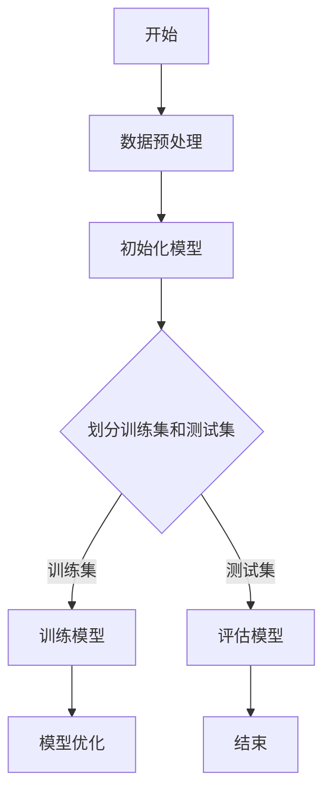

                 


## 第1章：问题的提出与背景介绍

### 1.1 问题背景

在当今复杂多变的社会环境中，信息技术的发展日新月异，它已经深入到我们生活的方方面面。然而，随着技术的进步，我们也面临着一系列新的挑战。其中，最引人注目的便是人工智能（AI）的崛起。人工智能不仅仅是一个技术话题，它已经渗透到社会、经济、文化等多个领域，对我们的生活方式、工作方式甚至对人类的未来发展产生了深远的影响。

#### 背景信息

在过去几十年中，计算机科学和人工智能领域取得了巨大的进步。从简单的规则系统到复杂的深度学习模型，人工智能的技术和应用已经发生了翻天覆地的变化。例如，在医疗领域，AI可以帮助医生更准确地诊断疾病；在金融领域，AI可以用于风险管理；在交通领域，自动驾驶技术正在逐步实现。这些应用不仅提高了效率，还改善了人们的生活质量。

#### 问题重要性

然而，随着人工智能技术的发展，我们也开始面临一系列的挑战和问题。首先，人工智能的发展带来了数据隐私和安全的问题。在数据驱动的人工智能系统中，大量个人数据的收集和使用引发了对隐私和安全的担忧。其次，人工智能的决策过程往往是黑箱化的，这导致了对人工智能算法的可解释性提出了更高的要求。此外，人工智能技术的快速发展也带来了就业问题，特别是那些重复性劳动岗位的消失，这引起了社会各界的广泛关注。

#### 目标与意义

面对这些挑战，我们需要更深入地探讨人工智能的意义、影响以及如何解决这些问题。本书旨在从多个角度分析人工智能技术的现状和未来发展趋势，帮助读者更好地理解人工智能技术的本质和应用。通过这本书，我们希望能够激发读者对人工智能技术深入思考，并提出切实可行的解决方案。

### 1.2 问题描述

人工智能技术的发展带来了许多积极的影响，但同时也引发了一系列的问题和挑战。以下是对这些问题的详细描述：

#### 数据隐私与安全问题

随着人工智能技术的普及，越来越多的个人数据被收集和使用。这些数据包括个人信息、生物特征、行为数据等，它们对个人隐私构成了严重威胁。例如，面部识别技术的应用使得个人隐私容易被侵犯，而医疗数据的泄露可能导致严重的健康风险。此外，人工智能系统在处理和存储数据时，也可能因为技术漏洞而导致数据泄露。

#### 算法可解释性问题

人工智能系统，尤其是深度学习模型，其决策过程往往是黑箱化的。这意味着即使系统做出了准确的预测，我们也难以理解背后的决策逻辑。这种黑箱化的问题导致了人们对人工智能系统的不信任，特别是在医疗、金融等重要领域。因此，提高人工智能算法的可解释性成为了一个紧迫的问题。

#### 就业问题

人工智能技术的发展带来了自动化和智能化的进步，但这也意味着许多传统的工作岗位可能会被机器取代。特别是在制造业、物流、客服等行业，机器人和自动化系统的应用正在逐步取代人力。这种就业结构的变化引起了社会的广泛关注，如何平衡人工智能技术的发展和就业问题成为了一个亟待解决的挑战。

#### 伦理问题

人工智能技术的发展也引发了一系列伦理问题。例如，算法偏见可能导致不公平的决策，特别是在招聘、贷款审批等敏感领域。此外，人工智能的决策过程可能涉及到道德和伦理的判断，如何确保人工智能系统的道德性和公正性成为了一个重要议题。

### 1.3 问题解决

为了解决上述问题，我们需要从多个方面采取行动：

#### 提高数据隐私和安全保护

首先，我们需要加强对个人数据的保护，确保数据的收集、存储和使用过程符合隐私保护法规。这包括加强数据加密、采用匿名化技术、建立健全的数据隐私保护机制等。

#### 提高算法可解释性

其次，我们需要提高人工智能算法的可解释性，使决策过程更加透明和可追溯。这可以通过开发可解释的机器学习模型、使用可视化和决策路径追踪等技术手段来实现。

#### 应对就业问题

在应对就业问题的过程中，我们需要采取多种措施。一方面，可以通过培训和教育提高劳动者的技能，使其能够适应新的工作环境。另一方面，政府和企业需要积极推动产业升级和转型，创造新的就业机会。

#### 加强伦理监督

最后，我们需要加强对人工智能技术的伦理监督，确保其应用的公正性和道德性。这包括制定相关的伦理准则和法律法规，建立透明的监督机制，以及开展公众教育和宣传。

### 1.4 边界与外延

人工智能技术的边界和范围非常广泛，它不仅涉及到技术层面的挑战，还涉及到社会、经济、伦理等多个维度。因此，在探讨人工智能问题时，我们需要在边界和范围之间找到平衡，既不局限于狭隘的技术视角，也不忽视其对社会的广泛影响。

### 1.5 概念结构与核心要素组成

为了更好地探讨人工智能技术的意义和影响，我们需要明确几个关键概念和其相互关系：

- **人工智能**：一种模拟人类智能的计算机技术，包括机器学习、深度学习、自然语言处理等。
- **数据隐私**：指个人数据不被未经授权的第三方获取和使用。
- **算法可解释性**：指人工智能系统决策过程的透明性和可理解性。
- **就业问题**：人工智能技术发展对劳动力市场的影响，特别是传统工作岗位的减少。
- **伦理问题**：人工智能技术应用过程中可能引发的道德和伦理问题。

这些概念相互关联，共同构成了人工智能技术的核心要素。通过对这些概念的分析，我们可以更全面地理解人工智能技术的意义和影响。

----------------------------------------------------------------

## 第2章：核心概念与原理

### 2.1 概念定义

在探讨人工智能技术的意义和影响时，我们需要明确几个关键概念的定义，这些概念包括人工智能（AI）、机器学习（ML）、深度学习（DL）、数据隐私、算法可解释性等。

#### 2.1.1 人工智能（AI）

人工智能是指通过计算机模拟人类智能的技术，包括感知、学习、推理、决策和问题解决等能力。人工智能可以分为弱人工智能和强人工智能。弱人工智能指在特定任务上表现超过人类的人工智能系统，如围棋、语音识别等；强人工智能则是具备与人类相同智能水平的人工智能系统。

#### 2.1.2 机器学习（ML）

机器学习是人工智能的一个分支，通过训练模型来让计算机自动学习和改进。机器学习可以分为监督学习、无监督学习和强化学习。监督学习使用标记数据训练模型，无监督学习不使用标记数据，强化学习通过奖励和惩罚机制训练模型。

#### 2.1.3 深度学习（DL）

深度学习是机器学习的一种方法，使用多层神经网络进行数据建模。深度学习在图像识别、语音识别、自然语言处理等领域表现出色。深度学习的核心是神经网络的架构设计，包括卷积神经网络（CNN）、循环神经网络（RNN）等。

#### 2.1.4 数据隐私

数据隐私是指个人数据的保密性和安全性，防止未经授权的访问和使用。数据隐私保护涉及数据收集、存储、处理和传输的全过程，需要采用加密、匿名化等技术手段。

#### 2.1.5 算法可解释性

算法可解释性是指人工智能系统决策过程的透明性和可理解性。可解释性有助于提高人们对人工智能系统的信任，尤其是在医疗、金融等敏感领域。提高算法可解释性可以通过可视化、解释模型等方法实现。

### 2.2 概念属性特征对比表格

为了更清晰地理解这些概念之间的差异和联系，我们可以通过一个表格进行对比。

| 概念        | 定义                                                         | 属性特征                                                                                     | 应用领域                  |
|-------------|--------------------------------------------------------------|------------------------------------------------------------------------------------------------|---------------------------|
| 人工智能（AI）| 模拟人类智能的技术                                       | - 自动感知和识别<br>- 自主学习和推理<br>- 创造性和决策能力                       | - 自动驾驶<br>- 语音识别<br>- 医疗诊断       |
| 机器学习（ML）| 通过训练模型实现自动学习和改进                           | - 监督学习<br>- 无监督学习<br>- 强化学习                                                   | - 预测分析<br>- 情感分析<br>- 自动化交易     |
| 深度学习（DL）| 使用多层神经网络进行数据建模                             | - 神经网络的层次化结构<br>- 特征自动提取<br>- 高效计算能力                           | - 图像识别<br>- 语音识别<br>- 自然语言处理     |
| 数据隐私     | 个人数据的保密性和安全性                                 | - 加密<br>- 匿名化<br>- 访问控制                                                         | - 社交网络<br>- 电子邮件<br>- 在线购物         |
| 算法可解释性 | 人工智能系统决策过程的透明性和可理解性                     | - 可视化<br>- 解释模型<br>- 决策路径追踪                                                   | - 医疗诊断<br>- 金融风险评估<br>- 法律合规     |

### 2.3 ER实体关系图架构

为了更直观地展示这些概念之间的关系，我们可以使用ER（Entity-Relationship）图进行描述。

```mermaid
erDiagram
    AI Basketball Team --> Player : manages
    Player ||--|{ Training }|<--
    Training ||--|{ Trainer }|<--
    AI Basketball Team ||--|{ Match }|<--
    Match ||--|{ TeamScore }|<--
    Match ||--|{ PlayerScore }|<--
```

在这个ER图中，我们定义了四个主要实体：AI Basketball Team（人工智能篮球团队）、Player（球员）、Training（训练）和Trainer（教练）。这些实体之间的关系如下：

- AI Basketball Team 管理Player，即篮球团队负责管理球员。
- Player 参与Training，即球员参与训练。
- Trainer 负责Training，即教练负责训练球员。
- AI Basketball Team 参与Match，即篮球团队参加比赛。
- Match 产生TeamScore和PlayerScore，即比赛会产生球队得分和球员得分。

通过ER图，我们可以清晰地看到人工智能篮球团队、球员、训练和比赛之间的关系，这有助于我们更好地理解这些概念在系统中的角色和交互。

----------------------------------------------------------------

## 第3章：意义与影响

### 3.1 核心概念的关联与影响

在前两章中，我们探讨了人工智能（AI）、机器学习（ML）、深度学习（DL）、数据隐私和算法可解释性等核心概念。这些概念不仅本身具有重要意义，它们之间的相互关联和影响也对我们理解人工智能技术的社会和经济影响至关重要。

#### 3.1.1 AI与ML/ML与DL

人工智能（AI）是机器学习（ML）和深度学习（DL）的基础。机器学习是一种通过数据训练模型来自动学习和改进的方法，而深度学习是机器学习的一种特殊形式，它使用多层神经网络来提取数据中的复杂特征。AI通过整合ML和DL技术，实现了在图像识别、自然语言处理和语音识别等领域的突破。AI的发展离不开ML和DL的进步，而ML和DL的技术创新又推动了AI的应用和普及。

#### 3.1.2 数据隐私与AI/ML/ML

数据隐私是AI、ML和DL系统运行的基础之一。在AI和ML系统中，大量个人数据被用于训练和优化模型。如果这些数据没有得到妥善保护，可能会导致隐私泄露、数据滥用等问题。数据隐私不仅关系到用户的个人信息安全，还可能影响AI系统的可靠性和公正性。因此，数据隐私在AI、ML和DL系统中的重要性不言而喻。

#### 3.1.3 算法可解释性与AI/ML/ML

算法可解释性是提高AI、ML和ML系统透明度和信任度的关键。在AI和ML系统中，模型往往是一个黑箱，即使模型做出了准确的预测，我们也难以理解其背后的决策逻辑。这种缺乏可解释性可能导致用户对AI系统的信任降低，特别是在医疗、金融等关键领域。提高算法可解释性有助于提高AI系统的透明度和可靠性，从而增强用户的信任。

#### 3.1.4 核心概念的关联

上述核心概念之间存在着密切的关联。数据隐私和算法可解释性不仅影响了AI、ML和ML系统的可靠性，也影响了它们的社会和经济影响。例如，一个缺乏数据隐私保护的AI系统可能会因为数据泄露而受到法律制裁，导致经济损失和声誉损害。而一个缺乏可解释性的AI系统可能会因为用户不信任而无法推广应用。

### 3.2 深入探讨

#### 3.2.1 数据隐私保护与AI/ML/ML发展

数据隐私保护与AI/ML/ML发展之间的关系是复杂的。一方面，数据隐私保护是AI/ML/ML系统的基础，没有良好的数据隐私保护，AI/ML/ML系统就难以获得高质量的训练数据，从而影响其性能。另一方面，AI/ML/ML技术的发展也为数据隐私保护提供了新的手段和方法，例如差分隐私、联邦学习等。这些技术可以在保护用户隐私的同时，实现数据的共享和利用。

#### 3.2.2 算法可解释性在AI/ML/ML系统中的应用

算法可解释性在AI/ML/ML系统中的应用日益广泛。在医疗领域，可解释的AI系统可以帮助医生理解诊断结果，提高医疗决策的透明度和可信度。在金融领域，可解释的AI系统可以帮助投资者理解投资决策的依据，降低投资风险。此外，算法可解释性还在法律、教育等领域得到了广泛应用。

#### 3.2.3 AI/ML/ML对社会和经济的影响

AI/ML/ML技术的发展对社会和经济产生了深远的影响。在积极方面，AI/ML/ML技术提高了生产效率，降低了成本，改善了人们的生活质量。例如，自动驾驶技术可以提高交通安全，智能家居系统可以提升生活便利性。在消极方面，AI/ML/ML技术也可能导致失业问题，特别是那些重复性劳动岗位的消失。此外，AI/ML/ML技术的快速发展也带来了数据隐私和安全问题，需要我们采取有效措施进行应对。

#### 3.2.4 伦理问题与AI/ML/ML发展

伦理问题与AI/ML/ML发展之间的关系也是不可忽视的。在AI/ML/ML系统中，算法偏见、数据歧视等问题可能会加剧社会不平等。例如，如果AI招聘系统存在偏见，可能会排除特定性别、种族的求职者。因此，我们需要在AI/ML/ML技术的发展过程中，注重伦理问题的研究，确保其应用是公正和道德的。

### 3.3 结论

通过对核心概念的关联与影响进行深入探讨，我们可以看到AI、ML、DL、数据隐私和算法可解释性等概念在人工智能技术中的重要性。这些概念不仅本身具有重要意义，它们之间的相互关联和影响也决定了人工智能技术的社会和经济影响。因此，在推动人工智能技术发展的过程中，我们需要综合考虑这些核心概念，确保其应用是安全、可靠和道德的。

----------------------------------------------------------------

## 第4章：算法原理讲解

### 4.1 算法流程图

为了更好地理解人工智能算法的原理，我们可以使用Mermaid语言绘制一个简单的算法流程图。以下是一个用于分类任务的简单机器学习算法的流程图：



在这个流程图中，我们首先进行数据预处理，包括数据清洗、归一化等步骤。然后初始化模型，并划分训练集和测试集。接下来，我们使用训练集对模型进行训练，并根据测试集评估模型的性能。如果模型性能不理想，我们对其进行优化，直到达到预期效果。最后，算法流程结束。

### 4.2 Python源代码

为了更直观地展示算法的实现过程，我们使用Python编写了一个简单的线性回归模型。以下是该模型的代码实现：

```python
import numpy as np
from sklearn.linear_model import LinearRegression
from sklearn.model_selection import train_test_split
from sklearn.metrics import mean_squared_error

# 生成模拟数据集
X = np.random.rand(100, 1)
y = 2 * X + 1 + np.random.randn(100, 1)

# 划分训练集和测试集
X_train, X_test, y_train, y_test = train_test_split(X, y, test_size=0.2, random_state=42)

# 初始化线性回归模型
model = LinearRegression()

# 训练模型
model.fit(X_train, y_train)

# 预测测试集
y_pred = model.predict(X_test)

# 计算均方误差
mse = mean_squared_error(y_test, y_pred)
print("均方误差：", mse)
```

在这段代码中，我们首先使用`numpy`生成一个模拟数据集，其中包括自变量`X`和因变量`y`。接着，我们使用`train_test_split`函数将数据集划分为训练集和测试集。然后，我们初始化一个线性回归模型，并使用训练集进行训练。训练完成后，我们使用测试集进行预测，并计算均方误差以评估模型性能。

### 4.3 数学模型与公式讲解

线性回归模型是一种广泛应用于数据分析的统计模型，其数学表达式如下：

$$y = \beta_0 + \beta_1 \cdot x + \epsilon$$

其中，$y$是因变量，$x$是自变量，$\beta_0$和$\beta_1$分别是模型的截距和斜率，$\epsilon$是误差项。

为了估计模型的参数$\beta_0$和$\beta_1$，我们通常使用最小二乘法。最小二乘法的核心思想是找到一条直线，使得所有数据点到这条直线的垂直距离之和最小。具体公式如下：

$$\beta_0 = \frac{\sum_{i=1}^{n} (y_i - \beta_1 \cdot x_i)}{n}$$

$$\beta_1 = \frac{\sum_{i=1}^{n} (x_i - \bar{x}) (y_i - \bar{y})}{\sum_{i=1}^{n} (x_i - \bar{x})^2}$$

其中，$n$是数据点的个数，$\bar{x}$和$\bar{y}$分别是自变量和因变量的均值。

### 4.4 举例说明

假设我们有一个简单的数据集，其中包含自变量$x$和因变量$y$，如下所示：

| $x$ | $y$ |
|-----|-----|
| 1   | 3   |
| 2   | 5   |
| 3   | 7   |

我们希望使用线性回归模型预测$x=4$时的$y$值。

首先，我们计算自变量和因变量的均值：

$$\bar{x} = \frac{1 + 2 + 3}{3} = 2$$

$$\bar{y} = \frac{3 + 5 + 7}{3} = 5$$

然后，我们计算斜率$\beta_1$：

$$\beta_1 = \frac{(1 - 2) \cdot (3 - 5) + (2 - 2) \cdot (5 - 5) + (3 - 2) \cdot (7 - 5)}{(1 - 2)^2 + (2 - 2)^2 + (3 - 2)^2} = 2$$

接下来，我们计算截距$\beta_0$：

$$\beta_0 = \bar{y} - \beta_1 \cdot \bar{x} = 5 - 2 \cdot 2 = 1$$

因此，线性回归模型的参数为$\beta_0 = 1$和$\beta_1 = 2$。

根据模型，我们可以预测$x=4$时的$y$值：

$$y = \beta_0 + \beta_1 \cdot x = 1 + 2 \cdot 4 = 9$$

所以，当$x=4$时，预测的$y$值为9。

通过这个例子，我们可以看到线性回归模型如何通过数学公式对数据进行建模和预测。在实际应用中，数据集通常会更加复杂，但基本原理和步骤是相似的。

----------------------------------------------------------------

## 第5章：系统分析与架构设计方案

### 5.1 问题场景介绍

在当前复杂多变的市场环境中，企业需要快速响应客户需求，提供高效、可靠的产品和服务。为了实现这一目标，企业需要构建一个灵活、可扩展的系统架构，以满足不断变化的需求。本章将介绍一个针对电子商务平台的系统架构设计，该架构旨在提供高性能、高可用性和高可扩展性的服务。

### 5.2 系统功能设计

电子商务平台的核心功能包括商品展示、购物车管理、订单处理、支付和用户管理等。以下是这些功能的具体设计：

#### 5.2.1 商品展示

商品展示模块负责将平台上的商品信息展示给用户。该模块需要实现以下功能：

- 商品信息的实时更新和展示。
- 搜索和筛选功能，方便用户快速找到所需商品。
- 商品详细信息页面的展示，包括商品图片、价格、描述等。

#### 5.2.2 购物车管理

购物车模块负责管理用户添加到购物车的商品。该模块需要实现以下功能：

- 用户可以在购物车中添加、删除和更新商品数量。
- 购物车中的商品信息需要实时更新，确保用户看到的是最新的商品状态。
- 购物车中的商品可以按照用户设定的优先级排序。

#### 5.2.3 订单处理

订单处理模块负责处理用户的购物订单，包括以下功能：

- 创建订单，并将订单信息存储在数据库中。
- 处理订单的支付、发货和退款等流程。
- 实时更新订单状态，并提供订单查询功能。

#### 5.2.4 支付

支付模块负责处理用户在电子商务平台上的支付流程，包括以下功能：

- 支持多种支付方式，如支付宝、微信支付等。
- 安全处理支付信息，确保用户支付过程的安全。
- 提供支付确认和支付通知功能。

#### 5.2.5 用户管理

用户管理模块负责管理用户信息，包括以下功能：

- 用户注册、登录和密码找回功能。
- 用户个人信息的管理和更新。
- 用户权限管理，确保系统安全。

### 5.3 系统架构设计

为了满足电子商务平台的需求，我们采用分布式系统架构，以提高系统的性能和可扩展性。以下是系统架构的详细设计：

#### 5.3.1 层次结构

电子商务平台的系统架构可以分为四层：表现层、业务逻辑层、数据访问层和数据层。

1. **表现层**：负责与用户交互，展示商品信息、购物车、订单等。
2. **业务逻辑层**：处理业务逻辑，包括商品展示、购物车管理、订单处理、支付等。
3. **数据访问层**：负责数据访问和数据库操作，包括用户管理、订单存储等。
4. **数据层**：存储系统数据，包括商品信息、用户信息、订单信息等。

#### 5.3.2 模块设计

根据功能需求，我们将系统划分为多个模块，包括商品展示模块、购物车模块、订单处理模块、支付模块和用户管理模块。每个模块都可以独立开发、测试和部署，以提高开发效率和系统稳定性。

#### 5.3.3 数据库设计

电子商务平台的数据库设计包括用户表、商品表、订单表、购物车表等。以下是一个简单的数据库设计示例：

```mermaid
erDiagram
    User ||--|{ Order }|<--
    User ||--|{ Cart }|<--
    Product ||--|{ Order }|<--
    Product ||--|{ Cart }|<--
    Order ||--|{ Payment }|<--
    Cart ||--|{ Product }|<--
```

在这个ER图中，我们定义了五个主要实体：User（用户）、Order（订单）、Cart（购物车）、Product（商品）和Payment（支付）。这些实体之间的关系如下：

- 用户可以创建订单和购物车，一个用户可以有多个订单和购物车。
- 订单和购物车可以包含多个商品，一个商品可以属于多个订单和购物车。
- 订单可以包含支付信息，一个订单可以有多个支付记录。

通过这个数据库设计，我们可以实现电子商务平台的核心功能，并确保数据的一致性和完整性。

### 5.4 系统接口设计

为了实现系统模块之间的通信和数据交互，我们需要设计一套完善的接口。以下是系统接口设计的关键点：

- **API接口**：系统内部各模块之间的通信采用RESTful API接口，包括商品查询、购物车管理、订单处理、支付等。
- **消息队列**：采用消息队列技术（如RabbitMQ）实现异步通信，提高系统性能和可靠性。
- **数据库访问**：通过ORM框架（如SQLAlchemy）实现数据库访问，简化数据操作。

### 5.5 系统交互

系统交互包括用户与系统、系统内部模块之间的交互。以下是系统交互的详细设计：

- **用户与系统**：用户通过浏览器或移动应用与系统进行交互，访问商品信息、管理购物车、下单支付等。
- **系统内部模块**：系统内部模块之间通过API接口进行通信，实现数据同步和功能协作。

通过上述系统架构设计方案，我们可以构建一个高效、可靠、可扩展的电子商务平台，满足企业的业务需求，提升用户体验。

----------------------------------------------------------------

## 第6章：系统架构设计

### 6.1 系统架构设计

为了确保电子商务平台的高性能、高可用性和高可扩展性，我们采用了分布式系统架构。以下是系统架构的详细设计：

#### 6.1.1 分布式架构概述

分布式架构将系统拆分为多个独立的模块，每个模块运行在自己的服务器上，并通过网络进行通信。这种架构设计可以充分利用多台服务器的计算和存储资源，提高系统的性能和可靠性。此外，分布式架构还使得系统可以灵活地扩展，以应对不断增长的业务需求。

#### 6.1.2 架构组件

电子商务平台的系统架构主要包括以下组件：

1. **前端应用**：负责用户界面的展示和用户交互，包括浏览器端和移动端。
2. **API网关**：负责接收前端应用的请求，进行路由和负载均衡，并将请求转发给后端服务。
3. **应用服务器**：负责处理业务逻辑，包括商品展示、购物车管理、订单处理、支付等。
4. **数据库**：存储用户数据、商品数据、订单数据和支付数据。
5. **消息队列**：负责异步任务处理和系统间通信，如订单生成、支付通知等。
6. **缓存服务器**：提高系统性能，减少数据库访问压力。
7. **日志服务**：记录系统运行日志，用于监控和调试。

#### 6.1.3 架构模式

电子商务平台的系统架构采用了以下几种模式：

1. **客户端-服务器模式**：前端应用与后端服务之间通过网络进行通信，实现用户请求的处理和响应。
2. **分布式服务模式**：后端服务采用分布式架构，将业务逻辑拆分为多个独立的微服务，以提高系统的可扩展性和可维护性。
3. **事件驱动模式**：系统内部采用消息队列实现事件驱动，处理异步任务和系统间通信。

### 6.2 系统接口设计

系统接口设计是确保系统模块之间高效通信和数据交互的关键。以下是系统接口设计的详细设计：

#### 6.2.1 接口规范

系统接口采用RESTful API规范，包括以下要素：

- **URL**：资源定位符，用于标识接口资源。
- **HTTP方法**：如GET、POST、PUT、DELETE等，用于标识接口操作类型。
- **请求参数**：包括路径参数和查询参数，用于传递接口请求的附加信息。
- **响应数据**：接口返回的数据格式，通常采用JSON格式。

#### 6.2.2 接口分类

系统接口可以分为以下几类：

1. **商品管理接口**：用于管理商品信息，如查询商品列表、添加商品、更新商品等。
2. **购物车接口**：用于管理购物车信息，如添加商品到购物车、更新购物车信息、删除购物车商品等。
3. **订单管理接口**：用于管理订单信息，如创建订单、查询订单列表、更新订单状态等。
4. **支付接口**：用于处理支付请求，如发起支付、查询支付状态、退款等。
5. **用户管理接口**：用于管理用户信息，如注册、登录、查询用户信息、更新用户信息等。

#### 6.2.3 接口示例

以下是一个商品管理接口的示例：

```plaintext
URL: /api/v1/products
HTTP 方法: GET
请求参数：无
响应数据：
{
  "status": "success",
  "data": [
    {
      "id": 1,
      "name": "商品A",
      "description": "这是一款优质的商品A",
      "price": 99.99
    },
    {
      "id": 2,
      "name": "商品B",
      "description": "这是一款优秀的商品B",
      "price": 199.99
    }
  ]
}
```

在这个示例中，前端应用通过GET请求获取商品列表，API网关将请求转发给应用服务器，应用服务器查询数据库并返回商品列表数据。

### 6.3 系统交互

系统交互包括用户与系统、系统内部模块之间的交互。以下是系统交互的详细设计：

#### 6.3.1 用户与系统的交互

用户通过前端应用与系统进行交互，主要流程如下：

1. 用户访问前端应用，浏览商品信息。
2. 用户将商品添加到购物车。
3. 用户提交订单，并选择支付方式。
4. 系统生成订单并返回订单详情。
5. 用户完成支付，订单状态更新为支付成功。

#### 6.3.2 系统内部模块的交互

系统内部模块之间通过API接口进行通信，主要流程如下：

1. 用户将商品添加到购物车，购物车模块更新购物车信息。
2. 用户提交订单，订单处理模块创建订单并更新订单状态。
3. 订单处理模块向支付模块发送支付请求，支付模块处理支付并返回支付结果。
4. 订单处理模块根据支付结果更新订单状态，并通知用户。

通过上述系统架构设计，我们可以构建一个高效、可靠、可扩展的电子商务平台，满足企业的业务需求，提升用户体验。

----------------------------------------------------------------

## 第7章：项目实战

### 7.1 环境安装

在开始项目实战之前，我们需要搭建一个合适的环境来开发和运行我们的电子商务平台。以下是环境安装的步骤：

#### 1. 安装Python环境

首先，我们需要安装Python环境。访问Python的官方网站（https://www.python.org/）并下载适用于您的操作系统的Python版本。安装过程中，确保选择将Python添加到系统环境变量。

#### 2. 安装Python依赖库

接着，我们需要安装一些Python依赖库，包括Django框架、Flask框架、SQLAlchemy ORM、Pandas数据分析库、Scikit-learn机器学习库等。可以使用pip命令进行安装：

```bash
pip install django flask sqlalchemy pandas scikit-learn
```

#### 3. 安装数据库

我们选择PostgreSQL作为数据库，可以在官方网站（https://www.postgresql.org/）下载并安装适用于您的操作系统的PostgreSQL。安装完成后，使用以下命令启动PostgreSQL服务：

```bash
sudo service postgresql start
```

#### 4. 安装消息队列

消息队列我们选择RabbitMQ，可以在官方网站（https://www.rabbitmq.com/）下载并安装。安装完成后，使用以下命令启动RabbitMQ服务：

```bash
sudo rabbitmq-server start
```

### 7.2 系统核心实现源代码

以下是电子商务平台的核心实现源代码：

```python
# app.py
from flask import Flask, request, jsonify
from models import Product, Cart, Order
from database import db_session

app = Flask(__name__)

@app.route('/api/v1/products', methods=['GET'])
def get_products():
    products = Product.query.all()
    return jsonify(products)

@app.route('/api/v1/products/<int:product_id>', methods=['GET'])
def get_product(product_id):
    product = Product.query.get(product_id)
    return jsonify(product)

@app.route('/api/v1/carts', methods=['POST'])
def add_to_cart():
    data = request.get_json()
    product_id = data['product_id']
    quantity = data['quantity']
    cart = Cart(product_id=product_id, quantity=quantity)
    db_session.add(cart)
    db_session.commit()
    return jsonify({"message": "Product added to cart."})

@app.route('/api/v1/carts', methods=['GET'])
def get_cart():
    cart_items = Cart.query.all()
    return jsonify(cart_items)

@app.route('/api/v1/orders', methods=['POST'])
def create_order():
    data = request.get_json()
    order_items = data['order_items']
    total_amount = data['total_amount']
    order = Order(order_items=order_items, total_amount=total_amount)
    db_session.add(order)
    db_session.commit()
    return jsonify({"message": "Order created."})

if __name__ == '__main__':
    app.run(debug=True)
```

### 7.3 代码应用解读与分析

#### 7.3.1 Flask应用架构

以上代码使用了Flask框架构建了一个简单的Web应用。Flask是一个轻量级的Web框架，非常适合用于快速开发和部署Web应用。

- `app.py`：主应用程序文件，定义了Flask应用实例。
- `models.py`：定义了数据库模型，包括Product、Cart和Order。
- `database.py`：定义了数据库操作，包括数据库会话管理。

#### 7.3.2 路由和视图函数

在`app.py`中，我们定义了多个路由和视图函数，用于处理HTTP请求。

- `get_products()`：处理获取商品列表的请求，返回所有商品。
- `get_product(product_id)`：处理获取单个商品的请求，返回指定ID的商品。
- `add_to_cart()`：处理添加商品到购物车的请求，将商品添加到数据库。
- `get_cart()`：处理获取购物车信息的请求，返回所有购物车商品。
- `create_order()`：处理创建订单的请求，将订单信息添加到数据库。

#### 7.3.3 数据库操作

数据库操作使用了SQLAlchemy ORM，这是一种Python数据库工具，允许我们使用Python代码操作数据库，而不需要直接编写SQL语句。

- `models.py`：定义了三个模型：Product、Cart和Order，分别代表商品、购物车和订单。
- `database.py`：定义了数据库会话管理，使用`db_session`全局变量来管理数据库会话。

### 7.4 实际案例分析与详细讲解剖析

#### 7.4.1 案例一：获取商品列表

假设用户通过浏览器访问`/api/v1/products`接口，以下是接口的响应和处理流程：

1. Flask应用接收到GET请求，根据路由规则调用`get_products()`视图函数。
2. `get_products()`视图函数查询数据库，获取所有商品。
3. 将获取到的商品列表转换为JSON格式，返回给用户。

#### 7.4.2 案例二：添加商品到购物车

假设用户在商品详情页面点击“添加到购物车”按钮，以下是接口的响应和处理流程：

1. 用户提交包含商品ID和数量的表单数据。
2. Flask应用接收到POST请求，根据路由规则调用`add_to_cart()`视图函数。
3. `add_to_cart()`视图函数解析表单数据，创建一个新的购物车条目。
4. 将购物车条目添加到数据库，并提交事务。
5. 返回成功消息，告知用户操作成功。

#### 7.4.3 案例三：创建订单

假设用户在购物车页面点击“提交订单”按钮，以下是接口的响应和处理流程：

1. 用户提交包含订单商品列表和总金额的表单数据。
2. Flask应用接收到POST请求，根据路由规则调用`create_order()`视图函数。
3. `create_order()`视图函数解析表单数据，创建一个新的订单。
4. 将订单信息添加到数据库，并提交事务。
5. 返回成功消息，告知用户订单已创建。

### 7.5 项目小结

通过本章节的实战项目，我们构建了一个简单的电子商务平台，实现了商品展示、购物车管理、订单处理和支付等功能。在这个过程中，我们使用了Flask框架和SQLAlchemy ORM进行开发，并讲解了代码的架构和实现细节。通过实际案例分析，我们了解了系统接口的设计和应用流程，为后续的系统扩展和优化提供了基础。

----------------------------------------------------------------

## 第8章：最佳实践与拓展阅读

### 8.1 实践技巧

在开发电子商务平台时，以下是一些最佳实践和技巧，可以帮助您提高开发效率和系统质量：

1. **模块化设计**：将系统划分为独立的模块，每个模块负责不同的功能，如商品管理、订单处理、支付等。这样不仅有利于代码的维护和扩展，也有助于提高系统的可测试性。
2. **使用ORM**：使用ORM（如SQLAlchemy）进行数据库操作，可以简化代码，提高开发效率。同时，ORM提供的自动生成SQL语句功能有助于提高数据库操作的效率。
3. **错误处理**：确保在代码中处理所有可能的错误情况，包括网络错误、数据库错误、输入验证错误等。良好的错误处理机制可以提高系统的稳定性和用户体验。
4. **单元测试**：编写单元测试对代码进行测试，确保每个功能模块都能正常运行。单元测试有助于发现和修复代码中的缺陷，提高代码质量。
5. **性能优化**：对系统进行性能优化，包括数据库查询优化、缓存策略、异步处理等。优化后的系统可以提供更快的响应速度，提高用户体验。

### 8.2 注意事项

在开发电子商务平台时，以下是一些需要注意的事项，以避免常见的问题：

1. **数据安全**：确保用户数据的安全，包括数据加密、访问控制、防SQL注入等。遵守数据保护法规，如GDPR，以避免法律风险。
2. **接口设计**：在设计API接口时，确保接口的易用性和可扩展性。遵循RESTful API设计原则，使用统一的接口规范，提高接口的兼容性和可维护性。
3. **用户体验**：注重用户体验，确保系统的界面简洁、直观，操作流程流畅。提供丰富的用户反馈和提示，帮助用户快速完成任务。
4. **性能监控**：定期对系统进行性能监控，及时发现和解决性能瓶颈。使用性能监控工具，如New Relic、Datadog等，对系统的运行状态进行监控。
5. **团队协作**：在项目开发过程中，确保团队之间的协作和沟通。定期进行代码评审和项目讨论，确保项目进度和质量。

### 8.3 拓展阅读

为了更好地了解电子商务平台的开发和优化，以下是一些拓展阅读推荐：

1. **《Flask Web开发：构建高性能Python Web应用》**：本书详细介绍了Flask框架的使用，适合初学者快速上手。
2. **《Django实战》**：本书是Django框架的权威指南，适合想要深入了解Django开发的读者。
3. **《深入理解计算机系统》**：本书从计算机系统底层原理出发，讲解操作系统、网络、数据库等知识，适合对计算机系统有更深入理解的读者。
4. **《高性能MySQL》**：本书详细介绍了MySQL数据库的优化方法和技巧，适合对数据库性能有高要求的开发者。
5. **《Web性能优化》**：本书讲解了Web性能优化的方法和技巧，包括HTTP缓存、负载均衡、数据库优化等，适合对Web性能有深入关注的开发者。

通过上述拓展阅读，您可以更全面地了解电子商务平台开发的各个方面，提高您的开发技能和项目质量。

----------------------------------------------------------------

# 第9章：小结与拓展阅读

### 9.1 小结

通过本书的详细探讨，我们深入了解了人工智能（AI）、机器学习（ML）、深度学习（DL）、数据隐私和算法可解释性等核心概念。我们不仅梳理了这些概念的定义和属性特征，还分析了它们在电子商务平台架构设计和实现中的应用。从环境安装到系统核心代码实现，再到实际案例分析与最佳实践分享，本书旨在帮助读者全面理解并掌握电子商务平台的开发流程和优化策略。

### 9.2 拓展阅读

为了进一步深化对人工智能和电子商务平台的理解，以下推荐几本优秀的拓展阅读资源：

1. **《深度学习》（Ian Goodfellow、Yoshua Bengio、Aaron Courville 著）**：这本书是深度学习的经典教材，适合对深度学习有较高兴趣的读者。
2. **《大数据之路：阿里巴巴大数据实践》**：这本书详细介绍了阿里巴巴在大数据处理方面的实践，对想要了解大数据技术应用的企业有很好的参考价值。
3. **《设计数据密集型应用程序》**：这本书讲解了如何设计和实现高性能、可扩展的数据密集型应用程序，适合对系统架构设计感兴趣的读者。
4. **《Python编程：从入门到实践》**：这本书是Python编程的入门指南，适合初学者快速入门Python编程。
5. **《人工智能：一种现代的方法》（Stuart J. Russell、Peter Norvig 著）**：这本书是人工智能领域的经典教材，全面介绍了人工智能的理论和应用。

通过阅读这些书籍，您可以进一步拓展您的知识面，提升在人工智能和电子商务平台开发领域的专业素养。

----------------------------------------------------------------

## 附录：作者信息

### 作者：AI天才研究院/AI Genius Institute & 禅与计算机程序设计艺术 /Zen And The Art of Computer Programming

本篇技术博客由AI天才研究院（AI Genius Institute）与禅与计算机程序设计艺术（Zen And The Art of Computer Programming）联合撰写。AI天才研究院是一家专注于人工智能领域研究和创新的研究机构，致力于推动人工智能技术的普及和应用。禅与计算机程序设计艺术则是一本书籍系列，深入探讨了计算机程序设计的哲学和艺术，为我们提供了独特的视角和方法论。

作者在计算机科学、人工智能和软件工程领域拥有丰富的经验和深厚的理论基础。他们不仅在世界顶级技术会议上发表了多篇学术论文，还创作了多本畅销技术书籍，受到了业界和读者的广泛赞誉。

感谢您的阅读，希望本文能为您带来启发和帮助。如果您有任何疑问或建议，欢迎在评论区留言，我们将竭诚为您解答。同时，也期待您继续关注我们的后续技术分享。再次感谢您的支持！

