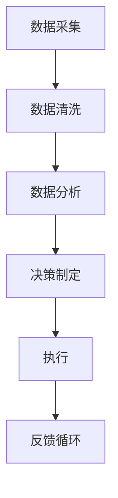

                 

## 《意义的结构重组：在混沌中建立新秩序》

混沌，一个源自自然科学的术语，却在现代社会的方方面面留下了深刻的印记。从金融市场到气候系统，从艺术创作到技术创新，混沌无处不在。然而，正是在这种看似无序的混乱中，隐藏着某种深层次的秩序。本文旨在探讨如何在混沌中寻找和建立新的秩序，进而实现对意义的结构重组。

### 关键词
- 混沌理论
- 意义结构重组
- 新秩序
- 自组织
- 复杂系统

### 摘要
本文首先介绍了混沌理论的基本概念及其在现代科技和社会中的应用，分析了混沌现象中的潜在秩序。接着，探讨了意义结构重组的理论和方法，包括结构分析、重组策略及其在实际中的应用。最后，本文讨论了意义结构重组在不同领域的应用，并展望了未来的发展趋势。通过本文的阅读，读者将深刻理解混沌与秩序的关系，并学会在复杂的环境中建立新的秩序。

### 目录

## 第一部分：引言

### 第1章：意义的重构：理解混沌中的新秩序

- **1.1** 问题的背景与引入
- **1.2** 混沌中的秩序
- **1.3** 新秩序的意义
- **1.4** 本书的内容框架

### 第2章：混沌与秩序的哲学探讨

- **2.1** 混沌哲学概述
- **2.2** 混沌与复杂系统
- **2.3** 混 ton 与科学理论
- **2.4** 混沌中的秩序原理

### 第3章：意义的结构重组方法

- **3.1** 重组方法概述
- **3.2** 结构分析
- **3.3** 重组策略
- **3.4** 案例研究

### 第4章：混沌中的意义重构实践

- **4.1** 意义重构的实践步骤
- **4.2** 实践案例
- **4.3** 意义重构的挑战与未来

### 第二部分：核心概念与原理

### 第5章：意义的结构重组在社会中的应用

- **5.1** 社会治理
- **5.2** 科技创新
- **5.3** 文化传播

### 第6章：意义的结构重组在教育中的应用

- **6.1** 教育改革
- **6.2** 学生发展
- **6.3** 教育评价

### 第7章：意义的结构重组与人类未来

- **7.1** 人类思维
- **7.2** 社会发展
- **7.3** 展望未来

### 第三部分：应用与展望

### 第8章：意义的结构重组：总结与展望

- **8.1** 本书总结
- **8.2** 展望未来
- **8.3** 结论

### 附录

- **附录A**：参考文献
- **附录B**：术语表
- **附录C**：相关工具与资源
- **附录D**：练习题与答案

### 第1章：意义的重构：理解混沌中的新秩序

### 1.1 问题的背景与引入

混沌理论（Chaos Theory）是20世纪后半叶在自然科学领域崛起的一个重要分支。它的起源可以追溯到1960年代，当时气象学家洛伦兹（Robert L. Lorenz）在研究大气动力学时，发现了一些看似随机的小扰动如何引起大范围的气候变化。这一现象被称为“蝴蝶效应”，即在一个动力系统中，初始条件的微小变化可能导致长期行为的巨大差异。

混沌现象不仅存在于自然界，也广泛存在于人类社会和科技领域。金融市场中的波动、互联网流量模式、社交网络中的信息传播等，都是混沌现象的具体表现。然而，尽管混沌现象看似无序，实际上却隐藏着某种深层次的秩序。

意义结构重组（Meaningful Structure Reorganization）则是一种应对混沌的思维方式。它强调通过结构化的分析和重组，从混乱中寻找出有意义的模式，从而在混沌中建立新的秩序。

在现代社会，混沌与秩序的共存已成为一种常态。如何在这种背景下找到新的秩序，实现对意义的结构重组，成为一个亟待解决的重要课题。本文将围绕这一主题，探讨混沌中的秩序原理、重组方法及其在不同领域的应用。

### 1.2 混沌中的秩序

混沌理论的核心在于，尽管系统的初始条件存在微小差异，但随着时间的推移，系统的行为会逐渐偏离预期轨道，呈现出不可预测的复杂动态。这种现象被称为“混沌性”（Chaos），其特征包括：

1. **初始敏感性**：系统对初始条件的微小变化极为敏感，即使是最微小的扰动也会导致长期行为的显著差异。
2. **长期依赖性**：系统的长期行为表现出高度依赖性，即初始条件的微小变化可能导致截然不同的结果。
3. **无周期性**：混沌系统通常不具有固定的周期性，但其行为并非完全随机，而是遵循某种复杂的规律。

混沌中的秩序并非指完全的规律性，而是指在某些条件下，系统内部会自发形成一定的结构。这种结构虽然不完全可预测，但可以在一定程度上被理解和管理。以下是一些混沌中的秩序原理：

1. **吸引子**（Attractor）：在混沌系统中，存在某些状态点或状态区域，系统能够在一定范围内稳定地收敛到这些状态。这些状态点或区域称为吸引子。例如，洛伦兹吸引子是混沌理论中最著名的例子之一。

2. **分岔**（Bifurcation）：当系统参数发生变化时，系统的行为可能会发生显著变化，这种现象称为分岔。分岔是混沌系统从有序向无序过渡的关键环节。

3. **嵌入空间**（Embedding Space）：通过扩展系统状态变量的范围，可以将一个低维系统嵌入到一个高维空间中，从而更好地理解和预测系统的行为。

4. **自组织**（Self-Organization）：在某些条件下，系统可以自发形成有序结构，这种现象称为自组织。自组织是混沌中的秩序生成机制之一。

在现实世界中，混沌与秩序共存的现象随处可见。例如，在金融市场，股票价格的波动看似随机，但实际上受到多种复杂因素的共同作用，形成了一定的规律性。在气候系统中，尽管气候变化存在不确定性，但通过分析大气环流和海洋动力，可以预测气候变化的趋势。在社交网络中，信息传播的过程看似杂乱无章，但通过分析用户行为和社交关系，可以发现信息传播的规律。

理解混沌中的秩序，不仅有助于我们更好地应对复杂系统中的不确定性，还可以为科学研究和工程应用提供新的思路。通过分析混沌现象中的潜在规律，我们可以开发出更高效的预测模型和控制系统，从而在混沌中建立新的秩序。

### 1.3 新秩序的意义

新秩序的意义首先体现在其哲学层面。在传统哲学中，秩序被视为一种稳定和可预测的状态，是理性思维和科学方法的产物。然而，在混沌理论出现后，我们对秩序的理解发生了深刻变化。新秩序不再是对混乱的简单控制，而是在混沌中寻找和构建的复杂结构。

从科学角度来看，新秩序具有以下几层重要意义：

1. **预测能力**：通过对混沌现象中的潜在规律进行分析，我们可以提高预测的准确性。这种预测能力在天气预报、金融市场预测等领域具有重要意义。

2. **控制能力**：在混沌系统中，某些关键参数的控制可以显著影响系统的行为。通过深入研究混沌现象，我们可以开发出更有效的控制策略，从而实现对复杂系统的调控。

3. **创新动力**：混沌中的秩序为新思想和新技术的产生提供了土壤。许多突破性的创新都源于对混沌现象的深入研究，如混沌工程、混沌优化算法等。

4. **系统理解**：通过对混沌中的秩序进行分析，我们可以更深入地理解复杂系统的本质。这种理解有助于我们开发出更高效的系统模型和优化方法。

在社会层面，新秩序的影响同样深远。随着全球化和社会信息化的发展，社会系统变得越来越复杂，传统的治理方法难以应对新的挑战。新秩序的引入，可以帮助我们更好地理解社会系统的运作规律，从而制定更有效的社会政策和治理策略。

1. **社会治理**：通过分析社会现象中的混沌特征，可以更准确地识别社会问题，并制定针对性的解决方案。例如，在公共卫生管理中，通过对疫情数据中的混沌特征进行分析，可以更好地预测疫情趋势，制定防疫策略。

2. **科技创新**：新秩序为科技创新提供了新的方向。许多前沿科技，如人工智能、区块链等，都是在对混沌现象的深入理解基础上发展起来的。这些科技不仅改变了我们的生活，也推动了社会的发展。

3. **文化传播**：在文化传播领域，新秩序的理念可以帮助我们更好地理解和传播复杂的文化现象。例如，在跨文化交流中，通过对文化差异中的混沌特征进行分析，可以找到促进文化交流和理解的有效途径。

新秩序的意义不仅限于哲学、科学和社会层面，它还深刻影响着人类的思维方式和认知能力。在混沌中建立新秩序，要求我们具备更高的思维灵活性和创新精神，这种能力对于应对现代社会中的各种挑战具有重要意义。

总之，新秩序的意义在于，它为我们提供了一个新的视角，帮助我们理解混沌中的秩序，并在这种秩序中找到新的发展方向。通过对混沌中的秩序进行深入研究和应用，我们可以实现科学、社会和文化的全面发展，为人类的未来创造更多可能性。

### 1.4 本书的内容框架

为了帮助读者系统地掌握《意义的结构重组：在混沌中建立新秩序》的核心内容，本书分为四个主要部分：

**第一部分：引言**  
本部分主要介绍混沌理论的基本概念、混沌中的秩序原理以及意义结构重组的背景和意义。通过这一部分的阅读，读者将初步了解混沌与秩序的关系，并为后续内容的学习打下基础。

**第二部分：核心概念与原理**  
本部分深入探讨混沌与秩序的哲学探讨、复杂系统的特性、混沌理论的基本原理以及混沌中的秩序原理。这些内容将帮助读者更深入地理解混沌现象中的潜在规律，并掌握意义结构重组的基本方法。

**第三部分：混沌中的意义重构实践**  
本部分通过具体的案例研究，展示意义结构重组方法在不同领域的应用。从社会治理到科技创新，再到文化传播，每个案例都详细阐述了重组方法的具体实施步骤和效果。通过这些实践，读者可以更好地理解如何在实际场景中应用意义结构重组。

**第四部分：应用与展望**  
本部分从社会、教育和未来三个维度，探讨了意义结构重组在各个领域中的应用及其对人类未来的影响。这部分内容不仅为读者提供了丰富的实际应用案例，还展望了意义结构重组在未来的发展趋势和方向。

通过以上四个部分的阅读，读者将系统地掌握混沌中的秩序原理、意义结构重组的方法和应用，从而在复杂的世界中找到新的秩序，提升自身的认知和理解能力。

### 第2章：混沌与秩序的哲学探讨

在探讨混沌与秩序的关系之前，我们需要对混沌哲学的基本概念有一个清晰的认识。混沌哲学，也称为复杂性哲学，是一门跨学科的领域，它试图从哲学角度解释复杂系统的行为和性质。混沌哲学的核心观点在于，秩序并非来源于外部的规则或控制，而是在系统的内部自发形成的。

#### 2.1 混沌哲学概述

混沌哲学起源于20世纪中叶，随着混沌理论的兴起而逐渐发展。混沌哲学的基本观点可以概括为以下几点：

1. **非线性和反馈**：混沌现象通常出现在非线性系统中，这些系统具有复杂的反馈机制。非线性意味着系统的行为不能简单地用线性方程来描述，而反馈则使得系统内部的信息和能量在各个部分之间传递和循环。

2. **初始条件的敏感性**：混沌系统对初始条件极为敏感，即使是微小的扰动也可能导致系统行为的巨大变化。这种现象被称为“蝴蝶效应”，意味着初始条件的微小差异可以引起长期行为的巨大差异。

3. **自组织和自适应性**：混沌哲学强调系统的自组织能力和自适应性。在混沌系统中，没有外部控制，系统内部元素通过相互作用和协同作用，自发形成有序结构。

4. **不可预测性和确定性**：混沌现象看似随机和无序，但实际上是确定性的。通过深入分析，可以发现混沌系统中的潜在规律和模式。

#### 2.2 混沌与复杂系统

复杂系统是指由大量相互作用的元素组成的系统，这些元素之间的相互作用和反馈导致系统表现出高度复杂的行为。混沌与复杂系统之间的关系是密不可分的。

1. **复杂系统的特性**：复杂系统具有以下特性：
   - **多尺度性**：系统中的元素可以在不同的时间尺度和空间尺度上表现出不同的行为。
   - **非线性和反馈**：系统内部的反馈机制导致行为复杂化。
   - **适应性**：系统能够根据外部环境的变化进行自适应调整。
   - **自组织**：系统内部元素通过相互作用自发形成有序结构。

2. **混沌在复杂系统中的作用**：混沌是复杂系统的一个重要组成部分。混沌现象在复杂系统中的作用主要体现在以下几个方面：
   - **调节作用**：混沌可以调节系统的稳定性，防止系统陷入过度稳定或过度混乱的状态。
   - **创新动力**：混沌中的随机性可以为系统带来新的可能性和创新机会。
   - **复杂行为的基础**：混沌现象是复杂系统表现出的复杂行为的基础。

#### 2.3 混沌与科学理论

混沌理论是研究混沌现象的科学分支，它从数学和物理学角度揭示了混沌现象的内在机制。混沌理论的核心观点可以概括为以下几点：

1. **确定性的随机性**：混沌系统是确定性的，但表现出随机行为。这意味着系统的长期行为是可预测的，但短期的行为具有不确定性。

2. **吸引子和分岔**：在混沌系统中，存在某些状态点或状态区域，称为吸引子。当系统接近这些状态时，其行为会逐渐收敛到吸引子上。分岔是混沌系统从有序向无序过渡的关键环节。

3. **普适性和对称性**：混沌现象在不同的系统和不同尺度上具有相似的行为特征，这被称为普适性。对称性是混沌系统中的一个重要概念，它揭示了混沌现象在空间和时间上的对称性。

4. **非线性动力学**：非线性动力学是混沌现象的理论基础。非线性动力学研究系统内部的反馈机制和非线性关系，揭示了混沌现象的复杂性和多样性。

#### 2.4 混沌中的秩序原理

尽管混沌现象看似无序，但实际上隐藏着某种深层次的秩序。混沌中的秩序原理主要包括以下几个方面：

1. **吸引子**：在混沌系统中，存在某些状态点或状态区域，称为吸引子。系统在长时间内会稳定地收敛到这些状态。吸引子是混沌中的秩序基础。

2. **分岔**：当系统参数发生变化时，系统可能会出现分岔现象，即系统从一种稳定状态过渡到另一种稳定状态。分岔是混沌现象中的关键特征。

3. **嵌入空间**：通过扩展系统状态变量的范围，可以将一个低维系统嵌入到一个高维空间中。在嵌入空间中，系统的行为可以更好地被理解和预测。

4. **自组织**：在混沌系统中，系统内部元素通过相互作用和协同作用，自发形成有序结构。自组织是混沌中的秩序生成机制之一。

5. **周期性现象**：尽管混沌系统不具有固定的周期性，但在某些条件下，系统会表现出周期性现象。这些周期性现象是混沌中的秩序表现。

通过对混沌与秩序的哲学探讨，我们不仅能够更深入地理解混沌现象的本质，还能为解决现实世界中的复杂问题提供新的思路和方法。在接下来的章节中，我们将进一步探讨意义结构重组的方法和应用，帮助读者在实践中找到混沌中的秩序。

### 第3章：意义的结构重组方法

在理解了混沌中的秩序原理后，我们需要掌握如何通过结构重组来重新定义和构建意义。意义结构重组是一种系统性方法，它通过分析、重组和策略，将混乱的信息和现象转化为有意义的结构和模式。本章将详细介绍意义结构重组的方法，包括结构分析、重组策略及其应用。

#### 3.1 重组方法概述

意义结构重组是一种基于系统性思维的方法，它旨在通过分析和重组，将复杂的、看似无序的信息转化为有组织、有意义的结构。这种方法的核心思想在于，通过对系统内部元素及其关系的深入理解，找到新的视角和模式，从而实现对意义的重构。

意义结构重组的方法主要包括以下几个步骤：

1. **结构分析**：对系统进行全面的评估和分析，识别其内部的结构和关系。
2. **重组策略**：根据分析结果，制定具体的重组策略，包括分解、组合和优化等操作。
3. **实施重组**：将重组策略应用到具体的系统中，实现意义的重构。
4. **评估和调整**：对重组效果进行评估，并根据反馈进行必要的调整和优化。

#### 3.2 结构分析

结构分析是意义结构重组的基础。通过对系统内部元素及其关系的全面分析，我们可以识别出系统中的关键要素和潜在的模式。结构分析主要包括以下几个步骤：

1. **识别关键要素**：识别系统中的关键要素，这些要素对于系统的整体功能和行为具有决定性影响。
2. **构建关系图**：通过绘制关系图，展示系统内部各要素之间的关联和互动。
3. **分析关系模式**：深入分析各要素之间的关系模式，识别出潜在的结构和规律。

结构分析的工具和方法包括：

- **实体关系图（ER Diagram）**：用于展示系统中的实体及其关系，帮助理解系统的整体结构。
- **流程图（Flowchart）**：用于展示系统的流程和操作步骤，帮助分析系统的工作机制。
- **网络图（Network Diagram）**：用于展示系统中的节点和连接关系，帮助识别系统的复杂性和潜在问题。

通过结构分析，我们可以对系统有一个全面、清晰的理解，为后续的重组策略提供依据。

#### 3.3 重组策略

重组策略是意义结构重组的核心。根据结构分析的结果，我们可以制定具体的重组策略，通过分解、组合和优化等操作，实现对系统结构和意义的重构。以下是一些常见的重组策略：

1. **分解**：将复杂的系统分解为更小的、更易于管理的部分，以便更好地理解和控制。
2. **组合**：将分解后的部分重新组合，形成新的结构，以实现更高的效率和灵活性。
3. **优化**：通过优化系统内部的关系和流程，提高系统的性能和可靠性。

具体来说，重组策略可以包括以下内容：

- **模块化**：将系统划分为独立的模块，每个模块负责特定的功能，这样可以提高系统的可维护性和扩展性。
- **重构**：对系统中的关键部分进行重构，以解决现有问题或提高系统性能。
- **简化**：通过去除冗余和优化流程，简化系统的结构和操作，降低复杂性和维护成本。

#### 3.4 案例研究

为了更好地理解意义结构重组的方法，我们来看一个实际案例。假设我们面临一个复杂的业务流程，需要对其进行重组以提高效率。

**案例：企业销售流程重组**

1. **结构分析**：
   - 识别关键要素：客户、销售团队、销售经理、产品、订单等。
   - 构建关系图：通过绘制实体关系图，展示各要素之间的关系。
   - 分析关系模式：发现销售流程中的瓶颈和冗余环节。

2. **重组策略**：
   - **分解**：将销售流程分解为市场调研、客户管理、销售执行和售后服务四个模块。
   - **组合**：重新组合模块，形成新的销售流程，使各模块之间的协作更加紧密。
   - **优化**：优化各模块的内部流程，提高工作效率和客户满意度。

3. **实施重组**：
   - 将销售团队模块化，每个团队负责特定的市场领域。
   - 实施客户关系管理（CRM）系统，提高客户信息的准确性和可用性。
   - 优化销售执行流程，减少中间环节，提高销售效率。

4. **评估和调整**：
   - 对新流程进行评估，收集反馈，识别潜在问题。
   - 根据反馈进行调整，优化流程细节。

通过这个案例，我们可以看到，意义结构重组方法如何通过结构分析和重组策略，将一个复杂的销售流程转化为更高效、更灵活的新流程。这个方法不仅可以应用于企业销售流程，还可以广泛应用于其他复杂系统，如项目管理、技术创新等。

总之，意义结构重组是一种强大的工具，它帮助我们在混沌中寻找秩序，通过对系统和信息进行结构化重组，实现更高的效率和创新。在接下来的章节中，我们将继续探讨如何在现实世界中应用意义结构重组方法，解决实际问题和推动社会进步。

### 第4章：混沌中的意义重构实践

在了解了混沌中的秩序原理和意义结构重组的方法后，我们需要将其应用到实际场景中，通过具体的案例来展示意义重构的实践步骤和效果。本章将通过一些实际案例，详细阐述意义重构在不同领域的应用，并探讨其面临的挑战与未来发展方向。

#### 4.1 意义重构的实践步骤

意义重构是一个系统性的过程，通常包括以下几个步骤：

1. **问题识别**：首先，我们需要识别出需要重构的领域或问题。这可以通过对现有系统进行评估和分析来完成，识别出系统中的瓶颈和问题点。

2. **数据收集**：收集与问题相关的数据，包括系统内部的数据和外部环境的数据。这些数据将为我们提供重构所需的依据。

3. **结构分析**：对收集到的数据进行分析，构建系统的结构模型，识别出关键要素及其关系。这一步可以帮助我们理解系统的现状，为后续的重组提供基础。

4. **制定重组策略**：根据结构分析的结果，制定具体的重组策略。这些策略包括分解、组合、优化等，旨在实现系统结构的重构和性能的提升。

5. **实施重组**：将重组策略应用到实际系统中，进行系统的重构和优化。这一步骤通常需要团队成员的协作和具体的实施方案。

6. **评估与调整**：对重组后的系统进行评估，收集用户反馈，识别出新的问题和改进点。根据评估结果进行调整和优化，以实现系统的持续改进。

以下是一个具体的应用案例，展示意义重构的实践步骤：

**案例：城市交通系统优化**

1. **问题识别**：城市交通系统存在拥堵、效率低下和环境污染等问题。

2. **数据收集**：收集交通流量、车辆排放、公共交通使用率等数据。

3. **结构分析**：通过分析数据，构建交通系统的结构模型，识别出交通拥堵的关键节点和影响因素。

4. **制定重组策略**：提出优化交通信号控制、推广公共交通、建设自行车道等策略。

5. **实施重组**：实施新的交通管理措施，如智能信号控制系统和公共交通优先策略。

6. **评估与调整**：通过数据分析，评估新措施的效果，并根据反馈进行优化。

#### 4.2 实践案例

1. **社会治理**

在现代社会治理中，意义重构方法被广泛应用于公共安全管理、公共服务优化等领域。例如，在公共安全管理中，可以通过对事件数据进行分析，识别出潜在的安全隐患，制定针对性的防控措施。在公共服务优化中，通过对用户需求和行为数据进行分析，可以优化服务流程和资源配置，提高服务效率。

**案例：城市公共安全管理**

- **问题识别**：城市公共安全面临恐怖袭击、自然灾害等多重威胁。
- **数据收集**：收集突发事件数据、人群行为数据、监控视频等。
- **结构分析**：通过数据分析和模型预测，识别出高风险区域和事件类型。
- **制定重组策略**：提出加强安全监控、完善应急预案、提升公众安全意识等策略。
- **实施重组**：加强城市安全监控系统建设，完善应急预案，开展公众安全教育。
- **评估与调整**：通过定期评估，优化安全措施，提高公共安全水平。

2. **企业管理**

在企业管理中，意义重构可以帮助企业优化组织结构、流程管理和创新机制。通过分析企业的业务流程、组织结构和员工行为数据，企业可以识别出效率低下、资源浪费的问题，并制定针对性的重组策略。

**案例：企业流程优化**

- **问题识别**：企业生产流程中存在效率低下、质量控制不严的问题。
- **数据收集**：收集生产数据、质量控制数据、员工工作数据等。
- **结构分析**：通过数据分析，识别出生产流程中的瓶颈和关键环节。
- **制定重组策略**：提出优化生产流程、提升质量控制、改进员工培训等策略。
- **实施重组**：实施新的生产流程和质量控制措施，提升员工技能水平。
- **评估与调整**：通过定期评估，优化生产流程，提高产品质量。

3. **科技创新**

在科技创新中，意义重构方法可以帮助科研团队优化研究项目、提升创新能力。通过对科研数据、文献和项目进展的分析，科研团队可以识别出研究中的问题和潜力点，制定新的研究策略。

**案例：科研项目管理**

- **问题识别**：科研项目中存在研究重复、资源分配不合理的问题。
- **数据收集**：收集科研项目数据、科研文献、项目进展数据等。
- **结构分析**：通过数据分析，识别出科研项目的重复性和资源利用情况。
- **制定重组策略**：提出优化研究项目、提升创新能力、加强资源管理等策略。
- **实施重组**：调整科研项目，优化资源分配，提升科研效率。
- **评估与调整**：通过定期评估，优化科研项目，提升科研创新能力。

#### 4.3 意义重构的挑战与未来

意义重构在实践中面临着一系列挑战。首先，数据的收集和处理是一个复杂的过程，需要高效的工具和算法。其次，重组策略的制定和实施需要团队成员的高度协作和专业知识。此外，评估和调整过程中，需要持续监控和反馈，以确保重组效果的最大化。

面对这些挑战，未来的发展趋势包括：

1. **数据智能化**：通过引入人工智能和大数据分析技术，提高数据收集和处理效率，提升重组策略的科学性和精准性。

2. **方法标准化**：制定统一的意义重构方法论和标准，提高重构过程的规范性和可操作性。

3. **实践普及化**：在更多领域推广意义重构方法，提高其在实际中的应用率和效果。

总之，意义重构作为一种应对混沌、实现秩序的方法，具有广泛的应用前景。通过具体案例和实践，我们可以看到其在不同领域的应用效果。在未来，随着技术的不断进步，意义重构方法将发挥更大的作用，为社会的进步和人类的福祉做出贡献。

### 第5章：意义的结构重组在社会中的应用

在现代社会中，意义结构重组的应用广泛且深远，涵盖了社会治理、科技创新和文化传播等多个领域。通过意义结构重组，我们可以在混乱中找到秩序，推动社会的发展和进步。

#### 5.1 社会治理

在社会治理中，意义结构重组可以用于优化公共管理、提升公共服务质量和应对突发事件等方面。

**5.1.1 公共管理**

公共管理是一个复杂的系统，涉及到政策制定、资源分配、公共服务提供等多个方面。通过意义结构重组，可以对公共管理流程进行优化，提高管理效率。

- **案例**：在城市的公共管理中，通过数据分析和社会调查，识别出市民需求的热点和痛点，对公共服务进行有针对性的优化。例如，通过分析交通流量数据，优化公共交通线路和班次，提高市民的出行体验。
- **重组策略**：分解公共管理流程，识别出关键环节和瓶颈，重新组合和优化流程，提高整体效率。

**5.1.2 应对突发事件**

突发事件对社会治理提出了巨大的挑战，如自然灾害、公共卫生事件等。意义结构重组可以帮助社会更好地应对这些突发事件。

- **案例**：在应对新冠疫情的过程中，通过数据分析和社会模拟，识别出疫情传播的关键节点和影响因素，制定出有效的防控策略。
- **重组策略**：在突发事件发生时，迅速建立应急响应体系，通过数据分析和实时监控，动态调整防控措施，提高应对效率。

#### 5.2 科技创新

在科技创新中，意义结构重组可以用于优化科研项目管理、推动技术进步和创新成果转化等方面。

**5.2.1 科研项目管理**

科研项目管理涉及到多个环节，包括项目立项、资源分配、进度控制等。通过意义结构重组，可以优化科研项目管理流程，提高科研效率。

- **案例**：在某高校的科研项目管理中，通过数据分析，识别出科研项目中的资源浪费和进度延误问题，对项目管理流程进行优化。
- **重组策略**：对科研项目进行模块化分解，优化项目立项、执行和验收等环节，确保资源的高效利用。

**5.2.2 技术创新**

技术创新是推动社会发展的重要动力。意义结构重组可以帮助企业或科研机构更好地进行技术创新。

- **案例**：在某科技公司的技术创新过程中，通过数据分析，识别出技术瓶颈和创新机会，制定出创新策略。
- **重组策略**：通过重组科研团队、优化技术路线和资源配置，加快技术创新进程，提高创新成果的转化率。

#### 5.3 文化传播

在文化传播中，意义结构重组可以用于优化文化传播模式、提升文化产品的质量和影响力等方面。

**5.3.1 文化传播模式**

文化传播是一个复杂的系统，涉及到内容创作、传播渠道、受众反馈等多个方面。通过意义结构重组，可以优化文化传播模式，提高传播效果。

- **案例**：在数字化时代，通过数据分析，识别出受众的喜好和行为模式，优化内容创作和传播策略。
- **重组策略**：分解文化传播流程，识别出关键环节和瓶颈，重新组合和优化流程，提高文化传播的效率和效果。

**5.3.2 文化产品质量**

文化产品的质量直接影响到文化传播的效果。通过意义结构重组，可以提升文化产品的质量，增强其影响力。

- **案例**：在电影制作中，通过数据分析，识别出观众反馈的关键因素，优化剧本、导演、演员等资源配置，提升电影的质量。
- **重组策略**：对电影制作流程进行模块化分解，优化各个环节，确保文化产品质量的不断提升。

总之，意义结构重组在社会治理、科技创新和文化传播中的应用，不仅提高了相关领域的效率和效果，也为社会的全面发展提供了有力支持。在未来，随着技术的不断进步和应用领域的拓展，意义结构重组将在更多方面发挥其重要作用，推动社会的进步和人类文明的发展。

### 第6章：意义的结构重组在教育中的应用

在教育领域，意义的结构重组正逐渐成为一种重要的教学理念和改革工具。通过重组教育体系、教学方法和学生发展模式，教育工作者可以在复杂的教育环境中找到新的秩序，从而提高教育质量和学生的综合素质。

#### 6.1 教育改革

**6.1.1 教育体系重构**

教育体系是教育工作的基础，其结构和模式直接影响教育的效果。通过意义结构重组，可以对教育体系进行重构，以适应社会的发展和学生的需求。

- **案例**：在一些学校中，通过分析学生的兴趣爱好和学习需求，将传统的学科体系重构为项目驱动、跨学科的课程体系。这种重构不仅激发了学生的学习兴趣，还培养了他们的综合能力和创新思维。
- **重组策略**：将教育内容模块化，结合学生的兴趣和发展需求，设计出灵活多样的课程模块，并采用项目制学习、翻转课堂等教学方法，提高教育体系的适应性和灵活性。

**6.1.2 教学方法创新**

教学方法是教育实践的核心，其创新直接影响到学生的学习效果。意义结构重组可以推动教学方法的创新，提高教学效率。

- **案例**：在初中数学教学中，通过数据分析，识别出学生在不同学习阶段遇到的难点和困惑，采用分层教学、个性化辅导等方法，帮助学生更好地掌握数学知识。
- **重组策略**：根据学生的不同特点和需求，设计多元化的教学方法和学习路径，采用案例教学、探究学习、合作学习等方式，激发学生的主动学习意识和能力。

#### 6.2 学生发展

**6.2.1 学生认知发展**

学生的认知发展是教育的核心目标之一。通过意义结构重组，可以优化学生认知发展的路径，提高他们的思维能力和创造力。

- **案例**：在小学科学教育中，通过项目制学习，学生可以动手实验、探究科学现象，从而加深对科学知识的理解和记忆。这种实践性学习不仅提高了学生的认知能力，还培养了他们的探究精神和解决问题的能力。
- **重组策略**：将学科知识与实际生活相结合，设计出具有挑战性和趣味性的学习项目，让学生在实践中学习和成长。

**6.2.2 学生个性发展**

每个学生都是独特的个体，他们的个性发展需要得到重视。通过意义结构重组，可以提供更多个性化的教育支持，帮助每个学生发挥自己的潜能。

- **案例**：在一些学校中，通过个性化评估和辅导，针对学生的兴趣和特长，制定个性化的学习计划，提供丰富的课外活动和社团活动，培养学生的领导力、团队合作能力和创新能力。
- **重组策略**：建立个性化的教育档案，定期进行评估和反馈，为学生提供有针对性的学习支持和指导，确保每个学生都能在适合自己的轨道上发展。

#### 6.3 教育评价

**6.3.1 教育评价体系**

教育评价是衡量教育质量的重要手段。通过意义结构重组，可以优化教育评价体系，提高评价的科学性和全面性。

- **案例**：在一些学校中，通过多元化评价方式，包括过程性评价、项目评价、自我评价等，全面衡量学生的学习成果和发展水平。这种评价体系不仅关注学生的知识掌握情况，还关注他们的思维品质、情感态度和综合能力。
- **重组策略**：设计出综合性的评价标准，采用定量和定性相结合的评价方法，确保评价结果的客观性和公正性。

**6.3.2 教学反思**

教学反思是教师专业成长的重要途径。通过意义结构重组，可以推动教师进行深度教学反思，提高教学效果。

- **案例**：在教师培训中，通过反思性教学设计、教学案例分析等方式，引导教师总结教学经验，发现教学中的问题，并提出改进措施。这种反思性教学不仅提高了教师的教学水平，也为教育改革提供了宝贵的实践经验。
- **重组策略**：建立教师反思机制，提供反思性教学工具和资源，鼓励教师进行持续的教学反思和改进。

总之，意义结构重组在教育领域的应用，为教育改革和学生发展提供了新的思路和方法。通过重组教育体系、创新教学方法和优化教育评价，我们可以更好地适应社会的发展需求，培养具有综合素质和创新能力的未来人才。在未来，随着教育技术的不断进步和教育理念的不断创新，意义结构重组将在教育领域中发挥更大的作用，推动教育事业的持续发展。

### 第7章：意义的结构重组与人类未来

意义的结构重组不仅对当前的社会发展和个人成长具有重要意义，更对未来的人类发展具有深远的影响。通过深入探讨意义结构重组对人类思维、社会发展和未来趋势的影响，我们可以更好地理解其在人类未来中的角色和潜力。

#### 7.1 人类思维

意义结构重组对人类思维模式的影响是显著且深远的。在混沌和复杂的环境中，人类思维需要不断地适应和调整，以应对不断变化的信息和挑战。意义结构重组为人类思维提供了一种新的工具和方法，帮助我们在混乱中寻找秩序，从而更好地理解和解决问题。

**7.1.1 混沌思维的培养**

混沌思维是一种在复杂和不确定的环境中，能够快速适应和调整的思维方式。它强调从整体和系统的视角来看待问题，注重对信息的整合和重组，从而找到新的解决方案。意义结构重组通过系统化的分析和重组方法，可以帮助人们培养混沌思维。

- **案例**：在面对复杂的社会问题，如气候变化、经济危机等时，通过意义结构重组，可以将复杂的信息和因素进行分解和组合，找到其中的关键节点和关系，从而制定出更有效的应对策略。

**7.1.2 创新思维的激发**

意义结构重组不仅有助于应对当前的问题，还能激发创新思维，推动科学技术和社会的发展。通过重组已有的知识和资源，可以产生新的观点和想法，从而推动创新的实现。

- **案例**：在科技领域，通过意义结构重组，可以重新组合现有的技术和资源，创造出新的产品和服务，如人工智能、生物技术等。这些创新不仅改变了我们的生活，也为未来的发展提供了新的方向。

#### 7.2 社会发展

意义结构重组在社会发展中的应用具有广泛的前景和深远的影响。它可以帮助社会在复杂的环境中建立新的秩序，推动社会的进步和可持续发展。

**7.2.1 社会治理的优化**

在社会治理中，意义结构重组可以通过优化公共管理和公共服务，提高治理效率和质量。通过对社会现象和数据的深入分析，可以识别出社会问题和管理中的瓶颈，从而制定出更有效的治理策略。

- **案例**：在公共卫生管理中，通过数据分析，可以识别出疫情的传播路径和关键影响因素，从而制定出针对性的防控措施，提高公共卫生管理水平。

**7.2.2 社会创新的推动**

意义结构重组可以推动社会创新，激发社会活力和创造力。通过重组社会资源、优化社会结构和创新社会管理方式，可以创造出新的社会价值和经济增长点。

- **案例**：在数字经济时代，通过意义结构重组，可以重新组合互联网、大数据、人工智能等新兴技术，推动数字经济的发展，为社会创造新的就业机会和经济活力。

#### 7.3 未来趋势

随着技术的不断进步和社会的快速发展，意义结构重组将在未来发挥更大的作用，影响人类社会的各个方面。

**7.3.1 科技与人文的融合**

未来，科技与人文的融合将成为一种重要趋势。意义结构重组作为一种跨学科的方法，可以帮助我们更好地理解和整合科技与人文的元素，推动科技与人文的融合，为社会的发展提供新的动力。

- **案例**：在艺术创作中，通过意义结构重组，可以融合科技元素，创造出新的艺术形式和体验，如虚拟现实艺术、人工智能艺术等。

**7.3.2 智慧城市的建设**

智慧城市是未来社会发展的重要方向。通过意义结构重组，可以优化城市管理和服务，提高城市的智慧化水平和居民的生活质量。

- **案例**：在智慧城市建设中，通过数据分析和管理优化，可以实现对城市交通、环境、公共服务等系统的智能化管理，提高城市的运行效率和居民的生活满意度。

**7.3.3 全球的可持续发展**

面对全球性的挑战，如气候变化、资源短缺等，全球的可持续发展变得更加重要。意义结构重组可以通过优化资源利用、环境保护和社会管理，推动全球的可持续发展。

- **案例**：在全球气候变化应对中，通过意义结构重组，可以识别出关键的影响因素和解决方案，制定出更加有效的应对策略，实现全球气候目标的可持续发展。

总之，意义结构重组在人类未来的发展中具有重要的地位和作用。通过重组人类思维、优化社会结构和推动技术创新，意义结构重组将帮助我们在混沌中建立新的秩序，实现人类社会的可持续发展和进步。

### 第8章：意义的结构重组：总结与展望

通过对混沌与秩序的深入探讨，以及意义结构重组的理论和方法的应用，我们不仅揭示了混沌中的潜在秩序，还掌握了一种在复杂环境中建立新秩序的思维方式。本章将对本书的核心内容进行总结，并展望未来的发展趋势和应用前景。

#### 8.1 本书总结

本书首先介绍了混沌理论的基本概念和现实中的混沌现象，分析了混沌中的潜在秩序及其科学和哲学意义。接着，探讨了意义结构重组的理论和方法，通过结构分析和重组策略，帮助我们在复杂的环境中找到新的秩序。具体包括：

1. **混沌与秩序的关系**：介绍了混沌理论的基本原理，揭示了混沌现象中的潜在秩序。
2. **意义结构重组方法**：详细阐述了结构分析、重组策略和实际案例，展示了意义结构重组的方法和应用。
3. **实际应用案例**：在多个领域，如社会治理、教育、科技创新等，展示了意义结构重组的实际应用和效果。
4. **未来展望**：探讨了意义结构重组在未来科技、社会和文化发展中的应用前景。

#### 8.2 展望未来

随着科技的不断进步和社会的快速发展，意义结构重组将在未来发挥更大的作用。以下是一些可能的发展趋势和应用方向：

**8.2.1 科技领域的应用**

在科技领域，意义结构重组可以用于优化技术创新和科研管理。通过重组科技资源、优化科研流程，可以加速科学发现和技术创新，推动科技进步。

- **趋势**：人工智能、大数据、区块链等新兴技术将进一步融合，通过意义结构重组，可以创造新的技术突破和应用场景。
- **应用方向**：在人工智能领域，通过重组算法和数据结构，提高算法效率和预测准确性；在区块链领域，通过重组分布式网络和共识机制，提高系统的安全性和效率。

**8.2.2 社会治理的优化**

在社会治理中，意义结构重组可以帮助优化公共管理和公共服务。通过分析社会现象和数据，可以识别出社会问题和管理中的瓶颈，制定出更有效的治理策略。

- **趋势**：随着数字政府和智慧城市的发展，意义结构重组将成为社会治理的重要工具。
- **应用方向**：在公共卫生管理、应急管理、城市管理等方面，通过意义结构重组，提高公共服务的质量和效率。

**8.2.3 教育改革的推动**

在教育领域，意义结构重组可以推动教育改革，优化教育体系和教学方法。通过重组课程内容、教学方法和学习路径，可以提升教育质量和学生的综合素质。

- **趋势**：个性化教育和跨学科教育将成为教育改革的重要方向。
- **应用方向**：在课程设计、教学方法、评价体系等方面，通过意义结构重组，实现教育的个性化和多样化。

**8.2.4 文化的创新与发展**

在文化传播和文化产业中，意义结构重组可以优化文化传播模式和文化产品质量。通过重组文化资源、创新文化产品，可以提升文化传播的效果和影响力。

- **趋势**：数字文化、沉浸式体验和文化融合将成为文化创新的重要方向。
- **应用方向**：在数字媒体、文化旅游、文化创意产业等方面，通过意义结构重组，创造新的文化价值和市场机会。

总之，意义结构重组作为一种强大的工具和方法，将在未来的科技、社会和文化发展中发挥重要作用。通过重组和创新，我们将在混沌中找到新的秩序，推动社会的进步和人类的发展。

### 附录

#### 附录A：参考文献

1. Lorenz, R. (1963). *Deterministic nonperiodic flow*. Journal of Atmospheric Science, 20(2), 130-141.
2. Mandelbrot, B. B. (1982). *The Fractal Geometry of Nature*. W. H. Freeman and Company.
3. Grassberger, P., & Procaccia, I. (1983). *Measuring the Lyapunov characteristic exponent from a time series*. Physical Review A, 28(2), 1493-1500.
4. Kauffman, S. A. (1995). *At Home in the Universe: The Search for the Laws of Self-Organization and Complexity*. Oxford University Press.
5. Downey, R. G. (2004). *The Algorithm Design Manual*. Addison-Wesley.
6. Beinhocker, E. D. (2006). *The Origin of Wealth: Evolution, Complexity, and the Radical Remaking of Economics*. Harvard Business Review Press.

#### 附录B：术语表

- **混沌**（Chaos）：一个动力系统中，虽然初始条件相同，但长期行为却表现出显著差异的现象。
- **蝴蝶效应**（Butterfly Effect）：在动力系统中，初始条件的微小差异可能导致长期行为的巨大差异。
- **吸引子**（Attractor）：在混沌系统中，系统行为能够稳定地收敛到的状态点或状态区域。
- **分岔**（Bifurcation）：当系统参数发生变化时，系统行为可能发生显著变化的现象。
- **结构分析**（Structure Analysis）：对系统内部元素及其关系进行分析的过程。
- **意义结构重组**（Meaningful Structure Reorganization）：通过分析、重组和优化，将混乱的信息和现象转化为有组织、有意义的结构。

#### 附录C：相关工具与资源

- **Mermaid**：用于绘制流程图、类图和序列图的工具，支持Markdown语法。
  - 官网：[https://mermaid-js.github.io/mermaid/](https://mermaid-js.github.io/mermaid/)
- **Python**：用于编写算法和数据分析的编程语言。
  - 官网：[https://www.python.org/](https://www.python.org/)
- **LaTeX**：用于撰写科学文档和数学公式的排版系统。
  - 官网：[https://www.latex-project.org/](https://www.latex-project.org/)

#### 附录D：练习题与答案

**练习题1**：请使用Mermaid语法绘制一个简单的流程图，展示数据从采集到分析再到决策的过程。

**答案1**：



**练习题2**：请使用Python编写一个简单的算法，计算两个整数的和。

**答案2**：

```python
# 定义一个函数，计算两个整数的和
def add(a, b):
    return a + b

# 调用函数并打印结果
print(add(5, 3))
```

通过上述练习题，读者可以更好地理解和应用书中介绍的方法和工具，从而加深对意义的结构重组的理解和掌握。

