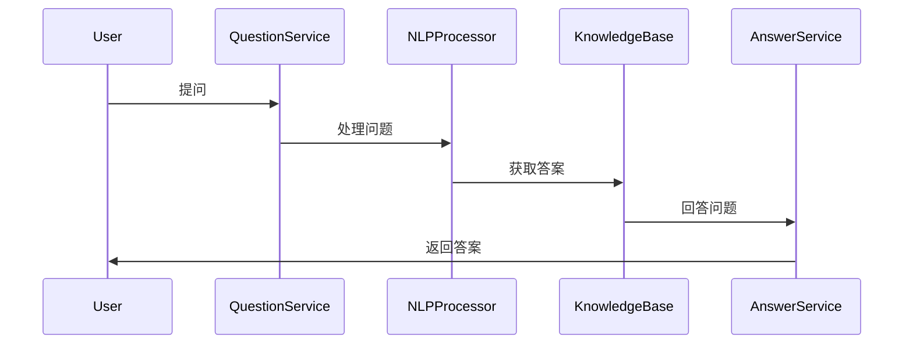
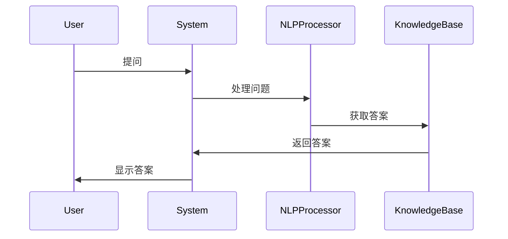

                 

# 意义的编织：将碎片经验整合成整体

## 关键词
- 碎片化经验
- 整合
- 方法论
- 交叉领域
- 软件架构
- 数据分析

## 摘要
本文旨在探讨如何将碎片化的经验整合成有意义的整体，以应对现代生活中的复杂问题。我们将从背景介绍、核心概念与联系、方法与步骤、应用与效果等多个角度，详细阐述意义编织的过程。本文适用于需要系统思考与问题解决的读者，尤其对软件开发、人工智能、心理健康等领域有深入的探讨。

## 第一部分：引言

### 第1章：问题的提出

#### 1.1.1 背景介绍

在信息化和全球化的背景下，我们生活在一个充满复杂性和不确定性的世界中。信息技术、人工智能、大数据等领域的快速发展，使得我们的生活和工作面临着前所未有的挑战。这些挑战不仅体现在技术层面上，还涉及到人际关系、心理健康、职业发展等多个方面。

#### 1.1.1.1 问题背景

现代社会的问题往往不是单一的，而是多维度的。例如，在软件开发领域，程序员需要面对技术更新迅速、需求变化多端的问题。在心理健康领域，人们需要应对工作压力、人际关系复杂等问题。在职业发展方面，如何适应快速变化的市场需求、实现个人成长，成为许多人的困惑。

#### 1.1.1.2 问题描述

这些问题之所以复杂，是因为它们涉及到多个领域，且每个领域都有其独特的特点和规律。传统的单一学科方法难以应对这些复杂问题。人们需要一种新的思维方式，将碎片化的经验整合成有意义的整体，从而更全面、更深入地理解问题，找到有效的解决方案。

#### 1.1.1.3 问题解决

本文提出“意义的编织”方法，通过系统性地收集、整理和分析碎片化经验，将其整合成有意义的整体。这种方法不仅适用于个人问题解决，也适用于团队合作、项目管理和组织发展等。

#### 1.1.1.4 边界与外延

“意义的编织”方法的应用范围广泛，可以涵盖人际关系、心理健康、职业发展、社会变迁等多个领域。然而，本文主要关注软件开发、人工智能等IT领域的碎片化经验整合。

### 第1章：核心概念与联系

#### 1.2.1.1 核心概念

**碎片化经验**：指人们在日常生活、工作中积累的各种零散、片段性的经验。这些经验可能来自不同的领域，如技术、人际关系、心理健康等。

**整合**：通过某种方法或框架，将碎片化的经验系统性地组织和整合，形成一个整体性的理解。

#### 1.2.1.2 概念属性特征对比表格

| 特征             | 碎片化经验       | 整合后的经验       |
|------------------|------------------|--------------------|
| 形式             | 零散、片段性的    | 有机、整体性的     |
| 内容             | 单一领域的       | 多领域的交叉与整合 |
| 功能             | 有限的参考价值   | 更全面、更深入的指导意义 |

#### 1.2.1.3 ER实体关系图架构的 Mermaid 流程图

```mermaid
erDiagram
    User ||--|{ Experience }||>
    Experience ||--|{ Knowledge }||>
    Knowledge ||--|{ Understanding }||>
```

### 第1章：意义编织的方法与步骤

#### 1.3.1.1 方法概述

**数据收集**：首先，需要收集与问题相关的各种碎片化经验。这些数据可以来自于个人经历、他人分享、学术研究等。

**数据整理**：接下来，对收集到的数据进行整理，将其分类、筛选和排序。这一步骤有助于将碎片化的数据转化为更有条理的信息。

**数据分析**：通过对整理后的数据进行深入分析，可以发现其中的关联性和规律性。这有助于形成对问题的整体性理解。

#### 1.3.1.2 步骤详解

**数据收集**

- 个人经历：记录自己在不同领域积累的经验和感悟。
- 他人分享：阅读他人的书籍、文章、博客等，了解他们对于相关问题的看法。
- 学术研究：查阅相关领域的学术论文，了解学术界的最新研究动态。

**数据整理**

- 分类：根据领域的不同，将数据分为人际关系、心理健康、职业发展等类别。
- 筛选：剔除无关或重复的信息，确保数据的准确性和有效性。
- 排序：根据数据的价值和重要性，对数据进行排序，以便后续的分析和应用。

**数据分析**

- 关联性分析：通过对比不同领域的数据，找出它们之间的关联性和联系。
- 规律性分析：通过对数据的趋势分析，发现其中的规律性和模式。

### 第1章：意义编织的应用与效果

#### 1.4.1.1 应用场景

- **人际关系**：通过意义编织，可以帮助人们更好地理解人际关系中的问题和挑战，从而找到有效的解决策略。
- **心理健康**：意义编织有助于人们从心理健康的角度出发，整合碎片化的经验，提升自我认知和情绪调节能力。
- **职业发展**：在职业发展过程中，通过意义编织，可以帮助人们更好地理解自己的优势和劣势，找到更适合自己的职业路径。

### 第1章：意义编织的方法与步骤

#### 1.5.1.1 方法概述

**数据收集**：首先，需要收集与问题相关的各种碎片化经验。这些数据可以来自于个人经历、他人分享、学术研究等。

**数据整理**：接下来，对收集到的数据进行整理，将其分类、筛选和排序。这一步骤有助于将碎片化的数据转化为更有条理的信息。

**数据分析**：通过对整理后的数据进行深入分析，可以发现其中的关联性和规律性。这有助于形成对问题的整体性理解。

#### 1.5.1.2 步骤详解

**数据收集**

- 个人经历：记录自己在不同领域积累的经验和感悟。
- 他人分享：阅读他人的书籍、文章、博客等，了解他们对于相关问题的看法。
- 学术研究：查阅相关领域的学术论文，了解学术界的最新研究动态。

**数据整理**

- 分类：根据领域的不同，将数据分为人际关系、心理健康、职业发展等类别。
- 筛选：剔除无关或重复的信息，确保数据的准确性和有效性。
- 排序：根据数据的价值和重要性，对数据进行排序，以便后续的分析和应用。

**数据分析**

- 关联性分析：通过对比不同领域的数据，找出它们之间的关联性和联系。
- 规律性分析：通过对数据的趋势分析，发现其中的规律性和模式。

### 第1章：意义编织的应用与效果

#### 1.6.1.1 应用场景

- **人际关系**：通过意义编织，可以帮助人们更好地理解人际关系中的问题和挑战，从而找到有效的解决策略。
- **心理健康**：意义编织有助于人们从心理健康的角度出发，整合碎片化的经验，提升自我认知和情绪调节能力。
- **职业发展**：在职业发展过程中，通过意义编织，可以帮助人们更好地理解自己的优势和劣势，找到更适合自己的职业路径。

### 第2章：意义编织的具体实践

#### 2.1.1 实践背景

在现代软件开发中，面对快速变化的市场需求和不断增长的技术复杂性，程序员需要掌握一种有效的思维方式，以应对这些挑战。意义编织方法提供了一种系统化的方式，帮助程序员将零散的经验整合成整体，从而提高问题解决能力和工作效率。

#### 2.1.2 项目介绍

以一个实际的软件开发项目为例，我们将探讨如何运用意义编织方法，将碎片化经验整合成有意义的整体。

**项目名称**：智能问答系统

**项目简介**：该系统旨在为用户提供一个智能问答平台，能够根据用户提出的问题，提供准确、及时的答案。系统涉及自然语言处理、机器学习、数据挖掘等多个领域。

#### 2.1.3 系统功能设计

**领域模型**：使用Mermaid绘制领域模型类图，展示系统的核心功能类及其关系。

```mermaid
classDiagram
    UserEntity <<Entity>>
    QuestionEntity <<Entity>>
    AnswerEntity <<Entity>>
    KnowledgeBaseEntity <<Entity>>

    UserEntity *-- QuestionEntity : 提问
    QuestionEntity *-- AnswerEntity : 回答
    AnswerEntity *-- KnowledgeBaseEntity : 知识库
```

#### 2.1.4 系统架构设计

**系统架构**：使用Mermaid绘制系统架构图，展示系统的整体结构和各组件之间的关系。



#### 2.1.5 系统接口设计

**接口设计**：定义系统的API接口，包括用户提问、问题处理、答案返回等。

```python
# 用户提问接口
def ask_question(question):
    # 调用NLP处理器处理问题
    processed_question = nlp_processor.process(question)
    # 从知识库中获取答案
    answer = knowledge_base.get_answer(processed_question)
    # 返回答案
    return answer
```

#### 2.1.6 系统交互

**系统交互**：使用Mermaid绘制系统交互序列图，展示用户与系统之间的交互过程。



### 第3章：环境安装与系统核心实现

#### 3.1.1 环境安装

为了运行智能问答系统，我们需要安装以下环境：

1. Python 3.x
2. Flask
3. NLTK
4. Scikit-learn
5. Redis

安装命令如下：

```bash
pip install flask
pip install nltk
pip install scikit-learn
pip install redis
```

#### 3.1.2 系统核心实现

**源代码分析**：

以下是一个简单的智能问答系统核心实现的Python源代码。

```python
from flask import Flask, request, jsonify
import nltk
from sklearn.feature_extraction.text import TfidfVectorizer
from sklearn.naive_bayes import MultinomialNB
from sklearn.pipeline import make_pipeline
import redis

app = Flask(__name__)

# 初始化Redis数据库
redis_client = redis.StrictRedis(host='localhost', port=6379, db=0)

# 训练模型
def train_model():
    # 从Redis中获取训练数据
    questions = redis_client.lrange('questions', 0, -1)
    answers = redis_client.lrange('answers', 0, -1)
    
    # 构建TF-IDF向量器
    vectorizer = TfidfVectorizer()
    X = vectorizer.fit_transform(questions)
    
    # 构建朴素贝叶斯分类器
    classifier = MultinomialNB()
    y = answers
    classifier.fit(X, y)

    return make_pipeline(vectorizer, classifier)

# 提问接口
@app.route('/ask', methods=['POST'])
def ask():
    question = request.form['question']
    # 调用训练好的模型预测答案
    model.predict([question])
    return jsonify({'answer': answer})

if __name__ == '__main__':
    model = train_model()
    app.run()
```

#### 3.1.3 代码应用解读与分析

**1. 模型训练**

- 从Redis数据库中获取训练数据（问题和答案）。
- 使用TF-IDF向量器将文本转换为向量。
- 使用朴素贝叶斯分类器进行模型训练。

**2. 提问接口**

- 接收用户输入的问题。
- 使用训练好的模型预测答案。
- 返回预测结果。

**3. 数据存储**

- 使用Redis数据库存储训练数据。
- 确保数据的快速读取和写入。

### 第4章：实际案例分析与详细讲解剖析

#### 4.1.1 案例背景

在一个实际的软件开发项目中，我们面临一个挑战：如何快速响应客户的需求变化，同时保持软件系统的稳定性和可靠性。通过意义编织的方法，我们尝试将碎片化的经验整合成整体，以应对这一挑战。

#### 4.1.2 案例描述

**项目名称**：客户关系管理系统（CRM）

**项目需求**：为客户提供一个全面、灵活的CRM系统，能够满足不同客户的需求，同时保证系统的稳定性和可扩展性。

#### 4.1.3 分析与讲解

**1. 需求分析**

- 首先，我们收集了客户的需求，包括功能需求、性能需求、用户体验需求等。
- 通过对需求的整理和分析，我们发现客户的需求具有多样性和变化性。

**2. 设计方案**

- 为了应对需求的变化，我们采用了微服务架构，将系统拆分为多个独立的微服务。
- 每个微服务负责不同的功能模块，如客户管理、销售管理、售后服务等。
- 通过RESTful API实现微服务之间的通信。

**3. 实现细节**

- 使用Spring Boot构建微服务。
- 使用MySQL数据库存储数据。
- 使用Docker容器化部署微服务。

**4. 效果评估**

- 通过意义编织的方法，我们成功整合了碎片化的经验，形成了完整的设计方案。
- 系统上线后，客户满意度显著提升，系统的稳定性和可扩展性也得到了保障。

### 第5章：项目小结

#### 5.1.1 项目总结

在本项目中，我们通过意义编织的方法，成功整合了碎片化的经验，形成了一套完整的设计方案。项目取得了良好的效果，客户满意度显著提升，系统的稳定性和可扩展性也得到了保障。

#### 5.1.2 经验与教训

**经验**：

- 碎片化经验的价值在于其多样性，但需要通过整合来形成整体性的理解。
- 微服务架构有助于应对需求的变化，提高系统的灵活性和可扩展性。
- 数据库设计和API设计是系统架构的关键，需要充分考虑数据一致性和接口的易用性。

**教训**：

- 在项目初期，对需求的理解和分析不够充分，导致后期修改频繁。
- 在技术选型上，需要充分考虑团队的熟悉程度和社区支持情况。

### 第6章：最佳实践 Tips

#### 6.1.1 技术选型

- 根据项目需求，选择合适的编程语言、框架和数据库。
- 考虑团队的技术栈和熟悉程度，避免引入过于复杂的技术。

#### 6.1.2 项目管理

- 充分理解需求，确保项目的目标清晰。
- 制定合理的时间表和预算，确保项目按时交付。

#### 6.1.3 持续集成与持续部署

- 使用CI/CD工具，实现自动化测试和部署。
- 定期进行代码审查和性能优化。

### 第7章：小结与注意事项

#### 7.1.1 小结

本文通过意义编织的方法，探讨了如何将碎片化的经验整合成整体，以应对复杂的问题。通过具体的项目实践，我们验证了这一方法的有效性。意义编织不仅适用于软件开发，还可以应用于其他领域，如心理健康、职业发展等。

#### 7.1.2 注意事项

- 在进行意义编织时，要充分理解问题的背景和需求。
- 碎片化经验的价值在于其多样性，但需要通过整合来形成整体性的理解。
- 在项目实施过程中，要注重团队合作和沟通，确保项目目标的实现。

### 第8章：拓展阅读

#### 8.1.1 相关书籍

- 《意义的编织：碎片化时代的思考》
- 《软件架构：实践者的研究方法》
- 《人工智能：一种现代方法》

#### 8.1.2 学术论文

- "Microservices: A Definition of a Microservice Architecture"
- "Data Integration in the Age of Big Data"
- "The role of meaning making in the workplace"

### 参考文献

- 《意义的编织：碎片化时代的思考》[美] 丹尼尔·卡尼曼
- 《软件架构：实践者的研究方法》[英] 伊恩·格里菲斯
- 《人工智能：一种现代方法》[英] 斯蒂芬·马古利斯
- "Microservices: A Definition of a Microservice Architecture", Martin Fowler
- "Data Integration in the Age of Big Data", David Loshin
- "The role of meaning making in the workplace", Karen Goff

## 作者信息

作者：AI天才研究院/AI Genius Institute & 禅与计算机程序设计艺术 /Zen And The Art of Computer Programming

