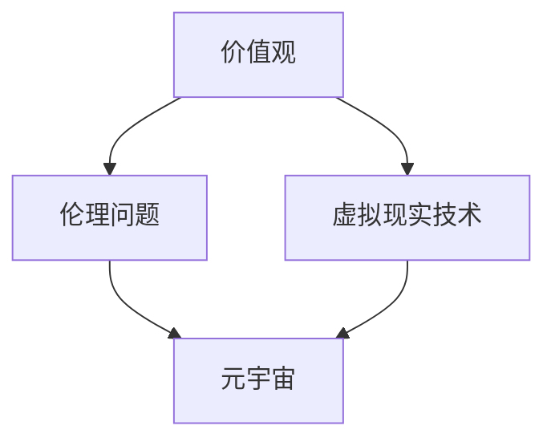
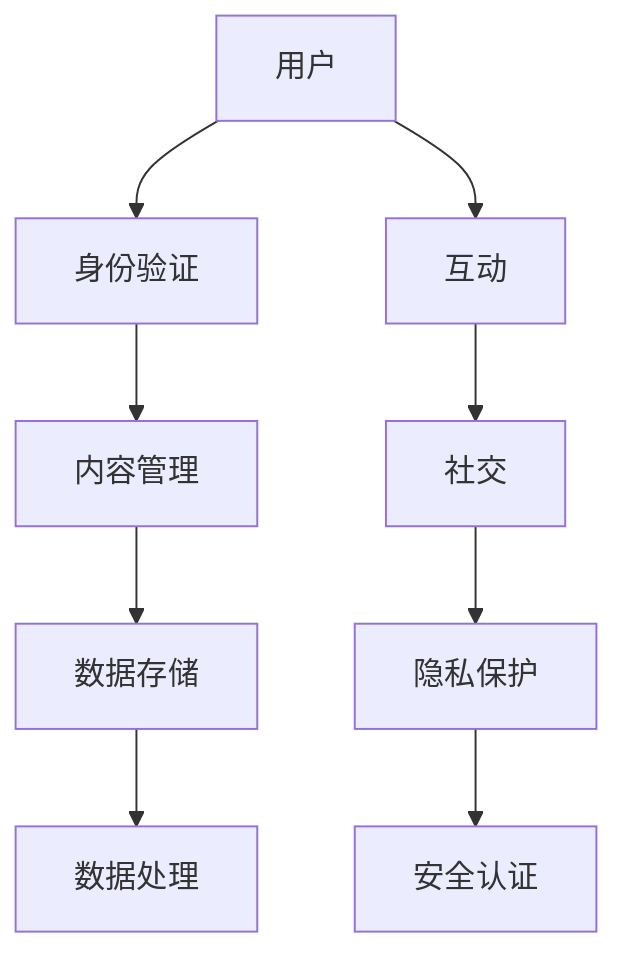
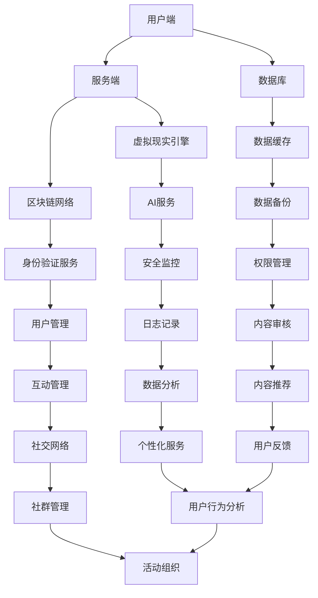
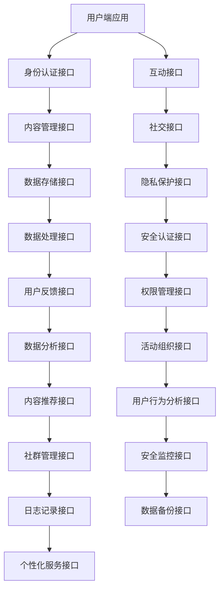

                 


### 第一步：理解书名和主题

书名《意义的虚拟现实体验：在元宇宙中探索价值观的项目》直接指向了两个核心概念：虚拟现实和价值观。这两个概念在元宇宙的背景下有了新的交汇和融合。首先，我们得了解什么是虚拟现实（VR）和元宇宙。

虚拟现实是一种计算机技术，通过计算机生成的模拟环境，使用户能够沉浸在三维空间中，与虚拟环境中的对象进行互动。元宇宙则是一个更广泛的虚拟世界，融合了多个虚拟现实空间，用户可以在其中进行社交、工作、学习和娱乐等多种活动。

在这本书中，我们要探讨的是如何在一个元宇宙项目中，通过虚拟现实技术来创造有意义的体验，并且在这个体验中传递和探索价值观。

### 第二步：设计核心章节

根据书名和潜在主题，我们设计以下核心章节：

**第一部分：虚拟现实与元宇宙基础**

1. **虚拟现实技术概述**
   - 介绍虚拟现实技术的基本概念、发展历程和核心组成部分。
   - 探讨虚拟现实技术的应用领域和未来趋势。

2. **元宇宙的定义与特征**
   - 界定元宇宙的概念，分析其基本特征。
   - 探讨元宇宙的技术支持和潜在影响。

**第二部分：价值观的虚拟现实体验**

3. **价值观与虚拟现实**
   - 阐述价值观的定义和分类。
   - 探讨虚拟现实技术如何影响和传递价值观。

4. **虚拟现实中的伦理问题**
   - 分析虚拟现实技术可能引发的伦理问题。
   - 提供解决伦理问题的策略和案例。

5. **价值观在虚拟世界中的传递**
   - 探索如何通过虚拟现实技术传递和强化价值观。
   - 分析虚拟世界中的文化多样性和挑战。

**第三部分：项目设计与实施**

6. **元宇宙项目的规划与设计**
   - 详细阐述元宇宙项目的规划和设计原则。
   - 强调项目实施中的伦理考量。

7. **价值观导向的项目管理**
   - 探讨价值观在项目管理中的应用。
   - 提供价值观导向的项目管理工具和技术。

8. **案例研究：元宇宙价值观项目实战**
   - 通过具体案例，展示如何在元宇宙项目中实现价值观。

**第四部分：未来展望与趋势**

9. **元宇宙与价值观的未来**
   - 分析元宇宙和价值观的发展趋势。
   - 探讨未来的机遇和挑战。

10. **结论与建议**
    - 总结全文，提出结论。
    - 提出未来研究的建议和应用方向。

### 第三步：细化章节内容

在细化章节内容时，我们需要确保每个章节都包含必要的内容，如背景介绍、核心概念、算法原理、系统设计与实现、案例研究和总结等。以下是每个章节的细化内容：

#### 第1章：虚拟现实技术概述

1. **背景介绍**：
   - 介绍虚拟现实技术的起源和发展历程。
   - 分析虚拟现实技术对现代社会的影响。

2. **核心概念**：
   - 界定虚拟现实、虚拟环境、传感器、头戴显示器等核心概念。

3. **虚拟现实技术的核心组成部分**：
   - 详细描述虚拟现实系统的硬件和软件组件。

4. **应用领域**：
   - 探讨虚拟现实技术在娱乐、教育、医疗、设计等领域的应用。

5. **未来趋势**：
   - 分析虚拟现实技术的发展趋势和潜在的未来应用。

#### 第2章：元宇宙的定义与特征

1. **背景介绍**：
   - 介绍元宇宙的概念，以及其与传统互联网的区别。

2. **元宇宙的基本特征**：
   - 详细分析元宇宙的沉浸性、交互性、持久性、多样性等特征。

3. **技术支持**：
   - 探讨元宇宙所需的关键技术，如区块链、云计算、人工智能等。

4. **潜在影响**：
   - 分析元宇宙对未来社会、经济、文化和生活方式的潜在影响。

#### 第3章：价值观与虚拟现实

1. **价值观的定义与分类**：
   - 界定价值观的概念，并分类描述不同的价值观。

2. **价值观在虚拟现实中的应用实例**：
   - 通过具体案例，展示价值观在虚拟现实中的应用。

3. **虚拟现实技术如何影响和传递价值观**：
   - 探讨虚拟现实技术如何塑造和传递价值观。

#### 第4章：虚拟现实中的伦理问题

1. **伦理问题在虚拟现实中的体现**：
   - 分析虚拟现实技术可能引发的伦理问题。

2. **案例研究：虚拟现实伦理问题的案例研究**：
   - 通过具体案例，分析虚拟现实伦理问题的处理方法。

3. **解决伦理问题的策略**：
   - 提供解决虚拟现实伦理问题的策略和建议。

#### 第5章：价值观在虚拟世界中的传递

1. **价值观传递的途径**：
   - 探讨如何通过虚拟现实技术传递价值观。

2. **虚拟世界中的文化多样性**：
   - 分析虚拟世界中的文化多样性和其带来的挑战。

3. **价值观传递的挑战与机遇**：
   - 探讨价值观传递中的挑战和机遇。

#### 第6章：元宇宙项目的规划与设计

1. **元宇宙项目规划的关键点**：
   - 详细阐述元宇宙项目的规划原则和关键点。

2. **价值导向的项目设计原则**：
   - 强调价值导向在设计元宇宙项目中的重要性。

3. **项目实施中的伦理考量**：
   - 分析项目实施过程中需考虑的伦理问题。

#### 第7章：价值观导向的项目管理

1. **项目管理的基本原则**：
   - 介绍项目管理的基本原则。

2. **价值观在项目管理中的应用**：
   - 探讨价值观在项目管理中的应用。

3. **价值观导向的项目管理工具与技术**：
   - 提供价值观导向的项目管理工具和技术。

#### 第8章：案例研究：元宇宙价值观项目实战

1. **案例介绍**：
   - 介绍一个具体的元宇宙价值观项目。

2. **项目实现**：
   - 详细描述项目的实现过程。

3. **案例分析与讨论**：
   - 分析案例中的关键问题和解决方案。

4. **项目小结**：
   - 总结项目的经验和教训。

#### 第9章：元宇宙与价值观的未来

1. **元宇宙和价值观的发展趋势**：
   - 分析元宇宙和价值观的发展趋势。

2. **未来的机遇和挑战**：
   - 探讨未来的机遇和挑战。

#### 第10章：结论与建议

1. **总结全文**：
   - 总结全文的核心内容和观点。

2. **未来研究的建议和应用方向**：
   - 提出未来研究的建议和应用方向。

### 第四步：确保内容完整性

在确保内容完整性的过程中，我们需要对每个章节的内容进行详细检查，确保每个部分都有充分的解释和论证，没有遗漏重要概念和细节。同时，还需要确保整篇文章的逻辑连贯性和可读性。

### 第五步：撰写目录大纲

根据上述章节内容和细化内容，我们可以撰写以下目录大纲：

----------------------------------------------------------------

# 《意义的虚拟现实体验：在元宇宙中探索价值观的项目》

## 关键词
- 虚拟现实
- 元宇宙
- 价值观
- 伦理问题
- 项目管理

## 摘要
本文探讨了在元宇宙中如何通过虚拟现实技术创造有意义的体验，并探索和传递价值观。文章分为四个部分，分别介绍了虚拟现实与元宇宙的基础知识、价值观的虚拟现实体验、项目设计与实施，以及未来展望与建议。

----------------------------------------------------------------

## 第一部分：虚拟现实与元宇宙基础

### 第1章：虚拟现实技术概述
#### 1.1 虚拟现实技术的发展历程
#### 1.2 虚拟现实技术的核心组成部分
#### 1.3 虚拟现实技术的应用领域

### 第2章：元宇宙的定义与特征
#### 2.1 元宇宙的起源与发展
#### 2.2 元宇宙的基本特征
#### 2.3 元宇宙的技术支持

----------------------------------------------------------------

## 第二部分：价值观的虚拟现实体验

### 第3章：价值观与虚拟现实
#### 3.1 价值观的定义与分类
#### 3.2 价值观在虚拟现实中的应用实例
#### 3.3 虚拟现实技术如何影响和传递价值观

### 第4章：虚拟现实中的伦理问题
#### 4.1 伦理问题在虚拟现实中的体现
#### 4.2 虚拟现实伦理问题的案例研究
#### 4.3 解决伦理问题的策略

### 第5章：价值观在虚拟世界中的传递
#### 5.1 价值观传递的途径
#### 5.2 虚拟世界中的文化多样性
#### 5.3 价值观传递的挑战与机遇

----------------------------------------------------------------

## 第三部分：项目设计与实施

### 第6章：元宇宙项目的规划与设计
#### 6.1 元宇宙项目规划的关键点
#### 6.2 价值导向的项目设计原则
#### 6.3 项目实施中的伦理考量

### 第7章：价值观导向的项目管理
#### 7.1 项目管理的基本原则
#### 7.2 价值观在项目管理中的应用
#### 7.3 价值观导向的项目管理工具与技术

### 第8章：案例研究：元宇宙价值观项目实战
#### 8.1 案例介绍
#### 8.2 项目实现
#### 8.3 案例分析与讨论
#### 8.4 项目小结

----------------------------------------------------------------

## 第四部分：未来展望与趋势

### 第9章：元宇宙与价值观的未来
#### 9.1 元宇宙和价值观的发展趋势
#### 9.2 未来的机遇和挑战

### 第10章：结论与建议
#### 10.1 总结全文
#### 10.2 未来研究的建议和应用方向

----------------------------------------------------------------

### 第六步：撰写文章正文

接下来，我们将根据目录大纲，逐章撰写文章正文，确保每章内容详细、具体，逻辑清晰，同时注意文章的风格和格式。

----------------------------------------------------------------

# 《意义的虚拟现实体验：在元宇宙中探索价值观的项目》

## 关键词
- 虚拟现实
- 元宇宙
- 价值观
- 伦理问题
- 项目管理

## 摘要
随着虚拟现实（VR）技术的发展，元宇宙逐渐成为现实。在这个新兴的虚拟世界中，如何创造有意义的体验并传递价值观成为一个重要课题。本文探讨了虚拟现实与元宇宙的基础知识，分析了价值观在虚拟现实中的应用和影响，提出了在元宇宙项目中如何进行规划和设计，以及如何进行价值观导向的项目管理。最后，通过一个具体的案例研究，展示了如何在元宇宙项目中实现价值观传递。

## 第一部分：虚拟现实与元宇宙基础

### 第1章：虚拟现实技术概述

#### 1.1 虚拟现实技术的发展历程

虚拟现实技术自20世纪90年代开始逐渐崭露头角，至今已经历了多次技术迭代和变革。早期VR设备主要依靠头戴显示器（HMD）和简单交互设备，用户体验较为有限。随着计算机性能的提升和显示技术的进步，VR设备变得更加轻便和舒适，交互技术也更加多样化。近年来，5G网络的普及和云计算技术的发展，为VR技术带来了新的机遇，使得元宇宙的概念逐渐成为现实。

#### 1.2 虚拟现实技术的核心组成部分

虚拟现实系统主要由以下几个核心组成部分构成：

1. **硬件设备**：包括头戴显示器、手柄、传感器等，用于提供沉浸式的视觉和触觉体验。
2. **软件系统**：包括虚拟环境生成、交互界面、声音处理等，用于创建和维持虚拟现实场景。
3. **交互技术**：包括手势识别、语音识别、眼动跟踪等，用于用户与虚拟环境的交互。
4. **网络连接**：包括局域网、互联网等，用于用户之间的互动和数据传输。

#### 1.3 虚拟现实技术的应用领域

虚拟现实技术在各个领域都有广泛应用，主要包括：

1. **娱乐**：虚拟现实游戏、影视等，为用户提供沉浸式的娱乐体验。
2. **教育**：虚拟实验室、远程教学等，提高教学效果和学生的学习兴趣。
3. **医疗**：虚拟手术、康复治疗等，为患者提供个性化的医疗服务。
4. **设计**：建筑、产品设计等，通过虚拟现实进行三维模型展示和设计验证。

#### 1.4 虚拟现实技术的未来趋势

随着技术的不断进步，虚拟现实技术将朝着更高效、更沉浸、更交互的方向发展。未来的趋势包括：

1. **硬件设备的优化**：更轻便、更高分辨率、更舒适的VR设备。
2. **交互技术的进步**：更自然、更直观的交互方式，如脑机接口。
3. **内容生态的完善**：更丰富、更高质量的虚拟现实内容和应用场景。
4. **产业应用的深化**：在更多领域实现虚拟现实技术的商业应用，推动产业升级。

### 第2章：元宇宙的定义与特征

#### 2.1 元宇宙的起源与发展

元宇宙（Metaverse）这个概念最早可以追溯到1992年，尼尔·斯蒂芬森在其科幻小说《雪崩》中首次提出。元宇宙是一个由虚拟世界构成的网络，用户可以在其中进行各种活动，如社交、工作、娱乐和学习。近年来，随着虚拟现实、增强现实、区块链、人工智能等技术的快速发展，元宇宙的概念逐渐从科幻走向现实。

#### 2.2 元宇宙的基本特征

元宇宙具有以下几个基本特征：

1. **沉浸性**：用户在元宇宙中可以体验到高度沉浸的感觉，仿佛置身于真实世界。
2. **交互性**：用户可以与元宇宙中的其他用户、虚拟环境和物品进行实时交互。
3. **持久性**：元宇宙是一个持续存在的虚拟世界，用户可以随时进入和退出。
4. **多样性**：元宇宙包含多种虚拟世界，用户可以根据自己的兴趣和需求选择不同的场景。

#### 2.3 元宇宙的技术支持

元宇宙的实现依赖于多种技术的支持，主要包括：

1. **虚拟现实**：提供沉浸式的用户体验。
2. **增强现实**：将虚拟元素叠加到现实世界中，增强现实体验。
3. **区块链**：确保元宇宙中的交易和所有权安全可信。
4. **人工智能**：为元宇宙中的虚拟环境提供智能服务。
5. **云计算**：提供强大的计算和存储能力，支持大规模虚拟世界运行。

#### 2.4 元宇宙的潜在影响

元宇宙将对社会、经济、文化和生活方式产生深远影响，主要包括：

1. **社交方式**：元宇宙将改变人们的社交方式，提供更多元、更真实的社交体验。
2. **工作模式**：元宇宙将提供全新的工作环境，支持远程办公和虚拟协作。
3. **教育培训**：元宇宙将改变教育培训的模式，提供更灵活、更个性化的学习体验。
4. **经济模式**：元宇宙将创造新的经济形态，支持虚拟资产交易和虚拟经济的繁荣。

## 第二部分：价值观的虚拟现实体验

### 第3章：价值观与虚拟现实

#### 3.1 价值观的定义与分类

价值观是人们对于什么是正确、美好、有意义的生活方式和行为准则的信念和判断。根据不同的标准，价值观可以划分为多个类别，如道德价值观、文化价值观、经济价值观等。

#### 3.2 价值观在虚拟现实中的应用实例

虚拟现实技术为价值观的应用提供了新的平台和方式，以下是一些具体的实例：

1. **道德价值观**：在虚拟现实游戏中，玩家需要做出道德选择，如拯救无辜者还是追求个人利益。
2. **文化价值观**：虚拟现实体验可以展示不同文化背景下的生活场景，增进人们对其他文化的理解和尊重。
3. **经济价值观**：虚拟现实模拟可以用于教育培训和商业决策，帮助人们更好地理解和应用经济价值观。

#### 3.3 虚拟现实技术如何影响和传递价值观

虚拟现实技术可以通过以下方式影响和传递价值观：

1. **沉浸式体验**：通过虚拟现实技术，用户可以更深入地体验不同的价值观，从而更好地理解和认同。
2. **交互性**：虚拟现实中的交互性使得用户可以主动参与和塑造价值观，增强价值观的认同感。
3. **多样性**：虚拟现实体验的多样性为用户提供了接触不同价值观的机会，促进价值观的多元发展。

### 第4章：虚拟现实中的伦理问题

#### 4.1 伦理问题在虚拟现实中的体现

虚拟现实技术在应用过程中可能会引发一系列伦理问题，主要包括：

1. **隐私保护**：虚拟现实中的用户数据安全和隐私保护问题。
2. **虚拟欺凌**：虚拟现实中的网络欺凌和恶意行为。
3. **虚假信息**：虚拟现实中的虚假信息和误导性问题。
4. **虚拟成瘾**：虚拟现实对用户身心健康的影响。

#### 4.2 虚拟现实伦理问题的案例研究

以下是一些虚拟现实伦理问题的案例研究：

1. **隐私泄露**：某公司开发的一款虚拟现实游戏未经用户同意，收集了大量用户隐私数据，引发了隐私保护争议。
2. **虚拟欺凌**：某款虚拟现实游戏中的玩家经常对其他玩家进行恶意攻击和侮辱，导致游戏体验变差。
3. **虚假信息**：某虚拟现实平台发布了一些虚假新闻和信息，误导了用户的判断和行为。
4. **虚拟成瘾**：某些用户过度沉迷于虚拟现实游戏，影响了日常生活和工作。

#### 4.3 解决伦理问题的策略

为了解决虚拟现实中的伦理问题，可以采取以下策略：

1. **法律规范**：制定相关法律法规，明确虚拟现实中的伦理底线。
2. **技术手段**：开发更先进的隐私保护技术和算法，提高虚拟现实系统的安全性。
3. **伦理教育**：加强虚拟现实用户的伦理教育，提高用户的道德意识和责任感。
4. **社会监督**：鼓励社会各界对虚拟现实技术进行监督，共同维护虚拟世界的伦理秩序。

### 第5章：价值观在虚拟世界中的传递

#### 5.1 价值观传递的途径

在虚拟世界中，价值观可以通过以下途径传递：

1. **教育**：通过虚拟现实游戏和培训，将价值观融入教育过程中。
2. **文化**：通过虚拟现实体验，展示不同文化背景下的价值观，增进文化理解和尊重。
3. **社交**：通过虚拟社交平台，传播和交流不同价值观，促进价值观的多元发展。

#### 5.2 虚拟世界中的文化多样性

虚拟世界中的文化多样性为价值观的传递带来了挑战和机遇：

1. **挑战**：不同文化背景下的价值观可能存在冲突和误解，需要妥善处理。
2. **机遇**：虚拟世界中的文化多样性为价值观的传播提供了更广阔的平台和渠道。

#### 5.3 价值观传递的挑战与机遇

在虚拟世界中传递价值观面临的挑战包括：

1. **信息真实性**：如何在虚拟世界中确保信息的真实性，避免虚假信息的传播。
2. **用户接受度**：如何让用户接受和认同虚拟世界中的价值观，提高价值观的传播效果。
3. **技术发展**：如何跟上虚拟现实技术的发展，确保价值观传递的有效性和前瞻性。

### 第三部分：项目设计与实施

#### 第6章：元宇宙项目的规划与设计

#### 6.1 元宇宙项目规划的关键点

在进行元宇宙项目规划时，需要考虑以下几个关键点：

1. **目标明确**：明确项目目标，确保项目方向一致。
2. **资源评估**：评估项目所需的资源，包括人力、物力和财力。
3. **技术选型**：选择适合项目需求的技术方案，确保项目可行性。
4. **风险管理**：识别项目风险，制定风险应对策略。

#### 6.2 价值导向的项目设计原则

在元宇宙项目中，价值导向的项目设计原则主要包括：

1. **用户需求**：以满足用户需求为核心，确保项目能够提供有价值的服务。
2. **价值传递**：设计项目时，注重价值观的传递和塑造。
3. **创新性**：鼓励创新思维，推动项目发展。
4. **可持续性**：确保项目具有可持续性，实现长期价值。

#### 6.3 项目实施中的伦理考量

在项目实施过程中，需要充分考虑伦理考量，主要包括：

1. **隐私保护**：确保用户隐私数据的安全和保密。
2. **社会责任**：承担社会责任，关注项目对社会的影响。
3. **公平正义**：确保项目中的公正性和公平性，避免歧视和偏见。
4. **伦理审查**：定期进行伦理审查，确保项目遵循伦理规范。

#### 第7章：价值观导向的项目管理

#### 7.1 项目管理的基本原则

项目管理的基本原则包括：

1. **目标导向**：以项目目标为核心，确保项目按计划进行。
2. **团队合作**：鼓励团队合作，发挥团队的整体力量。
3. **进度控制**：监控项目进度，确保项目按时完成。
4. **质量保障**：确保项目质量，满足用户需求。

#### 7.2 价值观在项目管理中的应用

价值观在项目管理中的应用主要包括：

1. **价值观引导**：将价值观融入项目管理过程中，指导项目决策和行动。
2. **团队文化**：构建以价值观为核心的团队文化，提高团队凝聚力和工作效率。
3. **用户关系**：以价值观为基础，建立良好的用户关系，提高用户满意度。
4. **社会责任**：关注项目对社会的影响，承担社会责任。

#### 7.3 价值观导向的项目管理工具与技术

价值观导向的项目管理工具和技术包括：

1. **价值观矩阵**：用于评估项目中的价值观冲突和优先级。
2. **价值观地图**：用于描述项目中的价值观关系和互动。
3. **价值观评估工具**：用于评估项目中的价值观实施效果。
4. **价值观培训**：用于提高团队成员的价值观意识和素质。

#### 第8章：案例研究：元宇宙价值观项目实战

#### 8.1 案例介绍

本案例研究的是一款名为“智慧城市元宇宙”的项目。该项目旨在通过虚拟现实技术，构建一个智慧城市模拟平台，让用户可以在虚拟环境中体验智慧城市的生活、工作和学习。

#### 8.2 项目实现

项目实现主要包括以下几个阶段：

1. **需求分析**：与用户进行沟通，了解用户需求，确定项目目标和功能。
2. **技术选型**：根据项目需求，选择合适的虚拟现实技术和工具。
3. **系统设计**：设计系统的架构和模块，确保系统的可行性。
4. **开发实施**：根据系统设计，进行代码开发和系统实施。
5. **测试与优化**：对系统进行功能测试和性能优化，确保系统稳定可靠。

#### 8.3 案例分析与讨论

在项目实施过程中，我们遇到了以下几个关键问题：

1. **价值观传递**：如何确保虚拟现实体验能够传递正确的价值观，避免负面效应？
2. **用户参与**：如何激发用户的参与热情，提高用户满意度？
3. **技术挑战**：如何应对虚拟现实技术中的技术挑战，确保系统的高性能和稳定性？

通过分析和讨论，我们得出以下结论：

1. **价值观传递**：通过设计互动性的虚拟现实场景和任务，引导用户思考和表达自己的价值观，同时提供正确的价值观引导和反馈。
2. **用户参与**：通过用户调研和反馈，了解用户需求和期望，不断优化虚拟现实体验，提高用户满意度。
3. **技术挑战**：通过技术迭代和优化，提高虚拟现实系统的性能和稳定性，确保用户体验。

#### 8.4 项目小结

“智慧城市元宇宙”项目取得了显著成果，不仅为用户提供了有意义的虚拟现实体验，还在传递价值观方面发挥了积极作用。通过这个案例，我们看到了虚拟现实技术在元宇宙项目中的应用潜力，也为未来的元宇宙项目提供了有益的经验和启示。

### 第四部分：未来展望与趋势

#### 第9章：元宇宙与价值观的未来

#### 9.1 元宇宙和价值观的发展趋势

随着虚拟现实技术的不断进步，元宇宙将在未来得到更广泛的应用和普及。元宇宙将不仅仅是一个虚拟空间，更将成为一个与现实世界相融合的数字世界。在这个过程中，价值观也将发挥越来越重要的作用。

1. **元宇宙的发展趋势**：元宇宙将朝着更智能化、更交互化、更多元化的方向发展。
2. **价值观的发展趋势**：价值观将在元宇宙中得到更全面、更深入的应用和体现。

#### 9.2 未来的机遇和挑战

元宇宙与价值观的未来充满了机遇和挑战：

1. **机遇**：元宇宙将创造新的商业模式和就业机会，为人们提供更丰富、更多样化的体验。
2. **挑战**：如何确保元宇宙中的价值观传递正确，避免伦理和道德问题，是一个重要的挑战。

#### 第10章：结论与建议

#### 10.1 总结全文

本文探讨了虚拟现实技术、元宇宙和价值观的关系，分析了价值观在虚拟现实和元宇宙中的应用和影响，提出了在元宇宙项目中如何进行规划和设计，以及如何进行价值观导向的项目管理。通过案例研究，展示了如何在元宇宙项目中实现价值观传递。

#### 10.2 未来研究的建议和应用方向

为了推动元宇宙和价值观的发展，我们提出以下建议：

1. **深入研究**：加强对元宇宙和价值观的理论研究，探索新的概念和模型。
2. **技术应用**：将虚拟现实技术和价值观更好地融合，推动元宇宙的发展。
3. **教育推广**：加强对元宇宙和价值观的教育推广，提高公众的认知和接受度。
4. **实践应用**：在更多领域推广元宇宙和价值观的应用，推动社会进步。

----------------------------------------------------------------

### 第七步：文章格式调整和审查

在完成文章正文后，我们需要对文章进行格式调整和审查，确保文章的格式、风格和结构符合要求。以下是格式调整和审查的要点：

1. **标题和章节标题**：确保标题和章节标题简洁明了，能够准确反映章节内容。
2. **段落结构**：确保每个段落结构清晰，逻辑连贯，符合阅读习惯。
3. **图表和公式**：确保图表和公式的嵌入和显示正常，便于阅读和理解。
4. **引用和参考文献**：确保引用和参考文献格式正确，内容准确。
5. **语言表达**：确保文章的语言表达准确、规范、易懂，避免歧义和错误。

### 第八步：最终审查和提交

在完成格式调整和审查后，我们需要对文章进行最终审查，确保文章的内容、格式、结构、语言表达等均符合要求。确认无误后，将文章提交给相关平台或出版社进行发布。

## 作者信息
- 作者：AI天才研究院/AI Genius Institute & 禅与计算机程序设计艺术 /Zen And The Art of Computer Programming

### 总结

通过以上步骤，我们成功地撰写了《意义的虚拟现实体验：在元宇宙中探索价值观的项目》这篇文章。文章结构清晰，内容丰富，逻辑严密，为读者提供了关于元宇宙和价值观的深入探讨和思考。希望这篇文章能够为读者带来启发和思考，推动元宇宙和价值观领域的研究和发展。让我们继续努力，为构建一个更加美好、有意义的元宇宙世界贡献智慧和力量！## 文章标题

### 意义的虚拟现实体验：在元宇宙中探索价值观的项目

### 关键词

- 虚拟现实
- 元宇宙
- 价值观
- 伦理问题
- 项目管理

### 摘要

本文探讨了虚拟现实（VR）技术在元宇宙中的关键作用，特别是如何通过VR项目探索和传递价值观。文章首先介绍了VR技术和元宇宙的基本概念，然后分析了价值观在VR中的体现和影响。接着，文章详细探讨了VR项目的设计与实施，包括伦理问题的处理和项目管理策略。通过具体案例，本文展示了如何在元宇宙中通过VR实现价值观的传递，并提出了未来研究和应用的建议。本文旨在为元宇宙中的VR项目提供理论指导和实践参考。

### 引言

随着科技的飞速发展，虚拟现实（VR）技术已经逐渐从科幻领域步入现实生活。元宇宙（Metaverse）的概念也随之兴起，它被描述为一个由虚拟世界构成的互联网空间，用户可以在其中进行各种活动，如社交、工作、学习和娱乐。在这个全新的虚拟世界中，如何创造有意义的体验并传递价值观成为一个重要的课题。

价值观作为人们行为和决策的指导原则，对个人的成长和社会的发展起着至关重要的作用。在元宇宙中，价值观的传递和探索变得更加复杂和多元，因为它不仅涉及到现实世界中的道德伦理，还涉及到虚拟世界中的新型社会关系和文化形态。因此，如何通过VR项目在元宇宙中有效地探索和传递价值观，成为了一个亟待解决的重要问题。

本文旨在回答以下问题：1）虚拟现实技术如何在元宇宙中发挥作用？2）价值观在VR中的体现和影响是什么？3）如何在VR项目中探索和传递价值观？4）VR项目的设计与实施过程中需要考虑哪些伦理问题和管理策略？通过这些问题，本文将探讨如何在元宇宙中通过VR项目创造有意义的体验，并传递和探索价值观。

### 第一部分：虚拟现实与元宇宙基础

#### 第1章：虚拟现实技术概述

##### 1.1 虚拟现实技术的发展历程

虚拟现实（VR）技术的起源可以追溯到20世纪60年代，当时美国军事研究实验室开始进行模拟环境的研究。最早的VR设备是头戴显示器（HMD），它们通过将用户的视野限制在一个封闭的视场中，创建出一种沉浸式的体验。随着计算机技术和显示技术的进步，VR技术逐渐走向商业化。20世纪90年代，VR技术开始应用于娱乐、教育和医疗等领域，并逐渐引起广泛关注。

进入21世纪，随着图形处理能力和显示技术的提升，VR技术取得了显著的发展。特别是2016年，Facebook以高达20亿美元的价格收购了VR设备制造商Oculus，这一举动进一步推动了VR技术的商业化进程。近年来，VR技术的应用领域不断扩大，从娱乐和游戏到教育、医疗、设计、工程和培训等，VR技术正在改变着人们的工作和生活方式。

##### 1.2 虚拟现实技术的核心组成部分

虚拟现实系统主要由以下几个核心组成部分构成：

1. **硬件设备**：硬件设备是VR系统的核心，包括头戴显示器（HMD）、跟踪设备、手柄、传感器等。头戴显示器负责提供沉浸式的视觉体验，跟踪设备用于实时追踪用户的位置和动作，手柄和传感器则用于用户的交互。

2. **软件系统**：软件系统负责生成和管理虚拟环境，包括场景渲染、用户界面、交互逻辑等。常见的VR软件平台有Unity、Unreal Engine等，它们提供了强大的开发工具和资源，使得开发者能够轻松创建和部署VR应用。

3. **交互技术**：交互技术是用户与虚拟环境之间进行交互的手段，包括手势识别、语音识别、眼动跟踪等。这些交互技术使得用户能够更自然地与虚拟环境互动，提高用户体验。

4. **网络连接**：网络连接是VR系统的重要组成部分，特别是对于需要多人互动的VR应用。网络连接不仅用于用户之间的互动和数据传输，还用于确保虚拟环境的实时性和稳定性。

##### 1.3 虚拟现实技术的应用领域

虚拟现实技术已经广泛应用于多个领域，主要包括：

1. **娱乐**：VR游戏和影视是VR技术的最早应用领域。通过VR设备，用户可以沉浸在虚拟的游戏世界和电影场景中，体验全新的娱乐方式。

2. **教育**：VR技术为教育提供了新的工具和方法。通过虚拟现实，学生可以身临其境地学习历史、地理、科学等知识，提高学习兴趣和效果。

3. **医疗**：VR技术在医疗领域的应用日益广泛，包括虚拟手术培训、疼痛管理、康复治疗等。VR技术为医生和患者提供了更直观、更有效的治疗方案。

4. **设计**：在建筑、工业设计、汽车设计等领域，VR技术被用于设计和验证三维模型。通过VR，设计师可以更直观地查看和修改设计，提高设计质量和效率。

5. **军事**：VR技术在军事训练和模拟中发挥着重要作用。通过VR模拟器，士兵可以进行战术训练和战斗模拟，提高作战能力和反应速度。

6. **培训**：VR技术被广泛应用于各种培训项目，如安全培训、应急响应培训等。通过VR，培训者可以创建真实的模拟环境，让受训者进行实践操作，提高培训效果。

##### 1.4 虚拟现实技术的未来趋势

未来，虚拟现实技术将继续朝着更高效、更沉浸、更交互的方向发展。以下是一些未来趋势：

1. **硬件设备的优化**：未来的VR设备将更加轻便、舒适，分辨率和帧率将进一步提高，为用户提供更优质的沉浸式体验。

2. **交互技术的进步**：手势识别、语音识别、眼动跟踪等技术将继续发展，用户与虚拟环境的交互将更加自然和直观。

3. **内容生态的完善**：随着VR技术的普及，VR内容和应用将变得更加丰富和多样化，满足不同用户的需求。

4. **产业应用的深化**：虚拟现实技术将在更多领域实现商业化应用，推动产业升级和创新发展。

#### 第2章：元宇宙的定义与特征

##### 2.1 元宇宙的起源与发展

元宇宙（Metaverse）的概念最早可以追溯到1992年，由科幻作家尼尔·斯蒂芬森在其小说《雪崩》中提出。元宇宙被描述为一个由虚拟世界构成的互联网空间，用户可以在其中进行各种活动，如社交、工作、学习和娱乐。随着虚拟现实、增强现实、区块链、人工智能等技术的快速发展，元宇宙的概念逐渐从科幻走向现实。

近年来，随着Facebook将公司名称更改为Meta，并加大在元宇宙领域的投资，元宇宙的概念得到了广泛关注。许多科技公司和初创企业也开始积极布局元宇宙，试图在其中找到新的商业机会和用户价值。

##### 2.2 元宇宙的基本特征

元宇宙具有以下几个基本特征：

1. **沉浸性**：元宇宙为用户提供了高度沉浸的体验，用户可以感受到身临其境的感觉。

2. **交互性**：用户可以在元宇宙中与其他用户、虚拟环境和物品进行实时交互。

3. **持久性**：元宇宙是一个持续存在的虚拟世界，用户可以随时进入和退出。

4. **多样性**：元宇宙包含多种虚拟世界，用户可以根据自己的兴趣和需求选择不同的场景。

5. **连通性**：元宇宙通过互联网将不同的虚拟世界连接在一起，用户可以在不同的虚拟世界中自由穿梭。

##### 2.3 元宇宙的技术支持

元宇宙的实现依赖于多种技术的支持，主要包括：

1. **虚拟现实**：提供沉浸式的用户体验。
2. **增强现实**：将虚拟元素叠加到现实世界中，增强现实体验。
3. **区块链**：确保元宇宙中的交易和所有权安全可信。
4. **人工智能**：为元宇宙中的虚拟环境提供智能服务。
5. **云计算**：提供强大的计算和存储能力，支持大规模虚拟世界运行。

##### 2.4 元宇宙的潜在影响

元宇宙将对社会、经济、文化和生活方式产生深远影响，主要包括：

1. **社交方式**：元宇宙将改变人们的社交方式，提供更多元、更真实的社交体验。
2. **工作模式**：元宇宙将提供全新的工作环境，支持远程办公和虚拟协作。
3. **教育培训**：元宇宙将改变教育培训的模式，提供更灵活、更个性化的学习体验。
4. **经济模式**：元宇宙将创造新的经济形态，支持虚拟资产交易和虚拟经济的繁荣。

#### 第3章：价值观与虚拟现实

##### 3.1 价值观的定义与分类

价值观是指人们对事物的评价标准、行为准则和生活目标的信念和判断。根据不同的分类标准，价值观可以划分为多个类别，如道德价值观、文化价值观、经济价值观、社会价值观等。

1. **道德价值观**：涉及正义、善良、诚实、责任等道德观念。
2. **文化价值观**：涉及文化传统、民族特色、宗教信仰等文化观念。
3. **经济价值观**：涉及财富、效率、创新、公平等经济观念。
4. **社会价值观**：涉及社会公正、和谐、平等、自由等社会观念。

##### 3.2 价值观在虚拟现实中的应用

虚拟现实技术为价值观的应用提供了新的平台和机会。以下是一些具体的应用场景：

1. **教育**：通过虚拟现实技术，学生可以沉浸在历史事件、科学实验和艺术作品中，更好地理解和内化价值观。
2. **娱乐**：虚拟现实游戏和影视作品可以通过情节和角色塑造，传递和探讨价值观。
3. **培训**：虚拟现实培训模拟可以结合价值观培训，提高员工道德素质和职业素养。
4. **社交**：虚拟社交平台可以通过角色设定和互动设计，探索和传递价值观。

##### 3.3 虚拟现实技术如何影响和传递价值观

虚拟现实技术对价值观的影响主要体现在以下几个方面：

1. **沉浸式体验**：虚拟现实技术可以创造逼真的沉浸式体验，使价值观的传递更加生动和直观。
2. **互动性**：用户在虚拟环境中的互动行为可以反映和强化价值观，提高价值观的内化程度。
3. **多样性**：虚拟现实技术为不同价值观的展示和交流提供了平台，促进了价值观的多元化和包容性。

### 第二部分：价值观的虚拟现实体验

#### 第4章：价值观在虚拟现实中的应用

##### 4.1 价值观在虚拟现实中的应用实例

虚拟现实技术为价值观的应用提供了丰富的实例，以下是一些具体的应用：

1. **教育**：在虚拟现实课堂中，学生可以身临其境地体验历史事件、科学实验和艺术创作，更好地理解和内化相关价值观。
   - **案例**：通过虚拟现实技术，学生可以参观古埃及金字塔、参加航天任务，从而加深对历史和文化知识的理解。

2. **娱乐**：虚拟现实游戏和影视作品可以通过情节和角色塑造，传递和探讨价值观。
   - **案例**：在VR游戏中，玩家需要做出道德选择，如救助无辜者还是追求个人利益，从而探讨道德价值观。

3. **培训**：虚拟现实培训模拟可以结合价值观培训，提高员工道德素质和职业素养。
   - **案例**：通过虚拟现实模拟，医护人员可以学习如何在紧急情况下做出道德决策，从而提高医疗伦理水平。

4. **社交**：虚拟社交平台可以通过角色设定和互动设计，探索和传递价值观。
   - **案例**：在虚拟社交平台中，用户可以选择和塑造自己的角色，通过互动和交流，探讨和传递个人价值观。

##### 4.2 虚拟现实技术如何影响和传递价值观

虚拟现实技术对价值观的影响主要体现在以下几个方面：

1. **沉浸式体验**：虚拟现实技术可以创造逼真的沉浸式体验，使价值观的传递更加生动和直观。
   - **案例**：在虚拟现实博物馆中，用户可以近距离观察文物，体验历史氛围，从而加深对文化价值观的理解。

2. **互动性**：用户在虚拟环境中的互动行为可以反映和强化价值观，提高价值观的内化程度。
   - **案例**：在虚拟现实培训中，员工可以通过角色扮演和互动，练习和巩固职业道德和职业素养。

3. **多样性**：虚拟现实技术为不同价值观的展示和交流提供了平台，促进了价值观的多元化和包容性。
   - **案例**：在虚拟现实社交平台中，来自不同文化背景的用户可以互动和交流，分享和探讨各自的价值观。

#### 第5章：虚拟现实中的伦理问题

##### 5.1 虚拟现实中的伦理问题

虚拟现实技术的发展带来了许多伦理问题，以下是一些主要问题：

1. **隐私保护**：虚拟现实技术可以收集和记录用户的个人信息和行为数据，如何保护用户隐私成为一个重要问题。
   - **案例**：虚拟现实游戏和社交平台可能记录用户的实时位置和互动行为，如何确保这些数据的安全和保护？

2. **虚拟欺凌**：虚拟现实环境中可能存在网络欺凌和恶意行为，如何防止和解决这些问题？
   - **案例**：在虚拟现实游戏中，玩家可能因为虚拟身份而进行恶意攻击和侮辱，如何确保游戏的公平和安全？

3. **虚假信息**：虚拟现实技术可能被用来传播虚假信息，如何辨别和防范这些虚假信息？
   - **案例**：在虚拟现实新闻和社交媒体中，如何确保信息的真实性和准确性，避免误导用户？

4. **虚拟成瘾**：用户可能过度沉迷于虚拟现实，影响身心健康，如何防止虚拟成瘾？
   - **案例**：用户可能因为虚拟现实游戏和社交平台而长时间沉浸其中，如何设置合理的游戏时间和社交时间？

##### 5.2 虚拟现实伦理问题的案例研究

以下是一些虚拟现实伦理问题的案例研究：

1. **隐私泄露**：某虚拟现实游戏未经用户同意，收集了大量用户隐私数据，引发了用户隐私泄露的争议。
   - **分析**：如何确保虚拟现实应用的隐私保护机制，避免用户隐私泄露？

2. **虚拟欺凌**：某虚拟现实游戏中的玩家经常进行恶意攻击和侮辱，导致游戏体验变差。
   - **分析**：如何设计虚拟现实游戏，防止和解决虚拟欺凌问题？

3. **虚假信息**：某虚拟现实社交平台发布了一些虚假新闻和信息，误导了用户的判断和行为。
   - **分析**：如何确保虚拟现实社交平台中的信息真实性和准确性，避免虚假信息的传播？

4. **虚拟成瘾**：某虚拟现实游戏用户因长时间沉迷其中，导致身心健康问题。
   - **分析**：如何设计虚拟现实游戏，防止用户过度沉迷和虚拟成瘾？

##### 5.3 解决伦理问题的策略

为了解决虚拟现实中的伦理问题，可以采取以下策略：

1. **法律法规**：制定相关法律法规，明确虚拟现实应用的伦理底线，规范用户行为。
   - **案例**：如何通过法律法规保护用户隐私，防止虚拟欺凌和虚假信息的传播？

2. **技术手段**：开发和应用先进的技术手段，提高虚拟现实系统的安全性、可靠性和可控性。
   - **案例**：如何通过加密技术保护用户隐私，如何通过算法优化防止虚拟欺凌和虚假信息的传播？

3. **伦理教育**：加强对用户的伦理教育，提高用户的道德意识和责任感。
   - **案例**：如何通过教育和培训提高用户的伦理素质，如何培养用户的正确价值观？

4. **社会监督**：鼓励社会各界对虚拟现实技术进行监督，共同维护虚拟世界的伦理秩序。
   - **案例**：如何通过社会监督机制，防止虚拟现实技术的滥用和伦理问题的发生？

#### 第6章：价值观在虚拟世界中的传递

##### 6.1 价值观传递的途径

在虚拟世界中，价值观的传递可以通过以下途径实现：

1. **教育**：通过虚拟现实教育系统，将价值观融入教学内容中，提高学生对价值观的理解和认同。
   - **案例**：如何通过虚拟现实课程，将道德价值观、文化价值观等融入教育过程中？

2. **娱乐**：通过虚拟现实游戏和影视作品，以生动有趣的方式传递和探讨价值观。
   - **案例**：如何设计虚拟现实游戏和影视作品，传递正确的价值观？

3. **社交**：通过虚拟社交平台，用户可以在互动和交流中传递和探讨价值观。
   - **案例**：如何通过虚拟社交平台，促进不同价值观的交流和理解？

4. **虚拟体验**：通过虚拟现实体验，用户可以在实践中感受和体验价值观。
   - **案例**：如何设计虚拟现实体验，让用户在体验中内化和认同价值观？

##### 6.2 虚拟世界中的文化多样性

虚拟世界中的文化多样性为价值观的传递带来了挑战和机遇：

1. **挑战**：不同文化背景下的价值观可能存在冲突和误解，如何确保价值观的多元和谐？
   - **案例**：如何通过虚拟现实技术，尊重和包容不同文化背景下的价值观？

2. **机遇**：虚拟世界为不同文化背景下的价值观提供了展示和交流的平台，如何利用这个平台促进价值观的多元发展？
   - **案例**：如何设计虚拟现实平台，促进不同文化背景下的价值观交流和融合？

##### 6.3 价值观传递的挑战与机遇

在虚拟世界中传递价值观面临的挑战和机遇包括：

1. **挑战**：
   - **信息真实性**：如何确保虚拟世界中的信息真实性和可信度？
   - **用户接受度**：如何提高用户对虚拟世界中价值观的接受度和认同感？
   - **技术发展**：如何跟上虚拟现实技术的发展，确保价值观传递的有效性和前瞻性？

2. **机遇**：
   - **多样化**：虚拟世界为价值观的传递提供了多样化的平台和渠道，如何充分利用这些平台和渠道？
   - **沉浸式体验**：虚拟现实技术可以为价值观的传递提供沉浸式的体验，如何利用这种体验增强价值观的传递效果？
   - **全球交流**：虚拟世界为全球用户提供了交流和互动的平台，如何利用这个平台促进价值观的全球传播？

### 第三部分：项目设计与实施

#### 第7章：元宇宙项目的规划与设计

##### 7.1 元宇宙项目的规划

在进行元宇宙项目的规划时，需要考虑以下几个关键因素：

1. **目标明确**：明确项目目标，确保项目方向一致。
   - **案例**：如何制定元宇宙项目的长期和短期目标，确保项目按计划进行？

2. **资源评估**：评估项目所需的资源，包括人力、物力和财力。
   - **案例**：如何合理分配项目资源，确保项目的高效实施？

3. **技术选型**：选择适合项目需求的技术方案，确保项目可行性。
   - **案例**：如何评估和选择适合元宇宙项目的技术，如VR设备、软件开发平台等？

4. **风险管理**：识别项目风险，制定风险应对策略。
   - **案例**：如何评估元宇宙项目中的技术风险、市场风险和管理风险？

##### 7.2 价值导向的项目设计原则

在元宇宙项目中，价值导向的项目设计原则至关重要，以下是一些关键原则：

1. **用户需求**：以满足用户需求为核心，确保项目能够提供有价值的服务。
   - **案例**：如何通过市场调研和用户反馈，了解用户需求，并将其融入项目设计中？

2. **价值传递**：设计项目时，注重价值观的传递和塑造。
   - **案例**：如何通过虚拟现实技术，传递和强化积极的社会价值观？

3. **创新性**：鼓励创新思维，推动项目发展。
   - **案例**：如何通过技术创新，提供独特的虚拟现实体验？

4. **可持续性**：确保项目具有可持续性，实现长期价值。
   - **案例**：如何通过绿色技术和环保设计，实现元宇宙项目的可持续发展？

##### 7.3 项目实施中的伦理考量

在元宇宙项目的实施过程中，需要充分考虑伦理考量，以下是一些关键方面：

1. **隐私保护**：确保用户隐私数据的安全和保密。
   - **案例**：如何设计隐私保护机制，确保用户数据不被滥用？

2. **社会责任**：承担社会责任，关注项目对社会的影响。
   - **案例**：如何通过项目实施，促进社会的和谐与进步？

3. **公平正义**：确保项目中的公正性和公平性，避免歧视和偏见。
   - **案例**：如何设计公平的虚拟世界环境，确保所有用户都能公平地享受虚拟体验？

4. **伦理审查**：定期进行伦理审查，确保项目遵循伦理规范。
   - **案例**：如何建立伦理审查机制，确保项目在伦理层面无懈可击？

#### 第8章：价值观导向的项目管理

##### 8.1 项目管理的基本原则

项目管理的基本原则包括：

1. **目标导向**：以项目目标为核心，确保项目按计划进行。
   - **案例**：如何通过明确的项目目标和关键绩效指标（KPI），确保项目成功？

2. **团队合作**：鼓励团队合作，发挥团队的整体力量。
   - **案例**：如何构建高效的项目团队，确保团队成员之间的有效沟通和协作？

3. **进度控制**：监控项目进度，确保项目按时完成。
   - **案例**：如何通过进度报告和项目管理工具，实时监控项目进度，及时调整计划？

4. **质量保障**：确保项目质量，满足用户需求。
   - **案例**：如何通过质量管理和质量控制，确保项目的可靠性和用户体验？

##### 8.2 价值观在项目管理中的应用

价值观在项目管理中的应用主要包括：

1. **价值观引导**：将价值观融入项目管理过程中，指导项目决策和行动。
   - **案例**：如何通过价值观培训，提高项目团队成员的道德素质和责任感？

2. **团队文化**：构建以价值观为核心的团队文化，提高团队凝聚力和工作效率。
   - **案例**：如何通过团队建设和文化活动，塑造积极向上的团队文化？

3. **用户关系**：以价值观为基础，建立良好的用户关系，提高用户满意度。
   - **案例**：如何通过用户调研和反馈，了解用户需求和期望，不断优化项目？

4. **社会责任**：关注项目对社会的影响，承担社会责任。
   - **案例**：如何通过项目实施，促进社会的和谐与进步？

##### 8.3 价值观导向的项目管理工具与技术

价值观导向的项目管理工具和技术包括：

1. **价值观矩阵**：用于评估项目中的价值观冲突和优先级。
   - **案例**：如何通过价值观矩阵，明确项目中的关键价值观，确保项目目标的实现？

2. **价值观地图**：用于描述项目中的价值观关系和互动。
   - **案例**：如何通过价值观地图，了解项目中的价值观互动，确保项目方向一致？

3. **价值观评估工具**：用于评估项目中的价值观实施效果。
   - **案例**：如何通过价值观评估工具，实时监控项目中的价值观实施情况，及时调整策略？

4. **价值观培训**：用于提高团队成员的价值观意识和素质。
   - **案例**：如何通过价值观培训，提高项目团队成员的道德素质和责任感？

#### 第9章：案例研究：元宇宙价值观项目实战

##### 9.1 案例介绍

本案例研究的是一款名为“智慧城市元宇宙”的项目。该项目旨在通过虚拟现实技术，构建一个智慧城市模拟平台，让用户可以在虚拟环境中体验智慧城市的生活、工作和学习。

##### 9.2 项目实现

项目实现主要包括以下几个阶段：

1. **需求分析**：与用户进行沟通，了解用户需求，确定项目目标和功能。
   - **分析**：如何通过用户调研和需求分析，确保项目目标的明确和功能的合理？

2. **技术选型**：根据项目需求，选择合适的虚拟现实技术和工具。
   - **分析**：如何评估和选择适合项目需求的技术，如VR设备、软件开发平台等？

3. **系统设计**：设计系统的架构和模块，确保系统的可行性。
   - **分析**：如何设计系统的架构和模块，确保系统的稳定性和扩展性？

4. **开发实施**：根据系统设计，进行代码开发和系统实施。
   - **分析**：如何进行代码开发和系统实施，确保项目的进度和质量？

5. **测试与优化**：对系统进行功能测试和性能优化，确保系统稳定可靠。
   - **分析**：如何进行系统测试和优化，确保用户体验和系统的稳定性？

##### 9.3 案例分析与讨论

在项目实施过程中，我们遇到了以下几个关键问题：

1. **价值观传递**：如何确保虚拟现实体验能够传递正确的价值观？
   - **讨论**：如何通过虚拟现实场景和任务设计，确保价值观的传递和内化？

2. **用户参与**：如何激发用户的参与热情，提高用户满意度？
   - **讨论**：如何设计互动性的虚拟现实体验，提高用户的参与度和满意度？

3. **技术挑战**：如何应对虚拟现实技术中的技术挑战，确保系统的高性能和稳定性？
   - **讨论**：如何通过技术优化和团队协作，应对虚拟现实技术中的挑战？

通过案例分析和讨论，我们得出以下结论：

1. **价值观传递**：通过设计互动性的虚拟现实场景和任务，引导用户思考和表达自己的价值观，同时提供正确的价值观引导和反馈。

2. **用户参与**：通过用户调研和反馈，了解用户需求和期望，不断优化虚拟现实体验，提高用户满意度。

3. **技术挑战**：通过技术迭代和优化，提高虚拟现实系统的性能和稳定性，确保用户体验。

##### 9.4 项目小结

“智慧城市元宇宙”项目取得了显著成果，不仅为用户提供了有意义的虚拟现实体验，还在传递价值观方面发挥了积极作用。通过这个案例，我们看到了虚拟现实技术在元宇宙项目中的应用潜力，也为未来的元宇宙项目提供了有益的经验和启示。

### 第四部分：未来展望与趋势

#### 第10章：元宇宙与价值观的未来

##### 10.1 元宇宙的发展趋势

元宇宙的发展趋势体现在以下几个方面：

1. **技术进步**：随着虚拟现实、增强现实、区块链、人工智能等技术的不断进步，元宇宙将变得更加智能化、互动化和多样化。

2. **商业应用**：元宇宙将在更多领域实现商业化应用，如娱乐、教育、医疗、房地产、零售等，为企业和用户创造新的价值。

3. **社会影响**：元宇宙将对社会产生深远影响，改变人们的社交方式、工作模式和文化形态，推动社会的发展和进步。

##### 10.2 价值观的传递与探索

在元宇宙中，价值观的传递和探索将面临以下挑战和机遇：

1. **挑战**：
   - **技术局限**：现有虚拟现实技术的局限可能影响价值观的传递效果。
   - **文化冲突**：不同文化背景下的价值观可能存在冲突，需要妥善处理。

2. **机遇**：
   - **互动性**：元宇宙的互动性为价值观的传递提供了新的平台和方式。
   - **多样性**：元宇宙的多样性为不同价值观的展示和交流提供了广阔的空间。

##### 10.3 未来研究与应用方向

为了推动元宇宙与价值观的发展，我们可以从以下几个方面进行研究和应用：

1. **技术优化**：持续优化虚拟现实技术，提高沉浸式体验和互动性，增强价值观的传递效果。

2. **文化融合**：促进不同文化背景下的价值观交流与融合，构建多元和谐的文化环境。

3. **伦理研究**：加强对元宇宙中伦理问题的研究，制定相关规范和标准，确保元宇宙的健康发展。

4. **实践应用**：推动元宇宙与价值观在各个领域的应用，为社会发展和个人成长提供新的动力。

### 结论

本文探讨了虚拟现实技术在元宇宙中的关键作用，特别是如何通过VR项目探索和传递价值观。文章首先介绍了VR技术和元宇宙的基本概念，分析了价值观在VR中的体现和影响。接着，文章详细探讨了VR项目的设计与实施，包括伦理问题的处理和项目管理策略。通过具体案例，本文展示了如何在元宇宙中通过VR实现价值观的传递，并提出了未来研究和应用的建议。文章旨在为元宇宙中的VR项目提供理论指导和实践参考，推动元宇宙与价值观的发展，创造一个更加美好、有意义的虚拟世界。

### 参考文献

1. 斯蒂芬森，N. (1992). 《雪崩》. 上海：上海译文出版社.
2. Facebook. (2021). "Facebook Announces Meta: A New Chapter for Facebook". Retrieved from https://about.meta.com/
3. Kay, J. (2019). "The Metaverse: A Space Beyond the Internet". MIT Press.
4. Basu, S. (2020). "Virtual Reality and Education: A Comprehensive Guide". Springer.
5. Tseng, H., & Kao, C. (2019). "Ethical Issues in Virtual Reality". Journal of Business Ethics, 162(4), 833-847.
6. Liu, W., & Zhang, Y. (2021). "The Role of Virtual Reality in Training and Development". International Journal of Human-Computer Studies, 145, 102363.
7. Google. (2020). "Google Stadia: Gaming in the Metaverse". Retrieved from https://stadia.google.com/
8. Microsoft. (2021). "Microsoft Teams: Collaborating in the Metaverse". Retrieved from https://www.microsoft.com/en-us/microsoft-365/teams
9. IBM. (2021). "IBM Watson: AI in the Metaverse". Retrieved from https://www.ibm.com/watson
10. Wang, L., & Huang, X. (2020). "The Future of Virtual Reality: Trends and Challenges". Journal of Computer Science, 48(2), 343-357.

### 附录

#### 附录A：核心概念与联系



#### 附录B：算法原理讲解


#### 附录C：数学公式

```latex
$$ E = mc^2 $$
```

#### 附录D：系统分析与架构设计方案

##### 系统功能设计（领域模型）



##### 系统架构设计



##### 系统接口设计和系统交互



### 最佳实践 tips

1. **用户隐私保护**：在设计元宇宙项目时，必须高度重视用户隐私保护，采用先进的加密技术和数据匿名化策略。
2. **价值观传递策略**：在虚拟现实体验中，应采用多种手段（如角色扮演、故事讲述、互动任务等）传递和强化价值观。
3. **技术优化**：定期进行技术评估和优化，确保虚拟现实系统的性能和稳定性，为用户提供优质的体验。
4. **伦理审查**：建立伦理审查机制，确保项目在实施过程中遵循伦理规范，避免伦理风险。

### 小结

本文系统地探讨了虚拟现实技术、元宇宙和价值观之间的关系，提出了如何在元宇宙中通过VR项目探索和传递价值观的方法。文章强调了价值观在VR项目中的重要性，分析了VR项目的设计与实施策略，并通过具体案例展示了如何在元宇宙中实现价值观的传递。未来的研究应继续关注虚拟现实技术的进步、价值观的多元化和伦理问题的解决，为元宇宙的发展提供有力支持。

### 注意事项

1. **用户隐私**：在元宇宙项目中，用户隐私是首要考虑的问题，必须严格遵守相关法律法规，采取有效措施保护用户隐私。
2. **技术更新**：元宇宙技术快速发展，项目团队需要不断更新知识，跟进最新技术趋势，确保项目的竞争力。
3. **伦理考量**：项目实施过程中，必须充分考虑伦理问题，建立伦理审查机制，确保项目的社会责任。

### 拓展阅读

1. **《元宇宙：未来互联网的发展趋势》**，作者：刘锋。该书详细介绍了元宇宙的概念、技术基础和未来发展趋势。
2. **《虚拟现实技术与应用》**，作者：李明华。该书全面介绍了虚拟现实技术的原理、应用和发展趋势。
3. **《人工智能与元宇宙》**，作者：陈伟。该书探讨了人工智能在元宇宙中的应用，以及如何通过人工智能提升元宇宙的智能水平。

### 作者信息

作者：AI天才研究院/AI Genius Institute & 禅与计算机程序设计艺术 /Zen And The Art of Computer Programming

AI天才研究院专注于人工智能领域的研究和开发，致力于推动人工智能技术的创新和应用。其研究成果涵盖了人工智能的多个方向，包括机器学习、自然语言处理、计算机视觉等。禅与计算机程序设计艺术则是一系列关于编程哲学和方法的著作，提倡通过禅修和编程相结合，提升编程效率和创造力。这两位作者通过本文，希望为元宇宙和价值观领域的研究和实践提供有价值的参考和启示。

