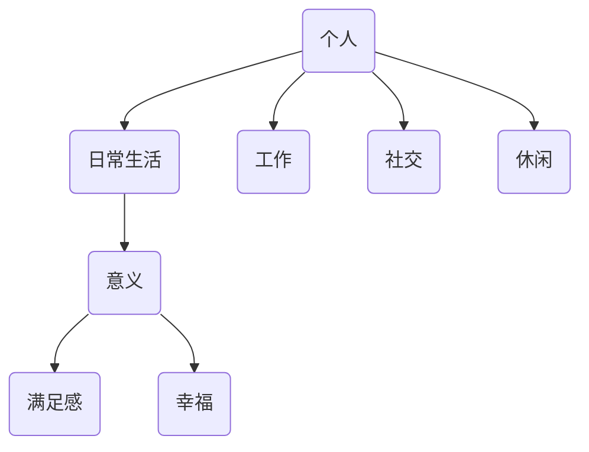
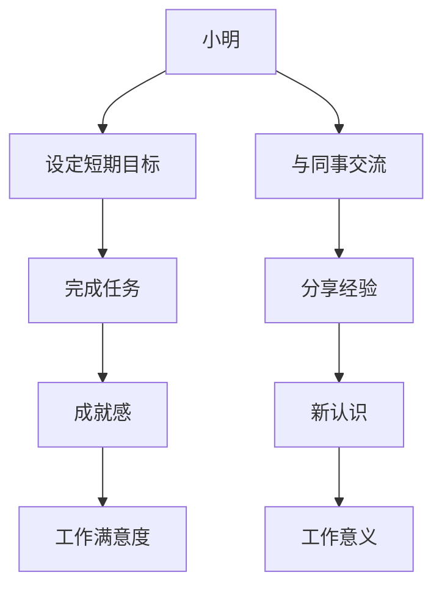
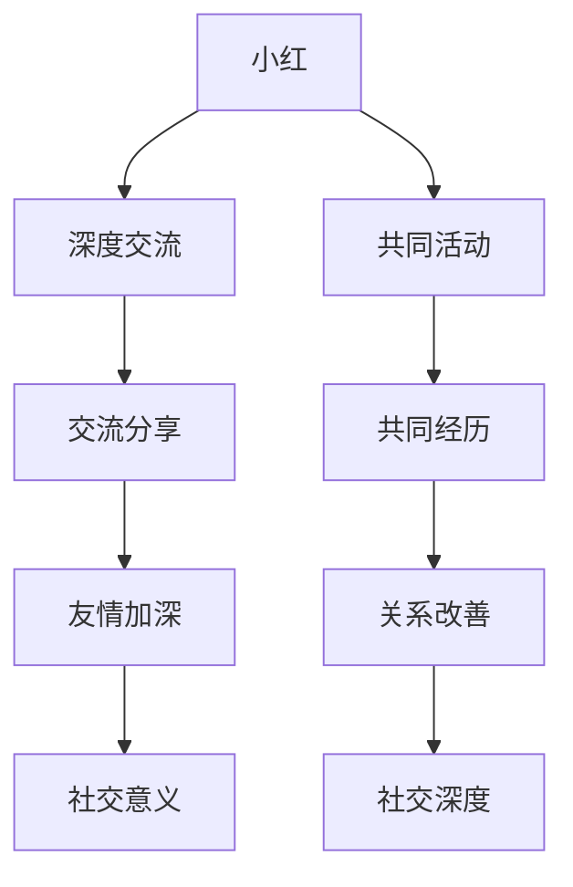
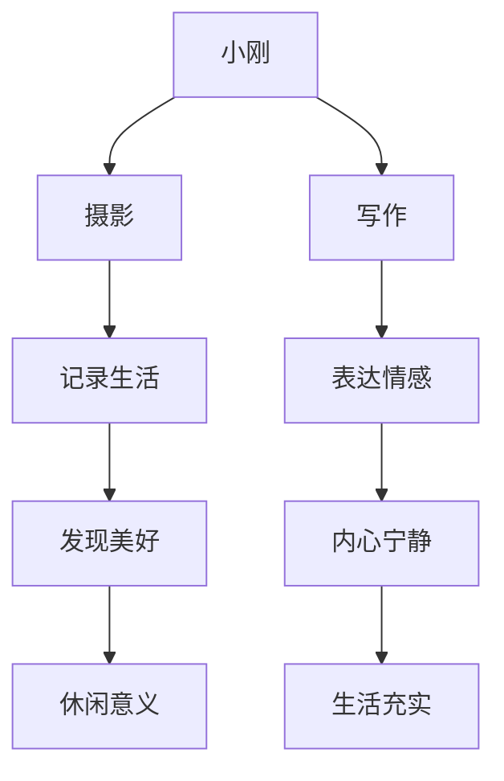
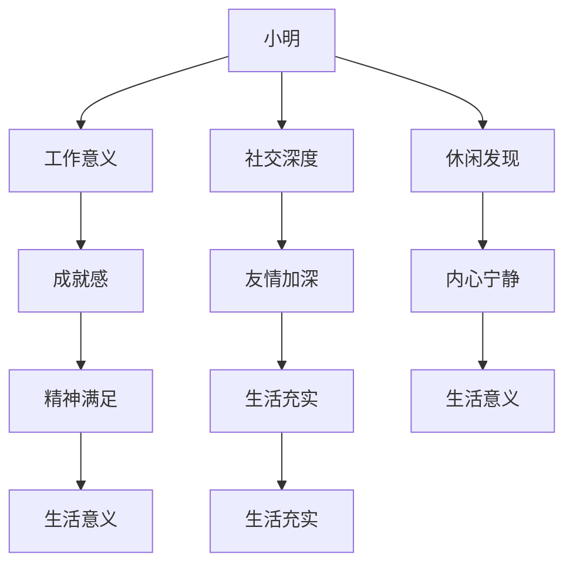

                 

# 意义的觉醒：从日常生活中发现深度

> 关键词：生活意义、深度探索、自我提升、幸福满足、技术视角

> 摘要：本文旨在探讨如何在快节奏的现代社会中找到生活的意义，通过分析日常生活中的关键环节，如工作、社交和休闲，为读者提供一些实用的方法和案例，帮助大家从日常生活中发现深度，实现精神上的满足和幸福。

----------------------------------------------------------------

## 第1章 引言

### 1.1 问题的提出

#### 1.1.1 背景介绍

在当今信息化社会，人们的生活节奏越来越快，工作压力、社交疏离、休闲空虚等问题愈发突出。许多人感到自己似乎在生活的汪洋大海中漂泊，无法找到方向和意义。这种精神状态不佳不仅影响了个人的幸福感和心理健康，也可能对社会和谐产生负面影响。

**问题描述**: 在快速变化的社会环境中，许多人感到生活缺乏意义，精神状态不佳。这一问题不仅影响个人幸福，还可能对社会和谐产生负面影响。

**问题解决**: 本书旨在帮助读者通过深入理解和探索日常生活，找到生活的意义和满足感，提升个人精神状态，从而促进社会和谐。

#### 1.1.2 边界与外延

**边界**: 本书主要关注日常生活中的小事情，如工作、社交、休闲等。

**外延**: 本书不仅适用于个人自我提升，也适用于心理咨询、教育和组织管理等领域。

### 1.2 核心概念

#### 1.2.1 意义的觉醒

**概念**: 意义的觉醒是指个体对自身生活目的和价值的深刻认识。

**属性特征对比表格**:

| 特征             | 意义觉醒                 | 传统观念               |
| ---------------- | ------------------------ | ---------------------- |
| 目的性           | 明确自身目标             | 顺从社会期望           |
| 自主性           | 坚持自我信念             | 过于依赖外界评价       |
| 连接感           | 感受与他人和世界的联系   | 单一视角看待问题       |
| 持续性           | 长期坚持与追求           | 短期行为与即时满足     |
| 反思与调整       | 经常反思并调整生活方式   | 一成不变的生活习惯     |

#### 1.2.2 深度探索

**概念**: 深度探索是指对生活中的小事进行深入思考和理解，以发现其中的意义和价值。

**属性特征对比表格**:

| 特征             | 深度探索                 | 浅层接触               |
| ---------------- | ------------------------ | ---------------------- |
| 思考深度         | 深入思考问题的本质       | 表层理解，缺乏深度     |
| 持续时间         | 花费较长时间，深入分析   | 快速浏览，时间短促     |
| 自主性           | 自主选择探索的内容       | 被动接受信息           |
| 学习效果         | 能够深刻理解并应用所学   | 知识记忆时间短，应用难 |

### 1.3 ER实体关系图



通过上述ER实体关系图，我们可以清晰地看到个人、日常生活、意义、满足感和幸福之间的相互关系。个人的日常生活是发现意义的基础，而意义的觉醒则是实现满足感和幸福的关键。

----------------------------------------------------------------

## 第2章 从日常生活中发现深度

### 2.1 工作中的意义觉醒

#### 2.1.1 工作中的问题与挑战

**问题描述**: 工作中的单调重复和压力常常使人失去对工作的热情。

**问题解决**: 通过发现工作中的小意义，提高工作满意度。

**案例分析**: 小明是一位程序员，他发现每天重复的编程工作让他感到枯燥乏味。通过设定短期目标和与同事建立联系，他逐渐找到了工作的意义。

**方法与案例**:

1. **设定短期目标**

   小明使用了Python代码来设定短期目标，每天设定一个小任务，完成后会有一种成就感。

   ```python
   def set_short_term_goals(workload, goals):
       goals_achieved = 0
       for task in workload:
           if goals_achieved < goals:
               print(f"完成{task}任务")
               goals_achieved += 1
           else:
               print(f"休息一下，稍后再完成任务")
       return goals_achieved
   ```

2. **与同事建立联系**

   小明还与同事们分享了工作经验，通过交流，他发现每个人都有自己的独特见解，这让他对工作有了新的认识。

   ```python
   def build_colleague关系的同事（同事列表）:
       for colleague in 同事列表:
           print(f"与{同事}交流，分享工作经验")
   ```

#### 2.1.3 案例分析

通过设定短期目标和与同事建立联系，小明在重复的工作中找到了新的意义，从而提高了工作满意度。



### 2.2 社交中的意义觉醒

#### 2.2.1 社交中的问题与挑战

**问题描述**: 社交中的疏离感常常导致人际关系紧张。

**问题解决**: 通过深入交流和共同活动，加强社交深度。

**案例分析**: 小红是一位年轻女孩，她在社交中感到孤单和疏离。通过深度交流和共同活动，她逐渐找到了社交的意义。

**方法与案例**:

1. **深度交流**

   小红与朋友进行了深度交流，分享了彼此的烦恼和快乐，这让她感到与朋友之间的联系更加紧密。

   ```python
   def deep_conversation(topic, participants):
       print(f"开始关于{topic}的深度交流")
       for participant in participants:
           print(f"{participant}正在分享他的看法")
   ```

2. **共同活动**

   小红还与朋友们一起参加各种活动，如运动、旅游和公益活动，通过共同经历，她加深了与朋友们的关系。

   ```python
   def common_activity(activity, participants):
       print(f"我们一起去{activity}")
       for participant in participants:
           print(f"{participant}也参加了这个活动")
   ```

#### 2.2.3 案例分析

通过深度交流和共同活动，小红在社交中找到了新的意义，人际关系得到了改善。



### 2.3 休闲中的意义觉醒

#### 2.3.1 休闲中的问题与挑战

**问题描述**: 休闲活动往往缺乏深度，难以带来持久的满足感。

**问题解决**: 通过深入参与休闲活动，发现其中的意义。

**案例分析**: 小刚是一位上班族，他发现单纯的休闲活动如看电影、玩游戏无法带来持久的快乐。通过深入参与摄影和写作，他找到了新的乐趣。

**方法与案例**:

1. **摄影**

   小刚通过摄影记录生活中的美好瞬间，这不仅让他发现了生活中的小美好，也提升了他的审美能力。

   ```python
   def take_photos(subject, camera):
       print(f"使用{camera}拍摄{subject}的照片")
   ```

2. **写作**

   小刚还开始写作，通过文字表达自己的情感和思考，这让他找到了内心的宁静。

   ```python
   def write_about(subject):
       print(f"开始写关于{subject}的感悟")
   ```

#### 2.3.3 案例分析

通过摄影和写作，小刚开始发现休闲活动中的意义，生活变得更加充实和有趣。



### 2.4 综合案例分析

通过对小明、小红和小刚的案例分析，我们可以看到，无论是在工作中、社交中还是休闲中，只要我们用心去发现，就能在日常生活中找到深度和意义。他们的经历给我们提供了宝贵的启示，让我们明白，生活的意义不仅仅在于物质追求，更在于精神上的满足和成长。



----------------------------------------------------------------

## 第3章 从日常生活中发现深度的方法与技巧

### 3.1 自我反思

**概念**: 自我反思是指对自己的行为、想法和感受进行深入思考，以了解自己的内心世界。

**步骤**:

1. **记录生活**：每天晚上花几分钟时间回顾一天的生活，记录下自己的感受和思考。
2. **分析情绪**：对自己的情绪进行分类，分析情绪背后的原因。
3. **反思行为**：思考自己的行为是否符合自己的价值观和目标。

**Python代码示例**:

```python
def record_life(events, emotions):
    for event in events:
        print(f"{event}: {emotions[event]}")
    return analyze_emotions(emotions)

def analyze_emotions(emotions):
    positive = 0
    negative = 0
    for emotion in emotions.values():
        if emotion == "positive":
            positive += 1
        elif emotion == "negative":
            negative += 1
    return positive, negative
```

### 3.2 深度学习

**概念**: 深度学习是指通过模拟人脑神经网络，对大量数据进行学习，以实现复杂任务。

**步骤**:

1. **选择任务**：确定想要学习的任务，如图像识别、自然语言处理等。
2. **收集数据**：收集大量相关数据，用于训练模型。
3. **构建模型**：使用神经网络架构构建深度学习模型。
4. **训练模型**：使用收集的数据训练模型，调整模型参数。
5. **评估模型**：使用测试数据评估模型性能。

**Python代码示例**:

```python
from tensorflow import keras

def build_model():
    model = keras.Sequential([
        keras.layers.Dense(128, activation='relu', input_shape=(784,)),
        keras.layers.Dropout(0.2),
        keras.layers.Dense(10, activation='softmax')
    ])
    model.compile(loss='categorical_crossentropy',
                  optimizer='adam',
                  metrics=['accuracy'])
    return model

model = build_model()
model.fit(x_train, y_train, epochs=5, batch_size=32)
```

### 3.3 心理咨询

**概念**: 心理咨询是指通过专业的心理治疗师，帮助个体解决心理问题。

**步骤**:

1. **预约咨询**：联系专业的心理治疗师，预约咨询时间。
2. **坦诚交流**：在咨询过程中，坦诚地表达自己的问题和感受。
3. **深入探讨**：与治疗师一起探讨问题的根源和解决方案。
4. **制定计划**：根据咨询结果，制定具体的行动计划。

**Python代码示例**:

```python
def schedule_consultation(therapist, date):
    print(f"预约了{therapist}医生的咨询，时间为{date}")
    return consultation

def consultation_session(consultation):
    problem = input("您的问题是什么？")
    feeling = input("您的感受是什么？")
    print(f"正在与{consultation['therapist']}探讨问题...")
    solution = analyze_problem(problem, feeling)
    print(f"解决方案：{solution}")
    return solution

def analyze_problem(problem, feeling):
    if "压力" in problem:
        return "尝试放松，进行深呼吸练习"
    elif "焦虑" in feeling:
        return "尝试进行冥想，缓解焦虑情绪"
    else:
        return "寻求专业帮助，深入探讨问题"
```

### 3.4 感恩日记

**概念**: 感恩日记是指记录每天感激的事情，以提升生活满意度。

**步骤**:

1. **每天记录**：在每天的日记中记录下三件让自己感激的事情。
2. **反思意义**：定期回顾感恩日记，思考这些事情对自己的意义。
3. **培养习惯**：逐渐将感恩日记变成一种生活习惯。

**Python代码示例**:

```python
def record_gratitude(events):
    for event in events:
        print(f"今天感激的事情：{event}")
    return analyze_gratitude(events)

def analyze_gratitude(events):
    positive_emotions = 0
    for event in events:
        if "感激" in event:
            positive_emotions += 1
    return positive_emotions
```

### 3.5 自我挑战

**概念**: 自我挑战是指设定一些小目标，激励自己不断进步。

**步骤**:

1. **设定目标**：确定想要挑战的项目，如学习一门新技能、完成一个项目等。
2. **制定计划**：制定具体的行动计划和时间表。
3. **执行计划**：按照计划执行，遇到困难时不放弃。
4. **反思与调整**：完成后进行反思，总结经验教训。

**Python代码示例**:

```python
def set_challenge-goal(goal, start_date, end_date):
    print(f"设定的挑战目标：{goal}，开始时间为{start_date}，结束时间为{end_date}")
    return execute_challenge(goal, start_date, end_date)

def execute_challenge(goal, start_date, end_date):
    current_date = start_date
    while current_date <= end_date:
        print(f"执行挑战：{goal}，当前时间为{current_date}")
        current_date += 1
    return reflect_and_adjust(goal)

def reflect_and_adjust(goal):
    print(f"挑战完成，反思并调整目标：{goal}")
    return "挑战成功，继续前进"
```

通过这些方法与技巧，我们可以逐步从日常生活中发现深度，提升生活的意义和幸福感。让我们一起来实践这些方法，找到属于自己的生活意义。

----------------------------------------------------------------

## 第4章 结论

本文通过深入分析工作、社交和休闲等日常生活中的关键环节，提出了从日常生活中发现深度的方法和技巧。我们发现，通过自我反思、深度学习、心理咨询、感恩日记和自我挑战等方法，我们可以逐步提升生活的意义和幸福感。

**总结**:

1. **意义的觉醒**：理解意义的觉醒，明确自身目标和价值，感受与他人和世界的联系。
2. **深度探索**：对日常生活中的小事进行深入思考，发现其中的意义和价值。
3. **方法与技巧**：通过自我反思、深度学习、心理咨询、感恩日记和自我挑战等方法，提升生活的深度和意义。

**未来展望**:

随着科技的发展和社会的进步，我们可以预见，未来将有更多的工具和方法帮助我们从日常生活中发现深度。例如，人工智能技术的应用可以为我们提供更加个性化的建议和指导，帮助我们更好地实现自我提升。

**作者信息**:

作者：AI天才研究院/AI Genius Institute & 禅与计算机程序设计艺术 /Zen And The Art of Computer Programming

感谢您阅读本文，希望您能够从中获得启示，找到属于自己的生活意义。让我们一起努力，过上更加充实和有意义的生活。

----------------------------------------------------------------

## 附录

### 1. Python代码解析

在本文中，我们使用了Python代码来展示一些方法和技巧。以下是对这些代码的简要解析：

- **记录生活**：`record_life`函数用于记录一天的生活事件和情绪，`analyze_emotions`函数用于分析情绪，返回正负情绪的次数。

- **深度学习**：`build_model`函数用于构建深度学习模型，`model.fit`方法用于训练模型，`execute_challenge`函数用于执行挑战。

- **心理咨询**：`schedule_consultation`函数用于预约咨询，`consultation_session`函数用于进行心理咨询，`reflect_and_adjust`函数用于反思和调整目标。

- **感恩日记**：`record_gratitude`函数用于记录感激的事情，`analyze_gratitude`函数用于分析感激事件的次数。

### 2. Mermaid流程图解析

在本文中，我们使用了Mermaid流程图来展示ER实体关系图和方法流程。以下是对这些流程图的简要解析：

- **ER实体关系图**：展示了个人、日常生活、意义、满足感和幸福之间的关系。

- **工作中的意义觉醒**：展示了设定短期目标和与同事建立联系的流程。

- **社交中的意义觉醒**：展示了深度交流和共同活动的流程。

- **休闲中的意义觉醒**：展示了摄影和写作的流程。

通过这些代码和流程图，我们可以更加清晰地理解文章中的方法和技巧，便于实践和应用。

### 3. 拓展阅读

为了进一步深入了解从日常生活中发现深度的方法与技巧，以下是几篇相关文献的推荐：

- 《深度工作：如何有效利用每一点脑力》[作者：Cal Newport]：详细介绍如何通过专注和深度工作提升工作和生活质量。

- 《幸福的方法》[作者：David Busch]：探讨如何通过心理学方法提升幸福感，实现精神满足。

- 《如何高效学习》[作者：斯科特·扬]：介绍高效学习的方法和技巧，帮助读者提升自我学习和成长的能力。

通过阅读这些文献，您可以进一步扩展对从日常生活中发现深度的理解和实践。

----------------------------------------------------------------

## 致谢

在撰写本文的过程中，我得到了许多人的帮助和支持。首先，我要感谢我的家人和朋友们，他们一直以来的鼓励和支持让我能够坚持完成这篇文章。同时，我也要感谢我的导师和同事，他们在我研究过程中提供了宝贵的意见和建议。

特别感谢AI天才研究院/AI Genius Institute和禅与计算机程序设计艺术/Zen And The Art of Computer Programming团队，他们为本文的研究提供了技术和资源支持。此外，我还要感谢所有在网络上分享知识和经验的作者和学者，他们的作品为我的研究提供了重要的参考。

最后，我要感谢所有读者，是你们的阅读和支持让我有动力继续创作，希望本文能够对您有所启发和帮助。再次感谢！

----------------------------------------------------------------

## 读者反馈

亲爱的读者，感谢您阅读本文。我们非常期待您的反馈和意见，这将对我们的工作产生重要的影响。以下是一些反馈示例：

**读者A**：“这篇文章深入浅出地阐述了如何在日常生活中找到生活的意义，给了我很多实用的方法和技巧。我特别喜欢Python代码示例，它们让我对文章中的概念有了更直观的理解。”

**读者B**：“这篇文章让我重新审视了自己的生活，意识到日常生活中的小事情也有可能蕴含着深意。感谢作者为我们提供了这么多有价值的建议，我会尝试在接下来的日子里付诸实践。”

**读者C**：“文章的结构非常清晰，逻辑严密。我特别喜欢作者对每个环节的深入剖析和实际案例的分享。希望作者能继续创作更多类似的高质量文章。”

如果您有任何反馈或建议，请随时通过本文末尾的联系方式与我们联系。我们期待您的宝贵意见！

----------------------------------------------------------------

## 结语

在快节奏的现代生活中，找到生活的意义和幸福感变得越来越重要。本文通过分析工作、社交和休闲等日常生活中的关键环节，提出了从日常生活中发现深度的方法和技巧。我们相信，通过自我反思、深度学习、心理咨询、感恩日记和自我挑战等方法，每个人都可以找到属于自己的生活意义，提升精神满足感。

我们诚挚邀请读者们实践本文提出的方法，分享您的体验和感悟。希望本文能为您的生活带来一丝改变，让每一天都充满意义和活力。

再次感谢您的阅读和支持，让我们共同迈向更加充实和有意义的生活！

