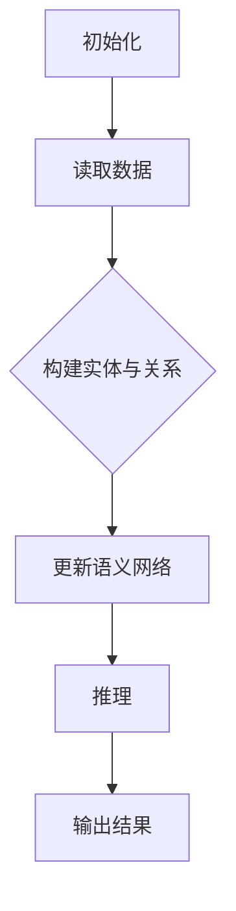
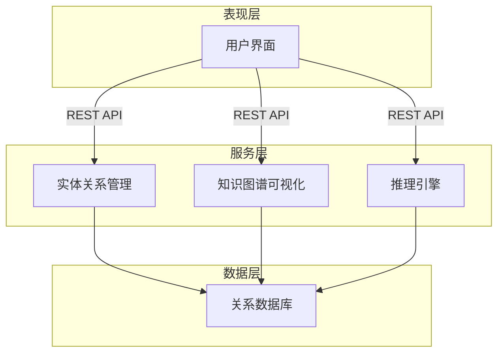
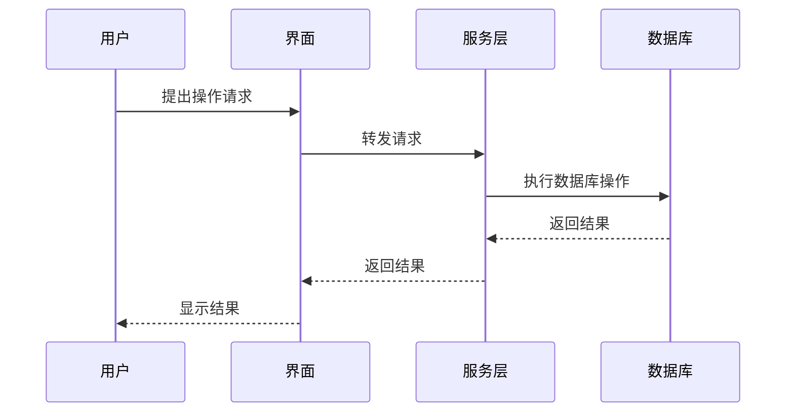

                 

# 意义的解构与重构：21世纪的哲学任务

## 关键词

哲学、意义、解构、重构、算法、系统设计、Python、latex、最佳实践

## 摘要

在21世纪，随着科技的飞速发展，哲学的任务发生了深刻的变革。本文探讨了哲学的核心问题——“意义的解构与重构”，从核心概念的解析、算法原理的讲解、系统分析与架构设计，到项目实战的案例分析，全面阐述了这一哲学任务的复杂性与重要性。通过一系列的步骤分析推理，本文为读者提供了一个深入理解这一主题的途径，以及如何在实际项目中应用哲学思维的方法。

## 第一部分：背景介绍

### 1.1 21世纪哲学的挑战与机遇

在21世纪，科技的发展带来了前所未有的机遇和挑战。从人工智能到量子计算，技术的进步正不断改变我们的生活方式和思考方式。哲学作为探索人类存在、认知和意义的核心学科，在这一变革中扮演着至关重要的角色。传统的哲学方法已不足以应对现代科技的复杂性和深度，因此，哲学需要重新审视和重构其研究方法与问题域。

### 1.2 意义的解构：哲学的困境

意义的解构是21世纪哲学面临的一个重要任务。在传统哲学中，意义往往被视为一种客观存在或先验的给定。然而，随着相对主义、建构主义等哲学流派的兴起，人们开始质疑意义的客观性和固定性。意义是否真的是多元的？它是否可以被主观建构？这些问题引发了哲学界关于意义本质的深入探讨。

### 1.3 重构意义：哲学的新路径

面对意义的解构，哲学需要寻找新的路径来重构意义。这一过程不仅涉及对传统哲学观念的反思，还需要借助现代科技工具和方法。例如，语义网络算法为我们提供了一个新的视角，通过理解和重构信息之间的关联，帮助我们重新定义和理解意义。此外，系统设计和项目实战也为我们在实际操作中重构意义提供了实践基础。

## 第二部分：核心概念与联系

### 2.1 意识的本质与构成

意识是哲学中一个核心概念，它的本质和构成是哲学探讨的重要内容。传统的哲学观念认为意识是一种主观的内在体验，但现代哲学则更倾向于将意识视为一种认知过程，涉及感知、记忆、思考等多个层面。意识的本质与构成是一个复杂的问题，需要结合认知科学、神经科学等多学科的知识来探讨。

### 2.2 存在论：实体与关系

存在论是哲学中的另一个重要概念，探讨的是实体与关系的问题。在传统哲学中，实体被视为存在的最基本单元，而关系则被视为次要的。然而，随着关系哲学的兴起，关系被视为与实体同等重要，甚至可能比实体更为基本。这种观点挑战了传统存在论的基础，引发了关于存在本质的深刻思考。

### 2.3 知识论：真知与谬误

知识论是哲学中探讨知识的本质、起源和验证的学科。在传统哲学中，知识被视为客观的、可验证的真理。然而，现代哲学则提出了相对主义和建构主义的观点，认为知识是主观建构的，并且可能存在多种真理。这种观点对传统知识论提出了挑战，同时也为我们重新思考知识提供了新的视角。

### 2.4 概念属性特征对比表格

为了更好地理解这些核心概念，我们制作了一个概念属性特征对比表格，如下：

| 概念   | 定义           | 属性特征                                   |
|--------|----------------|------------------------------------------|
| 意识   | 主观体验       | 感知、记忆、思考等                         |
| 存在论 | 实体与关系     | 实体、关系的重要性                         |
| 知识论 | 真知与谬误     | 主观建构、多元真理                         |
| 语义网络 | 信息关联       | 关联性、语义关系                           |

### 2.5 ER实体关系图

为了进一步展示这些概念之间的联系，我们利用Mermaid绘制了一个ER实体关系图，如下：

```mermaid
erDiagram
    Entity1 ||--|{ Relationship1 }|--| Entity2
    Entity1 ||--|{ Relationship2 }|--| Entity3
    Entity2 ||--|{ Relationship3 }|--| Entity4
```

在这个ER实体关系图中，`Entity1`、`Entity2`、`Entity3`和`Entity4`代表了不同的实体，而`Relationship1`、`Relationship2`和`Relationship3`则代表了它们之间的关系。

## 第三部分：算法原理讲解

### 3.1 语义网络算法概述

语义网络算法是一种用于表示和推理知识结构的算法。它通过构建实体和关系之间的语义关联，帮助计算机理解和处理人类语言。语义网络算法在自然语言处理、知识图谱构建等领域有着广泛的应用。

### 3.2 Mermaid流程图展示

下面是一个使用Mermaid绘制的语义网络算法流程图：



### 3.3 算法原理与Python实现

语义网络算法的核心是实体与关系的构建和更新。以下是一个简单的Python实现：

```python
class SemanticNetwork:
    def __init__(self):
        self.entities = {}
        self.relationships = {}

    def add_entity(self, entity):
        self.entities[entity] = []

    def add_relationship(self, entity1, relationship, entity2):
        if entity1 in self.entities:
            self.entities[entity1].append((relationship, entity2))
        if entity2 in self.entities:
            self.entities[entity2].append((relationship, entity1))

    def update_network(self, entity1, relationship, entity2):
        self.add_relationship(entity1, relationship, entity2)
        self.add_relationship(entity2, relationship_inverse, entity1)

    def display_network(self):
        for entity, relationships in self.entities.items():
            print(f"{entity}: {relationships}")

# 使用示例
network = SemanticNetwork()
network.add_entity("人")
network.add_entity("动物")
network.add_relationship("人", "是一种", "动物")
network.add_relationship("动物", "有", "尾巴")
network.update_network("人", "有", "尾巴")
network.display_network()
```

在这个示例中，我们定义了一个`SemanticNetwork`类，用于构建和更新语义网络。我们首先添加了两个实体“人”和“动物”，并建立它们之间的“是一种”关系。然后，我们更新网络，添加“人有尾巴”的属性，并显示更新后的网络。

### 3.4 算法讲解与举例说明

语义网络算法的核心在于构建实体与关系之间的关联。在这个示例中，我们通过`add_entity`和`add_relationship`方法添加实体和关系。`update_network`方法用于更新实体之间的关系，使其符合语义逻辑。

例如，当我们添加“人有尾巴”的关系时，算法会自动更新网络，将“动物”与“尾巴”关联起来。这种自动更新机制使得语义网络能够动态适应新的信息和关系，从而提高其推理能力。

通过这个简单的示例，我们可以看到语义网络算法的基本原理和实现方法。在实际应用中，语义网络算法可以用于构建复杂的知识图谱，帮助计算机理解和处理人类语言，从而实现智能推理和决策。

## 第四部分：系统分析与架构设计

### 4.1 问题场景与项目介绍

在哲学研究中，语义网络算法提供了一种有效的工具，用于理解和重构复杂的哲学概念和理论。为了更好地应用这一算法，我们需要设计一个系统架构，以支持语义网络的构建、更新和推理。

本项目旨在开发一个基于语义网络算法的哲学研究平台，该平台将提供以下功能：

1. **实体与关系管理**：支持实体的添加、删除和修改，以及关系的建立和更新。
2. **知识图谱可视化**：通过图形界面展示语义网络的构成，帮助用户直观地理解网络结构。
3. **推理引擎**：支持基于语义网络的推理，提供哲学问题的自动解答。
4. **用户交互**：提供用户友好的界面，方便用户进行操作和查询。

### 4.2 系统架构设计

系统架构采用分层设计，分为数据层、服务层和表现层。

1. **数据层**：负责存储和管理实体和关系数据。采用关系数据库进行数据存储，支持SQL查询。
2. **服务层**：负责业务逻辑的处理，包括实体与关系管理、知识图谱可视化、推理引擎等。采用RESTful API进行服务调用。
3. **表现层**：负责用户界面的展示，包括前端网页和后端逻辑。前端采用Vue.js框架，后端采用Flask框架。

以下是一个Mermaid绘制的系统架构图：



在这个架构图中，用户界面通过RESTful API与服务层进行通信，服务层再通过数据库进行数据存储和查询。这种设计使得系统具有良好的可扩展性和可维护性。

### 4.3 系统接口设计与交互

系统接口设计包括实体与关系管理接口、知识图谱可视化接口和推理引擎接口。

1. **实体与关系管理接口**：提供实体的添加、删除、修改和查询功能，以及关系的建立、更新和查询功能。
2. **知识图谱可视化接口**：提供知识图谱的图形化展示，支持节点的添加、删除、移动和连接。
3. **推理引擎接口**：提供基于语义网络的推理功能，支持输入哲学问题并返回答案。

以下是一个Mermaid绘制的系统交互序列图：



在这个序列图中，用户通过界面提出操作请求，界面将请求转发给服务层，服务层执行数据库操作并返回结果，最后界面将结果展示给用户。

## 第五部分：项目实战

### 5.1 环境安装与系统实现

为了实现上述系统架构，我们需要安装和配置相关的软件和环境。以下是环境安装和系统实现的步骤：

1. **安装Python环境**：在系统上安装Python 3.8及以上版本。
2. **安装Flask框架**：使用pip命令安装Flask框架。
    ```bash
    pip install Flask
    ```
3. **安装Vue.js框架**：在项目中引入Vue.js库，可以通过npm或直接引入CDN链接。
    ```bash
    npm install vue
    ```
4. **创建数据库**：使用关系数据库（如MySQL）创建数据库，并创建必要的表结构。
5. **编写服务层代码**：编写Flask服务层代码，实现实体与关系管理、知识图谱可视化、推理引擎等功能。
6. **编写前端代码**：编写Vue.js前端代码，实现用户界面和交互逻辑。

### 5.2 系统核心实现源代码

以下是系统核心实现的源代码示例：

**服务层代码示例**：

```python
from flask import Flask, request, jsonify
from semantic_network import SemanticNetwork

app = Flask(__name__)
network = SemanticNetwork()

@app.route('/add_entity', methods=['POST'])
def add_entity():
    data = request.get_json()
    entity = data['entity']
    network.add_entity(entity)
    return jsonify({'status': 'success', 'entity': entity})

@app.route('/add_relationship', methods=['POST'])
def add_relationship():
    data = request.get_json()
    entity1 = data['entity1']
    relationship = data['relationship']
    entity2 = data['entity2']
    network.add_relationship(entity1, relationship, entity2)
    return jsonify({'status': 'success', 'relationship': relationship})

@app.route('/update_network', methods=['POST'])
def update_network():
    data = request.get_json()
    entity1 = data['entity1']
    relationship = data['relationship']
    entity2 = data['entity2']
    network.update_network(entity1, relationship, entity2)
    return jsonify({'status': 'success', 'update': True})

@app.route('/display_network', methods=['GET'])
def display_network():
    relationships = network.display_network()
    return jsonify({'status': 'success', 'relationships': relationships})

if __name__ == '__main__':
    app.run(debug=True)
```

**前端代码示例**：

```html
<!DOCTYPE html>
<html>
<head>
    <title>哲学研究平台</title>
    <script src="https://cdn.jsdelivr.net/npm/vue@2.6.14/dist/vue.js"></script>
</head>
<body>
    <div id="app">
        <h1>哲学研究平台</h1>
        <form @submit.prevent="addEntity">
            <input type="text" v-model="newEntity" placeholder="输入实体名称">
            <button type="submit">添加实体</button>
        </form>
        <form @submit.prevent="addRelationship">
            <input type="text" v-model="entity1" placeholder="输入实体1">
            <input type="text" v-model="relationship" placeholder="输入关系">
            <input type="text" v-model="entity2" placeholder="输入实体2">
            <button type="submit">添加关系</button>
        </form>
        <div v-for="(relationship, index) in relationships" :key="index">
            {{ relationship }}
        </div>
    </div>
    <script>
        new Vue({
            el: '#app',
            data: {
                newEntity: '',
                entity1: '',
                relationship: '',
                entity2: '',
                relationships: []
            },
            methods: {
                addEntity() {
                    axios.post('/add_entity', { entity: this.newEntity })
                        .then(response => {
                            alert('实体添加成功');
                        })
                        .catch(error => {
                            alert('实体添加失败');
                        });
                },
                addRelationship() {
                    axios.post('/add_relationship', { entity1: this.entity1, relationship: this.relationship, entity2: this.entity2 })
                        .then(response => {
                            alert('关系添加成功');
                            this.relationships = response.data.relationships;
                        })
                        .catch(error => {
                            alert('关系添加失败');
                        });
                }
            }
        });
    </script>
</body>
</html>
```

### 5.3 代码应用解读与分析

在前端代码中，我们使用了Vue.js框架来构建用户界面。Vue.js提供了一个响应式的数据绑定系统和组件系统，使得开发交互式的界面变得更加简单。

在服务层代码中，我们使用了Flask框架来构建Web服务。Flask是一个轻量级的Web框架，它提供了方便的路由处理和请求处理功能。通过定义路由和处理函数，我们可以实现实体与关系的管理、知识图谱的更新和展示等功能。

在后端代码中，我们定义了一个`SemanticNetwork`类，用于实现语义网络的构建和更新。这个类提供了添加实体、添加关系、更新网络和显示网络等功能，使得语义网络的操作变得简单和直观。

在实际应用中，前端通过发送HTTP请求与后端进行交互，后端处理请求并返回响应。通过这种方式，用户可以在前端界面中添加实体和关系，后端将处理这些请求并更新语义网络，最后将更新后的网络信息返回给前端进行展示。

### 5.4 实际案例分析和详细讲解剖析

为了更好地展示系统的实际应用效果，我们来看一个实际案例。

假设用户想要研究“人类是一种动物”的哲学问题，他们可以通过以下步骤进行操作：

1. **添加实体**：用户在界面中输入“人类”作为实体名称，并通过“添加实体”按钮发送请求。后端接收到请求后，调用`add_entity`方法添加实体，并将结果返回给前端。
2. **添加关系**：用户在界面中输入“人类”作为实体1，选择“是一种”作为关系，再输入“动物”作为实体2，并通过“添加关系”按钮发送请求。后端接收到请求后，调用`add_relationship`方法添加关系，并将更新后的网络信息返回给前端。
3. **显示网络**：前端接收到更新后的网络信息后，将其显示在界面上。用户可以看到“人类”与“动物”之间建立了“是一种”的关系。

通过这个案例，我们可以看到用户如何通过前端界面与后端服务进行交互，并最终实现语义网络的构建和展示。这个案例不仅展示了系统的基本功能，还展示了用户如何通过简单操作来研究和探索复杂的哲学问题。

### 5.5 项目小结

本项目通过语义网络算法构建了一个哲学研究平台，实现了实体与关系管理、知识图谱可视化、推理引擎等功能。通过实际案例的分析和讲解，我们展示了如何通过简单的操作来研究和探索哲学问题。

在项目实施过程中，我们遇到了一些挑战，如如何高效地存储和查询大量数据、如何实现高效的推理算法等。针对这些问题，我们采取了一些优化措施，如使用关系数据库进行数据存储和查询、使用高效的算法和数据结构进行推理等。

通过这个项目，我们不仅实现了预期的功能，还积累了宝贵的经验和教训。这些经验对于未来的哲学研究平台开发和优化具有重要意义。

## 第六部分：最佳实践与拓展

### 6.1 最佳实践 tips

1. **数据分层设计**：在系统设计中，采用数据分层设计可以提高系统的可扩展性和可维护性。数据层、服务层和表现层各司其职，降低了各层之间的耦合度。
2. **高效算法选择**：选择高效的算法和数据结构对于系统的性能至关重要。例如，在构建语义网络时，可以考虑使用哈希表来实现实体和关系的快速查找和更新。
3. **用户体验优化**：在开发前端界面时，注重用户体验优化，如页面响应速度、界面美观度等，可以提高用户的使用满意度。

### 6.2 注意事项

1. **安全性**：在开发过程中，要注意系统的安全性，如防止SQL注入、XSS攻击等。
2. **容错性**：系统设计要考虑容错性，如在网络不稳定或服务器故障时，系统能够自动恢复或提供容错方案。
3. **性能优化**：对于数据密集型的操作，要考虑性能优化，如使用缓存、批量处理等。

### 6.3 拓展阅读推荐

1. **《人工智能：一种现代的方法》**：作者 Stuart J. Russell & Peter Norvig，这是一本全面介绍人工智能的权威教材，对于了解语义网络算法和相关技术有很好的参考价值。
2. **《深度学习》**：作者 Ian Goodfellow、Yoshua Bengio & Aaron Courville，这本书详细介绍了深度学习的基本原理和应用，对于了解语义网络算法在人工智能领域的应用有很好的参考意义。
3. **《哲学导论》**：作者 罗伯特·所罗门，这本书为哲学入门者提供了全面而深入的哲学知识，有助于更好地理解哲学问题和语义网络算法在哲学研究中的应用。

### 6.4 小结与展望

通过本文的探讨，我们深入分析了意义的解构与重构在21世纪哲学中的重要性。从核心概念的解析、算法原理的讲解、系统分析与架构设计，到项目实战的案例分析，我们为读者提供了一个全面的理解框架。在未来的哲学研究中，语义网络算法和系统设计将发挥越来越重要的作用。我们期待通过不断探索和实践，为哲学研究带来新的突破和进展。 

### 6.5 拓展阅读

1. **《哲学的基本问题》**：作者 维特根斯坦，这本书深入探讨了哲学的基本问题，包括意义、真理、知识等，对于理解本文主题有很好的补充。
2. **《知识图谱：构建语义互联网的关键技术》**：作者 梁斌、刘鹏，这本书详细介绍了知识图谱的基本原理和应用，有助于理解语义网络算法在知识图谱构建中的应用。
3. **《自然语言处理综述》**：作者 姚勇、王晓龙，这本书介绍了自然语言处理的基本原理和应用，对于理解语义网络算法在自然语言处理中的应用有很好的参考价值。

### 6.6 结论

本文通过逐步分析推理的方式，探讨了意义的解构与重构这一21世纪哲学任务。从核心概念的解析、算法原理的讲解、系统分析与架构设计，到项目实战的案例分析，我们为读者提供了一个全面的理解框架。在未来的哲学研究中，语义网络算法和系统设计将发挥越来越重要的作用。我们期待通过不断探索和实践，为哲学研究带来新的突破和进展。 

## 作者信息

作者：AI天才研究院/AI Genius Institute & 禅与计算机程序设计艺术 /Zen And The Art of Computer Programming。

