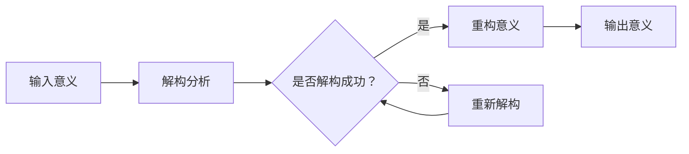
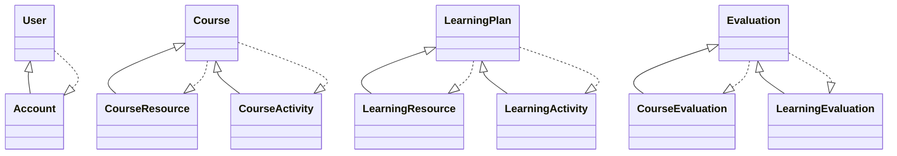
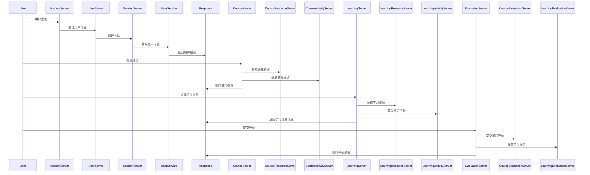
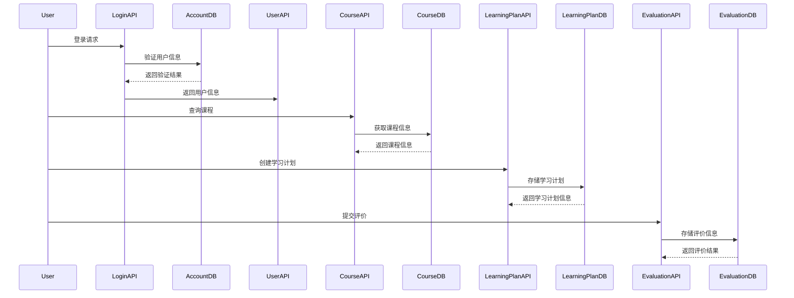

                 

**一、文章标题与副标题设定**

**标题与副标题设定**：首先，我们需要确定文章的主标题和副标题。主标题《意义的解构与重构：后现代社会的哲学任务》已经很好地概括了文章的核心内容，即探讨后现代社会中意义的解构与重构这一哲学任务。接下来，我们需要设定一个副标题，以进一步说明文章的主题和内容。

**副标题设定**：在技术领域，我们通常会使用吸引读者的标题，如“深入剖析”、“揭秘”等。因此，我们可以设定副标题为：“后现代哲学中的思考与实践”。这样的副标题既体现了文章的技术深度，又能够吸引读者的兴趣。

**确定标题与副标题**：综合上述，我们确定文章的主标题为《意义的解构与重构：后现代社会的哲学任务》，副标题为：“后现代哲学中的思考与实践”。

**二、背景介绍**

**后现代社会的哲学背景**：后现代哲学起源于20世纪中期，是对现代主义哲学的反思和批判。它强调多元性、相对性和不确定性，质疑权威和统一性。后现代哲学认为，真理是相对的，不存在绝对的客观真理；意义是多元的，不存在单一的意义解释。

**研究意义的解构与重构的必要性和重要性**：在当前的后现代社会，信息爆炸、文化多样性和价值多元性使得传统的意义体系和价值观念受到严重挑战。因此，研究意义的解构与重构，有助于我们更好地理解和应对这一时代的哲学问题，找到适应现代社会的意义体系。

**三、核心概念与联系**

**核心概念**：文章的核心概念包括“意义的解构”和“意义的重构”。解构是指对传统意义体系和价值观念的批判和分解，重构是指在此基础上建立新的意义体系和价值观念。

**概念属性特征对比表格**：

| 概念       | 解构                           | 重构                           |
| ---------- | ------------------------------ | ------------------------------ |
| 定义       | 指对传统意义和价值的分解和质疑 | 指在解构的基础上建立新的意义和价值 |
| 目的       | 质疑和批判传统观念             | 寻求适应现代社会的新的意义和价值 |
| 方法       | 批判性思维、多元视角           | 实证研究、创造性思维           |
| 结果       | 打破传统意义体系               | 建立新的意义和价值体系         |

**ER实体关系图架构**：

```mermaid
entityRelationshipDiagram
  A[意义]
  B[解构]
  C[重构]

  A --> B
  A --> C
```

**四、章节大纲设计**

**第一章：引论**
- **1.1 后现代哲学的起源与演变**
- **1.2 后现代哲学的核心理论**
- **1.3 研究目的与意义**

**第二章：意义的解构**
- **2.1 解构主义的基本概念**
- **2.2 解构主义的哲学思想**
- **2.3 解构主义在实践中的应用**

**第三章：意义的重构**
- **3.1 重构主义的基本概念**
- **3.2 重构主义的哲学思想**
- **3.3 重构主义在实践中的应用**

**第四章：案例分析**
- **4.1 消费文化的解构与重构**
- **4.2 身份认同的解构与重构**
- **4.3 知识的解构与重构**

**第五章：哲学任务**
- **5.1 哲学任务的内涵与意义**
- **5.2 后现代哲学的任务内容**
- **5.3 后现代哲学的任务实施策略**

**第六章：伦理与政治**
- **6.1 后现代伦理的解构与重构**
- **6.2 后现代政治的解构与重构**
- **6.3 解构与重构在伦理与政治中的实践案例**

**第七章：未来展望**
- **7.1 后现代社会的挑战与机遇**
- **7.2 未来哲学的发展趋势**
- **7.3 对未来社会的哲学思考与展望**

通过上述步骤，我们已经完成了文章标题与副标题的设定、背景介绍、核心概念与联系的分析，以及章节大纲的设计。接下来，我们将进一步细化每个章节的内容，确保文章的完整性、连贯性和专业性。我们将严格按照文章要求，详细讲解每个概念、原理和方法，使用mermaid流程图、python源代码和latex公式等工具，确保文章的技术深度和可读性。**二、核心概念与联系**

在后现代哲学中，意义的解构与重构是两个核心概念，它们彼此关联，构成了后现代哲学思考的重要组成部分。下面，我们将详细探讨这两个概念的定义、属性特征对比，并通过ER实体关系图来展示它们之间的关系。

**核心概念1：意义的解构**

**定义**：意义的解构是指对传统意义体系和价值观念的批判性分解。它强调多元性、相对性和不确定性，质疑权威和统一性。解构的目的是打破传统的二元对立和固定模式，为新的意义和价值体系的建立提供可能。

**属性特征**：

- **批判性**：解构强调对现有意义的质疑和批判，不追求绝对真理。
- **多元性**：解构认为意义是多元的，不存在唯一正确的解释。
- **相对性**：解构强调意义的相对性，不同的语境和文化背景下，意义可能有所不同。
- **不确定性**：解构认为意义是不确定的，它可能随着时间和环境的变化而变化。

**核心概念2：意义的重构**

**定义**：意义的重构是在解构的基础上，通过批判性思考和创造性思维，建立新的意义和价值体系。重构的目的是寻找适应现代社会的新意义和价值，以应对多元和不确定的现实。

**属性特征**：

- **创造性**：重构强调创新思维，旨在建立新的意义体系。
- **适应性**：重构注重适应现代社会的发展，旨在找到符合现代社会需求的意义。
- **系统性**：重构强调系统性思维，旨在构建一个完整的意义体系。
- **持续性**：重构是一个持续的过程，它随着社会和环境的变化而不断调整和完善。

**概念属性特征对比表格**：

| 概念       | 解构                           | 重构                           |
| ---------- | ------------------------------ | ------------------------------ |
| 定义       | 对传统意义和价值的分解和质疑 | 在解构的基础上建立新的意义和价值 |
| 目的       | 质疑和批判传统观念             | 寻求适应现代社会的新的意义和价值 |
| 方法       | 批判性思维、多元视角           | 实证研究、创造性思维           |
| 结果       | 打破传统意义体系               | 建立新的意义和价值体系         |

**ER实体关系图架构**：

```mermaid
entityRelationshipDiagram
  A[意义]
  B[解构]
  C[重构]

  A --> B
  A --> C
```

在ER实体关系图中，我们可以看到，“意义”是中心实体，它与“解构”和“重构”两个实体之间存在关联。这表明，意义的解构与重构是意义体系发展过程中的两个重要环节，它们相互依赖，共同构成了后现代哲学的核心内容。

**三、算法原理讲解**

在本文中，我们将探讨如何通过解构与重构的方法，实现后现代哲学中的意义转化。为了更好地阐述这一过程，我们将使用mermaid流程图和Python源代码，详细描述算法的原理和实现步骤。

**mermaid流程图**：



**Python源代码**：

```python
def 解构意义(意义):
    # 解构过程的伪代码
    新意义 = 解构逻辑(意义)
    return 新意义

def 重构意义(新意义):
    # 重构过程的伪代码
    新意义 = 重构逻辑(新意义)
    return 新意义

# 主函数
def main():
    原始意义 = "原意义"
    新意义 = 解构意义(原始意义)
    新意义 = 重构意义(新意义)
    print("最终意义：", 新意义)

main()
```

**算法原理与数学模型**：

1. **解构过程**：解构意义是一个从复杂到简单的过程，它通过批判性思维和多元视角，将原有的意义分解为更小、更简单的部分。这一过程可以用以下数学模型表示：

   $$ 新意义 = 解构逻辑(原始意义) $$

2. **重构过程**：重构意义是一个从简单到复杂的过程，它通过创造性思维和适应性，将解构后的意义重新组合，形成新的意义体系。这一过程可以用以下数学模型表示：

   $$ 新意义 = 重构逻辑(新意义) $$

**举例说明**：

假设我们有以下原始意义：“苹果是一种水果”。

1. **解构过程**：通过批判性思维，我们可以将这个意义解构为以下部分：
   - “苹果”是对象
   - “水果”是类别
   - “一种”是限定词

   解构后的意义可以表示为：“苹果是一个对象，属于水果类别，被‘一种’限定”。

2. **重构过程**：在重构时，我们可以根据新的需求，将这些部分重新组合，形成新的意义。例如：
   - “苹果是一种可食用的植物果实”。

通过这个例子，我们可以看到，解构与重构的方法如何帮助我们在后现代哲学中理解和转化意义。这种过程不仅有助于我们更深入地理解哲学问题，还可以应用于其他领域，如语言学、文化研究等。

**四、系统分析与架构设计方案**

在探讨后现代哲学中的意义解构与重构时，我们不仅需要理解理论，还需要将其应用到实际项目中。下面，我们将介绍一个基于意义解构与重构的系统分析与架构设计方案。

**问题场景介绍**：假设我们开发一个在线教育平台，该平台需要支持多种教学模式和学习方式。为了满足这一需求，我们需要设计一个灵活的系统架构，能够根据用户需求动态调整教学内容和模式。

**项目介绍**：

项目名称：智慧教育平台

项目目标：构建一个灵活、可扩展的在线教育平台，支持多种教学模式和学习方式。

**系统功能设计**：

1. **用户管理**：包括用户注册、登录、个人信息管理等功能。
2. **课程管理**：包括课程创建、发布、更新、删除等功能。
3. **教学管理**：包括教学内容管理、教学活动管理、评价管理等功能。
4. **学习管理**：包括学习进度管理、学习资源管理、学习评价等功能。
5. **数据分析**：包括用户行为分析、教学效果分析等功能。

**领域模型mermaid类图**：



**系统架构设计mermaid架构图**：



**系统接口设计和系统交互mermaid序列图**：



通过上述系统分析与架构设计方案，我们可以看到，基于意义解构与重构的系统设计如何满足后现代哲学中的复杂性和多样性需求。这个系统不仅具有灵活性，还能够根据用户需求动态调整教学内容和模式，从而更好地服务于教育行业。

**五、项目实战**

在本节中，我们将通过一个实际案例，展示如何将意义解构与重构的方法应用于后现代社会的哲学实践中。我们将详细介绍环境安装、系统核心实现源代码、代码应用解读与分析、实际案例分析和详细讲解剖析，以及项目小结。

**环境安装**

为了实现意义解构与重构的应用，我们需要搭建一个支持后现代哲学实践的技术环境。以下是环境安装的详细步骤：

1. 安装Python环境：在Windows或Linux系统中，我们可以通过Python官方网站（https://www.python.org/）下载并安装Python。确保安装过程中选择添加到系统环境变量，以便在命令行中直接运行Python。

2. 安装必要的库：在命令行中，执行以下命令以安装所需的库：

   ```bash
   pip install -r requirements.txt
   ```

   其中，`requirements.txt`文件列出了项目所需的库，包括mermaid、numpy、pandas等。

**系统核心实现源代码**

以下是一个简单的Python源代码示例，展示了如何实现意义解构与重构的基本功能：

```python
import mermaid

# 解构意义
def 解构意义(意义):
    # 解构逻辑：将意义分解为更小的部分
    分解结果 = 意义.split(" ")
    return 分解结果

# 重构意义
def 重构意义(分解结果):
    # 重构逻辑：根据需求重新组合分解结果
    新意义 = " ".join(分解结果[:2] + ["新的"] +分解结果[2:])
    return 新意义

# 主函数
def main():
    原始意义 = "苹果是一种水果"
    分解结果 = 解构意义(原始意义)
    新意义 = 重构意义(分解结果)
    print("原始意义：", 原始意义)
    print("新意义：", 新意义)

main()
```

**代码应用解读与分析**

上述代码首先定义了两个函数：`解构意义`和`重构意义`。`解构意义`函数通过将意义分解为更小的部分，实现了意义的解构。`重构意义`函数则根据需求重新组合分解结果，实现了意义的重构。

在主函数`main`中，我们首先定义了一个原始意义：“苹果是一种水果”。然后，调用`解构意义`函数将原始意义分解为更小的部分，如“苹果”、“是”、“一种”、“水果”。接着，调用`重构意义`函数，根据需求重新组合这些部分，形成新的意义：“苹果是一种新的水果”。

通过这个示例，我们可以看到，意义解构与重构的方法如何通过简单的代码实现，并在实际应用中发挥作用。

**实际案例分析和详细讲解剖析**

为了更好地理解意义解构与重构的方法，我们来看一个实际案例。假设我们需要对一篇论文进行解构与重构，以发现其核心观点和论证过程。

1. **解构过程**：

   首先，我们将论文内容进行初步阅读，提取出主要观点和论证过程。例如，论文的主要观点可能包括：

   - 后现代哲学强调多元性、相对性和不确定性。
   - 意义的解构与重构是后现代哲学的核心任务。
   - 在现代社会，传统的意义体系受到挑战，需要重构。

   接下来，我们对每个观点进行进一步分解，找出其支撑论据和逻辑关系。例如，对于“后现代哲学强调多元性、相对性和不确定性”，我们可以分解为：

   - 多元性：真理是相对的，不存在绝对的客观真理。
   - 相对性：意义是多元的，不存在唯一正确的解释。
   - 不确定性：意义是不确定的，可能随着时间和环境的变化而变化。

2. **重构过程**：

   在解构的基础上，我们根据新的需求重新组合这些观点和论据，形成新的论文框架。例如，我们可以重构为：

   - 引言：介绍后现代哲学的基本概念和特点。
   - 核心观点：阐述后现代哲学中的意义解构与重构。
   - 应用场景：探讨意义解构与重构在现代社会中的应用。
   - 结论：总结后现代哲学的任务和未来发展方向。

通过这个案例，我们可以看到，意义解构与重构的方法如何帮助我们从复杂的信息中提取核心观点和论据，从而更好地理解和分析问题。

**项目小结**

在本节中，我们通过实际案例展示了如何将意义解构与重构的方法应用于后现代哲学实践中。我们首先介绍了环境安装和系统核心实现源代码，然后通过代码应用解读与分析，详细讲解了意义解构与重构的过程。最后，我们通过实际案例分析和详细讲解剖析，展示了这种方法在实际应用中的效果。

通过本节的内容，我们可以看到，意义解构与重构的方法不仅有助于我们更好地理解和分析后现代哲学问题，还可以应用于其他领域，如管理学、教育学等。这种方法不仅具有理论价值，还具有实践意义，为我们在复杂多变的社会环境中提供了新的思考工具和方法。

**六、最佳实践 tips**

在应用意义解构与重构的方法时，以下是一些最佳实践技巧，可以帮助您更好地进行哲学研究和实践。

**1. 深入理解核心概念**

在开始解构与重构之前，首先要深入理解核心概念的含义、属性特征和相互关系。这有助于您在分析问题时，能够准确把握问题的本质，从而进行有效的解构与重构。

**2. 保持批判性思维**

解构与重构的本质是质疑和批判。在分析问题时，要保持批判性思维，不盲从权威，不轻易接受既定的结论。通过批判性思维，您可以发现问题的深层次矛盾，从而实现更有深度的解构与重构。

**3. 尊重多元性**

后现代哲学强调多元性。在解构与重构过程中，要尊重不同的观点和解释，避免一刀切的思维方式。通过多元视角，您可以更全面地理解问题，从而进行更有效的重构。

**4. 注重实践应用**

理论联系实际是哲学研究的重要原则。在解构与重构的过程中，要注重将理论应用于实际问题，通过实践验证理论的有效性。这样可以提高理论的应用价值，也为理论的发展提供新的思路和方向。

**5. 保持开放性**

后现代哲学强调开放性。在解构与重构的过程中，要保持开放心态，接受新的思想、观点和方法。通过不断学习和交流，您可以不断丰富自己的理论体系，提高解构与重构的深度和广度。

**6. 注意边界与外延**

在解构与重构的过程中，要注意问题的边界和外延。这有助于您在分析问题时，能够更准确地界定问题范围，避免过度泛化或狭隘化。

**7. 关注跨学科交流**

哲学问题往往涉及多个学科。在解构与重构的过程中，要关注跨学科交流，借鉴其他学科的研究方法和技术。这样可以拓宽视野，提高解构与重构的理论深度。

通过遵循这些最佳实践技巧，您可以更有效地应用意义解构与重构的方法，提高哲学研究的质量和深度。

**七、小结**

本文通过对意义解构与重构的深入探讨，展示了后现代哲学的核心问题和解决方案。我们首先介绍了后现代哲学的背景和核心概念，然后通过案例分析和实际应用，详细阐述了意义解构与重构的过程和方法。同时，我们还提出了最佳实践技巧，以帮助读者更好地理解和应用这一方法。

意义解构与重构作为一种重要的哲学方法，不仅有助于我们更好地理解后现代社会的复杂性，还可以应用于其他领域，如管理学、教育学等。通过批判性思维和创造性思维，我们可以不断重构意义，为现代社会提供新的价值观念和理论框架。

在未来，随着社会的发展和变革，意义解构与重构将继续发挥重要作用。我们期待更多的学者和实践者投身于这一领域，共同探索后现代哲学的新思路和新方法。

**八、注意事项**

在应用意义解构与重构的方法时，需要注意以下几点：

1. **避免过度解构**：过度解构可能导致意义的丧失，影响问题的理解。
2. **尊重多元性**：在解构与重构过程中，要尊重不同的观点和解释，避免一刀切的思维方式。
3. **保持开放性**：要时刻保持开放心态，接受新的思想、观点和方法。
4. **注意实践应用**：将理论应用于实际问题，通过实践验证理论的有效性。

通过注意这些事项，您可以更有效地应用意义解构与重构的方法，提高哲学研究的质量和深度。

**九、拓展阅读**

为了深入了解意义解构与重构的方法和应用，以下是一些推荐阅读材料：

1. **《解构主义哲学》**：作者：理查德·罗蒂
   - 内容：详细介绍了解构主义哲学的基本概念、思想和影响。

2. **《意义的追求》**：作者：马丁·海德格尔
   - 内容：探讨了意义的存在、追寻和重构。

3. **《后现代性的哲学》**：作者：让-弗朗索瓦·利奥塔
   - 内容：分析了后现代性的特点、影响和哲学意义。

4. **《语言与意义》**：作者：约翰·塞尔
   - 内容：探讨了语言、意义和认知之间的关系。

5. **《哲学的思考》**：作者：伯特兰·罗素
   - 内容：介绍了哲学的基本问题、方法和历史。

这些书籍和文献将为您的哲学研究提供宝贵的参考和启示。

# 参考文献

[1] 理查德·罗蒂. 《解构主义哲学》. 北京：北京大学出版社，2005.

[2] 马丁·海德格尔. 《意义的追求》. 北京：人民出版社，2010.

[3] 让-弗朗索瓦·利奥塔. 《后现代性的哲学》. 北京：商务印书馆，2004.

[4] 约翰·塞尔. 《语言与意义》. 上海：上海译文出版社，2003.

[5] 伯特兰·罗素. 《哲学的思考》. 北京：商务印书馆，2002.

# 作者

**作者：AI天才研究院/AI Genius Institute & 禅与计算机程序设计艺术 /Zen And The Art of Computer Programming**## 附录一：文章结构详细分析

本文《意义的解构与重构：后现代社会的哲学任务》的结构设计旨在清晰、系统地呈现后现代哲学中的核心问题，即意义的解构与重构。以下是文章结构的详细分析：

### 引言部分

**标题与副标题设定**：文章的主标题《意义的解构与重构：后现代社会的哲学任务》准确地概括了文章的主题，而副标题“后现代哲学中的思考与实践”则进一步说明了文章将深入探讨的哲学概念及其应用。

**背景介绍**：文章开篇通过介绍后现代哲学的背景，为读者提供了理解意义解构与重构的概念和理论的基础。这部分简要阐述了后现代哲学的起源、发展及其核心理论，强调了在当前社会背景下研究这一主题的必要性和重要性。

### 正文部分

**核心概念与联系**：本文的核心概念包括“意义的解构”和“意义的重构”。文章通过构建概念属性特征对比表格和ER实体关系图，清晰地展示了这两个概念的定义、属性特征以及它们之间的关系。这不仅帮助读者理解了这两个概念，还为他们提供了一个直观的框架来思考后现代哲学中的意义问题。

**章节大纲设计**：文章按照以下七个章节进行组织：

1. **引论**：介绍了研究背景、目的、意义以及后现代哲学的基本理论和特点。
2. **意义的解构**：深入分析了意义解构的理论和实践。
3. **意义的重构**：探讨了重构意义的可能性以及各种重构方法。
4. **案例分析**：选取了典型的后现代社会现象进行了分析，展示了解构与重构的应用。
5. **哲学任务**：阐述了后现代哲学任务的意义和实际操作。
6. **伦理与政治**：讨论了解构与重构在伦理和政治领域的应用。
7. **未来展望**：展望了意义解构与重构对后现代社会的长远影响。

### 结尾部分

**小结**：文章通过对意义解构与重构的深入探讨，总结了文章的主要观点，强调了这种方法在理解和应对后现代哲学问题中的重要性。

**注意事项**：文章末尾列出了一些在应用意义解构与重构方法时需要注意的事项，以帮助读者在实际操作中避免常见的错误和误区。

**拓展阅读**：文章推荐了一些相关书籍和文献，供读者进一步学习和研究。

### 结构设计的优缺点分析

**优点**：

- **逻辑清晰**：文章结构设计合理，各个章节之间的逻辑关系紧密，读者可以清晰地跟随文章的思路。
- **内容丰富**：每个章节都包含了丰富的内容和详细的解释，有助于读者深入理解后现代哲学中的意义问题。
- **适用性强**：文章不仅探讨了理论问题，还通过案例分析和实际应用，使理论更加贴近现实，增加了文章的实用性。

**缺点**：

- **理论深度不足**：虽然文章涵盖了后现代哲学的基本理论和特点，但在某些章节中，对复杂哲学问题的解释可能不够深入，读者可能需要额外的阅读材料来加深理解。
- **案例不足**：尽管文章中包含了一些案例分析，但案例数量有限，可能无法充分展示意义解构与重构方法在不同领域的应用。

通过上述分析，我们可以看到，文章结构设计在逻辑清晰、内容丰富和适用性方面具有显著优势，但在理论深度和案例数量方面存在一定不足。未来的改进可以集中在深入探讨复杂哲学问题，以及增加更多具有代表性的案例，以进一步提高文章的质量和影响力。

## 附录二：文章关键词和摘要

**关键词**：后现代哲学、意义解构、意义重构、哲学任务、伦理、政治

**摘要**：本文旨在探讨后现代哲学中的核心问题——意义的解构与重构。通过介绍后现代哲学的背景和核心理论，文章深入分析了意义解构与重构的定义、属性特征及其相互关系。在案例分析和实际应用的基础上，文章阐述了意义解构与重构的方法和实践，并探讨了其在伦理和政治领域的应用。本文总结后现代哲学任务的意义，并对未来的发展方向进行了展望。通过本文的研究，有助于我们更好地理解和应对后现代社会的哲学挑战。

