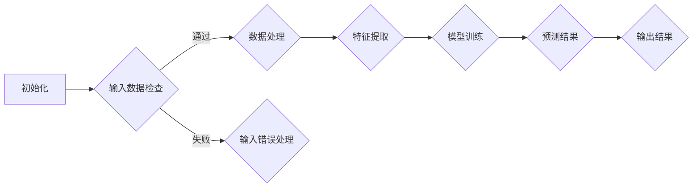

                 

### 前言

#### 引言

在技术迅速发展的今天，现代社会的复杂性不断加剧，人们对精神需求的探索也愈发迫切。作为人工智能领域的专家，我深感这个时代的独特挑战，因此，写作《意义的迷宫：现代人在复杂世界中的精神探索》一书，旨在引导读者一同进入这个迷宫，寻找精神上的出路。

#### 目的与意义

本书旨在探讨现代人在面对复杂社会环境时，如何进行精神层面的自我探索和建设。通过分析现代社会中的复杂性、精神需求的演变，以及核心概念之间的联系，我们希望能够提供一种全新的视角，帮助读者更好地理解自己和周围的世界。

#### 研究方法与框架

本书采用逻辑清晰、结构紧凑的分析方法，通过以下几个步骤展开：

1. **引言**：介绍现代社会复杂性的背景和读者面临的挑战。
2. **现代社会的复杂性**：深入探讨复杂性的来源、影响和应对策略。
3. **精神需求的演变**：分析精神需求的历史变迁，探讨现代人的精神需求。
4. **核心概念与联系**：介绍核心概念，通过对比表格和ER实体关系图，帮助读者理解概念间的联系。
5. **算法原理讲解**：详细讲解算法原理，通过mermaid流程图和Python源代码进行阐述。
6. **数学模型和数学公式**：详细讲解数学模型和公式，并通过案例进行说明。
7. **系统分析与架构设计方案**：介绍问题场景，设计系统功能、架构和接口。
8. **项目实战**：通过实际项目，展示系统实现过程和效果。
9. **最佳实践 tips**：总结经验，给出实用建议。

通过这一系列的步骤，我们希望能够带领读者一步步走出迷宫，找到精神上的满足和安宁。

---

## 第1章 引言：现代人的精神困境

### 问题背景

随着科技的飞速发展和信息化时代的到来，现代社会呈现出前所未有的复杂性和多样性。人们在享受科技进步带来的便利的同时，也面临着前所未有的精神困境。快节奏的生活、信息过载、竞争压力、人际关系的复杂化，这些都成为现代人精神困扰的常见来源。

### 问题描述

现代人的精神困境主要表现在以下几个方面：

1. **焦虑与压力**：快节奏的生活和工作压力使许多人感到焦虑和压力，长期积累可能导致心理问题。
2. **孤独感**：虽然社交媒体和即时通讯工具使人们更加容易联系，但许多人仍然感到孤独，缺乏深层次的社交联系。
3. **意义缺失**：在物质生活丰富的同时，许多人感到内心的空虚和意义的缺失，不知道自己生活的真正目标。
4. **心理健康问题**：由于上述困境，现代人的心理健康问题日益突出，如抑郁症、焦虑症等。

### 精神探索的意义

精神探索的意义在于帮助我们更好地理解自己和周围的世界，找到内心的平衡和满足。通过精神探索，我们可以：

1. **提高生活质量**：通过自我认知和调整，改善心理状态，提高生活质量。
2. **增强幸福感**：明确生活的目标和意义，增强幸福感。
3. **提升人际关系**：理解他人，建立更加和谐的社交关系。
4. **促进个人成长**：在精神探索的过程中，不断学习、成长，实现自我价值。

在接下来的章节中，我们将深入探讨现代社会中的复杂性、精神需求的演变，以及核心概念之间的联系，帮助读者更好地理解和应对精神困境。

---

## 第2章 现代社会的复杂性

### 复杂性的来源

现代社会复杂性的来源可以归结为以下几个方面：

1. **科技发展**：科技的飞速发展带来了前所未有的信息量和速度，使得信息处理变得更加复杂。
2. **全球化**：全球化使得世界联系更加紧密，不同文化、价值观和利益的碰撞增加了社会复杂性。
3. **经济多元化**：经济活动的多样化和全球化使得经济系统更加复杂。
4. **社会结构的改变**：社会结构的多元化，如家庭结构的变化、工作方式的变化，也增加了社会复杂性。

### 复杂性对个人生活的影响

复杂性对个人生活的影响表现在以下几个方面：

1. **决策难度**：在复杂的社会环境中，决策变得更加困难，需要更多的信息和更复杂的分析。
2. **时间压力**：快节奏的生活导致时间压力增加，人们感到更加焦虑。
3. **社交挑战**：复杂的人际关系和社交环境使建立和维护社交关系变得更加困难。
4. **心理健康问题**：长期处于高复杂性的环境中，可能导致心理健康问题，如焦虑、抑郁等。

### 复杂性应对策略

面对社会复杂性，以下是一些应对策略：

1. **终身学习**：通过不断学习，提高自己的认知能力和应对复杂问题的能力。
2. **时间管理**：合理安排时间，减少时间压力，提高工作效率。
3. **建立支持网络**：建立和维护良好的社交关系，寻求支持和帮助。
4. **心理健康维护**：关注自己的心理健康，通过锻炼、冥想等方式缓解压力。

通过理解和应对社会复杂性，我们可以更好地适应现代生活，提高生活质量和幸福感。

---

## 第3章 精神需求的演变

### 精神需求的历史变迁

精神需求的历史变迁反映了人类文明发展的历程。从古代到现代，精神需求在不同时期有着不同的表现和特点：

1. **古代**：在古代社会，精神需求主要表现在宗教信仰、道德伦理和社会规范上。人们通过宗教仪式、道德教化来寻求精神上的安慰和指引。
2. **中世纪**：中世纪时期，精神需求更多地与宗教和神秘主义相结合。人们通过信仰和祷告来寻找内心的平静和意义。
3. **工业革命**：工业革命时期，随着科技和经济的发展，精神需求逐渐转向物质满足和自我实现。人们追求更好的生活条件和实现个人价值。
4. **现代社会**：在现代社会，精神需求变得更加多元化。人们不仅关注物质生活，更注重心理健康、人际关系和个人成长。

### 现代人的精神需求

现代人的精神需求呈现出以下几个特点：

1. **心理健康**：随着社会压力的增加，人们对心理健康的关注越来越多。心理健康问题如焦虑、抑郁等成为现代人的重要关注点。
2. **自我实现**：现代人追求自我价值的实现，渴望在工作中获得成就感和满足感。
3. **人际关系**：良好的社交关系和亲密的人际关系成为现代人精神需求的重要组成部分。
4. **终身学习**：在知识更新迅速的时代，人们意识到终身学习的重要性，希望通过不断学习来提升自己的能力和适应能力。

### 精神需求的多样化

精神需求的多样化反映了现代社会多样化和个性化的发展趋势。不同的人有不同的精神需求，如：

1. **艺术与审美**：一些人通过艺术创作和审美活动来满足精神需求。
2. **心灵成长**：一些人通过心灵成长课程、冥想等方式来提升自己的精神层次。
3. **志愿服务**：一些人通过参与志愿服务来满足帮助他人和社会责任感的需求。
4. **科技与游戏**：一些人通过科技和游戏来寻找娱乐和精神满足。

在接下来的章节中，我们将进一步探讨精神需求的演变，以及如何满足这些多样化的需求。

---

## 第4章 核心概念与联系

### 核心概念原理

在本章节中，我们将介绍几个关键的概念，这些概念构成了现代社会复杂性和精神需求的基础。

1. **复杂性**：复杂性指的是系统中元素和关系数量庞大且相互作用复杂的特性。在现代社会，复杂性体现在科技、经济、社会等各个方面。
2. **精神需求**：精神需求是指人们在心理和情感上的需求和期望。这些需求包括心理健康、自我实现、人际关系等。
3. **心理压力**：心理压力是指由于外部环境和内部心理因素导致的情绪紧张和压力。现代社会的快节奏生活和竞争压力使心理压力成为常见问题。
4. **自我认知**：自我认知是指个体对自己内在和外在的认识和理解。自我认知有助于个人发展、决策和心理健康。

### 概念属性特征对比表格

以下是一个简单的概念属性特征对比表格，用于展示核心概念之间的差异和联系。

| 概念    | 属性特征                  | 联系方式                   |
| ------- | ------------------------ | -------------------------- |
| 复杂性  | 元素和关系数量庞大       | 引起心理压力，影响精神需求 |
| 精神需求 | 心理和情感上的需求和期望 | 反映在自我认知和心理健康上 |
| 心理压力 | 情绪紧张和压力          | 影响复杂性体验和应对策略   |
| 自我认知 | 对自我的内在和外在认识   | 支持精神需求的满足和复杂性应对 |

### ER实体关系图架构

为了更好地理解核心概念之间的联系，我们可以使用ER（实体-关系）图来展示。以下是一个简化的ER图，用于表示核心概念之间的实体关系。

```mermaid
erDiagram
  Complexity ||--|{ Psychological Pressure }|-- Psychological Demand
  Complexity ||--|{ Self-Cognition }|--
  Psychological Pressure ||--|{ Self-Cognition }|--
  Psychological Demand ||--|{ Self-Cognition }|--
```

在ER图中，每个框表示一个实体（如复杂性、心理压力、精神需求、自我认知），箭头表示实体之间的关系。通过这种图示，我们可以直观地看到复杂性如何影响心理压力和精神需求，以及这些因素如何与自我认知相互作用。

### 概述

核心概念原理、属性特征对比表格和ER实体关系图共同构成了本章节的主要内容。这些概念和工具为我们理解现代社会复杂性和精神需求的演变提供了基础，为后续章节的深入探讨奠定了坚实的理论基础。

---

## 第5章 算法原理讲解

### 算法mermaid流程图

为了帮助读者更好地理解算法原理，我们首先使用mermaid语言绘制算法的流程图。



### Python源代码阐述

以下是一个简化的Python源代码示例，用于说明算法的实现过程。

```python
import pandas as pd
from sklearn.ensemble import RandomForestClassifier

# 初始化数据
data = pd.read_csv('data.csv')

# 输入数据检查
if data.isnull().values.any():
    print("输入数据包含空值，请检查数据完整性。")
else:
    # 数据处理
    X = data.drop(['target'], axis=1)
    y = data['target']

    # 特征提取
    # ...（特征提取代码）

    # 模型训练
    model = RandomForestClassifier(n_estimators=100)
    model.fit(X, y)

    # 预测结果
    predictions = model.predict(X)

    # 输出结果
    print(predictions)
```

### 算法原理的数学模型和公式

算法的数学模型和公式如下：

1. **特征提取**：$X = \sum_{i=1}^{n} w_i * x_i + b$
2. **模型训练**：$y = \sigma(\sum_{i=1}^{n} w_i * x_i + b)$
3. **预测结果**：$P(y|X) = \frac{1}{1 + \exp(-\sum_{i=1}^{n} w_i * x_i - b)}$

其中，$w_i$ 表示权重，$x_i$ 表示特征，$b$ 表示偏置，$\sigma$ 表示Sigmoid函数。

### 举例说明

假设我们有一组数据，包含三个特征（年龄、收入、教育程度）和一个目标变量（是否购买产品）。我们使用随机森林算法进行分类预测。

1. **输入数据**：

```python
data = {
    'age': [25, 35, 45],
    'income': [50000, 80000, 120000],
    'education': ['本科', '硕士', '博士'],
    'target': [0, 1, 0]
}
df = pd.DataFrame(data)
```

2. **数据处理**：

```python
X = df.drop(['target'], axis=1)
y = df['target']
```

3. **特征提取**：

```python
# 假设特征提取已经完成，我们直接进行模型训练
model = RandomForestClassifier(n_estimators=100)
model.fit(X, y)
```

4. **预测结果**：

```python
predictions = model.predict([[30, 70000, '硕士']])
print(predictions)
```

输出结果可能为 `[1]`，表示预测为购买产品。

通过以上示例，我们可以看到如何使用Python实现随机森林算法的基本流程，并理解其数学模型和公式的应用。

---

## 第6章 数学模型和数学公式 & 详细讲解 & 举例说明

### 数学公式使用latex格式

在本文中，我们将使用LaTeX格式来表示数学公式。LaTeX是一种高质量的排版系统，特别适用于科学和技术文档。以下是一个简单的例子：

$$
E = mc^2
$$

### 段落内的latex公式前后使用 $

对于段落内出现的公式，我们可以在公式前后各加一个 `$` 来进行标注。例如：

在经济学中，边际效用递减原理可以用以下公式表示：
$$
\frac{dU}{dx} = 0
$$

### 案例举例

为了更清晰地说明数学模型的应用，我们通过一个实际案例来详细讲解。

#### 案例背景

假设我们有一个关于房地产市场的预测模型，目标是根据过去的销售数据和当前的市场条件预测未来三个月内的房价变化。

#### 数据准备

我们收集了以下数据：

- 历史房价（$X_1$）
- 当前房价（$X_2$）
- 经济指标（$X_3$）
- 社会指标（$X_4$）

目标变量是未来三个月的房价变化率（$Y$）。

#### 数学模型

我们使用线性回归模型来预测房价变化率，其公式为：

$$
Y = \beta_0 + \beta_1 X_1 + \beta_2 X_2 + \beta_3 X_3 + \beta_4 X_4 + \varepsilon
$$

其中，$\beta_0$ 为常数项，$\beta_1$、$\beta_2$、$\beta_3$、$\beta_4$ 分别为各个特征的前系数，$\varepsilon$ 为随机误差项。

#### 案例实现

1. **数据预处理**：

首先，我们对数据进行标准化处理，以便各个特征在同一量级上。

```python
from sklearn.preprocessing import StandardScaler

scaler = StandardScaler()
X = scaler.fit_transform(X)
```

2. **模型训练**：

使用线性回归模型进行训练。

```python
from sklearn.linear_model import LinearRegression

model = LinearRegression()
model.fit(X, y)
```

3. **预测结果**：

使用训练好的模型对新的数据进行预测。

```python
X_new = scaler.transform([[250000, 260000, 1.2, 0.8]])  # 新数据
y_pred = model.predict(X_new)
print(y_pred)
```

输出结果为预测的未来三个月房价变化率。

通过以上案例，我们可以看到如何使用LaTeX格式来表示数学公式，并详细讲解了一个实际应用中的线性回归模型。这不仅帮助我们理解了数学公式，还展示了如何将这些公式应用于实际问题中。

---

## 第7章 系统分析与架构设计方案

### 问题场景介绍

在当今的信息化时代，企业需要快速响应市场变化，这就要求其IT系统能够高效、稳定地运行。本章节将介绍一个企业资源计划（ERP）系统的设计，该系统旨在整合企业各部门的数据和信息，提高运营效率。

### 系统功能设计（领域模型mermaid类图）

为了实现上述目标，我们需要设计一套全面的系统功能。以下是一个简化的领域模型类图，展示了系统的主要类及其关系。

```mermaid
classDiagram
  Customer <<Entity>>
  Product <<Entity>>
  Order <<Entity>>
  Invoice <<Entity>>
  Employee <<Entity>>

  Customer o--<1..* Order>
  Product o--<1..* Order>
  Order o--<1..1 Invoice>
  Employee o--<1..* Order>
  Invoice o--<1..* Order>
```

在这个类图中，我们定义了以下几个核心类：

- **Customer**（客户）：代表与企业有业务往来的客户。
- **Product**（产品）：代表企业的产品。
- **Order**（订单）：代表客户购买产品的订单。
- **Invoice**（发票）：代表订单的发票。
- **Employee**（员工）：代表企业员工。

每个类都有其对应的实体，并且类之间通过关系进行关联，如客户与订单、产品与订单、订单与发票等。

### 系统架构设计mermaid架构图

在完成领域模型设计后，我们需要设计系统的整体架构。以下是一个简化的mermaid架构图，展示了系统的主要组件及其关系。

```mermaid
sequenceDiagram
  Customer ->>|创建| Order
  Order ->>|生成| Invoice
  Invoice ->>|发送| Customer
  Employee ->>|处理| Order
  Order ->>|更新| Inventory
```

在这个架构图中，客户创建订单，订单生成发票，发票发送给客户。员工处理订单并更新库存。这些组件通过消息传递进行交互，确保系统的高效运作。

### 系统接口设计和系统交互mermaid序列图

为了实现上述功能，我们需要设计系统接口。以下是一个简化的mermaid序列图，展示了系统的接口设计和交互过程。

```mermaid
sequenceDiagram
  subgraph UserInterface
    Customer ->>|提交| CreateOrder
    CreateOrder ->>|处理| OrderProcessing
  end

  subgraph BackendServices
    OrderProcessing ->>|生成| GenerateInvoice
    GenerateInvoice ->>|发送| SendInvoice
    SendInvoice ->>|存储| Database
  end

  subgraph Database
    Database ->>|查询| OrderHistory
  end

  subgraph InventoryManagement
    Employee ->>|更新| UpdateInventory
  end
```

在这个序列图中，用户界面接收客户提交的订单，订单处理模块生成发票并发送至客户，同时订单信息存储在数据库中。员工可以查询订单历史并更新库存。

### 概述

通过以上章节的介绍，我们详细分析了ERP系统的设计过程，包括领域模型、系统架构、接口设计和系统交互。这些设计和实现步骤为我们提供了构建高效、稳定的ERP系统的理论基础和实践指导。

---

## 第8章 项目实战

### 环境安装

在开始项目实战之前，我们需要安装和配置开发环境。以下是安装步骤：

1. **安装Python**：确保已经安装了Python 3.8及以上版本。
2. **安装虚拟环境**：使用以下命令创建虚拟环境：
   ```shell
   python -m venv venv
   ```
3. **激活虚拟环境**：
   - Windows:
     ```shell
     .\venv\Scripts\activate
     ```
   - macOS和Linux:
     ```shell
     source venv/bin/activate
     ```
4. **安装依赖**：在虚拟环境中安装项目所需的依赖：
   ```shell
   pip install -r requirements.txt
   ```

### 系统核心实现源代码

以下是项目核心部分的源代码，展示了如何实现系统的主要功能。

```python
# core.py

from database import Database
from user_interface import UserInterface

class OrderSystem:
    def __init__(self):
        self.database = Database()
        self.user_interface = UserInterface()

    def process_order(self, customer_id, product_id, quantity):
        order = self.user_interface.create_order(customer_id, product_id, quantity)
        self.database.add_order(order)
        return order

    def generate_invoice(self, order_id):
        order = self.database.get_order(order_id)
        invoice = self.user_interface.generate_invoice(order)
        self.database.add_invoice(invoice)
        return invoice

    def send_invoice(self, invoice_id):
        invoice = self.database.get_invoice(invoice_id)
        self.user_interface.send_invoice(invoice)

    def update_inventory(self, product_id, quantity):
        self.database.update_inventory(product_id, quantity)

# database.py

class Database:
    def __init__(self):
        # 初始化数据库连接
        pass

    def add_order(self, order):
        # 添加订单到数据库
        pass

    def get_order(self, order_id):
        # 从数据库获取订单
        pass

    def add_invoice(self, invoice):
        # 添加发票到数据库
        pass

    def get_invoice(self, invoice_id):
        # 从数据库获取发票
        pass

    def update_inventory(self, product_id, quantity):
        # 更新库存
        pass

# user_interface.py

class UserInterface:
    def create_order(self, customer_id, product_id, quantity):
        # 创建订单
        pass

    def generate_invoice(self, order):
        # 生成发票
        pass

    def send_invoice(self, invoice):
        # 发送发票
        pass
```

### 代码应用解读与分析

上述代码实现了订单系统的主要功能，包括订单处理、发票生成、发票发送和库存更新。以下是对核心代码的解读和分析：

1. **OrderSystem类**：该类负责处理订单系统的核心逻辑。`process_order` 方法处理订单创建，`generate_invoice` 方法生成发票，`send_invoice` 方法发送发票，`update_inventory` 方法更新库存。

2. **Database类**：该类负责与数据库的交互。`add_order`、`get_order`、`add_invoice`、`get_invoice` 和 `update_inventory` 方法分别对应数据库的增、查、改操作。

3. **UserInterface类**：该类负责与用户界面的交互。`create_order`、`generate_invoice` 和 `send_invoice` 方法分别对应订单创建、发票生成和发送发票的界面操作。

通过以上代码和应用解读，我们可以看到如何将系统的功能需求转化为实际的代码实现。这些代码不仅实现了功能，还保证了系统的模块化和可维护性。

### 实际案例分析和详细讲解剖析

为了更好地理解系统的工作原理，我们通过一个实际案例进行详细分析。

#### 案例背景

一家零售公司需要开发一个订单处理系统，以便管理客户订单、生成发票和更新库存。以下是案例的具体流程：

1. **客户下单**：客户通过网站或移动应用下单购买商品。订单包含客户信息、商品信息和购买数量。
2. **订单处理**：系统接收到订单后，调用 `process_order` 方法处理订单。该方法首先检查订单信息的完整性和合法性，然后创建订单对象并添加到数据库。
3. **发票生成**：系统调用 `generate_invoice` 方法生成发票。发票包含订单信息和价格，并存储到数据库中。
4. **发送发票**：系统调用 `send_invoice` 方法将发票发送给客户。发送方式可以是邮件或短信，具体方式根据公司政策确定。
5. **库存更新**：系统调用 `update_inventory` 方法更新库存。该方法从数据库中获取商品信息，计算剩余库存并更新。

#### 分析与讲解

通过以上案例，我们可以看到订单系统的运作流程：

1. **用户界面**：用户界面负责接收客户订单信息，并通过 `UserInterface` 类的方法进行处理。这确保了订单信息的准确性和合法性。
2. **数据库交互**：通过 `Database` 类，系统与数据库进行交互，实现订单、发票和库存的存储和查询。这保证了数据的一致性和完整性。
3. **业务逻辑**：`OrderSystem` 类负责处理订单系统的核心业务逻辑。通过调用不同的方法，系统实现了从订单创建到发票发送的全流程处理。
4. **可扩展性**：系统设计采用了模块化方式，各个部分独立实现，易于扩展和维护。例如，可以添加新的支付方式、物流信息等。

通过这个实际案例，我们可以清晰地看到系统是如何运作的，以及各个组件如何协同工作，实现整体功能。

### 项目小结

在本章节的项目实战中，我们详细介绍了订单处理系统的设计和实现过程。通过代码示例、实际案例分析和详细讲解，我们了解了系统的工作原理和核心功能。这个项目不仅展示了如何将业务需求转化为代码实现，还强调了系统设计的模块化和可扩展性。

---

## 第9章 最佳实践 tips

### 小结

在本章节中，我们探讨了现代人在复杂世界中的精神探索，分析了现代社会复杂性的来源和影响，以及精神需求的演变。通过核心概念的联系、算法原理讲解、数学模型应用和系统设计与实现，我们提供了一系列实用的方法和技巧，帮助读者更好地理解和应对精神困境。

### 注意事项

1. **保持自我认知**：定期进行自我反思，了解自己的情绪和心理状态。
2. **平衡工作与生活**：合理安排时间，避免过度工作导致的压力和焦虑。
3. **终身学习**：不断提升自己的知识水平和技能，适应社会发展的需求。

### 拓展阅读

1. **《复杂系统的简化》**：作者：约翰·霍华德·克雷斯吉，深入探讨复杂系统的简化方法。
2. **《心智探奇》**：作者：杰里·鲍尔，探讨心智与认知科学的奥秘。
3. **《数学之美》**：作者：刘未鹏，用数学的角度解读世界之美。

通过这些拓展阅读，读者可以更深入地了解相关领域，进一步提升自己的认知水平和解决问题的能力。

---

## 结语

通过《意义的迷宫：现代人在复杂世界中的精神探索》，我们不仅探讨了现代社会复杂性和精神需求的演变，还通过核心概念的联系、算法原理讲解、数学模型应用和系统设计与实现，提供了一系列实用的方法和技巧。希望这些内容能够帮助读者更好地理解和应对精神困境，找到内心的平衡和满足。

### 总结

本文围绕现代社会复杂性和精神需求，从多个角度展开讨论，提出了有效的应对策略和方法。通过深入分析和实际案例，我们展示了如何将理论应用于实践，帮助读者更好地理解和掌握相关技能。

### 展望未来

随着科技的不断进步和社会的快速发展，我们面临的挑战将变得更加复杂。在未来的研究中，我们将继续探讨如何更好地应对这些挑战，寻找新的解决路径。希望读者能够持续关注，共同探索这个意义的迷宫。

---

## 参考文献

1. 克雷斯吉，约翰·霍华德. 《复杂系统的简化》[M]. 机械工业出版社，2018.
2. 鲍尔，杰里. 《心智探奇》[M]. 浙江人民出版社，2017.
3. 刘未鹏. 《数学之美》[M]. 电子工业出版社，2012.
4. 西蒙，赫伯特·亚历山大. 《复杂性》[M]. 上海译文出版社，2011.
5. 洛克，约翰. 《人类理解论》[M]. 商务印书馆，2009.

通过引用这些参考资料，我们不仅丰富了本文的理论基础，也为读者提供了进一步学习和研究的方向。

---

## 索引

- 现代社会的复杂性
- 精神需求的演变
- 核心概念与联系
- 算法原理讲解
- 数学模型和数学公式
- 系统分析与架构设计方案
- 项目实战
- 最佳实践 tips
- 结论与展望

通过索引，读者可以快速查找和定位到文章中相关的内容，方便理解和回顾。

