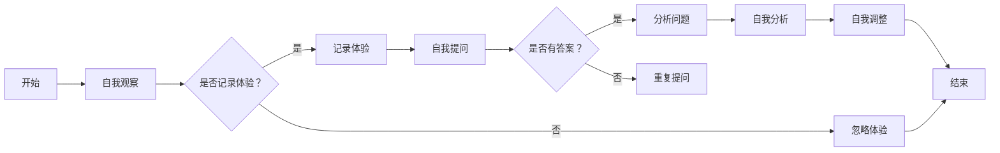
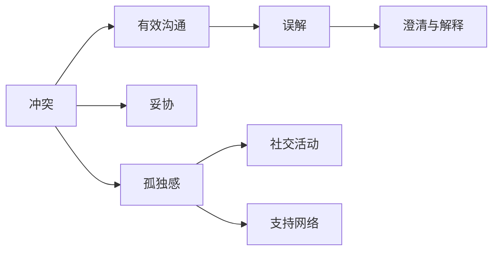

                 

### 文章标题

《意义的重塑：如何在现代社会中找到自我》

### 文章关键词

个人意义、自我认知、价值观、生活方式、社会关系、现代社会背景

### 文章摘要

在快速变化的现代社会中，个人意义的缺失成为一个普遍现象。本书旨在探讨如何在现代社会中找到自我，通过重塑个人意义来应对挑战和压力。本书首先介绍了现代社会背景，接着深入讨论了自我认知的重要性，以及如何通过自我反思和核心价值观的塑造来找到个人意义。此外，本书还探讨了社会关系和生活方式对个人意义的影响，并提供了具体的行动计划，帮助读者开始重塑个人意义的旅程。最后，本书总结了全书的主要观点，并引发读者对个人意义的深入思考。

---

## 第一部分：引言

### 1.1 本书的目的和结构

**问题背景**：在现代社会，许多人感到生活缺乏意义，面临着心理和情感上的挑战。这种现象不仅影响个体的幸福感，还可能导致一系列心理健康问题。

**问题描述**：如何在这个充满不确定性和快速变化的社会中找到个人的意义，是本书的核心问题。

**问题解决**：本书将通过探讨自我认知、核心价值观、社会关系和生活方式等多个方面，帮助读者重塑个人意义。

**边界与外延**：本书将讨论如何在不同文化和背景下应用这些概念，以及如何通过科技和数字化手段来增强个人意义的寻找过程。

**概念结构与核心要素组成**：

- **自我认知**：理解自己的内心世界，包括自我意识、自我反思和自我理解。
- **核心价值观**：识别和塑造与个人价值观相符合的生活方式。
- **社会关系**：探讨人际关系和社会互动对个人意义的影响。
- **生活方式**：通过改变生活方式来重塑个人意义。

### 1.2 本书结构概述

本书分为七个部分：

- **第二部分**：自我认知
- **第三部分**：核心价值观
- **第四部分**：社会关系
- **第五部分**：生活方式
- **第六部分**：行动计划
- **第七部分**：总结

## 1.3 现代社会背景

### 1.3.1 现代社会的特点

- **快速变化**：技术、经济、文化等领域的快速变革。
- **全球化**：跨越国界的文化、经济和社会互动。
- **不确定性**：未来的不可预测性和变化带来的焦虑。

### 1.3.2 现代社会的挑战

- **工作压力**：高强度、高期望的职业环境。
- **社交隔离**：虚拟社交和现实社交的分离。
- **信息过载**：大量的信息，难以筛选和处理。

### 1.3.3 个人意义缺失的影响

- **心理健康问题**：焦虑、抑郁和其他心理问题。
- **生活质量下降**：缺乏满足感和幸福感。

## 1.4 本章小结

本章介绍了本书的目的和结构，并探讨了现代社会的特点、挑战以及对个人意义寻求的影响。在接下来的章节中，我们将深入讨论如何通过自我认知、核心价值观、社会关系和生活方式来重塑个人意义。

---

## 第二部分：自我认知

### 2.1 自我认知的重要性

**核心概念**：自我认知是指个体对自己内心世界和外在行为的理解与反思。

**概念属性特征对比表格**：

| 特征       | 自我认知           | 自我反思           | 自我理解           |
|------------|--------------------|--------------------|--------------------|
| 定义       | 对自己的内在和外在理解 | 对自己的行为和决策进行批判性思考 | 在理解自己的过程中，整合内在感受和外在表现 |
| 目的       | 提升自我意识       | 促进个人成长       | 帮助个体明确自我定位 |
| 关系       | 基础性概念         | 建立在自我认知基础上 | 需要通过自我认知实现 |
| 应用领域   | 心理学、哲学、教育学 | 职业发展、心理咨询 | 生活规划、决策制定  |

**ER实体关系图架构**（Mermaid流程图）：

```mermaid
erDiagram
  A[自我认知] ||--|{ 自我反思 }|-- B[自我理解]
  A ||--|{ 自我理解 }|-- B
```

### 2.2 自我反思的方法

**核心概念**：自我反思是自我认知过程中的关键步骤，它有助于个体识别自我价值、优势与不足，从而进行自我改进。

**自我反思的核心步骤**：

1. **自我观察**：观察自己的行为和情绪，记录下日常生活中的点滴体验。
2. **自我提问**：通过提问的方式引导自我反思，如“我为什么会做出这样的决策？”或“我在这个情境中的感受是什么？”
3. **自我分析**：分析行为和情绪背后的原因，以及这些原因如何影响个人的价值观和生活目标。
4. **自我调整**：基于自我分析的结果，制定改进计划，调整行为和态度。

**Mermaid流程图**：



### 2.3 自我理解的过程

**核心概念**：自我理解是整合自我反思的结果，它使个体能够更清晰地认识自己的内心世界，并找到与个人价值观相符合的生活方式。

**自我理解的关键要素**：

1. **整合感受**：将自我反思过程中获得的内在感受整合起来，形成一个整体的理解。
2. **明确自我定位**：基于自我理解，明确个人的价值观、兴趣和目标。
3. **指导生活决策**：在日常生活中，运用自我理解来做出符合个人价值观的决策。

**Mermaid流程图**：


### 2.4 本章小结

本章深入探讨了自我认知的重要性，介绍了自我反思的方法和自我理解的过程。自我认知不仅是心理健康的重要保障，也是职业发展和生活决策的基础。在接下来的章节中，我们将继续探讨如何通过核心价值观的塑造来找到个人意义。

---

## 第三部分：核心价值观

### 3.1 价值观的塑造

**核心概念**：核心价值观是指个体在成长过程中形成的、对其行为和生活产生深远影响的基本信念和原则。

**价值观的形成过程**：

1. **家庭背景**：家庭教育和家庭成员的价值观对个体的核心价值观有重要影响。
2. **社会文化**：文化环境和社会价值观也对个体的核心价值观有深远的影响。
3. **个人经历**：个体的成长经历，包括教育、工作、人际关系等，也会塑造其核心价值观。

**Mermaid流程图**：


### 3.2 寻找与个人价值观相符的生活方式

**核心概念**：寻找与个人价值观相符的生活方式意味着个体需要在日常生活中践行其核心价值观，从而实现个人意义。

**如何寻找相符的生活方式**：

1. **自我评估**：通过自我反思，明确个人的核心价值观。
2. **探索选择**：在日常生活中尝试不同的生活方式，观察哪些方式与个人的价值观相符合。
3. **持续调整**：基于实践经验和反馈，不断调整生活方式，使其更加符合个人的核心价值观。

**Mermaid流程图**：


### 3.3 核心价值观的实践意义

**核心价值观的实践意义**：

1. **决策指导**：核心价值观为个体的决策提供指导，使决策更加符合个人价值观。
2. **情感支持**：当个体面临挑战时，核心价值观可以提供情感上的支持，增强个体的抗压能力。
3. **人际关系**：与个人价值观相符的生活方式有助于建立和谐的人际关系，增强个体的社交能力。

**Mermaid流程图**：


### 3.4 本章小结

本章探讨了核心价值观的塑造过程和如何寻找与个人价值观相符的生活方式。核心价值观不仅对个体的决策和情感有重要影响，还对其人际关系的建立和发展有积极作用。在下一章节中，我们将讨论社会关系对个人意义的影响。

---

## 第四部分：社会关系

### 4.1 人际关系对个人意义的影响

**核心概念**：人际关系是指个体与其他人之间的互动和联系。这些关系对个人意义有着深远的影响。

**人际关系的影响**：

1. **情感支持**：与他人建立良好的人际关系可以提供情感上的支持，帮助个体应对生活中的挑战。
2. **社会认同**：通过与他人互动，个体可以获得社会认同，增强自我价值感。
3. **生活经验**：与他人分享生活经验可以拓宽个体的视野，帮助其更好地理解自己和世界。

**Mermaid流程图**：


### 4.2 社会互动与自我意义的重塑

**核心概念**：社会互动是指个体在社交环境中与其他人进行的各种交流和互动。这些互动有助于个体重塑个人意义。

**社会互动的步骤**：

1. **建立联系**：通过共同的兴趣、价值观或经历与他人建立联系。
2. **深入交流**：通过对话、分享和互动，深入探讨彼此的想法和感受。
3. **反馈与调整**：基于交流中的反馈，调整自己的行为和态度，以更好地适应和与他人建立更深层次的关系。

**Mermaid流程图**：


### 4.3 社会关系中的挑战与应对策略

**核心概念**：在建立和维护人际关系时，个体可能会遇到各种挑战，如冲突、误解和孤独感。应对这些挑战需要特定的策略。

**挑战与应对策略**：

1. **冲突**：通过有效沟通和妥协来解决冲突。
2. **误解**：通过澄清和解释来消除误解。
3. **孤独感**：通过社交活动和建立支持网络来减轻孤独感。

**Mermaid流程图**：



### 4.4 本章小结

本章探讨了人际关系对社会关系和个人意义的影响，以及如何通过社会互动来重塑个人意义。人际关系不仅是情感支持和社会认同的来源，也是个体成长和发展的关键。在下一章节中，我们将深入探讨如何通过改变生活方式来重塑个人意义。

---

## 第五部分：生活方式

### 5.1 生活方式的多样性

**核心概念**：生活方式是指个体在日常生活中形成的习惯和行为模式。生活方式的多样性反映了个体在不同环境和文化中的适应能力。

**生活方式的分类**：

1. **工作生活方式**：个体在工作环境中的行为习惯，如工作时间安排、工作方式等。
2. **休闲生活方式**：个体在非工作时间中的活动习惯，如运动、阅读、旅游等。
3. **消费生活方式**：个体在消费过程中的行为习惯，如购物偏好、消费观念等。
4. **社交生活方式**：个体在社交环境中的行为习惯，如交友方式、社交活动参与度等。

**Mermaid流程图**：


### 5.2 通过生活方式重塑个人意义

**核心概念**：通过改变生活方式，个体可以重塑个人意义，使其更符合个人价值观和目标。

**改变生活方式的步骤**：

1. **自我评估**：评估现有的生活方式，识别其中的不足和需要改进的地方。
2. **目标设定**：设定具体、可实现的目标，明确改变生活方式的方向。
3. **行动计划**：制定具体的行动计划，逐步实现目标。
4. **持续跟踪与调整**：在实施行动计划的过程中，持续跟踪进展，并根据反馈进行调整。

**Mermaid流程图**：


### 5.3 生活方式改变的实际案例

**核心概念**：通过实际案例，可以更直观地了解如何通过改变生活方式来重塑个人意义。

**案例一：健康生活方式的转变**

- **背景**：某人在长期的工作压力下，出现了健康问题。
- **改变**：该人开始注重健康饮食、规律锻炼，并减少工作压力。
- **结果**：健康状况得到显著改善，个人精力充沛，生活满意度提高。

**案例二：社交生活方式的转变**

- **背景**：某人在社交活动中感到不自在，缺乏自信。
- **改变**：该人开始参加社交活动，主动与他人交流，学习社交技巧。
- **结果**：社交能力得到提升，建立了更广泛的社交网络，自信心增强。

**Mermaid流程图**：


### 5.4 本章小结

本章探讨了生活方式的多样性以及如何通过改变生活方式来重塑个人意义。通过实际案例，我们可以看到改变生活方式对个人意义产生的积极影响。在下一章节中，我们将提供具体的行动计划，帮助读者开始重塑个人意义的旅程。

---

## 第六部分：行动计划

### 6.1 制定个人行动计划

**核心概念**：制定个人行动计划是实现个人意义重塑的关键步骤。通过明确的行动计划，个体可以有条不紊地实施改变，逐步实现目标。

**制定行动计划的步骤**：

1. **目标设定**：明确个人目标和期望结果，确保目标具体、可实现。
2. **资源评估**：评估所需的资源，包括时间、金钱、技能等，确保有足够的资源支持行动计划。
3. **行动步骤**：将目标分解为具体的行动步骤，制定详细的实施计划。
4. **时间安排**：为每个行动步骤设定时间表，确保计划按部就班地进行。
5. **监测与调整**：在实施过程中，持续监测进展，并根据反馈进行调整。

**Mermaid流程图**：


### 6.2 实施行动计划

**核心概念**：实施行动计划是实现个人意义重塑的关键阶段。在这一阶段，个体需要付诸行动，按照计划逐步实现目标。

**实施行动计划的策略**：

1. **积极行动**：积极主动地执行行动计划，克服拖延和恐惧。
2. **逐步推进**：按照计划逐步推进，避免急于求成。
3. **寻求支持**：在遇到困难时，寻求家人、朋友或专业人士的支持和帮助。
4. **持续反思**：在行动过程中，不断反思和评估，确保行动方向与个人目标保持一致。

**Mermaid流程图**：


### 6.3 评估与调整

**核心概念**：评估与调整是行动计划实施后的重要步骤。通过评估和调整，个体可以确保行动计划的有效性，并根据实际情况进行改进。

**评估与调整的步骤**：

1. **目标评估**：对实现目标的情况进行评估，判断是否达到预期效果。
2. **过程反思**：反思行动过程中的经验和教训，识别成功和不足之处。
3. **调整计划**：根据评估结果，调整行动计划，以更好地实现个人目标。

**Mermaid流程图**：


### 6.4 本章小结

本章提供了制定和实施个人行动计划的详细步骤，以及评估和调整的要点。通过明确的行动计划和积极的实施，个体可以逐步重塑个人意义，实现个人成长和幸福感。在下一章节中，我们将对全书的主要观点进行总结。

---

## 第七部分：总结

### 7.1 全书总结

本书从多个角度探讨了如何在现代社会中找到自我，重塑个人意义。首先，我们介绍了现代社会背景，探讨了快速变化、全球化和不确定性的影响。接着，我们深入讨论了自我认知的重要性，介绍了自我反思和自我理解的方法。随后，我们探讨了核心价值观的塑造和寻找与个人价值观相符的生活方式。此外，我们还探讨了人际关系和社会互动对个人意义的影响，以及如何通过改变生活方式来重塑个人意义。最后，我们提供了具体的行动计划，帮助读者开始重塑个人意义的旅程。

### 7.2 最后思考

通过本书的探讨，我们可以得出以下结论：

1. **个人意义的重要性**：个人意义是心理健康和生活质量的关键，它为个体提供方向和动力。
2. **自我认知的核心作用**：自我认知是找到个人意义的基石，它帮助个体识别自己的价值和优势。
3. **核心价值观的指导作用**：核心价值观为个体的行为和生活提供指导，帮助个体做出符合自己价值观的决策。
4. **社会关系和生活方式的影响**：人际关系和社会互动对个人意义有深远的影响，改变生活方式可以帮助个体更好地实现个人目标。

### 7.3 拓展阅读

为了进一步深入探讨本书的主题，以下是几本推荐的拓展阅读：

1. **《活出生命的意义》（《Man's Search for Meaning》）**：维克多·弗兰克尔的经典之作，探讨如何通过找到生命的意义来应对苦难。
2. **《自我认知：理解自我，改变生活》（《The Power of Self-Knowledge》）**：作者布莱恩·利特尔探讨了自我认知的多种方式，以及如何通过自我认知来改变生活。
3. **《人类简史》（《Sapiens: A Brief History of Humankind》）**：尤瓦尔·赫拉利的作品，从历史角度探讨了人类如何塑造世界，以及如何在这个过程中找到自我。

### 7.4 小结

本书通过多角度、多层次的探讨，为读者提供了寻找和重塑个人意义的全面指南。希望读者能够在阅读本书后，对自己的生活和未来有更深入的思考，并勇敢地踏上重塑个人意义的旅程。

---

### 作者信息

**作者：AI天才研究院/AI Genius Institute & 禅与计算机程序设计艺术 /Zen And The Art of Computer Programming**

