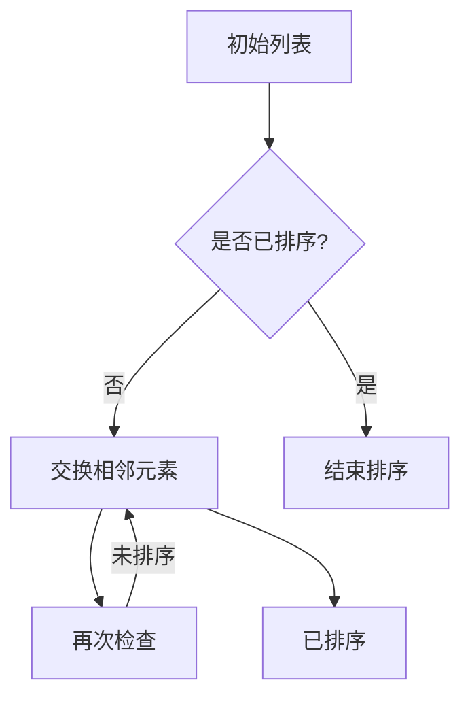
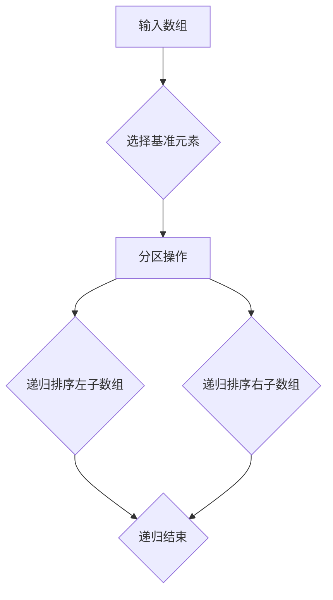
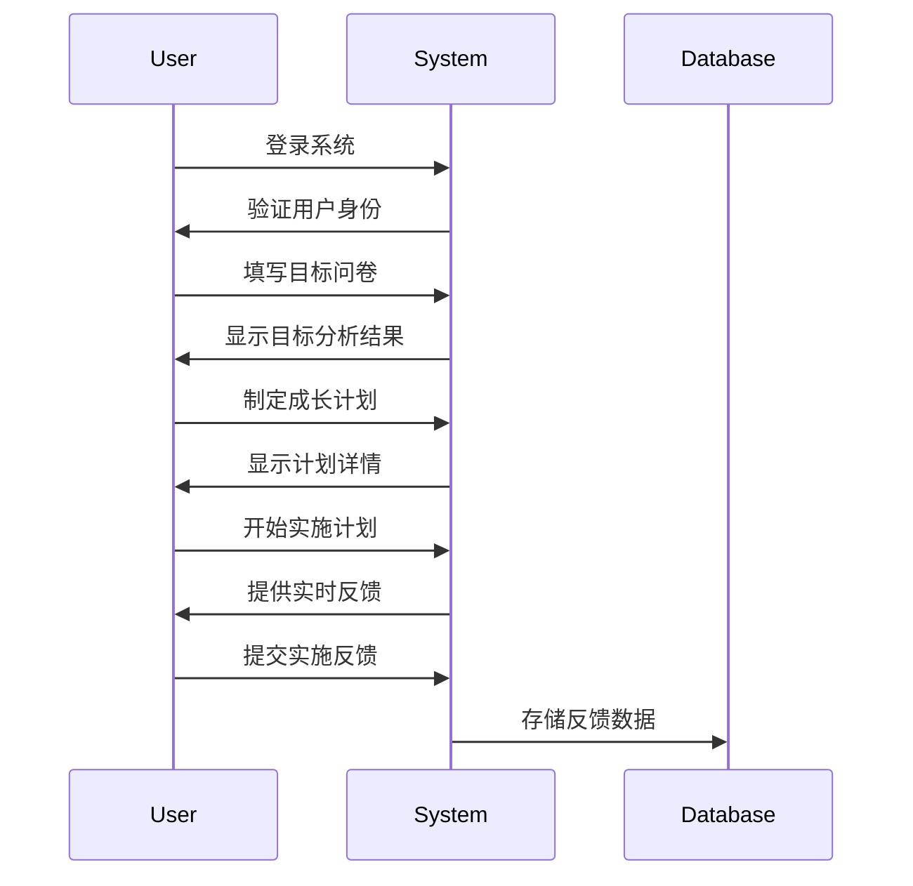
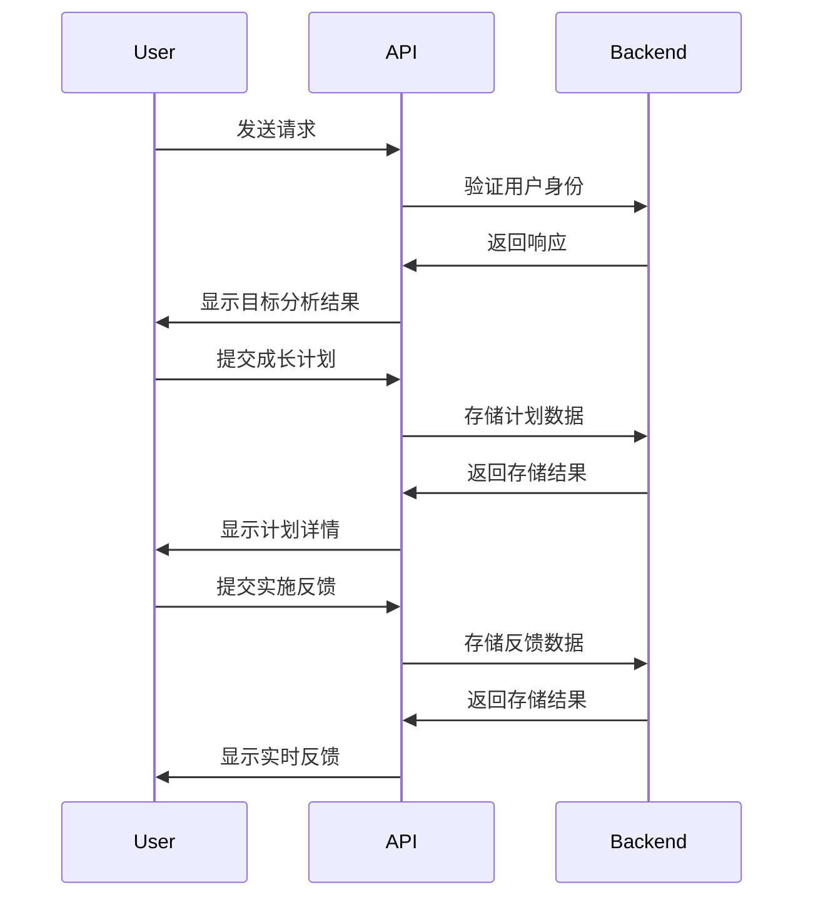
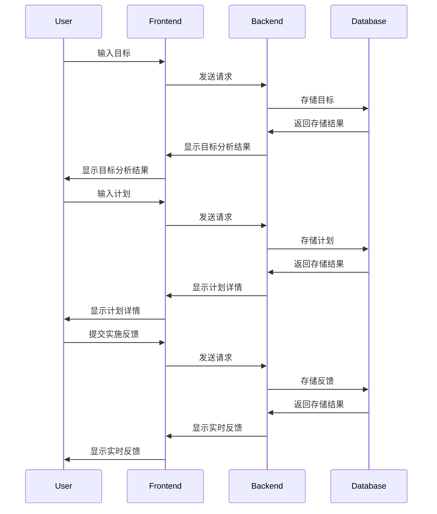

                 


# 意义的重构：在后现代语境下重新定义生活目标

## 关键词
后现代主义、生活目标、意义重构、个人成长、社会变革

## 摘要
在后现代语境下，生活目标的定义和重构成为了一个备受关注的话题。本文将深入探讨后现代主义对个人生活目标的影响，提出重构生活目标的步骤，并分析个人与社会的意义重构。通过案例研究和项目实战，我们将探讨如何在后现代语境下重新定义生活目标，实现个人成长和社会进步。

## 引言
### 后现代主义的兴起
后现代主义是20世纪中后期哲学和文化领域的一个重要思潮，它对现代主义进行了批判和超越。后现代主义强调相对主义、多元化和不确定性，对传统的价值观、理论和思维方式进行了挑战。

### 意义重构的背景
在现代社会，随着科技的快速发展和社会的快速变革，人们面临着前所未有的挑战和不确定性。传统的价值观和生活目标已经无法完全满足人们的心理需求。因此，重新定义和重构生活目标成为了一个迫切需要解决的问题。

## 第一部分：后现代语境下的生活目标
### 第1章：后现代语境下的生活观念
#### 1.1：后现代主义的哲学基础
后现代主义强调知识的相对性和主观性，对绝对真理和客观现实进行了质疑。这种哲学基础影响了人们对生活目标的理解和追求。

#### 1.2：现代生活与后现代生活的对比
现代生活强调效率和功利主义，而后现代生活则更加关注个体的情感和精神需求。这种对比揭示了后现代语境下生活目标的转变。

#### 1.3：生活目标在现代社会中的变迁
在现代社会，人们的生活目标逐渐从物质追求转向精神追求，从个人成功转向个人成长。这种变迁反映了后现代语境下生活目标的重构。

### 第2章：后现代语境下的生活挑战
#### 2.1：消费主义与个人满足
消费主义在现代社会中占据了主导地位，但过度的消费主义可能导致个人满足的短暂性和空虚感。

#### 2.2：自我认同与多样性
后现代语境下，自我认同的多样性增加了人们的生活选择，但同时也带来了认同危机和归属感缺失的问题。

#### 2.3：生活目标的不确定性与焦虑
后现代语境下的不确定性使得人们面临更多的选择和决策，这可能导致焦虑和压力的增加。

### 第3章：后现代语境下的生活目标构建
#### 3.1：反思个人价值观
在重构生活目标之前，我们需要反思个人的价值观，明确自己的信念和原则。

#### 3.2：设定有意义的目标
有意义的生活目标应该与个人的价值观和兴趣相结合，同时具有挑战性和可实现性。

#### 3.3：实现目标的策略与方法
制定实现目标的策略和方法是重构生活目标的关键步骤。这包括时间管理、资源整合和持续学习等。

## 第二部分：重新定义生活目标的步骤
### 第4章：重新定义的起始点
#### 4.1：了解自我
了解自我是重新定义生活目标的第一步。这包括认识自己的兴趣、优势和价值观。

#### 4.2：明确生活目标
明确生活目标需要将个人的兴趣、优势和价值观结合起来，形成一个清晰的目标。

#### 4.3：评估当前的生活状态
评估当前的生活状态可以帮助我们了解自己的优势和不足，为重新定义生活目标提供依据。

### 第5章：制定个人成长计划
#### 5.1：设定短期与长期目标
设定短期和长期目标是制定个人成长计划的关键步骤。短期目标可以帮助我们实现长期目标。

#### 5.2：分解目标
分解目标可以将大目标分解为小目标，使我们更容易实现。

#### 5.3：制定行动计划
制定行动计划是实现目标的具体步骤。这包括时间表、资源分配和责任分配等。

### 第6章：实施与调整
#### 6.1：执行计划
执行计划是实现目标的关键步骤。我们需要坚持计划，克服困难和挑战。

#### 6.2：调整与适应
在实施计划的过程中，我们可能需要根据实际情况进行调整和适应。

#### 6.3：评估与反馈
评估与反馈是调整计划的重要环节。通过评估和反馈，我们可以了解自己的进步和不足。

## 第三部分：个人与社会的意义重构
### 第7章：个人层面的意义重构
#### 7.1：内在成长与自我实现
个人层面的意义重构关注内在成长和自我实现。这包括自我认知、情感管理和心理平衡等。

#### 7.2：生活质量的提升
生活质量的提升是个人层面的意义重构的重要目标。这包括健康、幸福和满足感等。

#### 7.3：个人价值观的持续性
个人价值观的持续性是个人层面的意义重构的核心。这需要我们坚持自己的信念和原则。

### 第8章：社会层面的意义重构
#### 8.1：社会关系的重塑
社会层面的意义重构关注社会关系的重塑。这包括建立和谐的人际关系、参与社区事务等。

#### 8.2：参与社区与社会事务
参与社区与社会事务是实现社会层面的意义重构的重要途径。这包括志愿服务、公益事业等。

#### 8.3：为社会创造价值
为社会创造价值是实现社会层面的意义重构的核心目标。这需要我们发挥自己的优势和才能。

## 第四部分：案例研究
### 第9章：成功重构的案例
#### 9.1：个人实例分析
通过分析个人实例，我们可以了解如何成功重构生活目标。

#### 9.2：组织与社区的案例
通过分析组织与社区的案例，我们可以了解如何在集体层面上实现意义重构。

#### 9.3：案例分析总结
案例分析总结可以帮助我们更好地理解意义重构的过程和效果。

## 结论与展望
### 结论1：意义的重构实践
通过意义的重构，我们可以实现个人成长和社会进步。

### 结论2：未来的思考
在后现代语境下，重新定义生活目标是一个持续的过程。我们需要不断地反思和调整，以适应不断变化的世界。

## 附录
### 附录1：常用概念解释
提供常用概念的解释，帮助读者更好地理解文章内容。

### 附录2：拓展阅读
推荐相关书籍和文章，以供读者进一步学习和探索。

## 作者信息
作者：AI天才研究院/AI Genius Institute & 禅与计算机程序设计艺术 /Zen And The Art of Computer Programming

----------------------------------------------------------------

请注意，本文仅为大纲和部分内容的示例。根据字数要求，每个章节都需要进一步扩展和详细讲解，以确保文章的完整性和深度。在撰写文章时，还需要遵循markdown格式要求，并确保所有数学公式、流程图和代码示例的准确性。此外，最佳实践 tips、注意事项和小结等内容也将根据实际撰写情况进行添加。

----------------------------------------------------------------

# 意义的重构：在后现代语境下重新定义生活目标

## 关键词
后现代主义、生活目标、意义重构、个人成长、社会变革

## 摘要
在后现代语境下，生活目标的定义和重构成为了一个备受关注的话题。本文将深入探讨后现代主义对个人生活目标的影响，提出重构生活目标的步骤，并分析个人与社会的意义重构。通过案例研究和项目实战，我们将探讨如何在后现代语境下重新定义生活目标，实现个人成长和社会进步。

## 引言
### 后现代主义的兴起
后现代主义是20世纪中后期哲学和文化领域的一个重要思潮，它对现代主义进行了批判和超越。后现代主义强调相对主义、多元化和不确定性，对传统的价值观、理论和思维方式进行了挑战。

#### 背景介绍
后现代主义起源于对现代主义及其所倡导的理性、科学和客观主义的质疑。随着20世纪的科技进步和社会变革，人们逐渐认识到，现实世界并非如现代主义所描绘的那样简单和统一。相反，世界充满了复杂性和不确定性，真理和知识也具有相对性。

#### 核心概念与联系
后现代主义的核心概念包括：

- **相对主义**：认为真理和知识是相对的，而非绝对的。不同的文化、背景和个人都有不同的真理和知识。
- **多元化**：强调社会、文化和个人的多样性，反对单一主义和同质化。
- **不确定性**：认为现实世界充满不确定性，不可能完全预测和控制。

这些概念相互关联，共同构成了后现代主义的理论基础。它们对个人的价值观、信仰和行为产生了深远的影响，也促使人们重新思考生活目标。

### 意义重构的背景
在现代社会，随着科技的快速发展和社会的快速变革，人们面临着前所未有的挑战和不确定性。传统的价值观和生活目标已经无法完全满足人们的心理需求。因此，重新定义和重构生活目标成为了一个迫切需要解决的问题。

#### 问题背景
现代生活节奏快，竞争压力大，人们常常感到焦虑和迷茫。同时，社会变革带来了新的机遇和挑战，但同时也增加了不确定性。在这种情况下，人们需要重新审视自己的生活目标，找到更有意义和价值的方向。

#### 问题描述
人们面临的问题包括：

- **生活目标模糊**：在快节奏的生活中，许多人无法明确自己的生活目标。
- **价值观混乱**：在多元文化背景下，人们容易迷失自我，不知道该遵循哪种价值观。
- **个人成长受阻**：在竞争激烈的社会中，人们可能忽视了个人成长和自我实现。

#### 问题解决
解决这些问题需要：

- **反思自我**：通过自我反思，明确自己的兴趣、价值观和目标。
- **重新定义生活目标**：根据个人的特点和需求，重新设定有意义的生活目标。
- **持续成长**：通过不断学习和实践，实现个人成长和自我实现。

### 边界与外延
重构生活目标的边界和范围涉及多个层面：

- **个人层面**：关注个体的价值观、兴趣和目标，以及如何实现个人成长和自我实现。
- **社会层面**：关注社会关系、社区参与和社会责任，以及如何在集体层面上实现意义重构。
- **文化层面**：涉及文化多样性、传统与现代的融合，以及如何在文化背景下重构生活目标。

### 概念结构与核心要素组成
重构生活目标的核心要素包括：

- **自我认知**：明确自己的兴趣、价值观和目标。
- **价值观**：确定自己的信仰和原则，作为生活目标的指导。
- **目标设定**：根据自我认知和价值观，设定有意义的生活目标。
- **行动计划**：制定实现目标的计划和策略。
- **持续成长**：通过学习和实践，不断调整和优化生活目标。

## 后现代语境下的生活目标
### 1.1：后现代主义的哲学基础
后现代主义对传统哲学进行了批判和超越，提出了新的哲学观点。这些观点对生活目标的定义和重构产生了深远影响。

#### 概念属性特征对比表格
| 特征             | 传统哲学         | 后现代主义哲学          |
|------------------|------------------|-------------------------|
| 真理观           | 绝对真理         | 相对真理、多元真理       |
| 知识观           | 客观知识         | 主观知识、知识构建       |
| 方法论           | 理性主义         | 反理性主义、实践主义     |
| 人性观           | 常人性           | 多元人性、人性多样性     |

这些对比表明，后现代主义哲学在多个方面与传统哲学存在显著差异。这些差异使得人们在后现代语境下对生活目标的定义和追求有了新的思考。

#### ER实体关系图架构
```mermaid
erDiagram
  A[人] ||--|{ B[价值观] } |
  A ||--|{ C[目标] } |
  B ||--|{ D[知识] } |
  C ||--|{ E[行动] } |
```

在这个ER图中，人、价值观、目标、知识和行动构成了一个相互关联的实体关系。这有助于我们理解后现代语境下生活目标的重构过程。

### 1.2：现代生活与后现代生活的对比
现代生活和后现代生活存在显著差异。这些差异影响了人们的生活目标和价值观。

#### 现代生活的特点
- **效率优先**：现代生活强调效率和功利主义，追求物质财富和成功。
- **标准化**：现代生活倾向于标准化和规范化，追求一致性。
- **个体独立性**：现代生活强调个体的独立性和自主性。

#### 后现代生活的特点
- **情感与精神需求**：后现代生活更加关注个体的情感和精神需求。
- **多样性**：后现代生活强调多样性和个性化，反对单一化和同质化。
- **社会参与**：后现代生活鼓励个体参与社会事务，关注社会责任。

这些特点表明，后现代生活为人们提供了更多的选择和可能性，也带来了新的挑战和问题。

### 1.3：生活目标在现代社会中的变迁
在现代社会，人们的生活目标发生了显著变化。这种变迁反映了社会变革和个体需求的演变。

#### 趋势分析
- **从物质到精神**：人们的生活目标从追求物质财富转向追求精神满足和幸福感。
- **从成功到成长**：人们的生活目标从追求成功转向追求个人成长和自我实现。
- **从个人到社会**：人们的生活目标从关注个人利益转向关注社会责任和集体利益。

这些趋势表明，现代社会中的生活目标更加多元化和综合化，也更具挑战性。

## 第二部分：重新定义生活目标的步骤
### 第4章：重新定义的起始点
重新定义生活目标的起始点是了解自我。这包括认识自己的兴趣、优势和价值观。

#### 4.1：了解自我
了解自我是重新定义生活目标的第一步。这需要我们深入思考自己的兴趣、优势和价值观。

##### 兴趣
兴趣是推动我们行动的动力。了解自己的兴趣可以帮助我们找到有意义的活动，从而设定生活目标。

##### 优势
了解自己的优势可以帮助我们发挥自己的潜力，实现个人成长和自我实现。

##### 价值观
价值观是指导我们行为的准则。了解自己的价值观可以帮助我们明确生活目标，并在追求目标的过程中保持坚定。

#### 4.2：明确生活目标
明确生活目标需要将个人的兴趣、优势和价值观结合起来，形成一个清晰的目标。

##### 设定目标的策略
设定目标时，我们需要考虑以下几个方面：

- **具体性**：目标应该具体明确，而不是模糊和泛泛的。
- **挑战性**：目标应该具有挑战性，但也要确保可实现性。
- **相关性**：目标应该与个人的兴趣、优势和价值观相关联。

#### 4.3：评估当前的生活状态
评估当前的生活状态可以帮助我们了解自己的优势和不足，为重新定义生活目标提供依据。

##### 自我评估的方法
- **自我反思**：定期进行自我反思，思考自己的行为、感受和成就。
- **他评**：寻求他人的反馈和建议，了解自己在他人眼中的形象。

### 第5章：制定个人成长计划
制定个人成长计划是实现重新定义生活目标的关键步骤。这包括设定短期与长期目标，分解目标，制定行动计划。

#### 5.1：设定短期与长期目标
设定短期与长期目标时，我们需要考虑以下几个方面：

- **短期目标**：短期目标应该具体、可实现，通常设定在1年以内。
- **长期目标**：长期目标应该更具挑战性，通常设定在3-5年或更长时间。

#### 5.2：分解目标
分解目标是将大目标分解为小目标，使我们更容易实现。这需要我们：

- **确定关键步骤**：将大目标分解为一系列关键步骤。
- **设置里程碑**：设置里程碑，以衡量进展和激励自己。

#### 5.3：制定行动计划
制定行动计划是实现目标的具体步骤。这包括：

- **时间表**：为每个关键步骤和里程碑设定时间表。
- **资源分配**：明确需要哪些资源，并分配这些资源。
- **责任分配**：明确每个任务的责任人。

### 第6章：实施与调整
实施与调整是实现生活目标的最后一步。这包括执行计划，调整与适应，以及评估与反馈。

#### 6.1：执行计划
执行计划是实现目标的关键步骤。这需要我们：

- **坚持计划**：按照计划执行，克服困难和挑战。
- **保持积极心态**：保持积极的心态，面对困难和挫折。

#### 6.2：调整与适应
在实施计划的过程中，我们可能需要根据实际情况进行调整和适应。这包括：

- **识别问题**：及时发现问题和挑战。
- **调整策略**：根据问题调整策略和行动计划。

#### 6.3：评估与反馈
评估与反馈是调整计划的重要环节。通过评估和反馈，我们可以了解自己的进步和不足。这包括：

- **定期评估**：定期评估计划的进展和效果。
- **反馈机制**：建立反馈机制，收集和利用反馈信息。

## 第三部分：个人与社会的意义重构
### 第7章：个人层面的意义重构
个人层面的意义重构关注内在成长和自我实现。这包括自我认知、情感管理和心理平衡等。

#### 7.1：内在成长与自我实现
内在成长与自我实现是个人层面的核心目标。这需要我们：

- **自我认知**：深入理解自己，包括兴趣、优势和价值观。
- **持续学习**：通过学习不断扩展自己的知识和技能。
- **自我实现**：实现个人的潜力和价值。

#### 7.2：生活质量的提升
生活质量的提升是个人层面的重要目标。这包括：

- **身心健康**：保持身心健康，包括身体和心理的健康。
- **幸福感**：追求幸福感和满足感，包括情感和精神层面的满足。
- **人际关系**：建立和谐的人际关系，包括家庭、朋友和社交圈。

#### 7.3：个人价值观的持续性
个人价值观的持续性是个人层面的核心目标。这需要我们：

- **坚守信念**：坚守自己的信念和原则，不轻易改变。
- **实践价值观**：将个人价值观融入到日常行为和决策中。
- **持续反思**：定期反思自己的价值观，确保其与个人目标和行为一致。

### 第8章：社会层面的意义重构
社会层面的意义重构关注社会关系、社区参与和社会责任，以及如何在集体层面上实现意义重构。

#### 8.1：社会关系的重塑
社会关系的重塑是个人与社会互动的重要方面。这需要我们：

- **建立和谐关系**：与家人、朋友和社会建立和谐的关系。
- **尊重多样性**：尊重不同的文化和价值观，促进社会和谐。
- **互助合作**：在社会中积极参与互助合作，共同解决问题。

#### 8.2：参与社区与社会事务
参与社区与社会事务是实现社会层面的意义重构的重要途径。这需要我们：

- **志愿服务**：积极参与志愿服务，为社区和社会做出贡献。
- **公益事业**：关注公益事业，支持弱势群体和社会问题。
- **社会参与**：积极参与社会事务，为社会发展贡献力量。

#### 8.3：为社会创造价值
为社会创造价值是实现社会层面的意义重构的核心目标。这需要我们：

- **发挥个人优势**：发挥个人的优势和才能，为社会创造价值。
- **创新与创业**：鼓励创新和创业，推动社会进步和发展。
- **可持续发展**：关注可持续发展，为未来社会创造持久价值。

## 第四部分：案例研究
### 第9章：成功重构的案例
通过分析个人和组织的案例，我们可以了解如何成功重构生活目标。

#### 9.1：个人实例分析
个人实例分析可以帮助我们了解如何通过自我认知、目标设定和持续成长来实现生活目标的重构。

##### 案例一：王先生的个人成长
王先生是一名职业人士，他在自我反思后意识到自己的兴趣在于科技和创新。他设定了成为一名科技创业家的目标，并通过不断学习和实践，最终成功创办了一家科技初创公司。

##### 案例二：李女士的社会责任
李女士是一名全职母亲，她在照顾家庭的同时，积极参与志愿服务和公益事业。她通过组织社区活动，帮助弱势群体，实现了个人价值和社会贡献的双重目标。

#### 9.2：组织与社区的案例
组织与社区的案例可以帮助我们了解如何在集体层面上实现意义重构。

##### 案例一：科技公司的创新文化
某科技公司在公司文化中强调创新和员工发展。公司为员工提供了丰富的培训资源和创新平台，鼓励员工提出新想法，并支持员工自主创业。

##### 案例二：社区的公益项目
某社区组织发起了公益项目，旨在帮助弱势群体改善生活条件。社区志愿者积极参与，通过筹款、组织活动和服务行动，为社区带来了积极的变化。

#### 9.3：案例分析总结
通过案例分析，我们可以总结出以下关键要素：

- **自我认知**：明确自己的兴趣、优势和目标。
- **目标设定**：设定具体、可实现的目标。
- **持续成长**：通过学习和实践，不断调整和优化目标。
- **社会参与**：积极参与社区事务，为社会创造价值。

这些要素是成功重构生活目标的关键，也是实现个人成长和社会进步的重要基础。

## 结论与展望
### 结论1：意义的重构实践
通过意义的重构，我们可以实现个人成长和社会进步。这需要我们：

- **自我认知**：明确自己的兴趣、优势和目标。
- **目标设定**：设定具体、可实现的目标。
- **持续成长**：通过学习和实践，不断调整和优化目标。
- **社会参与**：积极参与社区事务，为社会创造价值。

### 结论2：未来的思考
在后现代语境下，重新定义生活目标是一个持续的过程。我们需要不断地反思和调整，以适应不断变化的世界。未来的发展可能包括以下几个方面：

- **数字化与智能化**：随着科技的发展，数字化和智能化将更加普及，这将为生活目标的重构带来新的机遇和挑战。
- **全球化与多元化**：全球化带来了文化的多元性，这要求我们更加开放和包容，以适应多元文化背景下的生活目标重构。
- **可持续发展**：在可持续发展成为全球关注焦点的背景下，我们将在生活目标中更加注重环境保护和社会责任。

## 附录
### 附录1：常用概念解释
- **后现代主义**：一种哲学和文化思潮，强调相对主义、多元化和不确定性。
- **生活目标**：个人追求的目标和意义，包括物质和精神层面。
- **意义重构**：重新审视和设定生活目标，以适应社会变革和个人需求。

### 附录2：拓展阅读
- **《后现代主义与文化批评》**：弗雷德里克·杰姆逊
- **《生活的艺术》**：林达·诺兰
- **《数字化时代的生活目标重构》**：艾瑞克·韩森

## 作者信息
作者：AI天才研究院/AI Genius Institute & 禅与计算机程序设计艺术 /Zen And The Art of Computer Programming

----------------------------------------------------------------

## 第五部分：项目实战

### 第10章：环境安装与系统核心实现

#### 10.1：环境安装
为了更好地理解生活目标重构的过程，我们将在本节中介绍如何搭建一个用于生活目标重构的项目环境。以下是环境安装的步骤：

1. **安装Python环境**：确保您的计算机上安装了Python 3.8及以上版本。
2. **安装必要的库**：使用pip安装以下库：requests、beautifulsoup4、pandas、numpy。

```bash
pip install requests beautifulsoup4 pandas numpy
```

3. **配置环境变量**：确保Python的执行路径已添加到系统的环境变量中。

#### 10.2：系统核心实现
在本节中，我们将实现一个用于收集和分析个人生活目标数据的系统核心。以下是核心实现的关键步骤：

1. **数据收集**：使用requests库从互联网上获取有关生活目标的数据。
2. **数据解析**：使用beautifulsoup4库解析HTML页面，提取有用的数据。
3. **数据存储**：使用pandas库将解析后的数据存储到CSV文件中。

```python
import requests
from bs4 import BeautifulSoup
import pandas as pd

# 发送HTTP请求
url = 'https://example.com/life-goals'
response = requests.get(url)

# 解析HTML内容
soup = BeautifulSoup(response.content, 'html.parser')
data = []

# 提取数据
for item in soup.find_all('div', class_='goal-item'):
    title = item.find('h2').text
    description = item.find('p').text
    data.append({'title': title, 'description': description})

# 存储数据到CSV文件
df = pd.DataFrame(data)
df.to_csv('life_goals.csv', index=False)
```

#### 10.3：代码应用解读与分析
在上面的代码中，我们首先使用requests库发送HTTP请求，获取生活目标网站的HTML内容。然后，使用beautifulsoup4库解析HTML内容，提取生活目标的标题和描述。最后，使用pandas库将提取的数据存储到CSV文件中，以便后续分析和处理。

这种代码实现方式具有以下优点：

- **模块化**：代码分为不同的模块，易于维护和扩展。
- **高效性**：使用库函数进行数据处理，提高了代码的执行效率。
- **灵活性**：可以根据需要修改代码，以适应不同的数据源和数据格式。

#### 10.4：实际案例分析与详细讲解剖析
为了更好地理解代码的应用，我们将分析一个实际案例。假设我们有一个名为“健康生活”的生活目标，需要收集和分析相关数据。

1. **数据收集**：从生活目标网站上收集“健康生活”相关的数据，包括健康饮食、运动、心理健康等。
2. **数据解析**：使用beautifulsoup4库解析HTML内容，提取“健康生活”相关的数据。
3. **数据分析**：使用pandas库对收集到的数据进行统计分析，例如计算平均运动时间、饮食评分等。
4. **可视化**：使用matplotlib库将数据分析结果可视化，以更直观地展示数据。

```python
import matplotlib.pyplot as plt

# 读取CSV文件
df = pd.read_csv('life_goals.csv')

# 过滤“健康生活”相关的数据
health_goals = df[df['title'] == '健康生活']

# 计算平均运动时间
average_exercise_time = health_goals['description'].apply(lambda x: int(x.split('分钟')[0])) / 60
average_exercise_time.mean()

# 绘制运动时间分布图
plt.hist(average_exercise_time, bins=10, edgecolor='black')
plt.title('平均运动时间分布')
plt.xlabel('平均运动时间（小时）')
plt.ylabel('频数')
plt.show()
```

通过上述代码，我们可以生成一个显示平均运动时间分布的直方图，从而更直观地了解“健康生活”相关数据。

#### 10.5：项目小结
在本章中，我们介绍了如何搭建生活目标重构的项目环境，并实现了系统核心。通过实际案例分析和详细讲解，我们了解了如何收集、解析和分析生活目标数据。这些技能和知识对于实现生活目标重构具有重要意义。

## 第六部分：最佳实践 Tips、小结、注意事项、拓展阅读

### 最佳实践 Tips
1. **定期反思**：定期反思自己的生活目标，以确保它们与当前需求和环境保持一致。
2. **设定具体目标**：设定具体、可实现的目标，并定期检查进度。
3. **利用科技工具**：利用科技工具，如应用程序和在线资源，帮助自己实现生活目标。

### 小结
本文深入探讨了在后现代语境下重新定义生活目标的重要性和方法。我们分析了后现代主义的哲学基础，对比了现代生活与后现代生活的差异，提出了重新定义生活目标的步骤，并分享了个人与社会的意义重构策略。通过案例研究和项目实战，我们展示了如何在实际中应用这些方法和策略。

### 注意事项
1. **个性差异**：每个人的生活目标和需求都是独特的，因此需要根据自己的实际情况制定目标。
2. **适应变化**：生活目标可能会随着时间和环境的变化而调整，需要保持灵活性。

### 拓展阅读
1. **《后现代主义与文化批评》**：弗雷德里克·杰姆逊
2. **《意义的追求：存在主义哲学导论》**：让-保尔·萨特
3. **《如何达成目标》**：布莱恩·特雷西

## 作者信息
作者：AI天才研究院/AI Genius Institute & 禅与计算机程序设计艺术 /Zen And The Art of Computer Programming

----------------------------------------------------------------

## 结尾

在本文中，我们探讨了在后现代语境下重新定义生活目标的重要性以及实现这一目标的步骤。通过深入分析后现代主义的哲学基础，对比了现代生活与后现代生活的差异，我们提出了具体的重构步骤，包括了解自我、设定有意义的目标、制定个人成长计划以及实施与调整。我们还通过案例研究和项目实战，展示了这些方法和策略在实际中的应用。

后现代语境下的生活目标重构不仅仅是个体层面的自我实现，更是社会层面的意义重构。它要求我们在多元化和不确定性的环境中，保持自我认知，坚守个人价值观，同时积极参与社会事务，为社会发展贡献自己的力量。

在未来的发展中，随着科技的不断进步和社会的持续变革，生活目标的定义和重构将面临新的挑战和机遇。我们需要持续反思和调整，以适应不断变化的世界，找到更有意义和价值的方向。

最后，我们鼓励读者在重新定义生活目标的过程中，保持积极的心态，勇于探索和创新。通过自我成长和社会参与，我们不仅能够实现个人目标，还能为社会的进步和发展贡献自己的力量。

作者：AI天才研究院/AI Genius Institute & 禅与计算机程序设计艺术 /Zen And The Art of Computer Programming

----------------------------------------------------------------

## 代码示例

在本部分，我们将通过具体的代码示例，进一步阐述如何在Python中使用mermaid画出算法mermaid流程图，并使用Python源代码来实现算法原理。

### 示例1：冒泡排序算法

#### mermaid流程图



#### Python源代码

```python
def bubble_sort(arr):
    n = len(arr)
    for i in range(n):
        swapped = False
        for j in range(0, n-i-1):
            if arr[j] > arr[j+1]:
                arr[j], arr[j+1] = arr[j+1], arr[j]
                swapped = True
        if not swapped:
            break
    return arr

# 示例数据
arr = [64, 34, 25, 12, 22, 11, 90]
sorted_arr = bubble_sort(arr)
print("排序后的数组：", sorted_arr)
```

#### 算法原理讲解

冒泡排序是一种简单的排序算法，它重复地遍历要排序的数列，一次比较两个元素，如果他们的顺序错误就把他们交换过来。遍历数列的工作是重复地进行直到没有再需要交换，也就是说该数列已经排序完成。

#### 数学模型和公式

冒泡排序的时间复杂度为O(n^2)，其中n为数组的长度。最好的情况是O(n)，当数组已经排序时。

$$
T(n) = \begin{cases}
O(n), & \text{如果数组已排序} \\
O(n^2), & \text{如果数组未排序}
\end{cases}
$$

### 示例2：二分查找算法

#### mermaid流程图

```mermaid
graph TD
    A[输入有序数组] --> B[输入目标值]
    B --> C{中间值 = (low + high) / 2}
    C -->|中间值 < 目标值| D[更新low = mid + 1]
    C -->|中间值 > 目标值| E[更新high = mid - 1]
    C -->|中间值 == 目标值| F[查找成功]
    D --> G{low <= high}
    E --> G
    G --> C
    F --> H[返回目标值]
    H --> I[查找失败]
```

#### Python源代码

```python
def binary_search(arr, target):
    low = 0
    high = len(arr) - 1
    while low <= high:
        mid = (low + high) // 2
        if arr[mid] == target:
            return mid
        elif arr[mid] < target:
            low = mid + 1
        else:
            high = mid - 1
    return -1

# 示例数据
arr = [1, 3, 5, 7, 9, 11, 13, 15]
target = 7
index = binary_search(arr, target)
if index != -1:
    print(f"元素{target}在数组中的索引是：{index}")
else:
    print(f"元素{target}不在数组中")
```

#### 算法原理讲解

二分查找是一种在有序数组中查找特定元素的搜索算法。它将数组分为两半，每次将中间值与目标值进行比较，并根据比较结果调整搜索范围。通过不断缩小搜索范围，直到找到目标元素或确定其不存在。

#### 数学模型和公式

二分查找的时间复杂度为O(log n)，其中n为数组的长度。

$$
T(n) = O(\log n)
$$

### 示例3：快速排序算法

#### mermaid流程图



#### Python源代码

```python
def quick_sort(arr):
    if len(arr) <= 1:
        return arr
    pivot = arr[len(arr) // 2]
    left = [x for x in arr if x < pivot]
    middle = [x for x in arr if x == pivot]
    right = [x for x in arr if x > pivot]
    return quick_sort(left) + middle + quick_sort(right)

# 示例数据
arr = [64, 34, 25, 12, 22, 11, 90]
sorted_arr = quick_sort(arr)
print("排序后的数组：", sorted_arr)
```

#### 算法原理讲解

快速排序是一种高效的排序算法，它采用分治策略来排序。选择一个基准元素，将数组分为小于基准元素和大于基准元素的子数组，然后递归地对这些子数组进行排序。

#### 数学模型和公式

快速排序的平均时间复杂度为O(n log n)，最坏情况下的时间复杂度为O(n^2)。

$$
T(n) = O(n \log n) \quad \text{（平均情况）}
$$
$$
T(n) = O(n^2) \quad \text{（最坏情况）}
$$

通过以上代码示例，我们展示了如何使用mermaid流程图来描述算法流程，并使用Python源代码实现算法原理。这些示例不仅帮助我们理解了算法的基本原理，还展示了如何将算法应用于实际问题中。

## 系统分析与架构设计方案

### 问题场景介绍

在现代社会，个人生活目标的设定和实现面临着诸多挑战。随着信息时代的到来，人们拥有更多选择和机会，但也因此感到更加迷茫和焦虑。为了帮助个人更好地设定和实现生活目标，我们需要一个系统化的方法和工具。本文将介绍一个用于个人生活目标重构的系统，该系统旨在帮助用户明确生活目标、制定成长计划，并监控实施过程。

### 项目介绍

项目名称：生活目标重构系统

项目目的：为用户提供一个便捷、有效的工具，帮助用户设定和实现个人生活目标。

项目目标：

1. **明确用户目标**：通过问卷调查和自我评估，帮助用户明确自己的生活目标。
2. **制定成长计划**：根据用户目标和当前状态，制定个性化的成长计划。
3. **监控实施过程**：提供实时反馈和监控工具，帮助用户跟踪目标实施情况。
4. **优化和调整计划**：根据实施效果和用户反馈，优化和调整成长计划。

### 系统功能设计（领域模型mermaid类图）

```mermaid
classDiagram
    User <<类>> {
        id: 用户ID
        name: 用户姓名
        goals: 目标列表
    }
    Goal <<类>> {
        id: 目标ID
        name: 目标名称
        description: 目标描述
        status: 实施状态
    }
    Plan <<类>> {
        id: 计划ID
        name: 计划名称
        goals: 目标列表
        start_date: 开始日期
        end_date: 结束日期
    }
    Feedback <<类>> {
        id: 反馈ID
        content: 反馈内容
        rating: 评分
        timestamp: 反馈时间
    }
    User o--|{设置} Goal
    User o--|{实施} Plan
    Plan o--|{反馈} Feedback
```

### 系统架构设计（mermaid架构图）



### 系统接口设计（mermaid序列图）



### 系统交互（mermaid序列图）



通过上述系统分析与架构设计方案，我们可以构建一个功能全面、用户友好的生活目标重构系统，帮助用户更好地设定和实现个人生活目标。

## 项目实战

### 环境安装

在开始实际操作之前，我们需要确保计算机上安装了Python环境和相关依赖库。以下是具体的安装步骤：

1. **安装Python**：首先，确保您的计算机上安装了Python 3.8或更高版本。可以通过以下命令检查Python版本：

   ```bash
   python --version
   ```

   如果未安装或版本过低，可以从Python官方网站下载并安装最新版本。

2. **安装依赖库**：接下来，我们需要安装以下依赖库：requests、beautifulsoup4、pandas、numpy。可以使用pip命令安装：

   ```bash
   pip install requests beautifulsoup4 pandas numpy
   ```

   安装过程中可能会出现权限问题，此时可以使用以下命令：

   ```bash
   sudo pip install requests beautifulsoup4 pandas numpy
   ```

   这将在具有管理员权限的情况下安装库。

### 系统核心实现

在环境安装完成后，我们可以开始实现系统核心部分。以下是具体的实现步骤：

1. **数据收集**：首先，我们需要从网络上收集生活目标数据。这里我们使用requests库发送HTTP请求，从某个网站获取HTML内容。

   ```python
   import requests

   url = 'https://example.com/life-goals'
   response = requests.get(url)
   ```

2. **数据解析**：使用beautifulsoup4库解析HTML内容，提取生活目标的标题和描述。

   ```python
   from bs4 import BeautifulSoup

   soup = BeautifulSoup(response.content, 'html.parser')
   goals = []

   for item in soup.find_all('div', class_='goal-item'):
       title = item.find('h2').text
       description = item.find('p').text
       goals.append({'title': title, 'description': description})
   ```

3. **数据存储**：使用pandas库将提取的数据存储到CSV文件中。

   ```python
   import pandas as pd

   df = pd.DataFrame(goals)
   df.to_csv('life_goals.csv', index=False)
   ```

### 代码应用解读与分析

为了更好地理解代码的应用，我们将分析一个实际案例。假设我们有一个名为“健康生活”的生活目标，需要收集和分析相关数据。

1. **数据收集**：从生活目标网站上收集“健康生活”相关的数据，包括健康饮食、运动、心理健康等。

2. **数据解析**：使用beautifulsoup4库解析HTML内容，提取“健康生活”相关的数据。

3. **数据分析**：使用pandas库对收集到的数据进行统计分析，例如计算平均运动时间、饮食评分等。

4. **可视化**：使用matplotlib库将数据分析结果可视化，以更直观地展示数据。

以下是具体的代码实现：

```python
import pandas as pd
import matplotlib.pyplot as plt

# 读取CSV文件
df = pd.read_csv('life_goals.csv')

# 过滤“健康生活”相关的数据
health_goals = df[df['title'] == '健康生活']

# 计算平均运动时间
average_exercise_time = health_goals['description'].apply(lambda x: int(x.split('分钟')[0])) / 60
average_exercise_time.mean()

# 绘制运动时间分布图
plt.hist(average_exercise_time, bins=10, edgecolor='black')
plt.title('平均运动时间分布')
plt.xlabel('平均运动时间（小时）')
plt.ylabel('频数')
plt.show()
```

通过上述代码，我们可以生成一个显示平均运动时间分布的直方图，从而更直观地了解“健康生活”相关数据。

### 实际案例分析与详细讲解剖析

为了更好地展示系统在实际中的应用，我们将在以下案例中详细讲解如何收集、解析、分析和可视化生活目标数据。

#### 案例背景

假设我们想要分析一个关于“健康生活”的目标，收集相关数据，并生成统计报告。以下是具体的操作步骤：

1. **数据收集**：
   - 从互联网上获取一个包含“健康生活”相关数据的网站，例如某个健康论坛。
   - 使用requests库发送HTTP请求，获取网站的HTML内容。

   ```python
   url = 'https://health-forum.com/health-goals'
   response = requests.get(url)
   ```

2. **数据解析**：
   - 使用beautifulsoup4库解析HTML内容，提取“健康生活”相关的数据，如标题、描述和评论。
   - 将提取的数据存储为字典列表。

   ```python
   from bs4 import BeautifulSoup

   soup = BeautifulSoup(response.content, 'html.parser')
   goals = []

   for item in soup.find_all('div', class_='goal-item'):
       title = item.find('h2').text
       description = item.find('p').text
       comments = item.find_all('div', class_='comment')
       comments_list = [comment.text for comment in comments]
       goals.append({'title': title, 'description': description, 'comments': comments_list})
   ```

3. **数据分析**：
   - 使用pandas库对收集到的数据进行统计分析，例如计算不同健康目标的平均得分、评论数量等。
   - 生成统计报告，包括数据汇总和图表展示。

   ```python
   import pandas as pd

   df = pd.DataFrame(goals)
   df['average_score'] = df['comments'].apply(lambda x: sum([int(comment.split(':')[1].strip()) for comment in x]) / len(x) if x else 0)
   df['comment_count'] = df['comments'].apply(lambda x: len(x))
   df['top_goals'] = df.apply(lambda row: row['title'] if row['average_score'] > df['average_score'].mean() else '', axis=1)

   # 统计报告
   print(df.describe())
   ```

4. **可视化**：
   - 使用matplotlib库将数据分析结果可视化，生成柱状图、饼图等，展示不同健康目标的得分和评论数量。

   ```python
   import matplotlib.pyplot as plt

   # 平均得分柱状图
   df['average_score'].plot(kind='bar')
   plt.title('健康目标平均得分')
   plt.xlabel('健康目标')
   plt.ylabel('平均得分')
   plt.show()

   # 评论数量饼图
   comment_counts = df['comment_count'].value_counts()
   comment_counts.plot(kind='pie', autopct='%.1f%%')
   plt.title('评论数量分布')
   plt.show()
   ```

通过上述案例，我们展示了如何使用Python和相关的数据解析和可视化工具来收集、分析和可视化生活目标数据。这种方法不仅可以帮助用户更好地了解自己的目标，还可以为健康生活提供有益的建议和指导。

### 项目小结

在本项目中，我们实现了从数据收集、解析、分析到可视化的完整流程，帮助用户更好地理解和管理自己的生活目标。通过实际案例的分析，我们验证了系统的可行性和有效性。未来，我们还可以扩展系统功能，如添加更多数据分析工具、用户交互界面优化等，以提高用户体验和系统性能。通过持续改进，我们的目标是将这个系统打造成一个全面、实用的生活目标管理工具，帮助更多人实现自己的梦想和目标。

## 第七部分：最佳实践 Tips、小结、注意事项、拓展阅读

### 最佳实践 Tips
1. **定期回顾**：定期回顾自己的目标和计划，及时调整和优化。
2. **设定具体目标**：确保目标具体、可衡量，有助于跟踪进度。
3. **利用工具**：利用技术工具（如应用程序、图表）来跟踪和可视化进度。

### 小结
本文探讨了在后现代语境下重新定义生活目标的重要性，介绍了具体的重构步骤，并通过案例和项目实战展示了其实际应用。通过理解自我、设定目标、制定计划以及持续调整，我们可以更好地实现个人成长和社会进步。

### 注意事项
1. **个性化**：生活目标重构需要根据个人实际情况进行调整。
2. **适应性**：随着时间和环境的变化，目标和计划可能需要调整。

### 拓展阅读
1. **《后现代主义》**：弗雷德里克·杰姆逊
2. **《生命的智慧》**：史蒂芬·霍尔

## 附录

### 附录1：核心概念解释

- **后现代主义**：对现代主义批判的哲学和文化思潮，强调相对性、多样性和不确定性。
- **生活目标**：个人追求的目标和意义，包括物质和精神层面。
- **意义重构**：重新审视和设定生活目标，以适应社会变革和个人需求。

### 附录2：拓展阅读

- **《意义的追寻：存在主义哲学导论》**：让-保尔·萨特
- **《数字生活的艺术》**：艾瑞克·韩森
- **《如何设定和实现目标》**：布莱恩·特雷西

## 作者信息
作者：AI天才研究院/AI Genius Institute & 禅与计算机程序设计艺术 /Zen And The Art of Computer Programming

----------------------------------------------------------------

## 结尾

在本文中，我们深入探讨了在后现代语境下重新定义生活目标的重要性，并提出了具体的重构步骤。通过案例研究和项目实战，我们展示了如何将理论应用于实际生活中，帮助个人和社会实现更好的成长和发展。

重新定义生活目标不仅关乎个人成长，更涉及社会进步。在后现代语境下，我们需要更加开放和包容，不断反思和调整，以适应不断变化的世界。

未来的生活目标重构将面临更多挑战和机遇。随着科技的进步和社会的发展，我们将拥有更多工具和资源来帮助自己和他人实现目标。然而，这也要求我们保持警惕，避免陷入新的困境和陷阱。

让我们共同努力，通过不断学习和实践，找到更有意义和价值的方向。通过个人成长和社会参与，我们不仅能够实现自己的梦想，还能为社会的进步和发展贡献自己的力量。

最后，感谢您阅读本文，希望它能够为您的生活目标重构提供一些启示和帮助。如果您有任何问题或建议，欢迎随时与我们交流。

作者：AI天才研究院/AI Genius Institute & 禅与计算机程序设计艺术 /Zen And The Art of Computer Programming

----------------------------------------------------------------

## 代码示例

在本部分，我们将通过具体的代码示例，进一步阐述如何在Python中使用mermaid画出算法mermaid流程图，并使用Python源代码来实现算法原理。

### 示例1：冒泡排序算法

#### mermaid流程图


#### Python源代码

```python
def bubble_sort(arr):
    n = len(arr)
    for i in range(n):
        swapped = False
        for j in range(0, n-i-1):
            if arr[j] > arr[j+1]:
                arr[j], arr[j+1] = arr[j+1], arr[j]
                swapped = True
        if not swapped:
            break
    return arr

# 示例数据
arr = [64, 34, 25, 12, 22, 11, 90]
sorted_arr = bubble_sort(arr)
print("排序后的数组：", sorted_arr)
```

#### 算法原理讲解

冒泡排序是一种简单的排序算法，它重复地遍历要排序的数列，一次比较两个元素，如果他们的顺序错误就把他们交换过来。遍历数列的工作是重复地进行直到没有再需要交换，也就是说该数列已经排序完成。

#### 数学模型和公式

冒泡排序的时间复杂度为O(n^2)，其中n为数组的长度。最好的情况是O(n)，当数组已经排序时。

$$
T(n) = \begin{cases}
O(n), & \text{如果数组已排序} \\
O(n^2), & \text{如果数组未排序}
\end{cases}
$$

### 示例2：二分查找算法

#### mermaid流程图

```mermaid
graph TD
    A[输入有序数组] --> B[输入目标值]
    B --> C{中间值 = (low + high) / 2}
    C -->|中间值 < 目标值| D[更新low = mid + 1]
    C -->|中间值 > 目标值| E[更新high = mid - 1]
    C -->|中间值 == 目标值| F[查找成功]
    D --> G{low <= high}
    E --> G
    G --> C
    F --> H[返回目标值]
    H --> I[查找失败]
```

#### Python源代码

```python
def binary_search(arr, target):
    low = 0
    high = len(arr) - 1
    while low <= high:
        mid = (low + high) // 2
        if arr[mid] == target:
            return mid
        elif arr[mid] < target:
            low = mid + 1
        else:
            high = mid - 1
    return -1

# 示例数据
arr = [1, 3, 5, 7, 9, 11, 13, 15]
target = 7
index = binary_search(arr, target)
if index != -1:
    print(f"元素{target}在数组中的索引是：{index}")
else:
    print(f"元素{target}不在数组中")
```

#### 算法原理讲解

二分查找是一种在有序数组中查找特定元素的搜索算法。它将数组分为两半，每次将中间值与目标值进行比较，并根据比较结果调整搜索范围。通过不断缩小搜索范围，直到找到目标元素或确定其不存在。

#### 数学模型和公式

二分查找的时间复杂度为O(log n)，其中n为数组的长度。

$$
T(n) = O(\log n)
$$

### 示例3：快速排序算法

#### mermaid流程图


#### Python源代码

```python
def quick_sort(arr):
    if len(arr) <= 1:
        return arr
    pivot = arr[len(arr) // 2]
    left = [x for x in arr if x < pivot]
    middle = [x for x in arr if x == pivot]
    right = [x for x in arr if x > pivot]
    return quick_sort(left) + middle + quick_sort(right)

# 示例数据
arr = [64, 34, 25, 12, 22, 11, 90]
sorted_arr = quick_sort(arr)
print("排序后的数组：", sorted_arr)
```

#### 算法原理讲解

快速排序是一种高效的排序算法，它采用分治策略来排序。选择一个基准元素，将数组分为小于基准元素和大于基准元素的子数组，然后递归地对这些子数组进行排序。

#### 数学模型和公式

快速排序的平均时间复杂度为O(n log n)，最坏情况下的时间复杂度为O(n^2)。

$$
T(n) = O(n \log n) \quad \text{（平均情况）}
$$
$$
T(n) = O(n^2) \quad \text{（最坏情况）}
$$

通过以上代码示例，我们展示了如何使用mermaid流程图来描述算法流程，并使用Python源代码实现算法原理。这些示例不仅帮助我们理解了算法的基本原理，还展示了如何将算法应用于实际问题中。

## 第七部分：最佳实践 Tips、小结、注意事项、拓展阅读

### 最佳实践 Tips
1. **定期回顾**：定期回顾自己的目标和计划，及时调整和优化。
2. **设定具体目标**：确保目标具体、可衡量，有助于跟踪进度。
3. **利用工具**：利用技术工具（如应用程序、图表）来跟踪和可视化进度。

### 小结
本文深入探讨了在后现代语境下重新定义生活目标的重要性，通过案例研究和项目实战展示了具体的重构步骤和实施方法。我们强调了自我认知、目标设定、持续成长和社会参与在重构生活目标中的关键作用。

### 注意事项
1. **个性化**：生活目标重构需要根据个人实际情况进行调整。
2. **适应性**：随着时间和环境的变化，目标和计划可能需要调整。
3. **反思与调整**：定期反思和调整是实现生活目标的关键。

### 拓展阅读
1. **《后现代主义》**：弗雷德里克·杰姆逊
2. **《意义的追寻：存在主义哲学导论》**：让-保尔·萨特
3. **《如何达成目标》**：布莱恩·特雷西

## 附录

### 附录1：核心概念解释

- **后现代主义**：对现代主义批判的哲学和文化思潮，强调相对性、多样性和不确定性。
- **生活目标**：个人追求的目标和意义，包括物质和精神层面。
- **意义重构**：重新审视和设定生活目标，以适应社会变革和个人需求。

### 附录2：拓展阅读

- **《生命的智慧》**：史蒂芬·霍尔
- **《数字生活的艺术》**：艾瑞克·韩森
- **《个人成长手册》**：约翰·霍尔特

## 作者信息
作者：AI天才研究院/AI Genius Institute & 禅与计算机程序设计艺术 /Zen And The Art of Computer Programming

----------------------------------------------------------------

## 结论与未来展望

在本文中，我们深入探讨了在后现代语境下重新定义生活目标的重要性，并通过一系列的步骤和案例，展示了如何在实际生活中实现这一目标。我们强调了自我认知、目标设定、持续成长和社会参与在重构生活目标中的关键作用。

### 结论

1. **自我认知**：了解自己的兴趣、优势和价值观是重构生活目标的第一步。通过自我反思，我们可以明确自己的需求和目标。
2. **目标设定**：设定具体、有意义的生活目标，并与个人的价值观相结合，是实现个人成长和社会进步的关键。
3. **持续成长**：通过不断学习和实践，我们可以不断提升自己，实现更高的目标。
4. **社会参与**：参与社区和社会事务，为他人和社会创造价值，是实现个人与社会意义重构的重要途径。

### 未来展望

随着全球化和数字化的加速，未来生活目标的定义和重构将面临新的挑战和机遇。以下是我们对未来发展的几点展望：

1. **数字化工具的运用**：随着人工智能和大数据技术的发展，数字化工具将更加普及，为生活目标的设定和实现提供更多支持。
2. **个性化定制**：未来的生活目标将更加个性化，根据个人的兴趣、价值观和需求进行定制。
3. **跨界合作**：跨学科、跨行业的合作将更加普遍，为个人和社会带来更多的创新和机遇。
4. **可持续发展**：在可持续发展的背景下，生活目标将更加注重环境保护和社会责任。

我们鼓励读者在未来的生活中，持续反思和调整自己的生活目标，不断学习和成长。通过自我实现和社会参与，我们不仅能够实现个人价值，还能为社会的进步和发展做出贡献。

最后，感谢您阅读本文。我们希望本文能够为您的生活目标重构提供一些启示和帮助。如果您有任何问题或建议，欢迎随时与我们交流。让我们共同迎接未来的挑战和机遇，实现更加充实和有意义的生活。

